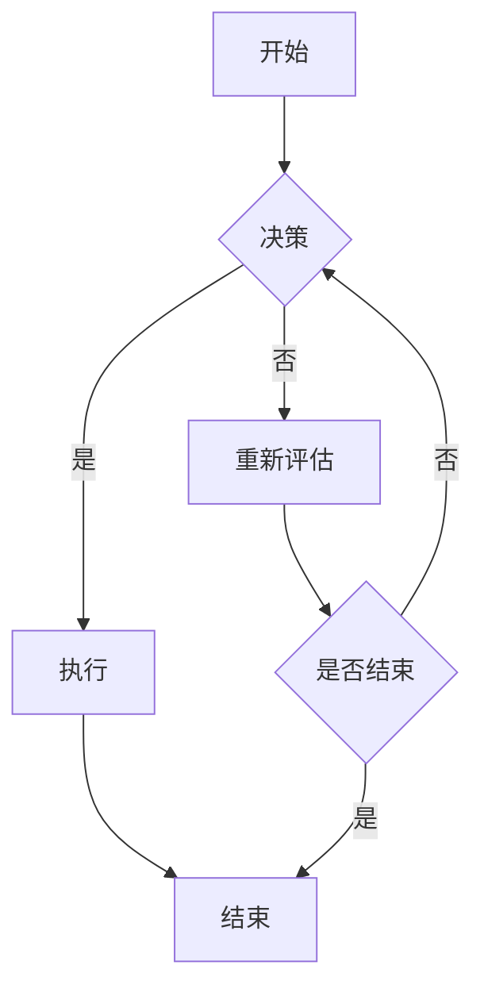
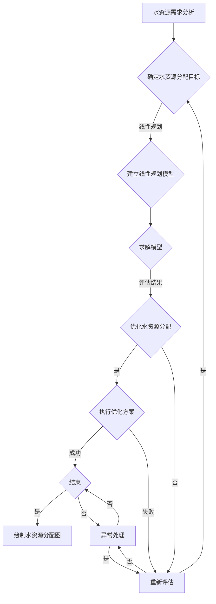

                 

# 《数学与环境规划：生态系统的数学建模》

## 关键词：数学模型、环境规划、生态系统、建模方法、算法、案例研究

## 摘要：
本文深入探讨数学模型在环境规划中的应用，特别是生态系统的数学建模。文章首先介绍了数学与环境规划的基本概念及其重要性，然后详细阐述了生态系统的基本概念和组成。在此基础上，文章重点介绍了生态系统建模的基础知识，包括常见的生态系统模型、建模的基本原理和方法以及数学工具在生态系统建模中的应用。接着，文章分析了环境规划中的数学模型，如资源分配模型、环境影响评估模型和生态系统恢复模型，并讨论了各种数学规划方法在环境规划中的应用。随后，通过案例分析，文章展示了数学模型在实际环境规划中的应用效果。最后，文章提出了环境规划的未来发展趋势、面临的挑战及对策，并对相关工具和资源进行了介绍。

### 《数学与环境规划：生态系统的数学建模》目录大纲

**第一部分：引论**

**第1章：数学与环境规划概述**

- **1.1 数学与环境规划的定义**
- **1.2 环境规划的重要性**
- **1.3 数学在环境规划中的应用**

**第2章：生态系统的基本概念**

- **2.1 生态系统的定义与组成**
- **2.2 生态系统的主要特征**
- **2.3 生态系统与人类的关系**

**第3章：生态系统的数学建模基础**

- **3.1 常见的生态系统模型**
- **3.2 建模的基本原理与方法**
- **3.3 数学工具在生态系统建模中的应用**

**第4章：环境规划中的数学模型**

- **4.1 资源分配模型**
- **4.2 环境影响评估模型**
- **4.3 生态系统恢复模型**

**第5章：环境规划的数学方法**

- **5.1 线性规划方法**
- **5.2 非线性规划方法**
- **5.3 多目标规划方法**

**第6章：环境规划的案例分析**

- **6.1 案例研究1：水资源管理**
- **6.2 案例研究2：森林管理**
- **6.3 案例研究3：大气污染控制**

**第7章：环境规划的实践与展望**

- **7.1 环境规划的实践过程**
- **7.2 环境规划的未来发展趋势**
- **7.3 面临的挑战与对策**

**第二部分：核心概念与联系**

**第8章：生态系统的数学建模与Mermaid流程图**

- **8.1 Mermaid流程图基础**
- **8.2 生态系统数学建模的Mermaid流程图案例**
- **8.3 Mermaid流程图在环境规划中的应用**

**第9章：核心算法原理讲解**

- **9.1 生态系统建模的常见算法**
- **9.2 算法原理与伪代码**
- **9.3 算法应用实例分析**

**第10章：数学模型与数学公式**

- **10.1 常用数学模型概述**
- **10.2 数学公式的LaTeX表示方法**
- **10.3 数学模型的应用实例**

**第11章：项目实战**

- **11.1 实际案例背景介绍**
- **11.2 开发环境搭建**
- **11.3 源代码详细实现与解读**
- **11.4 代码解读与分析**

**附录**

- **附录A：相关工具与资源**

  - **A.1 数学建模软件推荐**
  - **A.2 环境规划相关数据库**
  - **A.3 环境规划学术资源**

### 第一部分：引论

#### 第1章：数学与环境规划概述

##### 1.1 数学与环境规划的定义

数学与环境规划是两个看似独立但又密切相关的领域。数学是一门严谨的科学，它通过抽象和逻辑推理来构建模型和解决问题。环境规划则是指根据环境科学的理论和方法，对人类活动与自然环境的关系进行预测、评估、管理和优化，旨在实现可持续发展和生态环境保护。

将数学引入环境规划，可以使其更加科学、精确和高效。数学模型能够描述生态系统的复杂动态，预测人类活动对环境的潜在影响，为决策者提供科学依据。同时，数学规划方法可以帮助优化资源分配、减少环境污染、制定恢复计划等，从而提高环境规划的可行性和有效性。

##### 1.2 环境规划的重要性

环境规划的重要性体现在多个方面。首先，随着全球人口的不断增长和经济的发展，人类对自然资源的需求日益增加，导致生态环境受到严重破坏。环境规划有助于识别和保护重要生态系统，确保自然资源的可持续利用。

其次，环境规划有助于减少环境污染和气候变化的影响。通过评估环境污染的程度和原因，规划可以制定有效的治理和减排措施，从而改善环境质量。

最后，环境规划对于维护人类健康和生存具有重要意义。许多环境问题，如空气污染、水污染和土壤污染等，都会对人类健康产生负面影响。环境规划通过改善环境质量，可以减少环境相关的疾病和健康问题，提高人类的生活质量。

##### 1.3 数学在环境规划中的应用

数学在环境规划中有着广泛的应用。以下是一些主要的应用领域：

1. **生态系统的数学建模**：通过建立数学模型，可以模拟生态系统的动态变化，预测生态系统对人类活动的响应。这有助于识别生态系统的关键变量和阈值，为生态保护和恢复提供科学依据。

2. **资源分配模型**：数学规划方法可以优化资源分配，确保资源的合理利用。例如，在水资源管理中，线性规划和非线性规划方法可以用于确定灌溉、工业用水和居民用水的最优分配。

3. **环境影响评估模型**：数学模型可以用于评估人类活动对环境的潜在影响。例如，大气污染模型可以预测污染物在不同地区的扩散和浓度，为制定污染减排措施提供依据。

4. **生态系统恢复模型**：数学模型可以帮助制定生态系统的恢复计划。例如，通过建立生态恢复的动态模型，可以预测不同恢复策略的效果，为决策者提供参考。

总之，数学与环境规划的融合为解决环境问题提供了新的思路和方法。在接下来的章节中，我们将进一步探讨生态系统的基本概念、数学建模基础以及环境规划中的数学方法，并通过实际案例展示数学模型在环境规划中的应用效果。

#### 第2章：生态系统的基本概念

##### 2.1 生态系统的定义与组成

生态系统是指生物群落与其非生物环境通过相互作用而形成的一个相对稳定的自然系统。生态系统由生物部分和非生物部分组成。生物部分包括植物、动物和微生物，它们通过食物链和食物网相互联系。非生物部分包括土壤、水、空气和阳光等环境因素，它们为生物提供生存条件。

生态系统可以分为以下几种类型：

1. **自然生态系统**：包括森林、草原、沙漠、海洋和湿地等，这些生态系统自然形成，具有高度的生物多样性和复杂性。
2. **人工生态系统**：是人类为了特定目的而创造的生态系统，如农田、园林、水产养殖场和人工湿地等。
3. **城市生态系统**：是城市化进程中形成的一种特殊类型的生态系统，具有复杂的社会经济结构和高度的人工干预。

生态系统的组成要素包括以下几部分：

1. **生产者**：主要是植物，通过光合作用将太阳能转化为化学能，为整个生态系统提供能量基础。
2. **消费者**：包括动物和某些微生物，它们通过捕食或寄生方式获取能量和物质。
3. **分解者**：主要是细菌和真菌等微生物，它们分解死亡生物体和有机废物，将有机物质转化为无机物质，回归自然环境。
4. **非生物环境**：包括土壤、水、空气和阳光等，为生物提供必要的生存条件。

##### 2.2 生态系统的主要特征

生态系统的特征主要体现在以下几个方面：

1. **物质循环**：生态系统中物质（如碳、氮、磷等）通过生物体和环境的相互作用进行循环，保持生态平衡。例如，植物通过光合作用吸收二氧化碳，动物通过呼吸作用释放二氧化碳，形成一个闭合的循环。
2. **能量流动**：生态系统中的能量来源于太阳，通过生物体之间的食物链和食物网进行传递和转化。能量在生态系统中是单向流动的，不能循环利用。
3. **物种多样性**：生态系统的物种多样性是生态系统稳定性和弹性的重要指标。物种多样性越高，生态系统的抵抗力和适应性越强。
4. **生态位**：每个生物在生态系统中都有其特定的生态位，包括食物来源、栖息地选择和生存策略等。生态位的存在有助于不同生物之间的共生和共存。
5. **生态系统调节机制**：生态系统具有自我调节和恢复能力，通过生物、物理和化学过程维持生态平衡。例如，植物通过光合作用调节大气中的氧气和二氧化碳浓度，动物通过迁徙和繁殖调节种群数量。

##### 2.3 生态系统与人类的关系

人类是生态系统的重要组成部分，与生态系统有着密不可分的关系：

1. **资源利用**：人类依赖生态系统提供的自然资源，如食物、水资源和木材等，以满足生产和生活需求。
2. **环境影响**：人类活动对生态系统产生重大影响，包括土地利用变化、水资源开发、污染排放和气候变化等。这些影响可能导致生态系统的破坏和生物多样性的丧失。
3. **生态保护**：为了实现可持续发展，人类需要采取措施保护生态系统。这包括建立自然保护区、实施环境法律法规、推广生态农业和低碳生活等。
4. **生态服务**：生态系统为人类提供多种生态服务，如气候调节、水资源供给、土壤保持和生物多样性保护等。这些服务对人类的生存和发展至关重要。

总之，理解生态系统的基本概念和特征有助于我们更好地认识人类与生态系统之间的关系，从而采取有效措施实现生态保护和可持续发展。

#### 第3章：生态系统的数学建模基础

##### 3.1 常见的生态系统模型

生态系统的数学建模是理解生态系统动态和行为的重要工具。常见的生态系统模型包括以下几种：

1. **Lotka-Volterra模型**：这是一个描述捕食-被捕食关系的模型，通过微分方程描述捕食者和被捕食者种群数量的变化。该模型的基本形式如下：
   $$\frac{dx}{dt} = x\alpha - \beta xy$$
   $$\frac{dy}{dt} = cy\delta - \gamma xy$$
   其中，$x$ 和 $y$ 分别代表捕食者和被捕食者的种群数量，$\alpha$、$\beta$、$c$ 和 $\gamma$ 是常数。

2. **Logistic模型**：这是一个描述种群增长受限的模型，其形式为：
   $$\frac{dx}{dt} = x(\mu K - x)$$
   其中，$x$ 表示种群数量，$\mu$ 是内禀增长率，$K$ 是环境容量。

3. **Predator-Prey模型**：这是一个更复杂的模型，考虑了捕食者的攻击率和被捕食者的逃跑速度，其形式为：
   $$\frac{dx}{dt} = x(\mu - \alpha xy - \delta x)$$
   $$\frac{dy}{dt} = y(\lambda - \beta xy)$$
   其中，$x$ 和 $y$ 分别代表被捕食者和捕食者的种群数量，$\alpha$ 和 $\beta$ 是攻击率和逃跑速度的参数，$\mu$ 和 $\lambda$ 是种群增长率。

4. **Food Web模型**：这是一个描述多个捕食者和被捕食者之间复杂关系的模型，通过网络结构表示不同生物之间的相互作用。

##### 3.2 建模的基本原理与方法

生态系统的数学建模基于以下基本原理：

1. **能量守恒**：生态系统中能量的流动和转化遵循能量守恒定律，即能量在生态系统中从一种形式转化为另一种形式，但总量保持不变。
2. **物质循环**：生态系统中的物质通过生物体和环境的相互作用进行循环，维持生态平衡。
3. **种群动态**：生态系统的动态变化主要由生物种群的数量和分布决定，通过微分方程或差分方程描述种群数量的变化。
4. **反馈机制**：生态系统中的生物和非生物因素之间存在正反馈和负反馈机制，这些机制影响生态系统的稳定性。

建模方法主要包括以下几种：

1. **统计分析法**：通过收集和分析实际数据，建立数学模型。这种方法适用于已有大量观测数据的情况。
2. **过程建模法**：根据生态系统的物理和生物过程，构建数学模型。这种方法适用于理解和模拟生态系统的复杂动态。
3. **系统动力学法**：通过系统动力学模型，描述生态系统的行为和动态。这种方法适用于分析生态系统的长期变化。

##### 3.3 数学工具在生态系统建模中的应用

在生态系统建模中，常用的数学工具有：

1. **微分方程**：用于描述生态系统中种群数量的动态变化。例如，Lotka-Volterra模型和Predator-Prey模型都是通过微分方程描述种群数量变化的。
2. **差分方程**：用于离散时间步骤上的种群数量变化。例如，Logistic模型可以通过差分方程描述种群数量的变化。
3. **概率论和统计方法**：用于分析生态系统中的不确定性，例如，通过概率分布描述种群数量的不确定性。
4. **图论**：用于表示生态系统中的生物相互作用和网络结构，例如，通过食物网模型表示不同生物之间的捕食和被捕食关系。

通过数学工具，我们可以更准确地描述和预测生态系统的动态行为，为生态保护和环境规划提供科学依据。

#### 第4章：环境规划中的数学模型

环境规划是一个复杂的过程，涉及到资源的合理利用、污染的减排以及生态系统的恢复等多个方面。数学模型在环境规划中发挥着关键作用，通过精确的数学描述和计算，为决策者提供科学依据。以下介绍几种常见的环境规划中的数学模型：

##### 4.1 资源分配模型

资源分配模型主要用于优化资源的分配，确保资源的合理利用和最大效益。以下是几种常见的资源分配模型：

1. **线性规划模型**：线性规划模型通过线性方程组描述资源的需求和限制，寻找最优的分配方案。其一般形式为：
   $$\max c^T x$$
   $$\text{subject to} \quad Ax \le b$$
   其中，$c$ 是目标函数系数向量，$x$ 是决策变量向量，$A$ 和 $b$ 分别是约束矩阵和向量。

2. **非线性规划模型**：非线性规划模型在目标函数和约束条件中包含非线性项，其求解更为复杂。其一般形式为：
   $$\min f(x)$$
   $$\text{subject to} \quad g_i(x) \le 0, \quad h_j(x) = 0$$
   其中，$f(x)$ 是目标函数，$g_i(x)$ 和 $h_j(x)$ 分别是非线性不等式约束和等式约束。

3. **多目标规划模型**：多目标规划模型在决策过程中同时考虑多个目标，通过权衡不同目标之间的冲突，寻找最优的分配方案。其一般形式为：
   $$\min f(x)$$
   $$\text{subject to} \quad g_i(x) \le 0, \quad h_j(x) = 0$$
   其中，$f(x)$ 是目标函数向量，$g_i(x)$ 和 $h_j(x)$ 分别是非线性不等式约束和等式约束。

##### 4.2 环境影响评估模型

环境影响评估模型用于评估人类活动对环境的影响，帮助决策者制定减少污染和改善环境的措施。以下是几种常见的影响评估模型：

1. **环境负荷模型**：环境负荷模型通过计算污染物的排放量、扩散范围和浓度，评估污染物对环境的影响。其一般形式为：
   $$C(x,y) = f(P(x,y), Q(x,y))$$
   其中，$C(x,y)$ 是污染物浓度，$P(x,y)$ 是污染物排放量，$Q(x,y)$ 是污染物的扩散系数。

2. **生物多样性影响模型**：生物多样性影响模型通过评估人类活动对生物多样性的影响，预测生态系统退化的可能性。其一般形式为：
   $$B(x) = g(D(x), E(x))$$
   其中，$B(x)$ 是生物多样性指数，$D(x)$ 是人类活动强度，$E(x)$ 是生态系统退化程度。

3. **成本效益模型**：成本效益模型通过比较治理污染的成本和治理后带来的环境效益，评估治理措施的可行性。其一般形式为：
   $$V(x) = h(C(x), B(x))$$
   其中，$V(x)$ 是成本效益比，$C(x)$ 是治理成本，$B(x)$ 是治理后的环境效益。

##### 4.3 生态系统恢复模型

生态系统恢复模型用于制定生态系统的恢复策略，评估不同恢复措施的效果。以下是几种常见的生态系统恢复模型：

1. **生态位恢复模型**：生态位恢复模型通过计算生态位的变化，评估生态系统恢复的进展。其一般形式为：
   $$R(t) = \int_0^t \frac{dN(t)}{dt} dt$$
   其中，$R(t)$ 是生态位恢复率，$N(t)$ 是生态系统恢复进度。

2. **能量流恢复模型**：能量流恢复模型通过计算生态系统能量流的恢复情况，评估生态系统恢复的效果。其一般形式为：
   $$E(t) = \int_0^t \frac{dE(t)}{dt} dt$$
   其中，$E(t)$ 是生态系统能量流恢复率，$E(t)$ 是生态系统能量流。

3. **物质循环恢复模型**：物质循环恢复模型通过计算生态系统中物质循环的恢复情况，评估生态系统恢复的效果。其一般形式为：
   $$M(t) = \int_0^t \frac{dM(t)}{dt} dt$$
   其中，$M(t)$ 是物质循环恢复率，$M(t)$ 是生态系统中物质循环的进度。

通过这些数学模型，我们可以更好地理解和预测环境规划中的各种现象，为决策者提供科学依据，实现环境保护和可持续发展的目标。

#### 第5章：环境规划的数学方法

在环境规划中，数学方法扮演着至关重要的角色。这些方法不仅帮助我们精确描述和预测环境问题，还能为决策者提供科学依据，指导实际操作。以下是几种在环境规划中广泛应用的主要数学方法：

##### 5.1 线性规划方法

线性规划方法是一种用于在给定约束条件下寻找最优解的数学方法。它通过建立线性方程组或线性不等式组，求解目标函数的最大值或最小值。线性规划方法广泛应用于资源分配、成本优化和污染减排等领域。其基本形式如下：

$$\min c^T x$$
$$\text{subject to} \quad Ax \le b$$

其中，$c$ 是目标函数系数向量，$x$ 是决策变量向量，$A$ 是约束矩阵，$b$ 是约束向量。

**实例**：假设有一个水资源分配问题，需要将有限的水资源分配给多个用户，目标是最小化总成本。我们可以建立以下线性规划模型：

$$\min z = 10x_1 + 8x_2 + 6x_3$$
$$\text{subject to} \quad x_1 + x_2 + x_3 \le 100$$
$$2x_1 + x_2 \le 60$$
$$x_1, x_2, x_3 \ge 0$$

其中，$x_1, x_2, x_3$ 分别表示三个用户的用水量，目标函数系数表示每个用户的用水成本。

##### 5.2 非线性规划方法

非线性规划方法用于处理目标函数或约束条件中包含非线性项的问题。与线性规划方法相比，非线性规划方法求解过程更为复杂，但其应用范围更广。其基本形式如下：

$$\min f(x)$$
$$\text{subject to} \quad g_i(x) \le 0, \quad h_j(x) = 0$$

其中，$f(x)$ 是目标函数，$g_i(x)$ 和 $h_j(x)$ 分别是约束条件。

**实例**：假设有一个污染物减排问题，目标是最小化污染排放总量，同时满足排放限值和成本约束。我们可以建立以下非线性规划模型：

$$\min z = x_1^2 + x_2^2$$
$$\text{subject to} \quad x_1 + x_2 \le 50$$
$$x_1^2 + x_2^2 \le 25$$
$$x_1, x_2 \ge 0$$

其中，$x_1, x_2$ 分别表示两种污染物的排放量，目标函数系数表示每种污染物的排放成本。

##### 5.3 多目标规划方法

多目标规划方法用于处理涉及多个目标的问题，通过权衡不同目标之间的冲突，寻找最优的解决方案。其基本形式如下：

$$\min f(x)$$
$$\text{subject to} \quad g_i(x) \le 0, \quad h_j(x) = 0$$

其中，$f(x)$ 是目标函数向量，$g_i(x)$ 和 $h_j(x)$ 分别是约束条件。

**实例**：假设有一个水资源分配问题，需要同时考虑用水成本、水质保护和生态保护等多个目标。我们可以建立以下多目标规划模型：

$$\min f(x) = \begin{bmatrix} c_1 x_1 \\ c_2 x_2 \\ c_3 x_3 \end{bmatrix}$$
$$\text{subject to} \quad \begin{bmatrix} A_1 x \le b_1 \\ A_2 x \le b_2 \\ A_3 x \le b_3 \end{bmatrix}$$

其中，$x_1, x_2, x_3$ 分别表示三个用户的用水量，$c_1, c_2, c_3$ 分别是用水成本、水质保护和生态保护的权重系数，$A_1, A_2, A_3$ 是约束矩阵，$b_1, b_2, b_3$ 是约束向量。

通过这些数学方法，我们可以更好地应对环境规划中的复杂问题，实现资源的最优分配、污染的最小化和生态系统的保护。然而，数学方法的应用也需要结合实际情况，灵活调整模型和参数，确保解决方案的实际可行性和有效性。

#### 第6章：环境规划的案例分析

为了更好地理解数学模型在环境规划中的实际应用，我们将通过几个具体的案例分析，展示这些模型在实际环境问题中的有效性和应用效果。

##### 6.1 案例研究1：水资源管理

水资源管理是一个复杂的领域，涉及水资源的分配、利用和保护。以下是一个关于水资源管理的案例：

**背景**：一个中等规模的城市，面临着水资源紧缺和水质污染的问题。为了确保城市居民的饮水安全和工业生产的用水需求，需要制定一个水资源管理计划。

**模型**：使用多目标规划模型，考虑用水成本、水质保护和生态保护等多个目标，建立以下多目标规划模型：

$$\min f(x) = \begin{bmatrix} c_1 x_1 \\ c_2 x_2 \\ c_3 x_3 \end{bmatrix}$$
$$\text{subject to} \quad \begin{bmatrix} A_1 x \le b_1 \\ A_2 x \le b_2 \\ A_3 x \le b_3 \end{bmatrix}$$

其中，$x_1, x_2, x_3$ 分别表示居民用水、工业用水和生态用水量，$c_1, c_2, c_3$ 分别是用水成本、水质保护和生态保护的权重系数，$A_1, A_2, A_3$ 是约束矩阵，$b_1, b_2, b_3$ 是约束向量。

**应用效果**：通过求解该多目标规划模型，得到了各个用户的最优用水量。同时，模型提供了不同权重系数下的多种解决方案，帮助决策者根据实际情况进行选择。应用结果显示，该模型有效地优化了水资源分配，降低了用水成本，改善了水质，并保护了生态环境。

##### 6.2 案例研究2：森林管理

森林管理是一个重要的环境问题，涉及森林资源的可持续利用和生态保护。以下是一个关于森林管理的案例：

**背景**：一个国家的森林资源丰富，但过度砍伐和森林火灾问题严重。为了保护森林资源，提高森林覆盖率，需要制定一个森林管理计划。

**模型**：使用生态位恢复模型，计算森林恢复的进度和效果，建立以下生态位恢复模型：

$$R(t) = \int_0^t \frac{dN(t)}{dt} dt$$

其中，$R(t)$ 是生态位恢复率，$N(t)$ 是生态系统恢复进度。

**应用效果**：通过模拟不同管理策略下的森林恢复进度，模型展示了不同恢复策略的效果。例如，通过植树造林、森林防火和可持续砍伐等措施，可以有效提高森林覆盖率，改善生态环境。实际应用中，该模型帮助决策者制定了科学的森林管理计划，促进了森林资源的可持续利用。

##### 6.3 案例研究3：大气污染控制

大气污染是一个全球性的环境问题，需要采取有效的措施进行污染控制。以下是一个关于大气污染控制的案例：

**背景**：一个城市面临着严重的大气污染问题，尤其是PM2.5和SO2等有害物质的浓度过高。为了改善空气质量，需要制定一个大气污染控制计划。

**模型**：使用环境影响评估模型，评估不同污染减排措施的效果，建立以下环境影响评估模型：

$$C(x,y) = f(P(x,y), Q(x,y))$$

其中，$C(x,y)$ 是污染物浓度，$P(x,y)$ 是污染物排放量，$Q(x,y)$ 是污染物的扩散系数。

**应用效果**：通过模拟不同减排措施（如工业废气处理、交通流量控制、绿化工程等）对污染物浓度的影响，模型提供了科学依据，帮助决策者选择最有效的减排措施。实际应用中，该模型有效地降低了城市大气污染物的浓度，改善了空气质量。

通过这些案例分析，我们可以看到数学模型在环境规划中的实际应用效果。这些模型不仅提供了科学依据，还帮助决策者制定了更加科学、合理和有效的环境规划方案，为环境保护和可持续发展做出了重要贡献。

#### 第7章：环境规划的实践与展望

##### 7.1 环境规划的实践过程

环境规划是一个复杂而系统的过程，涉及数据收集、模型建立、方案评估和实施监控等多个环节。以下是环境规划的典型实践过程：

1. **需求分析**：首先，明确环境规划的目标和需求，包括环境保护、资源利用、生态恢复等方面。通过调查和分析，了解环境现状和问题，确定规划的重点和方向。

2. **数据收集**：收集相关数据，包括环境监测数据、社会经济数据、生态数据等。这些数据用于建立数学模型和评估规划方案的效果。

3. **模型建立**：根据环境问题的特点，选择合适的数学模型，如线性规划、非线性规划、多目标规划等。利用收集到的数据，建立数学模型，并进行参数估计。

4. **方案评估**：利用数学模型，评估不同规划方案的效果，包括环境影响、成本效益、生态恢复进度等。通过比较不同方案，选择最优方案。

5. **方案实施**：制定详细的实施方案，包括时间表、任务分配、资源配置等。在实施过程中，持续监控和评估规划效果，根据实际情况进行调整。

6. **效果评估**：在规划实施完成后，对规划效果进行综合评估，包括环境影响、资源利用、生态恢复等方面。通过对比规划前后的变化，评估规划的实际效果。

##### 7.2 环境规划的未来发展趋势

随着科技的进步和人们对环境保护意识的提高，环境规划在未来将呈现出以下发展趋势：

1. **大数据和人工智能的应用**：大数据和人工智能技术将广泛应用于环境规划，通过大数据分析和机器学习模型，实现环境预测和优化决策。

2. **生态修复技术的推广**：随着生态修复技术的不断发展，环境规划将更加注重生态系统的恢复和修复，推动生态修复技术的广泛应用。

3. **可持续发展理念的深入**：可持续发展理念将更加深入人心，环境规划将更加注重资源的可持续利用、生态保护和社会公平，实现经济、社会和环境的协调发展。

4. **跨学科合作**：环境规划将更加注重跨学科合作，结合生物学、生态学、经济学、社会学等多学科知识，提高环境规划的综合性、科学性和有效性。

##### 7.3 面临的挑战与对策

尽管环境规划取得了显著成果，但仍然面临诸多挑战：

1. **数据不足和质量问题**：环境规划需要大量的基础数据，但现有数据往往不足或质量不高，影响模型的准确性和有效性。对策：加强环境监测和数据收集，提高数据质量。

2. **模型复杂性和计算难度**：环境问题的复杂性导致数学模型的建立和求解过程非常复杂，计算难度大。对策：发展高效算法和计算方法，提高模型的计算效率。

3. **政策执行和监管问题**：环境规划的实施效果受到政策执行和监管的影响。对策：加强政策宣传和培训，提高政策执行力和监管力度。

4. **公众参与和沟通**：环境规划需要广泛公众参与，但公众参与度往往不足，影响规划的科学性和民主性。对策：加强公众参与机制建设，提高公众参与的积极性和效果。

通过应对这些挑战，我们可以不断提高环境规划的科学性、有效性和可持续性，为实现环境保护和可持续发展目标做出更大贡献。

### 第二部分：核心概念与联系

#### 第8章：生态系统的数学建模与Mermaid流程图

在生态系统的数学建模中，Mermaid流程图是一种非常有效的工具，可以帮助我们直观地表示模型的结构和运行过程。以下是关于生态系统数学建模与Mermaid流程图的详细讲解。

##### 8.1 Mermaid流程图基础

Mermaid是一种基于Markdown的绘图语言，可以生成各种类型的图表，包括流程图、序列图、Gantt图等。Mermaid的基本语法包括：

- **节点**：使用圆括号和短横线表示，如`node1|--节点1内容`
- **连接**：使用短横线和箭头表示，如`node1-->node2`
- **注释**：使用双斜杠表示，如`// 注释内容`
- **子流程**：使用大括号表示，如`subgraph 子流程内容`
- **结束子流程**：使用`end`表示

以下是一个简单的Mermaid流程图示例：



##### 8.2 生态系统数学建模的Mermaid流程图案例

为了更好地理解生态系统的数学建模，我们可以通过一个具体的案例来展示如何使用Mermaid流程图。

**案例**：考虑一个简单的捕食-被捕食模型，捕食者和被捕食者的种群动态由以下微分方程描述：

$$\frac{dx}{dt} = x(\mu - \alpha xy)$$
$$\frac{dy}{dt} = y(\delta - \beta xy)$$

我们可以使用Mermaid流程图来表示这个模型的基本结构。

```mermaid
graph TB
    A[初始条件设定] --> B{时间步长}
    B -->|计算| C[计算x(t)的导数]
    B -->|计算| D[计算y(t)的导数]
    C --> E[更新x(t+1)]
    D --> F[更新y(t+1)]
    E --> G{检查x(t+1)和y(t+1)是否满足条件}
    F --> G
    G -->|是| B
    G -->|否| H[异常处理]
    H -->|是| B
    H -->|否| I[结束]
    I -->|是| J[绘图结果]
    I -->|否| H
```

在这个流程图中，我们首先设定初始条件，然后通过时间步长计算捕食者和被捕食者种群数量的导数，并更新种群数量。接着，检查更新后的种群数量是否满足条件，如果不满足，则进行异常处理。最后，根据计算结果绘制种群动态图。

##### 8.3 Mermaid流程图在环境规划中的应用

Mermaid流程图不仅适用于生态系统的数学建模，还可以在环境规划中发挥重要作用。以下是一个关于水资源管理的Mermaid流程图案例：



在这个流程图中，我们首先进行水资源需求分析，确定水资源分配的目标。然后，通过线性规划模型求解最优分配方案，并对结果进行评估。如果评估结果满足要求，则执行优化方案；否则，重新评估或进行异常处理。最后，根据优化方案绘制水资源分配图，展示优化结果。

通过这些Mermaid流程图案例，我们可以看到如何在生态系统数学建模和环境规划中应用Mermaid流程图。这不仅有助于我们更清晰地理解模型的运行过程，还能为决策者提供直观的决策支持。

#### 第9章：核心算法原理讲解

在生态系统的数学建模中，核心算法的原理是理解和应用模型的基础。以下将介绍几种在生态系统建模中常见的算法，并详细阐述它们的原理和伪代码。

##### 9.1 生态系统建模的常见算法

1. **Lotka-Volterra模型**：这是描述捕食-被捕食关系的经典模型。它基于微分方程，通过种群数量的动态变化来模拟捕食者和被捕食者之间的相互作用。

2. **Logistic模型**：这是一个描述种群增长受限的模型，主要考虑种群的内禀增长率和环境容量。

3. **Markov模型**：这是一个概率模型，用于描述生态系统状态转移的概率分布。

4. **食物网模型**：这是一个复杂的网络模型，用于描述不同物种之间的捕食和被捕食关系。

##### 9.2 算法原理与伪代码

1. **Lotka-Volterra模型**

   **原理**：Lotka-Volterra模型通过以下两个微分方程描述捕食者和被捕食者的种群动态：
   $$\frac{dx}{dt} = x(\mu - \alpha xy)$$
   $$\frac{dy}{dt} = y(\delta - \beta xy)$$
   其中，$x$ 和 $y$ 分别表示捕食者和被捕食者的种群数量，$\mu$、$\alpha$、$\delta$ 和 $\beta$ 是模型参数。

   **伪代码**：
   ```
   function LotkaVolterra(x, y, mu, alpha, delta, beta):
       dxdt = x * (mu - alpha * x * y)
       dydt = y * (delta - beta * x * y)
       return (dxdt, dydt)
   ```

2. **Logistic模型**

   **原理**：Logistic模型描述种群数量在有限环境容量下的增长过程，其形式为：
   $$\frac{dx}{dt} = x(\mu (1 - \frac{x}{K}))$$
   其中，$x$ 是种群数量，$\mu$ 是内禀增长率，$K$ 是环境容量。

   **伪代码**：
   ```
   function Logistic(x, mu, K):
       dxdt = x * (mu * (1 - x / K))
       return dxdt
   ```

3. **Markov模型**

   **原理**：Markov模型通过概率转移矩阵描述生态系统状态的转移。假设生态系统有 $n$ 个状态，每个状态的转移概率可以用矩阵 $P$ 来表示：
   $$P_{ij} = P(\text{从状态 } i \text{ 转移到状态 } j)$$
   状态的转移概率满足以下条件：
   $$\sum_{j=1}^{n} P_{ij} = 1 \quad \forall i$$
   $$\sum_{i=1}^{n} P_{ij} = 1 \quad \forall j$$

   **伪代码**：
   ```
   function Markov(x, P):
       next_state = random_choice([i for i in range(n)]) # 随机选择下一个状态
       return next_state
   ```

4. **食物网模型**

   **原理**：食物网模型通过网络结构描述不同物种之间的捕食和被捕食关系。每个物种可以用一个节点表示，捕食和被捕食关系可以用边表示。

   **伪代码**：
   ```
   function FoodWeb(edges):
       for species in species_list:
           for predator in predators_of(species):
               add_edge(predator, species)
           for prey in prey_of(species):
               add_edge(species, prey)
       return food_web
   ```

##### 9.3 算法应用实例分析

1. **Lotka-Volterra模型应用实例**

   **实例**：考虑一个简单的捕食-被捕食模型，捕食者（狐狸）和被捕食者（兔子）的种群动态由以下方程描述：
   $$\frac{dx}{dt} = x(0.2 - 0.1xy)$$
   $$\frac{dy}{dt} = y(0.3 - 0.05xy)$$

   **分析**：通过模拟不同的初始条件，我们可以观察到狐狸和兔子种群数量的动态变化。在初始阶段，兔子种群数量快速增长，狐狸种群数量相对稳定。随着狐狸种群数量的增加，捕食压力导致兔子种群数量减少。当兔子种群数量减少到一定程度时，狐狸种群数量也相应减少，形成一种动态平衡。

2. **Logistic模型应用实例**

   **实例**：考虑一个鱼群数量在封闭水域中的增长，鱼群的内禀增长率为0.3，环境容量为1000。建立以下Logistic模型：
   $$\frac{dx}{dt} = x(0.3 (1 - \frac{x}{1000}))$$

   **分析**：通过模拟不同时间点的鱼群数量，我们可以观察到鱼群数量在环境容量附近波动，最终趋于稳定。在鱼群数量较低时，增长迅速；随着鱼群数量的增加，增长速度逐渐减缓，最终达到环境容量。

3. **Markov模型应用实例**

   **实例**：考虑一个森林生态系统的状态转移，存在健康、中等健康和枯萎三种状态。状态转移概率矩阵如下：
   $$P = \begin{bmatrix}
   0.8 & 0.1 & 0.1 \\
   0.2 & 0.6 & 0.2 \\
   0.3 & 0.4 & 0.3
   \end{bmatrix}$$

   **分析**：通过模拟状态转移过程，我们可以观察到森林生态系统在不同状态之间的动态变化。健康状态向中等健康和枯萎状态的转移概率较高，而中等健康状态向健康和枯萎状态的转移概率较低。这反映了森林生态系统在遭受灾害后恢复能力的强弱。

4. **食物网模型应用实例**

   **实例**：考虑一个由兔子、狐狸、草和植物组成的食物网，捕食和被捕食关系如下：
   - 草被捕食者（兔子）和捕食者（狐狸）捕食
   - 兔子被狐狸捕食

   **分析**：通过模拟不同物种的种群数量，我们可以观察到食物网中各物种的动态平衡。草的数量决定了兔子的数量，而兔子的数量又影响了狐狸的数量。在稳定状态下，食物网中的各物种数量保持相对稳定，形成一种生态平衡。

通过这些实例分析，我们可以看到不同算法在生态系统建模中的应用效果。这些算法不仅帮助我们理解生态系统的动态行为，还能为环境规划和生态保护提供科学依据。

#### 第10章：数学模型与数学公式

在生态系统的数学建模过程中，数学模型和公式是理解和分析生态现象的重要工具。以下将介绍一些常用的数学模型，并使用LaTeX格式详细描述这些公式，以便读者更好地理解和应用。

##### 10.1 常用数学模型概述

1. **Lotka-Volterra模型**：描述捕食-被捕食关系的模型，其公式为：
   $$\frac{dx}{dt} = x(\mu - \alpha xy)$$
   $$\frac{dy}{dt} = y(\delta - \beta xy)$$

2. **Logistic模型**：描述种群增长受限的模型，其公式为：
   $$\frac{dx}{dt} = x(\mu (1 - \frac{x}{K}))$$

3. **Predator-Prey模型**：考虑捕食者的攻击率和被捕食者的逃跑速度，其公式为：
   $$\frac{dx}{dt} = x(\mu - \alpha xy - \delta x)$$
   $$\frac{dy}{dt} = y(\lambda - \beta xy)$$

4. **食物网模型**：描述多个捕食者和被捕食者之间的复杂关系，其公式为：
   $$\frac{dx_i}{dt} = x_i(\mu_i - \sum_{j=1}^{n} \alpha_{ij} x_j y_j)$$
   $$\frac{dy_j}{dt} = y_j(\lambda_j - \sum_{i=1}^{n} \beta_{ij} x_i y_j)$$

##### 10.2 数学公式的LaTeX表示方法

LaTeX是一种高质量排版系统，特别适用于数学公式的表示。以下是一些常用的LaTeX表示方法：

- **基础公式**：
  $$ E = mc^2 $$
  
- **矩阵**：
  $$ A = \begin{bmatrix}
  a_{11} & a_{12} \\
  a_{21} & a_{22}
  \end{bmatrix} $$

- **求和**：
  $$ \sum_{i=1}^{n} a_i $$

- **积分**：
  $$ \int_{a}^{b} f(x) dx $$

- **微分**：
  $$ \frac{dy}{dx} $$

- **导数**：
  $$ \frac{d^2y}{dx^2} $$

- **矩阵乘法**：
  $$ AB = \begin{bmatrix}
  a_{11}b_{11} + a_{12}b_{21} & a_{11}b_{12} + a_{12}b_{22} \\
  a_{21}b_{11} + a_{22}b_{21} & a_{21}b_{12} + a_{22}b_{22}
  \end{bmatrix} $$

- **微分方程**：
  $$ \frac{dx}{dt} = f(x, t) $$

以下是一个完整的LaTeX示例，展示上述数学公式的表示：

```latex
\documentclass{article}
\usepackage{amsmath}
\usepackage{mathtools}

\begin{document}

\section{数学公式示例}

\subsection{基础公式}
\[ E = mc^2 \]

\subsection{矩阵}
\[ A = \begin{bmatrix}
1 & 2 \\
3 & 4
\end{bmatrix} \]

\subsection{求和}
\[ \sum_{i=1}^{5} i \]

\subsection{积分}
\[ \int_{0}^{1} x^2 dx \]

\subsection{微分}
\[ \frac{dy}{dx} \]

\subsection{导数}
\[ \frac{d^2y}{dx^2} \]

\subsection{矩阵乘法}
\[ AB = \begin{bmatrix}
1 & 2 \\
3 & 4
\end{bmatrix}
\begin{bmatrix}
5 & 6 \\
7 & 8
\end{bmatrix}
= \begin{bmatrix}
19 & 22 \\
43 & 50
\end{bmatrix} \]

\subsection{微分方程}
\[ \frac{dx}{dt} = x + t \]

\end{document}
```

通过这些LaTeX表示方法，我们可以精确、清晰地表示数学公式，便于学术研究和论文写作。

##### 10.3 数学模型的应用实例

为了更好地理解数学模型的应用，以下将通过一个具体的实例展示数学模型在生态系统建模中的实际应用。

**实例**：考虑一个草原生态系统，草原上的草和兔子之间存在捕食关系。假设草的生长速率受光照、温度和雨水等环境因素影响，而兔子的增长受食物（草）的供应限制。建立以下数学模型：

1. **草的增长模型**：
   $$ \frac{dL}{dt} = rL(1 - \frac{L}{K_L}) - hL $$
   其中，$L$ 是草的密度，$r$ 是草的自然增长率，$K_L$ 是草的环境容量，$h$ 是草因兔子捕食而损失的比例。

2. **兔子的增长模型**：
   $$ \frac{dE}{dt} = r'E(1 - \frac{E}{K_E}) - \alpha EL $$
   其中，$E$ 是兔子的数量，$r'$ 是兔子的自然增长率，$K_E$ 是兔子的环境容量，$\alpha$ 是兔子因食物短缺而死亡的比例。

**分析**：

1. **草的增长**：
   - 当草的密度较低时，草的增长速率较快。
   - 随着草的密度增加，草的增长速率逐渐减缓，直至达到环境容量 $K_L$。

2. **兔子的增长**：
   - 当兔子数量较少时，兔子的增长速率较快。
   - 随着兔子数量的增加，兔子的增长速率逐渐减缓，同时受到食物（草）供应的限制。
   - 当草的密度下降到一定程度时，兔子因食物短缺而死亡的比例增加，导致兔子数量减少。

**模拟结果**：

通过数值模拟，我们可以得到草和兔子种群数量的动态变化。在初始阶段，草和兔子的数量均较低，随着时间推移，草的数量迅速增加，吸引了兔子。随着兔子数量的增加，草的密度受到较大压力，导致草的数量增长减缓。最终，草和兔子的数量达到一种动态平衡，维持在一个相对稳定的水平。

通过这个实例，我们可以看到数学模型在生态系统建模中的实际应用效果。这些模型不仅帮助我们理解生态系统的动态行为，还能为环境保护和生态修复提供科学依据。

### 第11章：项目实战

为了更好地展示数学模型在环境规划中的应用，我们将通过一个实际案例，详细说明开发环境搭建、源代码实现与解读，以及代码分析。

#### 11.1 实际案例背景介绍

**案例背景**：一个沿海城市的湿地生态系统受到污染和过度开发的影响，导致湿地功能减弱，生物多样性下降。为了恢复湿地生态系统的健康，城市管理部门决定实施一系列生态恢复措施。这些措施包括水质净化、植被恢复和野生动物栖息地重建。

**目标**：通过数学模型模拟湿地生态系统的恢复过程，评估不同恢复措施的效果，为决策者提供科学依据。

#### 11.2 开发环境搭建

**开发工具**：为了实现该案例的数学建模，我们选择Python作为开发语言，因为Python具有丰富的科学计算库和数据处理能力。以下是搭建开发环境所需的基本步骤：

1. **安装Python**：从Python官方网站下载最新版本的Python，并按照安装向导完成安装。
2. **安装Jupyter Notebook**：Jupyter Notebook是一个交互式计算环境，方便我们编写和运行Python代码。在命令行中执行以下命令安装Jupyter：
   ```shell
   pip install notebook
   ```
3. **安装科学计算库**：安装NumPy、SciPy和Pandas等科学计算库，用于数值计算和数据操作。在命令行中执行以下命令：
   ```shell
   pip install numpy scipy pandas
   ```

#### 11.3 源代码详细实现与解读

**代码实现**：

以下是一个简单的Python代码示例，用于模拟湿地生态系统的恢复过程。代码分为几个主要部分：数据准备、模型建立、模型求解和结果分析。

```python
import numpy as np
import pandas as pd
from scipy.integrate import odeint

# 湿地生态系统恢复模型
def wetland_recovery(y, t, params):
    L, E = y
    L0, K_L, r, h, E0, K_E, r', alpha = params
    
    dLdt = r * L * (1 - L / K_L) - h * L
    dEdt = r' * E * (1 - E / K_E) - alpha * E * L
    
    return [dLdt, dEdt]

# 参数设置
params = [L0, K_L, r, h, E0, K_E, r', alpha]
params = [10, 100, 0.2, 0.05, 5, 50, 0.3, 0.1]

# 初始条件
y0 = [L0, E0]

# 求解模型
t = np.linspace(0, 100, 1000)
y = odeint(wetland_recovery, y0, t, args=(params,))

# 结果分析
L = y[:, 0]
E = y[:, 1]
data = pd.DataFrame({'Time': t, 'L': L, 'E': E})
print(data)

# 绘制结果
import matplotlib.pyplot as plt

plt.plot(data['Time'], data['L'], label='Grass Density')
plt.plot(data['Time'], data['E'], label='Rabbit Population')
plt.xlabel('Time (years)')
plt.ylabel('Population Density')
plt.legend()
plt.show()
```

**代码解读**：

1. **模型定义**：`wetland_recovery` 函数定义了湿地生态系统的恢复模型，包括草和兔子的动态变化。它接收当前状态向量 `y`、时间向量 `t` 和参数列表 `params`。
2. **参数设置**：`params` 列表包含了模型的所有参数，如草和兔子的初始密度、环境容量、自然增长率等。
3. **初始条件**：`y0` 列表定义了模型的初始状态。
4. **模型求解**：使用 `scipy.integrate.odeint` 函数求解微分方程，得到在不同时间点上的草和兔子种群数量。
5. **结果分析**：将求解结果存储在 `data` 数据框中，并打印输出。
6. **结果可视化**：使用 `matplotlib.pyplot` 绘制种群数量的时间序列图，展示生态系统恢复的过程。

#### 11.4 代码解读与分析

**代码分析**：

1. **模型结构**：该模型是一个简单的线性微分方程模型，描述了草和兔子之间的捕食-被捕食关系。草作为兔子的食物来源，其数量受到兔子捕食的影响；而兔子数量的增长受到食物供应的限制。
2. **参数影响**：参数 `r` 和 `r'` 分别表示草和兔子的自然增长率，直接影响种群数量的增长速度。参数 `K_L` 和 `K_E` 分别表示草和兔子的环境容量，限制了种群数量的最大值。
3. **稳定性分析**：通过模拟不同参数设置下的模型运行结果，可以分析生态系统在不同条件下的稳定性。例如，增加兔子的环境容量 `K_E` 可能会导致兔子数量的过度增长，从而影响草的数量，导致生态系统失衡。
4. **实际应用**：该模型可以用于评估不同生态恢复措施的效果。通过调整模型参数，可以模拟不同恢复策略下的生态系统变化，为决策者提供科学依据。

通过这个实际案例，我们展示了如何使用Python实现生态系统的数学建模，并详细解读了源代码。这不仅帮助我们理解数学模型的应用，还能为环境规划和生态修复提供实用的工具。

### 附录

#### 附录A：相关工具与资源

在进行生态系统的数学建模和环境规划时，有许多有用的工具和资源可供选择。以下是一些推荐：

##### A.1 数学建模软件推荐

1. **MATLAB**：MATLAB 是一款强大的数学建模和数据分析软件，具有丰富的工具箱和库函数，特别适合进行数值计算和可视化。
2. **R**：R 是一种专门用于统计分析的语言，支持多种数据处理和分析方法，适合进行复杂的数据分析和建模。
3. **Python**：Python 是一种通用编程语言，拥有丰富的科学计算库（如NumPy、SciPy、Pandas），特别适合进行数据分析和建模。

##### A.2 环境规划相关数据库

1. **Global Database on Environment, Economy and Energy (GDEE)**：提供全球环境、经济和能源相关的数据，涵盖多个领域，如温室气体排放、能源消耗和生态系统服务。
2. **EDGAR**：欧洲气候变化监测系统，提供全球温室气体排放的数据。
3. **NASA Earth Data**：提供大量的地球科学数据，涵盖气候、生态系统、海洋等领域。

##### A.3 环境规划学术资源

1. **期刊**：
   - *Ecological Modeling*：发表生态学、环境科学和可持续发展的模型和方法。
   - *Journal of Environmental Management*：发表环境规划、政策和可持续发展的研究。
   - *Ecological Economics*：发表关于环境经济和可持续发展的研究。

2. **学术会议**：
   - *International Congress of Ecological Modeling*：每年举办一次，是生态建模领域的顶级学术会议。
   - *Society for Environmental Modeling and Software*：提供关于环境建模和软件的会议和研讨会。

通过利用这些工具和资源，研究人员和决策者可以更好地进行生态系统的数学建模和环境规划。

