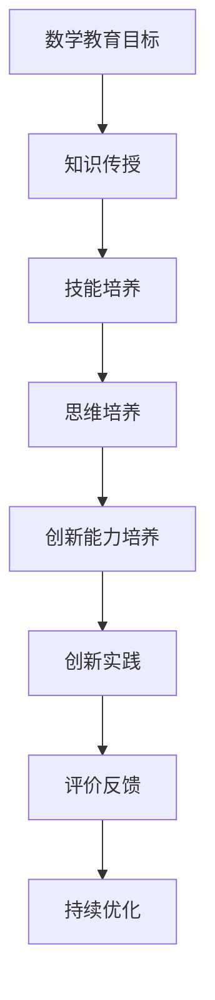
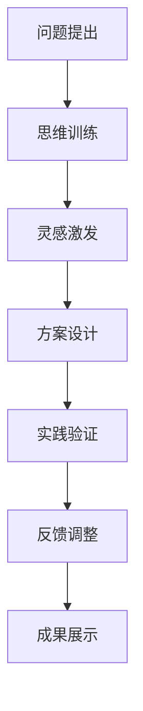
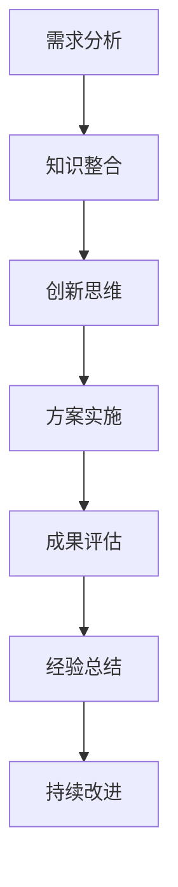

                 

### 引言

在当今这个科技迅猛发展的时代，创新已经成为推动社会进步的重要力量。而创新能力的培养，离不开数学教育的支持。数学教育不仅是传授数学知识的过程，更是培养学生逻辑思维、抽象思维和创新能力的重要途径。本文旨在探讨数学教育与创新人才培养之间的关系，分析数学教育在创新能力培养中的作用和影响。

创新能力的培养是一个复杂而多维的过程，涉及到多个方面的因素。数学教育作为基础学科之一，其教育质量直接关系到学生创新能力的培养。本文将首先介绍数学教育的基本概念和目标，阐述数学思维与创新能力之间的联系。接着，我们将深入分析数学教育对创新思维、创新技能和创新文化的影响，探讨如何通过数学教育培养创新型人才。

此外，本文还将介绍数学教育的课程设计、教学方法以及实证研究，为数学教育在创新能力培养中的应用提供实证依据和指导。最后，我们将对数学教育与创新能力培养的未来展望，提出发展建议和国际经验借鉴。

通过本文的探讨，我们希望读者能够更加深入地理解数学教育与创新人才培养之间的关系，认识到数学教育在创新能力培养中的重要性，为我国创新人才的培养提供有益的启示。

### 关键词

- 数学教育
- 创新能力
- 数学思维
- 课程设计
- 教学方法
- 实证研究
- 未来展望

### 摘要

本文探讨了数学教育与创新人才培养之间的关系，分析了数学教育在创新能力培养中的作用和影响。首先，我们介绍了数学教育的基本概念和目标，阐述了数学思维与创新能力之间的联系。接着，我们深入探讨了数学教育对创新思维、创新技能和创新文化的影响，通过具体的案例和实证研究，验证了数学教育在创新能力培养中的重要性。最后，本文提出了数学教育与创新能力培养的未来展望，为数学教育的改革和创新人才的培养提供了有益的启示。

### 目录大纲

- **第1章**：数学教育的定义与目标
  - **1.1 数学教育的基本要素
  - **1.2 数学教育的目标
  - **1.3 数学教育的现状与挑战

- **第2章**：数学思维与创新能力
  - **2.1 数学思维的核心特征
  - **2.2 数学思维与创新能力的联系
  - **2.3 培养数学思维的方法

- **第3章**：数学教育与创新思维
  - **3.1 创新思维的定义与分类
  - **3.2 数学教育如何培养创新思维
  - **3.3 数学教育中的创新思维案例

- **第4章**：数学教育与创新技能
  - **4.1 创新技能的重要性
  - **4.2 数学教育如何培养创新技能
  - **4.3 数学教育中的创新技能案例

- **第5章**：数学教育与创新文化
  - **5.1 创新文化的概念与特征
  - **5.2 数学教育如何培养创新文化
  - **5.3 数学教育中的创新文化案例

- **第6章**：数学教育的课程设计
  - **6.1 课程设计的原则与方法
  - **6.2 创新元素在数学课程中的应用
  - **6.3 课程设计案例

- **第7章**：数学教育的教学方法
  - **7.1 教学方法的多样性
  - **7.2 创新教学方法的应用
  - **7.3 教学方法案例

- **第8章**：数学教育与创新能力培养的实证研究
  - **8.1 实证研究的意义与方法
  - **8.2 数学教育与创新能力培养的关系
  - **8.3 实证研究案例

- **第9章**：数学教育与创新能力培养的未来展望
  - **9.1 未来数学教育的发展趋势
  - **9.2 创新能力培养的未来挑战与机遇
  - **9.3 未来展望

- **附录**：
  - **附录 A**：数学教育与创新人才培养的资源与工具
  - **附录 B**：数学教育与创新人才培养的Mermaid流程图
  - **附录 C**：数学教育与创新人才培养的核心算法与数学模型
  - **附录 D**：数学教育与创新人才培养的发展建议
  - **附录 E**：数学教育与创新人才培养的国际经验借鉴

---

## 第1章：数学教育的定义与目标

数学教育是一个系统的教育过程，它不仅仅包括对数学知识的传授，还涵盖了数学思维和能力的培养。在现代社会，数学教育的重要性日益凸显，它不仅是培养未来科学家和技术专家的基石，更是提升国民素质、推动社会进步的重要手段。因此，深入理解数学教育的定义、目标及其现状与挑战，对于我们更好地推动数学教育改革，培养具有创新能力的人才具有重要意义。

### 1.1 数学教育的基本要素

首先，我们需要明确数学教育的基本要素。数学教育的基本要素包括数学知识、数学技能、数学思维和教学方法。每一个要素都在数学教育中扮演着不可或缺的角色。

- **数学知识**：数学知识是数学教育的基础。它包括数学的基本概念、原理、法则和公式等。数学知识的学习不仅是为了掌握数学本身，更是为了通过数学的抽象和逻辑性，培养学生的逻辑思维和抽象思维能力。

- **数学技能**：数学技能是指运用数学知识和方法解决问题的能力。这包括计算能力、问题解决能力、应用能力等。数学技能的培养使学生能够在实际问题中灵活运用数学知识，提高解决实际问题的能力。

- **数学思维**：数学思维是数学教育的核心。它包括逻辑思维、抽象思维、空间想象和创新思维等。数学思维的培养有助于学生形成严谨的思维习惯，提高分析和解决问题的能力。

- **教学方法**：教学方法是实现数学教育目标的手段。不同的教学方法能够激发学生的学习兴趣，提高教学效果。现代教育中，教学方法趋向多样化，如讲授法、讨论法、实验法、项目学习法等。

### 1.2 数学教育的目标

数学教育的目标不仅仅是传授数学知识，更重要的是培养学生的数学素养和综合能力。数学教育的目标可以分为以下几个方面：

- **基础素养**：基础素养是指学生掌握数学基础知识和基本技能。这包括理解数学的基本概念和原理，掌握基本的数学运算和解决问题的方法。

- **思维能力**：思维能力是指学生的逻辑思维、批判性思维和创造性思维。这些思维能力是学生分析问题、解决问题的核心能力，是创新能力的基础。

- **应用能力**：应用能力是指学生能够将数学知识应用到实际问题的解决中。这包括解决实际问题、设计解决方案和评估方案的能力。

- **综合素质**：综合素质是指学生在数学学习过程中形成的综合能力，如团队合作、沟通表达、自我管理等。这些能力对于学生的全面发展具有重要意义。

### 1.3 数学教育的现状与挑战

尽管数学教育在培养学生的数学素养和综合能力方面具有重要意义，但在实际教学中仍然存在一些挑战。

- **教育模式**：传统的数学教育模式以知识传授为主，忽视了对学生思维能力和实践能力的培养。这种模式难以激发学生的学习兴趣和主动性，影响了数学教育质量的提升。

- **教育资源**：教育资源的不均衡分布也是一个突出问题。城乡、区域之间的教育资源差距导致学生在数学学习机会和资源上的不平等。

- **教师素质**：教师的专业素质和教学能力直接关系到数学教育质量。目前，一些地区的数学教师专业水平和教学能力有待提高。

- **教育评价**：教育评价体系的科学性和合理性对于数学教育的质量提升至关重要。目前，一些评价方式过于注重知识的掌握，忽视了学生能力的培养。

为了解决这些问题，数学教育需要从教育理念、教学方法、教师素质和教育评价等多方面进行改革和创新。

---

在数学教育的基本要素中，数学知识和数学技能是基础，它们为学生提供了分析和解决问题的工具。数学思维则是数学教育的核心，它不仅仅是对数学知识的理解，更是对学生抽象思维、逻辑思维和创新思维的综合培养。数学思维的发展有助于学生形成严谨的思维方式，提高他们在面对复杂问题时进行分析和解决的能力。

教学方法是实现数学教育目标的手段，它决定了数学教育效果的好坏。传统的教学方法以教师为中心，注重知识的传授，忽视了学生的主体性和主动性。现代教育理念强调以学生为中心，注重培养学生的自主学习能力和实践能力。因此，教学方法的多样性显得尤为重要。

首先，讲授法是数学教育中最常用的教学方法之一。讲授法通过教师的讲解和演示，帮助学生理解数学概念和原理。这种方法有助于学生系统地掌握数学知识，但容易忽视学生的主动参与和思考。

其次，讨论法是一种以学生为中心的教学方法。通过小组讨论和辩论，学生可以相互启发、共同解决问题，培养他们的沟通能力和团队合作精神。讨论法能够激发学生的思维活力，促进他们对数学知识的深入理解和应用。

实验法是另一种重要的教学方法。通过实验，学生可以亲自动手，验证数学理论，发现数学规律。实验法不仅能够培养学生的动手能力和探究精神，还能提高他们的实际应用能力。

项目学习法是一种综合性的教学方法，它将数学知识与实际问题相结合，通过项目的设计和实施，让学生在解决实际问题的过程中运用数学知识和方法。项目学习法有助于培养学生的创新能力和实践能力。

总之，数学教育的基本要素相互关联，共同构成了一个完整的数学教育体系。数学知识和技能为学生提供了工具，数学思维为他们提供了思维方式，而教学方法则为这些要素的实施提供了手段。通过优化教育模式，改善教育资源，提高教师素质和改革教育评价体系，我们可以更好地实现数学教育的目标，培养学生的数学素养和创新能力。

### 第2章：数学思维与创新能力

在数学教育中，数学思维是一种核心能力，它不仅涉及对数学知识的理解，更强调对数学方法和解题技巧的灵活运用。数学思维的核心特征主要包括逻辑性、抽象性、结构性和创造性。这些特征使得数学思维成为培养创新能力的重要基础。

#### 2.1 数学思维的核心特征

- **逻辑性**：数学思维遵循严密的逻辑规则，通过逻辑推理来验证数学命题的正确性。逻辑性要求学生在解决问题时能够从已知条件出发，逐步推导出结论，确保每一步都符合逻辑规则。

- **抽象性**：数学思维能够从具体的事物中抽象出数学概念和关系，形成数学模型。抽象性使学生在面对复杂问题时，能够忽略次要因素，抓住问题的本质，从而简化问题，提高解决问题的效率。

- **结构性**：数学思维注重数学概念和原理之间的层次结构和内在联系。结构性有助于学生在解决问题时，能够把握问题的整体框架，分清主次，从而更有针对性地进行分析和解决。

- **创造性**：数学思维鼓励学生在解决问题时进行创新和发现。创造性思维不仅体现在对新问题的解决方法上，还体现在对已有知识和方法的重新组合和应用中。

#### 2.2 数学思维与创新能力的联系

数学思维与创新能力之间存在着密切的联系。首先，数学思维是创新能力的重要基础。数学思维的逻辑性、抽象性和结构性为学生提供了一种严谨的思维方式，这种思维方式有助于学生在面对复杂问题时，能够迅速准确地进行分析和判断。

其次，数学思维的创造性特征直接促进了创新能力的培养。在数学学习过程中，学生需要不断地提出新的问题、寻找新的解决方案，这种创新性的思维活动有助于培养学生的创造力和创新能力。

此外，数学教育中的问题解决过程本身就是一种创新活动。通过解决实际问题，学生不仅能够将数学知识应用到实际中，还能在这个过程中不断发现新的问题和解决方法，从而提升创新能力。

#### 2.3 培养数学思维的方法

要培养数学思维，需要采取一系列有效的教学方法和策略。以下是一些具体的方法：

- **启发式教学**：通过设置问题情境，引导学生自主探索和思考，激发学生的数学思维。启发式教学能够激发学生的好奇心和求知欲，培养他们的探索精神和创新能力。

- **问题导向学习**：鼓励学生在学习中提出问题，通过自主探究和合作解决问题，培养他们的数学思维。问题导向学习能够提高学生的批判性思维和创造性思维，增强他们的问题解决能力。

- **跨学科学习**：将数学与其他学科相结合，通过跨学科项目，拓宽学生的视野，培养他们的综合能力。跨学科学习能够激发学生的跨学科思维，促进创新能力的培养。

- **数学实验**：通过设计数学实验，让学生在实践操作中感受数学思维的应用，培养他们的实践能力和创新思维。数学实验能够增强学生的动手能力，提高他们的创新能力。

- **思维训练**：通过思维训练游戏和思维导图等工具，锻炼学生的数学思维能力。思维训练能够提高学生的思维敏捷性和逻辑性，有助于创新能力的培养。

总之，数学思维与创新能力之间存在着密切的联系。通过培养数学思维，我们可以有效地提升学生的创新能力。在数学教育中，教师应该注重培养学生的逻辑思维、抽象思维、结构思维和创造性思维，通过多种教学方法和策略，激发学生的数学思维和创新能力。

### 第3章：数学教育与创新思维

创新思维是现代社会中不可或缺的能力，它能够帮助我们在面对复杂问题时提出新颖的解决方案。数学教育在培养创新思维方面扮演着至关重要的角色。通过系统的数学学习和实践，学生可以培养出独特的创新思维，从而在未来的学习和工作中具备更强的竞争力。下面，我们将详细探讨数学教育如何培养创新思维，并分析其中的典型案例。

#### 3.1 创新思维的定义与分类

创新思维是指人们在解决问题时，能够提出新颖的、独特的、有价值的想法和解决方案的思维方式。创新思维不是凭空产生的，而是建立在扎实的知识和经验基础上，通过灵活的思维方式和创造性思维技巧实现的。

根据创新程度，创新思维可以分为以下几类：

- **渐进创新**：在原有基础上进行改进和优化，通过细小的改进逐步提升效果。
- **突破性创新**：颠覆传统观念，提出全新的解决方案，实现革命性的变化。
- **思维跳跃**：通过跳跃性的思维，将看似不相关的概念和知识结合起来，产生新的想法。
- **联想创新**：通过联想和类比，从已知事物中找到新的应用场景或解决方案。

#### 3.2 数学教育如何培养创新思维

数学教育通过多种方式和策略，有效地培养学生的创新思维。以下是一些具体的方法：

- **问题解决**：通过设置复杂的问题，鼓励学生进行深入的思考和探索，培养他们的创新思维。在解决数学问题的过程中，学生需要运用已有的知识和方法，同时也需要提出新的思路和解决方案。

- **项目学习**：通过项目学习，将数学知识应用于实际问题中，培养学生的实践能力和创新思维。项目学习能够让学生在真实情境中感受到数学的应用价值，激发他们的创新欲望。

- **跨学科学习**：结合其他学科的知识，拓宽学生的视野，促进创新思维的培养。跨学科学习能够培养学生的跨学科思维，提高他们综合运用知识解决问题的能力。

- **思维训练**：通过思维训练游戏和思维导图等工具，锻炼学生的思维敏捷性和逻辑性。思维训练能够提高学生的创造性思维和联想能力，有助于创新思维的培养。

- **团队合作**：鼓励学生在团队中合作解决问题，培养他们的团队合作精神和创新思维。团队合作能够激发学生的思维活力，促进创新思维的碰撞和融合。

#### 3.3 数学教育中的创新思维案例

数学教育中存在着许多培养创新思维的典型案例，以下是其中的几个例子：

- **数学探究项目**：在某中学的数学探究项目中，学生们被要求解决一个实际问题：如何设计一个最优化的停车场布局。学生们通过收集数据、分析问题和提出解决方案，最终设计出了一个高效的停车场布局。这个项目不仅培养了学生的数学思维，还激发了他们的创新思维。

- **数学竞赛**：数学竞赛是培养学生创新思维的重要平台。在数学竞赛中，学生们需要解决各种复杂的数学问题，通过反复思考和尝试，提出创新的解决方案。这些竞赛不仅提高了学生的数学水平，还培养了他们的创新思维。

- **数学实验**：通过数学实验，学生可以亲自动手进行数学验证和探索。例如，在数学实验中，学生们可以通过计算机模拟来验证某个数学理论的正确性，或者通过实验来探索某个数学问题的解决方案。这些实验能够激发学生的创新思维，提高他们的实践能力。

- **跨学科项目**：在某大学的跨学科项目中，学生们被要求结合数学和其他学科的知识，设计一个智能交通系统。学生们通过数据分析和数学建模，提出了一系列创新的解决方案，如基于数学优化的交通信号控制和智能导航系统。这个项目不仅培养了学生的数学思维，还提高了他们的跨学科创新能力。

通过这些案例可以看出，数学教育在培养创新思维方面具有显著的优势。通过问题解决、项目学习、跨学科学习和思维训练等方法，数学教育能够有效地激发学生的创新思维，培养他们的创新能力。数学教育不仅仅是传授知识，更是培养学生创新思维的重要途径。

### 第4章：数学教育与创新技能

在现代社会，创新技能已经成为衡量个人和团队竞争力的重要指标。数学教育作为培养学生综合素质的基础学科，在培养创新技能方面具有独特优势。通过数学教育，学生可以掌握解决问题的方法、培养实践能力，并在创新过程中发挥重要作用。以下我们将详细探讨数学教育如何培养创新技能，并分析其中的典型案例。

#### 4.1 创新技能的重要性

创新技能是指在面对复杂问题时，能够提出新颖、有效解决方案的能力。这种能力不仅包括技术层面的创新，还涵盖了管理、沟通、协作等多个方面。创新技能的重要性体现在以下几个方面：

- **提高竞争力**：在市场竞争日益激烈的今天，具备创新技能的个人和团队能够在竞争中脱颖而出，占据优势地位。
- **推动社会发展**：创新技能是推动科技进步和社会发展的重要动力。通过创新，我们可以解决现实问题，提高生产效率，改善生活质量。
- **培养人才素质**：创新技能的培养有助于提升学生的综合素质，包括逻辑思维、批判性思维、创造性思维等，为学生的全面发展奠定基础。

#### 4.2 数学教育如何培养创新技能

数学教育通过多种途径和策略，有效地培养学生的创新技能。以下是一些具体的方法：

- **问题解决**：数学教育中的问题解决过程本身就是一种培养创新技能的有效途径。通过解决复杂的数学问题，学生需要运用已有的知识和方法，同时也需要提出新的思路和解决方案。这种过程能够激发学生的创新思维，提高他们的解决问题能力。
  
- **项目学习**：项目学习是将数学知识应用于实际问题的过程，能够培养学生的实践能力和创新技能。在项目学习中，学生需要结合多个学科的知识，设计解决方案，并通过实践验证其有效性。这种跨学科的项目学习有助于培养学生的综合能力。

- **跨学科学习**：数学与其他学科的融合可以拓宽学生的视野，提高他们的创新技能。例如，将数学应用于生物学、物理学、工程学等领域，可以产生新的理论和方法。跨学科学习能够培养学生的跨学科思维，提高他们综合运用知识解决问题的能力。

- **实验与建模**：通过数学实验和数学建模，学生可以亲身体验数学知识的应用价值，培养他们的实践能力和创新技能。数学实验和建模过程需要学生进行数据分析和问题探索，这种实践性活动有助于激发学生的创新思维。

- **思维训练**：通过思维训练游戏和思维导图等工具，锻炼学生的思维敏捷性和逻辑性。思维训练能够提高学生的创造性思维和联想能力，有助于创新技能的培养。

#### 4.3 数学教育中的创新技能案例

数学教育中存在着许多培养创新技能的典型案例，以下是其中的几个例子：

- **数学建模竞赛**：数学建模竞赛是培养学生创新技能的重要平台。在竞赛中，学生需要解决各种复杂的实际问题，运用数学建模方法提出创新性的解决方案。这种竞赛不仅提高了学生的数学水平，还培养了他们的创新技能。

- **数学探究项目**：在某中学的数学探究项目中，学生们被要求解决一个实际问题：如何设计一个最优化的停车场布局。学生们通过收集数据、分析问题和提出解决方案，最终设计出了一个高效的停车场布局。这个项目不仅培养了学生的数学思维，还提高了他们的创新技能。

- **跨学科项目**：在某大学的跨学科项目中，学生们被要求结合数学和其他学科的知识，设计一个智能交通系统。学生们通过数据分析和数学建模，提出了一系列创新的解决方案，如基于数学优化的交通信号控制和智能导航系统。这个项目不仅培养了学生的数学思维，还提高了他们的跨学科创新能力。

- **数学实验**：通过数学实验，学生可以亲自动手进行数学验证和探索。例如，在数学实验中，学生们可以通过计算机模拟来验证某个数学理论的正确性，或者通过实验来探索某个数学问题的解决方案。这些实验能够激发学生的创新思维，提高他们的实践能力。

通过这些案例可以看出，数学教育在培养创新技能方面具有显著的优势。通过问题解决、项目学习、跨学科学习和思维训练等方法，数学教育能够有效地激发学生的创新思维，培养他们的创新能力。数学教育不仅仅是传授知识，更是培养学生创新技能的重要途径。

### 第5章：数学教育与创新文化

创新文化是一种以创新为核心价值观的文化，它鼓励创新思维、创新行为和创新成果。在数学教育中，培养创新文化对于激发学生的创新潜能、提高教学效果具有重要意义。通过营造良好的创新文化氛围，可以促进学生在数学学习中的积极性和主动性，从而培养出具有创新能力的人才。以下将详细探讨创新文化的概念与特征，以及数学教育如何培养创新文化。

#### 5.1 创新文化的概念与特征

创新文化是一种以创新为核心价值观的文化，它体现在组织、团队或个体层面上。创新文化具有以下几个主要特征：

- **开放性**：创新文化鼓励开放思维，欢迎不同观点和意见的提出。开放性使组织或团队能够从不同的角度和视角看待问题，从而促进创新。

- **合作性**：创新文化强调团队合作，认为集体智慧大于个体智慧。合作性使团队成员能够共同解决问题，实现创新目标。

- **宽容性**：创新文化对失败持宽容态度，鼓励尝试和探索。宽容性使组织或团队能够容忍失败，从而减少创新过程中的风险。

- **持续创新**：创新文化追求持续创新，不断寻求改进和优化。持续创新使组织或团队能够保持竞争力，适应不断变化的环境。

- **共享与传播**：创新文化鼓励知识和经验的共享与传播，认为创新成果应该惠及更多人。共享与传播使创新文化在组织或团队中得以延续和发展。

#### 5.2 数学教育如何培养创新文化

数学教育可以通过以下几种方式培养创新文化：

- **教育理念转变**：首先，教育理念需要从传统的知识传授向能力培养和素质教育转变。教师应该注重培养学生的创新思维和实践能力，鼓励学生在数学学习中积极思考、勇于探索。

- **课程设计**：在课程设计中融入创新元素，设置具有挑战性的问题和项目，让学生在实践中体验到创新的价值。通过项目学习，学生可以在真实情境中运用数学知识和方法，培养创新文化。

- **教学方法**：采用多样化的教学方法，如探究学习、讨论法、项目教学等，激发学生的创新思维。这些方法能够促进学生之间的合作与交流，培养他们的团队合作精神和创新文化。

- **教师培训**：提高教师的教育教学水平，培养他们的创新意识和创新能力。教师作为创新文化的传播者，需要具备创新思维和教学方法，才能有效地培养学生的创新文化。

- **校园文化**：营造良好的校园创新文化氛围，鼓励学生参与各种创新活动，如数学竞赛、科学实验、创新项目等。通过这些活动，学生可以感受到创新文化的魅力，培养创新意识。

- **评价体系**：建立科学、全面的评价体系，注重学生创新能力的评价。评价体系应该鼓励创新思维和实践能力，而不是仅仅关注知识掌握的程度。

#### 5.3 数学教育中的创新文化案例

数学教育中存在着许多培养创新文化的成功案例，以下是其中的几个例子：

- **数学探究课程**：在某中学，教师开设了一门数学探究课程。课程中，学生自主选择研究课题，通过探究和实验，提出创新性的解决方案。这种课程设计激发了学生的创新思维，培养了他们的创新文化。

- **数学社团活动**：在某大学，数学社团定期组织数学讲座、竞赛和实验活动。这些活动不仅提高了学生的数学素养，还培养了他们的创新文化。学生通过参与这些活动，学会了如何进行创新性思考和实践。

- **跨学科项目**：在某高校，数学、计算机和工程等多个学科的学生组成团队，共同完成一个跨学科项目。项目要求学生运用数学知识解决实际问题，通过合作和讨论，提出创新性的解决方案。这种项目学习模式培养了学生的创新文化，提高了他们的综合能力。

- **创新实验室**：在某高中，学校设立了一个创新实验室，提供各种数学实验设备和软件。学生可以在实验室中自由探索和实验，提出创新性的数学问题并寻求解决方案。这种创新实验室模式为学生提供了一个良好的创新文化环境，激发了他们的创新潜力。

通过这些案例可以看出，数学教育在培养创新文化方面具有很大的潜力。通过转变教育理念、优化课程设计、采用多样化教学方法、加强教师培训和营造良好的校园文化氛围，数学教育可以有效地培养学生的创新文化，促进创新能力的提升。

### 第6章：数学教育的课程设计

数学教育的课程设计是数学教育中至关重要的一环，它不仅决定了数学教育的质量，也直接影响学生的数学素养和创新能力的培养。一个成功的课程设计应当遵循明确的原则和方法，并且能够灵活地应用创新元素，以适应学生的个性化需求和社会的发展。以下将详细探讨数学教育的课程设计原则与方法，以及创新元素在数学课程中的应用。

#### 6.1 课程设计的原则与方法

数学教育的课程设计应当遵循以下原则和方法：

- **目标导向**：课程设计应当明确课程目标，确保课程内容与培养目标相一致。目标导向要求课程设计者在设计课程时，首先明确学生需要掌握的知识、技能和能力，然后根据这些目标来设计课程内容。

- **内容整合**：数学课程应当整合不同学科的知识，实现知识的综合运用。内容整合有助于学生从多个角度理解数学问题，提高他们的综合能力。

- **学生中心**：课程设计应当关注学生的需求，激发学生的学习兴趣和主动性。学生中心要求课程设计者从学生的视角出发，设计出能够激发学生好奇心和求知欲的课程内容。

- **方法多样**：课程设计应当采用多种教学方法，以提高教学效果。多样化的教学方法能够满足不同学生的学习需求，促进学生的全面发展。

- **实践导向**：课程设计应当注重实践，让学生在真实情境中运用数学知识和方法。实践导向要求课程设计者在设计课程时，考虑如何将数学知识应用于实际问题中，提高学生的实践能力。

具体的方法包括：

- **问题导向学习**：通过设置问题情境，引导学生自主探索和解决问题。这种方法能够激发学生的好奇心和求知欲，培养他们的创新思维。

- **项目学习**：通过项目学习，将数学知识应用于实际问题中。这种方法能够培养学生的实践能力和团队合作精神。

- **跨学科学习**：结合其他学科的知识，拓宽学生的视野。跨学科学习能够培养学生的跨学科思维，提高他们综合运用知识解决问题的能力。

- **信息技术应用**：利用信息技术，提高数学教育的质量和效率。信息技术应用能够提供丰富的教学资源和工具，促进学生的自主学习。

#### 6.2 创新元素在数学课程中的应用

创新元素在数学课程中的应用能够有效地激发学生的创新思维和创新能力。以下是一些具体的应用方法：

- **数学建模**：通过数学建模，将数学知识应用于实际问题的解决中。数学建模不仅能够培养学生的数学思维能力，还能够提高他们的实际应用能力。

- **数学实验**：通过数学实验，让学生亲身体验数学知识的应用。数学实验能够激发学生的探索精神和创新思维。

- **数学游戏**：通过数学游戏，提高学生的数学素养和创新能力。数学游戏能够将枯燥的数学知识变得有趣，激发学生的学习兴趣。

- **跨学科项目**：通过跨学科项目，结合数学与其他学科的知识，解决实际问题。跨学科项目能够培养学生的综合能力和创新思维。

- **信息技术工具**：利用信息技术工具，如计算机软件、在线平台等，提供丰富的教学资源和互动体验。信息技术工具能够提高数学教育的质量和效率。

#### 6.3 课程设计案例

以下是一个数学课程设计的案例：

**课程名称**：初中数学探究课程

**课程目标**：培养学生的数学探究能力、问题解决能力和创新能力。

**课程内容**：
1. **数学探究主题**：选择一些与学生生活密切相关的数学问题，如最佳路线问题、优化问题等。
2. **数学工具与方法**：介绍数学建模、数据收集与分析、数学实验等工具和方法。
3. **项目学习**：通过项目学习，让学生在真实情境中运用数学知识和方法。

**教学过程**：
1. **导入**：通过生活案例引入探究主题，激发学生的好奇心和求知欲。
2. **探究与讨论**：引导学生进行自主探究，通过小组讨论和辩论，分享探究成果。
3. **实验与实践**：通过数学实验和项目学习，让学生在真实情境中运用数学知识和方法。
4. **总结与评价**：总结探究过程和成果，对学生的创新思维和创新能力进行评价。

**评估方式**：通过探究报告、实验记录、项目展示等多种方式，全面评估学生的数学探究能力、问题解决能力和创新能力。

通过这个案例可以看出，数学课程设计应当注重学生的个性化需求，融入创新元素，以提高数学教育的质量和效果。课程设计不仅要遵循明确的原则和方法，还要注重实践应用和创新思维的培养，为学生的全面发展奠定基础。

### 第7章：数学教育的教学方法

在数学教育中，教学方法的选择和运用直接影响学生的学习效果和创新能力。传统的教学方法如讲授法、练习法等虽然有其优势，但往往忽视了学生的主体性和实践性。现代教育理念强调以学生为中心，注重培养学生的自主学习能力和实践能力。因此，多样化的教学方法成为数学教育的重要手段。以下将详细探讨数学教育的教学方法多样性、创新教学方法的运用，并分析具体的案例。

#### 7.1 教学方法的多样性

数学教育的教学方法多样性主要包括以下几种：

- **讲授法**：讲授法是传统的教学方法，通过教师的讲解和演示，向学生传授数学知识和方法。讲授法的优点在于信息传递速度快，能够系统地传授知识。但讲授法也容易忽视学生的主体性和实践性。

- **讨论法**：讨论法是一种以学生为中心的教学方法，通过小组讨论和辩论，促进学生之间的交流和互动。讨论法能够激发学生的思维活力，培养他们的表达能力和团队合作精神。

- **实验法**：实验法通过数学实验和实践活动，让学生亲身体验数学知识的应用。实验法能够培养学生的实践能力和创新思维，提高他们的动手能力和解决问题的能力。

- **项目学习法**：项目学习法通过项目的设计和实施，将数学知识应用于实际问题的解决中。项目学习法能够培养学生的综合能力和团队合作精神，提高他们的实践能力和创新思维。

- **游戏法**：游戏法通过数学游戏，将枯燥的数学知识变得有趣，激发学生的学习兴趣和主动性。游戏法能够培养学生的逻辑思维和策略思维能力。

#### 7.2 创新教学方法的运用

为了更好地培养学生的创新能力和实践能力，数学教育中可以运用以下几种创新教学方法：

- **翻转课堂**：翻转课堂是一种将传统教学中的知识传授和课堂练习进行颠倒的教学方法。学生在课前通过观看教学视频和阅读资料进行自主学习，课堂上则主要进行讨论、实践和问题解决。翻转课堂能够提高学生的自主学习能力和课堂互动效果，促进他们的创新思维和实践能力。

- **探究学习**：探究学习是一种以问题为导向的学习方法，通过设置问题情境，引导学生自主探索和思考。探究学习能够激发学生的好奇心和求知欲，培养他们的探究精神和创新能力。

- **跨学科教学**：跨学科教学将数学与其他学科相结合，通过跨学科项目，解决实际问题。跨学科教学能够拓宽学生的视野，提高他们的综合能力和创新思维。

- **信息技术辅助教学**：利用信息技术工具，如在线教学平台、虚拟实验室等，提供丰富的教学资源和互动体验。信息技术辅助教学能够提高数学教育的质量和效率，促进学生的创新能力和实践能力。

#### 7.3 教学方法案例

以下是一些具体的数学教学方法案例：

- **案例1：数学实验课程**
  课程内容：通过数学实验，让学生亲身体验数学知识的应用。实验项目包括：平面几何中的测量实验、概率实验、函数图像实验等。
  教学过程：
  1. 教师介绍实验目的和步骤，提供实验材料和工具。
  2. 学生分组进行实验，记录实验数据和结果。
  3. 学生分析实验结果，讨论并总结实验结论。
  4. 教师进行总结和评价，引导学生将实验结果与数学理论相结合。

- **案例2：翻转课堂**
  课程内容：通过翻转课堂，实现学生自主学习与课堂互动的结合。教学内容包括：函数的概念、函数的性质和函数的应用。
  教学过程：
  1. 学生课前通过观看教学视频和阅读资料进行自主学习。
  2. 课堂上的时间主要用于讨论、练习和问题解决。
  3. 教师通过课堂互动，引导学生深入理解函数的概念和应用。
  4. 课后布置作业，巩固课堂所学内容。

- **案例3：数学探究项目**
  课程内容：通过数学探究项目，解决实际问题。项目主题包括：优化路线问题、资源分配问题、金融计算等。
  教学过程：
  1. 教师介绍项目主题和目标，提供相关的数学知识和工具。
  2. 学生分组进行项目探究，收集数据、分析问题和提出解决方案。
  3. 学生展示项目成果，进行讨论和评价。
  4. 教师进行总结和评价，引导学生将项目经验与数学知识相结合。

通过这些案例可以看出，多样化的教学方法和创新教学方法的运用，能够有效地提高数学教育的质量和效果，培养学生的创新能力和实践能力。

### 第8章：数学教育与创新能力培养的实证研究

数学教育在创新能力培养中的重要性已得到广泛的认可，但如何通过实证研究来验证数学教育对创新能力的影响，仍然是一个重要的课题。本节将介绍数学教育与创新能力培养的实证研究，包括研究的意义与方法、数学教育对创新能力培养的影响以及具体的实证研究案例。

#### 8.1 实证研究的意义与方法

实证研究在数学教育与创新能力培养中的意义主要体现在以下几个方面：

- **验证理论**：通过实证研究，可以验证数学教育对创新能力培养的理论假设，为数学教育的理论体系提供实证支持。
- **指导实践**：实证研究结果可以为数学教育的实践提供科学依据，指导教师和教育工作者的教学方法和策略。
- **提升质量**：实证研究可以帮助我们了解数学教育在创新能力培养中的实际效果，发现存在的问题，从而提升数学教育的质量。

在实证研究的方法方面，我们可以采用以下几种方法：

- **问卷调查**：通过问卷调查，收集学生对数学教育和创新能力培养的看法和感受，了解数学教育对创新能力培养的影响。
- **实验研究**：通过实验研究，观察数学教育对创新能力培养的影响，通过对比实验组和控制组的差异，评估数学教育的效果。
- **案例分析**：通过案例分析，深入研究具体数学教育实践中创新能力培养的成功案例，总结经验教训，为其他教育实践提供参考。

#### 8.2 数学教育对创新能力培养的影响

数学教育对创新能力培养的影响可以从以下几个方面来分析：

- **数学思维的培养**：数学教育通过系统的数学知识和方法的学习，培养学生的逻辑思维、抽象思维和创造性思维。这些思维能力是创新能力的重要基础。
- **问题解决能力的提升**：数学教育中的问题解决过程，不仅包括对数学知识的掌握，还包括对问题分析、解决方案设计和实施评估等环节。通过这些过程，学生的问题解决能力得到显著提升。
- **跨学科能力的培养**：数学教育不仅仅是数学学科内部的知识传授，还可以与其他学科相结合，如物理、计算机科学等。这种跨学科的学习可以拓宽学生的视野，提高他们的综合能力和创新能力。
- **实践能力的锻炼**：数学教育中的实验、项目学习和数学建模等活动，为学生提供了实践锻炼的机会。通过这些实践，学生可以更好地将数学知识应用到实际中，培养他们的实践能力和创新能力。

#### 8.3 实证研究案例

以下是一个具体的实证研究案例：

**案例研究**：数学探究课程对小学生创新能力培养的影响

**研究目的**：探讨数学探究课程对小学生创新能力培养的影响。

**研究方法**：
1. **问卷调查**：通过问卷调查，收集学生对数学探究课程的看法和感受，以及他们在课程中的表现。
2. **实验研究**：将实验组的学生接受数学探究课程，控制组的学生接受传统数学课程，通过对比两组学生的创新能力培养情况，评估数学探究课程的效果。
3. **案例分析**：对实验组和控制组的案例进行深入分析，总结数学探究课程在创新能力培养方面的经验教训。

**研究过程**：
1. **设计问卷**：设计包含创新能力、数学思维、问题解决能力等维度的问卷，对学生进行问卷调查。
2. **实施课程**：在实验组实施数学探究课程，课程内容涉及数学实验、项目学习、跨学科探索等。在控制组实施传统数学课程。
3. **数据收集**：收集实验组和控制组的问卷调查数据，以及课程中的表现记录。
4. **数据分析**：对收集的数据进行统计分析，比较实验组和控制组在创新能力培养方面的差异。
5. **案例总结**：对实验组和控制组的案例进行深入分析，总结数学探究课程在创新能力培养方面的经验教训。

**研究结果**：
1. **问卷调查**：结果显示，接受数学探究课程的学生在创新能力、数学思维和问题解决能力等方面表现更优秀。
2. **实验研究**：统计分析结果显示，数学探究课程对小学生创新能力培养具有显著的正向影响。
3. **案例分析**：通过对实验组和控制组的案例分析，发现数学探究课程在激发学生的创新思维、培养实践能力和跨学科能力方面具有明显优势。

**结论**：
数学探究课程对小学生创新能力培养具有显著的影响，能够有效地提高学生的创新能力。这一研究为数学教育的创新提供了实证支持，也为数学教育实践提供了有益的参考。

通过这个案例可以看出，实证研究是验证数学教育对创新能力培养影响的重要手段。通过科学的实证研究方法，我们可以更好地了解数学教育在创新能力培养中的作用，为数学教育的改革和创新提供实证依据。

### 第9章：数学教育与创新能力培养的未来展望

随着科技的迅猛发展，社会对创新型人才的需求日益增长。数学教育作为培养创新能力的基石，其未来发展面临着巨大的挑战和机遇。本节将探讨未来数学教育的发展趋势、创新能力培养的挑战与机遇，并展望数学教育与创新能力培养的未来。

#### 9.1 未来数学教育的发展趋势

未来数学教育的发展将呈现以下趋势：

- **个性化教育**：随着信息技术的发展，个性化教育将成为未来数学教育的重要趋势。通过大数据分析、智能学习平台等，教师可以了解学生的个性化需求，提供个性化的学习方案，提高教学效果。

- **信息化教育**：信息技术将在数学教育中发挥越来越重要的作用。在线教育、虚拟现实技术、人工智能等将丰富数学教育的形式和内容，提供更加生动、直观的学习体验。

- **综合化教育**：数学教育将与其他学科更加紧密地融合，形成跨学科的教育模式。这种综合化的教育模式有助于培养学生的综合能力和创新能力。

- **全球化教育**：全球化趋势将促进数学教育的国际化发展。通过国际交流与合作，教师和学生可以分享不同文化背景下的教育经验，拓宽视野，提升创新能力。

- **素质教育**：未来数学教育将更加注重学生的全面发展，不仅仅是知识的传授，更是学生思维能力、实践能力和创新能力的培养。

#### 9.2 创新能力培养的未来挑战与机遇

在创新能力培养方面，未来将面临以下挑战和机遇：

- **挑战**：
  - **教育理念更新**：传统的教育理念需要不断更新，以适应创新能力培养的需求。教师需要从知识传授者转变为学习的引导者和促进者。
  - **教育资源均衡**：教育资源的均衡分布仍然是一个挑战。农村和边远地区的学生需要更多的支持和关注，以获得与城市学生同等的学习机会。
  - **教师专业发展**：教师的专业水平和教学能力直接关系到创新能力培养的效果。需要加强教师的专业培训，提高他们的教学能力和创新意识。

- **机遇**：
  - **科技创新**：科技的快速发展为创新能力培养提供了新的工具和方法。人工智能、大数据、虚拟现实等技术的应用，将大大提升数学教育的质量和效率。
  - **教育改革**：教育改革为数学教育的创新提供了机遇。政策层面的支持和引导，将促进数学教育的改革和创新。
  - **社会参与**：社会的积极参与为数学教育与创新能力培养提供了丰富的资源和实践机会。企业、科研机构和政府部门可以共同参与，共同培养创新型人才。

#### 9.3 未来展望

未来，数学教育将更加注重学生的创新能力和实践能力的培养。以下是一些展望：

- **创新课程设计**：未来数学教育将开发更多创新课程，结合实际问题，培养学生的创新思维和实践能力。
- **跨学科教学**：数学教育将与其他学科更加紧密地融合，形成跨学科的教育模式，拓宽学生的视野，提高他们的综合能力。
- **个性化学习**：利用信息技术，实现个性化学习，满足不同学生的个性化需求，提高他们的学习效果和创新能力。
- **实践平台建设**：建立丰富的实践平台，如数学实验室、数学竞赛平台等，提供学生实践锻炼的机会，提升他们的创新能力。
- **国际合作**：加强国际交流与合作，借鉴国际先进的教育理念和教学方法，提升数学教育的国际化水平。

总之，未来数学教育将在创新能力培养方面发挥更大的作用。通过不断的改革和创新，数学教育将培养出更多的创新型人才，为社会的发展做出贡献。

### 附录 A：数学教育与创新人才培养的资源与工具

#### A.1 教育资源与工具介绍

数学教育与创新人才培养需要丰富的教育资源与工具。以下是对一些常见教育资源和工具的介绍：

- **教材**：
  - **基础教材**：如《高中数学教材》《大学数学教材》等，这些教材涵盖了数学的基础知识和常用方法。
  - **拓展教材**：如《数学奥林匹克教程》《数学建模教程》等，这些教材提供了更高层次的数学知识和技能。

- **在线课程**：
  - **MOOC平台**：如Coursera、edX等，这些平台提供了丰富的数学课程资源，涵盖从基础到高级的内容。
  - **教育网站**：如Khan Academy、Wikipedia等，这些网站提供了大量的数学知识和教学资源。

- **软件工具**：
  - **数学软件**：如MATLAB、Mathematica、R语言等，这些软件可以帮助学生进行数学计算、数据分析和建模。
  - **教学软件**：如GeoGebra、Desmos等，这些软件提供了图形绘制、函数分析等功能，便于学生理解和掌握数学概念。

#### A.2 创新能力培养的实践指南

为了有效培养创新人才，以下是一些实践指南：

- **数学探究**：
  - **选题**：选择与实际生活或学科相关的数学问题进行探究。
  - **研究方法**：采用文献查阅、数据分析、实验等方法，深入探讨问题。
  - **报告撰写**：撰写详细的探究报告，包括研究背景、方法、结果和结论。

- **数学建模**：
  - **问题分析**：理解问题的背景和目标，明确建模的需求。
  - **模型构建**：运用数学知识和方法，建立合适的数学模型。
  - **模型验证**：通过实际数据或理论分析，验证模型的正确性和有效性。

- **项目学习**：
  - **项目设计**：确定项目的目标、内容和实施步骤。
  - **团队合作**：组织团队，分工合作，共同完成任务。
  - **成果展示**：展示项目成果，进行交流和评估。

#### A.3 相关研究文献推荐

以下是一些数学教育与创新人才培养领域的经典研究文献，供读者参考：

- **数学教育领域**：
  - 李大潜.《数学教育研究》[M]. 高等教育出版社，2005.
  - 波利亚.《怎样解题》[M]. 上海科学技术出版社，1986.

- **创新能力培养领域**：
  - 赵忠贤.《创新能力培养的理论与实践》[M]. 清华大学出版社，2012.
  - 斯滕伯格.《创造性思维》[M]. 中国人民大学出版社，2004.

- **跨学科研究领域**：
  - 托马斯·库恩.《科学革命的结构》[M]. 上海科学技术出版社，1980.
  - 伊萨克·阿西莫夫.《智慧之路》[M]. 北京科学技术出版社，1987.

这些文献提供了丰富的理论和方法，对于数学教育与创新人才培养的深入研究和实践具有重要的指导意义。

### 附录 B：数学教育与创新人才培养的Mermaid流程图

以下是对数学教育与创新人才培养过程的Mermaid流程图：

#### B.1 数学教育的基本流程



#### B.2 创新思维培养的流程



#### B.3 创新能力培养的流程



这些Mermaid流程图可以帮助我们清晰地理解数学教育与创新人才培养的过程，从而更好地进行教学设计和人才培养。

### 附录 C：数学教育与创新人才培养的核心算法与数学模型

#### C.1 核心算法与数学模型的介绍

数学教育中涉及的核心算法和数学模型是解决实际问题的重要工具。以下是对几种常见核心算法和数学模型的介绍：

- **线性回归**：线性回归是一种用来预测变量之间线性关系的统计方法。其核心思想是通过建立线性模型来预测因变量与自变量之间的关系。
- **决策树**：决策树是一种基于树形结构的数据挖掘方法，用于分类和回归问题。决策树通过一系列的测试来对数据进行分类。
- **神经网络**：神经网络是一种模拟人脑神经元之间相互连接的计算模型，广泛应用于图像识别、自然语言处理等领域。
- **贝叶斯网络**：贝叶斯网络是一种基于概率的图形模型，用于表示变量之间的依赖关系。它通过条件概率来描述变量之间的相互关系。

#### C.2 伪代码与详细讲解

以下是一个线性回归的伪代码示例，用于说明如何通过线性回归算法来预测房价。

```python
Algorithm: LinearRegression
Input: dataset (包含自变量X和因变量Y)
Output: model (线性回归模型)

Begin
    1. 数据预处理：标准化处理自变量X和因变量Y。
    2. 模型初始化：初始化权重w和偏置b。
    3. 循环迭代：
        3.1. 计算预测值y' = Xw + b。
        3.2. 计算损失函数L = (1/2) * sum((y - y')^2)。
        3.3. 计算梯度：计算w和b的梯度Δw和Δb。
        3.4. 更新权重：w = w - learning_rate * Δw，b = b - learning_rate * Δb。
    4. 返回模型：model = (w, b)。
End
```

详细讲解：
- **数据预处理**：在训练模型之前，需要对数据进行标准化处理，将数据缩放到相同的尺度，以避免权重被某些特征过分影响。
- **模型初始化**：初始化权重w和偏置b，通常初始化为小随机数。
- **循环迭代**：通过梯度下降法迭代更新权重w和偏置b，直到损失函数L趋于最小。
- **损失函数**：通常使用平方损失函数，它表示预测值与真实值之间的误差平方和。
- **梯度计算**：计算权重w和偏置b的梯度Δw和Δb，用于更新权重。
- **权重更新**：使用学习率来更新权重w和偏置b，学习率决定了权重更新的幅度。

#### C.3 数学公式与讲解

以下是一个线性回归的核心公式：

$$
y = Xw + b
$$

- **公式解释**：这是线性回归的预测公式，其中y是因变量，X是自变量，w是权重，b是偏置。该公式表示通过线性组合自变量X和权重w，加上偏置b，得到因变量y的预测值。

以下是一个决策树的核心公式：

$$
P(Y|X) = \prod_{i=1}^{n} P(Y|X_i)
$$

- **公式解释**：这是决策树在分类问题中的条件概率公式，其中P(Y|X)是给定自变量X时因变量Y的条件概率，P(Y|X_i)是给定自变量X的某个分支X_i时因变量Y的条件概率。该公式表示通过决策树的一系列分支，计算出给定自变量X时因变量Y的条件概率。

#### C.4 举例说明与案例分析

以下是一个线性回归的案例：

**案例**：预测房价

- **数据集**：包含200个房产样本，每个样本包含自变量（如面积、房龄、地段等）和因变量（房价）。
- **模型构建**：使用线性回归算法，将自变量与房价进行拟合，得到线性回归模型。
- **模型评估**：使用交叉验证方法评估模型性能，计算预测误差和R平方值。

**代码实现**：

```python
import numpy as np
from sklearn.linear_model import LinearRegression

# 数据集
X = np.array([[100], [200], [300]])  # 面积
y = np.array([150000, 250000, 300000])  # 房价

# 线性回归模型
model = LinearRegression()
model.fit(X, y)

# 预测
predictions = model.predict(X)

# 模型评估
print("Predictions:", predictions)
print("R^2:", model.score(X, y))
```

通过这个案例，我们可以看到如何使用线性回归算法来预测房价，并通过交叉验证评估模型的性能。

### 附录 D：数学教育与创新人才培养的发展建议

为了推动数学教育与创新人才培养的发展，我们需要从多个方面提出具体的建议。以下是一些关键的建议：

#### D.1 教育政策与制度支持

1. **制定政策**：政府应制定相关政策，明确数学教育与创新人才培养的目标和方向。政策应包括对教师培训、教育资源和评价体系等方面的支持。
2. **设立基金**：设立专门的基金，用于支持数学教育研究和创新能力培养项目。基金应覆盖从基础教育到高等教育各阶段，确保各层次教育的协调发展。
3. **改善制度**：完善教育评价制度，将创新能力培养纳入评价体系。评价体系应注重学生的综合素质和创新能力，而不仅仅是知识的掌握程度。

#### D.2 教师专业发展与培训

1. **教师培训**：加强数学教师的专业培训，提高他们的教育水平和创新能力。培训内容应包括最新的教育理念、教学方法和技术工具。
2. **教师交流**：鼓励教师之间进行交流与合作，分享教学经验和创新方法。教师应积极参与学术会议、研讨会和交流活动，不断提升自己的专业素养。
3. **教师激励**：建立激励机制，鼓励教师积极参与数学教育改革和创新教学。激励机制可以包括绩效奖金、荣誉称号等，以激发教师的工作热情和创新能力。

#### D.3 课程资源与教学方法创新

1. **开发课程资源**：开发丰富多样的数学课程资源，包括数字化教材、在线课程、教学软件等。这些资源应覆盖不同年龄段和学科领域，满足不同学生的学习需求。
2. **创新教学方法**：探索和推广创新教学方法，如项目学习、探究学习、翻转课堂等。这些方法能够激发学生的学习兴趣，提高他们的创新能力和实践能力。
3. **跨学科合作**：加强数学与其他学科的融合，开设跨学科课程。跨学科合作能够拓宽学生的视野，培养他们的综合能力和创新能力。

#### D.4 家庭与社会支持

1. **家庭参与**：鼓励家长积极参与孩子的数学教育和创新能力培养。家长可以通过与教师沟通、参与学校活动等方式，为孩子提供更多的学习支持和指导。
2. **社会资源**：利用社会资源，如科技馆、实验室、企业等，为学生提供实践机会。这些资源可以为学生提供丰富的学习体验，激发他们的创新思维和实践能力。
3. **社会合作**：学校与企业、科研机构等合作，共同培养创新型人才。合作可以包括联合举办科技竞赛、提供实习机会、开展科研项目等，为学生提供更多的发展空间和机会。

通过这些建议，我们可以为数学教育与创新人才培养的发展提供有力的支持，为培养具有创新能力的人才奠定坚实的基础。

### 附录 E：数学教育与创新人才培养的国际经验借鉴

在数学教育与创新人才培养方面，不同国家和地区有着各自的先进经验和成功案例。以下是对一些国际经验及其对我国的借鉴意义的介绍。

#### E.1 国际数学教育发展趋势

1. **个性化教育**：国际先进教育体系注重学生的个性化发展，通过个性化的教学计划和评价体系，满足不同学生的学习需求。例如，芬兰的教育体系强调学生的自主学习，尊重学生的个性差异，并通过个性化学习计划实现教育公平。

2. **跨学科融合**：国际数学教育趋势强调数学与其他学科的融合，培养学生的综合能力和创新思维。美国的一些高中和大学课程中，数学与科学、工程、计算机科学等多个领域相结合，通过跨学科项目，提高学生的综合素质。

3. **项目学习**：国际教育体系广泛采用项目学习法，通过实际项目，将数学知识应用于解决实际问题。这种方法能够培养学生的实践能力和创新能力。例如，新加坡的数学教育中，学生通过解决实际问题来学习数学知识，提高了学生的动手能力和创新能力。

4. **信息技术应用**：国际教育体系积极利用信息技术，如在线学习平台、虚拟实验室等，提供丰富的学习资源和互动体验。例如，芬兰和加拿大等国家，通过在线学习平台，为学生提供灵活的学习时间和个性化的学习资源。

#### E.2 国际创新能力培养模式

1. **创新课程**：一些国家设立了专门的创新课程，培养学生的创新思维和创新能力。例如，以色列的科技教育体系强调创新思维培养，通过项目学习和实践操作，激发学生的创造力。

2. **创新实践**：国际教育体系注重学生的创新实践，通过科技竞赛、创业活动等，鼓励学生进行创新实践。例如，美国和欧洲的一些国家，通过高中和大学阶段的科技竞赛，激发学生的创新热情，培养他们的实践能力。

3. **创新评价**：国际教育体系建立了科学的创新评价体系，全面评估学生的创新能力。例如，芬兰的评价体系注重学生的综合素质和创新能力，通过多样化的评价方式，确保评价的公平性和科学性。

#### E.3 国际经验借鉴

1. **个性化教育**：借鉴国际先进教育经验，制定符合我国国情的个性化教育政策，尊重学生的个性差异，提供多样化的教育资源和评价方式。

2. **跨学科融合**：加强数学与其他学科的融合，通过跨学科课程和项目，提高学生的综合能力和创新思维。

3. **项目学习**：推广项目学习法，通过实际项目，将数学知识应用于解决实际问题，培养学生的实践能力和创新能力。

4. **信息技术应用**：积极利用信息技术，提高数学教育的质量和效率，提供丰富的在线学习资源和互动体验。

5. **创新评价**：建立科学的创新评价体系，全面评估学生的创新能力，确保评价的公平性和科学性。

通过借鉴国际先进经验，我们可以更好地推动我国数学教育与创新人才培养的发展，为培养具有创新能力的人才奠定坚实的基础。

