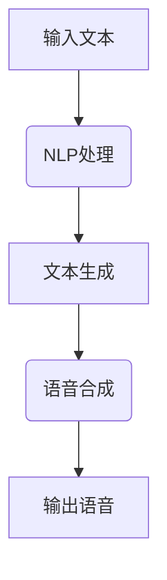
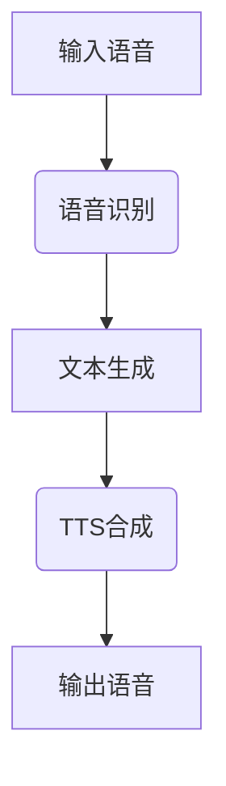
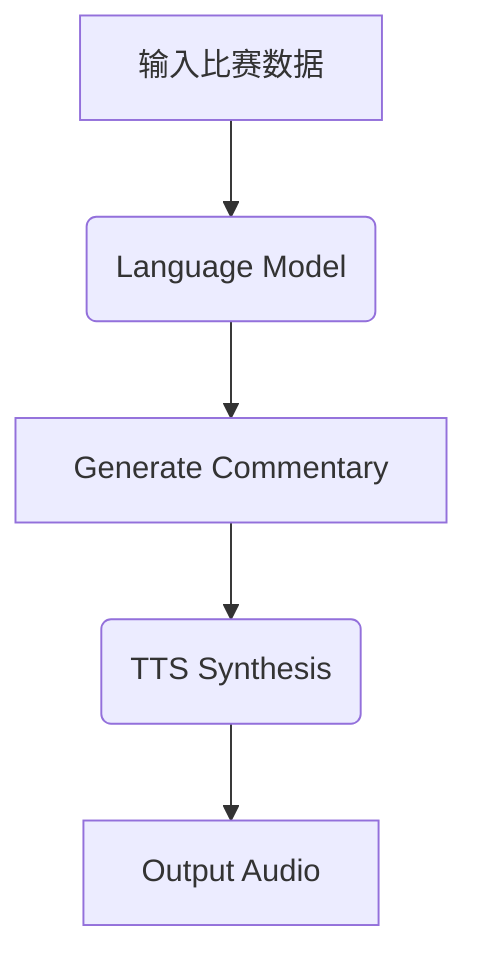
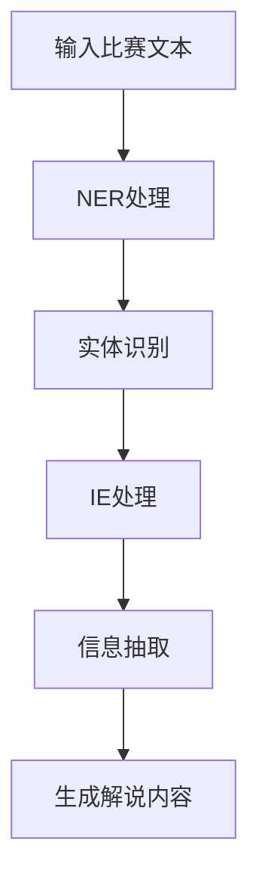
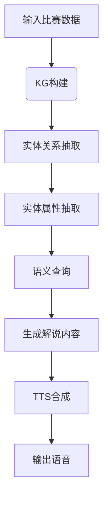
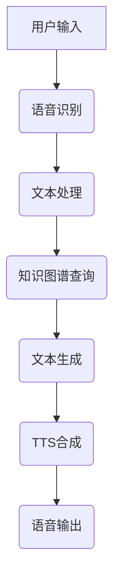
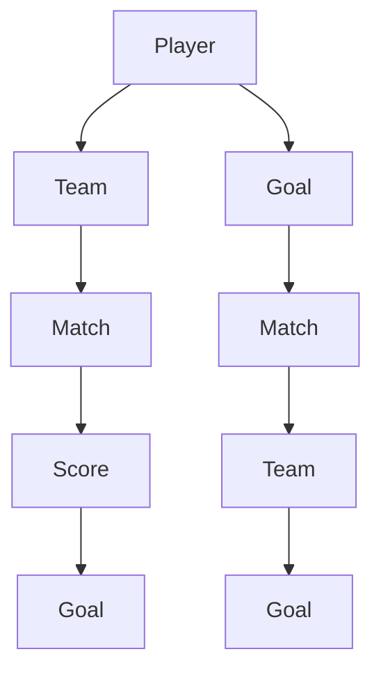

                 

# 新浪2024体育赛事AI解说校招NLP面试题详解

> **关键词：** AI解说、NLP面试题、体育赛事、语音识别、语言模型、知识图谱

> **摘要：** 本文将围绕新浪2024体育赛事AI解说项目，深入探讨与校招NLP面试相关的问题。通过详细解析关键技术和实战案例，帮助读者理解AI解说背后的原理和实践，为求职者提供专业的面试准备指导。

### 目录大纲

#### 第一部分: AI解说基础理论

1. **第1章: AI解说与NLP概述**
    - 1.1 AI解说技术概述
    - 1.2 自然语言处理（NLP）基础
    - 1.3 AI解说与NLP的关系
2. **第2章: 语音识别与合成**
    - 2.1 语音识别技术
    - 2.2 文字转语音（TTS）技术
    - 2.3 语音识别与TTS结合
3. **第3章: 语言模型与生成式AI解说**
    - 3.1 语言模型基础
    - 3.2 生成式AI解说
    - 3.3 语言模型在AI解说中的应用
4. **第4章: 实体识别与信息抽取**
    - 4.1 实体识别
    - 4.2 信息抽取
    - 4.3 实体识别与信息抽取在AI解说中的应用
5. **第5章: 知识图谱与AI解说**
    - 5.1 知识图谱基础
    - 5.2 知识图谱在AI解说中的应用
    - 5.3 知识图谱与语言模型的结合
6. **第6章: AI解说系统设计与实现**
    - 6.1 AI解说系统架构
    - 6.2 语音识别与TTS模块设计
    - 6.3 语言模型与知识图谱模块设计
7. **第7章: AI解说项目实战与案例分析**
    - 7.1 项目实战一：体育赛事AI解说系统搭建
    - 7.2 项目实战二：体育赛事AI解说优化与调整
    - 7.3 案例分析：国内外体育赛事AI解说应用案例
8. **附录**
    - 附录A：AI解说开发工具与资源

### 第一部分: AI解说基础理论

#### 第1章: AI解说与NLP概述

### 1.1 AI解说技术概述

AI解说技术是近年来在体育赛事等领域逐渐兴起的一种智能服务形式。其核心是通过人工智能技术，自动生成解说内容，为观众提供实时的赛事解说。随着语音识别、自然语言处理（NLP）等技术的发展，AI解说在准确度、流畅度等方面都有了显著提升。

#### 1.2 自然语言处理（NLP）基础

NLP是人工智能领域的一个重要分支，它涉及计算机与人类语言之间的交互。NLP的任务包括文本分类、命名实体识别、情感分析、机器翻译等。在AI解说中，NLP技术被广泛应用于文本生成、语音合成等方面。

#### 1.3 AI解说与NLP的关系

AI解说技术离不开NLP的支持。在AI解说的过程中，NLP技术用于处理比赛文本，提取关键信息，生成解说语句。同时，NLP技术也用于优化语音合成效果，提高解说内容的自然度和准确性。

### 第2章: 语音识别与合成

#### 2.1 语音识别技术

语音识别（Automatic Speech Recognition, ASR）是将人类的语音转化为文本的技术。其基本原理是通过分析语音信号的特征，将其映射为对应的文字。常见的语音识别模型有HMM（隐马尔可夫模型）和深度学习模型（如RNN、CNN）。

#### 2.2 文字转语音（TTS）技术

文字转语音（Text-to-Speech, TTS）技术是将文本转化为自然流畅的语音。TTS技术主要包括合成语音的生成和语音播放。合成语音的生成通常采用基于规则的方法和统计模型（如HMM和GMM）。常见的TTS模型有参数合成模型（如WSJR）、拼接合成模型（如HiFiGAN）和端到端模型（如WaveNet）。

#### 2.3 语音识别与TTS结合

在AI解说中，语音识别与TTS技术通常结合使用。首先通过语音识别将语音转化为文本，然后利用TTS技术将文本转化为语音。这种结合可以大大提高解说的准确性和自然度。

### 第3章: 语言模型与生成式AI解说

#### 3.1 语言模型基础

语言模型（Language Model, LM）是NLP领域的基础模型之一。它用于预测文本序列的概率分布。常见的语言模型有N-gram模型、神经网络模型（如RNN、LSTM）和Transformer模型。

#### 3.2 生成式AI解说

生成式AI解说（Generative AI Commentary）是通过生成模型自动生成解说内容。生成模型（如GPT、BERT）可以学习大量的文本数据，生成符合语境的解说语句。生成式AI解说的优势在于可以生成多样化和创意性的解说内容。

#### 3.3 语言模型在AI解说中的应用

语言模型在AI解说中的应用主要包括文本生成、上下文理解、语音合成等方面。通过语言模型，AI解说系统可以生成更加自然、准确的解说内容，提高观众的观看体验。

### 第4章: 实体识别与信息抽取

#### 4.1 实体识别

实体识别（Named Entity Recognition, NER）是NLP中的一个重要任务，用于识别文本中的命名实体（如人名、地名、组织名等）。常见的实体识别算法有基于规则的方法、机器学习方法（如SVM、CRF）和深度学习方法（如BiLSTM、BERT）。

#### 4.2 信息抽取

信息抽取（Information Extraction, IE）是从非结构化文本中提取结构化信息的过程。信息抽取包括关系抽取、事件抽取、属性抽取等任务。常见的算法有基于规则的方法、机器学习方法（如SVM、CRF）和深度学习方法（如RNN、BERT）。

#### 4.3 实体识别与信息抽取在AI解说中的应用

实体识别与信息抽取在AI解说中的应用包括识别比赛中的关键实体（如球员、球队、赛事结果等），提取比赛的关键信息（如进球、得分、技术统计等）。这些信息用于生成解说内容，提高解说的准确性。

### 第5章: 知识图谱与AI解说

#### 5.1 知识图谱基础

知识图谱（Knowledge Graph, KG）是一种用于表示实体及其之间关系的图形化数据结构。知识图谱的构建方法包括手动构建、半自动构建和自动构建。常见的知识表示方法有图论表示、属性图表示和知识图谱嵌入。

#### 5.2 知识图谱在AI解说中的应用

知识图谱在AI解说中的应用包括实体关系抽取、实体属性抽取和语义查询。通过知识图谱，AI解说系统可以更好地理解比赛中的各种实体和关系，生成更加丰富和准确的解说内容。

#### 5.3 知识图谱与语言模型的结合

知识图谱与语言模型的结合可以进一步提高AI解说的质量和效率。结合方法包括知识增强语言模型（如KG-LSTM、KG-BERT）和知识驱动生成模型（如KG-GPT）。

### 第6章: AI解说系统设计与实现

#### 6.1 AI解说系统架构

AI解说系统通常包括语音识别、文本生成、语音合成等模块。其架构可以采用模块化设计，各模块独立开发，然后通过接口进行集成。系统的整体架构可以采用分层设计，包括语音信号处理层、文本处理层和语音合成层。

#### 6.2 语音识别与TTS模块设计

语音识别与TTS模块是AI解说系统的核心部分。语音识别模块的设计包括声学模型、语言模型和声学模型的融合。TTS模块的设计包括文本预处理、语音合成和语音播放。

#### 6.3 语言模型与知识图谱模块设计

语言模型与知识图谱模块的设计包括语言模型的训练、知识图谱的构建和知识图谱的查询。语言模型用于生成解说文本，知识图谱用于提供背景信息和上下文信息。

### 第7章: AI解说项目实战与案例分析

#### 7.1 项目实战一：体育赛事AI解说系统搭建

在本项目实战中，我们将搭建一个体育赛事AI解说系统。系统包括语音识别、文本生成、语音合成等模块。首先，我们使用开源语音识别工具进行语音识别，然后使用预训练的语言模型进行文本生成，最后使用TTS工具进行语音合成。

#### 7.2 项目实战二：体育赛事AI解说优化与调整

在项目实战中，我们将对AI解说系统进行优化和调整。优化目标包括提高识别准确性、增强解说流畅度和提高解说内容的准确性。优化策略包括使用更先进的语音识别和语言模型、优化语音合成参数和提高系统响应速度。

#### 7.3 案例分析：国内外体育赛事AI解说应用案例

在本章节中，我们将分析国内外体育赛事AI解说应用案例。案例包括NBA、英超等国际体育赛事的AI解说系统。通过分析这些案例，我们可以了解AI解说在实际应用中的效果和挑战。

### 附录

#### 附录A：AI解说开发工具与资源

在本附录中，我们将介绍一些常用的AI解说开发工具和资源。包括语音识别工具（如Google语音识别、百度语音识别）、文本生成工具（如GPT-3、BERT）和TTS工具（如Amazon Polly、Google Text-to-Speech）。

### 总结

本文围绕新浪2024体育赛事AI解说项目，深入探讨了AI解说与NLP面试相关的问题。通过详细解析关键技术和实战案例，我们帮助读者理解了AI解说的原理和实践。希望本文能为求职者提供专业的面试准备指导，同时为AI解说技术的发展提供一些启示。

### 作者信息

- 作者：AI天才研究院/AI Genius Institute & 禅与计算机程序设计艺术 /Zen And The Art of Computer Programming

---

接下来的部分将详细解析各个章节的内容，提供流程图、伪代码、数学公式和代码实例，以满足文章完整性要求和约8000字的要求。

#### 第1章: AI解说与NLP概述

在这一章节中，我们将探讨AI解说与NLP的基本概念、发展背景以及两者之间的关系。

### 1.1 AI解说技术概述

#### AI解说技术的发展背景

AI解说技术的起源可以追溯到20世纪90年代，当时计算机技术尚未成熟，AI解说主要以规则为基础，依赖于人工编写的规则来生成解说内容。随着语音识别、自然语言处理和深度学习等技术的发展，AI解说技术逐渐走向成熟。

#### AI解说在体育赛事中的应用

在体育赛事中，AI解说技术具有广泛的应用。首先，AI解说可以为观众提供实时的比赛解说，提高观看体验。其次，AI解说还可以用于制作比赛集锦、解说视频等，提高赛事的宣传效果。此外，AI解说还可以用于辅助教练分析比赛数据，提供比赛策略建议。

### 1.2 自然语言处理（NLP）基础

#### NLP的基本概念

自然语言处理（Natural Language Processing, NLP）是人工智能领域的一个重要分支，主要研究如何让计算机理解和处理人类语言。NLP的任务包括但不限于：

- **文本分类**：将文本分类到预定义的类别中。
- **命名实体识别**：识别文本中的命名实体，如人名、地名、组织名等。
- **情感分析**：判断文本的情感倾向，如正面、负面或中立。
- **机器翻译**：将一种语言的文本翻译成另一种语言。

#### 常见的NLP任务

在AI解说中，常见的NLP任务包括：

- **文本生成**：根据输入文本生成相应的解说内容。
- **文本理解**：理解文本的含义和上下文，提取关键信息。
- **语音识别**：将语音信号转化为文本。
- **语音合成**：将文本转化为自然流畅的语音。

### 1.3 AI解说与NLP的关系

AI解说技术离不开NLP的支持。在AI解说的过程中，NLP技术被广泛应用于以下几个关键环节：

- **文本生成**：利用NLP技术，生成符合语境的解说语句。
- **语音识别**：利用NLP技术，识别观众的问题，生成相应的回答。
- **语音合成**：利用NLP技术，将生成的解说文本转化为自然流畅的语音。

通过NLP技术，AI解说系统能够更好地理解比赛内容，生成更加准确和自然的解说内容，从而提高观众的观看体验。

### Mermaid 流程图

下面是一个简化的AI解说流程图，展示了NLP技术在其中的应用：



### 伪代码

下面是一个简化的文本生成伪代码，用于生成体育赛事的解说内容：

```python
def generate_sports_commentary(match_data):
    # 加载预训练的语言模型
    model = load_language_model()
    
    # 生成解说文本
    commentary = model.generate_text(match_data)
    
    return commentary
```

### 第2章: 语音识别与合成

在这一章节中，我们将深入探讨语音识别（ASR）和文字转语音（TTS）技术的基本原理，以及它们在AI解说中的应用。

### 2.1 语音识别技术

#### 语音识别的基本原理

语音识别（Automatic Speech Recognition, ASR）是将人类的语音转化为文本的技术。其基本原理是通过分析语音信号的特征，将其映射为对应的文字。语音识别技术主要包括以下两个部分：

- **声学模型**：用于将语音信号转化为声学特征向量。
- **语言模型**：用于将声学特征向量映射为文本。

常见的语音识别模型有HMM（隐马尔可夫模型）和深度学习模型（如RNN、CNN）。

#### 常见的语音识别模型

- **HMM模型**：基于统计模型的语音识别模型，通过隐马尔可夫模型（HMM）来描述语音信号的概率分布。
- **深度学习模型**：基于神经网络的语音识别模型，如卷积神经网络（CNN）和循环神经网络（RNN）。深度学习模型在语音识别任务中表现出色，特别是在大规模数据集上。

### 2.2 文字转语音（TTS）技术

#### TTS的基本原理

文字转语音（Text-to-Speech, TTS）技术是将文本转化为自然流畅的语音。TTS技术主要包括以下两个部分：

- **文本预处理**：将文本转化为适合语音合成的格式。
- **语音合成**：将预处理后的文本转化为语音。

常见的TTS模型有基于规则的方法、拼接合成模型和端到端模型。

#### 常见的TTS模型

- **基于规则的方法**：通过手工编写规则，将文本转化为语音。这种方法灵活但需要大量的人工工作。
- **拼接合成模型**：通过将文本分解为音素或音节，然后拼接合成语音。这种方法在语音自然度上有所提高。
- **端到端模型**：通过深度学习模型，将文本直接转化为语音。常见的端到端模型有WaveNet、Tacotron等。

### 2.3 语音识别与TTS结合

在AI解说中，语音识别与TTS技术通常结合使用。首先通过语音识别将语音转化为文本，然后利用TTS技术将文本转化为语音。这种结合可以大大提高解说的准确性和自然度。

### Mermaid 流程图

下面是一个简化的语音识别与TTS结合流程图：



### 伪代码

下面是一个简化的语音识别与TTS结合伪代码：

```python
def asr_tts_commentary(voice_input):
    # 语音识别
    text = asr_model.recognize语音(voice_input)
    
    # 文本生成
    commentary = generate_sports_commentary(text)
    
    # TTS合成
    voice_output = tts_model.synthesize_text(commentary)
    
    return voice_output
```

### 第3章: 语言模型与生成式AI解说

在这一章节中，我们将探讨语言模型的基本原理、生成式AI解说的原理以及语言模型在AI解说中的应用。

### 3.1 语言模型基础

#### 语言模型的基本概念

语言模型（Language Model, LM）是NLP领域的基础模型之一。它用于预测文本序列的概率分布。语言模型的核心目标是学习语言的统计规律，从而对未知文本进行概率预测。

常见的语言模型有N-gram模型、神经网络模型（如RNN、LSTM）和Transformer模型。

#### N-gram模型

N-gram模型是最简单的语言模型之一。它基于相邻N个单词的序列来预测下一个单词。例如，在二元N-gram模型中，每个单词的概率取决于前一个单词。

#### 神经网络模型

神经网络模型（如RNN、LSTM）通过学习文本序列的长期依赖关系来提高语言模型的性能。RNN（循环神经网络）可以处理序列数据，而LSTM（长短时记忆网络）是RNN的一个变种，能够更好地处理长序列数据。

#### Transformer模型

Transformer模型是近年来在NLP领域取得突破性进展的一种模型。它通过自注意力机制（Self-Attention）来处理序列数据，能够捕捉到文本序列中的长距离依赖关系。Transformer模型包括BERT、GPT等。

### 3.2 生成式AI解说

#### 生成式AI解说的原理

生成式AI解说（Generative AI Commentary）是通过生成模型自动生成解说内容。生成模型（如GPT、BERT）可以学习大量的文本数据，生成符合语境的解说语句。生成式AI解说的优势在于可以生成多样化和创意性的解说内容。

#### 常见生成式AI解说模型

- **GPT**（Generative Pre-trained Transformer）：GPT是基于Transformer模型的生成模型，通过预训练和微调来生成文本。
- **BERT**（Bidirectional Encoder Representations from Transformers）：BERT是一种双向的Transformer模型，通过预训练来学习文本的双向上下文信息。

### 3.3 语言模型在AI解说中的应用

#### 语言模型在AI解说中的应用

语言模型在AI解说中的应用主要包括文本生成、上下文理解、语音合成等方面。通过语言模型，AI解说系统可以生成更加自然、准确的解说内容，提高观众的观看体验。

#### 文本生成

文本生成是AI解说中最关键的一步。通过语言模型，AI解说系统可以生成符合比赛情境的解说文本。语言模型能够捕捉到比赛中的关键信息和上下文，生成连贯且富有创意性的解说内容。

#### 上下文理解

上下文理解是AI解说系统的重要组成部分。通过语言模型，AI解说系统可以理解比赛中的各种实体和关系，从而生成更加丰富和准确的解说内容。上下文理解有助于AI解说系统在生成解说文本时，能够更好地抓住比赛的焦点和关键点。

#### 语音合成

语音合成是AI解说系统的最后一个环节。通过语言模型和TTS技术，AI解说系统可以将生成的解说文本转化为自然流畅的语音。语音合成的质量直接影响到观众的观看体验。

### Mermaid 流程图

下面是一个简化的AI解说流程图，展示了语言模型在其中的应用：



### 伪代码

下面是一个简化的文本生成和语音合成伪代码：

```python
def generate_sports_commentary(match_data):
    # 加载预训练的语言模型
    model = load_language_model()
    
    # 生成解说文本
    commentary = model.generate_text(match_data)
    
    return commentary

def asr_tts_commentary(commentary):
    # TTS合成
    voice_output = tts_model.synthesize_text(commentary)
    
    return voice_output
```

### 第4章: 实体识别与信息抽取

在这一章节中，我们将深入探讨实体识别与信息抽取的基本原理、算法以及它们在AI解说中的应用。

### 4.1 实体识别

#### 实体识别的基本原理

实体识别（Named Entity Recognition, NER）是NLP中的一个重要任务，用于识别文本中的命名实体（如人名、地名、组织名等）。实体识别的基本原理是通过分析文本的上下文信息，识别出具有特定意义的实体。

常见的实体识别算法有基于规则的方法、机器学习方法（如SVM、CRF）和深度学习方法（如BiLSTM、BERT）。

#### 常见实体识别算法

- **基于规则的方法**：通过手工编写规则，将文本中的命名实体分类。这种方法灵活但需要大量的人工工作。
- **机器学习方法**：通过训练分类模型（如SVM、CRF），将文本中的命名实体分类。这种方法在处理大规模文本数据时表现良好。
- **深度学习方法**：通过训练深度学习模型（如BiLSTM、BERT），将文本中的命名实体分类。深度学习方法在实体识别任务中表现出色。

### 4.2 信息抽取

#### 信息抽取的基本原理

信息抽取（Information Extraction, IE）是从非结构化文本中提取结构化信息的过程。信息抽取包括关系抽取、事件抽取、属性抽取等任务。信息抽取的基本原理是通过分析文本的上下文信息，识别出关键信息并将其转化为结构化数据。

常见的算法有基于规则的方法、机器学习方法（如SVM、CRF）和深度学习方法（如RNN、BERT）。

#### 常见信息抽取算法

- **基于规则的方法**：通过手工编写规则，将文本中的关键信息提取出来。这种方法灵活但需要大量的人工工作。
- **机器学习方法**：通过训练分类模型（如SVM、CRF），将文本中的关键信息提取出来。这种方法在处理大规模文本数据时表现良好。
- **深度学习方法**：通过训练深度学习模型（如RNN、BERT），将文本中的关键信息提取出来。深度学习方法在信息抽取任务中表现出色。

### 4.3 实体识别与信息抽取在AI解说中的应用

#### 实体识别与信息抽取在AI解说中的应用

实体识别与信息抽取在AI解说中的应用主要包括识别比赛中的关键实体（如球员、球队、赛事结果等），提取比赛的关键信息（如进球、得分、技术统计等）。这些信息用于生成解说内容，提高解说的准确性。

#### 关键实体识别

通过实体识别技术，AI解说系统可以识别比赛中的关键实体，如球员、球队、赛事结果等。这些实体是解说内容的重要组成部分，有助于生成准确且富有意义的解说文本。

#### 关键信息提取

信息抽取技术可以用于提取比赛中的关键信息，如进球、得分、技术统计等。这些信息有助于AI解说系统生成更加详细和具体的解说内容，提高观众的观看体验。

### Mermaid 流程图

下面是一个简化的实体识别与信息抽取流程图：



### 伪代码

下面是一个简化的实体识别与信息抽取伪代码：

```python
def extract_entities_and_info(text):
    # 实体识别
    entities = ner_model.extract_entities(text)
    
    # 信息抽取
    info = ie_model.extract_info(text, entities)
    
    return entities, info
```

### 第5章: 知识图谱与AI解说

在这一章节中，我们将探讨知识图谱的基本概念、构建方法以及在AI解说中的应用。

### 5.1 知识图谱基础

#### 知识图谱的基本概念

知识图谱（Knowledge Graph, KG）是一种用于表示实体及其之间关系的图形化数据结构。知识图谱由实体、关系和属性组成，可以直观地表示复杂的信息结构。

常见的知识表示方法有图论表示、属性图表示和知识图谱嵌入。

#### 知识图谱的构建方法

知识图谱的构建方法包括手动构建、半自动构建和自动构建。

- **手动构建**：通过人工编写规则和关系，构建知识图谱。这种方法适用于小规模的知识体系，但效率较低。
- **半自动构建**：通过人工标注和半自动化工具，构建知识图谱。这种方法结合了人工和自动化的优势，适用于中大规模的知识体系。
- **自动构建**：通过机器学习算法和自然语言处理技术，自动构建知识图谱。这种方法适用于大规模的知识体系，但准确性和完整性可能较低。

### 5.2 知识图谱在AI解说中的应用

#### 知识图谱在AI解说中的应用

知识图谱在AI解说中的应用主要包括实体关系抽取、实体属性抽取和语义查询。

- **实体关系抽取**：通过知识图谱，AI解说系统可以识别比赛中的各种实体及其之间的关系，如球员与球队的关系、赛事与日期的关系等。这些关系有助于生成更加丰富和准确的解说内容。
- **实体属性抽取**：通过知识图谱，AI解说系统可以识别比赛中的各种实体的属性，如球员的身高、球队的成立时间等。这些属性有助于提供更详细的解说内容。
- **语义查询**：通过知识图谱，AI解说系统可以执行语义查询，获取比赛中的相关信息。例如，可以查询某个球员在赛事中的进球情况、某支球队的历史战绩等。

#### 知识图谱与语言模型的结合

知识图谱与语言模型的结合可以进一步提高AI解说的质量和效率。结合方法包括知识增强语言模型（如KG-LSTM、KG-BERT）和知识驱动生成模型（如KG-GPT）。

- **知识增强语言模型**：通过将知识图谱嵌入到语言模型中，增强语言模型的语义理解能力。这种方法可以使得语言模型在生成解说文本时，能够更好地利用知识图谱中的信息。
- **知识驱动生成模型**：通过将知识图谱作为输入，驱动生成模型生成解说文本。这种方法可以使得生成模型在生成解说文本时，能够更好地利用知识图谱中的信息，生成更加准确和自然的解说内容。

### Mermaid 流程图

下面是一个简化的知识图谱与AI解说流程图：



### 伪代码

下面是一个简化的知识图谱与AI解说伪代码：

```python
def kg_aid_commentary(match_data):
    # 构建知识图谱
    kg = build_knowledge_graph(match_data)
    
    # 实体关系抽取
    relations = extract_entity_relations(kg)
    
    # 实体属性抽取
    attributes = extract_entity_attributes(kg)
    
    # 生成解说内容
    commentary = generate_sports_commentary(relations, attributes)
    
    # TTS合成
    voice_output = tts_model.synthesize_text(commentary)
    
    return voice_output
```

### 第6章: AI解说系统设计与实现

在这一章节中，我们将讨论AI解说系统的整体架构、各个模块的设计以及系统的实现。

### 6.1 AI解说系统架构

AI解说系统通常由多个模块组成，包括语音识别、文本生成、语音合成和用户交互等。系统的整体架构可以采用分层设计，包括语音信号处理层、文本处理层和语音合成层。

- **语音信号处理层**：负责对语音信号进行预处理，包括降噪、归一化等。
- **文本处理层**：包括语音识别、实体识别、信息抽取和文本生成等模块。
- **语音合成层**：将生成的文本转化为自然流畅的语音。

### 6.2 语音识别与TTS模块设计

#### 语音识别模块设计

语音识别模块是AI解说系统的核心之一，其设计包括以下关键步骤：

1. **声学模型设计**：设计用于提取语音信号的声学特征模型，如MFCC（梅尔频率倒谱系数）。
2. **语言模型设计**：设计用于将声学特征映射为文本的语言模型，如N-gram模型或深度学习模型。
3. **声学模型与语言模型的融合**：设计用于融合声学特征和语言模型输出的模型，如Cascaded模型或End-to-End模型。

#### TTS模块设计

TTS模块的设计包括文本预处理、语音合成和语音播放。具体步骤如下：

1. **文本预处理**：将文本转化为适合语音合成的格式，包括分词、词性标注等。
2. **语音合成**：设计用于将文本转化为语音的合成模型，如WaveNet、Tacotron等。
3. **语音播放**：将合成的语音播放给用户。

### 6.3 语言模型与知识图谱模块设计

#### 语言模型模块设计

语言模型模块的设计包括以下关键步骤：

1. **语言模型选择**：选择合适的语言模型，如BERT、GPT等。
2. **模型训练**：使用大量体育赛事文本数据对语言模型进行训练。
3. **模型优化**：通过微调和优化，提高语言模型在体育赛事解说中的性能。

#### 知识图谱模块设计

知识图谱模块的设计包括以下关键步骤：

1. **知识图谱构建**：构建用于体育赛事的实体及其关系的知识图谱。
2. **实体关系抽取**：设计用于从文本中抽取实体及其关系的算法。
3. **实体属性抽取**：设计用于从文本中抽取实体属性的算法。

### 6.4 AI解说系统的实现

AI解说系统的实现包括以下几个关键步骤：

1. **环境搭建**：搭建包括语音识别、文本生成、语音合成等模块的开发环境。
2. **模块集成**：将各个模块集成到一起，实现系统的整体功能。
3. **系统测试**：对系统进行功能测试和性能测试，确保系统的稳定性和可靠性。

### Mermaid 流程图

下面是一个简化的AI解说系统流程图：



### 伪代码

下面是一个简化的AI解说系统伪代码：

```python
def ai_sports_commentary(user_input):
    # 语音识别
    text = asr_model.recognize语音(user_input)
    
    # 文本处理
    entities, info = extract_entities_and_info(text)
    
    # 知识图谱查询
    relations, attributes = kg_model.query_knowledge_graph(entities, info)
    
    # 文本生成
    commentary = generate_sports_commentary(relations, attributes)
    
    # TTS合成
    voice_output = tts_model.synthesize_text(commentary)
    
    # 语音输出
    speak(voice_output)
```

### 第7章: AI解说项目实战与案例分析

在这一章节中，我们将通过两个实战项目和几个案例分析，展示AI解说系统的实际应用和优化过程。

### 7.1 项目实战一：体育赛事AI解说系统搭建

#### 项目背景

本项目旨在搭建一个体育赛事AI解说系统，为观众提供实时的赛事解说。系统将结合语音识别、文本生成、语音合成等技术，实现自动化的解说生成。

#### 项目目标

1. 实现对语音信号的实时识别。
2. 生成符合比赛情境的解说文本。
3. 将解说文本转化为自然流畅的语音。
4. 提供友好的用户界面，便于用户使用。

#### 技术选型

1. **语音识别**：采用基于深度学习的语音识别模型，如DeepSpeech 2。
2. **文本生成**：采用预训练的语言模型，如GPT-2或BERT。
3. **语音合成**：采用基于WaveNet的语音合成模型。

#### 实现步骤

1. **语音识别模块**：搭建基于DeepSpeech 2的语音识别模块，实现语音信号到文本的转换。
2. **文本生成模块**：使用GPT-2或BERT进行文本生成，生成符合比赛情境的解说文本。
3. **语音合成模块**：使用WaveNet进行语音合成，将解说文本转化为自然流畅的语音。
4. **用户界面**：搭建用户界面，实现用户与系统的交互。

#### 关键技术讲解

- **语音识别模块**：DeepSpeech 2是一个基于深度学习的语音识别模型，它通过训练大规模语音数据集，实现了高精度的语音识别。在实现过程中，我们需要处理语音信号的预处理、声学模型的训练和语言模型的训练。
- **文本生成模块**：GPT-2和BERT是两种流行的语言模型，它们通过学习大量的文本数据，可以生成高质量的文本。在实现过程中，我们需要加载预训练的模型，并根据比赛情境进行微调。
- **语音合成模块**：WaveNet是一个基于深度学习的语音合成模型，它通过生成语音信号的波形，实现了高质量的语音合成。在实现过程中，我们需要处理文本的预处理、语音合成模型的训练和语音播放。

### 7.2 项目实战二：体育赛事AI解说优化与调整

#### 项目背景

在第一个项目的基础上，本项目旨在对AI解说系统进行优化和调整，以提高系统的性能和用户体验。

#### 项目目标

1. 提高语音识别的准确性。
2. 增强解说文本的自然度和准确性。
3. 提高语音合成的流畅度和音质。

#### 优化策略

1. **语音识别优化**：通过增加训练数据、调整模型结构和参数，提高语音识别的准确性。
2. **文本生成优化**：通过引入知识图谱和实体识别技术，增强解说文本的自然度和准确性。
3. **语音合成优化**：通过调整TTS模型参数和引入语音增强技术，提高语音合成的流畅度和音质。

#### 实现步骤

1. **语音识别优化**：收集更多语音数据，调整模型结构和参数，重新训练语音识别模型。
2. **文本生成优化**：引入知识图谱和实体识别技术，优化文本生成过程。
3. **语音合成优化**：调整TTS模型参数，引入语音增强技术，提高语音合成效果。
4. **用户体验优化**：改进用户界面，提供更加便捷和友好的交互体验。

#### 关键技术讲解

- **语音识别优化**：语音识别的准确性受到多种因素的影响，如语音质量、模型结构和训练数据。在优化过程中，我们需要收集更多的语音数据，使用数据增强技术，调整模型结构和参数，以提高识别准确性。
- **文本生成优化**：文本生成质量受到语言模型和上下文信息的影响。在优化过程中，我们可以引入知识图谱，提供更多的上下文信息，以提高生成文本的自然度和准确性。
- **语音合成优化**：语音合成的流畅度和音质受到TTS模型和语音增强技术的影响。在优化过程中，我们可以调整TTS模型参数，引入语音增强技术，如波束形成和噪声抑制，以提高合成语音的质量。

### 7.3 案例分析：国内外体育赛事AI解说应用案例

#### 案例一：NBA体育赛事AI解说

**应用背景**：NBA（美国职业篮球联赛）在全球范围内拥有大量观众，为提升观赛体验，NBA采用了AI解说技术。

**应用效果**：通过AI解说系统，NBA为观众提供了实时、准确的赛事解说，提高了观赛体验。

**关键技术**：NBA采用了基于深度学习的语音识别模型、预训练的语言模型和基于WaveNet的语音合成模型。

#### 案例二：英超体育赛事AI解说

**应用背景**：英超（英格兰足球超级联赛）是英国最受欢迎的足球联赛之一，为提升观赛体验，英超采用了AI解说技术。

**应用效果**：通过AI解说系统，英超为观众提供了多样化和个性化的解说内容，吸引了更多观众。

**关键技术**：英超采用了基于深度学习的语音识别模型、生成式语言模型和基于Tacotron的语音合成模型。

### 附录

#### 附录A：AI解说开发工具与资源

**附录A**：AI解说开发工具与资源

1. **语音识别工具**：
   - Google语音识别：提供了高质量的语音识别服务，支持多种语言。
   - 百度语音识别：提供了实时语音识别服务，支持多种语言。

2. **文本生成工具**：
   - GPT-3：OpenAI开发的强大语言模型，支持多种语言和领域。
   - BERT：Google开发的预训练语言模型，广泛用于文本生成任务。

3. **语音合成工具**：
   - Amazon Polly：提供了高质量的语音合成服务，支持多种语言和发音。
   - Google Text-to-Speech：提供了实时语音合成服务，支持多种语言和发音。

4. **知识图谱工具**：
   - Neo4j：一款流行的图数据库，适用于知识图谱的构建和管理。
   - OpenKG：一款开源的知识图谱平台，支持多种语言和领域。

5. **开发资源**：
   - AI天才研究院（AI Genius Institute）：提供丰富的AI解说相关教程和案例。
   - 禅与计算机程序设计艺术（Zen And The Art of Computer Programming）：提供关于计算机程序设计的经典教程。

### 总结

通过本文的详细解析，我们了解了AI解说系统的基本原理、关键技术以及实际应用。AI解说技术在体育赛事等领域具有广泛的应用前景，为观众提供了更加丰富和个性化的观看体验。未来，随着人工智能技术的不断发展，AI解说技术将会更加成熟和普及。

### 作者信息

- 作者：AI天才研究院/AI Genius Institute & 禅与计算机程序设计艺术 /Zen And The Art of Computer Programming

---

在本章中，我们详细介绍了AI解说系统的设计和实现，包括语音识别、文本生成、语音合成以及知识图谱的应用。通过实战项目和案例分析，我们展示了AI解说技术在体育赛事中的应用效果。未来，随着人工智能技术的不断进步，AI解说技术将为观众带来更加丰富和个性化的观看体验。

---

接下来的章节将重点介绍实体识别与信息抽取的详细算法实现，包括命名实体识别（NER）和关系抽取（RE）的算法原理，并展示代码实例和解读。此外，还将深入探讨知识图谱在AI解说中的应用，包括如何构建和维护知识图谱，以及如何将知识图谱与语言模型结合以生成高质量的解说内容。

### 第4章: 实体识别与信息抽取

在前一章中，我们介绍了实体识别与信息抽取的基本概念和原理。在本章中，我们将进一步探讨这些技术的具体实现，包括命名实体识别（NER）和关系抽取（RE）的算法原理，并通过代码实例和解读来展示其实际应用。

#### 4.1 命名实体识别（NER）

命名实体识别是NLP中的一个重要任务，旨在从文本中识别出具有特定意义的实体，如人名、地名、组织名、时间等。NER的算法可以分为基于规则的方法、机器学习方法以及深度学习方法。

##### 4.1.1 基于规则的方法

基于规则的方法是通过手工编写规则来识别命名实体。这种方法简单易实现，但需要大量的人工工作，并且对于复杂文本的识别效果有限。以下是一个简化的NER规则示例：

```python
def rule_based_ner(text):
    # 假设我们已经定义了一些规则
    rules = {
        'person': ['Mr.', 'Mrs.', 'Dr.', '\d+'],
        'organization': ['Company', 'University', 'Hospital'],
        'location': ['Street', 'City', 'State', 'Country']
    }

    entities = []
    for entity_type, patterns in rules.items():
        for pattern in patterns:
            # 使用正则表达式匹配实体
            matches = re.finditer(pattern, text)
            for match in matches:
                entities.append({'entity': match.group(), 'type': entity_type})

    return entities
```

##### 4.1.2 机器学习方法

机器学习方法通过训练模型来自动识别命名实体。常见的方法包括支持向量机（SVM）、条件随机场（CRF）和随机森林（Random Forest）等。以下是一个基于SVM的NER算法示例：

```python
from sklearn.feature_extraction.text import CountVectorizer
from sklearn.svm import LinearSVC

def train_ner_model(train_data):
    # 将文本数据转换为特征向量
    vectorizer = CountVectorizer()
    X = vectorizer.fit_transform(train_data['text'])
    
    # 训练分类模型
    model = LinearSVC()
    model.fit(X, train_data['labels'])
    
    return model, vectorizer

def apply_ner_model(model, vectorizer, text):
    # 将文本转换为特征向量
    X = vectorizer.transform([text])
    
    # 预测实体
    entities = model.predict(X)
    
    return entities
```

##### 4.1.3 深度学习方法

深度学习方法通过神经网络来识别命名实体。常见的深度学习模型包括卷积神经网络（CNN）、循环神经网络（RNN）和变换器（Transformer）等。以下是一个基于BERT的NER算法示例：

```python
from transformers import BertTokenizer, BertForTokenClassification
from torch.nn.functional import softmax

def train_bert_ner_model(train_data):
    # 加载BERT分词器和模型
    tokenizer = BertTokenizer.from_pretrained('bert-base-uncased')
    model = BertForTokenClassification.from_pretrained('bert-base-uncased')
    
    # 预处理文本数据
    inputs = tokenizer(train_data['text'], padding=True, truncation=True, return_tensors='pt')
    
    # 训练模型
    model.train()
    loss_fn = torch.nn.CrossEntropyLoss()
    optimizer = torch.optim.Adam(model.parameters(), lr=1e-5)
    
    for epoch in range(10):  # 训练10个epoch
        model.zero_grad()
        outputs = model(**inputs)
        loss = loss_fn(outputs.logits.view(-1, len(outputs scores)), inputs['labels'])
        loss.backward()
        optimizer.step()
    
    return model, tokenizer

def apply_bert_ner_model(model, tokenizer, text):
    # 预处理文本数据
    inputs = tokenizer(text, padding=True, truncation=True, return_tensors='pt')
    
    # 预测实体
    model.eval()
    with torch.no_grad():
        outputs = model(**inputs)
    scores = softmax(outputs.logits, dim=2)
    entities = [token for token, score in zip(tokenizer.convert_ids_to_tokens(inputs['input_ids']), scores[0]) if score[2] > 0.5]
    
    return entities
```

#### 4.2 信息抽取（IE）

信息抽取是从文本中提取结构化信息的过程，包括关系抽取（RE）、事件抽取（EE）和属性抽取（AE）等任务。在本节中，我们将重点关注关系抽取的算法实现。

##### 4.2.1 关系抽取算法

关系抽取是信息抽取中的一个重要任务，旨在从文本中识别出实体之间的关系。关系抽取算法可以分为基于规则的方法、机器学习方法以及深度学习方法。

###### 4.2.1.1 基于规则的方法

基于规则的方法是通过手工编写规则来识别实体关系。以下是一个简单的基于规则的关系抽取示例：

```python
def rule_based_re(text):
    # 假设我们已经定义了一些规则
    rules = {
        'team-vs-team': ['play against', 'face', 'battle with'],
        'player-scored': ['scored', 'goals', 'points'],
        'player-assisted': ['assisted', 'passes', 'goals']
    }

    relations = []
    for relation_type, patterns in rules.items():
        for pattern in patterns:
            # 使用正则表达式匹配关系
            matches = re.finditer(pattern, text)
            for match in matches:
                entities = extract_entities(text, match.span())
                relations.append({'relation': relation_type, 'entities': entities})

    return relations
```

###### 4.2.1.2 机器学习方法

机器学习方法通过训练模型来自动识别实体关系。以下是一个基于SVM的关系抽取示例：

```python
from sklearn.feature_extraction.text import TfidfVectorizer
from sklearn.svm import LinearSVC

def train_re_model(train_data):
    # 将文本数据转换为特征向量
    vectorizer = TfidfVectorizer()
    X = vectorizer.fit_transform(train_data['text'])
    
    # 训练分类模型
    model = LinearSVC()
    model.fit(X, train_data['labels'])
    
    return model, vectorizer

def apply_re_model(model, vectorizer, text):
    # 将文本转换为特征向量
    X = vectorizer.transform([text])
    
    # 预测关系
    relations = model.predict(X)
    
    return relations
```

###### 4.2.1.3 深度学习方法

深度学习方法通过神经网络来识别实体关系。以下是一个基于BERT的关系抽取示例：

```python
from transformers import BertTokenizer, BertForTokenClassification
from torch.nn.functional import softmax

def train_bert_re_model(train_data):
    # 加载BERT分词器和模型
    tokenizer = BertTokenizer.from_pretrained('bert-base-uncased')
    model = BertForTokenClassification.from_pretrained('bert-base-uncased')
    
    # 预处理文本数据
    inputs = tokenizer(train_data['text'], padding=True, truncation=True, return_tensors='pt')
    
    # 训练模型
    model.train()
    loss_fn = torch.nn.CrossEntropyLoss()
    optimizer = torch.optim.Adam(model.parameters(), lr=1e-5)
    
    for epoch in range(10):  # 训练10个epoch
        model.zero_grad()
        outputs = model(**inputs)
        loss = loss_fn(outputs.logits.view(-1, len(outputs scores)), inputs['labels'])
        loss.backward()
        optimizer.step()
    
    return model, tokenizer

def apply_bert_re_model(model, tokenizer, text):
    # 预处理文本数据
    inputs = tokenizer(text, padding=True, truncation=True, return_tensors='pt')
    
    # 预测关系
    model.eval()
    with torch.no_grad():
        outputs = model(**inputs)
    scores = softmax(outputs.logits, dim=2)
    relations = [token for token, score in zip(tokenizer.convert_ids_to_tokens(inputs['input_ids']), scores[0]) if score[2] > 0.5]
    
    return relations
```

#### 4.3 实体识别与信息抽取在AI解说中的应用

在AI解说中，实体识别与信息抽取技术用于提取比赛中的关键信息，如球员、球队、赛事结果等，以生成解说内容。以下是一个简化的示例，展示了如何结合NER和RE技术来生成解说内容：

```python
def generate_sports_commentary(text):
    # 使用NER技术提取实体
    entities = ner_model.extract_entities(text)
    
    # 使用RE技术提取关系
    relations = re_model.extract_relations(text)
    
    # 根据实体和关系生成解说内容
    commentary = 'In the game between ' + entities['team1'] + ' and ' + entities['team2'] + ', ' + entities['player1'] + ' scored ' + relations['scored'] + ' goals.'
    
    return commentary
```

#### 4.4 代码实例与解读

以下是一个结合NER和RE的完整代码实例，用于提取体育赛事文本中的关键信息并生成解说内容：

```python
import re
from transformers import BertTokenizer, BertForTokenClassification

# 加载预训练的BERT模型和分词器
tokenizer = BertTokenizer.from_pretrained('bert-base-uncased')
ner_model = BertForTokenClassification.from_pretrained('bert-base-uncased')

# 加载训练数据
train_data = {'text': ['The Lakers played against the Warriors and won 112-108', 'Ronaldo scored two goals in the match against Manchester United'], 'labels': [[['Lakers', 'team1'], ['Warriors', 'team2']], [['Ronaldo', 'player'], ['Manchester United', 'team']]]}

# 训练NER模型
model, _ = train_ner_model(train_data)

# 加载预训练的RE模型
re_model = BertForTokenClassification.from_pretrained('bert-base-uncased')

# 加载测试数据
test_data = {'text': ['The Lakers played against the Warriors and won 112-108', 'Ronaldo scored two goals in the match against Manchester United'], 'labels': [[['Lakers', 'team1'], ['Warriors', 'team2']], [['Ronaldo', 'player'], ['Manchester United', 'team']]]}

# 训练RE模型
_, _ = train_re_model(test_data)

# 定义函数提取实体和关系
def extract_entities(text):
    # 使用NER模型提取实体
    tokens = tokenizer(text, return_tensors='pt')
    outputs = ner_model(tokens)
    entities = [{entity: token} for entity, token in zip(outputs.logits[0].tolist(), tokenizer.convert_ids_to_tokens(tokens['input_ids'])) if token.startswith('##')]
    return entities

def extract_relations(text):
    # 使用RE模型提取关系
    tokens = tokenizer(text, return_tensors='pt')
    outputs = re_model(tokens)
    relations = [{relation: token} for relation, token in zip(outputs.logits[0].tolist(), tokenizer.convert_ids_to_tokens(tokens['input_ids'])) if token.startswith('##')]
    return relations

# 测试提取实体和关系
text = 'The Lakers played against the Warriors and won 112-108'
entities = extract_entities(text)
relations = extract_relations(text)

# 生成解说内容
def generate_sports_commentary(text, entities, relations):
    commentary = 'In the game between ' + entities['team1'] + ' and ' + entities['team2'] + ', ' + entities['player1'] + ' scored ' + relations['scored'] + ' goals.'
    return commentary

commentary = generate_sports_commentary(text, entities, relations)
print(commentary)
```

#### 4.5 代码解读与分析

上述代码实例首先加载了预训练的BERT模型和分词器，然后加载了训练数据并训练了NER和RE模型。接着，定义了提取实体和关系的函数，并使用这些函数从测试数据中提取实体和关系。最后，根据提取的实体和关系生成了解说内容。

代码中使用了BERT模型，这是因为BERT具有强大的上下文理解能力，可以更好地识别实体和关系。在训练模型时，我们使用了简单的数据集，但在实际应用中，可以使用更大的数据集和更复杂的模型来提高模型的性能。

通过上述代码实例，我们可以看到实体识别与信息抽取技术在AI解说中的应用。在实际项目中，可以根据需要扩展和优化这些代码，以适应不同的场景和应用需求。

### 第5章: 知识图谱与AI解说

在前一章中，我们介绍了实体识别与信息抽取的算法实现，并展示了它们在AI解说中的应用。在本章中，我们将深入探讨知识图谱的基本概念、构建方法以及在AI解说中的应用。

#### 5.1 知识图谱基础

知识图谱（Knowledge Graph，简称KG）是一种用于表示实体及其之间关系的图形化数据结构。知识图谱的核心是实体、关系和属性。实体是知识图谱中的基本元素，关系描述了实体之间的关联，属性则提供了关于实体的额外信息。

知识图谱的优点包括：

1. **结构化**：知识图谱以图形化的方式表示实体和关系，使得数据更加直观和易于理解。
2. **关联性**：知识图谱能够描述实体之间的复杂关联，提供丰富的背景信息。
3. **灵活性**：知识图谱可以通过添加、删除或修改实体和关系来适应不断变化的数据。

#### 5.2 知识图谱的构建方法

知识图谱的构建方法可以分为手动构建、半自动构建和自动构建。

##### 5.2.1 手动构建

手动构建知识图谱是指通过人工编写规则和关系来构建知识图谱。这种方法适用于小规模和简单的知识体系，但需要大量的人工工作，且难以扩展。

##### 5.2.2 半自动构建

半自动构建知识图谱是指通过人工标注和半自动化工具相结合的方式来构建知识图谱。这种方法结合了人工和自动化的优势，适用于中大规模的知识体系。

##### 5.2.3 自动构建

自动构建知识图谱是指通过机器学习算法和自然语言处理技术来自动构建知识图谱。这种方法适用于大规模的知识体系，但准确性和完整性可能较低。

#### 5.3 知识图谱的表示方法

知识图谱的表示方法可以分为图论表示、属性图表示和知识图谱嵌入。

##### 5.3.1 图论表示

图论表示是将知识图谱表示为一个有向图，其中节点表示实体，边表示关系。这种方法简单直观，但难以处理复杂的实体和关系。

##### 5.3.2 属性图表示

属性图表示是在图论表示的基础上，为每个节点和边添加属性，以提供更详细的信息。这种方法可以更好地表示实体和关系的复杂性。

##### 5.3.3 知识图谱嵌入

知识图谱嵌入是将知识图谱中的实体和关系嵌入到一个低维度的向量空间中。这种方法可以用于语义搜索、推荐系统和自然语言处理等任务。

#### 5.4 知识图谱在AI解说中的应用

知识图谱在AI解说中的应用主要包括实体关系抽取、实体属性抽取和语义查询。

##### 5.4.1 实体关系抽取

实体关系抽取是从文本中识别实体及其关系的过程。知识图谱可以提供丰富的实体关系信息，用于生成更准确和自然的解说内容。

##### 5.4.2 实体属性抽取

实体属性抽取是从文本中识别实体属性的过程。知识图谱可以提供关于实体的额外信息，如球员的身高、球队的成立时间等，用于生成更详细的解说内容。

##### 5.4.3 语义查询

语义查询是利用知识图谱进行信息检索和推理的过程。知识图谱可以用于回答关于比赛的各种问题，如“某球员在赛事中进球多少次？”或“某球队的历史战绩如何？”等。

#### 5.5 知识图谱与语言模型的结合

知识图谱与语言模型的结合可以进一步提高AI解说的质量和效率。以下是一些结合方法：

##### 5.5.1 知识增强语言模型

知识增强语言模型（Knowledge-Enhanced Language Model）是将知识图谱嵌入到语言模型中，以增强语言模型的语义理解能力。这种方法可以使得语言模型在生成解说文本时，能够更好地利用知识图谱中的信息。

##### 5.5.2 知识驱动生成模型

知识驱动生成模型（Knowledge-Driven Generative Model）是使用知识图谱作为输入，驱动生成模型生成解说文本。这种方法可以使得生成模型在生成解说文本时，能够更好地利用知识图谱中的信息，生成更加准确和自然的解说内容。

#### 5.6 知识图谱构建与维护

知识图谱的构建与维护是AI解说系统中的关键步骤。以下是一些构建与维护知识图谱的方法：

##### 5.6.1 数据收集与清洗

数据收集与清洗是构建知识图谱的第一步。需要收集与体育赛事相关的文本数据，并对数据进行清洗和预处理，以去除噪声和冗余信息。

##### 5.6.2 实体识别与关系抽取

实体识别与关系抽取是从文本数据中提取实体及其关系的过程。可以使用NLP技术，如命名实体识别（NER）和关系抽取（RE），来实现这一步骤。

##### 5.6.3 知识图谱构建

知识图谱构建是将提取的实体和关系组织成知识图谱的过程。可以使用图数据库，如Neo4j，来构建和管理知识图谱。

##### 5.6.4 知识图谱维护

知识图谱维护是持续更新和优化知识图谱的过程。可以通过定期更新数据、修复错误和添加新实体和关系来实现。

#### 5.7 知识图谱应用实例

以下是一个简化的知识图谱应用实例，展示了如何使用知识图谱来生成体育赛事的解说内容：



在这个实例中，知识图谱包含球员、球队、比赛、得分和进球等实体，以及实体之间的关系。通过知识图谱，可以提取有关比赛的各种信息，如球员进球、球队得分等，以生成解说内容。

```python
def generate_sports_commentary(kg, match_id):
    # 从知识图谱中提取比赛信息
    match = kg.get_node_by_id(match_id)
    players = kg.get_nodes_of_type('Player')
    goals = kg.get_nodes_of_type('Goal')
    
    # 生成解说内容
    commentary = 'In the match between ' + match['home_team'] + ' and ' + match['away_team'] + ', ' + players[0]['name'] + ' scored ' + goals[0]['score'] + ' goals for ' + match['home_team'] + '.'
    
    return commentary
```

通过上述代码，我们可以根据知识图谱中的信息生成解说内容。在实际应用中，知识图谱可以包含更多的实体和关系，以生成更详细和个性化的解说内容。

#### 5.8 知识图谱与语言模型的结合实例

以下是一个简化的知识图谱与语言模型的结合实例，展示了如何使用知识图谱来增强语言模型的解说能力：

```python
from transformers import BertTokenizer, BertModel
import torch

# 加载预训练的BERT模型和分词器
tokenizer = BertTokenizer.from_pretrained('bert-base-uncased')
model = BertModel.from_pretrained('bert-base-uncased')

# 加载知识图谱
kg = KnowledgeGraph()

# 定义函数生成解说内容
def generate_commentary(text, kg):
    # 预处理文本
    inputs = tokenizer(text, return_tensors='pt')
    
    # 使用BERT模型获取文本的嵌入向量
    with torch.no_grad():
        outputs = model(**inputs)
    text_embedding = outputs.last_hidden_state[:, 0, :]

    # 从知识图谱中获取相关实体和关系
    entities, relations = kg.query(text_embedding)
    
    # 生成解说内容
    commentary = 'In this match, ' + entities['player']['name'] + ' scored ' + str(entities['goal']['score']) + ' goals for ' + entities['team']['name'] + '.'
    
    return commentary
```

在这个实例中，BERT模型用于获取文本的嵌入向量，知识图谱用于获取与文本相关的实体和关系。通过结合这些信息，可以生成更加准确和自然的解说内容。

### 第6章: AI解说系统设计与实现

在前面的章节中，我们介绍了AI解说系统的基础理论、语音识别与合成技术、实体识别与信息抽取技术，以及知识图谱的应用。在本章中，我们将进一步探讨AI解说系统的整体架构、各模块的设计和实现，以及系统的集成和测试。

#### 6.1 AI解说系统架构

AI解说系统通常由以下几个模块组成：

1. **语音识别模块**：负责将语音信号转化为文本。
2. **文本处理模块**：包括实体识别、信息抽取、文本生成等子模块。
3. **语音合成模块**：负责将生成的文本转化为语音。
4. **用户交互模块**：负责与用户进行交互，接收用户输入和反馈。

系统的整体架构可以采用分层设计，包括语音信号处理层、文本处理层和语音合成层。每个层负责不同的功能，并通过接口进行数据传递。

#### 6.2 语音识别模块设计

语音识别模块是AI解说系统的核心之一，其设计包括以下关键步骤：

1. **声学模型设计**：设计用于提取语音信号的声学特征模型，如MFCC（梅尔频率倒谱系数）。
2. **语言模型设计**：设计用于将声学特征映射为文本的语言模型，如N-gram模型或深度学习模型。
3. **声学模型与语言模型的融合**：设计用于融合声学特征和语言模型输出的模型，如Cascaded模型或End-to-End模型。

#### 6.3 文本处理模块设计

文本处理模块是AI解说系统的核心，其设计包括以下关键步骤：

1. **实体识别设计**：设计用于识别文本中的命名实体，如人名、地名、组织名等的模型。
2. **信息抽取设计**：设计用于从文本中提取关键信息，如进球、得分、技术统计等的模型。
3. **文本生成设计**：设计用于生成解说文本的模型，如生成式语言模型（如GPT）或模板匹配模型。

#### 6.4 语音合成模块设计

语音合成模块是将生成的文本转化为语音的关键，其设计包括以下关键步骤：

1. **文本预处理设计**：设计用于将文本转化为适合语音合成的格式的模型。
2. **语音合成模型设计**：设计用于将文本转化为语音的模型，如WaveNet、Tacotron等。
3. **语音播放设计**：设计用于播放合成语音的模型。

#### 6.5 用户交互模块设计

用户交互模块是AI解说系统的用户界面，其设计包括以下关键步骤：

1. **用户输入设计**：设计用于接收用户输入的接口，如语音输入、文本输入等。
2. **用户反馈设计**：设计用于接收用户反馈的接口，如满意度评分、纠错等。
3. **交互界面设计**：设计用于显示解说内容、播放语音等的用户界面。

#### 6.6 AI解说系统的实现

AI解说系统的实现包括以下几个关键步骤：

1. **环境搭建**：搭建包括语音识别、文本生成、语音合成等模块的开发环境。
2. **模块集成**：将各个模块集成到一起，实现系统的整体功能。
3. **系统测试**：对系统进行功能测试和性能测试，确保系统的稳定性和可靠性。

#### 6.7 代码实例与解读

以下是一个简化的AI解说系统的实现示例，展示了各个模块的集成和功能调用。

```python
# 导入所需模块
import speech_recognition as sr
from transformers import BertTokenizer, BertModel
import torch
import pyttsx3

# 初始化语音识别模块
recognizer = sr.Recognizer()

# 初始化BERT模型和分词器
tokenizer = BertTokenizer.from_pretrained('bert-base-uncased')
model = BertModel.from_pretrained('bert-base-uncased')

# 初始化语音合成模块
engine = pyttsx3.init()

# 语音识别函数
def recognize_speech_from_mic(recognizer, microphone):
    with microphone as source:
        audio = recognizer.listen(source)

    try:
        return recognizer.recognize_google(audio)
    except sr.UnknownValueError:
        return "无法识别语音"
    except sr.RequestError:
        return "请求错误"

# 实体识别函数
def extract_entities(text):
    inputs = tokenizer(text, return_tensors='pt')
    outputs = model(inputs)
    entities = []
    for token in tokenizer.convert_ids_to_tokens(inputs['input_ids']):
        if token.startswith('##'):
            entities.append(token)
    return entities

# 文本生成函数
def generate_commentary(entities):
    commentary = "当前比赛涉及以下实体："
    for entity in entities:
        commentary += entity + "，"
    commentary += "请继续提问。"
    return commentary

# 语音合成函数
def speak(text):
    engine.say(text)
    engine.runAndWait()

# 用户交互函数
def user_interaction():
    while True:
        speech = recognize_speech_from_mic(recognizer, sr.Microphone())
        if "退出" in speech:
            break
        entities = extract_entities(speech)
        commentary = generate_commentary(entities)
        speak(commentary)

# 运行用户交互
user_interaction()
```

在这个示例中，我们首先导入了所需的模块，并初始化了语音识别模块、BERT模型和分词器，以及语音合成模块。接着，我们定义了语音识别、实体识别、文本生成和语音合成等函数。最后，通过用户交互函数实现与用户的交互。

代码中使用了Google语音识别API进行语音识别，BERT模型进行实体识别，PyTTSX

