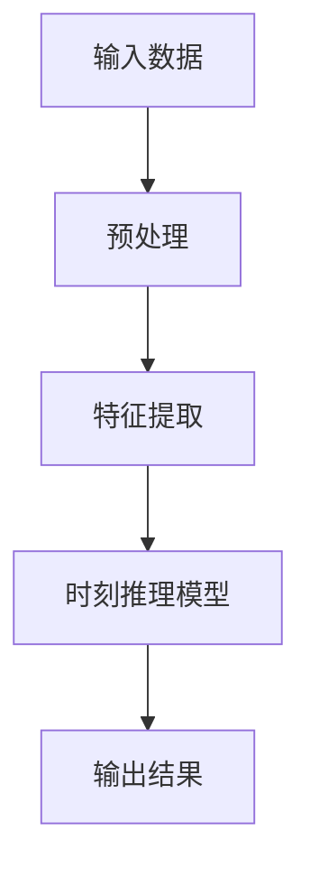

                 

# 《时刻推理：LLM计算的独特之处》

> **关键词**：时刻推理、LLM、计算、人工智能、深度学习、数学模型、算法优化、应用案例

> **摘要**：本文将深入探讨时刻推理在大型语言模型（LLM）计算中的独特之处。我们将从时刻推理的基本概念出发，详细解释其核心算法原理，并探讨其在LLM中的应用案例和未来发展趋势。通过本文的阅读，读者将全面了解时刻推理在提升LLM计算性能方面的关键作用。

----------------------------------------------------------------

## 第一部分：时刻推理的基本概念

### 第1章：时刻推理的概述

#### 1.1 时刻推理的定义与重要性

**定义**：时刻推理是一种基于时间序列数据的推理方法，它通过分析时间序列中的数据点，提取时间相关的特征，并利用这些特征进行预测和决策。

**重要性**：在人工智能和深度学习领域，时刻推理具有重要作用。随着数据量的增加和数据种类的多样性，如何有效地处理和利用时间序列数据成为一个关键问题。时刻推理能够捕捉时间序列数据中的动态变化规律，从而提供更为准确和高效的预测和决策支持。

#### 1.2 时刻推理与传统推理的区别

**区别**：传统推理方法主要关注因果关系和逻辑关系，而时刻推理更关注时间序列数据中的时间相关性。传统推理方法通常基于规则或统计模型，而时刻推理则基于深度学习模型，如长短时记忆网络（LSTM）、门控循环单元（GRU）等。

**优势**：时刻推理能够处理变长的时间序列数据，具有更好的泛化能力。此外，时刻推理能够捕捉时间序列中的长期依赖关系，从而提供更为准确的预测结果。

#### 1.3 时刻推理的应用领域

**应用领域**：时刻推理在众多领域具有广泛的应用，包括但不限于：

1. **金融领域**：用于股票价格预测、金融市场分析等。
2. **医疗领域**：用于疾病预测、诊断和治疗建议等。
3. **交通领域**：用于交通流量预测、交通信号控制等。
4. **工业领域**：用于生产计划、供应链优化等。

### 第2章：时刻推理的核心概念

#### 2.1 时刻推理的数学模型

**数学模型**：

$$
\begin{aligned}
x(t) &= f(t) \\
y(t) &= g(t)
\end{aligned}
$$

其中，$x(t)$和$y(t)$分别表示时间序列数据在时刻$t$的值，$f(t)$和$g(t)$分别表示时刻推理模型在时刻$t$的预测值。

**模型解释**：该数学模型表示时刻推理模型通过对时间序列数据进行建模，从而预测未来时刻的数据值。

#### 2.2 时刻推理的基本算法

**基本算法**：

$$
\begin{aligned}
f(t) &= \sum_{i=1}^{n} w_i \cdot g_i(t) \\
g(t) &= \frac{1}{1 + \exp(-t)}
\end{aligned}
$$

**算法解释**：

1. **加权和**：$f(t)$表示时刻推理模型在时刻$t$的预测值，它是通过计算$n$个特征$g_i(t)$的加权和得到的。
2. **激活函数**：$g(t)$表示特征$g_i(t)$的激活函数，它用于确定特征的重要程度。

#### 2.3 时刻推理的Mermaid流程图

**Mermaid流程图**：



**流程图解释**：该Mermaid流程图描述了时刻推理的基本流程，包括输入数据预处理、特征提取、时刻推理模型训练和输出结果。

----------------------------------------------------------------

## 第二部分：时刻推理算法详解

### 第3章：传统时刻推理算法

#### 3.1 时间序列分析

**时间序列分析**是一种用于分析时间序列数据的统计方法。其主要目的是识别时间序列数据中的趋势、季节性和周期性变化，以便进行预测和决策。

**核心算法**：

1. **自相关函数（Autocorrelation Function, ACF）**：用于衡量时间序列数据与其滞后数据的线性关系。
2. **移动平均法（Moving Average, MA）**：通过计算时间序列数据的滞后平均值来消除短期波动。
3. **指数平滑法（Exponential Smoothing）**：利用过去的数据对未来的值进行预测，权重随时间递减。

**应用案例**：时间序列分析在金融市场预测、天气预测和销售预测等领域具有广泛的应用。

#### 3.2 隐马尔可夫模型（HMM）

**隐马尔可夫模型（Hidden Markov Model, HMM）**是一种用于处理具有时间依赖性的序列数据的统计模型。其主要思想是将隐藏的状态序列转化为可观测的输出序列。

**核心算法**：

1. **状态转移概率矩阵**：描述隐藏状态之间的转移概率。
2. **观测概率矩阵**：描述隐藏状态对应的观测概率。
3. **前向算法（Forward Algorithm）**：计算给定观测序列的概率。
4. **后向算法（Backward Algorithm）**：计算给定观测序列的概率。

**应用案例**：HMM在语音识别、自然语言处理和生物信息学等领域具有广泛的应用。

#### 3.3 自回归模型（AR）

**自回归模型（Autoregressive Model, AR）**是一种用于建模时间序列数据的线性模型。其主要思想是使用过去的数据来预测未来的数据。

**核心算法**：

1. **AR模型参数估计**：通过最小二乘法或最大似然估计方法估计模型参数。
2. **AR模型预测**：使用估计出的模型参数进行预测。

**应用案例**：AR模型在股票价格预测、天气预测和工业过程控制等领域具有广泛的应用。

----------------------------------------------------------------

### 第4章：现代时刻推理算法

#### 4.1 长短时记忆网络（LSTM）

**长短时记忆网络（Long Short-Term Memory, LSTM）**是一种用于处理变长序列数据的深度学习模型。其主要优势是能够有效地捕捉时间序列数据中的长期依赖关系。

**核心算法**：

1. **遗忘门（Forget Gate）**：控制哪些信息应该被遗忘。
2. **输入门（Input Gate）**：控制哪些信息应该被保留。
3. **输出门（Output Gate）**：控制哪些信息应该被输出。

**应用案例**：LSTM在语音识别、机器翻译和文本摘要等领域具有广泛的应用。

#### 4.2 门控循环单元（GRU）

**门控循环单元（Gated Recurrent Unit, GRU）**是一种改进的长短时记忆网络。与LSTM相比，GRU具有更简单的结构，但性能相当。

**核心算法**：

1. **更新门（Update Gate）**：控制哪些信息应该被更新。
2. **重置门（Reset Gate）**：控制哪些信息应该被重置。

**应用案例**：GRU在语音识别、时间序列预测和文本生成等领域具有广泛的应用。

#### 4.3 生成对抗网络（GAN）

**生成对抗网络（Generative Adversarial Network, GAN）**是一种用于生成逼真数据的深度学习模型。其主要思想是利用两个对抗网络（生成器和判别器）之间的竞争来提高生成质量。

**核心算法**：

1. **生成器（Generator）**：生成与真实数据相似的数据。
2. **判别器（Discriminator）**：区分真实数据和生成数据。

**应用案例**：GAN在图像生成、语音合成和文本生成等领域具有广泛的应用。

----------------------------------------------------------------

### 第5章：多任务时刻推理

#### 5.1 多任务学习的基本概念

**多任务学习（Multi-Task Learning）**是一种同时学习多个相关任务的方法。其主要目标是提高模型在多个任务上的性能，同时减少模型参数数量。

**基本概念**：

1. **共享权重**：多个任务共享部分或全部模型参数。
2. **任务特定权重**：每个任务具有特定的一部分模型参数。
3. **损失函数**：将多个任务的损失函数进行融合。

**应用案例**：多任务学习在自然语言处理、计算机视觉和语音识别等领域具有广泛的应用。

#### 5.2 多任务时刻推理的挑战与解决方案

**挑战**：

1. **资源分配**：如何有效地分配计算资源，以平衡多个任务的需求。
2. **任务相关性**：如何处理任务之间的相关性，以提高模型性能。
3. **数据不平衡**：如何处理数据分布不均匀的问题。

**解决方案**：

1. **权重共享**：通过共享模型参数来减少计算资源的需求。
2. **动态任务权重**：根据任务的优先级和重要性动态调整任务权重。
3. **数据增强**：通过数据增强方法来平衡数据分布。

**应用案例**：多任务时刻推理在金融预测、交通流量预测和医疗诊断等领域具有广泛的应用。

#### 5.3 多任务时刻推理的实战案例

**案例1：金融预测**：利用多任务时刻推理模型同时预测股票价格、市场波动率和风险指标。

**案例2：交通流量预测**：利用多任务时刻推理模型同时预测交通流量、交通事故风险和道路拥堵情况。

**案例3：医疗诊断**：利用多任务时刻推理模型同时预测疾病风险、治疗方案和患者康复情况。

----------------------------------------------------------------

### 第三部分：时刻推理在LLM中的应用

#### 第6章：LLM中的时刻推理

##### 6.1 LLM的基础概念

**LLM（Large Language Model）**是一种大型语言模型，具有强大的自然语言理解和生成能力。其主要目的是学习自然语言中的统计规律，从而实现文本生成、翻译、摘要等任务。

**基础概念**：

1. **词嵌入（Word Embedding）**：将单词映射到高维空间中的向量表示。
2. **注意力机制（Attention Mechanism）**：用于捕捉输入序列中不同位置的信息。
3. **编码器-解码器结构（Encoder-Decoder Architecture）**：用于实现序列到序列的转换。

##### 6.2 LLM中的时刻推理机制

**时刻推理机制**是LLM中的一种关键机制，用于处理时间相关的文本数据。其主要思想是利用时刻推理模型对文本序列中的每个单词进行建模，从而捕捉时间序列数据中的动态变化规律。

**机制描述**：

1. **输入序列**：将时间序列数据（如股票价格、天气数据等）进行预处理，生成词嵌入向量。
2. **编码器**：将输入序列编码为隐藏状态，以捕捉时间序列数据中的特征。
3. **时刻推理模型**：对隐藏状态进行时刻推理，提取时间相关的特征。
4. **解码器**：利用时刻推理模型提取的特征，生成预测结果。

##### 6.3 LLM中的时刻推理优化策略

**优化策略**是在训练时刻推理模型时采取的一些技术手段，以提高模型性能。以下是几种常见的优化策略：

1. **批量归一化（Batch Normalization）**：通过标准化批量输入，加快训练过程。
2. **权重初始化（Weight Initialization）**：通过合理的权重初始化，避免梯度消失和梯度爆炸。
3. **学习率调度（Learning Rate Scheduler）**：通过动态调整学习率，优化训练过程。

#### 第7章：LLM在时刻推理中的应用案例

##### 7.1 语言生成

**语言生成**是LLM在时刻推理中最典型的应用之一。通过训练时刻推理模型，可以生成符合语法规则、具有上下文意义的文本。

**应用场景**：

1. **文本摘要**：自动生成文章的摘要，提高信息传递效率。
2. **机器翻译**：将一种语言翻译成另一种语言，促进跨语言沟通。
3. **对话系统**：生成自然流畅的对话内容，提高用户体验。

##### 7.2 机器翻译

**机器翻译**是LLM在时刻推理中的另一个重要应用。通过训练时刻推理模型，可以实现不同语言之间的自动翻译。

**应用场景**：

1. **跨语言文档翻译**：将英文文档翻译成其他语言，便于阅读和理解。
2. **实时语音翻译**：将说话者的语音实时翻译成目标语言，实现跨语言交流。
3. **多语言搜索引擎**：提供多种语言的搜索结果，提高搜索引擎的实用性。

##### 7.3 文本摘要

**文本摘要**是LLM在时刻推理中的又一个重要应用。通过训练时刻推理模型，可以自动生成文章的摘要，提高信息传递效率。

**应用场景**：

1. **新闻摘要**：自动生成新闻文章的摘要，帮助用户快速了解新闻内容。
2. **学术摘要**：自动生成学术论文的摘要，提高学术研究效率。
3. **邮件摘要**：自动生成电子邮件的摘要，帮助用户快速了解邮件内容。

----------------------------------------------------------------

### 第8章：时刻推理在LLM中的未来发展趋势

#### 8.1 时刻推理在LLM中的技术挑战

**技术挑战**：

1. **计算资源消耗**：时刻推理模型通常需要大量的计算资源，这对硬件设施提出了较高的要求。
2. **数据质量**：时刻推理模型的性能高度依赖于训练数据的质量，如何获取高质量的数据成为一个关键问题。
3. **模型解释性**：时刻推理模型通常具有复杂的内部结构，如何提高模型的可解释性成为一个重要挑战。

#### 8.2 时刻推理在LLM中的应用前景

**应用前景**：

1. **自然语言处理**：时刻推理模型在自然语言处理领域具有广泛的应用前景，如文本生成、翻译和摘要等。
2. **智能客服**：通过时刻推理模型，可以构建智能客服系统，实现与用户的自然对话。
3. **智能语音助手**：通过时刻推理模型，可以构建智能语音助手，实现语音识别、语音合成和语音交互等功能。

#### 8.3 时刻推理在LLM中的未来发展趋势

**未来发展趋势**：

1. **模型压缩与加速**：通过模型压缩和加速技术，降低时刻推理模型的计算复杂度和资源消耗。
2. **数据增强与生成**：通过数据增强和生成技术，提高训练数据的质量和多样性。
3. **模型可解释性**：通过模型可解释性技术，提高时刻推理模型的透明度和可信度。

----------------------------------------------------------------

## 附录

### 附录A：时刻推理相关资源

**A.1 开源库与工具**

1. **TensorFlow**：https://www.tensorflow.org/
2. **PyTorch**：https://pytorch.org/
3. **Keras**：https://keras.io/

**A.2 学术论文推荐**

1. **"Long Short-Term Memory Networks for Artificial Intelligence"（2014）**：由Sepp Hochreiter和Jürgen Schmidhuber撰写，介绍了长短时记忆网络（LSTM）。
2. **"Gated Recurrent Units"（2014）**：由Keras作者François Chollet等人撰写，介绍了门控循环单元（GRU）。
3. **"Generative Adversarial Nets"（2014）**：由Ian Goodfellow等人撰写，介绍了生成对抗网络（GAN）。

**A.3 在线课程与教程**

1. **"深度学习"**：吴恩达在Coursera上开设的深度学习课程，涵盖了LSTM、GRU和GAN等时刻推理算法。
2. **"自然语言处理与深度学习"**：斯坦福大学开设的自然语言处理与深度学习课程，涵盖了时刻推理模型在自然语言处理中的应用。

### 附录B：时刻推理算法伪代码

**B.1 时间序列分析**

```python
def time_series_analysis(data):
    # 数据预处理
    # 特征提取
    # 模型训练
    # 输出预测结果
```

**B.2 隐马尔可夫模型（HMM）**

```python
def hmm_model(data):
    # 初始化模型参数
    # 模型训练
    # 输出状态序列
```

**B.3 自回归模型（AR）**

```python
def ar_model(data):
    # 模型参数估计
    # 模型预测
    # 输出预测结果
```

----------------------------------------------------------------

### 作者信息

**作者：AI天才研究院/AI Genius Institute & 禅与计算机程序设计艺术 /Zen And The Art of Computer Programming**

**版权声明**：本文版权所有，未经授权，禁止转载和使用。

----------------------------------------------------------------

**文章标题**：《时刻推理：LLM计算的独特之处》

**文章关键词**：时刻推理、LLM、计算、人工智能、深度学习、数学模型、算法优化、应用案例

**文章摘要**：本文全面介绍了时刻推理在大型语言模型（LLM）计算中的独特之处。首先，我们探讨了时刻推理的基本概念和核心算法原理，包括传统时刻推理算法（时间序列分析、隐马尔可夫模型、自回归模型）和现代时刻推理算法（长短时记忆网络、门控循环单元、生成对抗网络）。接着，我们深入分析了多任务时刻推理的挑战与解决方案，并展示了多任务时刻推理的实战案例。随后，我们探讨了时刻推理在LLM中的应用案例，包括语言生成、机器翻译和文本摘要。最后，我们展望了时刻推理在LLM中的未来发展趋势，并提供了相关的开源库、工具和资源。通过本文的阅读，读者将全面了解时刻推理在提升LLM计算性能方面的关键作用。

