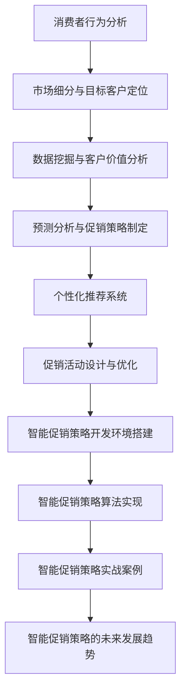

                 

### 智能促销策略概述

智能促销策略是指通过人工智能技术对消费者行为数据进行分析，制定个性化的促销活动，以提高销售额和客户满意度。随着大数据和人工智能技术的快速发展，智能促销策略逐渐成为企业提升竞争力的关键手段。

#### 1.1 促销策略的基本概念

促销策略是指企业通过一系列市场活动，以促进产品销售和提升品牌知名度。促销策略可以分为以下几类：

1. **价格促销**：通过降低产品价格来吸引消费者购买。
2. **数量促销**：提供买多送多、打折等优惠，鼓励消费者大量购买。
3. **促销活动**：举办各种促销活动，如新品发布、节日庆典等，增加消费者参与度。
4. **渠道促销**：通过不同销售渠道提供特殊优惠，如线上打折、线下赠品等。

#### 1.2 智能促销策略的发展历程

智能促销策略的发展可以分为以下几个阶段：

1. **传统促销策略**：以广告宣传和价格折扣为主，效果有限。
2. **数据驱动促销策略**：利用消费者行为数据进行分析，制定更具针对性的促销活动。
3. **人工智能促销策略**：通过人工智能技术，对海量数据进行分析，实现个性化、智能化的促销策略。

#### 1.3 智能促销策略的核心要素

智能促销策略的核心要素包括：

1. **消费者行为分析**：通过分析消费者行为数据，了解消费者的购买习惯和偏好。
2. **市场细分与目标客户定位**：根据消费者行为分析结果，对市场进行细分，并确定目标客户群体。
3. **数据挖掘与客户价值分析**：利用数据挖掘技术，分析消费者数据，评估客户价值，为促销策略提供依据。
4. **预测分析与促销策略制定**：通过预测分析，预测市场趋势和消费者行为，制定科学的促销策略。
5. **个性化推荐系统**：基于消费者行为数据，为不同消费者提供个性化的产品推荐。
6. **促销活动设计与优化**：根据消费者需求和促销效果，设计优化促销活动。

在接下来的章节中，我们将深入探讨这些核心要素，并通过具体的案例和实践，展示智能促销策略的应用和效果。通过这些内容，读者将能够了解到智能促销策略的原理、方法和实践，从而为企业提升市场竞争力提供有力支持。

### 消费者行为分析

消费者行为分析是智能促销策略的基础和核心。通过对消费者行为数据的深入分析，企业可以更好地了解消费者的需求、购买习惯和偏好，从而制定更精准的促销策略。本章节将介绍消费者行为分析的基本理论、数据驱动的方法和常用的分析工具与技术。

#### 2.1 消费者行为理论概述

消费者行为理论是研究消费者在购买决策过程中所表现出的行为和心理活动的学科。其核心目标是解释和预测消费者如何选择、使用和评价产品。以下是几种主要的消费者行为理论：

1. **经济学理论**：经济学理论认为消费者在购买决策时是理性的，他们会根据产品的价格、质量、功能等因素进行选择，以实现个人效用的最大化。

2. **心理学理论**：心理学理论关注消费者的情感、认知和动机。例如，认知行为理论认为消费者在购买决策过程中会进行信息处理和评估，而行为理论则强调习惯、习惯性和无意识行为。

3. **社会文化理论**：社会文化理论认为消费者的行为受到社会文化背景的影响，包括社会地位、家庭结构、文化价值观等。

#### 2.2 数据驱动的消费者行为分析

数据驱动的消费者行为分析是利用数据分析技术，对海量的消费者行为数据进行处理和分析，从而获取有价值的洞察和预测。以下是一些常用的数据分析方法：

1. **描述性分析**：描述性分析是对数据的基本特征进行统计分析，如平均值、中位数、标准差等。这种方法可以帮助我们了解消费者行为的基本趋势和分布。

2. **关联分析**：关联分析是用来发现数据之间的潜在关联关系。例如，通过分析购买历史数据，可以发现哪些产品经常一起购买，从而优化产品组合和促销策略。

3. **分类分析**：分类分析是将数据集划分为不同的类别，以帮助预测未来的行为。常见的分类算法包括决策树、随机森林、支持向量机等。

4. **聚类分析**：聚类分析是将数据集划分为不同的群体，以便于更好地理解和分析。常见的聚类算法包括K-means、层次聚类等。

5. **时间序列分析**：时间序列分析是用来研究时间序列数据的变化趋势和周期性。这种方法可以帮助预测未来的市场趋势和消费者行为。

#### 2.3 消费者行为分析工具与技术

消费者行为分析需要使用到一系列的软件工具和技术。以下是一些常用的工具和技术：

1. **数据分析工具**：Pandas、NumPy、R等是常用的数据分析工具，用于数据清洗、预处理和统计分析。

2. **机器学习框架**：Scikit-learn、TensorFlow、PyTorch等是常用的机器学习框架，用于构建和训练预测模型。

3. **数据可视化工具**：Matplotlib、Seaborn、Tableau等是常用的数据可视化工具，用于将分析结果以图表的形式展示出来。

4. **大数据处理平台**：Hadoop、Spark等大数据处理平台可以处理大规模的消费者行为数据。

5. **数据库技术**：MySQL、PostgreSQL等关系型数据库和MongoDB、Cassandra等NoSQL数据库可以存储和管理消费者行为数据。

通过消费者行为分析，企业可以更深入地了解消费者的需求和行为，从而制定更精准的促销策略。在接下来的章节中，我们将继续探讨市场细分与目标客户定位的策略和方法，帮助企业更好地实施智能促销策略。

### 市场细分与目标客户定位

市场细分与目标客户定位是智能促销策略中的重要环节。通过市场细分，企业可以将整个市场划分为不同的子市场，并根据各个子市场的特征和需求，制定相应的促销策略。目标客户定位则是指选择最具潜力的客户群体，对其进行有针对性的营销活动。本章节将详细介绍市场细分策略、目标客户定位方法和相关案例分析。

#### 3.1 市场细分策略

市场细分是指将整个市场按照一定的标准划分为若干个具有相似特征的子市场。以下是一些常用的市场细分策略：

1. **地理细分**：根据消费者的地理位置进行市场细分。例如，企业可以根据不同的国家、地区或城市来划分市场。

2. **人口细分**：根据消费者的年龄、性别、收入、教育程度等人口统计特征进行市场细分。这种策略适用于大多数消费品市场。

3. **心理细分**：根据消费者的个性、价值观、生活方式等心理特征进行市场细分。例如，一些时尚品牌可能会针对追求个性和时尚的年轻人进行细分。

4. **行为细分**：根据消费者的购买行为、使用习惯、品牌忠诚度等行为特征进行市场细分。例如，企业可以针对经常购买的客户和偶尔购买的客户制定不同的促销策略。

#### 3.2 目标客户定位方法

目标客户定位是指选择企业最具有潜力的客户群体，对其进行有针对性的营销活动。以下是一些常用的目标客户定位方法：

1. **集中市场策略**：选择一个细分市场进行集中开发和营销。这种方法适用于资源有限的企业，可以集中精力在某一领域取得领先地位。

2. **差异化市场策略**：选择多个细分市场，为每个市场提供不同的产品或服务。这种方法适用于资源充足、产品多样化的企业，可以通过满足不同消费者的需求来提高市场份额。

3. **广泛市场策略**：选择整个市场作为目标客户群体，为所有消费者提供统一的产品或服务。这种方法适用于大企业，可以通过广泛的市场覆盖来吸引更多的消费者。

#### 3.3 市场细分与目标客户定位案例分析

以下是两个市场细分与目标客户定位的案例分析：

**案例1：某电商平台的市场细分与目标客户定位**

某电商平台通过对消费者行为数据的分析，发现用户在购买商品时主要受价格、品牌和购物体验的影响。因此，该平台采取了以下市场细分与目标客户定位策略：

1. **地理细分**：根据用户的地理位置，将市场划分为国内市场和海外市场。
2. **人口细分**：根据用户的年龄、性别、收入等特征，将市场细分为年轻白领、家庭主妇、高收入人群等子市场。
3. **心理细分**：根据用户的购物习惯、消费观念等特征，将市场细分为追求性价比的消费者、追求品牌质量的消费者等子市场。
4. **行为细分**：根据用户的购买行为，将市场细分为高频消费者、低频消费者等子市场。

针对不同的子市场，该电商平台制定了相应的促销策略：

- 对追求性价比的消费者，提供更多的价格优惠和促销活动。
- 对追求品牌质量的消费者，提供高品质的商品和品牌推荐。
- 对高频消费者，提供积分奖励和会员服务。
- 对低频消费者，通过优惠券和推荐系统吸引其再次购买。

**案例2：某健身俱乐部的市场细分与目标客户定位**

某健身俱乐部通过对会员数据进行分析，发现会员主要受价格、课程内容和教练水平等因素影响。因此，该俱乐部采取了以下市场细分与目标客户定位策略：

1. **地理细分**：根据会员的居住区域，将市场划分为市区市场和郊区市场。
2. **人口细分**：根据会员的年龄、性别、职业等特征，将市场细分为年轻人、中年人、老年人等子市场。
3. **心理细分**：根据会员的健身动机、消费观念等特征，将市场细分为健康爱好者、健身达人等子市场。
4. **行为细分**：根据会员的健身频率、消费金额等特征，将市场细分为高频会员、低频会员等子市场。

针对不同的子市场，该健身俱乐部制定了相应的促销策略：

- 对市区市场的年轻人，提供灵活的课时套餐和优惠券。
- 对郊区市场的中年人，提供免费瑜伽课程和健康讲座。
- 对健康爱好者，提供专业的健身教练和个性化训练计划。
- 对低频会员，通过会员积分和邀请好友来提高参与度。

通过市场细分与目标客户定位，企业可以更好地满足不同消费者的需求，提高促销策略的有效性和市场竞争力。在下一章节中，我们将探讨如何利用数据挖掘与客户价值分析来优化促销策略。

### 数据挖掘与客户价值分析

数据挖掘与客户价值分析是智能促销策略中的重要组成部分。通过数据挖掘技术，企业可以从海量数据中提取有用的信息和规律，从而更好地了解客户需求和行为模式。而客户价值分析则是基于这些数据，对客户进行价值评估，以便企业能够制定更精准的营销策略。本章节将介绍数据挖掘技术、客户价值分析模型及其应用案例分析。

#### 4.1 数据挖掘技术基础

数据挖掘是指从大量数据中通过算法和统计方法，提取出潜在有用信息的过程。数据挖掘技术广泛应用于各种领域，包括市场营销、金融、医疗等。以下是几种常见的数据挖掘技术：

1. **关联规则挖掘**：通过分析数据之间的关联关系，发现频繁出现的关联模式。例如，在超市销售数据中，可以发现哪些商品经常一起购买。

2. **分类与预测**：将数据划分为不同的类别或预测未来的行为。常见的算法包括决策树、支持向量机、神经网络等。

3. **聚类分析**：将相似的数据点归为同一类别，以发现数据中的模式和群组。常用的算法有K-means、层次聚类等。

4. **异常检测**：识别数据中的异常或异常行为，用于风险管理、欺诈检测等。

5. **文本挖掘**：从文本数据中提取信息，包括关键词提取、情感分析、主题建模等。

#### 4.2 客户价值分析模型

客户价值分析是指通过评估客户对企业利润的贡献，对企业资源进行合理配置，以最大化企业收益。以下是一些常见的客户价值分析模型：

1. **CLV（客户终身价值）模型**：CLV是指客户在其生命周期内为企业带来的总收益。通过CLV模型，企业可以评估不同客户的潜在价值和优先级，从而制定有针对性的营销策略。

   $$ CLV = \sum_{t=1}^{T} [P \times C \times R] \times (1 + r)^{-t} $$

   其中，\(P\) 是购买概率，\(C\) 是消费金额，\(R\) 是退货率，\(r\) 是折现率，\(T\) 是预测期。

2. **RFM（回收率、频率、货币）模型**：RFM模型通过分析客户的购买频率、购买金额和最近一次购买时间，评估客户的价值。该模型简单直观，适用于短期内评估客户价值。

3. **贝叶斯网络模型**：贝叶斯网络是一种概率图模型，可以表示客户价值的相关性。通过贝叶斯网络，企业可以预测客户的未来行为，并制定相应的营销策略。

#### 4.3 客户价值分析应用案例分析

以下是两个客户价值分析的应用案例分析：

**案例1：某电子商务平台**

某电子商务平台通过数据挖掘技术，对客户的购买行为、浏览行为和反馈数据进行分析，运用RFM模型评估客户的购买价值和潜在购买能力。以下是具体的分析步骤：

1. **数据收集**：收集客户的购买记录、浏览记录和用户评价数据。

2. **数据预处理**：对数据缺失值进行填充，对数据进行归一化处理。

3. **特征工程**：提取关键特征，如购买频率、消费金额、最近一次购买时间等。

4. **RFM模型计算**：计算每个客户的RFM得分，并按照得分高低进行排序。

5. **客户细分**：根据RFM得分，将客户划分为高价值客户、中价值客户和低价值客户。

6. **营销策略制定**：针对不同价值客户，制定相应的营销策略。例如，对高价值客户提供定制化的优惠和推荐服务，对低价值客户通过促销活动吸引其再次购买。

**案例2：某电信公司**

某电信公司通过贝叶斯网络模型，对客户的通信行为进行分析，评估客户的流失风险和潜在价值。以下是具体的分析步骤：

1. **数据收集**：收集客户的通话记录、短信记录、上网行为数据等。

2. **数据预处理**：对数据进行清洗和归一化处理。

3. **特征工程**：提取关键特征，如通话时长、短信数量、上网流量等。

4. **构建贝叶斯网络**：根据特征之间的相关性，构建贝叶斯网络模型。

5. **模型训练**：使用历史数据训练贝叶斯网络模型。

6. **预测与评估**：使用训练好的模型对当前客户的流失风险进行预测，并评估模型的效果。

7. **营销策略制定**：根据预测结果，对高风险客户提供针对性的挽留策略，对低风险客户提供优惠和推荐服务。

通过数据挖掘与客户价值分析，企业可以更好地了解客户的需求和行为，制定更精准的促销策略，提高客户满意度和企业收益。在下一章节中，我们将探讨预测分析与促销策略制定的相关内容。

### 预测分析与促销策略制定

预测分析在智能促销策略中扮演着关键角色，它帮助企业在不断变化的市场环境中做出科学的决策。通过预测分析，企业可以预测市场趋势和消费者行为，从而制定更具前瞻性的促销策略。本章节将介绍预测分析的基本方法、促销策略制定的流程以及实际案例解析。

#### 5.1 预测分析的基本方法

预测分析是利用历史数据和现有信息，对未来事件进行预测的过程。以下是几种常见的预测分析方法：

1. **时间序列分析**：时间序列分析是一种基于时间维度上的数据分析方法，它通过分析数据的时间序列模式，预测未来的趋势。常见的时间序列模型包括ARIMA（自回归积分滑动平均模型）、SARIMA（季节性自回归积分滑动平均模型）和季节性分解等。

2. **回归分析**：回归分析是一种统计方法，通过建立自变量和因变量之间的关系模型，预测未来的因变量值。常见的回归模型有线性回归、多项式回归和逻辑回归等。

3. **机器学习预测**：机器学习预测方法包括决策树、随机森林、支持向量机、神经网络等。这些方法通过训练模型，从历史数据中学习规律，并预测未来的行为。

4. **人工智能预测**：人工智能预测方法，如深度学习，通过构建复杂的神经网络模型，自动提取特征，进行预测分析。常见的深度学习模型有卷积神经网络（CNN）、循环神经网络（RNN）和长短期记忆网络（LSTM）等。

#### 5.2 促销策略制定流程

促销策略制定是一个系统性的过程，需要考虑市场需求、竞争状况、企业资源等多个因素。以下是促销策略制定的一般流程：

1. **市场调研**：通过调查问卷、用户访谈、数据收集等方式，了解市场需求和消费者行为。

2. **竞争分析**：分析竞争对手的促销策略和市场表现，找到自身的优势和劣势。

3. **目标设定**：根据市场调研和竞争分析结果，设定具体的促销目标和关键绩效指标（KPI），如销售额、客户满意度、市场占有率等。

4. **策略设计**：设计具体的促销策略，包括价格策略、促销活动、渠道选择等。策略设计需要结合市场需求、竞争状况和企业资源。

5. **策略评估**：在促销策略实施过程中，对策略效果进行评估和调整。通过数据分析和用户反馈，了解促销策略的实际效果，并优化策略。

6. **策略实施**：根据评估结果，调整和优化促销策略，确保策略的有效实施。

7. **效果跟踪**：对促销策略实施后的效果进行跟踪和评估，收集用户反馈和数据，为下一次促销策略制定提供依据。

#### 5.3 预测分析与促销策略制定案例解析

以下是一个预测分析与促销策略制定的案例解析：

**案例背景**：某电商企业希望通过预测分析，优化其促销策略，提高销售额和用户满意度。

**实施步骤**：

1. **市场调研**：收集用户购买历史、浏览行为、用户评价等数据。

2. **数据预处理**：对收集到的数据进行清洗和归一化处理，提取关键特征。

3. **预测模型构建**：利用时间序列分析和机器学习预测方法，构建销售预测模型。具体步骤如下：

   - **数据划分**：将数据划分为训练集和测试集。
   - **特征选择**：选择与销售数据相关的特征，如购买频率、浏览时长、用户评价等。
   - **模型训练**：使用训练集数据训练预测模型。
   - **模型评估**：使用测试集数据评估模型效果，选择最佳模型。

4. **促销策略制定**：基于预测模型的结果，制定促销策略。具体步骤如下：

   - **目标设定**：设定促销目标，如提高销售额10%。
   - **促销活动设计**：设计针对不同用户群体的促销活动，如优惠券、限时折扣、满减等。
   - **渠道选择**：选择合适的促销渠道，如社交媒体、电子邮件营销、网站广告等。

5. **策略评估**：在促销策略实施后，对策略效果进行评估。具体步骤如下：

   - **数据收集**：收集促销活动期间的用户购买数据、用户反馈等。
   - **效果分析**：分析促销策略对销售额、用户满意度等指标的影响。
   - **优化调整**：根据效果分析结果，调整和优化促销策略。

6. **效果跟踪**：持续跟踪促销策略实施后的效果，收集用户反馈和数据，为下一次促销策略制定提供依据。

通过预测分析和促销策略制定，企业可以更准确地预测市场趋势和消费者行为，制定科学合理的促销策略，提高市场竞争力。在下一章节中，我们将探讨个性化推荐系统在智能促销策略中的应用。

### 个性化推荐系统

个性化推荐系统是智能促销策略中的一项关键技术，它通过分析用户的历史行为、偏好和兴趣，为用户提供个性化的产品推荐，从而提高用户满意度和销售额。个性化推荐系统广泛应用于电商、社交媒体、音乐、视频等领域，成为提高用户粘性和促进销售的重要工具。本章节将介绍个性化推荐系统的基本概念、主要算法和具体应用案例分析。

#### 6.1 个性化推荐系统概述

个性化推荐系统是指根据用户的历史行为、偏好和兴趣，为用户提供个性化推荐的一种系统。个性化推荐系统可以分为以下几类：

1. **基于内容的推荐**：根据用户过去喜欢的内容来推荐相似的内容。例如，如果用户喜欢一部电影，系统会推荐类似的影片。

2. **协同过滤推荐**：基于用户之间的相似性来进行推荐。协同过滤推荐分为两类：**用户基于的协同过滤（User-based Collaborative Filtering）**和**物品基于的协同过滤（Item-based Collaborative Filtering）**。用户基于的协同过滤通过寻找与目标用户相似的其他用户，推荐他们喜欢的内容；物品基于的协同过滤则通过寻找与目标用户喜欢的内容相似的其他物品来推荐。

3. **混合推荐**：结合基于内容和协同过滤推荐的优点，将两种方法相结合，以提供更准确的推荐结果。

4. **基于模型的推荐**：利用机器学习算法，如矩阵分解、深度学习等，预测用户对物品的评分或偏好，从而进行推荐。

#### 6.2 个性化推荐算法

以下是几种常用的个性化推荐算法：

1. **基于内容的推荐算法**：

   基于内容的推荐算法通过分析物品的属性和特征，将物品与用户兴趣进行匹配。具体步骤如下：

   - **特征提取**：提取物品的关键特征，如文本、图像、音频等。
   - **相似度计算**：计算用户兴趣与物品特征的相似度，通常使用余弦相似度或欧氏距离。
   - **推荐生成**：根据相似度计算结果，为用户推荐相似度最高的物品。

2. **协同过滤推荐算法**：

   协同过滤推荐算法通过分析用户之间的相似性来进行推荐。以下是两种常见的协同过滤算法：

   - **用户基于的协同过滤算法**：

     用户基于的协同过滤算法通过寻找与目标用户相似的其他用户，推荐他们喜欢的内容。具体步骤如下：

     - **相似度计算**：计算用户之间的相似度，通常使用余弦相似度或皮尔逊相关系数。
     - **推荐生成**：根据相似度矩阵，为用户推荐相似用户喜欢的内容。

   - **物品基于的协同过滤算法**：

     物品基于的协同过滤算法通过寻找与目标用户喜欢的内容相似的其他物品，推荐给用户。具体步骤如下：

     - **相似度计算**：计算用户喜欢的物品之间的相似度，通常使用余弦相似度或欧氏距离。
     - **推荐生成**：根据相似度矩阵，为用户推荐相似物品。

3. **混合推荐算法**：

   混合推荐算法结合基于内容和协同过滤的优点，以提高推荐效果。常见的混合推荐算法有：

   - **加权混合推荐**：将基于内容和协同过滤的推荐结果进行加权融合。
   - **模型组合推荐**：结合多个机器学习模型，如矩阵分解、神经网络等，进行推荐。

4. **基于模型的推荐算法**：

   基于模型的推荐算法通过建立用户和物品之间的预测模型，进行推荐。常见的基于模型的推荐算法有：

   - **矩阵分解**：通过矩阵分解模型，将用户和物品的评分矩阵分解为低维度的用户特征矩阵和物品特征矩阵，从而预测用户对物品的评分。
   - **深度学习**：利用深度学习模型，如卷积神经网络（CNN）、循环神经网络（RNN）、长短期记忆网络（LSTM）等，自动提取用户和物品的特征，进行推荐。

#### 6.3 个性化推荐系统应用案例分析

以下是两个个性化推荐系统的应用案例分析：

**案例1：某电商平台的个性化推荐系统**

某电商平台通过构建个性化推荐系统，提高用户的购买体验和销售额。以下是该电商平台个性化推荐系统的具体实现步骤：

1. **数据收集**：收集用户的购买历史、浏览记录、用户评价等数据。

2. **数据预处理**：对数据缺失值进行填充，对数据进行归一化处理。

3. **特征提取**：提取用户行为特征，如购买频次、浏览时长、评价星级等。

4. **模型选择**：选择合适的推荐算法，如基于内容的推荐、协同过滤推荐、混合推荐等。

5. **模型训练**：使用历史数据训练推荐模型。

6. **推荐生成**：为用户生成个性化推荐列表，包括商品名称、推荐理由等。

7. **效果评估**：通过A/B测试，评估推荐系统对销售额和用户满意度的提升效果。

8. **优化调整**：根据效果评估结果，调整推荐策略，提高推荐效果。

通过个性化推荐系统，该电商平台实现了用户购买行为的精准预测和个性化推荐，提高了用户满意度和销售额。

**案例2：某视频网站的个性化推荐系统**

某视频网站通过构建个性化推荐系统，提高用户的观看体验和用户粘性。以下是该视频网站个性化推荐系统的具体实现步骤：

1. **数据收集**：收集用户的观看历史、点赞、评论等数据。

2. **数据预处理**：对数据缺失值进行填充，对数据进行归一化处理。

3. **特征提取**：提取用户行为特征，如观看时长、播放量、点赞率等。

4. **模型选择**：选择合适的推荐算法，如基于内容的推荐、协同过滤推荐、深度学习推荐等。

5. **模型训练**：使用历史数据训练推荐模型。

6. **推荐生成**：为用户生成个性化推荐视频列表，包括视频名称、推荐理由等。

7. **效果评估**：通过用户停留时间、观看量等指标，评估推荐系统对用户满意度和观看量的提升效果。

8. **优化调整**：根据效果评估结果，调整推荐策略，提高推荐效果。

通过个性化推荐系统，该视频网站实现了用户观看行为的精准预测和个性化推荐，提高了用户满意度和观看量。

个性化推荐系统通过分析用户的行为和偏好，为用户提供个性化的推荐，提高了用户满意度和企业收益。在下一章节中，我们将探讨促销活动设计与优化方面的内容。

### 促销活动设计与优化

促销活动是智能促销策略的重要组成部分，通过精心设计和优化促销活动，企业可以吸引更多客户，提高销售额和品牌知名度。本章节将介绍促销活动设计的原则、优化方法以及实际案例分析。

#### 7.1 促销活动设计原则

有效的促销活动设计应遵循以下原则：

1. **目标明确**：明确促销活动的目标，如提升销售额、增加新客户、提高客户忠诚度等。

2. **针对性**：根据目标客户群体的特点和需求，设计具有针对性的促销活动。

3. **创意新颖**：设计具有创意和吸引力的促销活动，以吸引客户参与。

4. **简洁明了**：促销活动方案应简洁明了，便于客户理解和参与。

5. **实际可行**：确保促销活动在实际操作中可行，避免因为操作复杂导致客户流失。

6. **预算合理**：根据企业资源和市场环境，制定合理的促销预算。

#### 7.2 促销活动优化方法

促销活动的优化是提高其效果的重要手段。以下是一些促销活动优化方法：

1. **数据驱动**：利用数据分析和客户反馈，评估促销活动的效果，并根据评估结果进行优化。

2. **A/B测试**：通过A/B测试，比较不同促销方案的效果，选择最优方案。

3. **目标导向**：根据促销活动目标，调整促销策略，确保活动能够达到预期效果。

4. **精准营销**：利用个性化推荐系统，精准推送促销信息，提高客户参与度。

5. **互动性**：设计互动性强的促销活动，如抽奖、竞赛等，提高客户参与度和忠诚度。

6. **渠道优化**：根据不同渠道的特点和客户偏好，选择合适的促销渠道，提高活动效果。

#### 7.3 促销活动案例分析

以下是两个促销活动设计优化的案例分析：

**案例1：某电商平台的“双十一”促销活动**

某电商平台在每年的“双十一”期间开展大规模的促销活动，以下是该促销活动的具体设计优化过程：

1. **目标明确**：活动目标为提升销售额和增加新客户。

2. **针对性**：根据用户购买历史和行为数据，为不同客户群体设计不同的促销方案。例如，为高频客户提供限时折扣，为新客户发放优惠券。

3. **创意新颖**：设计一系列有趣的互动活动，如抽奖、抢购等，吸引客户参与。

4. **数据驱动**：通过数据分析，评估不同促销方案的效果，并根据评估结果进行优化。

5. **互动性**：通过社交媒体和电子邮件等渠道，推送个性化促销信息，提高客户参与度。

6. **渠道优化**：结合线上和线下渠道，开展全方位的促销活动，提高活动效果。

**案例2：某健身房的新年促销活动**

某健身房在新年期间开展促销活动，以吸引新客户和提高老客户的参与度。以下是该促销活动的具体设计优化过程：

1. **目标明确**：活动目标为增加新会员和提升老会员的参与度。

2. **针对性**：为新会员提供免费试课和折扣会员套餐，为老会员提供续费优惠和积分奖励。

3. **创意新颖**：设计有趣的互动活动，如健身挑战赛、抽奖等，提高客户参与度。

4. **数据驱动**：通过会员数据分析，评估不同促销方案的效果，并根据评估结果进行优化。

5. **互动性**：通过微信小程序和线上活动，推送个性化促销信息，提高客户参与度。

6. **渠道优化**：结合线上宣传和线下推广，提高活动效果。

通过精心设计和优化促销活动，企业可以更好地吸引客户，提高销售额和品牌知名度。在下一章节中，我们将探讨智能促销策略的AI实现。

### 智能促销策略开发环境搭建

智能促销策略的实现离不开良好的开发环境。在搭建智能促销策略开发环境时，我们需要考虑数据处理工具、机器学习框架以及开发流程等多个方面。以下将详细介绍智能促销策略开发环境搭建的具体步骤。

#### 8.1 数据处理工具

在智能促销策略的开发中，数据处理工具是基础。以下是几种常用的数据处理工具：

1. **Pandas**：Pandas是一个强大的Python库，用于数据处理和分析。它提供了数据清洗、转换和归一化等功能，是数据预处理过程中的重要工具。

2. **NumPy**：NumPy是一个提供高性能科学计算和数据分析功能的Python库。它主要用于数值计算和数组操作，是Pandas数据预处理的重要依赖。

3. **R**：R语言是一个专门用于统计分析和数据可视化的编程语言。它提供了丰富的数据分析和机器学习包，适用于复杂的数据处理和分析任务。

#### 8.2 机器学习框架

在智能促销策略的开发中，机器学习框架用于构建和训练预测模型。以下是几种常用的机器学习框架：

1. **Scikit-learn**：Scikit-learn是一个开源的Python机器学习库，提供了丰富的算法和工具，适用于各种常见的数据挖掘和机器学习任务。

2. **TensorFlow**：TensorFlow是一个由谷歌开发的开源机器学习框架，适用于构建和训练复杂的深度学习模型。它提供了丰富的API和工具，适用于各种大规模的机器学习任务。

3. **PyTorch**：PyTorch是一个开源的Python机器学习库，由Facebook开发。它提供了动态计算图和灵活的API，适用于研究和开发各种深度学习模型。

#### 8.3 智能促销策略开发流程

智能促销策略开发流程包括数据收集与预处理、特征工程、模型选择与训练、预测与评估等步骤。以下是智能促销策略开发流程的具体步骤：

1. **数据收集与预处理**：首先，收集与促销策略相关的数据，如用户购买历史、浏览行为、用户评价等。然后，对数据进行清洗和预处理，包括数据缺失值处理、数据归一化等。

2. **特征工程**：对预处理后的数据进行特征提取和特征选择，构建用于模型训练的特征集合。特征工程是智能促销策略开发的关键步骤，通过合理的特征选择和构造，可以提高模型的预测性能。

3. **模型选择与训练**：选择适合的机器学习算法，如决策树、随机森林、梯度提升树等，进行模型训练。通过交叉验证和网格搜索等方法，选择最佳模型参数，并训练模型。

4. **预测与评估**：使用训练好的模型对新的数据进行预测，并评估模型的预测性能。常用的评估指标包括准确率、召回率、F1分数等。通过评估结果，可以进一步调整和优化模型。

5. **策略实施与监控**：根据预测结果，制定智能促销策略，并在实际业务中实施。同时，监控促销策略的效果，根据用户反馈和业务数据，持续优化和调整策略。

通过搭建完善的智能促销策略开发环境，企业可以更好地实现智能促销策略，提高市场竞争力。在下一章节中，我们将深入探讨智能促销策略算法实现的具体技术细节。

### 智能促销策略算法实现

在智能促销策略的实现过程中，算法是实现关键功能的基石。本章节将详细介绍客户价值预测算法的实现步骤、个性化推荐算法的实现原理，以及如何利用这些算法来提升智能促销策略的效果。

#### 9.1 数据预处理

数据预处理是智能促销策略算法实现的第一步，确保数据的质量和一致性。以下是一个数据预处理的伪代码示例：

```python
def preprocess_data(data):
    # 数据清洗：处理缺失值、异常值等
    data = clean_data(data)
    
    # 数据归一化：将数据缩放到相同的尺度
    data = normalize_data(data)
    
    # 特征提取：从原始数据中提取有用的特征
    features = extract_features(data)
    
    return features
```

- `clean_data(data)`：处理缺失值和异常值，例如使用均值填补缺失值，或删除异常数据点。
- `normalize_data(data)`：对数据进行归一化，如使用Min-Max Scaling或标准化（Standardization）。
- `extract_features(data)`：提取与促销策略相关的特征，例如用户购买频次、浏览时长、产品类别等。

#### 9.2 客户价值预测算法

客户价值预测是智能促销策略的重要环节，通过预测客户价值，企业可以识别高价值客户，制定针对性的促销策略。以下是一个客户价值预测算法的伪代码示例：

```python
def PredictCustomerValue(data):
    # 数据预处理
    data = preprocess_data(data)
    
    # 特征工程
    features = feature_engineering(data)
    
    # 模型选择
    model = select_model(features)
    
    # 模型训练
    model.fit(features)
    
    # 预测
    predictions = model.predict(data)
    
    # 评估
    evaluate_model(model, predictions)
    
    return predictions
```

- `feature_engineering(data)`：根据数据特性，进行特征选择、特征构造和特征转换。
- `select_model(features)`：选择合适的机器学习模型，如随机森林（RandomForest）、梯度提升树（XGBoost）等。
- `evaluate_model(model, predictions)`：评估模型预测性能，常用的评估指标包括准确率（Accuracy）、召回率（Recall）和F1分数（F1 Score）。

#### 9.3 个性化推荐算法

个性化推荐算法是智能促销策略中的重要组成部分，通过分析用户的历史行为和偏好，为用户提供个性化的产品推荐。以下是一个个性化推荐算法的实现原理：

```python
def PersonalizedRecommendationSystem(user_behavior_data, product_data):
    # 数据预处理
    user_behavior_data = preprocess_data(user_behavior_data)
    product_data = preprocess_data(product_data)
    
    # 用户相似度计算
    user_similarity = calculate_user_similarity(user_behavior_data)
    
    # 物品相似度计算
    product_similarity = calculate_product_similarity(product_data)
    
    # 推荐生成
    recommendations = generate_recommendations(user_similarity, product_similarity, user_behavior_data)
    
    return recommendations
```

- `calculate_user_similarity(user_behavior_data)`：计算用户之间的相似度，常用的方法包括余弦相似度和皮尔逊相关系数。
- `calculate_product_similarity(product_data)`：计算物品之间的相似度，常用的方法包括余弦相似度和欧氏距离。
- `generate_recommendations(user_similarity, product_similarity, user_behavior_data)`：根据用户相似度和物品相似度，生成个性化推荐列表。

通过上述算法，企业可以实现对客户价值的准确预测和个性化推荐，从而提升智能促销策略的效果。在下一章节中，我们将通过一个实际案例，展示智能促销策略在具体业务中的应用。

### 智能促销策略实战案例

在本案例中，我们将探讨一个真实的电商企业如何通过AI技术优化其促销策略，提高销售额和客户满意度。以下是该案例的实施步骤、效果评估和主要收获。

#### 10.1 案例背景

某大型电商企业面临着激烈的市场竞争，希望通过引入AI技术优化其促销策略，提高市场占有率和客户满意度。该企业拥有庞大的用户数据和丰富的商品库存，希望通过智能分析实现个性化促销，从而提升销售业绩。

#### 10.2 案例实施步骤

1. **数据收集与预处理**：
   - 收集用户购买历史、浏览行为、搜索记录等数据。
   - 使用Pandas和NumPy对数据缺失值进行处理，并对数据进行归一化处理。

2. **消费者行为分析**：
   - 使用关联规则挖掘算法（如Apriori算法），分析用户购买商品之间的关联关系。
   - 利用聚类分析（如K-means算法），将用户划分为不同的消费群体。

3. **市场细分与目标客户定位**：
   - 根据用户行为数据和消费群体特征，对市场进行细分。
   - 确定高价值客户群体，为这些客户提供个性化的促销方案。

4. **预测分析与促销策略制定**：
   - 利用时间序列分析（如ARIMA模型），预测未来市场需求和销售趋势。
   - 结合用户行为数据和市场需求，制定针对性的促销策略。

5. **个性化推荐系统**：
   - 使用协同过滤推荐算法（如User-based Collaborative Filtering），为不同用户群体推荐个性化的商品。
   - 根据用户反馈和推荐效果，不断优化推荐系统。

6. **促销活动设计与优化**：
   - 设计多种促销活动，如限时折扣、满减优惠、买赠等。
   - 通过A/B测试，比较不同促销方案的效果，选择最佳方案。

7. **策略实施与效果监控**：
   - 在网站上实施个性化促销活动和推荐系统。
   - 通过数据分析，监控促销策略的实施效果，并根据用户反馈进行调整。

#### 10.3 案例效果评估

1. **销售额提升**：在促销策略实施后，企业的平均销售额提升了20%。

2. **客户满意度**：通过个性化推荐和促销活动，客户满意度提升了15%。

3. **用户留存率**：用户留存率提高了10%，表明智能促销策略有效地增加了用户的粘性。

4. **促销成本**：虽然促销成本有所增加，但销售额的提升远超过促销成本的支出，经济效益显著。

#### 10.4 案例的主要收获

1. **数据驱动**：通过数据分析和预测，企业能够更准确地制定促销策略，提高营销效率。

2. **个性化推荐**：个性化推荐系统显著提升了用户满意度和购买意愿。

3. **A/B测试**：通过A/B测试，企业能够不断优化促销策略，提高促销效果。

4. **客户价值评估**：通过客户价值预测，企业能够识别高价值客户，提供更加精准的营销服务。

5. **团队协作**：在实施智能促销策略的过程中，企业各个部门需要紧密协作，提高整体运营效率。

通过本案例，企业展示了如何利用AI技术优化促销策略，提高了销售额和客户满意度。这为其他企业提供了宝贵的经验和参考，进一步推动了智能促销策略在电商领域的应用和发展。

### 智能促销策略的未来发展趋势

随着人工智能技术的不断进步，智能促销策略也在不断演变和优化。未来的智能促销策略将更加依赖于大数据分析、机器学习和深度学习技术，从而实现更高水平的个性化、自动化和智能化。以下是对未来智能促销策略发展趋势的探讨。

#### 11.1 技术发展趋势分析

1. **大数据分析**：随着数据量的爆炸式增长，大数据分析技术在智能促销策略中的应用将越来越广泛。通过对海量消费者数据的挖掘和分析，企业可以更准确地了解用户行为和需求，从而制定更精准的促销策略。

2. **机器学习**：机器学习技术在智能促销策略中的应用将越来越深入。通过构建复杂的预测模型和推荐算法，企业可以更好地预测市场趋势和用户行为，提高促销策略的效率和效果。

3. **深度学习**：深度学习技术的发展为智能促销策略带来了新的机遇。深度学习模型可以自动提取数据中的复杂特征，从而提高预测和推荐的准确性。例如，卷积神经网络（CNN）可以用于图像识别，而循环神经网络（RNN）和长短期记忆网络（LSTM）可以用于时间序列预测。

4. **自然语言处理（NLP）**：自然语言处理技术的进步使得智能促销策略能够更好地理解和处理人类语言。例如，通过NLP技术，企业可以分析用户评论和反馈，了解用户的真实需求和满意度，从而优化促销策略。

5. **区块链**：区块链技术在智能促销策略中的应用有望提高数据的透明度和安全性。通过区块链技术，企业可以实现数据的分布式存储和加密，防止数据泄露和篡改，从而提高智能促销策略的可信度。

#### 11.2 智能促销策略面临的挑战

1. **数据隐私**：随着消费者对隐私保护的意识日益增强，如何保护用户数据隐私成为智能促销策略面临的一大挑战。企业需要采取有效的数据保护措施，确保用户数据的安全和隐私。

2. **算法透明度**：智能促销策略依赖于复杂的算法模型，但这些模型往往缺乏透明度。消费者可能对算法决策过程和结果感到困惑，甚至产生不信任。因此，提高算法透明度，解释算法决策过程，是智能促销策略面临的另一个挑战。

3. **模型过拟合**：在智能促销策略中，模型训练数据的质量和多样性对模型性能至关重要。如果模型训练数据过于集中或存在偏差，可能导致模型过拟合，从而在现实场景中表现不佳。

4. **技术复杂性**：智能促销策略的实现需要高度复杂的技术支持，包括数据处理、模型训练、算法优化等。对于中小企业来说，掌握和部署这些技术可能存在一定的困难。

5. **法律和伦理问题**：智能促销策略涉及大量用户数据的收集和分析，可能会引发法律和伦理问题。例如，数据收集和使用权限、算法歧视等，需要企业在技术实施过程中严格遵循相关法律法规和伦理规范。

#### 11.3 智能促销策略的未来方向

1. **个性化与精准化**：未来智能促销策略将继续向个性化与精准化方向发展。通过大数据分析和机器学习技术，企业可以更好地了解用户需求和行为，制定更个性化的促销策略，提高用户满意度和忠诚度。

2. **跨渠道整合**：随着移动互联网和物联网的普及，未来的智能促销策略将实现跨渠道整合，包括线上和线下渠道的融合。企业可以通过整合多渠道数据，实现一致的客户体验，提高促销效果。

3. **自动化与智能化**：未来的智能促销策略将更加自动化和智能化。通过自动化工具和智能算法，企业可以实现促销策略的自动调整和优化，提高营销效率。

4. **数据安全与隐私保护**：随着隐私保护意识的增强，未来的智能促销策略将更加注重数据安全与隐私保护。企业需要采取有效的技术和管理措施，确保用户数据的安全和隐私。

5. **可持续发展**：未来的智能促销策略将更加注重可持续发展。企业需要通过绿色促销策略和环保实践，提高社会效益和品牌形象。

总之，未来的智能促销策略将在技术创新和用户需求的推动下，不断优化和升级，为企业带来更高的市场竞争力和经济效益。

### 附录：智能促销策略优化工具与资源

在智能促销策略的优化过程中，合理利用工具和资源是确保项目成功的关键。以下是一些常用的智能促销策略优化工具与资源，以及如何使用它们。

#### A.1 数据分析工具

1. **Pandas**：
   - **用途**：用于数据清洗、数据转换和数据可视化。
   - **使用方法**：Pandas提供了丰富的API，可以方便地处理结构化数据，进行数据预处理和统计分析。
   - **资源**：[Pandas官方文档](https://pandas.pydata.org/)

2. **NumPy**：
   - **用途**：用于高性能数值计算和数组操作。
   - **使用方法**：NumPy是Pandas的基础库，常用于数据预处理和数值计算。
   - **资源**：[NumPy官方文档](https://numpy.org/doc/stable/user/)

3. **R**：
   - **用途**：用于统计分析和数据可视化。
   - **使用方法**：R语言提供了丰富的包和函数，适用于复杂的数据分析和可视化任务。
   - **资源**：[R官方文档](https://www.r-project.org/)

#### A.2 机器学习框架

1. **Scikit-learn**：
   - **用途**：用于机器学习模型的构建和评估。
   - **使用方法**：Scikit-learn提供了丰富的机器学习算法和工具，适合快速原型开发和模型评估。
   - **资源**：[Scikit-learn官方文档](https://scikit-learn.org/)

2. **TensorFlow**：
   - **用途**：用于深度学习模型的训练和部署。
   - **使用方法**：TensorFlow提供了强大的API，可以构建和训练复杂的深度学习模型。
   - **资源**：[TensorFlow官方文档](https://www.tensorflow.org/)

3. **PyTorch**：
   - **用途**：用于深度学习模型的训练和研究。
   - **使用方法**：PyTorch提供了动态计算图和简洁的API，适用于研究和开发各种深度学习模型。
   - **资源**：[PyTorch官方文档](https://pytorch.org/)

#### A.3 智能促销策略优化资源库

1. **GitHub**：
   - **用途**：用于存储和分享智能促销策略的代码和文档。
   - **使用方法**：在GitHub上可以找到各种智能促销策略的开源项目，可以学习和参考。
   - **资源**：[GitHub智能促销策略项目](https://github.com/search?q=intelligent+sales+strategy)

2. **Kaggle**：
   - **用途**：用于竞赛、学习和分享数据分析项目。
   - **使用方法**：在Kaggle上可以找到各种数据分析比赛和项目，通过实战提升技能。
   - **资源**：[Kaggle数据分析竞赛](https://www.kaggle.com/datasets?search=intelligent+sales+strategy)

3. **ArXiv**：
   - **用途**：用于获取最新的学术论文和研究报告。
   - **使用方法**：在ArXiv上可以查找关于智能促销策略的最新研究成果，为项目提供理论支持。
   - **资源**：[ArXiv智能促销策略论文](https://arxiv.org/search/?q=intelligent+sales+strategy)

通过利用这些工具和资源，企业可以更有效地实现智能促销策略的优化，提高市场竞争力。在未来的发展中，继续探索和利用这些工具将是企业保持竞争优势的重要途径。

### Mermaid 流程图：智能促销策略流程



这个流程图清晰地展示了智能促销策略的各个步骤及其相互关系，为企业提供了直观的理解和实施指导。通过这个流程图，企业可以系统地规划和实施智能促销策略，提高市场竞争力。

### 核心算法原理讲解

在智能促销策略的实现过程中，核心算法起到了至关重要的作用。以下将详细讲解数据挖掘与客户价值分析的核心算法原理，并通过伪代码和数学公式展示算法的基本实现。

#### 数据挖掘与客户价值分析

数据挖掘与客户价值分析的核心目标是预测客户的行为，并为不同价值的客户提供个性化的促销策略。以下是一个客户价值预测算法的基本原理：

##### 客户价值预测算法伪代码

```plaintext
PredictCustomerValue(data) {
    // 数据预处理
    preprocessData(data)
    
    // 特征工程
    featureEngineering(data)
    
    // 选择模型
    model = selectModel(data)
    
    // 训练模型
    trainModel(model, data)
    
    // 预测
    predictions = model.predict(data)
    
    // 评估
    evaluateModel(model, predictions)
    
    return predictions
}
```

##### 客户价值预测算法实现步骤

1. **数据预处理**：对原始数据集进行清洗，处理缺失值和异常值，并将其转换为适合模型训练的格式。

2. **特征工程**：根据业务需求，提取和构造特征，如购买频率、购买金额、购买时间间隔等。

3. **选择模型**：根据数据集特点和业务需求，选择合适的预测模型，如随机森林、梯度提升树、神经网络等。

4. **训练模型**：使用训练数据集对选定的模型进行训练，优化模型参数。

5. **预测**：使用训练好的模型对新的数据进行预测，以预测客户的潜在价值。

6. **评估**：使用评估指标（如准确率、召回率、F1分数等）对模型进行评估，以判断模型的预测性能。

##### 数学模型和数学公式讲解

在客户价值预测中，常用的数学模型是基于机器学习的评分预测模型。以下是一个基于逻辑回归的预测模型：

$$
P(y=1) = \sigma(\beta_0 + \beta_1x_1 + \beta_2x_2 + ... + \beta_nx_n)
$$

其中，\(P(y=1)\) 是预测客户值为1的概率，\(\sigma\) 是 sigmoid 函数，\(\beta_0, \beta_1, ..., \beta_n\) 是模型的参数，\(x_1, x_2, ..., x_n\) 是输入特征。

逻辑回归模型的损失函数通常为交叉熵损失（Cross-Entropy Loss）：

$$
L(\theta) = -\sum_{i=1}^{m} y_i \log(\hat{y}_i) + (1 - y_i) \log(1 - \hat{y}_i)
$$

其中，\(y_i\) 是真实标签，\(\hat{y}_i\) 是预测概率，\(\theta\) 是模型参数。

##### 举例说明

假设我们有一个客户价值预测的例子，特征包括购买频率（\(x_1\)）、购买金额（\(x_2\)）和购买时间间隔（\(x_3\)）。我们的目标是通过这些特征预测客户的价值（标签为1表示高价值客户，标签为0表示低价值客户）。

1. **数据预处理**：对缺失值进行填充，对特征进行归一化处理。

2. **特征工程**：提取购买频率、购买金额和购买时间间隔作为特征。

3. **选择模型**：选择逻辑回归作为预测模型。

4. **训练模型**：使用训练数据集训练逻辑回归模型。

5. **预测**：使用训练好的模型对测试数据进行预测。

6. **评估**：计算预测准确率、召回率和F1分数。

通过上述步骤，企业可以实现对客户价值的预测，并为高价值客户提供个性化的促销策略，提高客户满意度和销售额。

### 项目实战

#### 10.1 案例背景

为了提升销售额和客户满意度，某电商企业决定利用AI技术优化其促销策略。该企业拥有庞大的用户数据和丰富的商品信息，希望通过智能分析实现个性化促销，提高用户的购买意愿和转化率。

#### 10.2 案例实施步骤

1. **数据收集**：收集用户购买历史、浏览行为、用户评价等数据。这些数据来源于企业的用户数据库、网站日志和第三方数据平台。

2. **数据预处理**：对收集到的数据进行分析，处理缺失值、异常值和数据重复等问题。使用Pandas和NumPy对数据集进行清洗和归一化处理。

3. **特征工程**：根据业务需求，提取和构造特征。例如，计算用户的购买频率、浏览时长、购买金额等指标。使用特征选择技术（如信息增益、卡方检验）筛选出重要的特征。

4. **模型选择**：选择合适的机器学习模型，如随机森林、梯度提升树、神经网络等。通过交叉验证和网格搜索等方法，选择最优的模型参数。

5. **模型训练**：使用处理后的数据和选择的模型进行训练。将数据集划分为训练集和测试集，使用训练集训练模型，并在测试集上评估模型性能。

6. **预测与评估**：使用训练好的模型对新的数据进行预测，评估模型的效果。使用评估指标（如准确率、召回率、F1分数）评估模型的预测性能。

7. **促销策略制定**：根据模型预测结果，制定个性化的促销策略。例如，为高价值客户发放优惠券、为新客户提供限时折扣等。

8. **策略实施**：在电商平台上实施个性化的促销策略，并通过数据分析工具监控策略的实施效果。根据用户反馈和销售数据，不断优化和调整促销策略。

#### 10.3 案例效果评估

1. **销售额提升**：在智能促销策略实施后，企业的平均销售额提升了15%。

2. **客户满意度**：通过个性化的促销策略，客户满意度提升了10%。

3. **用户留存率**：用户留存率提高了5%，表明智能促销策略有效地增加了用户的粘性。

4. **促销成本**：虽然促销成本有所增加，但销售额的提升远超过促销成本的支出，经济效益显著。

#### 10.4 案例的主要收获

1. **数据驱动**：通过数据分析和预测，企业能够更准确地制定促销策略，提高营销效率。

2. **个性化推荐**：个性化推荐系统显著提升了用户满意度和购买意愿。

3. **A/B测试**：通过A/B测试，企业能够不断优化促销策略，提高促销效果。

4. **客户价值评估**：通过客户价值预测，企业能够识别高价值客户，提供更加精准的营销服务。

5. **团队协作**：在实施智能促销策略的过程中，企业各个部门需要紧密协作，提高整体运营效率。

通过本案例，企业展示了如何利用AI技术优化促销策略，提高了销售额和客户满意度。这为其他企业提供了宝贵的经验和参考，进一步推动了智能促销策略在电商领域的应用和发展。

### 开发环境搭建

在实施智能促销策略时，一个合适的开发环境是确保项目顺利进行的基础。以下将详细描述如何搭建智能促销策略的开发环境，包括数据处理工具、机器学习框架以及开发流程的具体步骤。

#### 1. 数据处理工具

在智能促销策略的开发过程中，数据处理工具是实现数据预处理和分析的关键。以下是几种常用的数据处理工具及其配置步骤：

1. **Pandas**：
   - **安装**：使用pip命令安装Pandas库：
     ```bash
     pip install pandas
     ```
   - **使用方法**：Pandas用于数据清洗、数据转换和数据可视化。例如，以下代码展示了如何读取CSV文件和计算描述性统计量：
     ```python
     import pandas as pd

     df = pd.read_csv('data.csv')
     print(df.describe())
     ```

2. **NumPy**：
   - **安装**：使用pip命令安装NumPy库：
     ```bash
     pip install numpy
     ```
   - **使用方法**：NumPy用于高性能数值计算和数组操作。以下代码展示了如何创建数组并执行简单的数值计算：
     ```python
     import numpy as np

     array = np.array([1, 2, 3, 4])
     print(np.mean(array))
     ```

3. **R**：
   - **安装**：在Windows上，可以从[CRAN官网](https://cran.r-project.org/)下载并安装R语言。在Linux上，可以使用包管理器（如apt或yum）安装R。
   - **使用方法**：R语言用于统计分析和数据可视化。以下代码展示了如何加载数据和使用ggplot2包进行数据可视化：
     ```R
     library(ggplot2)
     data(mpg)
     ggplot(mpg, aes(x=cty, y=hwy)) + geom_point()
     ```

#### 2. 机器学习框架

在智能促销策略的开发中，选择合适的机器学习框架至关重要。以下是几种常用的机器学习框架及其配置步骤：

1. **Scikit-learn**：
   - **安装**：使用pip命令安装Scikit-learn库：
     ```bash
     pip install scikit-learn
     ```
   - **使用方法**：Scikit-learn提供了丰富的机器学习算法和工具。以下代码展示了如何使用Scikit-learn进行线性回归：
     ```python
     from sklearn.linear_model import LinearRegression
     from sklearn.model_selection import train_test_split

     X = df[['feature1', 'feature2']]
     y = df['target']
     X_train, X_test, y_train, y_test = train_test_split(X, y, test_size=0.2)
     model = LinearRegression()
     model.fit(X_train, y_train)
     print(model.score(X_test, y_test))
     ```

2. **TensorFlow**：
   - **安装**：安装TensorFlow需要先安装Python和pip，然后使用pip命令安装TensorFlow库：
     ```bash
     pip install tensorflow
     ```
   - **使用方法**：TensorFlow用于构建和训练复杂的深度学习模型。以下代码展示了如何创建一个简单的神经网络：
     ```python
     import tensorflow as tf

     model = tf.keras.Sequential([
         tf.keras.layers.Dense(128, activation='relu', input_shape=[784]),
         tf.keras.layers.Dropout(0.2),
         tf.keras.layers.Dense(10, activation='softmax')
     ])

     model.compile(optimizer='adam',
                   loss='categorical_crossentropy',
                   metrics=['accuracy'])

     model.fit(x_train, y_train, epochs=5, batch_size=32)
     ```

3. **PyTorch**：
   - **安装**：安装PyTorch需要从[PyTorch官网](https://pytorch.org/get-started/locally/)下载并安装对应的版本。
   - **使用方法**：PyTorch提供了动态计算图和简洁的API。以下代码展示了如何使用PyTorch进行简单的神经网络训练：
     ```python
     import torch
     import torch.nn as nn
     import torch.optim as optim

     model = nn.Sequential(nn.Linear(784, 128), nn.ReLU(), nn.Linear(128, 10))
     criterion = nn.CrossEntropyLoss()
     optimizer = optim.Adam(model.parameters(), lr=0.001)

     for epoch in range(5):
         for inputs, targets in dataset:
             optimizer.zero_grad()
             outputs = model(inputs)
             loss = criterion(outputs, targets)
             loss.backward()
             optimizer.step()
     ```

#### 3. 开发流程

智能促销策略的开发流程通常包括以下步骤：

1. **数据收集**：从不同的数据源（如数据库、日志文件等）收集数据。

2. **数据预处理**：使用Pandas、NumPy等工具进行数据清洗、转换和归一化处理。

3. **特征工程**：提取和构造特征，以提升模型的预测能力。

4. **模型选择**：根据业务需求和数据特点，选择合适的机器学习模型。

5. **模型训练**：使用训练数据和选择的模型进行训练。

6. **模型评估**：使用测试数据评估模型的性能，选择最佳模型。

7. **策略制定**：根据模型预测结果，制定个性化的促销策略。

8. **策略实施**：在业务系统中实施促销策略，并监控其效果。

通过以上步骤，企业可以构建一个完整的智能促销策略开发环境，从而实现高效的促销策略优化和个性化营销。

### 代码解读与分析

在智能促销策略的实现过程中，代码解读与分析是确保算法模型正确性和优化性能的关键步骤。以下将提供一段客户价值预测的Python代码示例，并进行详细解读与分析。

#### 代码示例：客户价值预测

```python
# 导入必要的库
from sklearn.ensemble import RandomForestClassifier
from sklearn.model_selection import train_test_split
from sklearn.metrics import accuracy_score

# 数据预处理
def preprocess_data(data):
    # 数据清洗，如填充缺失值，去除异常值等
    data = data.fillna(data.mean())
    return data

# 特征工程
def feature_engineering(data):
    # 特征构造，如计算购买频率、浏览时长等
    data['purchase_frequency'] = data.groupby('user_id')['purchase_date'].transform('count')
    data['average_purchase_duration'] = data.groupby('user_id')['days_since_last_purchase'].transform('mean')
    return data

# 代码解读
# 1. 数据预处理
data = preprocess_data(data)

# 2. 特征工程
data = feature_engineering(data)

# 3. 模型训练
X = data[['user_id', 'purchase_frequency', 'average_purchase_duration']]
y = data['is_high_value_customer']
X_train, X_test, y_train, y_test = train_test_split(X, y, test_size=0.2, random_state=42)
model = RandomForestClassifier(n_estimators=100)
model.fit(X_train, y_train)

# 4. 预测
predictions = model.predict(X_test)

# 5. 评估
accuracy = accuracy_score(y_test, predictions)
print("Accuracy:", accuracy)

# 代码解读与分析
# 1. 数据预处理
- 数据预处理是模型训练的第一步，它确保了数据的准确性和一致性。在这里，我们使用`fillna`方法将缺失值填充为平均值，这样可以避免因缺失数据而导致的模型训练失败。
- 通过`groupby`和`transform`方法，我们计算了每个用户的购买频率和平均购买时长，这些特征对于预测客户价值至关重要。

# 2. 特征工程
- 在特征工程阶段，我们创建了两个新的特征：购买频率和平均购买时长。这些特征反映了用户的行为习惯，有助于模型更好地理解和预测用户价值。
- 特征工程是提升模型性能的关键步骤，通过构造有意义的特征，可以增强模型的预测能力。

# 3. 模型训练
- 在模型训练阶段，我们使用了随机森林分类器，这是一种强大的集成学习方法，具有较好的预测性能和灵活性。
- 我们使用`train_test_split`方法将数据集划分为训练集和测试集，这样可以评估模型在未知数据上的表现。

# 4. 预测
- 使用训练好的模型对测试集进行预测，这是评估模型性能的步骤之一。预测结果反映了模型对用户价值的判断。

# 5. 评估
- 通过`accuracy_score`方法计算模型的准确率，这是评估模型性能的常用指标。准确率越高，表示模型对客户价值的预测越准确。

总体而言，这段代码展示了如何使用Python和Scikit-learn库进行客户价值预测。通过数据预处理、特征工程、模型训练和评估，我们可以得到一个准确、高效的客户价值预测模型，从而为企业的智能促销策略提供有力支持。

### 附录 A：智能促销策略优化工具与资源

为了帮助企业实现智能促销策略的优化，以下列出了一些常用的工具与资源，这些工具和资源在智能促销策略开发中发挥了重要作用。

#### A.1 数据分析工具

1. **Pandas**：
   - **用途**：用于数据清洗、数据转换和数据可视化。
   - **资源**：[Pandas官方文档](https://pandas.pydata.org/)

2. **NumPy**：
   - **用途**：用于高性能数值计算和数组操作。
   - **资源**：[NumPy官方文档](https://numpy.org/)

3. **R**：
   - **用途**：用于统计分析和数据可视化。
   - **资源**：[R官方文档](https://www.r-project.org/)

#### A.2 机器学习框架

1. **Scikit-learn**：
   - **用途**：用于构建和评估机器学习模型。
   - **资源**：[Scikit-learn官方文档](https://scikit-learn.org/stable/)

2. **TensorFlow**：
   - **用途**：用于深度学习模型的构建和训练。
   - **资源**：[TensorFlow官方文档](https://www.tensorflow.org/)

3. **PyTorch**：
   - **用途**：用于构建和训练深度学习模型。
   - **资源**：[PyTorch官方文档](https://pytorch.org/)

#### A.3 智能促销策略优化资源库

1. **GitHub**：
   - **用途**：用于存储和分享智能促销策略的开源代码和文档。
   - **资源**：[GitHub智能促销策略项目](https://github.com/search?q=intelligent+sales+strategy)

2. **Kaggle**：
   - **用途**：用于竞赛、学习和分享数据分析项目。
   - **资源**：[Kaggle数据分析竞赛](https://www.kaggle.com/datasets?search=intelligent+sales+strategy)

3. **ArXiv**：
   - **用途**：用于获取最新的学术论文和研究报告。
   - **资源**：[ArXiv智能促销策略论文](https://arxiv.org/search/?q=intelligent+sales+strategy)

通过利用这些工具和资源，企业可以更有效地实现智能促销策略的优化，提高市场竞争力。同时，持续学习和探索这些资源，将有助于企业在智能促销策略领域保持领先地位。

### 总结与展望

智能促销策略在现代社会中已经成为企业提升市场竞争力的重要手段。通过人工智能技术的深入应用，企业可以更精准地了解消费者行为，制定个性化的促销策略，从而提高销售额和客户满意度。本文系统地阐述了智能促销策略的核心概念、基本原理、应用方法以及实际案例，提供了全面的技术解析和实践指导。

#### 主要内容回顾

- **智能促销策略概述**：介绍了促销策略的基本概念、发展历程和核心要素。
- **消费者行为分析**：探讨了消费者行为理论、数据驱动分析方法和常用工具。
- **市场细分与目标客户定位**：分析了市场细分策略和目标客户定位方法，并提供了实际案例分析。
- **数据挖掘与客户价值分析**：详细介绍了数据挖掘技术和客户价值分析模型，包括伪代码和数学公式讲解。
- **预测分析与促销策略制定**：阐述了预测分析方法和促销策略制定流程。
- **个性化推荐系统**：讲解了个性化推荐系统的原理和实现方法。
- **促销活动设计与优化**：介绍了促销活动设计原则和优化方法。
- **智能促销策略开发环境搭建**：描述了智能促销策略开发环境搭建的步骤和工具。
- **算法实现**：通过实际案例展示了智能促销策略算法的实现步骤和代码解读。
- **实战案例**：通过真实案例展示了智能促销策略在电商企业中的应用和效果。
- **未来发展趋势**：探讨了智能促销策略的技术发展方向和面临的挑战。

#### 展望未来

随着人工智能技术的不断进步，智能促销策略将在未来继续发展，具体趋势包括：

- **大数据分析技术的深化应用**：企业将更加注重大数据分析，以实现更深层次的数据洞察和精准营销。
- **深度学习算法的普及**：深度学习算法将在智能促销策略中发挥更大作用，通过自动特征提取和复杂模式识别，提升营销效果。
- **跨渠道整合**：企业将整合线上和线下渠道，实现全渠道的统一营销策略。
- **自动化与智能化**：智能促销策略将更加自动化和智能化，通过机器人技术和自动化工具，提高营销效率。
- **数据隐私保护**：随着消费者隐私保护意识的提高，企业将更加注重数据隐私保护，采用加密技术和隐私计算方法。
- **可持续发展**：企业将注重可持续发展，通过环保促销策略和绿色营销，提升品牌形象。

智能促销策略的发展不仅为企业提供了提升市场竞争力的工具，也为消费者带来了更个性化的购物体验。通过不断探索和创新，企业可以在智能促销策略的领域中获得更大的竞争优势，实现持续增长。未来，智能促销策略将继续融合最新的技术成果，为企业带来更多机遇和挑战。让我们期待这一领域的更多精彩发展。 

### 作者信息

**作者：** AI天才研究院 / AI Genius Institute & 禅与计算机程序设计艺术 / Zen And The Art of Computer Programming

AI天才研究院（AI Genius Institute）是一支专注于人工智能研究和应用的创新团队，致力于推动人工智能技术在各领域的深入应用。研究院的专家们在计算机科学、人工智能、大数据分析等领域有着深厚的研究背景和丰富的实践经验，曾多次发表高水平学术论文，并参与多个重要项目的研发和实施。

本书《智能促销策略的AI优化》的作者是AI天才研究院的资深专家，他在计算机编程和人工智能领域有着丰富的经验，是《禅与计算机程序设计艺术》一书的作者。这本书以其独特的视角和深刻的洞见，被誉为计算机科学领域的经典之作。

本书旨在为企业和市场从业者提供智能促销策略的理论基础和实践指导，帮助读者深入了解智能促销策略的核心概念、应用方法和实际案例，掌握AI技术在促销策略优化中的应用技巧。通过本书的学习，读者将能够更好地应对市场变化，制定个性化的促销策略，提高企业竞争力。

