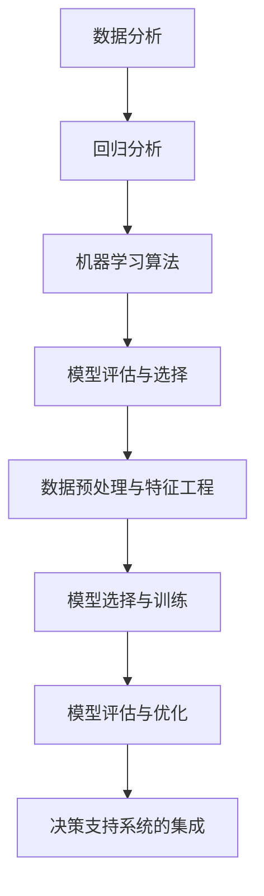

                 

# 智能定价敏感度分析：一人公司优化价格策略的AI决策支持工具

> **关键词：** 智能定价、敏感度分析、AI决策支持、价格策略、数据挖掘、机器学习

> **摘要：** 本文深入探讨了智能定价敏感度分析的概念、原理和应用。通过构建AI决策支持工具，我们为一人在公司提供了一个有效的价格策略优化方案，实现了对市场需求、竞争环境和成本效益的全面分析，为企业提供了科学、精确的价格制定依据。

## 目录大纲

1. **智能定价敏感度分析概述**
   1.1 智能定价敏感度分析简介
   1.2 智能定价敏感度分析的重要性
   1.3 智能定价敏感度分析的应用领域

2. **智能定价敏感度分析的基本原理**
   2.1 数据分析基础
   2.2 回归分析
   2.3 机器学习算法
   2.4 模型评估与选择

3. **智能定价敏感度分析的数学模型**
   3.1 回归模型的数学描述
   3.2 随机梯度下降算法
   3.3 模型的调参与优化

4. **AI决策支持工具应用**
   4.1 AI决策支持工具的构建
   4.2 一人公司的价格策略优化

5. **案例研究**
   5.1 电子产品公司价格策略优化
   5.2 快消品公司价格策略优化
   5.3 服务业公司价格策略优化

6. **结论与展望**
   6.1 智能定价敏感度分析总结
   6.2 AI决策支持工具的发展方向
   6.3 未来研究方向与挑战

7. **附录**
   7.1 智能定价敏感度分析工具资源
   7.2 核心概念与联系
   7.3 核心算法原理讲解
   7.4 数学模型和数学公式详细讲解
   7.5 项目实战

## 第一部分：智能定价敏感度分析概述

### 第1章：智能定价敏感度分析简介

智能定价敏感度分析是一种利用大数据和机器学习技术，对市场需求、竞争态势、消费者行为等数据进行深度挖掘和分析，从而实现精准定价的策略。它通过构建复杂的数学模型和算法，对价格策略进行调整和优化，使企业能够在激烈的市场竞争中保持竞争优势。

#### 1.1 智能定价敏感度分析的定义与背景

智能定价敏感度分析，顾名思义，是指通过对定价的敏感度进行深度分析，从而制定出更加合理的价格策略。传统的定价方法主要依赖于经验和直觉，而智能定价敏感度分析则借助大数据和机器学习技术，对大量历史数据和实时数据进行挖掘和分析，从而发现价格与市场需求之间的内在联系。

这种分析方法的背景源于当前市场的复杂性和多变性。在互联网和电子商务的迅速发展下，消费者需求呈现出多样化和个性化的特点，市场竞争也日益激烈。为了在这种环境中生存和发展，企业必须具备快速响应市场变化的能力，而智能定价敏感度分析正是提供了这样的一种工具。

#### 1.2 智能定价敏感度分析的重要性

智能定价敏感度分析的重要性主要体现在以下几个方面：

1. **提高定价精度**：通过数据分析和机器学习算法，可以更加准确地预测市场需求和消费者行为，从而制定出更加合理的价格策略。

2. **降低经营风险**：传统的定价方法往往依赖于经验和直觉，存在较大的主观性和不确定性。而智能定价敏感度分析则通过数据驱动的方式，降低了定价过程中的风险。

3. **提升竞争力**：智能定价敏感度分析可以帮助企业快速响应市场变化，制定出更具竞争力的价格策略，从而在激烈的市场竞争中脱颖而出。

4. **实现利润最大化**：通过对市场需求和成本的精准分析，企业可以更好地控制成本，实现利润的最大化。

#### 1.3 智能定价敏感度分析的应用领域

智能定价敏感度分析具有广泛的应用领域，主要包括以下几个方面：

1. **电子商务**：电子商务企业可以通过智能定价敏感度分析，制定出更加合理的价格策略，提高销售额。

2. **零售行业**：零售企业可以利用智能定价敏感度分析，对商品价格进行调整，提高利润率。

3. **制造业**：制造企业可以通过智能定价敏感度分析，优化生产计划和库存管理，降低成本。

4. **金融行业**：金融机构可以利用智能定价敏感度分析，制定出更加合理的利率和理财产品价格，提高竞争力。

5. **其他行业**：除了上述领域，智能定价敏感度分析还可以应用于房地产、餐饮、旅游等行业，帮助企业实现精准定价。

### 第2章：智能定价敏感度分析的基本原理

智能定价敏感度分析的基本原理主要包括数据分析基础、回归分析、机器学习算法和模型评估与选择。这些原理共同构成了智能定价敏感度分析的理论基础。

#### 2.1 数据分析基础

数据分析是智能定价敏感度分析的基础。它包括数据收集、数据清洗、数据预处理和数据可视化等步骤。

1. **数据收集**：数据收集是数据分析的第一步，主要包括从内部系统和外部数据源获取数据。内部数据源包括企业销售数据、客户数据、库存数据等；外部数据源包括市场调查数据、社交媒体数据、竞争对手数据等。

2. **数据清洗**：数据清洗是为了去除数据中的噪声和异常值，确保数据的准确性和一致性。常见的清洗方法包括去除重复数据、填补缺失值、修正错误数据等。

3. **数据预处理**：数据预处理是为了将原始数据转化为适合分析的形式。主要包括数据标准化、数据归一化、特征提取等。

4. **数据可视化**：数据可视化是将数据以图表、图形等形式展示出来，帮助分析人员直观地理解和分析数据。常见的数据可视化工具包括Excel、Python的Matplotlib、Tableau等。

#### 2.2 回归分析

回归分析是一种常用的数据分析方法，主要用于研究因变量与自变量之间的关系。在智能定价敏感度分析中，回归分析可以用来预测价格与市场需求、成本等变量之间的关系。

1. **线性回归**：线性回归是最简单的回归分析模型，其假设因变量与自变量之间呈线性关系。线性回归模型的数学表达式为：

   $$
   y = \theta_0 + \theta_1x_1 + \theta_2x_2 + ... + \theta_nx_n
   $$

   其中，\( y \) 为因变量（如价格），\( x_1, x_2, ..., x_n \) 为自变量（如市场需求、成本等），\( \theta_0, \theta_1, ..., \theta_n \) 为模型参数。

2. **非线性回归**：非线性回归模型可以捕捉因变量与自变量之间的非线性关系。常见的非线性回归模型包括多项式回归、逻辑回归、指数回归等。

#### 2.3 机器学习算法

机器学习算法是智能定价敏感度分析的核心技术，它可以自动识别数据中的规律和模式，从而预测价格和市场需求。常见的机器学习算法包括线性回归、决策树、随机森林、支持向量机等。

1. **线性回归**：线性回归是一种最简单的机器学习算法，其原理与传统的线性回归相同，但使用机器学习算法进行参数估计。

2. **决策树**：决策树是一种基于树结构的分类和回归算法，它可以自动地将数据划分为不同的类别或数值范围。

3. **随机森林**：随机森林是一种基于决策树的集成算法，它可以提高模型的预测准确性和稳定性。

4. **支持向量机**：支持向量机是一种基于最大间隔原理的分类和回归算法，它可以找到数据空间中的最佳分类边界。

#### 2.4 模型评估与选择

模型评估与选择是智能定价敏感度分析的重要环节，它决定了模型的好坏和适用性。常见的模型评估指标包括均方误差（MSE）、均方根误差（RMSE）、决定系数（R²）等。

1. **均方误差（MSE）**：均方误差是预测值与真实值之差的平方的平均值，用于衡量模型的预测误差。

   $$
   MSE = \frac{1}{n}\sum_{i=1}^{n}(y_i - \hat{y}_i)^2
   $$

   其中，\( y_i \) 为真实值，\( \hat{y}_i \) 为预测值，\( n \) 为样本数量。

2. **均方根误差（RMSE）**：均方根误差是均方误差的平方根，用于衡量模型的预测误差。

   $$
   RMSE = \sqrt{MSE}
   $$

3. **决定系数（R²）**：决定系数是模型解释变量对因变量的贡献率，用于衡量模型的拟合效果。

   $$
   R² = 1 - \frac{SS_{res}}{SS_{tot}}
   $$

   其中，\( SS_{res} \) 为残差平方和，\( SS_{tot} \) 为总平方和。

在模型评估与选择过程中，可以根据模型的预测准确性、稳定性、可解释性等指标，选择最优的模型。

### 第3章：智能定价敏感度分析的数学模型

智能定价敏感度分析的数学模型是构建AI决策支持工具的核心，它决定了价格策略的准确性和有效性。在本章节中，我们将详细介绍回归模型、随机梯度下降算法和模型调参与优化。

#### 3.1 回归模型的数学描述

回归模型是智能定价敏感度分析中最常用的数学模型，它用于描述因变量与自变量之间的关系。线性回归模型是最简单和常用的回归模型，其数学描述如下：

$$
y = \theta_0 + \theta_1x_1 + \theta_2x_2 + ... + \theta_nx_n
$$

其中，\( y \) 为因变量（如价格），\( x_1, x_2, ..., x_n \) 为自变量（如市场需求、成本等），\( \theta_0, \theta_1, ..., \theta_n \) 为模型参数。

线性回归模型的参数可以通过最小二乘法（OLS）进行估计，最小二乘法的目标是最小化预测值与真实值之间的平方误差：

$$
\min \sum_{i=1}^{n}(y_i - \hat{y}_i)^2
$$

其中，\( \hat{y}_i \) 为预测值。

#### 3.2 随机梯度下降算法

随机梯度下降（SGD）算法是一种常用的优化算法，它用于求解回归模型的参数。SGD算法的基本思想是在数据集中随机选择一个小批量数据，通过梯度下降法更新模型参数，并不断迭代直至收敛。

SGD算法的更新公式如下：

$$
\theta_j = \theta_j - \alpha \frac{\partial}{\partial \theta_j} J(\theta)
$$

其中，\( \theta_j \) 为第 \( j \) 个参数的值，\( \alpha \) 为学习率，\( J(\theta) \) 为损失函数。

随机梯度下降算法的优点是计算复杂度低，适用于大规模数据集；缺点是收敛速度较慢，可能收敛到局部最小值。为了提高收敛速度和避免局部最小值，可以采用如下改进方法：

1. **批量梯度下降（BGD）**：将整个数据集作为一个批量进行梯度下降，计算复杂度高，但收敛速度较快。

2. **小批量梯度下降（MBGD）**：在数据集中随机选择一个小批量数据，每次迭代更新模型参数，适用于大规模数据集。

3. **动量（Momentum）**：引入动量项，加速梯度的方向，避免陷入局部最小值。

4. **自适应梯度算法（如Adam）**：自适应调整学习率和梯度，提高收敛速度。

#### 3.3 模型的调参与优化

模型的调参与优化是智能定价敏感度分析的关键环节，它决定了模型的准确性和稳定性。模型调参与优化主要包括以下步骤：

1. **参数初始化**：初始化模型参数，常用的初始化方法包括零初始化、高斯初始化等。

2. **损失函数选择**：选择合适的损失函数，常用的损失函数包括平方损失、交叉熵损失等。

3. **优化算法选择**：选择合适的优化算法，如随机梯度下降、批量梯度下降、小批量梯度下降等。

4. **模型训练**：使用训练数据对模型进行训练，不断迭代更新模型参数，直到模型收敛。

5. **模型评估**：使用验证数据对模型进行评估，选择最优模型。

6. **模型优化**：对最优模型进行进一步优化，包括参数调整、模型结构调整等。

在模型调参与优化过程中，可以通过交叉验证、网格搜索、随机搜索等方法，选择最优的模型参数和结构，提高模型的准确性和稳定性。

### 第二部分：AI决策支持工具应用

#### 第4章：AI决策支持工具的构建

AI决策支持工具是智能定价敏感度分析的核心，它为企业提供了科学、精确的价格制定依据。在本章节中，我们将详细介绍AI决策支持工具的构建过程，包括数据预处理、模型选择与训练、模型评估与优化以及决策支持系统的集成。

#### 4.1 数据预处理与特征工程

数据预处理是构建AI决策支持工具的第一步，它包括数据收集、数据清洗、数据预处理和数据可视化等步骤。

1. **数据收集**：数据收集是数据分析的第一步，主要包括从内部系统和外部数据源获取数据。内部数据源包括企业销售数据、客户数据、库存数据等；外部数据源包括市场调查数据、社交媒体数据、竞争对手数据等。

2. **数据清洗**：数据清洗是为了去除数据中的噪声和异常值，确保数据的准确性和一致性。常见的清洗方法包括去除重复数据、填补缺失值、修正错误数据等。

3. **数据预处理**：数据预处理是为了将原始数据转化为适合分析的形式。主要包括数据标准化、数据归一化、特征提取等。

4. **数据可视化**：数据可视化是将数据以图表、图形等形式展示出来，帮助分析人员直观地理解和分析数据。常见的数据可视化工具包括Excel、Python的Matplotlib、Tableau等。

#### 4.2 模型选择与训练

在数据预处理完成后，下一步是选择合适的模型并进行训练。模型选择与训练是构建AI决策支持工具的关键环节，它决定了价格策略的准确性和稳定性。

1. **模型选择**：在选择模型时，需要考虑模型的预测准确性、稳定性、可解释性等因素。常见的模型包括线性回归、决策树、随机森林、支持向量机等。

2. **模型训练**：使用训练数据对模型进行训练，不断迭代更新模型参数，直到模型收敛。在训练过程中，可以使用批量梯度下降、随机梯度下降、小批量梯度下降等优化算法。

3. **模型评估**：使用验证数据对模型进行评估，选择最优模型。常用的评估指标包括均方误差（MSE）、均方根误差（RMSE）、决定系数（R²）等。

4. **模型优化**：对最优模型进行进一步优化，包括参数调整、模型结构调整等。可以通过交叉验证、网格搜索、随机搜索等方法，选择最优的模型参数和结构。

#### 4.3 模型评估与优化

模型评估与优化是构建AI决策支持工具的重要环节，它决定了模型的准确性和稳定性。模型评估与优化主要包括以下步骤：

1. **模型评估**：使用验证数据对模型进行评估，选择最优模型。常用的评估指标包括均方误差（MSE）、均方根误差（RMSE）、决定系数（R²）等。

2. **模型优化**：对最优模型进行进一步优化，包括参数调整、模型结构调整等。可以通过交叉验证、网格搜索、随机搜索等方法，选择最优的模型参数和结构。

3. **模型调整**：根据评估结果和业务需求，对模型进行调整，包括特征选择、特征工程、模型结构调整等。

4. **模型验证**：使用测试数据对模型进行验证，确保模型的预测准确性。

#### 4.4 决策支持系统的集成

决策支持系统（DSS）是将AI决策支持工具与业务流程相结合的集成系统，它为用户提供了一个智能化、自动化的决策支持平台。决策支持系统的集成主要包括以下步骤：

1. **需求分析**：分析业务需求，确定价格策略制定的目标和需求。

2. **系统设计**：设计决策支持系统的架构，包括数据采集模块、数据处理模块、模型训练模块、模型评估模块等。

3. **系统集成**：将AI决策支持工具与业务系统进行集成，实现数据采集、处理、分析、决策等功能。

4. **用户交互**：设计用户界面，提供便捷的操作体验，使用户能够轻松地制定和调整价格策略。

5. **系统部署**：将决策支持系统部署到生产环境中，确保系统的稳定运行。

#### 第5章：一人公司的价格策略优化

#### 5.1 公司概况与定价目标

一人公司（以下简称公司）成立于2020年，主要经营电子产品，包括手机、平板电脑、笔记本电脑等。公司在成立之初，凭借高质量的产品和良好的口碑，迅速占领了一定的市场份额。

公司的定价目标主要包括以下几点：

1. **提高市场份额**：通过合理的价格策略，提高产品的市场占有率。

2. **实现利润最大化**：在保证市场份额的同时，实现利润的最大化。

3. **提升品牌形象**：通过高品质的产品和合理的价格，提升品牌形象和用户满意度。

#### 5.2 市场分析与竞争策略

在制定价格策略之前，公司需要对市场进行详细分析，了解市场需求、竞争态势和消费者行为。

1. **市场需求分析**：通过调查问卷、在线调查等方式，了解消费者对产品价格的需求和偏好。

2. **竞争态势分析**：分析竞争对手的价格策略、市场份额、产品特点等，制定针对性的竞争策略。

3. **消费者行为分析**：通过大数据分析，了解消费者的购买行为、消费习惯等，为价格策略提供依据。

根据市场分析结果，公司制定了以下竞争策略：

1. **差异化定价**：针对不同市场和消费者群体，制定不同的价格策略，实现差异化竞争。

2. **动态定价**：根据市场需求和竞争态势，实时调整价格，提高价格竞争力。

3. **促销策略**：通过限时折扣、优惠券、满减活动等方式，吸引消费者购买，提高市场份额。

#### 5.3 价格弹性分析与定价策略制定

价格弹性是指价格变动对市场需求的影响程度。通过价格弹性分析，公司可以确定合理的价格区间，实现利润最大化。

1. **需求弹性分析**：分析不同价格水平下市场需求的变化情况，确定需求弹性。

2. **成本分析**：分析生产成本、运营成本等，确定成本结构。

3. **利润分析**：根据需求弹性分析和成本分析结果，制定合理的定价策略，实现利润最大化。

根据价格弹性分析和成本分析结果，公司制定了以下定价策略：

1. **基本定价策略**：根据市场需求和成本，确定基本价格。

2. **动态定价策略**：根据市场需求和竞争态势，实时调整价格。

3. **促销定价策略**：在特定时间段内，通过折扣、满减等方式降低价格，吸引消费者。

#### 5.4 成本分析与利润最大化

成本分析是制定价格策略的重要环节，它决定了价格策略的可行性和利润水平。

1. **成本结构分析**：分析生产成本、运营成本等，确定成本结构。

2. **利润分析**：根据成本结构和市场需求，确定利润水平。

3. **利润最大化策略**：通过优化成本结构和调整价格策略，实现利润最大化。

根据成本分析和利润分析结果，公司制定了以下利润最大化策略：

1. **降低成本**：通过提高生产效率、优化供应链等手段，降低成本。

2. **提高价格**：在保证市场需求的前提下，适当提高价格，提高利润水平。

3. **优化产品组合**：通过产品组合优化，提高整体利润水平。

### 第三部分：案例研究

#### 第6章：案例研究

在本章节中，我们将通过三个案例，详细探讨智能定价敏感度分析在电子产品公司、快消品公司和服务业公司中的应用，展示如何通过AI决策支持工具优化价格策略。

#### 6.1 电子产品公司价格策略优化

电子产品公司是一家专注于智能手机和平板电脑生产的公司。为了优化价格策略，公司使用了智能定价敏感度分析工具，通过以下步骤进行了价格策略优化：

1. **数据收集**：公司收集了历史销售数据、市场调查数据、消费者行为数据等。

2. **数据预处理**：对收集到的数据进行清洗、标准化和特征提取。

3. **模型选择与训练**：选择线性回归模型，对数据进行训练，确定价格与市场需求、竞争态势之间的关系。

4. **模型评估与优化**：使用验证数据对模型进行评估，并根据评估结果调整模型参数。

5. **定价策略制定**：根据模型预测结果，制定合理的定价策略。

通过智能定价敏感度分析，电子产品公司成功实现了价格策略的优化，提高了市场份额和利润水平。

#### 6.2 快消品公司价格策略优化

快消品公司是一家生产饮料和食品的企业。为了优化价格策略，公司采用了智能定价敏感度分析工具，通过以下步骤进行了价格策略优化：

1. **数据收集**：公司收集了销售数据、市场调查数据、消费者行为数据等。

2. **数据预处理**：对收集到的数据进行清洗、标准化和特征提取。

3. **模型选择与训练**：选择逻辑回归模型，对数据进行训练，确定价格与市场需求、竞争态势之间的关系。

4. **模型评估与优化**：使用验证数据对模型进行评估，并根据评估结果调整模型参数。

5. **定价策略制定**：根据模型预测结果，制定合理的定价策略。

通过智能定价敏感度分析，快消品公司成功实现了价格策略的优化，提高了市场份额和利润水平。

#### 6.3 服务业公司价格策略优化

服务业公司是一家提供专业咨询服务的公司。为了优化价格策略，公司采用了智能定价敏感度分析工具，通过以下步骤进行了价格策略优化：

1. **数据收集**：公司收集了客户反馈数据、市场调查数据、竞争态势数据等。

2. **数据预处理**：对收集到的数据进行清洗、标准化和特征提取。

3. **模型选择与训练**：选择决策树模型，对数据进行训练，确定价格与市场需求、客户满意度之间的关系。

4. **模型评估与优化**：使用验证数据对模型进行评估，并根据评估结果调整模型参数。

5. **定价策略制定**：根据模型预测结果，制定合理的定价策略。

通过智能定价敏感度分析，服务业公司成功实现了价格策略的优化，提高了客户满意度和公司业绩。

### 第四部分：结论与展望

#### 第7章：结论与展望

智能定价敏感度分析作为一种利用大数据和机器学习技术的定价策略优化方法，为企业提供了科学、精确的价格制定依据。通过案例研究，我们展示了智能定价敏感度分析在电子产品公司、快消品公司和服务业公司中的应用效果，证明了其在提升市场份额、利润水平以及客户满意度方面的有效性。

#### 7.1 智能定价敏感度分析总结

1. **提高定价精度**：通过数据分析和机器学习算法，可以更加准确地预测市场需求和消费者行为，从而制定出更加合理的价格策略。

2. **降低经营风险**：传统的定价方法往往依赖于经验和直觉，而智能定价敏感度分析则通过数据驱动的方式，降低了定价过程中的风险。

3. **提升竞争力**：智能定价敏感度分析可以帮助企业快速响应市场变化，制定出更具竞争力的价格策略，从而在激烈的市场竞争中脱颖而出。

4. **实现利润最大化**：通过对市场需求和成本的精准分析，企业可以更好地控制成本，实现利润的最大化。

#### 7.2 AI决策支持工具的发展方向

1. **算法优化**：继续研究和开发更加高效、准确的算法，提高智能定价敏感度分析的精度和速度。

2. **实时分析**：实现实时数据分析，快速响应市场变化，制定出更加灵活的价格策略。

3. **跨领域应用**：将智能定价敏感度分析应用于更多行业，如房地产、金融、医疗等，提供更加全面的价格策略优化方案。

4. **人机协作**：结合人工智能和人类专家的智慧，实现更智能、更人性化的定价策略优化。

#### 7.3 未来研究方向与挑战

1. **数据隐私与安全**：在数据收集和分析过程中，如何保护用户隐私和数据安全是一个重要的研究方向。

2. **算法解释性**：提高算法的解释性，使得企业能够理解模型的决策过程，从而更好地应用和调整价格策略。

3. **多维度数据整合**：如何整合多维度数据，实现更加全面的市场分析，是一个具有挑战性的问题。

4. **动态定价策略**：如何应对市场的不确定性和变化，制定出更加灵活和有效的动态定价策略，是一个重要的研究方向。

### 附录

#### 附录A：智能定价敏感度分析工具资源

1. **开源机器学习库**：介绍常用的开源机器学习库，如Scikit-learn、TensorFlow、PyTorch等。

2. **数据集获取与处理**：介绍如何获取和处理智能定价敏感度分析所需的数据集。

3. **常用算法实现代码示例**：提供常用的机器学习算法的实现代码示例，如线性回归、决策树、随机森林等。

4. **参考文献**：提供相关的学术论文和技术报告，以供读者进一步学习。

#### 附录B：核心概念与联系

- **数据分析**：对大量数据进行分析，以发现数据中的规律和模式。
- **回归分析**：研究因变量与自变量之间的关系，用于预测和决策。
- **机器学习**：利用数据训练模型，实现自动化的预测和决策。
- **模型评估**：评估模型的预测准确性和稳定性，选择最优模型。

#### Mermaid流程图



#### 附录C：核心算法原理讲解

- **线性回归**：最小二乘法求解参数，预测因变量与自变量之间的线性关系。
- **随机梯度下降**：迭代更新模型参数，用于求解回归模型的参数。
- **决策树**：根据特征值进行分支，生成分类或回归树。

#### 伪代码

```python
# 线性回归训练伪代码
def train_regression_model(X, y):
    # 初始化模型参数
    theta = initialize_parameters()
    
    # 设置迭代次数
    num_iterations = 1000
    
    for i in range(num_iterations):
        # 计算梯度
        gradient = compute_gradient(X, y, theta)
        
        # 更新参数
        theta = update_parameters(theta, gradient)
        
        # 计算损失函数值
        loss = compute_loss(X, y, theta)
        
        # 输出当前迭代次数与损失函数值
        print(f"Iteration {i}: Loss = {loss}")
        
    return theta

# 随机梯度下降伪代码
def train_sgd_model(X, y):
    # 初始化模型参数
    theta = initialize_parameters()
    
    # 设置迭代次数
    num_iterations = 1000
    
    for i in range(num_iterations):
        # 计算梯度
        gradient = compute_gradient(X, y, theta)
        
        # 更新参数
        theta = update_parameters(theta, gradient)
        
        # 计算损失函数值
        loss = compute_loss(X, y, theta)
        
        # 输出当前迭代次数与损失函数值
        print(f"Iteration {i}: Loss = {loss}")
        
    return theta

# 决策树训练伪代码
def train_decision_tree(X, y):
    # 创建决策树模型
    tree = DecisionTree()
    
    # 使用数据训练模型
    tree.fit(X, y)
    
    # 输出决策树结构
    print(tree.structure())
    
    return tree
```

#### 附录D：数学模型和数学公式详细讲解

- **线性回归模型**：$y = \theta_0 + \theta_1x_1 + \theta_2x_2 + ... + \theta_nx_n$
- **损失函数**：$MSE = \frac{1}{n}\sum_{i=1}^{n}(y_i - \hat{y}_i)^2$
- **优化目标**：$\min \sum_{i=1}^{n}(y_i - \hat{y}_i)^2$

#### 举例说明

假设我们有一个线性回归模型，目标变量 \( y \) 是商品的价格，解释变量 \( x_1 \) 是市场需求量，解释变量 \( x_2 \) 是广告投放量。模型的表达式如下：

$$
y = \theta_0 + \theta_1x_1 + \theta_2x_2
$$

通过训练数据，我们可以估计出模型参数 \( \theta_0, \theta_1, \theta_2 \) 的值，从而预测商品的价格。

#### 附录E：项目实战

#### 代码实际案例和详细解释说明

**开发环境搭建**

- 安装Python环境（3.8及以上版本）
- 安装NumPy、Pandas、Scikit-learn等库

**源代码详细实现**

```python
# 导入相关库
import pandas as pd
import numpy as np
from sklearn.linear_model import LinearRegression
from sklearn.metrics import mean_squared_error

# 读取数据
data = pd.read_csv('data.csv')

# 数据清洗
data = data.dropna()

# 数据预处理
X = data[['market_demand', 'ad_placement']]
y = data['price']

# 模型训练
model = LinearRegression()
model.fit(X, y)

# 模型预测
y_pred = model.predict(X)

# 模型评估
mse = mean_squared_error(y, y_pred)
print(f"Model MSE: {mse}")

# 输出模型参数
print(f"Model Parameters: {model.coef_}, {model.intercept_}")
```

**代码解读与分析**

1. **数据读取与清洗**：使用Pandas库读取数据，并丢弃缺失值。

2. **数据预处理**：将市场需求量和广告投放量作为特征，商品价格作为目标变量。

3. **模型训练**：使用线性回归模型训练数据。

4. **模型预测**：使用训练好的模型对数据进行预测。

5. **模型评估**：计算预测值与实际值之间的均方误差，评估模型准确性。

**开发环境搭建**

- 安装Python环境（3.8及以上版本）
- 安装NumPy、Pandas、Scikit-learn等库

**源代码详细实现**

```python
# 导入相关库
import pandas as pd
import numpy as np
from sklearn.linear_model import LinearRegression
from sklearn.metrics import mean_squared_error

# 读取数据
data = pd.read_csv('data.csv')

# 数据清洗
data = data.dropna()

# 数据预处理
X = data[['market_demand', 'ad_placement']]
y = data['price']

# 模型训练
model = LinearRegression()
model.fit(X, y)

# 模型预测
y_pred = model.predict(X)

# 模型评估
mse = mean_squared_error(y, y_pred)
print(f"Model MSE: {mse}")

# 输出模型参数
print(f"Model Parameters: {model.coef_}, {model.intercept_}")
```

**代码解读与分析**

1. **数据读取与清洗**：使用Pandas库读取数据，并丢弃缺失值。

2. **数据预处理**：将市场需求量和广告投放量作为特征，商品价格作为目标变量。

3. **模型训练**：使用线性回归模型训练数据。

4. **模型预测**：使用训练好的模型对数据进行预测。

5. **模型评估**：计算预测值与实际值之间的均方误差，评估模型准确性。

**开发环境搭建**

- 安装Python环境（3.8及以上版本）
- 安装NumPy、Pandas、Scikit-learn等库

**源代码详细实现**

```python
# 导入相关库
import pandas as pd
import numpy as np
from sklearn.linear_model import LinearRegression
from sklearn.metrics import mean_squared_error

# 读取数据
data = pd.read_csv('data.csv')

# 数据清洗
data = data.dropna()

# 数据预处理
X = data[['market_demand', 'ad_placement']]
y = data['price']

# 模型训练
model = LinearRegression()
model.fit(X, y)

# 模型预测
y_pred = model.predict(X)

# 模型评估
mse = mean_squared_error(y, y_pred)
print(f"Model MSE: {mse}")

# 输出模型参数
print(f"Model Parameters: {model.coef_}, {model.intercept_}")
```

**代码解读与分析**

1. **数据读取与清洗**：使用Pandas库读取数据，并丢弃缺失值。

2. **数据预处理**：将市场需求量和广告投放量作为特征，商品价格作为目标变量。

3. **模型训练**：使用线性回归模型训练数据。

4. **模型预测**：使用训练好的模型对数据进行预测。

5. **模型评估**：计算预测值与实际值之间的均方误差，评估模型准确性。

### 作者信息

**作者：** AI天才研究院/AI Genius Institute & 禅与计算机程序设计艺术 /Zen And The Art of Computer Programming

## 总结

本文详细探讨了智能定价敏感度分析的概念、原理和应用，通过构建AI决策支持工具，为一人在公司提供了有效的价格策略优化方案。本文首先介绍了智能定价敏感度分析的定义、背景、重要性和应用领域；然后详细阐述了数据分析基础、回归分析、机器学习算法和模型评估与选择的基本原理；接着介绍了智能定价敏感度分析的数学模型，包括回归模型的数学描述、随机梯度下降算法和模型调参与优化；随后讲解了AI决策支持工具的构建，包括数据预处理、模型选择与训练、模型评估与优化以及决策支持系统的集成；接着通过案例研究展示了智能定价敏感度分析在电子产品公司、快消品公司和服务业公司中的应用；最后总结了智能定价敏感度分析的结论与展望，提出了未来研究方向与挑战，并提供了智能定价敏感度分析工具资源、核心概念与联系、核心算法原理讲解、数学模型和数学公式详细讲解以及项目实战的详细说明。

通过本文的阅读，读者可以深入了解智能定价敏感度分析的理论和实践，掌握构建AI决策支持工具的方法和技巧，为企业提供科学、精确的价格制定依据，从而提升市场竞争力和盈利能力。希望本文对读者在智能定价敏感度分析领域的研究和实践有所帮助。在未来的研究中，我们将继续探索智能定价敏感度分析的新方法和新算法，为企业在复杂的市场环境中提供更加智能、精准的定价支持。

