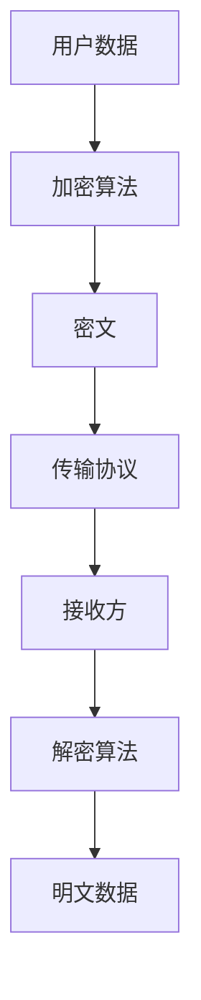
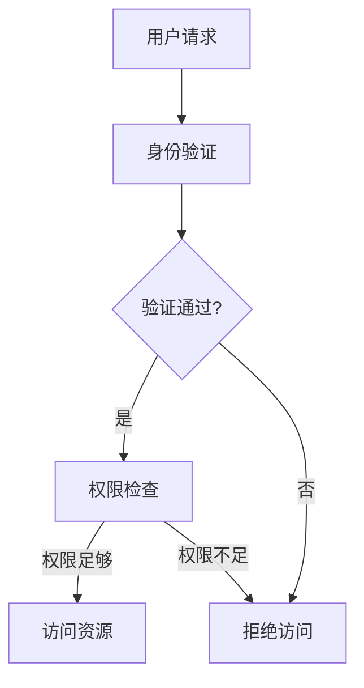

                 

# 《智能设备隐私保护措施：安全处理和传输个人信息》

> **关键词：** 智能设备、隐私保护、数据加密、匿名化、访问控制、安全通信、安全存储

> **摘要：** 随着智能设备在日常生活和工作中越来越普及，个人信息的保护成为了一个严峻的问题。本文将探讨智能设备隐私保护的背景和重要性，分析隐私保护的基本概念和技术，详细讲解数据加密与哈希算法、匿名化处理技术、访问控制与权限管理、安全通信协议以及安全存储与数据销毁等关键技术。同时，还将介绍智能设备隐私保护的实践方法和前沿技术与发展趋势。通过本文的阅读，读者将全面了解智能设备隐私保护的原理和实践，提高对个人信息的保护意识。

---

## 目录大纲

- 第一部分：隐私保护概述
  - 第1章：智能设备隐私保护的背景与重要性
  - 第2章：隐私保护的基本概念

- 第二部分：隐私保护技术
  - 第3章：数据加密与哈希算法
  - 第4章：匿名化处理技术
  - 第5章：访问控制与权限管理
  - 第6章：安全通信协议
  - 第7章：安全存储与数据销毁

- 第三部分：隐私保护实践
  - 第8章：智能设备隐私保护框架与实现
  - 第9章：隐私保护项目的实施与管理
  - 第10章：智能设备隐私保护的前沿技术与发展趋势

- 附录
  - 附录A：常用隐私保护技术参考
  - 附录B：示例流程图
  - 附录C：示例代码与解读

---

接下来，我们将深入探讨智能设备隐私保护的各个方面，帮助读者构建一个全面的知识体系，以应对日益复杂的隐私保护挑战。让我们一步一步地分析推理，深入探讨隐私保护的每一个环节。

### 第一部分：隐私保护概述

#### 第1章：智能设备隐私保护的背景与重要性

随着智能设备的广泛普及，人们的生活和工作方式发生了翻天覆地的变化。智能手机、平板电脑、智能手表、智能家居设备等已经成为我们日常生活中的必需品。然而，这些设备在为我们带来便捷的同时，也带来了隐私保护的挑战。

**1.1 智能设备隐私保护的需求**

智能设备通常具有以下特点：

1. **便携性**：智能设备体积小巧，可以随身携带，这使得它们更容易被黑客攻击。
2. **互联性**：智能设备通过无线网络与其他设备、云端平台连接，数据传输频繁，增加了信息泄露的风险。
3. **多功能性**：智能设备集成了多种功能，如相机、麦克风、GPS等，这些功能可能涉及到用户的隐私信息。

因此，保护智能设备中的个人信息变得尤为重要。以下是一些具体的隐私保护需求：

1. **防止信息泄露**：确保用户的个人信息不会被未经授权的人员访问或窃取。
2. **数据加密**：对传输和存储的数据进行加密，防止数据在传输过程中被窃听或篡改。
3. **访问控制**：通过权限管理和访问控制机制，确保只有授权用户可以访问敏感数据。
4. **匿名化处理**：对涉及个人身份的数据进行匿名化处理，降低隐私泄露的风险。

**1.2 隐私保护的法律与政策框架**

隐私保护已经成为全球各国关注的焦点。许多国家已经制定了相关的法律和政策来保护个人信息：

1. **欧盟通用数据保护条例（GDPR）**：欧盟在2018年实施了GDPR，对个人数据的收集、处理和存储提出了严格的要求，旨在保护欧盟公民的隐私权。
2. **美国加州消费者隐私法案（CCPA）**：加州消费者隐私法案要求企业在收集和处理加州居民个人信息时提供透明的信息，并赋予用户更多的控制权。
3. **中国个人信息保护法（PIPL）**：中国于2021年11月1日正式实施个人信息保护法，加强对个人信息的保护，规定了个人信息处理的基本原则和操作规范。

**1.3 智能设备隐私泄露案例解析**

尽管有法律和政策的保护，智能设备隐私泄露事件仍然屡见不鲜。以下是一些典型的案例：

1. **智能手表追踪用户活动**：某些智能手表会追踪用户的活动，如行走距离、消耗的卡路里等。然而，这些数据如果未经加密，就可能被黑客获取，用于跟踪用户的位置和健康状况。

2. **智能家居设备泄露用户信息**：智能家居设备，如智能摄像头、智能门锁等，通常连接到互联网。如果这些设备的安全措施不到位，黑客可以通过远程攻击获取用户的个人信息，甚至控制设备。

3. **手机应用滥用权限**：手机应用通常会请求用户的某些权限，如访问通讯录、摄像头、位置信息等。如果应用滥用权限，用户的信息就可能被泄露。

**1.4 隐私保护与数据利用的权衡**

在保护隐私的同时，我们也需要考虑数据利用的平衡。数据是现代社会的重要资源，合理利用数据可以带来创新和商业机会。然而，过度收集和使用数据可能会侵犯用户的隐私权。

为了实现隐私保护与数据利用的平衡，我们可以采取以下措施：

1. **最小化数据收集**：只收集实现功能所需的最小数据量，减少不必要的个人信息收集。
2. **透明化数据处理**：明确告知用户数据处理的目的、方式和范围，让用户明白自己的数据如何被使用。
3. **数据匿名化**：对涉及个人身份的数据进行匿名化处理，以降低隐私泄露的风险。
4. **隐私增强技术**：采用隐私增强技术，如差分隐私、安全多方计算等，在数据处理过程中保护用户的隐私。

通过以上措施，我们可以在保障用户隐私的同时，充分利用数据的价值，推动智能设备的发展和进步。

---

在接下来的章节中，我们将进一步探讨隐私保护的基本概念，包括隐私、匿名性和加密等关键技术。通过深入理解这些概念，我们将能够更好地应对智能设备隐私保护中的各种挑战。

## 第一部分：隐私保护概述

### 第2章：隐私保护的基本概念

在深入探讨智能设备的隐私保护之前，了解隐私保护的基本概念是至关重要的。本章节将介绍隐私、匿名性和加密等核心概念，并探讨它们在隐私保护中的重要性。

### 2.1 隐私、匿名性与加密

**隐私**：隐私是指个人或组织对其个人信息和活动的控制权。它涉及到个人对自己的身份、位置、行为和思想的保护。在智能设备隐私保护中，隐私是用户最关心的问题之一。确保用户隐私不受侵犯是智能设备设计和使用过程中需要考虑的首要因素。

**匿名性**：匿名性是指在不暴露个人身份的情况下处理和传输数据的能力。匿名化处理是隐私保护的重要手段之一。通过匿名化，我们可以将个人身份信息从数据中移除，从而降低隐私泄露的风险。匿名性在智能设备隐私保护中的应用包括匿名通信、匿名数据收集和分析等。

**加密**：加密是一种将数据转换为不可读形式的技术，只有具有正确密钥的用户才能解密并读取数据。加密是保护数据隐私的关键技术。在智能设备中，加密技术广泛应用于数据的传输、存储和保护。常见的加密技术包括对称加密、非对称加密和哈希算法。

### 2.2 数据分类与敏感度评估

为了有效地进行隐私保护，我们需要对数据进行分类和敏感度评估。数据分类有助于我们识别哪些数据对隐私保护至关重要，从而采取相应的保护措施。

**数据分类**：根据数据的类型和用途，我们可以将数据分为以下几类：

1. **公开数据**：这类数据不包含任何敏感信息，可以公开分享，如天气预报、新闻报道等。
2. **内部数据**：这类数据仅供内部使用，不对外公开，如公司内部通讯录、员工薪酬信息等。
3. **敏感数据**：这类数据包含个人身份信息、金融信息、医疗信息等，对隐私保护至关重要。
4. **隐私数据**：这类数据包含个人偏好、习惯、社交关系等，可能涉及隐私，但不如敏感数据重要。

**敏感度评估**：敏感度评估是确定数据对隐私保护需求的重要步骤。通过敏感度评估，我们可以确定哪些数据需要特别保护，从而采取相应的加密、匿名化和访问控制措施。

敏感度评估通常包括以下步骤：

1. **数据识别**：识别所有可能包含敏感信息的字段和数据类型。
2. **风险分析**：分析数据泄露可能带来的风险，如身份盗窃、财产损失等。
3. **合规性检查**：检查数据是否符合相关法律法规和行业标准，如GDPR、CCPA等。
4. **评估等级**：根据风险分析和合规性检查结果，将数据分为不同等级，采取相应的保护措施。

### 2.3 隐私保护关键技术概述

在智能设备的隐私保护中，多种关键技术可以协同工作，提供全方位的保护。以下是几种关键技术的概述：

**数据加密**：数据加密是保护数据隐私的基础技术。通过加密，我们可以确保数据在传输和存储过程中不会被未经授权的人员访问。数据加密包括对称加密、非对称加密和哈希算法。

**匿名化处理**：匿名化处理是将个人身份信息从数据中移除的过程。通过匿名化处理，我们可以降低隐私泄露的风险，确保用户数据的安全。匿名化处理包括数据脱敏、数据混淆、数据聚合等技术。

**访问控制与权限管理**：访问控制与权限管理是确保只有授权用户可以访问敏感数据的重要措施。通过访问控制，我们可以定义用户对数据的访问权限，防止未经授权的访问。常见的访问控制机制包括基于角色的访问控制（RBAC）、基于属性的访问控制（ABAC）等。

**安全通信协议**：安全通信协议是确保数据在传输过程中不被窃听或篡改的重要技术。常见的安全通信协议包括TLS/SSL、IPsec和VPN等。这些协议提供加密、认证和完整性保护，确保数据传输的安全。

**安全存储与数据销毁**：安全存储与数据销毁是确保数据在存储和销毁过程中的安全的重要措施。通过安全存储，我们可以确保数据在存储介质上不被篡改或泄露。数据销毁的方法包括物理销毁、逻辑销毁和彻底销毁等。

通过以上关键技术，我们可以为智能设备提供全方位的隐私保护，确保用户的信息安全。

在下一部分，我们将深入探讨隐私保护技术，包括数据加密与哈希算法、匿名化处理技术、访问控制与权限管理、安全通信协议以及安全存储与数据销毁等方面的内容。通过这些技术，我们将能够更好地保护智能设备中的个人信息。

## 第二部分：隐私保护技术

### 第3章：数据加密与哈希算法

数据加密和哈希算法是隐私保护的核心技术，它们在确保数据安全和隐私方面发挥着至关重要的作用。本章将详细探讨数据加密与哈希算法的基本原理、常见算法及其在隐私保护中的应用。

### 3.1 对称加密与非对称加密

**对称加密**：对称加密是一种加密算法，加密和解密过程使用相同的密钥。常见的对称加密算法有AES（高级加密标准）、DES（数据加密标准）和3DES（三重DES）。对称加密的优点是速度快、效率高，适合处理大量数据。然而，对称加密的主要缺点是密钥管理复杂，一旦密钥泄露，数据安全就受到威胁。

**非对称加密**：非对称加密是一种加密算法，加密和解密过程使用不同的密钥。常见的非对称加密算法有RSA（Rivest-Shamir-Adleman算法）和ECC（椭圆曲线加密）。非对称加密的优点是解决了密钥管理问题，密钥安全存储在用户设备中，即使加密算法被破解，攻击者也无法解密数据。然而，非对称加密的速度较慢，不适合处理大量数据。

**3.2 常见加密算法原理与应用**

**AES（高级加密标准）**：AES是当前最常用的对称加密算法。它采用128位、192位或256位密钥对数据进行加密和解密。AES具有高安全性、高效性和灵活性，适用于各种应用场景。

**DES（数据加密标准）**：DES是一种较早的对称加密算法，采用56位密钥对数据进行加密。由于密钥位数较短，DES的安全性较低，已逐渐被AES取代。

**3DES（三重DES）**：3DES是DES的扩展版本，采用三个密钥对数据进行加密。3DES的安全性较高，但效率较低，同样被AES取代。

**RSA（Rivest-Shamir-Adleman算法）**：RSA是一种非对称加密算法，采用两个密钥：公钥和私钥。公钥用于加密，私钥用于解密。RSA的安全性较高，但计算复杂度较高，适合处理小数据量的加密和签名。

**ECC（椭圆曲线加密）**：ECC是一种非对称加密算法，采用椭圆曲线数学原理。与RSA相比，ECC具有更高的安全性，同时计算复杂度较低，适合处理大数据量的加密和签名。

**3.3 哈希算法原理与应用**

哈希算法是一种将任意长度的数据映射为固定长度值的算法。哈希算法广泛应用于数据完整性验证、数字签名和密码学等领域。常见的哈希算法有MD5、SHA-1、SHA-256等。

**MD5**：MD5是一种快速哈希算法，将数据映射为128位的哈希值。然而，由于MD5的哈希值较短，已逐渐被其他算法取代。

**SHA-1**：SHA-1是一种较慢的哈希算法，将数据映射为160位的哈希值。尽管SHA-1的安全性较低，但仍在一些应用场景中使用。

**SHA-256**：SHA-256是一种较快的哈希算法，将数据映射为256位的哈希值。SHA-256具有高安全性和广泛的应用场景，是当前最常用的哈希算法。

**3.4 数据加密与哈希算法在隐私保护中的应用**

数据加密和哈希算法在隐私保护中的应用非常广泛。以下是一些典型的应用场景：

**数据加密**：
1. **数据传输安全**：在数据传输过程中，使用加密算法可以确保数据在传输过程中不被窃听或篡改。常见的应用场景包括HTTPS、FTP等。
2. **数据存储安全**：在数据存储过程中，使用加密算法可以确保数据在存储介质上不被未授权人员访问。常见的应用场景包括数据库加密、文件加密等。
3. **数字签名**：在数字签名过程中，使用加密算法可以确保签名的唯一性和不可篡改性，常见应用场景包括电子邮件签名、电子合同等。

**哈希算法**：
1. **数据完整性验证**：使用哈希算法可以验证数据的完整性，确保数据在传输和存储过程中未被篡改。常见的应用场景包括文件完整性校验、数据传输验证等。
2. **数字签名**：在数字签名过程中，使用哈希算法可以确保签名的唯一性和不可篡改性，常见应用场景包括电子邮件签名、电子合同等。
3. **密码存储**：在密码存储过程中，使用哈希算法可以确保密码的安全性，即使数据库被泄露，攻击者也无法获取明文密码。

通过数据加密和哈希算法，我们可以为智能设备提供强大的隐私保护，确保用户的数据安全和隐私。

在下一章节中，我们将继续探讨匿名化处理技术，介绍匿名化处理的方法、隐私保护计算模型以及匿名化算法的挑战与改进。

## 第三部分：隐私保护实践

### 第8章：智能设备隐私保护框架与实现

在前面的章节中，我们详细介绍了隐私保护的基本概念和技术。然而，这些技术如何在实际应用中发挥作用，构建一个完整的智能设备隐私保护框架至关重要。本章将探讨智能设备隐私保护框架的设计原则、实现策略以及实际案例分析。

### 8.1 智能设备隐私保护框架设计

智能设备隐私保护框架的设计应遵循以下原则：

1. **全面性**：框架应覆盖智能设备的各个环节，包括数据收集、传输、存储和处理。
2. **灵活性**：框架应具有灵活性，能够适应不同设备和应用场景的需求。
3. **可扩展性**：框架应具备可扩展性，以应对未来技术发展和隐私保护需求的变化。
4. **安全性**：框架应采用多种隐私保护技术，确保数据安全和用户隐私不受侵害。

智能设备隐私保护框架通常包括以下模块：

1. **数据收集模块**：负责收集用户数据，并进行初步的隐私保护处理，如匿名化处理和加密。
2. **数据传输模块**：负责数据在网络中的传输，采用加密和安全通信协议，确保数据在传输过程中的安全性。
3. **数据存储模块**：负责数据的存储和管理，采用加密和安全存储技术，确保数据在存储介质上的安全性。
4. **数据处理模块**：负责对数据进行处理和分析，采用隐私增强技术和安全计算模型，确保数据处理过程中的安全性。
5. **隐私保护监控模块**：负责实时监控隐私保护状态，发现潜在的安全威胁并及时响应。

### 8.2 智能设备隐私保护实现策略

智能设备隐私保护实现策略包括以下几个方面：

1. **数据分类与敏感度评估**：对收集的数据进行分类和敏感度评估，识别敏感数据并采取相应的保护措施。
2. **数据加密**：对敏感数据进行加密处理，确保数据在传输和存储过程中的安全性。采用对称加密和非对称加密相结合的方法，提高数据加密的安全性。
3. **匿名化处理**：对涉及个人身份的数据进行匿名化处理，降低隐私泄露的风险。采用多种匿名化技术，如数据脱敏、数据混淆和数据聚合等，提高匿名化的效果。
4. **访问控制与权限管理**：实施访问控制机制，确保只有授权用户可以访问敏感数据。采用基于角色的访问控制（RBAC）和基于属性的访问控制（ABAC）等机制，提高访问控制的灵活性和安全性。
5. **安全通信协议**：采用安全通信协议，如TLS/SSL、IPsec和VPN等，确保数据在传输过程中的安全性。配置合适的加密算法和协议参数，提高通信安全。
6. **安全存储与数据销毁**：采用安全存储技术，如数据库加密、文件加密和固态硬盘（SSD）的数据销毁等，确保数据在存储介质上的安全性。制定严格的数据销毁策略，确保数据在销毁过程中的彻底性和安全性。

### 8.3 智能设备隐私保护实践案例分析

以下是一个智能设备隐私保护实践案例分析：

**案例：智能家居设备隐私保护**

智能家居设备，如智能摄像头、智能门锁和智能灯光系统，涉及到用户的个人隐私和安全。以下是一个智能家居设备隐私保护实践案例：

1. **数据收集模块**：智能家居设备收集用户的行为数据，如门锁开关记录、摄像头拍摄的视频和图像等。数据收集模块对收集的数据进行匿名化处理，移除个人身份信息，降低隐私泄露风险。

2. **数据传输模块**：数据传输模块采用TLS/SSL协议进行数据传输，确保数据在传输过程中的安全性。配置合适的加密算法和协议参数，如AES-256和RSA等，提高数据传输的安全性。

3. **数据存储模块**：数据存储模块采用数据库加密技术，对存储的数据进行加密处理，确保数据在存储介质上的安全性。采用多种加密算法和密钥管理策略，提高数据加密的安全性。

4. **数据处理模块**：数据处理模块采用隐私增强技术，如差分隐私和安全多方计算，确保数据处理过程中的安全性。采用差分隐私技术，对用户的行为数据进行扰动处理，降低隐私泄露风险。

5. **隐私保护监控模块**：隐私保护监控模块实时监控智能家居设备的隐私保护状态，发现潜在的安全威胁并及时响应。采用入侵检测系统和安全监控工具，提高隐私保护监控的效果。

通过以上实践案例，我们可以看到智能设备隐私保护框架在实际应用中的效果。通过全面的设计和严格的实施策略，智能家居设备可以有效保护用户的隐私和安全。

在下一章中，我们将探讨隐私保护项目的实施与管理，包括项目生命周期管理、隐私保护风险评估与响应以及隐私保护团队的组建与培训等方面的内容。通过这些实践方法，我们将进一步巩固智能设备隐私保护的基础。

### 第9章：隐私保护项目的实施与管理

在智能设备隐私保护的实践中，项目的实施与管理是确保隐私保护措施得以有效执行的关键。本章将探讨隐私保护项目的生命周期管理、风险评估与响应以及隐私保护团队的组建与培训。

#### 9.1 隐私保护项目生命周期管理

隐私保护项目生命周期管理包括项目的规划、执行、监控和收尾等阶段。以下是每个阶段的关键步骤：

**规划阶段**：
- **需求分析**：明确隐私保护项目的目标和需求，包括数据分类、敏感度评估和所需的保护措施。
- **资源规划**：确定项目所需的资源，如人员、技术和预算。
- **时间规划**：制定项目的时间表，明确各个阶段的开始和结束时间。

**执行阶段**：
- **项目启动**：正式开始项目，分配任务和职责，确保团队成员了解项目目标和预期成果。
- **风险管理**：识别潜在的风险，制定相应的风险应对策略。
- **质量控制**：监控项目进度和质量，确保隐私保护措施得到有效实施。

**监控阶段**：
- **进度跟踪**：定期检查项目进度，确保按计划进行。
- **变更管理**：处理项目过程中的变更请求，确保项目目标的实现。

**收尾阶段**：
- **项目验收**：确认项目成果符合预期，用户和利益相关者满意。
- **项目总结**：总结项目经验教训，为未来的项目提供参考。

#### 9.2 隐私保护风险评估与响应

隐私保护风险评估是识别和分析项目过程中可能面临的隐私风险，并制定相应的应对措施。以下是风险评估与响应的关键步骤：

**风险评估**：
- **风险识别**：识别项目过程中可能面临的隐私风险，如数据泄露、未经授权的访问和恶意攻击等。
- **风险分析**：评估风险的概率和影响，确定风险等级。
- **风险应对**：制定相应的风险应对策略，如风险规避、风险转移和风险减轻等。

**响应计划**：
- **应急响应**：制定应急响应计划，确保在发生隐私泄露事件时能够迅速响应和处置。
- **监控与改进**：持续监控隐私保护状态，发现新的风险并改进隐私保护措施。

#### 9.3 隐私保护团队的组建与培训

隐私保护团队的组建与培训是确保项目成功实施的重要保障。以下是组建和培训隐私保护团队的关键步骤：

**组建团队**：
- **明确职责**：确定团队成员的角色和职责，如项目经理、安全工程师、隐私保护分析师等。
- **技能与经验**：确保团队成员具备所需的技能和经验，能够有效地执行隐私保护任务。
- **沟通协作**：建立有效的沟通协作机制，确保团队成员之间的信息共享和协作。

**培训与提升**：
- **基础知识培训**：为团队成员提供隐私保护基础知识培训，包括隐私保护概念、法律法规和最佳实践等。
- **技能提升**：根据团队成员的职责，提供专业技能培训，如加密技术、安全通信协议和风险管理等。
- **持续学习**：鼓励团队成员持续学习和关注隐私保护领域的最新动态，提高隐私保护能力。

通过有效的项目生命周期管理、全面的风险评估与响应以及专业的团队组建与培训，我们可以确保智能设备隐私保护项目得以成功实施和管理。

在下一章中，我们将探讨智能设备隐私保护的前沿技术与发展趋势，包括差分隐私、安全多方计算和联邦学习等技术的应用与前景。通过了解这些前沿技术，我们将能够更好地应对智能设备隐私保护的挑战。

### 第10章：智能设备隐私保护的前沿技术与发展趋势

随着人工智能和大数据技术的不断发展，智能设备的隐私保护面临新的挑战。本章将探讨智能设备隐私保护的前沿技术，包括差分隐私、安全多方计算和联邦学习，并分析这些技术在隐私保护中的应用与前景。

#### 10.1 前沿技术概览

**差分隐私**：差分隐私是一种隐私保护技术，通过对数据进行扰动处理，使得攻击者无法确定单个数据点的隐私，从而保护数据隐私。差分隐私的核心思想是在保证数据聚合结果近似真实的同时，最大限度地降低隐私泄露的风险。

**安全多方计算**：安全多方计算是一种分布式计算技术，允许多个参与方在不泄露各自数据的情况下，共同完成计算任务。安全多方计算可以保护参与方的隐私，避免数据泄露和中间人攻击。

**联邦学习**：联邦学习是一种分布式机器学习技术，允许多个参与方在不共享数据的情况下，共同训练机器学习模型。联邦学习通过在本地设备上进行数据预处理和模型训练，减少了数据传输和存储的需求，提高了隐私保护能力。

#### 10.2 未来隐私保护技术展望

随着技术的不断发展，未来隐私保护技术将更加智能化和高效化。以下是一些潜在的隐私保护技术发展方向：

**隐私增强技术**：隐私增强技术将进一步提升隐私保护能力，包括基于加密的隐私保护计算、基于差分隐私的数据分析等。这些技术将使得数据在处理过程中更加安全，降低隐私泄露的风险。

**零知识证明**：零知识证明是一种证明机制，允许证明者证明某个陈述的真实性，而不泄露任何相关信息。零知识证明在隐私保护中的应用前景广阔，可以用于身份验证、数据共享和智能合约等领域。

**区块链技术**：区块链技术具有去中心化、不可篡改和安全透明的特点，可以为智能设备隐私保护提供新的解决方案。区块链技术可以用于构建安全的隐私保护框架，实现数据共享和交易的透明性。

#### 10.3 技术发展趋势分析

**技术融合**：未来的隐私保护技术将更加融合多种技术，如加密、分布式计算、人工智能等。这些技术的融合将使得隐私保护更加智能化和高效化，满足不断变化的隐私保护需求。

**标准化与合规性**：随着隐私保护法规的不断加强，隐私保护技术的标准化和合规性将成为重要趋势。隐私保护技术需要遵循相关法律法规和行业标准，确保数据的安全和合规性。

**用户参与**：用户在隐私保护中的参与度将逐渐提高。未来的隐私保护技术将更加注重用户的隐私意识和隐私选择权，提供更加灵活的隐私保护选项，让用户能够更好地掌控自己的个人信息。

通过分析前沿技术和发展趋势，我们可以看到智能设备隐私保护正朝着更加智能化、高效化和用户参与化的方向发展。这些技术将为智能设备隐私保护提供新的解决方案，助力智能设备的可持续发展。

在本文的结尾，我们回顾了智能设备隐私保护的背景与重要性，探讨了隐私保护的基本概念和技术，深入分析了数据加密与哈希算法、匿名化处理技术、访问控制与权限管理、安全通信协议以及安全存储与数据销毁等关键技术，并介绍了智能设备隐私保护的实践方法和前沿技术与发展趋势。通过本文的阅读，读者应能够全面了解智能设备隐私保护的原理和实践，提高对个人信息的保护意识。

在未来的智能设备发展中，隐私保护将始终是一个重要议题。随着技术的不断进步，隐私保护技术也将不断创新和优化，为用户带来更加安全、便捷的智能生活。让我们共同努力，守护我们的个人信息，共创一个安全的智能设备环境。

### 附录

#### 附录A：常用隐私保护技术参考

**A.1 常见加密算法与协议列表**

- **对称加密算法**：AES、DES、3DES
- **非对称加密算法**：RSA、ECC
- **哈希算法**：MD5、SHA-1、SHA-256
- **安全通信协议**：TLS/SSL、IPsec、VPN
- **加密库**：OpenSSL、LibreSSL、GnuTLS

**A.2 隐私保护工具与库**

- **加密工具**：GnuPG、AESCrypt、PyCrypto
- **匿名化工具**：MinHash、k-anonymity、L-diversity
- **访问控制工具**：LDAP、SAML、OAuth 2.0
- **隐私保护计算框架**：Safecore、Prism、PyTorch Crypt

**A.3 隐私保护技术资源链接**

- **加密算法标准**：NIST Cryptographic Standards
- **隐私保护法规**：GDPR、CCPA、PIPL
- **开源隐私保护项目**：PySyft、Fediverse、CipherCloud

#### 附录B：示例流程图

**B.1 数据加密与传输流程图**



**B.2 访问控制与权限管理流程图**



#### 附录C：示例代码与解读

**C.1 数据加密与传输示例代码**

```python
# 导入加密库
from Crypto.Cipher import AES
from Crypto.Util.Padding import pad, unpad
from Crypto.Random import get_random_bytes

# AES加密算法
def aes_encrypt(plaintext, key):
    cipher = AES.new(key, AES.MODE_CBC)
    ct_bytes = cipher.encrypt(pad(plaintext.encode('utf-8'), AES.block_size))
    iv = cipher.iv
    return iv + ct_bytes

# AES解密算法
def aes_decrypt(ciphertext, key, iv):
    try:
        cipher = AES.new(key, AES.MODE_CBC, iv)
        pt = unpad(cipher.decrypt(ciphertext), AES.block_size)
        return pt.decode('utf-8')
    except (ValueError, KeyError):
        print("Invalid decryption!")

# 生成随机密钥
key = get_random_bytes(16)

# 加密文本
plaintext = "Hello, World!"
ciphertext = aes_encrypt(plaintext, key)

# 解密文本
iv = ciphertext[:16]
decrypted_text = aes_decrypt(ciphertext[16:], key, iv)

print(f"Original Text: {plaintext}")
print(f"Decrypted Text: {decrypted_text}")
```

**C.2 访问控制与权限管理示例代码**

```python
# 定义用户角色和权限
class User:
    def __init__(self, role):
        self.role = role

    def can_access(self, resource, permission):
        if self.role == "admin":
            return True
        elif self.role == "user":
            if permission == "read":
                return True
            else:
                return False
        else:
            return False

# 检查用户权限
def check_permission(user, resource, permission):
    if user.can_access(resource, permission):
        print(f"{user.role} has permission to {permission} {resource}.")
    else:
        print(f"{user.role} does not have permission to {permission} {resource}.")

# 创建用户
user_admin = User("admin")
user_user = User("user")

# 检查权限
check_permission(user_admin, "file", "read")
check_permission(user_user, "file", "write")
```

**C.3 示例代码解读与分析**

- **加密示例代码**：代码中使用了PyCryptodome库的AES加密算法进行数据加密和解密。首先，生成一个随机密钥，然后使用AES加密算法对明文进行加密，并将密文和初始向量（IV）进行拼接。解密过程则使用拼接后的密文和IV进行解密，返回明文。代码中还包含了异常处理，以防止密文和IV不匹配的情况。

- **访问控制示例代码**：代码中定义了一个`User`类，用于表示用户的角色和权限。`can_access`方法根据用户的角色和请求的权限，判断用户是否有权限访问资源。`check_permission`函数则用于检查用户权限，并根据权限结果打印相应的信息。

通过这些示例代码，我们可以看到如何在实际应用中实现数据加密和访问控制，提高智能设备的隐私保护能力。在实际开发过程中，可以根据具体需求进行代码的扩展和优化。

### 作者信息

**作者：** AI天才研究院/AI Genius Institute & 禅与计算机程序设计艺术 /Zen And The Art of Computer Programming

---

感谢您的阅读，希望本文对您在智能设备隐私保护领域的研究和实践有所帮助。如果您有任何问题或建议，欢迎随时联系我们，我们将竭诚为您服务。让我们一起为打造一个安全、便捷的智能设备环境而努力。

