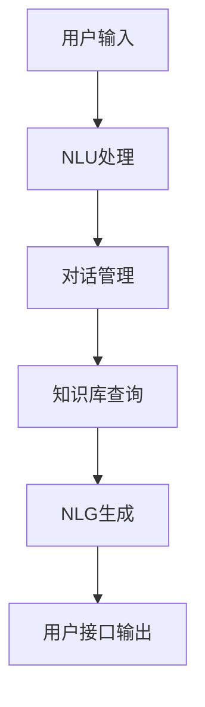
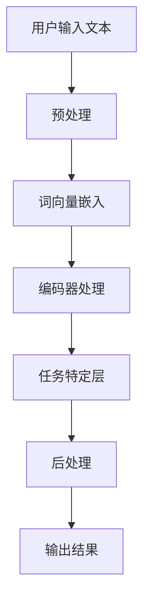
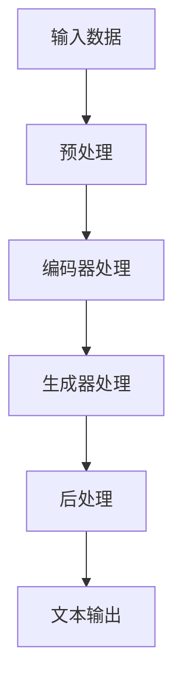
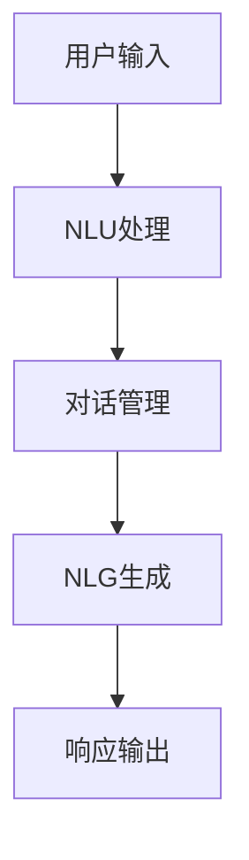
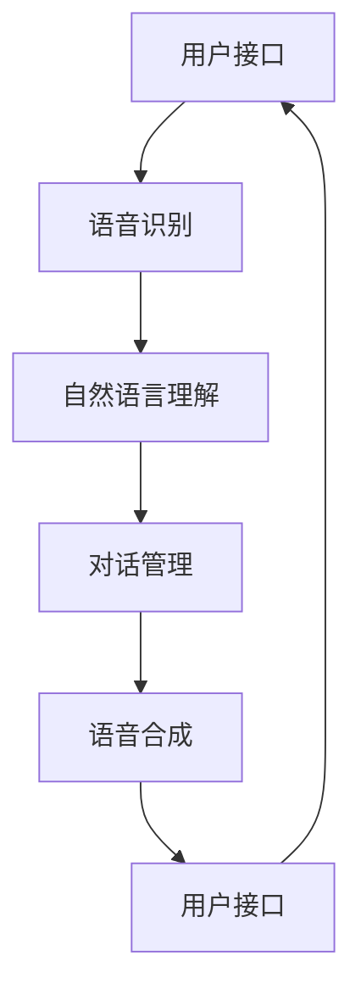
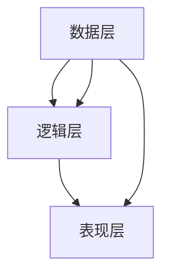

                 

# 《智能语音助手升级：AI大模型在对话系统中的突破》

> **关键词：**智能语音助手、AI大模型、对话系统、语音识别、语音合成、项目实战。

> **摘要：**本文将深入探讨智能语音助手的升级与AI大模型在对话系统中的应用。我们将从基础技术原理出发，逐步讲解AI大模型的优势与挑战，以及其在自然语言理解与生成中的具体应用。通过一个实际项目案例，读者将全面了解智能语音助手的开发流程、核心技术实现和优化策略。

## 目录大纲

1. **智能语音助手基础**
   - **第1章：智能语音助手概述**
     - 1.1 智能语音助手的发展历程
     - 1.2 智能语音助手的核心技术
     - 1.3 智能语音助手的市场需求与挑战
   - **第2章：语音识别与合成基础**
     - 2.1 语音识别原理与技术
     - 2.2 语音合成的技术原理
     - 2.3 常见语音识别与合成框架介绍

2. **AI大模型在对话系统中的应用**
   - **第3章：AI大模型概述**
     - 3.1 AI大模型的核心概念
     - 3.2 AI大模型的优势与挑战
     - 3.3 主流AI大模型介绍
   - **第4章：对话系统基础**
     - 4.1 对话系统的架构与流程
     - 4.2 对话系统的关键技术
     - 4.3 对话系统的评价指标
   - **第5章：AI大模型在对话系统中的应用**
     - 5.1 AI大模型在自然语言理解中的应用
     - 5.2 AI大模型在自然语言生成中的应用
     - 5.3 AI大模型在对话系统中的融合应用

3. **智能语音助手项目实战**
   - **第6章：智能语音助手项目规划与设计**
     - 6.1 项目需求分析与功能设计
     - 6.2 项目架构设计与技术选型
     - 6.3 项目开发流程与团队协作
   - **第7章：智能语音助手核心技术实现**
     - 7.1 语音识别与合成的实现细节
     - 7.2 AI大模型在自然语言理解与生成中的应用
     - 7.3 对话系统的设计与实现
   - **第8章：智能语音助手部署与优化**
     - 8.1 部署环境搭建与调试
     - 8.2 智能语音助手性能优化
     - 8.3 安全性与隐私保护

4. **附录**
   - **附录A：智能语音助手开发工具与资源**
     - A.1 常用语音识别与合成工具
     - A.2 常用AI大模型框架
     - A.3 开发资源与参考资料
   - **附录B：核心算法原理与伪代码**
     - B.1 语音识别算法原理与伪代码
     - B.2 语音合成算法原理与伪代码
     - B.3 AI大模型训练与优化算法原理与伪代码
   - **附录C：项目实战案例**
     - C.1 智能语音助手项目实战案例
     - C.2 项目源代码解读与分析
     - C.3 项目部署与优化实践

---

让我们从智能语音助手的基础开始，逐步深入探讨这个激动人心的领域。

## 第一部分：智能语音助手基础

### 第1章：智能语音助手概述

#### 1.1 智能语音助手的发展历程

智能语音助手（Smart Voice Assistant）的概念可以追溯到20世纪90年代，那时语音识别技术开始逐步发展，标志着智能语音助手的萌芽。早期的语音助手多为实验室级别的原型，功能有限，主要应用于特定场景。

进入21世纪，随着计算机性能的提升和深度学习技术的突破，语音识别和自然语言处理（NLP）取得了显著进展。2006年，Google推出语音搜索服务，标志着智能语音助手开始走向大众市场。随后，苹果、亚马逊、微软等科技巨头纷纷加入竞争，推出各自的智能语音助手产品，如Siri、Alexa、Cortana等。

近年来，随着物联网（IoT）和人工智能（AI）技术的快速发展，智能语音助手的应用场景和功能得到了极大扩展。从智能手机到智能家居，再到智能车载系统，智能语音助手正在逐渐融入人们的生活和工作。

#### 1.2 智能语音助手的核心技术

智能语音助手的核心技术主要包括语音识别（Speech Recognition）、语音合成（Text-to-Speech, TTS）和自然语言处理（Natural Language Processing, NLP）。

- **语音识别（Speech Recognition）**：语音识别技术是将语音信号转换为文本的过程。它通常涉及三个主要步骤：声音信号预处理、特征提取和模式匹配。深度学习技术的引入，尤其是卷积神经网络（CNN）和递归神经网络（RNN），显著提升了语音识别的准确率和效率。

  ```mermaid
  graph TD
  A[声音信号] --> B[预处理]
  B --> C[特征提取]
  C --> D[模式匹配]
  D --> E[文本输出]
  ```

- **语音合成（Text-to-Speech, TTS）**：语音合成是将文本转换为自然流畅的语音输出的技术。常见的语音合成方法包括基于规则的合成和统计模型合成。近年来，基于深度学习的WaveNet和Tacotron等模型在语音合成中取得了突破性进展。

  ```mermaid
  graph TD
  A[文本输入] --> B[TTS引擎]
  B --> C[特征提取]
  C --> D[语音生成]
  D --> E[音频输出]
  ```

- **自然语言处理（Natural Language Processing, NLP）**：自然语言处理技术是理解和生成人类语言的关键。它涉及文本分类、情感分析、命名实体识别、机器翻译等多个子领域。深度学习，特别是变换器（Transformer）架构，在NLP中发挥了重要作用。

  ```mermaid
  graph TD
  A[文本数据] --> B[NLP模型]
  B --> C[特征提取]
  B --> D[语义理解]
  D --> E[文本生成]
  ```

#### 1.3 智能语音助手的市场需求与挑战

智能语音助手的市场需求主要体现在以下几个方面：

1. **便捷性**：智能语音助手可以方便地通过语音指令完成各种任务，如查天气、发短信、设置闹钟等，节省了用户的操作时间。
2. **个性化**：智能语音助手可以根据用户的行为和偏好提供个性化的服务，如推荐音乐、书籍和新闻等。
3. **多场景应用**：智能语音助手可以应用于各种场景，包括智能家居、智能车载、智能客服等，提高了生活和工作效率。

然而，智能语音助手也面临着一些挑战：

1. **准确性**：语音识别的准确性仍然是一个亟待解决的问题，尤其是在噪声环境和方言识别方面。
2. **隐私保护**：用户数据的安全性和隐私保护是智能语音助手面临的重大挑战，特别是在语音识别和自然语言处理过程中。
3. **跨语言支持**：智能语音助手需要支持多种语言，这对语言模型和算法提出了更高的要求。

## 第二部分：AI大模型在对话系统中的应用

### 第2章：语音识别与合成基础

#### 2.1 语音识别原理与技术

语音识别（Speech Recognition）是将语音信号转换为文本的过程。它通常包括以下几个步骤：

1. **声音信号预处理**：包括去除噪音、放大信号、去除静音等操作，以提高信号质量。
2. **特征提取**：通过将语音信号转换为特征向量，如梅尔频率倒谱系数（MFCC）和短时傅里叶变换（STFT），以便于后续处理。
3. **模式匹配**：使用隐马尔可夫模型（HMM）、卷积神经网络（CNN）或递归神经网络（RNN）等模型进行模式匹配，以确定语音信号对应的文本。

以下是一个简单的语音识别算法伪代码：

```python
def speech_recognition(voice_signal):
    # 预处理
    preprocessed_signal = preprocess(voice_signal)
    
    # 特征提取
    features = extract_features(preprocessed_signal)
    
    # 模式匹配
    recognized_text = model.match(features)
    
    return recognized_text
```

#### 2.2 语音合成的技术原理

语音合成（Text-to-Speech, TTS）是将文本转换为自然流畅的语音输出的过程。常见的语音合成方法包括：

1. **基于规则的合成**：使用预先定义的语音规则和语音数据库进行合成。这种方法简单但缺乏灵活性。
2. **统计模型合成**：使用统计模型，如隐马尔可夫模型（HMM）和循环神经网络（RNN），通过训练生成语音。

以下是一个简单的语音合成算法伪代码：

```python
def text_to_speech(text):
    # 分词
    words = tokenize(text)
    
    # 生成语音
    audio_signal = tts_model.generate(words)
    
    # 输出音频
    play_audio(audio_signal)
```

#### 2.3 常见语音识别与合成框架介绍

1. **Kaldi**：Kaldi是一个开源的语音识别工具包，支持多种语音识别算法，包括HMM、GMM、RNN等。它提供了丰富的API和预训练模型，适用于研究和工业应用。
2. **ESPnet**：ESPnet是一个基于深度学习的语音识别工具包，支持端到端的语音识别模型，如CTC、Attention机制等。它提供了高效的训练和推理工具，适用于大规模语音数据集。
3. **pyTTS**：pyTTS是一个开源的语音合成工具包，支持多种TTS模型，如WaveNet、Tacotron等。它提供了简单易用的API，适用于快速原型开发和部署。

## 第三部分：AI大模型在对话系统中的应用

### 第3章：AI大模型概述

#### 3.1 AI大模型的核心概念

AI大模型（Large-scale AI Model）是指具有亿级参数量的深度学习模型。这些模型通过在海量数据上进行训练，能够自动学习和提取复杂的特征表示，从而在多种任务中表现出色。常见的AI大模型包括：

1. **Transformer**：Transformer是一种基于自注意力机制的深度学习模型，广泛应用于自然语言处理任务，如机器翻译、文本分类等。
2. **BERT**：BERT是一种预训练语言模型，通过在大量文本上进行训练，能够捕捉到语言的丰富特征，从而在下游任务中取得优异的性能。
3. **GPT**：GPT是一种生成式预训练语言模型，能够根据输入的文本生成连贯的自然语言，广泛应用于文本生成、问答系统等。

#### 3.2 AI大模型的优势与挑战

AI大模型的优势主要体现在以下几个方面：

1. **强大的特征提取能力**：通过在海量数据上进行训练，AI大模型能够自动学习和提取复杂的特征表示，从而在多种任务中表现出色。
2. **高效的模型压缩**：AI大模型支持模型压缩技术，如剪枝、量化等，可以显著降低模型的大小和计算成本。
3. **良好的泛化能力**：AI大模型在预训练阶段已经学习到了丰富的知识，因此在下游任务中能够很好地泛化，取得优异的性能。

然而，AI大模型也面临着一些挑战：

1. **计算资源需求大**：AI大模型的训练需要大量的计算资源和时间，对硬件设施和算法优化提出了较高的要求。
2. **数据隐私问题**：AI大模型在训练过程中需要使用大量用户数据，这对数据隐私和安全提出了严峻挑战。
3. **解释性和可控性**：AI大模型的黑盒性质使得其决策过程难以解释，从而影响其在实际应用中的可控性和可接受性。

#### 3.3 主流AI大模型介绍

1. **BERT**：BERT是一种基于Transformer的预训练语言模型，通过在大量文本上进行训练，能够捕捉到语言的丰富特征。BERT在文本分类、问答系统等任务中表现出色，是自然语言处理领域的重要模型。
2. **GPT**：GPT是一种生成式预训练语言模型，能够根据输入的文本生成连贯的自然语言。GPT在文本生成、对话系统等任务中表现出色，是自然语言生成领域的重要模型。
3. **T5**：T5是一种基于Transformer的通用预训练语言模型，将所有自然语言处理任务统一为一个统一的编码-解码框架。T5在多个自然语言处理任务中取得了优异的性能，是自然语言处理领域的重要模型。

## 第四部分：对话系统基础

### 第4章：对话系统基础

#### 4.1 对话系统的架构与流程

对话系统（Dialogue System）是一种能够与人类进行自然语言交互的计算机系统。一个典型的对话系统通常包括以下几个关键组件：

1. **用户接口（User Interface, UI）**：用户接口是用户与对话系统交互的界面，可以是文本聊天界面、语音界面或图形界面。
2. **对话管理器（Dialogue Manager）**：对话管理器是对话系统的核心组件，负责处理用户输入、维护对话状态和生成响应。对话管理器通常采用基于规则的方法、机器学习方法或混合方法。
3. **知识库（Knowledge Base）**：知识库是对话系统的知识存储单元，用于提供对话系统所需的事实信息和常识。知识库可以是结构化的（如关系数据库）或非结构化的（如文本库）。
4. **自然语言理解（Natural Language Understanding, NLU）**：自然语言理解是对话系统的组件，负责将用户输入的自然语言转换为结构化的数据表示。NLU通常包括词法分析、句法分析、语义分析等步骤。
5. **自然语言生成（Natural Language Generation, NLG）**：自然语言生成是对话系统的组件，负责将结构化的数据表示转换为自然语言输出。NLG通常采用模板匹配、统计模型或生成式模型。

以下是一个简单的对话系统架构流程图：



#### 4.2 对话系统的关键技术

对话系统涉及多个关键技术，以下是一些主要的关键技术：

1. **意图识别（Intent Recognition）**：意图识别是从用户输入中识别出用户意图的过程。常见的意图识别方法包括基于规则的方法、机器学习方法、深度学习方法等。
2. **实体识别（Entity Recognition）**：实体识别是从用户输入中识别出实体（如人名、地点、时间等）的过程。实体识别通常与意图识别结合使用，以提供更准确的对话理解。
3. **对话状态追踪（Dialogue State Tracking）**：对话状态追踪是维护对话状态的过程，用于记录对话过程中的关键信息，如用户意图、对话历史、用户偏好等。
4. **对话生成（Dialogue Generation）**：对话生成是将结构化的数据表示转换为自然语言输出的过程。常见的对话生成方法包括模板匹配、统计模型、生成式模型等。
5. **对话评估（Dialogue Evaluation）**：对话评估是对话系统的性能评估过程，用于评估对话系统的准确性、流畅性、用户体验等指标。常见的对话评估方法包括人工评估、自动化评估等。

#### 4.3 对话系统的评价指标

对话系统的评价指标用于评估对话系统的性能和质量，以下是一些常见的评价指标：

1. **准确性（Accuracy）**：准确性是意图识别和实体识别的评估指标，用于衡量识别结果的正确性。准确性越高，表示对话系统对用户意图和实体的理解越准确。
2. **流畅性（Fluency）**：流畅性是对话生成的评估指标，用于衡量对话生成的自然性和连贯性。流畅性越高，表示对话生成的文本越自然、连贯。
3. **用户满意度（User Satisfaction）**：用户满意度是用户体验的评估指标，用于衡量用户对对话系统的满意度。用户满意度越高，表示对话系统越符合用户期望。
4. **响应时间（Response Time）**：响应时间是系统处理用户输入并生成响应的时间。响应时间越短，表示系统处理速度越快。

## 第五部分：AI大模型在对话系统中的应用

### 第5章：AI大模型在对话系统中的应用

#### 5.1 AI大模型在自然语言理解中的应用

AI大模型在自然语言理解（NLU）中的应用是对话系统技术进步的重要驱动力。自然语言理解是对话系统的核心环节，负责将用户的自然语言输入转换成机器可以理解和处理的格式。AI大模型，如BERT、GPT和T5，通过其强大的语义理解能力，显著提升了自然语言理解的准确性和效率。

**核心概念与联系**

自然语言理解包括多个子任务，如意图识别、实体识别、语义角色标注等。这些任务相互关联，共同构成一个完整的自然语言理解过程。

**架构与流程**

以下是一个简化的自然语言理解流程：

1. **预处理**：对用户输入的文本进行预处理，包括分词、去停用词、词性标注等。
2. **词向量嵌入**：将预处理后的文本转换为词向量表示，常用的词向量模型包括Word2Vec、FastText等。
3. **编码器**：使用AI大模型（如BERT）对词向量进行编码，生成固定长度的序列表示。
4. **任务特定层**：在编码器的输出上添加任务特定层，用于执行意图识别、实体识别等任务。
5. **后处理**：对模型输出进行后处理，如实体识别结果进行标准化处理。

**Mermaid流程图**



**核心算法原理讲解**

BERT（Bidirectional Encoder Representations from Transformers）是一种双向变换器模型，通过在两个方向上对文本进行编码，能够捕捉到丰富的语义信息。BERT的训练过程包括预训练和微调两个阶段：

1. **预训练**：在大量无标签文本上进行预训练，模型学习到语言的深层语义表示。
2. **微调**：在特定任务上对模型进行微调，如意图识别、实体识别等。

以下是一个简化的BERT训练过程伪代码：

```python
def train_bert(train_data, task-specific_data):
    # 预训练
    model = bert_model.train(train_data)
    
    # 微调
    model = model.fit(task-specific_data)
    
    return model
```

**数学模型和公式**

BERT模型的核心是一个基于变换器的编码器，其输入和输出可以通过以下公式表示：

$$
\text{output} = \text{transformer}(\text{input})
$$

其中，输入为词向量序列，输出为编码后的序列表示。

**举例说明**

假设用户输入一个句子：“明天下午三点的会议，我需要准备哪些资料？”使用BERT模型进行意图识别和实体识别，可以得到以下结果：

- **意图识别**：准备会议资料
- **实体识别**：明天下午三点、会议、资料

**代码实现**

以下是一个简单的BERT意图识别和实体识别的Python代码实现：

```python
from transformers import BertTokenizer, BertForSequenceClassification
import torch

# 加载预训练的BERT模型和tokenizer
tokenizer = BertTokenizer.from_pretrained('bert-base-chinese')
model = BertForSequenceClassification.from_pretrained('bert-base-chinese')

# 用户输入
input_text = "明天下午三点的会议，我需要准备哪些资料？"

# 预处理输入
input_ids = tokenizer.encode(input_text, add_special_tokens=True)

# 转换为PyTorch张量
input_ids = torch.tensor(input_ids).unsqueeze(0)

# 进行意图识别和实体识别
with torch.no_grad():
    outputs = model(input_ids)

# 得到意图识别结果
intent_logits = outputs.logits

# 解码意图
intent = decode_intent(intent_logits)

# 得到实体识别结果
entity_logits = outputs.entity_logits

# 解码实体
entities = decode_entities(entity_logits)

print("意图：", intent)
print("实体：", entities)
```

### 5.2 AI大模型在自然语言生成中的应用

自然语言生成（NLG）是AI大模型在对话系统中的另一个重要应用领域。NLG的任务是将结构化的数据转换为自然流畅的文本输出，用于回复用户、生成聊天日志、创建报告等。AI大模型，如GPT和T5，通过其强大的文本生成能力，显著提升了NLG的性能和质量。

**核心概念与联系**

自然语言生成涉及多个子任务，如文本摘要、机器翻译、对话生成等。这些任务相互关联，共同构成了一个完整的文本生成过程。

**架构与流程**

以下是一个简化的自然语言生成流程：

1. **数据预处理**：对输入数据（如对话历史、报告模板等）进行预处理，包括分词、去停用词、词性标注等。
2. **编码器**：使用AI大模型（如GPT）对预处理后的文本进行编码，生成固定长度的序列表示。
3. **生成器**：在编码器的输出上添加生成器，用于生成文本输出。
4. **后处理**：对生成的文本进行后处理，如去除无关词、格式化输出等。

**Mermaid流程图**



**核心算法原理讲解**

GPT（Generative Pre-trained Transformer）是一种生成式预训练语言模型，通过在大量文本上进行预训练，能够生成连贯、自然的文本。GPT的训练过程包括预训练和微调两个阶段：

1. **预训练**：在大量文本上进行预训练，模型学习到语言的生成规则和统计特性。
2. **微调**：在特定任务上对模型进行微调，如文本摘要、对话生成等。

以下是一个简化的GPT训练过程伪代码：

```python
def train_gpt(train_data, task-specific_data):
    # 预训练
    model = gpt_model.train(train_data)
    
    # 微调
    model = model.fit(task-specific_data)
    
    return model
```

**数学模型和公式**

GPT模型的核心是一个基于变换器的生成器，其输入和输出可以通过以下公式表示：

$$
\text{output} = \text{generator}(\text{input}, \text{context})
$$

其中，输入为词向量序列，输出为生成的文本序列。

**举例说明**

假设需要生成一个回复文本，内容为：“明天下午三点的会议，我需要准备哪些资料？”，使用GPT模型进行文本生成，可以得到以下结果：

- **回复文本**：“您好，明天下午三点的会议，您需要准备会议议程、项目进展报告和客户反馈。”

**代码实现**

以下是一个简单的GPT文本生成Python代码实现：

```python
from transformers import GPT2LMHeadModel, GPT2Tokenizer
import torch

# 加载预训练的GPT模型和tokenizer
tokenizer = GPT2Tokenizer.from_pretrained('gpt2')
model = GPT2LMHeadModel.from_pretrained('gpt2')

# 用户输入
input_text = "明天下午三点的会议，我需要准备哪些资料？"

# 预处理输入
input_ids = tokenizer.encode(input_text, add_special_tokens=True)

# 转换为PyTorch张量
input_ids = torch.tensor(input_ids).unsqueeze(0)

# 进行文本生成
with torch.no_grad():
    outputs = model.generate(input_ids, max_length=50)

# 解码生成文本
generated_text = tokenizer.decode(outputs[0], skip_special_tokens=True)

print("生成文本：", generated_text)
```

### 5.3 AI大模型在对话系统中的融合应用

AI大模型在对话系统中的应用不仅仅是单独的NLU或NLG，更多的是两者的融合应用。通过将AI大模型应用于自然语言理解（NLU）和自然语言生成（NLG），可以构建出更智能、更自然的对话系统。

**核心概念与联系**

在对话系统中，AI大模型在NLU和NLG两个阶段发挥作用。NLU阶段，AI大模型用于理解用户的意图和提取关键信息；NLG阶段，AI大模型用于生成自然、连贯的回复。

**架构与流程**

以下是一个简化的融合应用流程：

1. **用户输入**：接收用户的输入文本。
2. **NLU处理**：使用AI大模型进行意图识别和实体提取，理解用户的意图。
3. **对话管理**：根据用户的意图和对话历史，决定系统的响应策略。
4. **NLG生成**：使用AI大模型生成自然、流畅的回复文本。
5. **响应输出**：将生成的文本输出给用户。

**Mermaid流程图**



**核心算法原理讲解**

在融合应用中，AI大模型通常采用预训练加微调的策略。预训练阶段，模型在大量无标签数据上进行训练，学习到语言的深层语义表示；微调阶段，模型在特定任务上进行微调，以适应具体的对话场景。

以下是一个简化的融合应用训练过程伪代码：

```python
def train_fusion_model(nlu_data, nlg_data, dialogue_data):
    # 预训练
    model = fusion_model.train(nlu_data, nlg_data)
    
    # 微调
    model = model.fit(dialogue_data)
    
    return model
```

**数学模型和公式**

在融合应用中，AI大模型通常采用编码器-解码器架构，其输入和输出可以通过以下公式表示：

$$
\text{output} = \text{decoder}(\text{encoder}(\text{input}))
$$

其中，输入为词向量序列，输出为生成的文本序列。

**举例说明**

假设用户输入一个句子：“明天下午三点的会议，我需要准备哪些资料？”，使用融合应用进行对话，可以得到以下结果：

- **意图识别**：“准备会议资料”
- **实体提取**：“明天下午三点”、“会议”、“资料”
- **回复文本**：“您好，明天下午三点的会议，您需要准备会议议程、项目进展报告和客户反馈。”

**代码实现**

以下是一个简单的融合应用Python代码实现：

```python
from transformers import BertTokenizer, BertForSequenceClassification, GPT2LMHeadModel, GPT2Tokenizer
import torch

# 加载预训练的BERT和GPT模型以及tokenizer
nlu_tokenizer = BertTokenizer.from_pretrained('bert-base-chinese')
nlu_model = BertForSequenceClassification.from_pretrained('bert-base-chinese')
gpt_tokenizer = GPT2Tokenizer.from_pretrained('gpt2')
gpt_model = GPT2LMHeadModel.from_pretrained('gpt2')

# 用户输入
input_text = "明天下午三点的会议，我需要准备哪些资料？"

# NLU处理
nlu_input_ids = nlu_tokenizer.encode(input_text, add_special_tokens=True)
nlu_input_ids = torch.tensor(nlu_input_ids).unsqueeze(0)

# 进行意图识别和实体提取
with torch.no_grad():
    nlu_outputs = nlu_model(nlu_input_ids)

# 解码意图
intent_logits = nlu_outputs.logits
intent = decode_intent(intent_logits)

# NLG生成
gpt_input_ids = gpt_tokenizer.encode(input_text, add_special_tokens=True)
gpt_input_ids = torch.tensor(gpt_input_ids).unsqueeze(0)

# 进行文本生成
with torch.no_grad():
    gpt_outputs = gpt_model.generate(gpt_input_ids, max_length=50)

# 解码生成文本
generated_text = gpt_tokenizer.decode(gpt_outputs[0], skip_special_tokens=True)

print("意图：", intent)
print("生成文本：", generated_text)
```

## 第六部分：智能语音助手项目实战

### 第6章：智能语音助手项目规划与设计

#### 6.1 项目需求分析与功能设计

在开始智能语音助手项目的开发之前，我们需要进行详细的需求分析和功能设计。这一阶段的主要任务是明确项目的目标和需求，并设计出相应的功能模块。

**项目目标**

智能语音助手项目的主要目标是实现一个能够与用户进行自然语言交互的系统，帮助用户完成各种任务，如查询信息、控制智能家居、设置提醒等。

**用户需求**

根据用户调研和需求分析，智能语音助手需要具备以下功能：

1. **语音识别**：能够准确识别用户的语音输入。
2. **语音合成**：能够生成自然、流畅的语音输出。
3. **意图识别**：能够理解用户的意图，并根据意图提供相应的服务。
4. **实体提取**：能够从用户的输入中提取关键信息，如时间、地点、人名等。
5. **对话管理**：能够维护对话状态，确保对话的连贯性和一致性。
6. **知识库管理**：能够存储和查询各种信息，如天气预报、新闻资讯等。

**功能模块设计**

根据项目目标和用户需求，我们可以将智能语音助手项目划分为以下几个主要功能模块：

1. **用户接口模块**：负责接收用户输入和输出语音交互。
2. **语音识别模块**：负责将语音信号转换为文本。
3. **语音合成模块**：负责将文本转换为语音信号。
4. **自然语言理解模块**：负责意图识别和实体提取。
5. **对话管理模块**：负责维护对话状态，确保对话的连贯性和一致性。
6. **知识库管理模块**：负责存储和查询各种信息。

**Mermaid流程图**



#### 6.2 项目架构设计与技术选型

智能语音助手项目的架构设计是确保项目稳定、高效和可扩展的关键。以下是一个简化的项目架构设计：

**整体架构**

智能语音助手项目可以分为三个主要层次：数据层、逻辑层和表现层。

1. **数据层**：负责存储和查询各种数据，如用户输入、对话历史、知识库等。常用的技术包括关系数据库（如MySQL）和非关系数据库（如MongoDB）。
2. **逻辑层**：负责处理用户输入、执行各种任务和生成响应。主要包括语音识别模块、自然语言理解模块、对话管理模块和知识库管理模块。
3. **表现层**：负责与用户进行交互，展示结果。主要包括用户接口模块和语音合成模块。

**技术选型**

1. **用户接口模块**：可以使用Web前端框架（如React、Vue.js）和自然用户界面（如文字聊天界面、语音聊天界面）。
2. **语音识别模块**：可以使用开源语音识别工具包（如Kaldi、ESPnet）或者商业语音识别API（如Google Cloud Speech-to-Text、Amazon Transcribe）。
3. **语音合成模块**：可以使用开源语音合成工具包（如pyTTS、esp_tts）或者商业语音合成API（如Google Text-to-Speech、Amazon Polly）。
4. **自然语言理解模块**：可以使用开源自然语言处理工具包（如spaCy、NLTK）或者预训练语言模型（如BERT、GPT）。
5. **对话管理模块**：可以使用基于规则的方法（如专家系统、决策树）或者机器学习方法（如循环神经网络、变换器模型）。
6. **知识库管理模块**：可以使用关系数据库（如MySQL）或者非关系数据库（如MongoDB）。

**Mermaid架构图**



#### 6.3 项目开发流程与团队协作

智能语音助手项目的开发流程可以分为以下几个阶段：

1. **需求分析**：与用户和利益相关者进行沟通，明确项目需求和功能规格。
2. **系统设计**：设计项目的系统架构和模块接口。
3. **编码实现**：根据设计文档和需求规格，编写代码并实现各个功能模块。
4. **集成测试**：将各个功能模块集成起来，进行系统测试和调试。
5. **用户测试**：将系统交付给用户进行测试，收集用户反馈并进行改进。
6. **部署上线**：将系统部署到生产环境，进行上线发布。

在项目开发过程中，团队协作是确保项目成功的关键。以下是一些有效的团队协作策略：

1. **敏捷开发**：采用敏捷开发方法，定期进行迭代和反馈，确保项目进度和质量。
2. **代码审查**：进行代码审查，确保代码质量和一致性。
3. **持续集成**：使用持续集成工具（如Jenkins、GitLab CI），确保代码的持续集成和部署。
4. **文档管理**：使用文档管理工具（如Confluence、GitLab Wiki），记录项目文档和知识库。
5. **沟通协作**：定期举行团队会议、代码评审和知识分享，确保团队成员之间的沟通和协作。

## 第七部分：智能语音助手核心技术实现

### 第7章：智能语音助手核心技术实现

#### 7.1 语音识别与合成的实现细节

语音识别（Speech Recognition）和语音合成（Text-to-Speech, TTS）是智能语音助手中不可或缺的核心技术。以下将详细讲解语音识别和语音合成的实现细节。

#### 7.1.1 语音识别的实现

语音识别的实现过程可以分为以下几个步骤：

1. **声音信号预处理**：首先对采集到的声音信号进行预处理，包括去噪、增益、静音去除等操作，以提高信号质量。

2. **特征提取**：将预处理后的声音信号转换为特征向量。常用的特征提取方法包括梅尔频率倒谱系数（MFCC）、短时傅里叶变换（STFT）等。

3. **模型训练与识别**：使用预训练的语音识别模型（如DeepSpeech、ESPnet）对特征向量进行分类识别，将语音信号转换为文本。

以下是一个简化的语音识别算法伪代码：

```python
def speech_recognition(voice_signal):
    # 声音信号预处理
    preprocessed_signal = preprocess(voice_signal)
    
    # 特征提取
    features = extract_features(preprocessed_signal)
    
    # 模型识别
    recognized_text = model.recognize(features)
    
    return recognized_text
```

#### 7.1.2 语音合成的实现

语音合成的实现过程可以分为以下几个步骤：

1. **文本预处理**：对输入的文本进行预处理，包括分词、去停用词、词性标注等。

2. **词向量嵌入**：将预处理后的文本转换为词向量表示，常用的词向量模型包括Word2Vec、FastText等。

3. **编码器处理**：使用预训练的语言模型（如GPT、Tacotron）对词向量进行编码，生成固定长度的序列表示。

4. **生成器处理**：在编码器的输出上添加生成器（如WaveNet、Tacotron），生成语音信号。

5. **音频输出**：将生成的语音信号转换为音频信号，输出给用户。

以下是一个简化的语音合成算法伪代码：

```python
def text_to_speech(text):
    # 文本预处理
    preprocessed_text = preprocess(text)
    
    # 词向量嵌入
    word_embeddings = embed_words(preprocessed_text)
    
    # 编码器处理
    encoded_sequence = encoder.process(word_embeddings)
    
    # 生成器处理
    audio_signal = generator.generate(encoded_sequence)
    
    # 输出音频
    play_audio(audio_signal)
```

#### 7.1.3 语音识别与合成的融合

在智能语音助手中，语音识别和语音合成通常需要融合在一起，以提供完整的语音交互体验。以下是一个简化的语音识别与合成融合流程：

1. **用户输入**：用户通过语音输入请求。
2. **语音识别**：使用语音识别模型将语音输入转换为文本。
3. **自然语言理解**：对识别出的文本进行自然语言理解，提取意图和实体。
4. **响应生成**：根据提取的意图和实体，生成响应文本。
5. **语音合成**：使用语音合成模型将响应文本转换为语音信号。
6. **音频输出**：将合成的语音信号输出给用户。

以下是一个简化的语音识别与合成融合算法伪代码：

```python
def voice_interactive(user_input):
    # 语音识别
    recognized_text = speech_recognition(user_input)
    
    # 自然语言理解
    intent, entities = nlu.recognize(recognized_text)
    
    # 响应生成
    response_text = nl

