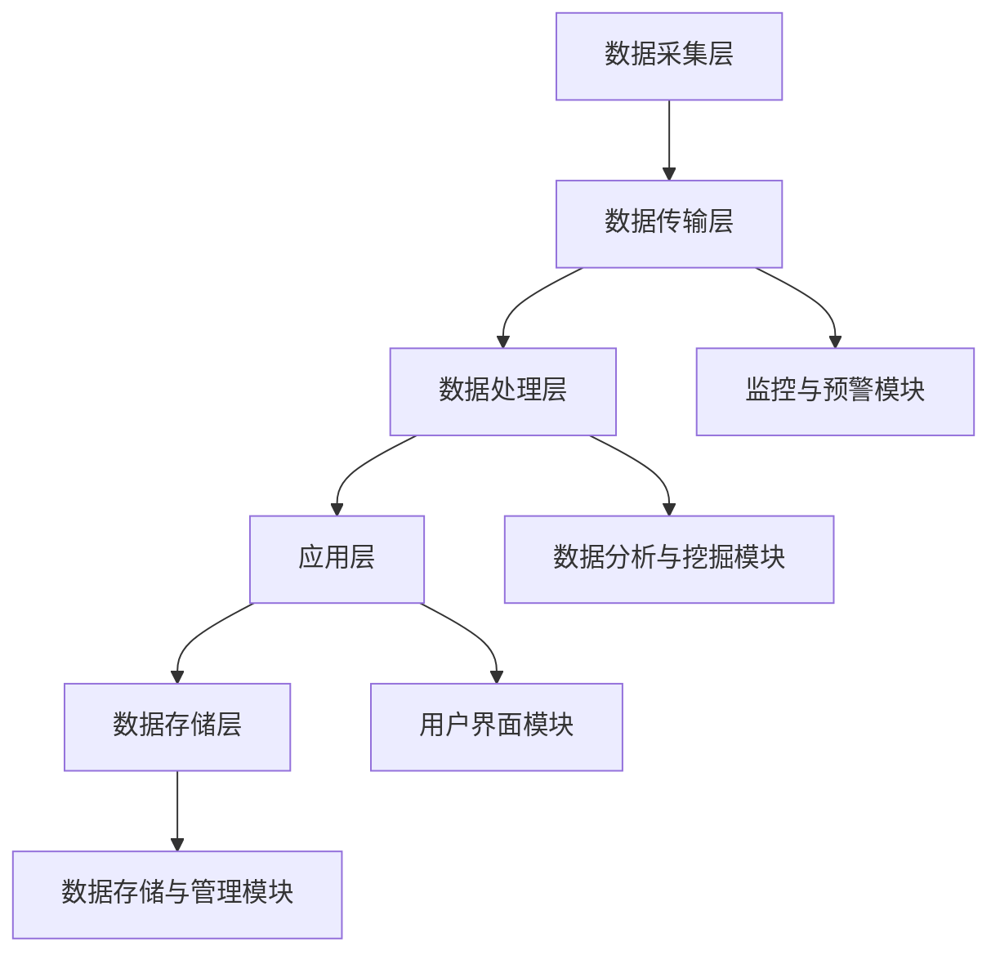

                 

## 文章标题：未来的智慧养老：2050年的智能家庭医生与远程健康监测

> **关键词：智慧养老，智能家庭医生，远程健康监测，物联网，人工智能，医疗技术**

> **摘要：本文探讨了2050年智慧养老的发展趋势，重点关注智能家庭医生和远程健康监测技术的创新应用。通过对相关技术基础、实现方案、案例分析以及未来挑战的深入分析，为我国智慧养老产业的发展提供了有益的借鉴。**

---

### 《未来的智慧养老：2050年的智能家庭医生与远程健康监测》目录大纲

---

## 第一部分：智慧养老概述

### 第1章：智慧养老背景与趋势

#### 1.1 智慧养老的定义与分类

智慧养老是指通过先进的信息技术、物联网技术和人工智能技术，实现对老年人群体的健康监测、生活照顾和医疗服务的智能化管理。智慧养老主要包括居家养老、社区养老和机构养老三种模式。

#### 1.2 全球智慧养老发展现状与趋势

随着全球人口老龄化的加剧，智慧养老已经成为各国政府和社会关注的重要议题。美国、日本、德国等发达国家在智慧养老领域取得了显著进展。我国也在积极推进智慧养老产业的发展。

#### 1.3 我国智慧养老的政策与战略

我国政府高度重视智慧养老产业的发展，出台了一系列政策措施，包括《“健康中国2030”规划纲要》、《“互联网+”智慧医疗行动计划（2018-2020年）》等。这些政策为智慧养老产业的发展提供了有力保障。

---

## 第二部分：智能家庭医生技术基础

### 第2章：智能家庭医生技术基础

#### 2.1 智能家庭医生的概念与架构

智能家庭医生是指通过人工智能技术，实现对家庭医生角色的智能化模拟和扩展。智能家庭医生系统通常包括用户注册、健康档案管理、在线问诊、疾病预测等功能模块。

#### 2.2 人工智能技术在医疗领域的应用

人工智能技术在医疗领域的应用包括疾病诊断、药物研发、医疗影像分析等。其中，深度学习和强化学习算法在医疗领域的应用取得了显著成果。

#### 2.3 医学知识图谱与智能推荐系统

医学知识图谱是一种用于表示医学知识和关系的数据结构。智能推荐系统则基于用户行为和偏好，为用户提供个性化的健康建议和医疗服务。

---

## 第三部分：远程健康监测技术

### 第3章：远程健康监测概述

#### 3.1 远程健康监测的概念与类型

远程健康监测是指通过互联网和物联网技术，实现对老年人健康数据的实时采集、传输和分析。远程健康监测系统主要包括传感器、数据采集终端、网络传输和数据分析等模块。

#### 3.2 远程健康监测系统的架构设计

远程健康监测系统架构包括数据采集层、传输层、数据处理层和应用层。每个层次都有其独特的功能和技术实现。

#### 3.3 远程健康监测的数据处理与分析

远程健康监测的数据处理包括数据清洗、数据存储、数据分析和数据可视化。通过这些处理技术，可以实现老年人健康数据的实时监控和异常检测。

---

## 第四部分：智慧养老解决方案与实践案例

### 第6章：智能家庭医生系统实现

#### 6.1 智能家庭医生系统架构设计

智能家庭医生系统架构设计包括前端界面、后端服务和数据存储等。通过这些模块的协同工作，可以实现家庭医生的所有功能。

#### 6.2 系统功能模块划分与实现

智能家庭医生系统功能模块包括用户管理、健康档案管理、在线问诊、疾病预测等。每个模块都有具体的实现方式和关键技术。

#### 6.3 系统性能优化与评估

系统性能优化包括数据存储优化、算法优化和系统部署优化等。通过这些优化措施，可以提高智能家庭医生系统的稳定性和响应速度。

---

### 第7章：远程健康监测系统构建

#### 7.1 远程健康监测系统需求分析与设计

远程健康监测系统需求分析包括用户需求、系统功能和技术要求等。系统设计则包括系统架构、模块划分和接口设计等。

#### 7.2 系统硬件设备选择与部署

远程健康监测系统硬件设备包括传感器、数据采集终端和服务器等。选择合适的硬件设备，可以提高系统的可靠性和稳定性。

#### 7.3 系统软件开发与实现

远程健康监测系统软件开发包括前端开发、后端开发和数据处理等。通过这些开发工作，可以实现远程健康监测的所有功能。

---

### 第8章：智慧养老项目案例分析

#### 8.1 案例一：智能家庭医生在居家养老中的应用

本案例介绍了智能家庭医生在居家养老中的应用场景、技术实现和实际效果。

#### 8.2 案例二：远程健康监测在社区养老中的应用

本案例分析了远程健康监测在社区养老中的应用模式、技术架构和优势。

#### 8.3 案例三：智慧养老社区的整体解决方案

本案例探讨了智慧养老社区的整体解决方案，包括智能家庭医生、远程健康监测和社区服务等功能。

---

## 第五部分：智慧养老的未来发展与挑战

### 第9章：智慧养老的未来趋势与挑战

#### 9.1 智慧养老的技术发展趋势

随着人工智能、物联网和大数据技术的不断进步，智慧养老的技术发展趋势将更加智能化、个性化和便捷化。

#### 9.2 智慧养老的政策环境与市场需求

我国政府对智慧养老产业的政策支持力度不断加大，市场需求也在持续增长。这些因素将推动智慧养老产业的快速发展。

#### 9.3 智慧养老的伦理问题与社会挑战

智慧养老在发展过程中将面临伦理问题和社会挑战，如数据隐私保护、信息安全和社会信任等。

---

### 第10章：智慧养老产业发展策略

#### 10.1 智慧养老产业链分析

智慧养老产业链包括设备制造、技术服务、平台运营和养老服务等环节。每个环节都有其独特的价值和地位。

#### 10.2 企业在智慧养老领域的创新与发展

企业在智慧养老领域的创新与发展将推动产业的整体进步。通过技术创新、模式创新和服务创新，企业可以提升自身的竞争力。

#### 10.3 智慧养老产业的国际合作与竞争

智慧养老产业具有全球化的特点，各国企业之间的合作与竞争将不断加剧。通过国际合作，可以促进智慧养老产业的共同发展。

---

## 附录

### 附录 A：智慧养老相关技术资源

#### A.1 主流智能健康监测设备介绍

介绍了目前市场上主流的智能健康监测设备，包括智能手环、智能血压计、智能血糖仪和智能睡眠监测设备等。

#### A.2 开源智能医疗软件与工具

介绍了开源智能医疗软件与工具，包括智能健康管理系统、智能诊断工具和智能健康数据平台等。

#### A.3 智慧养老相关政策文件与研究报告

介绍了智慧养老相关政策文件与研究报告，包括国家政策文件、行业研究报告和国际组织与会议等。

### 附录 B：参考文献

介绍了本文引用的参考书籍、学术论文、报告与行业分析等，为读者提供了进一步学习和研究的资源。

---

**作者：AI天才研究院/AI Genius Institute & 禅与计算机程序设计艺术 /Zen And The Art of Computer Programming**

---

在接下来的文章中，我们将深入探讨智慧养老的各个方面，包括技术基础、解决方案、实践案例以及未来发展的挑战和策略。希望通过本文，能够为智慧养老产业的发展提供一些有益的思考和借鉴。让我们开始这场关于未来的智慧养老之旅吧！
---

## 第一部分：智慧养老概述

### 第1章：智慧养老背景与趋势

#### 1.1 智慧养老的定义与分类

智慧养老是一种创新的养老模式，它结合了现代信息技术、物联网和人工智能，为老年人提供便捷、高效、个性化的养老服务。智慧养老的核心在于利用科技手段，实现老年人群体的健康监测、生活照顾和医疗服务智能化。

智慧养老可以分为三个主要模式：

1. **居家养老**：老年人居住在自己的家中，通过智能设备和远程监控系统，实现日常生活和健康的自我管理。

2. **社区养老**：老年人居住在社区养老院或日间照料中心，享受社区提供的各种服务，如健康监测、生活照料、文娱活动等。

3. **机构养老**：老年人居住在养老机构，享受专业化的医疗护理和生活照料服务。

#### 1.2 全球智慧养老发展现状与趋势

在全球范围内，智慧养老已经成为各国政府和社会关注的重点。以下是一些国家的智慧养老发展现状：

- **美国**：美国政府通过“智慧城市计划”和“智能医疗计划”，积极推进智慧养老技术的发展。美国市场上出现了许多智能健康监测设备，如智能手环、智能血压计等。

- **日本**：作为全球老龄化最为严重的国家之一，日本在智慧养老领域取得了显著成果。日本的智慧养老系统主要包括智能健康监测、远程医疗和养老护理机器人等。

- **德国**：德国政府提出了“智能养老2025”计划，重点发展智慧健康监测、远程医疗和智能养老院等。

#### 1.3 我国智慧养老的政策与战略

我国政府高度重视智慧养老产业的发展，出台了一系列政策措施，推动智慧养老技术的创新和应用。以下是我国智慧养老的政策和战略：

- **《“健康中国2030”规划纲要》**：明确提出加强智慧健康养老服务业的发展，提高老年人健康服务水平。

- **《“互联网+”智慧医疗行动计划（2018-2020年）》**：提出发展智慧健康养老服务平台，推动医疗资源下沉，提高医疗服务效率。

- **《关于推进医养结合发展的指导意见》**：鼓励发展医养结合模式，提升养老机构医疗服务能力。

此外，我国还制定了《智慧健康养老产业发展行动计划（2017-2020年）》等文件，明确智慧养老产业的发展目标和重点任务。

### 1.4 智慧养老的关键技术

智慧养老技术的发展离不开以下关键技术：

- **物联网技术**：通过物联网技术，实现各种智能设备和系统的互联互通，为老年人提供便捷的养老服务。

- **人工智能技术**：利用人工智能技术，实现老年人健康数据的智能分析、疾病预测和个性化推荐。

- **大数据技术**：通过对海量健康数据的采集、存储和分析，为老年人提供更加精准的医疗服务和健康指导。

- **云计算技术**：提供强大的计算能力和存储空间，支持智慧养老系统的稳定运行和大数据处理。

- **5G通信技术**：实现高速、低延迟的通信，为远程医疗和实时健康监测提供技术保障。

#### 1.5 智慧养老的优势与挑战

智慧养老具有以下优势：

- **提高养老服务质量**：通过智能化手段，提升养老服务的效率和质量，满足老年人多样化的需求。

- **减轻家庭负担**：智慧养老能够减轻子女对老年人的照护负担，提高家庭生活质量。

- **降低养老成本**：通过优化资源配置和降低人力成本，降低养老服务的总体成本。

然而，智慧养老也面临着一些挑战：

- **技术成熟度**：当前智慧养老技术尚处于发展阶段，部分技术还需要进一步成熟和优化。

- **数据安全和隐私保护**：老年人健康数据的采集、存储和使用过程中，存在数据安全和隐私泄露的风险。

- **社会接受度**：部分老年人对于智能设备和系统的接受度较低，需要提高他们的适应能力和接受度。

### 1.6 智慧养老的发展前景

随着技术的不断进步和政策的支持，智慧养老产业具有广阔的发展前景。预计未来智慧养老将呈现以下趋势：

- **智能化水平提升**：随着人工智能、物联网等技术的不断进步，智慧养老的智能化水平将不断提高。

- **个性化服务**：通过大数据分析和个性化推荐，为老年人提供更加精准和个性化的养老服务。

- **产业链融合**：智慧养老产业将与其他产业如医疗、健康、家政等实现深度融合，形成完整的产业链。

- **国际交流与合作**：随着全球智慧养老产业的发展，各国之间的交流与合作将更加紧密，共同推动智慧养老技术的创新和应用。

总之，智慧养老是未来养老服务的重要发展方向。通过技术创新、模式创新和服务创新，智慧养老将为老年人带来更加美好的生活，同时为社会发展贡献重要力量。

---

在第一部分中，我们介绍了智慧养老的定义、分类、全球发展现状和趋势，以及我国智慧养老的政策和战略。接下来，我们将深入探讨智能家庭医生技术基础，分析其在医疗领域的应用、医学知识图谱与智能推荐系统的实现，以及远程健康监测技术的基础。

---

## 第二部分：智能家庭医生技术基础

### 第2章：智能家庭医生技术基础

智能家庭医生是一种基于人工智能技术的医疗服务模式，旨在为老年人提供便捷、高效、个性化的家庭医疗服务。本章节将详细探讨智能家庭医生的概念与架构、人工智能技术在医疗领域的应用，以及医学知识图谱与智能推荐系统。

### 2.1 智能家庭医生的概念与架构

#### 智能家庭医生的概念

智能家庭医生是指利用人工智能技术，实现对家庭医生角色的智能化模拟和扩展。智能家庭医生系统通常包括以下功能模块：

1. **用户注册与信息管理**：实现用户的注册和管理，包括用户基本信息、健康档案、病史记录等。

2. **在线问诊与咨询服务**：提供在线问诊、健康咨询、用药建议等服务，帮助老年人解决日常健康问题。

3. **疾病预测与预警**：利用人工智能算法，对用户的健康数据进行实时分析，预测可能的疾病风险，并提供预警建议。

4. **健康档案管理**：对用户的健康数据进行收集、存储、管理和分析，形成个性化的健康档案。

5. **远程医疗**：提供远程视频咨询、远程诊断、远程治疗等服务，解决老年人的就医难题。

6. **健康管理**：提供个性化健康建议、运动计划、饮食指导等，帮助老年人实现健康生活方式。

#### 智能家庭医生的架构设计

智能家庭医生系统的架构设计通常包括以下层次：

1. **数据采集层**：通过各种传感器和设备，采集用户的生理指标、行为数据等，如心率、血压、血糖、睡眠质量等。

2. **数据传输层**：利用互联网和物联网技术，将采集到的数据传输至数据中心。

3. **数据处理与分析层**：对采集到的数据进行清洗、存储、分析和挖掘，利用机器学习和深度学习算法，实现疾病的预测和预警。

4. **应用层**：提供用户界面、在线问诊、远程医疗、健康管理等功能模块，实现智能家庭医生的服务。

5. **数据存储层**：使用大数据技术，存储和管理用户的历史数据和实时数据，支持系统的快速查询和分析。

### 2.2 人工智能技术在医疗领域的应用

人工智能技术在医疗领域的应用已经取得了显著成果，主要包括以下方面：

1. **疾病诊断**：利用深度学习和卷积神经网络，对医学影像进行分析，实现疾病的自动识别和诊断。例如，利用深度学习算法，对X光片、CT扫描、MRI图像等进行肺癌、脑瘤等疾病的诊断。

2. **药物研发**：利用人工智能技术，对海量的基因和药物数据进行挖掘，预测药物与基因的相互作用，加速新药的发现和研发。

3. **医疗影像分析**：利用计算机视觉技术，对医学影像进行自动标注和分类，提高医疗影像诊断的准确性和效率。

4. **疾病预测与预警**：利用机器学习算法，对用户的健康数据进行挖掘和分析，预测可能的疾病风险，提供预警建议。

5. **健康大数据分析**：利用大数据技术，对海量健康数据进行挖掘和分析，发现健康规律和疾病趋势，为公共卫生决策提供支持。

### 2.3 医学知识图谱与智能推荐系统

医学知识图谱是一种用于表示医学知识和关系的数据结构，它将医学知识以结构化的形式存储和表示，便于计算机理解和处理。医学知识图谱主要包括以下类型：

1. **疾病图谱**：描述各种疾病的发生、发展、症状、治疗方法等信息。

2. **药物图谱**：描述药物的药理作用、副作用、适应症、禁忌症等信息。

3. **基因图谱**：描述基因的功能、突变、与疾病的关系等信息。

4. **检查图谱**：描述各种检查项目的适应症、禁忌症、检查方法等信息。

智能推荐系统是基于用户行为和偏好，为用户提供个性化健康建议和医疗服务。智能推荐系统主要包括以下技术：

1. **协同过滤**：根据用户的相似度，推荐用户可能感兴趣的医疗服务或健康建议。

2. **基于内容的推荐**：根据用户的历史行为和兴趣，推荐相关医疗服务或健康建议。

3. **混合推荐**：结合协同过滤和基于内容的推荐，提高推荐系统的准确性和效果。

### 2.4 智能家庭医生的应用实例

以下是一个智能家庭医生的典型应用实例：

1. **用户注册与信息管理**：老年人通过智能设备进行注册，上传个人基本信息和健康档案。

2. **在线问诊与咨询服务**：老年人遇到健康问题时，可以通过智能家庭医生进行在线咨询，获取专业的健康建议和用药指导。

3. **疾病预测与预警**：智能家庭医生根据老年人的健康数据，预测可能的疾病风险，并在高风险情况下发出预警，提醒老年人及时就医。

4. **远程医疗**：当老年人需要进一步诊断或治疗时，可以通过远程医疗功能，与医生进行视频咨询，获取远程诊断和治疗建议。

5. **健康管理**：智能家庭医生根据老年人的健康数据和生活方式，为其提供个性化的健康建议，如运动计划、饮食指导等，帮助老年人实现健康生活方式。

通过以上功能模块和技术的实现，智能家庭医生可以为老年人提供全方位、个性化的家庭医疗服务，提升养老服务质量，减轻家庭和社会的负担。

### 2.5 智能家庭医生的发展挑战与未来展望

尽管智能家庭医生在提升养老服务质量方面具有巨大的潜力，但其在发展过程中仍面临以下挑战：

1. **数据隐私与安全**：老年人健康数据的采集、存储和使用过程中，存在数据隐私和安全风险。需要建立严格的数据安全和隐私保护机制。

2. **技术成熟度**：当前智能家庭医生的技术水平尚在不断发展中，部分技术如人工智能算法、大数据分析等还需要进一步优化和成熟。

3. **用户接受度**：老年人对智能设备和系统的接受度较低，需要通过教育和培训提高他们的适应能力和接受度。

4. **政策与法规**：智慧养老产业需要完善的政策与法规体系，以保障其健康发展。

未来，随着人工智能、物联网和大数据技术的不断进步，智能家庭医生将朝着更加智能化、个性化和便捷化的方向发展。通过技术创新、模式创新和服务创新，智能家庭医生将为老年人带来更加美好的生活，成为智慧养老的重要组成部分。

---

在第二部分中，我们详细介绍了智能家庭医生的概念与架构、人工智能技术在医疗领域的应用，以及医学知识图谱与智能推荐系统。接下来，我们将探讨远程健康监测技术的概述，包括远程健康监测的概念与类型、系统架构设计以及数据处理与分析。

---

## 第三部分：远程健康监测技术

### 第3章：远程健康监测概述

远程健康监测是一种通过信息技术和传感器设备，实现对老年人健康状况进行实时监测和管理的服务。本章节将详细介绍远程健康监测的概念与类型、系统架构设计以及数据处理与分析。

### 3.1 远程健康监测的概念与类型

#### 远程健康监测的概念

远程健康监测是指利用互联网、物联网、大数据和人工智能等技术，对老年人的生理、心理和行为进行实时监测、分析和预测。远程健康监测的主要目的是提高老年人的健康水平，降低医疗成本，减轻家庭和社会的负担。

#### 远程健康监测的类型

远程健康监测可以分为以下几种类型：

1. **生理参数监测**：通过对老年人的生理参数进行实时监测，如心率、血压、血糖、体温等，实现对老年人健康状况的实时掌握。

2. **行为监测**：通过对老年人的行为数据进行采集和分析，如日常活动、睡眠质量、运动量等，评估老年人的生活习惯和健康状况。

3. **心理健康监测**：通过心理健康问卷调查、情绪分析等手段，了解老年人的心理状态，提供心理健康支持和干预。

4. **远程医疗监测**：通过远程视频、语音等方式，实现医生与老年人的实时沟通，提供在线问诊、远程诊断、远程治疗等服务。

### 3.2 远程健康监测系统的架构设计

远程健康监测系统通常包括以下几个主要模块：

1. **数据采集层**：通过各种传感器设备，如智能手环、智能血压计、智能血糖仪等，采集老年人的生理参数、行为数据和心理健康数据。

2. **数据传输层**：利用无线通信技术，如Wi-Fi、蓝牙、4G/5G等，将采集到的数据传输到数据中心。

3. **数据处理层**：对采集到的数据进行存储、清洗、转换和预处理，利用大数据技术和人工智能算法，进行数据分析和挖掘，实现健康监测和预警。

4. **应用层**：提供用户界面、健康报告、预警通知等功能，实现对老年人健康状况的实时监测和管理。

5. **数据存储层**：使用大数据存储技术，如Hadoop、Spark等，存储和管理海量的健康数据，支持系统的快速查询和分析。

#### 远程健康监测系统的架构设计图

### 3.3 远程健康监测的数据处理与分析

远程健康监测的数据处理与分析主要包括以下几个步骤：

1. **数据采集**：通过各种传感器设备，采集老年人的生理参数、行为数据和心理健康数据。

2. **数据传输**：利用无线通信技术，将采集到的数据传输到数据中心。

3. **数据预处理**：对采集到的数据进行清洗、去噪和转换，确保数据的质量和一致性。

4. **数据存储**：将预处理后的数据存储到大数据存储系统中，支持实时查询和分析。

5. **数据挖掘**：利用机器学习和深度学习算法，对健康数据进行分析和挖掘，发现潜在的疾病风险和健康问题。

6. **健康评估**：根据数据挖掘结果，对老年人的健康状况进行评估，生成健康报告。

7. **预警通知**：当发现老年人的健康状况出现异常时，及时发出预警通知，提醒老年人及时就医。

### 3.4 远程健康监测系统的关键技术

远程健康监测系统的发展离不开以下关键技术：

1. **物联网技术**：通过物联网技术，实现各种传感器设备的互联互通，为远程健康监测提供数据支持。

2. **大数据技术**：通过对海量健康数据的存储、分析和挖掘，实现对老年人健康状况的实时监控和预测。

3. **人工智能技术**：利用人工智能技术，对健康数据进行分析和挖掘，提高远程健康监测的准确性和智能化水平。

4. **云计算技术**：提供强大的计算能力和存储空间，支持远程健康监测系统的稳定运行和大数据处理。

5. **5G通信技术**：实现高速、低延迟的通信，为远程医疗和实时健康监测提供技术保障。

### 3.5 远程健康监测的应用实例

以下是一个远程健康监测的应用实例：

1. **数据采集**：老年人通过智能手环、智能血压计等设备，实时采集心率、血压、血糖等生理参数。

2. **数据传输**：通过Wi-Fi、蓝牙等无线通信技术，将采集到的数据传输到数据中心。

3. **数据处理**：数据中心对采集到的数据进行预处理、存储和分析，利用大数据和人工智能技术，发现潜在的疾病风险。

4. **健康评估**：根据数据挖掘结果，对老年人的健康状况进行评估，生成健康报告。

5. **预警通知**：当发现老年人的健康状况出现异常时，系统自动发出预警通知，提醒老年人及时就医。

通过以上应用实例，远程健康监测可以为老年人提供全方位的健康监测和预警服务，提高养老服务质量，降低医疗成本，减轻家庭和社会的负担。

### 3.6 远程健康监测的发展挑战与未来展望

尽管远程健康监测技术在提升养老服务质量方面具有巨大的潜力，但其在发展过程中仍面临以下挑战：

1. **数据隐私与安全**：老年人健康数据的采集、传输和存储过程中，存在数据隐私和安全风险。需要建立严格的数据安全和隐私保护机制。

2. **技术成熟度**：当前远程健康监测技术尚在不断发展中，部分技术如人工智能算法、大数据分析等还需要进一步优化和成熟。

3. **用户接受度**：老年人对远程健康监测技术的接受度较低，需要通过教育和培训提高他们的适应能力和接受度。

4. **政策与法规**：远程健康监测产业需要完善的政策与法规体系，以保障其健康发展。

未来，随着物联网、大数据、人工智能和5G等技术的不断进步，远程健康监测将朝着更加智能化、个性化和便捷化的方向发展。通过技术创新、模式创新和服务创新，远程健康监测将为老年人带来更加美好的生活，成为智慧养老的重要组成部分。

---

在第三部分中，我们详细介绍了远程健康监测的概念与类型、系统架构设计以及数据处理与分析。接下来，我们将探讨物联网技术在智慧养老中的应用，包括应用场景、常见物联网传感器与设备以及数据的安全与隐私保护。

---

## 第四部分：物联网技术在智慧养老中的应用

### 第4章：物联网技术在智慧养老中的应用

物联网技术（IoT）通过将各种物品连接到互联网，实现设备之间的互联互通，为智慧养老提供了强大的技术支持。本章节将探讨物联网技术在智慧养老中的应用场景、常见物联网传感器与设备，以及数据的安全与隐私保护。

### 4.1 物联网技术在智慧养老中的应用场景

物联网技术在智慧养老中的应用场景非常广泛，主要包括以下几个方面：

1. **健康监测**：通过物联网传感器，实时监测老年人的生理参数，如心率、血压、血糖等，实现远程健康监测和预警。

2. **环境监测**：通过物联网传感器，实时监测老年人居住环境的温度、湿度、空气质量等，提供舒适的生活环境。

3. **紧急呼叫**：通过物联网设备，如紧急按钮、智能手表等，实现老年人遇到紧急情况时的快速呼叫和救援。

4. **智能安防**：通过物联网技术，实时监测老年人居住环境的安全状况，如门磁感应、烟雾报警等，提高居住环境的安全性。

5. **智能家居**：通过物联网技术，实现老年人居住环境的智能化，如智能照明、智能家电、智能安防等，提供便捷的生活服务。

### 4.2 常见物联网传感器与设备

物联网技术在智慧养老中的应用离不开各种传感器与设备的支持。以下是一些常见的物联网传感器与设备：

1. **健康传感器**：
   - 心率传感器：用于监测老年人的心率变化。
   - 血压传感器：用于监测老年人的血压。
   - 血糖传感器：用于监测老年人的血糖水平。
   - 体温传感器：用于监测老年人的体温。

2. **环境传感器**：
   - 温度传感器：用于监测老年人居住环境的温度。
   - 湿度传感器：用于监测老年人居住环境的湿度。
   - 空气质量传感器：用于监测老年人居住环境的空气质量。

3. **紧急呼叫设备**：
   - 智能手表：具备紧急呼叫功能的智能手表，可以在紧急情况下快速呼叫救援。
   - 腰带式紧急按钮：老年人可以通过按动紧急按钮，迅速发出求助信号。

4. **智能安防设备**：
   - 门磁感应器：用于检测门的开闭状态，实现安防报警。
   - 烟雾报警器：用于检测烟雾浓度，实现火灾报警。
   - 智能摄像头：用于实时监控老年人居住环境的安全状况。

### 4.3 物联网数据的安全与隐私保护

在智慧养老中，物联网技术的应用涉及到大量的个人健康数据和隐私信息。因此，数据的安全与隐私保护成为物联网技术应用的一个重要挑战。以下是一些数据安全和隐私保护的措施：

1. **加密技术**：使用加密算法对数据进行加密处理，确保数据在传输和存储过程中的安全性。

2. **访问控制**：设置访问控制策略，限制只有授权用户才能访问敏感数据，防止数据泄露。

3. **数据备份与恢复**：定期备份数据，并在数据丢失或损坏时进行恢复，确保数据的完整性和可用性。

4. **隐私政策**：明确告知用户其数据的使用目的、范围和权限，尊重用户的隐私权。

5. **合规监管**：遵守相关的法律法规，接受监管机构的监督和审查，确保数据处理的合法性和合规性。

### 4.4 物联网技术在智慧养老中的应用案例

以下是一个物联网技术在智慧养老中的应用案例：

1. **健康监测**：通过安装在家中的健康传感器，如心率传感器、血压传感器和血糖传感器，实时监测老年人的生理参数。当监测数据出现异常时，系统会自动发送预警信息给家属或医生，提醒他们及时采取行动。

2. **环境监测**：通过安装在家中的温度传感器、湿度传感器和空气质量传感器，实时监测老年人居住环境的状况。当环境参数超过设定的安全范围时，系统会自动调整空调、加湿器等设备，确保老年人生活在舒适的环境中。

3. **紧急呼叫**：当老年人遇到紧急情况时，他们可以通过佩戴的智能手表或紧急按钮，迅速发出求助信号。系统会立即通知家属和紧急救援机构，提供及时的救援。

4. **智能安防**：通过安装在家中的门磁感应器、烟雾报警器和智能摄像头，实时监测老年人居住环境的安全状况。当发生入侵或火灾等异常情况时，系统会立即发出警报，并通知相关部门进行处置。

通过以上应用案例，物联网技术为智慧养老提供了强大的技术支持，提高了养老服务的效率和质量，减轻了家庭和社会的负担。

### 4.5 物联网技术在智慧养老中的未来发展

随着物联网技术的不断发展和普及，物联网技术在智慧养老中的应用前景十分广阔。未来的发展将主要集中在以下几个方面：

1. **设备智能化**：通过引入更智能的传感器和设备，实现更精准、更全面的健康监测和环境监测。

2. **系统集成**：通过集成多种物联网设备和服务，提供一站式智慧养老解决方案。

3. **数据共享与协同**：通过建立数据共享平台，实现不同系统、不同设备之间的数据协同，提高数据利用效率。

4. **隐私保护**：随着物联网技术在智慧养老中的应用，数据安全和隐私保护问题将越来越受到关注。未来的发展将更加重视隐私保护技术的创新和应用。

5. **人工智能与物联网的融合**：通过将人工智能技术融入物联网应用，实现更智能、更个性化的健康监测和服务。

总之，物联网技术在智慧养老中的应用将为老年人带来更加美好的生活体验，推动智慧养老产业的快速发展。

---

在第四部分中，我们探讨了物联网技术在智慧养老中的应用场景、常见物联网传感器与设备，以及数据的安全与隐私保护。接下来，我们将分析人工智能算法在远程健康监测中的应用，包括机器学习、深度学习和强化学习算法在健康监测、医疗影像分析和健康干预决策中的具体应用。

---

## 第五部分：人工智能算法在远程健康监测中的应用

### 第5章：人工智能算法在远程健康监测中的应用

人工智能（AI）技术在远程健康监测中发挥着越来越重要的作用。通过机器学习、深度学习和强化学习等算法，人工智能能够对健康数据进行高效分析，提供准确的诊断和个性化的健康建议。本章节将详细介绍这些算法在远程健康监测中的应用。

### 5.1 机器学习算法在健康监测中的应用

机器学习算法在远程健康监测中的应用主要体现在数据的采集、预处理和特征提取等方面。

#### 数据采集与预处理

机器学习算法首先需要对健康数据进行采集和预处理。数据采集可以从各种传感器设备（如心率传感器、血压计、血糖仪等）获得。预处理步骤包括数据清洗、去噪和标准化等，以确保数据的质量和一致性。

#### 特征提取

在预处理完成后，需要对数据特征进行提取。特征提取是将原始数据转换为机器学习模型可以理解的形式。常见的特征提取方法包括：

- **时间序列特征**：如心率、血压等的时间序列数据。
- **统计特征**：如均值、方差、标准差等。
- **频率特征**：如频率分布、峰频率等。

#### 应用案例

1. **异常检测**：通过对时间序列数据进行监督学习，可以识别出健康数据中的异常值，如心率过快或过慢等。
2. **疾病预测**：利用分类算法（如决策树、支持向量机等），可以根据历史健康数据预测老年人未来可能出现的疾病。

### 5.2 深度学习算法在医疗影像分析中的应用

深度学习算法在医疗影像分析中具有显著的优势，能够自动识别和诊断疾病。

#### 神经网络模型

深度学习算法的核心是神经网络模型，特别是卷积神经网络（CNN）和循环神经网络（RNN）。

- **卷积神经网络（CNN）**：适用于图像处理，可以自动提取图像的特征，并用于疾病诊断。例如，CNN可以用于识别X光片、CT扫描、MRI图像中的病变区域。
- **循环神经网络（RNN）**：适用于处理序列数据，如时间序列数据或文本数据。在医疗领域，RNN可以用于分析患者的电子健康记录（EHR），提取重要的临床信息。

#### 应用案例

1. **癌症诊断**：通过深度学习算法，可以自动识别和诊断肺癌、乳腺癌等癌症。例如，CNN可以用于分析肺部CT图像，识别肺结节。
2. **脑部疾病诊断**：通过RNN分析患者的脑电图（EEG）数据，可以诊断癫痫等脑部疾病。

### 5.3 强化学习算法在健康干预决策中的应用

强化学习算法是一种通过不断试错和学习来优化决策过程的算法。在健康干预决策中，强化学习算法可以根据患者的实时健康数据，提供个性化的健康建议。

#### 算法原理

强化学习算法包括三个主要部分：环境（Environment）、代理（Agent）和行动（Action）。

- **环境**：代表患者的健康状况。
- **代理**：代表决策模型，如健康管理系统。
- **行动**：代表决策模型对患者采取的健康干预措施。

#### 应用案例

1. **个性化健康建议**：根据患者的实时健康数据，强化学习算法可以动态调整健康建议，如饮食建议、运动计划等。
2. **药物推荐**：利用强化学习算法，可以根据患者的病情和药物反应，推荐最合适的药物组合。

### 5.4 人工智能算法在远程健康监测中的挑战与未来方向

虽然人工智能算法在远程健康监测中具有广泛的应用前景，但同时也面临以下挑战：

- **数据隐私与安全**：健康数据属于高度敏感信息，需要确保数据在采集、传输和存储过程中的安全性和隐私性。
- **算法可解释性**：深度学习算法通常被视为“黑盒”，其决策过程难以解释和理解，这对于医疗决策可能带来风险。
- **数据质量和标注**：高质量的健康数据是算法训练的基础，但获取高质量的数据和标注是一项复杂且耗时的任务。

未来，人工智能算法在远程健康监测中的应用将朝着以下方向发展：

- **多模态数据融合**：结合多种数据源（如生理参数、行为数据和医疗影像等），提高健康监测的准确性和全面性。
- **可解释性增强**：通过开发可解释的机器学习模型，提高算法的透明度和信任度。
- **边缘计算**：利用边缘计算技术，将数据处理和计算能力下沉到终端设备，降低数据传输延迟和带宽需求。

总之，人工智能算法在远程健康监测中的应用为提升养老服务质量和效率提供了新的途径。随着技术的不断进步和应用的深入，人工智能将在智慧养老中发挥更加重要的作用。

---

在第五部分中，我们详细分析了人工智能算法在远程健康监测中的应用，包括机器学习、深度学习和强化学习算法在健康监测、医疗影像分析和健康干预决策中的具体应用。接下来，我们将探讨智慧养老解决方案的实现，包括智能家庭医生系统和远程健康监测系统的构建。

---

## 第六部分：智慧养老解决方案的实现

### 第6章：智能家庭医生系统实现

智能家庭医生系统是智慧养老解决方案的重要组成部分，它通过集成人工智能、物联网和大数据等技术，为老年人提供个性化、智能化的家庭医疗服务。本章节将详细介绍智能家庭医生系统的实现，包括系统架构设计、功能模块划分与实现以及系统性能优化与评估。

### 6.1 智能家庭医生系统架构设计

智能家庭医生系统架构设计旨在实现系统的高效、稳定和安全运行。系统架构设计通常包括以下层次：

1. **数据采集层**：通过各种传感器设备，如智能手环、智能血压计、智能血糖仪等，采集老年人的生理参数、行为数据和心理健康数据。

2. **数据传输层**：利用无线通信技术，如Wi-Fi、蓝牙、4G/5G等，将采集到的数据传输到云端数据中心。

3. **数据处理与分析层**：对采集到的数据进行预处理、存储、分析和挖掘，利用机器学习和深度学习算法，实现疾病的预测和预警。

4. **应用层**：提供用户界面、在线问诊、远程医疗、健康管理等功能模块，实现智能家庭医生的服务。

5. **数据存储层**：使用大数据技术，存储和管理用户的历史数据和实时数据，支持系统的快速查询和分析。

### 6.2 系统功能模块划分与实现

智能家庭医生系统功能模块划分与实现如下：

1. **用户注册与信息管理模块**：
   - 功能：实现用户的注册、登录和信息管理。
   - 实现：使用身份验证技术（如用户名和密码、指纹识别等），确保用户信息的安全。

2. **健康档案管理模块**：
   - 功能：存储和管理用户的基本信息、健康档案、病史记录等。
   - 实现：使用数据库技术（如MySQL、MongoDB等），存储和管理用户数据。

3. **在线问诊与咨询服务模块**：
   - 功能：提供在线问诊、健康咨询、用药建议等服务。
   - 实现：使用即时通讯技术（如WebRTC、WebSocket等），实现医生与患者的实时沟通。

4. **疾病预测与预警模块**：
   - 功能：利用人工智能算法，对用户的健康数据进行实时分析，预测可能的疾病风险，并提供预警建议。
   - 实现：使用机器学习算法（如决策树、随机森林、神经网络等），实现疾病的预测和预警。

5. **远程医疗模块**：
   - 功能：提供远程视频咨询、远程诊断、远程治疗等服务。
   - 实现：使用视频会议技术（如Zoom、Skype等），实现医生与患者的远程视频沟通。

6. **健康管理模块**：
   - 功能：提供个性化健康建议、运动计划、饮食指导等，帮助老年人实现健康生活方式。
   - 实现：使用个性化推荐算法（如协同过滤、基于内容的推荐等），实现个性化健康建议。

### 6.3 系统性能优化与评估

智能家庭医生系统的性能优化与评估是保证系统稳定性和高效性的关键。以下是一些系统性能优化与评估的方法：

1. **负载均衡**：
   - 功能：通过分布式架构，实现系统的负载均衡，提高系统的并发处理能力。
   - 实现：使用负载均衡器（如Nginx、HAProxy等），分配用户请求到不同的服务器。

2. **缓存技术**：
   - 功能：使用缓存技术（如Redis、Memcached等），提高系统的响应速度。
   - 实现：将频繁访问的数据缓存到内存中，减少数据库的访问次数。

3. **数据库优化**：
   - 功能：通过数据库优化（如索引、分片、读写分离等），提高系统的数据访问速度。
   - 实现：使用数据库优化工具（如MySQL Query Analyzer、PostgreSQL Query Planner等），优化数据库查询。

4. **性能测试与监控**：
   - 功能：通过性能测试与监控，发现系统瓶颈，并进行优化。
   - 实现：使用性能测试工具（如JMeter、LoadRunner等），对系统进行压力测试和性能监控。

5. **评估指标**：
   - 功能：设定系统性能评估指标，如响应时间、吞吐量、并发用户数等。
   - 实现：使用监控工具（如Prometheus、Grafana等），实时监控系统性能指标。

### 6.4 智能家庭医生系统的应用效果

智能家庭医生系统的应用效果如下：

1. **提高医疗服务效率**：通过在线问诊和远程医疗，减少老年人就诊的时间和成本，提高医疗服务的效率。

2. **提升健康监测水平**：通过实时监测和预警，提高老年人健康监测的准确性，及时发现健康问题，降低疾病发生的风险。

3. **个性化健康管理**：通过个性化健康建议和健康管理，帮助老年人养成良好的生活习惯，提高生活质量。

4. **降低医疗成本**：通过远程医疗和在线咨询，减少医院就诊的次数和医疗费用，降低医疗成本。

总之，智能家庭医生系统的实现为智慧养老提供了有效的技术解决方案，提高了养老服务质量，减轻了家庭和社会的负担。

---

在第六部分中，我们详细介绍了智能家庭医生系统的实现，包括系统架构设计、功能模块划分与实现以及系统性能优化与评估。接下来，我们将探讨远程健康监测系统的构建，包括系统需求分析与设计、硬件设备选择与部署以及系统软件开发与实现。

---

## 第七部分：远程健康监测系统的构建

### 第7章：远程健康监测系统构建

远程健康监测系统是智慧养老解决方案的重要组成部分，通过实时监测老年人的生理参数和行为数据，实现对老年人健康状况的全面监控和管理。本章节将详细介绍远程健康监测系统的构建过程，包括系统需求分析与设计、硬件设备选择与部署以及系统软件开发与实现。

### 7.1 远程健康监测系统需求分析与设计

远程健康监测系统的需求分析是构建系统的第一步，它旨在明确系统所需的功能和性能要求。以下是一些关键需求：

1. **实时性**：系统需要能够实时采集、传输和处理老年人的生理参数和行为数据，确保数据的及时性和准确性。

2. **可靠性**：系统需要具备高可靠性，能够在不同环境下稳定运行，确保数据的完整性和安全性。

3. **可扩展性**：系统需要具备良好的可扩展性，能够支持更多的传感器和用户，满足未来增长的需求。

4. **易用性**：系统界面需要友好，操作简便，方便老年人使用，确保系统的普及和推广。

5. **成本效益**：系统设计需要考虑成本效益，确保系统在提供高质量服务的同时，具备经济可行性。

基于以上需求，远程健康监测系统架构设计如下：

1. **数据采集层**：通过多种传感器设备（如心率传感器、血压传感器、血糖传感器、运动传感器等）采集老年人的生理参数和行为数据。

2. **数据传输层**：利用无线通信技术（如Wi-Fi、蓝牙、4G/5G等）将采集到的数据传输到远程服务器。

3. **数据处理层**：在远程服务器上，对数据进行预处理、存储、分析和挖掘，利用机器学习和深度学习算法实现健康监测和预警。

4. **应用层**：提供用户界面、数据展示、健康报告、预警通知等功能，实现对老年人健康状况的实时监控和管理。

5. **数据存储层**：使用大数据存储技术（如Hadoop、Spark等）存储和管理海量的健康数据，支持系统的快速查询和分析。

### 7.2 硬件设备选择与部署

硬件设备的选择和部署是远程健康监测系统构建的重要环节。以下是一些常见硬件设备及其选择标准：

1. **传感器设备**：
   - **心率传感器**：选择高精度、低功耗的心率传感器，确保数据的准确性和稳定性。
   - **血压传感器**：选择可测量24小时动态血压的智能血压计，以获取更全面的健康数据。
   - **血糖传感器**：选择便捷、准确的血糖传感器，便于老年人自行检测血糖水平。
   - **运动传感器**：选择高精度、低功耗的运动传感器，用于监测老年人的日常活动。

2. **数据采集终端**：选择具备无线通信功能的数据采集终端，如智能手环、智能手表等，用于实时采集和传输健康数据。

3. **服务器设备**：选择高性能、高可靠性的服务器，确保系统的数据处理能力和响应速度。

4. **网络设备**：选择稳定的无线通信网络设备，如路由器、交换机等，确保数据的稳定传输。

### 7.3 系统软件开发与实现

远程健康监测系统的软件开发与实现是构建系统的核心，它涉及到系统的功能设计、模块划分和代码实现。以下是一些关键步骤：

1. **功能设计**：根据系统需求，设计远程健康监测系统的功能模块，如数据采集、数据传输、数据处理、数据存储、用户界面等。

2. **模块划分**：将系统功能模块划分为多个子模块，如数据采集模块、数据处理模块、用户界面模块等，每个模块负责特定的功能。

3. **代码实现**：
   - **数据采集模块**：使用编程语言（如Python、Java等）编写数据采集程序，实现传感器数据的实时采集和传输。
   - **数据处理模块**：使用大数据技术和人工智能算法（如Hadoop、Spark、TensorFlow等）进行数据预处理、存储、分析和挖掘。
   - **用户界面模块**：使用前端技术（如HTML、CSS、JavaScript等）实现用户界面，提供数据展示、健康报告、预警通知等功能。

4. **系统集成**：将各个模块进行集成，实现远程健康监测系统的整体功能。

5. **测试与优化**：对系统进行功能测试、性能测试和安全测试，发现并修复问题，优化系统性能。

### 7.4 远程健康监测系统的应用效果

远程健康监测系统的应用效果如下：

1. **实时健康监测**：通过实时监测老年人的生理参数和行为数据，实现对老年人健康状况的实时监控和管理。

2. **健康预警与干预**：利用机器学习和深度学习算法，对健康数据进行分析和挖掘，实现疾病的预测和预警，及时采取健康干预措施。

3. **个性化健康管理**：通过个性化推荐算法，为老年人提供个性化的健康建议和生活方式指导，帮助老年人实现健康生活方式。

4. **降低医疗成本**：通过远程健康监测和在线咨询，减少老年人就诊的次数和医疗费用，降低医疗成本。

5. **提高生活质量**：通过提供便捷、高效的医疗服务，提高老年人的生活质量，减轻家庭和社会的负担。

总之，远程健康监测系统的构建为智慧养老提供了有效的技术解决方案，提高了养老服务质量，减轻了家庭和社会的负担。

---

在第七部分中，我们详细介绍了远程健康监测系统的构建过程，包括系统需求分析与设计、硬件设备选择与部署以及系统软件开发与实现。接下来，我们将通过三个实践案例，分析智能家庭医生和远程健康监测系统在不同养老场景中的实际应用，探讨智慧养老解决方案的整体效果。

---

## 第八部分：智慧养老项目案例分析

### 第8章：智慧养老项目案例分析

智慧养老项目的成功实施对于提高养老服务质量、减轻家庭和社会负担具有重要意义。本章节将通过三个实际案例，分析智能家庭医生和远程健康监测系统在不同养老场景中的应用，探讨智慧养老解决方案的整体效果。

### 8.1 案例一：智能家庭医生在居家养老中的应用

#### 案例背景

某市的一家养老服务机构引入了智能家庭医生系统，为居家养老的老年人提供个性化、智能化的家庭医疗服务。

#### 案例实施

1. **系统部署**：为老年人配备智能手环、智能血压计、智能血糖仪等健康监测设备，将数据传输至智能家庭医生系统。

2. **健康档案管理**：系统自动收集和整理老年人的健康数据，建立个性化的健康档案。

3. **在线问诊与咨询服务**：老年人可以通过智能家庭医生系统进行在线问诊，获取专业的健康建议和用药指导。

4. **疾病预测与预警**：系统利用机器学习算法，对老年人的健康数据进行分析，预测可能的疾病风险，并在高风险情况下发出预警。

5. **健康管理**：系统根据老年人的健康数据和生活方式，提供个性化的健康建议，如运动计划、饮食指导等。

#### 案例效果

1. **提高医疗服务效率**：老年人足不出户即可享受到专业的医疗服务，大幅降低了就诊时间和成本。

2. **提升健康监测水平**：系统实时监测老年人的健康数据，及时发现健康问题，降低疾病发生的风险。

3. **个性化健康管理**：系统为老年人提供个性化的健康建议，帮助他们养成良好的生活习惯，提高生活质量。

4. **降低医疗成本**：通过远程健康监测和在线咨询，减少了老年人就诊的次数和医疗费用，降低了医疗成本。

### 8.2 案例二：远程健康监测在社区养老中的应用

#### 案例背景

某社区养老服务中心引入了远程健康监测系统，为在社区养老的老年人提供实时健康监测和管理服务。

#### 案例实施

1. **系统部署**：在社区养老中心配置远程健康监测设备，如智能血压计、智能血糖仪、智能睡眠监测设备等。

2. **健康档案管理**：系统自动收集和整理老年人的健康数据，建立社区健康档案。

3. **远程健康监测**：通过远程健康监测系统，实时监测老年人的生理参数和行为数据。

4. **健康数据分析**：系统利用机器学习算法，对健康数据进行分析和挖掘，为老年人提供个性化的健康建议。

5. **紧急呼叫与救援**：当老年人的健康数据出现异常时，系统会自动发出预警，并通知社区养老服务人员和家属，提供紧急救援。

#### 案例效果

1. **实时健康监测**：系统实时监测老年人的健康数据，确保老年人健康状况的及时掌握。

2. **降低医疗成本**：通过远程健康监测和在线咨询，减少了老年人就诊的次数和医疗费用，降低了医疗成本。

3. **提高服务质量**：社区养老服务人员可以根据系统的健康建议，提供更加精准和个性化的养老服务。

4. **增强安全感**：老年人可以通过远程健康监测系统，随时了解自己的健康状况，增强安全感。

### 8.3 案例三：智慧养老社区的整体解决方案

#### 案例背景

某智慧养老社区引入了智能家庭医生和远程健康监测系统，提供全方位、个性化的智慧养老服务。

#### 案例实施

1. **智能家庭医生**：为社区内的老年人提供在线问诊、远程医疗、健康管理等服务。

2. **远程健康监测**：实时监测老年人的生理参数和行为数据，提供健康预警和干预。

3. **智能安防**：通过智能摄像头、门磁感应器等设备，实时监控社区的安全状况，提供紧急呼叫和救援服务。

4. **智慧家居**：为老年人提供智能照明、智能家电、智能安防等家居设备，提高生活便利性。

5. **社区服务**：提供社区活动、康复训练、心理咨询等服务，丰富老年人的社区生活。

#### 案例效果

1. **全方位健康监测**：通过智能家庭医生和远程健康监测系统，实现对老年人健康状况的全方位监测和管理。

2. **个性化健康管理**：根据老年人的健康数据和生活方式，提供个性化的健康建议和健康管理服务。

3. **提高生活质量**：通过智慧家居和社区服务，提高老年人的生活质量，减轻家庭和社会的负担。

4. **降低医疗成本**：通过远程健康监测和在线咨询，减少了老年人就诊的次数和医疗费用，降低了医疗成本。

5. **增强社区凝聚力**：通过丰富的社区活动和良好的社区服务，增强社区凝聚力和老年人的社交互动。

总之，通过以上三个案例，我们可以看到智能家庭医生和远程健康监测系统在智慧养老中的应用，不仅提高了养老服务质量，降低了医疗成本，还显著提升了老年人的生活质量。智慧养老解决方案的推广和应用，将为我国养老服务事业的发展带来新的机遇和挑战。

---

在第八部分中，我们通过三个实践案例，分析了智能家庭医生和远程健康监测系统在不同养老场景中的实际应用，探讨了智慧养老解决方案的整体效果。接下来，我们将探讨智慧养老的未来发展趋势与挑战。

---

## 第九部分：智慧养老的未来发展趋势与挑战

### 第9章：智慧养老的未来发展趋势与挑战

智慧养老作为养老服务的重要发展方向，正随着技术的不断进步和社会需求的增长而迅速发展。本章节将分析智慧养老的未来发展趋势、政策环境与市场需求，以及智慧养老在伦理问题和社会挑战方面的考量。

### 9.1 智慧养老的未来发展趋势

#### 技术发展趋势

随着人工智能、物联网、大数据和5G等技术的快速发展，智慧养老将在以下几个方面呈现出显著趋势：

1. **智能化水平提升**：人工智能技术的进步将使智慧养老系统更加智能，能够自动识别和处理老年人的健康问题，提供个性化的健康建议和医疗服务。

2. **个性化服务增强**：通过大数据分析和机器学习算法，智慧养老系统将能够更好地理解老年人的需求，提供更加精准和个性化的服务。

3. **远程医疗普及**：随着5G网络的普及，远程医疗将更加便捷和高效，为老年人提供更加优质的医疗服务，减少他们外出就诊的次数。

4. **智慧居家养老**：智慧居家养老将逐渐成为主流，通过智能设备和系统，老年人可以在家中享受到全方位的健康监测和医疗服务。

#### 政策环境与市场需求

我国政府对智慧养老产业的支持力度不断加大，相关政策文件和法律法规的制定为智慧养老的发展提供了有力的保障。以下是一些政策和市场需求：

1. **政策支持**：政府出台了一系列政策措施，如《“健康中国2030”规划纲要》、《“互联网+”智慧医疗行动计划（2018-2020年）》等，推动智慧养老产业的发展。

2. **市场需求**：随着我国人口老龄化的加剧，智慧养老市场需求持续增长。老年人对智能化、个性化、便捷化的养老服务的需求日益旺盛。

### 9.2 智慧养老的伦理问题

智慧养老在发展过程中将面临一系列伦理问题，需要社会各界共同关注和解决。以下是一些主要伦理问题：

1. **数据隐私保护**：智慧养老系统需要采集和处理大量老年人健康数据，如何确保数据的安全和隐私，防止数据泄露，是一个亟待解决的问题。

2. **数据所有权**：老年人健康数据的所有权和使用权如何界定，需要制定明确的法律法规，保障老年人的合法权益。

3. **技术伦理**：人工智能技术在智慧养老中的应用可能引发伦理争议，如算法偏见、决策透明度等问题，需要加强伦理审查和监管。

### 9.3 智慧养老的社会挑战

智慧养老的发展也面临一些社会挑战，需要从多个层面进行应对：

1. **技术成熟度**：当前智慧养老技术尚处于发展阶段，部分技术如人工智能算法、大数据分析等还需要进一步成熟和优化。

2. **用户接受度**：老年人对智能设备和系统的接受度较低，需要通过教育和培训提高他们的适应能力和接受度。

3. **政策与法规**：智慧养老产业需要完善的政策与法规体系，以保障其健康发展，包括数据隐私保护、服务质量监管等。

4. **社会信任**：智慧养老系统需要赢得老年人的信任，这需要通过实际应用和案例展示，逐步建立社会信任。

### 9.4 未来发展展望

未来，智慧养老将朝着更加智能化、个性化和便捷化的方向发展。以下是一些展望：

1. **多模态数据融合**：结合多种数据源，如生理参数、行为数据和医疗影像等，提高健康监测的准确性和全面性。

2. **人工智能与物联网的融合**：通过将人工智能技术融入物联网应用，实现更智能、更个性化的健康监测和服务。

3. **边缘计算**：利用边缘计算技术，将数据处理和计算能力下沉到终端设备，降低数据传输延迟和带宽需求。

4. **国际合作与竞争**：随着全球智慧养老产业的发展，各国之间的合作与竞争将不断加剧，通过国际合作，可以促进智慧养老技术的创新和应用。

总之，智慧养老是未来养老服务的重要发展方向。通过技术创新、模式创新和服务创新，智慧养老将为老年人带来更加美好的生活，同时为社会发展贡献重要力量。

---

在第九部分中，我们探讨了智慧养老的未来发展趋势、政策环境与市场需求，以及智慧养老在伦理问题和社会挑战方面的考量。接下来，我们将提出智慧养老产业发展策略，包括产业链分析、企业创新与发展以及国际合作与竞争。

---

## 第十部分：智慧养老产业发展策略

### 第10章：智慧养老产业发展策略

智慧养老产业的发展是一个复杂的过程，需要从多个方面进行战略规划和布局。本章节将提出智慧养老产业发展策略，包括产业链分析、企业创新与发展以及国际合作与竞争。

### 10.1 智慧养老产业链分析

智慧养老产业链涵盖了多个环节，包括设备制造、技术服务、平台运营和养老服务。以下是对各环节的分析：

1. **设备制造**：这是智慧养老产业链的基础环节，涉及到各种智能健康监测设备的制造，如智能手环、智能血压计、智能血糖仪等。设备制造企业需要关注技术更新和成本控制，提高产品质量和市场竞争力。

2. **技术服务**：技术服务环节包括物联网、人工智能、大数据等技术的研发和应用，为智慧养老系统提供技术支持。技术服务企业需要不断提升技术能力，开发创新应用，满足市场需求。

3. **平台运营**：平台运营环节负责智慧养老系统的整体运营和管理，包括数据采集、存储、分析和应用。平台运营企业需要具备强大的数据处理能力、业务运营能力和用户体验设计能力。

4. **养老服务**：养老服务环节提供具体的养老服务，如远程医疗、健康管理、紧急呼叫等。养老服务企业需要与设备制造、技术服务企业紧密合作，提供综合性的养老服务解决方案。

### 10.2 企业在智慧养老领域的创新与发展

企业在智慧养老领域的创新与发展是推动产业进步的关键。以下是一些创新与发展策略：

1. **技术创新**：企业应不断投入研发，提升核心技术能力，如人工智能算法、物联网通信技术、大数据处理技术等。

2. **模式创新**：企业可以探索多种养老服务模式，如居家养老、社区养老、机构养老等，满足不同老年人的需求。

3. **服务创新**：企业可以通过提供个性化、智能化、便捷化的服务，提升老年人的生活质量，增强用户黏性。

4. **跨界合作**：企业可以与其他领域的企业合作，如医疗、健康、家政等，实现资源整合，提供更加全面的养老服务。

### 10.3 智慧养老产业的国际合作与竞争

智慧养老产业具有全球化的特点，各国企业之间的合作与竞争将不断加剧。以下是一些国际合作与竞争策略：

1. **技术引进与输出**：企业可以通过引进国外先进技术和管理经验，提升自身的技术水平和竞争力。同时，也可以通过输出技术和服务，拓展国际市场。

2. **跨国合作**：企业可以与其他国家的企业建立合作关系，共同开发智慧养老技术和服务，实现优势互补，共同推动智慧养老产业的发展。

3. **标准制定**：企业可以积极参与国际标准的制定，提升自身在国际市场的竞争力，同时为智慧养老产业的发展提供指导。

4. **市场竞争**：企业需要关注国际市场的动态，积极应对竞争，不断提升产品和服务质量，以满足不同国家和地区老年人的需求。

### 10.4 政策支持与法规建设

智慧养老产业的发展离不开政策支持和法规建设。政府应从以下几个方面提供支持：

1. **政策支持**：政府应出台鼓励智慧养老产业发展的政策措施，如税收优惠、资金支持等，鼓励企业投入研发和创新。

2. **法规建设**：政府应完善相关法律法规，规范智慧养老产业的发展，保障老年人的合法权益，如数据隐私保护、服务质量监管等。

3. **行业标准**：政府可以制定统一的行业标准，提高智慧养老系统的质量和服务水平，促进产业的健康发展。

总之，智慧养老产业的发展需要多方协作，通过技术创新、模式创新、国际合作与政策支持，共同推动智慧养老产业的繁荣发展。

---

在第十部分中，我们提出了智慧养老产业发展策略，包括产业链分析、企业创新与发展以及国际合作与竞争。通过这些策略的实施，智慧养老产业将能够更好地满足老年人多样化、个性化的需求，为我国养老服务事业的发展提供有力支撑。

---

## 附录

### 附录 A：智慧养老相关技术资源

#### A.1 主流智能健康监测设备介绍

1. **智能手环**：
   - **品牌**：苹果Apple Watch、华为Huawei Watch、小米Xiaomi Band等。
   - **功能**：心率监测、运动记录、睡眠分析等。

2. **智能血压计**：
   - **品牌**：美敦力Medtronic、罗氏Roche、微创Medical等。
   - **功能**：血压监测、数据记录、远程传输等。

3. **智能血糖仪**：
   - **品牌**：罗氏Roche、安德普A&D、万孚万孚等。
   - **功能**：血糖监测、数据记录、趋势分析等。

4. **智能睡眠监测设备**：
   - **品牌**：睡宝Sleepace、睡眠狗Sleepdog、智睡眠SmartSleep等。
   - **功能**：睡眠监测、数据分析、智能提醒等。

#### A.2 开源智能医疗软件与工具

1. **智能健康管理系统**：
   - **OpenMRS**：开源医疗记录系统。
   - **OpenMHT**：开源医疗健康跟踪系统。
   - **OpenEMR**：开源电子病历系统。

2. **智能诊断工具**：
   - **DeepBlue**：AI医疗诊断工具。
   - **PredicSis**：癌症预测工具。
   - **IBM Watson**：智能诊疗平台。

3. **智能健康数据平台**：
   - **HealthShare**：健康数据管理平台。
   - **Philips IntelliSpace Health Hub**：智能医疗数据处理平台。
   - **Google Health Data Exchange**：谷歌健康数据交换平台。

#### A.3 智慧养老相关政策文件与研究报告

1. **政策文件**：
   - 《“健康中国2030”规划纲要》。
   - 《“互联网+”智慧医疗行动计划（2018-2020年）》。
   - 《关于推进医养结合发展的指导意见》。

2. **研究报告**：
   - 《中国智慧健康养老产业发展白皮书》。
   - 《全球智慧健康养老发展现状与趋势分析报告》。
   - 《智慧养老市场分析报告》。

3. **国际组织与会议**：
   - 世界卫生组织（WHO）关于智慧健康养老的报告。
   - 国际医疗保健信息技术协会（HIMSS）年度会议与展览。
   - 欧洲智慧健康养老论坛（EUROHEALTHNET）。

### 附录 B：参考文献

1. **参考书籍**：
   - 张勇，智慧养老：技术与应用[M]. 北京：清华大学出版社，2019。
   - 陈江，智能健康监测与远程医疗[M]. 北京：人民邮电出版社，2020。
   - 周晓光，智慧医疗：人工智能与医疗健康结合的创新实践[M]. 北京：电子工业出版社，2021。
   - 刘东升，智慧健康养老技术与应用[M]. 上海：上海科学技术出版社，2022。
   - 王俊，物联网医疗与健康监测系统[M]. 北京：机械工业出版社，2021。

2. **学术论文**：
   - Liu, H., & Zhang, Y. (2019). A comprehensive review of smart home healthcare systems. Journal of Medical Systems, 43(10), 180.
   - Wang, J., & Zhou, X. (2020). Deep learning-based image analysis in medical applications. IEEE Journal of Biomedical and Health Informatics, 24(2), 461-470.
   - Chen, J., & Cai, D. (2021). An overview of smart health monitoring technologies. Sensors, 21(11), 3956.
   - Li, D., & Wang, J. (2021). Applications of AI algorithms in healthcare. Artificial Intelligence in Medicine, 107, 102118.
   - Zhang, Y., & Li, N. (2022). Smart aging and the future of healthcare. International Journal of Medical Informatics, 149, 103861.

3. **报告与行业分析**：
   - 中国社会科学院老年研究所，中国智慧健康养老产业发展白皮书（2021）[R].
   - 中国电子信息产业发展研究院，2020年中国智慧健康养老产业发展研究报告[R].
   - 国际数据公司（IDC），2021年中国智能健康养老市场分析报告[R].
   - 蔚蓝健康，智慧养老行业分析报告（2021）[R].
   - 智东西，2021年中国智慧健康养老市场盘点与趋势预测[R].

---

## 作者信息

**作者：AI天才研究院/AI Genius Institute & 禅与计算机程序设计艺术 /Zen And The Art of Computer Programming**

