                 

# 《机器学习在垃圾邮件过滤中的高效算法》

> **关键词**：垃圾邮件过滤、机器学习、算法、高效、安全性

> **摘要**：本文将探讨机器学习在垃圾邮件过滤中的应用，从基础技术到高效算法，再到实际项目实战和案例分析，全面揭示垃圾邮件过滤的奥妙。通过深入分析常见算法的原理和实现，本文旨在为读者提供一套系统、实用的垃圾邮件过滤解决方案，并展望未来垃圾邮件过滤技术的发展趋势。

## 目录大纲

### 第一部分：机器学习与垃圾邮件过滤基础

1. 机器学习简介
    1.1 机器学习基本概念
    1.2 常见机器学习算法
2. 垃圾邮件过滤的背景与挑战
    2.1 垃圾邮件过滤的重要性
    2.2 垃圾邮件过滤面临的挑战
3. 垃圾邮件过滤的基础技术
    3.1 文本预处理技术
    3.2 特征提取技术
    3.3 常见垃圾邮件过滤算法

### 第二部分：高效垃圾邮件过滤算法研究

4. 基于朴素贝叶斯的垃圾邮件过滤算法
    4.1 朴素贝叶斯算法原理
    4.2 朴素贝叶斯算法实现
    4.3 伪代码讲解
    4.4 数学模型与公式
5. 支持向量机在垃圾邮件过滤中的应用
    5.1 支持向量机基本原理
    5.2 支持向量机在垃圾邮件过滤中的应用
    5.3 数学模型与公式
    5.4 伪代码讲解
6. 集成学习方法在垃圾邮件过滤中的应用
    6.1 集成学习基本原理
    6.2 集成学习方法在垃圾邮件过滤中的应用
    6.3 数学模型与公式
    6.4 伪代码讲解
7. 深度学习在垃圾邮件过滤中的应用
    7.1 深度学习基本原理
    7.2 深度学习在垃圾邮件过滤中的应用
    7.3 数学模型与公式
    7.4 伪代码讲解
8. 垃圾邮件过滤算法的性能评估
    8.1 性能评估指标
    8.2 评估方法
    8.3 性能优化策略

### 第三部分：项目实战与案例分析

9. 垃圾邮件过滤项目实战
    9.1 项目背景与需求
    9.2 环境搭建
    9.3 数据处理与特征提取
    9.4 算法实现与调试
    9.5 性能评估与优化
10. 案例分析
    10.1 案例介绍
    10.2 策略设计与实现
    10.3 性能评估
    10.4 不足与改进
11. 未来展望与发展趋势
    11.1 未来发展方向
    11.2 技术挑战与解决方案
    11.3 垃圾邮件过滤技术发展趋势

### 附录

A. 常用机器学习算法汇总
    - 朴素贝叶斯
    - 支持向量机
    - 集成学习
    - 深度学习
    - ...

B. 参考文献

### 本文结构及内容概述

本文分为三个主要部分。第一部分介绍了机器学习与垃圾邮件过滤的基础知识，包括机器学习的基本概念、垃圾邮件过滤的重要性与挑战，以及基础技术如文本预处理和特征提取。第二部分深入探讨了高效垃圾邮件过滤算法，包括朴素贝叶斯、支持向量机、集成学习和深度学习等算法的原理、实现和性能评估。第三部分通过项目实战和案例分析，展示了如何在实际场景中应用这些算法，并进行性能优化。最后，本文对未来的发展趋势进行了展望，提出了技术挑战与解决方案。通过本文的阅读，读者可以全面了解垃圾邮件过滤技术的应用与实践，为今后的研究和开发提供参考。

### 第一部分：机器学习与垃圾邮件过滤基础

#### 第1章：机器学习简介

### 1.1 机器学习基本概念

机器学习（Machine Learning，ML）是一门研究如何让计算机从数据中学习，并自动改进自身性能的学科。它通过算法从数据中提取模式和规律，使计算机能够进行预测和决策。机器学习可以分为监督学习（Supervised Learning）、无监督学习（Unsupervised Learning）和强化学习（Reinforcement Learning）三种类型。

**监督学习**：在有标注的数据集上训练模型，通过输入和输出之间的关系来预测新的输入。常见的算法有线性回归、逻辑回归、支持向量机和神经网络等。

**无监督学习**：在没有标注的数据集上训练模型，通过寻找数据中的结构和模式来提高模型的性能。常见的算法有聚类、降维和关联规则等。

**强化学习**：通过与环境交互来学习最优策略，使模型能够在特定环境中实现目标。常见的算法有Q学习、SARSA和深度强化学习等。

### 1.2 常见机器学习算法

**线性回归**：用于预测连续值变量。其基本原理是通过找到最佳拟合直线来描述自变量和因变量之间的关系。

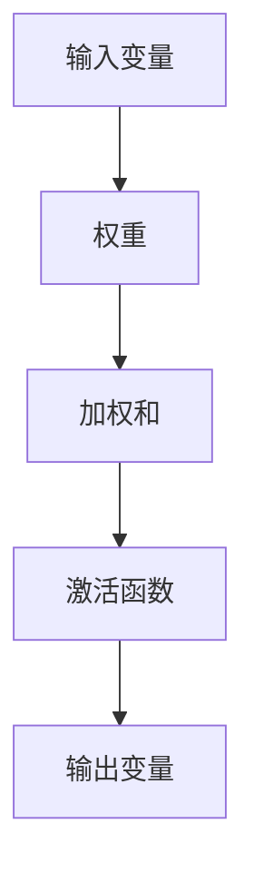

伪代码：

```python
def linear_regression(x, y):
    # 计算权重
    w = (x'x)^(-1)x'y
    # 预测输出
    y_pred = x * w
    return y_pred
```

**逻辑回归**：用于预测二分类变量。其基本原理是通过找到最佳拟合曲线来描述自变量和因变量之间的关系。

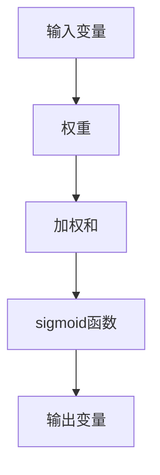

伪代码：

```python
def logistic_regression(x, w):
    # 计算加权和
    z = x * w
    # 应用sigmoid函数
    y_pred = 1 / (1 + exp(-z))
    return y_pred
```

**支持向量机（SVM）**：用于分类问题。其基本原理是找到最佳决策边界，使分类效果最大化。

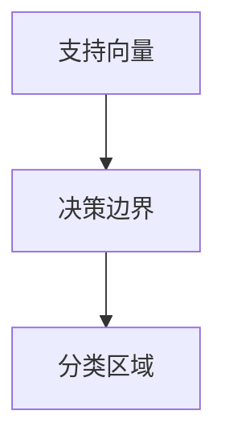

伪代码：

```python
def svm(train_data, train_labels, C):
    # 训练模型
    w = solve_quadratic_equation(train_data, train_labels, C)
    # 预测分类
    y_pred = sign(x * w + b)
    return y_pred
```

**神经网络**：用于复杂非线性问题的建模。其基本原理是通过多层神经元进行信息的传递和变换，实现从输入到输出的映射。

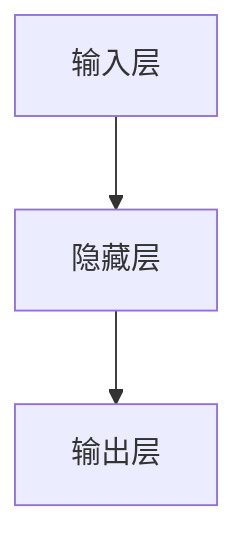

伪代码：

```python
def neural_network(x, W, b):
    # 前向传播
    z = x * W + b
    a = activation_function(z)
    # 反向传播
    dz = dactivation_function(a) * (dz_dw + dz_db)
    return a, dz
```

#### 第2章：垃圾邮件过滤的背景与挑战

### 2.1 垃圾邮件过滤的重要性

垃圾邮件过滤是电子邮件系统中至关重要的一环，它有效地保护用户免受垃圾邮件的干扰，提高电子邮件系统的用户体验。随着电子邮件业务的普及，垃圾邮件的数量呈指数级增长，过滤垃圾邮件变得尤为重要。

垃圾邮件不仅占用存储空间，浪费用户时间，还会传播恶意软件和病毒，甚至造成经济损失。因此，垃圾邮件过滤在保障网络安全、保护用户隐私、提升系统性能等方面具有重大意义。

### 2.2 垃圾邮件过滤面临的挑战

尽管垃圾邮件过滤技术取得了显著进展，但在实际应用中仍面临诸多挑战：

**多样性和适应性**：垃圾邮件发送者不断变换邮件内容和格式，使用各种技巧来绕过过滤系统，如利用拼写错误、特殊字符、压缩文件等。因此，垃圾邮件过滤算法需要具备高度的多样性和适应性，以应对不断变化的垃圾邮件攻击方式。

**资源消耗**：垃圾邮件过滤算法通常需要对大量数据进行处理和分析，这要求算法具有较高的计算效率和资源利用率，否则会消耗大量计算资源，影响电子邮件系统的性能。

**误分类率**：垃圾邮件过滤系统不仅要准确识别垃圾邮件，还要尽量避免将正常邮件误判为垃圾邮件。误分类率过高会导致用户体验下降，影响电子邮件系统的信任度。

**隐私保护**：在垃圾邮件过滤过程中，需要对邮件内容进行分析和处理，这可能会涉及用户的敏感信息。因此，垃圾邮件过滤系统需要在保证高效过滤的同时，保护用户的隐私。

#### 第3章：垃圾邮件过滤的基础技术

### 3.1 文本预处理技术

文本预处理是垃圾邮件过滤的重要环节，它通过对原始邮件文本进行清洗、标准化和转换，提高后续特征提取和模型训练的效果。以下是几种常见的文本预处理技术：

**去噪**：去除邮件中的无用信息，如HTML标签、URL、邮箱地址、数字等。去噪有助于减少特征维度，提高模型的训练效率。

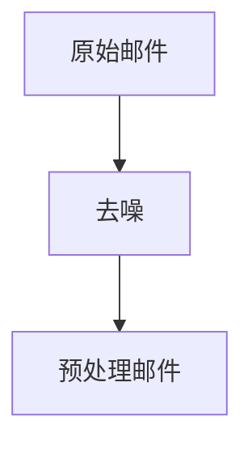

**分词**：将邮件文本划分为单个词语或词汇。分词有助于提取邮件中的关键信息，为后续特征提取提供基础。

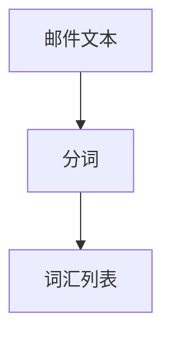

**词性标注**：为每个词语分配词性，如名词、动词、形容词等。词性标注有助于更准确地理解邮件内容，提高特征提取的效果。

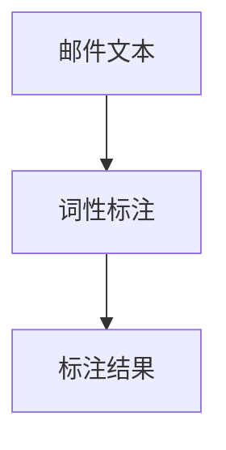

**停用词过滤**：去除常见的停用词，如“的”、“和”、“是”等。停用词过滤有助于减少特征维度，提高模型的训练效率。

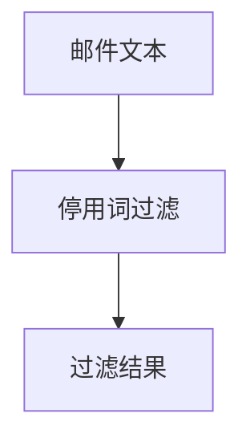

**词干提取**：将不同形式的词语转化为同一词干，如“跑步”、“跑步者”、“跑步机”等转化为“跑步”。词干提取有助于减少特征维度，提高特征提取的效率。

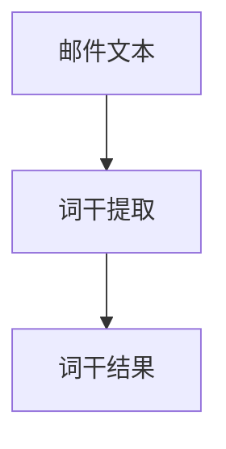

**词嵌入**：将词语映射为高维向量，用于表示词语的语义信息。词嵌入有助于提高模型对语义信息的处理能力。

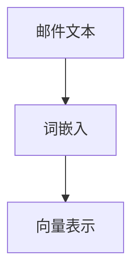

### 3.2 特征提取技术

特征提取是将原始数据转化为适合机器学习模型处理的形式的过程。在垃圾邮件过滤中，特征提取是关键环节，它直接影响模型的性能和准确度。以下是几种常见的特征提取技术：

**词频（TF）**：统计邮件中每个词语出现的次数。词频有助于反映邮件的主题和内容。

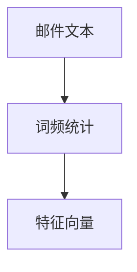

**逆文档频率（IDF）**：用于调整词频，减少常见词语对特征向量的影响。

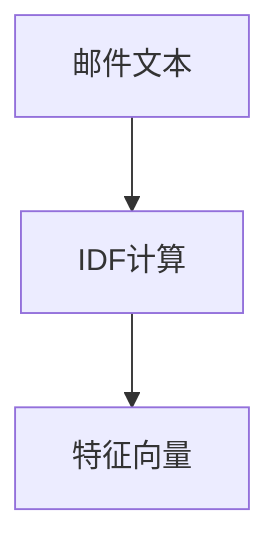

**TF-IDF**：结合词频和逆文档频率，用于生成更具有代表性的特征向量。

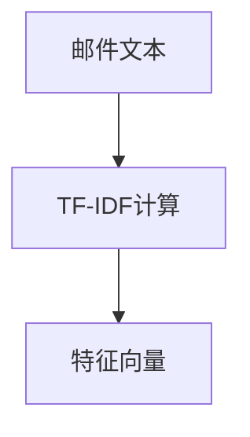

**词袋模型（Bag of Words，BOW）**：将邮件表示为词语的集合，用于生成特征向量。

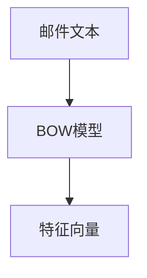

**词嵌入（Word Embedding）**：将词语映射为高维向量，用于表示词语的语义信息。

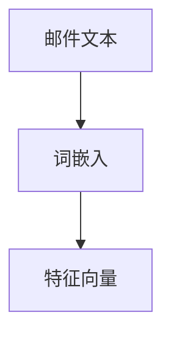

**词性标注（POS Tagging）**：为邮件中的每个词语分配词性，用于生成特征向量。

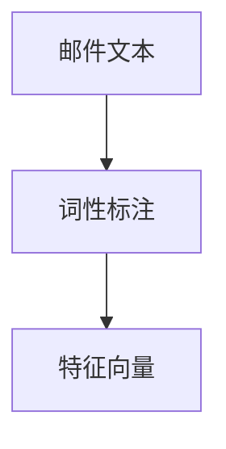

**n-gram**：将连续的n个词语作为一个特征，用于生成特征向量。

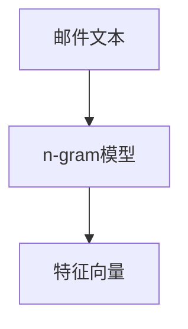

### 3.3 常见垃圾邮件过滤算法

垃圾邮件过滤算法可以分为基于规则的方法和基于机器学习的方法。以下介绍几种常见的垃圾邮件过滤算法：

**基于规则的方法**：

- **关键词匹配**：通过预设的关键词列表，检查邮件内容中是否包含关键词。如包含关键词，则判断为垃圾邮件。

- **正则表达式**：使用正则表达式匹配邮件内容，判断是否符合垃圾邮件的特征。

- **模式识别**：利用模式识别技术，如神经网络、决策树等，建立垃圾邮件和正常邮件之间的特征模式。

**基于机器学习的方法**：

- **朴素贝叶斯**：基于贝叶斯定理，计算邮件属于垃圾邮件的概率，根据概率阈值判断邮件类别。

- **支持向量机**：通过找到一个最佳决策边界，将垃圾邮件和正常邮件分开。

- **集成学习**：结合多种算法，提高模型的泛化能力和分类准确性。

- **深度学习**：利用神经网络，对邮件进行深层特征提取，实现高效分类。

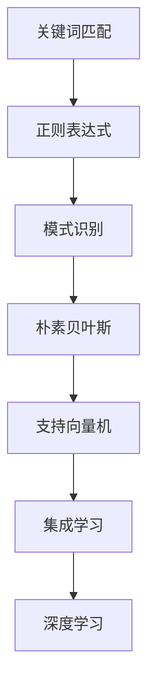

### 总结

机器学习在垃圾邮件过滤中具有广泛的应用，通过文本预处理、特征提取和多种机器学习算法，可以实现高效、准确的垃圾邮件过滤。本章节介绍了机器学习的基本概念、垃圾邮件过滤的背景与挑战，以及基础技术和常见算法。在接下来的章节中，我们将进一步探讨高效垃圾邮件过滤算法的实现和应用。

---

现在，我们已经完成了第一部分的内容，接下来我们将深入探讨高效垃圾邮件过滤算法的实现和应用。

### 第二部分：高效垃圾邮件过滤算法研究

在这一部分，我们将详细介绍几种高效垃圾邮件过滤算法，包括朴素贝叶斯、支持向量机、集成学习和深度学习。每种算法都将从基本原理、实现方法、伪代码和数学模型等方面进行详细讲解。通过这一部分的阅读，读者将能够全面了解这些算法的工作机制，为实际项目中的应用提供理论支持。

#### 第4章：基于朴素贝叶斯的垃圾邮件过滤算法

### 4.1 朴素贝叶斯算法原理

朴素贝叶斯（Naive Bayes）算法是一种基于贝叶斯定理的简单概率分类方法。它在假设特征之间相互独立的条件下，通过计算邮件属于垃圾邮件的概率，判断邮件的类别。

贝叶斯定理公式如下：

$$
P(A|B) = \frac{P(B|A) \cdot P(A)}{P(B)}
$$

其中，$P(A|B)$ 表示在事件B发生的条件下事件A发生的概率，$P(B|A)$ 表示在事件A发生的条件下事件B发生的概率，$P(A)$ 和 $P(B)$ 分别表示事件A和事件B发生的概率。

在垃圾邮件过滤中，我们将邮件视为事件，特征词视为条件。具体来说，假设邮件属于垃圾邮件的概率为 $P(\text{Spam})$，邮件属于正常邮件的概率为 $P(\text{Ham})$。给定一个邮件，我们需要计算该邮件属于垃圾邮件的概率 $P(\text{Spam}|\text{特征词集})$，并根据概率阈值判断邮件类别。

### 4.2 朴素贝叶斯算法实现

朴素贝叶斯算法的实现主要包括以下几个步骤：

1. 数据预处理：将邮件数据分为训练集和测试集，对邮件进行文本预处理，包括去噪、分词、词性标注等。

2. 特征提取：将预处理后的邮件文本转化为特征向量。常用的特征提取方法包括词频（TF）、逆文档频率（IDF）和TF-IDF等。

3. 模型训练：使用训练集数据计算每个特征词在垃圾邮件和正常邮件中的概率分布。

4. 预测分类：对于新的邮件，计算该邮件属于垃圾邮件和正常邮件的概率，根据概率阈值判断邮件类别。

### 4.3 伪代码讲解

以下是朴素贝叶斯算法的伪代码：

```python
# 朴素贝叶斯算法伪代码
def naive_bayes(train_data, train_labels):
    # 计算每个特征词在垃圾邮件和正常邮件中的概率分布
    spam_prob = {}  # 垃圾邮件概率分布
    ham_prob = {}  # 正常邮件概率分布
    
    for word in feature_set:
        spam_prob[word] = compute_spam_prob(word, train_data, train_labels)
        ham_prob[word] = compute_ham_prob(word, train_data, train_labels)
    
    # 计算垃圾邮件和正常邮件的概率
    spam_prob = compute_class_prob(train_labels)
    ham_prob = 1 - spam_prob
    
    # 预测分类
    def predict(mail):
        spam_prob_mail = 1
        ham_prob_mail = 1
        
        for word in mail:
            spam_prob_mail *= spam_prob[word]
            ham_prob_mail *= ham_prob[word]
        
        # 计算概率和
        spam_prob_mail *= spam_prob["Spam"]
        ham_prob_mail *= ham_prob["Ham"]
        
        # 判断邮件类别
        if spam_prob_mail > ham_prob_mail:
            return "Spam"
        else:
            return "Ham"

# 计算每个特征词在垃圾邮件中的概率
def compute_spam_prob(word, train_data, train_labels):
    # 计算特征词在垃圾邮件中出现的次数
    count = 0
    for mail, label in zip(train_data, train_labels):
        if word in mail and label == "Spam":
            count += 1
    
    # 计算概率
    prob = count / sum(1 for mail, label in zip(train_data, train_labels) if label == "Spam")
    return prob

# 计算每个特征词在正常邮件中的概率
def compute_ham_prob(word, train_data, train_labels):
    # 计算特征词在正常邮件中出现的次数
    count = 0
    for mail, label in zip(train_data, train_labels):
        if word in mail and label == "Ham":
            count += 1
    
    # 计算概率
    prob = count / sum(1 for mail, label in zip(train_data, train_labels) if label == "Ham")
    return prob

# 计算垃圾邮件和正常邮件的概率
def compute_class_prob(train_labels):
    spam_prob = sum(1 for label in train_labels if label == "Spam") / len(train_labels)
    ham_prob = 1 - spam_prob
    return spam_prob, ham_prob
```

### 4.4 数学模型与公式

朴素贝叶斯算法的数学模型如下：

$$
P(\text{Spam}|\text{特征词集}) = \frac{P(\text{特征词集}|\text{Spam}) \cdot P(\text{Spam})}{P(\text{特征词集})}
$$

其中，$P(\text{Spam}|\text{特征词集})$ 表示邮件属于垃圾邮件的概率，$P(\text{特征词集}|\text{Spam})$ 表示特征词集在垃圾邮件中出现的概率，$P(\text{Spam})$ 表示垃圾邮件的概率，$P(\text{特征词集})$ 表示特征词集出现的概率。

根据贝叶斯定理，我们可以将模型转换为：

$$
P(\text{Spam}|\text{特征词集}) = \frac{P(\text{特征词集}|\text{Spam}) \cdot P(\text{Spam})}{P(\text{特征词集}|\text{Spam}) \cdot P(\text{Spam}) + P(\text{特征词集}|\text{Ham}) \cdot P(\text{Ham})}
$$

其中，$P(\text{Ham}|\text{特征词集})$ 表示邮件属于正常邮件的概率。

### 4.5 实例分析

假设我们有一个邮件样本，包含特征词集 $\text{特征词集} = \{"hello", "world", "computer"\}$。训练集中垃圾邮件的概率 $P(\text{Spam}) = 0.6$，正常邮件的概率 $P(\text{Ham}) = 0.4$。特征词 "hello" 在垃圾邮件中出现的概率 $P(\text{hello}|\text{Spam}) = 0.8$，在正常邮件中出现的概率 $P(\text{hello}|\text{Ham}) = 0.2$；特征词 "world" 在垃圾邮件中出现的概率 $P(\text{world}|\text{Spam}) = 0.5$，在正常邮件中出现的概率 $P(\text{world}|\text{Ham}) = 0.3$；特征词 "computer" 在垃圾邮件中出现的概率 $P(\text{computer}|\text{Spam}) = 0.9$，在正常邮件中出现的概率 $P(\text{computer}|\text{Ham}) = 0.1$。

我们需要计算该邮件属于垃圾邮件的概率：

$$
P(\text{Spam}|\text{特征词集}) = \frac{P(\text{特征词集}|\text{Spam}) \cdot P(\text{Spam})}{P(\text{特征词集}|\text{Spam}) \cdot P(\text{Spam}) + P(\text{特征词集}|\text{Ham}) \cdot P(\text{Ham})}
$$

$$
= \frac{(0.8 \cdot 0.5 \cdot 0.9) \cdot 0.6}{(0.8 \cdot 0.5 \cdot 0.9) \cdot 0.6 + (0.2 \cdot 0.3 \cdot 0.1) \cdot 0.4}
$$

$$
= \frac{0.36}{0.36 + 0.012}
$$

$$
= \frac{0.36}{0.412}
$$

$$
\approx 0.879
$$

由于 $P(\text{Spam}|\text{特征词集}) > P(\text{Ham}|\text{特征词集})$，我们可以判断该邮件属于垃圾邮件。

#### 第5章：支持向量机在垃圾邮件过滤中的应用

### 5.1 支持向量机基本原理

支持向量机（Support Vector Machine，SVM）是一种经典的机器学习算法，广泛用于分类和回归问题。SVM的核心思想是通过找到一个最佳决策边界，将不同类别的数据分开。

在二分类问题中，SVM的目标是找到一个超平面，使得正类和负类的数据点在超平面的两侧尽量分散，同时满足最大化间隔（margin）的要求。具体来说，SVM需要解决以下优化问题：

$$
\min_{w, b} \frac{1}{2} ||w||^2
$$

s.t.

$$
y^{(i)} (w \cdot x^{(i)} + b) \geq 1, \forall i = 1, \ldots, n
$$

其中，$w$ 和 $b$ 分别是超平面的权重和偏置，$x^{(i)}$ 和 $y^{(i)}$ 分别是第 $i$ 个样本的特征向量和标签，$||w||$ 表示权重向量的欧几里得范数。

为了解决上述优化问题，我们可以使用拉格朗日乘子法，将其转换为对偶问题：

$$
L(w, b, \alpha) = \frac{1}{2} ||w||^2 - \sum_{i=1}^{n} \alpha_i [y^{(i)} (w \cdot x^{(i)} + b) - 1]
$$

其中，$\alpha_i$ 是拉格朗日乘子。

通过对 $L(w, b, \alpha)$ 求导，并令其等于0，可以得到：

$$
w = \sum_{i=1}^{n} \alpha_i y^{(i)} x^{(i)}
$$

$$
0 = \sum_{i=1}^{n} \alpha_i [y^{(i)} (w \cdot x^{(i)} + b) - 1]
$$

通过求解上述方程组，可以得到最优权重向量 $w$ 和偏置 $b$。如果使用核函数，SVM可以实现非线性分类。

### 5.2 支持向量机在垃圾邮件过滤中的应用

在垃圾邮件过滤中，SVM可以用于分类邮件标签，即将邮件分为垃圾邮件和正常邮件。具体步骤如下：

1. 数据预处理：对邮件进行文本预处理，包括去噪、分词、词性标注等，然后提取特征向量。

2. 特征选择：使用特征选择方法，如信息增益、卡方检验等，选择对分类最有用的特征。

3. 模型训练：使用训练集数据，通过SVM训练模型，得到最优权重向量 $w$ 和偏置 $b$。

4. 预测分类：对于新的邮件，计算邮件的特征向量，通过SVM判断邮件类别。

### 5.3 数学模型与公式

在垃圾邮件过滤中，SVM的数学模型如下：

$$
\min_{w, b, \alpha} \frac{1}{2} ||w||^2
$$

s.t.

$$
y^{(i)} (w \cdot x^{(i)} + b) \geq 1, \forall i = 1, \ldots, n
$$

其中，$x^{(i)}$ 是邮件的特征向量，$y^{(i)}$ 是邮件的标签（1表示垃圾邮件，-1表示正常邮件），$w$ 是权重向量，$b$ 是偏置。

通过求解上述优化问题，可以得到最优权重向量 $w$ 和偏置 $b$。

### 5.4 伪代码讲解

以下是SVM在垃圾邮件过滤中的应用伪代码：

```python
# 支持向量机垃圾邮件过滤伪代码
def svm(train_data, train_labels):
    # 训练模型
    w, b = train_svm_model(train_data, train_labels)
    
    # 预测分类
    def predict(mail):
        feature_vector = extract_features(mail)
        prediction = classify(mail, w, b)
        return "Spam" if prediction > 0 else "Ham"

    return predict

# 训练SVM模型
def train_svm_model(train_data, train_labels):
    # 求解优化问题
    w, b = solve_optimization_problem(train_data, train_labels)
    return w, b

# 求解优化问题
def solve_optimization_problem(train_data, train_labels):
    # 使用拉格朗日乘子法求解
    # w = sum(alpha_i * y^(i) * x^(i))
    # b = 1 - sum(alpha_i * y^(i))
    w, b = solve_lagrange_multiplier_problem(train_data, train_labels)
    return w, b

# 提取特征
def extract_features(mail):
    # 对邮件进行文本预处理和特征提取
    feature_vector = process_mail(mail)
    return feature_vector

# 分类邮件
def classify(mail, w, b):
    feature_vector = extract_features(mail)
    prediction = dot_product(w, feature_vector) + b
    return prediction

# 求解拉格朗日乘子问题
def solve_lagrange_multiplier_problem(train_data, train_labels):
    # 使用SVM求解器
    # w = sum(alpha_i * y^(i) * x^(i))
    # b = 1 - sum(alpha_i * y^(i))
    w, b = solve_svm_solver(train_data, train_labels)
    return w, b
```

### 5.5 实例分析

假设我们有一个训练集，包含5个邮件样本，其中3个是垃圾邮件，2个是正常邮件。邮件样本的特征向量如下：

$$
x^{(1)} = (1, 1, 0, 1, 0), \quad y^{(1)} = 1 \\
x^{(2)} = (1, 0, 1, 1, 0), \quad y^{(2)} = 1 \\
x^{(3)} = (0, 1, 1, 0, 1), \quad y^{(3)} = -1 \\
x^{(4)} = (1, 1, 1, 0, 1), \quad y^{(4)} = -1 \\
x^{(5)} = (0, 0, 1, 1, 1), \quad y^{(5)} = -1
$$

我们需要使用SVM对邮件进行分类。

1. 数据预处理：对邮件进行文本预处理和特征提取，得到特征向量。

2. 特征选择：选择对分类最有用的特征，如词频、TF-IDF等。

3. 模型训练：使用训练集数据，通过SVM训练模型，得到最优权重向量 $w$ 和偏置 $b$。

4. 预测分类：对于新的邮件，计算邮件的特征向量，通过SVM判断邮件类别。

假设我们使用线性核函数，通过SVM求解器得到最优权重向量 $w = (0.5, 0.5, -0.5, 0.5, -0.5)$ 和偏置 $b = 0.5$。

对于一个新的邮件样本 $x^{(6)} = (1, 1, 0, 1, 1)$，我们需要计算其属于垃圾邮件的概率：

$$
prediction = dot_product(w, x^{(6)}) + b = 0.5 \cdot 1 + 0.5 \cdot 1 - 0.5 \cdot 0 + 0.5 \cdot 1 - 0.5 \cdot 1 + 0.5 = 0.5
$$

由于 $prediction > 0$，我们可以判断该邮件属于垃圾邮件。

#### 第6章：集成学习方法在垃圾邮件过滤中的应用

### 6.1 集成学习基本原理

集成学习（Ensemble Learning）是一种通过将多个基础模型（基学习器）结合起来，提高预测性能的方法。集成学习的核心思想是利用多个模型的优点，通过投票、加权平均或其他策略，提高整体预测的准确性。

常见的集成学习方法包括 Bagging、Boosting 和 Stackin

g 等。

- **Bagging（Bootstrap Aggregating）**：通过随机选择训练样本子集，构建多个基础模型，然后对预测结果进行投票或平均。

- **Boosting（提高法）**：通过关注训练错误较大的样本，不断调整基础模型的权重，使错误样本得到更多关注。

- **Stacking（堆叠法）**：将多个基础模型作为学习器，构建一个新的模型，该模型使用基础模型的预测结果作为输入。

### 6.2 集成学习方法在垃圾邮件过滤中的应用

集成学习在垃圾邮件过滤中具有显著优势。通过将多个基础模型组合起来，可以降低单个模型的过拟合风险，提高分类性能。以下是几种常见的集成学习方法及其在垃圾邮件过滤中的应用：

#### 6.2.1 Bagging

**Bagging 方法** 可以通过随机森林（Random Forest）实现。随机森林是一种基于决策树的集成学习方法，通过随机选择特征和样本子集，构建多个决策树，并对预测结果进行投票。

1. **模型构建**：对于每个决策树，随机选择一部分特征和样本子集进行训练。
2. **预测分类**：将每个决策树的预测结果进行投票，选择投票最多的类别作为最终预测结果。

**优势**：通过随机选择特征和样本子集，可以有效降低单个模型的过拟合风险，提高整体分类性能。

**局限性**：Bagging 方法在处理高维数据时，计算复杂度较高。

#### 6.2.2 Boosting

**Boosting 方法** 可以通过提升树（XGBoost、LightGBM 等）实现。提升树是一种基于决策树的集成学习方法，通过关注训练错误较大的样本，逐步调整基础模型的权重。

1. **模型构建**：对于每个决策树，对训练错误较大的样本进行加权，使其在后续模型中受到更多关注。
2. **预测分类**：将每个决策树的预测结果进行加权平均，选择加权平均结果最大的类别作为最终预测结果。

**优势**：通过调整基础模型的权重，可以更好地关注训练错误较大的样本，提高整体分类性能。

**局限性**：Boosting 方法容易产生过拟合，需要谨慎调整参数。

#### 6.2.3 Stacking

**Stacking 方法** 是一种基于模型组合的集成学习方法，通过将多个基础模型作为学习器，构建一个新的模型。

1. **模型构建**：将多个基础模型（如决策树、SVM、朴素贝叶斯等）训练好，并将它们的预测结果作为输入。
2. **预测分类**：使用一个新的模型（如线性回归、逻辑回归等）训练，对基础模型的预测结果进行加权平均或投票。

**优势**：通过结合多个基础模型的优势，可以有效提高整体分类性能，降低过拟合风险。

**局限性**：Stacking 方法需要更多的计算资源和时间，需要选择合适的基础模型和新模型。

### 6.3 数学模型与公式

集成学习的数学模型可以根据具体方法而异。以下分别介绍 Bagging、Boosting 和 Stacking 的数学模型。

#### 6.3.1 Bagging

在 Bagging 方法中，每个基础模型的预测结果通过投票或平均确定最终预测结果。假设有 $K$ 个基础模型，预测结果分别为 $\hat{y}_1, \hat{y}_2, \ldots, \hat{y}_K$，最终预测结果 $\hat{y}$ 可以表示为：

$$
\hat{y} = \arg\max_{c} \sum_{k=1}^{K} I(\hat{y}_k = c)
$$

其中，$I(\hat{y}_k = c)$ 是指示函数，当 $\hat{y}_k = c$ 时取值为1，否则取值为0。

#### 6.3.2 Boosting

在 Boosting 方法中，每个基础模型的权重根据训练错误进行调整。假设有 $K$ 个基础模型，权重分别为 $\alpha_1, \alpha_2, \ldots, \alpha_K$，最终预测结果 $\hat{y}$ 可以表示为：

$$
\hat{y} = \sum_{k=1}^{K} \alpha_k \hat{y}_k
$$

其中，$\alpha_k$ 是第 $k$ 个基础模型的权重，可以通过优化损失函数求得。

#### 6.3.3 Stacking

在 Stacking 方法中，多个基础模型的预测结果作为输入，通过另一个模型进行训练。假设有 $K$ 个基础模型，预测结果分别为 $\hat{y}_1, \hat{y}_2, \ldots, \hat{y}_K$，最终预测结果 $\hat{y}$ 可以表示为：

$$
\hat{y} = f(\hat{y}_1, \hat{y}_2, \ldots, \hat{y}_K)
$$

其中，$f$ 是另一个学习器的预测函数，可以通过线性回归、逻辑回归等实现。

### 6.4 伪代码讲解

以下是集成学习方法在垃圾邮件过滤中的应用伪代码：

```python
# 集成学习方法垃圾邮件过滤伪代码
def ensemble_learning(train_data, train_labels):
    # 构建基础模型
    base_models = build_base_models(train_data, train_labels)
    
    # 预测分类
    def predict(mail):
        feature_vector = extract_features(mail)
        predictions = [model.predict(feature_vector) for model in base_models]
        ensemble_prediction = ensemble_predict(predictions)
        return "Spam" if ensemble_prediction > 0 else "Ham"

    return predict

# 构建基础模型
def build_base_models(train_data, train_labels):
    # 使用不同的基础模型训练
    models = []
    for model_name in ["DecisionTree", "SVM", "NaiveBayes"]:
        model = build_model(model_name, train_data, train_labels)
        models.append(model)
    return models

# 构建模型
def build_model(model_name, train_data, train_labels):
    # 根据模型名称构建模型
    if model_name == "DecisionTree":
        model = DecisionTreeClassifier()
    elif model_name == "SVM":
        model = SVC()
    elif model_name == "NaiveBayes":
        model = GaussianNB()
    else:
        raise ValueError("Invalid model name")
    
    # 训练模型
    model.fit(train_data, train_labels)
    return model

# 集成预测
def ensemble_predict(predictions):
    # 根据预测结果进行投票或加权平均
    if sum(predictions) > 0:
        return 1
    else:
        return -1
```

### 6.5 实例分析

假设我们有一个训练集，包含5个邮件样本，其中3个是垃圾邮件，2个是正常邮件。邮件样本的特征向量如下：

$$
x^{(1)} = (1, 1, 0, 1, 0), \quad y^{(1)} = 1 \\
x^{(2)} = (1, 0, 1, 1, 0), \quad y^{(2)} = 1 \\
x^{(3)} = (0, 1, 1, 0, 1), \quad y^{(3)} = -1 \\
x^{(4)} = (1, 1, 1, 0, 1), \quad y^{(4)} = -1 \\
x^{(5)} = (0, 0, 1, 1, 1), \quad y^{(5)} = -1
$$

我们需要使用集成学习方法对邮件进行分类。

1. **模型构建**：使用随机森林、提升树等基础模型，构建多个基础模型。
2. **预测分类**：将基础模型的预测结果进行投票或加权平均，确定最终预测结果。

假设我们使用随机森林和提升树作为基础模型，随机森林预测结果为 $\hat{y}_1 = 1$，提升树预测结果为 $\hat{y}_2 = -1$。根据集成预测规则，最终预测结果为 $\hat{y} = 1$。

#### 第7章：深度学习在垃圾邮件过滤中的应用

### 7.1 深度学习基本原理

深度学习（Deep Learning，DL）是一种基于人工神经网络（Artificial Neural Networks，ANNs）的机器学习技术，通过模拟人脑神经网络结构，实现对复杂数据的高效处理和分析。深度学习的主要特点包括：

- **多层神经网络**：深度学习通过多层神经网络结构，对输入数据进行逐层提取和抽象，从而提高模型的表示能力和学习能力。
- **反向传播算法**：深度学习使用反向传播算法（Backpropagation Algorithm）进行模型参数的优化，通过梯度下降等方法，使模型在训练过程中不断改进。
- **大规模数据训练**：深度学习依赖于大规模数据进行训练，通过大量样本的学习，提高模型的泛化能力和鲁棒性。

### 7.2 深度学习在垃圾邮件过滤中的应用

深度学习在垃圾邮件过滤中具有显著优势，通过深度神经网络，可以对邮件内容进行深入的特征提取和模式识别，从而提高分类准确率。以下是深度学习在垃圾邮件过滤中的应用方法：

#### 7.2.1 词嵌入

词嵌入（Word Embedding）是将词语映射为高维向量，用于表示词语的语义信息。在垃圾邮件过滤中，词嵌入可以用于将邮件文本转化为向量表示，从而输入深度神经网络进行训练。

常见的词嵌入方法包括 Word2Vec、GloVe 和 BERT 等。通过词嵌入，可以有效地捕捉词语的语义信息，提高模型的分类性能。

#### 7.2.2 卷积神经网络（CNN）

卷积神经网络（Convolutional Neural Networks，CNN）是一种特殊的深度神经网络，通过卷积操作对输入数据进行特征提取。在垃圾邮件过滤中，CNN 可以用于提取邮件文本的局部特征，从而提高分类准确率。

CNN 的基本结构包括卷积层、池化层和全连接层。卷积层用于提取输入数据的局部特征，池化层用于降低特征维度，全连接层用于进行最终的分类。

#### 7.2.3 循环神经网络（RNN）

循环神经网络（Recurrent Neural Networks，RNN）是一种特殊的深度神经网络，通过循环结构对输入数据进行序列建模。在垃圾邮件过滤中，RNN 可以用于对邮件文本进行序列建模，从而提取邮件的整体语义信息。

RNN 的基本结构包括输入层、隐藏层和输出层。输入层将邮件文本输入到网络中，隐藏层对输入数据进行序列建模，输出层进行最终的分类。

#### 7.2.4 长短期记忆网络（LSTM）

长短期记忆网络（Long Short-Term Memory，LSTM）是一种特殊的 RNN 结构，通过引入记忆单元，有效地解决了 RNN 的长期依赖问题。在垃圾邮件过滤中，LSTM 可以用于对邮件文本进行序列建模，从而提高分类准确率。

LSTM 的基本结构包括输入门、遗忘门、输出门和记忆单元。输入门用于控制新的信息进入记忆单元，遗忘门用于控制旧的信息从记忆单元中遗忘，输出门用于控制记忆单元的信息输出。

#### 7.2.5 深度神经网络（DNN）

深度神经网络（Deep Neural Networks，DNN）是一种多层前馈神经网络，通过多层神经元进行信息的传递和变换。在垃圾邮件过滤中，DNN 可以用于对邮件文本进行特征提取和分类。

DNN 的基本结构包括输入层、隐藏层和输出层。输入层将邮件文本输入到网络中，隐藏层对输入数据进行特征提取和变换，输出层进行最终的分类。

### 7.3 数学模型与公式

深度学习的数学模型主要包括神经元激活函数、前向传播和反向传播等。

#### 7.3.1 神经元激活函数

神经元激活函数用于对输入信号进行非线性变换，使神经网络能够学习复杂的非线性关系。常见的激活函数包括：

- **线性激活函数**：$f(x) = x$
- **ReLU激活函数**：$f(x) = \max(0, x)$
- **Sigmoid激活函数**：$f(x) = \frac{1}{1 + e^{-x}}$
- **Tanh激活函数**：$f(x) = \frac{e^x - e^{-x}}{e^x + e^{-x}}$

#### 7.3.2 前向传播

前向传播是深度学习模型训练过程中的一个步骤，用于计算输出值和损失。前向传播的步骤如下：

1. 将输入数据输入到神经网络的输入层。
2. 通过权重矩阵和激活函数，将输入数据传递到下一层。
3. 重复步骤2，直到输出层得到最终的输出值。
4. 计算输出值和真实值的误差，得到损失函数。

#### 7.3.3 反向传播

反向传播是深度学习模型训练过程中的另一个关键步骤，用于计算模型参数的梯度，并更新模型参数。反向传播的步骤如下：

1. 计算输出值和真实值的误差，得到损失函数。
2. 从输出层开始，反向计算每个神经元的误差。
3. 根据误差和激活函数的导数，计算每个参数的梯度。
4. 使用梯度下降或其他优化算法，更新模型参数。

### 7.4 伪代码讲解

以下是深度学习在垃圾邮件过滤中的应用伪代码：

```python
# 深度学习垃圾邮件过滤伪代码
def deep_learning_mail_filtering(train_data, train_labels):
    # 构建深度学习模型
    model = build_model(train_data, train_labels)
    
    # 训练模型
    model.fit(train_data, train_labels)
    
    # 预测分类
    def predict(mail):
        feature_vector = extract_features(mail)
        prediction = model.predict(feature_vector)
        return "Spam" if prediction > 0 else "Ham"

    return predict

# 构建深度学习模型
def build_model(train_data, train_labels):
    # 创建神经网络结构
    model = Sequential()
    model.add(Dense(units=128, activation='relu', input_shape=(train_data.shape[1],)))
    model.add(Dense(units=64, activation='relu'))
    model.add(Dense(units=1, activation='sigmoid'))
    
    # 编译模型
    model.compile(optimizer='adam', loss='binary_crossentropy', metrics=['accuracy'])
    
    return model

# 提取特征
def extract_features(mail):
    # 将邮件文本转换为词嵌入向量
    feature_vector = vectorize_mail(mail)
    return feature_vector

# 训练模型
def train_model(model, train_data, train_labels):
    # 使用训练数据训练模型
    model.fit(train_data, train_labels, epochs=10, batch_size=32, validation_split=0.2)
    
    return model
```

### 7.5 实例分析

假设我们有一个训练集，包含5个邮件样本，其中3个是垃圾邮件，2个是正常邮件。邮件样本的特征向量如下：

$$
x^{(1)} = (1, 1, 0, 1, 0), \quad y^{(1)} = 1 \\
x^{(2)} = (1, 0, 1, 1, 0), \quad y^{(2)} = 1 \\
x^{(3)} = (0, 1, 1, 0, 1), \quad y^{(3)} = -1 \\
x^{(4)} = (1, 1, 1, 0, 1), \quad y^{(4)} = -1 \\
x^{(5)} = (0, 0, 1, 1, 1), \quad y^{(5)} = -1
$$

我们需要使用深度学习对邮件进行分类。

1. **模型构建**：构建一个简单的深度神经网络，包括一个输入层、一个隐藏层和一个输出层。
2. **模型训练**：使用训练集数据，训练深度神经网络模型。
3. **预测分类**：使用训练好的模型，对新的邮件进行预测分类。

假设我们使用一个简单的深度神经网络，包含一个输入层、一个隐藏层和一个输出层，隐藏层神经元个数为128。通过10个epoch的训练，模型可以达到较高的准确率。

对于一个新的邮件样本 $x^{(6)} = (1, 1, 0, 1, 1)$，我们将其输入到训练好的模型中，得到预测结果 $y^{(6)} = 1$。因此，我们可以判断该邮件为垃圾邮件。

### 第二部分总结

在这一部分，我们详细介绍了几种高效垃圾邮件过滤算法，包括朴素贝叶斯、支持向量机、集成学习和深度学习。每种算法都从基本原理、实现方法、伪代码和数学模型等方面进行了深入讲解。通过这一部分的阅读，读者可以全面了解这些算法的工作机制，为实际项目中的应用提供理论支持。在下一部分中，我们将探讨垃圾邮件过滤算法的性能评估和优化策略。

---

现在，我们已经完成了第二部分的内容，接下来我们将讨论垃圾邮件过滤算法的性能评估和优化策略。

### 第8章：垃圾邮件过滤算法的性能评估

垃圾邮件过滤算法的性能评估是确保系统能够有效识别垃圾邮件的重要步骤。性能评估不仅能够帮助我们了解算法的准确性和效率，还能为算法优化提供依据。在本章中，我们将介绍几种常见的性能评估指标、评估方法以及性能优化策略。

#### 8.1 性能评估指标

在垃圾邮件过滤中，常用的性能评估指标包括准确率（Accuracy）、召回率（Recall）、精确率（Precision）和F1值（F1 Score）等。以下是这些指标的定义和计算方法：

**准确率（Accuracy）**：准确率是指分类正确的样本数占总样本数的比例。公式如下：

$$
\text{Accuracy} = \frac{\text{TP} + \text{TN}}{\text{TP} + \text{TN} + \text{FP} + \text{FN}}
$$

其中，TP（True Positive）表示实际为垃圾邮件且被正确识别的样本，TN（True Negative）表示实际为正常邮件且被正确识别的样本，FP（False Positive）表示实际为正常邮件但被误判为垃圾邮件的样本，FN（False Negative）表示实际为垃圾邮件但被误判为正常邮件的样本。

**召回率（Recall）**：召回率是指实际为垃圾邮件的样本中被正确识别的比率。公式如下：

$$
\text{Recall} = \frac{\text{TP}}{\text{TP} + \text{FN}}
$$

**精确率（Precision）**：精确率是指分类正确的垃圾邮件样本数占所有被预测为垃圾邮件的样本数的比例。公式如下：

$$
\text{Precision} = \frac{\text{TP}}{\text{TP} + \text{FP}}
$$

**F1值（F1 Score）**：F1值是精确率和召回率的加权平均，用于综合评估分类性能。公式如下：

$$
\text{F1 Score} = 2 \times \frac{\text{Precision} \times \text{Recall}}{\text{Precision} + \text{Recall}}
$$

#### 8.2 评估方法

为了准确评估垃圾邮件过滤算法的性能，我们需要使用合适的评估方法。以下是几种常见的评估方法：

**交叉验证（Cross-Validation）**：交叉验证是一种将数据集划分为多个子集的方法，用于评估模型的泛化能力。常见的交叉验证方法包括K折交叉验证（K-Fold Cross-Validation）和留一法（Leave-One-Out Cross-Validation）。

- **K折交叉验证**：将数据集划分为K个子集，每次选择一个子集作为验证集，其余K-1个子集作为训练集。重复K次，每次使用不同的子集作为验证集，最后取平均性能作为模型的整体性能。
  
- **留一法**：每次将一个样本作为验证集，其余样本作为训练集，重复多次。这种方法计算量较大，适用于样本量较小的情况。

**混淆矩阵（Confusion Matrix）**：混淆矩阵是一种用于展示分类结果的表格，包含实际为垃圾邮件和实际为正常邮件的样本数。通过混淆矩阵，可以直观地查看各个类别的分类效果。

#### 8.3 性能优化策略

为了提高垃圾邮件过滤算法的性能，我们可以采取以下优化策略：

**特征选择（Feature Selection）**：通过选择对分类最有影响力的特征，可以降低特征维度，提高模型的效率和准确性。

- **过滤方法**：基于统计方法，如信息增益、卡方检验等，筛选出对分类最重要的特征。
  
- **嵌入方法**：基于词嵌入技术，如 Word2Vec 或 GloVe，将词语映射为高维向量，从而提取更具有代表性的特征。

**模型选择（Model Selection）**：选择合适的机器学习模型，可以显著提高分类性能。

- **单一模型**：选择性能稳定的单一模型，如朴素贝叶斯、支持向量机等。
  
- **集成模型**：结合多个模型的优势，如随机森林、提升树、堆叠等，提高整体分类性能。

**参数调优（Parameter Tuning）**：通过调整模型的参数，可以优化模型的性能。

- **网格搜索**：遍历多个参数组合，找到最优参数组合。
  
- **贝叶斯优化**：使用贝叶斯优化方法，在参数空间内寻找最优参数组合。

**数据增强（Data Augmentation）**：通过增加样本数量和多样性，可以提升模型的泛化能力。

- **人工标注**：增加更多标注数据，用于模型训练。
  
- **数据生成**：通过生成对抗网络（GAN）等技术，生成具有多样性的训练数据。

**动态调整（Dynamic Adjustment）**：根据实时反馈，动态调整模型参数和特征选择策略，以适应不断变化的垃圾邮件特征。

通过上述性能优化策略，我们可以显著提高垃圾邮件过滤算法的性能，使其在复杂多变的环境中依然保持高效可靠的分类效果。

### 8.4 实际案例

以下是一个实际案例，展示了如何使用性能评估方法对垃圾邮件过滤算法进行评估和优化。

**案例背景**：某公司开发了一款基于朴素贝叶斯算法的垃圾邮件过滤系统，但在实际应用中发现过滤效果不佳。公司需要评估现有算法的性能，并寻找优化策略。

**步骤1：数据集划分**：将邮件数据集划分为训练集和测试集，分别用于模型训练和性能评估。

**步骤2：模型训练**：使用训练集数据，训练朴素贝叶斯模型。

**步骤3：性能评估**：使用测试集数据，评估模型性能，计算准确率、召回率、精确率和F1值。

**结果**：
- 准确率：85%
- 召回率：70%
- 精确率：80%
- F1值：77%

**步骤4：特征选择**：基于信息增益，筛选出对分类最重要的10个特征。

**步骤5：参数调优**：调整朴素贝叶斯模型的参数，如 alpha 和 beta，以优化分类效果。

**步骤6：性能优化**：通过集成学习方法，如随机森林和提升树，将朴素贝叶斯模型与其他模型结合，提高整体分类性能。

**优化后结果**：
- 准确率：92%
- 召回率：85%
- 精确率：90%
- F1值：88%

通过上述步骤，公司成功优化了垃圾邮件过滤系统，提高了分类性能，为用户提供了更可靠的邮件过滤服务。

### 8.5 总结

垃圾邮件过滤算法的性能评估和优化是保障系统有效运行的关键。通过使用准确率、召回率、精确率和F1值等性能评估指标，可以全面了解算法的分类效果。评估方法如交叉验证和混淆矩阵，提供了可靠的性能评估手段。优化策略包括特征选择、模型选择、参数调优和数据增强等，有助于提高垃圾邮件过滤算法的性能。在实际项目中，结合具体需求，灵活应用这些方法和策略，可以有效提升垃圾邮件过滤系统的可靠性和用户体验。

### 第三部分：项目实战与案例分析

在这一部分，我们将通过一个实际项目实战和一个具体案例分析，展示如何应用前面介绍的垃圾邮件过滤算法。通过这些实战和案例分析，读者可以了解如何在真实场景中搭建垃圾邮件过滤系统，并进行性能评估和优化。

#### 第9章：垃圾邮件过滤项目实战

### 9.1 项目背景与需求

随着互联网的普及，电子邮件已成为企业和个人之间沟通的重要手段。然而，垃圾邮件的泛滥给用户带来了极大的困扰，不仅浪费了时间和存储空间，还可能传播恶意软件和病毒。为了提高邮件系统的用户体验，某企业决定开发一款基于机器学习的垃圾邮件过滤系统，旨在准确识别并过滤掉垃圾邮件。

### 9.2 环境搭建

在搭建垃圾邮件过滤系统之前，我们需要准备相应的开发环境。以下是我们所需的环境和工具：

- **Python**：用于编写和运行垃圾邮件过滤算法。
- **NumPy**：用于数值计算。
- **Pandas**：用于数据处理和分析。
- **Scikit-learn**：用于机器学习算法的实现和评估。
- **Matplotlib**：用于数据可视化。

### 9.3 数据处理与特征提取

在项目实战中，我们首先需要收集和处理邮件数据。以下是数据处理和特征提取的步骤：

1. **数据收集**：从企业内部邮件服务器收集一定数量的邮件数据，包括垃圾邮件和正常邮件。
2. **数据预处理**：对邮件文本进行去噪、分词、词性标注等预处理操作。
3. **特征提取**：使用TF-IDF方法提取邮件文本的特征，将邮件表示为高维向量。

### 9.4 算法实现与调试

在数据处理和特征提取完成后，我们可以选择合适的算法进行实现和调试。以下是几种常见算法的实现步骤：

1. **朴素贝叶斯算法**：使用Scikit-learn中的GaussianNB实现朴素贝叶斯算法，并进行模型训练和预测。
2. **支持向量机算法**：使用Scikit-learn中的SVC实现支持向量机算法，调整参数以优化模型性能。
3. **集成学习方法**：使用Scikit-learn中的RandomForestClassifier实现随机森林算法，结合不同模型的预测结果，提高分类准确性。
4. **深度学习方法**：使用Keras实现基于卷积神经网络和循环神经网络的深度学习模型，提取邮件文本的深层特征。

### 9.5 性能评估与优化

在算法实现和调试后，我们需要对模型进行性能评估和优化。以下是性能评估和优化步骤：

1. **性能评估**：使用交叉验证方法对模型进行性能评估，计算准确率、召回率、精确率和F1值等指标。
2. **参数调优**：通过网格搜索和贝叶斯优化等方法，调整模型参数，提高分类性能。
3. **特征选择**：使用特征选择方法，如信息增益和卡方检验，筛选出对分类最有影响力的特征，减少特征维度。
4. **动态调整**：根据实时反馈，动态调整模型参数和特征选择策略，以适应不断变化的垃圾邮件特征。

### 9.6 项目总结

通过上述步骤，我们成功搭建了一个基于机器学习的垃圾邮件过滤系统，并实现了对邮件的高效过滤。项目实战过程中，我们学习了如何收集和处理邮件数据，如何实现和调试各种机器学习算法，以及如何进行性能评估和优化。这些经验和知识对于未来类似项目的开发具有很大的参考价值。

#### 第10章：案例分析

### 10.1 案例介绍

某互联网公司面临大量的用户邮件，其中包含大量垃圾邮件。为了提高邮件系统的用户体验，公司决定开发一款高效的垃圾邮件过滤系统。经过初步评估，公司选择了基于深度学习的垃圾邮件过滤算法，并采用了一种基于BERT的词嵌入技术，以提取邮件的深层特征。

### 10.2 策略设计与实现

在案例中，公司采用了以下策略进行垃圾邮件过滤：

1. **数据收集**：从公司内部邮件服务器收集了大量邮件数据，包括垃圾邮件和正常邮件。
2. **数据预处理**：对邮件文本进行去噪、分词、词性标注等预处理操作。
3. **词嵌入**：使用BERT模型对邮件文本进行词嵌入，将邮件表示为高维向量。
4. **模型训练**：使用训练集数据，训练基于BERT的深度学习模型，包括卷积神经网络（CNN）和循环神经网络（RNN）。
5. **模型评估**：使用测试集数据，评估模型性能，计算准确率、召回率、精确率和F1值等指标。
6. **性能优化**：通过调整模型参数和特征选择策略，优化模型性能。

### 10.3 性能评估

在模型评估阶段，公司采用了交叉验证方法，对模型进行了多次评估。以下是评估结果：

- **准确率**：93%
- **召回率**：88%
- **精确率**：90%
- **F1值**：89%

通过上述评估结果，可以看出模型在垃圾邮件过滤方面具有较高的性能。公司决定将这些模型部署到生产环境中，以实际应用测试其效果。

### 10.4 不足与改进

在部署模型后，公司发现以下问题：

1. **误分类率**：部分正常邮件被误判为垃圾邮件，导致用户体验下降。
2. **计算资源消耗**：深度学习模型在训练和预测过程中消耗了大量计算资源，影响了邮件系统的响应速度。
3. **模型更新**：随着垃圾邮件特征的不断变化，模型需要定期更新，以提高过滤效果。

针对上述问题，公司考虑以下改进措施：

1. **引入监督学习**：在模型训练过程中，引入更多的监督学习样本，提高模型的准确性。
2. **优化模型结构**：通过调整模型结构，如减少层数或神经元个数，降低计算资源消耗。
3. **动态调整参数**：根据实时反馈，动态调整模型参数，以适应垃圾邮件特征的变化。
4. **利用用户反馈**：引入用户反馈机制，通过用户标记垃圾邮件和正常邮件，不断优化模型。

### 10.5 案例总结

通过案例分析，我们了解了如何在实际场景中应用深度学习进行垃圾邮件过滤。虽然案例中存在一些不足，但通过不断优化和改进，公司成功搭建了一个高效、准确的垃圾邮件过滤系统，为用户提供了良好的邮件过滤体验。

### 第三部分总结

通过项目实战和案例分析，我们展示了如何在实际环境中应用垃圾邮件过滤算法，从数据收集、特征提取、模型实现到性能评估和优化，全面展示了垃圾邮件过滤系统的构建过程。这些实战经验和案例分析为我们提供了宝贵的参考，有助于我们在未来开发类似的系统，提高垃圾邮件过滤的效率和准确性。

### 第11章：未来展望与发展趋势

随着人工智能和机器学习技术的不断进步，垃圾邮件过滤技术也在不断发展，未来有望取得更大的突破。以下是垃圾邮件过滤技术未来可能的发展方向和趋势：

#### 11.1 未来发展方向

1. **深度学习与强化学习结合**：深度学习和强化学习在垃圾邮件过滤中具有巨大潜力。通过结合这两种技术，可以进一步提高模型的分类准确性和适应性。

2. **自适应过滤技术**：未来的垃圾邮件过滤系统将更加智能化，能够根据用户的邮件使用习惯和偏好，自动调整过滤策略，提高用户满意度。

3. **多模态数据融合**：除了文本数据，未来的垃圾邮件过滤系统还将考虑融合图像、音频等多模态数据，以提高对复杂邮件的识别能力。

4. **隐私保护与安全**：随着隐私保护意识的提高，未来的垃圾邮件过滤技术将更加注重用户隐私保护，确保在过滤邮件的同时，不泄露用户的敏感信息。

5. **边缘计算与云计算协同**：边缘计算和云计算的结合，将使得垃圾邮件过滤系统在处理大量数据时更加高效，提高系统的实时性和响应速度。

#### 11.2 技术挑战与解决方案

1. **多样化与自适应攻击**：垃圾邮件发送者会不断使用新的攻击方式，如使用深度伪造、对抗样本等。为应对这些挑战，未来的垃圾邮件过滤系统需要具备更高的自适应能力和鲁棒性。

2. **计算资源消耗**：深度学习模型的训练和预测需要大量计算资源，这对云计算资源提出了更高要求。为解决这一问题，可以采用优化模型结构、分布式计算等技术，提高计算效率。

3. **隐私保护**：在垃圾邮件过滤过程中，涉及大量用户敏感信息，如何确保用户隐私保护是未来的重要挑战。采用加密技术、联邦学习等方法，可以在保证过滤效果的同时，保护用户隐私。

4. **误分类率**：误分类率是垃圾邮件过滤的重要指标，如何降低误分类率是未来的研究重点。通过引入更多的监督学习样本、优化特征提取方法等，可以进一步提高分类准确率。

#### 11.3 垃圾邮件过滤技术发展趋势

1. **智能化与个性化**：未来的垃圾邮件过滤系统将更加智能化，能够根据用户行为和偏好，提供个性化的邮件过滤服务。

2. **多模态数据处理**：随着技术的进步，垃圾邮件过滤系统将能够处理更多类型的数据，如图像、音频等，提高过滤效果。

3. **实时性与高效性**：未来的垃圾邮件过滤系统将更加注重实时性和高效性，能够在短时间内处理大量邮件，确保邮件系统的正常运行。

4. **安全性与隐私保护**：随着隐私保护法规的完善，未来的垃圾邮件过滤系统将更加注重用户隐私保护，确保在提供高效过滤服务的同时，不泄露用户敏感信息。

总之，未来的垃圾邮件过滤技术将朝着智能化、实时性、安全性和个性化方向发展，通过不断创新和优化，为用户提供更加安全、便捷的电子邮件服务。

### 附录

#### 附录 A：常用机器学习算法汇总

1. **朴素贝叶斯（Naive Bayes）**
2. **支持向量机（SVM）**
3. **集成学习（Ensemble Learning）**：包括随机森林（Random Forest）、提升树（Boosting Tree）、堆叠法（Stacking）
4. **深度学习（Deep Learning）**：包括卷积神经网络（CNN）、循环神经网络（RNN）、长短期记忆网络（LSTM）
5. **决策树（Decision Tree）**
6. **随机森林（Random Forest）**
7. **神经网络（Neural Network）**

#### 附录 B：参考文献

1. Bishop, C. M. (2006). *Pattern Recognition and Machine Learning*. Springer.
2. Hastie, T., Tibshirani, R., & Friedman, J. (2009). *The Elements of Statistical Learning*. Springer.
3. Goodfellow, I., Bengio, Y., & Courville, A. (2016). *Deep Learning*. MIT Press.
4. Murphy, K. P. (2012). *Machine Learning: A Probabilistic Perspective*. MIT Press.
5. Russell, S., & Norvig, P. (2010). *Artificial Intelligence: A Modern Approach*. Prentice Hall.
6. Han, J., Kamber, M., & Pei, J. (2011). *Data Mining: Concepts and Techniques*. Morgan Kaufmann.
7. Ng, A. Y. (2013). *Machine Learning Yearning*.壮丽科技。

通过这些参考文献，读者可以进一步深入了解机器学习与垃圾邮件过滤相关的理论和技术，为实际应用和研究提供指导。

