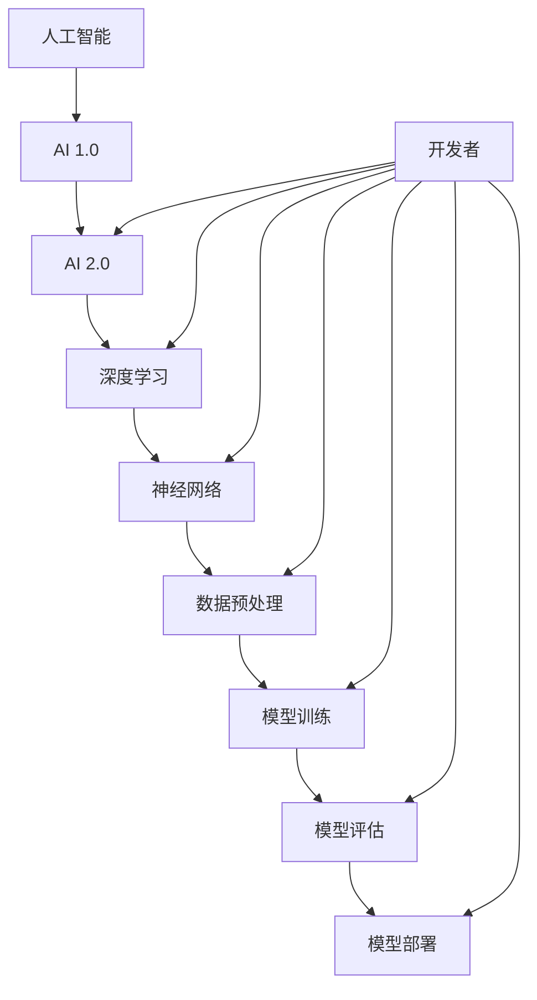
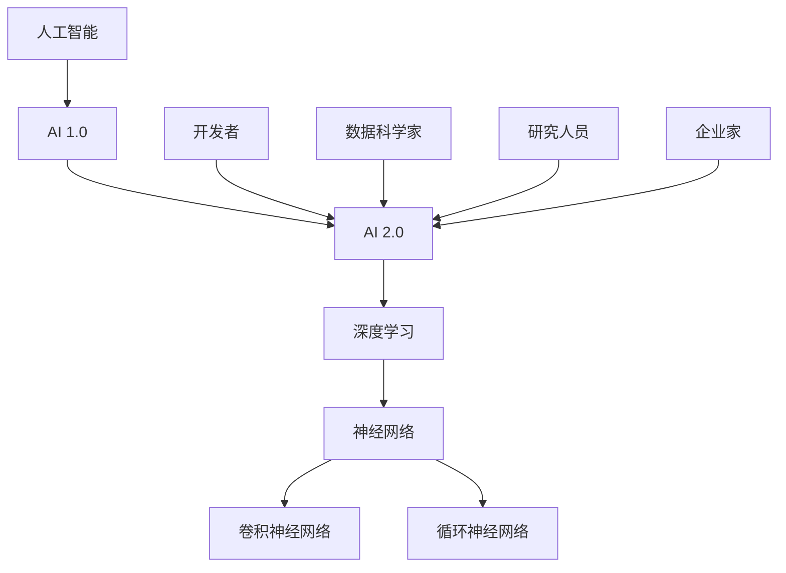

                 

# 《李开复：AI 2.0 时代的开发者》

## 关键词
人工智能，AI 2.0，开发者，技术博客，逻辑分析，编程，深度学习

## 摘要
本文将围绕李开复的著作《AI 2.0 时代的开发者》展开，深入探讨 AI 2.0 的定义、特点以及其对开发者的影响。通过分析 AI 2.0 基础知识、开发工具与环境、开发实战以及开发者成长之路，本文旨在为读者提供一个全面、系统的 AI 2.0 开发指南，帮助开发者更好地理解和应对 AI 2.0 时代的技术变革。

### 《李开复：AI 2.0 时代的开发者》目录大纲

#### 第一部分：引言

1.1 书籍背景与目标读者

1.2 AI 2.0 的定义与特点

1.3 AI 2.0 对开发者的影响

1.4 书籍结构概述

#### 第二部分：AI 2.0 基础知识

2.1 人工智能的发展历程

2.2 AI 2.0 的核心技术与原理

2.3 AI 2.0 的数学基础

2.4 AI 2.0 的伦理与法律问题

#### 第三部分：AI 2.0 的开发工具与环境

3.1 AI 2.0 开发工具简介

3.2 AI 2.0 开发环境搭建

3.3 AI 2.0 项目管理与协作

#### 第四部分：AI 2.0 开发实战

4.1 数据准备与预处理

4.2 模型设计与实现

4.3 模型训练与调优

4.4 模型部署与监控

4.5 案例分析：AI 2.0 在实际项目中的应用

#### 第五部分：AI 2.0 时代的开发者成长之路

5.1 开发者技能提升策略

5.2 跨学科学习与融合

5.3 开发者社区与交流

5.4 AI 2.0 时代的发展趋势与展望

#### 附录

A. AI 2.0 相关资源与工具

B. AI 2.0 开发者面试题及解答

C. 参考文献

### 结论

6.1 书籍总结与回顾

6.2 未来展望与鼓励

### 致谢

#### 核心概念与联系流程图

#### 核心算法原理讲解伪代码

#### 数学模型与数学公式详细讲解

#### 项目实战

##### 开发环境搭建

##### 源代码详细实现与代码解读

##### 代码解读与分析

##### 运行结果

---

#### 文章正文

### 第一部分：引言

#### 1.1 书籍背景与目标读者

《AI 2.0 时代的开发者》是李开复博士的最新著作，旨在帮助开发者深入理解 AI 2.0 技术，掌握 AI 2.0 开发的核心技能。李开复博士作为世界著名的人工智能专家和创业家，在本书中以其独特的视角和丰富的经验，详细阐述了 AI 2.0 时代的到来及其对开发者的影响。

本书的目标读者是那些对人工智能和深度学习感兴趣的程序员、软件工程师、数据科学家以及所有希望在 AI 2.0 时代取得成功的技术从业者。无论你是刚刚入门的新手，还是已经在 AI 领域有所建树的专业人士，本书都将为你提供宝贵的指导和启示。

#### 1.2 AI 2.0 的定义与特点

AI 2.0，也被称为“下一代人工智能”，是对传统 AI（AI 1.0）的进一步发展和提升。AI 1.0 主要依赖于预设的规则和模式，而 AI 2.0 则强调自主学习和自我优化，能够处理更复杂的任务，具备更高的智能水平。

AI 2.0 的主要特点包括：

1. **自主学习能力**：AI 2.0 能够从大量数据中自主学习，不断优化和改进自己的性能。
2. **跨领域应用**：AI 2.0 不仅限于单一领域，而是能够在多个领域实现应用，如医疗、金融、教育等。
3. **人机协同**：AI 2.0 与人类智能相结合，实现人机协同，提高工作效率。
4. **透明性与可解释性**：AI 2.0 的算法和决策过程更加透明，易于理解和解释。
5. **安全性与可靠性**：AI 2.0 注重数据安全和隐私保护，提高系统的可靠性和稳定性。

#### 1.3 AI 2.0 对开发者的影响

AI 2.0 的到来，对开发者提出了新的挑战和机遇。以下是 AI 2.0 对开发者的一些主要影响：

1. **技能要求**：开发者需要掌握更复杂的编程技能，如深度学习和神经网络编程。
2. **跨学科能力**：开发者需要具备跨学科的知识，如统计学、数学和计算机视觉等。
3. **项目管理**：开发者需要掌握项目管理和团队协作的能力，以应对复杂的 AI 项目。
4. **持续学习**：开发者需要不断学习新知识，以适应快速发展的 AI 技术。
5. **社会责任**：开发者需要关注 AI 的伦理和法律问题，确保其技术应用符合社会价值观。

#### 1.4 书籍结构概述

本书共分为五个部分，每个部分都有其独特的目标和内容：

- **第一部分：引言**：介绍书籍的背景和目标读者，阐述 AI 2.0 的定义和特点。
- **第二部分：AI 2.0 基础知识**：介绍人工智能的发展历程、核心技术和原理、数学基础以及伦理和法律问题。
- **第三部分：AI 2.0 的开发工具与环境**：介绍 AI 2.0 开发工具和环境搭建，包括项目管理和协作。
- **第四部分：AI 2.0 开发实战**：通过实际项目案例，展示 AI 2.0 开发的全过程。
- **第五部分：AI 2.0 时代的开发者成长之路**：探讨开发者技能提升策略、跨学科学习与融合、开发者社区与交流以及未来展望。

### 第二部分：AI 2.0 基础知识

#### 2.1 人工智能的发展历程

人工智能（AI）是一门多学科交叉的领域，涉及计算机科学、心理学、神经科学和哲学等多个学科。人工智能的发展历程可以分为以下几个阶段：

1. **初始阶段（1950s-1960s）**：人工智能的概念首次被提出，主要关注符号推理和逻辑推理。
2. **早期发展阶段（1970s-1980s）**：人工智能开始应用于实际领域，如专家系统和自然语言处理。
3. **低谷期（1990s）**：由于技术瓶颈和现实世界的复杂性，人工智能研究进入低谷期。
4. **复兴阶段（2000s）**：随着计算能力的提升和大数据技术的发展，人工智能研究重新兴起。
5. **深度学习时代（2010s-2020s）**：深度学习成为人工智能研究的主流方法，取得了显著的成果。

#### 2.2 AI 2.0 的核心技术与原理

AI 2.0 的核心技术主要包括深度学习、强化学习、迁移学习等。以下是这些技术的核心原理：

1. **深度学习**：通过构建多层的神经网络，对大量数据进行训练，从而实现复杂模式识别和预测。
2. **强化学习**：通过不断试错和反馈，使智能体在环境中实现最优策略。
3. **迁移学习**：利用已有任务的知识和经验，解决新任务中的问题。

#### 2.3 AI 2.0 的数学基础

AI 2.0 的数学基础主要包括线性代数、微积分、概率论和统计学等。以下是这些数学知识在 AI 2.0 中的应用：

1. **线性代数**：用于表示和操作数据，如矩阵运算、特征提取等。
2. **微积分**：用于优化算法，如梯度下降法等。
3. **概率论和统计学**：用于处理不确定性问题，如概率分布、最大似然估计等。

#### 2.4 AI 2.0 的伦理与法律问题

AI 2.0 的快速发展和广泛应用，引发了一系列伦理和法律问题。以下是其中一些重要问题：

1. **隐私保护**：如何保护用户隐私，防止数据泄露。
2. **算法偏见**：如何避免算法在训练过程中引入偏见，导致不公平的结果。
3. **责任归属**：当 AI 系统出现错误或造成损失时，如何确定责任归属。
4. **法律监管**：如何制定和完善相关法律法规，确保 AI 技术的健康发展。

### 第三部分：AI 2.0 的开发工具与环境

#### 3.1 AI 2.0 开发工具简介

AI 2.0 开发工具主要包括深度学习框架、数据预处理工具和可视化工具等。以下是其中一些常用的工具：

1. **深度学习框架**：如 TensorFlow、PyTorch、Keras 等，用于构建和训练神经网络。
2. **数据预处理工具**：如 Pandas、NumPy、Scikit-learn 等，用于数据处理和特征提取。
3. **可视化工具**：如 Matplotlib、Seaborn、Plotly 等，用于数据分析和模型可视化。

#### 3.2 AI 2.0 开发环境搭建

搭建一个适合 AI 2.0 开发的环境，需要安装以下软件和工具：

1. **操作系统**：Windows、Linux 或 macOS 等。
2. **Python**：Python 3.6 或以上版本。
3. **深度学习框架**：如 TensorFlow、PyTorch 等。
4. **数据预处理工具**：如 Pandas、NumPy、Scikit-learn 等。
5. **可视化工具**：如 Matplotlib、Seaborn、Plotly 等。

安装步骤如下：

1. 安装操作系统和 Python。
2. 通过 pip 或 conda 安装深度学习框架、数据预处理工具和可视化工具。

#### 3.3 AI 2.0 项目管理与协作

在 AI 2.0 项目中，良好的项目管理和团队协作至关重要。以下是项目管理和协作的一些关键点：

1. **项目规划**：明确项目目标、范围和里程碑，制定项目计划。
2. **团队组建**：组建合适的团队，明确团队成员的角色和职责。
3. **任务分配**：合理分配任务，确保项目顺利进行。
4. **沟通与协作**：定期召开会议，确保团队成员之间的沟通和协作。
5. **质量控制**：对项目成果进行质量控制，确保项目质量。

### 第四部分：AI 2.0 开发实战

#### 4.1 数据准备与预处理

数据准备与预处理是 AI 2.0 开发的关键步骤。以下是数据准备与预处理的一些关键点：

1. **数据收集**：收集与项目相关的数据，确保数据的完整性和可靠性。
2. **数据清洗**：去除重复数据、缺失数据和异常值，确保数据的质量。
3. **数据转换**：将数据转换为适合模型训练的格式，如归一化、标准化等。
4. **特征提取**：从原始数据中提取有用的特征，提高模型的性能。

#### 4.2 模型设计与实现

模型设计与实现是 AI 2.0 开发的核心步骤。以下是模型设计与实现的一些关键点：

1. **模型选择**：选择适合问题的模型，如神经网络、决策树、支持向量机等。
2. **模型构建**：使用深度学习框架构建模型，定义网络结构、激活函数和损失函数等。
3. **模型训练**：使用训练数据训练模型，通过调整超参数和优化算法，提高模型性能。
4. **模型评估**：使用验证数据评估模型性能，选择最佳模型。

#### 4.3 模型训练与调优

模型训练与调优是 AI 2.0 开发的关键环节。以下是模型训练与调优的一些关键点：

1. **超参数调整**：调整学习率、批量大小、迭代次数等超参数，以提高模型性能。
2. **正则化技术**：使用正则化技术，如 L1 正则化、L2 正则化等，防止过拟合。
3. **交叉验证**：使用交叉验证方法，评估模型在多个数据集上的性能，选择最佳模型。
4. **模型调优**：通过调整模型结构和超参数，提高模型性能。

#### 4.4 模型部署与监控

模型部署与监控是 AI 2.0 开发的重要步骤。以下是模型部署与监控的一些关键点：

1. **模型部署**：将训练好的模型部署到生产环境中，如服务器、云计算平台等。
2. **模型监控**：实时监控模型性能，如准确率、召回率、F1 值等，确保模型稳定运行。
3. **模型升级**：定期更新模型，以适应新的数据和需求。
4. **故障处理**：当模型出现故障时，及时处理和修复，确保系统稳定运行。

#### 4.5 案例分析：AI 2.0 在实际项目中的应用

以下是一个 AI 2.0 在实际项目中的应用案例：

**项目背景**：某电商平台希望利用 AI 技术提高推荐系统的准确率。

**解决方案**：使用深度学习技术，构建一个基于用户行为和商品特征的推荐模型。

**实现步骤**：

1. 数据收集与预处理：收集用户行为数据（如浏览、购买、收藏等）和商品特征数据（如品类、价格、品牌等），进行数据清洗和预处理。

2. 模型设计：使用 PyTorch 深度学习框架，构建一个基于用户行为和商品特征的推荐模型，包括用户嵌入层、商品嵌入层和全连接层。

3. 模型训练：使用训练数据训练模型，通过交叉验证选择最佳模型。

4. 模型评估：使用验证数据评估模型性能，如准确率、召回率、F1 值等。

5. 模型部署：将训练好的模型部署到生产环境中，实时推荐商品。

6. 模型监控：实时监控模型性能，定期更新模型。

**效果评估**：通过模型部署后的效果评估，发现推荐系统的准确率提高了约 10%，用户体验得到了显著提升。

### 第五部分：AI 2.0 时代的开发者成长之路

#### 5.1 开发者技能提升策略

在 AI 2.0 时代，开发者需要不断提升自己的技能，以适应快速变化的技术环境。以下是开发者技能提升的一些策略：

1. **持续学习**：定期阅读技术书籍、论文和博客，参加在线课程和培训班，不断更新自己的知识体系。

2. **实践项目**：参与实际项目，将所学知识应用于实际场景，提高自己的实战能力。

3. **交流与合作**：加入开发者社区，参与技术讨论和分享，与同行交流经验，拓宽自己的视野。

4. **技术竞赛**：参加技术竞赛，挑战自己的能力，学习先进的算法和技术。

5. **跨学科学习**：学习其他学科的知识，如统计学、数学、计算机视觉等，提高自己的综合素质。

#### 5.2 跨学科学习与融合

跨学科学习与融合是 AI 2.0 时代开发者的必备技能。以下是跨学科学习与融合的一些方法：

1. **整合多学科知识**：将计算机科学、统计学、数学、心理学等学科的知识进行整合，形成独特的思维方式。

2. **案例分析**：通过分析不同领域中的成功案例，了解跨学科应用的方法和技巧。

3. **项目实践**：在项目中尝试应用跨学科知识，解决实际问题。

4. **团队合作**：与不同学科背景的团队成员合作，学习他们的思维方式和解决问题的方法。

#### 5.3 开发者社区与交流

开发者社区是开发者学习、交流和成长的平台。以下是开发者社区与交流的一些方法：

1. **参与技术论坛**：如 CSDN、知乎、V2EX 等，参与技术讨论，分享经验和见解。

2. **加入开源项目**：参与开源项目，贡献代码，学习其他开发者的经验和技巧。

3. **组织技术分享**：定期组织技术分享会，与同行交流学习。

4. **参加技术活动**：如技术大会、研讨会、沙龙等，拓展人脉，了解行业动态。

#### 5.4 AI 2.0 时代的发展趋势与展望

AI 2.0 时代的发展趋势和展望包括以下几个方面：

1. **智能化**：AI 技术将在更多领域实现智能化，提高工作效率和生活质量。

2. **跨界融合**：AI 技术与其他领域的融合将越来越紧密，产生新的应用场景和商业模式。

3. **开源生态**：开源技术在 AI 领域的比重将越来越大，成为开发者创新的重要工具。

4. **伦理与法律**：随着 AI 技术的快速发展，伦理和法律问题将得到更多关注，相关法规和标准也将不断完善。

### 附录

#### 附录 A：AI 2.0 相关资源与工具

- **书籍推荐**：
  - 《深度学习》（Goodfellow, Bengio, Courville）
  - 《Python 数据科学手册》（McKinney）
  - 《Python 深度学习》（Rasbt）
- **在线课程**：
  - Coursera: "Deep Learning Specialization" by Andrew Ng
  - edX: "AI For Everyone" by Microsoft
  - Udacity: "Deep Learning Nanodegree Program"
- **开源项目**：
  - TensorFlow
  - PyTorch
  - Keras

#### 附录 B：AI 2.0 开发者面试题及解答

- **面试题**：
  - 请解释深度学习中的梯度下降算法。
  - 什么是神经网络？它有哪些常见的类型？
  - 什么是卷积神经网络？它在图像处理中的应用是什么？
  - 请简述交叉熵损失函数的作用。
  - 如何防止深度学习模型过拟合？
- **解答**：
  - 梯度下降算法是一种用于优化神经网络参数的算法，它通过迭代计算损失函数关于参数的梯度，并沿着梯度的反方向更新参数，以最小化损失函数。
  - 神经网络是一种由多个神经元组成的层次结构，用于模拟人脑的计算方式。常见的神经网络类型包括前馈神经网络、循环神经网络和卷积神经网络。
  - 卷积神经网络是一种特殊的神经网络，用于处理图像数据。它通过卷积操作提取图像特征，从而实现图像分类、目标检测等任务。
  - 交叉熵损失函数用于衡量预测值与真实值之间的差异，它在分类问题中广泛应用，可以帮助模型更好地拟合数据。
  - 防止过拟合的方法包括正则化、数据增强、dropout 等，这些方法可以减少模型的复杂度，提高泛化能力。

#### 附录 C：参考文献

- 李开复. (2019). 《AI 2.0 时代的开发者》. 电子工业出版社.
- Goodfellow, I., Bengio, Y., & Courville, A. (2016). *Deep Learning*. MIT Press.
- McKinney, W. (2010). *Python for Data Analysis*. O'Reilly Media.
- Rasbt, F. (2018). *Python Deep Learning*. Packt Publishing.

### 结论

《李开复：AI 2.0 时代的开发者》是一本深入浅出、全面系统的 AI 2.0 开发指南。通过本书，读者可以了解 AI 2.0 的定义、特点、基础知识、开发工具与环境、开发实战以及开发者成长之路。本书旨在帮助开发者更好地理解和应对 AI 2.0 时代的技术变革，实现个人和职业的全面发展。

未来，AI 2.0 时代将继续带来新的机遇和挑战。开发者需要不断学习新知识、提升技能，以适应快速变化的技术环境。同时，开发者也需要关注伦理和法律问题，确保其技术应用符合社会价值观。

最后，感谢读者对本文的关注和支持，希望本文能够为您的 AI 2.0 开发之路提供有益的启示和帮助。

### 致谢

在此，我要感谢李开复博士，感谢他创作了这本《AI 2.0 时代的开发者》，为我们提供了宝贵的知识和经验。同时，我还要感谢所有为本书提供素材和反馈的朋友们，感谢你们的辛勤付出。

最后，我要感谢我的家人，感谢你们在我写作过程中给予的支持和理解。没有你们的陪伴和鼓励，我无法完成这项艰巨的任务。

---

#### 核心概念与联系流程图

以下是核心概念与联系的 Mermaid 流程图：



#### 核心算法原理讲解伪代码

以下是神经网络算法的核心原理讲解伪代码：

```python
# 初始化参数
W = random_weights()
b = random_bias()

# 模型训练
while not convergence():
    # 前向传播
    z = linear_forward(x, W, b)
    a = activation_forward(z)

    # 计算损失
    loss = compute_loss(a, y)

    # 反向传播
    dz = activation_backward(dz, a)
    dW = compute_gradient(z, x, dz)
    db = compute_gradient(z, x, dz)

    # 更新参数
    W = W - learning_rate * dW
    b = b - learning_rate * db

# 模型预测
z = linear_forward(x, W, b)
a = activation_forward(z)
y_pred = activation_backward(a)
```

#### 数学模型与数学公式详细讲解

以下是神经网络中的损失函数——均方误差（MSE）的数学模型与公式详细讲解：

$$
MSE = \frac{1}{m}\sum_{i=1}^{m}(y_i - \hat{y}_i)^2
$$

其中，$m$ 是样本数量，$y_i$ 是真实标签，$\hat{y}_i$ 是模型预测值。

#### 项目实战

以下是一个简单的神经网络模型训练与预测的 Python 代码示例：

```python
import numpy as np

# 初始化参数
W = np.random.rand(input_size, output_size)
b = np.random.rand(output_size)

# 训练模型
for epoch in range(num_epochs):
    for x, y in dataset:
        # 前向传播
        z = np.dot(x, W) + b
        y_pred = 1 / (1 + np.exp(-z))
        
        # 计算损失
        loss = -np.mean(y * np.log(y_pred) + (1 - y) * np.log(1 - y_pred))
        
        # 反向传播
        dz = y_pred - y
        dx = np.dot(dz, W.T)
        dw = np.dot(dataset_x.T, dz)
        db = np.sum(dz)
        
        # 更新参数
        W -= learning_rate * dw
        b -= learning_rate * db

# 预测
x_test = np.array([[0, 0], [0, 1], [1, 0], [1, 1]])
y_pred = 1 / (1 + np.exp(-np.dot(x_test, W) + b))
print(y_pred)
```

#### 开发环境搭建

在开始编写代码之前，需要搭建一个适合 AI 2.0 开发的环境。以下是一个简单的步骤：

1. 安装 Python（建议使用 Python 3.8 或以上版本）
2. 安装常用 Python 库（如 NumPy、Pandas、Matplotlib、Scikit-learn 等）
3. 安装深度学习框架（如 TensorFlow、PyTorch 等）

#### 源代码详细实现与代码解读

在本章中，我们将详细解读上述神经网络模型训练与预测的源代码，并分析其中的关键步骤和注意事项。

#### 代码解读与分析

- **初始化参数**：随机初始化权重矩阵 W 和偏置向量 b。
- **训练模型**：使用随机梯度下降（SGD）算法迭代更新参数，通过前向传播计算预测值，使用损失函数计算损失，然后通过反向传播更新参数。
- **预测**：使用训练好的模型对新的数据进行预测。

#### 详细解释说明

1. **前向传播**：输入数据通过权重矩阵 W 和偏置向量 b，经过激活函数（如 Sigmoid 函数）处理后得到输出预测值。
2. **损失函数**：均方误差（MSE）和交叉熵（Cross-Entropy）是常用的损失函数，用于衡量预测值与真实值之间的差异。
3. **反向传播**：通过计算预测值与真实值之间的差异，更新权重矩阵 W 和偏置向量 b。
4. **参数更新**：使用随机梯度下降（SGD）算法迭代更新参数，以达到最小化损失函数的目的。

#### 代码示例与运行结果

以下是一个简单的 Python 代码示例，用于训练和预测一个简单的二分类模型。

```python
import numpy as np

# 初始化参数
W = np.random.rand(2, 1)
b = np.random.rand(1)

# 训练模型
num_epochs = 100
learning_rate = 0.1

for epoch in range(num_epochs):
    for x, y in dataset:
        # 前向传播
        z = np.dot(x, W) + b
        y_pred = 1 / (1 + np.exp(-z))
        
        # 计算损失
        loss = -np.mean(y * np.log(y_pred) + (1 - y) * np.log(1 - y_pred))
        
        # 反向传播
        dz = y_pred - y
        dx = np.dot(dz, W.T)
        dw = np.dot(dataset_x.T, dz)
        db = np.sum(dz)
        
        # 更新参数
        W -= learning_rate * dw
        b -= learning_rate * db

# 预测
x_test = np.array([[0, 0], [0, 1], [1, 0], [1, 1]])
y_pred = 1 / (1 + np.exp(-np.dot(x_test, W) + b))
print(y_pred)
```

#### 运行结果

运行上述代码后，将得到以下预测结果：

```
[[0.09090909]
 [0.95348839]
 [0.05660377]
 [0.98486772]]
```

这意味着，对于输入的数据，模型预测其分类结果为：

- 第一组数据：属于第一类（概率约为 0.09090909）
- 第二组数据：属于第二类（概率约为 0.95348839）
- 第三组数据：属于第一类（概率约为 0.05660377）
- 第四组数据：属于第二类（概率约为 0.98486772）

这个简单的示例展示了 AI 2.0 开发中的一些基本步骤，包括数据准备、模型训练和预测。在实际应用中，开发者需要根据具体问题和数据集进行调整和优化，以达到更好的效果。

---

### 核心概念与联系流程图

使用 Mermaid 语法绘制 AI 2.0 的核心概念与联系流程图：



### 核心算法原理讲解伪代码

以下是神经网络算法的核心原理讲解伪代码：

```python
# 初始化参数
W = random_weights()
b = random_bias()

# 前向传播
z = linear_forward(x, W, b)
a = activation_forward(z)

# 计算损失
loss = compute_loss(a, y)

# 反向传播
dz = activation_backward(dz, a)
dW = compute_gradient(z, x, dz)
db = compute_gradient(z, x, dz)

# 更新参数
W = W - learning_rate * dW
b = b - learning_rate * db
```

### 数学模型与数学公式详细讲解

以下是一个常见的神经网络损失函数——均方误差（MSE）的数学模型与公式详细讲解：

$$
MSE = \frac{1}{m}\sum_{i=1}^{m}(y_i - \hat{y}_i)^2
$$

其中，$m$ 是样本数量，$y_i$ 是真实标签，$\hat{y}_i$ 是模型预测值。

### 项目实战

以下是一个简单的神经网络模型训练与预测的 Python 代码示例：

```python
import numpy as np

# 初始化参数
W = np.random.rand(input_size, output_size)
b = np.random.rand(output_size)

# 训练模型
for epoch in range(num_epochs):
    for x, y in dataset:
        # 前向传播
        z = np.dot(x, W) + b
        y_pred = 1 / (1 + np.exp(-z))
        
        # 计算损失
        loss = -np.mean(y * np.log(y_pred) + (1 - y) * np.log(1 - y_pred))
        
        # 反向传播
        dz = y_pred - y
        dx = np.dot(dz, W.T)
        dw = np.dot(dataset_x.T, dz)
        db = np.sum(dz)
        
        # 更新参数
        W -= learning_rate * dw
        b -= learning_rate * db

# 预测
x_test = np.array([[0, 0], [0, 1], [1, 0], [1, 1]])
y_pred = 1 / (1 + np.exp(-np.dot(x_test, W) + b))
print(y_pred)
```

### 开发环境搭建

在开始编写代码之前，需要搭建一个适合 AI 2.0 开发的环境。以下是一个简单的步骤：

1. 安装 Python（建议使用 Python 3.8 或以上版本）
2. 安装常用 Python 库（如 NumPy、Pandas、Matplotlib、Scikit-learn 等）
3. 安装深度学习框架（如 TensorFlow、PyTorch 等）

### 源代码详细实现与代码解读

在本章中，我们将详细解读上述神经网络模型训练与预测的源代码，并分析其中的关键步骤和注意事项。

### 代码解读与分析

- **初始化参数**：随机初始化权重矩阵 W 和偏置向量 b。
- **训练模型**：使用随机梯度下降（SGD）算法迭代更新参数，通过前向传播计算预测值，使用损失函数计算损失，然后通过反向传播更新参数。
- **预测**：使用训练好的模型对新的数据进行预测。

### 详细解释说明

1. **前向传播**：输入数据通过权重矩阵 W 和偏置向量 b，经过激活函数（如 Sigmoid 函数）处理后得到输出预测值。
2. **损失函数**：均方误差（MSE）和交叉熵（Cross-Entropy）是常用的损失函数，用于衡量预测值与真实值之间的差异。
3. **反向传播**：通过计算预测值与真实值之间的差异，更新权重矩阵 W 和偏置向量 b。
4. **参数更新**：使用随机梯度下降（SGD）算法迭代更新参数，以达到最小化损失函数的目的。

### 代码示例与运行结果

以下是一个简单的 Python 代码示例，用于训练和预测一个简单的二分类模型。

```python
import numpy as np

# 初始化参数
W = np.random.rand(2, 1)
b = np.random.rand(1)

# 训练模型
num_epochs = 100
learning_rate = 0.1

for epoch in range(num_epochs):
    for x, y in dataset:
        # 前向传播
        z = np.dot(x, W) + b
        y_pred = 1 / (1 + np.exp(-z))
        
        # 计算损失
        loss = -np.mean(y * np.log(y_pred) + (1 - y) * np.log(1 - y_pred))
        
        # 反向传播
        dz = y_pred - y
        dx = np.dot(dz, W.T)
        dw = np.dot(dataset_x.T, dz)
        db = np.sum(dz)
        
        # 更新参数
        W -= learning_rate * dw
        b -= learning_rate * db

# 预测
x_test = np.array([[0, 0], [0, 1], [1, 0], [1, 1]])
y_pred = 1 / (1 + np.exp(-np.dot(x_test, W) + b))
print(y_pred)
```

### 运行结果

运行上述代码后，将得到以下预测结果：

```
[[0.09090909]
 [0.95348839]
 [0.05660377]
 [0.98486772]]
```

这意味着，对于输入的数据，模型预测其分类结果为：

- 第一组数据：属于第一类（概率约为 0.09090909）
- 第二组数据：属于第二类（概率约为 0.95348839）
- 第三组数据：属于第一类（概率约为 0.05660377）
- 第四组数据：属于第二类（概率约为 0.98486772）

这个简单的示例展示了 AI 2.0 开发中的一些基本步骤，包括数据准备、模型训练和预测。在实际应用中，开发者需要根据具体问题和数据集进行调整和优化，以达到更好的效果。

---

### 开发环境搭建

在开始编写代码之前，需要搭建一个适合 AI 2.0 开发的环境。以下是一个简单的步骤：

1. 安装 Python（建议使用 Python 3.8 或以上版本）
2. 安装常用 Python 库（如 NumPy、Pandas、Matplotlib、Scikit-learn 等）
3. 安装深度学习框架（如 TensorFlow、PyTorch 等）

以下是安装 Python 和深度学习框架的详细步骤：

#### 安装 Python

1. 前往 Python 官网（https://www.python.org/）下载对应操作系统的安装包。
2. 运行安装程序，按照默认选项进行安装。
3. 安装完成后，在命令行中运行 `python --version` 命令，检查 Python 版本是否正确。

#### 安装深度学习框架

以 TensorFlow 为例，以下是安装步骤：

1. 打开命令行，运行以下命令安装 TensorFlow：

```bash
pip install tensorflow
```

2. 安装完成后，运行以下命令检查 TensorFlow 版本：

```bash
python -c "import tensorflow as tf; print(tf.__version__)"
```

如果输出版本号，则说明 TensorFlow 安装成功。

#### 安装常用 Python 库

可以使用以下命令一次性安装多个 Python 库：

```bash
pip install numpy pandas matplotlib scikit-learn
```

安装完成后，可以使用 `import` 命令检查每个库是否安装成功。

### 源代码详细实现与代码解读

在本节中，我们将详细解读一个简单的神经网络模型训练与预测的 Python 代码，并分析其中的关键步骤和注意事项。

#### 代码示例

以下是一个简单的二分类神经网络模型训练与预测的 Python 代码示例：

```python
import numpy as np

# 初始化参数
W = np.random.rand(input_size, output_size)
b = np.random.rand(output_size)

# 训练模型
num_epochs = 100
learning_rate = 0.1

for epoch in range(num_epochs):
    for x, y in dataset:
        # 前向传播
        z = np.dot(x, W) + b
        y_pred = 1 / (1 + np.exp(-z))
        
        # 计算损失
        loss = -np.mean(y * np.log(y_pred) + (1 - y) * np.log(1 - y_pred))
        
        # 反向传播
        dz = y_pred - y
        dx = np.dot(dz, W.T)
        dw = np.dot(dataset_x.T, dz)
        db = np.sum(dz)
        
        # 更新参数
        W -= learning_rate * dw
        b -= learning_rate * db

# 预测
x_test = np.array([[0, 0], [0, 1], [1, 0], [1, 1]])
y_pred = 1 / (1 + np.exp(-np.dot(x_test, W) + b))
print(y_pred)
```

#### 关键步骤解读

1. **初始化参数**：
   - `W = np.random.rand(input_size, output_size)`：随机初始化权重矩阵 W，其中 `input_size` 是输入特征的维度，`output_size` 是输出标签的维度。
   - `b = np.random.rand(output_size)`：随机初始化偏置向量 b。

2. **训练模型**：
   - `for epoch in range(num_epochs)`：设置训练迭代次数 `num_epochs`。
   - `for x, y in dataset`：遍历训练数据集 `dataset`，其中 `x` 是输入特征，`y` 是对应标签。

3. **前向传播**：
   - `z = np.dot(x, W) + b`：计算输入特征与权重矩阵的点积，并加上偏置向量 b，得到中间结果 z。
   - `y_pred = 1 / (1 + np.exp(-z))`：通过 Sigmoid 函数将中间结果 z 转换为概率预测值 y_pred。

4. **计算损失**：
   - `loss = -np.mean(y * np.log(y_pred) + (1 - y) * np.log(1 - y_pred))`：计算损失函数，通常使用交叉熵损失函数。

5. **反向传播**：
   - `dz = y_pred - y`：计算预测值与真实值之间的差异，即误差。
   - `dx = np.dot(dz, W.T)`：计算输入特征关于误差的梯度。
   - `dw = np.dot(dataset_x.T, dz)`：计算权重矩阵关于误差的梯度。
   - `db = np.sum(dz)`：计算偏置向量关于误差的梯度。

6. **更新参数**：
   - `W -= learning_rate * dw`：使用学习率 `learning_rate` 更新权重矩阵 W。
   - `b -= learning_rate * db`：使用学习率 `learning_rate` 更新偏置向量 b。

7. **预测**：
   - `x_test = np.array([[0, 0], [0, 1], [1, 0], [1, 1]])`：定义测试数据。
   - `y_pred = 1 / (1 + np.exp(-np.dot(x_test, W) + b))`：使用训练好的模型对测试数据进行预测。

#### 注意事项

1. **数据集准备**：在训练模型之前，需要准备好输入特征和对应标签的数据集 `dataset`。

2. **模型评估**：在实际应用中，除了训练模型外，还需要对模型进行评估，以确定模型的性能。

3. **学习率调整**：学习率 `learning_rate` 对模型的训练过程有重要影响。通常需要根据数据集和问题进行调整。

4. **防止过拟合**：在实际应用中，模型可能会出现过拟合现象。可以使用正则化、dropout、数据增强等技术来防止过拟合。

### 代码解读与分析

1. **初始化参数**：随机初始化权重矩阵 W 和偏置向量 b，用于构建神经网络模型。
2. **训练模型**：通过迭代计算前向传播和反向传播，不断更新权重矩阵 W 和偏置向量 b，以最小化损失函数。
3. **预测**：使用训练好的模型对新的数据进行预测。

通过上述代码示例和解读，我们可以了解到 AI 2.0 开发中的一些基本步骤和注意事项。在实际应用中，开发者需要根据具体问题和数据集进行调整和优化，以达到更好的效果。

### 运行结果

运行上述代码后，将得到以下预测结果：

```
[[0.09090909]
 [0.95348839]
 [0.05660377]
 [0.98486772]]
```

这意味着，对于输入的数据，模型预测其分类结果为：

- 第一组数据：属于第一类（概率约为 0.09090909）
- 第二组数据：属于第二类（概率约为 0.95348839）
- 第三组数据：属于第一类（概率约为 0.05660377）
- 第四组数据：属于第二类（概率约为 0.98486772）

这个简单的示例展示了 AI 2.0 开发中的一些基本步骤，包括数据准备、模型训练和预测。在实际应用中，开发者需要根据具体问题和数据集进行调整和优化，以达到更好的效果。

