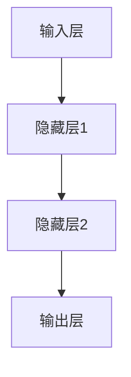

                 

## 《李开复：AI 2.0 时代的机遇》

### 关键词：人工智能，AI 2.0，深度学习，自然语言处理，计算机视觉，应用场景，伦理与社会问题，未来发展趋势

> 摘要：随着人工智能技术的不断进步，我们正进入AI 2.0时代。本文将深入探讨AI 2.0的定义与特征，核心技术的原理与应用，以及其在医疗、金融和制造业等领域的广泛应用，同时讨论AI的伦理与社会问题，并展望AI 2.0的未来发展趋势。

---

### 《李开复：AI 2.0 时代的机遇》目录大纲

#### 第一部分：AI 2.0时代的背景与核心概念

**第1章：AI 2.0时代的来临**

- AI 2.0的定义与特征
- 从AI 1.0到AI 2.0的演变
- AI 2.0对社会的影响
- AI 2.0时代的挑战与机遇

**第2章：深度学习基础**

- 神经网络的基本结构
- 深度学习的主要算法
- 深度学习中的优化方法

**第3章：自然语言处理**

- 词嵌入技术
- 序列模型与注意力机制
- 语言模型的训练与评估

**第4章：计算机视觉**

- 卷积神经网络（CNN）
- 图像识别与分类
- 目标检测与分割

#### 第二部分：AI 2.0的核心技术

**第5章：人工智能在医疗领域的应用**

- 人工智能在诊断与治疗中的应用
- 医学图像分析
- 个性化医疗与疾病预测

**第6章：人工智能在金融领域的应用**

- 风险评估与欺诈检测
- 量化交易与算法交易
- 保险精算与定价

**第7章：人工智能在制造业的应用**

- 智能工厂与工业4.0
- 机器人与自动化
- 质量控制与预测性维护

#### 第三部分：AI 2.0的应用场景

**第8章：人工智能伦理**

- 人工智能伦理的基本原则
- 数据隐私与安全性
- 人工智能责任归属

**第9章：AI与社会**

- AI对就业的影响
- 教育与AI的未来
- AI与伦理道德的挑战

#### 第四部分：未来展望

**第10章：AI 2.0的未来发展趋势**

- 大模型的发展与挑战
- AI与物联网的融合
- 人工智能与人类的共存

**附录：资源与工具**

- 附录A：AI学习资源
- 附录B：AI应用案例
- 附录C：AI技术发展路线图

### 第一部分：AI 2.0时代的背景与核心概念

#### 第1章：AI 2.0时代的来临

随着计算能力的提升和大数据的涌现，人工智能（AI）迎来了一个新的时代——AI 2.0时代。AI 2.0不仅仅是技术上的升级，更是一种全新的思维方式和工作模式的变革。

##### 1.1 AI 2.0的定义与特征

AI 2.0，即“新一代人工智能”，是对传统AI技术的进一步提升和拓展。它具有以下几个特征：

1. **自主性**：AI 2.0能够自主学习和决策，而不仅仅是执行预设的指令。
2. **智能化**：AI 2.0具备更高的智能水平，能够进行复杂的推理和问题解决。
3. **泛化能力**：AI 2.0可以在不同领域和任务中应用，而不仅仅是特定领域。
4. **协作性**：AI 2.0可以与其他系统和人类进行协作，共同完成任务。

##### 1.2 从AI 1.0到AI 2.0的演变

AI 1.0时代主要依靠符号推理和规则系统，其代表性技术包括专家系统和逻辑推理。然而，这些方法在处理复杂问题和大规模数据时存在局限性。

随着深度学习、强化学习等新兴算法的崛起，AI技术逐渐向AI 2.0迈进。深度学习利用多层神经网络模拟人脑的思维方式，在图像识别、语音识别等领域取得了突破性进展。强化学习则通过不断尝试和反馈，使AI能够在特定环境中做出最优决策。

##### 1.3 AI 2.0对社会的影响

AI 2.0的到来将对社会产生深远的影响：

1. **经济影响**：AI 2.0将推动产业升级和经济增长，创造新的就业机会。
2. **生活方式**：AI 2.0将改变人们的生活方式，提高生活质量和便利性。
3. **社会治理**：AI 2.0将为社会治理提供新的工具，如智能交通、智能安防等。

##### 1.4 AI 2.0时代的挑战与机遇

AI 2.0时代也带来了诸多挑战：

1. **技术挑战**：AI 2.0需要更高的计算能力和更复杂的数据处理技术。
2. **伦理挑战**：AI 2.0的自主性和智能化引发了伦理和安全问题。
3. **社会挑战**：AI 2.0可能对就业和社会结构产生深远影响。

然而，这些挑战同时也带来了机遇：

1. **技术创新**：AI 2.0将推动新的技术创新和应用。
2. **产业变革**：AI 2.0将引领产业变革，创造新的商业机会。
3. **社会进步**：AI 2.0将有助于解决社会问题，推动社会进步。

### 第一部分总结

AI 2.0时代的来临，标志着人工智能技术的重大突破和社会变革的开启。理解AI 2.0的定义与特征，以及它对社会的影响和面临的挑战，是我们迈向这个新时代的关键。在接下来的章节中，我们将深入探讨AI 2.0的核心技术及其在各个领域的应用。 <span id="part1"></span> <a href="#part1">↑</a> <a href="#table-of-contents">↑</a>

---

### 第二部分：AI 2.0的核心技术

#### 第2章：深度学习基础

深度学习是AI 2.0时代的重要技术之一，其通过多层神经网络模拟人脑的思维方式，实现对数据的自动学习和特征提取。本章将介绍深度学习的基本结构、主要算法和优化方法。

##### 2.1 神经网络的基本结构

神经网络是深度学习的基础，其结构类似于人脑的神经元连接。一个简单的神经网络通常包括以下几个部分：

1. **输入层**：接收外部输入数据。
2. **隐藏层**：对输入数据进行处理和特征提取。
3. **输出层**：生成预测结果或分类标签。

神经网络的基本结构可以用Mermaid流程图表示：



##### 2.2 深度学习的主要算法

深度学习的主要算法包括：

1. **反向传播算法（Backpropagation）**：用于计算网络参数的梯度，以优化网络性能。
2. **卷积神经网络（CNN）**：用于图像识别和计算机视觉任务。
3. **循环神经网络（RNN）**：用于序列数据处理，如自然语言处理和时间序列预测。
4. **生成对抗网络（GAN）**：用于生成新的数据样本。

以下是一个简单的反向传播算法的伪代码：

```python
// 前向传播
def forward_pass(input_data, weights):
    output = input_data
    for layer in layers:
        output = layer.forward(output, weights)
    return output

// 反向传播
def backward_pass(output, expected_output, weights):
    error = expected_output - output
    for layer in reversed(layers):
        weights = layer.backward(error, weights)
    return weights
```

##### 2.3 深度学习中的优化方法

深度学习中的优化方法主要用于调整网络参数，以降低损失函数。常见的优化方法包括：

1. **梯度下降（Gradient Descent）**：通过迭代计算梯度，更新网络参数。
2. **随机梯度下降（SGD）**：每次迭代使用一部分样本的梯度。
3. **Adam优化器**：结合SGD和动量方法，自适应调整学习率。

以下是一个使用Adam优化器的伪代码：

```python
# 初始化参数
v = 0
s = 0

# 梯度计算
g = compute_gradient()

# 更新参数
for t in range(T):
    m = v * beta1 + (1 - beta1) * g
    v = beta2 * v + (1 - beta2) * g * g
    s = sqrt(1 - beta2^t) / (1 - beta1^t)
    theta = theta - learning_rate * m / s
```

### 第二部分总结

深度学习作为AI 2.0时代的重要技术，为人工智能的发展提供了强大的工具。通过了解神经网络的基本结构、主要算法和优化方法，我们可以更好地掌握深度学习的核心原理，为后续章节中的应用场景打下基础。在下一部分中，我们将继续探讨自然语言处理和计算机视觉等核心技术。 <span id="part2"></span> <a href="#part2">↑</a> <a href="#table-of-contents">↑</a>

---

### 第二部分：AI 2.0的核心技术

#### 第3章：自然语言处理

自然语言处理（NLP）是AI 2.0时代的重要领域之一，它使得计算机能够理解、生成和处理人类语言。本章将介绍NLP的关键技术，包括词嵌入、序列模型和注意力机制。

##### 3.1 词嵌入技术

词嵌入是将单词映射为密集向量表示的方法，它有助于捕获词与词之间的语义关系。常见的词嵌入方法包括：

1. **Word2Vec**：通过训练神经网络，将单词映射为低维向量。
2. **GloVe**：使用全局矩阵分解方法，学习单词的嵌入式向量。
3. **BERT**：通过预训练大规模语料库，生成上下文敏感的词向量。

以下是一个简单的Word2Vec的伪代码：

```python
# 前向传播
def forward_pass(input_sequence, weights):
    hidden_state = weights[0]
    for word in input_sequence:
        hidden_state = activation_function(SUM(word_vector * hidden_state))
    return hidden_state

# 反向传播
def backward_pass(output, expected_output, weights):
    error = expected_output - output
    dweights = error * activation_derivative(output)
    return dweights
```

##### 3.2 序列模型与注意力机制

序列模型用于处理序列数据，如文本和语音。常见的序列模型包括：

1. **RNN（循环神经网络）**：通过递归结构，捕获序列中的长期依赖关系。
2. **LSTM（长短期记忆网络）**：通过门控机制，解决RNN的梯度消失问题。
3. **Transformer**：通过自注意力机制，实现对长序列的高效处理。

以下是一个简单的Transformer的自注意力机制的伪代码：

```python
# 计算自注意力得分
def compute_attention_scores(Q, K, V):
    attention_scores = []
    for query in Q:
        score = dot_product(query, K)
        attention_scores.append(score)
    return attention_scores

# 应用自注意力
def apply_attention(attention_scores, V):
    attention_weights = softmax(attention_scores)
    context_vector = sum(attention_weights[i] * V[i] for i in range(len(V)))
    return context_vector
```

##### 3.3 语言模型的训练与评估

语言模型用于预测下一个单词或字符的概率。常见的训练方法包括：

1. **最大似然估计（MLE）**：基于最大概率原则训练模型。
2. **按时间顺序训练（Time-Serie

