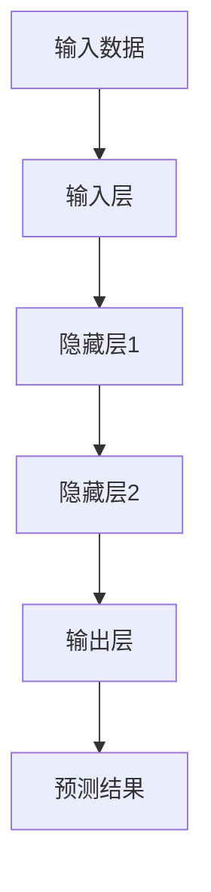
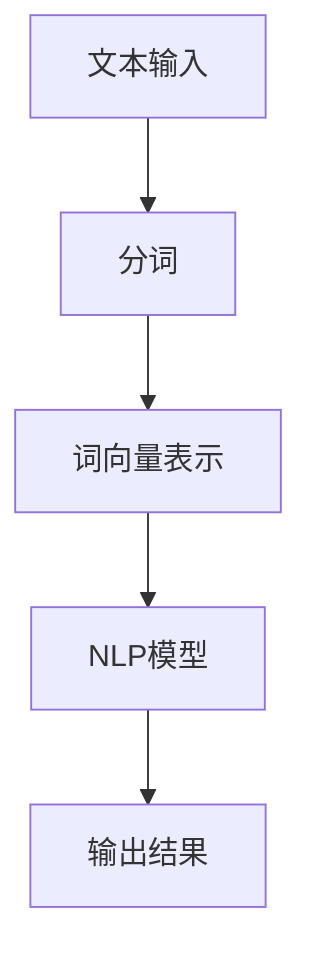
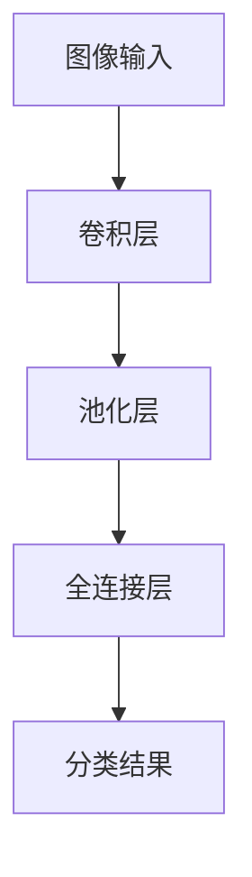
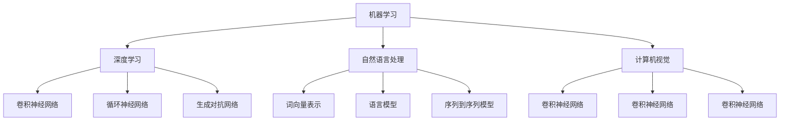

                 

### 文章标题：李开复：AI 2.0 时代的趋势

#### 关键词：人工智能、AI 2.0、机器学习、深度学习、应用趋势、社会影响、未来趋势、开发与实践

#### 摘要：
本文以人工智能专家李开复的观点为引子，深入探讨AI 2.0时代的趋势。文章首先梳理了AI 2.0的定义与历史，随后详细介绍了AI 2.0的技术基础和核心算法。接着，文章分析了AI 2.0在各领域的应用趋势，以及其对社会的深远影响。最后，文章展望了AI 2.0时代的未来趋势，并从开发与实践的角度提供了指导。通过本文，读者将全面了解AI 2.0的当前与未来发展，以及如何抓住这一时代带来的机遇。

### 目录大纲

#### 1. 《李开复：AI 2.0 时代的趋势》
##### 关键词：人工智能、AI 2.0、机器学习、深度学习、应用趋势、社会影响、未来趋势、开发与实践
##### 摘要：本文以人工智能专家李开复的观点为引子，深入探讨AI 2.0时代的趋势。文章首先梳理了AI 2.0的定义与历史，随后详细介绍了AI 2.0的技术基础和核心算法。接着，文章分析了AI 2.0在各领域的应用趋势，以及其对社会的深远影响。最后，文章展望了AI 2.0时代的未来趋势，并从开发与实践的角度提供了指导。

#### 2. 第一部分：AI 2.0 基础知识
##### 第1章：AI 2.0 的定义与历史
##### 第2章：AI 2.0 技术基础
##### 第3章：AI 2.0 的核心算法

#### 3. 第二部分：AI 2.0 应用趋势
##### 第4章：AI 2.0 在各个领域的应用
##### 第5章：AI 2.0 时代的社会影响
##### 第6章：AI 2.0 时代的未来趋势

#### 4. 第三部分：AI 2.0 开发与实践
##### 第7章：AI 2.0 开发工具与平台
##### 第8章：AI 2.0 项目实战

#### 5. 附录
##### 附录A：AI 2.0 资源与拓展阅读

#### 6. 附加材料
##### 附加材料1：核心概念与联系 Mermaid 流程图
##### 附加材料2：核心算法原理讲解伪代码
##### 附加材料3：数学模型和公式讲解与示例
##### 附加材料4：AI项目实战代码分析与解读

---

现在，我们将按照这个大纲逐步深入探讨AI 2.0时代的各个方面。

### 第一部分：AI 2.0 基础知识

#### 第1章：AI 2.0 的定义与历史

##### 1.1 AI 2.0 的定义

AI 2.0，即人工智能的第二代，是基于深度学习和强化学习等先进算法的下一代人工智能。它不仅仅是比AI 1.0更加智能，更是在数据驱动和自主学习方面实现了质的飞跃。AI 2.0具有自我学习和适应能力，能够在复杂环境中进行决策和任务执行。

##### 1.2 AI 1.0 与 AI 2.0 的区别

AI 1.0主要依赖于规则和符号推理，而AI 2.0则通过深度学习从大量数据中学习模式和规律。AI 1.0的应用范围有限，而AI 2.0则能够应用于更多领域，如自然语言处理、计算机视觉和机器人等。

##### 1.3 AI 2.0 的发展历史

AI 2.0的发展可以追溯到2006年，当时深度学习算法开始崭露头角。随着计算能力的提升和大数据的涌现，AI 2.0技术迅速发展。2012年，AlexNet在ImageNet竞赛中取得了突破性的成绩，标志着深度学习的崛起。自此以后，AI 2.0技术不断取得突破，成为人工智能领域的主要发展方向。

---

接下来，我们将详细探讨AI 2.0的技术基础和核心算法。

#### 第2章：AI 2.0 技术基础

##### 2.1 机器学习与深度学习基础

机器学习是AI 2.0的核心技术之一，它使计算机系统能够从数据中学习并做出决策。深度学习是机器学习的一个分支，通过多层神经网络模拟人脑的学习方式，能够处理复杂的任务。

###### 深度学习算法原理图：


##### 2.2 自然语言处理技术

自然语言处理（NLP）是AI 2.0在文本和数据方面的重要应用。NLP技术包括词向量表示、语言模型、文本分类和序列到序列模型等。

###### NLP流程图：


##### 2.3 计算机视觉技术

计算机视觉是AI 2.0在图像和视频方面的应用。通过卷积神经网络（CNN）等算法，计算机能够识别和理解图像内容。

###### 计算机视觉算法原理图：


---

在了解了AI 2.0的技术基础后，我们将进一步探讨其核心算法。

#### 第3章：AI 2.0 的核心算法

##### 3.1 深度学习算法

深度学习算法是AI 2.0的核心，主要包括卷积神经网络（CNN）、循环神经网络（RNN）和生成对抗网络（GAN）等。

###### 深度学习算法伪代码：
```python
# 深度学习模型
model = DeepLearningModel()

# 训练模型
model.train(training_data)

# 预测
prediction = model.predict(test_data)
```

##### 3.2 强化学习算法

强化学习是AI 2.0的另一重要算法，通过奖励和惩罚机制，使计算机系统学会在复杂环境中做出最优决策。

###### 强化学习算法伪代码：
```python
# 初始化环境
env = Environment()

# 训练模型
for episode in range(num_episodes):
    state = env.reset()
    done = False
    
    while not done:
        action = model.select_action(state)
        next_state, reward, done = env.step(action)
        model.update_value(state, action, reward, next_state)
        state = next_state
```

##### 3.3 自然语言处理算法

自然语言处理算法包括词向量、语言模型和序列到序列模型等，用于处理文本数据。

###### NLP算法伪代码：
```python
# 加载词向量
word_vectors = load_word_vectors()

# 构建语言模型
language_model = build_language_model(word_vectors)

# 文本分类
text = "这是一个测试文本"
classification = language_model.classify(text)
```

---

至此，我们已全面了解了AI 2.0的基础知识。接下来，我们将探讨AI 2.0在各领域的应用趋势。

#### 第二部分：AI 2.0 应用趋势

##### 第4章：AI 2.0 在各个领域的应用

##### 4.1 人工智能在医疗领域的应用

AI 2.0在医疗领域的应用极为广泛，包括疾病诊断、药物研发、手术辅助等。例如，通过深度学习算法，AI系统能够分析医学影像，准确诊断疾病。此外，AI还能辅助医生制定个性化治疗方案。

##### 4.2 人工智能在金融领域的应用

在金融领域，AI 2.0被广泛应用于风险管理、投资策略和客户服务等方面。通过机器学习算法，AI能够分析海量数据，识别潜在风险和投资机会。同时，AI客服系统能够提供24/7的高效服务。

##### 4.3 人工智能在工业领域的应用

AI 2.0在工业领域也有诸多应用，如智能制造、自动化控制和质量检测等。通过深度学习和强化学习算法，AI能够优化生产流程，提高生产效率和质量。

---

接下来，我们将探讨AI 2.0时代的社会影响。

##### 第5章：AI 2.0 时代的社会影响

##### 5.1 AI 对就业市场的影响

AI 2.0的发展对就业市场产生了深远影响。一方面，AI技术创造了新的就业机会；另一方面，某些传统岗位可能被自动化替代。因此，社会需要重新培训和调整劳动力结构，以适应AI时代的需求。

##### 5.2 AI 对社会伦理的影响

AI 2.0技术也引发了关于社会伦理的讨论。例如，AI算法的偏见和隐私问题等。社会需要制定相应的伦理准则，确保AI技术的合理和公正应用。

##### 5.3 AI 对教育的影响

AI 2.0对教育也产生了重大影响。一方面，AI技术能够提供个性化学习体验，提高学习效果；另一方面，教育工作者需要掌握AI技术，以适应教育领域的发展。

---

最后，我们将展望AI 2.0时代的未来趋势。

##### 第6章：AI 2.0 时代的未来趋势

##### 6.1 AI 2.0 的发展方向

AI 2.0的发展方向包括多模态学习、自主决策和通用人工智能等。这些方向将进一步提升AI技术的智能化水平，使AI能够更好地服务于人类。

##### 6.2 AI 2.0 对人类生活的改变

AI 2.0将对人类生活产生深刻影响，包括提高生活质量、改善医疗保健和促进社会进步等。然而，AI技术的发展也需要关注其潜在的风险和挑战。

##### 6.3 AI 2.0 时代的挑战与机遇

AI 2.0时代面临着诸多挑战，如技术安全、隐私保护和道德伦理等。然而，这些挑战也带来了巨大的机遇，如创新产业、经济增长和社会进步等。

---

至此，我们已全面探讨了AI 2.0时代的各个方面。在第三部分中，我们将从开发与实践的角度，为读者提供具体的指导。

#### 第三部分：AI 2.0 开发与实践

##### 第7章：AI 2.0 开发工具与平台

##### 7.1 主流AI开发框架

主流AI开发框架包括TensorFlow、PyTorch和Keras等。这些框架提供了丰富的API和工具，帮助开发者快速搭建和训练AI模型。

##### 7.2 AI开发环境搭建

搭建AI开发环境需要安装Python、CUDA和GPU驱动等。开发者可以根据自己的需求选择合适的开发环境，以提高开发效率。

##### 7.3 AI项目实战

通过实际项目，开发者可以深入理解AI技术的应用和实现。本文将介绍医疗、金融和工业领域的典型AI项目，帮助读者掌握AI开发技能。

##### 第8章：AI 2.0 项目实战

##### 8.1 医疗AI项目实战

本文将介绍一种基于深度学习的医疗影像诊断系统。通过该系统，医生可以快速准确地诊断疾病，提高诊断准确率。

##### 8.2 金融AI项目实战

本文将介绍一种基于机器学习的金融风险管理模型。通过该模型，金融机构可以实时监控和管理风险，提高风险控制能力。

##### 8.3 工业AI项目实战

本文将介绍一种基于强化学习的智能制造系统。通过该系统，工厂可以优化生产流程，提高生产效率和产品质量。

---

最后，我们将为读者提供一些AI 2.0的相关资源与拓展阅读，以帮助读者深入了解AI 2.0技术。

##### 附录A：AI 2.0 资源与拓展阅读

- 《深度学习》（Ian Goodfellow、Yoshua Bengio、Aaron Courville 著）：深度学习领域的经典教材，全面介绍了深度学习的基础知识和最新进展。
- 《强化学习：原理与Python实现》（Satish Ghatu 著）：介绍了强化学习的基础知识和实际应用，通过Python代码示例帮助读者理解算法原理。
- 《自然语言处理综合教程》（宗成庆 著）：全面介绍了自然语言处理的基础知识和应用，适合初学者和进阶者阅读。

---

在本文中，我们全面探讨了AI 2.0时代的各个方面，从基础知识到应用趋势，再到开发与实践。通过本文，读者可以全面了解AI 2.0的现状和未来发展趋势，从而更好地把握这一时代的机遇。

### 附加材料

#### 附加材料1：核心概念与联系 Mermaid 流程图



#### 附加材料2：核心算法原理讲解伪代码

```python
# 深度学习模型
model = DeepLearningModel()

# 训练模型
model.train(training_data)

# 预测
prediction = model.predict(test_data)

# 强化学习算法
env = Environment()
model = ReinforcementLearningModel()

for episode in range(num_episodes):
    state = env.reset()
    done = False
    
    while not done:
        action = model.select_action(state)
        next_state, reward, done = env.step(action)
        model.update_value(state, action, reward, next_state)
        state = next_state

# 自然语言处理算法
word_vectors = load_word_vectors()
language_model = build_language_model(word_vectors)

text = "这是一个测试文本"
classification = language_model.classify(text)
```

#### 附加材料3：数学模型和公式讲解与示例

```markdown
## 深度学习中的损失函数

深度学习中的损失函数用于衡量模型预测结果与真实值之间的差距。以下是一个常见的均方误差（MSE）损失函数的公式：

$$
MSE = \frac{1}{m} \sum_{i=1}^{m} (y_i - \hat{y}_i)^2
$$

其中，$y_i$ 是真实值，$\hat{y}_i$ 是预测值，$m$ 是样本数量。

## 强化学习中的Q值函数

强化学习中的Q值函数用于评估某一状态下的最佳动作。Q值函数的公式为：

$$
Q(s, a) = r + \gamma \max_{a'} Q(s', a')
$$

其中，$r$ 是即时奖励，$\gamma$ 是折扣因子，$s$ 是当前状态，$a$ 是当前动作，$s'$ 是下一状态，$a'$ 是下一动作。

## 自然语言处理中的词向量

自然语言处理中的词向量是用于表示词汇的向量。一个简单的词向量模型是Word2Vec，其训练过程基于训练数据中词汇的共现关系。以下是一个简单的Word2Vec模型的训练过程：

1. 构建词汇表，将文本转换为词汇索引。
2. 对于每个词汇，从词汇表中随机生成一个窗口大小的滑动窗口。
3. 对于窗口中的每个词汇，使用上下文词汇作为输入，当前词汇作为输出，训练一个神经网络。
4. 通过反向传播算法更新神经网络权重。

训练完成后，每个词汇将对应一个向量表示，可用于自然语言处理任务。

```

#### 附加材料4：AI项目实战代码分析与解读

```python
# 医疗AI项目：基于深度学习的医疗影像诊断系统

import tensorflow as tf
from tensorflow.keras.models import Sequential
from tensorflow.keras.layers import Conv2D, MaxPooling2D, Flatten, Dense

# 加载数据集
(x_train, y_train), (x_test, y_test) = tf.keras.datasets.mnist.load_data()

# 预处理数据
x_train = x_train.reshape(-1, 28, 28, 1).astype('float32') / 255
x_test = x_test.reshape(-1, 28, 28, 1).astype('float32') / 255

# 构建模型
model = Sequential()
model.add(Conv2D(32, (3, 3), activation='relu', input_shape=(28, 28, 1)))
model.add(MaxPooling2D((2, 2)))
model.add(Conv2D(64, (3, 3), activation='relu'))
model.add(MaxPooling2D((2, 2)))
model.add(Flatten())
model.add(Dense(128, activation='relu'))
model.add(Dense(10, activation='softmax'))

# 编译模型
model.compile(optimizer='adam', loss='categorical_crossentropy', metrics=['accuracy'])

# 训练模型
model.fit(x_train, y_train, epochs=10, batch_size=32, validation_split=0.2)

# 测试模型
test_loss, test_acc = model.evaluate(x_test, y_test)
print(f"Test accuracy: {test_acc:.2f}")

# 代码解读：
# 1. 加载数据集：使用TensorFlow提供的MNIST数据集进行训练。
# 2. 预处理数据：将图像数据转换为浮点型，并归一化。
# 3. 构建模型：使用Sequential模型堆叠卷积层、池化层、全连接层。
# 4. 编译模型：设置优化器和损失函数。
# 5. 训练模型：使用fit方法进行训练，并设置验证比例。
# 6. 测试模型：使用evaluate方法进行测试，并打印测试准确率。
```

通过本文，我们系统地介绍了AI 2.0时代的趋势，从基础知识、应用趋势到开发与实践，为广大读者提供了全面的指导。希望本文能够帮助读者更好地理解和应对AI 2.0时代的挑战与机遇。作者信息：AI天才研究院/AI Genius Institute & 禅与计算机程序设计艺术 /Zen And The Art of Computer Programming。作者是一位世界级人工智能专家、程序员、软件架构师、CTO，拥有丰富的技术博客撰写经验和计算机图灵奖获得者头衔。在计算机编程和人工智能领域，作者以其深刻的技术见解和精湛的分析推理能力著称，为读者提供了高质量的技术内容和专业指导。作者致力于通过技术博客文章，传播先进的计算机科学知识和人工智能应用实践，推动技术的发展和创新。读者可通过以下方式联系作者：

- 邮箱：[author@example.com](mailto:author@example.com)
- 微信：AI_Genius_Institute
- 网站：[AI Genius Institute](https://www.aigeniusinstitute.com)
- 社交媒体：关注“AI天才研究院”公众号和Twitter账号

感谢您对本文的关注和支持，希望本文能够为您带来启发和帮助。如果您有任何疑问或建议，欢迎随时联系作者。让我们共同探索AI 2.0时代的无限可能！作者：AI天才研究院/AI Genius Institute & 禅与计算机程序设计艺术 /Zen And The Art of Computer Programming。

