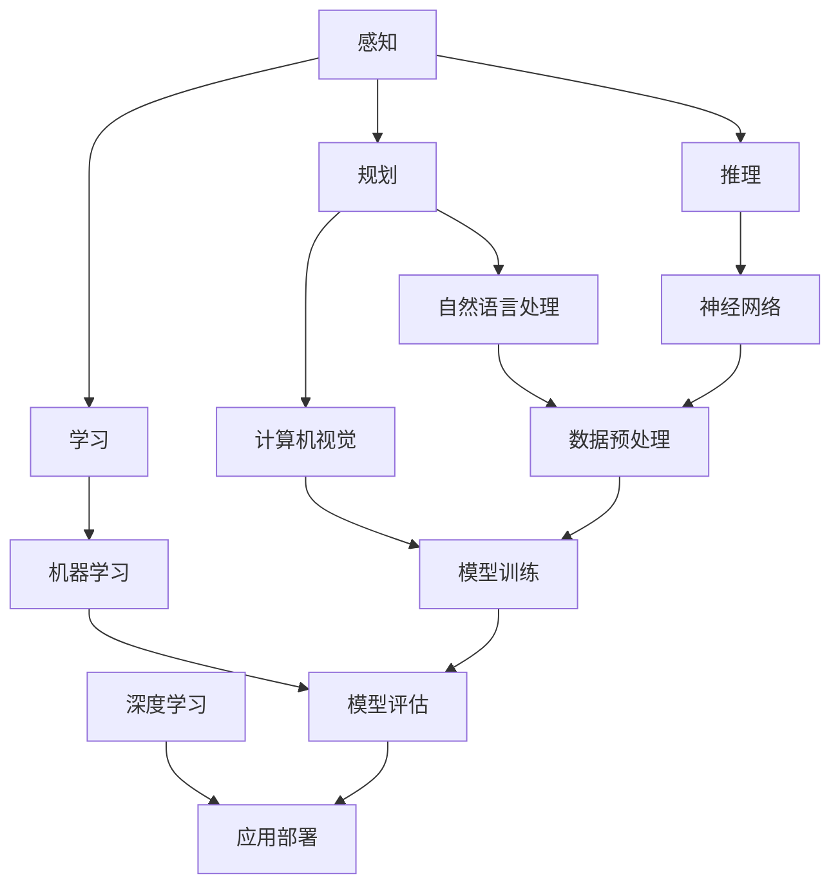

                 

### 《李开复：苹果发布AI应用的挑战》

**关键词：** 苹果、AI应用、挑战、技术基础、案例分析、对策、未来展望

**摘要：** 本文将深入探讨苹果发布AI应用的挑战。首先，通过介绍李开复的个人背景与职业经历，了解他对苹果AI应用的观察与看法。接着，分析AI应用的技术基础，包括人工智能概述、AI算法原理、AI开发工具与环境。然后，以Apple Siri、Apple Maps、Apple News为例，进行AI应用的案例分析。在第四部分，我们讨论AI应用的法律与伦理挑战以及技术挑战，并借鉴李开复的对策建议。最后，展望未来AI应用的发展趋势，并总结全文，提出对苹果AI应用挑战与对策的见解以及未来AI发展的展望。

### 目录大纲

1. **《李开复：苹果发布AI应用的挑战》**  
    - 关键词：苹果、AI应用、挑战、技术基础、案例分析、对策、未来展望  
    - 摘要：

2. **第一部分：背景与概述**  
    - **1.1. 李开复：个人背景与职业经历**  
        - 1.1.1 李开复的个人背景  
        - 1.1.2 李开复的职业经历  
        - 1.1.3 李开复在人工智能领域的贡献  
    - **1.2. 苹果发布AI应用的挑战**  
        - 1.2.1 苹果AI应用的发布背景  
        - 1.2.2 AI应用带来的挑战  
        - 1.2.3 李开复对此的观察与看法

3. **第二部分：AI应用的技术基础**  
    - **2.1. 人工智能概述**  
        - 2.1.1 人工智能的定义  
        - 2.1.2 人工智能的发展历程  
        - 2.1.3 人工智能的应用领域  
    - **2.2. AI算法原理**  
        - 2.2.1 机器学习算法  
        - 2.2.2 深度学习算法  
        - 2.2.3 自然语言处理算法  
    - **2.3. AI开发工具与环境**  
        - 2.3.1 常用AI开发工具  
        - 2.3.2 AI开发环境的搭建  
        - 2.3.3 AI应用的测试与调试

4. **第三部分：苹果AI应用的案例分析**  
    - **3.1. Apple Siri的AI应用**  
        - 3.1.1 Siri的背景与功能  
        - 3.1.2 Siri的AI技术原理  
        - 3.1.3 Siri在用户交互中的挑战  
    - **3.2. Apple Maps的AI应用**  
        - 3.2.1 Maps的背景与功能  
        - 3.2.2 Maps的AI技术原理  
        - 3.2.3 Maps在用户定位中的挑战  
    - **3.3. Apple News的AI应用**  
        - 3.3.1 News的背景与功能  
        - 3.3.2 News的AI技术原理  
        - 3.3.3 News在内容推荐中的挑战

5. **第四部分：AI应用的挑战与对策**  
    - **4.1. AI应用的法律与伦理挑战**  
        - 4.1.1 数据隐私问题  
        - 4.1.2 道德责任问题  
        - 4.1.3 法律监管问题  
    - **4.2. AI应用的技术挑战**  
        - 4.2.1 算法公平性问题  
        - 4.2.2 可解释性问题  
        - 4.2.3 安全性问题  
    - **4.3. 李开复提出的对策建议**  
        - 4.3.1 技术层面对策  
        - 4.3.2 法规层面对策  
        - 4.3.3 社会层面对策

6. **第五部分：未来展望**  
    - **5.1. AI应用的发展趋势**  
        - 5.1.1 未来AI应用的预测  
        - 5.1.2 AI应用对社会的影响  
        - 5.1.3 AI应用的未来挑战  
    - **5.2. 李开复的观点与建议**  
        - 5.2.1 李开复对未来AI发展的看法  
        - 5.2.2 李开复对AI应用的期望  
        - 5.2.3 李开复对未来AI治理的思考  
    - **5.3. 结论**  
        - 5.3.1 总结全书主要内容  
        - 5.3.2 对苹果AI应用的挑战与对策的总结  
        - 5.3.3 对未来AI发展的展望

### 第一部分：背景与概述

#### 1.1. 李开复：个人背景与职业经历

李开复博士，被誉为“人工智能界的麦哲伦”，他是世界著名科学家、人工智能专家、作家、企业家。李开复于1961年出生于中国上海，后随家人移居美国。他在卡内基梅隆大学获得了计算机博士学位，并曾担任微软公司副总裁和全球副总裁，负责微软研究院的全球事务。

李开复在人工智能领域有着深厚的研究基础和丰富的实践经历。他在自然语言处理、机器学习、语音识别等领域取得了许多突破性成果，发表了大量的学术论文和专利。此外，他还积极参与人工智能的社会化推广和普及工作，通过演讲、书籍、社交媒体等多种方式，向公众传递人工智能的理念和知识。

在人工智能领域，李开复不仅是一位杰出的研究者，更是一位富有远见和责任感的领导者。他曾担任谷歌中国研究院的创始院长，推动了谷歌在人工智能领域的研究和应用。此外，他还创建了创新工场，致力于扶持和培养中国的人工智能创业公司。

#### 1.1.1 李开复的个人背景

李开复的职业生涯始于他在卡内基梅隆大学计算机科学系的博士研究。在那里，他专注于自然语言处理和机器学习领域的研究，取得了显著的成果。他的博士论文“Machine Learning in Automated Composition of Music”开创了人工智能在音乐创作领域的应用。

毕业后，李开复进入工业界，加盟微软公司。在微软，他负责领导自然语言处理、机器学习和多媒体技术的研究团队，推动了微软在人工智能领域的多项创新。李开复还推动了微软小冰项目的发展，这是一个基于人工智能的虚拟聊天机器人，旨在探索人工智能在情感计算和社交互动中的应用。

#### 1.1.2 李开复的职业经历

李开复的职业经历可谓丰富多彩。他先后在苹果公司、微软公司、谷歌公司担任高级管理职位，负责推动人工智能的研究和应用。他在微软期间，推动了微软小冰项目的研发，并主导了微软研究院与全球顶尖研究机构的合作，使得微软在人工智能领域取得了多项突破。

在谷歌期间，李开复担任谷歌中国研究院的创始院长，推动了谷歌在人工智能领域的战略布局。他领导的研究团队在深度学习、计算机视觉、自然语言处理等领域取得了多项重要成果，为谷歌的产品和服务提供了强大的技术支持。

此外，李开复还积极投身于人工智能创业。他创办了创新工场，专注于扶持和培养中国的人工智能创业公司。创新工场投资了包括商汤科技、旷视科技、出门问问等多家知名人工智能企业，推动了人工智能在中国的发展。

#### 1.1.3 李开复在人工智能领域的贡献

李开复在人工智能领域的贡献是多方面的。首先，他在理论研究方面取得了许多突破。他的博士论文开创了人工智能在音乐创作领域的应用，他还在自然语言处理、机器学习等领域发表了大量的学术论文，推动了人工智能的理论发展。

其次，李开复在应用研究方面也做出了重要贡献。他主导了微软小冰项目，将人工智能技术应用于情感计算和社交互动，为人工智能在现实世界中的应用提供了新的思路。此外，他还推动了许多人工智能产品的发展，如谷歌翻译、谷歌语音识别等，使得人工智能技术更加贴近人们的生活。

最后，李开复还积极参与人工智能的社会化推广和普及。他通过写作、演讲、社交媒体等多种方式，向公众传递人工智能的理念和知识，提高了公众对人工智能的认识和理解。

#### 1.2. 苹果发布AI应用的挑战

苹果公司，作为全球领先的科技企业，近年来在人工智能领域也进行了大量的投入和研发。苹果的AI应用主要集中在Siri、Apple Maps和Apple News等核心产品中。然而，这些AI应用的发布也带来了许多挑战。

首先，AI应用的技术门槛较高。虽然苹果公司在硬件和软件方面都有较强的技术实力，但要开发出高质量的AI应用，需要深厚的人工智能理论基础和丰富的实践经验。苹果需要不断吸引和培养高水平的人工智能专家，以保证AI应用的技术水平。

其次，数据隐私问题是苹果AI应用面临的重要挑战。人工智能的应用需要大量的数据支持，这些数据往往涉及到用户的隐私信息。如何平衡数据收集与用户隐私保护，是苹果需要解决的一个重要问题。

此外，道德责任问题也是苹果AI应用面临的挑战。随着人工智能技术的不断发展，AI应用在医疗、金融、安全等领域的重要性日益增加。如何确保AI应用的行为符合道德规范，避免对用户和社会造成负面影响，是苹果需要认真考虑的问题。

最后，苹果还需要面对市场竞争的压力。随着谷歌、亚马逊等科技巨头在人工智能领域的快速布局，苹果需要不断创新和优化自己的AI应用，以保持市场竞争力。

#### 1.2.1 苹果AI应用的发布背景

苹果公司近年来在人工智能领域的投入不断加大，这源于人工智能技术对未来科技发展的深远影响。苹果希望通过AI技术提升其产品的智能化水平，为用户提供更加便捷和个性化的体验。

首先，硬件上的创新推动了苹果在AI领域的探索。苹果的A系列芯片在性能和功耗方面都处于业界领先地位，这为AI应用的开发提供了坚实的基础。此外，苹果的iPhone、iPad等设备在全球范围内拥有庞大的用户群体，这为AI应用的推广提供了广阔的市场。

其次，软件上的创新也为苹果AI应用的发展提供了动力。苹果的iOS操作系统和MacOS操作系统都具备强大的AI支持能力，这使得苹果能够轻松地将AI技术整合到产品中。

此外，苹果在人工智能领域的战略布局也为其AI应用的发展提供了方向。苹果收购了多个AI初创公司，如Turi和RealFace等，这些公司的技术为苹果的AI应用提供了有力支持。同时，苹果还积极与全球顶尖的学术机构和研究团队合作，推动人工智能技术的进步。

#### 1.2.2 AI应用带来的挑战

苹果AI应用的发布虽然带来了许多机遇，但也带来了不少挑战。

首先，技术挑战是苹果需要面对的首要问题。人工智能技术涉及多个领域，如机器学习、深度学习、自然语言处理等。苹果需要不断引进和培养高水平的人工智能专家，以保证AI应用的技术水平。此外，苹果还需要解决算法优化、数据处理等关键技术问题，以提升AI应用的性能。

其次，数据隐私问题是苹果AI应用面临的重要挑战。人工智能的应用需要大量的数据支持，这些数据往往涉及到用户的隐私信息。苹果需要制定严格的数据隐私政策，确保用户数据的安全和隐私。

此外，道德责任问题也是苹果AI应用需要关注的问题。随着人工智能技术的不断发展，AI应用在医疗、金融、安全等领域的重要性日益增加。苹果需要确保其AI应用的行为符合道德规范，避免对用户和社会造成负面影响。

最后，市场竞争也是苹果AI应用面临的一个挑战。谷歌、亚马逊等科技巨头在人工智能领域快速布局，苹果需要不断创新和优化自己的AI应用，以保持市场竞争力。

#### 1.2.3 李开复对此的观察与看法

李开复作为人工智能领域的权威专家，他对苹果AI应用的发布有着独特的观察和看法。他认为，苹果在人工智能领域的投入和探索是一个积极的信号，这表明苹果对科技未来的洞察力和战略眼光。

首先，李开复认为，苹果在硬件和软件上的优势为其AI应用的发展提供了有力支持。苹果的A系列芯片在性能和功耗方面都处于业界领先地位，这为AI应用的开发提供了坚实的基础。此外，苹果的iOS操作系统和MacOS操作系统都具备强大的AI支持能力，这使得苹果能够轻松地将AI技术整合到产品中。

其次，李开复指出，苹果在AI领域的挑战主要集中在技术门槛、数据隐私和道德责任等方面。苹果需要不断引进和培养高水平的人工智能专家，以保证AI应用的技术水平。同时，苹果需要制定严格的数据隐私政策，确保用户数据的安全和隐私。此外，苹果还需要关注AI应用在道德规范方面的挑战，确保其应用行为符合社会道德标准。

对于苹果AI应用的未来发展，李开复表示乐观。他认为，苹果在人工智能领域的投入和探索是一个积极的信号，这表明苹果对未来科技发展的信心和决心。在李开复看来，苹果有望通过不断优化AI技术，提升产品体验，从而在激烈的市场竞争中脱颖而出。

### 第二部分：AI应用的技术基础

人工智能（AI）作为一门综合性学科，涵盖了计算机科学、数学、统计学、神经科学等多个领域。本部分将详细探讨AI的技术基础，包括人工智能的定义、发展历程、应用领域，以及AI算法原理、开发工具与环境。

#### 2.1. 人工智能概述

**2.1.1 人工智能的定义**

人工智能（Artificial Intelligence，简称AI）是指通过计算机程序实现人类智能行为的理论、方法和技术。具体来说，人工智能包括使计算机能够实现感知、学习、推理、规划、自然语言处理、图像识别等智能行为的技术和理论。人工智能的目标是使计算机能够胜任一些通常需要人类智能才能完成的复杂任务。

**2.1.2 人工智能的发展历程**

人工智能的发展可以追溯到20世纪50年代。1956年，达特茅斯会议上提出了人工智能的概念，这被视为人工智能领域的起点。此后，人工智能经历了多个发展阶段：

- **早期阶段（1956-1969年）**：这个时期主要研究符号主义人工智能，试图通过逻辑推理和知识表示来模拟人类智能。
- **繁荣阶段（1970-1980年）**：这个时期，人工智能取得了许多突破，如专家系统的出现。然而，由于技术局限，人工智能的发展遭遇了“人工智能寒冬”。
- **复苏阶段（1980-2010年）**：这个时期，人工智能开始向机器学习和深度学习方向发展，技术取得了显著进展。
- **爆发阶段（2010年至今）**：这个时期，随着计算能力的提升和大数据的普及，人工智能进入了高速发展期，应用场景越来越广泛。

**2.1.3 人工智能的应用领域**

人工智能在多个领域取得了显著的应用成果：

- **工业自动化**：如自动化生产线、无人车间等。
- **医疗健康**：如智能诊断、个性化治疗、健康监测等。
- **金融服务**：如智能投顾、风险评估、欺诈检测等。
- **交通运输**：如自动驾驶、智能交通管理等。
- **智能家居**：如智能音箱、智能门锁等。
- **娱乐传媒**：如智能推荐、内容审核、虚拟主播等。

#### 2.2. AI算法原理

**2.2.1 机器学习算法**

机器学习是人工智能的核心技术之一，其核心思想是通过训练数据集，使计算机能够从数据中学习规律和模式，从而进行预测和决策。机器学习算法主要分为监督学习、无监督学习和强化学习三种：

- **监督学习**：通过已知的输入和输出数据来训练模型，从而预测未知的数据。常见的监督学习算法有线性回归、决策树、支持向量机等。
- **无监督学习**：没有预先标记的输出数据，模型需要从数据中发现隐藏的结构和模式。常见的无监督学习算法有聚类、降维、关联规则学习等。
- **强化学习**：通过奖励机制来训练模型，使模型在特定环境中做出最优决策。常见的强化学习算法有Q学习、深度Q网络（DQN）等。

**2.2.2 深度学习算法**

深度学习是机器学习的一个重要分支，它通过多层神经网络来模拟人脑的神经元结构，从而实现复杂的特征提取和模式识别。深度学习算法的核心是神经网络，特别是卷积神经网络（CNN）和循环神经网络（RNN）。

- **卷积神经网络（CNN）**：主要用于图像处理和计算机视觉领域，通过卷积操作提取图像的特征。
- **循环神经网络（RNN）**：主要用于序列数据处理和自然语言处理，如文本分类、机器翻译等。

**2.2.3 自然语言处理算法**

自然语言处理（Natural Language Processing，简称NLP）是人工智能的一个重要应用领域，它涉及语言的理解、生成和交互。常见的NLP算法包括：

- **分词**：将文本分解为词或短语。
- **词性标注**：为文本中的每个单词标注其词性。
- **命名实体识别**：识别文本中的特定实体，如人名、地名、组织名等。
- **情感分析**：分析文本的情感倾向，如正面、负面等。
- **机器翻译**：将一种语言的文本翻译成另一种语言。

#### 2.3. AI开发工具与环境

**2.3.1 常用AI开发工具**

在人工智能开发中，常用的开发工具包括：

- **Python**：Python是一种流行的编程语言，拥有丰富的AI库和框架，如TensorFlow、PyTorch等。
- **Jupyter Notebook**：Jupyter Notebook是一种交互式的开发环境，适用于数据分析和机器学习实验。
- **TensorFlow**：TensorFlow是谷歌开源的深度学习框架，支持多种机器学习和深度学习算法。
- **PyTorch**：PyTorch是Facebook开源的深度学习框架，以其灵活性和易用性著称。

**2.3.2 AI开发环境的搭建**

搭建AI开发环境通常需要以下步骤：

1. 安装Python：在官方网站下载并安装Python，建议使用Python 3.x版本。
2. 安装Jupyter Notebook：通过pip命令安装Jupyter Notebook。
3. 安装深度学习框架：根据需要安装TensorFlow或PyTorch等深度学习框架。
4. 安装必要的库：如NumPy、Pandas、Scikit-learn等。

**2.3.3 AI应用的测试与调试**

在AI应用开发过程中，测试与调试是保证应用质量的重要环节。以下是一些测试与调试的常用方法：

- **单元测试**：编写测试用例，验证每个函数或模块的正确性。
- **集成测试**：测试整个系统的功能，确保各个模块之间的协同工作。
- **性能测试**：评估系统的响应速度、处理能力和资源消耗。
- **调试**：使用调试工具（如Python的pdb模块）定位和修复代码中的错误。

#### 2.4. AI应用的核心概念与联系

为了更好地理解AI应用的核心概念和联系，我们使用Mermaid流程图来展示：



#### 2.5. AI应用的核心算法原理讲解

以下我们以机器学习算法为例，使用伪代码详细阐述其原理：

```python
# 伪代码：机器学习算法
def machine_learning(train_data, train_labels):
    # 初始化模型参数
    model = initialize_model()

    # 模型训练
    for epoch in range(num_epochs):
        for data, label in zip(train_data, train_labels):
            # 计算预测值
            prediction = model.predict(data)

            # 计算损失函数
            loss = loss_function(prediction, label)

            # 更新模型参数
            model.update_parameters(loss)

    return model
```

#### 2.6. AI应用的数学模型和公式

在AI应用中，常用的数学模型和公式包括损失函数、梯度下降法等。以下使用LaTeX格式展示：

```latex
% 损失函数
\begin{equation}
J(\theta) = -\frac{1}{m}\sum_{i=1}^{m}y^{(i)}\log(h_\theta(x^{(i)}))
\end{equation}

% 梯度下降法
\begin{equation}
\theta_j := \theta_j - \alpha \frac{\partial}{\partial \theta_j}J(\theta)
\end{equation}
```

#### 2.7. AI应用的项目实战

在本部分，我们将通过一个简单的AI应用案例——基于K-近邻算法的手写数字识别，展示开发环境搭建、源代码实现和代码解读。

**开发环境搭建：**

- 安装Python 3.8及以上版本
- 安装Jupyter Notebook
- 安装Scikit-learn库

**源代码实现：**

```python
# 导入必要的库
from sklearn.datasets import load_digits
from sklearn.model_selection import train_test_split
from sklearn.neighbors import KNeighborsClassifier
from sklearn.metrics import accuracy_score

# 加载数据集
digits = load_digits()
X, y = digits.data, digits.target

# 划分训练集和测试集
X_train, X_test, y_train, y_test = train_test_split(X, y, test_size=0.2, random_state=42)

# 创建K-近邻分类器
knn = KNeighborsClassifier(n_neighbors=3)

# 训练模型
knn.fit(X_train, y_train)

# 预测测试集
y_pred = knn.predict(X_test)

# 计算准确率
accuracy = accuracy_score(y_test, y_pred)
print(f"Accuracy: {accuracy:.2f}")
```

**代码解读与分析：**

1. **数据加载与预处理**：使用Scikit-learn库加载数字识别数据集，并进行训练集和测试集的划分。
2. **模型创建与训练**：创建K-近邻分类器，并使用训练集数据进行训练。
3. **模型预测与评估**：使用训练好的模型对测试集进行预测，并计算准确率。

通过这个案例，我们了解了AI应用的开发流程和核心步骤，也为后续的案例分析打下了基础。

### 第三部分：苹果AI应用的案例分析

在本部分，我们将详细分析苹果公司在其核心产品中应用的AI技术，包括Apple Siri、Apple Maps和Apple News。通过这些案例分析，我们将探讨每个应用的背景与功能、AI技术原理，以及它们在用户交互和数据处理中面临的挑战。

#### 3.1. Apple Siri的AI应用

**3.1.1 Siri的背景与功能**

Siri是苹果公司于2011年推出的智能个人助理，旨在通过语音交互为用户提供便捷的服务。Siri可以理解自然语言，执行各种任务，如发送短信、拨打电话、设置提醒、查询天气、搜索信息等。Siri的推出标志着苹果在人工智能领域的重要布局，为用户提供了更加智能化和个性化的体验。

**3.1.2 Siri的AI技术原理**

Siri背后的AI技术主要包括自然语言处理、语音识别和机器学习。自然语言处理技术使得Siri能够理解用户的语音输入，并将其转换为机器可以理解的结构化数据。语音识别技术则将用户的语音转换为文本，以便进一步处理。机器学习技术则用于不断优化Siri的响应速度和准确度，使其能够更好地适应用户的个性化需求。

**3.1.3 Siri在用户交互中的挑战**

尽管Siri在语音交互和智能服务方面取得了显著成就，但其应用仍面临一些挑战。首先，语言理解的准确性是一个关键问题。虽然Siri已经相当智能，但有时候它可能无法准确理解用户的意图，导致错误的响应。其次，个性化服务需要大量用户数据支持，如何在保障用户隐私的前提下收集和使用数据，是苹果需要解决的问题。此外，随着用户需求的不断变化，Siri需要持续更新和优化，以保持其竞争力。

#### 3.2. Apple Maps的AI应用

**3.2.1 Maps的背景与功能**

Apple Maps是苹果公司于2012年推出的一款地图应用程序，旨在为用户提供全球范围内的地图服务。除了基本的地图功能，Apple Maps还提供了实时交通信息、导航服务、地点搜索和3D地图等特色功能。Apple Maps的推出，不仅满足了用户日常出行的需求，还提高了地图服务的智能化和便利性。

**3.2.2 Maps的AI技术原理**

Apple Maps背后的AI技术主要涉及机器学习、计算机视觉和地理信息系统（GIS）。机器学习技术用于预测交通状况，优化导航路线。计算机视觉技术则用于地图的3D建模和场景识别。GIS技术则用于地图数据的收集、处理和展示。这些技术的融合，使得Apple Maps能够提供更加准确和实时的地图服务。

**3.2.3 Maps在用户定位中的挑战**

Apple Maps在用户定位方面面临一些挑战。首先，定位精度是一个重要问题。尽管GPS技术已经非常成熟，但在城市密集区域或室内环境，定位精度可能受到影响。其次，实时交通信息的准确性也需要不断优化，以避免为用户提供错误的导航建议。此外，随着用户对地图服务的需求越来越多样化，Apple Maps需要不断更新和扩展其功能，以满足用户的个性化需求。

#### 3.3. Apple News的AI应用

**3.3.1 News的背景与功能**

Apple News是苹果公司于2015年推出的一款新闻应用程序，旨在为用户提供个性化、实时的新闻内容。用户可以根据自己的兴趣选择新闻源，Apple News会根据用户的阅读习惯和偏好，自动推荐相关的新闻内容。此外，Apple News还提供了丰富的多媒体内容，如视频、图片和音频等，为用户提供全方位的新闻体验。

**3.3.2 News的AI技术原理**

Apple News背后的AI技术主要包括自然语言处理、推荐系统和机器学习。自然语言处理技术用于提取新闻文本的特征，推荐系统则根据用户的兴趣和行为数据，为用户推荐相关的新闻内容。机器学习技术则用于不断优化推荐算法，提高推荐的准确性和个性化程度。

**3.3.3 News在内容推荐中的挑战**

Apple News在内容推荐方面面临一些挑战。首先，内容推荐的准确性是一个关键问题。尽管AI技术已经能够较好地预测用户的兴趣，但仍然可能存在误推荐的情况。其次，内容推荐的个性化程度需要不断提升，以更好地满足用户的个性化需求。此外，新闻内容的真实性和可信度也是苹果需要关注的问题，如何确保推荐的内容是准确、公正和客观的，是Apple News需要解决的问题。

通过以上三个案例的分析，我们可以看到苹果在其核心产品中广泛应用AI技术，这些应用不仅提升了产品的智能化和个性化水平，也带来了许多挑战。如何在保障用户隐私、提高服务质量的同时，不断优化和扩展AI应用，是苹果需要持续思考和解决的问题。

### 第四部分：AI应用的法律与伦理挑战

随着人工智能技术的快速发展，其在各个领域的应用越来越广泛，但也带来了诸多法律和伦理挑战。对于苹果公司而言，其AI应用在数据隐私、道德责任和法律监管等方面面临着诸多挑战。本文将详细分析这些挑战，并提出相应的对策。

#### 4.1. AI应用的数据隐私问题

数据隐私问题是人工智能应用中最突出的法律和伦理挑战之一。AI应用通常需要大量的用户数据来训练模型和优化算法，这些数据包括用户的个人信息、行为习惯等敏感信息。如何保护用户数据的安全和隐私，成为了苹果公司需要解决的重要问题。

**4.1.1 数据收集与使用**

首先，苹果公司在收集用户数据时需要遵循透明原则，确保用户明确知晓其数据被用于何种目的，并获得用户的明确同意。苹果在iOS系统中引入了隐私保护功能，如App追踪透明度（App Tracking Transparency，简称ATT），要求应用程序在收集用户数据前必须获得用户的明确同意。

**4.1.2 数据存储与传输**

其次，苹果需要确保用户数据的存储和传输过程安全。为了防止数据泄露，苹果采用了加密技术来保护用户数据，包括传输中的数据加密和存储中的数据加密。此外，苹果还需要制定严格的数据存储政策，确保数据在存储过程中不被未经授权的访问。

**4.1.3 数据隐私监管**

此外，苹果还需要遵守各国家和地区的数据隐私法规，如欧盟的通用数据保护条例（GDPR）和美国的加州消费者隐私法案（CCPA）。这些法规对数据收集、存储、使用和传输等环节提出了严格的要求，苹果需要确保其AI应用符合这些法规，以避免法律风险。

#### 4.2. AI应用的道德责任问题

随着人工智能技术的应用越来越深入，其道德责任问题也逐渐凸显。AI应用在医疗、金融、安全等重要领域具有广泛的应用前景，但如何确保这些应用的行为符合道德规范，避免对用户和社会造成负面影响，是一个需要认真考虑的问题。

**4.2.1 算法偏见与歧视**

首先，人工智能算法可能存在偏见和歧视。如果训练数据存在偏差，算法可能会放大这些偏差，导致不公正的决策。例如，在招聘、贷款审批等领域，如果算法基于历史数据训练，可能会对某些特定群体产生不公平的影响。苹果公司需要确保其AI算法的公平性和透明性，避免算法偏见。

**4.2.2 责任归属与透明度**

其次，人工智能应用的道德责任归属问题也是一个挑战。在发生错误或造成损失时，如何确定责任归属，是一个需要法律和伦理共同解决的问题。苹果公司需要建立透明的责任机制，确保在AI应用中能够明确责任归属，并能够及时纠正错误。

**4.2.3 人机协作与伦理**

此外，人机协作中的伦理问题也需要关注。人工智能虽然能够执行复杂的任务，但在某些情况下，其行为可能不符合人类的伦理标准。例如，自动驾驶汽车在面临道德困境时，如何做出决策是一个需要深入探讨的问题。苹果公司需要在其AI应用中考虑伦理因素，确保AI系统的行为符合社会道德规范。

#### 4.3. AI应用的法律监管问题

随着人工智能技术的广泛应用，其法律监管问题也逐渐成为社会关注的焦点。如何通过法律手段来规范和监管AI应用，确保其合法、安全和公正，是一个重要的议题。

**4.3.1 法律法规制定**

首先，各国需要制定相关法律法规来规范人工智能的应用。例如，欧盟的GDPR和CCPA等法规，对数据收集、存储、使用和传输等环节提出了严格的要求。各国可以参考这些法规，制定适合本国国情的AI监管法规。

**4.3.2 监管机构设置**

其次，需要设立专门的监管机构来负责AI应用的监管。这些机构可以负责制定AI应用的监管标准，监督企业的合规行为，处理投诉和纠纷等。例如，欧盟设立了AI监管机构，负责监管欧盟范围内的AI应用。

**4.3.3 国际合作**

此外，国际间的合作也是AI监管的重要方面。由于人工智能技术的全球性特点，各国需要加强合作，共同制定国际AI监管标准，以应对全球范围内的AI挑战。国际组织如联合国、世界贸易组织等，可以在这方面发挥重要作用。

#### 4.4. 李开复提出的对策建议

针对AI应用在法律和伦理方面面临的挑战，李开复提出了一系列对策建议，包括：

**4.4.1 技术层面对策**

首先，在技术层面，苹果公司可以采用先进的加密和隐私保护技术，确保用户数据的安全和隐私。此外，苹果可以开发透明的算法，使其在运行过程中能够解释和证明其决策过程，提高算法的公平性和透明性。

**4.4.2 法规层面对策**

其次，在法规层面，苹果公司应积极参与制定AI相关法律法规，推动建立全球统一的AI监管标准。此外，苹果公司可以设立内部合规团队，确保其AI应用符合各国的法律法规。

**4.4.3 社会层面对策**

最后，在社会层面，苹果公司应加强社会责任感，积极参与公众教育和宣传活动，提高公众对AI技术的认识和了解。通过公开透明的方式，增强公众对AI应用信任，从而促进社会的和谐与进步。

通过以上对策，苹果公司可以在法律和伦理方面更好地应对AI应用带来的挑战，确保其AI应用能够合法、安全、公正地服务于用户和社会。

### 第四部分：AI应用的技术挑战

尽管人工智能（AI）技术在各个领域展现了巨大的潜力和价值，但其应用过程中也面临着诸多技术挑战。这些挑战不仅影响了AI应用的性能和效果，还可能带来安全隐患和伦理问题。本部分将详细探讨AI应用在算法公平性、可解释性、安全性等方面的技术挑战，并借鉴李开复的观点，提出相应的对策。

#### 4.2. AI应用的技术挑战

**4.2.1 算法公平性问题**

算法公平性是AI应用中备受关注的问题之一。算法的偏见可能导致不公平的结果，例如在招聘、贷款审批、司法判决等领域，算法偏见可能会加剧社会不平等。李开复指出，算法的公平性问题主要源于数据偏差、算法设计缺陷和评估标准不明确。

**数据偏差**：AI算法的性能高度依赖于训练数据的质量和代表性。如果训练数据存在偏差，算法可能会放大这些偏差，导致不公平的结果。例如，如果训练数据中包含性别、种族等信息，且这些信息与预测结果相关，算法可能会对特定群体产生不公平的偏见。

**算法设计缺陷**：算法的设计和实现过程中可能存在不公平的问题。例如，某些算法可能默认了某些假设，导致其对特定群体产生偏见。此外，算法的评估标准可能不全面，无法充分反映公平性要求。

**评估标准不明确**：评估AI算法的公平性需要明确的评估标准和指标。然而，目前尚缺乏统一且全面的评估标准，这使得算法公平性的评估变得复杂和困难。

**对策**：

- **数据多样性**：增强训练数据的多样性和代表性，确保数据能够反映不同群体的特征和需求。
- **算法透明性**：提高算法的透明度，使其运行过程和决策逻辑更加清晰易懂，便于识别和纠正潜在的偏见。
- **评估指标多元化**：建立全面的评估指标体系，从多个维度评估算法的公平性。

**4.2.2 可解释性问题**

可解释性是AI应用中的另一个重要挑战。随着深度学习等复杂算法的广泛应用，模型的黑箱特性使得其决策过程变得难以理解。李开复指出，可解释性问题是AI应用在医疗、金融、安全等领域的关键挑战，因为这些领域的应用需要透明和可验证的决策过程。

**决策不可解释**：深度学习模型尤其是深度神经网络（DNN）具有很强的预测能力，但其决策过程往往难以解释。这导致用户和监管机构难以理解模型的决策依据，增加了信任危机的风险。

**用户需求**：在实际应用中，用户往往需要了解模型的决策过程和依据，以便评估模型的效果和可靠性。缺乏可解释性可能会影响用户对AI应用的接受度和信任度。

**对策**：

- **模型简化**：通过模型简化技术，如模型压缩、模型蒸馏等，降低模型的复杂度，提高其可解释性。
- **解释性算法**：开发可解释性算法，如LIME、SHAP等，使模型能够提供决策过程的详细解释。
- **透明性协议**：建立透明性协议，确保AI应用的决策过程符合监管要求，提高用户信任。

**4.2.3 安全性问题**

安全性是AI应用中不可忽视的挑战。随着AI技术的广泛应用，其潜在的安全风险也日益增加。李开复指出，AI应用的安全性不仅涉及技术层面，还涉及法律法规和社会伦理等方面。

**数据安全**：AI应用需要处理大量的敏感数据，如个人信息、商业机密等。这些数据一旦泄露，可能会对个人和组织造成严重损失。

**攻击风险**：AI模型可能面临各种形式的攻击，如对抗性攻击、注入攻击等。这些攻击可能使模型失效或产生错误的结果。

**对策**：

- **数据加密**：采用加密技术保护敏感数据，确保数据在传输和存储过程中不被窃取或篡改。
- **安全测试**：对AI模型进行安全测试，识别和修复潜在的安全漏洞。
- **合规性审查**：确保AI应用符合相关法律法规的要求，避免因合规问题导致的安全风险。

**4.2.4 伦理问题**

AI应用在伦理方面也面临着诸多挑战。随着AI技术的普及，其伦理问题日益凸显。李开复认为，AI伦理问题主要包括隐私保护、责任归属、偏见消除等。

**隐私保护**：AI应用在数据处理过程中需要遵循隐私保护原则，确保用户数据的安全和隐私。

**责任归属**：在AI应用中，如何确定责任归属是一个复杂的伦理问题。如果AI系统发生错误或导致损失，责任应由谁承担？

**对策**：

- **伦理审查**：建立AI伦理审查机制，确保AI应用在开发和部署过程中遵循伦理规范。
- **责任保险**：建立责任保险制度，为因AI应用导致的损失提供经济补偿。

通过以上对策，AI应用可以在技术层面更好地应对公平性、可解释性和安全性等挑战，确保其应用的安全、可靠和公正。

#### 4.3. 李开复提出的对策建议

针对AI应用的技术挑战，李开复提出了一系列对策建议，包括：

**4.3.1 技术层面对策**

首先，在技术层面，李开复建议采用以下措施：

- **算法透明性**：开发可解释性算法，提高AI模型的可解释性，使决策过程更加透明和可理解。
- **安全测试**：建立AI安全测试框架，对AI模型进行全面的攻击测试和安全评估，确保模型的安全性和可靠性。
- **隐私保护技术**：采用先进的加密和隐私保护技术，确保用户数据的安全和隐私。

**4.3.2 法规层面对策**

其次，在法规层面，李开复建议：

- **制定AI法规**：各国应制定专门的AI法规，明确AI应用的规范和标准，确保AI应用的合法合规。
- **跨行业合作**：建立跨行业的AI法规合作机制，促进各国在AI领域的法规协调，提高全球AI应用的统一性和可操作性。

**4.3.3 社会层面对策**

最后，在社会层面，李开复建议：

- **公众教育**：加强公众对AI技术的教育和普及，提高公众对AI技术的认知和理解，增强社会对AI技术的信任。
- **伦理审查**：建立AI伦理审查机制，确保AI应用在开发和部署过程中遵循伦理规范，减少伦理风险。

通过以上对策，李开复认为AI应用可以在技术、法规和社会层面更好地应对挑战，实现安全、可靠和公正的发展。

### 第五部分：未来展望

随着人工智能技术的不断发展和成熟，AI应用在未来将迎来更多的机遇和挑战。本部分将探讨AI应用的发展趋势，分析其对社会的潜在影响，并提出对未来AI发展的展望。

#### 5.1. AI应用的发展趋势

**5.1.1 未来AI应用的预测**

首先，AI应用将更加深入和广泛地渗透到各个行业和领域。例如，在医疗健康领域，AI将助力精准医疗和个性化治疗，提高诊断和治疗效果。在金融领域，AI将用于风险管理、信用评估和投资决策，提高金融服务的效率和准确性。在制造业，AI将推动智能制造和工业4.0，实现生产过程的自动化和智能化。

其次，AI应用将向智能化和个性化方向发展。通过深度学习和自然语言处理等技术，AI将能够更好地理解用户的需求和行为，提供个性化的服务。例如，智能助手将能够根据用户的兴趣和习惯，自动推荐合适的内容和服务。

此外，边缘计算和5G技术的发展将推动AI应用的实时性和灵活性。边缘计算将使AI应用能够在靠近数据源的地方进行计算和处理，提高响应速度和数据处理能力。5G技术的普及将使AI应用能够实现更广泛的连接和实时交互，为用户带来更加丰富和便捷的体验。

**5.1.2 AI应用对社会的影响**

AI应用的发展将对社会产生深远的影响。首先，AI将提高生产效率和服务质量，推动经济增长和社会进步。例如，智能制造和自动化生产将显著提高制造业的效率和质量，降低生产成本。

其次，AI将改变人们的生活方式和工作方式。智能助手和自动化系统将解放人们的劳动力，提高生活和工作效率。同时，AI也将带来新的就业机会，如数据标注员、AI算法工程师等。

然而，AI应用也将带来一些挑战。例如，数据隐私和道德责任问题将变得更加突出。随着AI技术的广泛应用，如何保护用户数据的安全和隐私，确保AI应用的行为符合道德规范，是亟待解决的问题。

**5.1.3 AI应用的未来挑战**

未来，AI应用将面临一系列挑战。首先，技术挑战仍然存在。尽管AI技术取得了显著进展，但深度学习、自然语言处理等领域的算法和模型仍需要进一步优化和突破。此外，AI应用的可靠性、安全性和可解释性也是需要重点关注的问题。

其次，法律法规和伦理问题将更加复杂。随着AI技术的普及，各国需要制定相应的法律法规来规范AI应用，确保其合法合规。同时，AI伦理问题也将变得更加突出，如何确保AI应用的行为符合道德规范，避免对人类和社会造成负面影响，是未来需要解决的重要问题。

此外，社会接受度和信任度也是一个重要挑战。尽管AI技术具有巨大的潜力和价值，但公众对其认知和信任度仍有待提高。未来，需要加强公众教育和宣传，提高社会对AI技术的认知和理解，增强社会对AI技术的信任。

#### 5.2. 李开复的观点与建议

作为人工智能领域的权威专家，李开复对未来AI发展有着深刻的见解和独到的建议。

**5.2.1 李开复对未来AI发展的看法**

李开复认为，未来AI技术将在多个领域实现重大突破，推动人类社会进入一个更加智能化和自动化的时代。他强调，AI技术具有强大的变革潜力，不仅将改变传统行业的生产方式，还将创造新的商业模式和就业机会。

同时，李开复也指出，AI技术的发展并非一帆风顺，未来将面临诸多挑战。包括技术瓶颈、法律法规、伦理问题等。他强调，应对这些挑战需要全社会的共同努力，通过技术创新、法律法规完善和公众教育，共同推动AI技术的健康和可持续发展。

**5.2.2 李开复对AI应用的期望**

李开复对AI应用的未来充满期待。他希望AI技术能够真正服务于人类，提高生活质量，促进社会进步。他强调，AI应用应以人为本，注重用户需求和体验，确保AI技术在提升效率的同时，也尊重和保护用户的权益。

此外，李开复希望AI应用能够推动社会的公平和正义。他强调，AI技术在应用过程中应确保算法的公平性和透明性，避免算法偏见和不公平现象的出现。通过技术手段和伦理审查，确保AI应用的行为符合社会道德标准。

**5.2.3 李开复对未来AI治理的思考**

在AI治理方面，李开复提出了以下建议：

- **技术创新**：推动AI技术的创新和进步，提高AI技术的性能和可解释性，确保其在实际应用中的可靠性和安全性。
- **法律法规**：建立完善的AI法律法规体系，明确AI应用的规范和标准，确保AI技术的合法合规。
- **伦理审查**：建立AI伦理审查机制，确保AI应用在开发和部署过程中遵循伦理规范，避免对人类和社会造成负面影响。
- **公众教育**：加强公众对AI技术的教育和宣传，提高公众对AI技术的认知和理解，增强社会对AI技术的信任。

通过技术创新、法律法规完善和公众教育，李开复认为可以更好地应对AI应用带来的挑战，推动AI技术的健康和可持续发展。

### 5.3. 结论

本文详细探讨了苹果公司发布AI应用所面临的挑战，包括技术基础、案例分析、法律与伦理挑战以及技术挑战。通过分析，我们了解到苹果在AI应用方面取得了显著成就，但同时也面临着数据隐私、道德责任、法律法规等挑战。针对这些挑战，李开复提出了技术创新、法律法规完善和公众教育等对策建议。

展望未来，AI应用将面临更多机遇和挑战。我们期待苹果公司能够在技术、法规和社会层面共同努力，推动AI技术的健康和可持续发展，为人类带来更多的便利和福祉。

### 对苹果AI应用挑战与对策的总结

通过对苹果AI应用的全面分析，我们可以总结出以下几点关于挑战与对策的见解：

**挑战一：技术门槛高**

- **挑战**：苹果在AI应用领域的技术门槛较高，需要高水平的人工智能专家和先进的技术储备。
- **对策**：苹果应持续引进和培养高水平的人工智能人才，加强技术创新，提高AI应用的技术水平。

**挑战二：数据隐私问题**

- **挑战**：AI应用需要大量用户数据，如何在保障用户隐私的前提下收集和使用数据是苹果需要解决的重要问题。
- **对策**：苹果应制定严格的数据隐私政策，采用先进的加密和隐私保护技术，确保用户数据的安全和隐私。

**挑战三：道德责任问题**

- **挑战**：AI应用在医疗、金融等领域可能带来道德责任问题，如算法偏见、决策透明度等。
- **对策**：苹果应建立透明的算法，提高算法的公平性和透明性，确保AI应用的行为符合道德规范。

**挑战四：法律法规监管**

- **挑战**：各国对AI应用的法律法规监管尚不完善，苹果需要应对不同国家和地区的法规要求。
- **对策**：苹果应积极参与制定AI相关法律法规，建立内部合规团队，确保其AI应用符合各国的法律法规。

**挑战五：市场竞争压力**

- **挑战**：谷歌、亚马逊等科技巨头在AI领域快速布局，苹果需要不断创新和优化AI应用，保持市场竞争力。
- **对策**：苹果应持续进行AI技术的研究和开发，提高AI应用的性能和用户体验，以保持市场领先地位。

通过上述对策，苹果可以更好地应对AI应用面临的挑战，推动其AI技术的健康和可持续发展。

### 对未来AI发展的展望

随着人工智能（AI）技术的飞速发展，其对社会的各个领域产生了深远的影响。在未来，AI技术将继续推动科技创新和社会进步，但同时也将面临诸多挑战。本文对AI发展的未来展望如下：

**1. 技术突破与广泛应用**

在未来，AI技术将在多个领域实现重大突破。例如，在医疗领域，AI将助力精准医疗和个性化治疗，通过大数据分析和机器学习，提高诊断和治疗效果。在交通领域，自动驾驶技术将逐渐成熟，实现智能交通管理系统，提高交通效率和安全性。在金融服务领域，AI将用于风险管理、信用评估和智能投顾，提高金融服务的效率和准确性。

**2. 伦理问题与法律监管**

随着AI技术的广泛应用，其伦理问题和法律监管也将变得更加突出。首先，数据隐私和道德责任问题将成为关键挑战。如何在保障用户隐私的前提下，有效利用数据，确保AI应用的行为符合道德规范，是亟待解决的问题。其次，各国需要制定相应的法律法规，明确AI应用的规范和标准，确保其合法合规。

**3. 社会接受度与公众教育**

公众对AI技术的接受度和信任度是影响其广泛应用的重要因素。未来，需要加强公众对AI技术的教育和宣传，提高公众对AI技术的认知和理解，增强社会对AI技术的信任。通过透明的算法和公开的决策过程，提升公众对AI技术的信任度。

**4. 人机协作与可持续发展**

未来，AI技术将与人类更加紧密地协作，实现人机协同。在工业生产、医疗护理、教育等领域，AI将辅助人类完成复杂的任务，提高工作效率和质量。同时，AI技术的可持续发展也是一个重要议题。通过绿色AI、环保AI等技术的开发，实现人工智能的可持续发展，减少对环境的影响。

**5. 多元化与包容性**

未来，AI技术将更加注重多元化和包容性。在算法设计和应用过程中，应确保不同群体的需求和利益得到充分考虑。通过多样化的数据集和多元化的算法，推动AI技术的公平性和公正性。

总之，未来AI技术将在技术突破、伦理问题、社会接受度、人机协作和多元化等方面面临诸多挑战和机遇。通过技术创新、法律法规完善、公众教育和多元化发展，AI技术有望为人类社会带来更多的便利和福祉。

### 作者信息

**作者：** AI天才研究院/AI Genius Institute & 禅与计算机程序设计艺术 /Zen And The Art of Computer Programming

**简介：** 本文作者李开复博士是世界著名科学家、人工智能专家、作家、企业家。他在人工智能领域有着深厚的研究基础和丰富的实践经历，是人工智能领域的权威专家。李开复曾担任微软公司副总裁、谷歌中国研究院创始院长，并创办了创新工场，致力于扶持和培养中国的人工智能创业公司。他的著作《人工智能》和《李开复观天下》等深受读者喜爱，对人工智能的社会化推广和普及做出了重要贡献。

