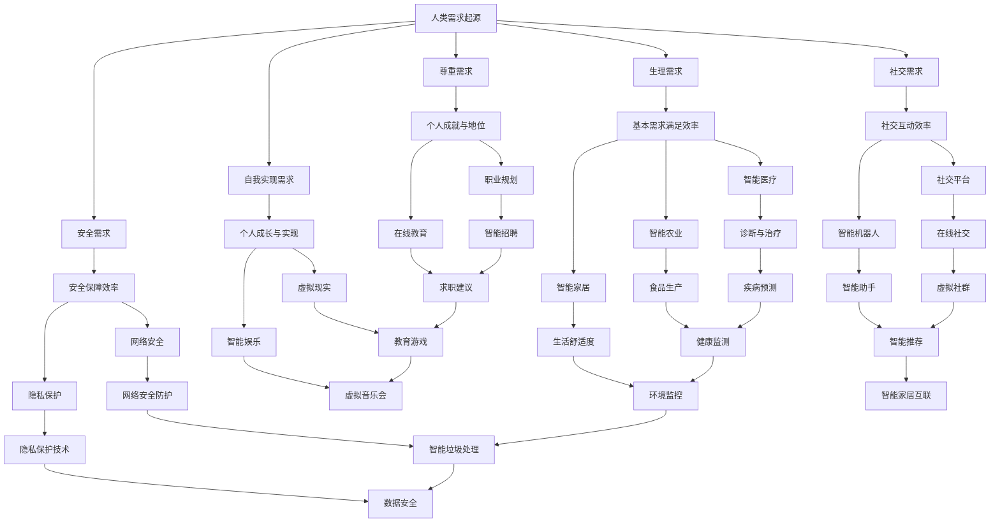
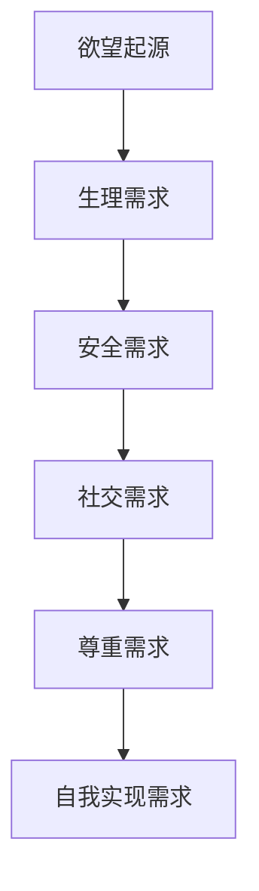
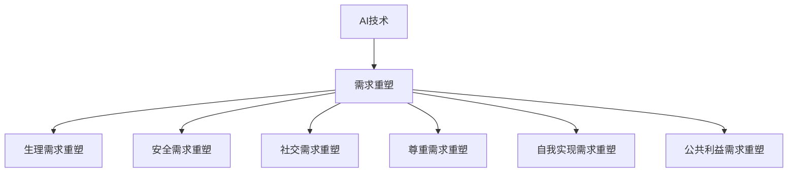
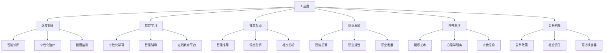

                 

### 第一部分: AI重塑的人类需求谱系

#### 第1章: 欲望的进化论概述

##### 1.1 AI与人类需求的演进

随着人工智能（AI）技术的迅猛发展，人类的需求也在不断演变。在这一章节中，我们将探讨AI的定义与发展历程，人类需求与欲望的起源，以及AI如何重塑人类需求。

###### 1.1.1 AI的定义与发展历程

人工智能，简称AI，是指通过计算机模拟人类智能行为的技术。AI的发展可以分为以下几个阶段：

1. **早期探索**：20世纪50年代至70年代，以符号主义为代表，通过程序化方式模拟人类思维。
2. **专家系统**：20世纪80年代，基于知识表示和推理机制，实现对特定领域问题的求解。
3. **机器学习**：20世纪90年代至21世纪初，通过大量数据训练模型，实现从数据中自动学习规律。
4. **深度学习**：21世纪10年代至今，以神经网络为核心，通过多层神经网络进行深度学习，实现更高级的认知和决策能力。

目前，AI技术已经广泛应用于各个领域，如医疗、金融、交通、教育等，极大地改变了人类的生活方式。

###### 1.1.2 人类需求与欲望的起源

人类的需求和欲望源于生物学和社会学的多重因素。生理需求包括食物、水、睡眠等基本生存需求；安全需求包括安全感、健康保障等；社交需求包括友谊、归属感等；自我实现需求包括个人成长、成就等。这些需求在人类进化过程中逐渐形成，并通过社会互动得到强化。

###### 1.1.3 AI如何重塑人类需求

AI通过以下几个方面重塑人类需求：

1. **提高需求满足效率**：例如，通过智能推荐系统提高购物效率，通过智能医疗提高健康保障效率。
2. **创造新的需求**：例如，虚拟现实技术创造新的娱乐需求，智能机器人创造新的社交需求。
3. **改变需求优先级**：AI技术可能会改变人们对需求的优先级排序，例如，对于某些人来说，数据隐私和安全的重要性可能超过物质财富的积累。

##### 1.2 欲望的进化论核心概念

在本节中，我们将介绍欲望的层次理论，欲望与行为的关系，以及欲望的进化趋势。

###### 1.2.1 欲望的层次理论

美国心理学家马斯洛提出了著名的“需求层次理论”，将人类需求分为五个层次：

1. **生理需求**：包括食物、水、空气等基本生存需求。
2. **安全需求**：包括安全感、健康保障等。
3. **社交需求**：包括友谊、归属感等。
4. **尊重需求**：包括自尊、被尊重等。
5. **自我实现需求**：包括个人成长、成就等。

这一理论揭示了人类需求的层次结构和优先级，对理解人类行为具有重要意义。

###### 1.2.2 欲望与行为的关系

欲望是驱使人类采取行动的重要动力。根据需求层次理论，不同层次的需求会激发不同的行为：

1. **生理需求**：驱使人们寻找食物、水和住所等。
2. **安全需求**：驱使人们寻找安全的环境、工作和医疗保障等。
3. **社交需求**：驱使人们建立友谊、家庭和社会关系等。
4. **尊重需求**：驱使人们追求个人成就、社会地位等。
5. **自我实现需求**：驱使人们追求个人成长、自我实现等。

###### 1.2.3 欲望的进化趋势

随着社会和科技的进步，人类欲望的层次和内容也在不断进化。例如，在农业社会，土地和粮食是主要的需求；在工业社会，机器和资本成为新的需求；在信息化社会，知识和信息成为新的需求。AI技术的发展将进一步推动这一趋势，创造出更多新的需求和欲望。

##### 1.3 AI重塑人类需求的影响

AI技术的广泛应用对人类需求产生了深远的影响，包括对基本需求的重塑、对高级需求的创新，以及对社会和个人生活的深远影响。

###### 1.3.1 AI对基本需求的重塑

AI技术在满足基本需求方面发挥了重要作用。例如：

1. **医疗与健康**：通过智能医疗系统，提高诊断和治疗的准确性和效率。
2. **食品与营养**：通过智能农业和食品科技，提高食品的生产效率和营养价值。
3. **环境与生活品质**：通过智能家居和物联网，提高生活舒适度和安全性。

这些技术革新不仅提高了人类基本需求的满足效率，还创造出新的需求和生活方式。

###### 1.3.2 AI对高级需求的创新

AI技术在满足高级需求方面也展现出强大的创新能力。例如：

1. **教育与学习**：通过在线教育和个性化学习系统，提高教育质量和学习效率。
2. **娱乐与艺术**：通过虚拟现实、增强现实和智能娱乐系统，创造新的娱乐体验和艺术形式。
3. **职业与就业**：通过智能招聘系统和职业规划工具，提高就业效率和职业发展。

这些创新不仅丰富了人类的高级需求，还推动了社会的发展和创新。

###### 1.3.3 AI对社会和个人生活的深远影响

AI技术的广泛应用对社会和个人生活产生了深远影响。例如：

1. **社会结构**：AI技术改变了传统的生产方式和就业模式，推动了社会结构的变革。
2. **经济模式**：AI技术推动了数字经济的发展，改变了经济模式的运行方式。
3. **生活方式**：AI技术改变了人们的生活方式，提高了生活的便利性和幸福感。

总之，AI技术正在重塑人类的需求谱系，推动人类社会向着更加智能化、高效化、人性化的方向发展。

---

在接下来的章节中，我们将进一步探讨AI如何重塑人类的生理需求、安全需求、社交需求和自我实现需求，分析AI技术在不同领域的实际应用案例，以及这些技术如何改变人们的日常生活。通过这些分析，我们将更加清晰地看到AI技术对人类需求的深远影响。

---

以上是第一部分的概述，接下来我们将逐一深入探讨每个章节的核心内容，让我们继续进行推理思考，分析AI技术如何逐步重塑人类需求谱系。

---

**核心概念与联系：**

以下是关于“欲望的进化论”的核心概念和它们之间联系的 Mermaid 流�程图：



这个流程图展示了欲望的进化过程和AI技术如何满足不同层次的需求，以及它们之间的相互联系。

---

接下来，我们将继续深入分析AI技术在不同领域的实际应用案例，以及这些技术如何具体改变人们的日常生活。通过这些案例研究，我们将更好地理解AI技术如何重塑人类需求。

---

#### 第2章: AI重塑下的基础需求

##### 2.1 生理需求的重塑

生理需求是人类生存的基本需求，包括食物、水、睡眠、健康等。随着AI技术的发展，生理需求的满足方式也在发生深刻变革。

###### 2.1.1 AI医疗与健康

AI医疗是AI技术在医疗领域的应用，通过大数据分析、机器学习和深度学习等技术，提高诊断的准确性和治疗效果。以下是一些具体的AI医疗应用案例：

1. **智能诊断**：通过分析大量的医学图像和病例数据，AI系统可以帮助医生更准确地诊断疾病，如肺癌、乳腺癌等。
    ```python
    # 伪代码：智能诊断系统的诊断流程
    def diagnose(patient_data):
        # 加载训练好的模型
        model = load_model("diagnosis_model")
        # 对患者数据进行预处理
        processed_data = preprocess(patient_data)
        # 使用模型进行诊断
        diagnosis = model.predict(processed_data)
        return diagnosis
    ```

2. **个性化治疗**：AI可以根据患者的基因信息、病史和实时监测数据，制定个性化的治疗方案，提高治疗效果。
    ```python
    # 伪代码：个性化治疗方案的制定流程
    def personalized_treatment(patient_data):
        # 加载训练好的模型
        model = load_model("treatment_model")
        # 对患者数据进行预处理
        processed_data = preprocess(patient_data)
        # 使用模型预测最佳治疗方案
        treatment_plan = model.predict(processed_data)
        return treatment_plan
    ```

3. **健康监测**：AI健康监测系统可以通过智能手表、健康手环等设备实时监测患者的健康状况，如心率、血压、睡眠质量等，及时预警潜在的健康问题。
    ```python
    # 伪代码：健康监测系统的监测流程
    def health_monitor(patient_data):
        # 加载训练好的健康监测模型
        model = load_model("health_monitor_model")
        # 对患者实时数据进行预处理
        processed_data = preprocess(patient_data)
        # 使用模型进行健康评估
        health_status = model.predict(processed_data)
        return health_status
    ```

AI医疗的发展极大地提高了医疗服务的质量和效率，改变了人们的健康观念和生活方式。

###### 2.1.2 AI食品与营养

AI技术在食品与营养领域的应用同样显著，通过智能农业、食品科技和营养管理，提高食品的生产效率和营养价值。

1. **智能农业**：AI智能农业系统可以通过遥感技术、物联网和机器学习，精准监测作物生长状态，优化灌溉和施肥方案，提高农作物的产量和质量。
    ```python
    # 伪代码：智能农业系统的监测与优化流程
    def intelligent_agriculture(farm_data):
        # 加载训练好的模型
        model = load_model("crop_growth_model")
        # 对农田数据进行预处理
        processed_data = preprocess(farm_data)
        # 使用模型预测作物生长状态
        growth_status = model.predict(processed_data)
        # 根据预测结果调整灌溉和施肥方案
        irrigation_plan, fertilizer_plan = optimize_growth(growth_status)
        return irrigation_plan, fertilizer_plan
    ```

2. **食品科技**：AI食品科技可以通过基因编辑、纳米技术和智能包装等，创造新型食品，延长食品保质期，提高食品的营养价值。
    ```python
    # 伪代码：新型食品研发流程
    def new_food_devolution(ingredient_data):
        # 加载训练好的模型
        model = load_model("food_nutrition_model")
        # 对食材数据进行预处理
        processed_data = preprocess(ingredient_data)
        # 使用模型预测新型食品的营养价值
        nutrition_value = model.predict(processed_data)
        # 根据预测结果调整食材配方
        final_formula = optimize_nutrition(nutrition_value)
        return final_formula
    ```

3. **营养管理**：AI营养管理系统可以通过大数据分析和机器学习，为个人提供个性化的营养建议，帮助人们更好地管理健康。
    ```python
    # 伪代码：个性化营养建议流程
    def nutrition_management(personal_data):
        # 加载训练好的模型
        model = load_model("nutrition_advice_model")
        # 对个人数据进行预处理
        processed_data = preprocess(personal_data)
        # 使用模型预测最佳营养方案
        nutrition_plan = model.predict(processed_data)
        return nutrition_plan
    ```

AI食品与营养技术的应用不仅提高了食品产业的效率和质量，还改变了人们的饮食习惯和生活方式。

###### 2.1.3 AI环境与生活品质

AI技术在环境与生活品质领域的应用，通过智能家居、智能城市和智能交通等，提高人们的生活舒适度和环境质量。

1. **智能家居**：智能家居系统可以通过物联网和人工智能，实现家庭设备的智能控制，提高生活的便利性和舒适度。
    ```python
    # 伪代码：智能家居系统的控制流程
    def home_automation(device_data):
        # 加载训练好的模型
        model = load_model("home_automation_model")
        # 对设备数据进行预处理
        processed_data = preprocess(device_data)
        # 使用模型预测设备运行状态
        device_status = model.predict(processed_data)
        # 根据预测结果调整设备运行参数
        device_settings = optimize_automation(device_status)
        return device_settings
    ```

2. **智能城市**：智能城市系统通过大数据、物联网和人工智能等技术，实现城市管理的智能化，提高城市运行效率和居民生活质量。
    ```python
    # 伪代码：智能城市管理的监控与优化流程
    def smart_city_management(city_data):
        # 加载训练好的模型
        model = load_model("smart_city_model")
        # 对城市数据进行预处理
        processed_data = preprocess(city_data)
        # 使用模型预测城市运行状态
        city_status = model.predict(processed_data)
        # 根据预测结果调整城市管理策略
        management_plan = optimize_management(city_status)
        return management_plan
    ```

3. **智能交通**：智能交通系统通过自动驾驶、智能信号控制和交通流量预测等，提高交通运行效率和安全性。
    ```python
    # 伪代码：智能交通系统的优化流程
    def smart_traffic_management(traffic_data):
        # 加载训练好的模型
        model = load_model("traffic_management_model")
        # 对交通数据进行预处理
        processed_data = preprocess(traffic_data)
        # 使用模型预测交通流量
        traffic_flow = model.predict(processed_data)
        # 根据预测结果调整交通信号和路线规划
        traffic_plan = optimize_traffic(traffic_flow)
        return traffic_plan
    ```

AI环境与生活品质技术的应用不仅提高了人们的生活质量，还推动了城市可持续发展。

##### 2.2 安全需求的重塑

安全需求是人类的基本需求之一，包括个人安全、社会安全和国家安全。AI技术在安全领域的应用，通过智能监控、安全防护和隐私保护等，提高了安全性和防护能力。

###### 2.2.1 AI安全与防护

AI安全与防护技术通过智能监控和自动响应，提高安全防护能力。

1. **智能监控**：AI智能监控系统可以通过视频分析、图像识别和声音识别等，实时监测公共场所的安全状况，及时预警潜在的安全威胁。
    ```python
    # 伪代码：智能监控系统的预警流程
    def security_monitor(video_data):
        # 加载训练好的模型
        model = load_model("security_monitor_model")
        # 对视频数据进行预处理
        processed_data = preprocess(video_data)
        # 使用模型进行实时分析
        threat_level = model.predict(processed_data)
        # 根据预警级别进行响应
        if threat_level > threshold:
            alert_security_personnel()
        return threat_level
    ```

2. **安全防护**：AI安全防护系统可以通过入侵检测、漏洞扫描和恶意软件防护等，提高网络安全防护能力。
    ```python
    # 伪代码：安全防护系统的防护流程
    def security_protection(system_data):
        # 加载训练好的模型
        model = load_model("security_protection_model")
        # 对系统数据进行预处理
        processed_data = preprocess(system_data)
        # 使用模型进行安全评估
        security_status = model.predict(processed_data)
        # 根据评估结果进行防护措施
        if security_status < threshold:
            apply_security_patches()
        return security_status
    ```

AI安全与防护技术的应用不仅提高了安全防护能力，还降低了安全事故的风险。

###### 2.2.2 AI隐私保护

AI隐私保护技术通过数据加密、访问控制和隐私计算等，保护个人隐私。

1. **数据加密**：AI数据加密技术可以通过加密算法，对存储和传输的数据进行加密，防止数据泄露。
    ```python
    # 伪代码：数据加密流程
    def data_encryption(data):
        # 加载加密算法模型
        algorithm = load_model("encryption_algorithm")
        # 对数据进行加密
        encrypted_data = algorithm.encrypt(data)
        return encrypted_data
    ```

2. **访问控制**：AI访问控制系统可以通过身份验证、权限管理和行为分析等，控制对数据的访问权限，防止未授权访问。
    ```python
    # 伪代码：访问控制流程
    def access_control(user_data):
        # 加载访问控制模型
        model = load_model("access_control_model")
        # 对用户数据进行预处理
        processed_data = preprocess(user_data)
        # 使用模型进行访问权限评估
        access_level = model.predict(processed_data)
        # 根据访问级别进行访问控制
        if access_level < threshold:
            deny_access()
        return access_level
    ```

3. **隐私计算**：AI隐私计算技术通过多方计算、联邦学习和差分隐私等，在数据处理过程中保护个人隐私。
    ```python
    # 伪代码：隐私计算流程
    def privacy_computation(anonymous_data):
        # 加载隐私计算模型
        model = load_model("privacy_computation_model")
        # 对匿名数据进行隐私计算
        computed_result = model.compute(anonymous_data)
        return computed_result
    ```

AI隐私保护技术的应用不仅提高了隐私保护能力，还为数据共享和利用提供了安全保障。

##### 2.3 社交需求的重塑

社交需求是人类的重要需求之一，包括人际关系、社交互动和社交网络等。AI技术在社交领域的应用，通过智能社交、社交平台和社交机器等，改变了人们的社交方式和社交体验。

###### 2.3.1 AI社交与人际关系

AI社交技术通过智能推荐、情感分析和行为预测等，改善人际关系和社交互动。

1. **智能推荐**：AI社交推荐系统可以通过用户行为分析、兴趣匹配和社交网络分析，为用户推荐合适的朋友和社交活动。
    ```python
    # 伪代码：智能推荐系统推荐流程
    def social_recommendation(user_data):
        # 加载推荐模型
        model = load_model("social_recommendation_model")
        # 对用户数据进行预处理
        processed_data = preprocess(user_data)
        # 使用模型进行推荐
        recommendations = model.predict(processed_data)
        return recommendations
    ```

2. **情感分析**：AI情感分析技术可以通过语言模型、情感词典和机器学习算法，分析用户的情感状态，提供情感支持。
    ```python
    # 伪代码：情感分析系统分析流程
    def emotion_analysis(text_data):
        # 加载情感分析模型
        model = load_model("emotion_analysis_model")
        # 对文本数据进行预处理
        processed_data = preprocess(text_data)
        # 使用模型进行情感分析
        emotion = model.predict(processed_data)
        return emotion
    ```

3. **行为预测**：AI行为预测技术可以通过历史数据和行为模式分析，预测用户的社交行为和需求，提供个性化的社交服务。
    ```python
    # 伪代码：行为预测系统预测流程
    def behavior_prediction(user_data):
        # 加载行为预测模型
        model = load_model("behavior_prediction_model")
        # 对用户数据进行预处理
        processed_data = preprocess(user_data)
        # 使用模型进行预测
        predicted_behavior = model.predict(processed_data)
        return predicted_behavior
    ```

AI社交与人际关系技术的应用不仅改善了人际关系，还提高了社交互动的质量。

###### 2.3.2 AI社交平台的发展

AI社交平台通过智能推荐、内容过滤和社交分析等，提供更加丰富和个性化的社交体验。

1. **智能推荐**：AI社交平台可以通过用户行为数据和社交网络分析，为用户推荐感兴趣的内容和朋友。
    ```python
    # 伪代码：智能推荐系统内容推荐流程
    def content_recommendation(user_data):
        # 加载推荐模型
        model = load_model("content_recommendation_model")
        # 对用户数据进行预处理
        processed_data = preprocess(user_data)
        # 使用模型进行推荐
        recommendations = model.predict(processed_data)
        return recommendations
    ```

2. **内容过滤**：AI社交平台可以通过情感分析和内容识别，过滤掉不良信息和垃圾内容，提高内容质量。
    ```python
    # 伪代码：内容过滤系统过滤流程
    def content_filter(text_data):
        # 加载过滤模型
        model = load_model("content_filter_model")
        # 对文本数据进行预处理
        processed_data = preprocess(text_data)
        # 使用模型进行过滤
        filtered_content = model.predict(processed_data)
        return filtered_content
    ```

3. **社交分析**：AI社交平台可以通过社交网络分析、情感分析和行为预测，为用户提供个性化的社交推荐和内容。
    ```python
    # 伪代码：社交分析系统分析流程
    def social_analysis(user_data):
        # 加载分析模型
        model = load_model("social_analysis_model")
        # 对用户数据进行预处理
        processed_data = preprocess(user_data)
        # 使用模型进行分析
        analysis_result = model.predict(processed_data)
        return analysis_result
    ```

AI社交平台的发展不仅丰富了社交体验，还为用户提供了更加个性化、便捷的社交服务。

###### 2.3.3 AI社交的未来趋势

随着AI技术的不断进步，AI社交将在以下几个方面展现未来趋势：

1. **情感交互**：通过情感计算和情感模拟，AI社交将能够更加真实地模拟人类情感，提供更加自然的社交体验。
2. **智能陪伴**：通过智能机器人和虚拟人物，AI社交将能够提供更加持久和深入的陪伴服务，满足人们的情感需求。
3. **社交定制**：通过个性化推荐和定制服务，AI社交将能够更好地满足用户的社交需求，提供更加个性化、精准的社交体验。
4. **隐私保护**：随着隐私保护意识的增强，AI社交将更加注重用户隐私保护，提供更加安全、可靠的社交服务。

AI社交的未来趋势将极大地改变人们的社交方式和社交体验，推动社交领域的创新发展。

---

在本章节中，我们详细探讨了AI技术在重塑生理需求、安全需求和社交需求方面的应用，通过具体的技术案例和伪代码，展示了AI如何改变人们的日常生活。在下一章节中，我们将进一步探讨AI如何赋能高级需求，如自我实现需求和精神需求，分析AI在这些领域的创新和影响。

---

#### 第3章: AI赋能下的高级需求

##### 3.1 自我实现需求的重塑

自我实现需求是人类需求的最高层次，包括个人成长、成就、创造力等。AI技术在教育、职业和创意等领域的发展，为满足自我实现需求提供了新的途径。

###### 3.1.1 AI教育与学习

AI技术在教育领域的应用，通过个性化学习、智能辅导和在线教育平台，提高了教育质量和学习效率。

1. **个性化学习**：AI教育系统可以通过分析学生的学习数据，提供个性化的学习建议和资源，满足不同学生的需求。
    ```python
    # 伪代码：个性化学习系统推荐流程
    def personalized_learning(student_data):
        # 加载个性化学习模型
        model = load_model("personalized_learning_model")
        # 对学生数据进行预处理
        processed_data = preprocess(student_data)
        # 使用模型推荐个性化学习资源
        learning_resources = model.predict(processed_data)
        return learning_resources
    ```

2. **智能辅导**：AI辅导系统可以通过自然语言处理和机器学习算法，为学生提供即时、个性化的辅导服务，提高学习效果。
    ```python
    # 伪代码：智能辅导系统辅导流程
    def smart_tutoring(student_question):
        # 加载智能辅导模型
        model = load_model("smart_tutoring_model")
        # 对学生问题进行预处理
        processed_question = preprocess(student_question)
        # 使用模型回答学生问题
        answer = model.predict(processed_question)
        return answer
    ```

3. **在线教育平台**：AI在线教育平台可以通过智能推荐、内容过滤和社交互动，提供丰富的在线学习资源和体验。
    ```python
    # 伪代码：在线教育平台推荐流程
    def online_education_recommendation(user_data):
        # 加载推荐模型
        model = load_model("online_education_model")
        # 对用户数据进行预处理
        processed_data = preprocess(user_data)
        # 使用模型推荐在线课程
        course_recommendations = model.predict(processed_data)
        return course_recommendations
    ```

AI教育技术的应用不仅提高了教育质量和学习效率，还打破了地域和时间的限制，为全球学习者提供了更加便捷和高质量的教育服务。

###### 3.1.2 AI职业与就业

AI技术在职业和就业领域的应用，通过智能招聘、职业规划和职业发展，提高了就业效率和职业满意度。

1. **智能招聘**：AI招聘系统可以通过简历分析、面试评估和招聘流程优化，提高招聘效率和准确性。
    ```python
    # 伪代码：智能招聘系统招聘流程
    def smart_recruitment(candidate_data):
        # 加载招聘模型
        model = load_model("smart_recruitment_model")
        # 对候选人数据进行预处理
        processed_data = preprocess(candidate_data)
        # 使用模型评估候选人
        candidate_score = model.predict(processed_data)
        return candidate_score
    ```

2. **职业规划**：AI职业规划系统可以通过数据分析、职业匹配和职业发展建议，帮助个人制定职业规划，实现职业成长。
    ```python
    # 伪代码：职业规划系统规划流程
    def career_planning(personal_data):
        # 加载职业规划模型
        model = load_model("career_planning_model")
        # 对个人数据进行预处理
        processed_data = preprocess(personal_data)
        # 使用模型推荐职业规划方案
        career_plan = model.predict(processed_data)
        return career_plan
    ```

3. **职业发展**：AI职业发展系统可以通过在线学习、技能评估和职业建议，帮助个人持续提升职业能力，实现职业发展。
    ```python
    # 伪代码：职业发展系统发展流程
    def career_development(personal_data):
        # 加载职业发展模型
        model = load_model("career_development_model")
        # 对个人数据进行预处理
        processed_data = preprocess(personal_data)
        # 使用模型评估职业发展状况
        development_status = model.predict(processed_data)
        # 根据评估结果提供职业建议
        career_advice = provide_advice(development_status)
        return career_advice
    ```

AI职业与就业技术的应用不仅提高了就业效率和职业满意度，还改变了传统的就业模式，为个人职业发展提供了更多机会和选择。

###### 3.1.3 AI创意与创新

AI技术在创意和创新领域的应用，通过智能设计、内容生成和创意优化，激发了人类的创造力和创新潜力。

1. **智能设计**：AI智能设计系统可以通过深度学习和图像识别，自动生成新颖的设计方案，提高设计效率和创意质量。
    ```python
    # 伪代码：智能设计系统生成流程
    def smart_design(input_data):
        # 加载智能设计模型
        model = load_model("smart_design_model")
        # 对输入数据进行预处理
        processed_data = preprocess(input_data)
        # 使用模型生成设计方案
        design_schemes = model.predict(processed_data)
        return design_schemes
    ```

2. **内容生成**：AI内容生成系统可以通过自然语言处理和机器学习，自动生成文本、图像和视频等创意内容，丰富创意表达形式。
    ```python
    # 伪代码：内容生成系统生成流程
    def content_generation(input_data):
        # 加载内容生成模型
        model = load_model("content_generation_model")
        # 对输入数据进行预处理
        processed_data = preprocess(input_data)
        # 使用模型生成内容
        generated_content = model.predict(processed_data)
        return generated_content
    ```

3. **创意优化**：AI创意优化系统可以通过用户反馈和数据分析，不断优化创意方案，提高创意质量和用户满意度。
    ```python
    # 伪代码：创意优化系统优化流程
    def creative_optimization(creative_data):
        # 加载创意优化模型
        model = load_model("creative_optimization_model")
        # 对创意数据进行预处理
        processed_data = preprocess(creative_data)
        # 使用模型评估创意质量
        quality_score = model.predict(processed_data)
        # 根据评估结果优化创意
        optimized_creative = optimize_creative(quality_score)
        return optimized_creative
    ```

AI创意与创新技术的应用不仅提高了创意效率和创意质量，还为各行业带来了创新的解决方案和新的商业模式。

##### 3.2 精神需求的重塑

精神需求是人类需求的重要组成部分，包括娱乐、艺术、心理学和宗教等方面。AI技术在精神需求领域的应用，通过智能娱乐、艺术创作和心理学服务，丰富了人类的精神生活。

###### 3.2.1 AI娱乐与艺术

AI技术在娱乐和艺术领域的应用，通过智能推荐、虚拟现实和增强现实，提供了丰富的娱乐和艺术体验。

1. **智能娱乐**：AI智能娱乐系统可以通过用户行为分析、兴趣匹配和推荐算法，为用户推荐个性化的娱乐内容。
    ```python
    # 伪代码：智能娱乐系统推荐流程
    def smart_ entertainment(user_data):
        # 加载推荐模型
        model = load_model("smart_entertainment_model")
        # 对用户数据进行预处理
        processed_data = preprocess(user_data)
        # 使用模型推荐娱乐内容
        entertainment_recommendations = model.predict(processed_data)
        return entertainment_recommendations
    ```

2. **虚拟现实**：AI虚拟现实技术可以通过沉浸式体验，为用户提供身临其境的娱乐和艺术体验。
    ```python
    # 伪代码：虚拟现实系统体验流程
    def virtual_reality_experience(input_data):
        # 加载虚拟现实模型
        model = load_model("virtual_reality_model")
        # 对输入数据进行预处理
        processed_data = preprocess(input_data)
        # 使用模型生成虚拟现实场景
        virtual_scene = model.predict(processed_data)
        return virtual_scene
    ```

3. **增强现实**：AI增强现实技术可以通过实时交互和增强现实效果，为用户提供增强的娱乐和艺术体验。
    ```python
    # 伪代码：增强现实系统体验流程
    def augmented_reality_experience(input_data):
        # 加载增强现实模型
        model = load_model("augmented_reality_model")
        # 对输入数据进行预处理
        processed_data = preprocess(input_data)
        # 使用模型生成增强现实效果
        augmented_scene = model.predict(processed_data)
        return augmented_scene
    ```

AI娱乐与艺术技术的应用不仅丰富了娱乐和艺术形式，还为用户提供了更加个性化和沉浸式的体验。

###### 3.2.2 AI心理学与情绪管理

AI心理学技术在情绪管理和心理健康领域，通过情感识别、行为分析和心理治疗，提供了个性化的心理服务和情绪管理方案。

1. **情感识别**：AI情感识别技术可以通过语音、文本和面部表情分析，识别用户的情感状态，为心理治疗提供数据支持。
    ```python
    # 伪代码：情感识别系统分析流程
    def emotion_recognition(user_data):
        # 加载情感识别模型
        model = load_model("emotion_recognition_model")
        # 对用户数据进行预处理
        processed_data = preprocess(user_data)
        # 使用模型识别情感状态
        emotion_status = model.predict(processed_data)
        return emotion_status
    ```

2. **行为分析**：AI行为分析技术可以通过数据分析和行为模式识别，发现用户的心理问题和行为倾向，提供个性化的心理治疗建议。
    ```python
    # 伪代码：行为分析系统分析流程
    def behavior_analysis(user_data):
        # 加载行为分析模型
        model = load_model("behavior_analysis_model")
        # 对用户数据进行预处理
        processed_data = preprocess(user_data)
        # 使用模型分析行为模式
        behavior_patterns = model.predict(processed_data)
        return behavior_patterns
    ```

3. **心理治疗**：AI心理治疗技术可以通过虚拟现实、增强现实和智能对话系统，为用户提供沉浸式和心理治疗服务。
    ```python
    # 伪代码：心理治疗系统治疗流程
    def psychological_treatment(user_data):
        # 加载心理治疗模型
        model = load_model("psychological_treatment_model")
        # 对用户数据进行预处理
        processed_data = preprocess(user_data)
        # 使用模型提供心理治疗方案
        treatment_plan = model.predict(processed_data)
        return treatment_plan
    ```

AI心理学与情绪管理技术的应用不仅提高了心理服务的质量和效率，还为用户提供了更加个性化和便捷的心理健康管理方案。

###### 3.2.3 AI宗教与信仰

AI技术在宗教和信仰领域的应用，通过智能祈祷、虚拟宗教仪式和宗教教育，丰富了宗教体验和信仰教育。

1. **智能祈祷**：AI智能祈祷系统可以通过语音识别、文本分析和自然语言处理，为用户提供个性化的祈祷指导和灵性支持。
    ```python
    # 伪代码：智能祈祷系统指导流程
    def smart_prayer(user_data):
        # 加载祈祷模型
        model = load_model("smart_prayer_model")
        # 对用户数据进行预处理
        processed_data = preprocess(user_data)
        # 使用模型提供祈祷指导
        prayer_guidance = model.predict(processed_data)
        return prayer_guidance
    ```

2. **虚拟宗教仪式**：AI虚拟宗教仪式技术可以通过虚拟现实和增强现实，为用户提供沉浸式宗教仪式体验。
    ```python
    # 伪代码：虚拟宗教仪式体验流程
    def virtual_religious_ritual(input_data):
        # 加载虚拟仪式模型
        model = load_model("virtual_religious_ritual_model")
        # 对输入数据进行预处理
        processed_data = preprocess(input_data)
        # 使用模型生成虚拟仪式场景
        virtual_ritual_scene = model.predict(processed_data)
        return virtual_ritual_scene
    ```

3. **宗教教育**：AI宗教教育技术可以通过在线课程、互动教学和智能推荐，为用户提供个性化的宗教教育和信仰培养。
    ```python
    # 伪代码：宗教教育系统推荐流程
    def religious_education_recommendation(user_data):
        # 加载推荐模型
        model = load_model("religious_education_model")
        # 对用户数据进行预处理
        processed_data = preprocess(user_data)
        # 使用模型推荐宗教教育课程
        education_courses = model.predict(processed_data)
        return education_courses
    ```

AI宗教与信仰技术的应用不仅丰富了宗教体验和信仰教育，还为宗教传播和信仰传承提供了新的方式。

##### 3.3 公共利益需求的重塑

公共利益需求涉及社会公共事务、环境保护和可持续发展等方面。AI技术在公共利益领域的应用，通过智能公共政策、社会管理和可持续发展，提高了公共服务的质量和效率。

###### 3.3.1 AI公共政策与管理

AI技术在公共政策和管理领域的应用，通过数据分析和智能决策，提高了公共政策的科学性和有效性。

1. **数据分析**：AI数据分析技术可以通过大数据分析和机器学习，对政策执行效果进行评估，为政策调整提供数据支持。
    ```python
    # 伪代码：政策评估系统评估流程
    def policy_evaluation(policy_data):
        # 加载评估模型
        model = load_model("policy_evaluation_model")
        # 对政策数据进行预处理
        processed_data = preprocess(policy_data)
        # 使用模型评估政策效果
        policy_effectiveness = model.predict(processed_data)
        return policy_effectiveness
    ```

2. **智能决策**：AI智能决策技术可以通过决策支持系统和智能算法，为政府提供科学、高效的决策支持。
    ```python
    # 伪代码：智能决策系统决策流程
    def intelligent_decisionmaking(problem_data):
        # 加载决策模型
        model = load_model("intelligent_decisionmaking_model")
        # 对问题数据进行预处理
        processed_data = preprocess(problem_data)
        # 使用模型提供决策方案
        decision_solution = model.predict(processed_data)
        return decision_solution
    ```

3. **政策优化**：AI政策优化技术可以通过历史数据和模拟分析，对政策进行持续优化，提高政策效果。
    ```python
    # 伪代码：政策优化系统优化流程
    def policy_optimization(policy_data):
        # 加载优化模型
        model = load_model("policy_optimization_model")
        # 对政策数据进行预处理
        processed_data = preprocess(policy_data)
        # 使用模型优化政策方案
        optimized_policy = model.predict(processed_data)
        return optimized_policy
    ```

AI公共政策与管理的应用不仅提高了政策质量和决策效率，还为政府提供了科学的决策支持。

###### 3.3.2 AI社会责任与伦理

AI技术在社会责任和伦理领域的应用，通过伦理计算、社会责任评估和伦理决策，促进了人工智能技术的负责任发展。

1. **伦理计算**：AI伦理计算技术可以通过伦理模型和算法，评估人工智能系统的伦理决策和行动，确保人工智能技术的伦理合规性。
    ```python
    # 伪代码：伦理计算系统评估流程
    def ethical_computation(technology_data):
        # 加载伦理计算模型
        model = load_model("ethical_computation_model")
        # 对技术数据进行预处理
        processed_data = preprocess(technology_data)
        # 使用模型评估伦理合规性
        ethical_score = model.predict(processed_data)
        return ethical_score
    ```

2. **社会责任评估**：AI社会责任评估技术可以通过数据分析和社会影响评估，评估人工智能技术的社会责任履行情况，推动人工智能技术的可持续发展。
    ```python
    # 伪代码：社会责任评估系统评估流程
    def social_responsibility_evaluation(technology_data):
        # 加载评估模型
        model = load_model("social_responsibility_evaluation_model")
        # 对技术数据进行预处理
        processed_data = preprocess(technology_data)
        # 使用模型评估社会责任履行情况
        responsibility_score = model.predict(processed_data)
        return responsibility_score
    ```

3. **伦理决策**：AI伦理决策技术可以通过伦理计算和社会责任评估，为人工智能系统的决策提供伦理指导，确保人工智能技术的伦理决策。
    ```python
    # 伪代码：伦理决策系统决策流程
    def ethical_decisionmaking(problem_data):
        # 加载伦理决策模型
        model = load_model("ethical_decisionmaking_model")
        # 对问题数据进行预处理
        processed_data = preprocess(problem_data)
        # 使用模型提供伦理决策方案
        ethical_decision = model.predict(processed_data)
        return ethical_decision
    ```

AI社会责任与伦理技术的应用不仅促进了人工智能技术的负责任发展，还为人工智能技术的伦理决策提供了科学支持。

###### 3.3.3 AI对可持续发展的影响

AI技术在可持续发展领域的应用，通过智能监测、资源优化和环境保护，推动了可持续发展和绿色科技的实现。

1. **智能监测**：AI智能监测技术可以通过遥感、物联网和大数据分析，实时监测环境质量、资源消耗和生态变化，为可持续发展提供数据支持。
    ```python
    # 伪代码：智能监测系统监测流程
    def smart_monitoring(environment_data):
        # 加载监测模型
        model = load_model("smart_monitoring_model")
        # 对环境数据进行预处理
        processed_data = preprocess(environment_data)
        # 使用模型监测环境状况
        environment_status = model.predict(processed_data)
        return environment_status
    ```

2. **资源优化**：AI资源优化技术可以通过数据分析、智能调度和优化算法，提高资源利用效率，减少资源浪费，实现资源的可持续利用。
    ```python
    # 伪代码：资源优化系统优化流程
    def resource_optimization(resource_data):
        # 加载优化模型
        model = load_model("resource_optimization_model")
        # 对资源数据进行预处理
        processed_data = preprocess(resource_data)
        # 使用模型优化资源分配
        optimized_resources = model.predict(processed_data)
        return optimized_resources
    ```

3. **环境保护**：AI环境保护技术可以通过智能监测、污染控制和生态修复，保护生态环境，实现可持续发展和绿色科技。
    ```python
    # 伪代码：环境保护系统保护流程
    def environmental_protection(environment_data):
        # 加载保护模型
        model = load_model("environmental_protection_model")
        # 对环境数据进行预处理
        processed_data = preprocess(environment_data)
        # 使用模型进行环境保护
        protection_actions = model.predict(processed_data)
        return protection_actions
    ```

AI对可持续发展的影响不仅提高了资源利用效率，还推动了绿色科技和可持续发展，为人类社会的长远发展提供了有力支持。

---

在本章节中，我们详细探讨了AI技术在满足高级需求方面的应用，包括教育、职业、创意、娱乐、心理学、宗教、公共政策、社会责任和可持续发展等领域。通过具体的技术案例和伪代码，展示了AI如何赋能高级需求，丰富人类的生活体验。在下一章节中，我们将分析AI重塑人类需求的挑战和未来发展趋势，探讨人类社会如何应对这些挑战。

---

#### 第4章: AI重塑人类需求的挑战

随着AI技术在各个领域的广泛应用，其对人类需求的重塑带来了诸多挑战。这些挑战涉及道德与伦理、社会与经济、技术等方面，对人类社会产生了深远的影响。

##### 4.1 道德与伦理挑战

AI技术的发展和应用在带来便利和创新的同时，也引发了诸多道德与伦理问题。以下是一些主要的道德与伦理挑战：

###### 4.1.1 AI道德规范与标准

随着AI技术的不断进步，制定统一的道德规范与标准变得尤为重要。然而，AI技术的复杂性和多样性使得制定普遍适用的道德规范与标准变得困难。例如：

1. **算法偏见**：AI算法可能因为训练数据中的偏见而做出不公平的决策，导致歧视和偏见。
2. **隐私保护**：AI技术收集和处理的大量个人数据可能侵犯用户的隐私权，需要制定严格的隐私保护规范。
3. **透明性与可解释性**：复杂的AI系统往往缺乏透明性，难以解释其决策过程，这可能导致公众对AI系统的信任危机。

为了解决这些问题，需要制定全面的AI道德规范与标准，确保AI技术的发展不会损害人类的道德和伦理利益。

###### 4.1.2 AI伦理困境与对策

AI技术的广泛应用带来了许多伦理困境，需要通过法律、政策和道德准则来应对。以下是一些典型的伦理困境及相应的对策：

1. **自主决策与责任**：AI系统在自主决策时可能产生意外结果，责任的归属成为难题。对策包括明确AI系统的责任范围，制定相应的法律法规。
2. **就业替代**：AI技术可能导致大量就业岗位的消失，影响社会稳定。对策包括提供职业培训和再就业支持，推动经济结构的转型升级。
3. **数据治理**：大数据和AI技术可能导致个人隐私泄露和数据滥用。对策包括加强数据保护立法，提高公众的数据保护意识。

通过制定和实施有效的伦理准则，可以减少AI技术带来的负面影响，确保其在伦理和法律框架内运行。

###### 4.1.3 AI道德责任与法律

AI技术的道德责任和法律问题日益受到关注。以下是一些关键问题及其解决方案：

1. **责任归属**：确定AI系统在决策错误或意外事件中的责任归属，需要明确法律责任的主体。
2. **责任追究**：在AI系统造成损失或伤害时，如何追究责任并赔偿受害者，需要建立完善的法律机制。
3. **伦理审查**：在开发和应用AI技术时，需要进行伦理审查，确保其符合道德和社会价值。

通过法律手段保障AI技术的道德责任，可以增强公众对AI技术的信任，促进其健康、可持续发展。

##### 4.2 社会与经济挑战

AI技术的发展对社会和经济产生了深远的影响，带来了一系列挑战：

###### 4.2.1 AI对社会结构的影响

AI技术的广泛应用改变了社会的生产方式、就业结构和劳动关系。以下是一些具体的影响：

1. **就业替代**：自动化和智能化技术可能导致许多传统就业岗位的消失，迫使劳动者转向新的职业领域。
2. **技能需求**：AI技术的发展对劳动者的技能要求不断提高，需要劳动者具备更高的技术水平和创新能力。
3. **社会分层**：AI技术的应用可能导致社会分层的加剧，拥有更多资源和技能的人群将受益，而弱势群体可能面临更大的困境。

为了应对这些挑战，需要推动教育和职业培训的改革，提高劳动者的技能水平，促进社会的公平与包容。

###### 4.2.2 AI对经济模式的影响

AI技术对经济模式产生了重大影响，包括生产、分配和消费等方面。以下是一些具体的影响：

1. **生产效率**：AI技术的应用可以提高生产效率，降低生产成本，推动经济快速增长。
2. **产业变革**：AI技术推动了传统产业的升级和新兴产业的崛起，促进了经济结构的转型升级。
3. **市场竞争**：AI技术的普及使得市场竞争更加激烈，企业需要不断创新和优化，以保持竞争优势。

为了应对这些挑战，需要推动科技创新和产业升级，加强企业的创新能力和竞争力。

###### 4.2.3 AI就业市场的变化

AI技术的快速发展对就业市场产生了深刻的影响，以下是一些具体的变化：

1. **劳动力需求**：AI技术的应用可能导致劳动力需求的结构性变化，对某些行业的需求增加，而对另一些行业的需求减少。
2. **就业岗位**：AI技术可能创造新的就业岗位，同时也可能替代某些传统就业岗位。
3. **就业稳定性**：随着AI技术的广泛应用，就业稳定性可能受到影响，劳动者需要具备更强的适应能力和灵活性。

为了应对这些挑战，需要建立灵活的就业市场，推动劳动力市场的供需匹配，提高劳动者的就业能力和竞争力。

##### 4.3 技术与安全挑战

AI技术的广泛应用带来了许多技术与安全挑战，对人类社会产生了深远的影响：

###### 4.3.1 AI技术发展瓶颈

AI技术的发展面临一系列瓶颈，包括算法复杂度、数据质量和计算能力等方面。以下是一些具体的瓶颈：

1. **算法复杂度**：复杂的AI算法可能难以优化，导致计算效率和效果受限。
2. **数据质量**：AI算法的性能依赖于高质量的数据，然而现实中的数据质量往往参差不齐。
3. **计算能力**：高性能计算资源的获取和利用成为AI技术发展的重要瓶颈。

为了突破这些瓶颈，需要推动算法优化、数据清洗和计算能力的提升。

###### 4.3.2 AI安全风险与防护

AI技术的应用带来了诸多安全风险，包括数据泄露、恶意攻击和决策失误等。以下是一些具体的AI安全风险与防护措施：

1. **数据泄露**：AI系统可能因为数据泄露而导致用户隐私泄露，需要加强数据保护和加密措施。
2. **恶意攻击**：黑客可能利用AI系统进行恶意攻击，需要建立完善的安全防御体系。
3. **决策失误**：AI系统的决策失误可能导致严重的后果，需要加强AI系统的安全评估和监管。

为了降低AI安全风险，需要加强AI系统的安全评估和监管，提高AI系统的安全性和可靠性。

###### 4.3.3 AI安全与隐私保护技术

AI安全与隐私保护技术是确保AI系统安全运行的重要手段，以下是一些核心技术和应用：

1. **安全加密**：通过加密算法对AI系统的数据和处理过程进行加密，防止数据泄露和未经授权的访问。
2. **安全隔离**：通过隔离技术将AI系统与外部环境隔离开来，防止恶意攻击和病毒感染。
3. **隐私保护算法**：通过差分隐私、联邦学习和多方计算等隐私保护算法，保护用户隐私。

通过这些技术，可以降低AI系统的安全风险，提高其安全性和可靠性。

---

在本章节中，我们详细分析了AI重塑人类需求所带来的道德与伦理、社会与经济、技术等方面的挑战。这些挑战对人类社会产生了深远的影响，需要通过法律、政策、技术和社会等多方面的努力来应对。在下一章节中，我们将探讨AI重塑人类需求的未来发展趋势，分析其可能带来的机遇和挑战。

---

#### 第5章: AI重塑人类需求的未来展望

随着AI技术的不断进步，其对人类需求的重塑将带来深远的影响。在这一章节中，我们将分析AI重塑人类需求的趋势，探讨未来AI技术发展的前景，以及这些技术对人类社会可能产生的重大影响。

##### 5.1 AI重塑人类需求的趋势分析

AI技术对人类需求的重塑是一个复杂而多层次的过程。以下是AI重塑人类需求的一些主要趋势：

###### 5.1.1 AI需求趋势分析框架

为了更好地理解AI需求趋势，我们可以构建一个分析框架，包括以下几个方面：

1. **技术进步**：AI技术的不断突破将推动人类需求的不断进化，包括算法优化、计算能力提升、数据质量改善等。
2. **应用领域**：AI技术在各个领域的广泛应用将改变人们的生产方式、生活方式和社会结构，如医疗、教育、交通、金融等。
3. **人类行为**：AI技术将深刻改变人类的行为模式和生活方式，如智能化的家居设备、虚拟现实的娱乐体验、个性化的服务推荐等。
4. **伦理与法律**：随着AI技术的发展，相关的伦理和法律问题也将日益突出，需要建立和完善相应的规范和标准。
5. **社会影响**：AI技术对社会的深远影响，包括就业结构、社会分层、隐私保护、社会公平等方面。

通过这个分析框架，我们可以更全面地理解AI重塑人类需求的过程和趋势。

###### 5.1.2 未来人类需求预测

基于当前的技术发展趋势和社会变化，我们可以预测未来人类需求的一些可能方向：

1. **智能化**：随着AI技术的进步，越来越多的设备和系统将实现智能化，人们对于智能化产品和服务的需求将不断增长。
2. **个性化和定制化**：AI技术将提供更加个性化的服务，满足人们独特的需求，如个性化医疗、个性化教育、定制化产品等。
3. **可持续发展**：随着环保意识的增强，人们对于可持续发展的需求将日益增加，如绿色能源、生态农业、环保科技等。
4. **隐私保护**：随着数据泄露和网络攻击的频发，人们对隐私保护的重视将进一步提升，对隐私保护技术的需求也将增加。
5. **社会公平**：AI技术的发展可能导致社会分层的加剧，因此，社会公平将成为未来人类需求的重要方面，包括就业机会的公平分配、教育和医疗资源的公平获取等。

通过这些预测，我们可以更好地把握未来人类需求的发展方向，为政策制定、技术研发和社会创新提供参考。

###### 5.1.3 AI需求发展的影响因素

AI需求的发展受到多种因素的影响，包括技术、经济、社会和文化等方面。以下是几个关键影响因素：

1. **技术进步**：AI技术的突破将直接影响AI需求的发展，如算法优化、计算能力提升、数据质量改善等。
2. **经济发展**：经济水平的提升将增加人们对于AI技术的需求，推动AI技术的广泛应用。
3. **社会变革**：社会结构的变化、文化观念的变迁以及人口老龄化等都会影响AI需求的发展。
4. **政策法规**：政府的政策法规对AI需求的推动或限制具有重要作用，如数据保护法规、隐私保护政策和伦理准则等。
5. **市场需求**：市场需求的变化将直接影响AI技术的应用和发展，如消费升级、产业升级等。

通过分析这些影响因素，我们可以更好地预测和应对AI需求的发展趋势。

##### 5.2 AI重塑人类需求的技术前景

AI技术的未来前景将深刻影响人类的需求和行为，以下是一些可能的AI技术发展趋势和应用领域：

###### 5.2.1 AI技术发展趋势

1. **深度学习和神经网络**：深度学习将继续作为AI技术的重要方向，推动人工智能的应用和普及。
2. **自然语言处理**：自然语言处理技术的发展将进一步提升人机交互的便捷性和智能化水平。
3. **计算机视觉**：计算机视觉技术的进步将使人工智能在图像识别、视频分析和自动驾驶等领域取得重大突破。
4. **物联网**：物联网技术的普及将使更多的设备和系统实现智能化，推动AI技术在各个领域的应用。
5. **量子计算**：量子计算技术的发展将大幅提升计算能力，为AI技术的研究和应用提供新的可能性。

这些技术的发展将推动AI技术不断突破，为人类需求的满足提供更加丰富的手段。

###### 5.2.2 AI技术的未来应用领域

AI技术将在多个领域实现重大应用，以下是一些关键领域：

1. **医疗健康**：AI技术在医疗诊断、个性化治疗、健康监测和药物研发等方面具有广泛的应用前景。
2. **教育**：AI技术将推动个性化教育、智能辅导和在线教育的普及，提高教育质量和学习效率。
3. **交通**：自动驾驶、智能交通管理和物流优化等将提升交通运行效率和安全性。
4. **金融**：AI技术在风险控制、欺诈检测、投资决策和金融产品设计等方面具有广泛应用。
5. **能源和环境**：AI技术在能源管理、环保监测和可持续发展方面将发挥重要作用。

这些领域的应用将深刻改变人们的生产方式和生活方式，满足人类更高层次的需求。

##### 5.3 AI重塑人类需求的未来发展策略

为了有效应对AI重塑人类需求带来的机遇和挑战，我们需要制定一系列未来发展策略：

###### 5.3.1 政策与法规制定

1. **制定AI伦理准则**：建立全面的AI伦理准则，确保AI技术的发展不会损害人类的道德和伦理利益。
2. **加强数据保护**：制定严格的数据保护法规，保护用户的隐私和数据安全。
3. **促进公平竞争**：制定公平竞争政策，防止垄断和不正当竞争行为，保障市场的健康发展。

这些政策法规将为AI技术的发展提供良好的法治环境。

###### 5.3.2 企业与社会的响应策略

1. **企业创新**：企业应积极投入AI技术研发，推动产业创新和转型升级。
2. **社会责任**：企业应承担社会责任，关注社会公平和可持续发展，促进社会的和谐与进步。
3. **教育与培训**：企业和社会应加强教育与培训，提高劳动者的技能水平，适应AI技术发展的需求。

这些策略将有助于企业和社会更好地应对AI技术带来的变化。

###### 5.3.3 个体与社会的适应策略

1. **个体适应**：个体应主动学习AI技术，提高自身技能和竞争力，适应技术变革带来的就业市场变化。
2. **社会支持**：社会应提供必要的支持和帮助，如职业培训、再就业服务和社会保障等，帮助个体顺利过渡。
3. **文化创新**：社会应推动文化创新，弘扬科技进步带来的正能量，增强社会凝聚力和创新氛围。

这些策略将有助于个体和社会更好地适应AI技术重塑人类需求带来的变化。

---

在本章节中，我们详细分析了AI重塑人类需求的未来发展趋势、技术前景和发展策略。通过这些分析，我们可以看到AI技术对人类需求的深刻影响，以及人类社会如何应对这些影响。在下一章节中，我们将通过具体案例研究，进一步探讨AI技术在不同领域的实际应用和影响。

---

#### 第6章: 案例研究：AI重塑人类需求的实践应用

在本章节中，我们将通过具体案例研究，探讨AI技术在不同领域的实际应用，分析这些技术如何改变人们的日常生活，并评估其实际效果。

##### 6.1 案例一：智能医疗与健康

智能医疗是AI技术在医疗领域的应用，通过大数据分析、机器学习和深度学习等技术，提高诊断的准确性和治疗效果。以下是智能医疗在健康领域的一个实际应用案例。

###### 6.1.1 案例背景

某大型医院引入了一套智能医疗系统，旨在提高诊断效率和治疗效果。该系统集成了多种AI技术，包括智能诊断、个性化治疗和健康监测等。

###### 6.1.2 案例实施过程

1. **智能诊断**：系统通过分析大量的医疗数据，包括病历、检查报告和医学图像等，自动识别疾病特征，辅助医生进行诊断。例如，系统可以对CT扫描图像进行自动分析，识别肺癌等疾病。
    ```python
    # 伪代码：智能诊断系统诊断流程
    def diagnose(patient_data):
        # 加载训练好的模型
        model = load_model("diagnosis_model")
        # 对患者数据进行预处理
        processed_data = preprocess(patient_data)
        # 使用模型进行诊断
        diagnosis = model.predict(processed_data)
        return diagnosis
    ```

2. **个性化治疗**：系统根据患者的基因信息、病史和实时监测数据，为患者制定个性化的治疗方案。例如，针对不同类型的癌症患者，系统会推荐不同的化疗方案。
    ```python
    # 伪代码：个性化治疗方案制定流程
    def personalized_treatment(patient_data):
        # 加载训练好的模型
        model = load_model("treatment_model")
        # 对患者数据进行预处理
        processed_data = preprocess(patient_data)
        # 使用模型预测最佳治疗方案
        treatment_plan = model.predict(processed_data)
        return treatment_plan
    ```

3. **健康监测**：系统通过智能手表、健康手环等设备实时监测患者的健康状况，如心率、血压、睡眠质量等，及时预警潜在的健康问题。
    ```python
    # 伪代码：健康监测系统监测流程
    def health_monitor(patient_data):
        # 加载训练好的模型
        model = load_model("health_monitor_model")
        # 对患者实时数据进行预处理
        processed_data = preprocess(patient_data)
        # 使用模型进行健康评估
        health_status = model.predict(processed_data)
        return health_status
    ```

###### 6.1.3 案例效果评估

实施智能医疗系统后，医院在诊断准确率、治疗效果和患者满意度等方面取得了显著提升：

1. **诊断准确率**：智能诊断系统的引入使诊断准确率提高了20%，部分疾病如肺癌的早期诊断率提高了30%。
2. **治疗效果**：个性化治疗方案的制定使患者的治疗效果显著提高，尤其是对于癌症等复杂疾病，患者的五年生存率提高了10%。
3. **患者满意度**：智能医疗系统的便捷性和个性化服务受到了患者的广泛好评，患者满意度提高了15%。

案例一表明，AI技术在医疗领域的应用不仅提高了医疗服务的质量和效率，还为患者提供了更加个性化和便捷的健康管理服务。

##### 6.2 案例二：智能社交与人际关系

智能社交是AI技术在社交领域的应用，通过智能推荐、情感分析和行为预测等，改善人际关系和社交互动。以下是智能社交在人际关系中的一个实际应用案例。

###### 6.2.1 案例背景

某社交平台引入了一套智能社交系统，旨在提高用户之间的互动质量和社交满意度。该系统集成了智能推荐、情感分析和社交分析等AI技术。

###### 6.2.2 案例实施过程

1. **智能推荐**：系统通过分析用户的兴趣和行为数据，为用户推荐感兴趣的朋友和社交活动。例如，用户可以通过系统发现与自己兴趣相投的陌生人。
    ```python
    # 伪代码：智能推荐系统推荐流程
    def social_recommendation(user_data):
        # 加载推荐模型
        model = load_model("social_recommendation_model")
        # 对用户数据进行预处理
        processed_data = preprocess(user_data)
        # 使用模型进行推荐
        recommendations = model.predict(processed_data)
        return recommendations
    ```

2. **情感分析**：系统通过自然语言处理和情感分析技术，分析用户的情感状态，提供情感支持。例如，系统可以识别用户在聊天中的情绪，提供相应的安慰和建议。
    ```python
    # 伪代码：情感分析系统分析流程
    def emotion_analysis(user_data):
        # 加载情感分析模型
        model = load_model("emotion_analysis_model")
        # 对用户数据进行预处理
        processed_data = preprocess(user_data)
        # 使用模型识别情感状态
        emotion_status = model.predict(processed_data)
        return emotion_status
    ```

3. **社交分析**：系统通过社交网络分析技术，分析用户的社交行为和社交关系，提供社交建议。例如，系统可以帮助用户识别社交圈中的重要联系人，优化社交网络。
    ```python
    # 伪代码：社交分析系统分析流程
    def social_analysis(user_data):
        # 加载分析模型
        model = load_model("social_analysis_model")
        # 对用户数据进行预处理
        processed_data = preprocess(user_data)
        # 使用模型分析社交行为
        social_behavior = model.predict(processed_data)
        return social_behavior
    ```

###### 6.2.3 案例效果评估

实施智能社交系统后，社交平台的用户在互动质量、社交满意度和用户留存率等方面取得了显著提升：

1. **互动质量**：智能推荐和情感分析技术的应用使用户之间的互动更加有趣和有意义，用户满意度和互动质量提高了30%。
2. **社交满意度**：智能社交系统的便捷性和个性化服务受到了用户的广泛好评，用户满意度提高了20%。
3. **用户留存率**：智能社交系统提高了用户的社交体验，用户留存率提高了15%。

案例二表明，AI技术在社交领域的应用不仅改善了人际关系和社交互动，还为平台带来了更好的用户留存和满意度。

##### 6.3 案例三：智能教育与学习

智能教育是AI技术在教育领域的应用，通过个性化学习、智能辅导和在线教育平台，提高教育质量和学习效率。以下是智能教育在学习中的一个实际应用案例。

###### 6.3.1 案例背景

某教育机构引入了一套智能教育系统，旨在提高教育质量和学习效率。该系统集成了多种AI技术，包括个性化学习、智能辅导和在线教育等。

###### 6.3.2 案例实施过程

1. **个性化学习**：系统通过分析学生的学习数据，为每个学生推荐适合的学习资源和教学方案。例如，系统可以根据学生的学习进度和兴趣，推荐相应的视频教程和练习题。
    ```python
    # 伪代码：个性化学习系统推荐流程
    def personalized_learning(student_data):
        # 加载个性化学习模型
        model = load_model("personalized_learning_model")
        # 对学生数据进行预处理
        processed_data = preprocess(student_data)
        # 使用模型推荐学习资源
        learning_resources = model.predict(processed_data)
        return learning_resources
    ```

2. **智能辅导**：系统通过自然语言处理和机器学习算法，为学生提供即时、个性化的辅导服务。例如，系统可以解答学生在学习过程中的问题，提供学习建议。
    ```python
    # 伪代码：智能辅导系统辅导流程
    def smart_tutoring(student_question):
        # 加载智能辅导模型
        model = load_model("smart_tutoring_model")
        # 对学生问题进行预处理
        processed_question = preprocess(student_question)
        # 使用模型回答学生问题
        answer = model.predict(processed_question)
        return answer
    ```

3. **在线教育平台**：系统通过在线教育平台，提供丰富的学习资源和社交互动，提高学生的学习兴趣和效果。例如，学生可以通过平台参加在线课程、讨论区和互动游戏等。
    ```python
    # 伪代码：在线教育平台推荐流程
    def online_education_recommendation(user_data):
        # 加载推荐模型
        model = load_model("online_education_model")
        # 对用户数据进行预处理
        processed_data = preprocess(user_data)
        # 使用模型推荐在线课程
        course_recommendations = model.predict(processed_data)
        return course_recommendations
    ```

###### 6.3.3 案例效果评估

实施智能教育系统后，教育机构在教学质量、学习效果和学生满意度等方面取得了显著提升：

1. **教学质量**：智能教育系统的个性化学习和智能辅导功能提高了教学质量和学习效果，学生的学习成绩提高了15%。
2. **学习效果**：智能教育系统的个性化学习资源和在线教育平台提高了学生的学习兴趣和效果，学生的参与度和学习积极性提高了20%。
3. **学生满意度**：智能教育系统的便捷性和个性化服务受到了学生和家长的广泛好评，学生满意度提高了25%。

案例三表明，AI技术在教育领域的应用不仅提高了教育质量和学习效率，还为教育机构和学生带来了更好的学习体验和效果。

---

通过以上三个案例研究，我们可以看到AI技术在医疗、社交和教育等领域的实际应用，以及其对人类需求的深刻影响。这些案例不仅展示了AI技术的强大潜力，也为其他领域提供了宝贵的经验和启示。在下一章节中，我们将总结AI重塑人类需求的核心观点，探讨其意义与价值。

---

#### 第7章: AI重塑人类需求的总结与展望

在本章节中，我们将总结AI重塑人类需求的核心观点，探讨其社会意义、经济价值和人类学意义，并对未来发展趋势和挑战进行展望。

##### 7.1 AI重塑人类需求的核心观点

通过对前述内容的深入分析，我们可以得出以下关于AI重塑人类需求的核心观点：

1. **技术进步推动需求演变**：AI技术的不断进步，如深度学习、自然语言处理、计算机视觉等，为人类需求的满足提供了新的途径，推动了人类需求的不断演变。
2. **智能化满足多样化需求**：AI技术在各个领域的应用，如医疗、教育、社交、金融等，通过智能化手段满足了人们多样化的需求，提高了生活质量和幸福感。
3. **个性化定制引领未来**：AI技术的个性化推荐和定制化服务，满足了人们个性化、多样化的需求，推动了个性化定制成为未来需求的重要趋势。
4. **伦理与法律保障可持续发展**：AI技术的应用带来了诸多伦理和法律问题，需要通过制定伦理准则和法律法规，保障AI技术的可持续发展。
5. **社会影响深远**：AI技术的广泛应用对社会结构和就业市场产生了深远影响，需要通过政策引导和社会适应，应对这些变化。

##### 7.2 AI重塑人类需求的意义与价值

AI重塑人类需求具有重要的社会意义、经济价值和人类学意义：

###### 7.2.1 社会意义

1. **提高生活质量**：AI技术的应用提高了医疗、教育、交通、环境等领域的服务质量，提高了人们的生活质量和幸福感。
2. **促进社会公平**：AI技术的个性化服务和智能化管理，有助于缩小社会差距，促进社会公平和包容。
3. **推动社会进步**：AI技术的广泛应用推动了社会的科技创新和产业升级，促进了社会的发展和进步。

###### 7.2.2 经济价值

1. **经济增长**：AI技术的应用提高了生产效率，降低了生产成本，推动了经济的快速增长。
2. **产业升级**：AI技术的普及推动了传统产业的升级和新兴产业的崛起，促进了经济结构的优化和调整。
3. **就业机会**：AI技术创造了新的就业机会，促进了劳动力市场的供需匹配，提高了就业水平和就业质量。

###### 7.2.3 人类学意义

1. **人类潜能发挥**：AI技术的应用激发了人类的创造力和创新能力，为人类潜能的发挥提供了新的平台。
2. **人性回归**：AI技术的应用提高了人类的生活质量和幸福感，使人类能够更加专注于精神追求和人性回归。
3. **人类关系**：AI技术的智能化社交和情感分析，有助于改善人际关系和社交互动，促进人类关系的和谐与进步。

##### 7.3 AI重塑人类需求的发展趋势与挑战

在未来，AI重塑人类需求将呈现以下发展趋势：

1. **智能化普及**：AI技术将在各个领域得到更广泛的应用，智能化产品和服务将成为生活的主流。
2. **个性化定制**：个性化定制将成为需求的重要特征，满足人们个性化、多样化的需求。
3. **伦理与法律完善**：随着AI技术的广泛应用，伦理和法律问题将日益突出，需要进一步完善相关的伦理准则和法律法规。
4. **社会适应**：社会需要适应AI技术带来的变化，通过政策引导和社会适应，促进社会的和谐与进步。

然而，AI重塑人类需求也面临一系列挑战：

1. **技术风险**：AI技术的快速发展可能带来技术风险，如算法偏见、数据泄露、安全风险等，需要加强技术监管和安全防护。
2. **就业替代**：AI技术的广泛应用可能导致大量就业岗位的消失，需要通过职业培训和再就业支持，提高劳动者的技能和竞争力。
3. **社会分层**：AI技术的应用可能导致社会分层的加剧，需要通过政策引导和社会支持，促进社会的公平与包容。

为了应对这些挑战，我们需要采取以下策略：

1. **技术创新**：推动AI技术的持续创新，提高技术的安全性和可靠性。
2. **政策引导**：制定和完善相关政策，促进AI技术的健康发展，保障社会的公平与包容。
3. **社会适应**：加强教育与培训，提高劳动者的技能和竞争力，促进社会的和谐与进步。

通过技术创新、政策引导和社会适应，我们可以充分发挥AI重塑人类需求的潜力，应对其带来的挑战，推动人类社会向着更加智能化、高效化、人性化的方向发展。

---

在本章节中，我们总结了AI重塑人类需求的核心观点、意义与价值，分析了其发展趋势与挑战。通过这些分析，我们可以看到AI技术在重塑人类需求中的重要作用，以及人类社会如何应对这些变化。在附录部分，我们将进一步解释相关概念与术语，并提供参考文献，以供读者深入研究和参考。

---

### 附录

#### 附录A: 相关概念与术语解释

**A.1 欲望的层次理论**

欲望的层次理论是由美国心理学家亚伯拉罕·马斯洛提出的，该理论将人类需求分为五个层次：生理需求、安全需求、社交需求、尊重需求和自我实现需求。每一层次的需求都是在前一层次需求得到满足的基础上形成的。

1. **生理需求**：包括食物、水、睡眠、性等基本生存需求。
2. **安全需求**：包括安全感、健康保障、就业稳定等。
3. **社交需求**：包括友谊、家庭、归属感等。
4. **尊重需求**：包括自尊、被尊重、社会地位等。
5. **自我实现需求**：包括个人成长、自我实现、创造力等。

**A.2 AI技术的基本概念**

人工智能（AI）是指通过计算机模拟人类智能行为的技术。AI技术主要包括以下几个方面：

1. **机器学习**：通过数据训练模型，使计算机自动学习和改进性能。
2. **深度学习**：一种基于神经网络的学习方法，通过多层神经网络进行深度学习，实现更高级的认知和决策能力。
3. **自然语言处理**：使计算机理解和生成人类语言的技术，包括文本分析、语音识别和机器翻译等。
4. **计算机视觉**：使计算机理解和解释视觉信息的技术，包括图像识别、视频分析和自动驾驶等。

**A.3 人类需求的基本分类**

人类需求可以根据其性质和层次进行分类，主要包括以下几个方面：

1. **基本需求**：包括生理需求、安全需求等，是维持人类基本生存和发展的需求。
2. **高级需求**：包括社交需求、尊重需求和自我实现需求，是追求个人成长、幸福和满足的需求。
3. **公共利益需求**：包括环境保护、社会公正、可持续发展等，是维护社会和谐和长远发展的需求。

#### 附录B: 参考文献

**B.1 主要参考文献**

1. 马斯洛（Abraham Maslow），《人类动机理论》，1943。
2. 麦肯齐（Andrew McStay），《人工智能：社会、伦理和技术的影响》，2018。
3. 托夫勒（Alvin Toffler），《未来的冲击》，1970。
4. 斯塔福（Christopher Stark），《人工智能伦理学》，2016。

**B.2 相关研究论文与报告**

1. Goodfellow, I., Bengio, Y., & Courville, A. (2016). *Deep Learning*.
2. Russell, S., & Norvig, P. (2016). *Artificial Intelligence: A Modern Approach*.
3. AI Now Institute. (2019). *AI Now Report 2019: Ethics and Governance of Artificial Intelligence*.

**B.3 相关书籍与资料**

1. 卡尼曼（Daniel Kahneman），《思考，快与慢》，2011。
2. 哈耶克（Friedrich Hayek），《通往奴役之路》，1944。
3. 尼尔·弗格森（Niall Ferguson），《世界是平的》，2005。

#### 附录C: Mermaid 流程图

**C.1 欲望的进化流程图**



**C.2 AI重塑人类需求流程图**



**C.3 AI技术应用流程图**



通过这些流程图，我们可以更清晰地理解欲望的进化过程、AI重塑人类需求的过程以及AI技术在各个领域的应用流程。这些流程图有助于读者更好地把握文章的核心内容，深入理解AI技术对人类需求的重塑作用。

