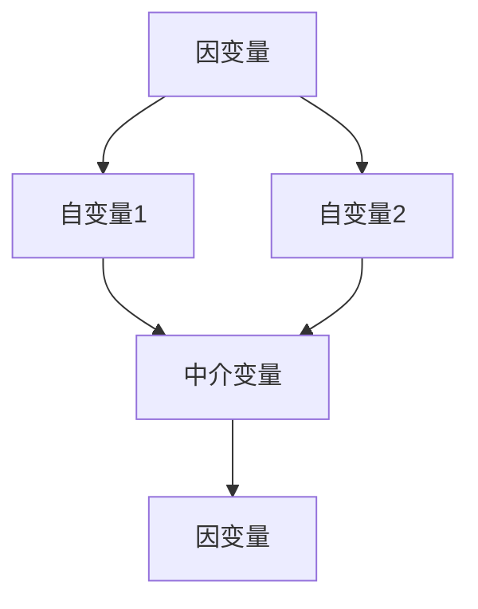
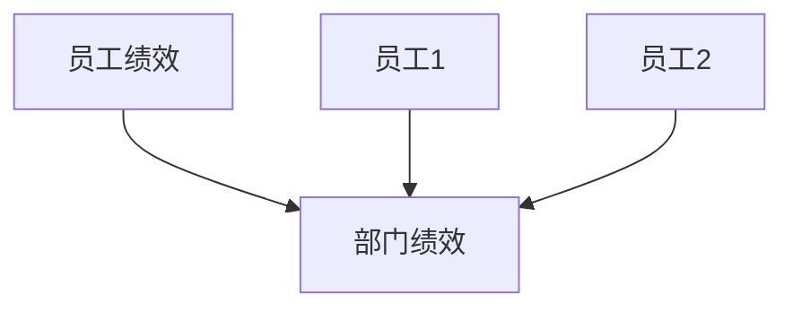
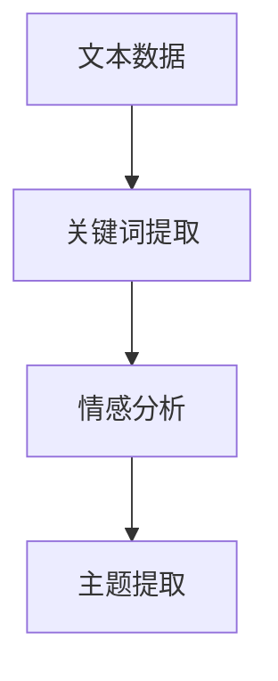
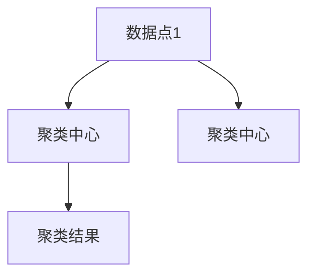
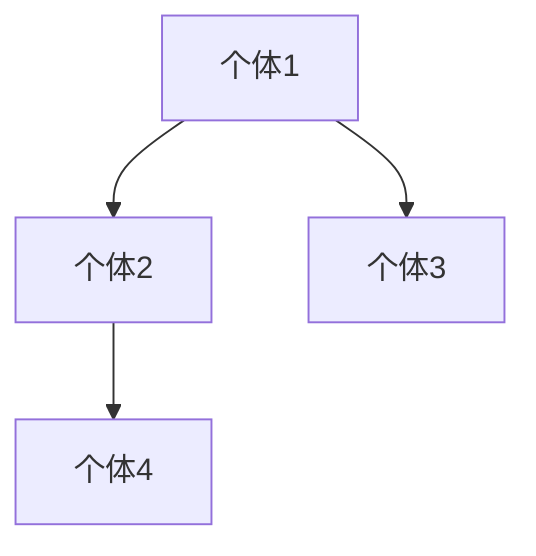

                 

# 《欲望社会网络分析师：AI驱动的群体动力学研究员》

## 文章关键词
- 群体动力学
- AI应用
- 社会网络分析
- 数据挖掘
- 群体行为预测

## 摘要
随着社交媒体的兴起和大数据技术的普及，群体动力学研究成为社会科学和计算机科学领域的热点。本文探讨了AI驱动的群体动力学分析方法，介绍了社会网络分析模型、机器学习算法和AI驱动的群体动力学模型。通过实际应用案例，分析了AI在社交媒体分析、群体行为预测和社会运动与舆论分析中的应用。最后，讨论了AI驱动的群体动力学研究方法与工具，以及面临的挑战与未来发展趋势。

-------------------------------------------------------------------

## 第一部分: AI驱动的群体动力学基础

### 第1章: 群体动力学与AI概述

#### 1.1 群体动力学的概念与历史背景

群体动力学是研究个体在群体中的相互作用及其对群体行为的影响的科学。它起源于物理学中的群体运动理论，并逐渐发展成为一个跨学科的领域，涵盖了社会科学、生物学、计算机科学等多个领域。

群体动力学的研究历史可以追溯到19世纪末和20世纪初。当时，物理学家和数学家开始关注个体之间的相互作用如何影响整个群体的行为。随着计算机技术的发展，群体动力学研究逐渐向复杂系统模拟和计算建模方向发展。

在计算机科学领域，群体动力学的研究主要集中在计算机模拟和算法设计。早期的群体动力学模型主要基于简单的规则和逻辑，例如，细胞自动机、人工生命和分布式算法。这些模型为理解和预测群体行为提供了重要工具。

#### 1.2 AI在群体动力学中的应用现状

随着人工智能（AI）技术的迅速发展，AI在群体动力学中的应用也逐渐成为研究热点。AI驱动的群体动力学研究主要集中在以下几个方面：

1. **数据驱动的群体行为预测**：利用机器学习和深度学习算法，从大规模数据中提取特征，预测群体行为。例如，通过分析社交媒体数据，预测股票市场的走势或选举结果的倾向。

2. **社会网络分析**：利用图论和网络分析技术，研究个体之间的社会关系和群体结构。通过分析社会网络中的关键节点和影响力，揭示群体行为模式。

3. **群体智能与协同优化**：研究群体中的个体如何通过协作实现全局优化。例如，在无人机编队飞行、智能交通系统和多人游戏等领域，研究群体行为优化策略。

4. **模拟与仿真**：利用计算机模拟技术，模拟群体行为和交互过程，验证理论模型和算法的有效性。

#### 1.3 欲望社会网络分析师的角色

欲望社会网络分析师是AI驱动的群体动力学研究中的一个重要角色。他们结合了社会网络分析、心理学和计算机科学的知识，通过分析个体和群体的欲望、需求和动机，预测和引导群体行为。

欲望社会网络分析师的主要任务包括：

1. **数据收集与预处理**：从各种数据源（如社交媒体、问卷调查、市场调查等）收集数据，并进行预处理，如数据清洗、特征提取等。

2. **社会网络建模**：构建个体和群体之间的社会网络模型，分析个体之间的关系和影响力。

3. **行为预测与分析**：利用机器学习和深度学习算法，预测个体和群体的行为，分析行为模式及其影响因素。

4. **策略制定与优化**：根据预测结果，制定相应的策略和措施，优化群体行为，实现目标。

在接下来的章节中，我们将深入探讨群体动力学模型、算法和实际应用案例，进一步了解AI驱动的群体动力学研究。

---

### 第2章: 群体动力学模型与算法

群体动力学模型是理解和分析群体行为的基础工具。在本章中，我们将介绍几种常见的群体动力学模型和算法，包括社会网络分析模型、机器学习与数据挖掘算法，以及AI驱动的群体动力学模型。

#### 2.1 社会网络分析模型

社会网络分析（SNA）是群体动力学研究中的一个重要分支，它通过图论和网络分析方法，研究个体之间的相互作用和社会结构。社会网络分析模型主要包括以下几种：

##### 2.1.1 基本概念与分类

社会网络分析的基本概念包括节点、边和子图。节点表示个体，边表示个体之间的关系，子图表示群体中的特定关系模式。

社会网络分析模型可以分为以下几类：

1. **图模型**：包括无向图、有向图和加权图等，用于表示个体之间的简单关系。
2. **网络结构模型**：如小世界网络、无标度网络等，用于描述社会网络的复杂结构。
3. **社会网络动力学模型**：如网络演化模型、社会影响模型等，用于分析社会网络中的动态变化。

##### 2.1.2 社会网络模型的应用

社会网络模型广泛应用于各个领域，如社交网络分析、市场营销、金融风险管理和公共卫生等领域。

1. **社交网络分析**：通过分析社交网络中的节点和边，揭示社交关系结构，如好友关系、影响力传播等。
2. **市场营销**：通过分析消费者的社交网络，了解消费者行为和偏好，优化营销策略。
3. **金融风险管理**：通过分析金融市场的社交网络，监测市场风险和危机传播。
4. **公共卫生**：通过分析疾病传播网络，预测疫情传播趋势，制定防控措施。

##### 2.1.3 社会网络分析算法

社会网络分析算法是实现社会网络分析模型的关键。以下是一些常见的社会网络分析算法：

1. **中心性度量算法**：如度中心性、紧密中心性和中间中心性等，用于评估节点的中心性。
2. **社群发现算法**：如社区发现算法、标签传播算法等，用于发现群体中的社群结构。
3. **影响力分析算法**：如影响力传播算法、关键节点识别算法等，用于评估节点的影响力。

#### 2.2 机器学习与数据挖掘算法

机器学习和数据挖掘算法是群体动力学研究的另一个重要工具。以下介绍几种常见的机器学习和数据挖掘算法：

##### 2.2.1 基于监督学习的算法

基于监督学习的算法通常用于预测和分析群体行为。以下是一些常见的监督学习算法：

1. **回归算法**：如线性回归、逻辑回归等，用于预测群体行为。
2. **分类算法**：如决策树、支持向量机等，用于分类群体行为。
3. **聚类算法**：如K均值、层次聚类等，用于发现群体中的相似性结构。

##### 2.2.2 基于无监督学习的算法

基于无监督学习的算法通常用于发现群体行为模式和特征。以下是一些常见的无监督学习算法：

1. **主成分分析（PCA）**：用于降维和特征提取。
2. **自编码器**：用于无监督特征学习和降维。
3. **聚类算法**：如K均值、层次聚类等，用于发现群体中的相似性结构。

##### 2.2.3 基于深度学习的算法

深度学习算法在群体动力学研究中具有广泛的应用。以下是一些常见的深度学习算法：

1. **卷积神经网络（CNN）**：用于图像和视频数据的处理。
2. **循环神经网络（RNN）**：用于序列数据的处理。
3. **生成对抗网络（GAN）**：用于生成和对抗数据的处理。

#### 2.3 AI驱动的群体动力学模型

AI驱动的群体动力学模型结合了社会网络分析模型、机器学习和深度学习算法，用于预测和分析群体行为。以下是一个典型的AI驱动的群体动力学模型：

1. **数据收集与预处理**：收集个体和群体行为数据，进行数据清洗和特征提取。
2. **社会网络建模**：构建个体和群体之间的社会网络模型。
3. **特征提取与选择**：利用机器学习和深度学习算法，提取和选择关键特征。
4. **行为预测与优化**：利用预测模型，预测个体和群体的行为，并优化策略。

在接下来的章节中，我们将通过实际应用案例，进一步探讨AI驱动的群体动力学模型的应用。

---

### 第3章: 社交媒体分析

社交媒体分析是群体动力学研究的一个重要应用领域，它利用AI技术分析社交媒体数据，以揭示个体和群体的行为特征和趋势。本节将介绍社交媒体数据收集与预处理、社交网络影响力分析以及实际案例分析。

#### 3.1 社交媒体数据收集与预处理

社交媒体数据收集是进行社交媒体分析的基础。以下是一些常用的社交媒体数据收集方法：

1. **API访问**：通过社交媒体平台的API接口，获取用户发布的内容、评论、点赞和分享等信息。
2. **爬虫技术**：利用网络爬虫技术，从社交媒体网站上抓取用户发布的信息。
3. **数据挖掘**：从社交媒体平台上的公开数据中，挖掘出有价值的信息。

在数据收集过程中，可能会面临以下问题：

1. **数据质量问题**：如数据缺失、噪声、错误等，需要进行数据清洗和预处理。
2. **数据格式不统一**：不同社交媒体平台的数据格式可能不同，需要统一格式，以便于后续分析。

社交媒体数据预处理的主要步骤包括：

1. **数据清洗**：去除重复数据、错误数据和无关信息。
2. **数据转换**：将数据格式转换为适合分析的格式，如CSV、JSON等。
3. **数据归一化**：对数据进行归一化处理，以便于特征提取和模型训练。

#### 3.2 社交网络影响力分析

社交网络影响力分析是社交媒体分析的核心内容之一。它旨在评估个体在社交网络中的影响力，以及影响力在网络中的传播路径。以下是一些常见的影响力分析模型和方法：

##### 3.2.1 影响力评估模型

影响力评估模型用于评估个体在社交网络中的影响力。以下是一些常见的影响力评估模型：

1. **度中心性**：评估个体在社交网络中的连接程度，连接度越高的个体影响力越大。
2. **中间中心性**：评估个体在社交网络中作为信息传递桥梁的能力，中间中心性越高的个体影响力越大。
3. **接近中心性**：评估个体在社交网络中的可达性，接近中心性越高的个体影响力越大。

##### 3.2.2 影响力传播路径分析

影响力传播路径分析旨在分析个体影响力在网络中的传播路径。以下是一些常见的方法：

1. **短路径算法**：通过计算节点之间的最短路径，分析影响力的传播路径。
2. **网络层次分析法**：通过层次分析法，将社交网络划分为不同层级，分析影响力在不同层级之间的传播。
3. **传播模型**：如随机游走模型、有向图模型等，用于模拟影响力的传播过程。

##### 3.2.3 实际案例分析

以下是一个社交媒体影响力分析的案例：

**案例背景**：某公司希望通过社交媒体分析，了解其品牌在社交网络中的影响力，并优化营销策略。

**案例分析**：

1. **数据收集**：通过API接口，收集该公司品牌在社交网络上的发布内容、评论、点赞和分享等信息。
2. **数据预处理**：清洗数据，去除重复和错误信息，统一格式。
3. **影响力评估**：利用度中心性、中间中心性和接近中心性等模型，评估品牌在不同社交网络平台上的影响力。
4. **影响力传播路径分析**：通过短路径算法和网络层次分析法，分析品牌影响力的传播路径。
5. **结果与优化**：根据分析结果，优化营销策略，提高品牌在社交网络中的影响力。

通过社交媒体分析，该公司成功了解了其在社交网络中的影响力，并制定了更有效的营销策略，提高了品牌知名度。

在接下来的章节中，我们将探讨群体行为预测和社会运动与舆论分析，进一步了解AI驱动的群体动力学应用。

---

### 第4章: 群体行为预测

群体行为预测是群体动力学研究的一个重要应用领域，它利用AI技术和数据分析方法，预测个体和群体的行为模式。本节将介绍群体行为预测模型、特征工程与特征选择、预测模型的训练与优化，以及实际案例分析。

#### 4.1 群体行为预测模型

群体行为预测模型是进行群体行为预测的核心工具。以下是一些常见的群体行为预测模型：

##### 4.1.1 预测模型的选择

选择合适的预测模型是进行群体行为预测的关键。以下是一些常见的预测模型：

1. **线性回归**：适用于简单线性关系的预测，如股票价格的走势。
2. **逻辑回归**：适用于分类问题的预测，如用户购买行为的预测。
3. **决策树**：适用于分类和回归问题，可以处理多变量和复杂关系。
4. **支持向量机（SVM）**：适用于分类问题，可以处理非线性关系。
5. **神经网络**：适用于复杂非线性关系的预测，如语音识别和图像识别。

##### 4.1.2 特征工程与特征选择

特征工程和特征选择是进行群体行为预测的重要步骤。以下是一些常见的特征工程和特征选择方法：

1. **特征提取**：从原始数据中提取有价值的信息，如文本数据中的关键词、情感极性等。
2. **特征降维**：通过降维技术，减少数据的维度，提高计算效率和模型性能。
3. **特征选择**：通过评估特征的重要性，选择对预测有重要影响的特征。
4. **特征组合**：通过组合不同的特征，生成新的特征，提高预测性能。

##### 4.1.3 预测模型的训练与优化

预测模型的训练与优化是提高预测准确性的关键步骤。以下是一些常见的训练和优化方法：

1. **训练集划分**：将数据集划分为训练集和测试集，用于训练和评估模型。
2. **模型参数调整**：通过调整模型参数，提高模型的性能。
3. **交叉验证**：通过交叉验证，评估模型的泛化能力。
4. **模型集成**：通过集成多个模型，提高预测准确性和稳定性。

#### 4.2 群体行为预测案例分析

以下是一个群体行为预测的案例：

**案例背景**：某电子商务公司希望通过预测用户行为，提高用户满意度并优化营销策略。

**案例分析**：

1. **数据收集**：收集用户行为数据，如浏览历史、购物车数据、购买记录等。
2. **特征工程**：提取用户行为特征，如浏览次数、购买频率、购买金额等。
3. **特征选择**：通过评估特征的重要性，选择对用户行为有重要影响的特征。
4. **模型训练**：选择合适的预测模型，如逻辑回归、决策树等，进行模型训练。
5. **模型优化**：通过调整模型参数，优化模型性能。
6. **预测与评估**：利用训练好的模型，预测用户行为，并评估预测准确性和稳定性。
7. **结果应用**：根据预测结果，优化营销策略，提高用户满意度。

通过群体行为预测，该公司成功提高了用户满意度，并优化了营销策略，提高了销售额。

在接下来的章节中，我们将探讨社会运动与舆论分析，进一步了解AI驱动的群体动力学应用。

---

### 第5章: 社会运动与舆论分析

社会运动与舆论分析是群体动力学研究的一个重要应用领域，它利用AI技术和数据分析方法，研究社会运动的发展阶段、舆论传播模型以及舆论监测与分析技术。本节将介绍社会运动与舆论分析的基本原理、实践方法和挑战。

#### 5.1 社会运动与舆论分析的基本原理

社会运动是群体行为的一种表现形式，它通常是由于社会、经济、政治等方面的不公和不满而引发的集体行动。舆论则是公众对某一事件或问题的看法和意见。社会运动与舆论分析的基本原理包括以下几个方面：

##### 5.1.1 社会运动的发展阶段

社会运动通常经历以下发展阶段：

1. **觉醒阶段**：个体对不公和不满产生意识，开始探讨解决问题的可能性。
2. **组织阶段**：个体逐渐形成组织，制定行动策略，动员资源。
3. **行动阶段**：组织发起抗议、示威等行动，推动社会变革。
4. **巩固阶段**：社会运动取得一定成果，组织持续发挥作用，巩固成果。

##### 5.1.2 舆论传播模型

舆论传播是公众观点和意见的传递过程。舆论传播模型通常包括以下几种：

1. **线性传播模型**：观点和意见在个体之间的单向传递。
2. **网络传播模型**：观点和意见在个体之间的多向传递，形成网络结构。
3. **群体传播模型**：观点和意见在群体内部和外部的传播，影响群体行为。

##### 5.1.3 舆论监测与分析技术

舆论监测与分析技术用于实时监测和评估舆论动态。以下是一些常见的舆论监测与分析技术：

1. **数据收集**：从社交媒体、新闻网站、论坛等渠道收集舆论数据。
2. **文本分析**：对舆论文本进行情感分析、主题分析等，提取关键信息和观点。
3. **网络分析**：利用网络分析方法，分析舆论在网络中的传播路径和影响力。
4. **预测与预警**：通过数据分析，预测舆论发展趋势，发现潜在危机。

#### 5.2 社会运动与舆论分析实践

社会运动与舆论分析在实际应用中具有广泛的应用，以下是一些典型的应用场景：

##### 5.2.1 社会运动案例分析

以下是一个社会运动案例：

**案例背景**：某城市发生大规模抗议活动，要求政府改善环境污染问题。

**案例分析**：

1. **数据收集**：从社交媒体、新闻网站等渠道收集抗议活动的数据，如发布内容、评论、点赞等。
2. **文本分析**：对收集到的数据进行分析，提取关键信息和观点，如抗议者的诉求、情绪等。
3. **网络分析**：分析抗议者在网络中的传播路径和影响力，如关键节点、传播速度等。
4. **预测与预警**：通过数据分析，预测抗议活动的进一步发展，发现潜在危机，为政府决策提供支持。

##### 5.2.2 舆论分析技术在实际应用中的挑战与解决方案

舆论分析技术在实际应用中面临以下挑战：

1. **数据质量**：舆论数据来源广泛，质量参差不齐，需要进行数据清洗和预处理。
2. **数据规模**：舆论数据量巨大，需要进行高效的数据存储和管理。
3. **算法性能**：舆论分析算法需要高效、准确，能够应对大规模数据。
4. **实时性**：舆论分析需要实时监测和预测，对系统的响应速度和性能要求较高。

为应对这些挑战，以下是一些解决方案：

1. **数据预处理**：采用数据预处理技术，如数据清洗、数据归一化等，提高数据质量。
2. **分布式计算**：采用分布式计算技术，如Hadoop、Spark等，处理大规模数据。
3. **算法优化**：采用高效的算法和模型，如深度学习、图神经网络等，提高算法性能。
4. **实时处理**：采用实时数据处理技术，如流处理框架、实时分析引擎等，提高系统的实时性。

通过社会运动与舆论分析，可以更好地理解社会运动的发展规律和舆论动态，为政府决策、社会管理提供有力支持。

在接下来的章节中，我们将探讨AI驱动的群体动力学研究方法与工具，进一步了解AI驱动的群体动力学研究。

---

### 第6章: AI驱动的群体动力学研究方法

AI驱动的群体动力学研究方法涵盖了从数据收集、预处理到模型构建、分析的全过程。在本章中，我们将详细介绍定量研究方法和定性研究方法，包括结构方程模型、多层次分析方法、文本分析技术、聚类分析方法和社会网络建模与仿真。

#### 6.1 定量研究方法

定量研究方法主要用于分析可量化的数据，通过数学模型和统计方法来揭示群体行为的规律。

##### 6.1.1 结构方程模型

结构方程模型（SEM）是一种多变量统计模型，用于分析变量之间的关系。它结合了因素分析和回归分析，能够同时处理多个变量，并检验假设模型。

**核心概念与联系**：

- **因变量和自变量**：因变量是预测目标，自变量是影响因变量的因素。
- **路径分析**：分析自变量和因变量之间的直接和间接关系。

**Mermaid流程图**：

**应用场景**：

- **市场分析**：分析消费者行为和购买决策。
- **社会网络分析**：研究社交网络中的影响力传播。

##### 6.1.2 多层次分析方法

多层次分析方法（HLM）用于分析具有嵌套数据结构的数据，如员工绩效评估数据，其中员工属于不同部门。

**核心概念与联系**：

- **嵌套数据**：数据具有层级结构，如员工-部门结构。
- **分层模型**：分析不同层次变量之间的关系。

**Mermaid流程图**：

**应用场景**：

- **人力资源管理**：分析员工绩效和部门绩效的关系。
- **教育评估**：研究学生成绩与教师教学质量的关系。

##### 6.1.3 贝叶斯网络分析

贝叶斯网络是一种概率图模型，用于表示变量之间的条件依赖关系。

**核心概念与联系**：

- **条件概率**：变量之间的依赖关系通过条件概率表示。
- **推理算法**：如贝叶斯推理、最大后验推理等，用于计算变量的概率分布。

**Mermaid流程图**：

**应用场景**：

- **风险评估**：分析金融风险和市场波动。
- **医疗诊断**：诊断疾病，如癌症。

#### 6.2 定性研究方法

定性研究方法主要用于分析非量化的数据，通过理解和解释来揭示群体行为的本质。

##### 6.2.1 文本分析技术

文本分析技术用于处理和分析文本数据，如社交媒体评论、新闻报道等。

**核心概念与联系**：

- **自然语言处理（NLP）**：提取文本中的关键词、主题和情感。
- **情感分析**：分析文本的情感极性，如正面、负面或中性。

**Mermaid流程图**：

**应用场景**：

- **社交媒体分析**：分析用户评论和趋势。
- **舆论监测**：监测公众对某一事件或问题的看法。

##### 6.2.2 聚类分析方法

聚类分析方法用于将数据分为不同的群体，以便于进一步分析。

**核心概念与联系**：

- **距离度量**：计算数据点之间的距离，如欧氏距离、曼哈顿距离等。
- **聚类算法**：如K均值、层次聚类等，用于将数据分为不同的群体。

**Mermaid流程图**：

**应用场景**：

- **市场细分**：分析消费者群体。
- **客户关系管理**：分析客户行为和偏好。

##### 6.2.3 社会网络建模与仿真

社会网络建模与仿真用于构建和分析社会网络的动态行为。

**核心概念与联系**：

- **网络模型**：构建个体和群体之间的社会网络模型。
- **仿真技术**：模拟社会网络中的动态过程。

**Mermaid流程图**：

**应用场景**：

- **社交网络分析**：分析社交网络中的影响力传播。
- **公共卫生**：模拟疾病传播路径。

通过定量和定性研究方法的结合，AI驱动的群体动力学研究能够更全面地理解群体行为，为政策制定、市场营销和社会管理提供有力支持。

---

### 第7章: AI驱动的群体动力学研究工具

AI驱动的群体动力学研究需要使用一系列的工具和技术，这些工具可以帮助研究人员进行数据收集、分析、建模和可视化。本章将介绍开源研究工具和商业研究工具，以及它们在群体动力学研究中的应用。

#### 7.1 开源研究工具

开源研究工具具有成本效益高、灵活性大和社区支持强的特点，是群体动力学研究的重要资源。

##### 7.1.1 Gephi

Gephi是一个开源的图形数据分析软件，用于可视化复杂网络和进行网络分析。

**特点与应用**：

- **可视化**：Gephi能够将复杂的社会网络数据可视化，帮助研究人员直观地理解网络结构和节点关系。
- **分析**：支持多种网络分析算法，如节点重要性、聚类系数、路径分析等。
- **应用场景**：适用于社交网络分析、生物信息学和商业网络分析。

##### 7.1.2 Netlogo

Netlogo是一个开源的多Agents模拟软件，用于模拟个体和群体之间的相互作用。

**特点与应用**：

- **模拟**：Netlogo支持编写模型脚本，模拟群体行为和相互作用。
- **可视化**：能够实时显示模拟结果，帮助研究人员理解模型行为。
- **应用场景**：适用于社会模拟、生态学研究和交通系统分析。

##### 7.1.3 Python社会网络分析库

Python社会网络分析库（如NetworkX、igraph等）是进行社会网络分析的工具集。

**特点与应用**：

- **数据分析**：提供丰富的数据分析功能，如节点重要性、路径分析、社群检测等。
- **数据处理**：支持多种数据格式，如GML、GraphML等。
- **应用场景**：适用于社交网络分析、网络科学研究和商业网络分析。

#### 7.2 商业研究工具

商业研究工具通常具有强大的功能、专业的技术和优秀的客户服务，适合企业级的研究和应用。

##### 7.2.1 Tableau

Tableau是一个商业的仪表盘和数据可视化工具，用于创建交互式数据可视化。

**特点与应用**：

- **可视化**：Tableau提供丰富的可视化类型，如图表、地图、仪表盘等，帮助研究人员直观地理解数据。
- **交互性**：支持用户交互，如筛选、钻取和过滤等，提高数据探索和分析效率。
- **应用场景**：适用于商业智能、市场营销分析和运营监控。

##### 7.2.2 Google Analytics

Google Analytics是一个商业的网站分析工具，用于监测和分析网站用户行为。

**特点与应用**：

- **用户行为分析**：提供详细的用户行为数据，如访问量、访问路径、用户来源等。
- **转化分析**：支持转化率分析和目标设定，帮助研究人员优化网站性能。
- **应用场景**：适用于电子商务、在线营销和用户行为研究。

##### 7.2.3 Hadoop与Spark

Hadoop和Spark是大数据处理和分析平台，用于处理大规模数据集。

**特点与应用**：

- **分布式计算**：支持分布式计算，能够处理海量数据。
- **数据处理**：提供多种数据处理工具，如MapReduce、Spark SQL等，提高数据处理效率。
- **应用场景**：适用于大规模数据分析和实时数据处理，如社交网络分析、金融分析和物流优化。

通过开源工具和商业工具的结合使用，研究人员可以更有效地进行AI驱动的群体动力学研究，揭示群体行为的本质和规律。

---

### 第8章: 未来展望与挑战

AI驱动的群体动力学研究正处于快速发展阶段，未来具有广阔的发展前景。然而，随着技术的进步和应用场景的扩大，研究也面临着一系列挑战。

#### 8.1 AI驱动的群体动力学研究趋势

未来AI驱动的群体动力学研究将呈现以下趋势：

1. **跨学科研究的发展**：随着多学科交叉融合的加深，群体动力学研究将涉及更多领域，如心理学、社会学、经济学等，形成更为综合的研究体系。
2. **人工智能伦理与隐私问题**：随着AI技术的应用，隐私保护和伦理问题日益凸显。未来的研究需要关注如何在保障用户隐私的前提下，进行有效的群体动力学分析。
3. **群体动力学与社会科学的结合**：AI驱动的群体动力学研究将更加注重与社会科学的结合，从理论层面和实践层面探讨群体行为与社会结构之间的关系。

#### 8.2 研究面临的挑战与对策

尽管AI驱动的群体动力学研究具有巨大潜力，但同时也面临着以下挑战：

1. **数据质量问题**：群体动力学研究依赖于大量数据，数据的质量直接影响研究的准确性。未来的研究需要关注数据收集、处理和存储的方法，提高数据质量。
2. **模型复杂度与可解释性**：随着模型的复杂度增加，如何确保模型的可解释性成为一个挑战。未来的研究需要开发可解释性强的模型，帮助研究人员理解模型的决策过程。
3. **实际应用中的挑战与解决方案**：在具体应用场景中，如社交网络分析、群体行为预测等，研究面临数据隐私、模型泛化等问题。未来的研究需要开发针对实际应用场景的解决方案，提高模型的实用性和可靠性。

#### 8.3 研究展望

未来，AI驱动的群体动力学研究将朝着以下方向发展：

1. **发展新型算法**：开发更高效、更准确的算法，提高群体动力学分析的精度和效率。
2. **构建综合平台**：建立统一的AI驱动的群体动力学研究平台，整合不同学科和技术的优势，提供全面的研究支持。
3. **加强跨学科合作**：加强各学科之间的合作，推动群体动力学研究的深入发展，为社会管理和决策提供有力支持。

通过不断克服挑战，未来AI驱动的群体动力学研究将取得更为显著的成果，为社会带来更多的价值。

---

### 附录

#### 附录 A: AI驱动的群体动力学研究资源

AI驱动的群体动力学研究涉及多个领域，以下是一些重要的研究资源和参考资料，为研究人员提供帮助。

##### A.1 研究论文与报告

- **经典论文**：《社交网络分析：方法与应用》（Social Network Analysis: Methods and Applications）—— 由 Mark E. J. Newman 著，介绍了社会网络分析的基本概念和方法。
- **最新研究动态**：通过学术期刊（如《网络科学》（Journal of Network Science））和会议（如《国际群体动力学会议》（International Conference on Complex Networks and Their Applications））获取最新研究成果。

##### A.2 开源代码与工具

- **开源项目**：GitHub 上有大量的开源社会网络分析项目，如 Gephi、NetworkX、igraph 等，可供研究人员下载和使用。
- **开源代码**：许多研究者会在个人或机构的网站上发布自己的代码，如 Netlogo 的官方代码库。

##### A.3 教育资源与学习资料

- **学术课程与讲座**：许多大学和研究机构提供相关的在线课程，如斯坦福大学和MIT的在线课程，涵盖社会网络分析、机器学习和群体动力学。
- **在线学习平台**：Coursera、edX 和 Udacity 等在线学习平台提供了丰富的相关课程和学习资源。
- **专业书籍**：《群体动力学：理论、方法与应用》（Collective Dynamics of Social Systems）——由 Jörgen W. Weibull 著，提供了群体动力学领域的全面概述。

通过利用这些资源和资料，研究人员可以深入学习和研究AI驱动的群体动力学，为实践和应用奠定坚实基础。

