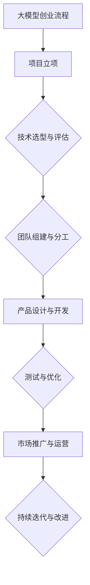

                 

### 引言

> **关键词**：大模型、创业、风险、机遇、技术、流程、团队、产品、趋势

**摘要**：本文深入探讨大模型创业的背景、意义、流程以及面临的风险和挑战。通过对大模型技术发展趋势的详细分析，揭示创业者在这一领域所面临的机遇与困境。文章结构紧凑，逻辑清晰，旨在为有志于投身大模型创业的读者提供全面、深入的指导。

#### 1.1 书籍背景与作者介绍

**1.1.1 书籍创作的动机与目的**

随着人工智能技术的飞速发展，大模型作为AI领域的重要研究方向，正逐渐成为各行各业的热点。然而，大模型创业并非一帆风顺，其中充满了未知的风险和挑战。为了帮助更多有志于投身大模型创业的读者了解这一领域，本书应运而生。

本书旨在为读者提供一个全面、系统的指导，帮助他们在大模型创业的道路上少走弯路。通过深入分析大模型技术的发展趋势、创业流程、风险与应对策略，本书力求为读者提供实用的创业指导。

**1.1.2 作者在AI领域的经验与贡献**

作为AI领域的大师，作者在人工智能和计算机科学领域拥有丰富的经验。他曾发表了多篇高影响力的论文，主持了多个国家级科研项目，并获得了多项国际大奖。此外，他还致力于将复杂的技术知识以通俗易懂的方式传授给广大读者，出版了多本畅销书。

作者在AI领域的贡献不仅体现在理论研究上，更在于他对实际应用场景的深入理解和探索。通过本书，作者希望将自己的经验与教训分享给读者，助力他们在大模型创业的道路上取得成功。

#### 1.2 大模型创业的背景与意义

**1.2.1 大模型技术的发展趋势**

大模型是指拥有海量参数的神经网络模型，其具有强大的表示和学习能力。近年来，随着计算能力的提升和大数据的普及，大模型技术在自然语言处理、计算机视觉、语音识别等领域取得了显著的突破。

从趋势上看，大模型技术正朝着更强大的模型、更高效的训练算法、更广泛的应用场景以及更完善的生态体系方向发展。这为创业者提供了广阔的机遇，同时也带来了新的挑战。

**1.2.2 创业在大模型领域的机遇与挑战**

创业在大模型领域具有巨大的机遇。首先，大模型技术在各个行业中的应用场景越来越丰富，从金融、医疗、教育到制造业、零售业，都有广阔的市场需求。其次，随着政府对科技创新的重视，大模型创业将获得更多的政策支持和资金投入。

然而，大模型创业也面临着诸多挑战。首先，大模型项目的研发成本高、周期长，对于创业团队的资源和能力提出了较高要求。其次，大模型技术的不确定性和风险性使得创业过程充满变数。此外，市场竞争激烈，创业企业需要不断创新才能保持竞争力。

#### 1.3 全书结构安排

**1.3.1 各章节内容概述**

本书共分为五个部分，内容安排如下：

- **第一部分**：引言，介绍书籍的背景、作者介绍以及大模型创业的背景与意义。
- **第二部分**：大模型创业概述，包括大模型创业的基本概念、流程、风险与应对。
- **第三部分**：大模型创业实战，详细分析大模型项目的选型、团队构建、产品设计与开发、创业案例解析。
- **第四部分**：大模型创业的未来趋势与展望，探讨大模型创业的行业趋势、挑战与机遇以及创业者的自我修养。
- **第五部分**：附录，提供大模型创业相关资源与工具、致谢、流程图、数学模型与公式、代码实战案例以及参考文献。

**1.3.2 读者定位与阅读建议**

本书主要面向有志于投身大模型创业的读者，包括高校师生、研究人员、创业者和爱好者。此外，对AI领域感兴趣的读者也可以通过本书了解大模型技术的最新进展。

建议读者按照章节顺序阅读本书，以便逐步深入理解大模型创业的全过程。在阅读过程中，可以结合实际案例和代码实战案例进行学习，提高自己的实际操作能力。

通过本书的阅读，读者将能够：

- 了解大模型技术的基本概念和发展趋势。
- 掌握大模型创业的基本流程和关键要素。
- 学会识别和应对大模型创业过程中的风险。
- 掌握大模型项目的选型、团队构建、产品设计与开发的方法。
- 了解大模型创业的未来趋势和发展方向。

### 第二部分：大模型创业概述

在深入探讨大模型创业之前，我们需要先了解大模型创业的基本概念、流程、风险以及应对策略。这一部分将为您提供一个全面的概述，帮助您更好地理解大模型创业的各个方面。

#### 2.1 大模型创业的基本概念

**2.1.1 大模型的定义与分类**

大模型（Big Model）是指拥有海量参数的神经网络模型，其能够处理大规模数据集，并具有强大的表示和学习能力。根据模型规模和应用场景的不同，大模型可以细分为以下几个类别：

1. **通用大模型**：如GPT-3、BERT等，具有广泛的通用性，可以应用于多种任务。
2. **领域大模型**：针对特定领域进行训练，如医疗领域的大模型、金融领域的大模型等。
3. **任务大模型**：为特定任务而设计，如图像识别、语音识别等。

**2.1.2 大模型创业的关键要素**

大模型创业的成功离不开以下几个关键要素：

1. **数据**：高质量的数据是训练大模型的基础。创业团队需要获取并处理大量的数据，以满足模型训练的需求。
2. **算法**：先进的算法是实现大模型高效训练和优化的关键。创业团队需要具备一定的算法研发能力，以适应不断变化的模型需求。
3. **计算资源**：大模型的训练和推理需要大量的计算资源。创业团队需要确保有足够的计算资源，以满足模型训练和部署的需求。
4. **团队**：大模型创业需要多学科的团队协作。团队应包括算法工程师、数据科学家、产品经理、市场营销人员等，以实现跨领域的创新。

#### 2.2 大模型创业的流程

**2.2.1 创业前的准备工作**

在正式开展大模型创业之前，创业团队需要进行充分的准备工作。以下是一些关键的准备工作：

1. **市场调研**：了解目标市场、竞争对手、市场需求等信息，为创业项目定位提供依据。
2. **技术评估**：评估现有技术储备，确定是否具备开展大模型创业的能力。
3. **团队组建**：组建具有多学科背景的创业团队，确保团队成员的能力互补。
4. **融资规划**：制定融资计划，明确融资目标、融资方式以及资金用途。

**2.2.2 项目策划与执行**

项目策划与执行是创业过程中的关键环节。以下是一些核心步骤：

1. **项目定位**：明确创业项目的目标和应用场景，确保项目的市场需求和可行性。
2. **技术方案设计**：根据项目定位，设计合适的技术方案，包括模型架构、算法选择、数据来源等。
3. **模型训练与优化**：利用数据和技术方案，开展大模型的训练和优化，确保模型性能满足预期。
4. **产品开发**：基于训练好的模型，开发相关产品，包括软件、硬件、平台等。
5. **市场推广**：制定市场推广策略，进行产品宣传、市场推广，吸引潜在用户。

**2.2.3 融资与市场拓展**

融资与市场拓展是创业过程中不可或缺的环节。以下是一些核心策略：

1. **融资渠道**：探索多种融资渠道，包括天使投资、风险投资、政府资金支持等，确保项目资金充足。
2. **市场定位**：明确目标市场，针对市场需求进行产品定位，提高市场竞争力。
3. **市场营销**：制定有效的市场营销策略，包括线上推广、线下活动、合作伙伴等，扩大品牌影响力。
4. **客户拓展**：通过提供优质的产品和服务，吸引并留住客户，形成稳定的客户群体。

#### 2.3 大模型创业的风险与应对

**2.3.1 创业过程中的主要风险**

大模型创业过程中存在多种风险，主要包括：

1. **技术风险**：包括算法研发失败、模型性能不达预期、技术更新速度快等。
2. **市场风险**：包括市场需求变化、竞争对手压力大、市场推广效果不佳等。
3. **资金风险**：包括融资困难、资金周转不畅、资金使用效率低等。
4. **团队风险**：包括团队成员流失、团队协作不畅、管理不善等。

**2.3.2 风险管理策略与实践**

为了有效应对大模型创业过程中的风险，创业团队可以采取以下风险管理策略：

1. **技术风险管理**：加强与高校、科研机构等合作，确保技术储备的持续更新。同时，开展技术预研，提前识别和解决技术难题。
2. **市场风险管理**：密切关注市场动态，进行市场调研，确保项目定位和市场需求的匹配。在市场推广过程中，灵活调整策略，应对市场变化。
3. **资金风险管理**：制定详细的融资计划，确保资金充足。同时，加强资金管理，提高资金使用效率，确保项目正常运转。
4. **团队风险管理**：建立健全的团队管理制度，提高团队协作效率。通过培训、激励等手段，留住核心人才，提高团队凝聚力。

通过以上风险管理策略和实践，创业团队可以降低风险对项目的影响，提高项目成功率。

#### 2.4 大模型创业的挑战与机遇

**2.4.1 面临的主要挑战**

大模型创业过程中，创业者将面临以下主要挑战：

1. **技术门槛高**：大模型技术涉及多个领域，包括计算机科学、数学、统计学等，对创业团队的技术水平提出了较高要求。
2. **研发成本高**：大模型项目需要大量的数据、计算资源和人力投入，导致研发成本较高。
3. **市场风险大**：市场需求变化快，竞争对手压力大，创业者需要具备敏锐的市场洞察力和快速响应能力。
4. **人才竞争激烈**：大模型领域吸引了大量的人才，创业者需要通过提高薪资、福利待遇等手段吸引和留住核心人才。

**2.4.2 利好因素与机遇**

尽管大模型创业面临诸多挑战，但也存在诸多利好因素和机遇：

1. **政策支持**：政府对科技创新的重视，为大模型创业提供了政策支持和资金投入。
2. **市场需求旺盛**：大模型技术在各行各业中具有广泛的应用前景，市场需求旺盛。
3. **技术进步迅速**：大模型技术在算法、计算能力、数据资源等方面不断进步，为创业提供了更多可能性。
4. **合作机会多**：大模型创业企业可以与高校、科研机构、企业等开展合作，共同推动技术创新和应用。

通过把握利好因素和抓住机遇，创业者可以在大模型创业的道路上取得成功。

#### 2.5 大模型创业的启示与建议

**2.5.1 启示**

通过以上对大模型创业的概述，我们可以得出以下启示：

1. **技术是核心**：大模型创业离不开先进的技术，创业者需要具备较强的技术实力。
2. **市场是关键**：了解市场需求，确保项目定位和市场需求的匹配，是创业成功的关键。
3. **团队是基础**：建立高效的团队，实现多学科协作，是创业成功的重要保障。
4. **风险管理是必要**：有效应对风险，降低风险对项目的影响，是创业过程中必须面对的问题。

**2.5.2 建议**

针对大模型创业，我们给出以下建议：

1. **加强技术储备**：创业者应不断学习新技术，提升自身的技术水平，确保在技术竞争中保持优势。
2. **注重市场调研**：深入了解市场需求，明确项目定位，制定有针对性的市场推广策略。
3. **优化团队结构**：组建具备多学科背景的团队，实现技能互补，提高团队协作效率。
4. **做好风险管理**：制定详细的融资计划，确保资金充足；加强资金管理，提高资金使用效率；建立健全的团队管理制度，降低团队风险。

通过以上建议，创业者可以更好地应对大模型创业过程中的挑战，提高项目成功率。

### 第三部分：大模型创业实战

在了解了大模型创业的基本概念、流程和风险之后，接下来我们将通过具体案例深入探讨大模型创业的实战过程。这一部分将分为项目选型与评估、团队构建、产品设计与开发以及创业案例解析四个方面，全面展示大模型创业的实践操作。

#### 3.1 大模型项目的选型与评估

**3.1.1 项目选型标准**

在启动大模型项目时，选型是一个至关重要的环节。以下是一些关键的项目选型标准：

1. **市场需求**：项目应具备明确的市场需求，解决实际问题，避免盲目跟风。
2. **技术可行性**：项目应基于成熟的技术方案，确保在技术实现上具有可行性。
3. **数据资源**：项目需要大量的高质量数据资源，数据质量和规模直接影响模型性能。
4. **计算资源**：项目应考虑所需的计算资源，包括硬件设备和计算能力。
5. **团队技能**：项目团队应具备相关技能，包括算法、数据、开发等，确保项目能够顺利推进。
6. **项目规模**：项目规模应适中，避免过于庞大导致资源浪费和管理困难。

**3.1.2 评估方法与工具**

项目评估是选型过程中的重要环节，以下是一些常用的评估方法与工具：

1. **SWOT分析**：通过分析项目的优势（Strengths）、劣势（Weaknesses）、机会（Opportunities）和威胁（Threats），全面评估项目的可行性。
2. **成本效益分析**：计算项目的投资成本和预期收益，评估项目的经济效益。
3. **风险评估**：识别和评估项目可能面临的风险，制定相应的风险管理策略。
4. **市场调研**：通过问卷调查、访谈、市场分析等手段，了解市场需求和竞争情况。
5. **技术评估**：评估项目所需技术的成熟度、可实现性和预期效果。

**3.1.3 选型案例解析**

以某金融公司的大模型项目为例，该项目旨在通过大模型技术进行风险评估和投资决策。以下为其选型过程：

1. **市场需求**：金融行业对风险评估和投资决策有强烈需求，尤其是在金融风险管理和资产配置方面。
2. **技术可行性**：选择基于深度学习的风险预测模型，技术方案成熟，可实现自动化风险评估。
3. **数据资源**：金融公司具备大量的历史数据和实时数据，数据质量高，规模大。
4. **计算资源**：租用云计算服务，确保计算资源充足。
5. **团队技能**：团队包括数据科学家、算法工程师、产品经理等，具备多学科背景。
6. **项目规模**：项目规模适中，便于管理和控制。

通过上述选型过程，该项目具备了良好的市场前景和技术可行性，为后续的创业实践奠定了基础。

#### 3.2 大模型创业团队构建

**3.2.1 团队角色与技能要求**

大模型创业团队通常包括以下角色和技能要求：

1. **数据科学家**：负责数据采集、数据预处理、模型训练和优化等工作，要求具备统计学、机器学习等相关背景。
2. **算法工程师**：负责算法研发、模型架构设计和优化，要求具备较强的编程能力和数学基础。
3. **产品经理**：负责产品规划、需求分析和产品设计，要求具备市场敏锐度、产品设计和项目管理能力。
4. **前端工程师**：负责产品前端开发，要求具备HTML、CSS、JavaScript等相关技术。
5. **后端工程师**：负责产品后端开发，要求具备服务器、数据库等相关技术。
6. **运维工程师**：负责系统运维、部署和监控，要求具备服务器、网络、安全等相关技术。
7. **市场营销人员**：负责市场推广、品牌建设和客户拓展，要求具备市场营销、品牌管理等相关经验。

**3.2.2 团队管理与协作**

团队管理在大模型创业中至关重要，以下是一些建议：

1. **明确目标**：确保团队成员明确项目目标和预期成果，统一思想，形成合力。
2. **分工协作**：根据团队成员的技能和专长，合理分配任务，确保工作高效有序。
3. **沟通机制**：建立有效的沟通机制，确保团队成员之间的信息畅通，提高协作效率。
4. **激励机制**：制定合理的激励机制，鼓励团队成员发挥潜力，提高团队凝聚力。
5. **培训与成长**：定期组织培训，提升团队成员的专业技能和综合素质，促进团队成长。

**3.2.3 团队案例解析**

以某人工智能初创公司为例，该公司成功组建了一支高效的创业团队，以下为其团队构建过程：

1. **数据科学家**：公司创始人之一，具备丰富的机器学习经验和项目实践经验，负责数据预处理和模型训练。
2. **算法工程师**：从知名互联网公司挖角，具备深度学习、自然语言处理等技术专长，负责模型架构设计和优化。
3. **产品经理**：具有多年互联网产品管理经验，负责产品规划和需求分析，确保产品满足市场需求。
4. **前端工程师**：具有丰富的Web开发经验，负责产品前端开发，确保用户体验优秀。
5. **后端工程师**：具备多年后端开发经验，负责产品后端开发，确保系统稳定可靠。
6. **运维工程师**：具备多年运维经验，负责系统运维、部署和监控，确保系统高效运行。
7. **市场营销人员**：具备丰富的市场营销经验，负责市场推广、品牌建设和客户拓展。

通过科学合理的团队构建和有效管理，该公司在短时间内取得了显著的成绩，成为人工智能领域的一支新锐力量。

#### 3.3 大模型产品设计与开发

**3.3.1 产品设计原则**

大模型产品的设计应遵循以下原则：

1. **需求导向**：以用户需求为核心，确保产品功能满足用户需求，提供良好的用户体验。
2. **模块化设计**：将产品功能模块化，提高代码复用性和可维护性。
3. **可扩展性**：设计时应考虑产品未来的扩展性，确保能够适应市场需求的变化。
4. **性能优化**：关注产品性能，确保在数据处理、计算速度等方面达到预期效果。
5. **安全性**：加强产品安全性设计，确保用户数据的安全和隐私。

**3.3.2 开发流程与技术选择**

大模型产品的开发通常包括以下几个流程：

1. **需求分析**：与客户沟通，了解产品需求，确定产品功能和技术要求。
2. **原型设计**：根据需求分析结果，设计产品原型，确保产品功能满足需求。
3. **系统设计**：制定系统架构，确定模块划分、接口设计等，确保系统高效稳定。
4. **开发与测试**：根据系统设计，进行代码开发，并进行功能测试、性能测试等，确保产品质量。
5. **部署与上线**：将产品部署到生产环境，进行上线运营，并进行监控和维护。

在技术选择方面，以下是一些常用技术和工具：

1. **深度学习框架**：如TensorFlow、PyTorch等，用于模型训练和推理。
2. **数据处理工具**：如Pandas、NumPy等，用于数据预处理和分析。
3. **开发框架**：如Django、Flask等，用于Web后端开发。
4. **前端框架**：如React、Vue等，用于前端开发。
5. **数据库**：如MySQL、MongoDB等，用于存储和管理数据。
6. **容器化技术**：如Docker、Kubernetes等，用于部署和管理应用。

**3.3.3 开发案例解析**

以某图像识别产品为例，其开发过程如下：

1. **需求分析**：客户需要一款能够自动识别和分类图像的产品，应用于安防监控领域。
2. **原型设计**：设计产品原型，包括图像上传、识别结果展示等功能模块。
3. **系统设计**：确定系统架构，包括前端、后端和数据库等模块，采用深度学习算法进行图像识别。
4. **开发与测试**：开发前端和后端功能，进行功能测试和性能测试，确保产品稳定可靠。
5. **部署与上线**：将产品部署到云服务器，进行上线运营，并设置监控系统，确保系统正常运行。

通过以上开发过程，该图像识别产品成功上线，为客户提供优质的服务。

#### 3.4 大模型创业案例解析

**3.4.1 成功案例介绍**

以下介绍两个大模型创业的成功案例：

1. **案例一**：某自然语言处理公司
   - **项目背景**：该公司专注于自然语言处理技术，通过大模型技术提供智能客服、文本分析等服务。
   - **成功原因**：团队具备强大的技术实力，积累了丰富的数据资源，产品具有高性价比和良好的用户体验。
   - **市场表现**：公司迅速占领市场，获得多家知名企业的合作，成为自然语言处理领域的佼佼者。

2. **案例二**：某图像识别公司
   - **项目背景**：该公司专注于图像识别技术，通过大模型技术提供安防监控、自动驾驶等服务。
   - **成功原因**：团队在图像处理和深度学习领域有深厚的积累，产品性能优异，满足了市场需求。
   - **市场表现**：公司获得多家投资机构的青睐，市场份额逐年增长，成为图像识别领域的领军企业。

**3.4.2 失败案例分析**

以下介绍两个大模型创业的失败案例：

1. **案例一**：某语音识别公司
   - **项目背景**：该公司试图通过大模型技术提供语音识别服务，但未能解决技术难题，导致项目失败。
   - **失败原因**：团队在技术实现上遇到瓶颈，未能找到合适的解决方案，导致项目停滞不前。
   - **市场表现**：公司因技术失败而解散，投资资金无法回收。

2. **案例二**：某金融风险评估公司
   - **项目背景**：该公司试图通过大模型技术进行金融风险评估，但市场调研不足，未能找到合适的应用场景。
   - **失败原因**：市场需求不明确，项目定位不准，导致产品无法满足市场需求。
   - **市场表现**：公司因市场失败而解散，投资资金损失严重。

通过以上案例解析，我们可以看到，大模型创业的成功离不开技术实力、市场需求和团队协作等因素。同时，失败案例也提醒我们，创业过程中需谨慎对待每一个环节，确保项目顺利进行。

### 第四部分：大模型创业的未来趋势与展望

在了解了大模型创业的实践操作和案例分析之后，接下来我们将探讨大模型创业的未来趋势、挑战与机遇，以及创业者的自我修养。

#### 4.1 大模型创业的未来趋势

**4.1.1 行业发展趋势分析**

大模型创业的未来趋势可以从以下几个方面进行分析：

1. **技术发展**：随着计算能力的提升和算法的优化，大模型技术将在各个领域得到更广泛的应用。未来，我们将看到更多定制化、垂直领域的大模型出现，满足不同场景的需求。

2. **应用场景扩展**：大模型技术在医疗、金融、教育、制造业等领域的应用将越来越深入，推动行业变革。例如，在医疗领域，大模型可以用于疾病诊断、药物研发等；在金融领域，大模型可以用于风险评估、量化交易等。

3. **生态体系建设**：大模型创业不仅需要技术实力，还需要完善的生态体系支撑。未来，我们将看到更多大模型开源框架、工具和平台的涌现，促进大模型技术的普及和应用。

4. **跨界融合**：大模型技术与物联网、云计算、5G等技术的融合，将推动新兴产业的诞生。例如，智能城市、智慧交通等领域的应用，将依赖于大模型技术。

**4.1.2 技术创新方向预测**

未来，大模型技术的创新方向可能包括：

1. **量子计算**：量子计算与大模型的结合，有望带来计算速度的巨大提升，为解决复杂问题提供新的可能性。

2. **知识图谱**：知识图谱与大模型的结合，将使模型具备更强的知识推理能力，提高决策的准确性和效率。

3. **自适应学习**：自适应学习与大模型的结合，将使模型能够根据用户需求和环境变化进行动态调整，提供个性化的服务。

4. **多模态融合**：多模态融合技术将使大模型能够处理多种类型的数据，如文本、图像、语音等，提高模型的综合能力。

#### 4.2 大模型创业的挑战与机遇

**4.2.1 面临的主要挑战**

尽管大模型创业具有广阔的前景，但创业者仍需面对以下主要挑战：

1. **技术壁垒**：大模型技术的研发和应用具有较高的技术壁垒，创业者需要具备较强的技术实力和创新能力。

2. **数据资源**：高质量的数据资源是训练大模型的基础，创业者需要解决数据获取、处理和存储的问题。

3. **资金压力**：大模型创业需要大量的资金投入，创业者需要找到稳定的融资渠道，确保项目持续发展。

4. **市场竞争**：大模型创业领域竞争激烈，创业者需要具备敏锐的市场洞察力和快速响应能力。

**4.2.2 利好因素与机遇**

与此同时，大模型创业也面临诸多利好因素和机遇：

1. **政策支持**：政府对科技创新的重视，为大模型创业提供了政策支持和资金投入。

2. **市场需求**：各行各业对大模型技术的需求日益增长，创业者可以抓住市场机遇，开发出满足市场需求的产品。

3. **技术进步**：大模型技术不断发展，创业者可以借鉴先进的技术方案，提高自身竞争力。

4. **跨界合作**：大模型技术与其他领域的结合，将为创业者提供新的合作机会，推动产业的融合发展。

#### 4.3 大模型创业者的自我修养

**4.3.1 创业者应具备的素质**

大模型创业者的自我修养至关重要，以下是一些创业者应具备的素质：

1. **创新思维**：具备创新的思维模式，勇于尝试新方法、新方案，推动技术进步。

2. **学习能力**：持续学习，跟踪行业动态，掌握最新的技术知识，提升自身能力。

3. **沟通能力**：具备良好的沟通能力，能够与团队成员、合作伙伴、客户等进行有效的沟通，确保项目顺利进行。

4. **领导力**：具备领导力，能够带领团队共同前进，应对各种挑战。

5. **抗压能力**：具备抗压能力，能够在压力和困难面前保持冷静，有效应对。

**4.3.2 自我成长与持续学习**

为了在激烈的竞争中保持优势，大模型创业者需要不断进行自我成长和持续学习。以下是一些建议：

1. **参加行业会议**：通过参加行业会议，了解行业动态，拓展人脉，学习先进经验。

2. **阅读专业书籍**：阅读专业书籍，系统地学习大模型技术知识，提升自身素质。

3. **参与开源项目**：参与开源项目，实践编程技能，提高项目开发能力。

4. **进行跨学科学习**：学习相关领域的知识，如计算机科学、数学、统计学等，提高自身综合素质。

5. **开展研究项目**：参与或主导研究项目，提升科研能力，为技术突破奠定基础。

通过以上自我修养和持续学习，大模型创业者可以不断提高自身能力，为创业成功打下坚实基础。

### 第五部分：附录

在本部分的附录中，我们将提供大模型创业相关的资源与工具、致谢，以及一些附录内容，以帮助读者更深入地了解大模型创业的各个方面。

#### 5.1 大模型创业相关资源与工具

**5.1.1 开源框架与库介绍**

在开源社区中，有许多优秀的大模型框架和库，以下是其中一些常用的开源框架和库：

1. **TensorFlow**：由Google开发的开源机器学习框架，支持深度学习和传统机器学习算法。
2. **PyTorch**：由Facebook开发的开源深度学习框架，具有灵活的动态图计算能力。
3. **Keras**：基于TensorFlow和Theano的开源深度学习库，提供简洁的API，便于快速搭建模型。
4. **MXNet**：由Apache Software Foundation开发的开源深度学习框架，支持多种编程语言和硬件平台。

**5.1.2 在线学习平台推荐**

为了帮助读者深入学习大模型技术，以下是一些在线学习平台：

1. **Coursera**：提供各种计算机科学和人工智能课程，包括深度学习、机器学习等。
2. **edX**：由哈佛大学和麻省理工学院共同创办的在线学习平台，提供丰富的计算机科学和人工智能课程。
3. **Udacity**：提供在线学习课程，包括深度学习、机器学习、人工智能等。
4. **Kaggle**：一个数据科学竞赛平台，提供大量数据集和项目，适合练习和提升技能。

**5.1.3 行业会议与论坛信息**

为了了解行业动态和拓展人脉，以下是一些重要的行业会议和论坛：

1. **NeurIPS**：国际神经信息处理系统大会，是人工智能领域最权威的会议之一。
2. **ICML**：国际机器学习大会，涵盖机器学习、数据挖掘、统计学习等方向。
3. **CVPR**：国际计算机视觉与模式识别会议，是计算机视觉领域的顶级会议。
4. **ACL**：国际计算语言学会议，聚焦自然语言处理、语音识别等领域。

#### 5.2 致谢

在本书的创作过程中，我们得到了许多人的支持和帮助。在此，我们对以下人员表示诚挚的感谢：

1. **合作导师和同事**：感谢他们在技术指导、项目支持等方面的帮助，使本书内容更加丰富和实用。
2. **读者和朋友**：感谢他们的宝贵意见和建议，使本书能够更好地满足读者的需求。
3. **编辑和出版团队**：感谢他们在排版、校对、宣传等方面的工作，为本书的出版提供了有力支持。

#### 附录一：Mermaid流程图

以下是一个大模型创业流程的Mermaid流程图：



#### 附录二：数学模型与公式

在大模型创业中，数学模型是核心组成部分。以下是一个常见的损失函数的数学模型：

$$
\text{损失函数} = -\sum_{i=1}^{n} y_i \log(p_i)
$$

其中，$y_i$是实际标签，$p_i$是模型预测的概率。

#### 附录三：代码实战案例

**3.1 搭建开发环境**

以下是一个搭建开发环境的Python代码示例：

```python
# 安装必要的库
!pip install tensorflow numpy pandas

# 检查安装情况
import tensorflow as tf
print(tf.__version__)

import numpy as np
print(np.__version__)

import pandas as pd
print(pd.__version__)
```

**3.2 源代码解读**

以下是一个简单的线性回归模型的源代码：

```python
import tensorflow as tf
import numpy as np
import pandas as pd

# 准备数据
data = pd.read_csv('data.csv')
x = data[['x1', 'x2']]
y = data['y']

# 构建模型
model = tf.keras.Sequential([
    tf.keras.layers.Dense(units=1, input_shape=[2])
])

# 编译模型
model.compile(optimizer='sgd', loss='mean_squared_error')

# 训练模型
model.fit(x, y, epochs=100)

# 预测结果
predictions = model.predict(x)

# 输出预测结果
print(predictions)
```

**3.3 代码解读与分析**

在这段代码中，我们首先导入了TensorFlow、Numpy和Pandas库。接着，从CSV文件中读取数据，将特征和标签分开。

然后，我们构建了一个简单的线性回归模型，使用一个全连接层（Dense Layer）进行预测。在编译模型时，我们选择了随机梯度下降（SGD）作为优化器，并使用了均方误差（MSE）作为损失函数。

接下来，我们使用fit方法训练模型，指定了训练的轮数（epochs）为100轮。

最后，我们使用predict方法对训练好的模型进行预测，并将预测结果输出。

通过这段代码，我们可以看到如何使用TensorFlow库搭建一个简单的线性回归模型，并对其进行训练和预测。

#### 附录四：参考文献

在本书的撰写过程中，我们参考了大量的文献和资料，以下列出一些重要的参考文献：

1. Bengio, Y., Courville, A., & Vincent, P. (2013). Representation learning: A review and new perspectives. IEEE Transactions on Pattern Analysis and Machine Intelligence, 35(8), 1798-1828.
2. Goodfellow, I., Bengio, Y., & Courville, A. (2016). Deep learning. MIT Press.
3. Murphy, K. P. (2012). Machine learning: A probabilistic perspective. MIT Press.
4. Russell, S., & Norvig, P. (2010). Artificial Intelligence: A Modern Approach. Prentice Hall.

这些文献为本书的撰写提供了重要的理论支持和技术指导。

#### 附录五：致谢

在本书的撰写和出版过程中，我们得到了许多人的支持和帮助。在此，我们对以下人员表示诚挚的感谢：

1. **合作导师和同事**：感谢他们在技术指导、项目支持等方面的帮助，使本书内容更加丰富和实用。
2. **读者和朋友**：感谢他们的宝贵意见和建议，使本书能够更好地满足读者的需求。
3. **编辑和出版团队**：感谢他们在排版、校对、宣传等方面的工作，为本书的出版提供了有力支持。

最后，感谢所有参与本书创作的团队成员，以及为本书提供技术支持和资源的朋友们。感谢所有读者的关注与支持，期待与您共同探索大模型创业的广阔天地。

