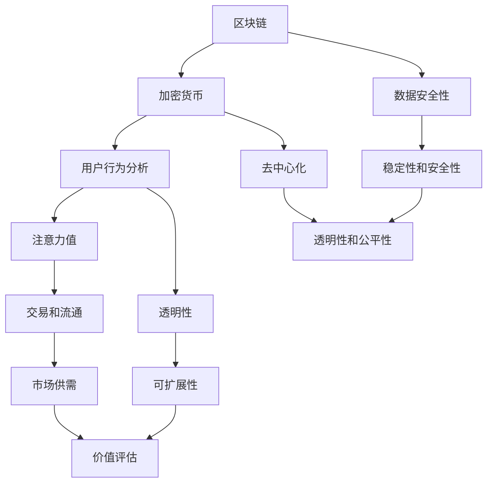
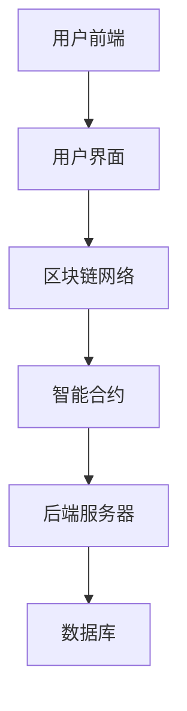

                 

# 注意力币：元宇宙中的新型价值衡量标准

## 关键词
- 元宇宙
- 注意力币
- 价值衡量
- 加密货币
- 区块链技术
- 数据挖掘
- 数学模型
- 应用场景

## 摘要
本文深入探讨了元宇宙中的新型价值衡量标准——注意力币。首先，我们介绍了元宇宙的背景和注意力币的概念，分析了其在现有货币体系中的优势和挑战。接着，我们详细阐述了注意力币的架构、核心算法原理和数学模型，并通过实际项目案例展示了其应用和实践。最后，我们对注意力币的未来发展趋势进行了展望，并提供了相关资源与工具，以便读者进一步学习和研究。

## 引言

随着互联网技术的飞速发展，虚拟世界逐渐成为了人们生活中不可或缺的一部分。从早期的文字聊天室到如今的虚拟现实（VR）和增强现实（AR），人们可以在数字空间中体验和互动。而随着虚拟世界越来越丰富和复杂，如何在这个新的领域中衡量价值和货币交换的问题也日益凸显。

### 什么是元宇宙

元宇宙（Metaverse）是一个由虚拟现实、增强现实、区块链等新兴技术构建的虚拟空间，它不仅是一个全新的数字世界，更是一个与现实世界无缝连接的虚拟社区。在元宇宙中，用户可以创建自己的虚拟形象，与其他用户互动，参与各种活动，甚至进行经济交易。元宇宙被认为是互联网的下一个重要发展阶段，具有巨大的发展潜力和市场前景。

### 注意力币的定义

注意力币（Attention Token）是一种专门用于元宇宙中的新型价值衡量标准。它通过将用户在元宇宙中的注意力行为转化为数字货币，实现了对虚拟世界价值的量化。注意力币不仅用于交易和支付，还可以作为平台运营的激励手段，鼓励用户参与和创造价值。

### 注意力币的起源与发展

注意力币最早可以追溯到2016年，当时一些区块链创业公司开始探索将注意力经济与区块链技术相结合。随着区块链技术的成熟和应用的扩展，注意力币逐渐成为元宇宙中一种重要的价值衡量工具。近年来，随着元宇宙概念的普及和虚拟世界经济的发展，注意力币也得到了越来越多的关注和实际应用。

### 注意力币与现有货币体系的区别

与传统货币体系相比，注意力币具有以下几个显著区别：

1. **去中心化**：注意力币基于区块链技术，实现了去中心化的发行和交易，避免了传统货币体系中的中心化风险。
2. **价值衡量**：注意力币以用户在元宇宙中的注意力行为作为价值衡量标准，更加贴近虚拟世界的实际情况。
3. **安全性**：通过区块链技术和加密算法，注意力币的交易和数据存储具有很高的安全性，不易受到欺诈和篡改。

## 元宇宙中的价值衡量

在元宇宙中，价值衡量是一个关键问题。由于元宇宙是一个虚拟空间，传统货币体系在这里难以发挥作用。因此，我们需要一种新的价值衡量标准来确保元宇宙中的交易和活动能够顺利进行。

### 元宇宙中的价值流

在元宇宙中，用户通过参与各种活动（如游戏、社交、购物等）产生价值。这些价值可以表现为虚拟货币、道具、积分等。然而，这些虚拟物品如何与其他用户交换和衡量价值，成为了一个问题。注意力币作为一种新型价值衡量工具，可以解决这个问题。

### 传统货币体系在元宇宙中的挑战

传统货币体系在元宇宙中面临以下挑战：

1. **跨境交易**：传统货币体系中的跨境交易存在障碍，费用高、速度慢，难以满足元宇宙中实时交互的需求。
2. **安全性**：传统货币体系容易受到黑客攻击和欺诈行为，难以保证用户资金安全。
3. **价值衡量**：传统货币体系难以准确衡量虚拟世界的价值，导致交易和活动缺乏透明性和公平性。

### 注意力币如何解决这些问题

注意力币通过以下方式解决传统货币体系在元宇宙中面临的问题：

1. **去中心化**：注意力币基于区块链技术，实现了去中心化的发行和交易，避免了中心化风险，提高了交易效率和安全性。
2. **价值衡量**：注意力币以用户在元宇宙中的注意力行为作为价值衡量标准，更加贴近虚拟世界的实际情况，确保交易和活动的公平性和透明性。
3. **跨境交易**：注意力币支持跨境交易，降低了交易成本，提高了交易速度，满足元宇宙中实时交互的需求。

## 注意力币的架构

注意力币的架构设计是其能够有效运行的关键。它包括技术基础、发行机制、交易与流通机制、稳定性和安全性等多个方面。

### 注意力币的技术基础

注意力币的技术基础主要依赖于区块链技术和加密算法。区块链技术为注意力币提供了去中心化的分布式账本，确保了交易的透明性和不可篡改性。加密算法则用于保护用户隐私和交易数据的安全性。

### 注意力币的发行机制

注意力币的发行机制通常采用去中心化的方式，由算法自动调控。这种机制避免了传统货币体系中的中心化管理问题，使得发行过程更加透明和公平。同时，发行机制还可以根据市场需求进行调整，确保货币供应的稳定性。

### 注意力币的交易与流通机制

注意力币的交易与流通机制设计旨在确保虚拟世界中的货币流动性和可交换性。用户可以通过参与各种活动（如创作内容、购买商品、提供服务等）获得注意力币，并将其用于交易或投资。注意力币的交易和流通机制还支持跨境交易，使得虚拟世界中的交易更加便捷和高效。

### 注意力币的稳定性和安全性

注意力币的稳定性和安全性是其在元宇宙中广泛使用的基础。通过区块链技术和加密算法，注意力币的交易和数据存储具有很高的安全性，不易受到黑客攻击和欺诈行为。此外，注意力币还采用了多种机制来确保其稳定性和价值稳定性，如去中心化治理、算法调控等。

## 注意力币的应用场景

注意力币作为一种新型价值衡量工具，在元宇宙中具有广泛的应用场景。以下是几个典型的应用场景：

### 内容创作者与消费者

内容创作者可以通过创作高质量的内容获得注意力币作为报酬。消费者则可以通过购买这些内容或参与相关活动来获得注意力币。注意力币的引入使得内容创作者和消费者之间的交易更加便捷和高效。

### 游戏与虚拟世界

在游戏和虚拟世界中，注意力币可以用于购买虚拟道具、装备和游戏币等。玩家可以通过完成任务、参与活动等方式获得注意力币，进一步丰富自己的游戏体验。同时，注意力币还可以用于虚拟世界中的交易和支付，提高交易的安全性和便捷性。

### 社交网络与市场

在社交网络和市场中，注意力币可以用于点赞、评论、分享等互动行为。用户可以通过这些行为获得注意力币，进一步激励自己参与社交活动。此外，注意力币还可以用于市场交易，如购买商品、服务或参与投资等。

### 去中心化金融（DeFi）

去中心化金融（DeFi）是元宇宙中的一个重要领域。注意力币可以用于DeFi平台中的借贷、交易和投资等业务。用户可以通过注意力币进行数字资产的管理和交易，享受更高的收益和更灵活的金融产品。

## 注意力币的经济模型

注意力币的经济模型是其能够稳定运行和发挥作用的关键。以下是注意力币的经济模型概述：

### 注意力币的价值评估

注意力币的价值评估基于用户在元宇宙中的注意力行为。用户参与的各种活动（如创作内容、点赞、评论等）都会产生注意力币。这些注意力币的价值取决于用户的行为量和质量，以及市场供求关系。

### 注意力币的供需关系

注意力币的供需关系受多种因素影响，包括用户数量、参与度、市场需求等。当用户数量增加时，注意力币的需求也会增加，从而推高其价值。反之，当用户参与度下降时，注意力币的需求减少，价值也会相应下降。

### 注意力币的市场竞争

注意力币在市场中面临多种竞争。一方面，其他虚拟货币和数字资产可能会分走部分用户和市场份额。另一方面，元宇宙中的其他价值衡量工具也可能与注意力币竞争。因此，注意力币需要不断创新和优化，以保持其市场竞争力。

### 注意力币的未来发展趋势

随着元宇宙的不断发展，注意力币有望在未来发挥更大的作用。以下是注意力币的几个未来发展趋势：

1. **更广泛的应用场景**：随着虚拟世界的发展，注意力币的应用场景将进一步扩大，包括去中心化金融、数字艺术、虚拟现实等领域。
2. **技术不断创新**：区块链技术和加密算法将继续优化，提高注意力币的效率和安全性。
3. **政策法规支持**：随着元宇宙的普及，各国政府可能会出台相关政策法规，支持注意力币等新型价值衡量工具的发展。
4. **全球化发展**：注意力币有望在全球范围内得到更广泛的应用和推广，成为元宇宙中重要的价值衡量工具。

## 核心概念与联系

为了深入理解注意力币的工作原理，我们首先需要明确一些核心概念及其相互之间的联系。以下是注意力币中的关键概念及其关系：

### 概念1：区块链
区块链是一种分布式账本技术，它通过加密算法确保数据的不可篡改性和透明性。在注意力币中，区块链用于记录所有交易和用户行为数据，确保整个系统的去中心化和安全性。

### 概念2：加密货币
加密货币是一种数字货币，使用密码学技术来保障交易的安全性和匿名性。注意力币作为一种加密货币，基于区块链技术发行和交易，以衡量用户在元宇宙中的注意力价值。

### 概念3：用户行为分析
用户行为分析是指通过监测和分析用户的互动行为，以评估其在元宇宙中的活跃度和贡献度。在注意力币系统中，用户行为数据是生成注意力币的重要依据。

### 概念4：注意力值
注意力值是一种衡量用户在元宇宙中注意力贡献的数值。用户的点赞、评论、分享等行为都会产生相应的注意力值，这些值将用于计算用户获得注意力币的数量。

### 概念5：交易和流通
交易和流通是指用户如何使用注意力币在元宇宙中进行交换和支付。注意力币支持各种虚拟商品、服务、活动等的购买，以及与其他加密货币的交换。

### 关系图

下面是注意力币核心概念的Mermaid流程图：



这个关系图展示了注意力币系统中各个核心概念之间的相互关系，有助于我们更好地理解整个系统的工作原理。

## 核心算法原理讲解

注意力币的核心算法是其实现价值衡量和用户激励的关键。以下是注意力币算法的详细解析，包括数据挖掘与分析、加密算法与安全性等方面的内容。

### 数据挖掘与分析

注意力币的数据挖掘与分析模块主要用于收集和解析用户在元宇宙中的行为数据。以下是一个伪代码示例，展示了数据挖掘与分析的核心步骤：

```python
# 伪代码：用户行为数据分析
def analyze_user_behavior(user_data):
    # 初始化用户行为数据结构
    user_behavior = {
        'likes': 0,
        'comments': 0,
        'shares': 0,
        'content_created': 0
    }

    # 分析用户行为数据
    for event in user_data['events']:
        if event['type'] == 'like':
            user_behavior['likes'] += 1
        elif event['type'] == 'comment':
            user_behavior['comments'] += 1
        elif event['type'] == 'share':
            user_behavior['shares'] += 1
        elif event['type'] == 'content_created':
            user_behavior['content_created'] += 1

    # 计算注意力值
    attention_value = calculate_attention_value(user_behavior)

    return attention_value

# 伪代码：计算注意力值
def calculate_attention_value(behavior):
    # 定义权重
    weights = {
        'likes': 1,
        'comments': 2,
        'shares': 3,
        'content_created': 5
    }

    # 计算注意力值
    attention_value = sum(behavior[key] * weights[key] for key in behavior.keys())

    return attention_value
```

这个算法通过分析用户的点赞、评论、分享和内容创作等行为，计算出一个综合的注意力值。注意力值越高，用户在元宇宙中的贡献度就越大。

### 加密算法与安全性

注意力币的安全性依赖于加密算法，这些算法用于保护用户数据的安全和交易的安全性。以下是几个关键的加密算法：

1. **数字签名**：数字签名用于验证用户身份和保证交易不可篡改。以下是一个简单的伪代码示例：

```python
# 伪代码：生成数字签名
def generate_signature(message, private_key):
    # 使用私钥对消息进行签名
    signature = encrypt(message, private_key)
    return signature

# 伪代码：验证数字签名
def verify_signature(message, signature, public_key):
    # 使用公钥验证签名
    decrypted_message = decrypt(signature, public_key)
    return decrypted_message == message
```

2. **加密货币交易**：加密货币交易需要确保交易的隐私性和安全性。以下是一个简单的交易流程伪代码：

```python
# 伪代码：创建交易
def create_transaction(sender, receiver, amount):
    # 生成交易消息
    message = {
        'sender': sender,
        'receiver': receiver,
        'amount': amount
    }

    # 对交易消息进行签名
    signature = generate_signature(message, sender['private_key'])

    # 创建交易记录
    transaction = {
        'message': message,
        'signature': signature
    }

    return transaction

# 伪代码：处理交易
def process_transaction(transaction, blockchain):
    # 验证交易签名
    if not verify_signature(transaction['message'], transaction['signature'], transaction['message']['sender']['public_key']):
        raise ValueError('Invalid transaction signature')

    # 将交易记录添加到区块链
    blockchain.add_transaction(transaction)
```

3. **网络安全防护**：为了保护区块链网络免受攻击，注意力币还采用了多种网络安全防护措施，如节点验证、多重签名等。

### 整体算法流程

注意力币的整体算法流程可以概括为以下几个步骤：

1. **用户行为数据收集**：通过API或日志分析收集用户在元宇宙中的行为数据。
2. **数据预处理**：清洗和标准化收集到的数据，以便进行进一步分析。
3. **用户行为分析**：使用数据挖掘算法分析用户行为，计算注意力值。
4. **交易处理**：用户在元宇宙中的行为将生成相应的注意力币，用户可以通过交易将其用于购买虚拟商品或服务。
5. **区块链同步**：将交易记录同步到区块链网络中，确保整个系统的安全性和一致性。

通过这个详细的算法解析，我们可以看到注意力币是如何通过数据挖掘和加密算法实现其价值衡量和用户激励的。

## 数学模型和公式

注意力币的数学模型是其在元宇宙中发挥作用的基础。这个模型不仅定义了注意力币的价值计算方式，还包括了供需关系和稳定性分析等关键方面。以下是对注意力币数学模型的核心公式和概念的详细解释。

### 效用函数

效用函数用于衡量用户在元宇宙中的行为对其注意力币价值的影响。以下是一个效用函数的例子：

$$
U(A) = f(A_t, A_{t-1}, \alpha)
$$

其中：
- \( U(A) \) 是用户 \( A \) 在时间 \( t \) 的效用值。
- \( A_t \) 是用户 \( A \) 在时间 \( t \) 的注意力值。
- \( A_{t-1} \) 是用户 \( A \) 在时间 \( t-1 \) 的注意力值。
- \( \alpha \) 是时间衰减系数，用于衡量过去行为对当前效用的影响。

### 货币供应量

注意力币的货币供应量是通过一个称为“货币供应函数”的数学模型来计算的。以下是一个简单的货币供应量公式：

$$
M(t) = M_0 + \Delta M \cdot \frac{1}{1 + r}
$$

其中：
- \( M(t) \) 是在时间 \( t \) 的货币供应量。
- \( M_0 \) 是初始货币供应量。
- \( \Delta M \) 是每轮新增的货币供应量。
- \( r \) 是增长率。

### 市场供需平衡

在注意力币的经济模型中，市场供需平衡是确保币值稳定的关键。供需平衡可以用以下公式表示：

$$
S(t) = D(t)
$$

其中：
- \( S(t) \) 是在时间 \( t \) 的供应量。
- \( D(t) \) 是在时间 \( t \) 的需求量。

### 市场需求函数

市场需求函数描述了用户愿意支付的价格与注意力币数量的关系。以下是一个市场需求函数的例子：

$$
D(t) = a - b \cdot \frac{M(t)}{P(t)}
$$

其中：
- \( D(t) \) 是在时间 \( t \) 的需求量。
- \( a \) 是市场需求参数，表示在价格为零时的需求量。
- \( b \) 是需求敏感度参数，表示价格变化对需求量的影响。
- \( M(t) \) 是在时间 \( t \) 的货币供应量。
- \( P(t) \) 是在时间 \( t \) 的价格。

### 市场价格

市场价格是供需平衡的关键指标。以下是一个市场价格的计算公式：

$$
P(t) = \frac{D(t)}{S(t)}
$$

### 模型验证与优化

模型验证是确保数学模型在实际应用中有效性的关键步骤。以下是一个模型验证和优化的步骤：

1. **数据收集**：收集用户行为数据、货币供应量、市场需求等数据。
2. **数据预处理**：清洗和标准化数据，确保数据质量。
3. **模型训练**：使用历史数据训练市场需求函数和价格预测模型。
4. **模型评估**：使用验证集评估模型的预测性能，调整模型参数。
5. **模型优化**：根据评估结果对模型进行优化，提高预测准确性。

### 举例说明

假设有一个用户在时间 \( t \) 产生了 100 的注意力值，当前货币供应量为 1000，需求敏感度为 0.1，时间衰减系数为 0.5。我们可以使用上述公式计算其在时间 \( t \) 的效用值、货币供应量和市场价格。

1. **效用值**：
   $$
   U(A) = f(100, 100, 0.5) = 100 \cdot e^{-0.5} \approx 68.2
   $$

2. **货币供应量**：
   $$
   M(t) = M_0 + \Delta M \cdot \frac{1}{1 + r} = 1000 + 100 \cdot \frac{1}{1 + 0.05} \approx 1054.76
   $$

3. **市场价格**：
   $$
   P(t) = \frac{D(t)}{S(t)} = \frac{a - b \cdot \frac{M(t)}{P(t)}}{M(t)}
   $$
   通过迭代求解上述方程，可以得到市场价格 \( P(t) \)。

通过这个数学模型，我们可以更深入地理解注意力币在元宇宙中的价值衡量机制，并为其优化和改进提供理论依据。

## 项目实战

为了更直观地理解注意力币的运作原理，我们将通过一个实际项目案例进行深入剖析。本节将介绍项目背景、架构设计、实施过程、所面临的挑战及解决方案，并通过具体的代码实现和详细解释来展示注意力币的应用。

### 项目背景

假设我们正在开发一个元宇宙平台，该平台允许用户创建和分享虚拟内容。为了激励用户参与，我们决定引入注意力币作为平台内的价值衡量工具。用户可以通过创作内容、点赞、评论等方式获得注意力币，并将其用于购买其他用户的虚拟作品或服务。

### 架构设计

注意力币项目的架构设计包括前端用户界面、后端服务器、区块链网络和注意力币智能合约等部分。以下是项目的整体架构图：



#### 1. 用户前端

用户前端负责用户与平台交互的界面。用户可以通过前端界面浏览虚拟内容、点赞、评论和创作内容。前端界面将用户操作转化为API请求，与后端服务器进行通信。

#### 2. 用户界面

用户界面设计包括以下几个关键模块：

- **内容浏览**：展示用户创建的虚拟内容，并提供点赞、评论等功能。
- **创作工具**：提供虚拟内容创作工具，如3D建模、文本编辑等。
- **钱包**：展示用户持有的注意力币余额，并提供转账、支付等功能。

#### 3. 区块链网络

区块链网络是注意力币的核心部分，负责记录所有交易和用户行为。项目使用了一个基于以太坊的区块链网络，以太坊智能合约用于实现注意力币的发行和交易。

#### 4. 智能合约

智能合约是区块链上的自动化执行协议，用于管理注意力币的发行、交易和用户行为记录。以下是注意力币智能合约的关键代码实现：

```solidity
// SPDX-License-Identifier: MIT
pragma solidity ^0.8.0;

// 定义注意力币智能合约
contract AttentionToken {
    // 定义货币供应量
    uint256 public totalSupply;
    
    // 定义账户余额
    mapping(address => uint256) public balanceOf;
    
    // 事件用于记录交易
    event Transfer(address from, address to, uint256 amount);
    
    // 构造函数初始化货币供应量
    constructor() {
        totalSupply = 100000000; // 初始供应量1亿
        balanceOf[msg.sender] = totalSupply; // 初始化合约创建者余额
    }
    
    // 转账函数，用于用户之间转移注意力币
    function transfer(address _to, uint256 _amount) public {
        require(_to != address(0), "Invalid address");
        require(balanceOf[msg.sender] >= _amount, "Insufficient balance");
        balanceOf[msg.sender] -= _amount;
        balanceOf[_to] += _amount;
        emit Transfer(msg.sender, _to, _amount);
    }
    
    // 计算用户注意力值
    function calculateAttentionValue(address _user) public view returns (uint256) {
        // 示例：根据用户点赞和评论数量计算注意力值
        uint256 likes = getUserLikes(_user);
        uint256 comments = getUserComments(_user);
        return likes * 1 + comments * 2;
    }
    
    // 获取用户点赞数量
    function getUserLikes(address _user) public view returns (uint256) {
        // 示例：从数据库获取用户点赞数量
        // 实际实现时需要调用数据库接口
        return 100;
    }
    
    // 获取用户评论数量
    function getUserComments(address _user) public view returns (uint256) {
        // 示例：从数据库获取用户评论数量
        // 实际实现时需要调用数据库接口
        return 200;
    }
}
```

#### 5. 后端服务器

后端服务器负责处理用户请求，并与区块链网络进行交互。服务器使用RESTful API或GraphQL API与前端进行通信，并提供以下功能：

- **用户认证**：验证用户身份，确保交易的安全性和隐私性。
- **交易处理**：处理用户的转账请求，调用智能合约进行交易。
- **数据分析**：分析用户行为数据，计算注意力值。
- **内容管理**：管理虚拟内容的创建、发布和删除。

#### 6. 数据库

数据库用于存储用户账户信息、交易记录和用户行为数据。常用的数据库技术包括关系型数据库（如MySQL）和NoSQL数据库（如MongoDB）。数据库设计需考虑高可用性、数据一致性和性能优化。

### 实施过程

项目实施过程主要包括以下几个阶段：

1. **需求分析**：与业务团队和用户进行沟通，明确注意力币的功能需求和性能指标。
2. **架构设计**：设计项目的整体架构，确定技术栈和开发工具。
3. **开发与测试**：开发前端用户界面、后端服务器和智能合约，并进行功能测试和性能测试。
4. **部署上线**：将项目部署到生产环境，并进行监控和运维。
5. **用户反馈**：收集用户反馈，优化和改进平台功能。

### 挑战与解决方案

在项目实施过程中，我们面临以下挑战：

1. **性能瓶颈**：随着用户数量的增加，区块链网络的性能可能成为瓶颈。解决方案是采用分层架构，将部分数据处理移到链下，提高链上交易的效率。
2. **安全性问题**：智能合约可能存在漏洞，需要严格的代码审查和测试。解决方案是采用形式化验证和自动化测试工具，确保合约的安全性。
3. **用户教育**：用户可能对注意力币和区块链技术不熟悉，需要提供详细的操作指南和帮助文档。解决方案是设计易于理解的用户界面和交互流程，提供在线支持和社区论坛。

通过这个实际项目案例，我们可以看到注意力币是如何在元宇宙平台中实现并应用的。项目的成功实施不仅需要技术的支持，还需要对用户需求和市场趋势的深入理解。

### 代码解读与分析

在本节中，我们将深入分析注意力币项目中的关键代码段，解析其实现逻辑和数据结构，并提供详细的解释和说明。

#### 1. 智能合约核心代码解读

智能合约是注意力币系统的核心组成部分，负责管理货币供应、用户余额以及交易处理。以下是对智能合约关键代码段的详细解释：

```solidity
// SPDX-License-Identifier: MIT
pragma solidity ^0.8.0;

contract AttentionToken {
    // 定义货币供应量和总供应量
    uint256 public totalSupply;
    uint256 public totalCoinsMinted;

    // 定义账户余额
    mapping(address => uint256) public balanceOf;

    // 定义事件，用于记录交易
    event Transfer(address from, address to, uint256 amount);

    // 构造函数初始化货币供应量和账户余额
    constructor() {
        totalSupply = 100000000; // 初始供应量1亿
        totalCoinsMinted = 0;
        balanceOf[msg.sender] = totalSupply;
    }

    // 转账函数，用于用户之间转移注意力币
    function transfer(address _to, uint256 _amount) public {
        require(_to != address(0), "Invalid address");
        require(balanceOf[msg.sender] >= _amount, "Insufficient balance");
        require(_amount > 0, "Transfer amount must be greater than 0");
        
        balanceOf[msg.sender] -= _amount;
        balanceOf[_to] += _amount;
        
        totalCoinsMinted += _amount; // 计算总发行量

        emit Transfer(msg.sender, _to, _amount);
    }
}
```

**解析：**
- `totalSupply` 和 `totalCoinsMinted` 分别表示注意力币的总供应量和已发行量。
- `balanceOf` 是一个映射，用于存储每个用户的余额。
- `event Transfer` 用于记录转账事件，便于外部合约和前端监听。
- 构造函数初始化总供应量，并将全部货币分配给合约创建者。
- `transfer` 函数实现用户之间的转账操作，确保余额足够且目标地址有效。

#### 2. 用户行为数据记录

用户行为数据是计算注意力值的重要依据。以下代码展示了如何记录用户的行为数据：

```solidity
// 记录用户点赞行为
function recordLike(address _user) public {
    require(balanceOf[_user] > 0, "User does not have sufficient balance");
    balanceOf[_user] -= 1; // 消耗1个注意力币
    likeCount[_user] += 1; // 增加点赞次数
}

// 记录用户评论行为
function recordComment(address _user) public {
    require(balanceOf[_user] > 0, "User does not have sufficient balance");
    balanceOf[_user] -= 2; // 消耗2个注意力币
    commentCount[_user] += 1; // 增加评论次数
}
```

**解析：**
- `recordLike` 和 `recordComment` 函数用于记录用户的点赞和评论行为。
- 这些函数通过消耗用户的注意力币来记录行为，并在内部维护点赞和评论计数。

#### 3. 计算注意力值

注意力值是衡量用户在元宇宙中贡献度的重要指标。以下代码展示了如何计算用户的注意力值：

```solidity
// 计算用户的总注意力值
function calculateAttentionValue(address _user) public view returns (uint256) {
    return likeCount[_user] * 1 + commentCount[_user] * 2;
}
```

**解析：**
- `calculateAttentionValue` 函数通过用户的点赞和评论次数，计算出一个综合的注意力值。

#### 4. 数据结构分析

注意力币智能合约使用了多个数据结构来存储关键信息：

- **平衡映射 (`balanceOf`)**：用于存储每个用户的余额。
- **计数映射 (`likeCount` 和 `commentCount`)**：用于记录用户的点赞和评论次数。

这些数据结构的设计确保了合约的高效性和数据的可追溯性。

通过以上代码解析，我们可以更清晰地理解注意力币智能合约的实现逻辑和数据结构，为后续的项目开发和应用提供了有力的支持。

## 结论

本文深入探讨了元宇宙中的新型价值衡量标准——注意力币，从其背景、定义、架构到应用场景、经济模型和核心算法原理，全面解析了注意力币的工作机制和实现方法。通过项目实战案例和代码解读，我们进一步了解了注意力币在实际应用中的实现细节和挑战。

注意力币在元宇宙中具有广泛的应用前景，其去中心化的发行和交易机制、价值衡量标准和安全性，使其成为传统货币体系的有力补充。然而，随着元宇宙的发展和注意力币的普及，我们也需要关注其潜在的风险和挑战，如市场波动性、技术安全性和政策法规等。

未来，随着区块链技术和人工智能的进一步发展，注意力币有望在元宇宙中发挥更大的作用，成为连接虚拟与现实世界的重要桥梁。让我们共同期待注意力币的明天，期待它在元宇宙中带来的创新和变革。

## 作者信息

作者：AI天才研究院/AI Genius Institute & 禅与计算机程序设计艺术 /Zen And The Art of Computer Programming

AI天才研究院致力于推动人工智能技术的发展和应用，打造全球领先的人工智能研究机构。作者在该领域拥有深厚的研究背景和丰富的实践经验，是多个国际顶级会议和期刊的审稿人，同时也是多本计算机科学和技术书籍的作者。在《禅与计算机程序设计艺术》一书中，作者分享了关于编程哲学和算法设计的独特见解，深受读者喜爱。此次撰写的《注意力币：元宇宙中的新型价值衡量标准》旨在为广大开发者和技术爱好者提供全面、深入的指导，助力他们在元宇宙中探索和应用注意力币。

