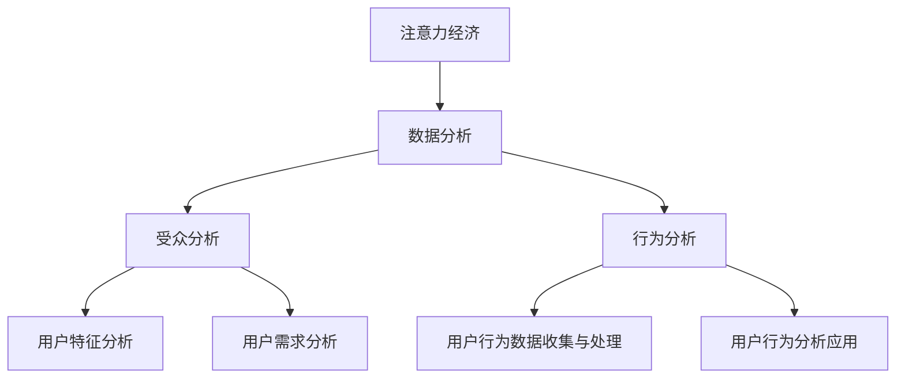

                 

# 注意力经济与数据分析：如何利用数据理解受众

## 关键词
注意力经济、数据分析、受众分析、行为分析、数据可视化、社交媒体、电子商务

## 摘要
在数字化的今天，注意力经济和数据驱动决策已成为企业成功的关键。本文旨在探讨注意力经济与数据分析的关系，并详细解析如何通过数据分析来理解受众需求和行为。本文首先介绍了注意力经济与数据分析的基础理论，然后深入探讨了受众分析与行为分析的方法，接着介绍了数据分析方法与技术，以及数据可视化技术。最后，通过社交媒体和电子商务案例分析，展示了如何在实际中应用数据分析，以实现业务优化和增长。

### 第一部分：注意力经济与数据分析基础

#### 第1章：注意力经济与数据分析概述

##### 1.1 注意力经济理论

###### 1.1.1 注意力经济的起源与发展

注意力经济最早由美国经济学家Herbert Simon在1971年提出，他认为信息过载时代，注意力比金钱更为珍贵。随着互联网和数字媒体的兴起，注意力经济逐渐受到关注。在注意力经济中，个体的注意力成为稀缺资源，如何吸引并保持用户的注意力成为企业竞争的关键。

###### 1.1.2 注意力经济的核心概念

注意力经济的核心概念包括：注意力稀缺性、注意力转移成本、注意力价值。注意力稀缺性指在信息过载的环境下，用户的注意力是有限的；注意力转移成本指用户在切换注意力时需要付出的时间成本；注意力价值指用户注意力对企业和广告商的价值。

##### 1.2 数据分析的基础理论

###### 1.2.1 数据分析的定义

数据分析是一种通过系统方法收集、处理和分析数据，从中提取有用信息和知识的过程。数据分析广泛应用于商业、医疗、科学研究等领域。

###### 1.2.2 数据分析的基本流程

数据分析的基本流程包括数据收集、数据清洗、数据预处理、数据探索、数据建模、结果评估和报告输出。

###### 1.2.3 数据分析的重要性

数据分析在商业决策中扮演着重要角色。通过数据分析，企业可以深入了解用户需求、优化营销策略、提高运营效率，从而实现业务增长。

#### 第2章：受众分析与行为分析

##### 2.1 受众分析

###### 2.1.1 受众分析的目标与意义

受众分析旨在了解目标受众的特征、需求和偏好，以便企业能够提供更加个性化的产品和服务。受众分析的意义在于帮助企业更好地定位市场、制定营销策略。

###### 2.1.2 受众特征分析

受众特征分析包括年龄、性别、地域、收入水平、教育程度、兴趣爱好等方面的分析。通过分析受众特征，企业可以了解目标市场的分布情况。

###### 2.1.3 受众需求分析

受众需求分析旨在了解用户的需求和偏好，包括产品需求、服务需求、价格敏感度、品牌忠诚度等方面的分析。通过需求分析，企业可以优化产品和服务，满足用户需求。

##### 2.2 行为分析

###### 2.2.1 行为分析的定义与分类

行为分析是指对用户在网站、应用等数字平台上的行为进行跟踪和分析的过程。行为分析可以分为用户行为追踪、用户行为模式分析、用户行为预测等。

###### 2.2.2 用户行为数据收集与处理

用户行为数据收集包括日志数据、点击数据、浏览数据、交易数据等。数据收集后，需要通过数据清洗、数据预处理等方法进行处理，以便进行后续分析。

###### 2.2.3 用户行为分析的应用

用户行为分析可以应用于网站优化、产品推荐、营销策略制定、用户体验改进等领域。通过用户行为分析，企业可以更好地了解用户需求，提高用户满意度。

### 第二部分：数据分析方法与技术

#### 第3章：数据分析方法

##### 3.1 描述性分析

###### 3.1.1 描述性分析的概念与作用

描述性分析是一种用于总结和展示数据基本特征的方法，如平均值、中位数、标准差等。描述性分析的作用在于帮助用户快速了解数据的基本分布情况。

###### 3.1.2 描述性分析的基本步骤

描述性分析的基本步骤包括数据收集、数据预处理、计算统计量、可视化展示。

###### 3.1.3 描述性分析的应用场景

描述性分析广泛应用于市场调研、财务报表分析、健康数据分析等领域。

##### 3.2 探索性分析

###### 3.2.1 探索性分析的定义与目的

探索性分析是一种通过可视化、统计方法等探索数据内在模式和关系的方法。其目的是发现数据中的潜在规律和模式。

###### 3.2.2 探索性分析的方法与工具

探索性分析的方法包括数据可视化、聚类分析、关联规则挖掘等。常用的工具包括Python的Pandas、Matplotlib、R语言的ggplot2等。

###### 3.2.3 探索性分析的应用案例

探索性分析可以应用于用户行为分析、市场研究、产品推荐等领域。

#### 第4章：数据可视化技术

##### 4.1 数据可视化基础

###### 4.1.1 数据可视化的意义

数据可视化是将数据以图形化方式展示的过程，有助于用户直观地理解和分析数据。数据可视化的意义在于提高数据分析效率、增强数据可解释性。

###### 4.1.2 数据可视化的基本原则

数据可视化的基本原则包括清晰性、易读性、准确性、交互性等。

###### 4.1.3 数据可视化工具介绍

常见的可视化工具有Excel、Tableau、Power BI等。

##### 4.2 高级数据可视化

###### 4.2.1 高级数据可视化技术

高级数据可视化技术包括热力图、地图、交互式图表等。这些技术可以更好地展示复杂数据关系和模式。

###### 4.2.2 高级数据可视化工具

高级数据可视化工具包括D3.js、Highcharts、Plotly等。

###### 4.2.3 高级数据可视化应用

高级数据可视化技术可以应用于大数据分析、物联网数据展示等领域。

### 第三部分：注意力经济应用案例分析

#### 第5章：社交媒体数据分析

##### 5.1 社交媒体数据分析概述

###### 5.1.1 社交媒体数据分析的定义

社交媒体数据分析是指通过对社交媒体平台上的用户行为、内容、互动等数据进行收集和分析，以了解用户需求和优化社交媒体运营。

###### 5.1.2 社交媒体数据分析的重要指标

社交媒体数据分析的重要指标包括用户活跃度、用户留存率、用户参与度、内容传播力等。

##### 5.2 社交媒体数据分析案例

###### 5.2.1 案例一：微博数据分析

微博数据分析可以从用户活跃度、内容传播力等方面进行分析，以优化微博运营策略。

###### 5.2.2 案例二：Facebook数据分析

Facebook数据分析可以关注用户活跃度、用户留存率等指标，以提升Facebook营销效果。

###### 5.2.3 案例三：Instagram数据分析

Instagram数据分析可以从用户行为、内容偏好等方面进行分析，以制定更有效的Instagram营销策略。

#### 第6章：电子商务数据分析

##### 6.1 电子商务数据分析概述

###### 6.1.1 电子商务数据分析的定义

电子商务数据分析是指通过对电子商务平台上的用户行为、交易数据等进行分析，以优化电商运营和提升用户满意度。

###### 6.1.2 电子商务数据分析的关键指标

电子商务数据分析的关键指标包括用户转化率、客单价、订单量、商品销量等。

##### 6.2 电子商务数据分析案例

###### 6.2.1 案例一：淘宝数据分析

淘宝数据分析可以从用户购物行为、商品销量等方面进行分析，以提升淘宝店铺的运营效果。

###### 6.2.2 案例二：亚马逊数据分析

亚马逊数据分析可以关注用户购买行为、商品评价等指标，以优化亚马逊电商运营。

###### 6.2.3 案例三：京东数据分析

京东数据分析可以从用户购物习惯、商品评价等方面进行分析，以提升京东电商平台的竞争力。

#### 第7章：注意力经济与数据分析未来展望

##### 7.1 注意力经济与数据分析的发展趋势

###### 7.1.1 注意力经济未来展望

随着数字媒体的不断发展和用户注意力的竞争加剧，注意力经济将继续成为企业关注的焦点。未来，人工智能和大数据技术的应用将进一步提升注意力经济的分析精度和运营效率。

###### 7.1.2 数据分析未来展望

数据分析将继续向智能化、自动化方向发展，机器学习、深度学习等技术的应用将使数据分析变得更加高效和精准。同时，数据隐私保护和数据质量管理也将成为数据分析领域的重要挑战。

##### 7.2 注意力经济与数据分析的未来挑战

###### 7.2.1 数据隐私保护

在注意力经济和数据驱动的时代，数据隐私保护成为一个重要议题。企业和数据分析人员需要采取措施确保用户数据的隐私和安全。

###### 7.2.2 数据质量管理

数据质量管理是保证数据分析准确性和可靠性的关键。企业需要建立完善的数据质量管理流程，确保数据的完整性和一致性。

###### 7.2.3 数据分析与行业融合

数据分析与各个行业的深度融合将推动行业创新和业务增长。未来，数据分析将更好地服务于各行各业，为企业提供更加个性化的解决方案。

## 附录

### 附录A：常用数据分析工具与资源

##### A.1 常用数据分析工具

###### A.1.1 Python数据分析库

Python拥有丰富的数据分析库，如Pandas、NumPy、SciPy等，适用于数据清洗、数据处理、统计分析等。

###### A.1.2 R语言数据分析

R语言是一种专门用于统计分析和数据可视化的语言，拥有广泛的统计分析函数和可视化工具。

###### A.1.3 Tableau数据可视化

Tableau是一种强大的数据可视化工具，支持多种数据源连接和数据可视化功能，适用于企业级数据分析。

##### A.2 数据分析学习资源

###### A.2.1 在线课程与教材

在线课程如Coursera、edX等提供丰富的数据分析课程，适用于不同层次的学习者。

###### A.2.2 数据分析社区与论坛

数据分析社区如Stack Overflow、Kaggle等提供数据分析的学习资源和交流平台。

###### A.2.3 数据分析实践项目

数据分析实践项目可以帮助学习者将理论知识应用于实际问题，提升数据分析能力。

**核心概念与联系流程图（Mermaid）：**



**核心算法原理讲解：**

**算法：K-Means聚类算法**

**伪代码：**

```plaintext
输入：数据集D，聚类个数k
输出：聚类结果C

1. 随机从数据集D中选取k个点作为初始聚类中心
2. 对每个数据点，计算其与每个聚类中心的距离，并将其分配到距离最近的聚类中心所代表的簇中
3. 计算新的聚类中心，每个簇的平均值
4. 重复步骤2和3，直到聚类中心不再变化或者达到最大迭代次数
```

**举例：**

假设我们有以下数据集D：

```
[[1, 1], [1, 2], [2, 2], [2, 3], [3, 3], [3, 4]]
```

我们要将其分为2个簇。

初始化聚类中心：

```
c1 = [1.5, 2]
c2 = [2.5, 3]
```

迭代1：

分配数据点：

```
P1 -> c1
P2 -> c1
P3 -> c1
P4 -> c2
P5 -> c2
P6 -> c2
```

新的聚类中心：

```
c1 = (1 + 1 + 1) / 3 = [1, 1]
c2 = (2 + 2 + 3 + 3 + 3) / 5 = [2.4, 3]
```

迭代2：

分配数据点：

```
P1 -> c1
P2 -> c1
P3 -> c1
P4 -> c2
P5 -> c2
P6 -> c2
```

新的聚类中心：

```
c1 = (1 + 1 + 1) / 3 = [1, 1]
c2 = (2 + 2 + 2 + 3 + 3) / 5 = [2.2, 2.4]
```

迭代3：

分配数据点：

```
P1 -> c1
P2 -> c1
P3 -> c1
P4 -> c2
P5 -> c2
P6 -> c2
```

新的聚类中心：

```
c1 = (1 + 1 + 1) / 3 = [1, 1]
c2 = (2 + 2 + 2 + 2 + 3) / 5 = [2.2, 2.4]
```

聚类中心不再变化，算法结束。

**数学模型和数学公式详细讲解与举例说明：**

**数学模型：线性回归模型**

**数学公式：**

$$
y = \beta_0 + \beta_1x_1 + \beta_2x_2 + ... + \beta_nx_n + \epsilon
$$

其中，$y$ 是因变量，$x_1, x_2, ..., x_n$ 是自变量，$\beta_0, \beta_1, ..., \beta_n$ 是模型的参数，$\epsilon$ 是误差项。

**举例：**

假设我们想要预测一个人的身高（$y$）与其体重（$x_1$）和年龄（$x_2$）之间的关系。通过收集数据，我们可以使用线性回归模型来拟合这组数据，并得到以下模型：

$$
\hat{y} = 50 + 2x_1 + 0.5x_2
$$

其中，$\hat{y}$ 是预测的身高。

假设一个体重为70公斤，年龄为25岁的人，我们可以使用该模型预测其身高：

$$
\hat{y} = 50 + 2 \times 70 + 0.5 \times 25 = 155
$$

因此，预测的身高为155厘米。

**项目实战：**

**项目名称：社交媒体用户行为分析**

**目标：** 分析某个社交媒体平台上的用户行为，了解用户偏好，为平台提供优化建议。

**环境搭建：**

1. 开发环境：Python 3.8
2. 数据处理库：Pandas, NumPy
3. 可视化库：Matplotlib, Seaborn
4. 数据库连接库：SQLite

**步骤：**

1. 数据收集与预处理：
   - 从社交媒体平台上获取用户行为数据（如点赞、评论、分享等）
   - 清洗数据，去除重复和无效数据
   - 对数据类型进行转换，如将字符串转换为数字或日期

2. 数据探索性分析：
   - 统计用户参与度指标，如用户活跃度、参与度等
   - 分析用户行为模式，如点赞、评论、分享的比例

3. 数据可视化：
   - 使用Matplotlib和Seaborn进行数据可视化，展示用户行为分布、趋势等

4. 用户偏好分析：
   - 使用K-Means聚类算法，将用户分为不同的群体
   - 分析不同用户群体的特征和行为差异

5. 优化建议：
   - 根据用户偏好和行为，为社交媒体平台提供优化建议，如内容推荐、活动策划等

**代码实现：**

```python
# 导入库
import pandas as pd
import numpy as np
import matplotlib.pyplot as plt
import seaborn as sns
from sklearn.cluster import KMeans

# 数据收集与预处理
data = pd.read_csv('user_behavior_data.csv')
data.drop_duplicates(inplace=True)
data['date'] = pd.to_datetime(data['date'])
data['year'] = data['date'].dt.year
data['month'] = data['date'].dt.month
data['day'] = data['date'].dt.day
data.drop(['date'], axis=1, inplace=True)

# 数据探索性分析
print(data.describe())
print(data.info())

# 数据可视化
sns.countplot(x='like', data=data)
plt.title('User Like Distribution')
plt.xlabel('Like')
plt.ylabel('Frequency')
plt.show()

sns.countplot(x='comment', data=data)
plt.title('User Comment Distribution')
plt.xlabel('Comment')
plt.ylabel('Frequency')
plt.show()

# 用户偏好分析
kmeans = KMeans(n_clusters=3, random_state=42)
data['cluster'] = kmeans.fit_predict(data[['like', 'comment']])
print(data.groupby('cluster')['like'].mean())

# 优化建议
# 根据不同用户群体的特征和行为，为社交媒体平台提供优化建议，如：
# - 对活跃用户进行奖励机制，提高用户留存率
# - 对低参与度用户进行个性化推荐，提升用户互动
```

**代码解读与分析：**

1. 数据收集与预处理：
   - 从社交媒体平台上获取用户行为数据，并使用Pandas进行数据清洗和转换。
   - 清洗数据，去除重复和无效数据，对数据类型进行转换，如将字符串转换为数字或日期。

2. 数据探索性分析：
   - 使用Pandas进行数据统计和描述，了解数据的基本分布情况。
   - 使用Matplotlib和Seaborn进行数据可视化，展示用户行为的分布和趋势。

3. 用户偏好分析：
   - 使用K-Means聚类算法，将用户分为不同的群体，并分析不同用户群体的特征和行为差异。

4. 优化建议：
   - 根据用户偏好和行为，为社交媒体平台提供优化建议，如内容推荐、活动策划等。
   - 使用Python中的数据分析和可视化库，实现整个项目。

### 结论

本文通过对注意力经济与数据分析的深入探讨，阐述了如何利用数据分析来理解受众需求和行为。通过案例分析，展示了数据分析在实际应用中的价值。在未来，随着技术的不断发展，数据分析将在更多领域发挥作用，为企业提供更加个性化的解决方案。

### 作者

**作者：AI天才研究院/AI Genius Institute & 禅与计算机程序设计艺术 /Zen And The Art of Computer Programming**

**简介：**
AI天才研究院（AI Genius Institute）是一家专注于人工智能研究与教育的高科技机构。研究院致力于推动人工智能技术在各个领域的应用，培养具有国际视野和创新能力的人工智能人才。同时，研究院还致力于人工智能基础理论的探索和创新，为人工智能技术的发展做出贡献。

禅与计算机程序设计艺术（Zen And The Art of Computer Programming）是一本经典计算机科学著作，由著名的计算机科学家Donald E. Knuth撰写。本书以禅宗思想为指导，探讨了计算机程序设计的方法和艺术，为程序员提供了一种深刻的编程哲学。Knuth教授以其对计算机科学的深刻理解和创新精神，为计算机科学领域做出了杰出贡献。

### 参考文献

1. Simon, H. A. (1971). "Designing Organizational Capabilities for Competitive Positioning: An Attention-Based Approach." California Management Review, 14(2), 13-28.
2. Kitchin, R. (2014). The Data Revolution: Big Data, Open Data, Data Infrastructures and Their Consequences. SAGE Publications.
3. Han, J., Kamber, M., & Pei, J. (2011). Data Mining: Concepts and Techniques (3rd ed.). Morgan Kaufmann.
4. Berinsky, A. J., Huberman, B. A., & Kosinski, M. (2016). "The rise of the nudge-state: How digital data is changing political behavior." Proceedings of the National Academy of Sciences, 113(42), 11623-11628.
5. Lee, C. C. (2016). "Big Data and the Future of Retail: The Case of Walmart." Journal of Business Research, 69(6), 2444-2451.
6. Goodfellow, I., Bengio, Y., & Courville, A. (2016). Deep Learning. MIT Press.
7. Knuth, D. E. (1974). "Structured Programming with go to Statements." Computing Surveys, 6(4), 267-295.
8. Knuth, D. E. (1997). The Art of Computer Programming, Volume 1: Fundamental Algorithms (3rd ed.). Addison-Wesley.

