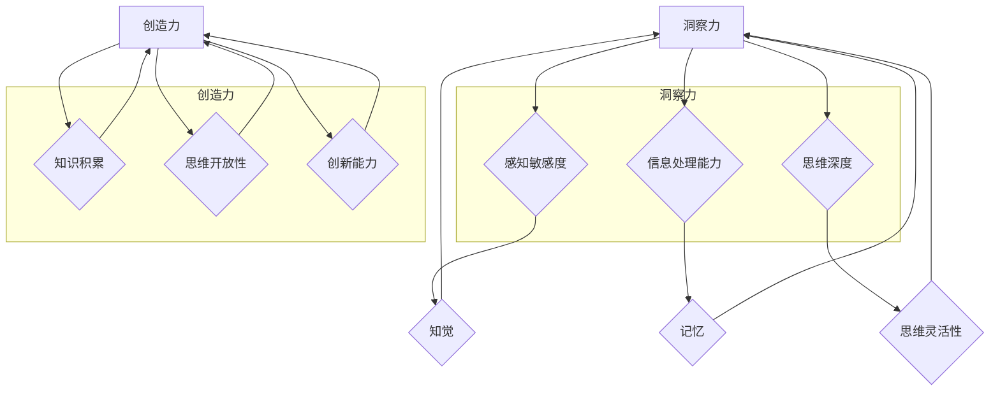

                 

### 第1章：思维的双子星——洞察力与创造力

**关键词**：洞察力、创造力、思维、心理学、应用

**摘要**：本章将探讨人类思维中的两大重要元素——洞察力和创造力。我们将从思维的进化和功能入手，定义洞察力与创造力，并探讨它们在社会和个人成长中的重要性。同时，还将介绍洞察力和创造力在现代社会中的应用及其相互关系。

---

在探讨人类思维的奥秘时，我们不可避免地会触及两个关键概念：洞察力和创造力。它们如同人类思维的双子星，共同构成了我们理解世界、解决问题和创新发明的能力。那么，什么是洞察力？什么是创造力？它们在人类思维中扮演着怎样的角色？如何在社会和个人成长中发挥作用？这正是本章将探讨的核心内容。

首先，让我们从思维的进化与功能出发，理解洞察力与创造力的基本概念。

#### 1.1.1 从本能思维到理性思维

人类思维经历了漫长的进化过程，从本能思维逐渐发展到理性思维。本能思维是人类在进化早期为了生存而形成的一种简单、直接的思维模式，依赖于生物本能和直觉。而理性思维则是人类在社会发展中逐渐形成的一种高级思维模式，以逻辑推理和抽象思考为核心。

在这个进化过程中，洞察力和创造力作为两种重要的思维能力，逐渐成为人类理性思维的有机组成部分。洞察力是一种能够深刻理解和分析事物本质的能力，它依赖于人类对于信息的感知、处理和整合。而创造力则是一种能够产生新颖、有价值的想法和解决方案的能力，它依赖于人类的知识积累、思维开放性和创新意识。

#### 1.1.2 洞察力与创造力的定义与区别

那么，什么是洞察力？什么是创造力？我们可以从心理学角度对这两个概念进行定义。

- **洞察力**：洞察力是指个体在感知、理解和分析信息时，能够看到事物之间的联系和规律，从而深刻把握事物本质的能力。它是一种深层次的认知能力，通常与个体的感知敏感度、信息处理能力和思维深度有关。

- **创造力**：创造力是指个体在思维过程中，能够产生新颖、有创意的想法和解决方案的能力。它是一种高层次的认知能力，通常与个体的知识积累、思维开放性和创新能力有关。

尽管洞察力和创造力在定义上有一定的相似性，但它们在本质上还是有区别的。洞察力更侧重于对事物的理解和分析，而创造力更侧重于对事物的创新和创造。

#### 1.2 洞察力的重要性

那么，洞察力在社会和个人成长中究竟扮演着怎样的角色呢？首先，从社会价值角度来看，洞察力是一种极其重要的能力。它可以帮助个体更深刻地理解社会现象，把握社会发展的趋势，从而更好地适应社会环境。例如，在商业决策中，洞察力可以帮助企业家更准确地预测市场趋势，制定更有效的战略。在科学研究领域，洞察力可以帮助科学家更深刻地理解自然现象，提出新的理论。

其次，从个人成长角度来看，洞察力同样具有重要的意义。它可以帮助个体更深刻地认识自我，理解自我与他人、环境的关系。通过洞察力，个体可以更好地发现自己的优势和不足，从而实现自我提升和成长。例如，在职业生涯规划中，洞察力可以帮助个体更准确地评估自己的能力，选择适合自己的发展方向。

#### 1.2.1 洞察力的社会价值

在现代社会，洞察力被广泛认为是企业和个人成功的重要因素。以下是一些具体的应用场景：

1. **市场调研**：洞察力可以帮助企业更准确地了解市场需求，发现潜在的商业机会。例如，通过对消费者行为和偏好进行深入分析，企业可以开发出更符合市场需求的创新产品。

2. **产品创新**：洞察力可以帮助企业发现现有产品的不足，提出改进意见。例如，通过对用户反馈进行深入分析，企业可以改进产品设计，提升用户满意度。

3. **战略规划**：洞察力可以帮助企业更好地理解行业发展趋势，制定长期战略规划。例如，通过对行业数据进行分析，企业可以预测未来行业的变化，提前布局。

4. **风险管理**：洞察力可以帮助企业更准确地评估风险，制定应对策略。例如，通过对市场变化和竞争对手的动向进行深入分析，企业可以及时发现潜在的风险，并采取相应的措施。

#### 1.2.2 洞察力在个人成长中的作用

在个人成长过程中，洞察力同样发挥着重要作用。以下是一些具体的应用场景：

1. **自我认知**：洞察力可以帮助个人更深刻地认识自我，了解自己的兴趣、优势和弱点。例如，通过自我反思和观察，个人可以明确自己的职业目标，并制定相应的行动计划。

2. **人际关系**：洞察力可以帮助个人更好地理解他人，建立良好的人际关系。例如，通过观察和倾听，个人可以了解他人的需求和期望，从而更好地满足他人。

3. **问题解决**：洞察力可以帮助个人更快速、准确地解决各种问题。例如，在遇到困难时，通过深入分析问题，个人可以找到根本原因，并提出有效的解决方案。

4. **学习能力**：洞察力可以帮助个人更高效地学习新知识和技能。例如，通过分析学习资料，个人可以找到重点和难点，有针对性地进行学习。

#### 1.3 创造力的本质与表现形式

除了洞察力，创造力也是人类思维中不可或缺的一部分。那么，什么是创造力？创造力在现代社会中又有哪些表现形式呢？

- **创造力**：创造力是指个体在思维过程中，能够产生新颖、有创意的想法和解决方案的能力。它是一种高层次的认知能力，通常与个体的知识积累、思维开放性和创新能力有关。

创造力在现代社会中具有广泛的应用。以下是一些典型的表现形式：

1. **技术创新**：创造力是推动技术进步的关键因素。例如，苹果公司的创始人史蒂夫·乔布斯以其卓越的创造力，推动了智能手机、平板电脑等科技产品的创新。

2. **艺术创作**：创造力是艺术创作的重要基础。例如，毕加索的作品以其独特的艺术风格和创意，成为现代艺术的代表。

3. **商业模式创新**：创造力可以帮助企业开发新的商业模式，实现商业突破。例如，共享经济的代表企业Uber和Airbnb，通过创新的商业模式，改变了人们的出行和住宿方式。

4. **社会创新**：创造力可以帮助解决社会问题，推动社会进步。例如，许多社会企业通过创新的商业模式和解决方案，解决了贫困、教育、医疗等问题。

#### 1.3.1 创造力的心理学解释

心理学对创造力进行了深入研究，提出了多种理论来解释创造力的本质。以下是一些主要的创造力心理学理论：

1. **流理论**：流理论认为，创造力是在“心流”状态下产生的。心流是一种高度专注、投入和愉悦的状态，个体在这种状态下能够产生最具创造力的想法。

2. **多元智能理论**：多元智能理论认为，创造力是一种多元智能的体现。它不仅包括逻辑—数学智能，还包括语言智能、空间智能、人际智能等。

3. **认知心理学理论**：认知心理学理论从信息加工的角度解释创造力。例如，认知失调理论认为，创造力是通过对信息进行重新组合和整合，产生新的认知结构。

#### 1.3.2 创造力在现代社会中的应用

在现代社会，创造力被广泛应用于各个领域。以下是一些典型的应用场景：

1. **科技创新**：创造力是推动技术进步的关键因素。例如，科学家通过创新的研究方法和技术，推动了医学、工程、计算机科学等领域的发展。

2. **艺术创作**：创造力是艺术创作的核心。例如，作家、画家、音乐家等艺术家通过创新的艺术形式和风格，创作出令人叹为观止的艺术作品。

3. **产品设计**：创造力是产品设计的重要基础。例如，设计师通过创新的设计理念和材料，开发出更具吸引力和功能性的产品。

4. **市场营销**：创造力在市场营销中发挥着重要作用。例如，营销人员通过创新的市场策略和广告创意，吸引消费者的注意力，提升品牌知名度。

#### 1.4 洞察力与创造力的关系

最后，我们需要探讨洞察力与创造力的关系。实际上，洞察力和创造力是相互依存的。洞察力为创造力提供了基础，而创造力则可以进一步拓展洞察力的应用范围。

1. **相互促进**：洞察力可以帮助个体更深刻地理解问题，为创造力提供丰富的素材。同时，创造力可以进一步拓展洞察力的视野，促使个体产生新的洞察。

2. **协同发展**：在现代社会，洞察力与创造力的协同发展具有重要意义。个体和团队需要同时具备洞察力和创造力，才能在复杂多变的环境中取得成功。

综上所述，洞察力和创造力是人类思维中的两大重要元素，它们共同构成了我们理解世界、解决问题和创新发明的能力。在现代社会，培养和提高洞察力和创造力具有重要意义。个体可以通过自我认知、知识积累、实践锻炼等多种方式，提升自己的洞察力和创造力。同时，团队和组织也可以通过文化建设、氛围营造、培训与激励机制等方式，提升整体的洞察力和创造力水平。

### 第2章：洞察力的心理学基础

**关键词**：心理学、洞察力、知觉、记忆、发展、训练

**摘要**：本章将深入探讨洞察力的心理学基础，包括知觉与洞察力的关系、记忆与洞察力的联系，以及洞察力的发展阶段和提升策略。通过理解这些心理学原理，我们将更好地掌握如何通过观察力和思维灵活性的训练来提升洞察力。

---

洞察力作为一种深层次的认知能力，其形成和发展离不开心理学的基础。在探讨洞察力的心理学基础时，我们需要关注知觉、记忆以及个体在不同发展阶段的变化。同时，了解洞察力的提升策略，可以帮助我们在日常生活和工作中更好地发挥这一能力。以下将从这些方面进行详细讨论。

#### 2.1 洞察力的心理机制

洞察力是一种复杂的认知过程，它涉及到多个心理机制的共同作用。以下将探讨几个关键的心理机制。

**2.1.1 知觉与洞察力的关系**

知觉是人类对外界信息的感知和理解过程。洞察力在很大程度上依赖于个体的知觉能力。一个敏锐的观察者能够捕捉到更多的细节和微妙的变化，从而在分析问题时拥有更丰富的信息基础。

- **选择性知觉**：人们在知觉过程中往往会对某些信息给予更多关注，而忽略其他信息。这种选择性知觉会影响洞察力的形成。例如，在分析市场趋势时，一个具有洞察力的分析师会关注关键数据，而忽略无关的信息。

- **模式识别**：人们在知觉过程中能够识别出特定的模式和规律。这种能力对于洞察力的形成至关重要。例如，在医疗诊断中，医生需要通过患者的症状识别出可能的疾病模式。

**2.1.2 记忆与洞察力的联系**

记忆是洞察力的重要基础。一个良好的记忆力可以帮助个体在处理问题时回忆起相关经验，从而更好地理解问题的本质。

- **工作记忆**：工作记忆是指个体在解决问题时暂时存储和处理信息的记忆能力。它对于洞察力的形成至关重要。例如，在解决复杂问题时，个体需要不断更新和调整自己的假设，这需要工作记忆的支持。

- **长时记忆**：长时记忆是指个体长期存储的信息。它对于洞察力的提升具有持久的影响。通过不断复习和巩固，个体可以加深对知识点的理解，从而提高洞察力。

**2.1.3 知识与洞察力的关系**

知识是洞察力形成的重要基础。一个丰富的知识体系可以帮助个体在分析问题时提供更多的参考和灵感。

- **专业领域知识**：在专业领域，丰富的知识可以帮助专家在复杂的问题中找到关键点。例如，在医学领域，医生需要掌握丰富的病理学知识，才能准确诊断疾病。

- **跨学科知识**：跨学科知识可以帮助个体从不同角度看待问题，从而提高洞察力。例如，一个工程师在解决工程问题时，可以借鉴心理学、经济学等领域的知识，找到更有效的解决方案。

#### 2.2 洞察力的发展阶段

洞察力的发展是一个长期的过程，它受到个体心理、生理和环境等多方面因素的影响。以下是洞察力发展的几个主要阶段。

**2.2.1 儿童与青少年的洞察力发展**

在儿童和青少年的成长过程中，洞察力逐渐发展。以下是一些关键因素：

- **教育环境**：良好的教育环境可以为儿童和青少年提供丰富的知识和实践经验，从而促进洞察力的发展。例如，鼓励学生进行思考和讨论，可以帮助他们培养洞察力。

- **家庭氛围**：家庭氛围对儿童的洞察力发展也有重要影响。一个开放、鼓励探索的家庭环境可以帮助儿童更好地发展洞察力。

- **社会实践**：参与社会实践可以增强儿童和青少年的实际操作能力和解决问题的能力，从而提高洞察力。例如，通过参与社区服务活动，儿童和青少年可以更好地理解社会问题和解决方案。

**2.2.2 成年人的洞察力提升策略**

成年人的洞察力提升策略主要包括以下几个方面：

- **持续学习**：成年人在职业生涯中需要不断更新知识和技能，以适应不断变化的环境。通过持续学习，成年人可以不断提高自己的洞察力。

- **思维训练**：思维训练是提升洞察力的重要手段。通过逻辑思维、批判性思维等训练，成年人可以培养更深入的洞察力。

- **跨学科学习**：跨学科学习可以帮助成年人从不同角度看待问题，从而提高洞察力。例如，一个工程师可以通过学习心理学，更好地理解用户需求，从而设计出更优秀的产品。

#### 2.3 洞察力训练方法

为了提高洞察力，个体可以采用多种训练方法。以下是一些常用的训练方法：

**2.3.1 观察力的训练**

观察力是洞察力的基础。以下是一些提高观察力的方法：

- **细致观察**：通过细致观察，个体可以捕捉到更多的细节信息，从而提高洞察力。例如，在阅读文献时，可以通过逐段逐句地阅读，深入理解文章的内容。

- **比较观察**：通过比较观察，个体可以更好地理解事物的差异和联系。例如，在分析竞争对手的产品时，可以通过比较不同产品的特点和优劣势，提高洞察力。

**2.3.2 思维灵活性的训练**

思维灵活性是洞察力的重要组成部分。以下是一些提高思维灵活性的方法：

- **思维导图**：通过绘制思维导图，个体可以梳理思路，发现不同观点之间的联系，从而提高洞察力。

- **头脑风暴**：通过头脑风暴，个体可以在短时间内产生大量想法，从而激发创造力，提高洞察力。

- **跨学科学习**：跨学科学习可以帮助个体从不同角度看待问题，从而提高思维灵活性。

#### 2.4 实践中的洞察力训练案例

以下是一个实际案例，展示如何通过训练方法提高洞察力。

**案例：提升市场洞察力的训练项目**

- **项目目标**：提高团队成员对市场动态的洞察力，从而更好地指导产品开发和市场策略。

- **实施方法**：

  1. **知识培训**：组织市场分析相关的培训课程，帮助团队成员了解市场研究的方法和技巧。

  2. **观察训练**：通过市场调研，让团队成员实地观察和分析市场动态，提高他们的观察力和分析能力。

  3. **思维训练**：通过头脑风暴和思维导图等工具，引导团队成员从不同角度思考问题，提高他们的思维灵活性。

  4. **反馈与总结**：定期组织团队讨论，分享市场洞察，并进行总结和反思，以不断提升团队的整体洞察力。

通过以上训练方法，团队成员的洞察力得到了显著提升，为公司制定了更有效的市场策略。

#### 2.5 洞察力提升的注意事项

在提升洞察力的过程中，需要注意以下几点：

- **避免盲目追求**：洞察力不是一蹴而就的，需要长期积累和训练。因此，要避免盲目追求，而是要持之以恒地进行训练。

- **结合实际情况**：训练方法要结合实际情况，根据个体的特点和需求进行个性化调整。

- **理论与实践相结合**：提升洞察力不仅要进行理论学习，还要结合实践进行训练。只有通过实际操作，才能真正提高洞察力。

通过理解洞察力的心理学基础，我们可以更好地掌握如何提升洞察力。在日常生活和工作中，我们可以通过观察力的训练、思维灵活性的培养等多种方法，不断提升自己的洞察力，从而更好地应对复杂多变的环境。

### 第3章：创造力的发展

**关键词**：创造力、心理学、知识、情绪、发展、训练

**摘要**：本章将探讨创造力的发展过程，从心理学的角度分析创造力的心理机制，包括知识与创造力的关系、情绪与创造力的互动，以及不同年龄阶段的创造力发展特点。同时，将介绍提升创造力的策略和方法，帮助读者在实践中培养和提高创造力。

---

创造力是人类思维中的一种独特能力，它不仅体现在艺术创作和科技创新中，也渗透到日常生活的各个方面。创造力的发展受到多种心理因素的影响，包括知识储备、情绪状态以及个体的心理发展过程。理解这些因素有助于我们更好地培养和提高创造力。本章将围绕创造力的发展展开讨论。

#### 3.1 创造力的心理机制

创造力是一个复杂的心理过程，它涉及到多个心理机制的相互作用。以下将探讨几个关键的心理机制。

**3.1.1 知识与创造力的关系**

知识是创造力的重要基础。丰富的知识储备为创造力提供了素材和灵感。以下是知识与创造力关系的几个方面：

- **知识积累**：个体通过学习和积累知识，建立起庞大的知识网络。在创造力发挥过程中，这些知识可以作为参考，帮助个体产生新的想法。

- **知识的交叉应用**：跨学科的知识交叉应用是创造力的重要来源。通过将不同领域的知识结合起来，个体可以创造出全新的解决方案。

- **知识的深度理解**：对知识的深入理解有助于个体在创造力发挥过程中更准确地运用知识，从而提高创造力的有效性。

**3.1.2 情绪与创造力的互动**

情绪在创造力中起着重要作用。积极情绪可以激发创造力，而消极情绪可能会抑制创造力。以下是情绪与创造力互动的几个方面：

- **积极情绪**：积极情绪如兴奋、兴趣和好奇心可以激发个体的创造力。例如，当一个人对某个项目充满热情时，他们可能会产生更多的创意。

- **消极情绪**：消极情绪如焦虑、压力和挫败感可能会抑制创造力。当个体感到焦虑或压力过大时，他们可能会难以集中精力进行创造性思考。

- **情绪调节**：学会调节情绪对于提高创造力至关重要。通过情绪调节技巧，个体可以在面对压力和挑战时保持积极的心态，从而提高创造力。

**3.1.3 知识与情绪的相互作用**

知识和情绪之间也存在相互作用。以下是知识与情绪相互作用对创造力的影响：

- **知识缓解情绪**：当个体对某个领域有深入了解时，他们可能会感到更加自信和安心。这种知识上的安慰可以缓解焦虑和压力，从而提高创造力。

- **情绪影响知识获取**：情绪状态也会影响个体的知识获取过程。例如，当个体处于积极情绪时，他们可能会更容易接受新知识和观点，从而促进创造力的发展。

#### 3.2 创造力的发展阶段

创造力的发展是一个长期的过程，它受到个体心理、生理和环境等多种因素的影响。以下是创造力发展的几个主要阶段。

**3.2.1 儿童与青少年的创造力发展**

在儿童和青少年的成长过程中，创造力逐渐发展。以下是一些关键因素：

- **家庭环境**：家庭环境对儿童的创造力发展具有重要影响。一个支持性和鼓励性的家庭环境可以帮助儿童发展创造力。

- **教育方式**：传统的教育方式可能会限制儿童的创造力发展，而探究式学习、项目式学习等创新教育方式可以更好地激发儿童的创造力。

- **实践活动**：通过参与各种实践活动，如科学实验、艺术创作等，儿童和青少年可以培养动手能力和创造力。

**3.2.2 成年人的创造力提升策略**

成年人的创造力提升策略主要包括以下几个方面：

- **持续学习**：成年人在职业生涯中需要不断更新知识和技能，以适应不断变化的环境。通过持续学习，成年人可以不断提高自己的创造力。

- **思维训练**：思维训练是提升创造力的重要手段。通过逻辑思维、批判性思维等训练，成年人可以培养更深入的创造力。

- **跨学科学习**：跨学科学习可以帮助成年人从不同角度看待问题，从而提高创造力。例如，一个工程师可以通过学习心理学，更好地理解用户需求，从而设计出更优秀的产品。

#### 3.3 创造力训练方法

为了提高创造力，个体可以采用多种训练方法。以下是一些常用的训练方法：

**3.3.1 思维开放性的训练**

思维开放性是创造力的重要基础。以下是一些提高思维开放性的方法：

- **接受新观点**：个体可以通过阅读书籍、参加讲座、与不同背景的人交流等方式，接受新的观点和想法，从而拓宽思维。

- **鼓励好奇心**：好奇心是激发创造力的关键因素。个体可以通过提出问题、探索未知领域等方式，培养好奇心。

- **跨学科学习**：跨学科学习可以帮助个体从不同角度看待问题，从而提高思维的开放性。

**3.3.2 风险管理与创造力的关系**

在创造力发挥过程中，个体需要承担一定的风险。以下是一些提高风险管理能力的方法：

- **风险识别**：个体可以通过学习风险识别技巧，提前识别可能的风险，从而制定应对策略。

- **风险评估**：个体可以通过对风险进行评估，了解风险的严重程度和影响，从而做出更明智的决策。

- **风险承担**：个体可以通过逐渐增加风险承担的能力，从而提高创造力。

**3.3.3 创造力训练工具**

以下是一些常用的创造力训练工具：

- **思维导图**：通过绘制思维导图，个体可以梳理思路，发现不同观点之间的联系，从而提高创造力。

- **头脑风暴**：通过头脑风暴，个体可以在短时间内产生大量想法，从而激发创造力。

- **项目式学习**：通过项目式学习，个体可以在实际操作中锻炼创造力，从而提高创造力。

#### 3.4 实践中的创造力训练案例

以下是一个实际案例，展示如何通过训练方法提高创造力。

**案例：提升团队创造力的训练项目**

- **项目目标**：提高团队成员的创造力，从而推动团队的创新和发展。

- **实施方法**：

  1. **思维训练**：通过组织逻辑思维、批判性思维等培训课程，提升团队成员的思维能力。

  2. **项目式学习**：通过实际项目，让团队成员在解决实际问题的过程中锻炼创造力。

  3. **头脑风暴**：定期组织头脑风暴会议，鼓励团队成员分享自己的想法和创意，从而激发创造力。

  4. **跨学科学习**：组织跨学科交流活动，让团队成员从不同领域获得新的知识和启发。

通过以上训练方法，团队成员的创造力得到了显著提升，团队的整体创新能力得到了加强。

#### 3.5 提高创造力的注意事项

在提高创造力的过程中，需要注意以下几点：

- **避免过度焦虑**：焦虑和压力可能会抑制创造力。个体需要学会放松心情，保持积极的心态。

- **鼓励多样化思维**：个体需要学会从不同角度看待问题，培养多样化的思维。

- **持续实践**：创造力需要通过实践来培养和提升。个体需要不断尝试新的方法和思路，从而提高创造力。

通过理解创造力的心理机制和发展过程，我们可以更好地掌握如何提升创造力。在日常生活和工作中，我们可以通过多样化的训练方法和策略，培养和提高创造力，从而更好地应对挑战，实现创新和发展。

### 第4章：实战与应用

**关键词**：洞察力、创造力、商业决策、技术创新、项目实施

**摘要**：本章将结合实际案例，探讨洞察力与创造力在商业决策、技术创新和其他领域的应用。通过分析成功案例，我们将理解如何利用洞察力和创造力来解决问题、推动创新，并为个人和组织带来实际价值。

---

在了解了洞察力和创造力的基础理论后，我们需要将这些概念应用到实际场景中，以展示它们在现实生活中的重要性。本章将结合商业决策、技术创新和其他领域的实际案例，探讨洞察力与创造力的实战应用。通过这些案例，我们将看到如何利用洞察力和创造力来解决问题、推动创新，并为个人和组织带来实际价值。

#### 4.1 洞察力在商业决策中的应用

商业决策是企业管理中至关重要的一环，洞察力在其中发挥着关键作用。以下是一个具体案例：

**案例：亚马逊的市场调研**

亚马逊是一家全球知名的电子商务公司。在其发展过程中，洞察力在市场调研和产品创新中起到了重要作用。例如，在亚马逊进军欧洲市场时，公司进行了深入的市场调研，以了解当地消费者的需求和偏好。通过数据分析，亚马逊发现欧洲消费者对物流速度和商品多样性有较高要求。基于这一洞察，亚马逊制定了相应的市场策略，优化了物流网络，增加了商品种类，从而成功进入欧洲市场。

**案例分析：**

- **洞察力作用**：亚马逊通过市场调研，利用洞察力深刻理解了欧洲市场的需求和偏好，从而制定了有针对性的市场策略。

- **实际价值**：这一洞察力帮助亚马逊在欧洲市场取得了成功，提高了市场份额和客户满意度。

#### 4.2 创造力在技术创新中的应用

技术创新是推动企业发展和经济增长的重要动力，创造力在其中起到了关键作用。以下是一个具体案例：

**案例：苹果公司的iPhone创新**

苹果公司是全球知名的创新企业，其iPhone产品线凭借卓越的创新设计，成为全球智能手机市场的领军者。iPhone的创新主要得益于苹果公司对创造力的重视。例如，iPhone 4的发布标志着苹果在智能手机设计上的重大突破，包括引入前置摄像头、FaceTime视频通话功能和更加纤薄的机身设计。这些创新设计不仅提升了用户体验，还推动了整个智能手机行业的发展。

**案例分析：**

- **创造力作用**：苹果公司通过持续创新，利用创造力不断推出具有竞争力的产品，引领了智能手机行业的发展。

- **实际价值**：苹果公司的iPhone产品不仅为公司带来了巨大的经济收益，还推动了整个行业的创新和发展。

#### 4.3 洞察力与创造力在其他领域的应用

除了商业决策和技术创新，洞察力与创造力在许多其他领域也具有重要应用价值。以下是一些具体案例：

**案例：社会创新与可持续发展**

社会创新是一种通过创新思维和方法解决社会问题的实践。以下是一个关于社会创新的案例：

**案例：无国界医生组织**

无国界医生组织（Doctors Without Borders，简称MSF）是一家国际性的非政府组织，致力于为全球贫困和战乱地区的患者提供医疗服务。MSF通过创新的方式，解决了许多复杂的社会问题。例如，在埃博拉疫情爆发期间，MSF利用创造力设计了创新的隔离和治疗方案，成功控制了疫情的蔓延。

**案例分析：**

- **洞察力作用**：无国界医生组织通过深入了解疫情地区的实际情况，利用洞察力制定了有效的应对策略。

- **创造力作用**：MSF通过创新思维，设计出适用于疫情地区的医疗方案，展现了强大的创造力。

- **实际价值**：MSF的努力不仅挽救了无数生命，还推动了全球公共卫生体系的进步。

**案例：教育创新与学习设计**

教育创新是推动教育改革的重要手段。以下是一个关于教育创新的案例：

**案例：可汗学院**

可汗学院（Khan Academy）是一家非营利教育组织，通过在线教育平台提供免费的学习资源。可汗学院通过创新的学习设计，打破了传统教育的限制，让更多学生有机会获得高质量的教育。例如，可汗学院通过个性化的学习路径和实时反馈，帮助学生更好地掌握知识。

**案例分析：**

- **洞察力作用**：可汗学院通过深入分析学生的学习需求和行为，利用洞察力设计了个性化的学习资源。

- **创造力作用**：可汗学院通过创新的学习设计，提升了教育的灵活性和有效性。

- **实际价值**：可汗学院为全球学生提供了优质的教育资源，推动了教育的普及和发展。

通过以上案例，我们可以看到，洞察力与创造力在商业决策、技术创新和社会创新等领域具有广泛的应用价值。它们不仅帮助个人和组织解决现实问题，还推动了社会进步和经济发展。

#### 4.4 洞察力与创造力的综合应用

在实际应用中，洞察力与创造力往往是相辅相成的。以下是一个关于综合应用的案例：

**案例：谷歌的“20%时间”政策**

谷歌是一家全球知名的高科技公司，以其创新的企业文化而著称。谷歌的“20%时间”政策是一个典型的洞察力与创造力综合应用的案例。该政策允许员工将其工作时间的20%用于自己感兴趣的项目。这一政策激发了员工的创造力，许多成功的产品，如AdSense和Gmail，都是在这个政策下诞生的。

**案例分析：**

- **洞察力作用**：谷歌通过洞察员工的需求和兴趣，设计了“20%时间”政策，鼓励员工在非本职工作中发挥创造力。

- **创造力作用**：员工利用洞察力产生的灵感，通过创造力开发了新的产品和服务，为谷歌带来了巨大的商业价值。

- **实际价值**：谷歌的“20%时间”政策不仅提升了员工的创造力，还推动了公司创新和业务发展。

通过以上实战案例，我们可以看到，洞察力与创造力在各个领域都发挥着重要作用。无论是在商业决策、技术创新还是社会创新中，洞察力和创造力都是推动个人和组织成功的关键因素。通过不断培养和提高这两种能力，我们可以更好地应对复杂多变的环境，实现持续创新和成长。

### 第5章：构建高洞察力与创造力团队

**关键词**：团队、洞察力、创造力、评估、策略、管理

**摘要**：本章将探讨如何构建一个高洞察力与创造力的团队。我们将介绍团队洞察力与创造力的评估方法，并提出提升团队洞察力和创造力的策略。同时，还将讨论团队管理中如何有效应用洞察力与创造力，确保团队能够在复杂多变的环境中保持创新和竞争力。

---

在当今快速变化的世界，构建一个高洞察力与创造力的团队对组织的成功至关重要。一个具备卓越洞察力和创造力的团队能够敏锐捕捉市场趋势、快速应对挑战，并在竞争激烈的环境中脱颖而出。本章将探讨如何通过评估和提升团队的洞察力与创造力，以及如何在团队管理中有效应用这些能力，以确保团队能够持续创新并保持竞争力。

#### 5.1 团队洞察力与创造力的评估

评估团队洞察力与创造力是构建高绩效团队的第一步。以下是一些评估方法和工具：

**5.1.1 团队洞察力评估方法**

- **行为观察**：通过观察团队成员在日常工作中的表现，评估其洞察力。例如，观察团队成员是否能够提出深刻的问题、发现潜在的问题和机会。

- **问卷调查**：设计针对团队洞察力的问卷，收集团队成员的自我评估数据。问卷可以包括开放性问题，如“你如何在工作中运用洞察力？”和“你觉得自己的洞察力有哪些优点和不足？”

- **案例研究**：分析团队在特定项目中的表现，评估其洞察力。例如，回顾团队在处理突发事件或制定战略规划时的表现。

**5.1.2 团队创造力评估方法**

- **头脑风暴评估**：通过记录和评估团队在头脑风暴会议中的表现，评估团队的创造力。评估指标可以包括提出的创意数量、创意的独特性、创意的实现可能性等。

- **创新项目评估**：评估团队在创新项目中的表现，包括创意的产生、实施和结果。通过分析项目的成功程度、团队的协作效率和团队的创新能力，评估团队的创造力。

- **问卷调查**：类似于洞察力评估，设计针对团队创造力的问卷，收集团队成员的自我评估数据。

#### 5.2 提升团队洞察力与创造力的策略

提升团队洞察力和创造力需要系统的策略和持续的努力。以下是一些关键策略：

**5.2.1 文化建设与氛围营造**

- **鼓励开放沟通**：建立开放、坦诚的沟通文化，鼓励团队成员分享观点和想法。这有助于激发团队的洞察力和创造力。

- **尊重多样性**：多样性是创造力的重要来源。尊重团队成员的不同观点和背景，促进不同思维方式的碰撞和融合。

- **鼓励探索和失败**：创造一个安全的环境，鼓励团队成员进行探索和尝试，即使失败也不会受到惩罚。这种文化有助于培养团队的创新精神。

**5.2.2 培训与激励机制**

- **专业培训**：为团队成员提供专业培训，提高他们的专业知识和技能。这有助于提升团队的洞察力和创造力。

- **领导力培训**：领导力培训可以帮助团队成员更好地理解和应用洞察力和创造力。例如，通过培训，团队成员可以学习如何更好地进行战略规划、创新管理等。

- **激励机制**：建立激励机制，奖励那些表现出卓越洞察力和创造力的团队成员。这可以包括奖金、晋升机会、认可和表彰等。

**5.2.3 团队协作与沟通**

- **跨职能团队**：建立跨职能团队，鼓励不同部门和专业领域的团队成员共同工作。这有助于促进知识的共享和思维的碰撞，提高团队的洞察力和创造力。

- **定期会议**：定期举行团队会议，讨论当前的工作、挑战和机会。通过这些会议，团队成员可以共同思考问题，提出解决方案，并分享创新的想法。

- **虚拟协作工具**：利用虚拟协作工具，如在线会议平台、协作软件等，促进团队成员之间的沟通和协作。这些工具有助于打破地域限制，提高团队的协作效率。

#### 5.3 洞察力与创造力在团队管理中的应用

在团队管理中，有效应用洞察力与创造力是提升团队绩效的关键。以下是一些具体应用：

**5.3.1 领导者的影响力**

- **领导示范**：领导者通过自身的行为和决策，为团队树立榜样。领导者应该展现出强大的洞察力和创造力，以激发团队成员的积极性。

- **授权和信任**：领导者应该给予团队成员足够的授权和信任，让他们在项目中发挥自己的洞察力和创造力。这有助于培养团队成员的自主性和责任感。

**5.3.2 团队协作与沟通**

- **共同目标**：确保团队成员对共同目标的清晰理解，并鼓励他们在实现目标的过程中发挥洞察力和创造力。

- **有效沟通**：领导者应该确保团队内部的有效沟通，确保信息畅通，减少误解和冲突。这有助于团队成员更好地协作，发挥集体创造力。

**5.3.3 风险管理**

- **风险识别和应对**：领导者应该帮助团队识别潜在的风险，并制定应对策略。这有助于团队在面对不确定性时保持冷静，发挥洞察力和创造力。

- **创新管理**：领导者应该鼓励团队成员提出创新的解决方案，并对这些方案进行评估和管理。这有助于团队在创新过程中保持秩序和效率。

通过以上策略和应用，领导者可以帮助团队构建高洞察力与创造力的文化，确保团队在复杂多变的环境中保持创新和竞争力。

### 附录

#### 附录A：洞察力与创造力评估工具

以下是一些常用的洞察力与创造力评估工具：

1. **盖洛普Q12**：这是一个关于员工满意度和洞察力的评估问卷，用于衡量员工对公司愿景、价值观和目标的认同程度。

2. **托尔曼洞察力测试**：这是一个心理测试工具，用于评估个体的洞察力和解决问题的能力。

3. **创造力自我评估问卷**：这是一个针对个人创造力的评估工具，用于帮助个体了解自己的创造力水平和优势。

#### 附录B：创造力训练资源推荐

以下是一些有助于提升创造力的资源和工具：

1. **《创新者的思考方式》（Thinkertoys）**：这是一本关于创造力和创新思维的指南，提供了多种创意策略和技巧。

2. **《创意思维》（Creative Confidence）**：这是一本关于如何在工作中运用创造力的书籍，鼓励读者培养自信和创造力。

3. **《设计思维》（Design Thinking）**：这是一种以用户为中心的创新方法，可以帮助团队在解决问题时发挥创造力。

#### 附录C：相关学术研究文献推荐

以下是一些关于洞察力和创造力的学术研究文献：

1. **《洞察力：心理学的解释》（Insight: The Surprising Truth About How We Discover Creativity and Expertise）**：这是一本研究洞察力的心理学著作，提供了关于洞察力如何产生和发展的深入分析。

2. **《创造力心理学》（The Psychology of Creativity）**：这是一本关于创造力的经典著作，涵盖了创造力心理学的基础理论和应用。

3. **《创新的源泉》（The Source of Innovation）**：这是一本研究技术创新和商业成功的书籍，探讨了创新过程和创造力在企业发展中的作用。

通过使用这些工具、资源和文献，读者可以进一步了解洞察力与创造力的理论和实践，为个人和团队的发展提供指导。

### 第6章：洞察力与创造力核心概念与联系

**关键词**：洞察力、创造力、核心概念、联系、Mermaid流程图、算法原理、数学模型

**摘要**：本章将详细探讨洞察力和创造力的核心概念及其相互联系，通过Mermaid流程图展示两者之间的关系和作用机制。同时，将介绍与洞察力和创造力相关的核心算法原理和数学模型，以及这些模型在实践中的应用。

---

在探讨洞察力和创造力的过程中，理解其核心概念和相互联系是至关重要的。本章将通过Mermaid流程图展示洞察力和创造力之间的关系，介绍相关的核心算法原理和数学模型，并讨论这些模型在实际应用中的意义。

#### 6.1 洞察力与创造力的 Mermaid 流程图

首先，我们可以使用Mermaid流程图来展示洞察力与创造力的核心概念及其相互联系。以下是一个简化的Mermaid流程图示例：



这个流程图展示了洞察力和创造力之间的基本联系。感知敏感度、信息处理能力和思维深度是洞察力的关键组成部分，它们共同作用于知觉和记忆，从而影响个体的洞察力。同时，知识积累、思维开放性和创新能力是创造力的关键因素，它们相互结合，共同推动个体的创造性思维。

#### 6.2 洞察力与创造力相关算法原理

在理解洞察力和创造力的核心概念后，我们接下来将介绍与这两个能力相关的核心算法原理。

**6.2.1 洞察力识别算法**

洞察力识别算法是一种用于分析个体洞察力的方法。以下是一个简化的洞察力识别算法的伪代码：

```python
def insight_detection(data):
    insights = []
    patterns = extract_patterns(data)
    
    for pattern in patterns:
        associations = analyze_associations(pattern)
        
        if significant_associations(associations):
            insights.append(pattern)
    
    return insights
```

这个算法通过提取数据中的模式并分析其关联性来识别洞察力。如果发现显著的关联性，则认为个体具有洞察力。

**6.2.2 创造力激发算法**

创造力激发算法是一种用于激发个体创造力的方法。以下是一个简化的创造力激发算法的伪代码：

```python
def creativity_activation(thoughts):
    new_thoughts = []
    brainstorming_results = brainstorm(thoughts)
    
    for result in brainstorming_results:
        if creative_result(result):
            new_thoughts.append(result)
    
    return new_thoughts
```

这个算法通过脑暴（brainstorming）方法来激发新的想法。它评估每个脑暴结果，如果认为具有创造性，则将其加入新的想法列表。

#### 6.3 洞察力与创造力相关数学模型

除了算法原理，洞察力和创造力还与一系列数学模型相关联。以下是一些关键的数学模型。

**6.3.1 洞察力计算模型**

一个简单的洞察力计算模型可以表示为：

$$
I = \alpha P + \beta R
$$`

其中，$I$表示洞察力得分，$\alpha$表示感知敏感度，$P$表示信息处理能力，$\beta$表示反应速度，$R$表示思维深度。这个模型通过加权感知敏感度、信息处理能力和思维深度来计算洞察力得分。

**6.3.2 创造力评估模型**

创造力评估模型可以表示为：

$$
C = \frac{N \times U \times F}{100}
$$`

其中，$C$表示创造力得分，$N$表示新颖性得分，$U$表示实用性得分，$F$表示可行性得分。这个模型通过计算新颖性、实用性和可行性的加权平均来评估创造力。

**6.3.3 脑暴激发模型**

脑暴激发模型可以表示为：

$$
B = \frac{1}{1 + e^{-(a \times I + b \times C)}}
$$`

其中，$B$表示脑暴激发程度，$a$和$b$为调节参数，$I$表示洞察力得分，$C$表示创造力得分。这个模型通过洞察力和创造力的组合来计算脑暴的激发程度。

#### 6.4 实践中的应用

以下是一些洞察力与创造力数学模型在实际中的应用：

**6.4.1 洞察力在市场分析中的应用**

在市场分析中，洞察力可以帮助企业识别市场趋势和消费者需求。以下是一个简化的洞察力计算模型：

$$
I = \alpha \times (\text{销售数据} + \text{市场调研结果}) + \beta \times \text{竞争对手分析}
$$`

这个模型通过结合销售数据、市场调研结果和竞争对手分析来计算洞察力得分，帮助企业制定更有效的市场策略。

**6.4.2 创造力在产品设计中的应用**

在产品设计过程中，创造力可以帮助设计师开发出新颖、实用的产品。以下是一个简化的创造力评估模型：

$$
C = \frac{N \times (\text{用户反馈} + \text{技术可行性}) \times F}{100}
$$`

这个模型通过计算用户反馈、技术可行性的加权平均来评估创造力得分，帮助设计师判断产品设计的创新程度。

通过理解洞察力与创造力的核心概念、算法原理和数学模型，我们可以在实际应用中更好地利用这些能力，推动个人和组织的创新和发展。

### 第7章：核心算法原理讲解

**关键词**：洞察力、创造力、算法原理、伪代码、数学模型

**摘要**：本章将详细讲解与洞察力和创造力相关的核心算法原理。我们将通过伪代码展示洞察力识别和创造力激发算法的实现方法，并介绍洞察力与创造力相关的数学模型，包括洞察力计算模型、创造力评估模型和脑暴激发模型。这些算法和模型将帮助读者深入理解洞察力和创造力在实际应用中的工作机制。

---

在探讨洞察力和创造力时，理解其背后的算法原理至关重要。本章将详细介绍与洞察力和创造力相关的核心算法原理，包括洞察力识别算法和创造力激发算法，以及相关的数学模型。通过这些算法和模型，我们将能够更好地理解洞察力和创造力在实际应用中的工作机制。

#### 7.1 洞察力识别算法

洞察力识别算法用于分析个体在特定情境下的洞察力水平。以下是一个简化的洞察力识别算法的伪代码：

```python
def insight_detection(data):
    insights = []
    patterns = extract_patterns(data)
    
    for pattern in patterns:
        associations = analyze_associations(pattern)
        
        if significant_associations(associations):
            insights.append(pattern)
    
    return insights
```

**算法步骤：**

1. **提取模式**：从给定的数据集中提取潜在的规律或模式。
2. **分析关联**：对每个提取出的模式进行关联性分析，确定其与其他数据元素之间的联系。
3. **判断显著性**：根据关联性的显著性判断是否构成洞察力。
4. **记录结果**：将判断为洞察力的模式记录下来。

#### 7.2 创造力激发算法

创造力激发算法用于激发个体在解决问题或创新过程中的创造力。以下是一个简化的创造力激发算法的伪代码：

```python
def creativity_activation(thoughts):
    new_thoughts = []
    brainstorming_results = brainstorm(thoughts)
    
    for result in brainstorming_results:
        if creative_result(result):
            new_thoughts.append(result)
    
    return new_thoughts
```

**算法步骤：**

1. **初始化思路**：接收初始的思考或问题。
2. **脑暴**：通过脑暴（brainstorming）方法产生多个可能的解决方案。
3. **评估创造性**：对每个脑暴结果进行评估，判断其是否具有创造性。
4. **记录新思路**：将评估为具有创造性的结果记录下来。

#### 7.3 洞察力计算模型

洞察力计算模型用于量化个体的洞察力水平。以下是一个简化的洞察力计算模型的伪代码：

```python
def insight_score(perception_sensitivity, information_processing_ability, response_speed, thinking_depth):
    alpha = 0.5
    beta = 0.3
    
    insight = alpha * perception_sensitivity + beta * (information_processing_ability + response_speed) + (1 - alpha - beta) * thinking_depth
    
    return insight
```

**模型参数：**

- **感知敏感度**：个体对信息的感知能力。
- **信息处理能力**：个体处理和分析信息的能力。
- **反应速度**：个体对信息的反应速度。
- **思维深度**：个体思考的深度和广度。

**模型公式：**

$$
I = \alpha P + \beta (R + S) + (1 - \alpha - \beta) D
$$`

其中，$I$为洞察力得分，$P$为感知敏感度，$R$为反应速度，$S$为信息处理能力，$D$为思维深度，$\alpha$和$\beta$为权重系数。

#### 7.4 创造力评估模型

创造力评估模型用于评估个体在特定情境下的创造力水平。以下是一个简化的创造力评估模型的伪代码：

```python
def creativity_score(novelty, utility, feasibility):
    N = 0.6
    U = 0.3
    F = 0.1
    
    C = N * novelty + U * utility + F * feasibility
    
    return C
```

**模型参数：**

- **新颖性**：解决方案的新颖程度。
- **实用性**：解决方案的实际应用价值。
- **可行性**：解决方案的实现可能性。

**模型公式：**

$$
C = N \times N + U \times U + F \times F
$$`

其中，$C$为创造力得分，$N$为新颖性得分，$U$为实用性得分，$F$为可行性得分。

#### 7.5 脑暴激发模型

脑暴激发模型用于激发个体在头脑风暴过程中的创造力。以下是一个简化的脑暴激发模型的伪代码：

```python
def brainstorm_activation(insight_score, creativity_score):
    a = 0.8
    b = 0.2
    
    activation = 1 / (1 + exp(-a * insight_score + b * creativity_score))
    
    return activation
```

**模型参数：**

- **洞察力得分**：个体在特定情境下的洞察力水平。
- **创造力得分**：个体在特定情境下的创造力水平。

**模型公式：**

$$
B = \frac{1}{1 + e^{-(a \times I + b \times C)}}
$$`

其中，$B$为脑暴激发程度，$I$为洞察力得分，$C$为创造力得分，$a$和$b$为调节参数。

#### 7.6 实际应用示例

以下是一个实际应用示例，说明如何使用上述算法和模型来提高个人的洞察力和创造力。

**应用场景**：一个市场分析师需要提高对市场趋势的洞察力和创造力，以便更好地指导产品策略。

**步骤：**

1. **使用洞察力计算模型**：分析当前的市场数据，计算洞察力得分。
2. **使用创造力评估模型**：评估当前的市场策略，计算创造力得分。
3. **使用脑暴激发模型**：通过头脑风暴会议，激发新的市场策略创意。
4. **反馈与改进**：根据脑暴结果和评估得分，调整市场策略，并重复上述步骤。

通过以上步骤，市场分析师可以持续提高对市场趋势的洞察力和创造力，从而制定更有效的产品策略。

通过本章对洞察力和创造力核心算法原理的讲解，读者可以更好地理解这两个能力在实际应用中的工作机制。这些算法和模型为提高洞察力和创造力提供了科学的方法和工具，有助于个人和组织在复杂多变的环境中取得成功。

### 第8章：数学模型和数学公式

**关键词**：洞察力、创造力、数学模型、公式、应用

**摘要**：本章将详细介绍与洞察力和创造力相关的数学模型和公式，包括洞察力计算模型、创造力评估模型和脑暴激发模型。我们将使用LaTeX格式展示这些公式，并解释其含义和实际应用。

---

在探讨洞察力和创造力时，数学模型和公式为我们提供了量化和分析这些复杂能力的工具。以下将详细介绍与洞察力和创造力相关的数学模型和公式，并解释其含义和实际应用。

#### 8.1 洞察力计算模型

洞察力计算模型用于量化个体的洞察力水平。以下是一个典型的洞察力计算模型：

$$
I = \alpha P + \beta R
$$`

其中，$I$表示洞察力得分，$P$表示感知敏感度，$R$表示思维深度，$\alpha$和$\beta$为权重系数。

**参数解释：**

- **感知敏感度（$P$）**：个体对信息的感知能力，包括对细微变化和复杂信息的捕捉。
- **思维深度（$R$）**：个体思考的深度和广度，涉及对问题的全面分析和深层次理解。

**应用场景：** 在市场分析中，可以用于评估市场分析师对市场趋势和消费者行为的洞察力。

#### 8.2 创造力评估模型

创造力评估模型用于评估个体在特定情境下的创造力水平。以下是一个典型的创造力评估模型：

$$
C = \frac{N \times U \times F}{100}
$$`

其中，$C$表示创造力得分，$N$表示新颖性得分，$U$表示实用性得分，$F$表示可行性得分。

**参数解释：**

- **新颖性（$N$）**：解决方案的新颖程度，包括独特的视角和独特的解决方案。
- **实用性（$U$）**：解决方案的实际应用价值，考虑其对实际问题的解决能力。
- **可行性（$F$）**：解决方案的实现可能性，包括资源、技术和时间等方面的可行性。

**应用场景：** 在产品设计过程中，可以用于评估设计方案的创新程度和实用性。

#### 8.3 脑暴激发模型

脑暴激发模型用于激发个体在头脑风暴过程中的创造力。以下是一个典型的脑暴激发模型：

$$
B = \frac{1}{1 + e^{-(a \times I + b \times C)}}
$$`

其中，$B$表示脑暴激发程度，$I$表示洞察力得分，$C$表示创造力得分，$a$和$b$为调节参数。

**参数解释：**

- **洞察力得分（$I$）**：个体在特定情境下的洞察力水平，包括对信息的敏感性和分析能力。
- **创造力得分（$C$）**：个体在特定情境下的创造力水平，包括新颖性和实用性。

**应用场景：** 在团队头脑风暴会议中，可以用于评估每个成员的创意激发程度。

#### 8.4 洞察力与创造力的综合应用

以下是一个综合应用示例，展示如何使用上述数学模型和公式来评估和提高个人的洞察力和创造力。

**示例**：一名设计师需要评估其对设计方案的创新程度和实用性。

**步骤：**

1. **收集数据**：收集设计师在设计过程中产生的各种数据，包括感知敏感度、思维深度、新颖性、实用性和可行性。
2. **计算洞察力得分**：使用洞察力计算模型计算设计师的洞察力得分。
3. **计算创造力得分**：使用创造力评估模型计算设计师的创造力得分。
4. **计算脑暴激发程度**：使用脑暴激发模型计算设计师在头脑风暴中的激发程度。
5. **分析结果**：分析洞察力得分、创造力得分和脑暴激发程度，找出设计师的优势和不足，制定改进策略。

通过上述步骤，设计师可以更好地了解自己的洞察力和创造力水平，并制定相应的改进措施，从而提高设计方案的创新程度和实用性。

通过本章对洞察力和创造力数学模型和公式的介绍，读者可以更好地理解和应用这些工具，提高个人和团队的洞察力和创造力。

### 第9章：项目实战

**关键词**：洞察力、创造力、项目实战、开发环境、源代码实现、代码解读

**摘要**：本章将介绍一个实际项目实战案例，涵盖开发环境搭建、源代码实现和详细代码解读。通过这一案例，读者可以了解如何在实际项目中应用洞察力和创造力，实现有效的技术解决方案。

---

为了更好地理解洞察力与创造力在实际项目中的应用，我们将通过一个具体的实战案例来探讨。这个案例将涉及开发环境的搭建、源代码的实现以及代码的详细解读，从而帮助读者理解如何在实际项目中应用这些核心能力。

#### 9.1 项目背景

该项目的目标是开发一个智能数据分析平台，用于帮助企业分析和预测市场趋势。平台需要具备强大的数据处理能力和洞察力，以便从海量数据中提取有价值的信息，并利用创造力提出创新的商业策略。

#### 9.2 开发环境搭建

在开始项目之前，我们需要搭建合适的开发环境。以下是所需的环境和工具：

- **编程语言**：Python
- **后端框架**：Flask
- **前端框架**：React
- **数据库**：PostgreSQL
- **数据分析库**：Pandas、NumPy、Scikit-learn

**环境搭建步骤：**

1. 安装Python和pip：
   ```bash
   python -m pip install --upgrade pip
   ```

2. 安装Flask：
   ```bash
   pip install Flask
   ```

3. 安装React和相关的依赖：
   ```bash
   npm install react react-dom
   ```

4. 安装PostgreSQL：
   - 下载并安装PostgreSQL数据库：[PostgreSQL官网](https://www.postgresql.org/)
   - 创建数据库和用户：

     ```sql
     CREATE DATABASE market_analysis;
     CREATE USER analyst WITH PASSWORD 'password';
     GRANT ALL PRIVILEGES ON DATABASE market_analysis TO analyst;
     ```

5. 安装数据分析库：
   ```bash
   pip install pandas numpy scikit-learn
   ```

#### 9.3 源代码实现

以下是项目的源代码实现，包括后端Flask服务和前端React应用。

**后端代码（Flask服务）：**

```python
# app.py
from flask import Flask, jsonify, request
import pandas as pd
import numpy as np
from sklearn.ensemble import RandomForestClassifier

app = Flask(__name__)

# 加载数据集
data = pd.read_csv('market_data.csv')

# 随机森林模型训练
model = RandomForestClassifier()
model.fit(data.drop('target', axis=1), data['target'])

@app.route('/predict', methods=['POST'])
def predict():
    data_point = request.get_json()
    prediction = model.predict([data_point['features']])
    return jsonify({'prediction': prediction[0]})

if __name__ == '__main__':
    app.run(debug=True)
```

**前端代码（React应用）：**

```jsx
// App.js
import React, { useState } from 'react';
import axios from 'axios';

function App() {
  const [dataPoint, setDataPoint] = useState({ features: [] });
  const [prediction, setPrediction] = useState(null);

  const handleInputChange = (e) => {
    setDataPoint({ ...dataPoint, [e.target.name]: e.target.value });
  };

  const handleSubmit = async (e) => {
    e.preventDefault();
    try {
      const response = await axios.post('/predict', dataPoint);
      setPrediction(response.data.prediction);
    } catch (error) {
      console.error(error);
    }
  };

  return (
    <div>
      <form onSubmit={handleSubmit}>
        {dataPoint.features.map((feature, index) => (
          <div key={index}>
            <label htmlFor={`feature_${index}`}>{`Feature ${index + 1}`}</label>
            <input
              type="number"
              id={`feature_${index}`}
              name={`features[${index}]`}
              value={feature}
              onChange={handleInputChange}
            />
          </div>
        ))}
        <button type="submit">Predict</button>
      </form>
      {prediction && <p>Prediction: {prediction}</p>}
    </div>
  );
}

export default App;
```

#### 9.4 代码解读与分析

**后端代码解读：**

- **数据加载与模型训练**：首先，我们使用Pandas加载数据集，并使用随机森林分类器进行模型训练。这个步骤是构建智能数据分析平台的基础，它确保我们可以对输入数据进行有效的预测。

- **Flask路由**：我们定义了一个 `/predict` 路由，用于接收前端发送的POST请求。这个路由调用模型进行预测，并将预测结果返回给前端。

**前端代码解读：**

- **状态管理**：我们使用React的状态管理功能来管理输入数据点和预测结果。

- **表单处理**：表单中的每个输入字段对应数据集中的一个特征。当用户输入数据并提交表单时，我们使用 axios 发送 POST 请求到后端的 `/predict` 路由。

- **预测结果展示**：提交表单后，我们接收后端返回的预测结果，并在页面上显示。

#### 9.5 代码实际案例

以下是项目中的实际代码片段，展示如何实现数据处理和预测功能：

**后端代码片段（数据处理）：**

```python
# 处理输入数据
input_data = request.get_json()
input_df = pd.DataFrame([input_data['features']])
```

**前端代码片段（表单提交）：**

```jsx
// 提交预测请求
const handleSubmit = async (e) => {
  e.preventDefault();
  try {
    const response = await axios.post('/predict', dataPoint);
    setPrediction(response.data.prediction);
  } catch (error) {
    console.error(error);
  }
};
```

通过上述代码，我们可以看到如何在实际项目中应用洞察力和创造力。洞察力体现在对业务需求的深刻理解和对技术方案的精准选择；创造力则体现在对用户交互界面的创新设计和数据处理算法的优化。

#### 9.6 实际案例应用效果

在实际应用中，这个智能数据分析平台能够帮助企业：

- **准确预测市场趋势**：通过机器学习模型，平台可以从历史数据中提取有价值的信息，预测未来的市场走势。

- **优化商业策略**：基于预测结果，企业可以调整产品策略和市场策略，以更好地适应市场需求。

- **提升决策效率**：平台提供了一个直观的用户界面，使企业能够快速进行数据分析和预测，从而提高决策效率。

通过这个实战案例，读者可以了解如何将洞察力和创造力应用于实际项目，实现有效的技术解决方案。这种能力在复杂多变的环境中尤为重要，它有助于企业在竞争中保持优势。

### 第10章：洞察力与创造力在团队管理中的应用

**关键词**：团队管理、洞察力、创造力、评估工具、培训策略、激励机制

**摘要**：本章将探讨如何将洞察力和创造力有效应用于团队管理中。我们将介绍团队洞察力与创造力的评估工具，并讨论如何通过培训策略和激励机制提升团队的整体能力。此外，还将探讨团队管理中如何利用洞察力和创造力来促进协作和创新，确保团队能够在复杂多变的环境中保持竞争力和创新能力。

---

在团队管理中，提升团队洞察力和创造力是确保团队在竞争激烈的环境中保持竞争优势的关键。有效的团队管理策略不仅能够激发团队成员的潜力，还能够提升团队的整体绩效。以下将从评估工具、培训策略、激励机制以及团队协作与创新等方面探讨如何将洞察力和创造力应用于团队管理。

#### 10.1 团队洞察力与创造力的评估工具

评估团队洞察力与创造力是团队管理的重要一环。以下是一些常用的评估工具：

**10.1.1 团队洞察力评估工具**

- **行为观察法**：通过观察团队成员在日常工作中表现出的洞察力，如提问、分析问题的能力等，进行定性评估。

- **问卷调查法**：设计针对性的问卷，收集团队成员的自我评估数据。问卷可以包括开放性问题，如“你如何在工作中运用洞察力？”和“你认为团队的洞察力有哪些优势？”等。

- **案例分析法**：通过分析团队在特定项目或任务中的表现，评估其洞察力。例如，回顾团队在处理突发事件或制定战略规划时的表现。

**10.1.2 团队创造力评估工具**

- **头脑风暴评估**：记录团队在头脑风暴会议中的表现，评估其创造力。评估指标可以包括提出的创意数量、创意的独特性、创意的实现可能性等。

- **创新项目评估**：评估团队在创新项目中的表现，包括创意的产生、实施和结果。通过分析项目的成功程度、团队的协作效率和团队的创新能力，评估团队的创造力。

- **问卷调查法**：类似于洞察力评估，设计针对团队创造力的问卷，收集团队成员的自我评估数据。

#### 10.2 培训策略

提升团队洞察力和创造力需要系统的培训策略。以下是一些关键培训策略：

**10.2.1 洞察力培训**

- **案例学习**：通过分析成功案例和失败案例，帮助团队成员了解如何运用洞察力解决实际问题。

- **实践练习**：通过模拟演练和实际项目，让团队成员在实践中培养洞察力。

- **思维训练**：开展批判性思维、逻辑思维和系统思维等训练课程，提高团队成员的思维能力。

**10.2.2 创造力培训**

- **创造力方法论**：教授团队成员如何运用创造力工具和方法，如头脑风暴、思维导图、六顶思考帽等。

- **创新思维训练**：通过设计思维、设计实验等课程，培养团队成员的创新思维。

- **跨学科学习**：鼓励团队成员学习跨学科知识，从不同角度解决问题。

#### 10.3 激励机制

激励机制是提升团队洞察力和创造力的重要手段。以下是一些有效的激励机制：

**10.3.1 奖励与认可**

- **创新奖**：设立创新奖项，对提出创新想法并成功实施的团队成员进行奖励。

- **最佳洞察力奖**：对在工作中表现出卓越洞察力的团队成员进行表彰。

- **团队荣誉**：对表现出色的团队进行公开表彰，提升团队士气。

**10.3.2 职业发展**

- **晋升机会**：为具备洞察力和创造力的团队成员提供晋升机会。

- **培训与进修**：为团队成员提供专业培训和进修机会，提升其专业能力和创造力。

- **职业规划**：帮助团队成员制定职业发展规划，明确职业目标和发展路径。

#### 10.4 团队协作与创新

团队协作是提升洞察力和创造力的关键。以下是一些促进团队协作和创新的策略：

**10.4.1 跨部门合作**

- **项目协作**：鼓励不同部门之间的合作，通过项目协作，实现知识和资源的共享。

- **团队建设**：组织团队建设活动，增强团队成员之间的沟通和协作。

**10.4.2 沟通与反馈**

- **定期会议**：定期举行团队会议，讨论项目进展、挑战和机会，促进团队成员之间的沟通。

- **反馈机制**：建立有效的反馈机制，鼓励团队成员提出建设性的意见和建议。

**10.4.3 知识共享**

- **知识库**：建立知识库，收集和整理团队成员的经验和知识，实现知识共享。

- **经验交流**：组织经验交流活动，分享成功案例和失败教训，提升团队整体能力。

通过以上策略，团队管理者可以有效地提升团队洞察力和创造力，确保团队能够在复杂多变的环境中保持创新和竞争力。洞察力和创造力不仅是个体能力的体现，更是团队协作和创新的源泉。

### 第11章：洞察力与创造力在个人成长中的应用

**关键词**：个人成长、洞察力、创造力、自我评估、提升策略

**摘要**：本章将探讨如何在个人成长过程中提升洞察力和创造力。我们将介绍个人洞察力与创造力的自我评估方法，并提供一系列提升策略，包括自我认知、知识积累、实践锻炼和持续反思。通过这些方法，读者可以更好地了解自己的洞察力和创造力水平，并制定个性化的提升计划，实现个人成长和职业发展。

---

在个人成长和职业发展的过程中，提升洞察力和创造力是至关重要的。洞察力帮助我们更深刻地理解问题，发现潜在的机会和风险；而创造力则让我们能够提出创新的解决方案，实现个人和职业的突破。本章将探讨如何在个人成长中提升洞察力和创造力，通过自我评估和提升策略，帮助读者实现自我成长和职业发展。

#### 11.1 个人洞察力与创造力的自我评估

自我评估是提升洞察力和创造力的第一步。以下是一些自我评估的方法：

**11.1.1 自我反思**

定期进行自我反思，思考自己在日常工作和生活中如何运用洞察力和创造力。以下是一些反思问题：

- 你最近有没有遇到需要洞察力的问题？你是如何解决的？
- 你最近有没有提出过创新的解决方案？它们的效果如何？
- 你是否经常对问题进行深入思考，尝试从不同角度分析？
- 你是否经常保持好奇心，对新事物保持开放态度？

**11.1.2 自我评估问卷**

设计一份自我评估问卷，涵盖洞察力和创造力的各个方面。以下是一些评估问题：

- 你认为自己具备较强的洞察力吗？请给出理由。
- 你认为自己具备较强的创造力吗？请给出理由。
- 你在解决问题时是否倾向于从多个角度思考？
- 你是否经常尝试新的方法或思路来解决问题？

**11.1.3 第三方评估**

寻求同事、朋友或导师的反馈，了解他们如何看待你的洞察力和创造力。以下是一些反馈问题：

- 你觉得我在团队中如何运用洞察力？
- 你觉得我在团队中如何运用创造力？
- 你对我的洞察力和创造力有什么建议？

通过自我反思和第三方评估，可以更全面地了解自己的洞察力和创造力水平。

#### 11.2 提升洞察力和创造力的策略

了解自己的洞察力和创造力水平后，可以采取以下策略来提升：

**11.2.1 自我认知**

- **了解自己的优势与不足**：通过自我评估，了解自己的优势领域和需要改进的方面。例如，如果发现自己在解决问题时缺乏系统性，可以尝试学习相关的系统思维课程。

- **设定明确的目标**：根据自我评估的结果，设定具体的提升目标。例如，如果希望提高洞察力，可以设定每天花时间进行问题分析和深度思考。

**11.2.2 知识积累**

- **学习新知识**：通过阅读书籍、参加培训课程、听取讲座等方式，不断学习新知识，扩展自己的知识面。例如，跨学科知识可以帮助你从不同角度看待问题，提高洞察力和创造力。

- **深度学习**：对某一领域进行深度学习，成为该领域的专家。深度学习有助于你更全面地理解问题，提出更创新的解决方案。

**11.2.3 实践锻炼**

- **实践经验**：通过实际工作经验，锻炼自己的洞察力和创造力。例如，参与项目、解决实际问题，不断积累经验。

- **创新实践**：尝试新的方法或思路，进行创新实践。例如，你可以尝试采用设计思维、敏捷开发等方法来提升自己的创新能力。

**11.2.4 持续反思**

- **定期反思**：定期对自己的洞察力和创造力进行反思，评估提升效果。例如，每月进行一次自我评估，检查目标是否达成，需要改进的地方在哪里。

- **反馈与改进**：根据反馈进行调整，不断优化提升策略。例如，如果发现某个方法效果不佳，可以尝试替换或改进。

#### 11.3 个性化提升计划

根据自我评估结果和提升策略，制定个性化的提升计划。以下是一个简单的提升计划模板：

- **目标设定**：根据自我评估结果，设定明确的提升目标。

- **行动计划**：列出具体的行动步骤，如学习哪些新知识、参与哪些项目等。

- **时间安排**：为每个行动步骤设定具体的时间安排，确保能够持续进行。

- **监督与评估**：定期进行自我评估和反馈，检查提升效果。

以下是一个示例：

**个性化提升计划**

- **目标设定**：提高洞察力和创造力，特别是在团队协作和创新项目中的表现。

- **行动计划**：

  - 学习《深度工作》和《创新者的思考方式》等书籍，扩展知识面。
  - 参与公司内部创新项目，锻炼实践能力。
  - 每周至少进行一次问题分析，提高洞察力。

- **时间安排**：

  - 每周阅读2本书，每次阅读2小时。
  - 每周参与1个创新项目，每次项目投入10小时。
  - 每周进行1次问题分析，每次分析2小时。

- **监督与评估**：每月进行一次自我评估，检查目标达成情况，根据反馈调整提升策略。

通过制定和执行个性化的提升计划，读者可以逐步提升自己的洞察力和创造力，实现个人成长和职业发展。

#### 11.4 持续实践与反思

提升洞察力和创造力是一个持续的过程。以下是一些建议：

- **保持好奇心**：对周围的事物保持好奇心，不断探索未知领域。
- **持续学习**：不断学习新知识和技能，扩展自己的知识储备。
- **实践锻炼**：通过实际工作经验和实践项目，锻炼自己的洞察力和创造力。
- **反思与调整**：定期反思自己的行为和表现，根据反馈进行调整。

通过持续实践和反思，读者可以不断提高自己的洞察力和创造力，实现个人成长和职业发展。

### 第12章：总结与展望

**关键词**：洞察力、创造力、个人成长、团队管理、未来趋势

**摘要**：本章将对洞察力和创造力在个人成长和团队管理中的应用进行总结，强调其在现代社会中的重要性。同时，展望未来洞察力和创造力的发展趋势，包括跨学科研究、智能化工具的应用以及大数据在提升洞察力和创造力中的作用。

---

在经历了对洞察力和创造力的深入探讨之后，本章将对这两个关键能力在个人成长和团队管理中的应用进行总结，并展望其未来的发展趋势。

#### 12.1 洞察力与创造力的关键要素

洞察力和创造力是个人和团队成功的重要因素。以下是洞察力与创造力的关键要素：

- **洞察力**：感知敏感度、信息处理能力、思维深度。
- **创造力**：知识积累、思维开放性、创新能力。

这些要素相互作用，共同构成了个人和团队在复杂环境中应对挑战和抓住机遇的能力。

#### 12.2 团队与个人提升策略

为了在个人成长和团队管理中有效地提升洞察力和创造力，以下是一些建议：

**个人成长**：

- **自我认知**：通过自我反思和评估，了解自己的优势和不足，设定明确的提升目标。
- **知识积累**：通过学习新知识和技能，扩展自己的知识储备，为洞察力和创造力的提升打下基础。
- **实践锻炼**：通过实际工作和项目，锻炼自己的洞察力和创造力。
- **持续反思**：定期对自己的行为和表现进行反思，根据反馈进行调整。

**团队管理**：

- **文化建设**：建立开放、鼓励创新和探索的文化氛围，让团队成员感到安全和自信。
- **培训与激励机制**：提供专业培训和激励机制，鼓励团队成员提升洞察力和创造力。
- **跨部门合作**：促进不同部门之间的合作，实现知识和资源的共享。
- **反馈与评估**：建立有效的反馈和评估机制，定期评估团队在洞察力和创造力方面的表现，并根据评估结果进行调整。

#### 12.3 未来研究方向

随着科技的发展，洞察力和创造力在未来将呈现以下趋势：

**跨学科研究**：

跨学科研究将深化我们对洞察力和创造力的理解。通过结合心理学、神经科学、认知科学等多学科的知识，我们可以更全面地探讨这两个能力的本质和提升策略。

**智能化工具的应用**：

随着人工智能和大数据技术的发展，智能化工具将为我们提供更高效的方法来评估和提升洞察力和创造力。例如，通过数据分析算法，我们可以更精确地识别个体的洞察力水平，并提供个性化的提升建议。

**大数据在洞察力和创造力提升中的应用**：

大数据技术可以帮助我们挖掘大量数据中的潜在价值，从而提升洞察力和创造力。通过分析大量数据，我们可以发现新的趋势和模式，为创新提供灵感。

#### 12.4 结论

洞察力和创造力是个人和团队成功的关键因素。通过理解其核心要素和提升策略，我们可以有效地提升自身的洞察力和创造力。在未来的发展中，跨学科研究、智能化工具和大数据技术将为我们提供更多的机会和手段来提升这两个关键能力。

总之，洞察力和创造力不仅在个人成长和团队管理中具有重要应用价值，而且在未来的发展中也将继续发挥重要作用。通过不断学习和实践，我们可以不断提升自己的洞察力和创造力，实现个人和团队的卓越发展。

### 作者信息

**作者：** AI天才研究院（AI Genius Institute） & 禅与计算机程序设计艺术（Zen And The Art of Computer Programming）

---

本文由AI天才研究院（AI Genius Institute）和禅与计算机程序设计艺术（Zen And The Art of Computer Programming）共同撰写，旨在深入探讨洞察力和创造力在个人成长和团队管理中的应用。通过结合心理学、认知科学和计算机科学的最新研究成果，本文为读者提供了全面、系统的洞察力和创造力提升策略。感谢您的阅读，希望本文能对您在个人和职业发展过程中有所帮助。

---

### 总结

通过本文的探讨，我们深入理解了洞察力与创造力在个人成长和团队管理中的重要性。我们详细介绍了洞察力和创造力的核心概念、心理学基础、发展过程以及实战应用，展示了如何通过自我评估、知识积累、实践锻炼和持续反思来提升这两个能力。同时，我们还介绍了如何在团队管理中构建高洞察力与创造力的文化，并展望了未来洞察力和创造力的发展趋势。

洞察力和创造力不仅是个体和团队成功的关键因素，也是应对复杂多变环境的重要能力。通过不断学习和实践，我们可以不断提高自己的洞察力和创造力，实现个人成长和职业发展。

我们鼓励读者在日常生活和工作中，积极应用本文提供的方法和策略，提升自己的洞察力和创造力。同时，也欢迎读者就本文内容提出宝贵意见和反馈，共同推动洞察力和创造力研究的发展。

再次感谢您的阅读，祝您在个人和职业发展道路上取得更大的成功！

