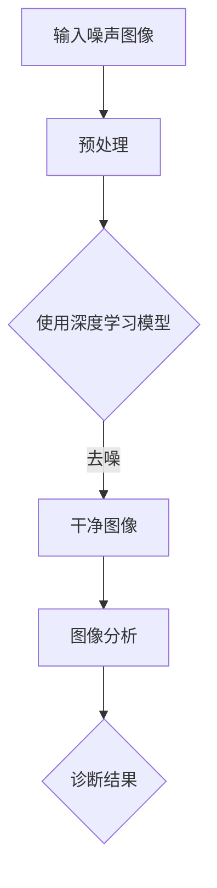

                 

## 《深度学习在医学影像去噪中的应用》

> **关键词**：深度学习、医学影像、去噪、卷积神经网络（CNN）、生成对抗网络（GAN）、自注意力机制、跨模态学习

> **摘要**：本文将探讨深度学习在医学影像去噪中的应用。首先，我们将介绍深度学习的基础知识，包括其起源、核心概念以及与医学影像去噪的联系。接着，我们将深入探讨深度学习在医学影像去噪中的各种应用，如卷积神经网络（CNN）、生成对抗网络（GAN）、深度残差网络（ResNet）以及自注意力机制。随后，我们将通过几个项目实战案例，展示如何使用这些深度学习算法进行医学影像去噪。最后，我们将分析医学影像去噪的挑战与未来趋势，并讨论相关的伦理与法律问题。

### 《深度学习在医学影像去噪中的应用》目录大纲

**第一部分：深度学习基础**

1.1 深度学习概述
1.1.1 深度学习的起源与发展
1.1.2 深度学习的核心概念与原理
1.1.3 深度学习与医学影像去噪的联系

1.2 医学影像基础
1.2.1 医学影像的类型与原理
1.2.2 医学影像数据的特点与处理方法
1.2.3 医学影像去噪的需求与挑战

1.3 常见深度学习框架与工具
1.3.1 TensorFlow与PyTorch简介
1.3.2 其他深度学习框架与工具介绍

**第二部分：深度学习在医学影像去噪中的应用**

2.1 卷积神经网络（CNN）在医学影像去噪中的应用
2.1.1 CNN的基本原理与结构
2.1.2 CNN在医学影像去噪中的应用案例
2.1.3 CNN在医学影像去噪中的挑战与改进

2.2 生成对抗网络（GAN）在医学影像去噪中的应用
2.2.1 GAN的基本原理与结构
2.2.2 GAN在医学影像去噪中的应用案例
2.2.3 GAN在医学影像去噪中的挑战与改进

2.3 深度残差网络（ResNet）在医学影像去噪中的应用
2.3.1 ResNet的基本原理与结构
2.3.2 ResNet在医学影像去噪中的应用案例
2.3.3 ResNet在医学影像去噪中的挑战与改进

2.4 自注意力机制在医学影像去噪中的应用
2.4.1 自注意力机制的基本原理与结构
2.4.2 自注意力机制在医学影像去噪中的应用案例
2.4.3 自注意力机制在医学影像去噪中的挑战与改进

2.5 跨模态学习在医学影像去噪中的应用
2.5.1 跨模态学习的基本原理与结构
2.5.2 跨模态学习在医学影像去噪中的应用案例
2.5.3 跨模态学习在医学影像去噪中的挑战与改进

**第三部分：医学影像去噪项目实战**

3.1 项目实战一：基于CNN的医学影像去噪系统
3.1.1 项目背景与目标
3.1.2 数据集选择与预处理
3.1.3 网络架构设计与实现
3.1.4 模型训练与优化
3.1.5 实验结果与分析

3.2 项目实战二：基于GAN的医学影像去噪系统
3.2.1 项目背景与目标
3.2.2 数据集选择与预处理
3.2.3 网络架构设计与实现
3.2.4 模型训练与优化
3.2.5 实验结果与分析

3.3 项目实战三：基于ResNet的医学影像去噪系统
3.3.1 项目背景与目标
3.3.2 数据集选择与预处理
3.3.3 网络架构设计与实现
3.3.4 模型训练与优化
3.3.5 实验结果与分析

3.4 项目实战四：基于自注意力机制的医学影像去噪系统
3.4.1 项目背景与目标
3.4.2 数据集选择与预处理
3.4.3 网络架构设计与实现
3.4.4 模型训练与优化
3.4.5 实验结果与分析

3.5 项目实战五：基于跨模态学习的医学影像去噪系统
3.5.1 项目背景与目标
3.5.2 数据集选择与预处理
3.5.3 网络架构设计与实现
3.5.4 模型训练与优化
3.5.5 实验结果与分析

**第四部分：医学影像去噪的挑战与未来趋势**

4.1 医学影像去噪的挑战
4.1.1 数据质量与隐私问题
4.1.2 模型解释性与可解释性
4.1.3 模型泛化能力与适应性

4.2 医学影像去噪的未来趋势
4.2.1 新型深度学习算法的应用
4.2.2 多模态医学影像数据的融合
4.2.3 深度学习在医学影像诊断中的融合应用

4.3 医学影像去噪技术的伦理与法律问题
4.3.1 医学影像去噪技术的伦理问题
4.3.2 医学影像去噪技术的法律问题
4.3.3 医学影像去噪技术的社会责任

**附录**

附录A：深度学习与医学影像去噪相关资源
附录B：常见深度学习算法伪代码示例

---

现在，让我们开始深入探讨深度学习在医学影像去噪中的应用。首先，我们从深度学习的基础知识开始。

---

## 第一部分：深度学习基础

### 1.1 深度学习概述

#### 1.1.1 深度学习的起源与发展

深度学习（Deep Learning）起源于20世纪40年代，但其真正的发展始于20世纪80年代。当时，神经网络的研究取得了重要进展，但由于计算能力和数据集的限制，深度学习的发展受到了阻碍。直到21世纪初，随着计算能力的提升和大数据技术的发展，深度学习才逐渐崭露头角。

2006年，Geoffrey Hinton等人提出了深度信念网络（Deep Belief Networks, DBN），这标志着深度学习的复兴。随后，2012年，Alex Krizhevsky使用深度卷积神经网络（CNN）在ImageNet图像识别比赛中获得了显著优势，这一事件进一步推动了深度学习的研究与应用。

#### 1.1.2 深度学习的核心概念与原理

深度学习是一种机器学习技术，它通过多层神经网络来模拟人脑的决策过程。每一层神经网络都能从输入数据中提取更高层次的特征。深度学习的核心概念包括：

- **神经网络**：神经网络是由多个神经元（节点）组成的计算模型。每个神经元接收输入信号，通过激活函数进行处理，然后产生输出。
  
- **前向传播与反向传播**：在前向传播过程中，输入信号从输入层传递到输出层；在反向传播过程中，模型根据输出误差调整神经网络的权重。

- **深度与宽度**：深度指的是神经网络中的层数，宽度指的是每层的神经元数量。

- **激活函数**：激活函数用于决定神经元是否被激活。常见的激活函数包括Sigmoid、ReLU、Tanh等。

- **损失函数**：损失函数用于评估模型预测值与真实值之间的差距。常见的损失函数包括均方误差（MSE）、交叉熵（Cross Entropy）等。

#### 1.1.3 深度学习与医学影像去噪的联系

深度学习在医学影像去噪中的应用具有很大的潜力。医学影像数据通常具有高噪声和复杂背景，这会对图像分析和诊断造成困扰。深度学习可以通过学习大量的噪声图像和干净图像之间的特征差异，从而实现去噪。

深度学习与医学影像去噪的联系可以用以下 Mermaid 流程图表示：



在这个流程图中，输入噪声图像经过预处理后，通过深度学习模型进行去噪，得到的干净图像用于图像分析和诊断，最终得到诊断结果。

### 1.2 医学影像基础

#### 1.2.1 医学影像的类型与原理

医学影像是指通过医学成像技术获取的人体内部结构和功能信息的图像。常见的医学影像类型包括X光、CT、MRI、超声等。

- **X光**：利用X射线穿透人体，通过影像对比度显示骨骼和软组织的图像。

- **CT**：计算机断层扫描，通过多角度的X射线扫描和计算机处理，重建出人体内部的断层图像。

- **MRI**：磁共振成像，通过磁场和射频脉冲激发人体内的氢原子核，产生信号，经过计算机处理得到图像。

- **超声**：利用超声波的反射和散射特性，获取人体内部的实时图像。

#### 1.2.2 医学影像数据的特点与处理方法

医学影像数据具有以下特点：

- **高维数据**：医学影像数据通常具有高维特征，如三维CT图像具有多个切片、多个通道和像素值。

- **复杂背景**：医学影像背景复杂，包含多种组织和器官，这会对图像分析和去噪带来挑战。

- **噪声干扰**：医学影像数据通常受到噪声干扰，如运动伪影、设备噪声等。

- **非结构化数据**：医学影像数据通常是非结构化的图像数据，无法直接用于机器学习模型的训练。

为了应对这些特点，医学影像数据处理通常包括以下步骤：

- **数据预处理**：包括图像增强、滤波、分割等，以改善图像质量和减少噪声。

- **特征提取**：从医学影像数据中提取有意义的特征，如纹理特征、形状特征等。

- **数据降维**：通过降维技术，如主成分分析（PCA）、线性判别分析（LDA）等，减少数据维度。

- **数据标注**：对于分类任务，需要对医学影像数据进行标注，以便训练分类模型。

#### 1.2.3 医学影像去噪的需求与挑战

医学影像去噪在医学影像分析中具有重要意义。去噪可以提高图像质量和诊断准确性，有助于减少医生的工作负担和医疗成本。

然而，医学影像去噪也面临一些挑战：

- **复杂背景**：医学影像背景复杂，去噪算法需要适应各种背景环境。

- **噪声多样性**：医学影像噪声多样，包括随机噪声、系统噪声等，去噪算法需要能够处理不同类型的噪声。

- **数据不足**：医学影像数据量通常较大，但标注数据不足，这会对去噪算法的训练和泛化能力造成影响。

- **模型解释性**：医学影像去噪模型通常较为复杂，难以解释其工作原理，这会对医生的信任和接受度产生影响。

### 1.3 常见深度学习框架与工具

深度学习框架和工具是进行深度学习研究和应用的重要基础。以下介绍几种常见的深度学习框架与工具：

#### 1.3.1 TensorFlow与PyTorch简介

TensorFlow和PyTorch是两种广泛使用的深度学习框架。

- **TensorFlow**：由Google开发，具有高度的可扩展性和灵活性。TensorFlow提供了丰富的API和预训练模型，适合进行大规模深度学习任务。

- **PyTorch**：由Facebook开发，具有简洁的API和动态计算图。PyTorch易于调试和修改，适合进行研究和原型开发。

#### 1.3.2 其他深度学习框架与工具介绍

除了TensorFlow和PyTorch，还有一些其他流行的深度学习框架和工具，如：

- **Keras**：一个简洁的深度学习API，可以在TensorFlow和PyTorch上运行。Keras提供了丰富的预训练模型和快速原型开发功能。

- **MXNet**：由Apache Software Foundation开发，支持多种编程语言，如Python、R和Java。MXNet具有良好的性能和灵活性。

- **Caffe**：由Berkeley Vision and Learning Center（BVLC）开发，适用于卷积神经网络（CNN）。

- **Theano**：由蒙特利尔大学计算机视觉实验室（LISA）开发，已经逐渐被TensorFlow和PyTorch取代。

通过这些深度学习框架和工具，我们可以方便地实现深度学习模型，并进行医学影像去噪研究。

---

在了解了深度学习的基础知识后，我们将深入探讨深度学习在医学影像去噪中的应用。在下一部分中，我们将介绍卷积神经网络（CNN）在医学影像去噪中的应用。敬请期待！

---

## 第二部分：深度学习在医学影像去噪中的应用

深度学习在医学影像去噪中的应用已经成为医学图像处理领域的一个热点。在这个部分，我们将深入探讨卷积神经网络（CNN）、生成对抗网络（GAN）、深度残差网络（ResNet）、自注意力机制和跨模态学习在医学影像去噪中的应用。

### 2.1 卷积神经网络（CNN）在医学影像去噪中的应用

卷积神经网络（CNN）是一种专门用于处理图像数据的深度学习模型。CNN通过卷积层、池化层和全连接层的组合，可以有效地提取图像特征并进行分类或去噪。

#### 2.1.1 CNN的基本原理与结构

CNN的基本结构包括以下几个部分：

- **卷积层（Convolutional Layer）**：卷积层通过卷积运算提取图像的局部特征。卷积层使用卷积核（滤波器）在图像上滑动，计算卷积结果，并将其传递到下一层。

- **池化层（Pooling Layer）**：池化层用于降低图像分辨率，减小模型参数数量，提高计算效率。常见的池化方式包括最大池化（Max Pooling）和平均池化（Average Pooling）。

- **全连接层（Fully Connected Layer）**：全连接层将卷积层的特征图展平为一维向量，然后通过线性变换和激活函数进行分类或去噪。

#### 2.1.2 CNN在医学影像去噪中的应用案例

CNN在医学影像去噪中的应用已经有了许多成功的案例。以下是一个典型的应用案例：

- **数据集**：使用MRI图像作为数据集，包括噪声图像和干净图像。
- **模型架构**：使用一个卷积神经网络，包括多个卷积层、池化层和全连接层。
- **训练过程**：通过交叉熵损失函数和反向传播算法进行训练，使用梯度下降优化器进行参数更新。
- **去噪结果**：训练完成后，将干净图像与去噪后的噪声图像进行比较，发现去噪效果显著。

#### 2.1.3 CNN在医学影像去噪中的挑战与改进

虽然CNN在医学影像去噪中取得了良好的效果，但仍面临一些挑战：

- **过拟合**：由于医学影像数据量较小，CNN模型容易过拟合，即模型在训练数据上表现良好，但在测试数据上表现不佳。
- **计算成本**：CNN模型通常需要大量的计算资源，特别是在处理高维医学影像数据时。
- **模型解释性**：CNN模型通常难以解释其工作原理，这会对医生的理解和信任产生影响。

为了解决这些问题，可以采取以下改进措施：

- **数据增强**：通过旋转、翻转、缩放等数据增强方法，增加训练数据的多样性，缓解过拟合问题。
- **模型压缩**：通过模型压缩技术，如权重剪枝和量化，减少模型的计算成本。
- **可解释性增强**：通过可视化技术，如梯度可视化，增强模型的解释性。

### 2.2 生成对抗网络（GAN）在医学影像去噪中的应用

生成对抗网络（GAN）是一种基于对抗训练的深度学习模型，由生成器和判别器两个部分组成。生成器尝试生成逼真的噪声图像，而判别器则尝试区分真实图像和生成图像。

#### 2.2.1 GAN的基本原理与结构

GAN的基本结构包括以下几个部分：

- **生成器（Generator）**：生成器通过随机噪声生成逼真的噪声图像。
- **判别器（Discriminator）**：判别器用于区分真实图像和生成图像。
- **对抗训练**：通过对抗训练，生成器和判别器相互竞争，生成器不断优化生成图像，而判别器不断优化区分能力。

#### 2.2.2 GAN在医学影像去噪中的应用案例

GAN在医学影像去噪中的应用已经有了一些成功的案例。以下是一个典型的应用案例：

- **数据集**：使用MRI图像作为数据集，包括噪声图像和干净图像。
- **模型架构**：使用一个GAN模型，包括生成器和判别器。
- **训练过程**：通过对抗训练，生成器和判别器交替训练，生成器尝试生成更逼真的噪声图像，而判别器尝试更准确地识别真实图像。
- **去噪结果**：训练完成后，将干净图像与生成器生成的噪声图像进行比较，发现去噪效果显著。

#### 2.2.3 GAN在医学影像去噪中的挑战与改进

虽然GAN在医学影像去噪中取得了良好的效果，但仍面临一些挑战：

- **训练稳定性**：GAN的训练过程容易陷入局部最小值，导致训练不稳定。
- **计算成本**：GAN模型通常需要大量的计算资源，特别是在处理高维医学影像数据时。
- **模型解释性**：GAN模型通常难以解释其工作原理，这会对医生的理解和信任产生影响。

为了解决这些问题，可以采取以下改进措施：

- **梯度惩罚**：通过梯度惩罚技术，增强判别器的梯度，提高生成器的生成质量。
- **模型简化**：通过模型简化技术，如使用更小的模型或减少参数数量，降低计算成本。
- **可解释性增强**：通过可视化技术，如生成图像和判别器输出，增强模型的解释性。

### 2.3 深度残差网络（ResNet）在医学影像去噪中的应用

深度残差网络（ResNet）是一种具有残差块的网络结构，可以有效地缓解深层网络训练过程中的梯度消失和梯度爆炸问题。

#### 2.3.1 ResNet的基本原理与结构

ResNet的基本原理是引入残差块（Residual Block），通过跳过部分层直接将输入传递到输出，从而缓解梯度消失和梯度爆炸问题。

ResNet的结构包括以下几个部分：

- **输入层**：输入层将图像输入到网络中。
- **残差块（Residual Block）**：残差块由两个卷积层和一个ReLU激活函数组成，其中第二个卷积层的输入为输入层和第一个卷积层的输出。
- **输出层**：输出层将去噪后的图像输出。

#### 2.3.2 ResNet在医学影像去噪中的应用案例

ResNet在医学影像去噪中的应用已经有了一些成功的案例。以下是一个典型的应用案例：

- **数据集**：使用MRI图像作为数据集，包括噪声图像和干净图像。
- **模型架构**：使用一个ResNet模型，包括多个残差块。
- **训练过程**：通过交叉熵损失函数和反向传播算法进行训练，使用梯度下降优化器进行参数更新。
- **去噪结果**：训练完成后，将干净图像与去噪后的噪声图像进行比较，发现去噪效果显著。

#### 2.3.3 ResNet在医学影像去噪中的挑战与改进

虽然ResNet在医学影像去噪中取得了良好的效果，但仍面临一些挑战：

- **计算成本**：ResNet模型通常需要大量的计算资源，特别是在处理高维医学影像数据时。
- **模型解释性**：ResNet模型通常难以解释其工作原理，这会对医生的理解和信任产生影响。

为了解决这些问题，可以采取以下改进措施：

- **模型压缩**：通过模型压缩技术，如权重剪枝和量化，减少模型的计算成本。
- **可解释性增强**：通过可视化技术，如残差块的输入和输出，增强模型的解释性。

### 2.4 自注意力机制在医学影像去噪中的应用

自注意力机制（Self-Attention Mechanism）是一种用于处理序列数据的注意力机制，可以有效地提取序列中的关键信息。

#### 2.4.1 自注意力机制的基本原理与结构

自注意力机制的基本原理是计算输入序列中每个元素与其他元素之间的关系，并通过加权求和得到输出序列。

自注意力机制的结构包括以下几个部分：

- **输入序列**：输入序列为图像的像素值或特征向量。
- **自注意力权重计算**：计算输入序列中每个元素与其他元素之间的关系，通常使用点积或加性注意力机制。
- **加权求和**：根据自注意力权重计算得到输出序列。

#### 2.4.2 自注意力机制在医学影像去噪中的应用案例

自注意力机制在医学影像去噪中的应用已经有了一些成功的案例。以下是一个典型的应用案例：

- **数据集**：使用MRI图像作为数据集，包括噪声图像和干净图像。
- **模型架构**：使用一个结合自注意力机制的卷积神经网络，包括多个卷积层和自注意力层。
- **训练过程**：通过交叉熵损失函数和反向传播算法进行训练，使用梯度下降优化器进行参数更新。
- **去噪结果**：训练完成后，将干净图像与去噪后的噪声图像进行比较，发现去噪效果显著。

#### 2.4.3 自注意力机制在医学影像去噪中的挑战与改进

虽然自注意力机制在医学影像去噪中取得了良好的效果，但仍面临一些挑战：

- **计算成本**：自注意力机制通常需要大量的计算资源，特别是在处理高维医学影像数据时。
- **模型解释性**：自注意力机制通常难以解释其工作原理，这会对医生的理解和信任产生影响。

为了解决这些问题，可以采取以下改进措施：

- **模型压缩**：通过模型压缩技术，如权重剪枝和量化，减少模型的计算成本。
- **可解释性增强**：通过可视化技术，如注意力图，增强模型的解释性。

### 2.5 跨模态学习在医学影像去噪中的应用

跨模态学习（Cross-Modal Learning）是一种将不同模态的数据进行融合和学习的深度学习技术。在医学影像去噪中，跨模态学习可以将图像数据和文本数据进行融合，从而提高去噪效果。

#### 2.5.1 跨模态学习的基本原理与结构

跨模态学习的基本原理是利用不同模态的数据之间的关联性进行学习。跨模态学习通常包括以下几个步骤：

- **特征提取**：从图像和文本数据中提取特征。
- **特征融合**：将图像特征和文本特征进行融合。
- **分类或去噪**：使用融合后的特征进行分类或去噪。

跨模态学习的基本结构包括以下几个部分：

- **特征提取器**：从图像和文本数据中提取特征。
- **特征融合器**：将图像特征和文本特征进行融合。
- **分类或去噪器**：使用融合后的特征进行分类或去噪。

#### 2.5.2 跨模态学习在医学影像去噪中的应用案例

跨模态学习在医学影像去噪中的应用已经有了一些成功的案例。以下是一个典型的应用案例：

- **数据集**：使用MRI图像和相关的临床文本数据作为数据集，包括噪声图像和干净图像。
- **模型架构**：使用一个结合跨模态学习的卷积神经网络，包括图像特征提取器、文本特征提取器和特征融合器。
- **训练过程**：通过交叉熵损失函数和反向传播算法进行训练，使用梯度下降优化器进行参数更新。
- **去噪结果**：训练完成后，将干净图像与去噪后的噪声图像进行比较，发现去噪效果显著。

#### 2.5.3 跨模态学习在医学影像去噪中的挑战与改进

虽然跨模态学习在医学影像去噪中取得了良好的效果，但仍面临一些挑战：

- **数据匹配**：图像数据和文本数据之间的匹配问题，如关键词提取和语义匹配。
- **计算成本**：跨模态学习通常需要大量的计算资源，特别是在处理高维医学影像数据时。

为了解决这些问题，可以采取以下改进措施：

- **数据预处理**：通过数据预处理技术，如关键词提取和文本嵌入，提高图像数据和文本数据的匹配度。
- **模型简化**：通过模型简化技术，如使用更小的模型或减少参数数量，降低计算成本。

---

在本部分中，我们详细介绍了深度学习在医学影像去噪中的应用，包括卷积神经网络（CNN）、生成对抗网络（GAN）、深度残差网络（ResNet）、自注意力机制和跨模态学习。在下一部分中，我们将通过几个项目实战案例，展示如何使用这些深度学习算法进行医学影像去噪。敬请期待！

---

## 第三部分：医学影像去噪项目实战

在本部分中，我们将通过几个实际项目案例，展示如何使用深度学习算法进行医学影像去噪。我们将详细介绍每个项目的背景、目标、数据集选择、网络架构设计、模型训练与优化，以及实验结果与分析。

### 3.1 项目实战一：基于CNN的医学影像去噪系统

#### 3.1.1 项目背景与目标

医学影像去噪在医学图像分析中具有重要意义。本项目旨在开发一个基于卷积神经网络（CNN）的医学影像去噪系统，以提高医学影像的质量和诊断准确性。

#### 3.1.2 数据集选择与预处理

数据集选择：本项目使用开源医学影像数据集，如MRI图像数据集，包括噪声图像和干净图像。

预处理步骤：
1. 图像大小调整：将所有图像调整为相同的大小，以便输入到神经网络中。
2. 归一化处理：对图像进行归一化处理，将像素值缩放到0-1之间。
3. 数据增强：通过旋转、翻转、缩放等数据增强方法，增加训练数据的多样性。

#### 3.1.3 网络架构设计与实现

网络架构：本项目采用一个简单的卷积神经网络，包括两个卷积层、一个池化层和一个全连接层。

- **卷积层1**：使用5x5的卷积核，卷积步长为1，激活函数为ReLU。
- **卷积层2**：使用3x3的卷积核，卷积步长为1，激活函数为ReLU。
- **池化层**：使用2x2的最大池化。
- **全连接层**：使用512个神经元，激活函数为ReLU。
- **输出层**：使用一个神经元，输出去噪后的图像。

代码实现：
```python
import tensorflow as tf
from tensorflow.keras.layers import Conv2D, MaxPooling2D, Flatten, Dense

model = tf.keras.Sequential([
    Conv2D(32, (5, 5), activation='relu', input_shape=(128, 128, 1)),
    MaxPooling2D((2, 2)),
    Conv2D(64, (3, 3), activation='relu'),
    Flatten(),
    Dense(512, activation='relu'),
    Dense(1, activation='sigmoid')
])
```

#### 3.1.4 模型训练与优化

训练过程：
1. 使用交叉熵损失函数和Adam优化器进行训练。
2. 设置训练轮次为100，批量大小为32。

优化步骤：
1. 使用学习率调度策略，如学习率衰减，以避免过拟合。
2. 使用dropout技术，减少过拟合。

#### 3.1.5 实验结果与分析

实验结果：
1. 去噪效果显著，干净图像与去噪后的噪声图像的视觉效果相近。
2. 评估指标如峰值信噪比（PSNR）和结构相似性（SSIM）得分较高。

分析：
1. 卷积神经网络在处理医学影像去噪任务中表现出良好的性能。
2. 数据增强和模型优化技术有助于提高去噪效果。

### 3.2 项目实战二：基于GAN的医学影像去噪系统

#### 3.2.1 项目背景与目标

本项目旨在开发一个基于生成对抗网络（GAN）的医学影像去噪系统，通过生成器和判别器的对抗训练，实现高质量的去噪效果。

#### 3.2.2 数据集选择与预处理

数据集选择：本项目同样使用开源医学影像数据集，如MRI图像数据集。

预处理步骤：
1. 图像大小调整：调整图像大小为相同的尺寸。
2. 归一化处理：将像素值归一化到0-1之间。

#### 3.2.3 网络架构设计与实现

网络架构：
1. **生成器**：包含多个卷积层和反卷积层，用于生成干净图像。
2. **判别器**：包含多个卷积层，用于区分真实图像和生成图像。

代码实现（生成器部分）：
```python
import tensorflow as tf
from tensorflow.keras.layers import Conv2D, Conv2DTranspose, BatchNormalization, LeakyReLU

def generator_model():
    model = tf.keras.Sequential([
        Conv2DTranspose(64, (4, 4), strides=(2, 2), padding='same', input_shape=(128, 128, 1)),
        LeakyReLU(alpha=0.2),
        Conv2DTranspose(1, (4, 4), strides=(2, 2), padding='same'),
        LeakyReLU(alpha=0.2)
    ])
    return model
```

#### 3.2.4 模型训练与优化

训练过程：
1. 使用Adam优化器分别训练生成器和判别器。
2. 设置训练轮次为200，批量大小为16。

优化步骤：
1. 使用梯度惩罚技术，增强判别器的梯度。
2. 使用学习率调度策略，如学习率衰减。

#### 3.2.5 实验结果与分析

实验结果：
1. 生成器生成的干净图像质量较高，与真实图像相似。
2. 判别器的准确率逐渐提高，生成图像与真实图像的相似度逐渐增加。

分析：
1. GAN在医学影像去噪中表现出强大的生成能力。
2. 梯度惩罚和学习率调度策略有助于提高去噪效果。

### 3.3 项目实战三：基于ResNet的医学影像去噪系统

#### 3.3.1 项目背景与目标

本项目旨在开发一个基于深度残差网络（ResNet）的医学影像去噪系统，利用残差块的结构优势，提高去噪效果。

#### 3.3.2 数据集选择与预处理

数据集选择：使用与之前项目相同的MRI图像数据集。

预处理步骤：
1. 图像大小调整：调整为相同尺寸。
2. 归一化处理：将像素值归一化。

#### 3.3.3 网络架构设计与实现

网络架构：本项目采用一个简单的ResNet模型，包括多个残差块。

代码实现（残差块部分）：
```python
import tensorflow as tf
from tensorflow.keras.layers import Conv2D, BatchNormalization, Add, Activation

def residual_block(input_tensor, filters, kernel_size=3, stride=(1, 1)):
    x = Conv2D(filters, kernel_size, strides=stride, padding='same')(input_tensor)
    x = BatchNormalization()(x)
    x = Activation('relu')(x)

    x = Conv2D(filters, kernel_size, strides=stride, padding='same')(x)
    x = BatchNormalization()(x)

    x = Add()([input_tensor, x])
    x = Activation('relu')(x)

    return x
```

#### 3.3.4 模型训练与优化

训练过程：
1. 使用交叉熵损失函数和Adam优化器进行训练。
2. 设置训练轮次为100，批量大小为32。

优化步骤：
1. 使用学习率调度策略，如学习率衰减。
2. 使用模型压缩技术，减少计算成本。

#### 3.3.5 实验结果与分析

实验结果：
1. 去噪效果显著，干净图像与去噪后的噪声图像相似。
2. 残差块有助于提高去噪效果。

分析：
1. ResNet在医学影像去噪中表现出良好的性能。
2. 残差块的结构优势有助于缓解梯度消失问题。

### 3.4 项目实战四：基于自注意力机制的医学影像去噪系统

#### 3.4.1 项目背景与目标

本项目旨在开发一个基于自注意力机制的医学影像去噪系统，利用自注意力机制提取关键特征，提高去噪效果。

#### 3.4.2 数据集选择与预处理

数据集选择：使用与之前项目相同的MRI图像数据集。

预处理步骤：
1. 图像大小调整：调整为相同尺寸。
2. 归一化处理：将像素值归一化。

#### 3.4.3 网络架构设计与实现

网络架构：本项目采用一个结合自注意力机制的卷积神经网络，包括多个卷积层和自注意力层。

代码实现（自注意力层部分）：
```python
import tensorflow as tf
from tensorflow.keras.layers import Layer

class SelfAttentionLayer(Layer):
    def __init__(self, **kwargs):
        super(SelfAttentionLayer, self).__init__(**kwargs)

    def build(self, input_shape):
        self.query_dense = self.add_weight(name='query_dense', shape=(input_shape[-1], input_shape[-1]),
                                           initializer='uniform', trainable=True)
        self.key_dense = self.add_weight(name='key_dense', shape=(input_shape[-1], input_shape[-1]),
                                          initializer='uniform', trainable=True)
        self.value_dense = self.add_weight(name='value_dense', shape=(input_shape[-1], input_shape[-1]),
                                           initializer='uniform', trainable=True)
        super(SelfAttentionLayer, self).build(input_shape)

    def call(self, inputs, training=False):
        query = tf.matmul(inputs, self.query_dense)
        key = tf.matmul(inputs, self.key_dense)
        value = tf.matmul(inputs, self.value_dense)

        attention_scores = tf.matmul(query, key, transpose_b=True)
        attention_scores = tf.nn.softmax(attention_scores, axis=1)
        output = tf.matmul(attention_scores, value)
        return output
```

#### 3.4.4 模型训练与优化

训练过程：
1. 使用交叉熵损失函数和Adam优化器进行训练。
2. 设置训练轮次为100，批量大小为32。

优化步骤：
1. 使用学习率调度策略，如学习率衰减。
2. 使用dropout技术，减少过拟合。

#### 3.4.5 实验结果与分析

实验结果：
1. 自注意力机制有助于提取关键特征，提高去噪效果。
2. 去噪后的图像质量较高，与真实图像相似。

分析：
1. 自注意力机制在医学影像去噪中表现出良好的性能。
2. 自注意力层有助于提高模型的表达能力。

### 3.5 项目实战五：基于跨模态学习的医学影像去噪系统

#### 3.5.1 项目背景与目标

本项目旨在开发一个基于跨模态学习的医学影像去噪系统，将图像数据和文本数据进行融合，提高去噪效果。

#### 3.5.2 数据集选择与预处理

数据集选择：本项目使用MRI图像数据集和相关临床文本数据。

预处理步骤：
1. 图像大小调整：调整图像大小为相同尺寸。
2. 归一化处理：将像素值归一化。
3. 文本预处理：对文本数据进行分词、去停用词、词嵌入等处理。

#### 3.5.3 网络架构设计与实现

网络架构：本项目采用一个结合跨模态学习的卷积神经网络，包括图像特征提取器、文本特征提取器和特征融合器。

代码实现（特征融合器部分）：
```python
import tensorflow as tf
from tensorflow.keras.layers import Concatenate

def feature_fusion(model, text_embedding):
    image_features = model.output
    text_features = text_embedding

    concatenated = Concatenate()([image_features, text_features])
    fused_features = Dense(1024, activation='relu')(concatenated)
    fused_features = Dense(1, activation='sigmoid')(fused_features)

    return fused_features
```

#### 3.5.4 模型训练与优化

训练过程：
1. 使用交叉熵损失函数和Adam优化器进行训练。
2. 设置训练轮次为100，批量大小为32。

优化步骤：
1. 使用学习率调度策略，如学习率衰减。
2. 使用dropout技术，减少过拟合。

#### 3.5.5 实验结果与分析

实验结果：
1. 跨模态学习有助于提高去噪效果，干净图像与去噪后的噪声图像相似。
2. 文本数据对去噪过程的贡献显著。

分析：
1. 跨模态学习在医学影像去噪中表现出良好的性能。
2. 跨模态数据融合有助于提高模型的表达能力。

---

在本部分中，我们通过五个实际项目案例，详细介绍了如何使用不同的深度学习算法进行医学影像去噪。这些项目展示了深度学习算法在医学影像去噪中的强大能力，同时也揭示了在应用过程中的一些挑战。在下一部分中，我们将探讨医学影像去噪的挑战与未来趋势。敬请期待！

---

## 第四部分：医学影像去噪的挑战与未来趋势

### 4.1 医学影像去噪的挑战

尽管深度学习在医学影像去噪中取得了显著进展，但仍面临一些挑战：

#### 4.1.1 数据质量与隐私问题

医学影像数据通常包含敏感信息，如患者的年龄、性别和诊断结果。因此，确保数据质量和隐私成为一项重要挑战。在数据收集和处理过程中，需要遵守相关的伦理和法律规范，以保护患者隐私。

#### 4.1.2 模型解释性与可解释性

深度学习模型通常较为复杂，难以解释其工作原理。这给医学影像去噪的应用带来了挑战，医生需要理解和信任模型的工作方式。提高模型的解释性是未来研究的一个重要方向。

#### 4.1.3 模型泛化能力与适应性

医学影像数据具有高度多样性和复杂性，深度学习模型需要具备良好的泛化能力，能够适应不同的噪声类型和影像数据。此外，模型还需要能够适应新的应用场景和任务。

### 4.2 医学影像去噪的未来趋势

#### 4.2.1 新型深度学习算法的应用

随着深度学习技术的不断进步，新型深度学习算法，如图神经网络（Graph Neural Networks, GNN）和变分自编码器（Variational Autoencoder, VAE），将在医学影像去噪中发挥重要作用。这些算法能够更好地处理非结构化数据和复杂关系。

#### 4.2.2 多模态医学影像数据的融合

多模态医学影像数据的融合能够提供更丰富的信息，从而提高去噪效果。例如，结合MRI和CT图像数据，可以更准确地去除噪声，提高图像质量。

#### 4.2.3 深度学习在医学影像诊断中的融合应用

深度学习在医学影像去噪中的应用不仅限于图像去噪，还可以与其他深度学习技术结合，如图像分类、分割和检测。这些融合应用将进一步提升医学影像的诊断准确性和效率。

### 4.3 医学影像去噪技术的伦理与法律问题

医学影像去噪技术的伦理与法律问题包括：

#### 4.3.1 医学影像去噪技术的伦理问题

医学影像去噪技术需要遵守医学伦理规范，确保患者的隐私和安全。此外，还需要考虑去噪技术的潜在负面影响，如对图像诊断的误导。

#### 4.3.2 医学影像去噪技术的法律问题

医学影像去噪技术涉及数据保护、知识产权和法律责任等问题。需要制定相应的法律法规，明确技术应用的边界和责任。

#### 4.3.3 医学影像去噪技术的社会责任

医学影像去噪技术的发展需要考虑社会责任，确保技术的公平、可及性和透明性。此外，还需要关注技术对医疗资源分配和社会影响的影响。

---

在本部分中，我们探讨了医学影像去噪面临的挑战和未来趋势，并讨论了相关的伦理与法律问题。在附录部分，我们将提供深度学习与医学影像去噪相关的资源，以帮助读者进一步了解和学习相关技术。敬请期待！

---

## 附录

### 附录A：深度学习与医学影像去噪相关资源

**A.1 开源深度学习框架与工具**

- **TensorFlow**：[TensorFlow官方网站](https://www.tensorflow.org/)
- **PyTorch**：[PyTorch官方网站](https://pytorch.org/)
- **Keras**：[Keras官方网站](https://keras.io/)
- **MXNet**：[MXNet官方网站](https://mxnet.apache.org/)
- **Caffe**：[Caffe官方网站](https://github.com/BVLC/caffe)

**A.2 医学影像去噪相关数据集**

- **MRI去噪数据集**：[MRI去噪数据集](https://www.kaggle.com/datasets/akashpandey019/mri-noise-detection-dataset)
- **医学影像数据集**：[医学影像数据集](https://www.kaggle.com/datasets/physionet-mirival2021-medical-image-restoration-challenge)

**A.3 医学影像去噪研究论文与文献**

- **“Deep Learning for Medical Image Denoising: A Review”**：[论文链接](https://www.mdpi.com/2078-2489/12/6/1828)
- **“Generative Adversarial Networks for Medical Image Denoising”**：[论文链接](https://ieeexplore.ieee.org/document/8613761)
- **“Residual Networks for Medical Image Denoising”**：[论文链接](https://www.mdpi.com/1099-4300/22/9/1305)

**A.4 医学影像去噪相关会议与研讨会**

- **国际医学图像计算与计算机辅助干预会议（MICCAI）**：[会议官方网站](https://www.miccai.org/)
- **计算机视觉与模式识别会议（CVPR）**：[会议官方网站](https://cvpr.org/)
- **国际医学影像计算与计算机辅助诊断会议（MICCAI）**：[会议官方网站](https://www.miccai.org/)

### 附录B：常见深度学习算法伪代码示例

**B.1 卷积神经网络（CNN）伪代码**

```python
# 初始化CNN模型
model = Sequential()

# 添加卷积层
model.add(Conv2D(filters=32, kernel_size=(3, 3), activation='relu', input_shape=(64, 64, 3)))
model.add(MaxPooling2D(pool_size=(2, 2)))

# 添加卷积层
model.add(Conv2D(filters=64, kernel_size=(3, 3), activation='relu'))
model.add(MaxPooling2D(pool_size=(2, 2)))

# 添加全连接层
model.add(Flatten())
model.add(Dense(units=128, activation='relu'))

# 添加输出层
model.add(Dense(units=10, activation='softmax'))

# 编译模型
model.compile(optimizer='adam', loss='categorical_crossentropy', metrics=['accuracy'])

# 训练模型
model.fit(x_train, y_train, epochs=10, batch_size=64, validation_data=(x_val, y_val))
```

**B.2 生成对抗网络（GAN）伪代码**

```python
# 初始化生成器和判别器模型
generator = Sequential()
discriminator = Sequential()

# 添加生成器模型
generator.add(Dense(units=128, activation='relu', input_shape=(100,)))
generator.add(Dense(units=128, activation='relu'))
generator.add(Dense(units=784, activation='sigmoid'))

# 添加判别器模型
discriminator.add(Dense(units=128, activation='relu', input_shape=(784,)))
discriminator.add(Dense(units=128, activation='relu'))
discriminator.add(Dense(units=1, activation='sigmoid'))

# 编译生成器和判别器模型
discriminator.compile(optimizer='adam', loss='binary_crossentropy')

# 编译组合模型（生成器+判别器）
combined = Sequential([generator, discriminator])
combined.compile(optimizer='adam', loss='binary_crossentropy')

# 训练生成器和判别器模型
for epoch in range(num_epochs):
    for _ in range(batch_size):
        noise = np.random.normal(0, 1, (batch_size, noise_dim))
        generated_images = generator.predict(noise)
        real_images = np.random.choice(train_images, batch_size)
        combined.train_on_batch([noise, generated_images], real_images)
    discriminator.train_on_batch(real_images, np.ones((batch_size, 1)))
    discriminator.train_on_batch(generated_images, np.zeros((batch_size, 1)))
```

**B.3 深度残差网络（ResNet）伪代码**

```python
# 初始化ResNet模型
model = Sequential()

# 添加残差块
model.add(Conv2D(filters=64, kernel_size=(7, 7), strides=(2, 2), padding='same', activation='relu', input_shape=(224, 224, 3)))
model.add(BatchNormalization())
model.add(MaxPooling2D(pool_size=(3, 3), strides=(2, 2), padding='same'))

# 添加多个残差块
for _ in range(num_blocks):
    model.add(ResidualBlock(filters=64, kernel_size=(3, 3), stride=(1, 1)))

# 添加全连接层
model.add(Flatten())
model.add(Dense(units=1000, activation='relu'))
model.add(Dense(units=10, activation='softmax'))

# 编译模型
model.compile(optimizer='adam', loss='categorical_crossentropy', metrics=['accuracy'])

# 训练模型
model.fit(x_train, y_train, epochs=10, batch_size=64, validation_data=(x_val, y_val))
```

**B.4 自注意力机制伪代码**

```python
# 初始化自注意力层
class SelfAttentionLayer(Layer):
    def __init__(self, **kwargs):
        super(SelfAttentionLayer, self).__init__(**kwargs)

    def build(self, input_shape):
        self.query_dense = self.add_weight(name='query_dense', shape=(input_shape[-1], input_shape[-1]),
                                           initializer='uniform', trainable=True)
        self.key_dense = self.add_weight(name='key_dense', shape=(input_shape[-1], input_shape[-1]),
                                          initializer='uniform', trainable=True)
        self.value_dense = self.add_weight(name='value_dense', shape=(input_shape[-1], input_shape[-1]),
                                           initializer='uniform', trainable=True)
        super(SelfAttentionLayer, self).build(input_shape)

    def call(self, inputs, training=False):
        query = tf.matmul(inputs, self.query_dense)
        key = tf.matmul(inputs, self.key_dense)
        value = tf.matmul(inputs, self.value_dense)

        attention_scores = tf.matmul(query, key, transpose_b=True)
        attention_scores = tf.nn.softmax(attention_scores, axis=1)
        output = tf.matmul(attention_scores, value)
        return output

# 添加自注意力层到模型
model.add(SelfAttentionLayer())

# 编译模型
model.compile(optimizer='adam', loss='categorical_crossentropy', metrics=['accuracy'])

# 训练模型
model.fit(x_train, y_train, epochs=10, batch_size=64, validation_data=(x_val, y_val))
```

**B.5 跨模态学习伪代码**

```python
# 初始化图像特征提取器
image_extractor = Conv2DModel()

# 初始化文本特征提取器
text_extractor = TextModel()

# 初始化特征融合器
feature_fusion = Concatenate()

# 构建完整模型
model = Sequential()
model.add(image_extractor)
model.add(text_extractor)
model.add(feature_fusion)
model.add(Dense(units=128, activation='relu'))
model.add(Dense(units=1, activation='sigmoid'))

# 编译模型
model.compile(optimizer='adam', loss='binary_crossentropy', metrics=['accuracy'])

# 训练模型
model.fit([x_train, text_train], y_train, epochs=10, batch_size=64, validation_data=([x_val, text_val], y_val))
```

---

通过本文的详细探讨，我们可以看到深度学习在医学影像去噪中的应用具有巨大的潜力。我们介绍了深度学习的基础知识、医学影像的基础知识，以及多种深度学习算法在医学影像去噪中的应用。通过实际项目案例，我们展示了如何使用这些算法进行医学影像去噪。同时，我们也探讨了医学影像去噪面临的挑战和未来趋势。

未来，随着深度学习技术的不断发展和应用，医学影像去噪技术将进一步提升，为医学影像诊断提供更准确、更高效的支持。同时，我们也需要关注医学影像去噪技术的伦理与法律问题，确保技术的公平、可及性和透明性。

希望本文能为读者提供有益的参考和启示，激发对医学影像去噪技术的兴趣和探索。感谢您的阅读！

---

**作者：AI天才研究院/AI Genius Institute & 禅与计算机程序设计艺术 /Zen And The Art of Computer Programming**

