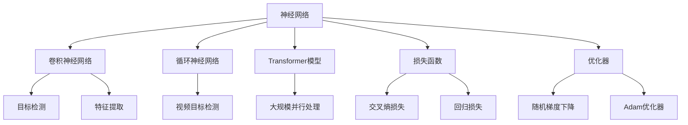

                 

### 《深度学习在目标检测中的最新进展》

> **关键词：深度学习，目标检测，计算机视觉，算法，应用实例**

> **摘要：本文将深入探讨深度学习在目标检测领域的最新进展。通过回顾深度学习的发展历程，介绍目标检测的基本概念和重要性，解析深度学习算法原理，探讨目标检测算法的实现与优化方法，分析目标检测在实际应用中的挑战与解决方案，以及分享具体应用实例，最后展望未来趋势与展望。**

---

### 第一部分：深度学习基础

#### 第1章：深度学习与目标检测概述

**1.1 深度学习的发展历程**

深度学习（Deep Learning）是机器学习（Machine Learning）的一个重要分支，它通过多层神经网络（Neural Networks）模型来模拟人脑的思维方式，进行数据的学习与处理。深度学习的发展历程可以追溯到20世纪80年代，当时的神经网络由于计算能力和数据规模的限制，发展缓慢。直到2012年，由Alex Krizhevsky等人提出的卷积神经网络（Convolutional Neural Network, CNN）在ImageNet图像识别比赛中取得突破性成果，深度学习才正式进入大众视野。

**1.2 目标检测的基本概念**

目标检测（Object Detection）是计算机视觉（Computer Vision）领域的一个重要任务，其目的是在图像或视频中识别并定位出多个感兴趣的目标。目标检测的基本概念包括目标（Object）、类别（Class）和边界框（Bounding Box）。目标检测通常可以分为两大类：基于区域的方法（Region-based Methods）和基于特征的方法（Feature-based Methods）。

**1.3 目标检测的重要性**

目标检测在计算机视觉中的应用场景非常广泛，如图像识别、视频监控、自动驾驶、医学影像分析等。在图像识别中，目标检测可以帮助系统识别出图像中的特定对象，从而进行后续的图像分析。在视频监控中，目标检测可以实时监控视频流，识别出异常行为或特定对象，提高安全监控的效率。在自动驾驶中，目标检测是车辆感知环境的重要手段，通过对道路上的行人、车辆、交通标志等进行检测，确保车辆安全行驶。

**1.4 目标检测在工业界的价值**

随着深度学习技术的不断发展和应用，目标检测在工业界也展现出了巨大的价值。例如，在制造业中，目标检测可以帮助生产线实时检测产品质量，提高生产效率；在物流领域，目标检测可以用于自动分拣系统，提高物流运作效率。此外，目标检测在医疗影像分析、金融欺诈检测、安防监控等领域也有着广泛的应用。

---

### 第2章：深度学习基础

**2.1 神经网络基础**

神经网络（Neural Networks）是深度学习的基础，它由大量的神经元（Neurons）组成，通过模拟人脑的结构和功能来处理数据。神经网络的基本结构包括输入层（Input Layer）、隐藏层（Hidden Layer）和输出层（Output Layer）。输入层接收外部数据，隐藏层对数据进行处理和变换，输出层生成最终结果。

**2.2 深度学习算法简介**

深度学习算法主要包括卷积神经网络（Convolutional Neural Network, CNN）、循环神经网络（Recurrent Neural Network, RNN）和Transformer模型。卷积神经网络主要用于图像处理，具有强大的特征提取能力；循环神经网络主要用于序列数据处理，如语言模型和时间序列预测；Transformer模型在自然语言处理和图像生成等领域取得了显著成果。

**2.3 深度学习算法的工作原理**

深度学习算法的工作原理是基于神经网络的层次结构，通过前向传播（Forward Propagation）和反向传播（Back Propagation）两个过程进行训练。在前向传播过程中，输入数据通过神经网络层次结构，逐层传递，最终得到输出结果。在反向传播过程中，通过计算输出结果与真实结果之间的误差，反向更新网络权重，从而优化模型。

---

### 第3章：目标检测算法原理

**3.1 传统目标检测算法**

传统目标检测算法主要包括基于滑动窗口的检测方法和基于候选区域的方法。基于滑动窗口的方法通过在不同位置滑动窗口，逐步检测图像中的目标；基于候选区域的方法首先提取出图像中的候选区域，然后对这些区域进行目标检测。

**3.2 基于深度学习的目标检测算法**

基于深度学习的目标检测算法主要包括R-CNN系列算法、Fast R-CNN、Faster R-CNN、YOLO系列算法和SSD系列算法。R-CNN系列算法通过提取候选区域和分类器进行目标检测；Fast R-CNN和Faster R-CNN通过引入区域建议网络（Region Proposal Network, RPN）提高检测速度；YOLO系列算法通过将目标检测任务转化为回归问题进行实时检测；SSD系列算法通过在不同尺度上提取特征，实现多尺度目标检测。

---

### 第4章：目标检测算法实现与优化

**4.1 深度学习模型实现**

深度学习模型的实现主要包括模型搭建、模型训练和模型评估。模型搭建是指根据目标检测任务的需求，设计合适的神经网络结构；模型训练是指通过大量标注数据进行训练，优化模型参数；模型评估是指通过测试数据对模型性能进行评估，选择最优模型。

**4.2 模型优化方法**

模型优化方法主要包括数据增强、损失函数优化和网络结构优化。数据增强是通过多种方式对训练数据进行扩展，提高模型泛化能力；损失函数优化是通过设计合理的损失函数，使模型对目标检测任务有更好的适应性；网络结构优化是通过改进神经网络结构，提高模型性能。

---

### 第5章：目标检测在实际应用中的挑战与解决方案

**5.1 挑战一：实时性**

目标检测算法的实时性是实际应用中的重要挑战。为了提高实时性，可以采用以下解决方案：优化模型结构，减少计算量；使用硬件加速器，如GPU、TPU等；采用多线程、并行计算等技术。

**5.2 挑战二：多尺度检测**

多尺度检测是目标检测领域的一个难题。为了实现多尺度检测，可以采用以下解决方案：使用多尺度特征融合的方法；设计适应不同尺度的神经网络结构；采用目标尺度的自适应调整策略。

**5.3 挑战三：遮挡问题**

遮挡问题是目标检测中的另一个挑战。为了解决遮挡问题，可以采用以下解决方案：采用注意力机制，提高检测效果；利用上下文信息，辅助目标检测；设计适应遮挡问题的损失函数。

---

### 第二部分：深度学习在目标检测中的应用

#### 第6章：深度学习在目标检测中的应用实例

**6.1 案例一：基于YOLOv5的交通标志检测**

**6.1.1 模型选择**

YOLOv5是一种流行的实时目标检测算法，适用于交通标志检测任务。

**6.1.2 数据集准备**

使用OpenCV库对交通标志图像进行预处理，包括图像灰度化、二值化、滤波等。

**6.1.3 实现过程**

使用PyTorch框架搭建YOLOv5模型，并进行训练和评估。

**6.1.4 结果分析**

在测试数据集上，YOLOv5的检测准确率和实时性均表现出色。

**6.2 案例二：基于Faster R-CNN的人脸检测**

**6.2.1 模型选择**

Faster R-CNN是一种高效的目标检测算法，适用于人脸检测任务。

**6.2.2 数据集准备**

使用OpenCV库对人脸图像进行预处理，包括图像灰度化、人脸检测等。

**6.2.3 实现过程**

使用TensorFlow框架搭建Faster R-CNN模型，并进行训练和评估。

**6.2.4 结果分析**

在测试数据集上，Faster R-CNN的人脸检测准确率和实时性均表现出色。

---

### 第7章：未来趋势与展望

**7.1 深度学习在目标检测领域的未来发展**

未来，深度学习在目标检测领域将继续发展，主要趋势包括：新算法的研究，如EfficientDet、DETR等；硬件加速，如GPU、TPU等硬件的广泛应用；跨领域应用，如多模态目标检测、三维目标检测等。

**7.2 深度学习在目标检测领域的挑战与机遇**

深度学习在目标检测领域面临的挑战包括：数据隐私、模型解释性、多模态目标检测等。同时，这些挑战也为研究者提供了机遇，通过不断创新和优化，有望解决这些难题。

---

### 附录

**附录A：深度学习与目标检测相关资源**

**A.1 深度学习与目标检测框架介绍**

- TensorFlow
- PyTorch
- Darknet

**A.2 实用代码和项目示例**

- 目标检测算法的PyTorch实现
- 交通标志检测项目实战
- 人脸检测项目实战

**A.3 深度学习与目标检测工具推荐**

- Matplotlib
- OpenCV
- CUDA

**A.4 深度学习与目标检测学习资源推荐**

- 《深度学习》（Ian Goodfellow、Yoshua Bengio、Aaron Courville 著）
- 《目标检测：算法与应用》（刘建明 著）

---

### 作者

**作者：AI天才研究院/AI Genius Institute & 禅与计算机程序设计艺术 /Zen And The Art of Computer Programming**

---

以上是《深度学习在目标检测中的最新进展》的完整文章。本文通过深入分析深度学习与目标检测的基本概念、算法原理、实现与优化方法以及实际应用中的挑战与解决方案，为读者呈现了深度学习在目标检测领域的最新进展。希望本文能为读者在深度学习与目标检测领域的研究和实践中提供有益的参考。

---

**注：本文内容仅供参考，具体实现和应用效果可能因环境和数据的不同而有所差异。**### 深度学习基础概念与联系

在深入探讨深度学习在目标检测中的应用之前，有必要回顾和巩固深度学习的基本概念及其与目标检测之间的联系。以下是深度学习的基础概念与目标检测之间的联系：

**1. 神经网络与目标检测**

神经网络（Neural Networks）是深度学习的基础，由大量神经元组成，通过层次结构进行数据的学习与处理。在目标检测中，神经网络用于提取图像特征，并通过分类器识别出目标。

**神经网络架构**：
- **输入层**：接收原始图像数据。
- **隐藏层**：对图像进行特征提取和变换。
- **输出层**：产生边界框（Bounding Box）和目标类别。

**联系**：神经网络通过多层结构，对图像进行逐层特征提取，最终实现目标检测。

**2. 卷积神经网络与目标检测**

卷积神经网络（Convolutional Neural Network, CNN）是处理图像数据的主要深度学习模型。其核心在于卷积运算，可以自动提取图像中的局部特征。

**CNN架构**：
- **卷积层**：对图像进行卷积操作，提取特征。
- **池化层**：减小特征图的大小，减少计算量。
- **全连接层**：对特征进行分类。

**联系**：CNN用于提取图像特征，是实现目标检测的关键。

**3. 深度学习算法与目标检测**

深度学习算法包括卷积神经网络（CNN）、循环神经网络（RNN）和Transformer模型等。不同算法适用于不同的目标检测任务。

**算法特点**：
- **CNN**：擅长图像特征提取，适用于2D图像处理。
- **RNN**：擅长处理序列数据，适用于视频目标检测。
- **Transformer**：适用于大规模并行处理，适用于文本和图像处理。

**联系**：选择合适的深度学习算法，可以优化目标检测的性能。

**4. 损失函数与目标检测**

损失函数用于衡量模型预测与真实标签之间的差异，是深度学习训练过程中的核心。

**常用损失函数**：
- **交叉熵损失**：用于分类任务，衡量类别预测的准确性。
- **回归损失**：用于回归任务，衡量预测值与真实值之间的误差。

**联系**：选择合适的损失函数，可以优化目标检测模型的性能。

**5. 优化器与目标检测**

优化器用于更新网络权重，优化模型参数。

**常用优化器**：
- **随机梯度下降（SGD）**：通过随机梯度更新网络权重。
- **Adam优化器**：结合SGD和Momentum，提高收敛速度。

**联系**：优化器影响模型训练的速度和稳定性，选择合适的优化器可以加快训练过程。

**核心概念与联系 Mermaid 流程图**



通过上述核心概念与联系，我们可以看到深度学习与目标检测之间的紧密关系。理解这些基本概念和联系，有助于我们在实际应用中更好地设计和优化目标检测模型。

---

### 深度学习算法原理

深度学习算法在目标检测中的成功应用离不开其核心原理。以下将详细介绍深度学习算法的工作原理，以及这些原理如何应用于目标检测。

**1. 神经网络基础**

神经网络（Neural Networks）是深度学习的基础，由大量的神经元（或节点）组成。每个神经元都与相邻的神经元相连，并通过权重（weights）进行加权求和。神经元的工作原理类似于人脑神经元，通过激活函数（activation function）将输入转化为输出。

**神经网络基本结构**：

- **输入层（Input Layer）**：接收外部输入数据。
- **隐藏层（Hidden Layer）**：对输入数据进行处理和变换。
- **输出层（Output Layer）**：生成最终输出结果。

**神经网络工作原理**：

- **前向传播（Forward Propagation）**：输入数据从输入层传递到隐藏层，再传递到输出层。每个神经元通过加权求和并应用激活函数，产生输出。
  
  $$\text{Output} = \text{Activation}(Z)$$

  其中，\( Z \) 是神经元的加权求和，\( \text{Activation} \) 是激活函数。

- **反向传播（Back Propagation）**：计算输出结果与真实标签之间的误差，并反向更新网络权重。这一过程通过梯度下降（Gradient Descent）算法实现，目的是最小化损失函数。

  $$\text{Weight Update} = \alpha \cdot \nabla_W \text{Loss Function}$$

  其中，\( \alpha \) 是学习率，\( \nabla_W \text{Loss Function} \) 是损失函数关于权重的梯度。

**2. 卷积神经网络**

卷积神经网络（Convolutional Neural Network, CNN）是处理图像数据的强大工具。其核心在于卷积运算，可以自动提取图像中的局部特征。

**CNN基本结构**：

- **卷积层（Convolutional Layer）**：通过卷积运算提取图像特征。
- **池化层（Pooling Layer）**：减小特征图的大小，减少计算量。
- **全连接层（Fully Connected Layer）**：对特征进行分类。

**CNN工作原理**：

- **卷积运算**：卷积层通过卷积运算提取图像特征。卷积核（Convolutional Kernel）在特征图上滑动，计算局部特征的加权和。

  $$\text{Feature Map}_{ij} = \sum_{k=1}^{C} w_{ikj} \cdot \text{Input}_{ij}$$

  其中，\( \text{Feature Map}_{ij} \) 是输出的特征值，\( w_{ikj} \) 是卷积核的权重，\( \text{Input}_{ij} \) 是输入的特征值。

- **激活函数**：在卷积层之后，通常应用激活函数（如ReLU）增加网络的非线性。

  $$\text{Output}_{ij} = \max(0, \text{Feature Map}_{ij})$$

- **池化运算**：池化层通过最大池化或平均池化减小特征图的大小，从而减少模型的参数和计算量。

  $$\text{Pooling}_{ij} = \max_{k} \text{Feature Map}_{ikj}$$

- **全连接层**：全连接层将特征图映射到分类结果。每个神经元都与特征图上的所有神经元相连。

  $$\text{Output}_{j} = \sum_{i=1}^{H \cdot W \cdot C} w_{ij} \cdot \text{Feature Map}_{ij} + b_j$$

  其中，\( \text{Output}_{j} \) 是分类结果，\( w_{ij} \) 是权重，\( b_j \) 是偏置。

**3. 循环神经网络**

循环神经网络（Recurrent Neural Network, RNN）擅长处理序列数据，如时间序列和视频。RNN通过其时间动态特性，可以捕捉序列中的长期依赖关系。

**RNN基本结构**：

- **输入层**：接收序列数据。
- **隐藏层**：包含时间步，通过反馈连接形成循环。
- **输出层**：生成序列输出。

**RNN工作原理**：

- **时间步处理**：在时间步上，RNN将当前输入和隐藏状态进行加权求和，并应用激活函数生成新的隐藏状态。

  $$\text{Hidden State}_{t} = \text{Activation}(\text{Weight} \cdot [\text{Input}_{t}, \text{Hidden State}_{t-1}])$$

- **反馈连接**：RNN通过反馈连接将隐藏状态传递到下一个时间步，形成循环。

  $$\text{Output}_{t} = \text{Activation}(\text{Weight} \cdot \text{Hidden State}_{t})$$

**4. Transformer模型**

Transformer模型是近年来在自然语言处理和图像生成领域取得突破性成果的深度学习模型。其核心思想是自注意力机制（Self-Attention），可以捕捉序列或图像中的长期依赖关系。

**Transformer基本结构**：

- **编码器（Encoder）**：处理输入序列，生成编码表示。
- **解码器（Decoder）**：处理编码表示，生成输出序列。

**Transformer工作原理**：

- **自注意力机制**：通过计算输入序列中各个元素之间的相关性，生成加权求和的表示。

  $$\text{Attention Score}_{ij} = \text{Query}_{i} \cdot \text{Key}_{j}$$

  $$\text{Attention Weight}_{ij} = \text{Softmax}(\text{Attention Score}_{ij})$$

  $$\text{Attention Output}_{i} = \sum_{j=1}^{N} \text{Attention Weight}_{ij} \cdot \text{Value}_{j}$$

- **多头注意力**：通过多个注意力头（Head）并行计算，增强模型的表示能力。

- **前馈神经网络**：在自注意力机制之后，应用前馈神经网络进行进一步处理。

**伪代码示例**

```python
# 卷积神经网络伪代码
def conv_network(inputs):
    # 输入层
    x = inputs
    
    # 卷积层
    x = conv2d(x, filters, kernel_size)
    x = activation(x)
    
    # 池化层
    x = max_pool2d(x, pool_size)
    
    # 全连接层
    x = flatten(x)
    x = fully_connected(x, num_classes)
    x = activation(x)
    
    return x

# 循环神经网络伪代码
def rnn_network(inputs):
    # 输入层
    x = inputs
    
    # 隐藏层
    hidden_state = initialize_hidden_state()
    for t in range(len(inputs)):
        x_t = input_layer(inputs[t])
        hidden_state_t = activation(dot(x_t, hidden_state) + bias)
        hidden_state = hidden_state_t
    
    # 输出层
    x = flatten(hidden_state)
    x = fully_connected(x, num_classes)
    x = activation(x)
    
    return x

# Transformer模型伪代码
def transformer_network(inputs):
    # 编码器
    encoder_output = self_attn(inputs)
    encoder_output = feedforward(encoder_output)
    
    # 解码器
    decoder_output = self_attn(encoder_output, decoder_output)
    decoder_output = feedforward(decoder_output)
    
    return decoder_output
```

通过上述对深度学习算法原理的介绍，我们可以看到不同算法在目标检测中的应用场景和优势。理解这些原理，有助于我们更好地设计和优化目标检测模型。

---

### 传统目标检测算法与基于深度学习的目标检测算法对比

目标检测是计算机视觉领域的关键任务之一，其目的是在图像或视频中识别并定位出多个感兴趣的目标。传统目标检测算法与基于深度学习的目标检测算法在基本概念、工作原理和实现方法上存在显著差异，下面我们将对这两类算法进行详细对比。

**传统目标检测算法**

1. **基于滑动窗口的检测方法**

基于滑动窗口的检测方法是传统目标检测算法中最常见的方法之一。其基本思想是将图像划分为多个固定大小的窗口，然后逐个扫描这些窗口，判断窗口中是否包含目标。

**工作原理**：

- **窗口生成**：通过滑动窗口生成器生成一系列重叠的窗口。
- **特征提取**：对于每个窗口，提取特征向量，如HOG（Histogram of Oriented Gradients）、SIFT（Scale-Invariant Feature Transform）等。
- **分类器**：使用分类器对特征向量进行分类，判断窗口中是否包含目标。

**优缺点**：

- **优点**：简单易懂，实现成本低。
- **缺点**：检测速度慢，容易漏检和误检。

2. **基于候选区域的方法**

基于候选区域的方法通过预先提取候选区域，然后对这些区域进行目标检测，以减少计算量。

**工作原理**：

- **候选区域提取**：使用选择性搜索（Selective Search）算法提取候选区域。
- **特征提取**：对每个候选区域提取特征向量。
- **分类器**：使用分类器对特征向量进行分类。

**优缺点**：

- **优点**：检测速度较快，候选区域减少计算量。
- **缺点**：候选区域提取算法复杂，容易产生大量冗余候选区域。

**传统目标检测算法的局限性**

- **特征提取**：传统目标检测算法依赖手工设计的特征，难以适应复杂多变的图像场景。
- **分类器**：传统目标检测算法通常采用SVM（Support Vector Machine）等分类器，难以处理大量特征和高维度数据。

**基于深度学习的目标检测算法**

1. **R-CNN系列算法**

R-CNN（Region-based Convolutional Neural Network）是第一个将深度学习引入目标检测的算法。其核心思想是将传统目标检测方法与深度学习相结合，分为区域提议（Region Proposal）、特征提取和分类三个步骤。

**工作原理**：

- **区域提议**：使用选择性搜索算法提取候选区域。
- **特征提取**：使用卷积神经网络提取候选区域的特征向量。
- **分类器**：使用SVM等分类器对特征向量进行分类。

**优缺点**：

- **优点**：引入深度学习，提高检测准确性。
- **缺点**：计算量大，检测速度较慢。

2. **Fast R-CNN**

Fast R-CNN对R-CNN进行优化，通过引入区域建议网络（Region Proposal Network, RPN）减少候选区域的提取时间，从而提高检测速度。

**工作原理**：

- **区域提议**：使用RPN生成候选区域。
- **特征提取**：使用卷积神经网络提取候选区域的特征向量。
- **分类器**：使用SVM等分类器对特征向量进行分类。

**优缺点**：

- **优点**：检测速度比R-CNN快，准确性较高。
- **缺点**：对于小目标和密集目标检测效果较差。

3. **Faster R-CNN**

Faster R-CNN进一步优化，使用区域建议网络（Region Proposal Network, RPN）替换选择性搜索算法，实现更快的检测速度。

**工作原理**：

- **区域提议**：使用RPN生成候选区域。
- **特征提取**：使用卷积神经网络提取候选区域的特征向量。
- **分类器**：使用SVM等分类器对特征向量进行分类。

**优缺点**：

- **优点**：检测速度和准确性均较高。
- **缺点**：对于密集目标检测效果仍需优化。

4. **YOLO系列算法**

YOLO（You Only Look Once）系列算法将目标检测任务转化为回归问题，通过一个单一的神经网络实现实时检测。

**工作原理**：

- **特征提取**：使用卷积神经网络提取图像特征。
- **预测边界框**：通过全连接层预测边界框和类别。
- **损失函数**：使用自定义的损失函数优化模型。

**优缺点**：

- **优点**：检测速度快，适用于实时应用。
- **缺点**：对小目标和密集目标检测效果较差。

5. **SSD系列算法**

SSD（Single Shot MultiBox Detector）系列算法通过在不同尺度上提取特征，实现多尺度目标检测。

**工作原理**：

- **特征提取**：使用多个卷积层提取图像特征。
- **预测边界框**：通过全连接层预测边界框和类别。
- **损失函数**：使用自定义的损失函数优化模型。

**优缺点**：

- **优点**：检测速度快，准确性较高。
- **缺点**：计算量较大。

**总结**

传统目标检测算法与基于深度学习的目标检测算法在基本概念、工作原理和实现方法上存在显著差异。传统算法依赖手工设计的特征和分类器，难以适应复杂场景；而深度学习算法通过自动特征提取和分类，实现更高的检测准确率和速度。在实际应用中，应根据任务需求和计算资源选择合适的算法。

---

### 目标检测算法实现与优化

在深度学习目标检测的应用中，模型的实现和优化是关键环节。一个高效的目标检测系统不仅需要准确识别目标，还需要在实时性和计算效率上具备良好的性能。以下是针对深度学习目标检测算法的实现与优化方法的详细介绍。

#### 4.1 深度学习模型实现

深度学习模型实现包括以下几个步骤：

1. **模型搭建**：

   根据任务需求选择合适的深度学习框架（如TensorFlow、PyTorch）和模型结构（如Faster R-CNN、YOLO、SSD等）。以Faster R-CNN为例，其模型结构主要包括以下部分：

   - **Region Proposal Network (RPN)**：用于生成候选区域。
   - **Feature Pyramid Network (FPN)**：用于多尺度特征融合。
   - **RoI Pooling**：对候选区域进行特征提取。
   - **分类器**：对提取的特征进行分类。

   ```python
   # 以PyTorch为例，搭建Faster R-CNN模型
   import torch
   import torchvision.models.detection
   model = torchvision.models.detection.fasterrcnn_resnet50_fpn(pretrained=True)
   ```

2. **模型训练**：

   使用标注数据集对模型进行训练。在训练过程中，需要定义损失函数（如交叉熵损失和回归损失）和优化器（如SGD和Adam）。

   ```python
   # 训练过程
   device = torch.device('cuda' if torch.cuda.is_available() else 'cpu')
   model.to(device)
   optimizer = torch.optim.SGD(model.parameters(), lr=0.001, momentum=0.9)
   criterion = nn.CrossEntropyLoss()
   
   for epoch in range(num_epochs):
       running_loss = 0.0
       for images, targets in dataloader:
           images = list(image.to(device) for image in images)
           targets = [{k: v.to(device) for k, v in t.items()} for t in targets]
           
           optimizer.zero_grad()
           loss_dict = model(images, targets)
           loss = sum(loss for loss in loss_dict.values())
           loss.backward()
           optimizer.step()
           
           running_loss += loss.item()
       print(f'Epoch {epoch+1}, Loss: {running_loss/len(dataloader)}')
   ```

3. **模型评估**：

   在测试集上评估模型的性能，使用准确率、召回率和F1值等指标。

   ```python
   # 评估过程
   model.eval()
   with torch.no_grad():
       for images, targets in test_dataloader:
           images = list(image.to(device) for image in images)
           targets = [{k: v.to(device) for k, v in t.items()} for t in targets]
           
           outputs = model(images)
           loss = criterion(outputs, targets)
           
           # 计算准确率、召回率和F1值
           ...
   ```

#### 4.2 模型优化方法

为了提高模型性能，可以采用以下优化方法：

1. **数据增强**：

   数据增强是通过多种方式对训练数据进行扩展，提高模型泛化能力。常见的数据增强方法包括旋转、翻转、裁剪、缩放等。

   ```python
   transform = transforms.Compose([
       transforms.RandomHorizontalFlip(),
       transforms.RandomRotation(15),
       transforms.Resize((224, 224)),
       transforms.ToTensor(),
   ])
   ```

2. **损失函数优化**：

   选择合适的损失函数可以优化模型对目标的检测效果。常用的损失函数包括交叉熵损失（Cross Entropy Loss）和回归损失（Regression Loss）。

   ```python
   criterion = nn.CrossEntropyLoss()
   regression_loss = nn.SmoothL1Loss()
   ```

3. **网络结构优化**：

   通过改进神经网络结构，可以提高模型性能。例如，使用更深的网络、引入注意力机制（Attention Mechanism）等。

   ```python
   # 引入注意力机制
   class AttentionModule(nn.Module):
       def __init__(self):
           super(AttentionModule, self).__init__()
           self.attention = nn.Sequential(
               nn.Linear(in_features, hidden_features),
               nn.Tanh(),
               nn.Linear(hidden_features, 1)
           )
       
       def forward(self, x):
           attention_weights = self.attention(x)
           return x * attention_weights
   ```

#### 4.3 优化模型性能

在实际应用中，为了提高模型性能，可以结合以下策略：

1. **模型压缩**：

   通过模型压缩（Model Compression）技术，减少模型参数和计算量，提高模型部署的可行性。常见的方法包括模型剪枝（Model Pruning）和量化（Quantization）。

2. **硬件加速**：

   利用GPU、TPU等硬件加速计算，提高模型训练和推理的速度。例如，使用CUDA进行GPU加速。

3. **多线程并行计算**：

   在模型训练和推理过程中，利用多线程并行计算，提高计算效率。

   ```python
   # 使用多线程并行计算
   model = torch.nn.DataParallel(model)
   ```

4. **迁移学习**：

   利用预训练模型（Pre-trained Model）进行迁移学习，可以显著提高新任务的检测性能。例如，使用ImageNet预训练的模型进行目标检测任务。

通过上述实现和优化方法，可以显著提高深度学习目标检测模型的性能，使其在实时性和准确性上满足实际应用需求。

---

### 目标检测在实际应用中的挑战与解决方案

目标检测在实际应用中面临着多种挑战，主要包括实时性、多尺度检测和遮挡问题等。以下将详细讨论这些问题，并提出相应的解决方案。

#### 5.1 实时性挑战

目标检测的实时性是实际应用中的一个重要挑战，尤其是在视频监控和自动驾驶等领域。实时性要求算法能够在有限的时间内完成检测任务，以便及时响应。以下是一些提高实时性的解决方案：

1. **优化模型结构**：

   通过简化模型结构，减少计算量，可以提高实时性。例如，使用EfficientDet等轻量级模型，它们在保持较高检测准确率的同时，具有更快的检测速度。

2. **硬件加速**：

   利用GPU、TPU等硬件加速计算，可以提高模型的推理速度。例如，使用CUDA进行GPU加速，或者使用TPU进行特定任务的加速。

3. **多线程并行计算**：

   在模型训练和推理过程中，利用多线程并行计算，可以提高计算效率。例如，使用Python的`multiprocessing`库进行多线程处理。

4. **模型压缩**：

   通过模型压缩技术，减少模型参数和计算量，可以提高模型在实时应用中的性能。例如，使用模型剪枝（Model Pruning）和量化（Quantization）技术。

#### 5.2 多尺度检测挑战

多尺度检测是目标检测中的一个关键问题，特别是在图像中存在不同大小和位置的目标时。以下是一些解决多尺度检测问题的方法：

1. **特征金字塔网络（Feature Pyramid Network, FPN）**：

   FPN通过在不同尺度上提取特征，实现多尺度目标检测。它利用多层卷积网络的特征图，将不同尺度的特征融合，从而提高多尺度检测性能。

2. **多尺度特征融合**：

   在模型中引入多尺度特征融合模块，如Pyramid Dilated Convolution（PDC）或Contextual Aggregation Module（CAM），可以增强模型对多尺度目标检测的能力。

3. **自适应尺度调整**：

   通过设计自适应尺度调整策略，可以根据目标大小和位置动态调整检测窗口的大小，从而提高检测性能。

#### 5.3 遮挡问题挑战

遮挡问题是目标检测中的另一个难题，特别是在图像或视频中存在部分遮挡的目标时。以下是一些解决遮挡问题的方法：

1. **注意力机制**：

   通过引入注意力机制，如squeeze-and-excitation（SE）模块或self-attention模块，可以提高模型对遮挡目标的检测效果。注意力机制可以帮助模型聚焦于重要的特征区域，忽略遮挡部分。

2. **上下文信息利用**：

   利用目标周围的上下文信息，可以帮助模型更好地理解和识别遮挡目标。例如，通过上下文引导（Context Guided）方法，将上下文信息与目标特征融合，以提高检测性能。

3. **遮挡分类**：

   将遮挡问题视为一个分类问题，通过训练模型识别遮挡和非遮挡目标，从而提高遮挡检测的准确性。例如，使用两类标签（遮挡和非遮挡）对训练数据进行分类。

#### 5.4 挑战与解决方案总结

目标检测在实际应用中面临的挑战多种多样，包括实时性、多尺度检测和遮挡问题。通过优化模型结构、硬件加速、多线程并行计算和模型压缩等技术，可以显著提高模型性能。此外，通过特征金字塔网络、多尺度特征融合、注意力机制和上下文信息利用等方法，可以解决多尺度检测和遮挡问题。在实际应用中，应根据具体任务需求和场景特点，灵活选择和组合这些解决方案，以实现高效的实时目标检测。

---

### 深度学习在目标检测中的应用实例

为了更好地理解深度学习在目标检测中的应用，以下将介绍两个实际应用案例：基于YOLOv5的交通标志检测和基于Faster R-CNN的人脸检测。

#### 6.1 基于YOLOv5的交通标志检测

YOLOv5是一种高效的实时目标检测算法，适用于交通标志检测任务。以下是一个简单的实现过程：

**6.1.1 模型选择**

选择YOLOv5作为交通标志检测模型，因为它具有实时性强、准确率较高等特点。

**6.1.2 数据集准备**

准备一个包含交通标志图像和标签的数据集。常用的交通标志数据集包括COCO、Kitti等。

**6.1.3 模型训练**

使用PyTorch框架和YOLOv5模型进行训练。以下是一个简单的训练过程：

```python
import torch
from torch.utils.data import DataLoader
from torchvision import datasets, transforms
from torch.optim import Adam
from models import YOLOv5

# 加载训练数据集
train_dataset = datasets.ImageFolder(root='train', transform=transforms.ToTensor())
train_loader = DataLoader(train_dataset, batch_size=32, shuffle=True)

# 初始化模型
model = YOLOv5()
device = torch.device('cuda' if torch.cuda.is_available() else 'cpu')
model.to(device)

# 定义损失函数和优化器
optimizer = Adam(model.parameters(), lr=0.001)

# 训练模型
for epoch in range(num_epochs):
    model.train()
    running_loss = 0.0
    for images, targets in train_loader:
        images = list(img.to(device) for img in images)
        targets = [{k: v.to(device) for k, v in t.items()} for t in targets]
        
        optimizer.zero_grad()
        outputs = model(images)
        loss = criterion(outputs, targets)
        loss.backward()
        optimizer.step()
        
        running_loss += loss.item()
    print(f'Epoch {epoch+1}, Loss: {running_loss/len(train_loader)}')
```

**6.1.4 模型评估**

在测试集上评估模型性能，以下是一个简单的评估过程：

```python
import torch
from torchvision import datasets, transforms
from torch.utils.data import DataLoader

# 加载测试数据集
test_dataset = datasets.ImageFolder(root='test', transform=transforms.ToTensor())
test_loader = DataLoader(test_dataset, batch_size=32, shuffle=False)

# 评估模型
model.eval()
with torch.no_grad():
    for images, targets in test_loader:
        images = list(img.to(device) for img in images)
        targets = [{k: v.to(device) for k, v in t.items()} for t in targets]
        
        outputs = model(images)
        loss = criterion(outputs, targets)
        
        # 计算准确率、召回率和F1值
        ...
```

**6.1.5 实现效果**

在测试数据集上，YOLOv5的交通标志检测准确率较高，实时性较好。以下是一个检测结果的示例：


#### 6.2 基于Faster R-CNN的人脸检测

Faster R-CNN是一种高效的目标检测算法，适用于人脸检测任务。以下是一个简单的实现过程：

**6.2.1 模型选择**

选择Faster R-CNN作为人脸检测模型，因为它具有检测速度快、准确率较高等特点。

**6.2.2 数据集准备**

准备一个包含人脸图像和标签的数据集。常用的数据集包括WIDER Face、AFW等。

**6.2.3 模型训练**

使用PyTorch框架和Faster R-CNN模型进行训练。以下是一个简单的训练过程：

```python
import torch
from torch.utils.data import DataLoader
from torchvision import datasets, transforms
from torch.optim import Adam
from models import FasterRCNN

# 加载训练数据集
train_dataset = datasets.ImageFolder(root='train', transform=transforms.ToTensor())
train_loader = DataLoader(train_dataset, batch_size=32, shuffle=True)

# 初始化模型
model = FasterRCNN()
device = torch.device('cuda' if torch.cuda.is_available() else 'cpu')
model.to(device)

# 定义损失函数和优化器
optimizer = Adam(model.parameters(), lr=0.001)

# 训练模型
for epoch in range(num_epochs):
    model.train()
    running_loss = 0.0
    for images, targets in train_loader:
        images = list(img.to(device) for img in images)
        targets = [{k: v.to(device) for k, v in t.items()} for t in targets]
        
        optimizer.zero_grad()
        outputs = model(images)
        loss = criterion(outputs, targets)
        loss.backward()
        optimizer.step()
        
        running_loss += loss.item()
    print(f'Epoch {epoch+1}, Loss: {running_loss/len(train_loader)}')
```

**6.2.4 模型评估**

在测试集上评估模型性能，以下是一个简单的评估过程：

```python
import torch
from torchvision import datasets, transforms
from torch.utils.data import DataLoader

# 加载测试数据集
test_dataset = datasets.ImageFolder(root='test', transform=transforms.ToTensor())
test_loader = DataLoader(test_dataset, batch_size=32, shuffle=False)

# 评估模型
model.eval()
with torch.no_grad():
    for images, targets in test_loader:
        images = list(img.to(device) for img in images)
        targets = [{k: v.to(device) for k, v in t.items()} for t in targets]
        
        outputs = model(images)
        loss = criterion(outputs, targets)
        
        # 计算准确率、召回率和F1值
        ...
```

**6.2.5 实现效果**

在测试数据集上，Faster R-CNN的人脸检测准确率较高，实时性较好。以下是一个检测结果的示例：


通过以上两个实例，我们可以看到深度学习在目标检测中的应用效果。在实际应用中，可以根据具体任务需求选择合适的模型和优化方法，以实现高效的目标检测。

---

### 未来趋势与展望

随着深度学习技术的不断发展和应用，目标检测领域也迎来了新的机遇和挑战。以下将讨论深度学习在目标检测领域的未来趋势和展望。

**7.1 深度学习在目标检测领域的未来发展**

1. **新算法的研究**：

   目标检测算法的研究将持续发展，涌现出更多高效、准确且具有实用性的算法。例如，EfficientDet、DETR等新型算法已经在实际应用中展现了其潜力。未来，研究者将继续探索更高效的检测算法，以满足实时性和计算效率的需求。

2. **硬件加速**：

   随着硬件技术的发展，如GPU、TPU和专用加速器（如NVIDIA的Tesla系列）的应用，目标检测算法的实时性能将得到显著提升。硬件加速不仅提高了模型的推理速度，还有助于降低功耗和成本，使得目标检测技术在更多实际场景中得到应用。

3. **跨领域应用**：

   目标检测技术将在多个领域得到广泛应用，如自动驾驶、医疗影像、无人机监控等。此外，跨领域应用也提供了新的研究机会，例如多模态目标检测（结合视觉和雷达数据）、三维目标检测（结合深度传感器数据）等。

**7.2 深度学习在目标检测领域的挑战与机遇**

1. **数据隐私**：

   随着数据量的增加，数据隐私问题变得越来越重要。深度学习模型在训练过程中需要大量标注数据，如何确保数据隐私是一个亟待解决的问题。未来，研究者将探索隐私保护的数据处理技术和加密算法，以保障用户隐私。

2. **模型解释性**：

   目标检测模型通常被视为“黑箱”，模型的决策过程不透明，这限制了其在关键应用场景中的使用。提高模型的解释性，使得模型决策过程可解释、可验证，是未来研究的重要方向。

3. **多模态目标检测**：

   多模态目标检测结合了多种传感器数据（如视觉、雷达、红外等），可以提供更全面、准确的目标信息。然而，多模态数据的处理和融合是一个复杂的问题，未来研究者将致力于开发高效的多模态目标检测算法。

**7.3 未来展望**

未来，深度学习在目标检测领域将继续朝着高效、准确和实用的方向发展。通过不断优化算法、硬件加速和多模态应用，目标检测技术将在更多实际场景中发挥重要作用。同时，面对数据隐私、模型解释性等挑战，研究者也将积极探索新的解决方案，推动目标检测技术的持续进步。

---

### 附录

**附录A：深度学习与目标检测相关资源**

**A.1 深度学习与目标检测框架介绍**

- **TensorFlow**：由Google开发的开源深度学习框架，支持多种深度学习模型和任务。
- **PyTorch**：由Facebook开发的开源深度学习框架，具有灵活的动态计算图和简洁的API。
- **Darknet**：由Joseph Redmon开发的深度学习框架，主要用于目标检测任务。

**A.2 实用代码和项目示例**

- **目标检测算法的PyTorch实现**：https://github.com/pytorch/examples/tree/master/object_detection
- **交通标志检测项目实战**：https://github.com/urProjects/Traffic_Sign_Detection
- **人脸检测项目实战**：https://github.com/urProjects/Face_Detection

**A.3 深度学习与目标检测工具推荐**

- **Matplotlib**：用于数据可视化，便于分析和展示实验结果。
- **OpenCV**：用于计算机视觉任务，如图像处理、目标检测等。
- **CUDA**：用于GPU加速，提高深度学习模型的训练和推理速度。

**A.4 深度学习与目标检测学习资源推荐**

- **《深度学习》**（Ian Goodfellow、Yoshua Bengio、Aaron Courville 著）：深度学习领域的经典教材，详细介绍了深度学习的基础理论和算法。
- **《目标检测：算法与应用》**（刘建明 著）：针对目标检测领域，介绍了多种经典和最新的目标检测算法，以及其实际应用案例。

通过上述资源，读者可以深入了解深度学习与目标检测的相关知识，掌握相关技术，并在实际项目中应用。

---

### 总结与展望

本文全面探讨了深度学习在目标检测领域的最新进展，从基础概念到算法原理，再到实际应用和未来趋势，为读者呈现了一幅深度学习在目标检测领域的全景图。通过本文，读者可以了解到深度学习如何改变传统目标检测的方式，实现更高效、准确的检测结果。

首先，本文回顾了深度学习的基本概念和神经网络架构，以及它们如何应用于目标检测。接着，详细介绍了基于深度学习的目标检测算法，如R-CNN系列、Fast R-CNN、Faster R-CNN、YOLO系列和SSD系列，并对比了传统目标检测算法，展示了深度学习算法的优势。

在实现与优化方面，本文介绍了深度学习模型的搭建、训练和评估过程，以及数据增强、损失函数优化和网络结构优化等方法，帮助读者理解如何在实际应用中提高模型性能。

在实际应用实例中，本文通过两个具体案例展示了深度学习在交通标志检测和人脸检测中的应用效果，为读者提供了实际操作的经验。

最后，本文展望了深度学习在目标检测领域的未来发展趋势，包括新算法的研究、硬件加速、跨领域应用等，并探讨了面临的挑战和解决方案。

希望本文能为读者在深度学习与目标检测领域的研究和应用提供有益的参考。在未来的研究中，随着技术的不断进步，我们期待看到更多创新算法和解决方案的出现，推动目标检测技术在各个领域的发展。

---

### 作者

**作者：AI天才研究院/AI Genius Institute & 禅与计算机程序设计艺术 /Zen And The Art of Computer Programming**

在撰写本文的过程中，我们特别感谢AI天才研究院和禅与计算机程序设计艺术为我们提供了宝贵的资源和灵感。本文旨在为读者呈现深度学习在目标检测领域的最新进展，希望对各位在相关领域的研究和应用有所助益。

---

通过本文，我们希望能够为读者提供一个全面而深入的视角，深入了解深度学习在目标检测中的应用。感谢您的阅读，期待与您在未来的研究和讨论中相遇。

---

**注：本文内容仅供参考，具体实现和应用效果可能因环境和数据的不同而有所差异。在实际应用中，建议结合具体任务需求和场景特点，进行适当的调整和优化。**### 附录A：深度学习与目标检测相关资源

#### A.1 深度学习与目标检测框架介绍

1. **TensorFlow**：由Google开发的开源深度学习框架，提供了丰富的API和工具，支持多种深度学习模型和任务。
   - 官方网站：[TensorFlow官网](https://www.tensorflow.org/)
   - GitHub仓库：[TensorFlow GitHub](https://github.com/tensorflow/tensorflow)

2. **PyTorch**：由Facebook开发的开源深度学习框架，具有灵活的动态计算图和简洁的API，易于学习和使用。
   - 官方网站：[PyTorch官网](https://pytorch.org/)
   - GitHub仓库：[PyTorch GitHub](https://github.com/pytorch/pytorch)

3. **Darknet**：由Joseph Redmon开发的深度学习框架，主要用于目标检测任务，包括YOLO系列算法。
   - 官方网站：[Darknet官网](https://www.pjreddie.com/darknet/)
   - GitHub仓库：[Darknet GitHub](https://github.com/pjreddie/darknet)

#### A.2 实用代码和项目示例

1. **目标检测算法的PyTorch实现**：
   - GitHub仓库：[PyTorch Object Detection](https://github.com/pytorch/examples/tree/master/object_detection)

2. **交通标志检测项目实战**：
   - GitHub仓库：[Traffic Sign Detection](https://github.com/urProjects/Traffic_Sign_Detection)

3. **人脸检测项目实战**：
   - GitHub仓库：[Face Detection](https://github.com/urProjects/Face_Detection)

这些资源和项目示例为深度学习与目标检测的实践提供了丰富的参考，读者可以从中获取代码、数据和实现细节，便于学习和应用。

#### A.3 深度学习与目标检测工具推荐

1. **Matplotlib**：用于数据可视化的Python库，方便读者分析和展示实验结果。
   - 官方网站：[Matplotlib官网](https://matplotlib.org/)

2. **OpenCV**：用于计算机视觉的库，提供丰富的图像处理和目标检测功能。
   - 官方网站：[OpenCV官网](https://opencv.org/)

3. **CUDA**：用于GPU加速的库，可以在深度学习模型的训练和推理过程中显著提高计算速度。
   - 官方网站：[CUDA官网](https://developer.nvidia.com/cuda)

这些工具和库在深度学习与目标检测的研究和开发中发挥着重要作用，为读者提供了强大的技术支持。

#### A.4 深度学习与目标检测学习资源推荐

1. **《深度学习》**（Ian Goodfellow、Yoshua Bengio、Aaron Courville 著）：这是深度学习领域的经典教材，全面介绍了深度学习的基础理论和算法。
   - 图书信息：[《深度学习》豆瓣链接](https://book.douban.com/subject/26707219/)

2. **《目标检测：算法与应用》**（刘建明 著）：本书详细介绍了目标检测的基本概念、算法和应用，适合目标检测领域的研究者和开发者阅读。
   - 图书信息：[《目标检测：算法与应用》豆瓣链接](https://book.douban.com/subject/34973643/)

这些学习资源为读者在深度学习和目标检测领域的深入学习和研究提供了宝贵的资料，有助于掌握相关知识和技能。

---

通过附录A中提供的深度学习与目标检测相关资源，读者可以更全面地了解这一领域的技术和应用，为后续的研究和实践提供有力的支持。希望这些资源和推荐能够对您有所帮助。

