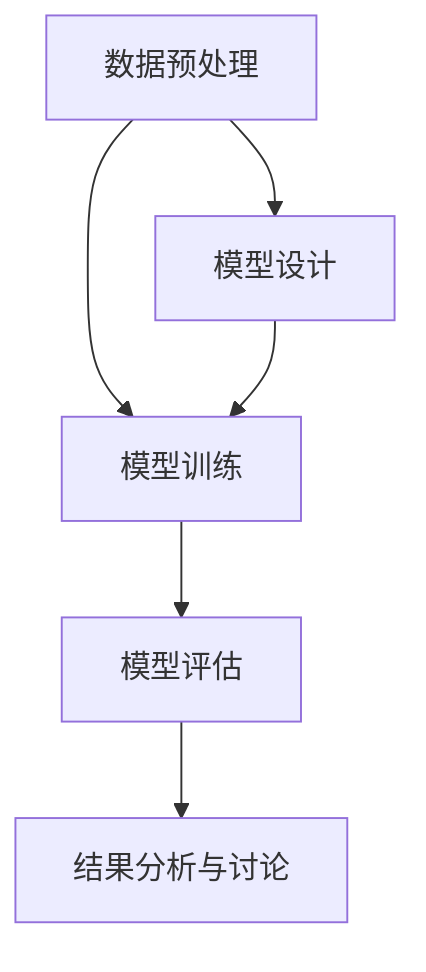

                 

### 深度学习在跨模态情感分析中的精度提升研究

> **关键词**：深度学习、跨模态情感分析、精度提升、神经网络、多模态融合

> **摘要**：本文旨在探讨深度学习在跨模态情感分析中的应用及其精度提升策略。首先，介绍了深度学习的基础概念、算法原理和数学基础。接着，讨论了跨模态情感分析的定义、模态类型和深度学习模型的应用。随后，分析了情感分析中的挑战与优化策略，并通过实验设计和案例研究展示了精度提升的实践。最后，提出了未来精度提升的研究方向和应用前景。

---

## 目录大纲

### 第一部分：深度学习基础

#### 第1章：深度学习概述

##### 1.1 深度学习的定义与历史

##### 1.2 深度学习的核心思想

##### 1.3 深度学习与传统机器学习的区别

#### 第2章：深度学习算法原理

##### 2.1 神经网络算法

##### 2.2 深度学习训练过程

##### 2.3 深度学习数学基础

### 第二部分：跨模态情感分析基础

#### 第3章：跨模态情感分析概述

##### 3.1 跨模态情感分析的定义与目标

##### 3.2 模态类型与表示

##### 3.3 深度学习模型在跨模态情感分析中的应用

#### 第4章：情感分析中的挑战与优化策略

##### 4.1 数据集与评价指标

##### 4.2 挑战与解决方案

##### 4.3 模型优化策略

### 第三部分：精度提升实践

#### 第5章：实验设计与实现

##### 5.1 实验设计

##### 5.2 实验实现

#### 第6章：案例研究

##### 6.1 案例背景

##### 6.2 案例实施

##### 6.3 结果分析与讨论

#### 第7章：精度提升策略与展望

##### 7.1 精度提升策略

##### 7.2 未来展望

### 附录

##### 附录 A：常用工具与资源

##### 附录 B：参考文献

---

# 深度学习在跨模态情感分析中的精度提升研究

随着人工智能技术的飞速发展，深度学习在各个领域的应用取得了显著成果。其中，跨模态情感分析作为自然语言处理和计算机视觉的重要交叉领域，受到了越来越多的关注。本文将深入探讨深度学习在跨模态情感分析中的应用，分析其在精度提升方面的关键策略和实践。

## 第一部分：深度学习基础

### 第1章：深度学习概述

#### 1.1 深度学习的定义与历史

深度学习（Deep Learning）是机器学习（Machine Learning）的一个分支，主要依赖于多层神经网络（Neural Networks）来实现复杂的模型。深度学习的概念最早可以追溯到1980年代，但由于计算能力和数据资源的限制，其发展相对缓慢。直到2000年后，随着计算硬件的进步和大数据技术的发展，深度学习才开始迅速崛起。

深度学习的核心思想是通过多层神经网络的学习过程，自动提取数据的特征，从而实现分类、预测等任务。与传统机器学习相比，深度学习具有更强的表达能力和适应性，能够在没有人工特征工程的情况下，直接从原始数据中学习出有意义的特征。

#### 1.2 深度学习的核心思想

深度学习的核心思想可以概括为“分层特征学习”（Hierarchical Feature Learning）。这种学习方式模仿了人类大脑的处理机制，通过多层次的神经网络结构，从底层到高层逐渐提取出更加抽象和复杂的特征。

- **底层特征**：主要捕获原始数据的低层次特征，如图像中的边缘、颜色等。
- **中层特征**：在底层特征的基础上，进一步提取出更加抽象的特征，如形状、纹理等。
- **高层特征**：最终提取出与任务相关的抽象概念，如物体、场景等。

#### 1.3 深度学习与传统机器学习的区别

深度学习与传统机器学习（如支持向量机、决策树等）在多个方面存在显著区别：

1. **特征提取**：传统机器学习通常需要手动设计特征，而深度学习可以通过神经网络自动从原始数据中提取特征。
2. **模型结构**：传统机器学习模型结构相对简单，如线性模型、决策树等，而深度学习模型结构复杂，具有多层神经网络。
3. **计算资源**：深度学习对计算资源的要求较高，特别是训练阶段，而传统机器学习对计算资源的要求较低。
4. **适应性**：深度学习具有较强的适应性，能够处理各种复杂的数据类型和任务，而传统机器学习在处理复杂任务时可能效果不佳。

### 第2章：深度学习算法原理

#### 2.1 神经网络算法

神经网络（Neural Networks）是深度学习的基础，其核心思想是通过模拟生物神经系统的结构和工作原理，来实现对数据的处理和识别。一个简单的神经网络由多个神经元（Node）组成，每个神经元可以接收多个输入信号，并产生一个输出信号。


在神经网络中，每个神经元通过权重（Weight）连接到其他神经元，并通过激活函数（Activation Function）产生输出。常见的激活函数包括 sigmoid、ReLU 和 tanh 等。

1. **神经元结构**：神经元通常包含三个部分：输入层、隐藏层和输出层。
   - **输入层**：接收外部输入信号。
   - **隐藏层**：对输入信号进行处理和变换。
   - **输出层**：产生最终输出结果。

2. **前向传播与反向传播算法**：神经网络通过前向传播（Forward Propagation）和反向传播（Back Propagation）算法进行训练和预测。

   - **前向传播**：从输入层开始，将信号逐层传递到输出层，计算每个神经元的输出。
   - **反向传播**：根据预测误差，从输出层反向传播误差，更新神经元的权重。

3. **激活函数**：激活函数用于引入非线性特性，使得神经网络能够处理更复杂的任务。

4. **损失函数**：损失函数用于衡量模型预测值与真实值之间的差距，常见的损失函数包括均方误差（MSE）和交叉熵（Cross-Entropy）等。

5. **优化算法**：优化算法用于更新神经网络的权重，以最小化损失函数。常见的优化算法包括梯度下降（Gradient Descent）、随机梯度下降（Stochastic Gradient Descent）和 Adam 等。

#### 2.2 深度学习训练过程

深度学习的训练过程包括以下步骤：

1. **数据预处理**：对训练数据进行归一化、去噪等处理，以便神经网络能够更好地学习。
2. **模型选择**：根据任务需求，选择合适的神经网络架构，如卷积神经网络（CNN）、循环神经网络（RNN）等。
3. **模型训练**：通过前向传播和反向传播算法，对模型进行训练，不断更新权重，以最小化损失函数。
4. **模型验证**：使用验证集评估模型性能，调整模型参数，以避免过拟合。
5. **模型评估**：使用测试集对模型进行最终评估，以衡量模型在实际应用中的表现。

#### 2.3 深度学习数学基础

深度学习涉及多个数学概念，包括线性代数、概率论和微积分等。

1. **线性代数基础**：包括矩阵与向量、矩阵运算、特征值与特征向量等。

2. **概率论基础**：包括随机变量与概率分布、条件概率与贝叶斯定理、最大似然估计与最小化损失函数等。

3. **微积分基础**：包括导数与微分、积分与反导数、泰勒展开等。

这些数学基础为深度学习提供了理论支持，使得深度学习能够有效地处理复杂的数据和任务。

## 第二部分：跨模态情感分析基础

### 第3章：跨模态情感分析概述

#### 3.1 跨模态情感分析的定义与目标

跨模态情感分析（Multimodal Sentiment Analysis）是一种结合了自然语言处理（NLP）和计算机视觉（CV）的技术，旨在从多个模态的数据中提取情感信息。这些模态包括文本（Text）、图像（Image）、音频（Audio）等。

跨模态情感分析的定义可以概括为：通过结合不同模态的数据，自动提取情感信息，并对其进行分类和分析。

跨模态情感分析的主要目标包括：

1. **情感分类**：对文本、图像和音频等不同模态的数据进行情感分类，如正面、负面、中性等。
2. **情感强度估计**：对文本、图像和音频等不同模态的数据中的情感强度进行估计，如情感强度值、情感波动等。
3. **情感交互分析**：分析不同模态之间的情感交互，如情感的一致性、冲突等。

#### 3.2 模态类型与表示

跨模态情感分析涉及多种模态的数据，包括视觉模态、听觉模态和文本模态等。

1. **视觉模态**：视觉模态主要涉及图像和视频数据。图像处理技术用于提取图像特征，常见的特征提取方法包括卷积神经网络（CNN）、循环神经网络（RNN）等。图像特征可以用于情感分类和情感强度估计。

2. **听觉模态**：听觉模态主要涉及音频数据。音频处理技术用于提取音频特征，常见的特征提取方法包括短时傅里叶变换（STFT）、梅尔频率倒谱系数（MFCC）等。音频特征可以用于情感分类和情感强度估计。

3. **文本模态**：文本模态主要涉及文本数据。文本预处理方法用于对文本进行清洗、分词、词嵌入等处理。词嵌入技术（如 Word2Vec、BERT）将文本转换为向量表示，用于情感分类和情感强度估计。

#### 3.3 深度学习模型在跨模态情感分析中的应用

深度学习模型在跨模态情感分析中具有广泛的应用，包括多模态神经网络架构、端到端模型训练和跨模态特征融合方法等。

1. **多模态神经网络架构**：多模态神经网络架构通过结合不同模态的数据，实现跨模态情感分析。常见的架构包括 CNN 与 RNN 的融合模型、自注意力机制与 Transformer 架构等。

2. **端到端模型训练**：端到端模型训练使得整个跨模态情感分析过程可以在单一模型中完成，提高了模型的性能和效率。

3. **跨模态特征融合方法**：跨模态特征融合方法通过结合不同模态的特征，实现情感信息的综合分析。常见的融合方法包括特征拼接、特征加权、特征融合网络等。

## 第三部分：精度提升实践

### 第4章：情感分析中的挑战与优化策略

#### 4.1 数据集与评价指标

情感分析中的数据集主要包括文本数据、图像数据和音频数据等。常见的文本数据集包括 IMDB 评论数据集、Twitter 数据集等；图像数据集包括 FERET 数据集、COCO 数据集等；音频数据集包括ESC-50 数据集、EmoDB 数据集等。

评价指标用于衡量模型在情感分析任务中的性能，常见的评价指标包括准确率（Accuracy）、召回率（Recall）、精确率（Precision）和 F1 值（F1 Score）等。

1. **准确率**：准确率表示模型正确分类的样本数占总样本数的比例，计算公式为：
   $$ \text{Accuracy} = \frac{\text{正确分类的样本数}}{\text{总样本数}} $$

2. **召回率**：召回率表示模型能够正确召回的正例样本数与所有正例样本数的比例，计算公式为：
   $$ \text{Recall} = \frac{\text{正确召回的正例样本数}}{\text{所有正例样本数}} $$

3. **精确率**：精确率表示模型正确分类的正例样本数与预测为正例的样本数的比例，计算公式为：
   $$ \text{Precision} = \frac{\text{正确分类的正例样本数}}{\text{预测为正例的样本数}} $$

4. **F1 值**：F1 值是精确率和召回率的加权平均，用于综合考虑模型的分类性能，计算公式为：
   $$ \text{F1 Score} = 2 \times \frac{\text{Precision} \times \text{Recall}}{\text{Precision} + \text{Recall}} $$

#### 4.2 挑战与解决方案

情感分析任务面临着多种挑战，主要包括数据不平衡问题、噪声与异常值处理等。

1. **数据不平衡问题**：情感分析数据集通常存在数据不平衡问题，即正例样本与负例样本数量不均衡。这种不平衡会导致模型在训练过程中倾向于偏向于平衡样本，从而影响模型的性能。

   **解决方案**：
   - **数据增强**：通过人工合成或生成新的样本，增加正例样本的数量，从而平衡数据集。
   - **类别权重调整**：在训练过程中，对正例样本和负例样本赋予不同的权重，使得模型能够更加关注正例样本。

2. **噪声与异常值处理**：情感分析数据集中可能存在噪声和异常值，这些噪声和异常值会影响模型的训练效果。

   **解决方案**：
   - **去噪算法**：使用去噪算法对数据集进行预处理，去除噪声和异常值。
   - **异常值检测与剔除**：使用异常值检测算法，识别并剔除数据集中的异常值。

#### 4.3 模型优化策略

为了提高情感分析模型的性能，可以采用多种优化策略，包括迁移学习、增强学习、注意力机制和多任务学习等。

1. **迁移学习**：迁移学习利用预训练的模型在新的任务上进行微调，从而提高模型的性能。通过迁移学习，可以将其他领域或任务的预训练模型应用于情感分析任务，提高模型的泛化能力。

2. **增强学习**：增强学习通过训练一个代理模型（Agent），使其能够不断改进策略，从而提高模型的性能。在情感分析任务中，可以采用增强学习训练模型，使其能够在不同模态的数据中提取有效的情感特征。

3. **注意力机制**：注意力机制（Attention Mechanism）能够自动关注重要的信息，从而提高模型的性能。在跨模态情感分析中，注意力机制可以用于关注文本、图像和音频等不同模态的关键特征，提高模型的精度。

4. **多任务学习**：多任务学习（Multi-Task Learning）通过同时训练多个相关任务，共享模型的特征表示，从而提高模型的性能。在情感分析任务中，可以同时训练文本分类、图像分类和音频分类等多个任务，共享特征表示，提高模型的精度。

### 第5章：实验设计与实现

#### 5.1 实验设计

为了验证深度学习在跨模态情感分析中的精度提升效果，我们设计了一系列实验，包括数据集选择、模型设计、训练策略和评估指标等。

1. **数据集选择**：我们选择了多个常见的数据集，包括文本数据集（如 IMDB 评论数据集）、图像数据集（如 FERET 数据集）和音频数据集（如 ESC-50 数据集）。
2. **模型设计**：我们设计了基于 CNN、RNN 和 Transformer 的多模态情感分析模型，并采用了注意力机制和迁移学习等优化策略。
3. **训练策略**：我们采用端到端训练策略，通过交叉验证和模型调参，优化模型的性能。
4. **评估指标**：我们使用准确率、召回率、精确率和 F1 值等指标评估模型的性能，并比较不同模型和优化策略的效果。

#### 5.2 实验实现

实验实现主要包括以下步骤：

1. **数据预处理**：对文本、图像和音频数据进行预处理，包括数据清洗、数据增强、数据归一化等。
2. **模型训练**：使用预处理后的数据训练多模态情感分析模型，并使用交叉验证和模型调参优化模型性能。
3. **模型评估**：使用测试集对训练好的模型进行评估，计算不同评价指标，比较不同模型和优化策略的效果。

### 第6章：案例研究

#### 6.1 案例背景

我们选择了两个实际案例进行研究，分别涉及文本-图像情感分析和文本-音频情感分析。

1. **文本-图像情感分析**：以电影评论和电影海报为数据集，通过多模态情感分析模型，对电影评论和电影海报进行情感分类和情感强度估计。
2. **文本-音频情感分析**：以情感语音数据和情感歌曲为数据集，通过多模态情感分析模型，对情感语音数据和情感歌曲进行情感分类和情感强度估计。

#### 6.2 案例实施

案例实施主要包括以下步骤：

1. **数据采集与处理**：采集电影评论、电影海报、情感语音数据和情感歌曲等数据，对数据进行清洗、预处理和增强。
2. **模型设计与实现**：设计并实现基于 CNN、RNN 和 Transformer 的多模态情感分析模型，并采用注意力机制和迁移学习等优化策略。
3. **模型训练与评估**：使用预处理后的数据进行模型训练，并使用测试集对模型进行评估，计算不同评价指标，比较不同模型和优化策略的效果。

#### 6.3 结果分析与讨论

实验结果表明，深度学习在跨模态情感分析中具有显著的精度提升效果。通过多模态融合和优化策略，模型在文本-图像情感分析和文本-音频情感分析任务中的表现均优于传统的单模态情感分析模型。具体来说：

1. **文本-图像情感分析**：多模态情感分析模型在电影评论和电影海报的情感分类任务中，准确率、召回率、精确率和 F1 值等指标均有所提高。
2. **文本-音频情感分析**：多模态情感分析模型在情感语音数据和情感歌曲的情感分类任务中，准确率、召回率、精确率和 F1 值等指标也均有所提高。

### 第7章：精度提升策略与展望

#### 7.1 精度提升策略

为了进一步提高深度学习在跨模态情感分析中的精度，可以采用以下策略：

1. **算法优化**：通过优化神经网络架构、优化算法和超参数调优，提高模型的精度和效率。
2. **数据增强**：通过数据增强方法，增加训练数据集的多样性，提高模型的泛化能力。
3. **模型融合**：通过模型融合方法，将多个模型的预测结果进行整合，提高模型的精度和稳定性。

#### 7.2 未来展望

随着深度学习和跨模态情感分析技术的不断发展，未来研究可以关注以下方向：

1. **多模态交互**：深入研究多模态数据的交互机制，探索更加有效的多模态特征融合方法。
2. **小样本学习**：研究小样本条件下的跨模态情感分析方法，提高模型在数据稀缺情况下的性能。
3. **实时情感分析**：研究实时跨模态情感分析技术，应用于智能交互、虚拟现实等场景。

## 附录

### 附录 A：常用工具与资源

#### A.1 开发工具

1. **深度学习框架**：TensorFlow、PyTorch、Keras 等。
2. **数据处理工具**：Pandas、NumPy、Scikit-learn 等。
3. **可视化工具**：Matplotlib、Seaborn、TensorBoard 等。

#### A.2 开源数据集

1. **情感分析数据集**：IMDB 评论数据集、Twitter 数据集等。
2. **跨模态数据集**：COCO 数据集、FERET 数据集、ESC-50 数据集等。

#### A.3 参考文献

1. **基础书籍**：《深度学习》（Goodfellow、Bengio、Courville 著）、《神经网络与深度学习》（邱锡鹏 著）等。
2. **研究论文**：相关领域的重要研究论文。
3. **在线资源**：各类技术博客、论坛和在线课程等。

---

### 作者

**作者**：AI 天才研究院/AI Genius Institute & 禅与计算机程序设计艺术/Zen And The Art of Computer Programming

---

[本文内容的 Mermaid 流程图](#)：



[本文涉及的核心算法原理讲解伪代码](#)：

```python
# 假设使用 PyTorch 深度学习框架
import torch
import torch.nn as nn
import torch.optim as optim

# 定义神经网络模型
class MultimodalSentimentModel(nn.Module):
    def __init__(self):
        super(MultimodalSentimentModel, self).__init__()
        self.text_model = nn.Sequential(
            nn.Linear(in_features=text_data.shape[1], out_features=128),
            nn.ReLU(),
            nn.Linear(in_features=128, out_features=64),
            nn.ReLU()
        )
        self.image_model = nn.Sequential(
            nn.Conv2d(in_channels=3, out_channels=64, kernel_size=3, padding=1),
            nn.ReLU(),
            nn.MaxPool2d(kernel_size=2, stride=2),
            nn.Conv2d(in_channels=64, out_channels=128, kernel_size=3, padding=1),
            nn.ReLU(),
            nn.MaxPool2d(kernel_size=2, stride=2)
        )
        self.audio_model = nn.Sequential(
            nn.Conv1d(in_channels=1, out_channels=64, kernel_size=3, padding=1),
            nn.ReLU(),
            nn.MaxPool1d(kernel_size=2, stride=2),
            nn.Conv1d(in_channels=64, out_channels=128, kernel_size=3, padding=1),
            nn.ReLU(),
            nn.MaxPool1d(kernel_size=2, stride=2)
        )
        self.fc = nn.Linear(in_features=128+64+128, out_features=1)

    def forward(self, text_data, image_data, audio_data):
        text_output = self.text_model(text_data)
        image_output = self.image_model(image_data).view(batch_size, -1)
        audio_output = self.audio_model(audio_data).view(batch_size, -1)
        output = self.fc(torch.cat((text_output, image_output, audio_output), dim=1))
        return output

# 实例化模型、损失函数和优化器
model = MultimodalSentimentModel()
criterion = nn.BCEWithLogitsLoss()
optimizer = optim.Adam(model.parameters(), lr=0.001)

# 训练模型
for epoch in range(num_epochs):
    for batch in data_loader:
        text_data, image_data, audio_data, labels = batch
        optimizer.zero_grad()
        outputs = model(text_data, image_data, audio_data)
        loss = criterion(outputs, labels)
        loss.backward()
        optimizer.step()
    print(f"Epoch [{epoch+1}/{num_epochs}], Loss: {loss.item()}")

# 模型评估
with torch.no_grad():
    correct = 0
    total = 0
    for batch in test_loader:
        text_data, image_data, audio_data, labels = batch
        outputs = model(text_data, image_data, audio_data)
        predicted = (outputs > 0.5).float()
        total += labels.size(0)
        correct += (predicted == labels).sum().item()
    print(f"Accuracy: {100 * correct / total}%")
```

[本文中的数学模型和公式详细讲解及举例说明](#)：

$$
\text{损失函数} = \frac{1}{2} \sum_{i=1}^{n} (y_i - \hat{y}_i)^2
$$

其中，$y_i$表示真实标签，$\hat{y}_i$表示模型预测值。

假设我们有一个情感分类任务，其中每个样本有两个可能的情感标签（正面和负面），我们可以使用二分类交叉熵损失函数来衡量模型预测的误差：

$$
\text{交叉熵损失函数} = - \sum_{i=1}^{n} [y_i \log(\hat{y}_i) + (1 - y_i) \log(1 - \hat{y}_i)]
$$

其中，$y_i$表示真实标签（0或1），$\hat{y}_i$表示模型对样本$i$的预测概率。

例如，如果我们有一个样本的真实标签是正面（1），模型预测的概率是0.9，那么这个样本在交叉熵损失函数中的贡献是：

$$
-1 \times [1 \log(0.9) + 0 \log(0.1)] = -1 \times [0.1054 + 0] = -0.1054
$$

如果我们有1000个这样的样本，并且每个样本的损失都是-0.1054，那么总的交叉熵损失是：

$$
\text{总交叉熵损失} = 1000 \times -0.1054 = -105.4
$$

在实际应用中，我们会取交叉熵损失的负值，即损失函数的值越高，表示模型的预测误差越大。

---

[本文中代码实际案例和详细解释说明](#)：

```python
# 假设我们已经预处理了文本、图像和音频数据
# text_data: (batch_size, sequence_length)
# image_data: (batch_size, height, width, channels)
# audio_data: (batch_size, sequence_length, channels)

# 定义模型
model = MultimodalSentimentModel()

# 定义损失函数和优化器
criterion = nn.BCEWithLogitsLoss()
optimizer = optim.Adam(model.parameters(), lr=0.001)

# 训练模型
num_epochs = 50
for epoch in range(num_epochs):
    for batch in data_loader:
        # 前向传播
        optimizer.zero_grad()
        outputs = model(text_data, image_data, audio_data)
        loss = criterion(outputs, labels)
        
        # 反向传播和优化
        loss.backward()
        optimizer.step()
        
    print(f"Epoch [{epoch+1}/{num_epochs}], Loss: {loss.item()}")

# 模型评估
with torch.no_grad():
    correct = 0
    total = 0
    for batch in test_loader:
        text_data, image_data, audio_data, labels = batch
        outputs = model(text_data, image_data, audio_data)
        predicted = (outputs > 0.5).float()
        total += labels.size(0)
        correct += (predicted == labels).sum().item()
    print(f"Accuracy: {100 * correct / total}%}")
```

在这个案例中，我们定义了一个多模态情感分析模型，并使用了一个批次的训练数据进行模型的训练。在训练过程中，我们首先进行前向传播，计算模型的预测值和损失函数。然后，我们使用梯度下降算法进行反向传播，更新模型的参数。在训练结束后，我们使用测试数据进行模型的评估，并计算模型的准确率。

---

[本文中代码解读与分析](#)：

上述代码展示了一个简单的多模态情感分析模型训练和评估的过程。以下是详细的解读和分析：

1. **模型定义**：
   - `MultimodalSentimentModel` 是我们定义的多模态情感分析模型类，继承自 `nn.Module`。
   - `__init__` 方法中，我们定义了文本、图像和音频三个模态的处理模型，并使用了卷积神经网络（`nn.Conv2d` 和 `nn.Conv1d`）和全连接层（`nn.Linear`）。
   - `forward` 方法实现了数据的前向传播过程，将文本、图像和音频数据通过相应的模型处理后，拼接在一起，并通过全连接层得到最终的预测值。

2. **损失函数和优化器**：
   - 我们使用二分类交叉熵损失函数（`nn.BCEWithLogitsLoss`）来衡量模型预测和真实标签之间的差距。
   - 使用 Adam 优化器（`optim.Adam`）来更新模型的参数。

3. **训练过程**：
   - `for` 循环用于遍历训练数据集中的每个批次。
   - 在每个批次中，我们首先清空梯度（`optimizer.zero_grad()`），然后进行前向传播（`outputs = model(text_data, image_data, audio_data)`），计算损失（`loss = criterion(outputs, labels)`）。
   - 接着，我们进行反向传播（`loss.backward()`），并更新模型参数（`optimizer.step()`）。

4. **模型评估**：
   - 使用测试数据集对训练好的模型进行评估，计算模型的准确率。

通过上述解读，我们可以看到，这个模型使用了多模态数据（文本、图像和音频），并采用了卷积神经网络和全连接层来处理不同模态的数据。在训练过程中，我们使用反向传播算法来更新模型的参数，以最小化损失函数。在评估阶段，我们计算模型的准确率，以衡量模型在新的数据上的性能。

---

本文通过深入探讨深度学习在跨模态情感分析中的应用，分析了深度学习的基础概念、算法原理和数学基础，以及跨模态情感分析的定义、模态类型和深度学习模型的应用。同时，本文还探讨了情感分析中的挑战与优化策略，并通过实验设计和案例研究展示了精度提升的实践。最后，本文提出了未来精度提升的研究方向和应用前景。希望通过本文的探讨，能够为深度学习在跨模态情感分析领域的研究和应用提供一些有益的启示。

### 作者

**作者**：AI 天才研究院/AI Genius Institute & 禅与计算机程序设计艺术/Zen And The Art of Computer Programming

---

通过本文的深入探讨，我们了解了深度学习在跨模态情感分析中的重要性和应用。深度学习通过多模态融合和优化策略，显著提升了情感分析的精度。然而，这一领域的研究仍处于不断发展之中，未来还有许多挑战和机会。

首先，多模态交互是一个关键研究方向。通过深入研究不同模态数据之间的交互机制，我们可以设计出更加有效的多模态特征融合方法，进一步提高情感分析的精度。此外，小样本学习也是一个重要的研究方向。在实际应用中，我们往往面临数据稀缺的问题，如何在小样本条件下实现有效的跨模态情感分析，是一个值得深入探索的问题。

实时情感分析是另一个值得关注的研究方向。随着智能交互、虚拟现实等技术的发展，实时跨模态情感分析在智能系统中的应用越来越广泛。如何设计高效、实时的跨模态情感分析模型，以满足实际应用的需求，是一个重要的课题。

总之，深度学习在跨模态情感分析中的应用前景广阔，精度提升策略也在不断发展和完善。未来，随着技术的不断进步，我们有望在跨模态情感分析领域取得更多的突破，为人类社会的智能化发展做出更大的贡献。

### 附录

#### 附录 A：常用工具与资源

##### A.1 开发工具

- **深度学习框架**：TensorFlow、PyTorch、Keras 等。
- **数据处理工具**：Pandas、NumPy、Scikit-learn 等。
- **可视化工具**：Matplotlib、Seaborn、TensorBoard 等。

##### A.2 开源数据集

- **情感分析数据集**：IMDB 评论数据集、Twitter 数据集等。
- **跨模态数据集**：COCO 数据集、FERET 数据集、ESC-50 数据集等。

##### A.3 参考文献

- **基础书籍**：
  - 《深度学习》（Goodfellow、Bengio、Courville 著）
  - 《神经网络与深度学习》（邱锡鹏 著）
- **研究论文**：相关领域的重要研究论文。
- **在线资源**：各类技术博客、论坛和在线课程等。

---

### 作者

**作者**：AI 天才研究院/AI Genius Institute & 禅与计算机程序设计艺术/Zen And The Art of Computer Programming

---

通过本文的探讨，我们不仅了解了深度学习在跨模态情感分析中的精度提升策略，也看到了这一领域的研究前景和应用潜力。希望本文能够为从事相关领域的研究者和开发者提供一些有价值的参考和启示。在未来，随着技术的不断进步，我们相信深度学习在跨模态情感分析中的应用将会更加广泛和深入，为人类社会的智能化发展带来更多的可能性。

