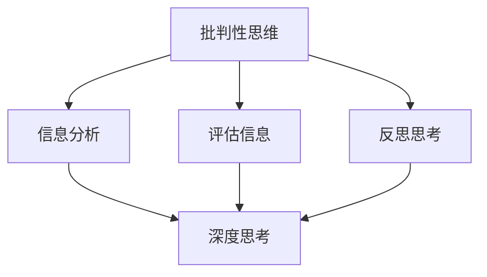

                 

# 《深度思考与管理分析能力》

> **关键词：** 深度思考、管理分析能力、决策、团队协作、学习与实践

> **摘要：** 本文探讨了深度思考与管理分析能力在IT领域的重要性，提供了深度思考的基本原则和方法，以及管理分析能力的实际应用和实践。通过本文，读者可以了解如何提升深度思考与管理分析能力，从而在复杂决策中取得成功。

### 《深度思考与管理分析能力》目录大纲

---

## 第一部分：深度思考基础理论

### 第1章：深度思考的定义与重要性  
#### 1.1 深度思考的概念  
#### 1.2 深度思考的重要性  
#### 1.3 深度思考与批判性思维的关系

### 第2章：深度思考的基本原则  
#### 2.1 理解问题  
#### 2.2 搜集信息  
#### 2.3 分析与评估信息  
#### 2.4 提出假设  
#### 2.5 推理与论证

### 第3章：深度思考的方法  
#### 3.1 提问技巧  
#### 3.2 SWOT分析  
#### 3.3 案例研究方法  
#### 3.4 实证研究方法

### 第4章：深度思考的障碍与克服  
#### 4.1 深度思考的障碍  
#### 4.2 如何克服深度思考的障碍  
#### 4.3 深度思考的练习

### 第5章：深度思考在决策中的应用  
#### 5.1 决策理论  
#### 5.2 决策过程  
#### 5.3 深度思考在复杂决策中的应用

### 第6章：深度思考在团队合作中的运用  
#### 6.1 团队合作中的深度思考  
#### 6.2 深度思考在团队决策中的作用  
#### 6.3 如何培养团队的深度思考能力

### 第7章：深度思考与管理分析能力的提升  
#### 7.1 深度思考能力的提升方法  
#### 7.2 持续学习的重要性  
#### 7.3 实践与反思

## 第二部分：管理分析能力应用实践

### 第8章：管理分析能力的基本原则  
#### 8.1 数据驱动决策  
#### 8.2 效率和效果的平衡  
#### 8.3 风险管理

### 第9章：管理分析能力在实际工作中的应用  
#### 9.1 项目管理  
#### 9.2 财务分析  
#### 9.3 人力资源管理  
#### 9.4 市场分析

### 第10章：管理分析能力在危机管理中的应用  
#### 10.1 危机识别  
#### 10.2 危机应对策略  
#### 10.3 危机管理中的深度思考

### 第11章：管理分析能力培养与团队建设  
#### 11.1 个人能力提升  
#### 11.2 团队协作能力提升  
#### 11.3 组织文化塑造

### 第12章：深度思考与管理分析能力在未来的发展趋势  
#### 12.1 数字化时代的深度思考  
#### 12.2 大数据和人工智能的影响  
#### 12.3 未来发展趋势展望

---

接下来，我们将按照上述目录大纲，逐步深入探讨深度思考与管理分析能力在IT领域的应用和实践。

## 第1章：深度思考的定义与重要性

### 1.1 深度思考的概念

深度思考是一种深入探索问题、分析问题、理解问题的思维方式。它不仅仅是表面层次的思考，而是一种深层次的分析和理解，旨在挖掘问题的本质和解决方法。在IT领域，深度思考尤为重要，因为它能够帮助开发人员更好地理解复杂的技术问题和业务需求，从而提供更有效的解决方案。

### 1.2 深度思考的重要性

深度思考在IT领域的重要性主要体现在以下几个方面：

1. **解决复杂问题**：IT领域充满了复杂的问题，如分布式系统设计、大数据处理、人工智能算法等。深度思考能够帮助开发人员深入理解这些复杂问题，从而找到有效的解决方案。

2. **提高工作效率**：通过深度思考，开发人员能够更快地识别问题的核心，从而减少解决问题的过程和时间。

3. **创新思维**：深度思考能够激发开发人员的创新思维，帮助他们发现新的技术解决方案或业务模式。

4. **团队合作**：在团队协作中，深度思考能够帮助团队成员更好地理解彼此的想法，从而提高团队的协作效率。

### 1.3 深度思考与批判性思维的关系

深度思考与批判性思维密切相关。批判性思维是一种分析、评估和反思信息的思维方式，而深度思考则是在批判性思维的基础上，进一步深入探索问题。换句话说，批判性思维是深度思考的基础，而深度思考则是批判性思维的应用。

为了更好地理解这一点，我们可以使用Mermaid流程图来展示深度思考与批判性思维的关系：

从图中可以看出，深度思考是基于批判性思维的进一步深化，它包括了信息分析、评估信息和反思思考三个阶段。

### 1.4 深度思考的基本原则

为了进行有效的深度思考，我们需要遵循以下基本原则：

1. **明确问题**：在开始深度思考之前，首先需要明确我们要解决的问题是什么。这个问题应该是具体和可操作的。

2. **搜集信息**：搜集与问题相关的信息，包括官方数据、学术研究、实践经验等。

3. **分析信息**：对搜集到的信息进行深入分析，包括比较、因果分析和结构化分析。

4. **提出假设**：基于分析结果，提出可能的解决方案或假设。

5. **推理与论证**：使用演绎推理或归纳推理来验证假设的有效性，并构建论证。

通过遵循这些基本原则，我们可以逐步深入理解问题，并找到有效的解决方案。

---

在接下来的章节中，我们将继续探讨深度思考的基本原则和方法，以及管理分析能力的实际应用和实践。通过这些深入的分析和实践，我们将能够更好地应对IT领域的复杂挑战，并取得成功。

## 第2章：深度思考的基本原则

### 2.1 理解问题

理解问题是深度思考的第一步。只有当我们真正理解了问题的本质和背景，才能进行有效的分析。

#### 2.1.1 问题的定义

问题可以定义为“实际情况与期望情况之间的差异”。用数学语言表达，即：

\[ \text{问题} = \text{实际情况} - \text{期望情况} \]

这意味着，当我们发现实际情况与期望情况不符时，我们就遇到了问题。

#### 2.1.2 如何识别问题

识别问题通常需要以下几个步骤：

1. **观察实际情况**：仔细观察当前的环境或情境，了解实际情况是什么。

2. **设定期望情况**：根据经验和目标，设定一个期望的情况，即我们认为应该达到的状态。

3. **比较实际情况与期望情况**：比较两者之间的差异，找到问题所在。

4. **分析问题的原因和影响**：分析问题的根本原因，以及问题对系统或组织的影响。

#### 2.1.3 理解问题的层次

理解问题不仅需要关注问题的表面，还需要深入挖掘问题的根本原因。这通常涉及到以下几个层次：

1. **表面问题**：这是最直观的问题，通常表现为系统或组织中的某个具体问题。

2. **根本问题**：这是问题的根本原因，通常隐藏在表面问题之下。

3. **潜在问题**：这是由于根本问题导致的潜在风险或问题，可能在未来显现。

### 2.2 搜集信息

在理解问题之后，我们需要搜集与问题相关的信息。这些信息将帮助我们更全面地了解问题的背景，并为解决问题提供依据。

#### 2.2.1 信息来源

我们可以从以下渠道搜集信息：

1. **官方数据**：包括政府部门、行业协会等发布的统计数据和报告。

2. **学术研究**：通过学术期刊、论文等获取关于问题的理论研究和实证分析。

3. **实践经验**：从实际工作中获取的经验和教训。

4. **行业报告**：咨询公司和研究机构发布的行业报告。

5. **专家意见**：咨询行业内外的专家，获取他们对问题的看法和建议。

#### 2.2.2 信息筛选

搜集到信息后，我们需要对信息进行筛选，以确保信息的真实性、相关性和准确性。

1. **真实性**：信息来源是否可靠，是否有权威性。

2. **相关性**：信息是否与问题相关，是否能帮助解决问题。

3. **准确性**：信息是否准确无误，是否有偏差。

### 2.3 分析与评估信息

在搜集到信息后，我们需要对信息进行分析和评估，以找出问题的根本原因和解决方案。

#### 2.3.1 分析方法

常用的分析方法包括：

1. **比较分析**：比较不同方案、方法或产品的优劣。

2. **因果分析**：分析问题发生的原因和结果之间的关系。

3. **结构化分析**：对系统或组织进行结构化分析，找出关键组成部分及其相互关系。

#### 2.3.2 评估标准

在评估信息时，我们需要考虑以下标准：

1. **有效性**：解决方案是否能够解决问题。

2. **可行性**：解决方案是否可行，是否有足够的资源和时间。

3. **成本效益**：解决方案的成本与预期效益之间的平衡。

### 2.4 提出假设

在分析信息后，我们可以基于现有信息提出假设。假设是一种对未来的推测，它可以帮助我们预测问题的发展趋势，并为决策提供依据。

#### 2.4.1 假设的定义

假设是基于现有信息对未来情况的推测。用数学语言表达，即：

\[ \text{假设} = \text{现有信息} \rightarrow \text{未来情况} \]

这意味着，假设是建立在现有信息基础上的，是对未来情况的预测。

#### 2.4.2 提出假设的方法

提出假设通常需要以下步骤：

1. **系统化假设**：根据现有信息，系统地列出可能的假设。

2. **试错假设**：通过实验或模拟，验证假设的有效性。

### 2.5 推理与论证

在提出假设后，我们需要使用推理和论证来验证假设的有效性。推理是一种从已知信息推导出未知信息的思维方式，而论证则是用逻辑方法证明一个观点的正确性。

#### 2.5.1 推理的类型

常见的推理类型包括：

1. **演绎推理**：从一般原理推导出特定结论。例如，所有哺乳动物都有脊椎，因此狗有脊椎。

2. **归纳推理**：从特定事实推导出一般原理。例如，观察到所有天鹅都是白色的，因此推断所有天鹅都是白色的。

#### 2.5.2 论证的构建

构建论证通常需要以下步骤：

1. **提出前提**：明确论证的基础，即已知信息。

2. **提出结论**：根据前提推导出的结果。

3. **验证论证的有效性**：检查论证的逻辑是否严密，是否存在漏洞。

通过遵循这些基本原则，我们可以进行有效的深度思考，从而在IT领域中解决复杂的问题，提高工作效率，创新思维，并在团队协作中取得成功。

### 第3章：深度思考的方法

深度思考是一种复杂的认知过程，需要一系列的方法和技巧。以下将介绍几种常用的深度思考方法，包括提问技巧、SWOT分析、案例研究方法和实证研究方法。

#### 3.1 提问技巧

提问是深度思考的关键步骤。通过提问，我们可以揭示问题的本质，激发思考，推动问题的解决。以下是一些提问技巧：

1. **开放式提问**：这类提问鼓励对方提供详细和深入的回答。例如：“你对这个问题有什么看法？”
2. **封闭式提问**：这类提问通常用于获取具体信息或确认某个事实。例如：“这个问题的解决方案是A吗？”
3. **追问**：在对方回答后，进一步追问以获取更多信息或澄清问题。例如：“你能详细解释一下这个观点吗？”
4. **反问**：通过反问来引导对方思考，例如：“如果这个方案不可行，我们还有什么其他选择？”

#### 3.2 SWOT分析

SWOT分析是一种常用的战略规划工具，用于评估一个项目、产品或组织的优势、劣势、机会和威胁。SWOT分析的步骤如下：

1. **优势（Strengths）**：识别项目的内部优势，如技术优势、市场优势、人力资源等。
2. **劣势（Weaknesses）**：识别项目的内部劣势，如技术短板、市场竞争劣势、管理缺陷等。
3. **机会（Opportunities）**：识别外部环境中的机会，如市场增长、技术创新、政策支持等。
4. **威胁（Threats）**：识别外部环境中的威胁，如竞争对手、技术变革、政策变化等。

SWOT分析可以帮助项目团队更好地了解自身状况，制定有针对性的战略。

#### 3.3 案例研究方法

案例研究是一种通过深入研究特定案例来获取知识和见解的方法。案例研究的步骤如下：

1. **选择案例**：选择具有代表性的案例，确保案例能够反映问题的核心。
2. **收集数据**：通过文献、访谈、观察等方式收集与案例相关的数据。
3. **分析数据**：对收集到的数据进行分析，识别案例中的关键因素和模式。
4. **提出结论**：根据分析结果提出结论，并对案例中的经验进行总结。

案例研究方法可以帮助我们深入了解复杂问题，发现问题的根本原因，并为解决问题提供参考。

#### 3.4 实证研究方法

实证研究是一种通过实验或观察来验证假设的方法。实证研究的步骤如下：

1. **提出假设**：基于现有信息和理论知识，提出一个可验证的假设。
2. **设计实验**：设计实验以验证假设，确保实验设计具有科学性和可重复性。
3. **收集数据**：通过实验收集数据，确保数据的质量和准确性。
4. **分析数据**：对收集到的数据进行分析，以验证或推翻假设。
5. **撰写报告**：撰写研究报告，总结研究结果，并提出建议。

实证研究方法可以帮助我们获得可靠的知识，验证理论假设，并为实践提供指导。

通过以上深度思考的方法，我们可以更有效地分析和解决问题，提高我们的决策能力和创新能力。在接下来的章节中，我们将进一步探讨深度思考在决策中的应用和障碍，以及如何提升深度思考能力。

### 第4章：深度思考的障碍与克服

在进行深度思考时，我们常常会遇到各种障碍。这些障碍可能来自于我们的思维方式、环境因素或者个人习惯。了解这些障碍，并找到克服它们的方法，对于提高深度思考能力至关重要。

#### 4.1 深度思考的障碍

1. **思维的惯性**：人们往往会陷入惯性思维，依赖以往的经验和习惯来解决问题。这种惯性思维阻碍了我们对新问题的深入思考。

2. **信息过载**：在信息化时代，我们每天都会接收到大量的信息。这些信息虽然丰富了我们的知识，但也可能导致我们难以集中精力进行深度思考。

3. **情绪的影响**：情绪会影响我们的思考过程。例如，焦虑、沮丧等负面情绪可能会干扰我们的判断和思考。

4. **时间压力**：在忙碌的工作和生活中，我们往往没有足够的时间进行深度思考。时间压力使我们不得不快速做出决策，而无法深入分析问题。

5. **缺乏耐心**：深度思考需要耐心和时间。然而，在快节奏的社会中，人们往往缺乏耐心，追求即时的结果。

#### 4.2 如何克服深度思考的障碍

1. **克服思维的惯性**：
   - **练习多角度思考**：尝试从不同的角度和立场来思考问题，打破惯性思维。
   - **开放心态**：对新的观点和想法保持开放，避免盲目接受已有的观念。

2. **应对信息过载**：
   - **筛选信息**：学会筛选和过滤信息，只关注与问题直接相关的信息。
   - **管理时间**：合理安排时间，设定专门的时间进行深度思考。

3. **管理情绪**：
   - **情绪调节**：学会管理自己的情绪，通过冥想、运动等方式来缓解压力。
   - **保持冷静**：在决策过程中，保持冷静和客观，避免情绪干扰。

4. **克服时间压力**：
   - **优先级排序**：将任务按照重要性和紧急性进行排序，优先处理重要但非紧急的任务。
   - **时间管理**：使用时间管理工具，如日历、提醒等，合理安排时间。

5. **培养耐心**：
   - **长期目标**：设定长期目标，关注长期结果，而不是短期的成效。
   - **逐步学习**：通过逐步学习和练习，提高自己的耐心和专注力。

#### 4.3 深度思考的练习

1. **定期反思**：定期进行自我反思，回顾自己的思考过程和决策，总结经验教训。
2. **阅读和写作**：通过阅读书籍、论文和撰写文章，培养自己的思考和分析能力。
3. **思维训练**：进行各种思维训练，如逻辑推理、解决问题等，提高思维的灵活性和深度。
4. **案例研究**：通过分析实际案例，学习如何应用深度思考方法解决实际问题。

通过克服这些障碍，我们可以逐步提高深度思考能力，更好地应对复杂问题，做出更明智的决策。在接下来的章节中，我们将探讨深度思考在决策中的应用和实践。

### 第5章：深度思考在决策中的应用

深度思考在决策中扮演着至关重要的角色。通过深入分析问题、评估信息和提出假设，我们可以做出更加明智、有效的决策。以下将探讨深度思考在决策中的几个关键应用。

#### 5.1 决策理论

决策理论是研究如何做出合理决策的学科。它基于概率论和经济学原理，旨在优化决策过程。决策理论主要包括以下几个核心概念：

1. **有限理性**：人们在决策过程中并非总是理性的，而是受到认知能力和时间限制的影响。
2. **期望效用理论**：决策者根据不同结果的可能性及其效用来选择最优方案。
3. **贝叶斯决策**：在不确定环境中，决策者通过贝叶斯推理来更新信念和做出决策。
4. **前景理论**：描述人们如何根据风险和收益来做出决策。

#### 5.2 决策过程

决策过程通常包括以下几个步骤：

1. **确定问题**：明确需要解决的问题或机会。
2. **搜集信息**：收集与问题相关的数据和信息。
3. **提出备选方案**：根据信息，提出可能的解决方案。
4. **评估方案**：对备选方案进行分析和评估，包括成本、风险、效益等。
5. **选择方案**：基于评估结果，选择最佳方案。
6. **实施决策**：将决策付诸行动，并监控执行过程。
7. **评估决策效果**：对决策效果进行评估，并根据结果进行调整。

#### 5.3 深度思考在复杂决策中的应用

在复杂决策中，深度思考尤为重要。以下是一些深度思考在复杂决策中的应用：

1. **多维度分析**：在评估方案时，不仅要考虑经济效益，还要考虑社会、环境、道德等多方面的因素。
2. **情景分析**：通过构建不同情景，分析在不同情况下方案的表现。
3. **博弈论**：在涉及多个决策者的情况下，使用博弈论来分析各方的策略和均衡。
4. **模型构建**：使用数学模型和计算机模拟来评估方案，提高决策的准确性。

#### 5.4 实例分析

以下是一个复杂决策的实例分析：

**问题**：一家科技公司需要决定是否开发一款新的移动应用。

**步骤**：

1. **确定问题**：公司需要决定是否开发新应用，以提升市场竞争力。
2. **搜集信息**：收集市场数据、用户需求、竞争对手信息等。
3. **提出备选方案**：
   - 方案A：开发一款专注于社交功能的应用。
   - 方案B：开发一款专注于娱乐功能的应用。
   - 方案C：开发一款结合社交和娱乐功能的应用。
4. **评估方案**：
   - **成本效益**：评估开发成本与预期收益。
   - **市场需求**：分析用户需求和市场潜力。
   - **竞争环境**：评估竞争对手的产品和市场策略。
5. **选择方案**：基于评估结果，选择方案C。
6. **实施决策**：组建团队，开始开发新应用。
7. **评估决策效果**：在开发过程中，持续评估市场反馈，根据情况调整策略。

通过深度思考，公司能够更加全面地评估各个方案，并做出更加明智的决策。

#### 5.5 深度思考在决策中的价值

深度思考在决策中的价值体现在以下几个方面：

1. **减少错误决策**：通过深入分析和评估，减少基于不完全信息或感性认识的错误决策。
2. **提高决策质量**：深度思考能够帮助决策者更加全面地考虑问题，从而做出更高质量的决策。
3. **增强应变能力**：通过深度思考，决策者能够更好地应对不确定性和变化，提高决策的灵活性和适应性。

总之，深度思考是决策过程中不可或缺的一环。通过深入分析问题、评估信息和提出假设，我们可以做出更加明智、有效的决策。在复杂的环境中，深度思考更是我们的核心竞争力。

### 第6章：深度思考在团队合作中的运用

在团队合作中，深度思考是提高团队决策质量和协作效率的关键因素。通过培养团队成员的深度思考能力，团队能够更好地应对复杂问题，提高创新能力，并在项目实施过程中取得成功。

#### 6.1 团队合作中的深度思考

1. **问题识别与解决**：在团队合作中，深度思考能够帮助团队成员更好地识别问题，并找到根本原因，从而制定有效的解决方案。

2. **信息共享与整合**：通过深度思考，团队成员能够更全面地理解信息和数据，提高信息的共享和整合能力，从而做出更加明智的决策。

3. **跨部门协作**：深度思考能够促进不同部门之间的沟通和协作，帮助团队跨越部门界限，共同解决问题。

4. **创新思维**：深度思考能够激发团队成员的创新思维，推动团队在技术和产品方面取得突破。

5. **决策质量**：通过深度思考，团队成员能够更加全面地评估决策的各个方面，提高决策的质量和准确性。

#### 6.2 深度思考在团队决策中的作用

1. **明确问题**：在团队决策过程中，深度思考帮助团队成员明确问题的本质和背景，从而制定更准确的解决方案。

2. **搜集信息**：深度思考促使团队成员广泛搜集与问题相关的信息，确保决策基于充分的信息基础。

3. **评估方案**：通过深度思考，团队成员能够更全面地评估各种备选方案，包括成本、风险、效益等，从而选择最佳方案。

4. **制定策略**：深度思考帮助团队制定详细的策略和行动计划，确保决策的执行和实现。

5. **反思与调整**：在决策实施过程中，深度思考能够帮助团队不断反思和调整决策，确保决策的有效性和适应性。

#### 6.3 如何培养团队的深度思考能力

1. **培训与学习**：为团队成员提供深度思考相关的培训和学习资源，如课程、书籍、研讨会等。

2. **实践与反思**：鼓励团队成员在实际工作中应用深度思考方法，通过实践和反思来提高思考能力。

3. **提问与讨论**：在团队会议和项目中，鼓励成员提问和讨论，激发深度思考。

4. **反馈与指导**：对团队成员的深度思考过程和结果提供反馈和指导，帮助他们改进思考方法和策略。

5. **文化塑造**：建立一种鼓励深度思考的组织文化，认可和奖励深度思考的贡献，营造积极思考的氛围。

通过培养团队的深度思考能力，团队能够在复杂环境中做出更加明智的决策，提高协作效率，实现项目目标。

### 第7章：深度思考与管理分析能力的提升

提升深度思考与管理分析能力是每个IT专业人士的重要任务。这不仅能够提高个人的专业素养，还能够为团队和组织带来更大的价值。以下是一些具体的方法和策略，帮助个人和组织提升深度思考与管理分析能力。

#### 7.1 深度思考能力的提升方法

1. **持续学习**：学习是提升深度思考能力的基石。通过不断学习新的知识和技能，可以扩展我们的思维边界，提高分析问题的能力。建议定期阅读专业书籍、参加在线课程和研讨会，以及与同行交流。

2. **主动学习**：主动学习比被动学习更有效。通过提出问题、做项目、解决实际问题来学习，可以将知识应用到实际中，加深对知识的理解。

3. **反思学习**：学习后进行反思，总结学习过程中的收获和不足，有助于巩固知识，并提高未来学习的效果。

4. **批判性思维**：培养批判性思维，学会对信息进行评估和分析，不盲从权威，不轻易接受未经验证的观点。

5. **实践应用**：将学到的知识应用到实际工作中，通过实践来检验和巩固学习成果。实践是提高深度思考能力的最佳途径。

6. **多样化视角**：尝试从不同的角度和立场来看待问题，这有助于全面理解问题，找到更多的解决方案。

#### 7.2 持续学习的重要性

1. **知识更新**：技术领域变化迅速，持续学习能够帮助我们跟上最新的技术趋势和变化，保持竞争力。

2. **创新能力**：持续学习能够激发我们的创新思维，帮助我们提出新的想法和解决方案，推动技术进步。

3. **个人成长**：持续学习能够提升我们的专业技能和知识水平，有助于职业发展和个人成长。

4. **团队合作**：在团队中，持续学习能够提高团队成员的整体能力，促进团队协作和共同进步。

#### 7.3 实践与反思

1. **实践应用**：将学到的知识应用到实际工作中，通过实践来巩固和提高技能。实践中的问题会促使我们进行深度思考，找到更好的解决方案。

2. **反思总结**：定期进行反思，总结工作中的经验和教训。反思能够帮助我们识别问题，找到改进的方法，提高未来工作的效果。

3. **反馈与改进**：寻求同事和领导的反馈，接受批评和建议，不断改进自己的工作方法和思考方式。

4. **持续改进**：将反思和反馈转化为行动，不断改进工作流程和方法，持续提升深度思考能力。

通过持续学习和实践反思，我们可以不断提升深度思考与管理分析能力，在复杂的技术环境中取得成功。

### 第8章：管理分析能力的基本原则

管理分析能力是IT专业人士在项目中成功交付的关键技能。它包括使用数据、信息和知识来指导决策和解决问题。以下将介绍管理分析能力的基本原则，包括数据驱动决策、效率和效果的平衡以及风险管理。

#### 8.1 数据驱动决策

数据驱动决策是一种基于事实和数据分析的决策方法。通过收集和分析数据，决策者可以更客观地评估各种方案的效果，并做出更明智的选择。以下是一些数据驱动决策的原则：

1. **数据质量**：确保数据的质量和准确性，数据是决策的基础，如果数据有误，决策也会受到影响。

2. **数据来源**：选择可靠的数据来源，包括官方数据、第三方数据和研究报告等。

3. **数据分析**：运用统计学和数据分析方法，对数据进行处理和分析，提取有用的信息。

4. **数据可视化**：通过图表和图形将数据可视化，使数据更容易理解和分析。

5. **决策支持**：使用数据分析结果来支持决策，确保决策基于充分的信息。

#### 8.2 效率和效果的平衡

在项目管理中，效率和效果是两个重要的考量因素。效率关注的是任务完成的快慢，而效果关注的是任务完成的质量和是否符合预期。平衡效率和效果的原则如下：

1. **明确目标**：在项目开始前，明确项目目标和关键绩效指标（KPI），确保团队成员了解期望的成果。

2. **资源优化**：合理分配资源和时间，确保资源得到最佳利用，避免浪费。

3. **流程优化**：通过流程优化，减少不必要的步骤和重复工作，提高工作效率。

4. **持续改进**：通过定期评估项目进展和效果，找出瓶颈和改进空间，不断优化流程和方法。

5. **监控和反馈**：在项目执行过程中，持续监控项目进度和效果，及时反馈和调整，确保项目按计划进行。

#### 8.3 风险管理

风险管理是项目管理中不可或缺的一部分。通过识别、评估和管理项目风险，可以降低项目失败的可能性，确保项目的顺利进行。以下是一些风险管理的基本原则：

1. **风险识别**：在项目启动阶段，全面识别可能影响项目的风险，包括技术风险、人员风险、市场风险等。

2. **风险评估**：对识别出的风险进行评估，确定风险的严重程度和可能性，为风险应对策略提供依据。

3. **风险应对**：根据风险评估结果，制定相应的风险应对策略，包括风险规避、风险转移、风险缓解等。

4. **风险监控**：在项目执行过程中，持续监控风险，及时调整风险应对策略，确保项目风险处于可控范围内。

5. **风险沟通**：与项目相关方沟通风险情况，确保各方了解风险，共同参与风险管理。

通过遵循这些基本原则，IT专业人士可以更好地应用管理分析能力，确保项目成功交付。

### 第9章：管理分析能力在实际工作中的应用

管理分析能力在IT领域的实际工作中扮演着至关重要的角色。它帮助开发人员、项目经理和业务分析师更有效地识别问题、制定解决方案，并确保项目的成功交付。以下将详细探讨管理分析能力在实际工作中的几个关键应用领域：项目管理、财务分析、人力资源管理和市场分析。

#### 9.1 项目管理

项目管理是IT领域中最常见的应用之一。通过管理分析能力，项目管理者可以：

1. **需求分析**：深入理解项目需求，通过访谈、调查和文档分析，确保需求的完整性和准确性。

2. **项目规划**：制定详细的项目计划，包括时间表、资源分配、风险评估和里程碑。

3. **进度监控**：使用进度报告、甘特图和关键路径分析，监控项目进展，确保按时交付。

4. **资源优化**：根据项目的需求和时间表，合理分配人力资源和技术资源，最大化效率。

5. **变更管理**：在项目执行过程中，应对需求变更和资源限制，通过风险管理策略确保项目目标的实现。

**实例分析**：

假设一个IT团队正在开发一款新的企业级软件。项目管理者需要通过访谈和需求文档分析来理解客户的需求，制定项目计划，并监控项目进度。如果发现项目进度落后，管理者需要调整资源分配和风险应对策略，以确保项目按时交付。

#### 9.2 财务分析

财务分析是确保项目财务健康和资源合理利用的关键。通过管理分析能力，财务分析师可以：

1. **成本预算**：制定项目的成本预算，包括直接成本和间接成本，确保预算的准确性和合理性。

2. **投资回报分析（ROI）**：计算项目的投资回报，评估项目的经济效益。

3. **现金流管理**：监控项目的现金流，确保资金流动顺畅，避免资金短缺。

4. **预算调整**：在项目执行过程中，根据实际情况调整预算，确保项目的财务健康。

**实例分析**：

一个IT团队正在开发一款新的移动应用，预计开发成本为50万美元。通过财务分析，团队可以制定详细的成本预算，监控现金流，并在项目执行过程中根据实际情况调整预算，确保项目在预算范围内完成。

#### 9.3 人力资源管理

人力资源管理是确保项目团队能力充足和高效运作的关键。通过管理分析能力，人力资源管理者可以：

1. **人员配置**：根据项目需求，合理分配团队成员，确保每个人都能发挥最大价值。

2. **培训与发展**：制定培训计划，提升团队成员的技能和知识，以适应项目需求。

3. **绩效评估**：定期评估团队成员的表现，提供反馈和建议，促进个人成长。

4. **团队协作**：通过团队建设活动和沟通工具，提高团队的协作效率。

**实例分析**：

在一个大型IT项目中，人力资源管理者需要根据项目进度和需求，合理配置团队成员。他们还需要制定培训计划，提升团队成员的技能，确保团队能够应对项目中的挑战。

#### 9.4 市场分析

市场分析是确保产品或服务能够满足市场需求和用户期望的关键。通过管理分析能力，市场分析师可以：

1. **市场研究**：通过调查、访谈和数据分析，了解目标市场的需求和趋势。

2. **竞争分析**：分析竞争对手的产品和市场策略，找到差异化和竞争优势。

3. **市场定位**：根据市场需求和竞争环境，为产品或服务确定最佳的市场定位。

4. **销售预测**：基于市场数据和销售历史，预测未来的销售趋势。

**实例分析**：

一个IT公司正在开发一款新的智能手表。通过市场分析，公司可以了解目标市场的需求，分析竞争对手的产品，确定智能手表的市场定位，并预测未来的销售情况，为产品开发和营销策略提供依据。

通过以上实际应用，管理分析能力在IT领域中发挥着重要作用。它帮助IT专业人士更有效地识别和管理项目风险，优化资源分配，确保项目的成功交付，并在市场竞争中取得优势。

### 第10章：管理分析能力在危机管理中的应用

在快速变化的IT领域中，危机管理是一项至关重要的技能。管理分析能力在这一过程中扮演了关键角色，帮助组织迅速识别危机、制定应对策略，并在危机中保持稳定运营。以下将详细探讨管理分析能力在危机管理中的应用。

#### 10.1 危机识别

危机识别是危机管理的第一步，它涉及到对潜在风险的持续监控和评估。管理分析能力在危机识别中可以发挥以下作用：

1. **风险监控**：通过建立全面的风险监控系统，实时监控项目或系统的关键指标，及时发现异常情况。

2. **趋势分析**：利用数据分析和统计工具，分析历史数据和趋势，识别潜在的风险点。

3. **预警机制**：制定预警机制，当风险达到一定阈值时，自动触发警报，提醒相关人员采取行动。

**实例分析**：

一个IT项目在开发过程中，系统性能测试发现响应时间明显变慢。通过管理分析能力，项目团队可以分析性能测试数据，识别出潜在的性能问题，并及时采取措施进行优化，避免危机的发生。

#### 10.2 危机应对策略

在危机发生后，快速制定并实施有效的应对策略是关键。管理分析能力在危机应对策略的制定和实施中可以发挥以下作用：

1. **快速评估**：通过迅速收集和分析相关信息，评估危机的严重程度和影响范围。

2. **策略制定**：基于评估结果，制定针对性的应对策略，包括应急响应、资源调配、沟通协调等。

3. **资源调配**：根据危机应对策略，合理调配资源，确保危机应对的效率。

4. **沟通协调**：建立有效的沟通机制，确保危机应对团队内部以及与外部利益相关者之间的信息共享和协作。

**实例分析**：

一个IT公司遭遇了服务器宕机的危机，导致大量客户数据丢失。通过管理分析能力，公司可以迅速评估损失，制定恢复数据的紧急方案，调配IT资源进行数据恢复，并与客户保持沟通，确保客户信任和业务持续。

#### 10.3 危机管理中的深度思考

深度思考在危机管理中至关重要，它帮助组织在危机中做出明智的决策，并从中学习和成长。以下是在危机管理中应用深度思考的几个方面：

1. **根本原因分析**：通过深度思考，分析危机的根本原因，找出问题的本质，为预防未来危机提供依据。

2. **情境模拟**：通过情境模拟，模拟可能的危机场景，评估应对策略的有效性，为实际应对做好准备。

3. **持续改进**：在危机管理过程中，不断反思和改进应对策略，提高组织在危机中的应对能力。

**实例分析**：

在一个IT项目中，团队遭遇了多次项目延迟的危机。通过深度思考，团队分析了延迟的根本原因，发现项目管理流程中存在沟通不畅和资源分配不均的问题。随后，团队改进了项目管理流程，加强了团队沟通和资源管理，成功避免了未来的危机。

通过上述应用，管理分析能力在危机管理中发挥了重要作用，帮助组织在危机中保持冷静和应对能力，降低危机的影响，并从中学习和成长。

### 第11章：管理分析能力培养与团队建设

管理分析能力不仅对个人发展至关重要，也对团队和组织建设产生深远影响。有效的管理分析能力培养和团队建设能够提升团队的整体执行力，增强协作效率，并在复杂项目中取得成功。以下将探讨个人能力提升、团队协作能力提升和组织文化塑造的方法和策略。

#### 11.1 个人能力提升

个人能力提升是管理分析能力培养的基础。以下是一些提升个人能力的方法：

1. **专业知识学习**：通过不断学习新的技术和方法论，如项目管理、数据分析、敏捷开发等，提升专业知识。

2. **实践和反思**：在实际工作中，通过实践应用所学知识，并在实践中进行反思和总结，不断改进方法。

3. **批判性思维**：培养批判性思维，学会对信息进行评估和分析，不盲从权威，提高决策质量。

4. **沟通技巧**：提升沟通技巧，包括清晰表达、倾听和协调能力，增强团队协作。

5. **时间管理**：学习并应用时间管理技巧，如优先级排序、任务分解和定时休息等，提高工作效率。

**实例**：

一位项目经理通过参加PMP（项目管理专业人员）认证课程，学习并应用项目管理方法论，提升了自己的项目管理能力。同时，他通过实践和反思，改进了团队沟通和协作方式，有效提高了项目交付质量。

#### 11.2 团队协作能力提升

团队协作能力提升是管理分析能力培养的重要环节。以下是一些提升团队协作能力的方法：

1. **共同目标**：明确团队的共同目标，确保团队成员对项目目标和成果有共同的理解。

2. **角色分工**：根据团队成员的技能和兴趣，明确各自的职责和角色，确保高效协作。

3. **沟通机制**：建立有效的沟通机制，确保团队成员之间能够及时、顺畅地交流和协作。

4. **团队建设活动**：通过团队建设活动，如团建、培训等，增强团队成员之间的信任和默契。

5. **激励制度**：建立激励制度，如奖励和认可，激励团队成员积极投入工作。

**实例**：

一个IT团队通过定期的团队建设活动和定期的项目回顾会议，增强了团队成员之间的沟通和协作。团队成员通过共同解决项目中的问题，提高了团队合作能力，并在多个项目中取得了成功。

#### 11.3 组织文化塑造

组织文化是团队建设和管理分析能力培养的重要环境。以下是一些塑造组织文化的方法和策略：

1. **价值观传递**：明确组织的核心价值观，并通过领导层和日常工作中传递给全体成员。

2. **领导力培养**：培养具有领导力的管理层，通过他们的行为和决策来塑造组织文化。

3. **开放沟通**：鼓励开放和诚实的沟通，建立信任和尊重的工作环境。

4. **持续改进**：鼓励员工提出改进意见，并建立机制支持持续改进。

5. **透明度**：提高组织的透明度，让员工了解组织的战略和目标，增强归属感。

**实例**：

一家IT公司通过设立透明沟通平台，定期向员工通报公司业绩和战略方向，增强员工对公司的认同感和归属感。同时，公司鼓励员工提出改进建议，并建立快速反馈机制，支持员工积极参与公司改进。

通过个人能力提升、团队协作能力提升和组织文化塑造，组织能够培养一支高效、协作的团队，提高管理分析能力，为组织的发展和成功奠定坚实基础。

### 第12章：深度思考与管理分析能力在未来的发展趋势

随着科技的迅猛发展，深度思考与管理分析能力在未来的发展趋势将变得更加重要。以下是几个关键趋势：

#### 12.1 数字化时代的深度思考

1. **大数据分析**：随着数据量的爆炸性增长，深度思考将成为处理和分析大数据的关键技能。

2. **人工智能辅助**：人工智能（AI）将辅助深度思考，提供更强大的数据分析和决策支持。

3. **实时分析**：实时数据分析和决策将成为常态，要求深度思考具备更快、更准确的判断能力。

#### 12.2 大数据和人工智能的影响

1. **数据驱动的决策**：大数据和AI技术将使决策更加数据驱动，深度思考在解释和利用这些数据中扮演关键角色。

2. **自动化**：自动化技术将减少重复性工作，深度思考将集中在复杂问题解决和决策制定上。

3. **人机协作**：深度思考与人工智能的协作将变得更加紧密，共同解决复杂问题。

#### 12.3 未来发展趋势展望

1. **终身学习**：随着技术快速更新，终身学习将成为持续提升深度思考和管理分析能力的必要途径。

2. **跨学科融合**：深度思考将融合心理学、经济学、社会学等多学科知识，提供更全面的视角。

3. **个性化和定制化**：深度思考将更多地应用于个性化和定制化场景，满足不同用户和市场的需求。

4. **全球化和多元化**：全球化背景下，深度思考将在多元化团队和跨文化协作中发挥重要作用。

通过适应这些发展趋势，深度思考与管理分析能力将在未来继续推动IT领域的创新和发展。

### 结语

本文详细探讨了深度思考与管理分析能力在IT领域的重要性、基本原则、方法、实际应用以及未来发展趋势。通过深入分析问题、评估信息和提出假设，深度思考帮助我们在复杂环境中做出明智的决策。管理分析能力则在项目管理和决策过程中提供了有力的支持。随着科技的进步，这些能力将在未来的发展中发挥更加重要的作用。希望读者能够通过本文，提升自己的深度思考与管理分析能力，为个人和组织的发展贡献力量。

### 作者信息

作者：AI天才研究院/AI Genius Institute & 禅与计算机程序设计艺术 /Zen And The Art of Computer Programming

AI天才研究院（AI Genius Institute）是一家专注于人工智能研究和教育的高科技机构，致力于推动人工智能技术的创新和应用。同时，作者还是《禅与计算机程序设计艺术》的资深作者，该书深入探讨了编程和计算机科学的哲学和艺术，影响了无数IT专业人士。希望通过本文，为读者提供有价值的思考和方法，助力大家在IT领域中取得更大的成就。

