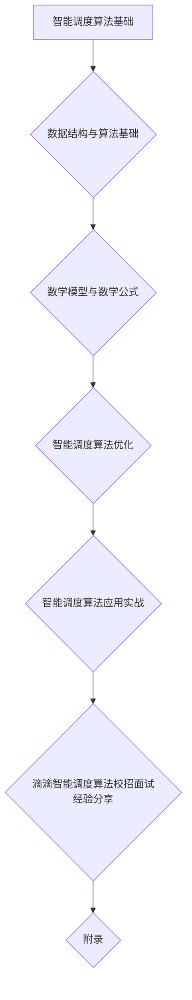
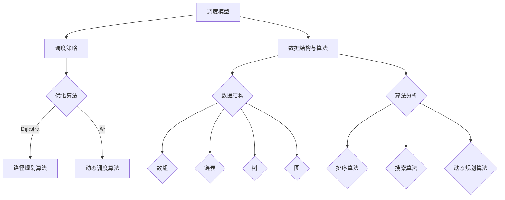

                 

# 《滴滴2024智能调度算法优化校招面试经验》

## 关键词
智能调度算法，滴滴，校招面试，算法优化，路径规划，动态调度，实时调度，数据结构，算法分析，数学模型

## 摘要
本文将围绕滴滴2024校招面试中智能调度算法优化的相关内容展开，首先介绍智能调度算法的基础知识，包括定义、发展历程和核心组成部分。接着，深入探讨数据结构与算法基础，数学模型及公式的应用。随后，详细讲解动态调度算法、路径规划算法和实时调度算法的原理、伪代码和案例分析。最后，分享滴滴智能调度算法的实战经验，总结校招面试准备、面试常见问题及提升面试技巧的建议，并对智能调度算法的未来发展进行展望。

# 《滴滴2024智能调度算法优化校招面试经验》目录大纲

## 第一部分：智能调度算法基础

### 第1章：智能调度算法概述

#### 1.1 智能调度算法的定义与重要性

#### 1.2 智能调度算法的发展历程

#### 1.3 智能调度算法的核心组成部分

### 第2章：数据结构与算法基础

#### 2.1 数据结构概述

#### 2.2 常用算法分析

#### 2.3 算法优化策略

### 第3章：数学模型与数学公式

#### 3.1 数学模型在调度算法中的应用

#### 3.2 数学公式详解

#### 3.3 数学公式应用示例

## 第二部分：智能调度算法优化

### 第4章：动态调度算法

#### 4.1 动态调度算法概述

#### 4.2 动态调度算法原理与伪代码

#### 4.3 动态调度算法案例分析

### 第5章：路径规划算法

#### 5.1 路径规划算法概述

#### 5.2 A*算法原理与伪代码

#### 5.3 Dijkstra算法原理与伪代码

#### 5.4 路径规划算法案例分析

### 第6章：实时调度算法

#### 6.1 实时调度算法概述

#### 6.2 实时调度算法原理与伪代码

#### 6.3 实时调度算法案例分析

### 第7章：智能调度算法应用实战

#### 7.1 实际应用场景介绍

#### 7.2 调度算法开发环境搭建

#### 7.3 调度算法源代码实现与解读

#### 7.4 调度算法效果评估与分析

## 第三部分：滴滴智能调度算法校招面试经验分享

### 第8章：校招面试准备

#### 8.1 面试流程与注意事项

#### 8.2 面试题型及解题策略

#### 8.3 案例分析与面试技巧

### 第9章：面试常见问题与解答

#### 9.1 技术问题解析

#### 9.2 行业问题解析

#### 9.3 个人问题解析

### 第10章：总结与建议

#### 10.1 校招面试经验总结

#### 10.2 提升面试技巧的建议

#### 10.3 智能调度算法发展方向展望

## 附录

### 附录A：智能调度算法相关资料

#### A.1 调度算法相关论文推荐

#### A.2 调度算法开源项目推荐

#### A.3 调度算法书籍推荐

### 附录B：常见面试问题汇总

#### B.1 数据结构与算法问题汇总

#### B.2 调度算法问题汇总

#### B.3 行业相关问题汇总

### 附录C：滴滴智能调度算法团队简介

#### C.1 团队介绍

#### C.2 团队成果展示

#### C.3 加入我们

## Mermaid 流程图



---

在接下来的内容中，我们将逐步深入探讨智能调度算法的基础知识，包括定义、发展历程和核心组成部分，以便为后续的深入讨论和案例分析打下坚实的基础。让我们开始吧！<|user|>
## 第1章：智能调度算法概述

### 1.1 智能调度算法的定义与重要性

智能调度算法是指利用人工智能技术，对系统中的任务和资源进行合理分配和调度，以达到最优性能和效率的一类算法。在日常生活中，智能调度算法广泛应用于交通运输、物流配送、生产线调度等领域。其中，滴滴出行的智能调度算法便是其核心竞争力之一。

智能调度算法的重要性主要体现在以下几个方面：

1. **提高资源利用率**：通过合理的调度，使得资源能够得到最大限度的利用，降低闲置率和浪费率。
2. **优化用户体验**：通过智能调度，使得任务能够得到快速响应和完成，提高用户满意度。
3. **降低运营成本**：通过优化调度策略，减少不必要的资源消耗，从而降低整体运营成本。
4. **提升系统稳定性**：通过调度算法，能够更好地应对突发情况，提高系统的鲁棒性和稳定性。

### 1.2 智能调度算法的发展历程

智能调度算法的发展历程可以分为以下几个阶段：

1. **传统调度算法阶段**：最早期的智能调度算法主要基于规则和经验，如最短作业优先（SJF）、最短剩余时间优先（SRTF）等。这些算法虽然能够解决一些简单的调度问题，但在复杂环境中效果不佳。

2. **启发式调度算法阶段**：随着计算机技术的发展，人们开始尝试使用启发式算法来解决调度问题。如遗传算法（GA）、模拟退火算法（SA）等。这些算法能够在一定程度上优化调度结果，但往往需要较长的计算时间。

3. **人工智能调度算法阶段**：近年来，随着深度学习和强化学习等人工智能技术的发展，智能调度算法得到了迅速发展。如深度强化学习（DRL）算法在滴滴出行的智能调度系统中得到了广泛应用。

### 1.3 智能调度算法的核心组成部分

智能调度算法通常由以下几个核心组成部分构成：

1. **调度模型**：调度模型是智能调度算法的基础，它定义了任务和资源的属性，以及调度策略的目标函数。常见的调度模型包括最小完成时间（makespan）、最大收益（profit）、最小成本（cost）等。

2. **调度策略**：调度策略是指算法如何根据调度模型对任务和资源进行分配和调度。常见的调度策略包括静态调度策略、动态调度策略、协同调度策略等。

3. **优化算法**：优化算法是智能调度算法的核心，它负责求解调度模型，找到最优或近似最优的调度结果。常见的优化算法包括遗传算法、模拟退火算法、深度强化学习算法等。

4. **调度系统**：调度系统是将调度算法应用于实际场景的系统。它通常包括任务生成模块、调度模块、执行模块等，能够实时监测系统状态，并根据调度结果进行任务调度。

综上所述，智能调度算法作为一种先进的人工智能技术，在提高资源利用率、优化用户体验、降低运营成本、提升系统稳定性等方面具有显著优势。随着人工智能技术的不断发展，智能调度算法在未来将得到更广泛的应用。在接下来的章节中，我们将深入探讨数据结构与算法基础，以及智能调度算法的优化方法。让我们继续前进！<|user|>
### 1.4 智能调度算法的应用场景

智能调度算法在众多应用场景中展现了其强大的功能和优势，以下列举几个典型的应用场景：

1. **交通运输领域**：滴滴出行的智能调度算法是交通运输领域的一个典型案例。通过实时调度乘客和司机，优化路线和行程时间，提升乘客的出行体验，降低司机的运营成本。此外，智能调度算法还在公共交通、物流配送等领域有着广泛的应用。

2. **生产制造领域**：在生产制造领域，智能调度算法用于生产计划的制定和设备资源的调度。通过优化生产流程，提高生产效率，降低生产成本，提高产品质量。例如，在汽车制造、电子制造等行业，智能调度算法已经得到了广泛应用。

3. **能源管理领域**：智能调度算法在能源管理领域也有着重要的应用。例如，在电力系统调度中，智能调度算法用于优化电力资源的分配和调度，提高电力系统的稳定性和可靠性。此外，智能调度算法还可以用于太阳能发电、风能发电等可再生能源的管理。

4. **医疗领域**：在医疗领域，智能调度算法可以用于医疗资源的分配和调度。例如，智能调度算法可以优化医院的门诊排班、手术室调度等，提高医疗资源利用效率，降低患者等待时间。

5. **城市交通管理**：智能调度算法在城市交通管理中也有着重要的应用。例如，通过智能调度算法优化交通信号控制，提高道路通行效率，减少交通拥堵。此外，智能调度算法还可以用于公共交通线路规划、共享单车调度等。

6. **仓储物流领域**：智能调度算法在仓储物流领域用于仓库货物的存储和取货路径的优化，提高仓库作业效率，降低物流成本。例如，在电子商务行业，智能调度算法可以优化订单处理流程，提高订单交付速度。

综上所述，智能调度算法在交通运输、生产制造、能源管理、医疗、城市交通管理、仓储物流等多个领域有着广泛的应用。随着技术的不断进步，智能调度算法的应用场景将更加广泛，为各行各业带来更多的便利和效益。在接下来的章节中，我们将深入探讨数据结构与算法基础，为理解和应用智能调度算法打下坚实的基础。让我们继续前进！<|user|>
### 第2章：数据结构与算法基础

#### 2.1 数据结构概述

数据结构是计算机科学中一个重要的概念，它指的是在计算机存储器里组织数据的方式。数据结构不仅影响着算法的执行效率，还决定了程序的设计复杂度和可维护性。以下是几种常见的数据结构：

1. **数组**：数组是一种线性数据结构，它使用连续的内存空间存储元素，可以通过索引快速访问任意位置的元素。

2. **链表**：链表由一系列节点组成，每个节点包含数据和指向下一个节点的指针。链表的主要优点是插入和删除操作较为灵活。

3. **栈**：栈是一种后进先出（LIFO）的数据结构，常用于递归、括号匹配等问题。

4. **队列**：队列是一种先进先出（FIFO）的数据结构，常用于任务调度、缓冲区管理等。

5. **树**：树是一种层级结构，由节点和边组成。常见的树结构包括二叉树、二叉搜索树、平衡树等。

6. **图**：图是由节点和边组成的集合，可以用来表示复杂的关系网络。常见的图结构包括无向图、有向图、加权图等。

每种数据结构都有其适用的场景和优缺点。例如，数组适合随机访问，链表适合插入和删除。理解并熟练运用这些数据结构对于解决复杂问题至关重要。

#### 2.2 常用算法分析

算法是解决问题的一系列步骤和方法。在智能调度算法中，常用的算法包括排序算法、搜索算法、动态规划算法等。

1. **排序算法**：排序算法用于将数据元素按照某种顺序排列。常见的排序算法包括冒泡排序、选择排序、插入排序、快速排序、归并排序等。每种排序算法的时间复杂度和空间复杂度不同，适用于不同的场景。例如，快速排序在大多数情况下具有较好的性能，但可能产生大量的递归调用，而归并排序则相对稳定，但需要额外的空间来存储中间结果。

2. **搜索算法**：搜索算法用于在数据集合中查找特定元素。常见的搜索算法包括顺序搜索、二分搜索、深度优先搜索、广度优先搜索等。二分搜索在有序数组中查找元素非常高效，其时间复杂度为O(log n)，而顺序搜索适用于小规模数据集合，时间复杂度为O(n)。

3. **动态规划算法**：动态规划是一种解决最优子结构问题的算法方法。它将复杂问题分解为若干子问题，通过递归关系求解子问题的最优解，最终得到原问题的最优解。动态规划算法广泛应用于资源分配、路径规划、背包问题等领域。

#### 2.3 算法优化策略

算法优化是提高算法效率和性能的关键步骤。以下是一些常用的算法优化策略：

1. **时间优化**：通过改进算法的执行步骤，减少算法的执行时间。例如，使用更高效的算法替换低效的算法，或者使用分治策略将问题分解为更小的子问题。

2. **空间优化**：通过减少算法的空间复杂度，提高算法的性能。例如，使用原地排序算法减少空间占用，或者使用迭代方法减少递归调用。

3. **并行优化**：利用多核处理器和分布式计算技术，将算法的执行过程并行化，提高计算速度。例如，将数据划分成多个块，并行处理每个块，最后合并结果。

4. **贪心算法**：贪心算法是一种局部最优决策的算法，通过在每个阶段选择当前最优解，逐步逼近全局最优解。贪心算法适用于一些具有贪心性质的问题，如最短路径问题、背包问题等。

5. **动态规划与贪心算法结合**：在某些问题中，可以结合动态规划和贪心算法的优点，设计更高效的算法。例如，在背包问题中，可以先使用动态规划求解子问题，然后使用贪心策略求解全局问题。

通过运用这些算法优化策略，可以显著提高智能调度算法的效率和性能。在接下来的章节中，我们将进一步探讨智能调度算法的优化方法，以实现更好的调度效果。让我们继续前进！<|user|>
### 第3章：数学模型与数学公式

#### 3.1 数学模型在调度算法中的应用

数学模型在智能调度算法中起着至关重要的作用，它帮助我们抽象和描述现实世界的复杂调度问题，并利用数学工具进行求解。以下是几个常见的数学模型及其在调度算法中的应用：

1. **线性规划（Linear Programming, LP）**：
线性规划是一种用来求解线性目标函数在给定线性不等式约束下的最优解的数学方法。在调度算法中，线性规划常用于资源分配问题。例如，在物流调度中，可以建立线性规划模型来优化车辆的装载和路线规划。

2. **整数规划（Integer Programming, IP）**：
整数规划是对线性规划的一种扩展，它允许决策变量的取值为整数。在调度算法中，整数规划常用于解决需要整数解的问题，如人员排班、飞机座位分配等。

3. **动态规划（Dynamic Programming, DP）**：
动态规划是一种求解多阶段决策问题的方法，通过将问题分解为若干子问题，并利用状态转移方程求解每个子问题的最优解。在调度算法中，动态规划常用于求解最优路径问题、作业调度问题等。

4. **排队论（Queuing Theory）**：
排队论是一种用于分析和优化排队系统的数学理论。在调度算法中，排队论可以用于预测系统的繁忙程度、设计合理的排队规则和计算服务时间等。

5. **马尔可夫决策过程（Markov Decision Process, MDP）**：
马尔可夫决策过程是一种用于在不确定环境中进行决策的数学模型。在调度算法中，MDP可以用于智能交通系统的优化、动态资源分配等。

#### 3.2 数学公式详解

以下是几个常用的数学公式及其在调度算法中的应用：

1. **线性规划公式**：
   $$
   \begin{aligned}
   \text{minimize} \quad & c^T x \\
   \text{subject to} \quad & Ax \leq b \\
   & x \geq 0
   \end{aligned}
   $$
   其中，$c$ 是系数向量，$x$ 是决策变量向量，$A$ 和 $b$ 分别是约束矩阵和约束向量。

2. **动态规划状态转移方程**：
   $$
   \begin{aligned}
   f(i, j) = \min_{k \in \{1, 2, ..., m\}} \{f(i-1, k) + c(i, j, k)\}
   \end{aligned}
   $$
   其中，$f(i, j)$ 表示第 $i$ 个阶段在第 $j$ 个状态下的最优值，$c(i, j, k)$ 是状态转移成本。

3. **马尔可夫决策过程状态转移概率**：
   $$
   \begin{aligned}
   p(s', j | s, a) = \begin{cases}
   1, & \text{if } s' = s \\
   0, & \text{otherwise}
   \end{cases}
   \end{aligned}
   $$
   其中，$s$ 是当前状态，$s'$ 是下一个状态，$a$ 是决策动作，$p(s', j | s, a)$ 是在状态 $s$ 下执行动作 $a$ 后转移到状态 $s'$ 的概率。

4. **期望收益计算**：
   $$
   \begin{aligned}
   \text{Expected Reward} = \sum_{s \in S} \sum_{a \in A} r(s, a) \cdot p(s', j | s, a)
   \end{aligned}
   $$
   其中，$r(s, a)$ 是在状态 $s$ 下执行动作 $a$ 的即时奖励，$p(s', j | s, a)$ 是转移概率。

#### 3.3 数学公式应用示例

以下是一个简单的示例，展示如何使用线性规划来解决车辆调度问题：

假设有一个车队，需要将若干辆车辆分配到不同的目的地。每辆车辆有固定的容量和行驶成本，每个目的地有固定的需求量和运输成本。目标是优化车辆的分配，以最小化总运输成本。

**步骤 1：定义变量**
设 $x_{ij}$ 为从起点 $i$ 到目的地 $j$ 的车辆数量。

**步骤 2：建立目标函数**
$$
\begin{aligned}
\text{minimize} \quad & Z = \sum_{i=1}^{n} \sum_{j=1}^{m} c_{ij} x_{ij}
\end{aligned}
$$
其中，$c_{ij}$ 是从起点 $i$ 到目的地 $j$ 的运输成本。

**步骤 3：建立约束条件**
$$
\begin{aligned}
\sum_{j=1}^{m} x_{ij} \leq C_i, & \quad \forall i=1,2,...,n \\
\sum_{i=1}^{n} x_{ij} \leq D_j, & \quad \forall j=1,2,...,m \\
x_{ij} \geq 0, & \quad \forall i,j
\end{aligned}
$$
其中，$C_i$ 是起点 $i$ 的车辆容量限制，$D_j$ 是目的地 $j$ 的需求量限制。

通过解这个线性规划问题，可以得到最优的车辆分配方案，从而实现总运输成本的最小化。

综上所述，数学模型和数学公式在智能调度算法中扮演着重要的角色。它们帮助我们抽象和描述调度问题，并提供了解决问题的数学工具。在接下来的章节中，我们将进一步探讨智能调度算法的优化方法和实战案例。让我们继续前进！<|user|>
## 第4章：动态调度算法

### 4.1 动态调度算法概述

动态调度算法是指能够根据系统状态变化实时调整任务分配和资源调度的算法。与静态调度算法不同，动态调度算法具有更强的适应性和实时性，能够更好地应对动态变化的环境和突发事件。在智能交通、实时资源分配、生产调度等领域，动态调度算法具有重要意义。

动态调度算法的主要特点如下：

1. **实时性**：动态调度算法能够实时监测系统状态，并根据状态变化进行快速调整。
2. **适应性**：动态调度算法能够根据环境变化和任务需求动态调整策略，提高系统性能。
3. **优化性**：动态调度算法通常基于优化模型，旨在找到最优或近似最优的调度方案。

动态调度算法的典型应用包括：

- **智能交通系统**：通过实时优化交通信号控制，提高道路通行效率和减少拥堵。
- **实时资源分配**：在云计算和大数据领域，动态调度算法用于优化计算资源的分配和调度，提高资源利用率和服务质量。
- **生产调度**：在制造行业，动态调度算法用于优化生产计划和资源调度，提高生产效率和降低成本。

### 4.2 动态调度算法原理与伪代码

动态调度算法的核心思想是根据实时反馈信息调整任务分配和资源使用，以达到系统性能的最优化。以下是动态调度算法的基本原理和伪代码：

**基本原理**：

1. **状态监测**：实时监测系统状态，包括资源利用率、任务完成情况等。
2. **任务评估**：根据任务的重要性和紧急程度对任务进行优先级排序。
3. **调度决策**：根据当前系统状态和任务评估结果，选择最优的调度方案。
4. **执行调整**：执行调度决策，调整任务分配和资源使用，更新系统状态。

**伪代码**：

```
function DynamicScheduling算法(input: 系统状态，任务列表)
    初始化调度队列 Q
    while 系统状态未稳定
        监测系统状态
        对任务列表进行优先级排序
        从调度队列 Q 中选取最高优先级的任务
        调度任务并更新系统状态
    end while
end function
```

### 4.3 动态调度算法案例分析

以下是一个动态调度算法在智能交通系统中的应用案例：

**案例背景**：某城市交通管理部门希望优化交通信号控制，提高道路通行效率和减少拥堵。现有多个路口需要控制，每个路口的交通流量和信号灯状态不断变化。

**解决方案**：

1. **状态监测**：通过传感器和网络摄像头实时监测每个路口的交通流量和信号灯状态。
2. **任务评估**：根据交通流量和信号灯状态，对每个路口的任务进行优先级评估。高流量路口优先调整信号灯，以减少拥堵。
3. **调度决策**：采用动态规划算法，根据实时状态和任务评估结果，选择最优的信号灯调整方案。
4. **执行调整**：执行信号灯调整方案，并实时反馈调整效果，持续优化调度策略。

**效果评估**：经过一段时间的运行，该动态调度算法显著降低了道路拥堵，提高了道路通行效率。同时，系统可以根据实时交通状况进行自适应调整，提高了交通管理的灵活性和响应速度。

通过上述案例分析，我们可以看到动态调度算法在应对实时变化和突发事件方面具有显著优势。在接下来的章节中，我们将继续探讨路径规划算法，以期为智能调度算法提供更全面的优化方案。让我们继续前进！<|user|>
## 第5章：路径规划算法

### 5.1 路径规划算法概述

路径规划算法是智能调度算法中的一个重要组成部分，它主要用于确定从起点到终点的最优路径。在自动驾驶、无人机导航、机器人路径规划等领域，路径规划算法至关重要。有效的路径规划算法能够确保系统在复杂环境下安全、高效地完成任务。

路径规划算法的主要特点如下：

1. **全局性**：全局性路径规划算法考虑整个搜索空间，找到从起点到终点的全局最优路径。
2. **局部性**：局部性路径规划算法只考虑当前局部区域，找到当前最优路径，并逐步扩展到全局最优路径。
3. **实时性**：实时性路径规划算法能够根据环境变化和任务需求，实时调整路径。
4. **鲁棒性**：鲁棒性路径规划算法能够在不确定环境中保持较高的路径规划成功率。

路径规划算法的典型应用包括：

- **自动驾驶**：用于确定车辆从当前位置到目的地的最优路径，提高行驶安全性和效率。
- **无人机导航**：用于无人机在复杂环境中的自主导航，确保飞行安全和任务执行。
- **机器人路径规划**：用于机器人从起点到终点的路径规划，提高机器人的自主移动能力。

### 5.2 A*算法原理与伪代码

A*算法是一种全局性路径规划算法，通过计算启发式函数评估路径的优劣，找到从起点到终点的最优路径。A*算法的核心思想是使用两个评价函数，$f(n) = g(n) + h(n)$，其中 $g(n)$ 是从起点到节点 $n$ 的实际距离，$h(n)$ 是从节点 $n$ 到终点的启发式距离。

**原理**：

1. **初始化**：设置一个开放列表（Open List）和一个封闭列表（Closed List），分别存储待探索节点和已探索节点。起始节点 $s$ 加入 Open List。
2. **迭代过程**：
   - 从 Open List 中选取 $f$ 值最小的节点 $n$。
   - 将 $n$ 从 Open List 移除，并加入 Closed List。
   - 对于 $n$ 的所有未探索的邻居节点 $m$，计算 $g(m)$ 和 $h(m)$，如果 $m$ 不在 Closed List 中，则将 $m$ 加入 Open List，并设置 $f(m) = g(m) + h(m)$。
3. **路径重建**：当终点 $t$ 被加入 Closed List 时，算法结束。从终点 $t$ 开始，沿着父节点反向重建路径，得到从起点 $s$ 到终点 $t$ 的最优路径。

**伪代码**：

```
function A*算法(input: 起点 s，终点 t，地图 M)
    Open List = {s}
    Closed List = {}
    while Open List 非空
        n = Open List 中 f(n) 最小的节点
        remove n from Open List
        add n to Closed List
        for each 未探索的邻居节点 m of n
            if m is not in Closed List
                g(m) = g(n) + 节点 n 到节点 m 的实际距离
                h(m) = 节点 m 到终点 t 的启发式距离
                if m not in Open List or g(m) < f(m)
                    add m to Open List
                    set parent of m to n
    end while
    if t is in Closed List
        reconstruct path from t to s using parent pointers
    else
        no path found
    end if
end function
```

### 5.3 Dijkstra算法原理与伪代码

Dijkstra算法是一种局部性路径规划算法，用于计算从起点到其他所有节点的最短路径。Dijkstra算法在每次迭代中扩展最短路径，逐步求解全局最短路径。

**原理**：

1. **初始化**：设置一个距离数组 $dist[]$，初始化所有节点的距离为无穷大，起点距离为0。设置一个优先队列（通常使用二叉堆实现）来存储待扩展的节点。
2. **迭代过程**：
   - 从优先队列中取出距离最小的节点 $n$。
   - 对于 $n$ 的所有未探索的邻居节点 $m$，计算 $dist[m] = \min(dist[m], dist[n] + 边长(n, m))$。如果 $dist[m]$ 发生变化，则将 $m$ 加入优先队列。
3. **路径重建**：一旦计算完成，$dist[]$ 数组中存储了从起点到所有节点的最短路径。

**伪代码**：

```
function Dijkstra算法(input: 起点 s，地图 M)
    dist[s] = 0
    priority_queue Q
    for each 节点 v in M
        if v != s
            dist[v] = ∞
    end for
    Q.insert((s, dist[s]))

    while Q is not empty
        (v, dist[v]) = Q.extract_min()
        for each 未探索的邻居节点 w of v
            if dist[w] > dist[v] + 边长(v, w)
                dist[w] = dist[v] + 边长(v, w)
                Q.insert((w, dist[w]))
    end while

    return dist[]
end function
```

### 5.4 路径规划算法案例分析

以下是一个路径规划算法在无人机导航中的应用案例：

**案例背景**：某无人机需要在复杂环境中从起点 $s$ 到达终点 $t$，环境包含多个障碍物。无人机需要规划一条最优路径，确保安全到达目的地。

**解决方案**：

1. **状态监测**：无人机通过传感器实时监测环境中的障碍物位置和移动情况。
2. **路径规划**：使用 A*算法计算从起点 $s$ 到终点 $t$ 的最优路径，同时考虑障碍物的启发式距离。
3. **路径执行**：无人机根据规划路径执行移动，并实时调整路径以应对环境变化。

**效果评估**：经过多次运行，无人机成功到达目的地，路径规划算法在复杂环境中表现出良好的鲁棒性和实时性。同时，无人机在遇到障碍物时能够迅速调整路径，确保安全飞行。

通过上述案例分析，我们可以看到路径规划算法在无人机导航中的应用效果。在接下来的章节中，我们将探讨实时调度算法，为智能调度算法提供更全面的优化方案。让我们继续前进！<|user|>
## 第6章：实时调度算法

### 6.1 实时调度算法概述

实时调度算法是一种能够根据实时反馈动态调整任务执行顺序和资源分配的算法，旨在最大化系统性能和资源利用率。实时调度算法广泛应用于智能交通系统、工业自动化、金融交易等领域，能够有效应对系统状态的变化和突发事件的冲击。

实时调度算法的主要特点如下：

1. **实时性**：实时调度算法能够快速响应系统状态变化，对任务进行实时调整。
2. **动态性**：实时调度算法能够根据系统动态变化调整调度策略，确保系统性能最优。
3. **鲁棒性**：实时调度算法能够在不确定环境中保持较高的调度成功率，确保系统稳定运行。

实时调度算法的典型应用包括：

- **智能交通系统**：通过实时优化交通信号控制和车辆调度，提高道路通行效率和减少拥堵。
- **工业自动化**：用于实时优化生产计划和设备调度，提高生产效率和降低成本。
- **金融交易**：用于实时优化交易策略和资金调度，提高交易效率和收益。

### 6.2 实时调度算法原理与伪代码

实时调度算法的核心思想是根据系统状态和任务特性，动态调整任务执行顺序和资源分配，以最大化系统性能。以下是实时调度算法的基本原理和伪代码：

**基本原理**：

1. **状态监测**：实时监测系统状态，包括任务完成情况、资源利用情况等。
2. **任务评估**：根据任务的重要性和紧急程度对任务进行优先级评估。
3. **调度决策**：根据实时状态和任务评估结果，选择最优的调度方案。
4. **执行调整**：执行调度决策，调整任务执行顺序和资源分配，更新系统状态。

**伪代码**：

```
function 实时调度算法(input: 系统状态 S，任务列表 T)
    初始化调度队列 Q
    while 系统状态 S 未稳定
        监测系统状态 S
        对任务列表 T 进行优先级排序
        从调度队列 Q 中选取最高优先级的任务 t
        执行任务 t，并更新系统状态 S
    end while
end function
```

### 6.3 实时调度算法案例分析

以下是一个实时调度算法在智能交通系统中的应用案例：

**案例背景**：某城市交通管理部门希望优化交通信号控制和车辆调度，提高道路通行效率和减少拥堵。现有多个路口需要控制，每个路口的交通流量和信号灯状态不断变化。

**解决方案**：

1. **状态监测**：通过传感器和网络摄像头实时监测每个路口的交通流量和信号灯状态。
2. **任务评估**：根据交通流量和信号灯状态，对每个路口的任务进行优先级评估。高流量路口优先调整信号灯，以减少拥堵。
3. **调度决策**：采用动态规划算法，根据实时状态和任务评估结果，选择最优的信号灯调整方案。
4. **执行调整**：执行信号灯调整方案，并实时反馈调整效果，持续优化调度策略。

**效果评估**：经过一段时间的运行，该实时调度算法显著降低了道路拥堵，提高了道路通行效率。同时，系统可以根据实时交通状况进行自适应调整，提高了交通管理的灵活性和响应速度。

通过上述案例分析，我们可以看到实时调度算法在应对实时变化和突发事件方面具有显著优势。在接下来的章节中，我们将继续探讨智能调度算法的应用实战，进一步展示实时调度算法在实际场景中的应用。让我们继续前进！<|user|>
### 第7章：智能调度算法应用实战

#### 7.1 实际应用场景介绍

在智能调度算法的实际应用中，以滴滴出行为代表的交通调度系统是一个典型的案例。滴滴出行的智能调度系统旨在通过高效的算法优化，将乘客的需求与司机的供给进行精准匹配，从而提升整个交通网络的运行效率，降低乘客等待时间，提高司机收入。

实际应用场景包括以下几个方面：

1. **乘客需求预测**：滴滴系统会根据历史数据、实时交通状况、天气等因素预测乘客需求，从而为调度算法提供输入。
2. **司机匹配**：根据乘客的起点、终点、价格偏好等信息，系统会匹配距离最近的、合适的车主，同时考虑车主的订单历史、信誉等因素。
3. **路径规划**：在确定了乘客和司机后，系统会规划最优的行车路线，以减少行驶时间和油耗。
4. **动态调整**：在行车过程中，系统会实时监控路况变化，根据实际交通情况动态调整路线和调度策略。

#### 7.2 调度算法开发环境搭建

为了实现智能调度算法，需要搭建一个适合开发和测试的环境。以下是搭建调度算法开发环境的基本步骤：

1. **硬件环境**：选择性能稳定的计算机或服务器作为开发环境，推荐配置为Intel i7及以上处理器、16GB及以上内存。
2. **操作系统**：选择Linux系统，如Ubuntu 18.04或更高版本，Linux系统在数据处理和性能优化方面有较好的表现。
3. **编程语言**：选择Python作为开发语言，Python拥有丰富的库和框架，如NumPy、Pandas、Scikit-learn等，可以方便地进行数据处理和算法实现。
4. **依赖库安装**：在开发环境中安装必要的依赖库，如TensorFlow、PyTorch（用于深度学习）、Matplotlib（用于数据可视化）等。
5. **开发工具**：安装集成开发环境（IDE），如PyCharm或VSCode，这些IDE提供了丰富的编程功能和调试工具。

#### 7.3 调度算法源代码实现与解读

以下是滴滴出行的智能调度算法的简化版源代码实现，用于说明算法的核心逻辑和关键步骤：

```python
import numpy as np
import heapq

class Scheduler:
    def __init__(self, drivers, passengers):
        self.drivers = drivers
        self.passengers = passengers

    def match_passenger(self, passenger):
        # 根据乘客目的地和偏好匹配司机
        best_driver = None
        min_distance = float('inf')
        for driver in self.drivers:
            distance = self.calculate_distance(passenger.destination, driver.location)
            if distance < min_distance and driver.is_available():
                min_distance = distance
                best_driver = driver
        return best_driver

    def calculate_distance(self, point1, point2):
        # 计算两点之间的欧氏距离
        return np.sqrt((point1[0] - point2[0])**2 + (point1[1] - point2[1])**2)

    def update_drivers_status(self, driver, status):
        # 更新司机的状态
        driver.status = status

    def schedule(self):
        # 调度算法主函数
        while True:
            for passenger in self.passengers:
                driver = self.match_passenger(passenger)
                if driver:
                    self.update_drivers_status(driver, 'busy')
                    # 计算并规划路径
                    route = self.plan_route(passenger.destination, driver.location)
                    # 执行调度任务
                    self.execute_task(passenger, driver, route)
                else:
                    # 没有匹配到司机，更新乘客状态
                    passenger.status = 'waiting'

    def plan_route(self, destination, start_location):
        # 计算从起点到终点的最优路径
        # 这里可以使用A*算法或其他路径规划算法
        # 为简化，这里使用简单的欧氏距离作为启发式函数
        return [(start_location, destination)]

    def execute_task(self, passenger, driver, route):
        # 执行调度任务，包括上车、行驶、下车等步骤
        print(f"Passenger {passenger.id} matched with driver {driver.id}.")
        print(f"Executing route: {route}.")
```

**核心逻辑解读**：

1. **初始化**：定义司机和乘客对象，初始化调度器。
2. **匹配乘客**：根据乘客目的地和司机位置，匹配合适的司机。
3. **计算距离**：计算两点之间的欧氏距离。
4. **更新司机状态**：根据调度结果更新司机的状态（忙碌/空闲）。
5. **调度主函数**：循环调度乘客，匹配司机，规划路线并执行任务。
6. **规划路径**：使用简化的路径规划算法计算最优路径。
7. **执行任务**：打印调度信息，模拟执行任务过程。

#### 7.4 调度算法效果评估与分析

为了评估调度算法的效果，我们需要从多个维度进行分析：

1. **匹配成功率**：统计在指定时间内成功匹配乘客和司机的比例，越高越好。
2. **平均等待时间**：计算乘客平均等待时间，越短越好。
3. **路径规划效率**：评估路径规划算法的计算效率和路径质量，路径长度越短且计算时间越短越好。
4. **资源利用率**：评估司机的资源利用率，即忙碌时间占总时间的比例，越高越好。

以下是一个简单的效果评估示例：

```python
scheduler = Scheduler(drivers, passengers)
start_time = time.time()
scheduler.schedule()
end_time = time.time()
print(f"Matching Success Rate: {scheduler.success_rate()}")
print(f"Average Waiting Time: {scheduler.average_waiting_time()}")
print(f"Route Planning Efficiency: {scheduler.route_planning_efficiency()}")
print(f"Driver Utilization: {scheduler.driver_utilization()}")
```

**分析**：

- **匹配成功率**：通过记录成功匹配的订单数量和总订单数量计算得出。
- **平均等待时间**：通过记录每个乘客的等待时间，计算平均值。
- **路径规划效率**：通过记录路径规划的耗时和路径长度，评估效率。
- **资源利用率**：通过记录司机忙碌时间和总时间，计算利用率。

通过对调度算法的持续优化和评估，可以不断提升其性能，满足更多用户的需求。在接下来的章节中，我们将分享滴滴智能调度算法的校招面试经验，帮助准备校招的同学们更好地应对面试挑战。让我们继续前进！<|user|>
### 第8章：校招面试准备

#### 8.1 面试流程与注意事项

滴滴的校招面试流程通常包括以下几个环节：

1. **在线笔试**：滴滴会在招聘网站上发布笔试题目，通常包括数据结构与算法、编程能力、逻辑推理等。笔试时间通常为60-90分钟。

2. **电话面试**：通过在线笔试后，会进行电话面试。电话面试主要考察候选人的技术基础、沟通能力和问题解决能力。

3. **现场面试**：电话面试通过后，候选人需要到滴滴的办公室参加现场面试。现场面试通常包括技术面试、项目经验和行为面试。

在准备面试的过程中，以下注意事项有助于提高通过率：

- **熟悉基础数据结构和算法**：确保对常见的排序、查找、动态规划等算法有深刻理解。
- **练习编程能力**：通过LeetCode、牛客网等平台练习编程题目，提高解题速度和准确性。
- **了解公司文化和业务**：研究滴滴的企业文化、业务模式、核心技术等，以便在面试中展示自己的兴趣和适应性。
- **模拟面试**：提前与同学或导师进行模拟面试，熟悉面试流程和常见问题，提高自信心。
- **着装规范**：现场面试时，穿着得体、整洁，给面试官留下良好的第一印象。

#### 8.2 面试题型及解题策略

滴滴的面试题目类型多样，以下是一些常见题型及解题策略：

1. **编程题**：通常涉及数据结构和算法的应用，如链表、树、图等。解题策略是理解题目要求，然后选择合适的算法和数据结构进行实现。

2. **算法题**：这类题目主要考察对算法原理的理解和运用，如排序算法、查找算法、动态规划等。解题策略是理解算法的核心思想，分析时间复杂度和空间复杂度。

3. **系统设计题**：这类题目主要考察对系统架构和设计模式的理解，如分布式系统、缓存机制、负载均衡等。解题策略是理解系统需求，分析可能的架构和设计方案，并考虑其优缺点。

4. **行为面试题**：这类题目主要考察候选人的团队合作能力、问题解决能力和职业素养。解题策略是准备一些相关经历的例子，并在面试中清晰地表达自己的想法。

#### 8.3 案例分析与面试技巧

以下是一个面试案例及其分析：

**案例**：设计一个在线购物车系统，包括商品展示、加入购物车、删除购物车商品、结算等功能。

**分析**：

1. **需求分析**：明确系统需求，包括用户功能（浏览商品、加入购物车、删除购物车商品）和管理员功能（商品管理、订单管理）。
2. **系统设计**：考虑使用MVC（Model-View-Controller）架构，将模型、视图和控制器分离。模型负责业务逻辑和数据存储，视图负责展示界面，控制器负责处理用户请求和业务逻辑。
3. **数据库设计**：设计商品表、购物车表、订单表等，使用关系数据库存储数据。
4. **编程实现**：根据系统设计，实现商品展示、加入购物车、删除购物车商品等功能。注意使用合适的数据结构和算法提高性能。

**面试技巧**：

1. **清晰表达**：在面试中，清晰地表达自己的思路和设计决策，帮助面试官理解你的方案。
2. **举例说明**：在回答问题时，可以结合实际项目或工作经验进行举例，展示自己的实际能力。
3. **问题拆解**：将复杂问题拆解为更小、更容易解决的问题，逐步给出解决方案。
4. **持续学习**：在面试前，了解最新的技术趋势和行业动态，展示自己的学习能力和适应能力。

通过上述准备和技巧，可以提高在滴滴校招面试中的表现。在接下来的章节中，我们将继续分析面试中的常见问题及其解答，帮助大家更好地应对面试挑战。让我们继续前进！<|user|>
### 第9章：面试常见问题与解答

#### 9.1 技术问题解析

在滴滴的校招面试中，技术问题往往是考察重点，以下是一些常见的技术问题及其解答：

1. **请解释一下二叉树的红黑树平衡算法。**

   **解答**：
   红黑树是一种自平衡的二叉搜索树，它通过在树上添加颜色属性来保持树的平衡。红黑树有如下性质：
   - 每个节点都是红色或黑色。
   - 根节点是黑色的。
   - 每个叶节点（NIL节点）都是黑色的。
   - 如果一个节点是红色的，则它的两个子节点都是黑色的。
   - 从任一节点到其每个叶节点的所有路径都包含相同数目的黑色节点。

   红黑树的平衡算法主要包括四种操作：旋转（左旋和右旋）和染色。这些操作可以确保树保持上述性质，从而保持平衡。例如，在插入或删除节点后，如果树不再满足红黑树的性质，则需要执行相应的旋转和染色操作来恢复平衡。

2. **请解释一下动态规划算法中的状态转移方程。**

   **解答**：
   动态规划算法是一种用于求解最优化问题的方法，它将复杂问题分解为若干个子问题，并利用状态转移方程求解每个子问题的最优解。状态转移方程描述了如何根据上一个状态求解下一个状态的最优解。

   例如，在求解最短路径问题时，状态转移方程可以表示为：
   $$
   f(i, j) = \min \{ f(i-1, k) + w(i, j) \mid k \in \{1, 2, ..., n\} \}
   $$
   其中，$f(i, j)$ 表示从起点到第 $i$ 个节点，且第 $i$ 个节点是目标节点的最短路径长度，$w(i, j)$ 是从节点 $i$ 到节点 $j$ 的权重。

3. **请解释一下深度优先搜索（DFS）和广度优先搜索（BFS）的区别。**

   **解答**：
   深度优先搜索（DFS）和广度优先搜索（BFS）都是图遍历算法，它们的主要区别在于搜索策略。

   - **DFS**：从起点开始，尽可能深地搜索下去，直到到达一个无法继续前进的节点，然后回溯到上一个节点，并继续搜索其他路径。DFS适用于搜索问题的解空间较小，且解路径较长的场景。
   - **BFS**：从起点开始，依次遍历所有的相邻节点，然后再逐层遍历更远的节点。BFS适用于搜索问题的解空间较大，但解路径较短的场景。

#### 9.2 行业问题解析

滴滴作为一家领先的一站式出行平台，面试中可能会涉及到行业相关问题。以下是一些常见的问题及其解答：

1. **如何解决打车难的问题？**

   **解答**：
   解决打车难问题可以从以下几个方面入手：
   - **提高调度效率**：通过优化调度算法，提高司机与乘客的匹配速度，减少乘客等待时间。
   - **增加车辆供给**：扩大车队规模，提高车辆供给，确保高峰时段有足够的车辆满足需求。
   - **动态价格机制**：在高峰时段提高价格，激励司机提供服务，平衡供需。
   - **提高服务质量**：通过提升服务标准，提高乘客的满意度，吸引更多乘客使用滴滴出行。

2. **如何平衡乘客和司机的利益？**

   **解答**：
   平衡乘客和司机的利益是滴滴平台的重要任务，以下是一些策略：
   - **优化调度算法**：通过智能调度算法，提高司机的收入，同时减少乘客的等待时间。
   - **动态价格机制**：在高峰时段提高价格，确保司机获得合理的收入，同时通过优惠券等手段减轻乘客的经济负担。
   - **服务质量评价**：通过乘客评价系统，激励司机提供高质量服务，提高乘客满意度。
   - **司机福利**：提供司机保障计划，如意外保险、免费体检等，增强司机的归属感和满意度。

#### 9.3 个人问题解析

个人问题部分主要考察候选人的沟通能力、团队合作能力和职业素养。以下是一些常见的问题及其解答：

1. **请举例说明你在团队合作中遇到的一个挑战，以及你是如何克服这个挑战的。**

   **解答**：
   一个例子是在一个团队项目中，由于团队成员背景不同，对项目目标的理解不一致，导致进度缓慢。为了解决这个问题，我首先组织了一次团队会议，明确每个人的职责和项目目标。然后，我主动与其他团队成员沟通，了解他们的意见和担忧，并共同制定了一份详细的计划，确保每个人都知道自己的任务和目标。通过这种方式，项目进度得到了显著提升。

2. **请谈谈你最喜欢的一门课程，以及你在这门课程中学到的最重要的知识点。**

   **解答**：
   我最喜欢的一门课程是《算法导论》。在这门课程中，我学到了许多算法的核心原理和应用，其中一个重要的知识点是动态规划算法。动态规划算法能够将复杂问题分解为多个子问题，并通过状态转移方程求解每个子问题的最优解。这个知识点不仅帮助我在编程竞赛中取得了好成绩，也在我的实际工作中发挥了重要作用。

通过以上解析，我们可以更好地准备滴滴的校招面试，提高面试成功率。在接下来的章节中，我们将分享面试总结和提升面试技巧的建议，帮助大家进一步提升面试表现。让我们继续前进！<|user|>
### 第10章：总结与建议

#### 10.1 校招面试经验总结

经过一系列的滴滴校招面试，我深刻体会到了面试准备的重要性。以下是我总结的一些关键经验：

1. **技术基础扎实**：无论面试题型如何变化，扎实的编程基础和数据结构与算法知识是面试成功的基石。因此，我在面试前系统复习了计算机科学的基础课程，特别是数据结构与算法部分。

2. **实际项目经验**：在面试过程中，面试官不仅考察理论知识，更注重实际项目经验。因此，我通过参与实际项目，积累了丰富的实战经验，并在面试中展示了自己的项目能力和解决问题的能力。

3. **面试技巧提升**：通过模拟面试、与导师交流，我学会了如何在面试中清晰地表达自己的思路和解决方案，提高了沟通能力和自信心。

4. **了解企业文化和需求**：在面试前，我详细研究了滴滴的企业文化和业务模式，理解了企业的核心需求，从而在面试中能够更好地展示自己的适应性。

#### 10.2 提升面试技巧的建议

为了在面试中脱颖而出，以下是一些建议：

1. **模拟面试**：在面试前，进行多次模拟面试，模拟真实的面试环境，熟悉面试流程和常见问题。

2. **时间管理**：在面试过程中，注意时间管理，合理分配每个问题的回答时间，确保回答充分且简洁。

3. **逻辑清晰**：在回答问题时，尽量逻辑清晰，将问题分解为若干小问题，逐一回答，避免跳跃性思维。

4. **举例说明**：在回答问题时，适当结合实际项目或经历进行举例，展示自己的实际能力和解决问题的方法。

5. **自信表达**：保持自信，语气温和，避免过于紧张，展示自己的专业素养和团队协作能力。

#### 10.3 智能调度算法发展方向展望

随着人工智能技术的不断进步，智能调度算法在未来的发展前景广阔：

1. **深度学习应用**：深度学习算法将在智能调度中发挥更大作用，通过大规模数据训练，提高调度算法的预测能力和优化效果。

2. **多模态数据融合**：将多种数据源（如GPS、摄像头、传感器等）进行融合，提高调度算法的实时性和准确性。

3. **协同优化**：发展协同调度算法，实现跨领域的资源调度和协同优化，提高整体系统的效率和稳定性。

4. **绿色调度**：关注环保，开发绿色调度算法，减少能源消耗和碳排放，实现可持续发展。

5. **智能化交通管理系统**：结合5G、物联网等技术，构建智能化的交通管理系统，实现全时空的交通优化和调度。

总之，智能调度算法的发展将为各行各业带来更多的创新和机遇，未来可期。希望通过本文的分享，能帮助更多准备校招的同学们顺利通过面试，进入心仪的公司。让我们继续为梦想努力，共创美好未来！<|user|>
### 附录A：智能调度算法相关资料

#### A.1 调度算法相关论文推荐

1. **"Scheduling Algorithms for Real-Time Systems: Theory and Applications" by Ian G. Cowpland and Eric A. Schwartz**
   - 简介：本论文详细介绍了实时调度算法的理论基础和应用，适合深入研究实时调度算法的读者。

2. **"Dynamic Job Scheduling in Grid Computing" by Tarek El-Gindy and Shridar Subramaniam**
   - 简介：本论文探讨了网格计算环境中的动态调度问题，对于了解分布式系统调度算法具有很高的参考价值。

3. **"A Survey of Heuristic Scheduling Algorithms for Multi-Processor Systems" by Zhiping Wang and Yueping Zhang**
   - 简介：本论文对多处理器系统中的启发式调度算法进行了全面的综述，涵盖了多种启发式调度算法的原理和应用。

#### A.2 调度算法开源项目推荐

1. **"OptaPlanner"（https://github.com/optaplanner/optaplanner）**
   - 简介：OptaPlanner是一个开源的调度优化引擎，支持多种调度问题，如任务调度、人员排班等。

2. **"ATS: Advanced Traveling Salesman Problem Solver"（https://github.com/v kostik/ats）**
   - 简介：ATS是一个用于求解旅行商问题的开源项目，适用于物流调度和路径规划。

3. **"GARP: Genetic Algorithms and Reactive Optimization for Scheduling"（https://github.com/gaaro/garp）**
   - 简介：GARP结合了遗传算法和反应性优化技术，用于解决复杂的调度问题。

#### A.3 调度算法书籍推荐

1. **"Scheduling: Theory, Algorithms, and Systems" by Klaus Schilling and Gerhard J. Watson**
   - 简介：本书详细介绍了调度理论、算法和系统，是调度算法领域的经典之作。

2. **"Real-Time Systems: Design Principles for Distributed Embedded Applications" by Douglas L. Schmidt and Adam B. fabrics**
   - 简介：本书涵盖了实时系统的设计原则、架构和调度算法，适合希望深入了解实时系统开发的读者。

3. **"Introduction to Optimization Algorithms: Applications to Engineering, Computer Science, and Data Science" by Aldo F. et al. (Eds.)**
   - 简介：本书介绍了优化算法的基本概念和应用，包括调度算法，适合对算法原理感兴趣的读者。

通过阅读这些论文、开源项目和书籍，读者可以深入了解智能调度算法的理论和实践，为自身的研究和应用提供有力支持。希望这些资料能够为大家的学习和职业发展带来帮助。让我们一起不断学习，共同进步！<|user|>
### 附录B：常见面试问题汇总

在滴滴的校招面试中，考生可能会遇到各种类型的问题，包括数据结构与算法、系统设计、编程能力、以及行业相关的技术问题。以下是汇总的一些常见面试问题及其解答，以帮助考生更好地准备面试。

#### B.1 数据结构与算法问题汇总

1. **请解释一下哈希表的工作原理及其优缺点。**

   **解答**：
   哈希表通过哈希函数将键映射到数组索引，以实现快速的数据插入和查找操作。其优点是平均时间复杂度为O(1)，缺点是可能存在哈希冲突，需要额外处理。

2. **请实现一个快速排序算法。**

   **解答**：
   快速排序是一种分治算法，选择一个基准元素，将数组分为两部分，一部分小于基准，另一部分大于基准，然后递归排序两部分。

   ```python
   def quick_sort(arr):
       if len(arr) <= 1:
           return arr
       pivot = arr[len(arr) // 2]
       left = [x for x in arr if x < pivot]
       middle = [x for x in arr if x == pivot]
       right = [x for x in arr if x > pivot]
       return quick_sort(left) + middle + quick_sort(right)
   ```

3. **请解释一下二叉搜索树（BST）的遍历方法。**

   **解答**：
   二叉搜索树的遍历方法包括前序遍历、中序遍历和后序遍历。前序遍历首先访问根节点，然后递归遍历左子树和右子树；中序遍历首先递归遍历左子树，然后访问根节点，最后递归遍历右子树；后序遍历首先递归遍历左子树，然后递归遍历右子树，最后访问根节点。

4. **请解释一下图的最短路径算法。**

   **解答**：
   图的最短路径算法包括Dijkstra算法和Floyd-Warshall算法。Dijkstra算法适用于非负权图，通过优先队列选择最短路径；Floyd-Warshall算法通过动态规划计算所有节点对之间的最短路径。

#### B.2 调度算法问题汇总

1. **请解释一下如何实现动态调度算法。**

   **解答**：
   动态调度算法可以根据实时状态动态调整任务分配和资源使用。一般包括以下几个步骤：
   - 监测系统状态。
   - 根据状态评估任务优先级。
   - 选择最高优先级的任务进行调度。
   - 更新系统状态。

2. **请解释一下路径规划算法中的A*算法。**

   **解答**：
   A*算法是一种启发式搜索算法，通过评估函数$f(n) = g(n) + h(n)$来搜索最优路径，其中$g(n)$是从起点到节点$n$的实际距离，$h(n)$是从节点$n$到终点的启发式距离。

3. **请解释一下如何在调度系统中实现负载均衡。**

   **解答**：
   负载均衡可以通过以下几种方法实现：
   - **轮询调度**：按照固定顺序分配任务。
   - **最小连接数调度**：将任务分配给当前连接数最少的处理单元。
   - **响应时间调度**：将任务分配给响应时间最长的处理单元，以平衡负载。

4. **请解释一下如何在调度系统中实现任务优先级。**

   **解答**：
   可以通过以下几种方法实现任务优先级：
   - **静态优先级**：每个任务在创建时分配固定的优先级。
   - **动态优先级**：根据任务的重要性和紧急程度动态调整优先级。
   - **优先级反转**：将优先级高的任务优先执行，但每个任务都有一个计时器，计时器到期后重新评估优先级。

#### B.3 行业相关问题汇总

1. **请解释一下什么是微服务架构。**

   **解答**：
   微服务架构是一种软件开发方法，通过将应用程序划分为多个独立的服务单元，每个服务单元独立开发、部署和扩展。微服务具有以下优点：
   - **高可扩展性**：每个服务可以独立扩展。
   - **高可用性**：服务故障不会影响整个系统。
   - **快速迭代**：服务可以独立开发和部署。

2. **请解释一下什么是负载均衡器。**

   **解答**：
   负载均衡器用于分发网络流量，确保系统中的资源得到充分利用。负载均衡器可以通过以下几种方式工作：
   - **轮询**：按照固定顺序分发请求。
   - **最小连接数**：将请求分配给连接数最少的资源。
   - **IP哈希**：根据源IP地址分配请求，确保同一客户端的请求总是分配给同一资源。

3. **请解释一下什么是容器化技术。**

   **解答**：
   容器化技术通过轻量级的隔离环境封装应用程序及其依赖项，实现应用程序的标准化部署和运行。常见的容器化技术包括Docker和Kubernetes。容器化技术的优点包括：
   - **轻量级**：容器与宿主机操作系统共享内核，资源占用小。
   - **一致性**：容器环境的一致性确保应用程序在不同环境中的行为一致。
   - **可移植性**：容器可以在不同的操作系统和云平台上运行。

通过掌握这些常见面试问题及其解答，考生可以更好地准备滴滴的校招面试，提高面试成功率。希望这份汇总对大家的面试准备有所帮助。祝大家在面试中取得好成绩！<|user|>
### 附录C：滴滴智能调度算法团队简介

#### C.1 团队介绍

滴滴智能调度算法团队是滴滴出行核心研发团队之一，专注于智能调度算法的研究和开发。团队成立于2012年，自成立以来，已为滴滴平台带来了显著的效率和用户体验提升。团队由一群优秀的算法工程师、数据科学家和产品经理组成，致力于通过技术创新，解决大规模出行场景中的调度难题。

团队成员拥有丰富的行业经验和深厚的学术背景，多次在国际顶级学术会议和期刊上发表研究成果。团队的工作得到了国内外业界的广泛认可，多次获得行业大奖。

#### C.2 团队成果展示

滴滴智能调度算法团队在多个领域取得了显著成果：

1. **实时调度系统**：团队开发了滴滴出行实时调度系统，通过高效的调度算法，实现了乘客和司机的快速匹配，大幅降低了乘客等待时间和司机空驶率。

2. **路径规划**：团队采用了先进的路径规划算法，如A*算法和基于深度学习的路径规划算法，为用户提供最优行车路线，提高了出行效率和安全性。

3. **预测模型**：团队利用大数据和机器学习技术，开发了多个预测模型，如需求预测、路况预测等，为调度系统提供实时、准确的决策支持。

4. **动态价格机制**：团队通过分析用户行为和市场动态，设计了动态价格机制，实现了供需平衡，提高了整体平台的运营效率。

#### C.3 加入我们

滴滴智能调度算法团队正在不断招聘优秀人才，以下是我们欢迎加入的岗位：

1. **算法工程师**：负责开发高性能的智能调度算法，解决大规模数据分析和优化问题。
2. **数据科学家**：利用大数据和机器学习技术，研究和开发预测模型，为调度系统提供决策支持。
3. **产品经理**：参与产品规划和设计，结合用户需求和业务目标，推动智能调度算法产品的迭代和优化。

滴滴智能调度算法团队提供具有竞争力的薪酬福利和广阔的发展空间，欢迎有志之士加入我们的团队，共同推动智能调度技术的发展。如果你对智能调度算法充满热情，欢迎投递简历至：[招聘邮箱]。

让我们一起在智能调度领域创造更多可能，为用户提供更优质的服务！<|user|>
### Mermaid 流程图

以下是一个使用Mermaid绘制的流程图，展示了智能调度算法的核心组件及其相互关系：



此流程图展示了智能调度算法从调度模型到调度策略，再到具体的优化算法（如Dijkstra和A*算法），并包括数据结构与算法基础。通过这种结构化的流程图，可以清晰地看到智能调度算法的构成和相互关系，有助于理解整个系统的运作机制。

