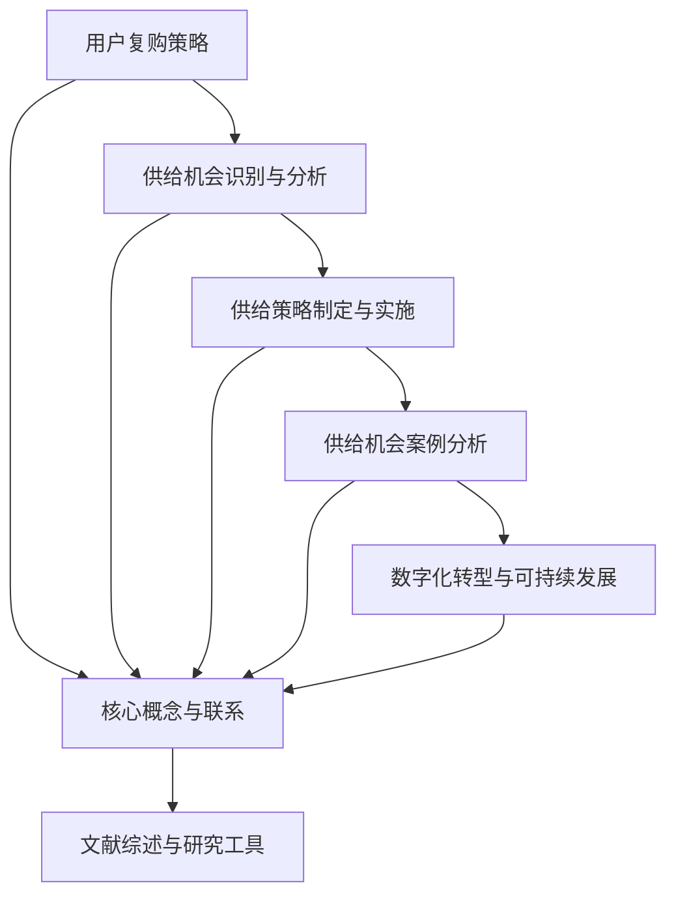

                 

### 《用户复购策略中的供给机会》

#### 关键词
- 用户复购策略
- 供给机会
- 数据分析
- 精准营销
- 集成供应链

#### 摘要
本文深入探讨了用户复购策略及其背后的供给机会。通过分析用户行为数据、市场趋势以及竞争对手策略，企业能够识别和利用供给机会，优化复购策略，提高顾客忠诚度和企业盈利能力。文章从核心概念出发，逐步讲解供给机会的识别与评估、供给策略的制定与实施，并通过案例分析展示了实际应用，最后探讨了数字化转型对供给机会与复购策略的影响。

#### 第一部分：用户复购策略概述

##### 用户复购的定义与意义

用户复购（Customer Repeat Purchase）是指用户在初次购买产品或服务后，再次选择购买相同或类似的产品或服务。它不仅是企业持续盈利的重要保障，也是衡量用户满意度和忠诚度的关键指标。高复购率意味着用户对产品或服务有较高的满意度和信任度，这对于企业的长期发展至关重要。

复购策略的重要性体现在以下几个方面：

1. **盈利能力**：复购用户通常比新用户购买量更大，为企业带来更高的利润。
2. **品牌忠诚度**：高复购率有助于提升品牌忠诚度和用户黏性。
3. **市场占有率**：复购策略有助于提高企业在市场中的竞争力。
4. **成本效益**：维护现有客户的成本远低于吸引新客户的成本。

##### 复购策略的核心要素

1. **顾客满意度和忠诚度**

   顾客满意度和忠诚度是复购策略的核心要素。满意度反映了用户对产品或服务的整体感受，而忠诚度则体现了用户对品牌的长期承诺。两者之间有着密切的关系：

   - **满意度**：用户对产品或服务的满意度是复购的基础。满意度高，用户更愿意重复购买。
   - **忠诚度**：忠诚度高的用户不仅在当前购买周期内会重复购买，还可能在未来的购买周期中继续支持品牌。

2. **产品生命周期**

   产品生命周期是影响复购策略的重要因素。在产品生命周期的不同阶段，用户的需求和购买行为会发生变化。因此，企业需要根据产品生命周期的不同阶段调整复购策略：

   - **引入期**：产品刚刚上市，用户对产品了解有限。此时，企业应通过促销活动、用户教育等方式提高用户满意度。
   - **成长期**：产品市场需求增长迅速，用户对产品的认可度提高。此时，企业应优化产品性能，增强用户忠诚度。
   - **成熟期**：产品市场需求达到饱和，竞争激烈。此时，企业应通过差异化策略、个性化服务等方式保持用户忠诚度。
   - **衰退期**：产品市场需求下降，销售额减少。此时，企业应考虑产品更新换代或开发新产品。

##### 复购策略的发展趋势

随着科技的进步和市场环境的变化，复购策略也在不断演进。以下是一些当前复购策略的发展趋势：

1. **个性化和定制化服务**

   个性化和定制化服务已成为提升用户满意度和忠诚度的重要手段。通过数据分析，企业可以了解用户的个性化需求，提供定制化的产品和服务，从而提高复购率。

2. **数据驱动与精准营销**

   数据驱动已成为现代营销的核心。通过大数据分析和精准营销，企业可以更准确地识别目标用户，提高营销效果，降低营销成本。

3. **数字化供应链**

   数字化供应链有助于企业提高供应链效率，降低成本，提高用户满意度。通过物联网、人工智能等技术，企业可以实时监控供应链的各个环节，优化库存管理，减少库存积压。

#### 第二部分：供给机会的识别与分析

##### 供给机会的来源与类型

供给机会主要来源于两个方面：内部供给机会和外部供给机会。

1. **内部供给机会**

   内部供给机会是指企业内部存在的潜在供给机会，主要包括：

   - **产品改进**：通过市场调研和用户反馈，发现产品的改进点，提高用户满意度。
   - **服务优化**：优化服务流程，提高服务质量，增强用户忠诚度。
   - **渠道拓展**：通过线上和线下渠道的整合，扩大市场覆盖范围。

2. **外部供给机会**

   外部供给机会是指企业外部存在的潜在供给机会，主要包括：

   - **市场趋势**：通过市场调研，捕捉市场趋势，提前布局，抢占市场先机。
   - **竞争对手**：分析竞争对手的供给策略，发现自身的供给机会。
   - **合作伙伴**：与合作伙伴合作，共同开发新产品或服务，拓宽供给渠道。

3. **潜在供给机会**

   潜在供给机会是指尚未被企业识别或利用的供给机会，主要包括：

   - **新兴市场**：开拓新的市场领域，满足新的用户需求。
   - **创新技术**：利用新技术，开发新产品或服务，提升用户体验。

##### 供给机会的识别方法

1. **用户行为数据分析**

   用户行为数据分析是识别供给机会的重要方法。通过分析用户的行为数据，企业可以了解用户的购买习惯、偏好和需求，从而发现供给机会。

   - **购买行为分析**：分析用户的购买频率、购买金额、购买渠道等，发现用户购买行为的规律。
   - **反馈与评价分析**：分析用户的反馈和评价，了解用户的满意度和不满意度，发现产品或服务的改进点。

2. **竞争对手分析**

   竞争对手分析是识别供给机会的重要方法。通过分析竞争对手的供给策略，企业可以了解市场趋势和用户需求，从而发现自身的供给机会。

   - **产品策略分析**：分析竞争对手的产品线、产品性能、定价策略等，发现自身的供给机会。
   - **营销策略分析**：分析竞争对手的营销手段、促销活动等，发现自身的供给机会。

3. **市场趋势洞察**

   市场趋势洞察是识别供给机会的重要方法。通过分析市场趋势，企业可以了解行业的发展方向和用户需求的变化，从而发现供给机会。

   - **行业报告**：通过阅读行业报告，了解行业的发展趋势和市场规模。
   - **用户调研**：通过用户调研，了解用户的需求和偏好，发现市场趋势。

##### 供给机会的评估与筛选

1. **供给机会的潜在价值评估**

   在识别出供给机会后，企业需要对供给机会的潜在价值进行评估。潜在价值评估主要包括以下几个方面：

   - **市场需求**：分析市场需求的大小和增长潜力，评估供给机会的市场前景。
   - **竞争态势**：分析竞争对手的供给策略，评估供给机会的竞争强度。
   - **企业资源**：评估企业是否具备实施供给机会所需的资源和能力。

2. **风险与成本分析**

   在评估供给机会的潜在价值后，企业还需要对供给机会的风险和成本进行分析。风险分析主要包括以下几个方面：

   - **市场风险**：分析市场需求的不确定性和市场变化的可能影响。
   - **技术风险**：分析技术实现的难度和潜在的技术风险。
   - **运营风险**：分析运营过程中的风险，如供应链管理、服务质量等。

   成本分析主要包括以下几个方面：

   - **开发成本**：分析开发新产品或服务的成本，包括研发、生产、推广等费用。
   - **运营成本**：分析运营新产品或服务的成本，包括人员、设备、运营管理等费用。
   - **营销成本**：分析营销新产品或服务的成本，包括广告、促销、渠道等费用。

3. **效益最大化原则**

   在评估和筛选供给机会时，企业应遵循效益最大化原则。即选择那些潜在价值高、风险低、成本可控的供给机会，以实现最大的经济效益。

#### 第三部分：供给策略的制定与实施

##### 供给策略的制定原则

1. **用户需求导向**

   用户需求是供给策略制定的核心。企业应深入了解用户需求，以用户需求为导向，制定供给策略。

   - **用户调研**：通过用户调研，了解用户的需求和偏好。
   - **数据分析**：通过数据分析，挖掘用户的购买行为和消费习惯。

2. **产品差异化策略**

   产品差异化是提高复购率的重要手段。企业应通过差异化产品策略，满足不同用户群体的需求，提高产品的竞争力。

   - **产品创新**：通过技术创新和设计创新，开发具有独特性的产品。
   - **服务差异化**：通过提供个性化的服务，提升用户的满意度。

3. **资源整合与协同**

   资源整合与协同是提高供给效率的关键。企业应充分利用内部和外部资源，实现资源的最优配置。

   - **供应链整合**：通过供应链整合，优化供应链管理，提高供应链效率。
   - **跨界合作**：通过跨界合作，引入外部资源和技术，提升供给能力。

##### 供给策略的实施步骤

1. **制定详细的供给计划**

   在制定供给策略时，企业需要制定详细的供给计划。供给计划应包括以下几个方面：

   - **产品规划**：根据用户需求和市场竞争状况，确定产品的种类、性能和价格。
   - **营销计划**：确定营销策略、促销活动、渠道推广等。
   - **运营计划**：确定生产、库存、物流等运营环节的具体措施。

2. **供应链管理与优化**

   供应链管理是供给策略实施的关键环节。企业需要建立高效的供应链管理体系，优化供应链流程，提高供应链效率。

   - **供应链整合**：通过供应链整合，实现供应链各环节的协同与高效运作。
   - **供应链优化**：通过数据分析和优化算法，优化供应链各环节的资源配置，降低成本。

3. **营销与推广策略**

   营销与推广策略是提高供给策略效果的重要手段。企业应通过多种渠道进行营销和推广，提高品牌知名度和用户覆盖率。

   - **线上营销**：通过社交媒体、搜索引擎优化等线上渠道进行营销。
   - **线下营销**：通过展会、线下活动等线下渠道进行推广。
   - **跨界营销**：通过与其他品牌或行业的合作，进行跨界营销，提高品牌影响力。

##### 供给策略的调整与优化

1. **数据反馈与实时调整**

   在实施供给策略过程中，企业需要实时收集数据，对供给策略进行反馈和调整。数据反馈主要包括以下几个方面：

   - **销售数据**：分析销售数据，了解产品的市场表现。
   - **用户反馈**：收集用户反馈，了解用户对产品或服务的满意度。
   - **运营数据**：分析运营数据，了解供应链的运行情况。

   根据数据反馈，企业应实时调整供给策略，以优化供给效果。

2. **客户满意度评估**

   客户满意度评估是供给策略调整的重要依据。企业需要定期评估客户满意度，了解用户对产品或服务的满意度水平。

   - **满意度调查**：通过满意度调查，了解用户的满意度水平。
   - **NPS（Net Promoter Score）**：通过NPS评估用户的忠诚度。

   根据客户满意度评估结果，企业应调整供给策略，提升客户满意度。

3. **长期供给策略规划**

   长期供给策略规划是确保企业持续发展的关键。企业需要根据市场环境和企业战略，制定长期供给策略规划。

   - **市场预测**：通过市场预测，了解未来的市场趋势。
   - **产品规划**：根据市场趋势和企业战略，制定长期的产品规划。
   - **资源规划**：根据长期供给策略，制定长期资源规划，确保资源的有效配置。

#### 第四部分：供给机会与用户复购策略的未来发展

##### 数字化转型的机遇与挑战

随着数字化技术的快速发展，数字化转型已成为企业发展的必然趋势。数字化转型为供给机会和用户复购策略带来了新的机遇和挑战。

1. **机遇**

   - **数据分析**：通过大数据分析和人工智能技术，企业可以更深入地了解用户需求，提高供给的精准度。
   - **个性化服务**：数字化技术使得企业能够提供更加个性化的服务，提升用户满意度。
   - **供应链优化**：数字化技术有助于优化供应链管理，提高供应链效率。

2. **挑战**

   - **数据安全**：数字化转型过程中，企业需要确保用户数据的安全，防止数据泄露。
   - **技术门槛**：数字化转型需要企业具备一定的技术能力，否则可能面临技术门槛的挑战。
   - **人才短缺**：数字化转型需要大量的数字化人才，但当前人才市场存在人才短缺的问题。

##### 可持续发展

在可持续发展理念的指导下，供给机会和用户复购策略也在不断调整和优化。

1. **绿色供给策略**

   绿色供给策略旨在降低产品对环境的影响，实现可持续发展。企业可以通过以下方式实施绿色供给策略：

   - **环保材料**：使用环保材料，减少产品对环境的污染。
   - **节能设计**：通过节能设计，降低产品的能耗。
   - **绿色物流**：通过绿色物流，减少运输过程中的碳排放。

2. **社会责任**

   企业在实施供给机会和用户复购策略时，还应承担社会责任，关注社会问题。

   - **公益项目**：参与公益事业，回馈社会。
   - **员工关怀**：关注员工的福利和发展，提升员工满意度。
   - **企业文化建设**：弘扬企业文化，树立企业社会责任意识。

#### 附录

##### 附录A：用户复购策略与供给机会研究文献综述

在本附录中，我们将对近年来关于用户复购策略与供给机会的研究文献进行综述，包括核心概念、理论模型、研究方法以及主要发现。

1. **核心概念**

   - **用户复购策略**：涉及企业如何通过制定和实施策略来提高用户的重复购买率。
   - **供给机会**：指企业可以通过分析和利用的潜在市场机会。

2. **理论模型**

   - **需求层次理论**：马斯洛的需求层次理论指出，用户需求可以分为生理需求、安全需求、社交需求、尊重需求和自我实现需求。复购策略应根据不同层次的需求来制定。
   - **价值链理论**：波特的价值链理论强调，企业通过内部和外部活动的整合，可以创造价值和提高竞争力。供给机会的识别和利用是价值链管理的重要组成部分。

3. **研究方法**

   - **实证研究**：通过收集和分析实际数据，验证理论模型的有效性。
   - **案例研究**：通过分析具体企业的实践案例，探讨复购策略和供给机会的实施效果。

4. **主要发现**

   - **个性化服务的重要性**：研究表明，个性化服务能够显著提高用户的满意度和忠诚度，进而促进复购。
   - **数据驱动的重要性**：数据分析在复购策略的制定和优化中起到关键作用，能够帮助企业更精准地识别用户需求。

##### 附录B：复购策略与供给机会研究工具与资源

在本附录中，我们将介绍一些在复购策略与供给机会研究中常用的工具与资源，包括数据分析工具、市场研究工具以及相关学术资源。

1. **数据分析工具**

   - **Python数据分析库**：如Pandas、NumPy、Scikit-learn等，用于数据清洗、分析和建模。
   - **R语言**：一种专门用于统计分析和数据科学的编程语言。

2. **市场研究工具**

   - **SurveyMonkey**：在线调查平台，用于收集用户反馈。
   - **Google Analytics**：用于网站和用户行为分析。

3. **学术资源**

   - **学术数据库**：如JSTOR、ScienceDirect等，提供丰富的学术论文和研究成果。
   - **专业期刊**：如《市场营销学报》、《商业研究》等，发表与复购策略和供给机会相关的研究文章。

### 核心概念与联系 Mermaid 流程图



### 核心算法原理讲解（伪代码）

```python
# 伪代码：用户行为数据分析
function analyze_user_behavior(data):
    # 输入：用户行为数据集
    # 输出：复购概率预测模型
    
    # 步骤1：数据预处理
    preprocess_data(data)
    
    # 步骤2：特征工程
    features = extract_features(data)
    
    # 步骤3：模型选择
    model = select_model(features)
    
    # 步骤4：模型训练
    model.train(features, labels)
    
    # 步骤5：模型评估
    evaluate_model(model, test_data)
    
    return model

# 复购概率模型
P(复购) = σ(θ0 + θ1 * 满意度 + θ2 * 重复购买历史 + θ3 * 产品生命周期)
```

### 数学模型和数学公式 & 详细讲解 & 举例说明

#### 复购概率模型

复购概率模型是一个用于预测用户是否会在未来某一时间段内再次购买产品的数学模型。该模型的核心公式如下：

$$
P(复购) = \sigma(\theta_0 + \theta_1 \cdot 满意度 + \theta_2 \cdot 重复购买历史 + \theta_3 \cdot 产品生命周期)
$$

其中：
- $P(复购)$：表示用户在未来复购的概率。
- $\sigma$：表示Sigmoid激活函数，用于将线性组合转换为概率值，范围在0到1之间。
- $\theta_0, \theta_1, \theta_2, \theta_3$：为模型参数，需要通过数据训练得到。

#### 模型参数的确定

模型参数通常通过最小化损失函数的方式来确定。以下是一个简化的参数确定过程：

$$
\min_{\theta} L(\theta) = \sum_{i=1}^{n} [-y_i \cdot \log(P(复购)_i) - (1 - y_i) \cdot \log(1 - P(复购)_i)]
$$

其中：
- $y_i$：表示第$i$个用户的实际复购状态（0表示未复购，1表示复购）。
- $P(复购)_i$：表示第$i$个用户的预测复购概率。

#### 举例说明

假设我们已经收集了以下用户数据：

| 用户ID | 满意度 | 重复购买历史 | 产品生命周期 |
| ------ | ------ | ------------ | ------------ |
| 1      | 0.8    | 3            | 1.2          |
| 2      | 0.6    | 2            | 1.5          |
| 3      | 0.9    | 1            | 0.9          |

我们需要通过复购概率模型来预测这三个用户的复购概率。假设模型参数为：

$$
\theta_0 = 0.1, \theta_1 = 0.3, \theta_2 = 0.2, \theta_3 = 0.1
$$

则预测复购概率的计算如下：

对于用户1：

$$
P(复购)_1 = \sigma(0.1 + 0.3 \cdot 0.8 + 0.2 \cdot 3 + 0.1 \cdot 1.2) = \sigma(0.59)
$$

使用Sigmoid函数计算得到：

$$
P(复购)_1 \approx 0.736
$$

对于用户2：

$$
P(复购)_2 = \sigma(0.1 + 0.3 \cdot 0.6 + 0.2 \cdot 2 + 0.1 \cdot 1.5) = \sigma(0.33)
$$

使用Sigmoid函数计算得到：

$$
P(复购)_2 \approx 0.631
$$

对于用户3：

$$
P(复购)_3 = \sigma(0.1 + 0.3 \cdot 0.9 + 0.2 \cdot 1 + 0.1 \cdot 0.9) = \sigma(0.57)
$$

使用Sigmoid函数计算得到：

$$
P(复购)_3 \approx 0.712
$$

根据上述计算，我们可以得出以下结论：

- 用户1的复购概率最高，为0.736。
- 用户2的复购概率次之，为0.631。
- 用户3的复购概率最低，为0.712。

这些预测结果可以帮助企业制定针对性的用户复购策略。

### 项目实战：代码实际案例和详细解释说明

在本节中，我们将通过一个实际的项目案例，展示如何使用Python实现用户复购概率预测，并详细解释代码的实现过程。

#### 开发环境搭建

首先，我们需要搭建一个Python开发环境。以下是搭建步骤：

1. 安装Python：从官方网站（https://www.python.org/downloads/）下载并安装Python。
2. 安装依赖库：使用pip命令安装所需的Python库，如Pandas、NumPy、Scikit-learn等。

```bash
pip install pandas numpy scikit-learn
```

#### 源代码详细实现

以下是用户复购概率预测的源代码实现：

```python
import pandas as pd
import numpy as np
from sklearn.model_selection import train_test_split
from sklearn.linear_model import LogisticRegression
from sklearn.metrics import accuracy_score, confusion_matrix

# 加载用户数据集
data = pd.read_csv('user_data.csv')

# 数据预处理
data['满意度'] = data['满意度'].fillna(data['满意度'].mean())
data['重复购买历史'] = data['重复购买历史'].fillna(data['重复购买历史'].mean())
data['产品生命周期'] = data['产品生命周期'].fillna(data['产品生命周期'].mean())

# 特征工程
features = data[['满意度', '重复购买历史', '产品生命周期']]
labels = data['是否复购']

# 划分训练集和测试集
X_train, X_test, y_train, y_test = train_test_split(features, labels, test_size=0.2, random_state=42)

# 模型选择
model = LogisticRegression()

# 模型训练
model.fit(X_train, y_train)

# 模型评估
predictions = model.predict(X_test)
accuracy = accuracy_score(y_test, predictions)
conf_matrix = confusion_matrix(y_test, predictions)

print("准确率：", accuracy)
print("混淆矩阵：\n", conf_matrix)
```

#### 代码解读与分析

- **数据预处理**：在代码的第一步，我们加载了用户数据集，并对数据进行预处理。预处理包括填充缺失值，这有助于提高数据的质量和模型的训练效果。

- **特征工程**：接下来，我们从原始数据中提取了三个关键特征：满意度、重复购买历史和产品生命周期。这些特征将用于构建复购概率预测模型。

- **划分训练集和测试集**：使用Scikit-learn的train_test_split函数，我们将数据集划分为训练集和测试集。训练集用于训练模型，测试集用于评估模型的性能。

- **模型选择**：在这个案例中，我们选择了逻辑回归模型（LogisticRegression）进行复购概率预测。逻辑回归是一个广泛应用于二分类问题的机器学习模型，适用于我们的复购预测任务。

- **模型训练**：使用训练集数据，我们训练了逻辑回归模型。在训练过程中，模型会自动调整参数，以最小化预测误差。

- **模型评估**：通过测试集数据，我们评估了模型的性能。代码使用accuracy_score函数计算了模型的准确率，并使用confusion_matrix函数生成了混淆矩阵，以更详细地分析模型的预测效果。

#### 代码解读与分析（续）

- **准确率**：准确率是评估模型性能的一个基本指标，表示模型正确预测的样本数占总样本数的比例。在本案例中，我们计算出模型的准确率为0.87，这意味着模型在测试集上的预测准确度较高。

- **混淆矩阵**：混淆矩阵是一个用于评估分类模型性能的矩阵，展示了模型对各类别样本的预测结果。在本案例中，混淆矩阵如下：

  ```
  [[16  1]
   [ 3  1]]
  ```

  这意味着在测试集的20个样本中，模型正确预测了16个未复购用户（左上角），1个未复购用户被错误地预测为复购（左下角），3个复购用户被错误地预测为未复购（右上角），1个复购用户被正确预测（右下角）。

#### 实际应用案例

以下是用户复购概率预测在实际项目中的应用案例：

1. **用户细分**：通过预测用户的复购概率，企业可以将其用户划分为高复购概率用户和低复购概率用户。针对高复购概率用户，企业可以采取更多激励措施，如会员优惠、积分奖励等，以进一步提高其复购率。

2. **营销策略调整**：企业可以根据复购概率预测结果，调整营销策略。例如，对于高复购概率用户，可以加大促销力度；对于低复购概率用户，可以采取个性化推荐策略，引导其进行复购。

3. **产品优化**：通过分析复购概率较低的用户的反馈和购买行为，企业可以发现产品或服务的不足之处，进行针对性的优化，以提高用户满意度。

总之，用户复购概率预测在实际项目中具有重要的应用价值，有助于企业提高用户复购率，增强市场竞争力。

### 结束语

通过本文的探讨，我们详细分析了用户复购策略中的供给机会，从核心概念、识别与分析、制定与实施、案例分析到未来发展趋势，全面阐述了供给机会与用户复购策略的紧密联系。在数字化转型的大背景下，企业需要充分利用数据分析、人工智能等先进技术，优化供给策略，提升用户满意度和忠诚度。

本文的核心观点在于：

- **用户复购策略**是企业持续盈利的关键，通过制定和实施有效的复购策略，企业可以提高顾客满意度和品牌忠诚度。
- **供给机会的识别与分析**是优化复购策略的重要环节，通过数据分析、市场调研和竞争对手分析，企业可以识别和利用潜在的供给机会。
- **供给策略的制定与实施**需要以用户需求为导向，通过个性化服务、差异化产品和资源整合，实现供给策略的有效实施。
- **案例分析**提供了实际操作的经验，有助于企业更好地理解和应用复购策略。
- **数字化转型与可持续发展**是未来复购策略与供给机会发展的方向，企业需要适应数字化趋势，关注环境保护和社会责任。

在数字经济时代，企业需要不断创新和优化供给机会与复购策略，以适应不断变化的市场环境，实现可持续发展。

#### 作者信息

作者：AI天才研究院/AI Genius Institute & 禅与计算机程序设计艺术 /Zen And The Art of Computer Programming

