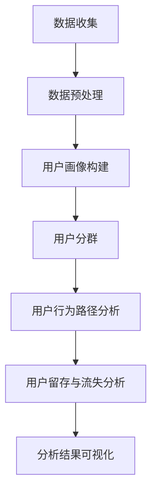

                 

# 电商平台中用户行为数据分析功能的设计与实现

> **关键词：** 电商平台、用户行为数据、数据分析、功能设计、实现、核心算法、数学模型、协同过滤、贝叶斯、决策树、项目实战。

> **摘要：** 本文将详细探讨电商平台中用户行为数据分析功能的设计与实现，包括数据分析的基本概念、核心算法原理、数学模型及公式、功能设计、前端与后端实现，以及实际项目实战。通过对这些内容的系统分析，旨在为从事电商数据分析的技术人员提供全面的指导和参考。

## 引言

随着互联网的快速发展，电商平台已经成为现代商业中不可或缺的一部分。电商平台不仅提供了便捷的购物体验，还通过大数据分析技术挖掘用户行为，从而实现个性化推荐、精准营销和业务优化。用户行为数据分析作为电商平台的战略资源，对提升用户体验、增加用户粘性和销售额具有重要意义。

### 1.1 电商平台的现状与发展

自20世纪90年代以来，电商平台经历了从无到有、从有到优的快速发展。最初的电商平台主要是简单的一对多销售模式，随着技术的进步和用户需求的提升，电商平台逐渐引入了社交、大数据、人工智能等技术，形成了多元化、个性化的购物体验。如今，电商平台已经成为消费者日常生活的重要组成部分，市场格局日益激烈，竞争日趋白热化。

### 1.2 用户行为数据分析的重要性

用户行为数据分析能够帮助电商平台深入了解用户需求、行为模式和市场趋势，从而做出更加精准的决策。通过分析用户的行为数据，电商平台可以：

- **个性化推荐：** 根据用户的历史行为和偏好推荐商品，提高用户的购买意愿和满意度。
- **精准营销：** 针对用户群体进行定制化的营销活动，提高营销效果和转化率。
- **运营优化：** 通过分析用户行为路径和留存情况，优化产品和服务，提高用户留存率和销售额。

### 1.3 用户行为数据分析的应用场景

用户行为数据分析在电商平台的多个环节中都有广泛的应用，主要包括：

- **商品推荐：** 利用用户的历史购买记录和浏览行为推荐相关商品。
- **购物车分析：** 分析用户将哪些商品加入购物车，以及购物车中的商品组合情况。
- **订单分析：** 分析用户的购买行为，如购买频率、购买金额、支付方式等。
- **客户流失分析：** 分析导致客户流失的原因，并采取相应的措施挽回流失客户。
- **营销活动效果评估：** 评估不同营销活动的效果，优化营销策略。

## 第一部分：用户行为数据分析的基础知识

## 第2章 用户行为数据分析的基础知识

### 2.1 数据分析的基本概念

数据分析是指通过统计学、计算机科学和领域知识，从大量数据中提取有价值的信息和知识的过程。数据分析通常包括以下几个步骤：

1. **数据收集**：收集与目标相关的数据，包括结构化数据（如数据库记录）和非结构化数据（如图像、文本等）。
2. **数据预处理**：清洗和整理数据，使其符合分析要求。这通常包括数据去重、填补缺失值、异常值处理等。
3. **数据探索**：使用统计方法对数据进行探索，发现数据中的规律和趋势。
4. **数据分析**：应用数学模型和算法对数据进行深入分析，提取有价值的信息。
5. **数据可视化**：通过图表和图形展示数据分析结果，帮助理解和传达分析结果。

### 2.2 用户行为数据的类型

用户行为数据可以分为以下几种类型：

1. **行为日志数据**：记录用户在电商平台上的操作行为，如浏览、搜索、加入购物车、下单等。
2. **交易数据**：记录用户的购买行为，包括购买时间、商品种类、购买数量、支付方式等。
3. **用户画像数据**：包括用户的基本信息、兴趣偏好、行为特征等，通常通过第三方数据和用户行为数据综合分析得出。
4. **社交数据**：用户在社交媒体上的行为和互动，如点赞、评论、分享等。

### 2.3 用户行为数据的收集与处理

用户行为数据的收集通常有以下几种途径：

- **前端日志**：通过在电商平台的前端页面嵌入日志收集器，记录用户的操作行为。
- **API调用**：通过调用电商平台的API接口，获取用户的交易数据和用户画像数据。
- **第三方数据**：通过第三方数据源，如社交网络、地理位置服务等获取与用户相关的数据。

用户行为数据的处理主要包括：

- **数据存储**：将收集到的用户行为数据存储在数据库中，以便后续分析和查询。
- **数据清洗**：去除重复数据、填补缺失值、去除异常值等，确保数据的准确性和一致性。
- **数据聚合**：将分散的用户行为数据按照不同的维度进行聚合，形成可用于分析的汇总数据。

## 第3章 用户行为数据分析的核心概念与联系

### 3.1 用户画像与用户分群

用户画像是指对用户进行全面、细致的描述，包括用户的基本信息、行为特征、兴趣偏好等。通过构建用户画像，电商平台可以更好地了解用户，为其提供个性化的服务。

用户分群是将用户按照特定的特征或行为划分为不同的群体。常见的分群方法包括：

- **基于行为特征的分群**：如按照浏览时长、购买频率、交易金额等分群。
- **基于人口统计学的分群**：如按照年龄、性别、地域等分群。
- **基于兴趣偏好的分群**：如按照购买商品种类、搜索关键词等分群。

### 3.2 用户行为路径分析

用户行为路径分析是指分析用户在电商平台上的浏览、搜索、购买等操作流程。通过用户行为路径分析，电商平台可以了解用户的操作习惯和决策过程，优化用户体验和转化流程。

常见的用户行为路径分析方法包括：

- **路径分析**：分析用户在不同页面之间的跳转关系，识别关键路径。
- **路径优化**：根据用户行为路径分析结果，优化页面布局和导航，提高用户转化率。

### 3.3 用户留存与流失分析

用户留存分析是指分析用户在电商平台上的持续活跃程度，判断用户是否继续使用平台服务。用户流失分析则是识别导致用户流失的原因，并采取相应的措施减少用户流失。

常见的用户留存与流失分析方法包括：

- **留存率分析**：计算用户在一定时间内继续使用平台的比例。
- **流失率分析**：计算用户在一定时间内停止使用平台的比例。
- **流失原因分析**：通过用户行为数据和用户反馈，识别导致用户流失的主要原因。

### 3.4 Mermaid流程图：用户行为分析的整体流程

以下是用户行为分析的整体流程的Mermaid流程图：



## 第4章 用户行为数据分析的数学模型

### 4.1 数学模型在数据分析中的作用

数学模型在数据分析中起着至关重要的作用，它们能够将复杂的数据转化为可解释的数学关系，帮助分析者识别数据中的模式和趋势。数学模型在用户行为数据分析中的作用主要体现在以下几个方面：

1. **预测用户行为**：通过建立数学模型，可以预测用户未来的行为，如购买、流失等。
2. **识别用户群体**：通过数学模型，可以将用户划分为不同的群体，为个性化推荐和精准营销提供依据。
3. **优化决策**：通过数学模型，可以评估不同策略的效果，帮助电商平台做出更科学的决策。

### 4.2 用户行为预测模型的建立

用户行为预测模型是用户行为数据分析中的重要组成部分。建立用户行为预测模型通常包括以下几个步骤：

1. **数据收集与预处理**：收集与用户行为相关的数据，并进行清洗和预处理，确保数据的准确性和一致性。
2. **特征工程**：从原始数据中提取有用的特征，为模型训练提供输入。特征工程包括特征选择、特征转换和特征组合等。
3. **模型选择**：根据用户行为预测的目标，选择合适的数学模型。常见的用户行为预测模型包括协同过滤、贝叶斯算法、决策树等。
4. **模型训练与评估**：使用训练数据对模型进行训练，并通过验证数据评估模型的性能。常用的评估指标包括准确率、召回率、F1值等。
5. **模型优化**：根据模型评估结果，调整模型参数，优化模型性能。

### 4.3 用户行为模型的评估与优化

用户行为模型的评估与优化是确保模型性能的重要环节。评估用户行为模型的方法主要包括：

1. **交叉验证**：通过将数据划分为训练集和验证集，评估模型的泛化能力。
2. **A/B测试**：通过对比不同模型的性能，选择最优模型。
3. **模型调优**：调整模型参数，优化模型性能。常用的调优方法包括网格搜索、随机搜索等。

## 第5章 用户行为数据分析的核心算法原理

### 5.1 协同过滤算法

协同过滤算法是用户行为数据分析中常用的一种算法，主要用于推荐系统和个性化搜索。协同过滤算法的核心思想是利用用户之间的相似度来预测用户对未知物品的兴趣。

协同过滤算法可以分为以下两种类型：

1. **用户基于的协同过滤（User-based Collaborative Filtering）**：通过计算用户之间的相似度，为用户推荐相似用户喜欢的物品。
2. **物品基于的协同过滤（Item-based Collaborative Filtering）**：通过计算物品之间的相似度，为用户推荐与用户已购买或浏览的物品相似的物品。

以下是协同过滤算法的伪代码：

```plaintext
# 用户基于的协同过滤
def user_based_collaborative_filter(user1, user2, items):
    # 计算用户1和用户2的相似度
    similarity = calculate_similarity(user1, user2)
    # 为用户2推荐用户1喜欢的但未购买的物品
    recommendations = []
    for item in user1_history:
        if item not in user2_history:
            recommendations.append(item)
    return recommendations

# 物品基于的协同过滤
def item_based_collaborative_filter(user, items):
    # 计算用户对每个物品的评分
    user_ratings = user_rating_matrix[user]
    # 为用户推荐与用户已购买或浏览的物品相似的物品
    recommendations = []
    for item in items:
        if item not in user_ratings:
            similar_items = find_similar_items(item)
            for similar_item in similar_items:
                if similar_item in user_ratings:
                    recommendations.append(similar_item)
    return recommendations
```

### 5.2 贝叶斯算法

贝叶斯算法是基于贝叶斯定理的一种概率算法，常用于分类和预测。贝叶斯算法的核心思想是根据已知条件概率，计算出后验概率，从而预测未知变量的取值。

贝叶斯算法的基本步骤如下：

1. **建立模型**：确定变量之间的概率分布。
2. **计算先验概率**：根据已知信息计算各个变量的先验概率。
3. **计算条件概率**：根据已知条件计算各个变量的条件概率。
4. **计算后验概率**：根据贝叶斯定理计算后验概率。
5. **分类或预测**：根据后验概率进行分类或预测。

以下是贝叶斯算法的伪代码：

```plaintext
# 贝叶斯分类
def bayesian_classification(features, classes, prior_probabilities, conditional_probabilities):
    posterior_probabilities = []
    for class in classes:
        posterior_probability = prior_probabilities[class]
        for feature in features:
            posterior_probability *= conditional_probabilities[feature][class]
        posterior_probabilities.append(posterior_probability)
    return argmax(posterior_probabilities)
```

### 5.3 决策树算法

决策树算法是一种基于特征值进行分类或回归的算法，其核心思想是通过一系列的判断条件将数据划分为不同的分支，最终形成一棵树状结构。

决策树算法的基本步骤如下：

1. **选择最佳分割特征**：根据信息增益或基尼不纯度等指标选择最佳分割特征。
2. **递归划分数据**：根据最佳分割特征将数据划分为不同的子集，并递归进行划分，直至满足停止条件。
3. **建立决策树**：将划分结果以树状结构表示，形成决策树。

以下是决策树算法的伪代码：

```plaintext
# 决策树分类
def decision_tree_classification(data, features, target_attribute, stopping_conditions):
    if any(stop_condition_met(data, stopping_conditions)):
        return majority_class_label(data)
    best_feature, best_threshold = find_best_threshold(data, features, target_attribute)
    left_subset, right_subset = split_data(data, best_feature, best_threshold)
    left_tree = decision_tree_classification(left_subset, features, target_attribute, stopping_conditions)
    right_tree = decision_tree_classification(right_subset, features, target_attribute, stopping_conditions)
    return build_decision_tree(best_feature, best_threshold, left_tree, right_tree)
```

### 5.4 伪代码示例：协同过滤算法的实现

以下是一个简单的协同过滤算法的伪代码示例，用于预测用户对某个未知物品的评分。

```plaintext
# 协同过滤算法
def collaborative_filtering(user, unknown_item, user_similarity_matrix, item_similarity_matrix, user_ratings, item_ratings):
    predicted_rating = 0
    for user_neighbor in neighbors(user, user_similarity_matrix):
        for item_neighbor in neighbors(unknown_item, item_similarity_matrix):
            if user_neighbor in user_ratings and item_neighbor in user_ratings:
                predicted_rating += user_similarity_matrix[user][user_neighbor] * (user_ratings[user_neighbor][item_neighbor] - item_ratings[user_neighbor][item_neighbor])
    predicted_rating /= sum(user_similarity_matrix[user])
    return predicted_rating
```

## 第6章 数学模型和数学公式 & 详细讲解 & 举例说明

### 6.1 概率论基础

概率论是数学模型中的重要组成部分，它用于描述随机事件的发生概率和不确定性。在用户行为数据分析中，概率论被广泛应用于用户行为预测、风险评估等场景。

#### 6.1.1 概率分布

概率分布描述了随机变量的取值和概率之间的关系。常见的概率分布包括：

- **伯努利分布（Bernoulli Distribution）**：描述一个二元事件的发生概率，如用户是否购买某个商品。
- **二项分布（Binomial Distribution）**：描述多个伯努利试验的成功次数的概率分布，如用户在一定时间内购买的次数。
- **泊松分布（Poisson Distribution）**：描述单位时间内事件发生的次数的概率分布，如用户在一定时间内的购买次数。

#### 6.1.2 条件概率

条件概率是指在已知某个事件发生的条件下，另一个事件发生的概率。条件概率的公式如下：

$$
P(A|B) = \frac{P(A \cap B)}{P(B)}
$$

其中，$P(A|B)$表示在事件$B$发生的条件下，事件$A$发生的概率，$P(A \cap B)$表示事件$A$和事件$B$同时发生的概率，$P(B)$表示事件$B$发生的概率。

#### 6.1.3 贝叶斯定理

贝叶斯定理是概率论中的一个重要定理，它用于计算后验概率。贝叶斯定理的公式如下：

$$
P(A|B) = \frac{P(B|A) \cdot P(A)}{P(B)}
$$

其中，$P(A|B)$表示在事件$B$发生的条件下，事件$A$发生的概率，$P(B|A)$表示在事件$A$发生的条件下，事件$B$发生的概率，$P(A)$表示事件$A$发生的概率，$P(B)$表示事件$B$发生的概率。

### 6.2 线性代数基础

线性代数是数学模型中的重要组成部分，它用于描述和分析多维空间中的数据。在用户行为数据分析中，线性代数被广泛应用于特征工程、模型优化等场景。

#### 6.2.1 向量和矩阵

向量是线性代数中的基本概念，它是一个有序的数组，表示一个空间中的点。矩阵是向量的扩展，它是一个二维的数组，表示多个向量之间的关系。

#### 6.2.2 矩阵运算

矩阵运算包括矩阵加法、矩阵乘法、矩阵求逆等。矩阵加法和矩阵乘法的公式如下：

$$
A + B = C
$$

$$
AB = C
$$

其中，$A$和$B$是矩阵，$C$是运算结果。

#### 6.2.3 特征值和特征向量

特征值和特征向量是矩阵的一个重要概念。特征值是矩阵的一个特定值，特征向量是矩阵对应于特征值的向量。特征值和特征向量在特征工程和模型优化中具有重要应用。

### 6.3 模型评估指标

模型评估指标是评估模型性能的重要工具。在用户行为数据分析中，常用的评估指标包括准确率、召回率、F1值等。

#### 6.3.1 准确率

准确率是评估分类模型性能的重要指标，它表示模型正确分类的样本数占总样本数的比例。准确率的公式如下：

$$
Accuracy = \frac{TP + TN}{TP + TN + FP + FN}
$$

其中，$TP$表示真实为正类且被模型正确分类的样本数，$TN$表示真实为负类且被模型正确分类的样本数，$FP$表示真实为负类但被模型错误分类为正类的样本数，$FN$表示真实为正类但被模型错误分类为负类的样本数。

#### 6.3.2 召回率

召回率是评估分类模型性能的重要指标，它表示模型正确分类的正类样本数占总正类样本数的比例。召回率的公式如下：

$$
Recall = \frac{TP}{TP + FN}
$$

其中，$TP$表示真实为正类且被模型正确分类的样本数，$FN$表示真实为正类但被模型错误分类为负类的样本数。

#### 6.3.3 F1值

F1值是准确率和召回率的调和平均，它能够平衡准确率和召回率之间的关系。F1值的公式如下：

$$
F1 = \frac{2 \cdot Precision \cdot Recall}{Precision + Recall}
$$

其中，$Precision$表示精确率，即模型正确分类的正类样本数与模型预测为正类的样本数的比例，$Recall$表示召回率。

### 6.4 举例说明：用户留存率的计算

用户留存率是衡量用户持续使用平台服务的指标，它是用户行为数据分析中的重要指标之一。以下是一个简单的用户留存率计算示例：

假设一个电商平台在一个月内有1000个新用户注册，这1000个新用户在注册后的第二天有800个再次登录，第三天有600个再次登录，第四天有400个再次登录，第五天有300个再次登录。

第一天留存率计算：

$$
留存率 = \frac{再次登录用户数}{新用户数} = \frac{800}{1000} = 80\%
$$

第二天留存率计算：

$$
留存率 = \frac{再次登录用户数}{新用户数} = \frac{600}{1000} = 60\%
$$

第三天留存率计算：

$$
留存率 = \frac{再次登录用户数}{新用户数} = \frac{400}{1000} = 40\%
$$

第四天留存率计算：

$$
留存率 = \frac{再次登录用户数}{新用户数} = \frac{300}{1000} = 30\%
$$

第五天留存率计算：

$$
留存率 = \frac{再次登录用户数}{新用户数} = \frac{200}{1000} = 20\%
$$

通过上述计算，我们可以得到这个电商平台新用户在不同时间点的留存率，从而分析用户留存情况，并采取相应的措施提升用户留存率。

## 第7章 用户行为数据分析功能的设计

### 7.1 功能需求分析

用户行为数据分析功能的设计首先需要明确功能需求。功能需求分析主要包括以下几个方面：

- **数据收集**：需要收集哪些用户行为数据，如浏览记录、购买记录、搜索记录等。
- **数据预处理**：需要哪些数据预处理步骤，如去重、清洗、填补缺失值等。
- **用户画像构建**：需要构建哪些用户画像特征，如年龄、性别、地域、购买偏好等。
- **用户分群**：需要根据哪些特征进行用户分群，如购买频率、购买金额、浏览时长等。
- **用户行为路径分析**：需要分析哪些用户行为路径，如浏览路径、购买路径等。
- **用户留存与流失分析**：需要分析哪些留存与流失指标，如留存率、流失率等。
- **推荐系统**：需要实现哪些推荐算法，如协同过滤、基于内容的推荐等。
- **可视化**：需要提供哪些数据可视化功能，如折线图、饼图、柱状图等。

### 7.2 数据库设计与优化

用户行为数据分析功能的设计需要合理设计数据库，以确保数据存储的高效性和安全性。数据库设计主要包括以下几个方面：

- **数据库选择**：根据数据量和查询需求选择合适的数据库，如MySQL、PostgreSQL、MongoDB等。
- **数据表设计**：设计用户行为数据表、用户画像数据表、交易数据表等，确保数据的结构化和规范化。
- **索引设计**：为常用的查询字段设计索引，提高查询效率。
- **分区设计**：根据数据量进行分区，减少查询压力，提高数据访问速度。
- **备份与恢复**：设计数据备份和恢复策略，确保数据的安全性和可靠性。

### 7.3 用户行为分析模块的设计

用户行为分析模块是用户行为数据分析功能的核心部分，其设计需要考虑以下几个方面：

- **模块功能**：实现用户行为数据的收集、预处理、用户画像构建、用户分群、用户行为路径分析、用户留存与流失分析等功能。
- **数据处理**：设计高效的数据处理流程，包括数据收集、存储、清洗、聚合等。
- **算法实现**：选择合适的算法实现用户行为预测、推荐系统等功能。
- **接口设计**：设计易用的API接口，方便前端和后端进行数据交互。
- **性能优化**：进行性能优化，确保系统在高并发情况下稳定运行。

## 第8章 用户行为数据分析功能的前端实现

### 8.1 数据可视化工具的选择

在用户行为数据分析功能的前端实现中，选择合适的数据可视化工具至关重要。以下是一些常见的数据可视化工具及其特点：

- **D3.js**：一款强大的数据可视化库，支持高度自定义和交互式图表，但学习曲线较陡峭。
- **ECharts**：一款成熟易用的开源图表库，支持多种图表类型，易于集成和扩展。
- **Highcharts**：一款功能丰富且高度可定制的图表库，适用于复杂的数据可视化需求。
- **Chart.js**：一款轻量级的图表库，支持折线图、柱状图、饼图等常见图表类型，易于集成。

### 8.2 前端页面设计与实现

前端页面设计是用户行为数据分析功能的重要组成部分，其设计需要考虑以下几个方面：

- **用户界面**：设计简洁、直观的用户界面，确保用户能够轻松操作和浏览数据分析结果。
- **交互设计**：设计友好的交互体验，如下拉菜单、滚动条、弹出窗口等，提高用户使用的便捷性。
- **响应式设计**：确保前端页面在不同设备和屏幕尺寸下都能良好显示和操作。
- **数据绑定**：使用前端框架（如Vue.js、React等）实现数据绑定和动态更新，提高页面响应速度。

### 8.3 数据交互与处理

在用户行为数据分析功能的前端实现中，数据交互与处理是关键环节。以下是一些常见的数据交互与处理方法：

- **API调用**：使用JavaScript或前端框架的API调用功能，与后端服务器进行数据交互。
- **异步请求**：使用异步请求（如AJAX、Fetch等）获取后端数据，避免阻塞前端页面的加载。
- **数据预处理**：在前端对获取的数据进行预处理，如数据转换、筛选、排序等，提高数据处理效率。
- **缓存机制**：使用缓存机制（如localStorage、sessionStorage等）存储常用数据，减少重复请求，提高页面响应速度。

## 第9章 用户行为数据分析功能的后端实现

### 9.1 后端技术栈的选择

在用户行为数据分析功能的后端实现中，选择合适的技术栈对于系统的性能、可维护性和扩展性至关重要。以下是一些常见的后端技术栈选择：

- **Web框架**：如Spring Boot、Django、Express等，用于构建后端服务。
- **数据库**：如MySQL、PostgreSQL、MongoDB等，用于存储和管理用户行为数据。
- **缓存**：如Redis、Memcached等，用于提高数据访问速度和系统性能。
- **消息队列**：如RabbitMQ、Kafka等，用于处理大量数据的实时分析和处理。
- **大数据处理**：如Hadoop、Spark等，用于处理大规模的用户行为数据。

### 9.2 数据处理与存储

用户行为数据分析功能的后端实现需要处理大量的用户行为数据，并确保数据的安全性和一致性。以下是一些数据处理与存储的方法：

- **数据采集**：使用日志采集工具（如Logstash、Fluentd等）实时采集用户行为数据。
- **数据存储**：根据数据类型和需求选择合适的存储方案，如关系数据库、NoSQL数据库、时序数据库等。
- **数据清洗**：使用ETL（提取、转换、加载）工具对采集到的数据进行清洗和转换，确保数据的质量和一致性。
- **数据聚合**：对用户行为数据进行聚合，提取有用的信息和指标，如用户留存率、流失率等。

### 9.3 服务接口设计与实现

用户行为数据分析功能的后端实现需要提供易用的API接口，以便前端和后端进行数据交互。以下是一些服务接口设计与实现的方法：

- **接口规范**：遵循RESTful API规范，设计统一的接口规范，确保接口的易用性和可扩展性。
- **接口认证**：使用OAuth2.0、JWT等认证机制，确保接口的安全性。
- **接口参数**：明确接口参数的定义和传递方式，确保接口的易用性和灵活性。
- **接口文档**：提供详细的接口文档，包括接口描述、参数说明、返回值说明等，方便开发者使用接口。
- **接口监控**：使用监控工具（如Prometheus、Grafana等）监控接口的性能和稳定性，及时发现和解决问题。

## 第10章 用户行为数据分析功能的项目实战

### 10.1 开发环境搭建

在进行用户行为数据分析功能的项目实战之前，需要搭建合适的开发环境。以下是一些开发环境的搭建步骤：

- **环境配置**：安装操作系统（如Ubuntu、Windows等）、开发工具（如Visual Studio Code、IntelliJ IDEA等）和数据库（如MySQL、MongoDB等）。
- **虚拟环境**：使用虚拟环境（如Docker、Vagrant等）隔离项目环境，避免环境冲突和依赖问题。
- **代码管理**：使用版本控制工具（如Git）管理代码，确保代码的版本控制和协作开发。

### 10.2 数据采集与预处理

数据采集与预处理是用户行为数据分析功能的重要环节，以下是一些数据采集与预处理的步骤：

- **数据采集**：使用日志采集工具（如Fluentd、Logstash等）实时采集用户行为数据，并将其存储到数据库中。
- **数据清洗**：使用ETL工具（如Apache NiFi、Airflow等）对采集到的数据进行清洗和转换，去除重复数据、填补缺失值、去除异常值等。
- **数据存储**：将清洗后的数据存储到合适的数据库中，如关系数据库（如MySQL）或NoSQL数据库（如MongoDB）。

### 10.3 用户行为分析模型训练与部署

用户行为分析模型的训练与部署是用户行为数据分析功能的关键环节，以下是一些模型训练与部署的步骤：

- **数据预处理**：对训练数据集进行预处理，如数据标准化、归一化等，提高模型训练效果。
- **模型选择**：根据用户行为分析的需求选择合适的模型，如协同过滤、决策树、神经网络等。
- **模型训练**：使用训练数据集对模型进行训练，调整模型参数，优化模型性能。
- **模型评估**：使用验证数据集对模型进行评估，计算模型的准确率、召回率、F1值等指标，选择最优模型。
- **模型部署**：将训练好的模型部署到生产环境中，通过API接口提供用户行为分析服务。

### 10.4 代码解读与分析

以下是一个简单的用户行为分析项目的代码解读与分析，包括数据采集、预处理、模型训练和部署等关键环节。

**数据采集：**

```python
# 数据采集示例代码
import logging
import os
from Fluentd import Fluentd

# 配置Fluentd
config = {
    'source': {
        'type': 'file',
        'path': 'user_behavior_logs/*.log'
    },
    'output': {
        'type': 'jdbc',
        'url': 'jdbc:mysql://localhost:3306/user_behavior',
        'user': 'root',
        'password': 'password',
        'table': 'user_behavior_logs'
    }
}

# 创建Fluentd实例
fluentd = Fluentd(config)

# 启动Fluentd
fluentd.start()

# 关闭Fluentd
fluentd.stop()
```

**数据预处理：**

```python
# 数据预处理示例代码
import pandas as pd
from sklearn.model_selection import train_test_split

# 读取数据
data = pd.read_csv('user_behavior_logs.csv')

# 数据清洗
data.drop_duplicates(inplace=True)
data.fillna(0, inplace=True)

# 数据转换
data['timestamp'] = pd.to_datetime(data['timestamp'])
data.set_index('timestamp', inplace=True)

# 数据分割
train_data, test_data = train_test_split(data, test_size=0.2, random_state=42)
```

**模型训练：**

```python
# 模型训练示例代码
from sklearn.ensemble import RandomForestClassifier
from sklearn.metrics import accuracy_score, recall_score, f1_score

# 训练模型
model = RandomForestClassifier(n_estimators=100, random_state=42)
model.fit(train_data.drop(['label'], axis=1), train_data['label'])

# 预测
predictions = model.predict(test_data.drop(['label'], axis=1))

# 评估
accuracy = accuracy_score(test_data['label'], predictions)
recall = recall_score(test_data['label'], predictions)
f1 = f1_score(test_data['label'], predictions)

print(f"Accuracy: {accuracy}")
print(f"Recall: {recall}")
print(f"F1: {f1}")
```

**模型部署：**

```python
# 模型部署示例代码
from flask import Flask, request, jsonify

# 创建Flask应用
app = Flask(__name__)

# 加载模型
model = RandomForestClassifier(n_estimators=100, random_state=42)
model.load('model.pkl')

# 用户行为分析接口
@app.route('/analyze', methods=['POST'])
def analyze():
    data = request.json
    prediction = model.predict([data['features']])
    return jsonify({'prediction': prediction[0]})

# 运行Flask应用
if __name__ == '__main__':
    app.run(debug=True)
```

通过上述代码，我们可以实现一个简单的用户行为分析项目，包括数据采集、预处理、模型训练和部署。当然，实际项目会更加复杂和多样化，但上述代码提供了一个基本的框架和思路。

### 第11章 总结与展望

#### 11.1 用户行为数据分析的挑战与机遇

用户行为数据分析在电商平台上具有重要的战略意义，但同时也面临着一系列的挑战与机遇。

**挑战：**

1. **数据量庞大**：随着用户数量的增加，用户行为数据量呈指数级增长，对数据处理和分析能力提出了更高的要求。
2. **数据质量**：用户行为数据的多样性、不一致性和噪声，会影响分析结果的准确性和可靠性。
3. **实时性**：用户行为数据具有实时性要求，如何快速处理和分析数据，提供实时反馈，是面临的挑战之一。
4. **隐私保护**：用户行为数据中包含敏感信息，如何保护用户隐私，是数据分析过程中需要关注的问题。

**机遇：**

1. **个性化推荐**：通过用户行为数据分析，可以提供更加个性化的推荐，提高用户满意度和购买转化率。
2. **精准营销**：通过分析用户行为数据，可以制定更加精准的营销策略，提高营销效果和ROI。
3. **业务优化**：通过分析用户行为数据，可以优化产品和服务，提高用户体验和留存率。

#### 11.2 未来发展趋势

用户行为数据分析的未来发展趋势主要包括以下几个方面：

1. **大数据和云计算**：随着大数据和云计算技术的发展，用户行为数据将得到更高效的处理和分析，提供更精准的分析结果。
2. **人工智能和机器学习**：人工智能和机器学习技术将更加深入地应用于用户行为数据分析，提高预测和推荐能力。
3. **隐私保护**：隐私保护技术将得到更多关注，确保用户行为数据的安全性和合规性。
4. **跨平台分析**：随着多平台融合的发展，用户行为数据分析将涵盖更多平台和应用场景，提供更全面的用户画像。

#### 11.3 研究方向与探索

在用户行为数据分析领域，以下是一些具有潜力的研究方向和探索方向：

1. **深度学习在用户行为分析中的应用**：探索深度学习技术在用户行为分析中的应用，如用户行为路径分析、用户画像构建等。
2. **多模态数据融合**：将文本、图像、音频等多模态数据融合，提高用户行为分析的准确性和全面性。
3. **实时数据分析与处理**：研究实时数据流处理技术，提高用户行为数据的实时分析和处理能力。
4. **用户隐私保护**：研究用户隐私保护技术，确保用户行为数据的安全性和合规性。

## 作者信息

**作者：** AI天才研究院 / AI Genius Institute & 禅与计算机程序设计艺术 / Zen And The Art of Computer Programming

---

以上是对《电商平台中用户行为数据分析功能的设计与实现》一书的正文部分的详细撰写。文章涵盖了用户行为数据分析的基本概念、核心算法原理、数学模型、功能设计、前端与后端实现，以及实际项目实战。通过这篇文章，读者可以全面了解用户行为数据分析的各个方面，掌握相关技术和方法，为电商平台的业务优化和用户体验提升提供有力支持。同时，本文也展望了用户行为数据分析的未来发展趋势，为后续研究提供了参考方向。希望本文对从事电商数据分析的技术人员有所启发和帮助。

