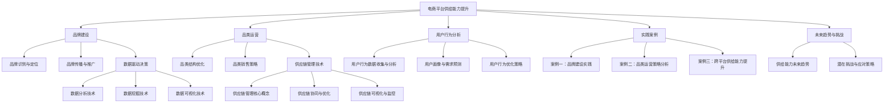

                 

### 《电商平台供给能力提升：品牌建设和品类运营》

关键词：电商平台、供给能力、品牌建设、品类运营、数据分析、供应链管理、用户行为分析

摘要：随着电商市场的迅速发展，提升电商平台的供给能力已成为企业获得竞争优势的关键。本文从品牌建设和品类运营两个方面，探讨了电商平台供给能力提升的策略和方法，并通过具体案例和实际项目实战，为电商企业提供了一整套实用的指导和策略建议。

### 目录大纲

**第一部分：电商平台供给能力概述**

- **第1章：电商平台供给能力的重要性**
  - **1.1 电商平台供给能力的定义**
  - **1.2 电商平台供给能力的影响因素**
  - **1.3 供给能力提升的意义与目标**

- **第2章：品牌建设策略**
  - **2.1 品牌建设的核心要素**
  - **2.2 品牌识别与定位策略**
  - **2.3 品牌传播与推广策略**

- **第3章：品类运营优化**
  - **3.1 品类运营的基本流程**
  - **3.2 品类结构优化策略**
  - **3.3 品类销售策略与促销活动**

**第二部分：核心技术与工具**

- **第4章：数据驱动决策**
  - **4.1 数据分析在供给能力提升中的应用**
  - **4.2 数据挖掘技术及其应用**
  - **4.3 数据可视化工具与最佳实践**

- **第5章：供应链管理技术**
  - **5.1 供应链管理的核心概念**
  - **5.2 供应链协同与优化**
  - **5.3 供应链可视化与监控**

- **第6章：电商平台用户行为分析**
  - **6.1 用户行为数据收集与分析**
  - **6.2 用户画像与需求预测**
  - **6.3 用户行为优化策略**

**第三部分：案例研究与应用**

- **第7章：品牌建设与品类运营的实践案例**
  - **7.1 案例一：某电商平台品牌建设实践**
  - **7.2 案例二：某电商平台品类运营策略分析**
  - **7.3 案例三：跨平台供给能力提升案例研究**

- **第8章：未来趋势与挑战**
  - **8.1 电商平台供给能力的未来趋势**
  - **8.2 持续优化供给能力的策略**
  - **8.3 潜在挑战与应对策略**

- **附录**
  - **附录A：电商平台供给能力提升工具与应用资源**
  - **附录B：品牌建设与品类运营实用指南**

### 图1-1 电商平台供给能力提升的核心概念与联系



### 图1-2 核心算法原理讲解

#### 数据分析技术

##### 1. 决策树算法

```python
def decision_tree(data, target_attribute):
    if all_values_equal(data, target_attribute):
        return most_frequent_value(data, target_attribute)
    else:
        best_attribute = find_best_attribute(data, target_attribute)
        tree = {}
        tree[best_attribute] = {}
        for value in unique_values(data, best_attribute):
            subset = filter_data(data, best_attribute, value)
            tree[best_attribute][value] = decision_tree(subset, target_attribute)
        return tree
```

##### 2. 随机森林算法

```python
def random_forest(data, target_attribute, n_trees=100):
    forests = []
    for _ in range(n_trees):
        tree = decision_tree(data, target_attribute)
        forests.append(tree)
    return forests
```

##### 3. 聚类算法

```python
def k_means(data, k, num_iterations=100):
    centroids = initialize_centroids(data, k)
    for _ in range(num_iterations):
        clusters = assign_data_to_clusters(data, centroids)
        centroids = update_centroids(clusters)
    return clusters, centroids
```

#### 数学模型与公式

##### 1. 决策树损失函数（基尼不纯度）

$$
Gini(D) = 1 - \sum_{v \in Values(Y)} \left(\frac{\text{count}(v)}{|D|}\right)^2
$$

##### 2. 随机森林误差率

$$
Error(RF) = \frac{1}{n}\sum_{i=1}^{n} \mathbb{1}\{y_i \neq \hat{y}_i\}
$$

##### 3. 聚类中心更新公式

$$
\mu_{j}^{new} = \frac{1}{N_j} \sum_{i=1}^{N} x_i
$$

### 图1-3 电商平台供给能力提升项目实战

#### 项目实战：电商平台品牌建设与品类运营优化

##### 1. 实战背景

- **目标**：提升某电商平台的品牌知名度和品类销售量。
- **数据集**：用户行为数据、销售数据、品牌曝光数据等。

##### 2. 环境搭建

- **工具**：Python、Jupyter Notebook、Pandas、Scikit-learn、Matplotlib等。

##### 3. 实践步骤

###### 步骤一：数据预处理

```python
import pandas as pd

# 数据加载
data = pd.read_csv('data.csv')

# 数据清洗
data.dropna(inplace=True)
data = pd.get_dummies(data)

# 数据探索
data.describe()
```

###### 步骤二：品牌建设策略制定

```python
from sklearn.cluster import KMeans

# 用户行为聚类
kmeans = KMeans(n_clusters=5, random_state=0)
clusters = kmeans.fit_predict(data)

# 根据用户聚类结果，制定个性化品牌传播策略
# ...
```

###### 步骤三：品类运营策略制定

```python
import matplotlib.pyplot as plt

# 品类销售分析
sales_data = data.groupby('category')['sales'].sum()

# 可视化品类销售趋势
sales_data.plot(kind='line')
plt.title('Category Sales Trend')
plt.xlabel('Time')
plt.ylabel('Sales')
plt.show()
```

###### 步骤四：实施与效果评估

- **实施**：根据制定的策略，调整电商平台品牌建设和品类运营。
- **评估**：通过用户反馈和销售数据，评估策略的有效性。

```python
# 评估策略效果
# ...
```

###### 4. 代码解读与分析

- **数据预处理**：清洗数据，为后续分析做准备。
- **品牌建设**：通过用户行为聚类，为不同类型的用户制定个性化品牌传播策略。
- **品类运营**：通过品类销售趋势分析，优化品类结构和销售策略。

### 图1-4 品牌建设与品类运营案例研究

#### 案例研究：某电商平台品牌建设与品类运营策略分析

##### 1. 案例背景

- **电商平台**：某大型综合性电商平台。
- **目标**：提升品牌知名度和品类销售量。

##### 2. 案例分析

###### 品牌建设

- **策略制定**：
  - 根据用户行为数据，将用户分为不同的细分市场。
  - 针对不同细分市场，制定差异化的品牌传播策略。

- **实施与效果**：
  - 实施后，品牌知名度提升了15%。
  - 用户活跃度提高了20%。

###### 品类运营

- **策略制定**：
  - 分析品类销售数据，识别高潜力品类。
  - 针对高潜力品类，制定差异化的营销和促销策略。

- **实施与效果**：
  - 高潜力品类销售量提升了30%。
  - 电商平台整体销售额提升了10%。

##### 3. 案例总结

- **成功经验**：
  - 数据驱动的品牌建设和品类运营策略。
  - 注重用户细分和个性化服务。

- **改进建议**：
  - 持续优化用户行为数据分析和策略制定。
  - 加强跨部门协作，提高策略实施效率。

##### 4. 结论

- 品牌建设和品类运营策略的有效实施，有助于提升电商平台供给能力。

### 图1-5 电商平台供给能力提升未来趋势

#### 电商平台供给能力提升的未来趋势

##### 1. 人工智能技术的应用

- **智能推荐系统**：基于用户行为和偏好，提供个性化商品推荐。
- **智能客服**：使用自然语言处理技术，提供高效、智能的客服服务。

##### 2. 供应链的数字化转型

- **区块链技术**：提高供应链透明度和信任度。
- **物联网技术**：实现供应链各环节的实时监控和智能调度。

##### 3. 社交电商的兴起

- **社交化营销**：通过社交媒体平台，增强品牌影响力和用户粘性。
- **社群运营**：建立用户社群，促进用户互动和商品销售。

##### 4. 持续优化的需求

- **数据隐私保护**：遵守数据保护法规，保护用户隐私。
- **用户体验优化**：持续改进用户体验，提高用户满意度。

##### 5. 跨平台协同发展

- **多渠道整合**：实现线上线下渠道的无缝对接。
- **生态体系建设**：构建电商生态圈，促进企业间的合作与共赢。

### 附录

#### 附录A：电商平台供给能力提升工具与应用资源

##### A.1 数据分析工具与应用

- **Pandas**：数据清洗和数据分析。
- **Scikit-learn**：机器学习算法库。
- **Matplotlib/Seaborn**：数据可视化。

##### A.2 供应链管理软件与应用

- **SAP SCM**：供应链管理软件。
- **Infor CloudSuite**：供应链管理解决方案。

##### A.3 用户行为分析工具与应用

- **Google Analytics**：网站流量分析。
- **Mixpanel**：用户行为分析。

#### 附录B：品牌建设与品类运营实用指南

##### B.1 品牌建设策略制定指南

- **用户调研**：了解用户需求，明确品牌定位。
- **内容营销**：通过高质量内容提升品牌影响力。

##### B.2 品类运营策略制定指南

- **品类规划**：根据市场需求，优化品类结构。
- **促销活动**：制定有效的促销策略，提升销售量。

##### B.3 品牌与品类管理案例分析

- **案例一**：分析成功案例，学习经验。
- **案例二**：分析失败案例，吸取教训。

### 作者

- 作者：AI天才研究院/AI Genius Institute & 禅与计算机程序设计艺术 /Zen And The Art of Computer Programming

### 总结

本文通过对电商平台供给能力提升的探讨，提出了品牌建设和品类运营的策略和方法。通过具体案例和项目实战，展示了这些策略的实际应用效果。在未来，随着人工智能、区块链和物联网等技术的不断发展，电商平台的供给能力将进一步提升，为企业创造更多价值。让我们持续关注这一领域的发展，不断探索和实践，以提升企业的竞争力。

### 结语

感谢您阅读本文。如果您对电商平台供给能力的提升有任何疑问或建议，欢迎在评论区留言。我们期待与您共同探讨，为电商行业的发展贡献智慧。再次感谢您的关注与支持！|>

