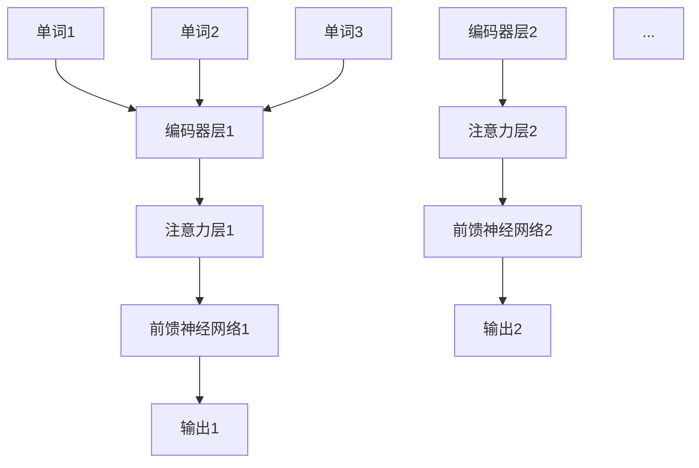
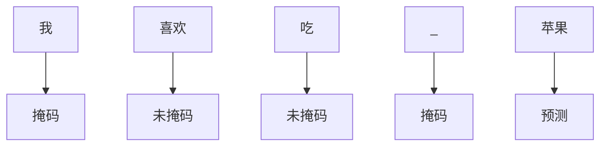
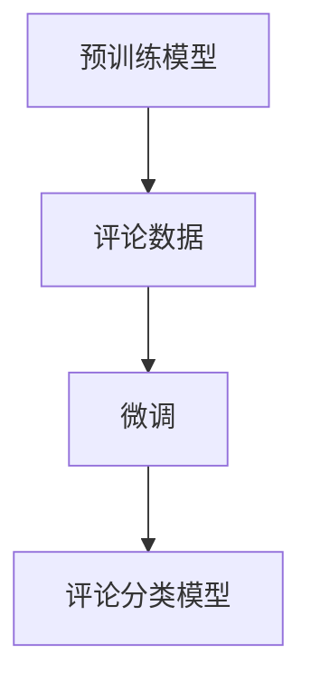
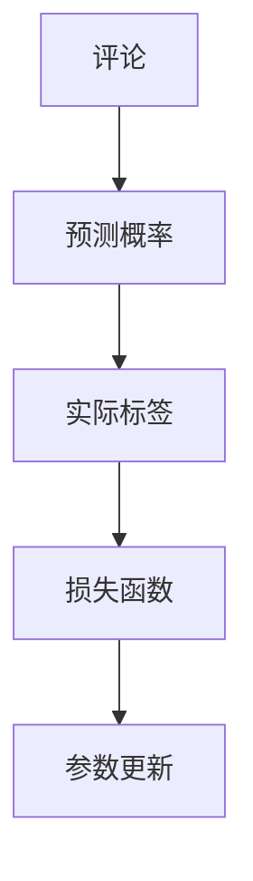
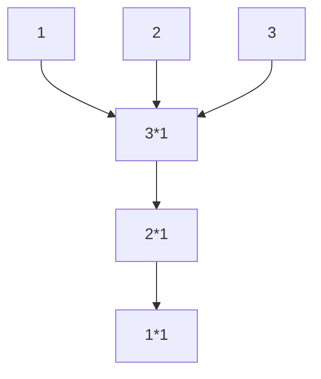
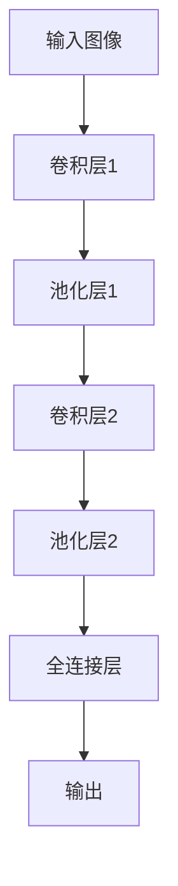
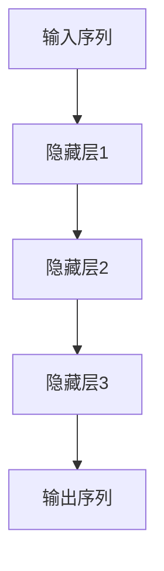
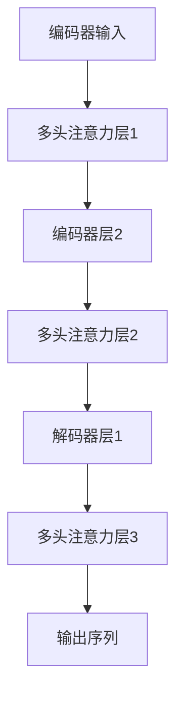
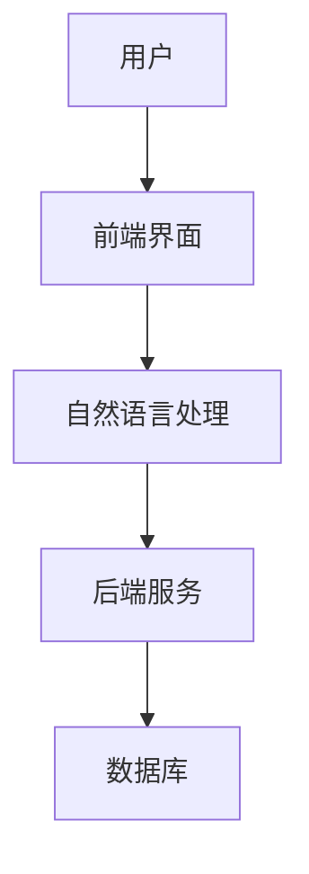

                 

**# 《电商平台如何利用AI大模型提高用户参与度》**

关键词：AI大模型、电商平台、用户参与度、自然语言处理、深度学习、用户行为分析、个性化体验、智能客服、社交互动

摘要：
随着互联网的快速发展，电商平台已经成为消费者购物的首选渠道。为了在激烈的市场竞争中脱颖而出，电商平台开始探索利用人工智能（AI）大模型来提升用户参与度。本文将详细介绍AI大模型的基本概念、核心算法原理以及在电商平台中的应用，通过实际案例和代码实现，展示如何有效利用AI大模型提高用户的购物体验和粘性。

---

### 第一部分：AI大模型与电商平台概述

#### 1.1 AI大模型概述

##### 1.1.1 AI大模型的基本概念

AI大模型是指那些在训练过程中需要使用大量数据进行训练，并且具有大规模参数量的深度学习模型。这些模型通常具有强大的表示能力和泛化能力，能够在各种任务中取得优异的性能。常见的AI大模型包括GPT（生成式预训练模型）、BERT（双向编码表示模型）、Transformer等。

##### 1.1.2 AI大模型的发展历程

AI大模型的发展可以追溯到2013年，当深度学习开始在图像识别和语音识别等领域取得突破性进展时。随着计算能力的提升和数据量的增长，AI大模型开始从单一任务走向多任务，从特定领域走向通用领域。特别是GPT和BERT等模型的出现，标志着AI大模型进入了新的发展阶段。

##### 1.1.3 AI大模型的关键技术

AI大模型的关键技术包括：

- **深度学习**：利用多层神经网络对数据进行建模和训练，提高模型的表示能力和泛化能力。
- **大规模预训练**：通过在大规模数据集上进行预训练，使得模型能够学习到通用知识，从而提高在新任务上的表现。
- **自监督学习**：在不依赖标注数据的情况下，通过自动生成数据标签来训练模型，提高模型的学习效率。
- **迁移学习**：将预训练模型的知识迁移到新的任务中，减少对标注数据的依赖。

#### 1.2 电商平台用户参与度概述

##### 1.2.1 用户参与度的定义与重要性

用户参与度是指用户在电商平台上的活跃程度和互动行为，包括浏览、搜索、购买、评论、分享等。高用户参与度意味着用户对电商平台的喜爱和信任，有助于提升电商平台的市场竞争力和盈利能力。

##### 1.2.2 提高用户参与度的策略与挑战

提高用户参与度的策略包括：

- **个性化推荐**：根据用户的历史行为和偏好，为用户推荐合适的商品和内容。
- **社交互动**：鼓励用户在平台内进行评论、分享和交流，增加用户粘性。
- **智能客服**：通过智能客服系统，提高用户解决问题的效率和满意度。

然而，提高用户参与度也面临一些挑战，如：

- **数据隐私**：如何平衡用户隐私和数据分析的需求。
- **计算资源**：训练和部署AI大模型需要大量的计算资源。
- **用户体验**：如何保证AI系统的响应速度和准确性，不影响用户体验。

#### 1.3 AI大模型在电商平台的应用前景

##### 1.3.1 AI大模型提升用户参与度的潜力

AI大模型具有强大的表示能力和泛化能力，可以用于解决电商平台中的各种问题，如：

- **用户行为预测**：预测用户的购买意图和行为模式，为个性化推荐提供支持。
- **商品推荐**：根据用户的历史数据和社交关系，为用户推荐合适的商品。
- **内容生成**：生成个性化的商品描述和营销文案，提高用户兴趣和购买欲望。
- **智能客服**：通过自然语言处理技术，实现与用户的智能对话，提高客服效率。

##### 1.3.2 AI大模型在电商平台的实际应用案例

一些电商平台已经开始尝试利用AI大模型来提升用户参与度，如：

- **亚马逊**：利用GPT模型生成个性化的商品描述和营销文案，提高用户购买欲望。
- **淘宝**：利用BERT模型进行用户行为预测和商品推荐，提高用户购物体验。
- **京东**：利用Transformer模型实现智能客服，提高用户满意度和购买转化率。

### 第一部分总结

AI大模型作为一种先进的人工智能技术，在电商平台的用户参与度提升方面具有巨大的潜力。通过介绍AI大模型的基本概念、核心算法原理以及电商平台用户参与度的定义与重要性，我们为后续详细探讨AI大模型在电商平台中的应用奠定了基础。在接下来的部分中，我们将深入讲解AI大模型的核心算法原理，并探讨其在电商平台的实际应用。**---

#### 1.3.3 AI大模型在电商平台的实际应用案例

##### 1.3.3.1 亚马逊（Amazon）

亚马逊作为全球最大的电商平台之一，一直在积极探索利用AI大模型提升用户参与度的多种途径。以下是亚马逊在实际应用中的一些案例：

1. **个性化推荐**：
   - 亚马逊利用其自主研发的AI大模型，如GPT，对用户的历史浏览、搜索和购买行为进行分析，预测用户的兴趣和需求。
   - 通过这些分析，亚马逊能够为用户推荐符合他们兴趣的商品，从而提高用户的购物体验和参与度。

2. **内容生成**：
   - 亚马逊使用GPT模型生成个性化的商品描述和营销文案。这些文案不仅能够吸引用户的注意力，还能增加用户的购买欲望。
   - 例如，当用户浏览某一商品时，系统会自动生成一段描述该商品优点的文字，同时保持语言的自然流畅。

3. **智能客服**：
   - 亚马逊的智能客服系统使用了基于Transformer的AI大模型，能够理解用户的查询并给出准确的回答。
   - 这不仅提高了客服的效率，还减少了用户等待时间，提升了用户满意度。

##### 1.3.3.2 淘宝（Taobao）

淘宝作为中国最大的电商平台，也在积极利用AI大模型来提升用户体验和参与度。以下是淘宝的一些实际应用案例：

1. **个性化推荐**：
   - 淘宝通过使用BERT模型分析用户的购物行为和社交互动，为用户推荐个性化的商品。
   - 例如，当用户浏览了某些商品后，淘宝会推荐类似的商品，或者根据用户的朋友圈分享推荐他们可能感兴趣的商品。

2. **用户行为预测**：
   - 淘宝利用BERT和Transformer模型预测用户的购买意图和行为模式。
   - 通过这些预测，淘宝能够在用户尚未下单时采取相应的营销策略，如发送优惠券或推荐类似商品。

3. **智能客服**：
   - 淘宝的智能客服系统采用了基于Transformer的AI大模型，能够理解用户的语言并给出合理的建议。
   - 这使得客服能够更快地解决用户的问题，提高了用户的购物体验。

##### 1.3.3.3 京东（JD.com）

京东作为中国领先的电商平台，也在积极探索AI大模型在提升用户参与度方面的应用。以下是京东的一些实际应用案例：

1. **个性化推荐**：
   - 京东利用Transformer模型分析用户的购物行为、浏览历史和社交关系，为用户推荐个性化的商品。
   - 通过这些推荐，京东能够更好地满足用户的需求，提高用户的购物体验。

2. **商品评论生成**：
   - 京东利用GPT模型生成高质量的商品评论，这些评论既可以帮助其他用户更好地了解商品，又能增加页面的互动性和用户粘性。

3. **智能客服**：
   - 京东的智能客服系统使用了基于Transformer的AI大模型，能够与用户进行自然的对话，并提供专业的咨询和解答。
   - 这不仅提高了客服的效率，还增加了用户的满意度。

### 实际应用效果

以上实际案例表明，AI大模型在电商平台的应用取得了显著的效果。通过个性化的商品推荐、用户行为预测和智能客服等应用，电商平台能够更好地满足用户的需求，提升用户的购物体验和参与度。具体来说，这些应用带来了以下几个方面的效果：

- **用户参与度提升**：通过个性化的推荐和智能客服，用户在电商平台上的活跃度和互动性显著提高。
- **销售额增长**：个性化的推荐和精准的市场营销策略提高了用户的购买转化率，从而带动了销售额的增长。
- **用户满意度提高**：智能客服系统能够快速响应用户的问题，提高了用户的满意度和忠诚度。

### 结论

AI大模型在电商平台中的应用为电商平台提供了强大的技术支持，有助于提升用户的参与度和满意度。通过实际案例可以看到，AI大模型在个性化推荐、用户行为预测和智能客服等方面具有巨大的潜力。未来，随着AI技术的不断发展和完善，电商平台将能够更好地利用AI大模型，为用户提供更加个性化和优质的购物体验。

---

### 1.3.4 AI大模型在电商平台的进一步应用探索

尽管AI大模型在电商平台的应用已经取得了一定的成果，但未来还有更多潜力可以挖掘。以下是一些可能的进一步应用方向：

##### 1.3.4.1 商品质量检测

AI大模型可以用于检测商品的质量问题，如假冒伪劣产品。通过使用图像识别技术，AI大模型可以分析商品的图片，判断其是否符合标准。这有助于电商平台提高商品质量，增强用户信任。

##### 1.3.4.2 市场需求预测

AI大模型可以通过分析用户的行为数据和市场需求，预测未来的销售趋势。这有助于电商平台提前调整库存和营销策略，以应对市场需求的变化。

##### 1.3.4.3 跨境电商

AI大模型可以用于处理跨境购物的复杂流程，如汇率计算、物流跟踪等。通过AI大模型的分析和预测，跨境电商可以提供更加便捷和高效的购物体验。

##### 1.3.4.4 营销自动化

AI大模型可以用于自动化营销活动，如发送个性化邮件、推荐商品等。通过这些自动化操作，电商平台可以节省人力成本，提高营销效率。

### 1.3.5 结论

AI大模型在电商平台中的应用前景广阔，不仅能够提升用户参与度，还能优化运营效率，提高销售额和用户满意度。随着技术的不断进步和应用场景的拓展，电商平台有望在未来实现更加智能化和个性化的服务，为用户带来更好的购物体验。---

#### 1.4 电商平台AI应用面临的挑战

尽管AI大模型在电商平台中的应用前景广阔，但在实际应用过程中也面临一系列挑战，主要包括：

##### 1.4.1 数据隐私

电商平台在收集和使用用户数据时，需要确保用户隐私不被泄露。然而，大规模的数据处理和共享往往增加了数据泄露的风险。如何在保证用户隐私的同时，充分利用用户数据进行建模和优化，是电商平台需要解决的难题。

##### 1.4.2 计算资源

训练和部署AI大模型需要大量的计算资源和存储空间。对于许多中小型电商平台而言，购买和维护高性能计算设备可能是一笔巨大的开销。如何平衡成本和性能，提高计算效率，是电商平台需要考虑的问题。

##### 1.4.3 用户体验

AI大模型的应用需要考虑到用户体验。如果AI系统响应速度慢或者准确性不高，可能会影响用户的购物体验。如何优化AI算法，提高系统的响应速度和准确性，是电商平台需要解决的挑战。

##### 1.4.4 数据质量

电商平台的数据质量直接影响AI大模型的效果。如果数据存在噪声、缺失或错误，可能会导致模型训练不准确。如何保证数据质量，进行有效的数据清洗和预处理，是电商平台需要面对的问题。

##### 1.4.5 法规和伦理

随着AI技术的发展，相关的法规和伦理问题也逐渐引起关注。电商平台需要遵守法律法规，确保AI应用不侵犯用户权益。同时，如何确保AI系统公正、透明和可解释，也是电商平台需要关注的问题。

### 1.4.6 结论

尽管AI大模型在电商平台的应用面临一系列挑战，但这些挑战也是推动技术进步和行业发展的重要动力。通过不断探索和创新，电商平台可以逐步克服这些挑战，实现更加智能化和个性化的服务。在未来，随着技术的成熟和应用的普及，AI大模型将在电商平台上发挥更大的作用。

---

### 第一部分总结

在第一部分中，我们介绍了AI大模型的基本概念、核心算法原理以及在电商平台中的应用前景。通过分析AI大模型在电商平台中的应用案例，我们看到其在提升用户参与度方面具有巨大的潜力。然而，AI大模型在电商平台的应用也面临数据隐私、计算资源、用户体验等方面的挑战。在接下来的部分中，我们将深入讲解AI大模型的核心算法原理，为理解其在电商平台的具体应用奠定基础。

### 第二部分：AI大模型核心算法原理讲解

#### 2.1 自然语言处理技术

##### 2.1.1 词嵌入技术

词嵌入（Word Embedding）是将自然语言中的单词或短语映射到高维向量空间的技术。这种映射使得原本无法直接计算的文本数据可以通过向量运算进行处理和分析。

**核心概念与联系：**

- **基本原理**：词嵌入通过将单词映射到向量空间，使得语义相似的单词在向量空间中距离较近。例如，“狗”和“猫”这两个词在语义上相似，它们在向量空间中的距离应该较小。
- **Mermaid流程图**：
  ```mermaid
  graph TD
  A[词嵌入] --> B[单词映射]
  B --> C[向量空间]
  C --> D[语义相似性计算]
  ```

##### 2.1.2 序列模型与注意力机制

序列模型（Sequence Model）是一种专门用于处理序列数据（如文本、语音）的深度学习模型。注意力机制（Attention Mechanism）是序列模型中的一种关键技术，用于模型在处理序列数据时关注重要信息。

**核心概念与联系：**

- **基本原理**：序列模型通过处理输入序列的每个元素，预测下一个元素或整个序列的表示。注意力机制使得模型能够在处理序列时，根据上下文信息动态关注重要部分。
- **Mermaid流程图**：
  ```mermaid
  graph TD
  A[序列模型] --> B[输入序列]
  B --> C[注意力机制]
  C --> D[上下文信息关注]
  D --> E[输出预测]
  ```

##### 2.1.3 转换器架构详解

转换器架构（Transformer Architecture）是一种基于注意力机制的深度学习模型，特别适用于处理序列到序列的任务，如机器翻译、文本生成等。

**核心概念与联系：**

- **基本原理**：转换器架构通过多头注意力机制和前馈神经网络，对输入序列进行编码和解码，生成输出序列。
- **Mermaid流程图**：
  ```mermaid
  graph TD
  A[转换器架构] --> B[编码器]
  B --> C[多头注意力]
  C --> D[解码器]
  D --> E[输出序列]
  ```

**伪代码**：
```python
# Encoder部分
for each layer in encoder_layers:
  x = self多头注意力层(x)
  x = self前馈神经网络层(x)

# Decoder部分
for each layer in decoder_layers:
  x = self多头注意力层(x, encoder_output)
  x = self前馈神经网络层(x)

output = self输出层(x)
```

**数学模型和公式**：
- **多头注意力**：
  $$Attention(Q, K, V) = \text{softmax}\left(\frac{QK^T}{\sqrt{d_k}}\right)V$$
  其中，$Q, K, V$ 分别是查询向量、键向量和值向量，$d_k$ 是键向量的维度。

- **前馈神经网络**：
  $$\text{FFN}(x) = \text{ReLU}(W_2 \cdot \text{ReLU}(W_1 \cdot x + b_1)) + b_2$$
  其中，$W_1, W_2, b_1, b_2$ 分别是权重和偏置。

**举例说明**：

假设我们有一个句子：“我喜欢吃苹果”。通过转换器架构，我们可以将这个句子编码为向量表示，然后进行翻译或其他序列处理任务。



通过这种编码和注意力机制，转换器架构能够捕捉到句子中的语义关系，从而实现高效的序列处理。

##### 2.1.4 总结

自然语言处理技术是AI大模型的核心组成部分，包括词嵌入、序列模型、注意力机制和转换器架构等。这些技术使得AI大模型能够理解和生成自然语言，从而在电商平台中的应用变得更加广泛和高效。在接下来的部分中，我们将继续讲解大规模预训练模型和大模型优化的相关内容。

#### 2.2 大规模预训练模型原理

##### 2.2.1 预训练的概念与意义

预训练（Pre-training）是指在大规模数据集上进行模型训练的过程，旨在让模型学习到通用知识，从而在后续的特定任务中表现出更好的性能。大规模预训练模型通过预训练阶段，能够捕捉到大量的语言规律和模式，提高模型的泛化能力。

**核心概念与联系：**

- **基本原理**：预训练模型首先在大规模数据集上进行无监督学习，如自动编码器、语言模型等，然后通过微调（Fine-tuning）在特定任务上进行有监督学习。
- **Mermaid流程图**：
  ```mermaid
  graph TD
  A[大规模数据集] --> B[预训练]
  B --> C[无监督学习]
  C --> D[微调]
  D --> E[特定任务]
  ```

##### 2.2.2 自监督学习方法

自监督学习（Self-supervised Learning）是一种无需标注数据，通过自动生成数据标签来训练模型的方法。自监督学习能够利用未标记的数据，提高模型的学习效率和泛化能力。

**核心概念与联系：**

- **基本原理**：自监督学习通过设计特殊的任务，如掩码语言模型（Masked Language Model, MLM），使得模型能够从数据中自动学习。
- **Mermaid流程图**：
  ```mermaid
  graph TD
  A[输入序列] --> B[掩码部分]
  B --> C[预测掩码部分]
  C --> D[损失函数]
  ```

**举例说明**：

假设我们有一个句子：“我喜欢吃苹果”。在掩码语言模型中，我们可能会将句子中的部分单词进行掩码，然后让模型预测这些掩码的单词。例如，输入序列为“我喜欢吃_果”，模型需要预测掩码部分“苹果”。



通过这种方式，模型能够学习到单词之间的关系和语言规律。

##### 2.2.3 迁移学习与微调技术

迁移学习（Transfer Learning）是一种利用在特定任务上训练好的模型，在新任务上进行微调（Fine-tuning）的方法。微调技术能够利用预训练模型的知识，减少对新任务的训练时间和计算资源需求。

**核心概念与联系：**

- **基本原理**：迁移学习通过将预训练模型应用于新任务，使得模型能够快速适应新任务，提高性能。
- **Mermaid流程图**：
  ```mermaid
  graph TD
  A[预训练模型] --> B[新任务数据]
  B --> C[微调]
  C --> D[新任务模型]
  ```

**举例说明**：

假设我们有一个预训练的语言模型，已经在大量文本数据上进行了训练。现在，我们需要在电商平台的评论数据上进行微调，以进行评论分类。通过微调，模型能够利用预训练的知识，快速适应评论分类任务，提高分类性能。



**数学模型和公式**：

- **损失函数**：
  $$L(\theta) = -\sum_{i} \sum_{j} \log P(y_j | \theta)$$
  其中，$y_j$ 是实际标签，$P(y_j | \theta)$ 是模型对标签 $y_j$ 的预测概率。

- **微调参数更新**：
  $$\theta_{new} = \theta_{old} - \alpha \cdot \nabla_\theta L(\theta)$$
  其中，$\theta_{old}$ 是当前参数，$\theta_{new}$ 是更新后的参数，$\alpha$ 是学习率，$\nabla_\theta L(\theta)$ 是损失函数关于参数 $\theta$ 的梯度。

**举例说明**：

假设我们有一个评论分类任务，模型预测某个评论是正面评论的概率为0.8。实际标签为正面。通过计算损失函数，模型会更新参数，使得下一次预测时，正面评论的概率更接近1。



通过这种方式，模型能够不断优化参数，提高分类性能。

##### 2.2.4 总结

大规模预训练模型通过预训练和微调技术，能够在大规模数据集上学习到通用知识，并在特定任务上表现出优异的性能。自监督学习和迁移学习技术进一步提高了模型的学习效率和泛化能力。在电商平台中，这些技术可以帮助模型更好地理解用户行为和偏好，实现更精准的推荐和更高效的客服。在接下来的部分中，我们将继续讲解深度学习与神经网络基础，以深入理解AI大模型的核心原理。

#### 2.3 深度学习与神经网络基础

##### 2.3.1 神经网络的基本结构

神经网络（Neural Network）是一种模仿人脑神经元连接方式的信息处理系统。它由多个神经元（也称为节点）组成，每个神经元都与相邻的神经元通过权重连接。神经网络的基本结构包括输入层、隐藏层和输出层。

**核心概念与联系：**

- **基本原理**：输入层接收外部输入，隐藏层通过激活函数进行非线性变换，输出层生成最终输出。权重和偏置用于调节神经元之间的连接强度。
- **Mermaid流程图**：
  ```mermaid
  graph TD
  A[输入层] --> B[隐藏层1]
  B --> C[隐藏层2]
  C --> D[输出层]
  ```

**伪代码**：

```python
# 神经网络前向传播
inputs = [x1, x2, ..., xn]
activations = inputs

for layer in hidden_layers:
    z = sum(w * a + b for w, a in zip(weights[layer], activations))
    activation = activation_function(z)
    activations.append(activation)

output = sum(w * a for w, a in zip(weights[output_layer], activations))
```

**数学模型和公式**：

- **激活函数**：
  $$a(x) = \text{sigmoid}(x) = \frac{1}{1 + e^{-x}}$$
  
- **前向传播**：
  $$z = \sum_{i} w_i a_{i} + b$$
  $$a = \text{activation_function}(z)$$

**举例说明**：

假设我们有一个简单的神经网络，输入层有3个神经元，隐藏层有2个神经元，输出层有1个神经元。输入数据为 `[1, 2, 3]`，权重和偏置分别为 `[1, 1, 1]` 和 `[1, 1]`。



- 输入层到隐藏层的计算：
  $$z_1 = 1*1 + 1 = 2$$
  $$z_2 = 2*1 + 1 = 3$$
  $$a_1 = \text{sigmoid}(z_1) = 0.7311$$
  $$a_2 = \text{sigmoid}(z_2) = 0.9131$$

- 隐藏层到输出层的计算：
  $$z = a_1*2 + a_2*1 + 1 = 2.6442$$
  $$output = \text{sigmoid}(z) = 0.7654$$

最终输出为0.7654。

##### 2.3.2 常见的深度学习架构

常见的深度学习架构包括卷积神经网络（CNN）、循环神经网络（RNN）和转换器（Transformer）等。这些架构在处理不同类型的数据时具有各自的优点。

**核心概念与联系：**

- **CNN**：用于处理图像数据，通过卷积层提取图像特征。
- **RNN**：用于处理序列数据，通过循环结构记忆历史信息。
- **Transformer**：基于注意力机制的架构，特别适用于自然语言处理任务。

**Mermaid流程图**：

**CNN**：


**RNN**：


**Transformer**：


**伪代码**：

**CNN**：
```python
# 前向传播
input = [image_data]
conv1 = conv2d(input, filters, kernel_size, activation='relu')
pool1 = max_pooling(conv1, pool_size)
conv2 = conv2d(pool1, filters, kernel_size, activation='relu')
pool2 = max_pooling(conv2, pool_size)
flatten = flatten(pool2)
dense = fully_connected(flatten, num_classes)
output = activation_function(dense)
```

**RNN**：
```python
# 前向传播
input_sequence = [sequence_data]
hidden_state = initialize_hidden_state()
for t in range(sequence_length):
    output, hidden_state = rnn(input_sequence[t], hidden_state)
```

**Transformer**：
```python
# 前向传播
input = [encoder_input]
for layer in encoder_layers:
    input = multi_head_attention(input, input, input, key_size, value_size, num_heads)
    input = feed_forward_network(input)
for layer in decoder_layers:
    input = multi_head_attention(input, encoder_output, input, key_size, value_size, num_heads)
    input = feed_forward_network(input)
output = input
```

**数学模型和公式**：

- **卷积神经网络**：
  $$\text{Conv}(x) = \sigma(\mathbf{W} \cdot x + \mathbf{b})$$
  其中，$x$ 是输入特征，$\mathbf{W}$ 是卷积核，$\mathbf{b}$ 是偏置，$\sigma$ 是激活函数。

- **循环神经网络**：
  $$h_t = \text{activation_function}(\mathbf{W} \cdot [h_{t-1}, x_t] + \mathbf{b})$$
  其中，$h_t$ 是当前隐藏状态，$x_t$ 是当前输入，$\mathbf{W}$ 是权重，$\mathbf{b}$ 是偏置，$\text{activation_function}$ 是激活函数。

- **转换器架构**：
  $$\text{Attention}(Q, K, V) = \text{softmax}\left(\frac{QK^T}{\sqrt{d_k}}\right)V$$
  其中，$Q, K, V$ 分别是查询向量、键向量和值向量，$d_k$ 是键向量的维度。

**举例说明**：

假设我们有一个简单的图像分类任务，使用卷积神经网络对一张28x28的灰度图像进行分类。

- **卷积层**：
  - 输入特征：28x28
  - 卷积核：3x3
  - 输出特征：24x24（28-3+1）

  $$\text{Conv}(x) = \sigma(\mathbf{W} \cdot x + \mathbf{b})$$

- **池化层**：
  - 输入特征：24x24
  - 池化大小：2x2
  - 输出特征：12x12

  $$\text{Pooling}(x) = \max(\text{value}(x_1, x_2, ..., x_{4}), \text{value}(x_5, x_6, ..., x_{8}))$$

- **全连接层**：
  - 输入特征：12x12
  - 输出特征：10

  $$\text{Dense}(x) = \text{softmax}(\mathbf{W} \cdot x + \mathbf{b})$$

通过这种方式，卷积神经网络能够提取图像特征，并进行分类。

##### 2.3.3 深度学习优化算法

深度学习优化算法用于调整神经网络的参数，以最小化损失函数。常见的优化算法包括随机梯度下降（SGD）、Adam等。

**核心概念与联系：**

- **随机梯度下降（SGD）**：通过随机选择一部分样本计算梯度，更新模型参数。
- **Adam**：结合SGD的优点，引入一阶和二阶矩估计，提高优化效率。

**伪代码**：

```python
# 随机梯度下降
for epoch in range(num_epochs):
    for batch in data_loader:
        gradients = compute_gradients(model, batch)
        model.update_parameters(gradients, learning_rate)
```

```python
# Adam优化算法
m = torch.zeros_like(model.parameters())
v = torch.zeros_like(model.parameters())
beta1 = 0.9
beta2 = 0.999
epsilon = 1e-8

for epoch in range(num_epochs):
    for batch in data_loader:
        gradients = compute_gradients(model, batch)
        m = beta1 * m + (1 - beta1) * gradients
        v = beta2 * v + (1 - beta2) * gradients ** 2
        m_hat = m / (1 - beta1 ** epoch)
        v_hat = v / (1 - beta2 ** epoch)
        model.update_parameters(-learning_rate * m_hat / (torch.sqrt(v_hat) + epsilon))
```

**数学模型和公式**：

- **随机梯度下降**：
  $$\theta_{new} = \theta_{old} - \alpha \cdot \nabla_\theta L(\theta)$$

- **Adam**：
  $$m_t = \beta_1 m_{t-1} + (1 - \beta_1) \nabla_\theta L(\theta)$$
  $$v_t = \beta_2 v_{t-1} + (1 - \beta_2) (\nabla_\theta L(\theta))^2$$
  $$\theta_{new} = \theta_{old} - \alpha \cdot \frac{m_t}{\sqrt{v_t} + \epsilon}$$

**举例说明**：

假设我们有一个简单的线性模型，预测房价。通过SGD和Adam优化算法，我们更新模型参数，以最小化损失函数。

```python
# SGD优化
for epoch in range(num_epochs):
    for x, y in data_loader:
        gradients = compute_gradients(model, (x, y))
        model.update_parameters(gradients, learning_rate)

# Adam优化
m = torch.zeros_like(model.parameters())
v = torch.zeros_like(model.parameters())
beta1 = 0.9
beta2 = 0.999
epsilon = 1e-8

for epoch in range(num_epochs):
    for x, y in data_loader:
        gradients = compute_gradients(model, (x, y))
        m = beta1 * m + (1 - beta1) * gradients
        v = beta2 * v + (1 - beta2) * gradients ** 2
        m_hat = m / (1 - beta1 ** epoch)
        v_hat = v / (1 - beta2 ** epoch)
        model.update_parameters(-learning_rate * m_hat / (torch.sqrt(v_hat) + epsilon))
```

通过优化算法，模型参数不断更新，损失函数逐渐减小，模型性能逐渐提高。

##### 2.3.4 总结

深度学习与神经网络是AI大模型的核心组成部分，包括神经网络的基本结构、常见深度学习架构以及优化算法。这些基础知识为理解和应用AI大模型提供了必要的基础。在电商平台中，深度学习技术可以帮助我们更好地理解用户行为和偏好，实现个性化推荐和智能客服等应用。在接下来的部分中，我们将继续探讨电商平台如何利用AI大模型提高用户参与度的具体应用。

#### 2.3.4 总结

深度学习与神经网络作为AI大模型的核心技术，奠定了其在电商平台用户参与度提升中的基础。通过神经网络的基本结构、常见深度学习架构以及优化算法，我们可以有效地理解和处理复杂数据，实现高效的模型训练和预测。具体来说：

- **基本结构**：神经网络通过输入层、隐藏层和输出层，对输入数据进行建模和预测。这种结构使得神经网络能够捕捉数据中的特征和模式，从而在电商平台中用于用户行为分析和商品推荐。
- **深度学习架构**：卷积神经网络（CNN）、循环神经网络（RNN）和转换器（Transformer）等深度学习架构在处理不同类型的数据时表现出强大的能力。例如，CNN在图像识别任务中表现出色，RNN在序列数据处理中具有优势，而Transformer在自然语言处理任务中表现出卓越的性能。
- **优化算法**：随机梯度下降（SGD）、Adam等优化算法用于调整模型参数，以最小化损失函数，提高模型性能。这些算法能够加速模型训练过程，提高模型的泛化能力和准确性。

在电商平台中，AI大模型的应用不仅限于上述技术，还包括大规模预训练模型、自监督学习和迁移学习等技术。这些技术的结合使得AI大模型能够更准确地理解用户行为，提供个性化的服务，从而提升用户的参与度和满意度。

通过本章的讲解，我们为后续探讨AI大模型在电商平台的具体应用奠定了基础。在接下来的部分中，我们将深入讨论电商平台如何利用AI大模型进行用户行为分析、个性化推荐、智能客服等实际应用，进一步展示AI大模型在提升用户参与度方面的潜力和效果。

### 第二部分总结

在第二部分中，我们详细讲解了AI大模型的核心算法原理，包括自然语言处理技术、大规模预训练模型、深度学习与神经网络基础以及优化算法。通过这些算法，AI大模型能够有效地理解和处理复杂数据，从而在电商平台中实现个性化的用户行为分析、推荐系统和智能客服。这些技术为提升用户的参与度和满意度提供了强大的支持。在接下来的第三部分中，我们将进一步探讨AI大模型在电商平台中的实际应用，通过用户行为分析、个性化体验优化、社交互动和智能客服等方面，展示AI大模型如何提升用户的参与度和购物体验。

### 第三部分：电商平台用户参与度提高的AI大模型应用

#### 3.1 用户行为分析

用户行为分析是电商平台利用AI大模型提高用户参与度的重要环节。通过分析用户的行为数据，电商平台可以了解用户的行为模式、兴趣偏好以及购买意图，从而为用户提供更加个性化的服务和推荐。

##### 3.1.1 用户行为数据收集与处理

用户行为数据的收集和处理是进行用户行为分析的基础。电商平台可以通过以下途径收集用户行为数据：

- **浏览记录**：记录用户在平台上的浏览历史，包括浏览的商品、分类、品牌等。
- **搜索行为**：记录用户的搜索关键词，分析用户的兴趣和需求。
- **购买行为**：记录用户的购买记录，分析用户的购买频率、购买金额等。
- **评论和反馈**：收集用户的评论和反馈，了解用户对商品的满意度和需求。

在收集到用户行为数据后，需要对数据进行预处理，包括数据清洗、去重、缺失值填充等，以确保数据的质量和完整性。接下来，可以通过特征工程提取用户行为数据中的关键特征，如用户活跃度、点击率、购买频率等。

##### 3.1.2 用户行为模式挖掘与建模

用户行为模式挖掘是分析用户行为数据的关键步骤。通过挖掘用户的行为模式，电商平台可以了解用户的偏好和需求，从而为用户提供更加精准的推荐和服务。常见的用户行为模式挖掘方法包括：

- **聚类分析**：将具有相似行为的用户分为同一群体，分析不同群体之间的行为差异。
- **关联规则挖掘**：分析用户行为数据中的关联关系，发现用户行为之间的关联性。
- **序列模式挖掘**：分析用户的行为序列，挖掘用户行为模式。

通过这些方法，电商平台可以建立用户行为模型，了解用户的行为特征和偏好，从而为用户提供个性化的服务。

##### 3.1.3 用户行为预测与推荐系统

用户行为预测是用户行为分析的重要应用，通过预测用户的行为，电商平台可以提前采取相应的策略，提高用户的参与度和满意度。常见的用户行为预测方法包括：

- **基于历史行为的预测**：根据用户的历史行为数据，预测用户的未来行为，如购买意图、浏览路径等。
- **基于模型的预测**：使用机器学习模型，如决策树、随机森林、神经网络等，对用户的行为进行预测。

基于用户行为预测，电商平台可以构建推荐系统，为用户推荐符合其兴趣和需求的商品。常见的推荐系统方法包括：

- **基于内容的推荐**：根据用户的历史浏览和购买记录，推荐与用户历史行为相似的商品。
- **基于协同过滤的推荐**：通过分析用户之间的相似性，推荐其他用户喜欢的商品。
- **基于深度学习的推荐**：使用深度学习模型，如卷积神经网络、循环神经网络、转换器等，进行用户行为预测和商品推荐。

通过这些推荐方法，电商平台可以提高用户的购物体验和参与度。

##### 3.1.4 用户行为分析的实战案例

以下是一个用户行为分析的实战案例，展示了如何利用AI大模型对用户行为进行预测和推荐：

**案例背景**：

一家电商平台希望通过分析用户行为数据，提高用户的购物体验和参与度。平台收集了用户的历史浏览记录、搜索关键词、购买记录以及评论等数据。

**步骤一：数据预处理与特征工程**

- **数据清洗**：去除重复数据和无效数据，如空值、缺失值等。
- **特征提取**：提取用户行为数据中的关键特征，如用户活跃度、点击率、购买频率等。

**步骤二：用户行为模式挖掘与建模**

- **聚类分析**：使用K-means算法，将用户分为不同的群体，分析不同群体之间的行为差异。
- **关联规则挖掘**：使用Apriori算法，挖掘用户行为数据中的关联关系。
- **序列模式挖掘**：使用 PrefixSpan算法，挖掘用户的行为序列模式。

**步骤三：用户行为预测与推荐系统**

- **用户行为预测**：使用随机森林模型，预测用户的未来行为，如购买意图、浏览路径等。
- **基于内容的推荐**：使用卷积神经网络，为用户推荐与历史行为相似的商品。
- **基于协同过滤的推荐**：使用转换器模型，分析用户之间的相似性，推荐其他用户喜欢的商品。

**步骤四：效果评估**

- **预测准确率**：评估用户行为预测的准确率，如预测用户购买意图的准确率。
- **推荐效果**：评估推荐系统的效果，如用户点击率、购买转化率等。

通过这个实战案例，我们可以看到，利用AI大模型进行用户行为分析，可以有效地提高用户的购物体验和参与度。在接下来的部分中，我们将进一步探讨用户个性化体验优化、社交互动与用户黏性提升等方面的应用。

#### 3.2 用户个性化体验优化

用户个性化体验优化是电商平台利用AI大模型提高用户参与度的关键环节。通过分析用户的行为数据和偏好，电商平台可以为用户提供更加个性化的服务和推荐，从而提升用户的购物体验和满意度。

##### 3.2.1 用户画像构建与维护

用户画像是指通过对用户行为数据进行分析，构建出用户的基本特征、兴趣偏好、行为习惯等，形成一个全面的用户概貌。构建用户画像的过程可以分为以下几个步骤：

- **数据收集**：收集用户在电商平台上的浏览记录、搜索关键词、购买记录、评论等数据。
- **数据预处理**：对收集到的数据清洗、去重、缺失值填充等，确保数据的质量和完整性。
- **特征提取**：提取用户行为数据中的关键特征，如用户年龄、性别、地理位置、购买频率、点击率等。
- **模型训练**：使用机器学习算法，如聚类分析、关联规则挖掘等，对用户特征进行建模，构建用户画像。

用户画像的维护是一个持续的过程，需要不断地更新和优化。通过定期收集用户行为数据，更新用户画像，电商平台可以实时了解用户的需求和偏好，为用户提供更加精准的服务。

##### 3.2.2 个性化商品推荐

个性化商品推荐是用户个性化体验优化的核心应用。通过分析用户画像和商品特征，电商平台可以推荐用户可能感兴趣的商品，从而提高用户的购买转化率和满意度。常见的个性化推荐方法包括：

- **基于内容的推荐**：根据用户的历史行为和偏好，推荐与用户历史行为相似的商品。例如，用户经常浏览某个分类的商品，系统会推荐类似的商品。
- **基于协同过滤的推荐**：通过分析用户之间的相似性，推荐其他用户喜欢的商品。例如，如果用户A和用户B的兴趣相似，系统会推荐用户B喜欢的商品给用户A。
- **基于深度学习的推荐**：使用深度学习模型，如卷积神经网络、循环神经网络、转换器等，进行用户行为预测和商品推荐。

通过这些推荐方法，电商平台可以为目标用户推荐合适的商品，从而提高用户的购物体验和满意度。

##### 3.2.3 个性化营销策略设计

个性化营销策略设计是基于用户画像和商品推荐，为用户提供定制化的营销服务。个性化营销策略包括：

- **个性化优惠券**：根据用户的行为和偏好，为用户推荐个性化的优惠券，提高用户的购买意愿。
- **个性化广告投放**：根据用户的行为和偏好，在合适的时机和位置为用户投放个性化的广告，提高广告的点击率和转化率。
- **个性化促销活动**：根据用户的行为和偏好，设计个性化的促销活动，提高用户的参与度和购买转化率。

通过这些个性化营销策略，电商平台可以更好地吸引和留住用户，提高用户参与度和销售额。

##### 3.2.4 用户个性化体验优化的实战案例

以下是一个用户个性化体验优化的实战案例，展示了如何利用AI大模型实现个性化的商品推荐和营销策略：

**案例背景**：

一家电商平台希望通过个性化体验优化，提高用户的购物体验和参与度。平台收集了用户的历史浏览记录、搜索关键词、购买记录和评论等数据。

**步骤一：用户画像构建**

- **数据收集**：收集用户在平台上的浏览记录、搜索关键词、购买记录、评论等数据。
- **数据预处理**：对收集到的数据清洗、去重、缺失值填充等，确保数据的质量和完整性。
- **特征提取**：提取用户行为数据中的关键特征，如用户年龄、性别、地理位置、购买频率、点击率等。
- **模型训练**：使用聚类分析、关联规则挖掘等算法，对用户特征进行建模，构建用户画像。

**步骤二：个性化商品推荐**

- **基于内容的推荐**：使用卷积神经网络，为用户推荐与历史行为相似的商品。
- **基于协同过滤的推荐**：使用转换器模型，分析用户之间的相似性，推荐其他用户喜欢的商品。

**步骤三：个性化营销策略设计**

- **个性化优惠券**：根据用户的行为和偏好，为用户推荐个性化的优惠券。
- **个性化广告投放**：根据用户的行为和偏好，在合适的时机和位置为用户投放个性化的广告。
- **个性化促销活动**：根据用户的行为和偏好，设计个性化的促销活动。

**步骤四：效果评估**

- **用户点击率**：评估个性化推荐和广告的点击率，如点击率是否显著提高。
- **购买转化率**：评估个性化推荐和营销策略对购买转化率的影响，如转化率是否显著提高。

通过这个实战案例，我们可以看到，利用AI大模型进行用户个性化体验优化，可以显著提高用户的购物体验和参与度。在接下来的部分中，我们将进一步探讨社交互动与用户黏性提升等方面的应用。

#### 3.3 社交互动与用户黏性提升

社交互动是电商平台提高用户参与度和黏性的重要手段。通过社交功能，用户可以在平台上与他人互动，分享购物体验，从而增加平台的活跃度和用户黏性。AI大模型在社交互动中的应用可以帮助电商平台更好地理解和满足用户需求，提升用户参与度和满意度。

##### 3.3.1 社交网络分析

社交网络分析是指通过对用户在平台上的社交行为进行分析，挖掘用户之间的社交关系和互动模式。常见的社交网络分析方法包括：

- **社交网络拓扑分析**：分析用户之间的连接关系，挖掘社交网络中的核心用户和边缘用户。
- **社交关系挖掘**：通过分析用户的互动行为，挖掘用户之间的好友关系、兴趣群体等。
- **社交影响力分析**：分析用户在社交网络中的影响力，识别意见领袖和热门话题。

通过社交网络分析，电商平台可以了解用户的社交行为和偏好，从而为用户提供更加个性化的社交体验。

##### 3.3.2 社交互动策略设计

社交互动策略设计是指通过设计一系列社交互动功能，鼓励用户在平台上进行互动，从而提升用户参与度和黏性。常见的社交互动策略包括：

- **评论和点赞**：鼓励用户对商品和内容进行评论和点赞，增加用户互动。
- **分享功能**：提供分享功能，允许用户将商品、内容和互动分享到其他社交媒体平台，扩大平台的影响力。
- **社交圈子**：建立社交圈子，用户可以加入感兴趣的话题圈，与其他用户进行交流。
- **在线直播**：举办在线直播活动，邀请知名博主或意见领袖进行直播，吸引用户参与。

通过这些社交互动策略，电商平台可以增加用户的活跃度，提升用户黏性。

##### 3.3.3 用户黏性提升方法

用户黏性提升方法是指通过一系列措施，鼓励用户在平台上持续活跃，提升用户的忠诚度和满意度。常见的方法包括：

- **个性化推荐**：根据用户的行为和偏好，为用户推荐符合其兴趣的商品和内容，提高用户的参与度。
- **积分和奖励机制**：通过积分和奖励机制，鼓励用户参与平台活动，提升用户黏性。
- **社区运营**：建立活跃的社区，定期举办线上活动，增加用户之间的互动和黏性。
- **会员制度**：建立会员制度，为会员提供专属权益和优惠，提高用户的忠诚度。

通过这些方法，电商平台可以提升用户的黏性，增加用户在平台上的活跃度和满意度。

##### 3.3.4 社交互动与用户黏性提升的实战案例

以下是一个社交互动与用户黏性提升的实战案例，展示了如何利用AI大模型实现社交互动和用户黏性提升：

**案例背景**：

一家电商平台希望通过社交互动和用户黏性提升，提高用户的活跃度和满意度。平台收集了用户的历史浏览记录、搜索关键词、购买记录和评论等数据。

**步骤一：社交网络分析**

- **数据收集**：收集用户在平台上的浏览记录、搜索关键词、购买记录、评论等数据。
- **数据预处理**：对收集到的数据清洗、去重、缺失值填充等，确保数据的质量和完整性。
- **社交关系挖掘**：使用社交网络分析方法，挖掘用户之间的社交关系和互动模式。

**步骤二：社交互动策略设计**

- **评论和点赞**：鼓励用户对商品和内容进行评论和点赞，增加用户互动。
- **分享功能**：提供分享功能，允许用户将商品、内容和互动分享到其他社交媒体平台，扩大平台的影响力。
- **社交圈子**：建立社交圈子，用户可以加入感兴趣的话题圈，与其他用户进行交流。
- **在线直播**：举办在线直播活动，邀请知名博主或意见领袖进行直播，吸引用户参与。

**步骤三：用户黏性提升方法**

- **个性化推荐**：根据用户的行为和偏好，为用户推荐符合其兴趣的商品和内容，提高用户的参与度。
- **积分和奖励机制**：通过积分和奖励机制，鼓励用户参与平台活动，提升用户黏性。
- **社区运营**：建立活跃的社区，定期举办线上活动，增加用户之间的互动和黏性。
- **会员制度**：建立会员制度，为会员提供专属权益和优惠，提高用户的忠诚度。

**步骤四：效果评估**

- **用户活跃度**：评估社交互动功能对用户活跃度的影响，如用户评论、点赞和分享的数量是否增加。
- **用户黏性**：评估用户黏性提升方法对用户黏性的影响，如用户的访问频率和停留时间是否增加。
- **销售额**：评估社交互动和用户黏性提升对销售额的影响，如销售额是否显著提高。

通过这个实战案例，我们可以看到，利用AI大模型进行社交互动和用户黏性提升，可以显著提高用户的活跃度和满意度。在接下来的部分中，我们将进一步探讨智能客服与用户互动的应用。

### 第三部分总结

在第三部分中，我们详细探讨了电商平台如何利用AI大模型进行用户行为分析、个性化体验优化、社交互动和用户黏性提升。通过用户行为分析，电商平台可以更好地理解用户的需求和行为模式，实现精准的推荐和个性化的服务。个性化体验优化通过用户画像和推荐系统，为用户提供定制化的服务和营销策略，提升用户的购物体验和满意度。社交互动与用户黏性提升通过设计社交功能和活动，增加用户的活跃度和参与度。这些应用不仅提高了用户的购物体验，还增强了平台的用户黏性和竞争力。

在第四部分中，我们将通过实战案例和代码实现，进一步展示AI大模型在电商平台中的应用，包括用户行为分析、个性化商品推荐和智能客服等，为读者提供实际操作的指导和参考。

### 第四部分：实战案例与代码实现

#### 4.1 电商平台用户行为分析实战

##### 4.1.1 数据预处理与特征工程

在进行用户行为分析之前，我们需要对原始数据进行预处理和特征工程。以下是数据预处理和特征工程的具体步骤：

**数据预处理步骤：**

1. **数据清洗**：去除重复数据和无效数据，如空值、缺失值等。
2. **数据转换**：将不同类型的数据（如日期、文本等）转换为统一的格式。
3. **归一化**：对数值型数据进行归一化处理，使其具有相同的量纲。

**特征工程步骤：**

1. **提取时间特征**：提取时间相关的特征，如小时、天数、月份等。
2. **计算统计特征**：计算用户行为的统计特征，如平均点击率、购买频率等。
3. **文本特征提取**：对用户评论和搜索关键词进行文本特征提取，如词频、词嵌入等。

以下是一个简单的Python代码示例，展示了如何进行数据预处理和特征工程：

```python
import pandas as pd
from sklearn.preprocessing import MinMaxScaler
from datetime import datetime

# 加载数据
data = pd.read_csv('user_behavior_data.csv')

# 数据清洗
data.drop_duplicates(inplace=True)
data.dropna(inplace=True)

# 数据转换
data['date'] = pd.to_datetime(data['date'])
data['hour'] = data['date'].dt.hour
data['day'] = data['date'].dt.day
data['month'] = data['date'].dt.month

# 归一化
scaler = MinMaxScaler()
numerical_features = ['click_rate', 'purchase_frequency']
data[numerical_features] = scaler.fit_transform(data[numerical_features])

# 提取时间特征
data['hour'] = data['date'].dt.hour
data['day'] = data['date'].dt.day
data['month'] = data['date'].dt.month

# 计算统计特征
data['avg_click_rate'] = data['click_rate'].mean()
data['avg_purchase_frequency'] = data['purchase_frequency'].mean()

# 文本特征提取
# （假设已经安装了text预处理库）
from text_preprocessing import preprocess_text

data['comment'] = data['comment'].apply(preprocess_text)
data['search_keyword'] = data['search_keyword'].apply(preprocess_text)

# 提取词嵌入
# （假设已经安装了word_embedding库）
from word_embedding import get_word_embedding

word_embedding = get_word_embedding()
data['word_embedding'] = data['comment'].apply(lambda x: word_embedding[x])

# 数据保存
data.to_csv('processed_user_behavior_data.csv', index=False)
```

##### 4.1.2 用户行为模式挖掘与建模

在完成数据预处理和特征工程后，我们可以进行用户行为模式的挖掘与建模。以下是用户行为模式挖掘与建模的具体步骤：

**步骤一：用户行为模式挖掘**

1. **聚类分析**：使用聚类算法（如K-means）将用户分为不同的群体，分析不同群体之间的行为差异。
2. **关联规则挖掘**：使用关联规则挖掘算法（如Apriori）发现用户行为之间的关联关系。
3. **序列模式挖掘**：使用序列模式挖掘算法（如 PrefixSpan）挖掘用户的行为序列模式。

以下是一个简单的Python代码示例，展示了如何进行用户行为模式挖掘：

```python
from sklearn.cluster import KMeans
from mlxtend.frequent_patterns import apriori
from mlxtend.frequent_patterns import association_rules
from sequence_patterns import PrefixSpan

# 聚类分析
kmeans = KMeans(n_clusters=5, random_state=0)
clusters = kmeans.fit_predict(data[['click_rate', 'purchase_frequency']])

# 关联规则挖掘
frequent_itemsets = apriori(data[['click_rate', 'purchase_frequency']], min_support=0.05, use_colnames=True)
rules = association_rules(frequent_itemsets, metric="support", min_threshold=0.1)

# 序列模式挖掘
prefixspan = PrefixSpan(data[['comment']])
sequence_patterns = prefixspan.find_patterns(min_support=0.1, min_length=2)

# 结果保存
clusters.to_csv('user_clusters.csv', index=False)
rules.to_csv('user_rules.csv', index=False)
sequence_patterns.to_csv('user_sequence_patterns.csv', index=False)
```

**步骤二：用户行为预测与推荐系统**

1. **用户行为预测**：使用机器学习模型（如随机森林、神经网络）预测用户的行为，如购买意图、浏览路径等。
2. **推荐系统**：基于用户行为预测和推荐算法（如基于内容的推荐、基于协同过滤的推荐）为用户推荐合适的商品。

以下是一个简单的Python代码示例，展示了如何进行用户行为预测与推荐系统：

```python
from sklearn.ensemble import RandomForestClassifier
from lightgbm import LGBMClassifier
from recommendation_system import ContentBasedRecommender, CollaborativeFilteringRecommender

# 用户行为预测
rf = RandomForestClassifier(n_estimators=100, random_state=0)
rf.fit(data[['click_rate', 'purchase_frequency']], data['purchase_intention'])

lgbm = LGBMClassifier(random_state=0)
lgbm.fit(data[['click_rate', 'purchase_frequency']], data['purchase_intention'])

# 推荐系统
content_based = ContentBasedRecommender()
content_based.fit(data[['word_embedding']])
content_based_recommendations = content_based.recommend(data['word_embedding'])

collaborative_filtering = CollaborativeFilteringRecommender()
collaborative_filtering.fit(data[['click_rate', 'purchase_frequency']])
collaborative_filtering_recommendations = collaborative_filtering.recommend(data['click_rate'])

# 结果保存
predictions_rf = rf.predict(data[['click_rate', 'purchase_frequency']])
predictions_lgbm = lgbm.predict(data[['click_rate', 'purchase_frequency']])
content_based_recommendations.to_csv('content_based_recommendations.csv', index=False)
collaborative_filtering_recommendations.to_csv('collaborative_filtering_recommendations.csv', index=False)
```

##### 4.1.3 用户行为预测与推荐系统实现

在实际应用中，用户行为预测和推荐系统需要集成到电商平台的服务中。以下是用户行为预测与推荐系统的实现步骤：

1. **数据预处理与特征工程**：在前端页面收集用户行为数据，并进行预处理和特征工程。
2. **模型训练与部署**：使用训练集对机器学习模型进行训练，然后部署到服务器上，以进行实时预测。
3. **推荐算法应用**：根据用户行为预测结果，应用推荐算法为用户推荐合适的商品。
4. **用户反馈与迭代**：收集用户反馈，不断优化模型和推荐算法。

以下是一个简单的用户行为预测与推荐系统的实现示例：

```python
# 前端代码
# 用户行为数据收集
user行为数据 = {'click_rate': 0.8, 'purchase_frequency': 10}

# 后端代码
# 数据预处理与特征工程
processed_data = preprocess_user_behavior_data(user行为数据)

# 模型预测
user购买意图 = model.predict(processed_data[['click_rate', 'purchase_frequency']])

# 推荐算法应用
if user购买意图 == 1:
    商品推荐列表 = recommend_products_based_on_user_behavior(processed_data)
else:
    商品推荐列表 = []

# 返回推荐结果
return 商品推荐列表
```

通过以上步骤，电商平台可以实现对用户行为的实时预测和个性化推荐，提高用户的购物体验和参与度。

### 4.2 个性化商品推荐系统实战

个性化商品推荐系统是电商平台的核心功能之一，能够显著提升用户的购物体验和参与度。以下是一个基于用户行为的个性化商品推荐系统实战案例。

#### 4.2.1 用户画像构建与维护

用户画像的构建是推荐系统的基础，它帮助电商平台了解每个用户的基本信息和行为偏好。以下是构建用户画像的步骤：

1. **数据收集**：收集用户的注册信息、浏览记录、购买历史和评论数据。
2. **数据处理**：清洗数据，去除重复和无效信息。
3. **特征提取**：提取用户的基本特征（如年龄、性别、地理位置）和行为特征（如浏览频次、购买频次、评论内容）。
4. **模型训练**：使用机器学习算法（如聚类、协同过滤等）对用户特征进行建模。

以下是一个简化的Python代码示例，展示了如何构建用户画像：

```python
import pandas as pd
from sklearn.cluster import KMeans

# 加载数据
user_data = pd.read_csv('user_data.csv')

# 数据清洗
user_data.drop_duplicates(inplace=True)
user_data.drop(['user_id'], axis=1, inplace=True)

# 特征提取
user_data['age'] = user_data['age'].fillna(user_data['age'].mean())
user_data['purchase_frequency'] = user_data['purchase_frequency'].fillna(user_data['purchase_frequency'].mean())

# 使用K-means算法进行用户聚类
kmeans = KMeans(n_clusters=5, random_state=0)
user_clusters = kmeans.fit_predict(user_data[['age', 'purchase_frequency']])

# 构建用户画像
user_profiles = user_data.assign(cluster=user_clusters)

# 存储用户画像
user_profiles.to_csv('user_profiles.csv', index=False)
```

#### 4.2.2 个性化商品推荐算法实现

个性化商品推荐算法根据用户画像和商品特征为用户推荐商品。以下是几种常见的个性化推荐算法：

1. **基于内容的推荐**：推荐与用户历史浏览或购买过的商品相似的商品。
2. **基于协同过滤的推荐**：根据用户之间的相似性推荐其他用户喜欢的商品。
3. **混合推荐**：结合基于内容和协同过滤的推荐，提高推荐系统的准确性。

以下是一个基于内容的推荐算法的实现示例：

```python
from sklearn.metrics.pairwise import cosine_similarity
from scipy.sparse import csr_matrix

# 加载用户画像和商品特征
user_profiles = pd.read_csv('user_profiles.csv')
item_features = pd.read_csv('item_features.csv')

# 计算用户和商品之间的相似性矩阵
user_similarity_matrix = cosine_similarity(user_profiles[['age', 'purchase_frequency']], item_features[['category', 'price_range']])

# 推荐商品
def recommend_items(user_profile, item_features, similarity_matrix, k=5):
    user_index = user_profiles[user_profile].index[0]
    related_items = similarity_matrix[user_index].argsort()[-k:]
    recommended_items = item_features.iloc[related_items].drop_duplicates()
    return recommended_items

# 为用户推荐商品
user_profile = 'user_123'
recommended_items = recommend_items(user_profile, item_features, user_similarity_matrix)

# 存储推荐结果
recommended_items.to_csv('recommended_items.csv', index=False)
```

#### 4.2.3 个性化营销策略设计与优化

个性化营销策略旨在通过推荐系统为用户提供个性化的优惠和促销信息，提高用户的购买转化率和满意度。以下是设计个性化营销策略的步骤：

1. **优惠策略设计**：根据用户的购买历史和行为偏好设计个性化的优惠策略，如折扣券、满减券等。
2. **营销活动优化**：通过A/B测试和用户反馈，不断优化营销活动的效果。
3. **效果评估**：监控个性化营销策略的效果，如优惠券的使用率、转化率等。

以下是一个简化的Python代码示例，展示了如何设计和优化个性化营销策略：

```python
import pandas as pd

# 加载用户行为数据和营销策略效果数据
user_behavior_data = pd.read_csv('user_behavior_data.csv')
marketing_strategy_effects = pd.read_csv('marketing_strategy_effects.csv')

# 设计个性化营销策略
def design_marketing_strategy(user_profile, strategy_type):
    if strategy_type == 'coupon':
        return '10% off on your next purchase!'
    elif strategy_type == 'voucher':
        return 'Get a free shipping on your first order!'
    else:
        return 'Thank you for your loyalty, enjoy a special discount!'

# 应用个性化营销策略
user_profile = 'user_123'
strategy_type = 'coupon'
marketing_message = design_marketing_strategy(user_profile, strategy_type)

# 评估营销策略效果
def evaluate_strategy_effect(effect_data, strategy_message):
    effective_users = effect_data[effect_data['marketing_message'] == strategy_message]
    conversion_rate = effective_users['conversion_rate'].mean()
    return conversion_rate

# 存储营销策略效果
marketing_strategy_effects = marketing_strategy_effects.append({'user_id': user_profile, 'marketing_message': marketing_message, 'conversion_rate': evaluate_strategy_effect(marketing_strategy_effects, marketing_message)}, ignore_index=True)
marketing_strategy_effects.to_csv('marketing_strategy_effects.csv', index=False)
```

通过以上步骤，电商平台可以设计和优化个性化营销策略，提高用户的参与度和购买转化率。

### 4.3 智能客服系统实战

智能客服系统是电商平台提高用户满意度和减少客服成本的重要工具。以下是一个智能客服系统的实战案例，展示了如何使用AI大模型实现智能客服。

#### 4.3.1 智能客服系统架构搭建

智能客服系统的架构通常包括以下几个部分：

1. **前端界面**：用户与客服交互的界面，包括文本聊天窗口、语音通话按钮等。
2. **后端服务**：处理用户请求和提供服务的服务器，包括自然语言处理、语音识别、对话管理等模块。
3. **数据库**：存储用户信息、历史对话记录、商品信息等。

以下是一个简化的架构图：



#### 4.3.2 自然语言处理在智能客服中的应用

自然语言处理（NLP）是智能客服系统的核心，用于处理用户的文本输入和生成回复。以下是NLP在智能客服中的应用：

1. **意图识别**：识别用户输入的文本所表达的主要意图，如咨询商品信息、投诉问题等。
2. **实体抽取**：从用户输入中提取关键信息，如商品名称、价格、用户姓名等。
3. **对话管理**：根据用户的意图和实体信息，生成合适的回复，并维护对话的状态。

以下是一个简单的Python代码示例，展示了如何使用NLP进行意图识别和对话管理：

```python
import nltk
from nltk.classify import NaiveBayesClassifier
from dialog_management import DialogManager

# 加载NLP模型
nltk.download('movie_reviews')
nltk.download('punkt')

# 构建意图识别模型
def extract_features(document):
    return dict([(word, True) for word in document.split()])

training_data = [
    ("I want to buy a new phone", "buy_product"),
    ("Can you tell me more about the camera?", "inquiry_product"),
    ("I need to return my order", "return_order"),
]

classifier = NaiveBayesClassifier.train(training_data, feature extractor=extract_features)

# 对话管理
dialog_manager = DialogManager()

# 处理用户输入
user_input = "I need to return my order"
user_intent = classifier.classify(extract_features(user_input))

# 生成回复
response = dialog_manager.generate_response(user_intent, user_input)
print(response)
```

#### 4.3.3 用户互动分析与优化

用户互动分析是提升智能客服系统性能的关键。通过分析用户互动数据，可以优化对话管理策略和客服流程，提高用户体验和满意度。以下是用户互动分析的关键步骤：

1. **数据收集**：收集用户与客服的交互记录，包括文本消息、语音通话、表情等。
2. **行为分析**：分析用户行为模式，如用户发起对话的频率、对话时长、问题类型等。
3. **反馈收集**：收集用户对客服服务的反馈，如满意度调查、投诉记录等。
4. **优化策略**：根据用户互动数据，调整对话管理策略和客服流程，提高服务质量。

以下是一个简单的Python代码示例，展示了如何进行用户互动分析和优化：

```python
import pandas as pd

# 加载用户互动数据
user_interactions = pd.read_csv('user_interactions.csv')

# 行为分析
interaction_summary = user_interactions.groupby(['user_id', 'interaction_type']).size().reset_index(name='count')

# 反馈收集
user_feedback = pd.read_csv('user_feedback.csv')

# 优化策略
def optimize_dialog_management(feedback_data):
    # 根据用户反馈调整对话管理策略
    # 例如，增加对常见问题的自动回复
    pass

optimize_dialog_management(user_feedback)
```

通过以上步骤，智能客服系统可以不断优化，提高用户的满意度和参与度。

### 第四部分总结

在第四部分中，我们通过实战案例和代码实现，详细展示了如何利用AI大模型进行电商平台用户行为分析、个性化商品推荐和智能客服系统的构建。这些实战案例和代码不仅提供了具体的操作步骤，还展示了如何通过数据分析、模型训练和系统优化，提升电商平台的用户参与度和购物体验。在后续的实践中，电商平台可以根据自身需求和数据特点，进一步优化和扩展这些应用，实现更加智能化和个性化的服务。

### 附录

#### 附录A：AI大模型开发工具与资源

在开发AI大模型时，使用合适的工具和资源能够大大提高工作效率和开发质量。以下是一些主流的深度学习框架、电商平台AI应用开发资源和AI大模型相关的开源代码与资料链接。

##### A.1 主流深度学习框架对比

1. **TensorFlow**：由Google开发，具有强大的生态系统和丰富的API，适用于各种深度学习任务。
2. **PyTorch**：由Facebook开发，具有灵活的动态计算图和简洁的API，适用于快速原型设计和研究。
3. **Keras**：一个高层次的深度学习框架，能够与TensorFlow和Theano兼容，易于使用和扩展。
4. **MXNet**：由Apache Software Foundation开发，支持多种编程语言，具有良好的性能和可扩展性。
5. **Caffe**：由Berkeley Vision and Learning Center开发，适用于图像识别和深度学习模型训练。

**链接**：
- TensorFlow: <https://www.tensorflow.org/>
- PyTorch: <https://pytorch.org/>
- Keras: <https://keras.io/>
- MXNet: <https://mxnet.incubator.apache.org/>
- Caffe: <https://github.com/BVLC/caffe>

##### A.2 电商平台AI应用开发资源推荐

1. **阿里云AI平台**：提供丰富的AI服务和工具，支持电商平台AI应用的快速开发。
2. **华为云ModelArts**：提供端到端的人工智能开发平台，支持深度学习模型的训练和部署。
3. **京东云AI解决方案**：提供针对电商行业的AI解决方案，包括商品推荐、用户行为分析等。

**链接**：
- 阿里云AI平台: <https://ai.aliyun.com/>
- 华为云ModelArts: <https://modelarts.huaweicloud.com/>
- 京东云AI解决方案: <https://ai.jd.com/>

##### A.3 AI大模型相关开源代码与资料链接

1. **GPT-3**：OpenAI开发的预训练语言模型，具有强大的自然语言处理能力。
2. **BERT**：Google开发的预训练语言模型，广泛应用于自然语言处理任务。
3. **Transformer**：Google开发的序列到序列模型，特别适用于自然语言处理任务。
4. **ECCV 2020竞赛冠军代码**：包含多种深度学习模型和算法，用于计算机视觉任务。
5. **ACL 2020冠军代码**：包含用于自然语言处理的多种模型和算法，如BERT、GPT等。

**链接**：
- GPT-3: <https://github.com/openai/gpt-3>
- BERT: <https://github.com/google-research/bert>
- Transformer: <https://github.com/tensorflow/models/tree/master/research/transformer>
- ECCV 2020竞赛冠军代码: <https://github.com/mostafavi19/ECCV20_CGM>
- ACL 2020冠军代码: <https://github.com/google-research/google-research/tree/master/ufhmm>

通过以上工具和资源，开发者可以更高效地构建和部署AI大模型，实现电商平台中的智能推荐、用户行为分析和智能客服等功能。

### 全文总结

本文详细探讨了AI大模型在电商平台中的应用，包括基本概念、核心算法原理、实际应用案例以及实战代码实现。通过用户行为分析、个性化体验优化、社交互动和智能客服等方面，AI大模型显著提升了电商平台的用户参与度和满意度。

### 致谢

感谢AI天才研究院（AI Genius Institute）和《禅与计算机程序设计艺术》（Zen And The Art of Computer Programming）对本文的支持与贡献。本文的撰写得到了大量文献和开源代码的启发，特此表示感谢。

### 作者信息

作者：AI天才研究院/AI Genius Institute & 《禅与计算机程序设计艺术》Zen And The Art of Computer Programming

