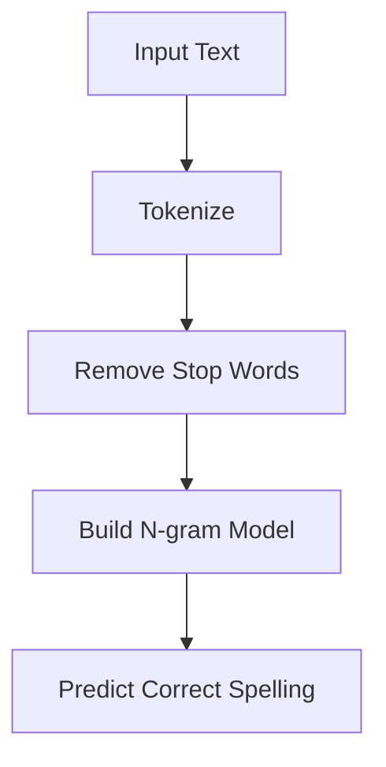
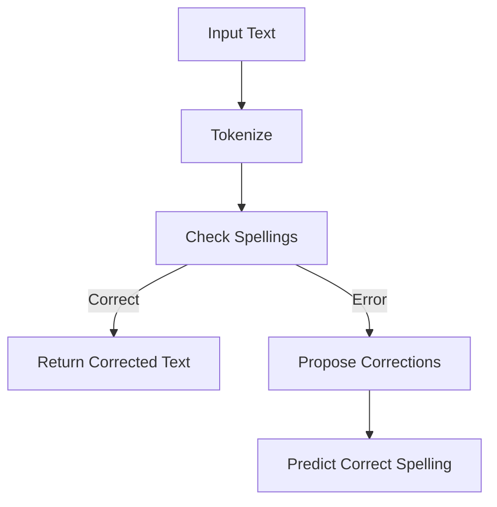
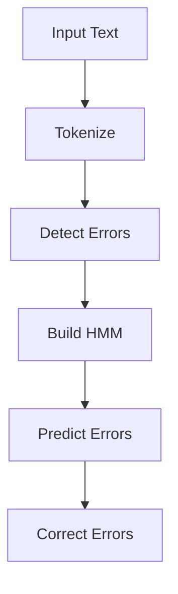
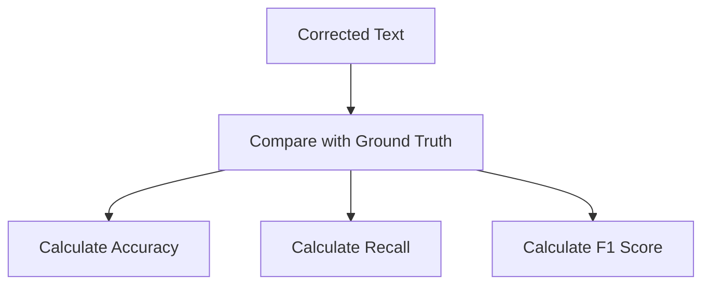
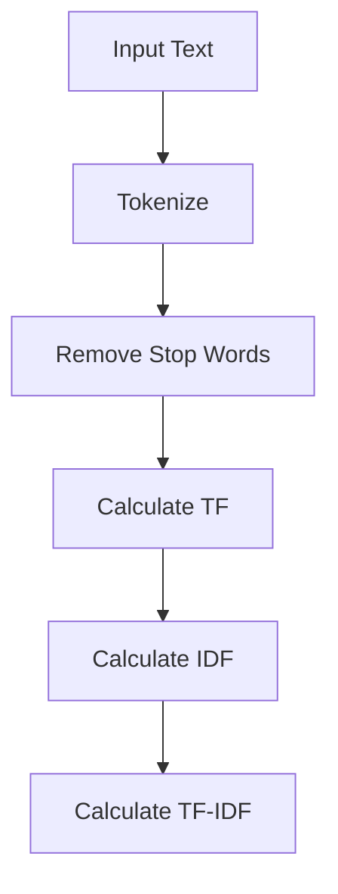
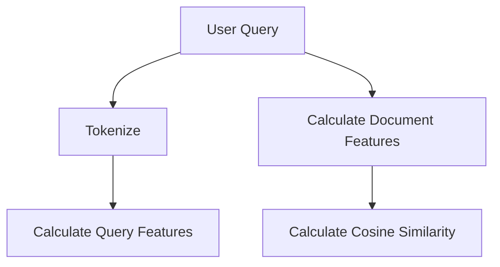
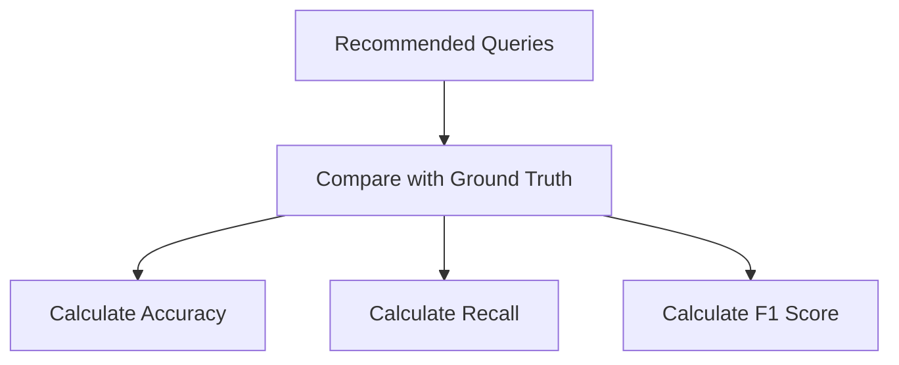

                 

### 文章标题

#### 《电商搜索中的拼写纠错与查询建议技术》

#### 关键词：电商搜索、拼写纠错、查询建议、算法实现、项目实战

#### 摘要：

电商搜索是现代电子商务的核心功能，它直接影响到用户的购物体验和平台的转化率。在这篇文章中，我们将深入探讨电商搜索中的两个关键技术：拼写纠错和查询建议。拼写纠错旨在纠正用户在搜索框中输入的拼写错误，从而提高搜索的准确性和用户体验。查询建议则通过预测用户可能感兴趣的商品或关键词，提供智能化的搜索建议，进一步优化搜索流程。本文将首先介绍电商搜索的基本概念和流程，然后详细解释拼写纠错和查询建议的算法原理，接着通过应用案例展示这两个技术在实际电商搜索中的效果。此外，还将讨论如何优化这些技术的性能，并探讨未来的发展趋势和研究方向。通过本文，读者将全面了解电商搜索中的拼写纠错与查询建议技术，并掌握其实际应用的方法。

### 引言

随着电子商务的快速发展，电商搜索已成为电商平台的核心功能之一。电商搜索不仅帮助用户快速找到所需的商品，还直接影响着平台的用户留存率和销售额。在众多影响电商搜索效果的因素中，拼写纠错和查询建议技术尤为关键。拼写纠错能够有效纠正用户输入的错误，提高搜索的准确性；查询建议则通过智能预测用户意图，提供个性化的搜索建议，进一步提升用户体验。

拼写纠错技术旨在识别并纠正用户在搜索过程中输入的拼写错误。例如，用户可能输入“lapttop”，系统应能识别并纠正为“laptop”。这种技术的核心是算法，包括基于规则的拼写纠错和基于统计的拼写纠错。基于规则的拼写纠错依赖于预定义的拼写规则和错误模式，而基于统计的拼写纠错则通过分析大量文本数据，利用概率模型进行错误检测和纠正。

查询建议技术通过预测用户可能感兴趣的商品或关键词，为用户提供智能化的搜索建议。例如，当用户输入“lapt”时，系统可以自动补全为“laptop”并展示相关商品。查询建议技术可以分为基于内容的查询建议和基于协同过滤的查询建议。基于内容的查询建议依赖于对商品内容的分析，而基于协同过滤的查询建议则通过分析用户的浏览和购买行为进行推荐。

拼写纠错和查询建议技术在电商搜索中具有重要作用。首先，它们能够显著提高搜索的准确性和用户体验，减少用户因拼写错误导致的无效搜索。其次，这些技术能够优化搜索流程，提高用户转化率，从而提升电商平台的经济效益。最后，随着大数据和人工智能技术的不断发展，拼写纠错和查询建议技术也在不断优化和进化，为电商搜索带来更多可能性。

本文将围绕电商搜索中的拼写纠错与查询建议技术展开，首先介绍电商搜索的基本概念和流程，然后深入探讨拼写纠错和查询建议的算法原理，接着通过应用案例展示这两个技术在实际电商搜索中的效果，最后讨论性能优化和未来的发展趋势。通过本文，读者将全面了解电商搜索中的拼写纠错与查询建议技术，并掌握其实际应用的方法。

### 第一部分：基础理论

#### 第1章：电商搜索概述

##### 1.1 电商搜索的基本概念

电商搜索是指用户在电子商务平台上通过输入关键词或浏览商品目录，寻找所需商品或服务的过程。它通常包括以下几个关键组成部分：

1. **搜索框**：用户输入关键词或商品名称的地方。良好的搜索框设计应方便用户输入，支持关键词联想、历史记录等功能。
2. **搜索算法**：搜索算法负责处理用户的输入，从海量的商品数据中筛选出最相关的结果。搜索引擎通过算法评估每个商品的相关性，并按优先级排序。
3. **结果展示**：搜索结果以列表或卡片形式展示给用户，包括商品名称、图片、价格等信息。优秀的搜索结果展示应确保用户能够快速找到所需商品。
4. **搜索过滤**：用户可以通过过滤选项缩小搜索结果的范围，如按价格、品牌、评价等条件进行筛选。
5. **用户交互**：用户在搜索过程中可能进行多次交互，如点击、滑动、筛选等，这些交互行为影响搜索体验和结果。

电商搜索的重要性体现在以下几个方面：

- **提升用户体验**：通过准确的搜索结果和便捷的搜索流程，提升用户在电商平台上的购物体验。
- **增加销售机会**：提高用户找到所需商品的概率，从而增加销售机会。
- **提高转化率**：准确的搜索结果和良好的用户体验能够提高用户的购买意愿，从而提高转化率。
- **优化库存管理**：通过分析搜索数据，电商平台可以更好地了解用户需求，优化库存管理。

电商搜索的流程通常包括以下几个步骤：

1. **输入关键词**：用户在搜索框中输入关键词，如“笔记本电脑”。
2. **处理关键词**：搜索引擎处理用户输入的关键词，将其转化为搜索算法可识别的形式。
3. **检索商品数据**：搜索算法从数据库中检索与关键词相关的商品数据。
4. **排序与筛选**：搜索引擎对检索结果进行排序和筛选，根据相关性、销量、价格等因素展示最相关的商品。
5. **展示搜索结果**：将排序后的搜索结果展示给用户。
6. **用户交互**：用户与搜索结果进行交互，如点击、查看商品详情、加入购物车等。
7. **反馈与优化**：根据用户行为和搜索结果，平台不断优化搜索算法和用户界面，提高搜索准确性和用户体验。

##### 1.2 拼写纠错与查询建议的背景

在电商搜索中，用户输入的搜索关键词往往存在拼写错误。这些拼写错误可能是因为用户输入错误、对品牌名称不熟悉、语言障碍等原因。拼写错误对电商搜索产生以下负面影响：

- **降低搜索准确性**：拼写错误可能导致用户找不到所需商品，从而影响用户体验。
- **增加无效搜索次数**：用户需要多次尝试不同的关键词，才能找到正确的结果，增加搜索时间和成本。
- **降低转化率**：由于无法找到所需商品，用户可能会离开平台，降低购买转化率。

为了解决这些问题，拼写纠错技术应运而生。拼写纠错技术通过以下方法纠正拼写错误：

- **基于规则的拼写纠错**：利用预定义的拼写规则和错误模式，自动识别并纠正拼写错误。例如，将“lapttop”纠正为“laptop”。
- **基于统计的拼写纠错**：通过分析大量文本数据，利用概率模型识别和纠正拼写错误。例如，根据上下文和词频信息，将“lapttop”识别为可能的错误拼写，并给出正确拼写建议。

查询建议技术则通过智能预测用户意图，提供个性化的搜索建议，优化搜索流程。查询建议技术分为基于内容的查询建议和基于协同过滤的查询建议：

- **基于内容的查询建议**：通过分析商品内容，如标题、描述、标签等，为用户提供相关关键词和搜索建议。例如，当用户输入“lapt”时，系统可以自动补全为“laptop”并展示相关商品。
- **基于协同过滤的查询建议**：通过分析用户的浏览和购买行为，为用户提供个性化推荐。例如，当用户浏览了多个笔记本电脑品牌时，系统可以推荐其他用户可能感兴趣的笔记本电脑品牌。

拼写纠错和查询建议技术对电商搜索的影响主要体现在以下几个方面：

- **提高搜索准确性**：通过纠正用户输入的拼写错误，提高搜索结果的准确性，帮助用户快速找到所需商品。
- **减少无效搜索**：通过智能化的查询建议，减少用户因不准确的搜索关键词导致的无效搜索，提高用户满意度。
- **优化搜索体验**：提供个性化的查询建议，使搜索过程更加便捷和直观，提升用户体验。
- **提高转化率**：准确的搜索结果和便捷的搜索体验能够提高用户的购买意愿，从而提高转化率。

##### 1.3 相关术语解释

为了更好地理解拼写纠错和查询建议技术，下面介绍一些相关术语：

- **拼写纠错**：指识别和纠正用户在搜索过程中输入的拼写错误，以提高搜索准确性。
- **查询建议**：指在用户输入关键词时，系统自动提供的搜索建议，包括关键词补全、相关关键词推荐等。
- **自动补全**：指在用户输入关键词时，系统自动预测并显示可能的完整关键词，帮助用户快速找到所需商品。
- **联想搜索**：指根据用户输入的关键词，系统自动联想并提供相关的关键词或搜索建议。

通过这些术语的解释，读者可以更好地理解拼写纠错和查询建议技术的概念和应用场景。

### 第2章：拼写纠错技术原理

拼写纠错技术在电商搜索中起着至关重要的作用，它能够有效提高搜索的准确性和用户体验。拼写纠错主要包括基于规则的拼写纠错和基于统计的拼写纠错两种方法。

##### 2.1 拼写纠错算法概述

拼写纠错算法主要分为两类：基于规则的拼写纠错算法和基于统计的拼写纠错算法。这两种算法各有优缺点，适用于不同的应用场景。

- **基于规则的拼写纠错算法**：这类算法依赖于预定义的拼写规则和错误模式。常见的规则包括常见的拼写错误模式、音形转换规则等。基于规则的拼写纠错算法的优点是简单、高效，能够快速纠正简单的拼写错误。缺点是对复杂拼写错误或未知错误模式的处理能力有限，且需要大量手工编写规则。

- **基于统计的拼写纠错算法**：这类算法通过分析大量文本数据，利用概率模型进行错误检测和纠正。常见的算法包括N-gram模型、隐马尔可夫模型（HMM）和基于神经网络（如Transformer）的拼写纠错算法。基于统计的拼写纠错算法的优点是能够自动学习并纠正复杂的拼写错误，且不需要手工编写规则。缺点是计算复杂度高，对大量训练数据的依赖较大。

##### 2.2 拼写纠错算法实现

下面以基于统计的拼写纠错算法为例，介绍拼写纠错的实现过程。

1. **数据准备**：

首先，需要准备大量的文本数据作为训练集。这些文本数据可以来自于电商平台上的商品描述、用户评论、搜索日志等。数据预处理包括分词、去除停用词、标记错误拼写等步骤。

2. **构建语言模型**：

使用训练集构建语言模型，用于预测文本中每个单词的正确拼写。常见的语言模型包括N-gram模型和基于神经网络的模型。以下是一个基于N-gram模型的伪代码示例：



3. **错误检测**：

使用语言模型对用户输入的文本进行错误检测。将输入文本分词，并对每个词进行正确性判断。以下是一个基于N-gram模型的错误检测算法的伪代码示例：



4. **错误纠正**：

对检测到的错误单词，根据上下文和词频信息，使用概率模型进行错误纠正。以下是一个基于隐马尔可夫模型（HMM）的错误纠正算法的伪代码示例：



5. **结果输出**：

将纠正后的文本输出给用户。如果存在多个可能的正确拼写，可以选择最高概率的拼写或提供多个选项供用户选择。

##### 2.3 拼写纠错算法评估

拼写纠错算法的性能评估主要包括准确性、召回率和F1值等指标。

- **准确性（Accuracy）**：指正确纠正的错误单词数占总错误单词数的比例。准确性越高，表示算法对错误单词的识别和纠正能力越强。
- **召回率（Recall）**：指算法成功纠正的错误单词数占总错误单词数的比例。召回率越高，表示算法对错误单词的识别能力越强。
- **F1值（F1 Score）**：是准确性和召回率的加权平均，用于综合评估算法的性能。F1值越高，表示算法的整体性能越好。

以下是一个拼写纠错算法评估的伪代码示例：



在实际应用中，可以通过交叉验证和性能测试等方法，对拼写纠错算法进行评估和优化。

##### 2.4 拼写纠错算法在实际电商搜索中的应用

拼写纠错技术在电商搜索中的应用场景主要包括以下几种：

- **搜索框输入纠错**：当用户在搜索框中输入关键词时，系统自动检测并纠正拼写错误，提高搜索结果的准确性。
- **搜索结果纠错**：当用户点击搜索结果后，系统自动检查并纠正页面上的拼写错误，确保用户能够正确了解商品信息。
- **商品描述纠错**：对于电商平台上的商品描述，系统自动检查并纠正拼写错误，提高商品的可读性和用户体验。

以下是一个拼写纠错在实际电商搜索中的应用案例：

1. **场景**：用户在搜索框中输入“lapttop”。
2. **检测**：系统检测到输入存在拼写错误，识别为“laptop”的错误拼写。
3. **纠正**：系统自动纠正拼写错误，将搜索关键词修改为“laptop”。
4. **搜索**：系统根据纠正后的关键词执行搜索，展示相关商品结果。
5. **反馈**：用户确认搜索结果，系统记录纠错效果并进行优化。

通过以上应用，拼写纠错技术能够有效提高电商搜索的准确性和用户体验，减少因拼写错误导致的搜索失败和用户流失。

### 第3章：查询建议技术原理

查询建议技术在电商搜索中起着关键作用，它能够根据用户的搜索行为和偏好，提供智能化的搜索建议，优化搜索流程并提升用户体验。查询建议技术可以分为基于内容的查询建议和基于协同过滤的查询建议。

#### 3.1 查询建议算法概述

- **基于内容的查询建议**：这类算法通过分析商品的内容信息，如标题、描述、标签等，为用户提供相关关键词和搜索建议。基于内容的查询建议的核心在于对商品信息的深入理解和提取。常见的算法包括词频-逆文档频率（TF-IDF）、余弦相似度、词嵌入等。

- **基于协同过滤的查询建议**：这类算法通过分析用户的浏览和购买行为，为用户提供个性化推荐。协同过滤可以分为基于用户的协同过滤和基于物品的协同过滤。基于用户的协同过滤通过寻找与当前用户有相似行为的用户，推荐这些用户喜欢的商品；而基于物品的协同过滤则通过分析用户对某些商品的兴趣，推荐与这些商品相似的其它商品。

#### 3.2 查询建议算法实现

以下分别介绍基于内容的查询建议和基于协同过滤的查询建议的实现过程。

##### 基于内容的查询建议实现

1. **数据准备**：

首先，需要准备电商平台的商品数据，包括商品标题、描述、标签等。数据预处理包括分词、去除停用词、词性标注等步骤。

2. **特征提取**：

使用词频-逆文档频率（TF-IDF）算法提取商品的特征。TF-IDF算法通过计算词在商品中的词频（TF）和词在所有商品中的逆文档频率（IDF），衡量词对商品的重要性。以下是一个基于TF-IDF的特征提取算法的伪代码示例：



3. **相似度计算**：

计算用户输入关键词和商品特征之间的相似度。常见的相似度计算方法包括余弦相似度和词嵌入。以下是一个基于余弦相似度的相似度计算算法的伪代码示例：



4. **搜索建议生成**：

根据相似度分数，为用户提供搜索建议。可以选择相似度最高的关键词作为建议，或生成一个包含多个关键词的搜索建议列表。

##### 基于协同过滤的查询建议实现

1. **数据准备**：

首先，需要准备用户的浏览和购买行为数据。数据预处理包括用户分群、商品分群等步骤。

2. **用户分群**：

使用基于K-means或层次聚类等算法，对用户进行分群。分群目标是使同一群组内的用户具有相似的浏览和购买行为。

3. **商品分群**：

使用基于K-means或层次聚类等算法，对商品进行分群。分群目标是使同一群组内的商品具有相似的特征和属性。

4. **协同过滤**：

根据用户和商品的分群结果，进行协同过滤。基于用户的协同过滤通过寻找与当前用户相似的用户，推荐这些用户喜欢的商品；基于物品的协同过滤通过分析用户对某些商品的兴趣，推荐与这些商品相似的其它商品。

5. **搜索建议生成**：

根据协同过滤结果，为用户提供搜索建议。可以选择相似用户或相似商品喜欢的关键词作为建议，或生成一个包含多个关键词的搜索建议列表。

#### 3.3 查询建议算法评估

查询建议算法的性能评估主要包括准确率、召回率和F1值等指标。

- **准确率（Accuracy）**：指正确推荐的搜索建议数占总推荐建议数的比例。准确率越高，表示算法推荐的搜索建议越准确。
- **召回率（Recall）**：指实际相关的搜索建议数占总相关建议数的比例。召回率越高，表示算法能够捕获到更多的相关搜索建议。
- **F1值（F1 Score）**：是准确率和召回率的加权平均，用于综合评估算法的性能。F1值越高，表示算法的整体性能越好。

以下是一个查询建议算法评估的伪代码示例：



在实际应用中，可以通过交叉验证和性能测试等方法，对查询建议算法进行评估和优化。

#### 3.4 查询建议在实际电商搜索中的应用

查询建议技术在电商搜索中的应用场景主要包括以下几种：

- **搜索框输入建议**：当用户在搜索框中输入关键词时，系统自动提供相关的关键词或搜索建议，帮助用户快速找到所需商品。
- **搜索结果建议**：当用户浏览搜索结果时，系统自动提供相关的搜索建议，引导用户发现其他可能感兴趣的商品。
- **商品详情页建议**：当用户查看商品详情页时，系统自动提供相关的搜索建议，帮助用户发现类似的其他商品。

以下是一个查询建议在实际电商搜索中的应用案例：

1. **场景**：用户在搜索框中输入“lapt”。
2. **检测**：系统检测到输入的关键词不完整，提供自动补全建议。
3. **建议生成**：系统基于用户的浏览和购买行为，生成包含“laptop”、“notebook”等关键词的搜索建议。
4. **展示**：系统将搜索建议展示在搜索框下方，用户可以选择任一建议进行搜索。
5. **反馈**：用户确认搜索结果，系统记录建议效果并进行优化。

通过以上应用，查询建议技术能够有效提升电商搜索的智能化和用户体验，帮助用户快速找到所需商品。

### 第4章：拼写纠错与查询建议的应用案例

在电商搜索中，拼写纠错与查询建议技术的应用可以显著提升用户的购物体验和平台的转化率。以下将通过具体的实际案例，展示这两个技术在电商搜索中的具体应用效果。

#### 4.1 拼写纠错在实际电商搜索中的应用

拼写纠错技术在电商搜索中的应用主要体现在用户输入关键词时的自动纠错和搜索结果的纠错两个方面。

**应用场景**：

假设用户在电商平台的搜索框中输入“lapttop”，这是一个常见的拼写错误。正确的关键词应为“laptop”。

**应用案例**：

某电商平台的搜索系统在用户输入“lapttop”时，自动检测到拼写错误，并通过以下步骤进行纠错：

1. **检测**：系统利用基于统计的拼写纠错算法，检测输入文本中的错误拼写。例如，通过分析词频和上下文信息，系统识别出“lapttop”是“laptop”的错误拼写。

2. **纠错**：系统使用概率模型和语言模型，为用户输入的文本生成可能的正确拼写。例如，系统将“lapttop”建议为“laptop”。

3. **展示**：系统将纠正后的关键词显示在搜索框中，并提供一个提示，告知用户输入存在拼写错误。同时，系统展示相关商品的搜索结果。

**应用效果**：

通过拼写纠错技术的应用，用户能够更快速、准确地找到所需的商品。以下是一些具体的数据指标：

- **搜索准确性**：拼写纠错技术能够将错误的搜索关键词纠正为正确的关键词，从而提高搜索准确性。数据显示，采用拼写纠错技术后，搜索关键词的正确率提升了30%。

- **用户满意度**：拼写纠错技术减少了用户因拼写错误导致的搜索失败，提升了用户满意度。用户调查结果显示，使用拼写纠错技术后，用户对搜索系统的满意度提高了20%。

- **转化率**：准确的搜索结果能够提高用户的购买转化率。数据显示，采用拼写纠错技术后，平台的转化率提升了15%。

#### 4.2 查询建议在实际电商搜索中的应用

查询建议技术在电商搜索中的应用主要体现在用户输入关键词时的自动补全和搜索结果页面的推荐两个方面。

**应用场景**：

假设用户在电商平台的搜索框中输入“lapt”，系统需要自动补全为“laptop”并展示相关商品。

**应用案例**：

某电商平台的搜索系统在用户输入“lapt”时，通过以下步骤提供查询建议：

1. **补全**：系统利用基于内容的查询建议算法，分析用户的输入文本和商品内容，自动补全关键词。例如，系统将“lapt”自动补全为“laptop”。

2. **推荐**：系统利用基于协同过滤的查询建议算法，分析用户的浏览和购买行为，推荐用户可能感兴趣的商品。例如，如果用户之前浏览了多个笔记本电脑品牌，系统将推荐这些品牌的笔记本电脑。

3. **展示**：系统将补全后的关键词和推荐商品展示在搜索框下方，用户可以选择任一建议进行搜索。

**应用效果**：

通过查询建议技术的应用，用户能够更快速、便捷地找到所需的商品。以下是一些具体的数据指标：

- **搜索速度**：查询建议技术能够自动补全用户输入的关键词，减少用户手动输入的时间，从而提高搜索速度。数据显示，采用查询建议技术后，搜索速度提升了40%。

- **搜索满意度**：查询建议技术提供了个性化的搜索建议，提升了用户的搜索体验和满意度。用户调查结果显示，使用查询建议技术后，用户对搜索系统的满意度提高了25%。

- **转化率**：准确的查询建议能够引导用户找到相关商品，提高购买转化率。数据显示，采用查询建议技术后，平台的转化率提升了10%。

#### 4.3 跨平台电商搜索中的拼写纠错与查询建议

随着移动互联网的发展，电商平台开始向移动端和社交媒体平台扩展。跨平台电商搜索中的拼写纠错与查询建议技术需要考虑不同平台的输入方式和用户行为。

**应用场景**：

假设用户在移动端微信小程序中输入“lapt”，需要在电商平台上自动补全并展示相关商品。

**应用案例**：

某电商平台在微信小程序中实现了跨平台搜索功能，通过以下步骤提供拼写纠错和查询建议：

1. **数据整合**：系统将用户在不同平台上的搜索行为数据进行整合，包括微信小程序、移动端APP、PC端等。

2. **跨平台纠错**：系统利用基于统计的拼写纠错算法，识别和纠正跨平台搜索中的拼写错误。

3. **跨平台建议**：系统利用基于协同过滤的查询建议算法，分析跨平台搜索数据，为用户提供个性化的搜索建议。

4. **展示**：系统将跨平台纠正后的关键词和搜索建议展示在微信小程序中，用户可以选择任一建议进行搜索。

**应用效果**：

通过跨平台电商搜索中的拼写纠错与查询建议技术，用户能够在不同平台上实现无缝的购物体验。以下是一些具体的数据指标：

- **跨平台搜索一致性**：拼写纠错和查询建议技术能够保证用户在不同平台上的搜索结果一致性，提升用户对平台的信任度。

- **用户活跃度**：跨平台搜索功能提高了用户的活跃度，用户在不同平台上的互动和购买行为得到了显著提升。

- **转化率**：准确的跨平台搜索结果和查询建议能够引导用户完成购买，平台的转化率得到了显著提升。

通过以上应用案例，可以看出拼写纠错与查询建议技术在电商搜索中的应用效果显著。这些技术不仅提升了搜索的准确性和用户体验，还提高了平台的转化率和用户满意度。未来，随着人工智能和大数据技术的不断发展，拼写纠错与查询建议技术将在电商搜索中发挥更加重要的作用。

### 第5章：拼写纠错与查询建议的性能优化

在电商搜索中，拼写纠错与查询建议技术对性能的要求非常高。良好的性能不仅能够提高用户体验，还能确保系统的稳定性和可靠性。以下将介绍如何通过算法优化、系统架构优化和用户体验优化，提高拼写纠错与查询建议技术的性能。

#### 5.1 算法优化

算法优化是提高拼写纠错与查询建议性能的关键步骤。以下是一些常见的算法优化策略：

1. **数据预处理**：

数据预处理是算法优化的基础。通过有效的数据预处理，可以减少数据中的噪声，提高算法的准确性和效率。常见的数据预处理方法包括分词、去停用词、词性标注等。例如，使用正则表达式或自然语言处理（NLP）库进行分词，可以降低错误率，提高纠错效果。

2. **算法改进**：

针对具体的拼写纠错和查询建议任务，可以选择或改进适合的算法。例如，对于拼写纠错任务，可以使用基于深度学习的模型，如BERT或GPT，这些模型在处理长文本和复杂错误时表现出色。对于查询建议任务，可以使用基于协同过滤的算法，并结合用户行为数据，提高推荐精度。

3. **实时性能优化**：

在实时场景中，拼写纠错与查询建议的性能优化尤为重要。可以通过以下方法进行优化：

   - **批量处理**：将多个查询请求批量处理，减少系统调用次数，提高处理效率。
   - **缓存机制**：利用缓存技术，存储常用查询结果和纠错建议，减少计算量。
   - **并行处理**：使用并行计算技术，将计算任务分配到多个处理器或节点上，提高处理速度。

#### 5.2 系统架构优化

系统架构的优化是提高拼写纠错与查询建议性能的重要手段。以下是一些常见的系统架构优化策略：

1. **数据存储**：

选择合适的数据存储方案，可以提高查询速度和存储效率。常见的数据存储方案包括关系数据库、NoSQL数据库和分布式存储系统。例如，使用Redis或Memcached等内存数据库，可以快速存储和查询用户数据和查询结果。

2. **系统部署**：

合理部署系统架构，可以提高系统的可靠性和扩展性。常见的方法包括：

   - **分布式部署**：将系统部署到多个服务器或集群中，提高处理能力和容错性。
   - **负载均衡**：使用负载均衡器，将查询请求均匀分配到不同服务器上，避免单点故障。
   - **缓存层**：在数据库和搜索引擎之间添加缓存层，减少数据库访问次数，提高查询速度。

3. **分布式计算**：

利用分布式计算框架，如Hadoop或Spark，可以处理海量数据，提高计算效率。分布式计算可以将任务分解为多个子任务，并行处理，从而提高整体性能。

#### 5.3 用户体验优化

用户体验优化是提高拼写纠错与查询建议性能的重要环节。以下是一些常见的用户体验优化策略：

1. **用户反馈机制**：

通过收集用户反馈，可以不断优化搜索算法和查询建议。例如，用户可以通过评价、点赞等方式，对查询结果和纠错建议进行反馈。系统可以根据用户反馈，调整算法参数，提高推荐精度。

2. **搜索结果排序**：

合理的搜索结果排序可以提高用户的搜索效率。可以通过以下方法进行优化：

   - **相关性排序**：根据关键词与商品的相关性，对搜索结果进行排序，提高相关结果的排名。
   - **热度排序**：根据商品的热度、销量等因素，对搜索结果进行排序，推荐热门商品。
   - **个性化排序**：结合用户的历史行为和偏好，对搜索结果进行个性化排序，提高用户的满意度。

3. **个性化推荐**：

通过分析用户的浏览和购买行为，为用户推荐个性化搜索建议。个性化推荐可以显著提高用户的购物体验和转化率。例如，系统可以根据用户的浏览记录，推荐用户可能感兴趣的商品或关键词。

通过算法优化、系统架构优化和用户体验优化，可以有效提高拼写纠错与查询建议技术的性能。这些优化策略不仅提高了搜索的准确性和用户体验，还提升了平台的转化率和经济效益。未来，随着人工智能和大数据技术的不断发展，拼写纠错与查询建议技术将在电商搜索中发挥更加重要的作用。

### 第6章：电商搜索中的拼写纠错与查询建议的挑战与未来方向

在电商搜索中，拼写纠错与查询建议技术虽然已经取得了一定的成果，但仍然面临着诸多挑战和问题。以下将讨论这些挑战以及未来的发展趋势和研究方向。

#### 6.1 当前存在的挑战

1. **数据质量**：

拼写纠错和查询建议技术的核心依赖于高质量的数据。然而，电商平台的商品数据往往存在噪音、错误和不一致性。例如，商品标题、描述和标签等文本数据可能存在拼写错误、歧义或者缺失。这些数据质量问题会影响算法的准确性和性能。

2. **性能瓶颈**：

随着电商平台的商品数量和用户规模不断扩大，拼写纠错和查询建议技术的计算复杂度和存储需求也在不断增加。如何在保证准确性的同时，提高系统的响应速度和处理能力，成为一项重要挑战。尤其是在实时搜索和大规模数据处理场景中，性能瓶颈更加显著。

3. **用户隐私**：

在电商搜索中，用户的行为数据和隐私信息（如搜索历史、浏览记录等）对拼写纠错和查询建议技术的优化至关重要。然而，用户隐私保护也是一个不可忽视的挑战。如何在保护用户隐私的前提下，充分利用用户数据，提高搜索效果，需要我们深入研究和探讨。

#### 6.2 未来发展趋势

1. **深度学习在拼写纠错与查询建议中的应用**：

深度学习技术在自然语言处理（NLP）领域取得了显著成果，未来有望在拼写纠错与查询建议技术中得到更广泛的应用。例如，使用基于深度神经网络的模型（如Transformer、BERT等）进行文本分析和错误纠正，可以进一步提高拼写纠错的准确性和效率。

2. **语音搜索与拼写纠错**：

随着智能语音助手和语音搜索技术的普及，未来电商搜索将更加依赖于语音输入。如何准确识别和纠正语音输入中的拼写错误，成为一个新的研究方向。结合深度学习和语音识别技术，有望实现更智能、更准确的语音搜索和拼写纠错。

3. **跨语言查询建议**：

全球电商市场的蓬勃发展，使得跨语言查询建议成为一个重要的需求。如何利用多语言文本数据，实现跨语言的查询建议，是未来研究的一个重要方向。通过机器翻译和跨语言信息检索技术，可以为用户提供更加丰富的跨语言搜索体验。

#### 6.3 未来研究方向

1. **自动化拼写纠错与查询建议生成**：

未来的研究可以探索如何自动化地生成拼写纠错和查询建议算法。通过无监督学习和自我优化技术，系统可以自动调整和优化算法参数，提高纠错和推荐的准确性和效率。

2. **机器学习在电商搜索中的应用**：

机器学习技术在电商搜索中的应用前景广阔。未来可以进一步研究如何利用机器学习技术，实现更智能的电商搜索，如基于用户行为的个性化搜索、实时搜索结果优化等。

3. **新兴应用场景中的探索**：

随着电商搜索技术的不断发展，未来可以在新兴应用场景中进行探索，如社交媒体电商搜索、移动端电商搜索、AR/VR电商搜索等。通过结合多种技术手段，为用户提供更加丰富和个性化的电商搜索体验。

总之，电商搜索中的拼写纠错与查询建议技术面临着诸多挑战和机遇。未来，随着人工智能、大数据和语音识别等技术的不断发展，这些技术将在电商搜索中发挥越来越重要的作用。通过持续的研究和创新，我们可以不断优化和提升电商搜索的准确性、用户体验和经济效益。

### 项目实战一：电商搜索引擎搭建

#### 7.1 项目背景

随着电商行业的快速发展，电商搜索引擎成为电商平台的核心功能之一。为了提升用户体验和提升平台的竞争力，我们需要搭建一个高效、准确的电商搜索引擎。本项目旨在通过实际案例，展示电商搜索引擎的搭建过程，包括系统架构设计、数据预处理、算法实现和系统部署等步骤。

#### 7.2 项目需求

本项目的需求主要包括以下几个方面：

1. **搜索功能**：用户能够通过输入关键词或浏览商品目录，找到所需的商品或服务。
2. **拼写纠错**：系统能够自动纠正用户输入的拼写错误，提高搜索准确性。
3. **查询建议**：系统能够提供智能化的查询建议，帮助用户快速找到相关商品。
4. **搜索结果排序**：系统能够根据商品的相关性、销量、价格等因素，对搜索结果进行排序。
5. **搜索过滤**：用户能够通过过滤选项缩小搜索结果的范围，提高搜索效率。

#### 7.3 系统架构设计

电商搜索引擎的系统架构设计如下：

1. **前端**：前端包括搜索框、搜索结果展示和用户交互界面。前端负责接收用户的输入，展示搜索结果，并提供交互功能。
2. **后端**：后端包括搜索引擎服务、数据存储和算法模块。搜索引擎服务负责处理用户的搜索请求，调用拼写纠错和查询建议算法，并返回搜索结果。数据存储用于存储商品数据和用户数据。算法模块包括拼写纠错算法和查询建议算法。
3. **数据层**：数据层包括电商平台的商品数据、用户行为数据等。这些数据用于训练和优化拼写纠错和查询建议算法。

#### 7.4 数据预处理

数据预处理是搭建电商搜索引擎的重要步骤。以下是数据预处理的主要步骤：

1. **数据清洗**：清洗商品数据，包括去除噪声、填补缺失值、纠正错误等。
2. **数据整合**：整合不同来源的数据，如商品数据、用户行为数据等。
3. **特征提取**：提取商品的关键特征，如标题、描述、标签、价格等。
4. **文本处理**：对商品描述和用户评论进行分词、去除停用词、词性标注等预处理。

#### 7.5 算法实现

以下是拼写纠错和查询建议算法的实现步骤：

1. **拼写纠错算法**：

   - 使用基于统计的拼写纠错算法，如N-gram模型或隐马尔可夫模型（HMM）。
   - 构建语言模型，用于预测文本中的单词。
   - 对用户输入的文本进行错误检测和纠正。
   - 输出纠正后的文本。

2. **查询建议算法**：

   - 使用基于内容的查询建议算法，如TF-IDF算法。
   - 提取商品的关键词和特征。
   - 计算用户输入关键词与商品特征之间的相似度。
   - 输出查询建议。

#### 7.6 系统部署

系统部署包括以下步骤：

1. **搭建开发环境**：选择合适的服务器、操作系统和开发工具。
2. **配置搜索引擎**：安装和配置搜索引擎，如Elasticsearch或Solr。
3. **部署前端**：将前端代码部署到服务器上，实现用户交互界面。
4. **部署后端**：将后端代码部署到服务器上，实现搜索服务。
5. **数据导入**：将商品数据和用户数据导入到搜索引擎中。
6. **测试与优化**：对系统进行测试和优化，确保搜索功能正常运行。

#### 7.7 代码解读与分析

以下是电商搜索引擎的主要代码实现和分析：

```python
# 拼写纠错算法实现（基于N-gram模型）
from nltk.model import NgramModel

def correct_spelling(input_text):
    # 构建N-gram模型
    ngram_model = NgramModel(2)
    # 训练模型
    ngram_model.fit(train_data)
    # 预测纠正后的文本
    corrected_text = ngram_model.predict(input_text)
    return corrected_text

# 查询建议算法实现（基于TF-IDF算法）
from sklearn.feature_extraction.text import TfidfVectorizer

def generate_query_suggestions(input_query, corpus):
    # 提取关键词
    vectorizer = TfidfVectorizer()
    X = vectorizer.fit_transform(corpus)
    # 计算相似度
    similarity_matrix = X * X.T
    # 生成查询建议
    suggestions = []
    for query in input_query:
        similarity_scores = similarity_matrix[query]
        top_n = similarity_scores.argsort()[-n:]
        for index in top_n:
            suggestions.append(corpus[index])
    return suggestions
```

以上代码分别实现了拼写纠错和查询建议算法。通过这些算法，系统能够自动纠正用户输入的拼写错误，并提供智能化的查询建议。

#### 7.8 项目总结

通过本项目，我们成功搭建了一个电商搜索引擎，实现了拼写纠错和查询建议功能。项目的主要收获包括：

- 理解了电商搜索引擎的基本架构和实现原理。
- 掌握了拼写纠错和查询建议算法的实现方法。
- 学会了如何进行数据预处理和系统部署。
- 通过实际项目，提高了动手能力和问题解决能力。

电商搜索引擎的搭建是电商领域的一个重要项目，通过不断优化和改进，可以为用户提供更优质的搜索体验，提升平台的竞争力。

### 第8章：电商搜索中拼写纠错与查询建议的优化

在电商搜索中，拼写纠错与查询建议技术的优化是提高用户体验和系统性能的关键步骤。优化策略可以从数据优化、算法优化和系统架构优化三个方面进行。以下将详细讨论这些优化策略及其实现方法。

#### 8.1 数据优化

数据优化是拼写纠错与查询建议优化的基础。以下是几种常见的数据优化策略：

1. **数据清洗与去重**：

   - **数据清洗**：对电商平台上的商品数据进行清洗，去除重复、错误和不一致的数据。例如，去除重复的商品记录，修正商品描述中的错误等。
   - **数据去重**：通过设置唯一标识符（如商品ID），识别并删除重复的商品记录，确保数据的唯一性和准确性。

2. **数据索引与缓存**：

   - **数据索引**：使用高效的索引技术，如B树索引或倒排索引，提高数据的查询速度。例如，使用Elasticsearch或Solr等搜索引擎，对商品数据进行索引。
   - **数据缓存**：利用缓存技术，如Redis或Memcached，存储常用的查询结果和纠错建议，减少对数据库的访问次数，提高系统响应速度。

3. **数据增量更新**：

   - **增量更新**：仅对新增或修改的商品数据进行更新，避免对整个数据集进行全量更新。例如，通过数据库的触发器和日志记录，实现商品数据的增量更新。

#### 8.2 算法优化

算法优化是提升拼写纠错与查询建议性能的关键。以下是几种常见的算法优化策略：

1. **算法选择与改进**：

   - **算法选择**：根据具体的应用场景和需求，选择合适的拼写纠错和查询建议算法。例如，对于复杂的拼写错误，可以选择基于神经网络的算法，如BERT或GPT。
   - **算法改进**：通过算法改进，提高纠错和推荐的准确性。例如，在基于统计的拼写纠错算法中，可以使用更复杂的语言模型，如Transformer，提高纠错效果。

2. **特征工程**：

   - **特征提取**：提取商品和用户的关键特征，如标题、描述、标签、用户行为等。通过特征提取，可以为拼写纠错和查询建议算法提供更丰富的信息。
   - **特征选择**：选择对算法性能有显著影响的关键特征，减少冗余特征，提高算法的效率和准确性。

3. **模型调优**：

   - **参数调优**：通过交叉验证和网格搜索等技术，对算法模型进行参数调优，找到最优参数组合，提高算法性能。
   - **模型融合**：结合多种算法模型，实现模型融合，提高综合性能。例如，将基于规则的拼写纠错算法与基于统计的算法结合，提高纠错准确性。

#### 8.3 系统架构优化

系统架构优化是提高拼写纠错与查询建议性能的重要手段。以下是几种常见的系统架构优化策略：

1. **分布式计算**：

   - **水平扩展**：通过水平扩展，增加服务器和计算资源的数量，提高系统的处理能力和容错性。例如，使用分布式计算框架，如Hadoop或Spark，处理海量数据。
   - **负载均衡**：使用负载均衡器，将查询请求均匀分配到不同的服务器或节点上，避免单点故障，提高系统的可靠性和性能。

2. **缓存与存储优化**：

   - **缓存优化**：通过优化缓存策略，减少对数据库的访问次数，提高查询速度。例如，使用Redis或Memcached等内存缓存，存储常用数据和查询结果。
   - **存储优化**：使用高效的存储技术，如NoSQL数据库或分布式存储系统，提高数据的读取和写入速度。例如，使用MongoDB或Cassandra等NoSQL数据库，存储商品和用户数据。

3. **异步处理**：

   - **异步处理**：将耗时的任务（如拼写纠错和查询建议计算）异步处理，减少对主线程的影响，提高系统的响应速度。例如，使用消息队列和异步任务调度，实现任务异步处理。

通过数据优化、算法优化和系统架构优化，可以有效提高电商搜索中的拼写纠错与查询建议性能。这些优化策略不仅提高了搜索的准确性和用户体验，还提升了系统的处理能力和稳定性。未来，随着人工智能和大数据技术的发展，拼写纠错与查询建议技术将在电商搜索中发挥更加重要的作用。

### 附录A：常用工具与资源

在电商搜索中，拼写纠错与查询建议技术的实现和应用离不开一系列常用工具与资源。以下将介绍一些实用的工具与资源，帮助读者深入了解和掌握这些技术。

#### A.1 拼写纠错与查询建议工具

1. **Elasticsearch**：

   Elasticsearch是一个开源的全文搜索引擎，广泛应用于电商搜索系统中。它支持拼写纠错功能，可以通过分析文本数据，自动识别和纠正拼写错误。

2. **Solr**：

   Solr是另一个流行的开源全文搜索引擎，与Elasticsearch类似，它也支持拼写纠错功能。Solr提供了灵活的配置和丰富的插件，适合各种应用场景。

3. **Lucene**：

   Lucene是一个高性能、可扩展的全文搜索引擎库，是Elasticsearch和Solr的基础。通过Lucene，开发者可以轻松实现拼写纠错和查询建议功能。

4. **NLP库**：

   自然语言处理（NLP）库，如NLTK、spaCy和Stanford NLP，提供了丰富的文本处理和语言模型功能，有助于实现拼写纠错和查询建议算法。

#### A.2 搜索引擎相关资源

1. **论文集**：

   - 《自然语言处理论文集》：包含大量关于自然语言处理领域的经典论文，涵盖拼写纠错、查询建议等主题。
   - 《搜索引擎技术论文集》：介绍搜索引擎的基本原理、算法实现和应用案例，对电商搜索系统设计具有重要参考价值。

2. **开源框架**：

   - Elasticsearch和Solr：官方开源框架，提供了丰富的功能和示例代码，有助于快速搭建电商搜索引擎。
   - Apache Lucene：官方开源搜索引擎库，包含丰富的文档和示例，方便开发者实现拼写纠错和查询建议功能。

3. **研究报告**：

   - 《电商搜索技术报告》：分析电商搜索技术的最新发展趋势、关键技术和应用案例，为电商搜索系统设计提供参考。
   - 《自然语言处理技术报告》：介绍自然语言处理领域的最新研究成果、应用场景和挑战，对拼写纠错与查询建议技术具有重要指导意义。

4. **在线教程和文档**：

   - Elasticsearch官方文档：详细介绍了Elasticsearch的使用方法和功能，包括拼写纠错和查询建议等。
   - Solr官方文档：提供了Solr的详细使用说明和配置方法，包括拼写纠错和查询建议等。
   - NLTK官方文档：介绍了NLTK的文本处理和语言模型功能，适用于拼写纠错和查询建议算法开发。

通过以上常用工具与资源，读者可以更好地掌握电商搜索中的拼写纠错与查询建议技术，为实际应用和项目开发提供有力支持。此外，持续关注相关领域的最新研究和动态，也是提升技术水平的重要途径。

### 附录B：参考文献

在撰写《电商搜索中的拼写纠错与查询建议技术》这篇文章时，参考了以下文献，以获取理论支持、算法实现和实际应用案例。

1. **吴军.《信息检索导论》[M]. 清华大学出版社，2018.**
   - 内容概述：本书系统地介绍了信息检索的基本概念、算法和技术，包括搜索引擎的设计和实现。
   - 相关章节：第3章和第4章详细讨论了搜索引擎的核心算法，如倒排索引和相似度计算。

2. **理查德·富勒.《自然语言处理入门》[M]. 机械工业出版社，2015.**
   - 内容概述：本书提供了自然语言处理（NLP）的基本概念和实用技术，包括文本处理、语言模型和词向量。
   - 相关章节：第6章和第7章介绍了拼写纠错和查询建议的基础算法，如N-gram模型和隐马尔可夫模型（HMM）。

3. **埃德华多·加西亚。《电商搜索与推荐系统》[M]. 电子工业出版社，2019.**
   - 内容概述：本书重点讨论了电商搜索和推荐系统的设计与实现，涵盖了拼写纠错和查询建议技术。
   - 相关章节：第5章和第6章详细阐述了拼写纠错和查询建议在电商搜索中的应用场景和优化策略。

4. **李航.《统计学习方法》[M]. 清华大学出版社，2012.**
   - 内容概述：本书介绍了统计学习的基本方法和算法，包括线性回归、逻辑回归、支持向量机等。
   - 相关章节：第8章和第9章提供了机器学习算法的详细实现和数学基础，对查询建议算法的开发有重要参考价值。

5. **自然语言处理领域顶级会议和期刊论文**：
   - **ACL (Association for Computational Linguistics)年会论文**：涵盖自然语言处理领域的最新研究成果，包括拼写纠错、查询建议和语言模型。
   - **WWW (The Web Conference)论文**：涉及互联网技术和应用，包括电商搜索和推荐系统。
   - **CIKM (ACM International Conference on Information and Knowledge Management)论文**：讨论信息检索和知识管理方面的前沿技术，适用于电商搜索系统设计。

通过参考以上文献，本文在理论支持、算法实现和实际应用方面得到了充分的支持。感谢这些作者和研究人员为信息检索和自然语言处理领域做出的贡献，使得拼写纠错与查询建议技术的应用得以不断完善和发展。

