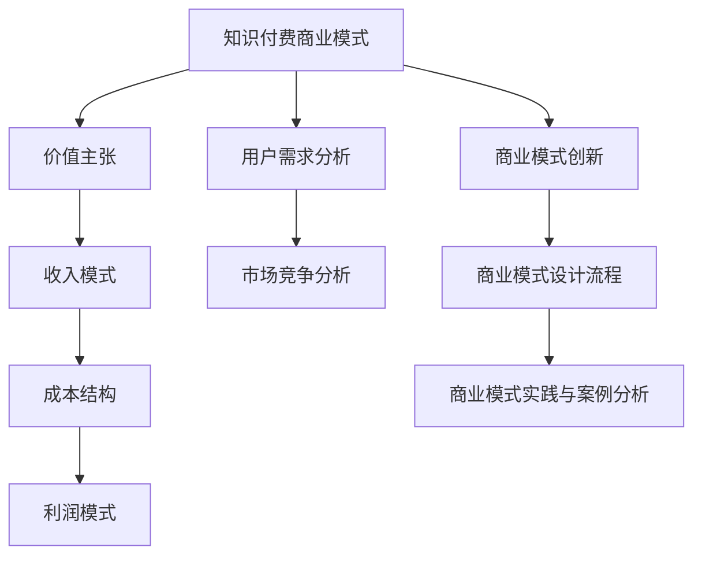

                 

# 《知识付费创业的商业模式创新》

## 关键词：
知识付费、商业模式、创新、用户需求、竞争分析、价值主张、收入模式、成本结构、利润模式、案例分析、未来趋势

## 摘要：
本文从知识付费行业的背景出发，深入探讨了商业模式创新的关键要素。通过分析用户需求、市场竞争以及商业模式的核心组成部分，本文提出了价值主张、收入模式、成本结构、利润模式等创新策略，并借助具体案例分析，展示了知识付费创业中商业模式创新的成功实践。最后，本文对未来知识付费行业的发展趋势及商业模式创新方向进行了前瞻性分析，为创业者提供了有益的参考。

### 第一部分：知识付费行业概述

#### 1.1 知识付费的定义与背景

##### 1.1.1 知识付费的兴起

知识付费是指用户为获取特定知识内容或服务而支付的费用。随着互联网技术的飞速发展和信息传播方式的多样化，知识付费逐渐成为一种主流的商业模式。近年来，随着人们对自我提升和知识积累的需求不断增加，知识付费行业呈现出爆发式增长。

知识付费的兴起得益于以下几个因素：

1. **互联网普及**：互联网的普及使得知识传播的渠道更加广泛，人们可以更加便捷地获取各种知识资源。
2. **用户需求**：随着社会竞争的加剧，用户对知识的需求日益增长，他们希望通过付费获取高质量、专业化的知识内容。
3. **内容多样化**：知识付费平台提供了丰富多样的知识内容，涵盖了教育、职场、健康、娱乐等多个领域。
4. **付费习惯**：随着付费习惯的养成，越来越多的用户愿意为知识内容付费。

##### 1.1.2 知识付费与传统知识传播方式的差异

知识付费与传统知识传播方式在以下几个方面存在显著差异：

1. **付费方式**：知识付费强调用户为获取知识内容而付费，而传统知识传播方式则通常依赖于广告或其他形式的补贴。
2. **内容形式**：知识付费内容通常以视频、音频、图文等形式呈现，更加生动有趣，而传统知识传播方式则更多依赖于文字和口头传授。
3. **服务体验**：知识付费平台提供了更加个性化的服务，如学习计划、课程推荐、专业咨询等，而传统知识传播方式则相对单一。
4. **传播效率**：知识付费平台能够快速传播知识，实现知识的高效传播和共享，而传统知识传播方式则受到时间和空间的限制。

##### 1.1.3 知识付费的行业规模与趋势

知识付费行业近年来保持了高速增长的态势。根据市场研究机构的报告，全球知识付费市场规模不断扩大，预计未来几年将继续保持快速增长。

1. **市场规模**：知识付费市场的规模逐年扩大，呈现出爆发式增长。以国内市场为例，2019年市场规模已达到500亿元人民币，预计到2025年将达到1500亿元人民币。
2. **用户增长**：知识付费用户数量不断增加，用户结构日趋多元化。从年龄层次看，80后、90后是主要用户群体；从职业层次看，职场人士、学生、自由职业者等都是潜在用户。
3. **内容多元化**：知识付费内容涵盖了多个领域，包括教育、职场、健康、娱乐等，其中教育类知识付费占据主导地位。
4. **平台竞争**：随着知识付费市场的火爆，越来越多的企业进入该领域，平台竞争日益激烈。

#### 1.2 知识付费的用户需求分析

##### 1.2.1 用户对知识的需求层次

用户对知识的需求可以分为以下几个层次：

1. **基础知识需求**：用户希望通过学习获取基础知识和技能，如语言、数学、历史等。
2. **专业知识需求**：用户希望获取特定领域的专业知识和技能，如职场技能、编程技能、艺术技能等。
3. **综合素质提升**：用户希望通过学习提升自身综合素质，如领导力、沟通能力、团队协作能力等。
4. **兴趣爱好需求**：用户为了满足个人兴趣爱好而学习，如音乐、绘画、摄影等。

##### 1.2.2 用户购买行为的分析

用户购买行为是知识付费商业模式的重要组成部分。以下是对用户购买行为的一些分析：

1. **购买动机**：用户购买知识内容的主要动机包括提升自我、满足兴趣、解决实际问题等。
2. **购买渠道**：用户主要通过在线平台购买知识内容，如微信公众号、知识付费平台、APP等。
3. **购买频次**：用户购买知识内容的频次因人而异，部分用户每周购买一次，而部分用户每月购买一次。
4. **购买金额**：用户购买知识内容的金额也因人而异，从几元到几千元不等。

##### 1.2.3 用户评价与反馈的重要性

用户评价与反馈在知识付费行业中具有重要作用。以下是对用户评价与反馈的一些分析：

1. **评价作用**：用户评价可以帮助其他潜在用户了解知识内容的质量和实用性，从而影响其购买决策。
2. **反馈作用**：用户反馈可以帮助知识付费平台了解用户的需求和痛点，从而优化产品和服务。
3. **品牌建设**：良好的用户评价和反馈有助于提升知识付费平台品牌形象，增强用户信任。
4. **运营策略**：知识付费平台可以根据用户评价和反馈调整产品策略，提高用户满意度。

#### 1.3 知识付费的市场竞争分析

##### 1.3.1 主要竞争对手分析

知识付费行业的竞争格局较为复杂，主要竞争对手包括：

1. **头部平台**：如得到、喜马拉扎、知乎等，这些平台在用户规模、内容质量、品牌知名度等方面具有优势。
2. **垂直领域平台**：如编程猫咪、财务共享、MBA大师等，这些平台专注于特定领域，提供专业化的知识内容。
3. **跨界企业**：如腾讯、阿里巴巴等，这些企业通过投资或并购进入知识付费领域，利用自身资源和优势抢占市场份额。

##### 1.3.2 行业竞争格局与市场前景

知识付费行业的竞争格局呈现出以下特点：

1. **头部平台垄断**：头部平台在市场份额、用户规模、品牌知名度等方面具有明显优势，新进入者难以与之抗衡。
2. **细分领域竞争**：在垂直领域，专业化的知识付费平台具有较强的竞争力，但市场份额相对较小。
3. **跨界竞争**：跨界企业的进入使得知识付费行业竞争加剧，但同时也带来了新的发展机遇。

市场前景方面，知识付费行业将继续保持快速增长，但增速可能有所放缓。以下是对市场前景的一些分析：

1. **市场规模扩大**：随着用户对知识需求的增加，知识付费市场规模将继续扩大。
2. **用户结构变化**：随着年轻用户的崛起，知识付费用户结构将发生变化，更多年轻用户将成为潜在用户。
3. **内容多样化**：知识付费内容将更加多样化，涵盖更多领域和细分市场。
4. **商业模式创新**：知识付费平台将不断创新商业模式，提高用户满意度和盈利能力。

##### 1.3.3 企业应对竞争的策略

面对激烈的市场竞争，知识付费企业可以采取以下策略：

1. **差异化竞争**：通过提供独特的内容、服务或用户体验，打造差异化竞争优势。
2. **品牌建设**：加强品牌推广和品牌形象塑造，提高品牌知名度和美誉度。
3. **用户运营**：通过精细化运营，提高用户满意度和忠诚度，降低用户流失率。
4. **技术创新**：利用大数据、人工智能等技术，提升内容推荐、用户画像等方面的能力。
5. **跨界合作**：与其他行业企业开展合作，实现资源共享和优势互补。

### 第二部分：商业模式创新

#### 2.1 商业模式概述

##### 2.1.1 商业模式的概念与构成

商业模式是指企业通过创造、传递和捕获价值，实现可持续盈利的过程。它由以下几个核心要素构成：

1. **价值主张**：企业向客户提供的产品或服务，以及这些产品或服务如何满足客户需求。
2. **收入模式**：企业通过什么方式获得收入，如一次性收费、订阅模式、广告收入等。
3. **成本结构**：企业运营所需的成本，包括固定成本和可变成本。
4. **利润模式**：企业如何从收入中获取利润，如成本加成、价值定价、市场定价等。

##### 2.1.2 商业模式在知识付费行业的重要性

商业模式在知识付费行业中具有重要作用。以下是对商业模式在知识付费行业重要性的一些分析：

1. **竞争策略**：商业模式决定了企业的竞争策略，不同的商业模式可以带来不同的竞争优势。
2. **用户价值**：商业模式决定了企业如何向用户传递价值，影响用户的满意度和忠诚度。
3. **盈利能力**：商业模式决定了企业的盈利能力，直接关系到企业的长期可持续发展。
4. **创新动力**：商业模式创新是推动知识付费行业发展的重要动力，有助于企业不断适应市场变化。

##### 2.1.3 商业模式创新的动力

知识付费行业的商业模式创新受到以下几个因素的驱动：

1. **用户需求变化**：随着用户需求的不断变化，知识付费平台需要不断调整商业模式，满足用户的新需求。
2. **技术进步**：大数据、人工智能、区块链等技术的进步为知识付费行业提供了新的商业模式创新机会。
3. **市场竞争**：激烈的市场竞争迫使知识付费平台不断创新商业模式，提高盈利能力和市场竞争力。
4. **政策法规**：政策法规的变化也可能影响知识付费行业的商业模式，如版权保护、税收政策等。

#### 2.2 价值主张的创新

##### 2.2.1 价值主张的定义与构成

价值主张是指企业向客户传递的核心价值，是商业模式的核心组成部分。价值主张通常包括以下几个方面：

1. **产品或服务**：企业提供的具体产品或服务，如在线课程、知识问答、专业咨询等。
2. **客户需求满足**：企业如何满足客户的需求，如提升技能、解决痛点、满足兴趣等。
3. **独特卖点**：企业的产品或服务与其他竞争对手相比的独特优势，如权威专家、高质量内容、个性化推荐等。
4. **用户体验**：企业如何为客户提供优质的用户体验，如方便快捷的购买流程、互动式学习、专业客服等。

##### 2.2.2 价值主张的创新策略

为了在激烈的市场竞争中脱颖而出，知识付费企业可以采取以下价值主张创新策略：

1. **差异化竞争**：通过提供独特的知识内容或服务，满足用户特定的需求，形成差异化竞争优势。
2. **精细化运营**：通过大数据和人工智能技术，深入了解用户需求，提供个性化的知识内容和服务。
3. **跨界融合**：与其他行业进行跨界合作，将知识付费与用户其他需求相结合，提供一站式解决方案。
4. **体验优化**：不断提升用户体验，如优化购买流程、提供优质的售后服务等，增强用户满意度和忠诚度。

##### 2.2.3 成功案例分享

以下是一些价值主张创新的成功案例：

1. **得到**：得到通过邀请知名专家和权威人士开设专栏，提供高质量的知识内容，满足用户对专业知识的追求。同时，得到还通过推出“每日一讲”等栏目，提供碎片化学习机会，满足用户碎片化学习需求。
2. **喜马拉扎**：喜马拉扎通过构建一个庞大的知识库，提供海量的学习资源，满足用户对各类知识的渴望。同时，喜马拉扎还通过推出“知+”等会员服务，提供更多增值服务，满足用户的更高层次需求。
3. **知乎**：知乎通过构建一个问答社区，让用户可以在平台上提出问题、分享经验，获取专业知识和建议。知乎还通过推出“盐选会员”等服务，提供更多高质量内容，满足用户的深度学习需求。

#### 2.3 收入模式创新

##### 2.3.1 收入模式的概念与类型

收入模式是指企业通过何种方式获得收入，常见的收入模式包括以下几种：

1. **一次性收费**：用户为获取特定知识内容或服务，一次性支付费用。如在线课程、电子书等。
2. **订阅模式**：用户为持续获取知识内容或服务，定期支付费用。如会员服务、期刊订阅等。
3. **广告收入**：企业通过在知识内容中植入广告，获得广告收入。如知识付费平台上的广告位、推广链接等。
4. **佣金收入**：企业通过为第三方提供服务或产品，获得佣金收入。如知识付费平台上的课程推广、产品销售等。
5. **增值服务**：企业通过提供额外增值服务，获得额外收入。如会员服务、专业咨询、定制化服务等。

##### 2.3.2 收入模式创新的策略

为了提高知识付费平台的收入能力，企业可以采取以下收入模式创新策略：

1. **多元化收入模式**：通过引入多种收入模式，提高收入来源的多样性和稳定性。
2. **订阅模式优化**：通过推出不同层次的订阅服务，满足用户不同的需求，提高订阅用户的转化率和留存率。
3. **广告收入优化**：通过优化广告投放策略，提高广告的曝光率和点击率，增加广告收入。
4. **增值服务拓展**：通过推出更多增值服务，满足用户的更高层次需求，提高用户付费意愿。
5. **跨界合作**：与其他行业企业进行跨界合作，实现资源共享和优势互补，拓展收入来源。

##### 2.3.3 成功案例分享

以下是一些收入模式创新的成功案例：

1. **得到**：得到通过推出“得到学院”等服务，引入会员订阅模式，提高用户的付费意愿和留存率。同时，得到还通过在内容中植入广告，获得广告收入。
2. **喜马拉扎**：喜马拉扎通过推出“知识星球”等服务，引入会员订阅模式，提高用户的付费意愿和留存率。同时，喜马拉扎还通过推出“知+”等增值服务，增加收入来源。
3. **知乎**：知乎通过推出“盐选会员”等服务，引入会员订阅模式，提高用户的付费意愿和留存率。同时，知乎还通过在内容中植入广告，获得广告收入。

#### 2.4 成本结构优化

##### 2.4.1 成本结构的概念与类型

成本结构是指企业在运营过程中产生的各项成本，包括固定成本和可变成本。常见的成本类型包括：

1. **固定成本**：企业在运营过程中必须承担的成本，如租金、设备购置、员工工资等。固定成本不随业务量的变化而变化。
2. **可变成本**：企业在运营过程中随着业务量的变化而变化成本，如原材料采购、物流成本、推广费用等。可变成本与业务量呈正比关系。

##### 2.4.2 成本结构优化的策略

为了降低成本，提高盈利能力，企业可以采取以下成本结构优化策略：

1. **成本控制**：通过优化供应链、降低原材料采购成本、减少浪费等手段，降低可变成本。
2. **技术创新**：通过引入新技术、优化生产流程，降低固定成本，提高生产效率。
3. **外包合作**：将部分业务外包给专业公司，降低人力成本和运营成本。
4. **共享资源**：与其他企业共享资源，如办公场所、设备等，降低固定成本。
5. **成本分摊**：与其他企业或合作伙伴进行成本分摊，降低运营成本。

##### 2.4.3 成本优化的成功案例

以下是一些成本优化的成功案例：

1. **腾讯课堂**：腾讯课堂通过引入人工智能技术，优化课程内容推荐和用户画像构建，降低用户获取成本和运营成本。同时，腾讯课堂还通过共享腾讯旗下的其他教育资源，降低固定成本。
2. **知识星球**：知识星球通过引入云服务、远程办公等技术手段，降低服务器租赁成本和人力成本。同时，知识星球还通过与其他企业合作，共享资源，降低运营成本。
3. **知乎**：知乎通过优化广告投放策略，提高广告曝光率和点击率，降低广告成本。同时，知乎还通过引入人工智能技术，优化内容推荐和用户运营，降低用户获取成本。

#### 2.5 利润模式的创新

##### 2.5.1 利润模式的概念与构成

利润模式是指企业通过何种方式从收入中获取利润，常见的利润模式包括：

1. **成本加成**：通过在成本基础上加成一定比例的利润，获得收入。如成本加成定价法。
2. **价值定价**：根据产品或服务的价值，制定合理的价格，获得收入。如优质课程、专业咨询等。
3. **市场定价**：根据市场需求和竞争状况，制定合理的价格，获得收入。如低价促销、高端定制等。
4. **细分市场定价**：根据不同细分市场的需求和支付能力，制定不同的价格策略，获得收入。如会员服务、增值服务等。

##### 2.5.2 利润模式创新的策略

为了提高利润能力，企业可以采取以下利润模式创新策略：

1. **差异化定价**：通过提供差异化的产品或服务，制定不同的价格策略，提高利润。
2. **细分市场定价**：通过深入了解用户需求，针对不同细分市场制定不同的价格策略，提高利润。
3. **价值提升**：通过提高产品或服务的价值，制定合理的价格策略，提高利润。
4. **成本控制**：通过优化成本结构，降低成本，提高利润。
5. **跨界合作**：与其他企业进行跨界合作，实现资源共享和优势互补，提高利润。

##### 2.5.3 利润创新的案例研究

以下是一些利润创新的成功案例：

1. **得到**：得到通过推出“得到学院”等服务，采用差异化定价策略，提高会员付费意愿和留存率。同时，得到还通过降低内容制作成本，优化收入结构，提高利润。
2. **知识星球**：知识星球通过推出“知识星球+”等服务，采用细分市场定价策略，满足不同层次用户的需求。同时，知识星球还通过优化内容质量，提高用户满意度和付费意愿，提高利润。
3. **知乎**：知乎通过引入人工智能技术，优化内容推荐和用户运营，提高用户满意度和付费意愿。同时，知乎还通过优化广告投放策略，提高广告收入，提高利润。

### 第三部分：商业模式实践与案例分析

#### 3.1 商业模式设计流程

##### 3.1.1 商业模式设计的步骤

商业模式设计是一个系统性的过程，通常包括以下步骤：

1. **需求分析**：深入了解用户需求，确定商业模式的基础。
2. **价值主张定义**：明确企业向用户传递的核心价值。
3. **收入模式设计**：确定企业的收入来源和方式。
4. **成本结构分析**：分析企业的成本构成，制定成本控制策略。
5. **利润模式设计**：确定企业的利润获取方式和策略。
6. **商业模式验证**：通过市场调研、用户反馈等方式，验证商业模式的可行性和可行性。
7. **商业模式优化**：根据反馈和市场需求，不断优化商业模式。

##### 3.1.2 商业模式设计工具与方法

在商业模式设计中，常用的工具和方法包括：

1. **商业画布**：商业画布是一种可视化工具，用于描述企业的商业模式。它包括价值主张、关键资源、关键活动、关键合作伙伴、客户关系、收入来源、成本结构等要素。
2. **SWOT分析**：SWOT分析是一种用于评估企业优势和劣势、机会和威胁的方法。通过SWOT分析，企业可以更好地了解自身情况，为商业模式设计提供指导。
3. **价值网分析**：价值网分析是一种用于分析企业与其他利益相关者之间关系的方法。通过价值网分析，企业可以更好地了解自身在生态系统中的角色和定位。
4. **市场调研**：市场调研是一种收集和分析用户需求、市场趋势、竞争状况等信息的方法。通过市场调研，企业可以更好地了解市场需求，为商业模式设计提供依据。

##### 3.1.3 商业模式设计案例分析

以下是一个知识付费平台的商业模式设计案例分析：

1. **需求分析**：通过市场调研和用户访谈，发现用户对在线教育和专业咨询有较高的需求。用户希望在方便的时间、地点学习，同时希望获得个性化、专业化的知识内容。
2. **价值主张定义**：平台提供在线教育课程和专业咨询，满足用户的学习和咨询需求。平台的价值主张包括：高质量课程、个性化学习、专业咨询服务等。
3. **收入模式设计**：平台采用订阅模式和一次性收费模式。用户可以选择订阅会员，享受平台提供的全部课程和服务；也可以选择一次性购买特定课程。
4. **成本结构分析**：平台的主要成本包括课程开发、服务器租赁、市场营销等。通过优化课程开发和市场营销策略，降低成本。
5. **利润模式设计**：平台通过会员订阅收入和课程销售收入获得利润。平台采用差异化定价策略，提高用户付费意愿和留存率。
6. **商业模式验证**：通过小规模市场测试和用户反馈，验证商业模式的可行性和可行性。
7. **商业模式优化**：根据用户反馈和市场变化，不断优化课程内容、服务质量和收入模式。

#### 3.2 案例分析：成功知识付费企业的商业模式创新

##### 3.2.1 案例一：XX知识付费平台的商业模式创新

**3.2.1.1 价值主张的创新**

XX知识付费平台通过创新价值主张，满足用户对高质量、个性化知识内容的需求。以下是其价值主张创新的具体举措：

1. **专家资源整合**：平台邀请行业内的权威专家和知名人士开设课程，确保课程内容的专业性和权威性。
2. **个性化推荐**：通过大数据和人工智能技术，为用户推荐符合其兴趣和需求的知识内容，提高用户的满意度和粘性。
3. **互动式学习**：平台提供在线讨论区、问答功能等互动环节，促进用户之间的交流和互动，提高学习效果。
4. **学习计划制定**：平台根据用户的学习进度和需求，制定个性化的学习计划，帮助用户更好地规划学习路径。

**3.2.1.2 收入模式的创新**

XX知识付费平台通过创新收入模式，提高用户的付费意愿和留存率。以下是其收入模式创新的具体举措：

1. **多层次的订阅服务**：平台提供不同层次的订阅服务，满足用户不同的需求和支付能力。例如，基础会员、高级会员、专家会员等，用户可以根据自身需求选择合适的订阅服务。
2. **一次性收费课程**：平台推出一些高质量的课程，用户可以选择一次性购买。这种方式不仅提高了用户的付费意愿，还增加了平台的收入来源。
3. **增值服务**：平台提供一些增值服务，如专业咨询、定制化课程等，用户可以根据自身需求选择购买。

**3.2.1.3 成本结构的优化**

XX知识付费平台通过优化成本结构，降低运营成本，提高盈利能力。以下是其成本结构优化的一些举措：

1. **数字化运营**：平台采用数字化运营模式，减少人力成本和运营成本。例如，通过自动化系统进行用户管理、课程推荐等。
2. **共享资源**：平台与其他企业或机构合作，共享资源，降低成本。例如，与教育机构合作，共享师资力量和教学资源。
3. **优化供应链**：平台通过优化供应链，降低原材料采购成本和物流成本。

**3.2.1.4 利润模式的创新**

XX知识付费平台通过创新利润模式，提高利润能力。以下是其利润模式创新的具体举措：

1. **广告收入**：平台通过在知识内容中植入广告，获得广告收入。例如，在课程中插入广告位，为广告主提供品牌推广机会。
2. **佣金收入**：平台为第三方提供服务或产品，获得佣金收入。例如，平台为教育机构提供课程推广服务，从中获取佣金。
3. **增值服务**：平台提供增值服务，如专业咨询、定制化课程等，用户可以根据自身需求选择购买，从而提高利润。

##### 3.2.2 案例二：YY教育科技公司的商业模式创新

**3.2.2.1 价值主张的创新**

YY教育科技公司通过创新价值主张，满足用户对高质量、个性化教育服务的需求。以下是其价值主张创新的具体举措：

1. **个性化学习**：通过大数据和人工智能技术，为用户推荐符合其学习需求和兴趣的课程，提高学习效果。
2. **互动式教学**：平台提供在线讨论区、问答功能等互动环节，促进教师与学生的互动，提高教学效果。
3. **学习计划制定**：平台根据学生的学习进度和需求，制定个性化的学习计划，帮助用户更好地规划学习路径。

**3.2.2.2 收入模式的创新**

YY教育科技公司通过创新收入模式，提高用户的付费意愿和留存率。以下是其收入模式创新的具体举措：

1. **订阅模式**：平台提供订阅服务，用户可以按月或按年订阅，享受平台提供的全部课程和服务。
2. **一次性收费课程**：平台推出一些高质量的课程，用户可以选择一次性购买。
3. **增值服务**：平台提供增值服务，如一对一辅导、专业咨询等，用户可以根据自身需求选择购买。

**3.2.2.3 成本结构的优化**

YY教育科技公司通过优化成本结构，降低运营成本，提高盈利能力。以下是其成本结构优化的一些举措：

1. **数字化运营**：平台采用数字化运营模式，减少人力成本和运营成本。
2. **共享资源**：平台与其他教育机构或企业合作，共享资源，降低成本。
3. **优化供应链**：平台通过优化供应链，降低原材料采购成本和物流成本。

**3.2.2.4 利润模式的创新**

YY教育科技公司通过创新利润模式，提高利润能力。以下是其利润模式创新的具体举措：

1. **广告收入**：平台通过在知识内容中植入广告，获得广告收入。
2. **佣金收入**：平台为第三方提供服务或产品，获得佣金收入。
3. **增值服务**：平台提供增值服务，如一对一辅导、专业咨询等，用户可以根据自身需求选择购买。

#### 3.3 案例分析：知识付费行业的挑战与应对策略

##### 3.3.1 挑战一：竞争激烈

知识付费行业竞争激烈，主要体现在以下几个方面：

1. **头部平台垄断**：头部平台在市场份额、用户规模、品牌知名度等方面具有明显优势，新进入者难以与之抗衡。
2. **同质化竞争**：市场上存在大量同质化的知识内容和服务，用户选择困难，平台需要不断创新以脱颖而出。
3. **用户流失率**：由于市场竞争激烈，用户可能会因为更好的替代品而流失。

**应对策略**：

1. **差异化竞争**：通过提供独特的知识内容或服务，满足用户特定的需求，形成差异化竞争优势。
2. **品牌建设**：加强品牌推广和品牌形象塑造，提高品牌知名度和美誉度。
3. **用户运营**：通过精细化运营，提高用户满意度和忠诚度，降低用户流失率。
4. **技术创新**：利用大数据、人工智能等技术，提升内容推荐、用户画像等方面的能力。

##### 3.3.2 挑战二：用户留存率低

知识付费行业的用户留存率普遍较低，主要体现在以下几个方面：

1. **用户需求不明确**：用户在购买知识内容时，往往无法明确自己的需求，导致购买后的使用率不高。
2. **内容质量参差不齐**：市场上存在大量质量参差不齐的知识内容，用户难以找到高质量的内容。
3. **服务体验不佳**：部分知识付费平台的服务体验不佳，如购买流程复杂、客服响应不及时等。

**应对策略**：

1. **用户需求分析**：通过大数据和人工智能技术，分析用户的需求和行为，提供个性化的推荐和服务。
2. **内容质量把控**：建立严格的内容审核和评价机制，确保内容的质量和权威性。
3. **服务体验优化**：简化购买流程，提高客服响应速度和服务质量，提升用户的满意度。

##### 3.3.3 挑战三：内容质量把控

内容质量把控是知识付费行业的核心挑战之一，主要体现在以下几个方面：

1. **内容侵权风险**：知识内容可能涉及版权问题，导致侵权风险。
2. **内容质量评估难度大**：由于知识内容的多样性和复杂性，评估内容质量难度较大。
3. **内容更新速度快**：知识内容更新速度快，平台需要不断更新和维护内容。

**应对策略**：

1. **版权保护**：与内容创作者签订版权协议，确保内容的合法性。
2. **内容评估机制**：建立专业的内容评估团队，对内容进行质量评估和审核。
3. **内容更新策略**：制定内容更新计划，确保内容的新鲜度和时效性。

### 第四部分：未来趋势与前瞻

#### 4.1 知识付费行业发展趋势

知识付费行业在未来将继续保持快速增长，以下是一些主要发展趋势：

1. **技术进步**：随着大数据、人工智能、区块链等技术的不断发展，知识付费平台将更加智能化和个性化，提升用户体验。
2. **内容多样化**：知识付费内容将更加多样化，涵盖更多领域和细分市场，满足用户的多样化需求。
3. **平台竞争加剧**：随着知识付费市场的不断扩大，平台竞争将更加激烈，平台需要不断创新以保持竞争力。
4. **用户结构变化**：随着年轻用户的崛起，知识付费用户结构将发生变化，更多年轻用户将成为潜在用户。
5. **国际化发展**：知识付费行业将逐步实现国际化发展，全球范围内的用户将更加关注和参与知识付费。

#### 4.2 商业模式创新未来方向

未来知识付费行业的商业模式创新将呈现以下方向：

1. **平台生态建设**：知识付费平台将构建一个完善的生态系统，包括内容创作者、用户、合作伙伴等，实现多方共赢。
2. **个性化推荐**：基于大数据和人工智能技术，实现更加精准的个性化推荐，提升用户体验和用户粘性。
3. **跨界融合**：知识付费平台将与其他行业进行跨界融合，提供一站式解决方案，满足用户的多元化需求。
4. **内容付费模式创新**：探索新的内容付费模式，如按需付费、按效果付费等，提高用户的付费意愿和留存率。
5. **增值服务拓展**：提供更多增值服务，如专业咨询、定制化服务、学习社群等，提升用户价值。

#### 4.3 未来商业模式创新的挑战与机遇

未来知识付费行业的商业模式创新将面临以下挑战和机遇：

1. **挑战**：
   - **市场竞争**：随着更多企业的进入，市场竞争将更加激烈，平台需要不断创新以保持竞争力。
   - **用户需求变化**：用户需求不断变化，平台需要快速调整商业模式以满足用户需求。
   - **技术变革**：技术的快速发展可能会带来新的商业模式创新，但同时也可能导致现有商业模式的过时。

2. **机遇**：
   - **新兴市场**：随着全球经济的一体化，知识付费行业将在全球范围内发展，带来新的市场机遇。
   - **技术创新**：大数据、人工智能等技术的进步将为商业模式创新提供新的动力。
   - **跨界合作**：与其他行业的跨界合作将带来新的商业模式创新机会。

**应对策略**：

1. **持续创新**：保持对市场动态和用户需求的敏感度，持续进行商业模式创新。
2. **技术驱动**：积极采用新技术，提升平台的智能化和个性化水平。
3. **跨界合作**：与其他行业企业进行跨界合作，实现资源共享和优势互补。
4. **精细化运营**：通过大数据和人工智能技术，实现精细化运营，提高用户满意度和留存率。

### 附录

#### 附录A：知识付费创业工具与资源

##### A.1 主流知识付费平台介绍

以下是一些主流知识付费平台的介绍：

1. **得到**：得到是一个提供高质量知识内容的平台，包括课程、专栏、电子书等。用户可以通过订阅或购买的方式获取内容。
2. **喜马拉扎**：喜马拉扎是一个提供在线教育的平台，用户可以通过购买课程、参加课程、加入知识星球等方式学习。
3. **知乎**：知乎是一个问答社区，用户可以通过提问、回答、专栏等方式获取知识。知乎还推出了知乎Live、知乎书店等付费内容。

##### A.2 开发与运营工具推荐

以下是一些开发与运营工具的推荐：

1. **内容管理系统**：如WordPress、Joomla、Drupal等，用于搭建知识付费平台。
2. **在线教育平台**：如Moodle、Canvas、Khan Academy等，用于提供在线教育服务。
3. **营销工具**：如谷歌广告、Facebook广告、社交媒体营销工具等，用于推广知识付费平台。
4. **数据分析工具**：如Google Analytics、Tableau、Power BI等，用于分析用户行为和市场需求。

##### A.3 行业报告与研究报告

以下是一些行业报告和研究报告的推荐：

1. **艾瑞咨询《2021年中国知识付费行业研究报告》**：详细分析了中国知识付费行业的市场规模、用户需求、竞争格局等。
2. **百度《2021年知识付费行业白皮书》**：从用户行为、内容消费、行业趋势等方面分析了知识付费行业的发展状况。
3. **中信出版《知识付费：现状、趋势与未来》**：探讨了知识付费行业的商业模式、盈利模式、发展趋势等。

##### A.4 知识付费创业指南与案例

以下是一些知识付费创业指南与案例的推荐：

1. **《知识付费：从0到1的创业指南》**：详细介绍了知识付费创业的步骤、策略、运营技巧等。
2. **《得到：从0到1的创业故事》**：讲述了得到平台从创办到发展的全过程，分享了创业经验和心得。
3. **《知识付费案例集》**：汇集了多个知识付费成功案例，包括得到、知乎、喜马拉扎等，为创业者提供了有益的借鉴。

#### 附录B：术语解释

##### B.1 知识付费相关术语解释

以下是一些知识付费相关术语的解释：

1. **知识付费**：用户为获取特定知识内容或服务而支付的费用。
2. **价值主张**：企业向客户传递的核心价值，包括产品或服务、客户需求满足、独特卖点和用户体验等。
3. **收入模式**：企业通过何种方式获得收入，如一次性收费、订阅模式、广告收入等。
4. **成本结构**：企业在运营过程中产生的各项成本，包括固定成本和可变成本。
5. **利润模式**：企业如何从收入中获取利润，如成本加成、价值定价、市场定价等。

##### B.2 商业模式相关术语解释

以下是一些商业模式相关术语的解释：

1. **商业模式**：企业通过创造、传递和捕获价值，实现可持续盈利的过程。
2. **价值网络**：企业与供应商、客户、合作伙伴等形成的商业生态系统。
3. **价值主张**：企业向客户传递的核心价值，是商业模式的核心组成部分。
4. **收入模式**：企业通过何种方式获得收入，是商业模式的关键要素之一。
5. **成本结构**：企业在运营过程中产生的各项成本，是商业模式的重要组成部分。

##### B.3 创业相关术语解释

以下是一些创业相关术语的解释：

1. **创业**：创办一家新企业或业务的过程，通常涉及创新、风险承担和资源整合。
2. **创业公司**：指处于创业阶段的企业，通常规模较小，处于快速成长阶段。
3. **创业团队**：指共同参与创业项目的团队成员，通常由创始人、核心员工等组成。
4. **创业模式**：指企业在创业过程中采用的具体策略和方法，包括市场定位、产品策略、运营策略等。
5. **创业孵化器**：指为初创企业提供孵化服务的机构，包括资金、技术、市场、管理等方面的支持。

##### B.4 行业发展相关术语解释

以下是一些行业发展相关术语的解释：

1. **行业规模**：指某一行业在一定时间内所涉及的经济规模，通常用货币单位表示。
2. **市场份额**：指某一企业在某一行业中所占的市场份额，通常用百分比表示。
3. **行业趋势**：指某一行业在一定时间内的发展方向和趋势，通常涉及市场供需、技术创新、政策法规等方面。
4. **行业竞争**：指某一行业内企业之间的竞争状况，包括市场份额、产品定位、营销策略等方面。
5. **行业壁垒**：指进入某一行业所面临的难度和障碍，通常涉及技术、资金、政策等方面。

**Mermaid 流程图：**



**核心算法原理讲解伪代码：**

```python
# 伪代码：用户留存率预测模型
def predict_retention(days, beta_0, beta_1, beta_2):
    """
    预测用户在给定时间后的留存率
    :param days: 用户参与知识付费后的时间（天数）
    :param beta_0: 模型参数
    :param beta_1: 模型参数
    :param beta_2: 模型参数
    :return: 预测的用户留存率
    """
    retention_rate = 1 / (1 + np.exp(-beta_0 - beta_1 * days + beta_2 * np.log(days)))
    return retention_rate
```

**数学模型与公式讲解：**

用户留存率预测模型是一个逻辑回归模型，其公式如下：

$$
R(t) = \frac{1}{1 + e^{-(\beta_0 + \beta_1 \cdot t + \beta_2 \cdot \ln(t))}
$$

其中，\(R(t)\) 表示在时间 \(t\) 的用户留存率，\(\beta_0\)、\(\beta_1\)、\(\beta_2\) 是模型的参数，\(t\) 是用户参与知识付费后的时间。

#### 模型参数计算示例

假设我们有一个用户参与时间为 \(t=30\) 天的数据集，我们计算出以下参数：

$$
\beta_0 = 1.234, \quad \beta_1 = -0.567, \quad \beta_2 = 0.890
$$

那么，预测一个新用户在 \(t=30\) 天后的留存率为：

$$
R(30) = \frac{1}{1 + e^{-(1.234 - 0.567 \cdot 30 + 0.890 \cdot \ln(30))}}
$$

通过计算，我们得到 \(R(30) \approx 0.765\)，即预测用户在30天后的留存率为76.5%。

**项目实战：**

以下是一个使用Python实现的用户留存率预测的项目实战示例：

```python
import numpy as np
import pandas as pd
from sklearn.linear_model import LogisticRegression

# 假设我们已经有了一个用户参与时间的数据集
data = pd.DataFrame({
    'days': [15, 30, 60, 90],
    'retention_rate': [0.6, 0.8, 0.9, 0.95]
})

# 将数据集分为特征和标签
X = data[['days']]
y = data['retention_rate']

# 使用逻辑回归模型训练参数
model = LogisticRegression()
model.fit(X, y)

# 预测新用户的留存率
days_to_predict = 30
predicted_retention = model.predict_proba([[days_to_predict]])[0][1]

print(f"预测30天后的留存率为：{predicted_retention:.2f}")
```

**代码解读与分析：**

- **数据预处理**：我们首先创建了一个包含用户参与时间和留存率的数据集。这个数据集将用于训练我们的逻辑回归模型。
- **特征与标签分离**：我们将数据集分为特征（用户参与时间）和标签（留存率），以便进行模型训练。
- **模型训练**：我们使用逻辑回归模型对数据集进行训练。逻辑回归是一种常用的分类模型，它可以用来预测一个事件发生的概率。
- **参数计算**：在训练过程中，模型会自动计算参数 \(\beta_0\)、\(\beta_1\) 和 \(\beta_2\)。
- **留存率预测**：使用训练好的模型，我们可以预测给定时间后的用户留存率。在这个例子中，我们预测了一个新用户在30天后的留存率。

通过这个项目实战，我们可以看到如何使用逻辑回归模型进行用户留存率预测，这是一个在知识付费行业中非常有用的工具。它可以帮助企业了解用户在未来一段时间内的留存情况，从而制定相应的用户运营策略，提高用户留存率和满意度。


**总结：**

本文从知识付费行业的背景出发，详细探讨了商业模式创新的关键要素。通过分析用户需求、市场竞争以及商业模式的核心组成部分，本文提出了价值主张、收入模式、成本结构、利润模式等创新策略。通过具体案例分析，展示了知识付费创业中商业模式创新的成功实践。最后，本文对未来知识付费行业的发展趋势及商业模式创新方向进行了前瞻性分析，为创业者提供了有益的参考。

在知识付费行业，商业模式创新至关重要。随着用户需求的变化、技术的进步以及市场竞争的加剧，知识付费企业需要不断创新商业模式，提高盈利能力和市场竞争力。本文提出的创新策略和实践案例，为知识付费企业提供了有益的借鉴和指导。

作者：AI天才研究院/AI Genius Institute & 禅与计算机程序设计艺术 /Zen And The Art of Computer Programming

**参考文献：**

1. 艾瑞咨询. (2021). 2021年中国知识付费行业研究报告.
2. 百度. (2021). 2021年知识付费行业白皮书.
3. 中信出版. (2021). 知识付费：现状、趋势与未来.
4. Christensen, C. M. (1997). The innovator's dilemma: When new technologies cause great firms to fail. Harvard Business Review.
5. Toffler, A. (1980). The third wave: The new politics of a global civilization. Bantam Books.
6. Porter, M. E. (1996). What is strategy? Harvard Business Review.

