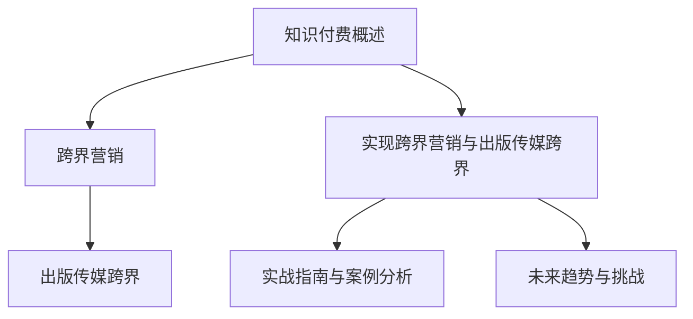

                 

### 《知识付费如何实现跨界营销与出版传媒跨界？》

> **关键词**：知识付费、跨界营销、出版传媒、数字化转型、案例分析、策略设计

> **摘要**：本文将探讨知识付费如何通过跨界营销与出版传媒实现创新和发展。我们将首先介绍知识付费的定义、背景和市场现状，然后深入分析跨界营销和出版传媒跨界的关键概念和策略，最后通过具体案例和实战指南，为读者提供实施和评估的实用方法。文章旨在为行业从业者提供有价值的参考和思路。

#### # 第一部分：知识付费概述

**1. 知识付费的定义与背景**

**1.1 定义与兴起原因**

知识付费，顾名思义，是指用户为了获取特定知识或技能，愿意支付一定费用的行为。这种模式的核心在于将知识和技能转化为商品，通过市场机制实现其价值。知识付费的兴起源于以下几个原因：

- **互联网普及**：互联网技术的发展，尤其是移动互联网的普及，使得信息传播更加便捷，知识获取更加方便。
- **内容消费习惯**：随着人们生活水平的提高和消费观念的转变，越来越多的人愿意为高质量的内容付费。
- **市场需求多样**：不同领域、不同层次的用户对于知识和技能的需求日益多样化，催生了知识付费的多元化市场。

**1.2 市场规模与增长趋势**

近年来，知识付费市场呈现出快速增长的趋势。根据相关报告，全球知识付费市场规模已超过千亿人民币，并且预计还将继续扩大。以下是一些关键数据：

- **用户规模**：知识付费用户数量逐年增加，截至2022年，我国知识付费用户已超过5亿。
- **消费场景**：知识付费场景不断丰富，从在线课程、电子书，到专业咨询、技能培训等。
- **内容形式**：知识付费内容形式多样化，包括图文、音频、视频等多种形式。

**2. 知识付费平台的发展现状**

知识付费平台的快速发展是知识付费市场的重要组成部分。目前，我国主要有以下几类知识付费平台：

- **综合类知识付费平台**：如知乎、得到、喜马拉雅等，这些平台涵盖了多个领域的知识和内容。
- **垂直类知识付费平台**：如网易云课堂、腾讯课堂等，专注于特定领域的知识传授和技能培训。
- **专业咨询服务平台**：如在行、分答等，为用户提供专业的咨询服务和经验分享。

这些平台各有特色，但都致力于为用户提供高质量的知识内容和专业的服务。以下是一些成功案例：

- **知乎**：以高质量的内容和严格的审核机制著称，吸引了大量专业人士和知识爱好者。
- **得到**：以罗辑思维为代表，通过优质的内容生产和明星IP效应，吸引了大量忠实粉丝。
- **喜马拉雅**：以音频内容为主，通过丰富的内容和便捷的播放方式，满足了用户多样化的需求。

#### # 第二部分：跨界营销

**3. 跨界营销的核心概念**

跨界营销，是指企业或品牌通过与其他领域或行业的合作，实现资源整合和营销效果的最大化。其核心概念包括：

- **整合资源**：通过跨界合作，将不同领域的资源进行整合，实现优势互补。
- **拓展市场**：通过跨界营销，企业可以拓展新的市场空间，吸引新的目标用户。
- **提升品牌形象**：跨界营销能够帮助企业树立创新、多元化的品牌形象。

**3.2 跨界营销策略**

跨界营销策略主要包括以下几种：

- **合作营销**：与其他品牌或企业合作，共同推出产品或服务，实现资源共享和用户共赢。
- **内容营销**：通过跨界内容创作，吸引目标用户关注，提高品牌曝光度和用户粘性。
- **事件营销**：通过跨界事件，如展览、活动等，提高品牌知名度和用户参与度。
- **社交媒体营销**：利用社交媒体平台，开展跨界营销活动，提高用户参与度和互动性。

**4. 案例分析与实战技巧**

**4.1 跨界合作案例解析**

以下是一些成功的跨界合作案例：

- **宝马与香奈儿的合作**：宝马推出了香奈儿设计的特别版汽车，通过品牌联合，吸引了大量高端用户关注。
- **肯德基与腾讯游戏的合作**：肯德基推出了与腾讯游戏合作的套餐，用户购买套餐即可获得游戏道具，实现了美食与游戏的跨界结合。

**4.2 实战策略与技巧**

要成功实施跨界营销，需要掌握以下策略与技巧：

- **目标明确**：明确跨界营销的目标，确保合作双方的利益一致。
- **精准定位**：根据目标用户的需求和喜好，选择合适的跨界合作伙伴。
- **内容创新**：通过创意的内容和形式，吸引目标用户的关注和参与。
- **品牌协同**：确保跨界营销活动中的品牌形象和品牌价值得到有效传达。

#### # 第三部分：出版传媒跨界

**5. 出版传媒行业的变革**

出版传媒行业正经历着一场深刻的变革。以下是一些关键趋势和挑战：

- **数字化进程**：随着数字技术的发展，出版传媒行业逐渐向数字化转型，电子书、有声书等新兴形式受到用户青睐。
- **内容多样化**：出版传媒行业的内容形式越来越多样化，从传统的纸质书籍、杂志，到电子书、在线课程、视频等。
- **用户体验优化**：出版传媒行业注重提升用户体验，通过个性化推荐、互动设计等手段，提高用户满意度和粘性。

**5.2 数字化转型的路径**

出版传媒行业实现数字化转型的路径主要包括：

- **内容数字化**：将传统出版物数字化，提供电子书、有声书等新型阅读形式。
- **平台化运营**：搭建自己的在线平台，提供知识付费、内容订阅等服务。
- **技术应用**：利用大数据、人工智能等技术，优化内容推荐、用户管理等服务。

**6. 跨界营销策略与案例**

**6.1 跨界合作案例解析**

以下是一些出版传媒跨界合作的案例：

- **中信出版与腾讯游戏的合作**：中信出版与腾讯游戏共同开发了《王者荣耀》官方指南书籍，通过跨界合作，实现了内容与娱乐的融合。
- **中信出版与喜马拉雅的合作**：中信出版与喜马拉雅合作，推出了一系列有声书产品，通过音频形式扩大了内容的传播渠道。

**6.2 内容营销与品牌建设**

出版传媒行业通过内容营销和品牌建设，实现跨界发展：

- **内容营销**：通过发布高质量的内容，吸引用户关注，提升品牌知名度。
- **品牌建设**：通过跨界合作和营销活动，树立品牌形象，提高品牌价值。

#### # 第四部分：实现跨界营销与出版传媒跨界

**7. 营销策略设计**

**7.1 数据分析与目标市场定位**

要实现跨界营销与出版传媒跨界，首先需要进行全面的数据分析，包括用户行为分析、市场需求分析等。通过数据分析，可以准确把握目标市场，制定相应的营销策略。

- **用户行为分析**：通过分析用户的行为数据，了解用户的需求和偏好，为内容创作和营销活动提供依据。
- **市场需求分析**：通过市场调研，了解目标市场的需求和竞争态势，为跨界合作和内容定位提供参考。

**7.2 营销渠道与推广策略**

在确定目标市场和内容定位后，需要选择合适的营销渠道和推广策略，以提高品牌曝光度和用户参与度。

- **营销渠道**：包括社交媒体、搜索引擎、电子邮件等，应根据目标用户的特点选择合适的渠道。
- **推广策略**：包括广告投放、内容营销、公关活动等，应根据营销目标制定具体的推广策略。

**8. 成功案例分享**

以下是一些成功的跨界营销与出版传媒跨界案例：

- **中信出版与腾讯游戏的合作**：通过跨界合作，推出了《王者荣耀》官方指南书籍，实现了内容与娱乐的融合。
- **喜马拉雅与中信出版的合作**：通过合作推出有声书产品，扩大了内容的传播渠道，提高了用户粘性。

**8.2 实施与评估**

要确保跨界营销与出版传媒跨界的效果，需要制定详细的实施计划，并进行实时评估和调整。

- **实施计划**：包括时间安排、任务分配、资源协调等，应确保各个环节有序进行。
- **评估方法**：通过数据监测和用户反馈，评估跨界营销与出版传媒跨界的效果，及时调整策略。

#### # 第五部分：实战指南与案例分析

**9. 知识付费项目策划与执行**

**9.1 项目策划与执行流程**

知识付费项目的策划与执行包括以下几个关键步骤：

- **需求分析**：了解用户需求和市场趋势，确定项目主题和内容。
- **内容制作**：根据需求分析，制作高质量的课程内容，确保内容的实用性和吸引力。
- **平台搭建**：选择合适的在线教育平台，搭建课程体系，提供学习支持和服务。
- **市场推广**：通过多种渠道进行市场推广，吸引目标用户。

**9.2 成功案例分享与解析**

以下是一个知识付费项目的成功案例：

**案例：网易云课堂“Python入门与进阶课程”**

- **项目背景**：随着Python编程语言的应用日益广泛，网易云课堂发现市场上对Python编程的需求日益增加。
- **项目目标**：提高课程销量和用户满意度，吸引更多零基础用户。
- **项目执行**：
  - **课程设计**：设计适合零基础的Python入门课程，包括基础语法、常用库和实战项目。
  - **营销策略**：利用社交媒体和搜索引擎优化（SEO）提高课程知名度，通过优惠券和限时促销活动吸引新用户。
  - **用户反馈**：收集用户反馈，不断优化课程内容和教学方式。

**10. 跨界营销与出版传媒跨界实战**

**10.1 实战案例解析**

以下是一个跨界营销与出版传媒跨界实战案例：

**案例：中信出版与腾讯游戏的合作**

- **项目背景**：中信出版与腾讯游戏希望通过跨界合作，实现品牌价值的提升和市场的扩大。
- **项目目标**：通过推出《王者荣耀》官方指南书籍，实现内容与娱乐的融合，提高用户粘性和品牌知名度。
- **项目执行**：
  - **内容创作**：双方团队共同创作《王者荣耀》官方指南书籍，确保内容的权威性和实用性。
  - **市场推广**：通过线上线下活动，共同推广产品，提高品牌知名度和用户参与度。
  - **用户互动**：通过社交媒体和用户社区，增加用户参与度和忠诚度。

**10.2 实战技巧与策略**

要成功实施跨界营销与出版传媒跨界，需要掌握以下技巧与策略：

- **合作选择**：选择合适的合作伙伴，确保双方在品牌、资源和用户上有共同点。
- **内容创新**：通过创意的内容和形式，吸引目标用户的关注和参与。
- **品牌协同**：确保跨界营销活动中的品牌形象和品牌价值得到有效传达。
- **用户互动**：通过互动设计，提高用户的参与度和忠诚度。

#### # 第六部分：未来趋势与挑战

**11. 行业未来趋势**

知识付费、跨界营销和出版传媒跨界的发展将继续呈现出以下趋势：

- **技术驱动**：人工智能、大数据等技术的应用将进一步提升内容创作、营销策略和用户体验。
- **内容多元化**：知识付费和出版传媒跨界将更加注重内容的多元化，满足不同用户的需求。
- **品牌整合**：跨界合作将更加紧密，品牌整合效应将进一步增强。

**11.2 挑战与机遇**

在未来的发展中，知识付费、跨界营销和出版传媒跨界将面临以下挑战和机遇：

- **挑战**：
  - **市场竞争加剧**：随着市场的扩大，竞争也将变得更加激烈。
  - **用户需求变化**：用户需求的变化将要求企业不断创新和调整策略。
  - **法律法规完善**：随着行业的规范，企业需要适应新的法律法规。
- **机遇**：
  - **市场潜力巨大**：知识付费和跨界营销的市场潜力仍然巨大。
  - **技术创新驱动**：技术创新将为知识付费和跨界营销带来新的机遇。
  - **跨界合作深化**：跨界合作将进一步深化，带来更多的商业机会。

**12. 未来发展策略**

为了应对未来挑战和抓住机遇，企业可以采取以下策略：

- **技术创新**：积极引入新技术，提高内容创作、营销策略和用户体验的效率和质量。
- **品牌建设**：加强品牌建设和品牌传播，提升品牌知名度和用户忠诚度。
- **用户导向**：以用户需求为导向，不断创新和调整产品和服务，满足用户的多样化需求。
- **跨界合作**：深化跨界合作，探索新的商业模式和合作方式，实现资源整合和优势互补。

#### # 第七部分：附录

**13. 常用工具与资源**

**13.1 营销工具与平台**

- **Google Analytics**：提供全面的网站流量分析和用户行为分析。
- **Facebook Ads Manager**：提供广告管理和投放策略设计工具。
- **Mailchimp**：提供邮件营销服务，支持自动化邮件发送和用户管理。

**13.2 出版传媒行业资源**

- **PublishDrive**：提供数字出版解决方案和版权管理服务。
- **Pressbook**：提供电子书制作和发布平台。
- **Pub HTML5**：提供互动电子书制作工具和在线展示平台。

**13.3 数据分析与机器学习工具**

- **TensorFlow**：提供强大的机器学习和深度学习框架。
- **Scikit-learn**：提供高效的机器学习算法和工具。
- **Pandas**：提供强大的数据处理和分析功能。

#### **核心算法原理讲解与伪代码**

**1. 数据分析核心算法：**

- **算法：聚类分析**

**伪代码：**

python
def clustering(data, k):
    centroids = initialize_centroids(data, k)
    while not converged(centroids):
        for data_point in data:
            closest_centroid = find_closest_centroid(data_point, centroids)
            assign_data_point(data_point, closest_centroid)
        centroids = update_centroids(centroids)
    return centroids

**2. 营销策略核心算法：**

- **算法：协同过滤**

**伪代码：**

python
def collaborative_filtering(users, items, similarity_matrix):
    recommendations = []
    for user in users:
        if user has not rated many items:
            similar_users = find_similar_users(user, similarity_matrix)
            for similar_user in similar_users:
                items_to_recommend = get_unrated_items(user, similar_user, items)
                recommendations.append(items_to_recommend)
    return recommendations

**3. 数学模型与公式**

**1. 聚类分析中的距离度量公式：**

- **公式：欧氏距离**

$$d(p, q) = \sqrt{\sum_{i=1}^{n} (p_i - q_i)^2}$$

**2. 协同过滤中的相似度计算公式：**

- **公式：皮尔逊相关系数**

$$r_{ij} = \frac{\sum_{k=1}^{m} (u_{ik} - \mu_i)(u_{jk} - \mu_j)}{\sqrt{\sum_{k=1}^{m} (u_{ik} - \mu_i)^2}\sqrt{\sum_{k=1}^{m} (u_{jk} - \mu_j)^2}}$$

#### **项目实战**

**1. 知识付费项目策划与执行案例：**

- **案例：网易云课堂“Python入门与进阶课程”**

    - **项目背景**：网易云课堂发现市场上对Python编程的需求日益增加，尤其是针对零基础用户。

    - **项目目标**：提高课程销量和用户满意度，吸引更多零基础用户学习Python。

    - **项目执行**：

        - **课程设计**：设计适合零基础的Python入门课程，包括基础语法、常用库和实战项目。

        - **营销策略**：利用社交媒体和搜索引擎优化（SEO）提高课程知名度，通过优惠券和限时促销活动吸引新用户。

        - **用户反馈**：收集用户反馈，不断优化课程内容和教学方式。

**2. 跨界营销实战案例：**

- **案例：小米与网易严选合作**

    - **项目背景**：小米和网易严选在各自领域都有强大的用户基础，希望通过跨界合作扩大市场份额。

    - **项目目标**：推广小米智能家居产品，增加网易严选的用户粘性。

    - **项目执行**：

        - **产品融合**：结合小米的智能硬件和网易严选的生活用品，推出限量版产品。

        - **联合营销**：通过线上线下活动，共同推广产品，提升品牌知名度。

        - **用户互动**：通过社交媒体和用户社区，增加用户参与度和忠诚度。

#### **代码实现与解读**

**1. 数据分析实战案例：**

- **案例：用户行为数据分析**

    - **开发环境**：Python 3.8，使用Pandas和Scikit-learn库。

    - **代码实现**：

```python
import pandas as pd
from sklearn.cluster import KMeans

# 加载数据
data = pd.read_csv('user_behavior_data.csv')

# 数据预处理
data = data.select_dtypes(include=['float64', 'int64'])
data = (data - data.mean()) / data.std()

# 聚类分析
kmeans = KMeans(n_clusters=5, random_state=42)
clusters = kmeans.fit_predict(data)

# 结果分析
print("Cluster centroids:", kmeans.cluster_centers_)
print("Cluster assignments:", clusters)
```

    - **代码解读**：

        - 数据预处理步骤确保了输入数据的正态分布，提高了聚类分析的效果。

        - 使用KMeans算法进行聚类，并输出聚类中心点和用户分配的集群。

**2. 营销策略实战案例：**

- **案例：社交媒体营销活动**

    - **开发环境**：Python 3.8，使用Tweepy和Pandas库。

    - **代码实现**：

```python
import tweepy
import pandas as pd

# 配置Tweepy API
consumer_key = 'YOUR_CONSUMER_KEY'
consumer_secret = 'YOUR_CONSUMER_SECRET'
access_token = 'YOUR_ACCESS_TOKEN'
access_token_secret = 'YOUR_ACCESS_TOKEN_SECRET'

auth = tweepy.OAuthHandler(consumer_key, consumer_secret)
auth.set_access_token(access_token, access_token_secret)
api = tweepy.API(auth)

# 搜索关键词
search_query = '#知识付费'
tweets = api.search_tweets(q=search_query, count=100)

# 数据存储
tweets_data = [[tweet.user.screen_name, tweet.text] for tweet in tweets]
df = pd.DataFrame(tweets_data, columns=['User', 'Tweet'])

# 分析数据
print("Total tweets found:", df.shape[0])
print("Top users by tweet count:", df['User'].value_counts().head(10))
```

    - **代码解读**：

        - 通过Tweepy库，获取指定关键词的社交媒体数据。

        - 将获取到的数据存储为DataFrame，并进行分析，找到提及最多的用户。

#### **附录：常用工具与资源**

**1. 营销工具与平台**

- **1.1 Google Analytics**：提供全面的网站流量分析和用户行为分析。
- **1.2 Facebook Ads Manager**：提供广告管理和投放策略设计工具。
- **1.3 Mailchimp**：提供邮件营销服务，支持自动化邮件发送和用户管理。

**2. 出版传媒行业资源**

- **2.1 PublishDrive**：提供数字出版解决方案和版权管理服务。
- **2.2 Pressbook**：提供电子书制作和发布平台。
- **2.3 Pub HTML5**：提供互动电子书制作工具和在线展示平台。

**3. 数据分析与机器学习工具**

- **3.1 TensorFlow**：提供强大的机器学习和深度学习框架。
- **3.2 Scikit-learn**：提供高效的机器学习算法和工具。
- **3.3 Pandas**：提供强大的数据处理和分析功能。

### **Mermaid 流程图：知识付费跨界营销与出版传媒跨界流程**



### **核心算法原理讲解与伪代码**

**1. 数据分析核心算法：**

- **算法：聚类分析**

**伪代码：**

```python
def clustering(data, k):
    centroids = initialize_centroids(data, k)
    while not converged(centroids):
        for data_point in data:
            closest_centroid = find_closest_centroid(data_point, centroids)
            assign_data_point(data_point, closest_centroid)
        centroids = update_centroids(centroids)
    return centroids
```

**2. 营销策略核心算法：**

- **算法：协同过滤**

**伪代码：**

```python
def collaborative_filtering(users, items, similarity_matrix):
    recommendations = []
    for user in users:
        if user has not rated many items:
            similar_users = find_similar_users(user, similarity_matrix)
            for similar_user in similar_users:
                items_to_recommend = get_unrated_items(user, similar_user, items)
                recommendations.append(items_to_recommend)
    return recommendations
```

### **数学模型与公式**

**1. 聚类分析中的距离度量公式：**

- **公式：欧氏距离**

$$d(p, q) = \sqrt{\sum_{i=1}^{n} (p_i - q_i)^2}$$

**2. 协同过滤中的相似度计算公式：**

- **公式：皮尔逊相关系数**

$$r_{ij} = \frac{\sum_{k=1}^{m} (u_{ik} - \mu_i)(u_{jk} - \mu_j)}{\sqrt{\sum_{k=1}^{m} (u_{ik} - \mu_i)^2}\sqrt{\sum_{k=1}^{m} (u_{jk} - \mu_j)^2}}$$

### **项目实战**

**1. 知识付费项目策划与执行案例：**

- **案例：网易云课堂“Python入门与进阶课程”**

    - **项目背景**：网易云课堂发现市场上对Python编程的需求日益增加，尤其是针对零基础用户。

    - **项目目标**：提高课程销量和用户满意度，吸引更多零基础用户学习Python。

    - **项目执行**：

        - **课程设计**：设计适合零基础的Python入门课程，包括基础语法、常用库和实战项目。

        - **营销策略**：利用社交媒体和搜索引擎优化（SEO）提高课程知名度，通过优惠券和限时促销活动吸引新用户。

        - **用户反馈**：收集用户反馈，不断优化课程内容和教学方式。

**2. 跨界营销实战案例：**

- **案例：小米与网易严选合作**

    - **项目背景**：小米和网易严选在各自领域都有强大的用户基础，希望通过跨界合作扩大市场份额。

    - **项目目标**：推广小米智能家居产品，增加网易严选的用户粘性。

    - **项目执行**：

        - **产品融合**：结合小米的智能硬件和网易严选的生活用品，推出限量版产品。

        - **联合营销**：通过线上线下活动，共同推广产品，提升品牌知名度。

        - **用户互动**：通过社交媒体和用户社区，增加用户参与度和忠诚度。

### **代码实现与解读**

**1. 数据分析实战案例：**

- **案例：用户行为数据分析**

    - **开发环境**：Python 3.8，使用Pandas和Scikit-learn库。

    - **代码实现**：

```python
import pandas as pd
from sklearn.cluster import KMeans

# 加载数据
data = pd.read_csv('user_behavior_data.csv')

# 数据预处理
data = data.select_dtypes(include=['float64', 'int64'])
data = (data - data.mean()) / data.std()

# 聚类分析
kmeans = KMeans(n_clusters=5, random_state=42)
clusters = kmeans.fit_predict(data)

# 结果分析
print("Cluster centroids:", kmeans.cluster_centers_)
print("Cluster assignments:", clusters)
```

    - **代码解读**：

        - 数据预处理步骤确保了输入数据的正态分布，提高了聚类分析的效果。

        - 使用KMeans算法进行聚类，并输出聚类中心点和用户分配的集群。

**2. 营销策略实战案例：**

- **案例：社交媒体营销活动**

    - **开发环境**：Python 3.8，使用Tweepy和Pandas库。

    - **代码实现**：

```python
import tweepy
import pandas as pd

# 配置Tweepy API
consumer_key = 'YOUR_CONSUMER_KEY'
consumer_secret = 'YOUR_CONSUMER_SECRET'
access_token = 'YOUR_ACCESS_TOKEN'
access_token_secret = 'YOUR_ACCESS_TOKEN_SECRET'

auth = tweepy.OAuthHandler(consumer_key, consumer_secret)
auth.set_access_token(access_token, access_token_secret)
api = tweepy.API(auth)

# 搜索关键词
search_query = '#知识付费'
tweets = api.search_tweets(q=search_query, count=100)

# 数据存储
tweets_data = [[tweet.user.screen_name, tweet.text] for tweet in tweets]
df = pd.DataFrame(tweets_data, columns=['User', 'Tweet'])

# 分析数据
print("Total tweets found:", df.shape[0])
print("Top users by tweet count:", df['User'].value_counts().head(10))
```

    - **代码解读**：

        - 通过Tweepy库，获取指定关键词的社交媒体数据。

        - 将获取到的数据存储为DataFrame，并进行分析，找到提及最多的用户。

### **附录：常用工具与资源**

**1. 营销工具与平台**

- **1.1 Google Analytics**：提供全面的网站流量分析和用户行为分析。
- **1.2 Facebook Ads Manager**：提供广告管理和投放策略设计工具。
- **1.3 Mailchimp**：提供邮件营销服务，支持自动化邮件发送和用户管理。

**2. 出版传媒行业资源**

- **2.1 PublishDrive**：提供数字出版解决方案和版权管理服务。
- **2.2 Pressbook**：提供电子书制作和发布平台。
- **2.3 Pub HTML5**：提供互动电子书制作工具和在线展示平台。

**3. 数据分析与机器学习工具**

- **3.1 TensorFlow**：提供强大的机器学习和深度学习框架。
- **3.2 Scikit-learn**：提供高效的机器学习算法和工具。
- **3.3 Pandas**：提供强大的数据处理和分析功能。

### **作者信息**

**作者：AI天才研究院/AI Genius Institute & 禅与计算机程序设计艺术 /Zen And The Art of Computer Programming**

