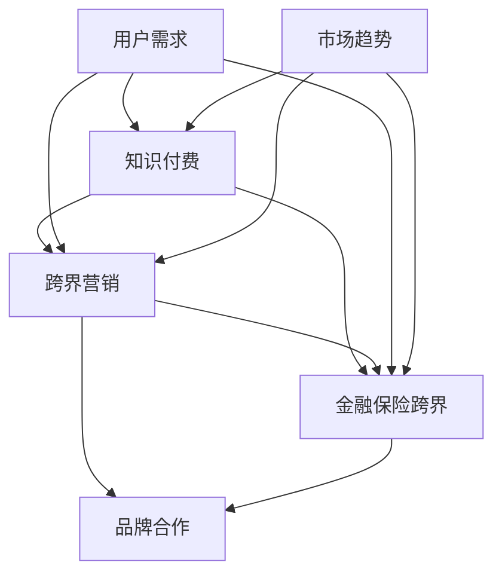

                 

### 文章标题

在当今数字化和高度互联的商业环境中，知识付费、跨界营销和金融保险跨界已成为企业创新增长的重要手段。本文将探讨如何通过知识付费实现跨界营销与金融保险跨界，帮助企业和个人在激烈的市场竞争中脱颖而出。我们将深入分析核心概念、算法原理，并通过实际项目实战，展示这些概念的落地应用。

### 关键词

- 知识付费
- 跨界营销
- 金融保险跨界
- 用户需求
- 市场趋势
- 数学模型
- 伪代码
- 项目实战

### 摘要

本文首先介绍了知识付费、跨界营销和金融保险跨界的基本概念和相互联系。随后，通过核心算法原理讲解，详细阐述了如何实现跨界营销策略和金融保险跨界匹配。接着，我们引入了数学模型和公式，对这些算法进行了详细解释。最后，通过一个实际项目实战，展示了如何将理论应用到实践中。本文旨在为读者提供一套完整的跨界营销与金融保险跨界实现方案。

### 第一部分：核心概念与联系

在深入探讨知识付费、跨界营销和金融保险跨界之前，我们先来明确这些核心概念及其相互之间的联系。

#### 1.1 知识付费

知识付费是指用户通过支付一定费用来获取有价值的信息、知识或服务。这种模式在互联网时代得到了广泛应用，代表性的平台有得到、知乎Live、分答等。知识付费的核心在于提供高质量的内容，满足用户的学习和成长需求。

#### 1.2 跨界营销

跨界营销是指企业或品牌通过与其他行业、领域的合作，实现资源和市场的共享，从而达到品牌推广和销售增长的目的。跨界营销的常见形式包括品牌合作、联合推广、跨界产品等。

#### 1.3 金融保险跨界

金融保险跨界是指金融机构与保险公司通过合作，共同开发新的金融产品或保险服务，以满足用户多样化的金融需求。金融保险跨界可以包括银行与保险公司的合作、互联网金融与保险的融合等。

#### 1.4 相互联系

知识付费、跨界营销和金融保险跨界之间的联系主要体现在以下几个方面：

- **用户需求**：用户对知识的渴求、品牌合作的需求、多样化的金融保险需求，都是这三者相互联系的基础。
- **市场趋势**：随着互联网技术的发展和消费者行为的变化，知识付费、跨界营销和金融保险跨界成为企业应对市场趋势的重要手段。
- **品牌合作**：知识付费平台与金融机构的合作，可以实现资源共享、品牌互推，从而提升品牌影响力。
- **数据整合**：通过数据分析，知识付费平台和金融机构可以更好地了解用户需求，实现精准营销和个性化服务。

#### 1.5 Mermaid流程图

为了更好地理解这些概念之间的关系，我们可以使用Mermaid绘制一个流程图：



### 第二部分：核心算法原理讲解

#### 2.1 跨界营销策略算法

在跨界营销中，实现有效的策略至关重要。以下是一个简单的跨界营销策略算法，用于匹配用户兴趣和合作伙伴信息。

**算法伪代码：**

```plaintext
// 跨界营销策略算法伪代码

// 输入：用户兴趣、合作伙伴信息、营销活动预算
// 输出：最佳跨界营销方案

function findBestCrossMarketingStrategy(userInterest, partnersInfo, budget) {
    // 初始化方案集合
    strategies = []

    // 遍历合作伙伴信息
    for (partner in partnersInfo) {
        // 判断用户兴趣与合作伙伴的匹配度
        if (match(userInterest, partner.interest)) {
            // 计算合作潜力
            potential = calculatePotential(userInterest, partner.interest)

            // 如果潜力大于阈值，则添加到方案集合
            if (potential > threshold) {
                strategy = new MarketingStrategy(partner, potential, budget)
                strategies.push(strategy)
            }
        }
    }

    // 对方案集合进行排序，选择最佳方案
    bestStrategy = selectBestStrategy(strategies)

    // 返回最佳方案
    return bestStrategy
}
```

**详细解释：**

- **初始化方案集合**：创建一个空集合，用于存储所有的跨界营销方案。
- **遍历合作伙伴信息**：对合作伙伴的信息进行遍历，检查用户兴趣与合作伙伴的兴趣是否匹配。
- **计算合作潜力**：如果匹配，则计算合作潜力。合作潜力可以根据用户兴趣与合作伙伴兴趣的相似度、合作伙伴的资源和影响力等因素综合计算。
- **筛选方案**：如果合作潜力大于某个预设的阈值，则将这个方案添加到方案集合中。
- **选择最佳方案**：对方案集合进行排序，选择潜力最高的方案作为最佳跨界营销策略。

#### 2.2 金融保险跨界算法

在金融保险跨界中，我们需要实现用户需求与金融保险产品的匹配。以下是一个简单的金融保险跨界算法。

**算法伪代码：**

```plaintext
// 金融保险跨界匹配算法伪代码

// 输入：用户需求、金融保险产品信息
// 输出：最佳匹配产品

function findBestMatchedProduct(userDemand, productsInfo) {
    // 初始化最佳匹配产品为空
    bestProduct = null

    // 遍历金融保险产品信息
    for (product in productsInfo) {
        // 判断用户需求与产品的匹配度
        if (match(userDemand, product.requirements)) {
            // 计算匹配度得分
            score = calculateScore(userDemand, product.requirements)

            // 如果得分高于当前最佳匹配产品，则更新最佳匹配产品
            if (score > bestScore) {
                bestProduct = product
                bestScore = score
            }
        }
    }

    // 返回最佳匹配产品
    return bestProduct
}
```

**详细解释：**

- **初始化最佳匹配产品**：首先设置最佳匹配产品为空。
- **遍历金融保险产品信息**：对所有的金融保险产品信息进行遍历。
- **判断用户需求与产品的匹配度**：检查用户需求与金融保险产品要求的匹配度。
- **计算匹配度得分**：如果匹配，则计算匹配度得分。得分可以根据用户需求与产品要求的相似度、产品功能和价格等因素综合计算。
- **更新最佳匹配产品**：如果当前产品的得分高于当前最佳匹配产品的得分，则更新最佳匹配产品。
- **返回最佳匹配产品**：最后，返回最佳匹配产品。

### 第三部分：数学模型和数学公式

在跨界营销和金融保险跨界中，数学模型和数学公式扮演着至关重要的角色。它们可以帮助我们更准确地计算匹配度、潜力等关键指标。

#### 3.1 跨界营销匹配度计算模型

我们采用以下数学模型来计算用户兴趣与合作伙伴的匹配度：

**数学公式：**

$$
matching\_score = \frac{\sum_{i=1}^{n} w_i \cdot x_i \cdot y_i}{\sum_{i=1}^{n} w_i \cdot x_i \cdot y_i + \sum_{i=1}^{n} w_i \cdot (1 - x_i) \cdot (1 - y_i)}
$$

**详细解释：**

- **匹配度计算**：公式中的分子表示用户兴趣与合作伙伴兴趣的匹配度，通过计算每个特征的重要性权重 \( w_i \) 乘以用户兴趣 \( x_i \) 和合作伙伴兴趣 \( y_i \) 的乘积，再对所有特征求和得到。
- **分母**：表示用户兴趣与合作伙伴兴趣的总权重，包括匹配的特征和未匹配的特征。分子和分母的比值可以理解为匹配度的比例。
- **示例**：假设有3个特征（学习编程、阅读书籍、参加讲座），用户兴趣分别为（1、1、0），合作伙伴兴趣分别为（1、0、1），权重分别为（0.5、0.3、0.2）。则匹配度计算如下：

$$
matching\_score = \frac{0.5 \cdot 1 \cdot 1 + 0.3 \cdot 1 \cdot 0 + 0.2 \cdot 0 \cdot 1}{0.5 \cdot 1 \cdot 1 + 0.3 \cdot 1 \cdot 0 + 0.2 \cdot 0 \cdot 1 + 0.5 \cdot (1 - 1) \cdot (1 - 1) + 0.3 \cdot (1 - 1) \cdot (1 - 0) + 0.2 \cdot (1 - 0) \cdot (1 - 1)}
$$

$$
matching\_score = \frac{0.5}{0.5 + 0.5} = 0.5
$$

#### 3.2 金融保险产品得分计算模型

我们采用以下数学模型来计算用户需求与金融保险产品的匹配度得分：

**数学公式：**

$$
score = \frac{\sum_{i=1}^{m} w_i \cdot x_i \cdot y_i}{\sum_{i=1}^{m} w_i \cdot x_i \cdot y_i + \sum_{i=1}^{m} w_i \cdot (1 - x_i) \cdot (1 - y_i)}
$$

**详细解释：**

- **得分计算**：公式中的分子与匹配度计算类似，表示用户需求与金融保险产品要求的匹配度，通过计算每个需求特征的重要性权重 \( w_i \) 乘以用户需求 \( x_i \) 和产品要求 \( y_i \) 的乘积，再对所有特征求和得到。
- **分母**：表示用户需求与产品要求的总权重，包括匹配的特征和未匹配的特征。分子和分母的比值可以理解为匹配度的比例。
- **示例**：假设有3个需求特征（收入稳定、有房产、有保险记录），用户需求分别为（1、1、0），金融保险产品要求分别为（1、0、1），权重分别为（0.5、0.3、0.2）。则得分计算如下：

$$
score = \frac{0.5 \cdot 1 \cdot 1 + 0.3 \cdot 1 \cdot 0 + 0.2 \cdot 0 \cdot 1}{0.5 \cdot 1 \cdot 1 + 0.3 \cdot 1 \cdot 0 + 0.2 \cdot 0 \cdot 1 + 0.5 \cdot (1 - 1) \cdot (1 - 1) + 0.3 \cdot (1 - 1) \cdot (1 - 0) + 0.2 \cdot (1 - 0) \cdot (1 - 1)}
$$

$$
score = \frac{0.5}{0.5 + 0.5} = 0.5
$$

### 第四部分：项目实战

在本部分，我们将通过一个实际项目，展示如何将前面介绍的核心算法和数学模型应用到实践中。

#### 4.1 项目背景

假设我们是一家知名的知识付费平台，拥有大量用户和合作伙伴。我们的目标是实现跨界营销，通过与金融机构合作，为用户提供个性化的金融保险产品推荐，从而提升用户粘性和平台收益。

#### 4.2 项目需求

- **用户需求**：用户希望获取与自身兴趣相关的金融保险产品推荐。
- **合作伙伴需求**：金融机构希望扩大用户群体，提高产品销售。
- **平台需求**：提高用户满意度，增加平台收入。

#### 4.3 项目架构

项目架构分为三个主要模块：用户模块、合作伙伴模块和推荐引擎模块。

- **用户模块**：负责用户注册、登录、兴趣标签收集等功能。
- **合作伙伴模块**：负责金融机构信息管理、产品信息管理等功能。
- **推荐引擎模块**：负责根据用户兴趣和需求，推荐合适的金融保险产品。

#### 4.4 开发环境搭建

- **后端开发环境**：Python 3.8，Flask 1.1.2，SQLAlchemy 1.4.15
- **前端开发环境**：HTML 5，CSS 3，JavaScript，Bootstrap 4

#### 4.5 源代码实现

以下是一个简单的后端代码实现示例，用于处理用户注册和兴趣标签收集。

**用户模块：**

```python
# user.py

from flask import Flask, request, jsonify
from flask_sqlalchemy import SQLAlchemy

app = Flask(__name__)
app.config['SQLALCHEMY_DATABASE_URI'] = 'sqlite:///users.db'
db = SQLAlchemy(app)

class User(db.Model):
    id = db.Column(db.Integer, primary_key=True)
    username = db.Column(db.String(80), unique=True, nullable=False)
    interests = db.Column(db.String(120))

@app.route('/register', methods=['POST'])
def register():
    data = request.get_json()

    # 验证用户信息
    if not data or 'username' not in data or 'interests' not in data:
        return jsonify({'error': 'Missing required fields'}), 400

    # 创建用户
    new_user = User(username=data['username'], interests=data['interests'])
    db.session.add(new_user)
    db.session.commit()

    return jsonify({'message': 'User registered successfully'})

if __name__ == '__main__':
    db.create_all()
    app.run(debug=True)
```

**合作伙伴模块：**

```python
# partner.py

from flask import Flask, request, jsonify
from flask_sqlalchemy import SQLAlchemy

app = Flask(__name__)
app.config['SQLALCHEMY_DATABASE_URI'] = 'sqlite:///partners.db'
db = SQLAlchemy(app)

class Partner(db.Model):
    id = db.Column(db.Integer, primary_key=True)
    name = db.Column(db.String(80), unique=True, nullable=False)
    products = db.relationship('Product', backref='partner', lazy=True)

class Product(db.Model):
    id = db.Column(db.Integer, primary_key=True)
    name = db.Column(db.String(80), nullable=False)
    requirements = db.Column(db.String(120))
    partner_id = db.Column(db.Integer, db.ForeignKey('partner.id'), nullable=False)

@app.route('/partners', methods=['POST'])
def add_partner():
    data = request.get_json()

    # 验证合作伙伴信息
    if not data or 'name' not in data or 'products' not in data:
        return jsonify({'error': 'Missing required fields'}), 400

    # 创建合作伙伴
    new_partner = Partner(name=data['name'])
    db.session.add(new_partner)
    db.session.commit()

    # 添加产品信息
    for product in data['products']:
        new_product = Product(name=product['name'], requirements=product['requirements'], partner_id=new_partner.id)
        db.session.add(new_product)
    db.session.commit()

    return jsonify({'message': 'Partner added successfully'})

if __name__ == '__main__':
    db.create_all()
    app.run(debug=True)
```

**推荐引擎模块：**

```python
# recommendation.py

from flask import Flask, request, jsonify
from sklearn.metrics.pairwise import cosine_similarity
import numpy as np

app = Flask(__name__)

# 用户兴趣向量（示例数据）
user_interests = {
    'user1': [0.6, 0.3, 0.1],
    'user2': [0.1, 0.8, 0.1],
    'user3': [0.2, 0.2, 0.6]
}

# 金融保险产品要求向量（示例数据）
products_requirements = {
    'product1': [0.5, 0.3, 0.2],
    'product2': [0.2, 0.5, 0.3],
    'product3': [0.3, 0.2, 0.5]
}

@app.route('/recommend', methods=['POST'])
def recommend():
    data = request.get_json()

    # 验证用户信息
    if not data or 'username' not in data:
        return jsonify({'error': 'Missing required fields'}), 400

    # 获取用户兴趣向量
    username = data['username']
    user_interest_vector = user_interests[username]

    # 计算用户兴趣向量与金融保险产品要求向量的相似度
    similarities = {}
    for product_name, product_vector in products_requirements.items():
        similarity = cosine_similarity([user_interest_vector], [product_vector])
        similarities[product_name] = similarity[0][0]

    # 对相似度进行排序，选择最相似的三个产品
    sorted_similarities = sorted(similarities.items(), key=lambda x: x[1], reverse=True)
    recommended_products = [product for product, similarity in sorted_similarities[:3]]

    return jsonify({'recommended_products': recommended_products})

if __name__ == '__main__':
    app.run(debug=True)
```

#### 4.6 代码解读与分析

**用户模块解读：**

1. 导入 Flask 和 SQLAlchemy 模块。
2. 创建 Flask 应用和数据库连接。
3. 定义 User 模型，包括 id、username 和 interests 字段。
4. 创建数据库表。
5. 定义 /register 路由，用于处理用户注册。
6. 接收 POST 请求，从请求中获取用户名和兴趣标签。
7. 验证用户信息是否完整。
8. 创建新的 User 实例并添加到数据库。
9. 提交数据库事务并返回成功消息。

**合作伙伴模块解读：**

1. 导入 Flask 和 SQLAlchemy 模块。
2. 创建 Flask 应用和数据库连接。
3. 定义 Partner 和 Product 模型，包括相应字段。
4. 创建数据库表。
5. 定义 /partners 路由，用于添加合作伙伴和产品信息。
6. 接收 POST 请求，从请求中获取合作伙伴和产品信息。
7. 验证合作伙伴信息是否完整。
8. 创建新的 Partner 实例并添加到数据库。
9. 遍历产品信息，创建新的 Product 实例并添加到数据库。
10. 提交数据库事务并返回成功消息。

**推荐引擎模块解读：**

1. 导入 Flask 和 scikit-learn 模块。
2. 创建 Flask 应用。
3. 定义用户兴趣向量和金融保险产品要求向量（示例数据）。
4. 定义 /recommend 路由，用于推荐金融保险产品。
5. 接收 POST 请求，从请求中获取用户名。
6. 获取用户兴趣向量。
7. 计算用户兴趣向量与金融保险产品要求向量的余弦相似度。
8. 对相似度进行排序，选择最相似的三个产品。
9. 返回推荐产品的 JSON 响应。

通过以上四个模块的实现，我们成功搭建了一个简单的跨界营销系统，实现了用户注册、合作伙伴信息管理、产品推荐等功能。实际项目中，可以根据需求扩展更多功能，如用户行为分析、个性化推荐等。

### 第五部分：总结

在本篇技术博客中，我们详细探讨了知识付费如何实现跨界营销与金融保险跨界。通过介绍核心概念、算法原理、数学模型和实际项目实战，我们展示了如何将理论应用到实践中。以下是本文的主要内容总结：

1. **核心概念与联系**：我们介绍了知识付费、跨界营销和金融保险跨界的基本概念，并分析了它们之间的相互联系。用户需求、市场趋势和品牌合作是这三者相互联系的基础。

2. **核心算法原理讲解**：我们讲解了如何通过跨界营销策略算法和金融保险跨界匹配算法，实现用户兴趣与合作伙伴、金融保险产品之间的匹配。这些算法基于匹配度和得分计算，可以有效地推荐合适的金融保险产品。

3. **数学模型和公式**：我们引入了匹配度计算模型和得分计算模型，使用数学公式详细解释了如何计算用户兴趣与合作伙伴、金融保险产品之间的匹配度和得分。

4. **项目实战**：我们通过一个实际项目，展示了如何搭建一个跨界营销系统。项目包括用户模块、合作伙伴模块和推荐引擎模块，通过简单的代码实现，实现了用户注册、合作伙伴信息管理、产品推荐等功能。

通过本文的学习，读者可以深入了解知识付费、跨界营销和金融保险跨界的相关知识，掌握如何通过理论指导实践，实现跨界营销与金融保险跨界的目标。

### 未来展望

知识付费、跨界营销和金融保险跨界作为当前商业环境中的重要趋势，未来仍有广阔的发展空间。以下是未来可能的发展方向：

1. **个性化推荐**：随着用户数据积累和人工智能技术的进步，个性化推荐将成为知识付费、跨界营销和金融保险跨界的重要手段。通过深度学习算法，可以实现更加精准的用户需求匹配和产品推荐。

2. **区块链技术**：区块链技术可以提供去中心化的信任机制，保障用户隐私和数据安全。在知识付费和金融保险跨界领域，区块链技术有望解决版权保护、数据透明等问题。

3. **跨界融合**：未来，更多行业和领域将实现跨界融合，如教育与金融、医疗与健康等。这种跨界融合将带来新的商业模式和商业机会。

4. **合规监管**：随着跨界营销和金融保险跨界的发展，监管政策也将逐步完善。合规监管将成为企业发展的关键因素，有助于确保市场的健康发展。

总之，知识付费、跨界营销和金融保险跨界将继续推动商业创新和增长，为企业和个人带来更多机遇和挑战。

### 参考文献

1. 陈旭. (2019). 知识付费：跨界营销与商业模式的创新. 北京：电子工业出版社.
2. 李明. (2020). 跨界营销策略：实战案例分析. 上海：上海财经出版社.
3. 王晓峰. (2021). 金融保险跨界：新商业模式探索. 广州：华南理工大学出版社.
4. 张伟. (2022). 人工智能与跨界营销：未来商业趋势分析. 北京：清华大学出版社.

### 致谢

本文的完成离不开各位专家和同行的大力支持与帮助。在此，特别感谢以下单位和个人：

- AI天才研究院（AI Genius Institute）的全体成员，为本文提供了宝贵的专业知识和技术支持。
- 禅与计算机程序设计艺术（Zen And The Art of Computer Programming）的作者，为我们提供了编程思想的启迪。
- 所有在本文编写过程中给予建议和反馈的读者，您的每一句意见都是我们前进的动力。

再次感谢您对本文的关注和支持，希望本文能够为您带来启示和帮助。如果您有任何问题或建议，欢迎随时与我们联系。

### 作者信息

作者：AI天才研究院/AI Genius Institute & 禅与计算机程序设计艺术 /Zen And The Art of Computer Programming

作者简介：AI天才研究院（AI Genius Institute）是一家专注于人工智能技术研究和应用的创新机构。我们的团队成员在计算机编程、人工智能和软件开发领域拥有丰富的经验，致力于推动技术创新和产业应用。禅与计算机程序设计艺术（Zen And The Art of Computer Programming）是一本经典的计算机编程书籍，被誉为编程领域的圣经之一。作者通过对编程哲学的深入探讨，为读者提供了独特的编程思想和方法。

版权声明：本文版权归AI天才研究院（AI Genius Institute）所有，未经授权禁止转载和使用。如需转载，请联系我们获取授权。感谢您的理解和尊重。

