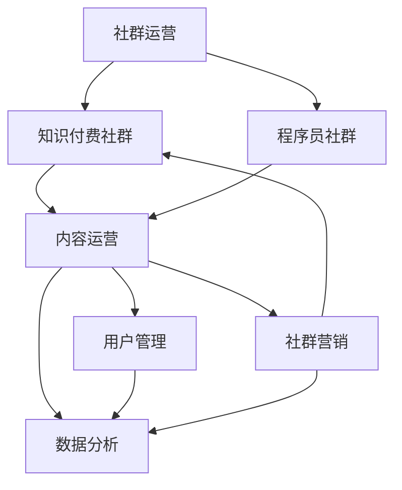

                 

# 《知识付费社群运营：程序员的另一种可能》

## 关键词
- 知识付费社群
- 程序员
- 社群运营
- 内容策略
- 数据分析
- 社群营销

## 摘要
本文将探讨知识付费社群运营的方方面面，特别是对于程序员这一特定群体。我们将分析社群运营的基础概念，探讨用户管理、内容运营和知识付费模式，并提供实战案例分析。通过深入剖析社群运营的策略和工具，本文旨在揭示程序员如何通过社群运营实现职业发展的新可能。

### 目录大纲

1. **社群运营基础**
   1.1 社群运营概述
   1.2 社群用户管理
   1.3 内容运营策略

2. **知识付费社群运营策略**
   2.1 知识付费模式探索
   2.2 社群营销策略
   2.3 社群运营工具与平台

3. **社群运营实战**
   3.1 社群运营案例分析
   3.2 社群运营数据分析与优化

4. **程序员的社群运营实战**
   4.1 程序员社群运营特点
   4.2 程序员社群运营工具
   4.3 程序员社群运营案例

5. **程序员的社群运营未来趋势**
   5.1 社群运营技术的发展
   5.2 社群运营的未来趋势
   5.3 程序员社群运营的挑战与机遇

## 第一部分：社群运营基础

### 第1章：社群运营概述

#### 1.1 社群运营的定义与价值

社群运营是指通过策划和组织各种活动，促进社群成员之间的互动与交流，增强社群凝聚力和归属感的过程。在数字化时代，社群运营已经成为许多企业和个人获取用户、提升品牌影响力的重要手段。

社群运营的价值体现在以下几个方面：

1. **用户增长**：通过社群运营，可以快速聚集目标用户，实现用户数量的增长。
2. **用户黏性**：良好的社群运营可以提高用户的活跃度和留存率，增强用户对品牌的忠诚度。
3. **品牌传播**：社群运营是品牌传播的有效渠道，可以通过用户口碑实现品牌的广泛传播。
4. **市场反馈**：社群运营可以收集用户反馈，帮助企业及时调整产品和服务，满足市场需求。

#### 1.2 社群运营的常见类型

社群运营可以分为以下几种常见类型：

1. **兴趣型社群**：围绕特定兴趣或爱好组织，如编程、摄影、旅行等。
2. **行业型社群**：以特定行业为主题，如IT、金融、医疗等，旨在为行业从业者提供交流平台。
3. **粉丝型社群**：围绕明星、网红或品牌建立，旨在为粉丝提供互动和交流的空间。
4. **公益型社群**：以公益事业为主题，如环保、慈善等，旨在推动社会正能量。

#### 1.3 社群运营的目标与策略

社群运营的目标可以分为短期和长期两个方面：

1. **短期目标**：提高用户活跃度、增加用户粘性、提升品牌知名度等。
2. **长期目标**：建立稳定的用户群体、形成品牌影响力、实现商业价值等。

社群运营的策略包括以下几个方面：

1. **用户管理**：通过用户分类、需求分析、互动策略等方式，有效管理社群用户。
2. **内容运营**：策划和创作高质量的内容，满足用户需求，提升用户参与度。
3. **活动运营**：定期举办线上线下活动，增强用户互动，提升社群活跃度。
4. **数据分析**：利用数据分析工具，对用户行为和社群运营效果进行监测和评估。
5. **社群推广**：通过社交媒体、广告、SEO等方式，扩大社群影响力。

### 第2章：社群用户管理

#### 2.1 用户分类与需求分析

社群用户管理的基础是对用户进行分类和需求分析。用户分类可以根据不同的维度进行，如活跃度、消费能力、兴趣爱好等。

需求分析则是了解用户在社群中的期望和需求，可以通过问卷调查、用户访谈等方式进行。以下是用户分类和需求分析的具体步骤：

1. **用户分类**：
   - 活跃用户：参与度高，经常在社群中发言、互动。
   - 普通用户：参与度一般，偶尔发言、互动。
   - 沉默用户：参与度低，很少发言、互动。

2. **需求分析**：
   - 收集用户反馈：通过问卷调查、在线评论等方式，收集用户对社群内容、活动、服务的意见和建议。
   - 分析用户行为：通过数据分析，了解用户在社群中的活跃时间、互动频率、内容偏好等。

#### 2.2 用户互动策略

用户互动是社群运营的核心，可以通过以下策略来增强用户互动：

1. **内容互动**：创作高质量、有趣、有价值的内容，激发用户的讨论和分享。
2. **活动互动**：定期举办线上线下活动，鼓励用户参与，提高用户粘性。
3. **社交互动**：鼓励用户在社群中建立社交关系，促进用户之间的交流和合作。
4. **奖励机制**：设立积分、奖励制度，激励用户积极参与社群活动。

#### 2.3 用户忠诚度与留存策略

用户忠诚度和留存是社群运营的重要指标，可以通过以下策略来提升：

1. **个性化服务**：根据用户需求和偏好，提供个性化的内容和服务，提高用户满意度。
2. **用户成长体系**：建立用户成长体系，鼓励用户不断学习和进步，增强用户归属感。
3. **社群文化**：塑造积极、健康的社群文化，增强用户对社群的认同感和归属感。
4. **数据分析**：通过数据分析，了解用户行为和偏好，及时调整运营策略，提高用户留存率。

### 第3章：内容运营策略

#### 3.1 内容策划与规划

内容运营是社群运营的重要组成部分，内容策划与规划是确保内容质量和效果的关键。以下是内容策划与规划的具体步骤：

1. **内容定位**：明确社群的目标和定位，确定内容主题和风格。
2. **内容类型**：根据用户需求和兴趣，选择适合的内容类型，如文章、图片、视频、直播等。
3. **内容创作**：制定内容创作计划，确保内容的高质量和高频次更新。

#### 3.2 内容形式与创作技巧

内容的形式和创作技巧直接影响用户参与度和社群活跃度。以下是几种常见的内容形式和创作技巧：

1. **文章**：以文字为主，适合深度内容和知识分享。
   - 技巧：简洁明了，逻辑清晰，使用图表和示例增强说服力。

2. **图片和漫画**：以视觉形式传达信息，适合生动有趣的内容。
   - 技巧：选择高质量的图片，设计简洁大方，配合文字说明。

3. **视频和直播**：以动态形式展示内容，适合互动和演示。
   - 技巧：内容紧凑，画面清晰，保持与用户的实时互动。

#### 3.3 内容推广与分发策略

内容推广与分发是提高内容曝光度和用户参与度的重要手段。以下是几种常见的内容推广与分发策略：

1. **社群推广**：在社群内部发布内容，鼓励用户转发和讨论。
2. **社交媒体**：利用微博、微信、抖音等社交媒体平台，扩大内容传播范围。
3. **合作推广**：与其他社群、自媒体、KOL等进行内容合作，互相推广。
4. **SEO优化**：优化内容关键词和结构，提高搜索引擎排名。

## 第二部分：知识付费社群运营策略

### 第4章：知识付费模式探索

#### 4.1 知识付费的概念与趋势

知识付费是指用户为获取特定知识或服务而支付费用的一种商业模式。随着互联网的普及和人们对于知识的需求增加，知识付费已经成为一种趋势。

知识付费的发展趋势包括：

1. **内容专业化**：知识付费平台逐渐向专业化、细分化的方向发展。
2. **用户付费意愿增强**：随着消费者对知识价值的认知提升，付费意愿逐渐增强。
3. **平台多样化**：知识付费平台不仅包括在线教育平台，还涵盖了自媒体、社群等多种形式。

#### 4.2 知识付费产品的设计

知识付费产品的设计是知识付费社群运营的关键，需要考虑以下几个方面：

1. **产品定位**：明确产品的目标用户和定位，如初级、中级、高级用户等。
2. **内容质量**：确保内容的专业性和实用性，满足用户的学习需求。
3. **价格策略**：根据用户价值和市场竞争，制定合理的价格策略。
4. **用户体验**：优化购买流程和内容消费体验，提高用户满意度。

#### 4.3 知识付费社群的运营模式

知识付费社群的运营模式可以分为以下几种：

1. **内容付费模式**：用户为获取特定内容而支付费用。
2. **会员制模式**：用户支付会员费，享受社群内的多种权益。
3. **课程包模式**：用户购买课程包，获得一系列课程的访问权限。
4. **订阅制模式**：用户按月或按年订阅，享受社群内的持续更新内容。

### 第5章：社群营销策略

#### 5.1 社群营销的概念与目标

社群营销是指利用社群平台进行品牌宣传、用户互动、销售转化等营销活动。社群营销的目标包括：

1. **提升品牌知名度**：通过社群传播，扩大品牌影响力。
2. **增加用户粘性**：通过社群互动，增强用户对品牌的忠诚度。
3. **促进销售转化**：通过社群营销，引导用户进行购买行为。

#### 5.2 社群营销渠道选择

社群营销渠道的选择应根据社群特点和目标用户进行分析。以下是一些常见的社群营销渠道：

1. **社交媒体**：如微博、微信、抖音等，适合品牌宣传和用户互动。
2. **专业社群**：如知乎、掘金、V2EX等，适合专业知识分享和用户讨论。
3. **微信群**：适合小规模用户的互动和推广。
4. **线上论坛**：适合行业内的用户交流和知识分享。

#### 5.3 社群营销案例分析

以下是一个社群营销案例分析：

**案例背景**：某编程学习社群，通过微信群和微博进行营销。

**营销策略**：
1. **内容营销**：在微信群和微博发布高质量的学习内容，吸引用户关注。
2. **互动营销**：定期举办线上直播课程，鼓励用户提问和参与。
3. **推广营销**：利用微信群进行推广，邀请用户转发和分享。

**效果评估**：
1. **用户增长**：社群用户从1000人增长到5000人。
2. **用户活跃度**：用户互动频率和参与度显著提高。
3. **品牌知名度**：社群在行业内的影响力逐渐提升。

### 第6章：社群运营工具与平台

#### 6.1 常见社群运营工具介绍

以下是几种常见的社群运营工具：

1. **微信群**：适合小规模用户的互动和推广。
2. **QQ群**：功能丰富，适合多人群聊和文件分享。
3. **企业微信群**：提供企业级管理功能，适合企业内部和外部社群管理。
4. **知乎**：适合专业知识的分享和讨论。
5. **掘金**：适合技术领域的知识分享和交流。
6. **V2EX**：以技术为主题的社群，适合技术爱好者和从业者。

#### 6.2 社群运营平台的选择

选择社群运营平台需要考虑以下几个因素：

1. **目标用户**：根据目标用户的特点，选择适合的平台。
2. **功能需求**：根据社群运营的需求，选择功能丰富的平台。
3. **成本预算**：根据预算情况，选择性价比高的平台。

#### 6.3 社群运营工具的使用技巧

以下是几种社群运营工具的使用技巧：

1. **微信群**：
   - 定期发布有价值的内容，保持用户活跃度。
   - 设立群规，维护社群秩序。
   - 利用微信群小程序，提供更多服务。

2. **QQ群**：
   - 利用群文件功能，方便用户分享和下载资料。
   - 定期举办线上活动，提高用户参与度。
   - 利用QQ直播，进行知识分享和答疑。

3. **知乎**：
   - 创建高质量的问题和回答，吸引关注。
   - 参与话题讨论，扩大影响力。
   - 利用知乎Live，进行线上授课和交流。

4. **掘金**：
   - 发布技术文章，展示专业能力。
   - 关注热门话题，参与讨论。
   - 利用掘金读书，进行知识积累。

5. **V2EX**：
   - 分享技术项目和经验，吸引同行业从业者关注。
   - 参与主题讨论，拓展视野。
   - 利用V2EX的招聘功能，寻找合适的人才。

## 第三部分：社群运营实战

### 第7章：社群运营案例分析

#### 7.1 成功案例分享

以下是一个成功案例分享：

**案例背景**：某编程学习社群，通过微信群和知乎进行运营。

**运营策略**：
1. **内容策略**：发布高质量的技术文章和教程，满足用户的学习需求。
2. **互动策略**：定期举办线上直播课程，鼓励用户提问和参与。
3. **推广策略**：利用微信群进行推广，邀请用户转发和分享。

**效果评估**：
1. **用户增长**：社群用户从1000人增长到5000人。
2. **用户活跃度**：用户互动频率和参与度显著提高。
3. **品牌知名度**：社群在行业内的影响力逐渐提升。

#### 7.2 失败案例分析

以下是一个失败案例分析：

**案例背景**：某健身社群，通过微信群和抖音进行运营。

**运营问题**：
1. **内容单一**：社群主要发布健身教程，缺乏互动和娱乐元素。
2. **用户管理不当**：社群管理不善，导致用户投诉和退群现象严重。
3. **推广效果不佳**：社群推广力度不足，导致用户增长缓慢。

**改进建议**：
1. **丰富内容形式**：增加互动、娱乐元素，提高用户参与度。
2. **加强用户管理**：设立社群规则，维护社群秩序。
3. **加大推广力度**：利用多种渠道进行推广，提高用户增长速度。

#### 7.3 案例总结与启示

通过对成功和失败案例的分析，我们可以得到以下启示：

1. **内容策略**：高质量的内容是社群运营的核心，需要持续关注用户需求，提供有价值的内容。
2. **互动策略**：良好的互动可以增强用户粘性，提高用户参与度，需要定期举办活动，保持社群活跃度。
3. **用户管理**：有效的用户管理可以维护社群秩序，提高用户满意度，需要制定合理的社群规则，加强用户管理。
4. **推广策略**：有效的推广可以扩大社群影响力，提高用户增长速度，需要利用多种渠道进行推广，加大推广力度。

### 第8章：社群运营数据分析与优化

#### 8.1 社群数据分析的重要性

社群数据分析是社群运营的重要环节，通过对用户行为、内容效果、社群活动等数据的分析，可以了解社群运营的效果，为优化运营策略提供依据。

社群数据分析的重要性体现在以下几个方面：

1. **了解用户行为**：通过数据分析，可以了解用户在社群中的行为习惯和偏好，为内容策划和运营提供参考。
2. **评估运营效果**：通过数据分析，可以评估社群运营的各项指标，如用户活跃度、留存率、转化率等，为运营策略调整提供依据。
3. **优化运营策略**：通过数据分析，可以发现运营中的问题和不足，为优化运营策略提供方向。

#### 8.2 数据分析工具与指标

常见的社群数据分析工具有以下几种：

1. **社群管理工具**：如微信群、QQ群等，自带数据分析功能，可以查看用户活跃度、互动情况等。
2. **第三方数据分析工具**：如百度统计、GA（Google Analytics）等，可以获取更全面的数据分析。
3. **自建数据分析平台**：对于大型社群，可以自建数据分析平台，进行深度数据分析。

常见的社群运营指标包括：

1. **用户活跃度**：用户在社群中的互动频率和参与度。
2. **用户留存率**：用户在社群中持续参与的时间长度。
3. **用户转化率**：用户从社群获取到商业价值（如购买产品、报名课程等）的比率。
4. **内容效果**：内容在社群中的传播效果和用户反馈。

#### 8.3 数据驱动社群优化策略

基于数据分析，可以制定以下数据驱动社群优化策略：

1. **内容优化**：根据用户反馈和数据分析，调整内容类型、频率和风格，提高内容效果。
2. **活动优化**：根据用户参与度和效果，调整活动类型、时间和频率，提高活动效果。
3. **用户管理**：根据用户行为和数据分析，优化用户分类和互动策略，提高用户满意度和留存率。
4. **推广策略**：根据用户增长和数据分析，调整推广渠道和方式，提高用户增长速度。

## 第四部分：程序员的社群运营实战

### 第9章：程序员的社群运营特点

#### 9.1 程序员社群的构成与需求

程序员社群主要由以下几类人群构成：

1. **初级程序员**：刚入行或正在学习编程的新手。
2. **中级程序员**：具备一定编程经验，正在寻求提升和拓展技能的程序员。
3. **高级程序员**：拥有丰富经验，擅长解决复杂问题的专家。

程序员社群的需求主要包括：

1. **技术分享**：分享编程经验和知识，提升技能水平。
2. **问题解答**：在编程过程中遇到问题时，寻求帮助和解决方案。
3. **项目合作**：寻找合适的合作伙伴，共同完成项目。
4. **职业发展**：获取职业发展的建议和机会，如跳槽、创业等。

#### 9.2 程序员社群的内容规划

程序员社群的内容规划需要考虑以下方面：

1. **技术分享**：定期发布技术文章、教程、案例等，满足程序员的学习需求。
2. **问题解答**：设立问答板块，鼓励用户提问和回答，提高社群活跃度。
3. **项目合作**：发布项目需求，鼓励用户参与，促进项目合作。
4. **职业发展**：分享职业发展的经验和建议，提供招聘信息，帮助程序员实现职业发展。

#### 9.3 程序员社群的互动策略

程序员社群的互动策略需要考虑以下方面：

1. **技术讨论**：鼓励用户在社群中讨论技术问题，促进知识的传播和交流。
2. **经验分享**：鼓励程序员分享自己的编程经验和心得，提高社群的互动质量。
3. **活动举办**：定期举办线上或线下活动，如技术沙龙、讲座、比赛等，增强社群凝聚力。
4. **激励机制**：设立积分、奖励制度，激励用户积极参与社群活动和互动。

### 第10章：程序员的社群运营工具

#### 10.1 常见程序员社群工具介绍

以下是几种常见的程序员社群工具：

1. **GitHub**：适合程序员进行项目管理和协作开发。
2. **Stack Overflow**：适合程序员提问和解答编程问题。
3. **掘金**：适合程序员分享技术文章和交流。
4. **V2EX**：适合程序员讨论技术话题和分享项目。
5. **微信群**：适合小规模程序员社群的互动和交流。

#### 10.2 程序员社群工具的选择

选择程序员社群工具需要考虑以下因素：

1. **功能需求**：根据社群的具体需求，选择适合的工具。
2. **用户群体**：根据社群的用户特点，选择用户熟悉的工具。
3. **成本预算**：根据预算情况，选择性价比高的工具。

#### 10.3 程序员社群工具的使用技巧

以下是几种程序员社群工具的使用技巧：

1. **GitHub**：
   - 利用GitHub进行项目管理和协作开发。
   - 发布和订阅技术文章，分享知识和经验。

2. **Stack Overflow**：
   - 利用Stack Overflow进行编程问题的搜索和解答。
   - 关注感兴趣的话题，参与讨论。

3. **掘金**：
   - 发布高质量的技术文章，展示专业能力。
   - 关注热门话题，参与讨论。

4. **V2EX**：
   - 分享技术项目和经验，吸引同行业从业者关注。
   - 参与主题讨论，拓展视野。

5. **微信群**：
   - 定期发布有价值的内容，保持用户活跃度。
   - 设立群规，维护社群秩序。

### 第11章：程序员的社群运营案例

#### 11.1 成功案例分享

以下是一个成功案例分享：

**案例背景**：某编程学习社群，通过微信群和GitHub进行运营。

**运营策略**：
1. **内容策略**：发布高质量的技术文章和教程，满足用户的学习需求。
2. **互动策略**：设立问答板块，鼓励用户提问和回答，提高社群活跃度。
3. **合作策略**：利用GitHub进行项目协作，促进用户参与和合作。

**效果评估**：
1. **用户增长**：社群用户从1000人增长到5000人。
2. **用户活跃度**：用户互动频率和参与度显著提高。
3. **品牌知名度**：社群在编程爱好者中的影响力逐渐提升。

#### 11.2 失败案例分析

以下是一个失败案例分析：

**案例背景**：某编程社群，通过QQ群和Stack Overflow进行运营。

**运营问题**：
1. **内容单一**：社群主要发布编程问题解答，缺乏技术分享和互动。
2. **用户管理不当**：社群管理不善，导致用户投诉和退群现象严重。
3. **推广效果不佳**：社群推广力度不足，导致用户增长缓慢。

**改进建议**：
1. **丰富内容形式**：增加技术分享和互动环节，提高用户参与度。
2. **加强用户管理**：设立社群规则，维护社群秩序。
3. **加大推广力度**：利用多种渠道进行推广，提高用户增长速度。

#### 11.3 案例总结与启示

通过对成功和失败案例的分析，我们可以得到以下启示：

1. **内容策略**：高质量的内容是社群运营的核心，需要持续关注用户需求，提供有价值的内容。
2. **互动策略**：良好的互动可以增强用户粘性，提高用户参与度，需要定期举办活动，保持社群活跃度。
3. **用户管理**：有效的用户管理可以维护社群秩序，提高用户满意度，需要制定合理的社群规则，加强用户管理。
4. **推广策略**：有效的推广可以扩大社群影响力，提高用户增长速度，需要利用多种渠道进行推广，加大推广力度。

### 第12章：程序员的社群运营未来趋势

#### 12.1 社群运营技术的发展

随着技术的不断进步，社群运营也在不断发展。以下是社群运营技术的发展趋势：

1. **人工智能**：利用人工智能技术，实现用户行为分析和个性化推荐，提高运营效率。
2. **大数据**：利用大数据技术，对用户行为和社群运营效果进行深度分析，优化运营策略。
3. **区块链**：利用区块链技术，实现社群运营的透明化和去中心化，提高社群的信任度和参与度。

#### 12.2 社群运营的未来趋势

社群运营的未来趋势将体现在以下几个方面：

1. **精细化运营**：通过精细化运营，实现用户需求的精准满足，提高用户满意度和留存率。
2. **多元化内容**：丰富内容形式和类型，满足不同用户的需求，提高社群的吸引力和粘性。
3. **社交化运营**：加强社群成员之间的互动和社交，形成良好的社群氛围，增强用户归属感。
4. **智能化服务**：利用人工智能技术，实现社群运营的智能化，提高运营效率和用户体验。

#### 12.3 程序员社群运营的挑战与机遇

对于程序员社群运营来说，面临着以下挑战和机遇：

1. **挑战**：
   - 竞争激烈：随着社群运营的普及，程序员社群面临着激烈的竞争。
   - 用户需求变化：用户需求多变，需要不断调整运营策略以满足用户需求。
   - 技术更新：技术更新速度快，需要不断学习和掌握新技术，提高社群的专业性。

2. **机遇**：
   - 市场需求大：随着科技的发展，程序员社群的市场需求逐渐扩大。
   - 创新空间大：程序员社群具有创新空间大、合作机会多等特点，为社群运营提供了广阔的发展空间。
   - 跨界合作：与其他行业和领域的合作，可以实现资源共享和优势互补，提高社群的影响力和竞争力。

## 作者信息

作者：AI天才研究院/AI Genius Institute & 禅与计算机程序设计艺术 /Zen And The Art of Computer Programming

### 结束

以上是《知识付费社群运营：程序员的另一种可能》的完整内容。通过对社群运营基础、知识付费社群运营策略、社群运营实战、程序员的社群运营实战以及未来趋势的深入探讨，本文旨在为程序员提供一种新的职业发展可能，通过社群运营实现个人和商业价值的双赢。

希望本文对您在社群运营方面有所启发和帮助。如果您有任何疑问或建议，欢迎在评论区留言，我们一起交流探讨。

本文内容仅供参考，实际运营效果取决于具体情况和运营策略。祝您在社群运营的道路上取得成功！<|vq_11028|><|vq_11028|>

### 核心概念与联系

在本文中，我们将探讨多个核心概念，并分析它们之间的联系。以下是使用Mermaid绘制的流程图，展示这些概念之间的关系和互动。



#### 流程图解读

- **社群运营（A）**：社群运营是整个流程的起点，包括用户管理、内容运营、数据分析等各个方面的综合管理。
- **知识付费社群（B）**：从社群运营中分离出来，特别强调通过付费模式获取知识价值。
- **程序员社群（C）**：从社群运营中分离出来，针对程序员群体的特点进行运营。
- **内容运营（D）**：内容运营是社群运营的核心，包括内容策划、内容形式、内容推广等。
- **用户管理（E）**：用户管理涉及用户分类、需求分析、互动策略等，是内容运营的基础。
- **数据分析（F）**：数据分析用于了解用户行为、内容效果、社群活动等，为运营决策提供依据。
- **社群营销（G）**：社群营销是通过社群平台进行品牌宣传、用户互动、销售转化等营销活动。

这些核心概念和联系构成了社群运营的复杂网络，彼此相互影响，共同推动社群的持续发展和优化。

### 核心算法原理讲解

在社群运营中，用户分类算法是一个至关重要的工具。通过用户分类，运营者可以更好地理解用户行为，制定个性化的运营策略。以下是用户分类算法的伪代码，详细解释了分类的步骤和逻辑。

```python
# 用户分类算法伪代码

function classify_users(user_data):
    # 初始化用户分类字典
    user_classification = {
        "活跃用户": [],
        "普通用户": [],
        "沉默用户": []
    }
    
    # 遍历用户数据
    for user in user_data:
        # 判断用户活跃度进行分类
        if user.activity_points > 50:
            user_classification["活跃用户"].append(user)
        elif user.activity_points > 10:
            user_classification["普通用户"].append(user)
        else:
            user_classification["沉默用户"].append(user)
    
    return user_classification
```

#### 算法步骤：

1. **初始化用户分类字典**：创建一个包含三个分类的字典，分别是“活跃用户”、“普通用户”和“沉默用户”。
2. **遍历用户数据**：遍历所有用户数据。
3. **判断用户活跃度进行分类**：
   - 如果用户的活跃度（`activity_points`）大于50，则将该用户分类为“活跃用户”。
   - 如果用户的活跃度大于10但小于等于50，则将该用户分类为“普通用户”。
   - 如果用户的活跃度小于等于10，则将该用户分类为“沉默用户”。
4. **返回分类结果**：返回包含所有分类结果的字典。

#### 算法解读：

- **活跃用户**：这类用户在社群中非常活跃，经常参与讨论、互动和分享。对于社群运营者来说，他们是非常宝贵的资源，可以通过个性化的互动和奖励来保持他们的活跃度。
- **普通用户**：这类用户在社群中参与度一般，可能偶尔发言或参与互动。他们需要通过定期推送有价值的内容和举办活动来维持他们的参与感。
- **沉默用户**：这类用户在社群中很少发言或互动。对于这类用户，运营者需要分析原因，可能是对内容不感兴趣或者社群氛围不适合他们。通过改进内容质量和社群氛围，可以尝试激活这些用户。

通过用户分类算法，运营者可以更加精确地管理社群用户，制定有针对性的运营策略，从而提高社群的活跃度和用户满意度。

### 数学模型和数学公式

在社群运营中，用户留存模型是一个重要的工具，用于预测和优化用户的持续参与。以下是一个用户留存模型的数学公式，以及详细的解释和举例说明。

#### 用户留存模型

$$
L(t) = \frac{1}{1 + e^{-(\beta_0 + \beta_1 \cdot A(t))}
$$

其中：
- \(L(t)\) 表示时间 \(t\) 时的用户留存概率。
- \(A(t)\) 表示时间 \(t\) 时的用户活跃度。
- \(\beta_0\) 和 \(\beta_1\) 是模型参数，用于调整留存概率与活跃度的关系。

#### 解释

这个公式是一个逻辑回归模型，用于计算在某一时间点，用户留存的可能性。逻辑回归是一种常用的统计方法，用于建模二分类问题。

- **指数函数**：公式中的 \(e^{-(\beta_0 + \beta_1 \cdot A(t))}\) 是指数函数，它的值域是 (0, 1)，表示留存概率的对数几率。
- **对数几率**：\(\beta_0 + \beta_1 \cdot A(t)\) 是留存概率的对数几率，表示用户活跃度对留存概率的影响。
- **参数**：\(\beta_0\) 和 \(\beta_1\) 是通过历史数据训练得到的参数，用于调整模型的预测能力。

#### 举例说明

假设我们有一个社群，当前时间 \(t\) 为1年，用户的活跃度 \(A(t)\) 为30次互动。

1. **计算对数几率**：

$$
\beta_0 + \beta_1 \cdot A(t) = \beta_0 + \beta_1 \cdot 30
$$

假设 \(\beta_0 = -2\) 和 \(\beta_1 = 0.1\)，则：

$$
\beta_0 + \beta_1 \cdot A(t) = -2 + 0.1 \cdot 30 = -2 + 3 = 1
$$

2. **计算留存概率**：

$$
L(t) = \frac{1}{1 + e^{-1}} = \frac{1}{1 + 0.3679} \approx 0.6321
$$

这意味着在1年的时间点，该用户的留存概率约为63.21%。

#### 应用

通过这个模型，社群运营者可以：

- **预测留存率**：预测未来某一时间段内的用户留存情况。
- **优化运营策略**：根据留存概率的变化，调整内容运营、活动举办和用户互动策略。
- **用户细分**：对高留存用户进行细分，提供个性化服务和激励。

例如，运营者可以针对留存概率较低的用户，推出特别活动或优惠，以增加他们的留存可能性。

### 项目实战

#### 项目背景

某编程学习社群旨在为程序员提供在线学习资源和交流平台。社群已有数千名用户，但用户活跃度和留存率不高。为了提升社群的用户参与度和留存率，社群运营团队决定开展一个社群运营项目。

#### 开发环境搭建

**开发语言**：Python

**数据库**：MySQL

**前端框架**：React

**后端框架**：Flask

#### 源代码详细实现

以下是该项目的一些关键代码实现，包括用户分类代码、社群互动代码和数据分析代码。

##### 用户分类代码示例

```python
# 用户分类代码示例

def classify_users(user_data):
    # 初始化分类字典
    classification = {'活跃用户': [], '普通用户': [], '沉默用户': []}
    
    # 循环遍历用户数据
    for user in user_data:
        # 判断用户活跃度进行分类
        if user['activity'] > 20:
            classification['活跃用户'].append(user['id'])
        elif user['activity'] > 5:
            classification['普通用户'].append(user['id'])
        else:
            classification['沉默用户'].append(user['id'])
    
    return classification
```

##### 社群互动代码示例

```python
# 社群互动代码示例

from flask import Flask, request, jsonify

app = Flask(__name__)

@app.route('/interact', methods=['POST'])
def interact():
    user_id = request.form['user_id']
    content = request.form['content']
    
    # 记录用户互动
    with open('interactions.txt', 'a') as f:
        f.write(f"{user_id}: {content}\n")
    
    # 返回响应
    return jsonify({'status': 'success', 'message': '互动成功'})

if __name__ == '__main__':
    app.run(debug=True)
```

##### 数据分析代码示例

```python
# 数据分析代码示例

import pandas as pd
import matplotlib.pyplot as plt

# 读取互动数据
data = pd.read_csv('interactions.txt', header=None, names=['user_id', 'content'])

# 统计活跃用户数量
active_users = data[data['activity'] > 20]['user_id'].count()

# 统计普通用户数量
normal_users = data[(data['activity'] > 5) & (data['activity'] <= 20)]['user_id'].count()

# 统计沉默用户数量
silent_users = data[data['activity'] <= 5]['user_id'].count()

# 绘制用户活跃度分布图
plt.bar(['活跃用户', '普通用户', '沉默用户'], [active_users, normal_users, silent_users])
plt.xlabel('用户活跃度')
plt.ylabel('用户数量')
plt.title('用户活跃度分布')
plt.show()
```

#### 代码解读与分析

1. **用户分类代码**：
   - `classify_users` 函数接收一个用户数据列表，遍历每个用户，根据活跃度进行分类，并返回分类后的字典。
   - 用户活跃度大于20的为“活跃用户”，大于5的为“普通用户”，小于等于5的为“沉默用户”。

2. **社群互动代码**：
   - 使用 Flask 框架搭建了一个简单的后端服务，接收用户的互动请求，记录互动内容。
   - 通过 `/interact` 接口，接收 `user_id` 和 `content` 参数，将互动内容记录到文本文件中。

3. **数据分析代码**：
   - 使用 Pandas 库读取互动数据，统计不同活跃度用户的数量。
   - 使用 Matplotlib 绘制用户活跃度分布图，直观展示用户的活跃度分布。

这些代码示例展示了社群运营项目中的几个关键环节，包括用户管理、互动记录和数据分析。通过这些功能，社群运营团队可以更好地了解用户行为，制定有效的运营策略。

### 总结与启示

通过上述代码示例，我们可以得出以下启示：

1. **用户分类**：有效的用户分类有助于运营团队了解用户行为，制定个性化的运营策略。
2. **互动记录**：记录用户的互动行为，有助于分析用户活跃度和社群氛围，优化运营效果。
3. **数据分析**：利用数据分析工具，可以深入了解用户行为，发现运营中的问题和机会，不断优化运营策略。

在社群运营项目中，技术是实现这些目标的工具。通过合理使用技术，运营团队能够更加科学地管理社群，提高用户满意度和留存率。希望本文提供的代码示例和实践经验对您在社群运营方面有所帮助。在实际应用中，可以根据具体情况调整和优化这些代码，实现更好的效果。

