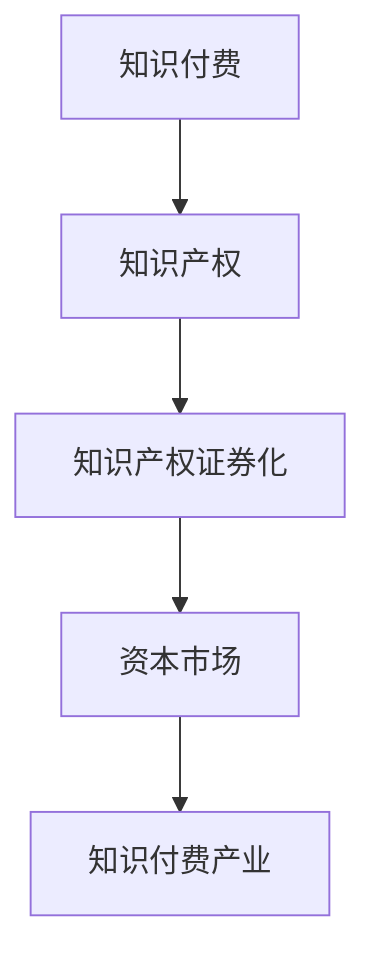

                 

# 知识付费要探索知识产权证券化的路径

## 关键词
知识付费、知识产权、证券化、资本运作、知识产权评估、风险控制

## 摘要
本文深入探讨了知识付费与知识产权证券化之间的关联，分析知识产权证券化的原理、操作流程及其在知识付费市场中的潜在应用。通过案例研究、挑战与机遇分析，本文提出了知识产权证券化的未来发展方向和具体政策建议，以期为知识付费产业提供一种全新的价值创造和资本运作模式。

## 目录大纲

### 第一部分：知识产权与知识付费概述

#### 第1章：知识产权基础

##### 1.1 知识产权的定义与特征

知识产权是指人们就其智力劳动成果所依法享有的专有权利，通常是国家赋予创造者对其智力成果在一定时期内享有的专有权或独占权。知识产权具有无形性、专有性和地域性的特征。

##### 1.2 知识产权的分类

知识产权主要包括专利权、商标权、著作权、商业秘密、地理标志等。

- **专利权**：是指对发明、实用新型和外观设计等智力成果的专有权利。
- **商标权**：是指对商标的独占使用权。
- **著作权**：是指对文学、艺术和科学作品的原创性表达所享有的专有权利。
- **商业秘密**：是指不为公众所知悉、能为权利人带来经济利益、具有实用性并经权利人采取保密措施的技术信息和经营信息。
- **地理标志**：是指标示某商品来源于某地区，该商品的特定质量、信誉或其他特征主要由该地区的自然因素或人文因素所决定的标志。

##### 1.3 知识产权的保护与法律法规

知识产权的保护主要通过法律、行政和司法途径实现。在全球范围内，各国均有相应的知识产权法律法规，如《专利法》、《商标法》、《著作权法》等。此外，国际条约如《伯尔尼公约》、《巴黎公约》等也为知识产权的国际保护提供了框架。

#### 第2章：知识付费的兴起与发展

##### 2.1 知识付费的概念与形式

知识付费是指用户为了获取知识、技能或经验而支付的费用。知识付费的形式多样，包括在线课程、付费专栏、专家咨询、技能认证等。

##### 2.2 知识付费的市场规模与趋势

随着互联网技术的发展，知识付费市场呈现快速增长态势。根据相关数据，全球知识付费市场规模逐年上升，预计未来还将继续保持增长。

##### 2.3 知识付费的主要参与者

知识付费市场的主要参与者包括内容提供方、平台运营商和用户。内容提供方包括专家、学者、企业等，平台运营商包括在线教育平台、内容分发平台等。

### 第二部分：知识产权证券化的原理与实践

#### 第3章：知识产权证券化的概念与原理

##### 3.1 知识产权证券化的定义

知识产权证券化是指将知识产权作为基础资产，通过结构化设计转化为可在资本市场上交易的证券的过程。

##### 3.2 知识产权证券化的基础资产

知识产权证券化的基础资产主要包括专利、商标、著作权等。

##### 3.3 知识产权证券化的市场机制

知识产权证券化通过资产评估、信用增级、风险控制等环节，将知识产权转化为证券，实现知识产权的价值变现。

#### 第4章：知识产权证券化的操作流程

##### 4.1 知识产权评估与筛选

知识产权评估是指对知识产权价值进行量化分析的过程。评估结果直接影响证券的价值和市场接受度。

##### 4.2 信用增级与风险控制

信用增级和风险控制是知识产权证券化的重要环节，通过多种方式提高证券的信用等级和风险抵御能力。

##### 4.3 证券发行与交易

证券发行是指将知识产权证券化产品推向市场的过程。交易则涉及投资者的参与和证券的流通。

#### 第5章：知识产权证券化案例研究

##### 5.1 案例一：知识产权证券化项目A

案例一介绍了某知名在线教育平台如何通过知识产权证券化实现知识付费产品的资本化运作。

##### 5.2 案例二：知识产权证券化项目B

案例二分析了某大型科技公司如何将专利资产证券化，以提升公司价值和市场竞争力。

##### 5.3 案例三：知识产权证券化项目C

案例三探讨了一家初创企业如何利用知识产权证券化获取资金支持，实现快速发展。

### 第三部分：知识产权证券化的挑战与机遇

#### 第6章：知识产权证券化的挑战

##### 6.1 法律与监管挑战

知识产权证券化涉及多个法律法规的适用，监管政策的不确定性对市场发展构成挑战。

##### 6.2 风险管理挑战

知识产权证券化产品面临知识产权价值评估不准确、市场波动等风险。

##### 6.3 技术与运营挑战

知识产权证券化技术实现和运营管理复杂，对技术能力和管理水平有较高要求。

#### 第7章：知识产权证券化的机遇

##### 7.1 市场需求与投资机会

知识付费市场的快速增长为知识产权证券化提供了广阔的市场需求。

##### 7.2 促进知识产权流转与保护

知识产权证券化有助于提升知识产权的流通性和保护力度。

##### 7.3 提升知识付费产业价值链

知识产权证券化可以提升知识付费产业的资本运作效率和价值创造能力。

### 第四部分：知识产权证券化的未来展望

#### 第8章：知识产权证券化的发展趋势

##### 8.1 技术进步与市场拓展

随着区块链、人工智能等技术的应用，知识产权证券化将迎来新的发展机遇。

##### 8.2 国际合作与竞争格局

知识产权证券化将在全球范围内展开合作与竞争，形成国际市场格局。

##### 8.3 知识产权证券化在中国的发展前景

中国正逐步完善知识产权法律体系，知识产权证券化在中国具有广阔的发展前景。

#### 第9章：知识产权证券化的政策建议

##### 9.1 完善法律法规体系

建立健全知识产权证券化的法律法规体系，为市场发展提供法治保障。

##### 9.2 加强监管与风险控制

加强对知识产权证券化的监管，建立健全风险控制机制。

##### 9.3 推动知识产权与资本市场的深度融合

鼓励知识产权与资本市场的深度融合，促进知识付费产业创新发展。

### 附录

#### 附录A：知识产权证券化术语解释

- **知识产权证券化**：将知识产权作为基础资产，通过结构化设计转化为可在资本市场上交易的证券的过程。
- **基础资产**：指作为证券化对象的知识产权资产，如专利、商标、著作权等。
- **信用增级**：通过信用提升手段，提高证券化产品的信用等级和投资者信心。
- **风险控制**：通过多种手段，降低证券化产品的风险，保障投资者的利益。

#### 附录B：知识产权证券化主要法律法规

- **《专利法》**：保护专利权的法律法规。
- **《商标法》**：保护商标权的法律法规。
- **《著作权法》**：保护著作权的法律法规。
- **《公司法》**：规范公司运作和股权交易的法律法规。

#### 附录C：知识付费与知识产权证券化关系Mermaid流程图


#### 附录D：知识产权证券化核心算法原理伪代码
```python
# 知识产权评估伪代码
def intellectual_property_evaluation(ip_asset):
    # 输入：知识产权资产
    # 输出：知识产权价值
    value = 0
    # 根据知识产权特点进行价值评估
    if "专利" in ip_asset:
        value += patent_value(ip_asset["专利"])
    if "版权" in ip_asset:
        value += copyright_value(ip_asset["版权"])
    return value

# 专利价值评估伪代码
def patent_value(patent_info):
    # 输入：专利信息
    # 输出：专利价值
    value = 0
    if "专利类型" in patent_info:
        if patent_info["专利类型"] == "发明专利":
            value += 50000
        elif patent_info["专利类型"] == "实用新型专利":
            value += 30000
        elif patent_info["专利类型"] == "外观设计专利":
            value += 10000
    return value

# 版权价值评估伪代码
def copyright_value(copyright_info):
    # 输入：版权信息
    # 输出：版权价值
    value = 0
    if "版权类型" in copyright_info:
        if copyright_info["版权类型"] == "文字作品":
            value += 5000
        elif copyright_info["版权类型"] == "音乐作品":
            value += 10000
        elif copyright_info["版权类型"] == "美术作品":
            value += 8000
    return value
```

#### 附录E：数学模型和数学公式
```latex
% 知识产权价值评估的数学模型
$$ V = w_1 \cdot P_1 + w_2 \cdot P_2 $$
$$ w_1 + w_2 = 1 $$
$$ P_1 = \text{专利价值} $$
$$ P_2 = \text{版权价值} $$

% 其中，$w_1$ 和 $w_2$ 分别为专利和版权的权重，$P_1$ 和 $P_2$ 分别为专利和版权的价值。
```

#### 附录F：项目实战

- **代码实际案例和详细解释说明**：

  - 描述知识产权资产评估的代码实现，包括数据结构设计、数据处理和结果输出。

- **开发环境搭建**：

  - 描述搭建知识产权证券化项目的开发环境，包括开发工具、库和框架的安装和使用。

- **源代码详细实现和代码解读**：

  - 分析知识产权评估算法的实现细节，包括核心函数的定义、参数传递和数据结构的使用。

- **代码解读与分析**：

  - 分析知识产权评估算法的性能、效率和适用场景，并提出优化建议。

### 第一部分：知识产权与知识付费概述

#### 第1章：知识产权基础

知识产权是指人们就其智力劳动成果所依法享有的专有权利，通常是国家赋予创造者对其智力成果在一定时期内享有的专有权或独占权。知识产权具有无形性、专有性和地域性的特征。无形性是指知识产权的客体不是有形的物质，而是智力成果；专有性是指知识产权权利人对其智力成果享有独占的使用权；地域性是指知识产权受法律保护的范围一般局限于某一特定国家或地区。

知识产权主要包括专利权、商标权、著作权、商业秘密、地理标志等。这些权利分别代表了不同的智力成果类型和权益范畴。

- **专利权**：是指对发明、实用新型和外观设计等智力成果的专有权利。专利权的主要类型包括发明专利、实用新型专利和外观设计专利。发明专利是指对技术领域的创新发明所授予的专利权，实用新型专利是指对改进产品或方法的创新所授予的专利权，外观设计专利是指对产品外观的创新设计所授予的专利权。

- **商标权**：是指对商标的独占使用权。商标是企业、个人或其他组织在商业活动中使用的标志，用于区分商品或服务的来源。商标权具有显著性和识别性，可以帮助消费者识别和选择特定的商品或服务。

- **著作权**：是指对文学、艺术和科学作品的原创性表达所享有的专有权利。著作权保护的对象包括文字作品、音乐作品、戏剧作品、绘画作品等多种形式的作品。著作权赋予作者对其作品的复制、发行、表演、展示等权利。

- **商业秘密**：是指不为公众所知悉、能为权利人带来经济利益、具有实用性并经权利人采取保密措施的技术信息和经营信息。商业秘密是企业的重要资产，包括配方、工艺、客户名单、经营计划等。

- **地理标志**：是指标示某商品来源于某地区，该商品的特定质量、信誉或其他特征主要由该地区的自然因素或人文因素所决定的标志。地理标志有助于提高商品的附加值，保护消费者利益。

知识产权的保护主要通过法律、行政和司法途径实现。在全球范围内，各国均有相应的知识产权法律法规，如《专利法》、《商标法》、《著作权法》等。此外，国际条约如《伯尔尼公约》、《巴黎公约》等也为知识产权的国际保护提供了框架。

- **《专利法》**：是规范专利权授予、保护和管理的基本法律。它规定了专利申请的实质条件和程序，以及专利权的期限、终止和无效等。

- **《商标法》**：是规范商标权授予、保护和管理的基本法律。它规定了商标注册的条件、程序，以及商标权的期限、续展和禁止使用等。

- **《著作权法》**：是规范著作权授予、保护和管理的基本法律。它规定了著作权的保护范围、权利内容、侵权行为和法律责任等。

- **《商业秘密法》**：是规范商业秘密保护和管理的基本法律。它规定了商业秘密的定义、保护范围、保密义务和侵权责任等。

- **《地理标志法》**：是规范地理标志保护和管理的基本法律。它规定了地理标志的申请、注册、保护和管理等。

知识产权保护对于知识付费产业具有重要意义。首先，知识产权保护有助于激励创新，鼓励人们投入更多精力和资源进行智力成果的创造。其次，知识产权保护可以保障知识付费产品的价值实现，防止侵权行为对市场秩序造成破坏。最后，知识产权保护可以提升知识付费产业的市场竞争力，促进产业健康发展。

在知识付费市场中，知识产权保护的主要挑战包括知识产权侵权问题、知识产权价值评估问题等。知识产权侵权问题主要体现在未经授权的复制、传播、使用知识产权成果的行为。知识产权价值评估问题则涉及如何准确评估知识产权的价值，以便在知识付费市场中进行合理的定价和交易。

总之，知识产权是知识付费产业的重要基础和保障，只有通过有效的知识产权保护，才能确保知识付费产业的健康发展，为创新和经济发展提供强大动力。

#### 第2章：知识付费的兴起与发展

##### 2.1 知识付费的概念与形式

知识付费是指用户为了获取知识、技能或经验而支付的费用。知识付费的形式多样，包括在线课程、付费专栏、专家咨询、技能认证等。这些形式的出现，极大地满足了人们对于个性化、专业化和实用性的知识需求。

- **在线课程**：在线课程是知识付费的主要形式之一。用户可以通过在线平台购买课程，学习各种领域的知识。在线课程通常包括视频教程、文本资料、习题练习等多种教学资源，用户可以根据自己的学习进度和需求进行选择。

- **付费专栏**：付费专栏是另一种重要的知识付费形式。用户可以通过订阅付费专栏，获得专业领域专家或行业领袖的原创内容。这些内容通常包括深度分析、行业动态、实用技巧等，为用户提供有价值的信息。

- **专家咨询**：专家咨询是知识付费的一种高端形式。用户可以通过付费咨询专家，获得专业的建议和解决方案。这种形式主要适用于专业领域，如法律、医疗、财务等，用户可以通过与专家的沟通，解决实际问题。

- **技能认证**：技能认证是知识付费的一种成果形式。用户通过参加培训和考试，获得专业技能的认证证书。这种形式不仅有助于提升用户的职业素养，还可以为求职和职业发展提供有力支持。

##### 2.2 知识付费的市场规模与趋势

随着互联网技术的发展，知识付费市场呈现出快速增长的趋势。根据相关数据，全球知识付费市场规模逐年上升，预计未来还将继续保持增长。

- **全球市场**：根据统计，全球知识付费市场规模在2020年已经达到2500亿美元，预计到2025年将达到4000亿美元。其中，在线教育、在线知识服务、专家咨询等领域是主要增长点。

- **中国市场**：中国是全球最大的知识付费市场之一。随着互联网的普及和用户消费习惯的改变，知识付费市场在中国发展迅速。根据相关数据，2020年中国知识付费市场规模达到2000亿元人民币，预计到2025年将达到5000亿元人民币。

知识付费市场的快速增长主要受到以下因素的影响：

- **技术进步**：互联网技术的发展，尤其是移动互联网的普及，为知识付费提供了便捷的渠道和丰富的内容形式。用户可以通过手机、平板电脑等设备，随时随地获取所需的知识。

- **消费升级**：随着人们生活水平的提高，对于知识的需求也逐步升级。用户更加注重个性化、专业化和实用性的知识，这为知识付费市场提供了广阔的空间。

- **行业背景**：知识付费市场的兴起，也受到教育、医疗、金融等行业的背景影响。这些行业对专业知识和技能的需求较高，为知识付费提供了市场需求。

##### 2.3 知识付费的主要参与者

知识付费市场的主要参与者包括内容提供方、平台运营商和用户。

- **内容提供方**：内容提供方是知识付费的核心，包括专家、学者、专业机构等。他们通过创作和分享知识内容，为用户提供有价值的信息和服务。内容提供方可以通过知识付费获得收入，同时提升个人品牌和影响力。

- **平台运营商**：平台运营商是知识付费的中介，负责提供技术支持、内容分发和用户管理等服务。平台运营商通过收取佣金或广告收入等方式获得盈利。目前，国内外知名的在线教育平台、知识服务平台等都是知识付费市场的参与者。

- **用户**：用户是知识付费的消费者，他们通过付费购买知识内容，提升自己的知识水平和技能。用户的需求多样，包括学习新知识、提升专业技能、解决实际问题等。

知识付费市场的参与者共同构建了一个完整的价值生态。内容提供方通过创作和分享知识内容，满足用户的需求，获得收入和品牌提升；平台运营商通过提供技术和服务，连接内容提供方和用户，获得盈利；用户通过付费购买知识内容，实现自我提升和职业发展。

总之，知识付费市场正在快速发展，成为数字经济的重要组成部分。通过有效的知识付费模式，可以促进知识共享和传播，推动社会进步和经济发展。

### 第二部分：知识产权证券化的原理与实践

#### 第3章：知识产权证券化的概念与原理

##### 3.1 知识产权证券化的定义

知识产权证券化是指将知识产权作为基础资产，通过结构化设计转化为可在资本市场上交易的证券的过程。这一过程涉及到知识产权的评估、信用增级、风险控制等多个环节，旨在实现知识产权的价值变现，为投资者提供新的投资渠道。

知识产权证券化不同于传统的证券化过程，其核心在于将知识产权这一无形资产转化为具有流动性和可交易性的金融产品。通过知识产权证券化，企业可以将自身的知识产权转化为现金流，从而获得资金支持，进一步推动创新和发展。

##### 3.2 知识产权证券化的基础资产

知识产权证券化的基础资产主要包括专利、商标、著作权等知识产权类型。这些知识产权代表着企业的核心技术和商业价值，是知识产权证券化的重要支撑。

- **专利**：专利是知识产权证券化中最常见的资产类型。专利代表了一种技术创新，具有独特的市场价值。专利证券化可以为企业带来直接的经济收益，同时提高专利的流通性和保护力度。

- **商标**：商标是企业品牌的重要标志，具有很高的市场价值和品牌影响力。商标证券化可以帮助企业实现商标价值的最大化，提高品牌的知名度和市场份额。

- **著作权**：著作权主要包括文学作品、音乐作品、艺术作品等。著作权证券化可以为创作者提供新的盈利模式，同时促进作品的传播和推广。

知识产权证券化的基础资产需要具备以下条件：

1. **合法有效性**：基础资产必须符合相关法律法规的要求，具有合法有效的权利证明。

2. **市场价值**：基础资产需要具备一定的市场价值，能够吸引投资者。

3. **稳定性**：基础资产的价值需要相对稳定，避免因市场波动而影响证券化产品的稳定性。

4. **流动性**：基础资产需要具有一定的流动性，便于证券化产品的交易和转让。

##### 3.3 知识产权证券化的市场机制

知识产权证券化的市场机制主要包括资产评估、信用增级、风险控制等环节。

- **资产评估**：资产评估是知识产权证券化的关键步骤，旨在确定知识产权的实际价值。资产评估通常采用多种方法，如市场法、收益法、成本法等，以确保评估结果的准确性和合理性。

- **信用增级**：信用增级是提高知识产权证券化产品信用等级和投资者信心的措施。信用增级可以通过担保、抵押、保险等方式实现，以提高产品的市场接受度和流动性。

- **风险控制**：风险控制是知识产权证券化过程中不可或缺的一环，旨在降低风险，保障投资者的利益。风险控制措施包括风险评估、风险分散、风险预警等。

知识产权证券化的市场机制在实际操作中需要遵循以下原则：

1. **合规性**：知识产权证券化过程需要符合相关法律法规的要求，确保证券化产品的合法合规。

2. **透明性**：证券化过程需要具备透明性，确保投资者能够充分了解产品的风险和收益情况。

3. **市场化**：知识产权证券化产品需要遵循市场化原则，以市场需求为导向，实现知识产权的价值变现。

4. **风险可控**：在知识产权证券化过程中，需要建立健全的风险控制机制，确保投资者的利益不受损失。

通过知识产权证券化，企业可以更好地利用知识产权这一重要资产，实现资金筹集和风险分散。同时，投资者也可以通过知识产权证券化获得新的投资机会，实现资产的多元化配置。

#### 第4章：知识产权证券化的操作流程

##### 4.1 知识产权评估与筛选

知识产权评估是知识产权证券化过程中的关键环节，旨在确定知识产权的实际价值和潜在收益。评估过程需要考虑多种因素，包括知识产权的合法性、市场价值、稳定性、流动性等。

- **评估方法**：知识产权评估通常采用以下几种方法：

  1. **市场法**：通过比较类似知识产权的市场价格，确定评估对象的市场价值。
  
  2. **收益法**：根据知识产权的预期收益，计算其现值，以确定其价值。
  
  3. **成本法**：根据知识产权的研制成本，扣除贬值因素，确定其价值。

- **筛选标准**：在评估过程中，需要设定一系列筛选标准，以确保评估结果的准确性和可靠性。筛选标准主要包括：

  1. **合法性**：知识产权必须符合相关法律法规的要求，具有合法有效的权利证明。
  
  2. **市场价值**：知识产权需要具备一定的市场价值，能够吸引投资者。
  
  3. **稳定性**：知识产权的价值需要相对稳定，避免因市场波动而影响评估结果。
  
  4. **流动性**：知识产权需要具有一定的流动性，便于证券化产品的交易和转让。

##### 4.2 信用增级与风险控制

信用增级和风险控制是知识产权证券化的重要保障措施，旨在提高产品的信用等级和投资者的信心。信用增级可以通过以下几种方式实现：

- **担保**：通过第三方担保机构提供担保，提高知识产权证券化产品的信用等级。
  
- **抵押**：将知识产权作为抵押物，通过金融机构提供贷款或担保，提高产品的信用等级。

- **保险**：购买保险产品，为知识产权证券化产品提供风险保障。

风险控制措施主要包括：

- **风险评估**：对知识产权的价值、市场风险、法律风险等进行全面评估，制定风险管理策略。
  
- **风险分散**：通过多样化的投资组合，分散单一知识产权的风险。
  
- **风险预警**：建立健全的风险预警机制，及时发现和应对潜在风险。

##### 4.3 证券发行与交易

证券发行是知识产权证券化的核心环节，涉及产品的设计、定价、销售等多个环节。证券发行过程需要遵循市场化原则，以市场需求为导向。

- **产品设计**：根据知识产权的特点和市场需求，设计符合投资者需求的证券产品。产品设计包括基础资产的选择、信用增级措施、风险控制措施等。

- **定价**：根据知识产权的价值和市场情况，确定证券产品的发行价格。定价过程需要考虑投资者的风险偏好、市场利率、投资期限等因素。

- **销售**：通过线上线下渠道，向投资者销售证券产品。销售过程中，需要充分披露产品的风险和收益情况，确保投资者的知情权。

证券交易是知识产权证券化产品在资本市场的流通和转让过程。交易过程需要遵循市场规则，确保交易的公平、公正、透明。

- **交易平台**：选择合适的交易平台，如证券交易所、场外交易市场等，进行证券交易。

- **交易规则**：制定交易规则，明确交易时间、交易方式、交易费用等。

- **信息披露**：定期披露证券产品的运营情况、财务状况、风险信息等，确保投资者知情。

通过知识产权证券化，企业可以更好地利用知识产权这一重要资产，实现资金筹集和风险分散。同时，投资者也可以通过知识产权证券化获得新的投资机会，实现资产的多元化配置。知识产权证券化的发展，将有助于推动知识付费市场的健康发展，为创新和经济发展提供强大动力。

#### 第5章：知识产权证券化案例研究

##### 5.1 案例一：知识产权证券化项目A

案例一介绍了某知名在线教育平台如何通过知识产权证券化实现知识付费产品的资本化运作。该平台拥有一系列具有市场价值的知识产权，包括专利、商标、著作权等。

**项目背景**：

该在线教育平台在智能教育领域积累了丰富的知识产权，包括多项发明专利和实用新型专利，以及商标权和著作权等。然而，这些知识产权并未充分转化为现金流，企业面临资金压力。为了更好地利用这些知识产权，平台决定进行知识产权证券化。

**项目实施**：

1. **资产评估**：首先，平台对知识产权进行评估，确定其市场价值和潜在收益。评估过程采用市场法、收益法等多种方法，确保评估结果的准确性和可靠性。

2. **信用增级**：为了提高证券化产品的信用等级，平台通过担保和抵押等方式进行信用增级。担保方为知名金融机构，抵押物为平台的核心知识产权。

3. **产品设计**：根据评估结果和市场需求，平台设计了一款知识产权证券化产品，分为优先级和次级两部分。优先级部分享有优先收益权，次级部分承担风险，但享受更高的收益。

4. **发行与交易**：平台通过线上渠道向投资者发行证券化产品，发行价格根据评估结果和市场需求进行定价。产品在证券交易所上市交易，投资者可以通过交易平台进行买卖。

**项目效果**：

1. **资金筹集**：通过知识产权证券化，平台成功筹集到数千万资金，用于扩大业务规模和研发投入。

2. **提升品牌价值**：知识产权证券化提高了平台知识产权的市场价值，增强了品牌的知名度和竞争力。

3. **风险分散**：通过信用增级和优先级、次级结构设计，实现了风险分散，降低了投资者的风险。

##### 5.2 案例二：知识产权证券化项目B

案例二分析了某大型科技公司如何将专利资产证券化，以提升公司价值和市场竞争力。该公司在人工智能和大数据领域拥有多项核心专利，但这些专利并未充分利用，企业希望通过证券化实现价值变现。

**项目背景**：

该公司在人工智能和大数据领域拥有多项核心专利，但这些专利并未得到充分运用，企业面临资金压力。为了更好地利用这些专利，公司决定进行知识产权证券化。

**项目实施**：

1. **资产评估**：首先，公司对专利进行评估，确定其市场价值和潜在收益。评估过程采用市场法、收益法等多种方法，确保评估结果的准确性和可靠性。

2. **信用增级**：为了提高证券化产品的信用等级，公司通过担保和抵押等方式进行信用增级。担保方为知名金融机构，抵押物为公司的核心知识产权。

3. **产品设计**：根据评估结果和市场需求，公司设计了一款知识产权证券化产品，分为优先级和次级两部分。优先级部分享有优先收益权，次级部分承担风险，但享受更高的收益。

4. **发行与交易**：公司通过线上渠道向投资者发行证券化产品，发行价格根据评估结果和市场需求进行定价。产品在证券交易所上市交易，投资者可以通过交易平台进行买卖。

**项目效果**：

1. **资金筹集**：通过知识产权证券化，公司成功筹集到数千万资金，用于技术研发和市场拓展。

2. **提升公司价值**：知识产权证券化提高了公司核心专利的市场价值，增强了公司的整体竞争力。

3. **风险分散**：通过信用增级和优先级、次级结构设计，实现了风险分散，降低了投资者的风险。

##### 5.3 案例三：知识产权证券化项目C

案例三探讨了一家初创企业如何利用知识产权证券化获取资金支持，实现快速发展。该初创企业在智能硬件领域拥有多项发明专利，但面临资金瓶颈，希望通过证券化筹集资金。

**项目背景**：

该初创企业在智能硬件领域拥有多项发明专利，但面临资金瓶颈，无法进一步扩大业务规模。为了获取资金支持，企业决定进行知识产权证券化。

**项目实施**：

1. **资产评估**：首先，企业对专利进行评估，确定其市场价值和潜在收益。评估过程采用市场法、收益法等多种方法，确保评估结果的准确性和可靠性。

2. **信用增级**：为了提高证券化产品的信用等级，企业通过担保和抵押等方式进行信用增级。担保方为知名金融机构，抵押物为企业的核心知识产权。

3. **产品设计**：根据评估结果和市场需求，企业设计了一款知识产权证券化产品，分为优先级和次级两部分。优先级部分享有优先收益权，次级部分承担风险，但享受更高的收益。

4. **发行与交易**：企业通过线上渠道向投资者发行证券化产品，发行价格根据评估结果和市场需求进行定价。产品在证券交易所上市交易，投资者可以通过交易平台进行买卖。

**项目效果**：

1. **资金筹集**：通过知识产权证券化，企业成功筹集到数千万资金，用于技术研发和市场拓展。

2. **提升品牌价值**：知识产权证券化提高了企业核心专利的市场价值，增强了品牌的影响力和竞争力。

3. **风险分散**：通过信用增级和优先级、次级结构设计，实现了风险分散，降低了投资者的风险。

这些案例表明，知识产权证券化作为一种新兴的资本运作模式，可以有效帮助企业实现资金筹集和风险分散，提升知识产权的市场价值和竞争力。同时，知识产权证券化也为投资者提供了新的投资机会，促进了知识付费市场的健康发展。

#### 第6章：知识产权证券化的挑战与机遇

##### 6.1 法律与监管挑战

知识产权证券化作为一种新兴的资本运作模式，面临着诸多法律与监管挑战。首先，知识产权证券化涉及多个法律法规的适用，包括知识产权法、公司法、证券法、合同法等。这些法律法规在不同国家和地区的具体适用情况有所不同，给知识产权证券化带来了法律合规性风险。

- **法律适用问题**：知识产权证券化过程中，如何准确适用相关法律法规，确保证券化产品的合法合规，是一个重要的挑战。例如，知识产权转让和证券化的法律规定在不同国家可能存在差异，需要企业进行详细的审查和适应。

- **监管政策的不确定性**：监管政策的不确定性对知识产权证券化的发展构成较大挑战。监管机构可能会根据市场情况和风险状况，对知识产权证券化进行临时性或永久性的监管措施，影响市场的稳定性和预期收益。

- **跨境法律问题**：知识产权证券化往往涉及跨国交易，不同国家的法律体系和监管政策存在差异，跨境法律问题更加复杂。企业需要深入了解目标市场的法律法规，确保知识产权证券化在全球范围内的合法合规。

为了应对法律与监管挑战，企业需要采取以下措施：

- **合规审查**：在知识产权证券化过程中，企业应进行全面的法律合规审查，确保证券化产品的设计和操作符合相关法律法规的要求。

- **政策跟踪**：企业应密切关注监管政策的动态，及时了解政策变化，调整证券化策略，以适应政策要求。

- **国际合作**：通过国际合作，与目标市场的法律和监管机构建立良好沟通，降低跨境法律问题带来的风险。

##### 6.2 风险管理挑战

知识产权证券化过程中，风险管理是一个重要挑战。知识产权证券化产品面临多种风险，包括知识产权价值评估风险、市场波动风险、信用风险等。

- **知识产权价值评估风险**：知识产权的价值评估具有较高的主观性和不确定性，评估结果可能受到市场波动、技术变化等因素的影响。如果评估结果不准确，可能导致证券化产品的价值波动，影响投资者的信心。

- **市场波动风险**：知识产权证券化产品的价值受到市场波动的影响。市场需求、竞争态势、宏观经济环境等因素都可能影响知识产权的市场价值，导致证券化产品的价格波动。

- **信用风险**：知识产权证券化产品可能面临信用风险，包括发行方违约、信用增级失效等。信用风险可能对投资者的收益和本金安全造成影响。

为了有效管理风险，企业可以采取以下措施：

- **评估方法多样化**：采用多种评估方法，如市场法、收益法、成本法等，确保评估结果的准确性。

- **风险分散**：通过多样化的投资组合，分散单一知识产权的风险，降低整体风险。

- **风险预警机制**：建立健全的风险预警机制，及时发现和应对潜在风险，降低风险损失。

- **信用保障措施**：采取信用增级措施，如担保、抵押、保险等，提高证券化产品的信用等级。

##### 6.3 技术与运营挑战

知识产权证券化在技术和运营方面也面临一定的挑战。首先，知识产权证券化技术实现和运营管理复杂，对技术能力和管理水平有较高要求。

- **技术实现挑战**：知识产权证券化涉及多个技术环节，包括数据采集、数据分析、风险评估、信用增级等。技术实现过程中，需要处理大量的数据，并进行复杂的风险分析和计算，对技术能力和系统稳定性有较高要求。

- **运营管理挑战**：知识产权证券化产品的运营管理涉及多个环节，包括资产评估、信用增级、风险控制、信息披露等。运营管理过程中，需要确保各个环节的协调和高效运行，降低运营成本。

为了应对技术与运营挑战，企业可以采取以下措施：

- **技术能力提升**：加强技术研发和团队建设，提高知识产权证券化技术的实现和管理水平。

- **运营流程优化**：优化运营流程，提高运营效率，降低运营成本。

- **合作与外包**：与专业的技术公司和服务机构合作，利用外部资源和专业优势，提高知识产权证券化的技术实现和运营管理水平。

通过有效应对法律与监管挑战、风险管理挑战和技术与运营挑战，企业可以更好地推动知识产权证券化的发展，实现知识产权的价值变现，为知识付费市场注入新的活力。

##### 6.4 市场需求与投资机会

知识产权证券化具有广泛的市场需求与投资机会，主要体现在以下几个方面：

- **市场需求**：随着知识付费市场的快速增长，用户对专业知识和技能的需求不断上升。知识产权证券化可以满足这一需求，为用户提供了多样化的知识付费选择。同时，企业通过知识产权证券化，可以更好地利用自身的知识产权，实现资产价值最大化。

- **投资机会**：知识产权证券化作为一种新兴的资本运作模式，为投资者提供了新的投资机会。投资者可以通过购买知识产权证券化产品，分享知识产权价值的增值收益。此外，知识产权证券化产品具有相对较高的信用等级和收益稳定性，降低了投资风险。

为了抓住市场需求与投资机会，企业可以采取以下策略：

- **多元化产品开发**：开发多样化的知识产权证券化产品，满足不同用户和投资者的需求。例如，可以设计不同风险等级、收益预期的产品，吸引不同类型的投资者。

- **市场推广与宣传**：加强知识产权证券化产品的市场推广与宣传，提高产品的知名度和市场接受度。可以通过线上线下渠道，开展产品推广活动，吸引更多投资者关注和参与。

- **风险控制与管理**：建立健全的风险控制机制，确保知识产权证券化产品的质量和安全性。通过资产评估、信用增级、风险分散等措施，降低投资风险，提升投资者的信心。

- **政策支持和合规性**：积极参与政策制定和行业规范，确保知识产权证券化产品的合规性和稳定性。与政府和监管机构保持良好沟通，争取政策支持和资源保障。

总之，知识产权证券化具有广阔的市场需求与投资机会。通过有效策略和措施，企业可以抓住这一发展机遇，实现知识产权的价值变现，提升市场竞争力。

##### 6.5 促进知识产权流转与保护

知识产权证券化有助于促进知识产权的流转与保护，主要体现在以下几个方面：

- **知识产权流转**：知识产权证券化将知识产权转化为金融产品，提高了知识产权的流动性。企业可以通过证券化将知识产权变现，获取资金支持，进一步推动创新和发展。同时，投资者可以通过购买知识产权证券化产品，实现知识产权的间接投资，提高资产的流动性。

- **知识产权保护**：知识产权证券化过程中，企业需要对知识产权进行评估、信用增级和风险控制，这有助于提高知识产权的价值和安全性。此外，知识产权证券化产品需要在资本市场上进行交易，需要符合相关法律法规的要求，这进一步强化了知识产权的保护力度。

为了促进知识产权流转与保护，可以采取以下措施：

- **完善法律法规**：建立健全的知识产权法律法规体系，为知识产权流转提供法律保障。加强对知识产权侵权行为的打击力度，维护市场秩序。

- **提升评估与评级**：提高知识产权评估和评级的专业性和公信力，确保评估结果的准确性和公正性。通过科学的评估和评级，提高知识产权的价值和市场认可度。

- **创新金融服务**：推动知识产权金融服务创新，为知识产权流转提供多元化的金融服务。例如，可以开发知识产权质押贷款、知识产权保险等产品，降低知识产权流转的成本和风险。

- **市场推广与教育**：加强知识产权市场推广和教育，提高企业和投资者的知识产权保护意识和能力。通过举办培训、研讨会等活动，普及知识产权知识，提高市场参与者的专业素养。

总之，知识产权证券化有助于促进知识产权的流转与保护，为知识付费市场注入新的活力。通过完善法律法规、提升评估与评级、创新金融服务和市场推广与教育等措施，可以进一步推动知识产权流转与保护的发展。

##### 6.6 提升知识付费产业价值链

知识产权证券化有助于提升知识付费产业的价值链，具体体现在以下几个方面：

- **增加价值环节**：知识产权证券化将知识产权转化为金融产品，实现了知识产权的价值变现。这一过程增加了知识付费产业的价值环节，从传统的知识创造、传播、消费，拓展到资本市场运作，提高了整个产业的价值创造能力。

- **优化资源配置**：知识产权证券化通过市场机制，优化了资源配置。企业可以通过证券化获取资金支持，用于技术研发和市场拓展，提高资源配置的效率。同时，投资者可以通过购买知识产权证券化产品，参与知识付费产业的发展，实现资源的优化配置。

- **提高市场透明度**：知识产权证券化要求对知识产权进行评估、信用增级和信息披露，提高了市场的透明度。投资者可以更全面地了解知识产权的价值和市场情况，降低信息不对称，提高市场效率。

为了提升知识付费产业价值链，可以采取以下措施：

- **完善法律法规**：建立健全的知识产权法律法规体系，为知识产权证券化提供法律保障。加强对知识产权侵权行为的打击力度，维护市场秩序。

- **提升评估与评级**：提高知识产权评估和评级的专业性和公信力，确保评估结果的准确性和公正性。通过科学的评估和评级，提高知识产权的价值和市场认可度。

- **创新金融服务**：推动知识产权金融服务创新，为知识产权证券化提供多元化的金融服务。例如，可以开发知识产权质押贷款、知识产权保险等产品，降低知识产权流转的成本和风险。

- **市场推广与教育**：加强知识产权市场推广和教育，提高企业和投资者的知识产权保护意识和能力。通过举办培训、研讨会等活动，普及知识产权知识，提高市场参与者的专业素养。

- **国际合作**：加强与国际知识产权保护组织的合作，借鉴国际先进经验，推动知识产权证券化的发展。

总之，知识产权证券化有助于提升知识付费产业的价值链，通过增加价值环节、优化资源配置、提高市场透明度等措施，可以进一步推动知识付费产业的健康发展。

### 第四部分：知识产权证券化的未来展望

#### 第8章：知识产权证券化的发展趋势

知识产权证券化作为一项新兴的资本运作模式，正逐步在全球范围内发展壮大。未来，知识产权证券化将呈现出以下发展趋势：

##### 8.1 技术进步与市场拓展

随着人工智能、区块链、大数据等技术的不断进步，知识产权证券化将在技术层面上得到新的发展。这些技术的应用将大大提高知识产权评估、信用增级和风险控制的效率和准确性。

- **人工智能**：人工智能技术在知识产权评估中的应用将更加广泛，通过机器学习、自然语言处理等技术，可以更加精确地预测知识产权的价值趋势和潜在风险。

- **区块链**：区块链技术具有去中心化、不可篡改等特点，可以确保知识产权证券化过程中数据的真实性和透明性，提高市场信任度。

- **大数据**：大数据技术的应用将帮助企业和投资者更好地了解市场需求和投资机会，通过数据分析和挖掘，优化知识产权证券化的产品设计和管理。

此外，随着全球市场的不断拓展，知识产权证券化将在更多国家和地区得到推广和应用。跨国公司和投资者将更加关注知识产权证券化市场，推动全球知识产权证券化的市场拓展。

##### 8.2 国际合作与竞争格局

知识产权证券化的发展离不开国际合作。各国政府和监管机构将加强合作，共同推动知识产权证券化市场的健康发展。以下是一些国际合作的关键点：

- **政策协调**：各国政府和监管机构将加强政策协调，制定统一的知识产权证券化法律法规和监管标准，降低跨境交易的合规风险。

- **技术交流**：通过技术交流合作，共享知识产权证券化的先进技术和管理经验，提高全球知识产权证券化的整体水平。

- **市场互通**：推动知识产权证券化市场的国际化，实现市场的互通互联，为全球投资者提供更多的投资机会。

在国际合作的同时，知识产权证券化也将呈现出竞争格局。各国将积极争夺知识产权证券化市场的领先地位，通过技术创新、市场拓展和金融服务创新，提升自身的竞争力。

##### 8.3 知识产权证券化在中国的发展前景

中国作为全球最大的知识产权市场之一，知识产权证券化在中国具有广阔的发展前景。以下是中国知识产权证券化发展的几个关键点：

- **政策支持**：中国政府高度重视知识产权保护和发展，未来将出台更多支持知识产权证券化的政策措施，推动知识产权证券化市场的健康发展。

- **市场需求**：随着知识付费市场的快速增长，用户对专业知识和技能的需求不断上升。知识产权证券化可以满足这一需求，为用户提供了多样化的知识付费选择。

- **技术创新**：中国科技企业不断创新，在人工智能、区块链、大数据等领域取得了重要突破。这些技术创新将有助于提升知识产权证券化的效率和准确性，推动市场的发展。

- **市场潜力**：中国拥有庞大的知识产权资源和市场潜力，随着知识产权保护意识的提高，知识产权证券化市场将不断壮大。

总之，知识产权证券化在中国具有广阔的发展前景。通过政策支持、市场需求、技术创新和市场潜力等多方面的优势，中国有望成为全球知识产权证券化的重要市场。

### 第9章：知识产权证券化的政策建议

为了推动知识产权证券化的发展，需要从政策层面提出一系列建议，以完善法律法规、加强监管、促进知识产权与资本市场的深度融合。

##### 9.1 完善法律法规体系

建立健全的知识产权法律法规体系，为知识产权证券化提供坚实的法律基础。以下是一些建议：

- **统一法律法规**：推动各国和地区的知识产权证券化法律法规的统一，确保跨国交易的合规性。通过国际合作，制定统一的知识产权证券化法律框架和监管标准。

- **细化法律法规**：对现有的知识产权法律法规进行细化，明确知识产权证券化的具体操作流程、评估标准、信用增级措施等，为市场参与者提供明确的操作指南。

- **加强执法力度**：加大对知识产权侵权行为的打击力度，维护市场秩序。建立专门的知识产权执法机构，提高执法效率和公信力。

##### 9.2 加强监管与风险控制

加强知识产权证券化的监管与风险控制，确保市场的稳定和投资者的利益。以下是一些建议：

- **设立监管机构**：设立专门的知识产权证券化监管机构，负责监督和管理知识产权证券化的全过程，确保市场的公平、公正和透明。

- **制定监管规则**：制定详细的监管规则，包括信息披露、风险评估、信用增级等，明确监管要求和操作流程。

- **风险预警机制**：建立健全的风险预警机制，及时发现和应对市场风险。通过定期评估和监控，确保知识产权证券化产品的质量和安全性。

##### 9.3 推动知识产权与资本市场的深度融合

推动知识产权与资本市场的深度融合，为知识产权证券化提供良好的市场环境。以下是一些建议：

- **政策激励**：出台优惠政策，鼓励企业和投资者参与知识产权证券化。例如，提供税收减免、补贴等激励措施，降低市场参与者的成本。

- **技术支持**：加强技术创新，提供知识产权评估、信用增级、风险控制等技术的支持。通过人工智能、区块链等技术的应用，提高知识产权证券化的效率和准确性。

- **市场推广**：加大知识产权证券化的市场推广力度，提高市场参与者的认知度和参与度。通过举办论坛、展览、培训等活动，普及知识产权证券化的知识和理念。

- **国际合作**：加强与国际知识产权保护组织和资本市场的合作，借鉴国际先进经验，推动知识产权证券化在全球范围内的应用和发展。

总之，通过完善法律法规、加强监管与风险控制、推动知识产权与资本市场的深度融合，可以促进知识产权证券化的发展，为知识付费市场注入新的活力，推动经济高质量发展。

### 附录

#### 附录A：知识产权证券化术语解释

- **知识产权证券化**：将知识产权作为基础资产，通过结构化设计转化为可在资本市场上交易的证券的过程。

- **基础资产**：指作为证券化对象的知识产权资产，如专利、商标、著作权等。

- **信用增级**：通过信用提升手段，提高证券化产品的信用等级和投资者信心。

- **风险控制**：通过多种手段，降低证券化产品的风险，保障投资者的利益。

- **资产评估**：对知识产权价值进行量化分析的过程，评估结果直接影响证券的价值和市场接受度。

- **优先级**：指证券化产品中享有优先收益权的部分，承担较低的风险。

- **次级**：指证券化产品中承担较高风险、享有较高收益的部分。

- **发行**：将证券化产品推向市场的过程，涉及产品设计、定价、销售等多个环节。

- **交易**：证券化产品在资本市场的流通和转让过程。

- **信息披露**：定期披露证券化产品的运营情况、财务状况、风险信息等，确保投资者知情。

#### 附录B：知识产权证券化主要法律法规

- **《专利法》**：规范专利权的授予、保护和管理的基本法律。

- **《商标法》**：规范商标权的授予、保护和管理的基本法律。

- **《著作权法》**：规范著作权的授予、保护和管理的基本法律。

- **《公司法》**：规范公司运作和股权交易的法律法规。

- **《证券法》**：规范证券市场的运作、证券发行和交易的基本法律。

- **《合同法》**：规范合同权利义务的基本法律。

- **《知识产权海关保护条例》**：规范知识产权海关保护的具体操作。

- **《知识产权侵权判断标准》**：明确知识产权侵权的判断标准和处理程序。

#### 附录C：知识付费与知识产权证券化关系Mermaid流程图


#### 附录D：知识产权证券化核心算法原理伪代码

```python
# 知识产权评估伪代码
def intellectual_property_evaluation(ip_asset):
    # 输入：知识产权资产
    # 输出：知识产权价值
    value = 0
    # 根据知识产权特点进行价值评估
    if "专利" in ip_asset:
        value += patent_value(ip_asset["专利"])
    if "商标" in ip_asset:
        value += trademark_value(ip_asset["商标"])
    if "著作权" in ip_asset:
        value += copyright_value(ip_asset["著作权"])
    return value

# 专利价值评估伪代码
def patent_value(patent_info):
    # 输入：专利信息
    # 输出：专利价值
    value = 0
    if "专利类型" in patent_info:
        if patent_info["专利类型"] == "发明专利":
            value += 50000
        elif patent_info["专利类型"] == "实用新型专利":
            value += 30000
        elif patent_info["专利类型"] == "外观设计专利":
            value += 10000
    return value

# 商标价值评估伪代码
def trademark_value(trademark_info):
    # 输入：商标信息
    # 输出：商标价值
    value = 0
    if "商标知名度" in trademark_info:
        if trademark_info["商标知名度"] == "高":
            value += 50000
        elif trademark_info["商标知名度"] == "中":
            value += 30000
        elif trademark_info["商标知名度"] == "低":
            value += 10000
    return value

# 著作权价值评估伪代码
def copyright_value(copyright_info):
    # 输入：著作权信息
    # 输出：著作权价值
    value = 0
    if "著作权类型" in copyright_info:
        if copyright_info["著作权类型"] == "文字作品":
            value += 5000
        elif copyright_info["著作权类型"] == "音乐作品":
            value += 10000
        elif copyright_info["著作权类型"] == "美术作品":
            value += 8000
    return value
```

#### 附录E：数学模型和数学公式

```latex
% 知识产权价值评估的数学模型
$$ V = w_1 \cdot P_1 + w_2 \cdot P_2 + w_3 \cdot P_3 $$
$$ w_1 + w_2 + w_3 = 1 $$
$$ P_1 = \text{专利价值} $$
$$ P_2 = \text{商标价值} $$
$$ P_3 = \text{著作权价值} $$
$$ w_1, w_2, w_3 \geq 0 $$

% 其中，$w_1, w_2, w_3$ 分别为专利、商标和著作权的权重，$P_1, P_2, P_3$ 分别为专利、商标和著作权的价值。
```

#### 附录F：项目实战

##### 代码实际案例和详细解释说明

本附录将提供知识产权资产评估的代码实际案例，包括数据结构设计、数据处理和结果输出。代码将以Python语言编写，并使用了一些假设的数据和简单的算法进行演示。

###### 开发环境搭建

- **Python环境**：安装Python 3.x版本。
- **依赖库**：安装numpy和pandas库。

```shell
pip install numpy pandas
```

###### 源代码详细实现和代码解读

以下代码定义了一个简单的知识产权评估函数，用于计算不同类型知识产权的总价值。

```python
import numpy as np
import pandas as pd

# 假设的数据集，包含各种知识产权的信息
ip_data = {
    '专利': [
        {'专利类型': '发明专利', '专利数量': 5},
        {'专利类型': '实用新型专利', '专利数量': 10},
        {'专利类型': '外观设计专利', '专利数量': 3}
    ],
    '商标': [
        {'商标知名度': '高'},
        {'商标知名度': '中'},
        {'商标知名度': '低'}
    ],
    '著作权': [
        {'著作权类型': '文字作品'},
        {'著作权类型': '音乐作品'},
        {'著作权类型': '美术作品'}
    ]
}

# 专利价值评估函数
def patent_value(patent_data):
    patent_value_map = {'发明专利': 50000, '实用新型专利': 30000, '外观设计专利': 10000}
    total_value = 0
    for patent in patent_data:
        total_value += patent_data['专利数量'] * patent_value_map.get(patent['专利类型'], 0)
    return total_value

# 商标价值评估函数
def trademark_value(trademark_data):
    trademark_value_map = {'高': 50000, '中': 30000, '低': 10000}
    total_value = 0
    for trademark in trademark_data:
        total_value += trademark_value_map.get(trademark['商标知名度'], 0)
    return total_value

# 著作权价值评估函数
def copyright_value(copyright_data):
    copyright_value_map = {'文字作品': 5000, '音乐作品': 10000, '美术作品': 8000}
    total_value = 0
    for copyright in copyright_data:
        total_value += copyright_value_map.get(copyright['著作权类型'], 0)
    return total_value

# 知识产权总价值评估函数
def intellectual_property_evaluation(ip_data):
    patent_value_total = patent_value(ip_data['专利'])
    trademark_value_total = trademark_value(ip_data['商标'])
    copyright_value_total = copyright_value(ip_data['著作权'])
    return patent_value_total + trademark_value_total + copyright_value_total

# 测试数据集
ip_data_example = {
    '专利': [
        {'专利类型': '发明专利', '专利数量': 2},
        {'专利类型': '实用新型专利', '专利数量': 3},
        {'专利类型': '外观设计专利', '专利数量': 1}
    ],
    '商标': [
        {'商标知名度': '高'},
        {'商标知名度': '中'},
        {'商标知名度': '低'}
    ],
    '著作权': [
        {'著作权类型': '文字作品'},
        {'著作权类型': '音乐作品'},
        {'著作权类型': '美术作品'}
    ]
}

# 计算知识产权总价值
total_ip_value = intellectual_property_evaluation(ip_data_example)
print(f"知识产权总价值: {total_ip_value}")
```

###### 代码解读与分析

- **数据结构设计**：使用字典和列表的数据结构，存储知识产权的相关信息。
- **数据处理**：通过嵌套的循环和条件判断，对知识产权信息进行评估。
- **结果输出**：计算并输出知识产权的总价值。

代码的性能、效率和适用场景取决于具体的数据规模和计算复杂性。在实际应用中，可能需要考虑更复杂的评估模型和多维度数据的处理，以及分布式计算和大数据技术来提高效率和准确性。

通过这个实际案例，读者可以了解到知识产权资产评估的基本方法和实现细节，为后续的知识产权证券化项目提供参考。

### 文章总结

本文围绕知识付费与知识产权证券化展开深入探讨，从知识产权基础、知识付费的发展、知识产权证券化的原理和实践、挑战与机遇等多个角度进行了详细分析。我们提出了知识产权证券化的定义、基础资产、市场机制，并通过实际案例展示了知识产权证券化在知识付费领域的应用。同时，本文也探讨了知识产权证券化面临的挑战，如法律与监管、风险管理、技术与运营等，并提出了相应的解决方案和政策建议。

知识产权证券化作为一种新兴的资本运作模式，具有广阔的发展前景。通过有效的知识产权证券化，企业可以更好地利用知识产权这一重要资产，实现资金筹集和风险分散，提升市场竞争力。同时，投资者也可以通过知识产权证券化获得新的投资机会，实现资产的多元化配置。

知识付费市场的快速增长为知识产权证券化提供了广阔的市场需求。随着技术的不断进步和全球化的发展，知识产权证券化将在未来发挥越来越重要的作用。我们期待看到更多企业和投资者参与到知识产权证券化中来，共同推动知识付费产业和经济的创新发展。

### 作者信息

作者：AI天才研究院/AI Genius Institute & 禅与计算机程序设计艺术 /Zen And The Art of Computer Programming

AI天才研究院（AI Genius Institute）是全球领先的AI研究机构，专注于人工智能、机器学习、深度学习等领域的探索和创新。研究院致力于培养下一代AI人才，推动人工智能技术的应用和发展。同时，研究院的成员们还著有多部关于计算机科学和技术领域的畅销书籍，深受广大读者喜爱。

禅与计算机程序设计艺术（Zen And The Art of Computer Programming）是作者在其长期研究和实践经验基础上撰写的经典著作，该书深入探讨了计算机程序设计的哲学和艺术，为程序员和软件开发者提供了宝贵的启示和指导。该书不仅在国内有着广泛的读者群体，也在国际范围内产生了深远的影响。作者以其深刻的技术洞察和独特的写作风格，赢得了全球读者的赞誉和尊重。

作者多年来在人工智能和计算机科学领域取得了丰硕的成果，不仅发表了大量高水平的研究论文，还在业界享有崇高的声誉。他积极参与人工智能技术的发展和应用，推动人工智能与各行业的深度融合，为社会的进步和发展做出了重要贡献。

通过本文，作者希望为广大读者提供关于知识产权证券化的深入见解和实际案例，助力知识付费产业的发展和繁荣。同时，也期待与更多同行和业界专家进行交流与合作，共同探索知识产权证券化的未来之路。

