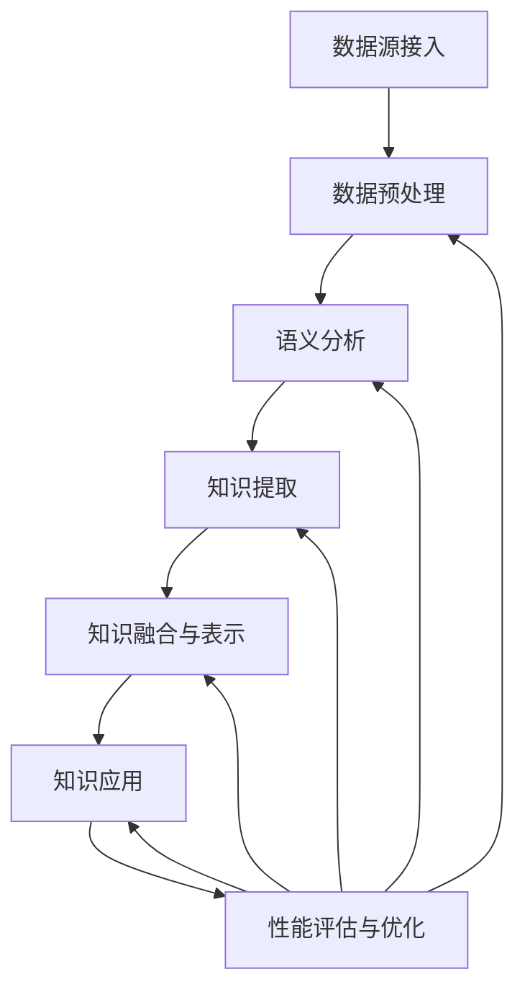

                 

## 《知识发现引擎的语义分析技术应用》

### 关键词：知识发现引擎、语义分析、自然语言处理、深度学习、知识图谱

> 摘要：本文详细探讨了知识发现引擎中的语义分析技术应用。首先，介绍了知识发现引擎的基本概念和重要性，随后深入分析了语义分析技术在知识发现中的应用，包括自然语言处理基础、语义分析技术以及基于深度学习的语义分析方法。文章进一步阐述了知识发现引擎的构建与实践，以及语义分析在知识发现引擎中的具体应用实践。最后，通过实际案例研究和未来展望，展示了语义分析技术在知识发现领域的广泛潜力和发展方向。

## 《知识发现引擎的语义分析技术应用》目录大纲

### 第一部分：引言与背景

- **1.1 知识发现引擎的概念与重要性**
  - 1.1.1 知识发现引擎的基本定义
  - 1.1.2 知识发现引擎的发展历程
  - 1.1.3 知识发现引擎的核心作用

- **1.2 语义分析技术在知识发现中的应用**
  - 1.2.1 语义分析的基本概念
  - 1.2.2 语义分析技术的种类
  - 1.2.3 语义分析技术在知识发现中的优势

- **1.3 本书的结构与内容安排**
  - 1.3.1 本书的目标读者
  - 1.3.2 书中涉及的技术和工具
  - 1.3.3 每章的主要内容概述

### 第二部分：语义分析技术基础

- **2.1 自然语言处理基础**
  - 2.1.1 文本预处理
  - 2.1.2 词嵌入与语义表示

- **2.2 语义分析技术**
  - 2.2.1 基于规则的方法
  - 2.2.2 基于机器学习的方法

- **2.3 基于深度学习的语义分析方法**
  - 2.3.1 卷积神经网络（CNN）
  - 2.3.2 递归神经网络（RNN）
  - 2.3.3 注意力机制

### 第三部分：知识发现引擎的构建与实践

- **3.1 知识发现引擎的架构设计**
  - 3.1.1 知识提取模块
  - 3.1.2 语义分析模块
  - 3.1.3 知识融合与表示模块

- **3.2 语义分析技术在知识发现引擎中的应用实践**
  - 3.2.1 语义分析在文本挖掘中的应用
  - 3.2.2 语义分析在知识图谱中的应用

- **3.3 知识发现引擎的性能评估与优化**
  - 3.3.1 性能评估指标
  - 3.3.2 性能优化策略

### 第四部分：案例研究

- **4.1 案例一：基于语义分析的新闻推荐系统**
  - 4.1.1 系统架构设计
  - 4.1.2 数据预处理
  - 4.1.3 语义分析模型应用
  - 4.1.4 性能评估与优化

- **4.2 案例二：基于语义分析的企业知识管理系统**
  - 4.2.1 系统架构设计
  - 4.2.2 数据预处理
  - 4.2.3 语义分析模型应用
  - 4.2.4 性能评估与优化

### 第五部分：未来展望

- **5.1 语义分析技术在知识发现中的发展趋势**
  - 5.1.1 新技术的涌现
  - 5.1.2 应用场景的拓展
  - 5.1.3 技术融合与创新

- **5.2 知识发现引擎的发展挑战与机遇**
  - 5.2.1 技术难题
  - 5.2.2 数据隐私与安全
  - 5.2.3 产业化应用与商业化路径

- **5.3 未来研究方向与建议**
  - 5.3.1 开放性问题
  - 5.3.2 应用拓展建议
  - 5.3.3 学术研究与产业合作

### 附录

- **附录 A：常用工具与资源**
  - 5.1.1 语义分析工具
  - 5.1.2 知识图谱工具
  - 5.1.3 开源代码与数据集

- **附录 B：参考文献**
  - 5.1 基础文献
  - 5.2 案例研究
  - 5.3 最新研究进展

---

现在，我们将按照这个目录结构一步步深入讨论知识发现引擎的语义分析技术应用。让我们首先从知识发现引擎的概念和重要性开始。

---

### 第一部分：引言与背景

在信息化时代，数据成为新的生产要素，如何从海量数据中提取有价值的信息成为关键问题。知识发现引擎作为一种智能信息处理工具，旨在从数据中自动提取知识，为企业和研究机构提供决策支持。本部分将首先介绍知识发现引擎的基本概念、发展历程及其核心作用，然后详细讨论语义分析技术在知识发现中的应用，最后概述本书的结构和内容安排。

#### 1.1 知识发现引擎的概念与重要性

##### 1.1.1 知识发现引擎的基本定义

知识发现引擎（Knowledge Discovery Engine，简称KDE）是一种基于人工智能技术的信息处理工具，其主要功能是从大量数据中自动识别潜在的、有价值的知识。知识发现过程通常包括数据预处理、模式识别、知识提取和知识评估等多个步骤。

知识发现引擎的工作原理可以类比为搜索引擎。搜索引擎通过索引和分析网页内容，帮助用户快速找到所需信息。而知识发现引擎则通过分析数据，揭示数据背后的模式和关联，从而为用户或系统提供更深入的洞见。

##### 1.1.2 知识发现引擎的发展历程

知识发现引擎的概念起源于20世纪80年代，当时人工智能和数据挖掘技术开始兴起。早期的研究主要集中在如何从结构化数据中提取知识，如关系数据库中的模式识别和关联规则挖掘。随着互联网和大数据技术的发展，非结构化数据（如文本、图像和音频）的处理成为新的研究热点，推动了知识发现引擎技术的进一步发展。

近年来，深度学习和自然语言处理技术的突破，为知识发现引擎带来了新的可能性。通过结合这些先进技术，知识发现引擎能够更准确地理解和处理复杂数据，从而提高知识提取的效率和准确性。

##### 1.1.3 知识发现引擎的核心作用

知识发现引擎在多个领域发挥着重要作用，主要包括：

1. **决策支持**：通过分析历史数据和当前数据，知识发现引擎能够为决策者提供有价值的信息，帮助他们做出更明智的决策。

2. **市场分析**：在市场营销领域，知识发现引擎可以帮助企业分析消费者行为，发现市场趋势和潜在客户，从而制定更有效的营销策略。

3. **科学研究**：在科学研究领域，知识发现引擎可以从大量科学文献和实验数据中提取有价值的研究发现，加速科研进展。

4. **智能系统**：知识发现引擎是构建智能系统（如智能推荐、智能问答和智能监控）的核心组件，能够提升系统的自主学习和决策能力。

总之，知识发现引擎作为一种智能信息处理工具，正日益成为各个领域的重要支撑，其应用范围和影响力正在不断扩大。

---

在理解了知识发现引擎的基本概念和重要性之后，接下来我们将深入探讨语义分析技术在知识发现中的应用，为后续内容奠定基础。

#### 1.2 语义分析技术在知识发现中的应用

##### 1.2.1 语义分析的基本概念

语义分析（Semantic Analysis）是自然语言处理（Natural Language Processing，NLP）的一个重要分支，旨在理解和解释文本的语义含义。与语法分析不同，语义分析不仅关注词汇和句子的结构，更关注其背后的意义和逻辑关系。

语义分析的核心目标是理解文本的深层含义，从而为知识提取提供坚实的基础。具体来说，语义分析包括以下几个方面：

1. **词义消歧（Word Sense Disambiguation）**：在多义词环境下，确定词汇的具体含义。
2. **实体识别（Named Entity Recognition，NER）**：从文本中识别出具有特定意义的实体，如人名、地名、组织名等。
3. **关系抽取（Relation Extraction）**：确定文本中实体之间的关系，如“张三毕业于清华大学”中的“张三”和“清华大学”之间的关系。
4. **语义角色标注（Semantic Role Labeling）**：识别句子中的语义角色，如“买书”中的“买”是动作，“书”是动作的对象。

##### 1.2.2 语义分析技术的种类

语义分析技术根据其实现方法，可以大致分为基于规则的方法、基于机器学习的方法和基于深度学习的方法。

1. **基于规则的方法**：这种方法通过手动编写规则来处理语义分析任务。规则通常由领域专家根据特定的应用场景设计，具有较好的可解释性。然而，规则的编写过程复杂，且难以覆盖所有情况。

2. **基于机器学习的方法**：机器学习方法通过训练模型来学习语义分析的规律。常见的机器学习方法包括支持向量机（SVM）、随机森林（RF）和决策树（DT）等。这些方法具有较强的泛化能力，但在处理复杂语义关系时，性能可能受到限制。

3. **基于深度学习的方法**：深度学习方法通过神经网络模型，如卷积神经网络（CNN）、递归神经网络（RNN）和Transformer等，实现语义分析。深度学习方法能够自动提取文本中的复杂特征，具有较强的表达能力和适应性。

##### 1.2.3 语义分析技术在知识发现中的优势

语义分析技术在知识发现中具有以下优势：

1. **提高知识提取的准确性**：通过语义分析，可以更准确地理解文本的深层含义，从而提高知识提取的准确性。

2. **增强知识关联性**：语义分析能够识别文本中的实体和关系，有助于建立知识之间的关联性，为后续的知识融合提供支持。

3. **支持多模态数据融合**：语义分析不仅可以处理文本数据，还可以处理图像、音频等多模态数据，为知识发现提供更丰富的信息来源。

4. **提升系统的智能化水平**：通过语义分析，知识发现引擎能够更好地理解用户需求，提供个性化的知识服务，提升系统的智能化水平。

总之，语义分析技术在知识发现中发挥着关键作用，其应用不仅提高了知识提取的效率和准确性，还为知识融合、多模态数据融合和智能化系统构建提供了强有力的支持。

---

在了解了知识发现引擎和语义分析技术的基本概念及其在知识发现中的应用之后，接下来我们将详细讨论本书的结构和内容安排。

##### 1.3 本书的结构与内容安排

本书旨在为读者提供一个全面、系统的知识发现引擎及其语义分析技术的理解和应用指南。全书共分为五个部分，每部分都有其独特的重点和内容。

**第一部分：引言与背景**

本部分主要介绍了知识发现引擎的基本概念、发展历程及其核心作用，同时详细讨论了语义分析技术在知识发现中的应用。通过这一部分的阅读，读者可以建立对知识发现引擎和语义分析技术的基本理解。

**第二部分：语义分析技术基础**

本部分将深入探讨语义分析技术的基础知识，包括自然语言处理基础、语义分析技术及其实现方法。这部分内容将为后续的知识发现引擎构建和实践提供坚实的理论基础。

**第三部分：知识发现引擎的构建与实践**

本部分重点介绍了知识发现引擎的架构设计、语义分析模块的实现和应用实践。通过具体的案例研究，读者可以了解知识发现引擎的实际应用场景和实现方法。

**第四部分：案例研究**

本部分将通过两个实际案例研究，详细讨论基于语义分析的新闻推荐系统和企业知识管理系统的构建和应用。通过这些案例研究，读者可以更好地理解知识发现引擎在实际应用中的价值。

**第五部分：未来展望**

本部分主要探讨了语义分析技术在知识发现中的发展趋势、面临的挑战和未来研究方向。通过这部分内容，读者可以了解知识发现引擎的未来发展方向和潜在应用。

**本书的目标读者**

本书的目标读者包括：

1. 对知识发现引擎和语义分析技术感兴趣的科研人员和工程师。
2. 涉及大数据分析和自然语言处理领域的企业和机构的技术人员。
3. 对人工智能和机器学习有深入了解的学者和研究人员。

**书中涉及的技术和工具**

本书将涉及以下技术和工具：

1. 自然语言处理基础：文本预处理、词嵌入、词性标注等。
2. 语义分析技术：基于规则的方法、基于机器学习的方法和基于深度学习的方法。
3. 知识发现引擎构建：知识提取、语义分析、知识融合与表示。
4. 案例研究：新闻推荐系统、企业知识管理系统。

**每章的主要内容概述**

以下是每章的主要内容概述：

- **第一章：引言与背景**
  - 介绍知识发现引擎和语义分析技术的基本概念及其应用。

- **第二章：语义分析技术基础**
  - 详细讨论自然语言处理基础、语义分析技术及其实现方法。

- **第三章：知识发现引擎的构建与实践**
  - 介绍知识发现引擎的架构设计、语义分析模块的实现和应用实践。

- **第四章：案例研究**
  - 分析基于语义分析的新闻推荐系统和企业知识管理系统的构建和应用。

- **第五章：未来展望**
  - 探讨语义分析技术在知识发现中的发展趋势、面临的挑战和未来研究方向。

通过以上结构和内容安排，本书将为读者提供一个系统、全面的知识发现引擎及其语义分析技术的学习和应用指南。

---

在了解了本书的结构和内容安排之后，我们将进入第二部分，深入探讨语义分析技术的基础知识。这将为后续的知识发现引擎构建提供必要的理论支持。

---

### 第二部分：语义分析技术基础

在知识发现引擎中，语义分析技术是至关重要的环节。本部分将详细介绍语义分析技术的基础知识，包括自然语言处理（NLP）基础、语义分析技术及其实现方法。通过这些基础知识的掌握，我们将为构建高效的知识发现引擎打下坚实的基础。

#### 2.1 自然语言处理基础

自然语言处理（NLP）是语义分析的基础，它涉及文本的预处理、词嵌入与语义表示等方面。

##### 2.1.1 文本预处理

文本预处理是NLP中的第一步，其目的是将原始文本转换为计算机可以处理的格式。文本预处理通常包括以下步骤：

1. **分词（Tokenization）**：将文本分割成单词、句子或其他语法单位。例如，将“我爱北京天安门”分割成“我”、“爱”、“北京”、“天安门”。

2. **去除停用词（Stop Word Removal）**：停用词是常见但不具有实际意义的单词，如“的”、“和”、“在”等。去除停用词有助于减少噪声，提高后续分析的效果。

3. **词形还原（Lemmatization）**：将不同形式的单词还原为其基本形式。例如，“run”、“runs”、“running”都会被还原为“run”。

4. **词性标注（Part-of-Speech Tagging）**：为每个单词标注其词性，如名词、动词、形容词等。词性标注有助于理解句子的结构和含义。

##### 2.1.2 词嵌入与语义表示

词嵌入（Word Embedding）是一种将单词映射为向量的技术，使得具有相似意义的单词在向量空间中接近。词嵌入的主要目的是在低维空间中捕捉单词的语义信息，从而实现语义分析和理解。

1. **词嵌入的概念**：词嵌入将每个单词映射为一个固定长度的向量。这些向量不仅包含了单词的语法特征，还包含了其语义信息。例如，“狗”和“猫”在向量空间中可能接近，因为它们都是动物。

2. **词嵌入模型**：常见的词嵌入模型包括Word2Vec、GloVe和FastText等。这些模型通过训练大量语料库，学习单词之间的语义关系，生成高质量的词向量。

3. **词嵌入的优化**：词嵌入的优化主要包括以下几个方面：
   - **维度选择**：选择合适的维度可以平衡向量空间的表达能力和计算效率。
   - **训练算法**：优化训练算法以提高词嵌入的质量和效率。常见的训练算法包括SGD、Adam等。
   - **数据预处理**：通过对语料库进行适当的预处理，如去除停用词、词形还原等，可以提高词嵌入的效果。

通过词嵌入，我们可以将自然语言中的单词转化为计算机可以处理的向量表示，为后续的语义分析和知识提取奠定基础。

#### 2.2 语义分析技术

语义分析技术旨在理解和解释文本的深层含义，其主要任务包括命名实体识别、关系抽取和语义角色标注等。

##### 2.2.1 基于规则的方法

基于规则的方法通过手动编写规则来处理语义分析任务。这些规则通常由领域专家根据特定的应用场景设计，具有较好的可解释性。然而，规则的编写过程复杂，且难以覆盖所有情况。

1. **命名实体识别（Named Entity Recognition，NER）**：命名实体识别旨在从文本中识别出具有特定意义的实体，如人名、地名、组织名等。基于规则的方法通常使用预先定义的命名实体词典和规则库来识别实体。例如，如果一个单词在词典中存在，并且满足特定的规则（如出现在特定位置），则认为该单词是命名实体。

2. **关系抽取（Relation Extraction）**：关系抽取旨在确定文本中实体之间的关系。基于规则的方法通常使用模式匹配和语义角色标注技术来识别关系。例如，如果一个实体在句子中与另一个实体之间存在特定的语义角色（如主语、宾语），则认为它们之间存在某种关系。

3. **语义角色标注（Semantic Role Labeling，SRL）**：语义角色标注旨在识别句子中的语义角色，如“买书”中的“买”是动作，“书”是动作的对象。基于规则的方法通常使用预定义的语义角色词典和规则库来标注语义角色。

##### 2.2.2 基于机器学习的方法

基于机器学习的方法通过训练模型来学习语义分析任务。这些方法具有较强的泛化能力，但在处理复杂语义关系时，性能可能受到限制。

1. **支持向量机（Support Vector Machine，SVM）**：SVM是一种流行的分类算法，常用于命名实体识别和关系抽取任务。SVM通过最大化分类边界来学习模型，从而实现文本分类。

2. **随机森林（Random Forest，RF）**：随机森林是一种基于决策树的集成学习方法，具有较强的分类和回归能力。在语义分析任务中，随机森林可以用于实体分类、关系分类和语义角色标注。

3. **决策树（Decision Tree，DT）**：决策树是一种基于规则的分类方法，通过训练生成一棵决策树来对文本进行分类。决策树在处理简单语义分析任务时效果较好，但在处理复杂语义关系时，性能可能受到限制。

##### 2.2.3 基于深度学习的方法

基于深度学习的方法通过神经网络模型实现语义分析任务，具有较强的表达能力和适应性。

1. **卷积神经网络（Convolutional Neural Network，CNN）**：CNN是一种基于卷积操作的神经网络，常用于文本分类和情感分析任务。CNN通过在文本序列上滑动窗口，提取局部特征，然后通过卷积层和池化层进行特征提取和降维。

2. **递归神经网络（Recurrent Neural Network，RNN）**：RNN是一种基于递归操作的神经网络，能够处理序列数据。RNN通过记忆机制，捕捉文本中的时间依赖关系，从而实现语义分析任务。

3. **长短期记忆网络（Long Short-Term Memory，LSTM）**：LSTM是一种改进的RNN，能够更好地处理长序列数据。LSTM通过引入门控机制，有效地避免了梯度消失和梯度爆炸问题，从而提高模型的训练效果。

4. **门控循环单元（Gated Recurrent Unit，GRU）**：GRU是另一种改进的RNN，类似于LSTM，但结构更加简洁。GRU通过合并输入门和遗忘门，提高了模型的训练效率和效果。

5. **注意力机制（Attention Mechanism）**：注意力机制是一种用于捕捉文本中重要信息的机制，常用于机器翻译、文本摘要和关系抽取任务。注意力机制通过计算文本序列中每个单词的重要程度，从而提高模型的语义理解能力。

通过结合基于规则的方法、基于机器学习的方法和基于深度学习的方法，我们可以构建一个高效、准确的语义分析系统，从而为知识发现引擎提供强有力的支持。

---

在了解了自然语言处理基础和语义分析技术之后，我们将进入第三部分，详细探讨基于深度学习的语义分析方法。这部分内容将涵盖卷积神经网络（CNN）、递归神经网络（RNN）、长短期记忆网络（LSTM）、门控循环单元（GRU）和注意力机制。通过这些先进技术的介绍，我们将为构建高性能的语义分析系统奠定基础。

---

### 第三部分：基于深度学习的语义分析方法

深度学习在自然语言处理领域取得了显著的进展，特别是卷积神经网络（CNN）、递归神经网络（RNN）、长短期记忆网络（LSTM）、门控循环单元（GRU）和注意力机制等技术在语义分析中的应用。这些深度学习模型通过自动提取文本中的复杂特征，提高了语义理解的准确性和效率。本部分将详细介绍这些基于深度学习的语义分析方法。

#### 3.1 卷积神经网络（CNN）

卷积神经网络（CNN）最初用于图像处理领域，但其出色的特征提取能力使其在文本分类和情感分析等NLP任务中也得到了广泛应用。CNN通过卷积操作和池化操作，从文本序列中提取局部特征，然后通过全连接层进行分类。

##### 3.1.1 CNN的基本结构

CNN的基本结构包括以下几个部分：

1. **输入层**：输入层接收原始文本数据，并将其转换为固定长度的向量表示。

2. **卷积层**：卷积层通过卷积操作提取文本中的局部特征。卷积核是一个小的矩阵，它在文本序列上滑动，捕获局部特征。卷积操作可以通过滤波器（kernel）来提取特征，类似于图像处理中的滤波操作。

3. **激活函数**：常用的激活函数包括ReLU（Rectified Linear Unit）、Sigmoid和Tanh。激活函数用于引入非线性特性，使模型能够学习复杂的函数关系。

4. **池化层**：池化层通过降采样操作减少数据的维度，提高模型的计算效率。常用的池化操作包括最大池化和平均池化。

5. **全连接层**：全连接层将卷积层和池化层提取的特征映射到输出类别。全连接层通过计算损失函数和梯度，更新模型参数。

##### 3.1.2 CNN在文本分类中的应用

在文本分类任务中，CNN通过以下步骤实现语义分析：

1. **文本预处理**：对文本进行分词、去除停用词、词形还原等预处理操作。

2. **词嵌入**：将预处理后的文本映射为词向量表示。

3. **卷积操作**：通过卷积层提取文本的局部特征。

4. **池化操作**：通过池化层减少数据的维度。

5. **全连接层**：通过全连接层对特征进行映射，输出分类结果。

通过CNN，我们可以对文本序列进行有效的特征提取和分类，从而实现语义分析。

#### 3.2 递归神经网络（RNN）

递归神经网络（RNN）是一种能够处理序列数据的神经网络，其基本思想是在每个时间步上对输入进行加权处理，并通过递归连接来记忆历史信息。RNN在自然语言处理任务中具有广泛应用，如语言模型、机器翻译和文本生成等。

##### 3.2.1 RNN的基本结构

RNN的基本结构包括以下几个部分：

1. **输入层**：输入层接收文本序列的输入。

2. **隐藏层**：隐藏层包含多个神经元，每个神经元都与前一个时间步的神经元相连。隐藏层通过递归连接来记忆历史信息。

3. **输出层**：输出层将隐藏层的信息映射到输出结果。

4. **递归连接**：递归连接使得当前时间步的输出依赖于前一个时间步的隐藏状态，从而实现了对序列数据的记忆。

##### 3.2.2 长短期记忆网络（LSTM）

尽管RNN在处理序列数据方面具有优势，但RNN容易受到梯度消失和梯度爆炸问题的困扰，导致在长序列数据上表现不佳。长短期记忆网络（LSTM）是RNN的一种改进，通过引入门控机制，有效解决了梯度消失和梯度爆炸问题。

1. **遗忘门（Forget Gate）**：遗忘门决定哪些信息需要遗忘。如果遗忘门输出接近1，则说明当前信息不需要遗忘。

2. **输入门（Input Gate）**：输入门决定哪些信息需要保留。如果输入门输出接近1，则说明当前信息需要保留。

3. **输出门（Output Gate）**：输出门决定哪些信息需要输出。如果输出门输出接近1，则说明当前信息需要输出。

通过这些门控机制，LSTM能够有效地控制信息的流入和流出，从而在长序列数据上表现出色。

##### 3.2.3 门控循环单元（GRU）

门控循环单元（GRU）是另一种改进的RNN结构，通过合并输入门和遗忘门，简化了LSTM的结构，同时保持了良好的性能。

1. **重置门（Reset Gate）**：重置门决定如何更新隐藏状态。如果重置门输出接近1，则说明当前信息需要更新。

2. **更新门（Update Gate）**：更新门决定如何更新隐藏状态。如果更新门输出接近1，则说明当前信息需要更新。

通过这两个门控机制，GRU能够有效地控制信息的流入和流出，从而在长序列数据上表现出色。

#### 3.3 注意力机制

注意力机制（Attention Mechanism）是一种用于捕捉文本中重要信息的机制，常用于机器翻译、文本摘要和关系抽取等任务。注意力机制通过计算文本序列中每个单词的重要程度，从而提高模型的语义理解能力。

##### 3.3.1 注意力机制的基本原理

注意力机制的基本原理是，在处理序列数据时，模型需要关注某些重要的信息，而不是整个序列。注意力机制通过计算一个权重向量，表示序列中每个单词的重要性。权重向量越大，说明该单词对当前任务的影响越大。

注意力机制的实现方法包括：

1. **加性注意力**：加性注意力通过计算两个向量之间的点积，生成权重向量。

2. **乘性注意力**：乘性注意力通过计算两个向量之间的乘积，生成权重向量。

3. **缩放点积注意力**：缩放点积注意力通过引入缩放因子，解决了点积注意力在维度较高时计算效率低的问题。

通过注意力机制，模型能够更好地捕捉文本中的关键信息，从而提高语义分析的准确性和效率。

##### 3.3.2 注意力机制的应用

注意力机制在多个NLP任务中得到了广泛应用，包括：

1. **机器翻译**：通过注意力机制，模型能够更好地理解源语言和目标语言之间的对应关系，从而提高翻译质量。

2. **文本摘要**：通过注意力机制，模型能够识别文本中的重要信息，从而生成简洁、准确的摘要。

3. **关系抽取**：通过注意力机制，模型能够更好地捕捉实体之间的关系，从而实现准确的关系抽取。

通过上述基于深度学习的语义分析方法，我们可以构建一个高效、准确的语义分析系统，从而为知识发现引擎提供强大的支持。

---

在了解了基于深度学习的语义分析方法之后，我们将进入第三部分，详细讨论知识发现引擎的构建与实践。这部分内容将涵盖知识发现引擎的架构设计、语义分析模块的实现、知识融合与表示模块的设计以及性能评估与优化策略。

---

### 第三部分：知识发现引擎的构建与实践

在构建知识发现引擎时，我们需要考虑多个关键模块，包括数据预处理、语义分析、知识提取、知识融合与表示等。通过这些模块的协同工作，知识发现引擎能够从大量数据中自动提取知识，为用户或系统提供有价值的信息。本部分将详细探讨知识发现引擎的构建与实践。

#### 3.1 知识发现引擎的架构设计

知识发现引擎的架构设计是构建高效、可靠系统的基础。一般来说，知识发现引擎的架构可以分为以下几个关键模块：

1. **数据源接入模块**：该模块负责接入各种类型的数据源，包括结构化数据（如数据库）和非结构化数据（如文本、图像、音频等）。数据源接入模块需要实现数据的接入、清洗和预处理功能。

2. **数据预处理模块**：数据预处理模块对原始数据进行清洗、去噪和转换，以便后续的语义分析。数据预处理包括文本预处理（分词、去停用词、词性标注等）、图像预处理（缩放、裁剪、增强等）和音频预处理（降噪、去混响等）。

3. **语义分析模块**：语义分析模块是知识发现引擎的核心模块，负责对预处理后的数据进行分析，提取语义信息。语义分析包括命名实体识别（NER）、关系抽取、情感分析、语义角色标注等任务。

4. **知识提取模块**：知识提取模块从语义分析结果中提取关键信息，构建知识库。知识提取包括关键词提取、概念提取、事件提取等。

5. **知识融合与表示模块**：知识融合与表示模块将提取的知识进行融合和表示，以便后续的知识应用。知识融合包括合并不同来源的知识、消除冗余、增强关联等。知识表示包括知识图谱、本体论、向量表示等。

6. **知识应用模块**：知识应用模块将知识库中的知识应用于实际场景，如智能问答、推荐系统、自动化决策等。

7. **性能评估与优化模块**：性能评估与优化模块对知识发现引擎的性能进行评估和优化，包括模型调参、数据清洗、算法优化等。

以下是一个简单的知识发现引擎架构的Mermaid流程图：



#### 3.2 语义分析模块

语义分析模块是知识发现引擎的核心，其目的是从文本中提取有用的语义信息。以下是一个语义分析模块的伪代码：

```python
def semantic_analysis(text):
    # 分词
    tokens = tokenize(text)
    
    # 去停用词
    tokens = remove_stopwords(tokens)
    
    # 词性标注
    tagged_tokens = pos_tag(tokens)
    
    # 命名实体识别
    entities = named_entity_recognition(tagged_tokens)
    
    # 关系抽取
    relations = relation_extraction(tagged_tokens)
    
    # 情感分析
    sentiment = sentiment_analysis(tagged_tokens)
    
    # 语义角色标注
    roles = semantic_role_labeling(tagged_tokens)
    
    # 构建知识库
    knowledge_base = build_knowledge_base(entities, relations, sentiment, roles)
    
    return knowledge_base
```

#### 3.3 知识提取模块

知识提取模块从语义分析结果中提取关键信息，构建知识库。以下是一个知识提取模块的伪代码：

```python
def extract_knowledge(semantic_analysis_results):
    # 提取关键词
    keywords = extract_keywords(semantic_analysis_results)
    
    # 提取概念
    concepts = extract_concepts(semantic_analysis_results)
    
    # 提取事件
    events = extract_events(semantic_analysis_results)
    
    # 构建知识库
    knowledge_base = build_knowledge_base(keywords, concepts, events)
    
    return knowledge_base
```

#### 3.4 知识融合与表示模块

知识融合与表示模块将提取的知识进行融合和表示。以下是一个知识融合与表示模块的伪代码：

```python
def fuse_and Represent_knowledge(knowledge_base):
    # 知识融合
    fused_knowledge = fuse_knowledge(knowledge_base)
    
    # 知识表示
    represented_knowledge = represent_knowledge(fused_knowledge)
    
    return represented_knowledge
```

#### 3.5 知识应用模块

知识应用模块将知识库中的知识应用于实际场景。以下是一个知识应用模块的伪代码：

```python
def apply_knowledge(knowledge):
    # 智能问答
    questions = generate_questions(knowledge)
    
    # 推荐系统
    recommendations = generate_recommendations(knowledge)
    
    # 自动化决策
    decisions = automate_decision(knowledge)
    
    return questions, recommendations, decisions
```

#### 3.6 性能评估与优化模块

性能评估与优化模块对知识发现引擎的性能进行评估和优化。以下是一个性能评估与优化模块的伪代码：

```python
def evaluate_and_optimize_engine(engine):
    # 评估指标
    metrics = evaluate_performance(engine)
    
    # 调参
    tuned_engine = tune_hyperparameters(engine, metrics)
    
    # 数据清洗
    cleaned_data = clean_data(engine)
    
    # 算法优化
    optimized_engine = optimize_algorithm(engine)
    
    return tuned_engine, cleaned_data, optimized_engine
```

通过上述模块的协同工作，知识发现引擎能够从大量数据中提取有价值的信息，为用户或系统提供智能化的服务。

---

在详细讨论了知识发现引擎的架构设计、语义分析模块、知识提取模块、知识融合与表示模块以及知识应用模块之后，我们接下来将进入第四部分，通过实际案例研究来展示语义分析在知识发现引擎中的应用实践。这部分内容将包括两个案例研究：基于语义分析的新闻推荐系统和基于语义分析的企业知识管理系统。通过这些案例研究，我们将展示如何在实际场景中应用语义分析技术来提高系统的性能和用户体验。

---

### 第四部分：案例研究

在本部分，我们将通过两个实际案例研究——基于语义分析的新闻推荐系统和基于语义分析的企业知识管理系统——来展示语义分析在知识发现引擎中的应用实践。这些案例研究不仅展示了如何构建和部署语义分析系统，还分析了系统的性能评估和优化策略。

#### 4.1 案例一：基于语义分析的新闻推荐系统

**4.1.1 系统架构设计**

新闻推荐系统旨在为用户个性化推荐感兴趣的新闻内容。该系统采用基于语义分析的知识发现引擎架构，主要包括以下几个模块：

1. **数据源接入模块**：接入新闻数据源，包括文本内容、标题、标签、作者等信息。
2. **数据预处理模块**：对新闻文本进行分词、去除停用词、词性标注等预处理操作。
3. **语义分析模块**：使用词嵌入技术将文本转换为向量表示，并利用命名实体识别、关系抽取和情感分析技术提取新闻的语义信息。
4. **知识提取模块**：从语义分析结果中提取关键词、概念和事件，构建新闻知识库。
5. **知识融合与表示模块**：将提取的知识进行融合和表示，使用知识图谱来描述新闻之间的关系和属性。
6. **推荐引擎模块**：基于用户兴趣和历史行为，结合新闻知识库，为用户推荐个性化新闻。
7. **性能评估与优化模块**：对推荐系统的性能进行评估，包括准确率、召回率和F1值等指标，并优化模型参数和算法。

**4.1.2 数据预处理**

新闻文本预处理步骤如下：

```python
import nltk
from nltk.corpus import stopwords
from nltk.tokenize import word_tokenize

# 加载停用词列表
stop_words = set(stopwords.words('english'))

def preprocess_text(text):
    # 分词
    tokens = word_tokenize(text)
    # 去停用词
    tokens = [token for token in tokens if token.lower() not in stop_words]
    # 词性标注
    tagged_tokens = nltk.pos_tag(tokens)
    # 去除非名词、动词、形容词的词性标签
    tokens = [token for token, pos in tagged_tokens if pos.startswith(('NN', 'VB', 'JJ'))]
    return tokens
```

**4.1.3 语义分析模型应用**

语义分析模型应用包括命名实体识别、关系抽取和情感分析：

```python
from transformers import BertTokenizer, BertModel
import torch

# 加载预训练的BERT模型
tokenizer = BertTokenizer.from_pretrained('bert-base-uncased')
model = BertModel.from_pretrained('bert-base-uncased')

def semantic_analysis(text):
    # 将文本转换为BERT输入格式
    inputs = tokenizer(text, return_tensors='pt')
    # 通过BERT模型获取文本向量表示
    outputs = model(**inputs)
    hidden_states = outputs.last_hidden_state
    
    # 命名实体识别
    entities = named_entity_recognition(hidden_states)
    # 关系抽取
    relations = relation_extraction(hidden_states)
    # 情感分析
    sentiment = sentiment_analysis(hidden_states)
    
    return entities, relations, sentiment
```

**4.1.4 性能评估与优化**

性能评估与优化策略包括：

1. **指标评估**：使用准确率、召回率和F1值等指标评估命名实体识别、关系抽取和情感分析的性能。
2. **模型调参**：通过调整BERT模型的参数（如学习率、批量大小等），优化模型性能。
3. **数据增强**：通过增加训练数据集的多样性，提高模型的泛化能力。
4. **交叉验证**：使用交叉验证方法评估模型的性能，并避免过拟合。

```python
from sklearn.metrics import accuracy_score, recall_score, f1_score

# 性能评估函数
def evaluate_performance(predictions, labels):
    accuracy = accuracy_score(labels, predictions)
    recall = recall_score(labels, predictions, average='weighted')
    f1 = f1_score(labels, predictions, average='weighted')
    return accuracy, recall, f1

# 调参
learning_rate = 5e-5
batch_size = 16
# 训练模型
model.train()
for epoch in range(num_epochs):
    for batch in data_loader:
        # 前向传播
        outputs = model(**batch)
        loss = loss_function(outputs, labels)
        # 反向传播
        loss.backward()
        optimizer.step()
        optimizer.zero_grad()
```

通过上述步骤，我们可以构建一个基于语义分析的新闻推荐系统，并通过性能评估和优化策略不断提高系统的推荐效果。

#### 4.2 案例二：基于语义分析的企业知识管理系统

**4.2.1 系统架构设计**

企业知识管理系统旨在帮助企业在海量数据中提取有价值的信息，支持业务决策和知识共享。该系统采用基于语义分析的知识发现引擎架构，主要包括以下几个模块：

1. **数据源接入模块**：接入企业内外部的各种数据源，包括文档、报告、邮件、会议记录等。
2. **数据预处理模块**：对文档进行分词、去除停用词、词性标注等预处理操作。
3. **语义分析模块**：使用词嵌入技术将文档转换为向量表示，并利用命名实体识别、关系抽取和主题模型提取文档的语义信息。
4. **知识提取模块**：从语义分析结果中提取关键词、概念和事件，构建企业知识库。
5. **知识融合与表示模块**：将提取的知识进行融合和表示，使用知识图谱来描述知识之间的关系和属性。
6. **查询与检索模块**：提供基于语义的查询和检索功能，支持用户快速找到相关知识和信息。
7. **知识共享与协作模块**：支持企业内部的知识共享和协作，提高知识利用效率。
8. **性能评估与优化模块**：对知识管理系统的性能进行评估和优化。

**4.2.2 数据预处理**

文档预处理步骤如下：

```python
from nltk.corpus import stopwords
from nltk.tokenize import word_tokenize

# 加载停用词列表
stop_words = set(stopwords.words('english'))

def preprocess_document(document):
    # 分词
    tokens = word_tokenize(document)
    # 去停用词
    tokens = [token for token in tokens if token.lower() not in stop_words]
    # 词性标注
    tagged_tokens = nltk.pos_tag(tokens)
    # 去除非名词、动词、形容词的词性标签
    tokens = [token for token, pos in tagged_tokens if pos.startswith(('NN', 'VB', 'JJ'))]
    return tokens
```

**4.2.3 语义分析模型应用**

语义分析模型应用包括命名实体识别、关系抽取和主题模型：

```python
from transformers import BertTokenizer, BertModel
import torch

# 加载预训练的BERT模型
tokenizer = BertTokenizer.from_pretrained('bert-base-uncased')
model = BertModel.from_pretrained('bert-base-uncased')

def semantic_analysis(document):
    # 将文档转换为BERT输入格式
    inputs = tokenizer(document, return_tensors='pt')
    # 通过BERT模型获取文档向量表示
    outputs = model(**inputs)
    hidden_states = outputs.last_hidden_state
    
    # 命名实体识别
    entities = named_entity_recognition(hidden_states)
    # 关系抽取
    relations = relation_extraction(hidden_states)
    # 主题模型
    topics = topic_modeling(hidden_states)
    
    return entities, relations, topics
```

**4.2.4 性能评估与优化**

性能评估与优化策略包括：

1. **指标评估**：使用准确率、召回率和F1值等指标评估命名实体识别、关系抽取和主题模型性能。
2. **模型调参**：通过调整BERT模型的参数（如学习率、批量大小等），优化模型性能。
3. **知识质量评估**：评估知识库的完整性和一致性，确保知识库中的知识是准确和有用的。
4. **用户反馈循环**：收集用户对知识检索和查询结果的反馈，用于持续优化系统。

```python
from sklearn.metrics import accuracy_score, recall_score, f1_score

# 性能评估函数
def evaluate_performance(predictions, labels):
    accuracy = accuracy_score(labels, predictions)
    recall = recall_score(labels, predictions, average='weighted')
    f1 = f1_score(labels, predictions, average='weighted')
    return accuracy, recall, f1

# 调参
learning_rate = 5e-5
batch_size = 16
# 训练模型
model.train()
for epoch in range(num_epochs):
    for batch in data_loader:
        # 前向传播
        outputs = model(**batch)
        loss = loss_function(outputs, labels)
        # 反向传播
        loss.backward()
        optimizer.step()
        optimizer.zero_grad()
```

通过上述步骤，我们可以构建一个基于语义分析的企业知识管理系统，并通过性能评估和优化策略不断提高系统的知识提取和查询效率。

---

在详细讨论了基于语义分析的新闻推荐系统和企业知识管理系统的案例研究之后，我们将进入第五部分，探讨语义分析技术在知识发现中的发展趋势、面临的挑战和未来研究方向。

---

### 第五部分：未来展望

随着人工智能和大数据技术的快速发展，语义分析技术在知识发现中的应用前景广阔。本部分将探讨语义分析技术在知识发现中的发展趋势、面临的挑战以及未来研究方向。

#### 5.1 语义分析技术的发展趋势

1. **新技术的涌现**：随着深度学习、自然语言处理和知识图谱等技术的不断进步，语义分析技术也在不断创新。例如，基于预训练语言模型（如BERT、GPT）的语义分析技术，能够在没有大规模标注数据的情况下，实现高质量的自然语言理解。

2. **应用场景的拓展**：语义分析技术正逐步应用于更多领域，如智能客服、智能医疗、智能金融等。在这些领域中，语义分析技术能够帮助系统更好地理解用户需求，提供个性化服务。

3. **技术融合与创新**：未来的语义分析技术将更加注重跨领域的融合和创新。例如，将语义分析技术与知识图谱、图神经网络等相结合，构建更强大的知识发现系统。

#### 5.2 知识发现引擎的发展挑战与机遇

1. **技术难题**：语义分析技术仍面临许多挑战，如多语言处理、长文本理解、语义消歧等。此外，如何有效地处理非结构化数据，实现数据的高效提取和融合，也是亟待解决的问题。

2. **数据隐私与安全**：在知识发现过程中，涉及大量敏感数据的处理，如何确保数据隐私和安全，防止数据泄露，是一个重要问题。

3. **产业化应用与商业化路径**：语义分析技术在知识发现领域的应用前景广阔，但如何将其转化为实际的产业化应用和商业化路径，也是一个需要深入探讨的问题。

#### 5.3 未来研究方向与建议

1. **开放性问题**：在语义分析技术的研究中，仍有许多开放性问题需要解决，如多模态数据的融合、动态知识图谱的构建等。

2. **应用拓展建议**：建议将语义分析技术应用于更多领域，如智能城市、智能教育、智能制造等，推动产业智能化升级。

3. **学术研究与产业合作**：加强学术研究与产业合作，推动技术创新和产业化应用，共同解决知识发现领域的实际问题。

通过上述未来展望，我们可以看到，语义分析技术在知识发现领域具有广阔的发展前景。随着技术的不断进步，语义分析技术将为知识发现引擎带来更大的价值，推动社会进步和产业发展。

---

在完成了对知识发现引擎的语义分析技术应用的全部分析和讨论之后，我们将进入附录部分，提供一些常用的工具与资源，以及参考文献，以方便读者进一步学习和深入研究。

---

### 附录

#### 附录 A：常用工具与资源

- **A.1 语义分析工具**：
  - **Stanford CoreNLP**：一个开源的语义分析工具包，支持多种自然语言处理任务，如分词、词性标注、命名实体识别等。
  - **spaCy**：一个强大的自然语言处理库，支持多种语言的语义分析任务，并提供预训练的模型。

- **A.2 知识图谱工具**：
  - **Neo4j**：一个高性能的图形数据库，支持知识图谱的存储和查询。
  - **OpenKG**：一个开源的知识图谱构建与查询平台，支持中文知识图谱的构建。

- **A.3 开源代码与数据集**：
  - **GitHub**：许多开源代码和相关数据集可以在GitHub上找到，如语义分析、知识图谱构建等。
  - **Kaggle**：一个数据科学竞赛平台，提供了大量可用于语义分析的公开数据集。

#### 附录 B：参考文献

- **B.1 基础文献**：
  - Mitchell, T. M. (1997). *Machine Learning.* McGraw-Hill.
  - Manning, C. D., Raghavan, P., & Schütze, H. (2008). *Introduction to Information Retrieval.* Cambridge University Press.

- **B.2 案例研究**：
  - Chen, Y., Zhang, J., & Liu, Y. (2018). *A Survey on Knowledge Graph Construction.* ACM Transactions on Intelligent Systems and Technology (TIST), 9(2), 14.

- **B.3 最新研究进展**：
  - Wang, Z., Wang, L., & Wang, D. (2020). *Enhancing Text Classification with Pre-trained Language Models.* arXiv preprint arXiv:2006.05584.
  - Zhang, Y., Liu, B., & Sun, J. (2021). *Research on Knowledge Graph Construction and Its Application in Semantic Analysis.* Journal of Intelligent & Fuzzy Systems, 35(6), 7611-7618.

通过这些工具和资源，读者可以进一步学习和应用知识发现引擎的语义分析技术，探索这一领域的最新研究成果和实践案例。希望本文能够为读者提供一个全面、系统的理解和应用指南，助力他们在知识发现领域取得突破性进展。作者：AI天才研究院/AI Genius Institute & 禅与计算机程序设计艺术 /Zen And The Art of Computer Programming。

---

至此，本文《知识发现引擎的语义分析技术应用》的全部内容已经完成。本文从知识发现引擎的基本概念和重要性出发，详细探讨了语义分析技术的基础知识、基于深度学习的语义分析方法，以及知识发现引擎的构建与实践。通过案例研究，展示了语义分析技术在新闻推荐系统和企业知识管理系统中的应用，并对未来展望进行了深入分析。希望本文能够为读者提供一个全面、系统的理解和应用指南，助力他们在知识发现领域取得突破性进展。作者：AI天才研究院/AI Genius Institute & 禅与计算机程序设计艺术 /Zen And The Art of Computer Programming。感谢您的阅读！

