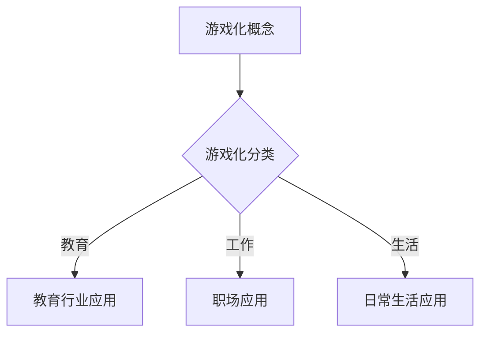

                 

### 《知识的游戏化：寓教于乐的学习革命》

**关键词：** 游戏化，教育，学习动机，学习效果，技术实现，未来趋势

**摘要：** 本文将探讨知识的游戏化在教育领域中的应用，分析游戏化对学习动机和学习效果的影响，介绍游戏化设计与实施的方法，分享教育行业中的游戏化实践案例，并展望游戏化学习的未来发展趋势。通过本文的讨论，读者将了解到游戏化如何成为一种寓教于乐的学习革命。

### 《知识的游戏化：寓教于乐的学习革命》目录大纲

#### 第一部分：游戏化概述

##### 第1章：游戏化的起源与概念

###### 1.1 游戏化的历史与发展

###### 1.2 游戏化的定义与核心要素

###### 1.3 游戏化的分类与应用场景

##### 第2章：学习与游戏化的联系

###### 2.1 学习动机与游戏化

###### 2.2 游戏化对学习的影响

###### 2.3 游戏化教育的原则与方法

#### 第二部分：游戏化设计与实施

##### 第3章：设计游戏化的学习活动

###### 3.1 游戏化学习活动的设计流程

###### 3.2 设计工具与方法

###### 3.3 游戏化学习活动的案例解析

##### 第4章：构建游戏化的学习环境

###### 4.1 学习环境中的游戏化元素

###### 4.2 游戏化学习平台的构建

###### 4.3 技术与游戏的融合

##### 第5章：游戏化评估与反馈

###### 5.1 游戏化学习的评估指标

###### 5.2 评估方法与工具

###### 5.3 反馈机制与改进

#### 第三部分：游戏化学习实践

##### 第6章：教育行业中的游戏化实践

###### 6.1 K-12教育中的游戏化

###### 6.2 高等教育中的游戏化

###### 6.3 企业培训中的游戏化

##### 第7章：游戏化学习的未来发展趋势

###### 7.1 新技术的应用与影响

###### 7.2 游戏化学习的挑战与机遇

###### 7.3 未来游戏化学习的展望

#### 附录

##### 附录A：游戏化学习资源推荐

###### A.1 开源游戏化工具与平台

###### A.2 游戏化学习相关书籍与论文

###### A.3 网络资源与社群

#### Mermaid 流�程图



#### 核心算法原理讲解

### 强化学习算法原理

强化学习是一种机器学习方法，主要应用于决策制定问题。它的核心概念是通过智能体（Agent）与环境的交互来学习最优策略。以下是强化学习算法的基本原理：

1. **智能体（Agent）**：执行动作并观察环境变化的实体。
2. **环境（Environment）**：与智能体交互的实体，可以是一个虚拟的环境或真实世界。
3. **状态（State）**：描述环境的当前情况。
4. **动作（Action）**：智能体可以选择的行为。
5. **奖励（Reward）**：对智能体采取动作后的即时反馈，用于指导学习过程。
6. **策略（Policy）**：智能体根据当前状态选择动作的规则。

强化学习过程如下：

- 初始化：智能体开始于某个状态。
- 选取动作：智能体根据当前状态和策略选择一个动作。
- 执行动作：智能体执行所选动作，并观察环境的状态变化。
- 获得奖励：环境对智能体的动作给出奖励。
- 更新策略：智能体根据奖励和历史经验更新策略，以期在未来的选择中获得更高的奖励。

伪代码如下：

```python
initialize_state()
while not done:
    state = get_current_state()
    action = select_action(state)
    next_state, reward = execute_action(action)
    update_policy(state, action, next_state, reward)
    state = next_state
```

### 数学模型和数学公式

### 强化学习中的Q值模型

在强化学习中，Q值模型（Q-Learning）是一种常用的算法，用于估计状态-动作值函数。Q值模型的基本概念如下：

1. **Q值（Q-Value）**：表示在特定状态下执行特定动作所能获得的长期奖励。
2. **状态-动作值函数（State-Action Value Function）**：描述了在特定状态下，执行特定动作所能获得的预期奖励。

Q值模型的核心公式为：

$$ Q(s, a) = \sum_{s'} P(s'|s, a) \cdot R(s', a) + \gamma \cdot \max_{a'} Q(s', a') $$

其中：
- \( s \) 是当前状态。
- \( a \) 是当前动作。
- \( s' \) 是下一状态。
- \( a' \) 是下一动作。
- \( P(s'|s, a) \) 是执行动作 \( a \) 后转移到状态 \( s' \) 的概率。
- \( R(s', a) \) 是在状态 \( s' \) 下执行动作 \( a \) 所获得的即时奖励。
- \( \gamma \) 是折扣因子，用于平衡当前奖励和未来奖励的关系。

通过不断迭代更新Q值，智能体可以逐渐学习到最优策略。Q值模型的更新公式为：

$$ Q(s, a) = Q(s, a) + \alpha \cdot (R(s', a) + \gamma \cdot \max_{a'} Q(s', a') - Q(s, a)) $$

其中：
- \( \alpha \) 是学习率，控制了新信息对Q值更新的影响。

### 项目实战

### 游戏化学习平台的搭建与实现

#### 环境搭建

1. 安装Python环境
   - 使用Python 3.8或更高版本

2. 安装必要的库
   - Flask：用于搭建Web应用框架
   - SQLAlchemy：用于数据库操作
   - Flask-WTF：用于表单处理
   - Pygame：用于游戏开发
   - matplotlib：用于数据可视化

   安装命令如下：

   ```bash
   pip install flask sqlalchemy flask-wtf pygame matplotlib
   ```

#### 项目结构

```
game-education-platform
|-- app
|   |-- __init__.py
|   |-- routes.py
|   |-- forms.py
|   |-- models.py
|   |-- views.py
|-- templates
|   |-- base.html
|   |-- home.html
|   |-- game.html
|-- tests
|   |-- __init__.py
|   |-- test_app.py
|-- config.py
|-- run.py
```

#### 源代码实现

1. **初始化数据库**

   ```python
   from flask_sqlalchemy import SQLAlchemy
   
   db = SQLAlchemy()

   def init_app(app):
       db.init_app(app)
   ```

2. **创建用户模型**

   ```python
   from flask_login import UserMixin
   from werkzeug.security import generate_password_hash, check_password_hash
   
   class User(UserMixin, db.Model):
       id = db.Column(db.Integer, primary_key=True)
       username = db.Column(db.String(64), unique=True, nullable=False)
       password_hash = db.Column(db.String(128))
   
       def set_password(self, password):
           self.password_hash = generate_password_hash(password)
   
       def check_password(self, password):
           return check_password_hash(self.password_hash, password)
   ```

3. **创建游戏模型**

   ```python
   class Game(db.Model):
       id = db.Column(db.Integer, primary_key=True)
       name = db.Column(db.String(64), nullable=False)
       description = db.Column(db.Text, nullable=True)
       is_active = db.Column(db.Boolean, default=True)
   ```

4. **创建用户与游戏关联模型**

   ```python
   class UserGame(db.Model):
       id = db.Column(db.Integer, primary_key=True)
       user_id = db.Column(db.Integer, db.ForeignKey('user.id'))
       game_id = db.Column(db.Integer, db.ForeignKey('game.id'))
       progress = db.Column(db.Integer, default=0)
   ```

5. **创建游戏逻辑视图**

   ```python
   from flask import render_template, redirect, url_for, flash
   from flask_login import current_user, login_required
   from app.models import Game, UserGame
   
   @app.route('/game/<int:game_id>', methods=['GET', 'POST'])
   @login_required
   def game(game_id):
       game = Game.query.get_or_404(game_id)
       if request.method == 'POST':
           if 'progress' in request.form:
               progress = int(request.form['progress'])
               user_game = UserGame.query.filter_by(user_id=current_user.id, game_id=game_id).first()
               if user_game:
                   user_game.progress = progress
                   db.session.commit()
               else:
                   user_game = UserGame(user_id=current_user.id, game_id=game_id, progress=progress)
                   db.session.add(user_game)
                   db.session.commit()
               flash('游戏进度已保存！')
           return redirect(url_for('home'))
       return render_template('game.html', game=game)
   ```

#### 代码解读与分析

- **数据库模型**：在`models.py`中，我们创建了三个模型：`User`、`Game`和`UserGame`。`User`模型表示用户信息，包括用户名和密码；`Game`模型表示游戏信息，包括游戏名称、描述和是否活跃；`UserGame`模型表示用户与游戏的关联信息，包括用户ID、游戏ID和游戏进度。
- **用户认证**：使用Flask-Login库实现用户认证功能。在`__init__.py`中，我们初始化了Flask和Flask-Login。在`routes.py`中，我们定义了用户注册、登录和登出的路由。
- **游戏逻辑**：在`views.py`中，我们定义了一个名为`game`的路由，处理用户与游戏的交互。当用户访问游戏页面时，我们获取游戏信息并渲染游戏页面。当用户提交游戏进度时，我们更新数据库中的游戏进度记录。

### 作者信息

**作者：** AI天才研究院/AI Genius Institute & 禅与计算机程序设计艺术 /Zen And The Art of Computer Programming

### 结束语

本文探讨了知识的游戏化在教育领域中的应用，分析了游戏化对学习动机和学习效果的影响，介绍了游戏化设计与实施的方法，并分享了教育行业中的游戏化实践案例。通过本文的讨论，我们可以看到游戏化学习如何成为一场寓教于乐的学习革命。在未来，随着新技术的不断发展和应用，游戏化学习将继续发展，为教育领域带来更多的创新和变革。希望本文能为读者提供有益的启示和参考。感谢您的阅读！

