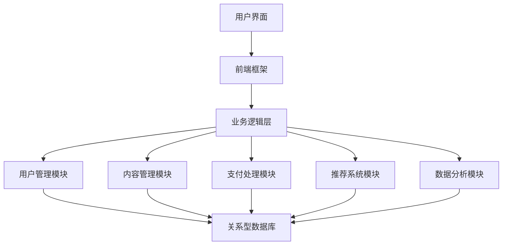
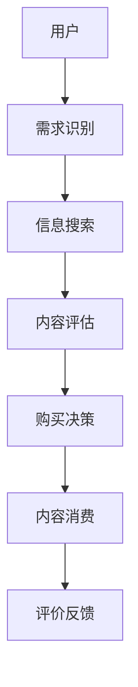
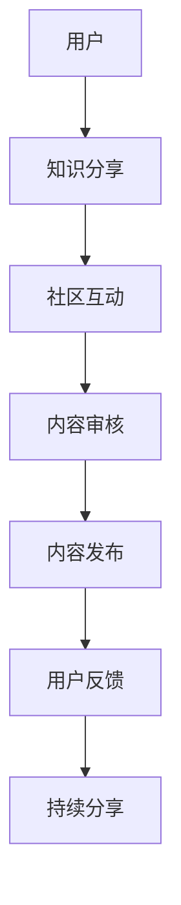
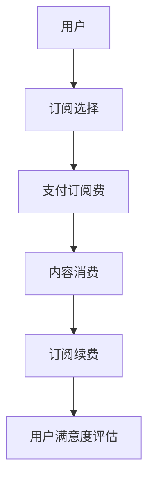

                 

# 知识经济时代下的知识付费创新商业模式运营

## 概述与关键词

关键词：知识经济、知识付费、商业模式、用户行为、创新策略

在知识经济时代，知识已成为推动经济发展的重要资源。知识付费作为一种新兴商业模式，逐渐改变了传统的知识传播方式。本文旨在探讨知识经济背景下，知识付费创新商业模式的运营策略，包括核心模式解析、创新策略和未来趋势。

## 摘要

本文首先分析了知识经济时代的背景，随后深入探讨了知识付费市场的现状和用户行为。接着，文章详细解析了知识付费的核心模式，包括内容付费模式、知识分享模式和知识订阅模式。在此基础上，文章提出了知识付费商业模式的创新策略，并通过实际案例进行了解读。最后，文章总结了知识付费行业的发展趋势，为未来的商业模式创新提供了思考方向。

### 目录

1. **引言与概述**
    1.1 知识经济定义与发展历程
    1.2 知识付费市场现状
    1.3 知识付费商业模式演变
2. **知识付费用户行为分析**
    2.1 用户需求特征
    2.2 用户决策模型
    2.3 用户满意度评估
3. **知识付费核心模式解析**
    3.1 内容付费模式
    3.2 知识分享模式
    3.3 知识订阅模式
4. **知识付费SaaS平台搭建**
    4.1 平台架构设计
    4.2 技术选型与开发工具
    4.3 安全性与隐私保护
5. **知识付费商业模式创新**
    5.1 创新模式策略
    5.2 创新模式评估方法
    5.3 创新模式实施步骤
6. **案例分析：成功知识付费模式解析**
    6.1 案例一：知识付费平台运营策略
    6.2 案例二：知识分享社区成功经验
    6.3 案例三：订阅服务模式创新
7. **知识付费商业模式未来趋势**
    7.1 行业发展趋势分析
    7.2 技术革新对知识付费的影响
    7.3 未来商业模式探索
8. **附录**
    8.1 知识付费相关术语与概念
    8.2 知识付费商业模型Mermaid流程图
    8.3 参考资源

### 第一部分：引言与概述

在当今世界，知识经济的兴起正改变着传统经济模式的运作方式。知识经济，顾名思义，是以知识和信息的创造、传播和应用为核心驱动力的经济形态。与资源经济、劳动力经济不同，知识经济强调知识的价值，认为知识是经济增长的关键因素。这一转变不仅体现在经济领域的重构，也深刻影响了社会的方方面面。

知识付费，作为知识经济时代的一种新兴商业模式，其核心在于通过价值交换，使知识的创造者和传播者得到经济回报。知识付费不仅仅是简单的买卖关系，更涉及到用户需求、内容质量、平台运营等多方面的复杂交互。随着互联网技术的发展和普及，知识付费市场迅速扩展，越来越多的平台和内容创作者加入其中，形成了一个庞大而活跃的生态系统。

本篇文章将围绕知识经济时代下的知识付费创新商业模式运营展开讨论。首先，我们将分析知识经济的背景和知识付费市场的现状。接着，深入探讨知识付费的核心模式，包括内容付费模式、知识分享模式和知识订阅模式。在此基础上，本文将提出知识付费商业模式的创新策略，并通过实际案例进行解析。最后，我们将对知识付费行业的未来趋势进行展望，为未来的商业模式创新提供思考方向。

通过对知识付费商业模式的全面解析，本文旨在为行业从业者和研究者提供有价值的参考，帮助他们在竞争激烈的市场环境中找到合适的运营策略，实现商业模式的创新和可持续发展。

### 第1章：知识经济时代背景分析

#### 1.1 知识经济定义与发展历程

知识经济，是指以知识和信息的生产、传播和应用为主要推动力的经济形态。与传统的资源经济和劳动力经济不同，知识经济强调知识的创造、传播和利用在经济增长中的核心作用。知识经济起源于20世纪后半叶，随着信息技术的迅猛发展和全球化的推进，知识逐渐成为全球经济增长的新动力。

知识经济的历史可以追溯到20世纪60年代，当时信息技术开始逐步普及，特别是计算机和互联网技术的发展，为知识经济的兴起奠定了基础。进入20世纪80年代，随着信息技术的进一步成熟，知识经济逐渐从理论探讨走向实际应用。20世纪90年代，知识经济成为全球经济发展的重要趋势，美国等发达国家率先进入知识经济时代。

知识经济的特点主要体现在以下几个方面：

1. **知识是核心资源**：知识经济以知识和信息为核心，取代了传统的自然资源和劳动力。知识成为创造价值的关键，企业的核心竞争力也越来越多地依赖于知识的积累和创新。

2. **创新能力是驱动力**：知识经济强调创新的重要性，创新不仅是经济增长的驱动力，也是社会进步的重要标志。创新能力的提升，使得知识得以快速传播和应用，从而推动经济的持续增长。

3. **全球化是趋势**：知识经济的全球化特征十分明显。随着互联网和全球贸易的发展，知识和信息跨越国界，形成了全球范围内的知识流动和共享。全球化使得知识经济成为全球共同参与和共享的经济形态。

4. **可持续发展**：知识经济倡导可持续发展的理念，强调在经济增长过程中要兼顾环境保护和社会责任。通过知识的应用和创新，实现资源的合理配置和环境的可持续发展。

#### 1.2 知识付费市场现状

知识付费市场在近年来呈现出快速发展的态势，成为知识经济时代的重要经济现象。根据市场研究数据显示，全球知识付费市场规模逐年扩大，预计未来几年将持续增长。知识付费市场的现状可以从以下几个方面进行分析：

1. **市场规模**：知识付费市场的规模日益扩大。根据Statista的数据，全球知识付费市场规模已达到数百亿美元，并且预计在未来几年内还将保持快速增长。

2. **用户增长**：随着互联网的普及和知识付费意识的提高，知识付费用户数量也在不断增长。尤其是在中国、美国等互联网发达国家和地区，知识付费用户已经形成了一股庞大的消费群体。

3. **内容多样化**：知识付费内容涵盖了广泛的主题，从专业课程、技能培训到文学、艺术、生活等多个领域。多样化的内容满足了不同用户的需求，使得知识付费市场更加繁荣。

4. **平台多样化**：知识付费平台层出不穷，如Coursera、Udemy、知识星球、得到等，这些平台通过不同的运营模式和内容策略，吸引了大量用户。平台的多样化也推动了知识付费市场的竞争和发展。

#### 1.3 知识付费商业模式演变

知识付费商业模式经历了从传统教育到互联网化、再到现在的多元化演变过程。以下是知识付费商业模式演变的主要阶段：

1. **传统教育模式**：在知识经济初期，知识付费主要通过传统的教育机构和出版社进行。这一阶段的商业模式相对单一，主要依赖于课程收费和书籍销售。

2. **互联网化模式**：随着互联网技术的发展，知识付费开始向线上迁移。在线教育平台如Coursera、Udemy等，通过提供海量的在线课程，满足了用户灵活学习的需求。这一阶段的商业模式实现了从线下到线上的转变，提高了知识传播的效率。

3. **多元化模式**：在当前知识经济时代，知识付费商业模式进一步多元化。除了在线教育平台，知识分享社区、知识订阅服务、知识付费问答等多种模式纷纷涌现。多元化的商业模式不仅满足了不同用户的需求，也推动了知识付费市场的快速发展。

4. **平台生态系统**：随着知识付费市场的发展，平台生态系统逐渐形成。平台不仅提供内容服务，还通过社区互动、用户评价、个性化推荐等功能，提升了用户体验，增强了用户粘性。

知识付费商业模式的演变，不仅反映了知识经济时代的发展趋势，也体现了信息技术对社会经济形态的深刻影响。未来，随着技术的不断进步和市场需求的多样化，知识付费商业模式将继续创新和演变，为知识经济的发展注入新的动力。

### 第2章：知识付费用户行为分析

#### 2.1 用户需求特征

知识付费市场的蓬勃发展离不开用户需求的变化和多样。用户需求是知识付费商业模式设计和运营的核心，因此，深入分析用户需求特征至关重要。

1. **知识获取的灵活性**：现代用户追求知识获取的灵活性，希望通过便捷的方式获取所需的知识。在线学习平台提供的灵活学习时间、地点和方式，满足了用户个性化需求。

2. **内容质量的重视**：用户对于知识内容的质量要求越来越高。高质量的内容不仅包含深度的知识，还需要具备实用性、可操作性。因此，内容创作者需要不断提升内容质量，以满足用户的期望。

3. **个性化的学习体验**：用户希望获得个性化的学习体验，包括课程推荐、学习进度跟踪、个性化问答等。通过提供个性化的服务，平台可以增强用户粘性和满意度。

4. **社交互动的需求**：用户希望在获取知识的同时，能够与他人进行交流和互动。知识分享社区和问答平台等社交功能，为用户提供了互动交流的空间，增强了学习的趣味性和效果。

5. **及时性和实时性的需求**：随着信息技术的发展，用户对于知识获取的及时性和实时性要求也越来越高。线上课程、直播讲座等实时性内容，受到了用户的青睐。

6. **自我提升和职业发展的需求**：用户不仅关注知识的获取，更希望通过学习实现自我提升和职业发展。职业技能培训、职业规划咨询等服务，满足了用户的这一需求。

#### 2.2 用户决策模型

用户在知识付费过程中会经历一个复杂的决策过程，包括需求识别、信息搜索、评估选择、购买决策和购后评价等阶段。以下是用户决策模型的分析：

1. **需求识别**：用户在日常生活中遇到知识需求，例如职业发展、技能提升等。需求识别是用户决策过程的起点。

2. **信息搜索**：用户在识别需求后，会通过各种渠道进行信息搜索，以获取潜在的知识产品信息。信息搜索的途径包括搜索引擎、推荐系统、社交媒体等。

3. **评估选择**：用户在获取到信息后，会根据多个维度对知识产品进行评估，包括内容质量、平台信誉、用户评价等。评估选择阶段是用户决策过程的关键，决定了用户是否会继续进行购买决策。

4. **购买决策**：用户在评估选择后，如果认为知识产品符合自己的需求，就会进行购买决策。购买决策受多种因素影响，如价格、优惠活动、品牌信誉等。

5. **购后评价**：用户在购买知识产品后，会根据学习体验和实际效果进行评价。购后评价不仅影响用户的二次购买决策，还会影响其他潜在用户的购买行为。

#### 2.3 用户满意度评估

用户满意度是衡量知识付费商业模式成功与否的重要指标。用户满意度评估可以从以下几个方面进行：

1. **内容质量**：内容质量是用户满意度的核心因素。高质量的内容能够满足用户的学习需求，提升用户的满意度和忠诚度。

2. **服务体验**：服务体验包括平台的交互界面、课程设计、客服响应等。良好的服务体验能够提升用户的满意度。

3. **社交互动**：社交互动包括用户在社区、论坛、问答平台等进行的交流和互动。活跃的社交互动能够增强用户的归属感和学习动力。

4. **学习效果**：学习效果是用户满意度的直接体现。用户通过学习实现了自我提升和职业发展，会感到满意。

5. **品牌信誉**：品牌信誉是用户选择知识产品的重要因素。高信誉的品牌能够提升用户的信任感和满意度。

为了有效评估用户满意度，平台可以采用以下方法：

1. **用户调查**：通过在线调查、问卷等形式，收集用户对知识产品的评价。

2. **用户反馈**：建立用户反馈机制，及时收集和处理用户的意见和建议。

3. **用户留存率**：通过用户留存率分析，了解用户对知识产品的长期满意度。

4. **用户口碑**：通过用户口碑传播，了解用户对知识产品的评价和推荐情况。

通过全面分析用户需求特征、决策模型和满意度评估，知识付费平台可以更好地了解用户需求，优化商业模式，提升用户满意度，实现可持续发展。

### 第3章：知识付费核心模式解析

#### 3.1 内容付费模式

内容付费模式是知识付费中最常见的模式之一，它通过提供高质量的内容来吸引用户付费，从而实现商业价值。内容付费模式的核心在于如何提供有价值、高质量的内容，以吸引并留住用户。

**内容付费类型的分类与特点**：

1. **在线课程**：在线课程是内容付费模式中的主流形式，用户通过购买课程，可以在平台上进行自主学习和进度管理。在线课程的特点包括灵活的学习时间、丰富的内容形式（如视频、文本、音频等）以及互动性。

2. **电子书**：电子书是传统出版物在互联网时代的延伸，用户可以通过购买电子书进行阅读。电子书的特点是便于携带、低价格和丰富的内容种类。

3. **专业文章**：专业文章通常由行业专家或学者撰写，涉及某个领域的深度分析和研究。专业文章的特点是专业性强、内容深入、针对特定用户群体。

4. **音视频课程**：音视频课程通过音频和视频的形式进行知识传授，用户可以通过观看视频或收听音频进行学习。音视频课程的特点是生动形象、易于理解，特别适合传授复杂知识。

**内容付费产业链分析**：

内容付费产业链主要包括内容创作者、平台、用户以及支付环节。

1. **内容创作者**：内容创作者是内容付费模式的核心，他们通过创作高质量的内容，吸引用户付费。内容创作者包括行业专家、学者、教育机构以及独立的知识博主。

2. **平台**：平台是连接内容创作者和用户的桥梁，为内容创作者提供发布和推广内容的渠道，为用户提供了购买和学习的平台。平台的主要功能包括内容管理、支付系统、用户管理和推荐系统。

3. **用户**：用户是内容付费模式的消费主体，他们通过购买内容，实现了知识获取和自我提升。用户需求多样，包括职业发展、技能提升、兴趣爱好等。

4. **支付环节**：支付环节是内容付费模式的重要组成部分，用户通过支付系统完成购买行为，平台从中获得收益。

**案例分析**：

以Udemy为例，Udemy是一个全球知名的在线教育平台，其内容付费模式主要包括以下方面：

1. **课程发布**：Udemy平台允许内容创作者免费发布课程，通过课程销售获得收益。内容创作者可以设定课程的售价和推广策略。

2. **课程推广**：Udemy通过搜索引擎优化（SEO）、社交媒体营销、邮件营销等方式，帮助内容创作者推广课程，吸引更多用户购买。

3. **用户购买**：用户可以通过Udemy平台购买课程，平台提供多种支付方式，如信用卡、PayPal等。

4. **课程学习**：用户购买课程后，可以在Udemy平台上进行学习，平台提供学习进度跟踪、互动讨论区等功能。

5. **评价与推荐**：用户在学习完成后，可以对课程进行评价，评价会影响课程的排名和推荐。高评价的课程更容易吸引新用户。

通过分析内容付费模式的类型、产业链和案例分析，我们可以看到，内容付费模式在知识付费市场中占据了重要地位。未来，随着技术的进步和用户需求的变化，内容付费模式将继续创新和优化，为知识付费市场的发展注入新的动力。

#### 3.2 知识分享模式

知识分享模式是知识付费市场中另一种重要的商业模式，它通过搭建平台，鼓励用户共享知识，实现知识传播和共享。知识分享模式的核心在于如何激发用户的参与热情，构建一个健康的知识生态系统。

**知识分享社区分析**：

知识分享社区是知识分享模式的主要载体，它为用户提供了交流、分享和获取知识的平台。知识分享社区具有以下特点：

1. **用户主导**：知识分享社区的核心是用户，用户既是知识的创造者，也是知识的消费者。社区鼓励用户主动分享自己的知识和经验，形成了一个用户主导的知识生态系统。

2. **开放性**：知识分享社区具有高度的开放性，用户可以自由地发表观点、分享知识，也可以参与他人的讨论。这种开放性促进了知识的广泛传播和共享。

3. **互动性**：知识分享社区强调用户之间的互动，通过评论、点赞、问答等方式，用户可以互相交流、讨论和解决问题。互动性增强了社区的活跃度和用户粘性。

4. **社区文化**：知识分享社区形成了一种独特的社区文化，用户在这种文化氛围中，乐于分享和帮助他人。社区文化不仅促进了知识传播，也增强了社区的凝聚力。

**平台运营策略**：

平台运营策略是知识分享模式成功的关键，以下是一些关键策略：

1. **激励机制**：平台通过设置激励机制，鼓励用户积极参与知识分享。激励机制包括积分奖励、用户等级、积分兑换等。通过激励机制，平台可以激发用户的参与热情，促进知识传播。

2. **内容质量控制**：平台需要对分享的内容进行质量控制，确保内容的准确性和可靠性。平台可以通过内容审核、用户举报等方式，维护社区的内容质量。

3. **社区文化建设**：平台需要注重社区文化建设，营造一个积极、互助的社区氛围。社区文化可以通过活动组织、用户互动、社区规范等方式进行建设。

4. **用户参与度提升**：平台可以通过各种方式提升用户的参与度，如发起话题、组织活动、设置排行榜等。通过提升用户参与度，平台可以增强用户粘性，促进知识传播。

**用户参与激励机制**：

用户参与激励机制是知识分享模式的重要组成部分，以下是一些常见的用户参与激励机制：

1. **积分系统**：平台可以通过积分系统激励用户参与。用户在社区中的各种活动（如发帖、评论、回答问题等）都可以获得积分，积分可以兑换实物奖励或虚拟物品。

2. **用户等级**：平台可以通过设置用户等级，激励用户持续参与。用户等级越高，享受的权益和特权越多，如优先回答问题、参与活动等。

3. **奖励制度**：平台可以通过设立奖励制度，对贡献突出的用户进行奖励。奖励可以是实物奖励（如电子产品、书籍等），也可以是虚拟奖励（如特权、会员等）。

4. **社区荣誉**：平台可以通过设置社区荣誉，对贡献突出的用户进行表彰。社区荣誉可以增强用户的荣誉感和成就感，促进用户持续参与。

通过分析知识分享社区的平台运营策略和用户参与激励机制，我们可以看到，知识分享模式通过激发用户的参与热情，实现了知识的广泛传播和共享。未来，随着技术的进步和用户需求的变化，知识分享模式将继续创新和优化，为知识付费市场的发展提供新的动力。

#### 3.3 知识订阅模式

知识订阅模式是知识付费市场中的重要组成部分，通过提供持续的知识服务，吸引用户进行长期订阅，从而实现商业价值。知识订阅模式的核心在于如何提供有价值、持续的知识服务，以吸引并留住用户。

**订阅服务模式解析**：

知识订阅模式的基本形式是用户通过付费订阅，获得平台提供的持续知识服务。订阅服务通常包括以下特点：

1. **持续的知识更新**：订阅平台会定期更新内容，确保用户获得最新的知识。内容更新可以是定期的课程发布、专题讲座、研究报告等形式。

2. **个性化的内容推荐**：订阅平台通过算法和用户数据分析，为用户推荐个性化的内容。个性化推荐可以提高用户的学习体验和满意度。

3. **丰富的内容形式**：订阅平台提供多种内容形式，如视频、音频、文本、图像等，满足不同用户的学习偏好。

4. **互动和反馈**：订阅平台通常提供互动功能，如在线问答、讨论区等，用户可以在平台上与其他用户互动，获取帮助和反馈。

**订阅平台案例分析**：

以得到App为例，得到App是一个知名的订阅服务平台，其订阅服务模式具有以下特点：

1. **内容多样化**：得到App提供多种类型的内容，包括音频课程、视频课程、电子书、专栏等，满足用户多样化的学习需求。

2. **专业的内容来源**：得到App的内容主要来自行业专家、学者、媒体机构等，保证了内容的权威性和专业性。

3. **个性化的内容推荐**：得到App通过算法和用户数据分析，为用户推荐个性化的内容。用户可以根据自己的兴趣和需求，订阅感兴趣的内容。

4. **互动和反馈**：得到App提供在线问答、讨论区等功能，用户可以在平台上与其他用户互动，获取帮助和反馈。

5. **持续的内容更新**：得到App定期更新内容，确保用户获得最新的知识。用户可以根据自己的需求，随时订阅新的课程或专题。

**订阅业务优化策略**：

为了提高订阅业务的竞争力，订阅平台可以从以下几个方面进行优化：

1. **内容质量提升**：订阅平台需要确保内容质量，通过严格的内容审核和内容更新机制，提高用户对内容的满意度。

2. **用户参与度提升**：订阅平台可以通过互动功能，提高用户的参与度。例如，通过设置讨论区、在线问答等，鼓励用户积极参与社区互动。

3. **个性化推荐优化**：订阅平台可以通过算法优化，提高个性化推荐的效果，为用户推荐更符合其需求的内容。

4. **用户满意度提升**：订阅平台可以通过用户反馈机制，了解用户的满意度，并根据用户反馈进行改进。

5. **优惠和促销策略**：订阅平台可以通过设置优惠和促销活动，吸引新用户，提高用户的订阅频率和时长。

通过分析订阅服务模式的解析和订阅平台案例分析，我们可以看到，知识订阅模式在知识付费市场中具有巨大的发展潜力。未来，随着技术的进步和用户需求的变化，知识订阅模式将继续创新和优化，为知识付费市场的发展注入新的动力。

### 第4章：知识付费SaaS平台搭建

#### 4.1 平台架构设计

知识付费SaaS（Software as a Service）平台的设计是构建一个高效、可扩展的知识传播和交易平台的关键。以下是平台架构设计的详细解析：

**技术架构分层**：

知识付费SaaS平台通常采用分层架构设计，包括表现层、业务逻辑层和数据层。

1. **表现层**：表现层主要负责与用户交互，包括前端界面和用户界面。前端界面可以使用现代前端框架（如React、Vue等）来构建，提供良好的用户体验。用户界面设计应简洁明了，便于用户快速导航和使用。

2. **业务逻辑层**：业务逻辑层包含平台的核心功能，如用户管理、内容管理、支付处理、推荐算法等。业务逻辑层的设计需要模块化，确保每个功能模块可以独立开发和维护。

3. **数据层**：数据层负责数据的存储和管理，通常使用关系型数据库（如MySQL、PostgreSQL）或NoSQL数据库（如MongoDB、Cassandra）。数据层需要支持高并发读写、数据备份和恢复等特性。

**核心功能模块**：

知识付费SaaS平台的核心功能模块包括以下方面：

1. **用户管理**：用户管理模块负责用户的注册、登录、权限管理、账户安全等操作。用户管理需要支持多用户身份验证（如邮箱、手机号、第三方账号等）。

2. **内容管理**：内容管理模块负责内容的上传、存储、分类、搜索、推荐等操作。内容管理需要支持多媒体内容的处理，如视频、音频、文档等。

3. **支付处理**：支付处理模块负责处理用户支付订单、支付验证、支付失败处理等操作。支付处理需要支持多种支付方式（如信用卡、PayPal、支付宝等），并确保支付过程的安全性和可靠性。

4. **推荐系统**：推荐系统模块负责根据用户行为和偏好，推荐用户可能感兴趣的内容。推荐系统可以使用机器学习算法（如协同过滤、内容推荐等）来实现。

5. **数据分析**：数据分析模块负责收集、处理和分析用户行为数据，用于优化平台运营策略和提升用户体验。数据分析需要支持实时数据分析和历史数据存储。

**系统架构图**：

以下是知识付费SaaS平台的基本系统架构图：

#### 4.2 技术选型与开发工具

在知识付费SaaS平台的开发过程中，选择合适的技术选型和开发工具至关重要。以下是技术选型和开发工具的详细解析：

**前端技术选型**：

1. **框架**：推荐使用React或Vue.js等现代前端框架。这些框架提供了组件化开发、虚拟DOM、状态管理等优势，可以提高开发效率和代码可维护性。

2. **UI库**：推荐使用Ant Design或Element UI等UI库。这些UI库提供了丰富的组件和样式，可以快速构建符合设计规范的用户界面。

**后端技术选型**：

1. **框架**：推荐使用Spring Boot或Django等后端框架。这些框架提供了快速开发、自动配置、易于扩展等特点，可以大大提高开发效率。

2. **数据库**：推荐使用MySQL或PostgreSQL等关系型数据库。这些数据库具有高性能、高可靠性、易于维护等特点，适合处理大量用户数据。

3. **缓存**：推荐使用Redis等缓存数据库。缓存可以提高系统的响应速度，减少数据库的压力。

**开发工具**：

1. **IDE**：推荐使用IntelliJ IDEA或Visual Studio Code等IDE。这些IDE提供了强大的开发工具、代码补全、调试功能等，可以提高开发效率。

2. **版本控制**：推荐使用Git进行版本控制。Git可以方便地管理代码版本，支持多人协作开发。

3. **持续集成/持续部署（CI/CD）**：推荐使用Jenkins等CI/CD工具。CI/CD可以自动化测试、构建和部署代码，提高开发效率和软件质量。

#### 4.3 安全性与隐私保护

安全性是知识付费SaaS平台的重要考量因素，尤其是在涉及用户数据和支付信息的情况下。以下是安全性与隐私保护的详细解析：

**安全措施**：

1. **数据加密**：对用户敏感数据进行加密存储和传输，包括用户密码、支付信息等。可以使用AES等加密算法进行加密。

2. **访问控制**：使用访问控制机制，确保只有授权用户才能访问特定数据和功能。可以使用角色权限控制、基于令牌的认证等机制。

3. **防火墙和入侵检测**：使用防火墙和入侵检测系统，监控和防御网络攻击。可以部署WAF（Web应用防火墙）来防止常见攻击，如SQL注入、跨站脚本攻击等。

4. **安全审计**：定期进行安全审计，检查系统漏洞和安全隐患。可以采用漏洞扫描工具和手动审计相结合的方式。

**隐私保护**：

1. **隐私政策**：明确告知用户平台收集、使用和存储数据的方式，并取得用户的同意。隐私政策应易于理解，用户可以随时查阅和修改。

2. **数据匿名化**：对用户数据进行匿名化处理，确保用户隐私不受侵犯。可以使用去标识化技术，删除或模糊化敏感信息。

3. **数据最小化**：只收集和处理实现服务所需的最少数据。减少不必要的用户数据收集，降低隐私泄露风险。

4. **数据存储和保护**：确保用户数据存储在安全可靠的环境中，采用数据备份和恢复机制，防止数据丢失和损坏。

通过以上平台架构设计、技术选型与开发工具、安全性与隐私保护的详细解析，知识付费SaaS平台可以构建一个高效、安全、可靠的知识传播和交易平台，为用户提供优质的服务体验。

### 第5章：知识付费商业模式创新

#### 5.1 创新模式策略

在知识付费市场日益竞争激烈的背景下，商业模式创新成为企业持续发展的关键。以下是一些创新的商业模式策略，以及如何实施这些策略。

**1. 多元化内容策略**

**概念**：通过提供多样化的内容类型和主题，满足不同用户群体的需求。

**实施步骤**：
- **内容多样化**：不仅提供在线课程，还可以包括电子书、专业文章、音视频课程等。
- **用户调研**：通过调研了解用户偏好，设计多样化的内容。
- **内容合作**：与行业专家、教育机构合作，增加内容的专业性和多样性。

**案例**：得到App通过提供音频课程、电子书、专栏等多种形式的内容，吸引了广泛的用户群体。

**2. 社交互动策略**

**概念**：通过社交互动功能，增强用户参与度和平台粘性。

**实施步骤**：
- **互动功能**：在平台上增加讨论区、问答、直播等功能，鼓励用户互动。
- **社区建设**：建立知识社区，培养用户的归属感和忠诚度。
- **用户激励**：通过积分、勋章、排名等激励措施，鼓励用户积极参与。

**案例**：知乎通过问答社区和讨论区，促进了用户之间的互动和知识分享。

**3. 订阅捆绑策略**

**概念**：通过捆绑订阅不同的内容和服务，提供更优惠的套餐，吸引用户长期订阅。

**实施步骤**：
- **套餐设计**：设计多样化的订阅套餐，包括单独订阅和捆绑订阅。
- **价格优惠**：提供捆绑订阅的优惠价格，吸引用户订阅。
- **用户反馈**：收集用户反馈，优化套餐内容和价格。

**案例**：网易云课堂通过推出多种套餐，包括单独课程订阅和学科包订阅，吸引用户长期订阅。

**4. 知识变现策略**

**概念**：通过知识变现，将用户学习成果转化为实际收益。

**实施步骤**：
- **证书和认证**：提供学习完成证书和职业认证，帮助用户证明其学习成果。
- **知识交易**：建立知识交易平台，让用户将自己的知识和经验变现。
- **收益分享**：与用户分享知识变现的收益，激励用户创作高质量内容。

**案例**：分答通过知识交易，让用户将自己的经验和知识变现，获得了广泛的市场认可。

**5. 数据驱动策略**

**概念**：利用大数据和人工智能技术，优化用户体验和运营策略。

**实施步骤**：
- **用户数据分析**：收集和分析用户行为数据，了解用户偏好和需求。
- **个性化推荐**：基于数据分析，为用户提供个性化的内容推荐。
- **运营优化**：根据数据反馈，优化运营策略，提升用户满意度和留存率。

**案例**：网易云课堂通过数据分析，实现了个性化推荐和精准营销，提升了用户满意度和平台活跃度。

通过以上创新模式策略，知识付费企业可以在激烈的市场竞争中脱颖而出，实现可持续发展。

#### 5.2 创新模式评估方法

创新商业模式在知识付费行业中具有重要意义，但如何有效评估其成功与否是一个复杂的问题。以下是一些评估创新模式的方法：

**1. 成本效益分析**

**概念**：通过比较创新模式带来的成本和收益，评估其经济可行性。

**实施步骤**：
- **成本计算**：计算创新模式带来的直接和间接成本，包括开发成本、运营成本、推广成本等。
- **收益预测**：预测创新模式带来的收益，包括直接收益（如订阅费用、课程销售）和间接收益（如用户留存、品牌提升）。
- **成本效益比**：计算成本与收益的比率，评估创新模式的成本效益。

**案例**：某知识付费平台在推出知识交易功能后，通过成本效益分析发现，虽然初期投入较大，但长期来看，知识交易的收益显著高于成本。

**2. 用户满意度调查**

**概念**：通过调查用户对创新模式的满意度，评估其用户体验和接受度。

**实施步骤**：
- **满意度问卷**：设计满意度调查问卷，包括对创新模式的功能、质量、价格等方面的评价。
- **数据分析**：收集用户反馈数据，分析满意度得分。
- **用户访谈**：进行用户访谈，深入了解用户对创新模式的看法和建议。

**案例**：某平台在推出订阅捆绑策略后，通过用户满意度调查发现，大部分用户对套餐内容和价格表示满意，从而提高了订阅率。

**3. 竞争分析**

**概念**：通过分析竞争对手的创新模式，评估其竞争力和市场地位。

**实施步骤**：
- **竞争对手分析**：研究主要竞争对手的创新模式，包括其优点和不足。
- **市场定位**：评估创新模式在市场中的定位和差异化优势。
- **市场份额**：分析创新模式对市场份额的影响。

**案例**：在知识分享社区领域，通过竞争分析可以发现，某个成功模式的竞争对手主要集中在用户互动和内容质量方面，因此可以在这些方面进行优化。

**4. 商业模式画布**

**概念**：使用商业模式画布，全面评估创新模式的不同方面，如客户细分、价值主张、渠道、客户关系、收入来源、关键资源、关键活动、关键合作伙伴和成本结构。

**实施步骤**：
- **画布构建**：根据商业模式画布的九个方面，详细描述创新模式。
- **画布评估**：对每个方面进行评估，识别优势和潜在风险。
- **画布优化**：根据评估结果，对商业模式画布进行优化。

**案例**：通过商业模式画布，某知识付费平台发现其订阅服务的收入来源单一，因此决定增加广告收入和其他增值服务，以多元化收入结构。

通过以上评估方法，知识付费企业可以全面了解创新模式的成效，为商业模式调整提供依据。

#### 5.3 创新模式实施步骤

创新商业模式的实施是一个系统工程，涉及战略规划、资源配置、团队协作等多个方面。以下是一些关键步骤，以帮助知识付费企业成功实施创新模式。

**1. 制定详细战略规划**

**概念**：制定详细的战略规划，明确创新模式的目标、路径和资源需求。

**实施步骤**：
- **目标设定**：明确创新模式的核心目标，如提高用户满意度、增加收入来源等。
- **路径规划**：制定实现目标的详细步骤，包括时间表、里程碑等。
- **资源评估**：评估所需资源，包括人力、资金、技术等。

**案例**：某平台在推出知识交易功能时，制定了详细的战略规划，包括用户调研、产品开发、市场推广等步骤，确保项目的顺利实施。

**2. 合理配置资源**

**概念**：合理配置资源，确保创新模式所需的资金、人力、技术等资源得到有效利用。

**实施步骤**：
- **预算分配**：根据战略规划，合理分配预算，确保每个环节都有足够的资金支持。
- **团队搭建**：组建专业的团队，包括产品经理、开发人员、运营人员等，确保每个环节都有专业人才。
- **技术支持**：确保技术团队具备实施创新模式所需的技术能力和资源。

**案例**：在实施订阅捆绑策略时，某平台通过合理配置资源，组建了跨部门的团队，确保了项目的高效推进。

**3. 团队协作与沟通**

**概念**：加强团队协作与沟通，确保各个环节的顺畅对接，提高项目执行力。

**实施步骤**：
- **明确分工**：明确团队每个成员的职责和任务，确保责任到人。
- **定期会议**：定期召开项目会议，分享进展和问题，协调解决。
- **反馈机制**：建立反馈机制，及时收集团队成员的意见和建议，优化项目实施过程。

**案例**：在开发知识付费SaaS平台时，某平台通过定期召开项目会议和建立反馈机制，确保了项目的顺利进行。

**4. 推广与营销**

**概念**：通过有效的推广与营销策略，提高创新模式的知名度和用户接受度。

**实施步骤**：
- **市场调研**：进行市场调研，了解目标用户的需求和偏好。
- **营销策略**：制定合适的营销策略，包括内容营销、社交媒体营销、广告投放等。
- **用户引导**：通过引导用户参与体验和试用，获取用户反馈，优化产品和服务。

**案例**：在推广订阅捆绑策略时，某平台通过内容营销和社交媒体营销，吸引了大量用户关注，提高了订阅率。

**5. 持续优化与迭代**

**概念**：创新模式实施后，通过持续优化和迭代，不断提升用户体验和商业模式成效。

**实施步骤**：
- **用户反馈**：收集用户反馈，了解用户需求和满意度。
- **数据分析**：通过数据分析，识别用户行为和需求的变化，优化产品和服务。
- **迭代更新**：根据用户反馈和数据分析，进行产品和服务迭代更新。

**案例**：在实施多元化内容策略后，某平台通过持续优化内容质量和推荐算法，提升了用户体验和用户满意度。

通过以上实施步骤，知识付费企业可以系统化地推进创新模式的实施，实现商业模式的持续创新和优化。

### 第6章：案例分析：成功知识付费模式解析

#### 6.1 案例一：知识付费平台运营策略

**1. 平台概述**

得到App是一家知名的知识付费平台，提供包括音频课程、电子书、专栏等多种形式的内容。它的成功得益于一系列有效的运营策略。

**2. 运营策略**

1. **内容策略**：
   - **多样化内容**：得到App提供了多种类型的内容，包括音频课程、电子书、专栏等，满足了不同用户的需求。
   - **高质量内容**：内容主要由行业专家、学者和媒体机构提供，保证了内容的质量和权威性。
   - **内容推荐**：通过算法推荐系统，为用户推荐个性化内容，提高用户的满意度和粘性。

2. **用户策略**：
   - **用户激励**：通过积分、勋章、排名等激励机制，鼓励用户参与社区互动和内容创作。
   - **用户反馈**：重视用户反馈，通过问卷调查、用户访谈等方式，了解用户需求，不断优化平台服务。

3. **推广策略**：
   - **内容营销**：通过撰写高质量的博客、文章，分享平台上的优秀课程和专栏，吸引用户关注。
   - **社交媒体推广**：利用微信、微博等社交媒体平台，进行定期内容推广和用户互动。

**3. 运营成效**

- **用户增长**：通过有效的运营策略，得到App吸引了大量用户，用户数量持续增长。
- **内容消费**：用户活跃度高，内容消费量大幅提升，平台的收入稳步增长。
- **品牌影响力**：得到App在知识付费领域建立了良好的品牌形象，用户对其内容和服务满意度高。

#### 6.2 案例二：知识分享社区成功经验

**1. 社区概述**

知乎是一个知名的知识分享社区，用户可以在社区中提问、回答问题，分享知识和经验。知乎的成功在于其独特的社区文化和发展策略。

**2. 发展策略**

1. **社区文化**：
   - **专业性强**：知乎强调专业性和深度，吸引了大量专业用户参与。
   - **互动性**：知乎通过问答、讨论区等功能，鼓励用户之间的互动和交流。
   - **内容质量控制**：知乎通过严格的审核机制，确保社区内容的准确性和质量。

2. **用户策略**：
   - **用户激励**：通过积分、排名等激励机制，鼓励用户积极参与社区互动。
   - **用户成长**：知乎提供了多种成长路径，如优秀回答者认证、知乎盐选会员等，帮助用户实现自我提升。

3. **内容策略**：
   - **高质量内容**：知乎注重高质量内容的创作和传播，通过优秀回答者认证等机制，激励用户创作优质内容。
   - **知识库建设**：知乎通过积累和整理高质量的问答内容，形成了丰富的知识库，为用户提供有价值的信息。

**3. 发展成效**

- **用户活跃度**：知乎社区用户活跃度高，问答互动频繁，社区氛围良好。
- **内容质量**：知乎上的内容质量高，用户获取信息的效率和效果显著。
- **品牌影响力**：知乎在知识分享领域建立了强大的品牌影响力，用户对其信任度较高。

#### 6.3 案例三：订阅服务模式创新

**1. 平台概述**

网易云课堂是一个提供在线课程的知识付费平台，其订阅服务模式在知识付费市场中具有代表性。

**2. 创新策略**

1. **订阅捆绑**：
   - **多样化套餐**：网易云课堂提供了多种订阅套餐，包括单独课程订阅和学科包订阅，满足不同用户的需求。
   - **价格优惠**：通过捆绑订阅的方式，提供更优惠的价格，吸引用户长期订阅。

2. **内容更新**：
   - **定期更新**：网易云课堂定期更新课程内容，确保用户获得最新的知识和技能。
   - **个性化推荐**：通过算法推荐系统，为用户推荐个性化的课程内容，提升用户的学习体验。

3. **用户互动**：
   - **讨论区**：网易云课堂提供了讨论区，用户可以在平台上与其他用户互动，交流学习经验和心得。
   - **直播互动**：通过直播课程，用户可以与讲师实时互动，提高学习效果。

**3. 发展成效**

- **订阅率提升**：通过订阅捆绑策略和价格优惠，网易云课堂的订阅率显著提升。
- **用户粘性增强**：通过定期更新和用户互动，增强了用户对平台的粘性。
- **品牌影响力扩大**：网易云课堂在知识付费领域建立了良好的品牌形象，用户对其认可度较高。

通过以上案例分析，我们可以看到，成功的知识付费平台在内容、用户策略和运营策略等方面都有独特的做法。这些成功经验为其他知识付费企业提供了宝贵的参考和借鉴。

### 第7章：知识付费商业模式未来趋势

#### 7.1 行业发展趋势分析

随着知识经济的不断深化和互联网技术的飞速发展，知识付费行业正迎来一系列新的发展趋势。以下是知识付费行业的几个关键趋势：

1. **技术驱动**：人工智能、大数据、区块链等前沿技术的应用将极大地改变知识付费的运营模式。例如，人工智能可以通过个性化推荐算法，提高用户的学习体验；大数据分析可以更精准地了解用户需求，优化内容生产和营销策略；区块链技术可以为知识付费提供更安全、可靠的交易环境。

2. **多元化内容**：知识付费内容将更加多元化，不仅涵盖教育、职业发展等领域，还将扩展到艺术、文学、健康等更多领域。平台将提供更丰富的内容形式，如互动式课程、虚拟现实（VR）教学等，以满足用户多样化的学习需求。

3. **社区化运营**：知识付费平台将更加重视社区建设，通过社交互动功能增强用户粘性。社区化运营将促进用户之间的知识分享和交流，形成知识共创和共享的生态系统。

4. **跨界融合**：知识付费将与更多行业进行跨界融合，如娱乐、旅游、电商等。跨界合作将带来新的商业模式和业务增长点，为知识付费行业注入新的活力。

5. **国际市场拓展**：随着全球化的推进，知识付费市场将呈现国际化趋势。平台将积极拓展国际市场，提供本地化内容和服务，满足不同国家和地区用户的需求。

#### 7.2 技术革新对知识付费的影响

技术革新对知识付费行业的影响是深远和广泛的，主要体现在以下几个方面：

1. **个性化推荐**：人工智能和大数据技术使得个性化推荐成为可能。通过分析用户行为数据，平台可以为用户提供个性化的学习内容推荐，提高用户满意度和留存率。

2. **智能教学**：人工智能技术将推动智能教学的发展。智能教学系统可以根据学生的学习进度和能力，提供个性化的教学方案，提高学习效果。

3. **内容安全**：区块链技术可以为知识付费提供更安全的内容分发和交易环境。通过区块链技术，可以确保内容的真实性和完整性，防止抄袭和侵权行为。

4. **虚拟现实（VR）教学**：VR技术将为知识付费带来全新的学习体验。通过VR技术，用户可以身临其境地参与课程，增强学习的趣味性和互动性。

5. **支付便利性**：移动支付、数字货币等新兴支付方式将提高支付便利性，降低交易成本。这将吸引更多用户参与知识付费，扩大市场规模。

#### 7.3 未来商业模式探索

随着技术的不断进步和用户需求的变化，知识付费商业模式将不断创新和演化。以下是未来知识付费商业模式的一些探索方向：

1. **订阅制与一次性付费结合**：未来知识付费可能采取订阅制与一次性付费相结合的模式。用户可以按需选择订阅内容，同时保留一次性付费的灵活性。

2. **知识付费+电商**：知识付费平台将整合电商功能，提供知识商品化服务。例如，用户在学习过程中可以直接购买相关书籍、工具等实体商品。

3. **知识付费+社交**：知识付费平台将更加重视社交功能，通过社交互动增强用户粘性和社区氛围。用户可以在平台上建立个人品牌，实现知识变现。

4. **知识付费+游戏**：知识付费与游戏的结合将带来全新的学习体验。通过将知识融入游戏场景，用户可以在娱乐中学习，提高学习效果。

5. **知识付费+服务**：知识付费平台将提供增值服务，如职业规划、创业辅导等，为用户提供全方位的支持。这种模式不仅增加了平台的收入来源，也提升了用户体验。

通过以上对知识付费商业模式未来趋势的分析，我们可以看到，知识付费行业正朝着多元化、技术驱动和跨界融合的方向发展。未来，知识付费企业需要不断创新和适应，才能在激烈的市场竞争中脱颖而出。

### 附录

#### 附录A：知识付费相关术语与概念

**术语定义**

1. **知识付费**：指用户为获取知识而进行的付费行为，包括购买在线课程、电子书、专业文章等。
2. **内容付费**：指通过提供高质量的知识内容，吸引用户付费，实现商业价值。
3. **知识分享**：指用户在平台上共享自己的知识和经验，促进知识的传播和共享。
4. **订阅模式**：用户通过定期支付费用，获得平台提供的持续知识服务。
5. **SaaS平台**：Software as a Service（软件即服务）平台，提供在线的知识内容和学习服务。

**概念解释**

1. **知识经济**：以知识和信息的生产、传播和应用为核心驱动力的经济形态。
2. **用户满意度**：用户对知识产品或服务满意的程度，是衡量知识付费商业模式成功与否的重要指标。
3. **商业模式创新**：通过改变产品或服务的提供方式、定价策略、市场定位等，实现商业模式的创新和优化。

#### 附录B：知识付费商业模型Mermaid流程图

**内容付费模式流程图**

**知识分享模式流程图**

**知识订阅模式流程图**

#### 附录C：参考资源

**学术研究论文**

1. Anderson, C. (2006). The Long Tail: Why the Future of Business is Selling Less of More. Hyperion.
2. Christensen, C. M., & Raynor, M. E. (2003). The Innovator's Solution: Creating and Sustaining Successful Growth. Harvard Business Press.

**行业报告**

1. Statista. (2021). Global Online Education Market. Retrieved from [Statista](https://www.statista.com/topics/1344/online-education-market/)
2. ReportLinker. (2020). Global Online Learning Market. Retrieved from [ReportLinker](https://www.reportlinker.com/search?q=online+learning)

**书籍推荐**

1. Christensen, C. M., Raynor, M. E., & McDonald, R. (2015). Disrupting Class: How Disruptive Innovation Will Change the Way the World Learns. McGraw-Hill.
2. Davenport, T. H., & Prusak, L. (1998). Working Knowledge: How Organizations Manage What They Know. Harvard Business Press.

