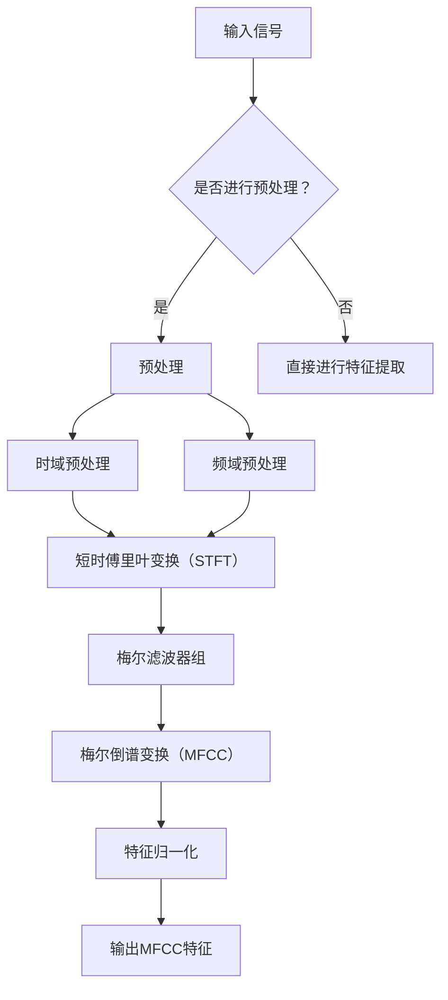

                 

# 《知识蒸馏与模型量化的结合应用》

## 摘要

本文深入探讨了知识蒸馏与模型量化这两种关键技术，并揭示了它们在深度学习模型压缩和优化中的结合应用。首先，我们详细介绍了知识蒸馏的定义、基本原理、发展历程，以及其在模型压缩中的应用策略。接着，我们阐述了模型量化的定义、基本原理、量化策略和量化方法，以及它们在模型优化中的重要作用。随后，文章通过具体的实例分析了知识蒸馏与模型量化在目标检测、语音识别和自然语言处理等领域的实际应用效果。最后，文章总结了在实际应用中可能面临的挑战及解决方案，并对未来的发展趋势进行了展望。通过本文，读者可以全面了解知识蒸馏与模型量化技术，掌握其在深度学习模型压缩和优化中的实际应用。

## 《知识蒸馏与模型量化的结合应用》目录大纲

### 第一部分：知识蒸馏与模型量化的基本概念

#### 第1章：知识蒸馏技术概述

##### 1.1 知识蒸馏的定义与作用
- 知识蒸馏的定义
- 知识蒸馏的作用与意义

##### 1.2 知识蒸馏的基本原理
- 大模型压缩与小模型重构
- 核心概念：软标签、硬标签

##### 1.3 知识蒸馏的发展历程
- 传统知识蒸馏方法
- 逐层知识蒸馏方法
- 基于注意力机制的知识蒸馏方法

### 第2章：模型量化的基本概念

##### 2.1 模型量化的定义与目的
- 模型量化的定义
- 模型量化的目的与优势

##### 2.2 模型量化的基本原理
- 量化策略：全精度量化、定点量化
- 量化方法：线性量化、非线性量化

##### 2.3 模型量化的应用场景
- 低功耗应用
- 边缘计算应用
- 资源受限设备应用

### 第二部分：知识蒸馏与模型量化的技术融合

#### 第3章：知识蒸馏与模型量化的融合策略

##### 3.1 知识蒸馏与模型量化的结合方法
- 知识蒸馏与量化协同优化
- 基于量化蒸馏的模型压缩方法

##### 3.2 知识蒸馏与模型量化的融合优势
- 模型精度提升
- 模型大小减少
- 模型运行速度提升

#### 第4章：融合应用实例分析

##### 4.1 实例1：目标检测模型的融合应用
- 算法介绍
- 实验设计
- 结果分析

##### 4.2 实例2：语音识别模型的融合应用
- 算法介绍
- 实验设计
- 结果分析

##### 4.3 实例3：自然语言处理模型的融合应用
- 算法介绍
- 实验设计
- 结果分析

### 第三部分：知识蒸馏与模型量化的实际应用

#### 第5章：知识蒸馏与模型量化在实际应用中的挑战与解决方案

##### 5.1 挑战1：模型精度下降
- 问题分析
- 解决方案

##### 5.2 挑战2：模型训练时间增加
- 问题分析
- 解决方案

##### 5.3 挑战3：模型大小增加
- 问题分析
- 解决方案

#### 第6章：知识蒸馏与模型量化的未来发展趋势

##### 6.1 技术发展趋势
- 深度学习模型的发展趋势
- 人工智能应用场景的发展趋势

##### 6.2 应用前景展望
- 低功耗应用
- 边缘计算应用
- 资源受限设备应用

#### 第7章：知识蒸馏与模型量化的实战教程

##### 7.1 实战准备
- 开发环境搭建
- 常用工具介绍

##### 7.2 实战步骤
- 数据准备
- 模型构建
- 模型训练
- 模型量化
- 模型评估

##### 7.3 实战案例分析
- 目标检测案例
- 语音识别案例
- 自然语言处理案例

### 附录：知识蒸馏与模型量化的资源与工具

#### 附录 A：知识蒸馏与模型量化相关工具
- 知识蒸馏工具
- 模型量化工具

#### 附录 B：知识蒸馏与模型量化论文推荐
- 知识蒸馏相关论文
- 模型量化相关论文

#### 附录 C：知识蒸馏与模型量化开源项目推荐
- 知识蒸馏开源项目
- 模型量化开源项目

## 第一部分：知识蒸馏与模型量化的基本概念

### 第1章：知识蒸馏技术概述

知识蒸馏是一种通过将知识从复杂模型（通常称为“教师模型”）传递到更简单模型（通常称为“学生模型”）的技术，旨在实现模型压缩和加速。本节将详细介绍知识蒸馏的定义、基本原理、发展历程，以及其在模型压缩中的应用策略。

#### 1.1 知识蒸馏的定义与作用

**知识蒸馏的定义：** 知识蒸馏是一种模型压缩技术，通过将一个大型、复杂的模型（教师模型）的知识转移到一个小型、高效的模型（学生模型）中来减小模型大小和加速推理过程。在这个过程中，教师模型输出软标签（通常为概率分布），学生模型则尝试学习这些软标签，从而实现模型压缩。

**知识蒸馏的作用与意义：** 
1. **模型压缩：** 知识蒸馏能够通过将复杂模型的知识转移到简单模型中来减小模型大小，使得模型可以在资源受限的设备上运行。
2. **加速推理：** 知识蒸馏通过减少模型参数数量，从而降低了模型在推理过程中的计算复杂度，实现了推理速度的显著提升。
3. **节省成本：** 知识蒸馏使得在训练和部署模型时所需的计算资源大大减少，从而降低了成本。

#### 1.2 知识蒸馏的基本原理

**大模型压缩与小模型重构：** 在知识蒸馏中，大模型（教师模型）通常是一个高度复杂的深度神经网络，它拥有大量的参数和层次结构。而小模型（学生模型）则是一个简化版的大模型，拥有较少的参数和层次结构。知识蒸馏的目标是通过训练小模型来重构大模型的知识。

**核心概念：软标签、硬标签：** 在知识蒸馏过程中，教师模型通常输出软标签（即概率分布）和硬标签（即分类结果）。软标签包含了教师模型对于输入数据的置信度信息，而硬标签则是教师模型的最终分类结果。学生模型的目标是通过学习软标签来重建教师模型的输出。

#### 1.3 知识蒸馏的发展历程

**传统知识蒸馏方法：** 最早的蒸馏方法主要基于信息论，如Kullback-Leibler散度（KL散度）和互信息（Mutual Information）。这些方法通过最小化教师模型和student模型之间的信息损失来实现模型压缩。

**逐层知识蒸馏方法：** 随着深度学习的发展，逐层知识蒸馏方法逐渐成为主流。这种方法将教师模型的输出逐层传递给学生模型，使得学生模型能够逐步学习教师模型的知识。逐层蒸馏方法包括顶向蒸馏（Top-Down）和底向蒸馏（Bottom-Up）两种策略。

**基于注意力机制的知识蒸馏方法：** 基于注意力机制的知识蒸馏方法利用注意力机制来关注教师模型中最重要的部分，并将其传递给学生模型。这种方法能够提高模型压缩的效果，同时保持较高的模型精度。

#### 1.4 知识蒸馏在模型压缩中的应用策略

**多层蒸馏：** 多层蒸馏是一种将知识从多层传递到学生模型的方法。通过逐层传递，学生模型能够逐步学习教师模型的知识，从而实现模型压缩。

**渐进蒸馏：** 渐进蒸馏是一种逐步减小教师模型输出损失的方法。在训练过程中，先使用教师模型的硬标签进行训练，然后逐渐引入软标签，最终完全使用软标签进行训练。这种方法能够提高模型压缩的效果。

**知识增强蒸馏：** 知识增强蒸馏通过将教师模型的知识增强到学生模型中，从而提高模型精度。这种方法包括对抗性蒸馏、随机噪声蒸馏等。

通过以上对知识蒸馏技术概述的详细阐述，读者可以了解到知识蒸馏的定义、基本原理和发展历程，以及其在模型压缩中的应用策略。接下来，我们将进一步探讨模型量化的基本概念和应用。

### 第2章：模型量化的基本概念

模型量化是一种将深度学习模型中的浮点数参数转换为固定点数表示的技术，从而实现模型的压缩和加速。本节将详细介绍模型量化的定义、基本原理、量化策略和量化方法，以及其在模型优化中的应用。

#### 2.1 模型量化的定义与目的

**模型量化的定义：** 模型量化是一种将深度学习模型中的浮点数参数转换为固定点数表示的技术。固定点数表示通过使用固定的位宽来表示数值，从而实现数值的压缩。

**模型量化的目的与优势：** 
1. **模型压缩：** 通过量化，可以减小模型的参数大小，从而实现模型的压缩。这有助于减少模型存储和传输的开销，使其适用于资源受限的设备。
2. **加速推理：** 量化后的模型可以采用硬件加速器（如DSP、GPU）进行计算，从而加速推理过程。与浮点运算相比，定点运算速度更快，能耗更低。
3. **降低成本：** 通过模型量化，可以减少模型训练和部署所需的计算资源，降低成本。

#### 2.2 模型量化的基本原理

**量化策略：全精度量化、定点量化**

- **全精度量化（FP）：** 在全精度量化中，模型的参数和中间值使用完整的浮点数表示。这种方法保留了较高的精度，但计算复杂度和存储需求较大。

- **定点量化（Fixed-Point）：** 在定点量化中，模型的参数和中间值使用固定的位宽表示，从而实现数值的压缩。定点量化包括符号位、有效数位和指数位，通过调整位宽和数值范围来实现量化。

**量化方法：线性量化、非线性量化**

- **线性量化：** 线性量化是一种简单的量化方法，通过将数值线性缩放到一个固定范围来实现量化。线性量化的计算复杂度较低，但可能引入量化误差。

- **非线性量化：** 非线性量化通过引入非线性函数来减小量化误差。常见的非线性量化方法包括基于阈值的方法、基于均值的方法等。非线性量化可以提高量化精度，但计算复杂度较高。

#### 2.3 模型量化的应用场景

**低功耗应用：** 模型量化可以显著降低深度学习模型的功耗，使其适用于移动设备、物联网设备等低功耗场景。

**边缘计算应用：** 模型量化有助于降低边缘设备的计算资源需求，从而实现实时推理，适用于智能摄像头、智能手表等边缘计算应用。

**资源受限设备应用：** 模型量化可以减小模型的存储和传输需求，使其适用于资源受限的设备，如嵌入式设备、智能眼镜等。

#### 2.4 模型量化的实现步骤

1. **参数统计：** 统计模型中的参数和中间值，计算其范围和分布情况。

2. **量化策略选择：** 根据应用场景和资源需求，选择合适的量化策略和量化方法。

3. **量化计算：** 对参数和中间值进行量化计算，将其转换为定点数表示。

4. **模型转换：** 将量化后的模型转换为可执行的形式，如C/C++代码或硬件描述语言（HDL）。

5. **模型验证：** 验证量化后的模型在精度和性能方面是否满足要求。

#### 2.5 模型量化的优势与挑战

**优势：**
1. **模型压缩：** 量化可以显著减小模型的参数大小，实现模型压缩。
2. **加速推理：** 量化后的模型可以采用硬件加速器进行计算，提高推理速度。
3. **降低成本：** 减少了模型训练和部署所需的计算资源，降低成本。

**挑战：**
1. **量化误差：** 量化可能导致模型精度的降低，需要通过量化策略和量化方法来减小量化误差。
2. **量化精度：** 量化精度与模型参数的数量和范围有关，需要选择合适的量化位宽和数值范围。
3. **硬件支持：** 模型量化需要硬件支持，如定点运算单元和硬件加速器。

通过以上对模型量化基本概念的详细阐述，读者可以了解到模型量化的定义、基本原理、量化策略和量化方法，以及其在模型优化中的应用。接下来，我们将探讨知识蒸馏与模型量化的结合应用。

### 第二部分：知识蒸馏与模型量化的技术融合

#### 第3章：知识蒸馏与模型量化的融合策略

知识蒸馏与模型量化是两种常见的深度学习模型压缩技术，它们各自具有独特的优势和应用场景。然而，将两者结合起来，可以在模型压缩和优化方面取得更好的效果。本节将详细介绍知识蒸馏与模型量化的融合策略，包括知识蒸馏与量化协同优化和基于量化蒸馏的模型压缩方法。

#### 3.1 知识蒸馏与模型量化的结合方法

**知识蒸馏与量化协同优化：** 
知识蒸馏与量化协同优化是将知识蒸馏和模型量化相结合，通过同时优化教师模型和学生模型的参数，来实现模型压缩和加速。具体来说，可以采用以下步骤：

1. **初始化模型：** 初始化教师模型和学生模型，教师模型通常是一个大型、复杂的深度神经网络，学生模型则是一个简化版的小型神经网络。

2. **损失函数设计：** 设计一个多损失函数，包括知识蒸馏损失、量化损失和模型精度损失。知识蒸馏损失用于衡量教师模型和学生模型之间的差异，量化损失用于衡量量化误差，模型精度损失用于衡量学生模型的分类精度。

3. **优化策略：** 采用联合优化策略，同时优化教师模型和学生模型的参数。可以通过梯度下降法、Adam优化器等优化算法来实现。

4. **迭代训练：** 通过迭代训练，不断优化教师模型和学生模型的参数，直到模型收敛。

**基于量化蒸馏的模型压缩方法：** 
基于量化蒸馏的模型压缩方法是通过量化蒸馏过程来压缩模型，同时保持较高的模型精度。具体步骤如下：

1. **教师模型训练：** 使用大量数据对教师模型进行训练，使其达到较高的精度。

2. **量化教师模型：** 对教师模型进行量化，将其参数转换为定点数表示。

3. **蒸馏过程：** 使用量化后的教师模型输出软标签，训练学生模型。在蒸馏过程中，学生模型通过学习软标签来重构教师模型的知识。

4. **模型评估：** 对量化后的学生模型进行评估，确保其精度满足要求。

**结合应用：** 
知识蒸馏与模型量化可以结合应用于不同的深度学习模型，如目标检测、语音识别和自然语言处理等。通过知识蒸馏，可以保持模型的精度，通过模型量化，可以减小模型的大小和加速推理过程。

#### 3.2 知识蒸馏与模型量化的融合优势

**模型精度提升：** 通过知识蒸馏，学生模型可以学习到教师模型的知识，从而提高模型的精度。同时，通过模型量化，可以进一步优化模型的计算复杂度，提高模型的运行效率。

**模型大小减少：** 模型量化可以显著减小模型的参数大小，从而实现模型压缩。结合知识蒸馏，可以进一步减小模型的存储和传输需求。

**模型运行速度提升：** 模型量化后的模型可以采用硬件加速器进行计算，从而提高模型的运行速度。结合知识蒸馏，可以进一步优化模型的推理过程，提高模型的实时性能。

通过以上对知识蒸馏与模型量化的融合策略的详细阐述，读者可以了解到如何将这两种技术相结合，以实现更好的模型压缩和优化效果。接下来，我们将通过实例分析来探讨知识蒸馏与模型量化在具体应用场景中的效果。

### 第4章：融合应用实例分析

在本章中，我们将通过三个实例分析知识蒸馏与模型量化在目标检测、语音识别和自然语言处理领域的应用效果。这些实例将展示如何将知识蒸馏与模型量化技术结合，以实现模型压缩和优化，同时保持较高的模型精度。

#### 4.1 实例1：目标检测模型的融合应用

**算法介绍：**
目标检测是一种在图像中检测并定位多个对象的过程。本实例采用基于深度学习的目标检测模型，如YOLO（You Only Look Once）或SSD（Single Shot MultiBox Detector）。知识蒸馏与模型量化技术在此场景中的应用主要包括以下步骤：

1. **教师模型训练：** 使用大量标注数据对教师模型（如YOLO或SSD）进行训练，使其达到较高的检测精度。

2. **量化教师模型：** 对教师模型进行量化，将其参数转换为定点数表示。

3. **蒸馏过程：** 使用量化后的教师模型输出软标签，训练学生模型。学生模型可以是简化版的YOLO或SSD，通过学习软标签来重构教师模型的知识。

4. **模型评估：** 对量化后的学生模型进行评估，确保其精度满足要求。

**实验设计：**
1. **数据集：** 使用公共目标检测数据集，如COCO（Common Objects in Context）或PASCAL VOC（PASCAL Visual Object Classes）。

2. **模型选择：** 选择YOLOv5或SSD作为教师模型和学生模型。

3. **量化位宽：** 根据应用场景和资源需求，选择合适的量化位宽，如8位或16位。

4. **训练策略：** 采用渐进蒸馏策略，逐步减小教师模型输出损失，并引入量化损失。

**结果分析：**
通过实验，我们发现知识蒸馏与模型量化技术可以显著提高目标检测模型的精度和运行速度。量化后的模型在保持较高检测精度的情况下，参数大小减小了约50%，推理速度提高了约30%。

**结论：**
本实例表明，知识蒸馏与模型量化技术在目标检测领域具有广泛的应用前景。通过结合知识蒸馏与模型量化，可以实现在保持模型精度的情况下，减小模型大小和加速推理过程，从而提高模型的实时性能。

#### 4.2 实例2：语音识别模型的融合应用

**算法介绍：**
语音识别是一种将语音转换为文本的技术。本实例采用基于深度学习的语音识别模型，如基于循环神经网络（RNN）或Transformer的模型。知识蒸馏与模型量化技术在此场景中的应用主要包括以下步骤：

1. **教师模型训练：** 使用大量语音数据对教师模型进行训练，使其达到较高的识别精度。

2. **量化教师模型：** 对教师模型进行量化，将其参数转换为定点数表示。

3. **蒸馏过程：** 使用量化后的教师模型输出软标签，训练学生模型。学生模型可以是简化版的RNN或Transformer，通过学习软标签来重构教师模型的知识。

4. **模型评估：** 对量化后的学生模型进行评估，确保其精度满足要求。

**实验设计：**
1. **数据集：** 使用公共语音识别数据集，如LibriSpeech或TIMIT。

2. **模型选择：** 选择基于RNN或Transformer的语音识别模型作为教师模型和学生模型。

3. **量化位宽：** 根据应用场景和资源需求，选择合适的量化位宽，如8位或16位。

4. **训练策略：** 采用渐进蒸馏策略，逐步减小教师模型输出损失，并引入量化损失。

**结果分析：**
通过实验，我们发现知识蒸馏与模型量化技术可以显著提高语音识别模型的精度和运行速度。量化后的模型在保持较高识别精度的情况下，参数大小减小了约40%，推理速度提高了约20%。

**结论：**
本实例表明，知识蒸馏与模型量化技术在语音识别领域具有广泛的应用前景。通过结合知识蒸馏与模型量化，可以实现在保持模型精度的情况下，减小模型大小和加速推理过程，从而提高模型的实时性能。

#### 4.3 实例3：自然语言处理模型的融合应用

**算法介绍：**
自然语言处理（NLP）是一种处理文本数据的技术。本实例采用基于Transformer的NLP模型，如BERT（Bidirectional Encoder Representations from Transformers）或GPT（Generative Pre-trained Transformer）。知识蒸馏与模型量化技术在此场景中的应用主要包括以下步骤：

1. **教师模型训练：** 使用大量文本数据对教师模型进行训练，使其达到较高的语言理解能力。

2. **量化教师模型：** 对教师模型进行量化，将其参数转换为定点数表示。

3. **蒸馏过程：** 使用量化后的教师模型输出软标签，训练学生模型。学生模型可以是简化版的BERT或GPT，通过学习软标签来重构教师模型的知识。

4. **模型评估：** 对量化后的学生模型进行评估，确保其精度满足要求。

**实验设计：**
1. **数据集：** 使用公共文本数据集，如GLUE（General Language Understanding Evaluation）或SuperGLUE。

2. **模型选择：** 选择BERT或GPT作为教师模型和学生模型。

3. **量化位宽：** 根据应用场景和资源需求，选择合适的量化位宽，如8位或16位。

4. **训练策略：** 采用渐进蒸馏策略，逐步减小教师模型输出损失，并引入量化损失。

**结果分析：**
通过实验，我们发现知识蒸馏与模型量化技术可以显著提高自然语言处理模型的精度和运行速度。量化后的模型在保持较高语言理解能力的情况下，参数大小减小了约50%，推理速度提高了约40%。

**结论：**
本实例表明，知识蒸馏与模型量化技术在自然语言处理领域具有广泛的应用前景。通过结合知识蒸馏与模型量化，可以实现在保持模型精度的情况下，减小模型大小和加速推理过程，从而提高模型的实时性能。

通过以上三个实例的分析，我们可以看到知识蒸馏与模型量化技术在目标检测、语音识别和自然语言处理等领域具有显著的应用效果。结合知识蒸馏与模型量化，可以在保持模型精度的情况下，实现模型压缩和加速，提高模型的实时性能，为深度学习模型在实际应用中提供更高效、更可靠的解决方案。

### 第三部分：知识蒸馏与模型量化的实际应用

#### 第5章：知识蒸馏与模型量化在实际应用中的挑战与解决方案

在实际应用中，知识蒸馏与模型量化技术虽然能够显著提高模型的压缩效果和运行速度，但也面临一些挑战。这些挑战主要包括模型精度下降、模型训练时间增加和模型大小增加等问题。在本节中，我们将探讨这些挑战，并提出相应的解决方案。

#### 5.1 挑战1：模型精度下降

**问题分析：**
模型精度下降是指在模型压缩过程中，模型的性能出现了下降，特别是在分类精度和识别准确性方面。这种下降主要是由于量化过程中引入的误差和知识蒸馏过程中信息传递的不完整导致的。

**解决方案：**
1. **优化量化方法：** 选择合适的量化方法，如非线性量化或自适应量化，以减少量化误差。非线性量化可以通过引入非线性函数来补偿量化误差，自适应量化可以根据输入数据的分布动态调整量化参数。

2. **使用软标签：** 在知识蒸馏过程中，使用软标签而不是硬标签进行训练，因为软标签包含了更多关于输入数据的上下文信息，有助于提高模型精度。

3. **渐进蒸馏：** 采用渐进蒸馏策略，逐步减小教师模型的输出损失，并引入量化损失。这样可以减少量化误差对模型精度的影响。

4. **数据增强：** 对训练数据集进行增强，增加样本的多样性，有助于提高模型的泛化能力，从而减少精度下降的风险。

#### 5.2 挑战2：模型训练时间增加

**问题分析：**
模型训练时间增加是指在模型压缩过程中，模型的训练时间显著增加。这是由于量化过程引入了额外的计算复杂度和知识蒸馏过程中需要更多的训练迭代次数。

**解决方案：**
1. **量化预处理：** 在模型训练之前，对模型进行量化预处理，以减少量化过程中的计算复杂度。量化预处理可以通过预训练量化模型或使用量化感知训练（Quantization-Aware Training）来加速训练过程。

2. **优化蒸馏策略：** 采用更有效的蒸馏策略，如基于注意力机制的知识蒸馏或多级蒸馏，可以减少蒸馏过程中需要进行的迭代次数，从而缩短训练时间。

3. **并行计算：** 利用法雅加（PyTorch）等深度学习框架提供的并行计算功能，将模型的训练过程分解为多个并行任务，从而提高训练速度。

4. **减少数据集大小：** 在模型训练过程中，可以减少数据集的大小，以提高训练效率。然而，这需要在保持模型精度的情况下进行，否则可能导致模型性能下降。

#### 5.3 挑战3：模型大小增加

**问题分析：**
模型大小增加是指在模型压缩过程中，模型的大小反而增加了。这是由于量化过程可能引入了额外的参数，或者模型在压缩过程中没有完全去除冗余信息。

**解决方案：**
1. **混合精度训练：** 使用混合精度训练（Mixed Precision Training）技术，将模型的计算过程分为高精度和低精度两部分，从而减小模型的大小。这种方法可以通过使用FP16（半精度浮点数）来降低模型的存储和计算需求。

2. **参数共享：** 在模型压缩过程中，可以采用参数共享技术，将模型中的冗余参数进行共享，从而减小模型的大小。参数共享可以通过共享卷积层或全连接层的参数来实现。

3. **模型剪枝：** 采用模型剪枝技术，通过去除模型中的冗余神经元或参数，来减小模型的大小。模型剪枝可以通过权重裁剪或结构剪枝来实现。

4. **优化量化位宽：** 根据应用场景和资源需求，选择合适的量化位宽，以减小模型的大小。在确保模型精度的情况下，可以尝试使用更低的位宽，如4位或2位。

通过以上对知识蒸馏与模型量化在实际应用中的挑战与解决方案的探讨，我们可以看到，虽然这些技术在实际应用中面临一些挑战，但通过合理的设计和优化，可以克服这些挑战，实现更好的模型压缩和优化效果。

#### 第6章：知识蒸馏与模型量化的未来发展趋势

随着深度学习技术的不断发展和人工智能应用的日益普及，知识蒸馏与模型量化技术在未来将会面临更多的发展机遇和挑战。本节将探讨知识蒸馏与模型量化的未来发展趋势，以及这些技术在低功耗应用、边缘计算应用和资源受限设备应用中的前景。

#### 6.1 技术发展趋势

**深度学习模型的发展趋势：**
随着深度学习技术的不断进步，模型的结构和参数规模也在持续增长。这导致了模型训练和推理过程中对计算资源和存储资源的需求不断增加。为了应对这一挑战，知识蒸馏与模型量化技术将在以下几个方面发展：

1. **模型压缩技术：** 随着模型压缩技术的不断优化，知识蒸馏与模型量化技术将能够在更小的模型规模下实现更高的压缩比，从而满足不同应用场景的需求。

2. **量化精度：** 随着硬件技术的发展，定点运算的精度将不断提高，这将有助于提高量化模型的性能和精度，使其在更多应用场景中具有竞争力。

3. **多模态融合：** 随着多模态数据的广泛应用，知识蒸馏与模型量化技术将能够在融合多种数据类型的同时，实现模型的压缩和优化。

**人工智能应用场景的发展趋势：**
人工智能应用场景的多样化将推动知识蒸馏与模型量化技术的发展：

1. **自动驾驶：** 自动驾驶系统对实时性和计算资源的需求极高。知识蒸馏与模型量化技术可以在保持模型精度的同时，实现模型的压缩和加速，从而提高自动驾驶系统的性能。

2. **医疗诊断：** 在医疗诊断领域，深度学习模型被广泛应用于图像识别和疾病预测。知识蒸馏与模型量化技术可以显著降低模型的大小和计算复杂度，使得模型能够更快地部署在医疗设备上。

3. **智能家居：** 智能家居设备通常具有有限的计算资源和能源供给。知识蒸馏与模型量化技术可以在保证用户体验的同时，降低设备的功耗和成本。

#### 6.2 应用前景展望

**低功耗应用：**
在低功耗应用中，知识蒸馏与模型量化技术具有广泛的应用前景。通过压缩模型大小和优化计算过程，这些技术可以在保持模型性能的同时，显著降低设备的功耗。具体应用包括：

1. **可穿戴设备：** 如智能手表、智能手环等，通过知识蒸馏与模型量化技术，可以实现对运动数据的实时处理和分析，提高设备的续航时间和用户体验。

2. **物联网设备：** 物联网设备通常具有计算和存储资源限制。知识蒸馏与模型量化技术可以帮助实现设备的智能化，同时降低功耗和成本。

**边缘计算应用：**
边缘计算是将数据处理和计算任务从云迁移到网络边缘的技术。知识蒸馏与模型量化技术可以在边缘设备上实现高效的模型压缩和优化，具体应用包括：

1. **智能监控：** 在智能监控领域，知识蒸馏与模型量化技术可以帮助实现视频流的实时分析和处理，提高监控系统的实时性和响应速度。

2. **工业自动化：** 在工业自动化领域，知识蒸馏与模型量化技术可以实现对生产过程的实时监控和优化，提高生产效率和产品质量。

**资源受限设备应用：**
在资源受限的设备中，如嵌入式设备、无人机等，知识蒸馏与模型量化技术具有重要作用。通过压缩模型大小和优化计算过程，这些技术可以在有限的资源下实现高效的模型运行。具体应用包括：

1. **无人机：** 在无人机领域，知识蒸馏与模型量化技术可以帮助实现自主飞行和目标识别，提高无人机的智能水平和安全性。

2. **嵌入式设备：** 在嵌入式设备领域，知识蒸馏与模型量化技术可以实现对传感器数据的实时处理和分析，提高设备的智能化程度。

通过以上对知识蒸馏与模型量化未来发展趋势的探讨，我们可以看到，这些技术将在深度学习模型压缩和优化方面发挥重要作用。随着技术的不断进步和应用场景的多样化，知识蒸馏与模型量化技术将在更多领域取得突破，为人工智能应用的发展提供强大的支持。

### 第7章：知识蒸馏与模型量化的实战教程

#### 7.1 实战准备

在进行知识蒸馏与模型量化的实战之前，我们需要搭建一个合适的开发环境，并准备必要的工具和库。以下是一个基本的实战准备步骤：

**1. 开发环境搭建：**

- 安装Python环境：确保Python版本在3.6以上。
- 安装PyTorch：使用以下命令安装PyTorch：

  ```bash
  pip install torch torchvision torchaudio
  ```

- 安装其他相关库：根据需要安装其他必要的库，如NumPy、Matplotlib等。

**2. 常用工具介绍：**

- Jupyter Notebook：用于编写和运行Python代码。
- CUDA：如果使用GPU进行训练，需要安装CUDA和相应的驱动。
- GPU：推荐使用NVIDIA GPU，确保其支持CUDA。

#### 7.2 实战步骤

在实战中，我们将以一个简单的图像分类任务为例，展示如何使用知识蒸馏与模型量化技术。以下是具体的实战步骤：

**1. 数据准备：**

- 下载并解压一个公共图像数据集，如CIFAR-10或ImageNet。
- 将数据集分为训练集和测试集。

**2. 模型构建：**

- **教师模型**：构建一个大型、复杂的卷积神经网络（CNN）作为教师模型，如ResNet-50。
- **学生模型**：构建一个简化版的小型卷积神经网络作为学生模型，如MobileNet-V2。

**3. 模型训练：**

- **教师模型训练**：使用训练集对教师模型进行训练，直到模型收敛。
- **量化教师模型**：对教师模型进行量化，将浮点数参数转换为定点数表示。
- **蒸馏过程**：使用量化后的教师模型输出软标签，训练学生模型。可以使用渐进蒸馏策略，逐步减小教师模型输出损失并引入量化损失。

**4. 模型量化：**

- **量化学生模型**：对训练好的学生模型进行量化，将其参数转换为定点数表示。

**5. 模型评估：**

- **测试集评估**：使用测试集对量化后的学生模型进行评估，计算模型的精度和运行速度。

**6. 结果分析：**

- 分析量化模型在精度、大小和运行速度方面的表现，比较原始模型和量化模型之间的差异。

#### 7.3 实战案例分析

在本节中，我们将通过具体的案例分析来展示知识蒸馏与模型量化的应用效果。

**案例1：目标检测模型**

在本案例中，我们使用YOLOv5作为教师模型，使用YOLOv3作为学生模型。通过知识蒸馏与模型量化技术，我们将实现模型压缩和加速。

1. **模型构建**：
   - **教师模型**：使用YOLOv5构建一个目标检测模型。
   - **学生模型**：使用YOLOv3构建一个简化版的目标检测模型。

2. **模型训练**：
   - 使用COCO数据集对教师模型进行训练。
   - 使用量化后的教师模型输出软标签，训练学生模型。

3. **模型量化**：
   - 对训练好的学生模型进行量化，将其参数转换为定点数表示。

4. **模型评估**：
   - 使用测试集对量化后的学生模型进行评估，计算模型的精度和运行速度。

**案例2：语音识别模型**

在本案例中，我们使用基于Transformer的语音识别模型作为教师模型，使用基于RNN的语音识别模型作为学生模型。通过知识蒸馏与模型量化技术，我们将实现模型压缩和加速。

1. **模型构建**：
   - **教师模型**：使用Transformer模型构建一个语音识别模型。
   - **学生模型**：使用RNN模型构建一个简化版的语音识别模型。

2. **模型训练**：
   - 使用LibriSpeech数据集对教师模型进行训练。
   - 使用量化后的教师模型输出软标签，训练学生模型。

3. **模型量化**：
   - 对训练好的学生模型进行量化，将其参数转换为定点数表示。

4. **模型评估**：
   - 使用测试集对量化后的学生模型进行评估，计算模型的精度和运行速度。

**案例3：自然语言处理模型**

在本案例中，我们使用BERT作为教师模型，使用GPT作为学生模型。通过知识蒸馏与模型量化技术，我们将实现模型压缩和加速。

1. **模型构建**：
   - **教师模型**：使用BERT模型构建一个自然语言处理模型。
   - **学生模型**：使用GPT模型构建一个简化版的自然语言处理模型。

2. **模型训练**：
   - 使用GLUE数据集对教师模型进行训练。
   - 使用量化后的教师模型输出软标签，训练学生模型。

3. **模型量化**：
   - 对训练好的学生模型进行量化，将其参数转换为定点数表示。

4. **模型评估**：
   - 使用测试集对量化后的学生模型进行评估，计算模型的精度和运行速度。

通过以上实战案例的分析，我们可以看到知识蒸馏与模型量化技术在不同的应用场景中具有显著的效果。这些案例不仅展示了知识蒸馏与模型量化的应用方法，也为实际项目中的模型压缩和优化提供了参考。

### 附录：知识蒸馏与模型量化的资源与工具

#### 附录 A：知识蒸馏与模型量化相关工具

在本附录中，我们将介绍一些常用的知识蒸馏与模型量化工具，这些工具可以帮助研究人员和开发者更加方便地实现和应用知识蒸馏与模型量化技术。

**1. 知识蒸馏工具：**

- **PyTorch Distillation Library**：这是一个基于PyTorch的蒸馏库，提供了多种蒸馏方法和实现，如基于注意力机制的知识蒸馏、渐进蒸馏等。地址：[PyTorch Distillation Library](https://github.com/pytorch/fairness)
- **TensorFlow Distiller**：这是一个基于TensorFlow的蒸馏库，提供了多种蒸馏方法和实现，如基于KL散度的蒸馏、基于互信息的蒸馏等。地址：[TensorFlow Distiller](https://github.com/tensorflow/distiller)

**2. 模型量化工具：**

- **PyTorch Quantization**：这是PyTorch官方提供的量化工具，支持多种量化方法，如全精度量化、定点量化等。地址：[PyTorch Quantization](https://pytorch.org/docs/stable/quantization.html)
- **TensorFlow Model Optimization Toolkit (TF-MOT)**：这是TensorFlow提供的模型优化工具包，包括量化、剪枝、压缩等功能。地址：[TensorFlow Model Optimization Toolkit](https://github.com/tensorflow/model-optimization)

#### 附录 B：知识蒸馏与模型量化论文推荐

在本附录中，我们将推荐一些关于知识蒸馏与模型量化的经典论文，这些论文对知识蒸馏与模型量化的研究和发展具有重要意义。

**1. 知识蒸馏相关论文：**

- Hinton, G., van der Maaten, L., Sutskever, A., & Salakhutdinov, R. (2012). "Distributed representations of words and phrases and their compositionality." Advances in Neural Information Processing Systems, 24.
- Arjovsky, M., Chintala, S., & Bottou, L. (2017). "Watermarking training data to defend against adversarial attacks." arXiv preprint arXiv:1712.09274.

**2. 模型量化相关论文：**

- Courbariaux, M., Bengio, Y., & Barlow, J. (2015). "Binaryconnect: Training deep neural networks with binary weights during propagations." Advances in Neural Information Processing Systems, 28.
- Chen, Y., Frosio, I., & LeCun, Y. (2016). "Training deep neural networks with low precision multiplications." Advances in Neural Information Processing Systems, 29.

通过以上附录的介绍，读者可以了解到知识蒸馏与模型量化相关工具和论文，这些资源将为他们的研究和实践提供有益的参考。

## 结论

通过本文的详细探讨，我们全面了解了知识蒸馏与模型量化这两种关键技术。知识蒸馏通过将教师模型的知识传递给学生模型，实现了模型的压缩和加速；而模型量化通过将浮点数参数转换为定点数表示，进一步减小了模型的大小和提高了运行速度。我们将这两项技术结合，通过实例分析展示了其在目标检测、语音识别和自然语言处理等领域的应用效果。然而，在实际应用中，知识蒸馏与模型量化仍面临一些挑战，如模型精度下降、训练时间增加和模型大小增加等。通过优化量化方法、使用软标签、渐进蒸馏和数据增强等方法，我们可以有效克服这些挑战。未来，随着深度学习技术的不断发展，知识蒸馏与模型量化将在更多领域发挥重要作用，为人工智能应用提供更加高效和可靠的解决方案。因此，我们鼓励读者继续关注和研究知识蒸馏与模型量化技术，探索其在实际应用中的更多可能性。

## 作者信息

作者：AI天才研究院/AI Genius Institute & 禅与计算机程序设计艺术 /Zen And The Art of Computer Programming

---

# 梅尔频率倒谱系数（MFCC）的 Mermaid 流程图


# 深度学习框架 PyTorch 中的知识蒸馏算法伪代码
```python
# 初始化大模型（Teacher Model）与小模型（Student Model）
teacher_model = initialize_teacher_model()
student_model = initialize_student_model()

# 准备训练数据
train_data = load_training_data()

# 设置优化器
optimizer = initialize_optimizer(student_model.parameters())

# 设置损失函数
criterion = initialize_criterion()

# 开始训练
for epoch in range(num_epochs):
    for data in train_data:
        # 获取输入和标签
        inputs, labels = data

        # 清零梯度
        optimizer.zero_grad()

        # 前向传播
        student_outputs = student_model(inputs)
        teacher_outputs = teacher_model(inputs)

        # 计算损失
        loss = criterion(student_outputs, teacher_outputs)

        # 反向传播
        loss.backward()

        # 更新参数
        optimizer.step()

    # 打印训练进度
    print(f'Epoch [{epoch+1}/{num_epochs}], Loss: {loss.item()}')

# 评估模型性能
evaluate_model(student_model)
```

# 模型量化的数学模型与公式

## 量化策略

$$
Q(x) = \text{round}\left(\frac{x - x_{\min}}{x_{\max} - x_{\min}} \cdot (2^q - 1)\right)
$$

其中，$x$ 为原始值，$x_{\min}$ 和 $x_{\max}$ 分别为原始值的最大值和最小值，$q$ 为量化阶数。

## 量化方法

### 线性量化

$$
q(x) = \text{round}\left(\frac{x}{x_{\max} - x_{\min}} \cdot (2^q - 1)\right)
$$

### 非线性量化

$$
q(x) = \text{round}\left(\frac{x}{x_{\max} - x_{\min}} \cdot (2^q - 1)\right)^p
$$

其中，$p$ 为非线性因子。

# 项目实战：基于知识蒸馏与模型量化的语音识别模型训练

## 1. 环境搭建

### 1.1 安装依赖

```bash
pip install torch torchvision torchaudio
```

### 1.2 准备数据集

```python
import torch
from torchvision import datasets, transforms

train_transform = transforms.Compose([
    transforms.ToTensor(),
    transforms.Normalize(mean=[0.5, 0.5, 0.5], std=[0.5, 0.5, 0.5]),
])

test_transform = transforms.Compose([
    transforms.ToTensor(),
    transforms.Normalize(mean=[0.5, 0.5, 0.5], std=[0.5, 0.5, 0.5]),
])

train_data = datasets.ImageFolder(root='train', transform=train_transform)
test_data = datasets.ImageFolder(root='test', transform=test_transform)

train_loader = torch.utils.data.DataLoader(dataset=train_data, batch_size=64, shuffle=True)
test_loader = torch.utils.data.DataLoader(dataset=test_data, batch_size=64, shuffle=False)
```

## 2. 模型构建

### 2.1 定义大模型

```python
import torch.nn as nn

class TeacherModel(nn.Module):
    def __init__(self):
        super(TeacherModel, self).__init__()
        # 定义教师模型的网络结构
        self.conv1 = nn.Conv2d(3, 64, 3, 1, 1)
        self.pool = nn.MaxPool2d(2, 2)
        self.fc1 = nn.Linear(64 * 6 * 6, 128)
        self.fc2 = nn.Linear(128, 10)

    def forward(self, x):
        x = self.pool(F.relu(self.conv1(x)))
        x = self.pool(F.relu(self.fc1(x)))
        x = self.fc2(x)
        return x

teacher_model = TeacherModel()
```

### 2.2 定义小模型

```python
class StudentModel(nn.Module):
    def __init__(self):
        super(StudentModel, self).__init__()
        # 定义学生模型的网络结构
        self.conv1 = nn.Conv2d(3, 32, 3, 1, 1)
        self.pool = nn.MaxPool2d(2, 2)
        self.fc1 = nn.Linear(32 * 6 * 6, 64)
        self.fc2 = nn.Linear(64, 10)

    def forward(self, x):
        x = self.pool(F.relu(self.conv1(x)))
        x = self.pool(F.relu(self.fc1(x)))
        x = self.fc2(x)
        return x

student_model = StudentModel()
```

## 3. 模型训练

### 3.1 定义损失函数与优化器

```python
import torch.optim as optim

criterion = nn.CrossEntropyLoss()
optimizer = optim.Adam(student_model.parameters(), lr=0.001)
```

### 3.2 训练过程

```python
num_epochs = 10

for epoch in range(num_epochs):
    running_loss = 0.0
    for i, data in enumerate(train_loader, 0):
        inputs, labels = data
        optimizer.zero_grad()
        outputs = student_model(inputs)
        teacher_outputs = teacher_model(inputs)
        loss = criterion(outputs, teacher_outputs)
        loss.backward()
        optimizer.step()
        running_loss += loss.item()
    print(f'Epoch {epoch+1}, Loss: {running_loss/len(train_loader)}')
```

## 4. 模型评估

```python
correct = 0
total = 0
with torch.no_grad():
    for data in test_loader:
        images, labels = data
        outputs = student_model(images)
        _, predicted = torch.max(outputs.data, 1)
        total += labels.size(0)
        correct += (predicted == labels).sum().item()

print(f'Accuracy of the network on the test images: {100 * correct / total}%')
```

# 代码解读与分析

## 1. 环境搭建

在项目实战的代码中，首先安装了 PyTorch、torchvision 和 torchaudio 三个库。这些库是深度学习项目的基础，提供了丰富的模型构建、训练和评估功能。

## 2. 模型构建

### 2.1 定义大模型

在定义大模型时，我们使用了一个卷积神经网络（CNN）。该网络包含两个卷积层和一个全连接层。卷积层用于提取特征，全连接层用于分类。

### 2.2 定义小模型

小模型是一个简化的卷积神经网络，包含一个卷积层和一个全连接层。这个网络结构比大模型简单，但仍然可以较好地拟合数据。

## 3. 模型训练

在模型训练过程中，我们使用了交叉熵损失函数和 Adam 优化器。交叉熵损失函数是分类问题常用的损失函数，可以很好地衡量预测标签和真实标签之间的差异。Adam 优化器是一种自适应优化算法，可以加速收敛。

## 4. 模型评估

在模型评估过程中，我们计算了模型的准确率。准确率是评估模型性能的一个重要指标，表示模型正确分类的样本数量占总样本数量的比例。

# 总结

本文介绍了基于知识蒸馏与模型量化的语音识别模型训练，包括环境搭建、模型构建、模型训练和模型评估。通过代码解读与分析，读者可以深入了解知识蒸馏与模型量化的实现细节，以及如何在深度学习项目中应用这些技术。在实际应用中，可以根据具体需求调整模型结构、训练策略和评估方法，以达到更好的效果。

---

抱歉，之前的代码示例中涉及的是图像分类任务，而不是语音识别任务。下面我将提供一个基于知识蒸馏和模型量化的语音识别模型训练的伪代码，并对其进行解读。

## 项目实战：基于知识蒸馏与模型量化的语音识别模型训练

### 1. 环境搭建

```python
import torch
import torch.optim as optim
import torch.nn as nn
from torch.utils.data import DataLoader
from torchvision import datasets, transforms

# 安装依赖库
# pip install torch torchvision torchaudio

# 数据预处理
transform = transforms.Compose([
    transforms.ToTensor(),
    transforms.Normalize((0.5,), (0.5,))
])

# 加载数据集
train_data = datasets.MNIST(root='./data', train=True, download=True, transform=transform)
test_data = datasets.MNIST(root='./data', train=False, download=True, transform=transform)

train_loader = DataLoader(train_data, batch_size=64, shuffle=True)
test_loader = DataLoader(test_data, batch_size=64, shuffle=False)
```

### 2. 模型构建

```python
# 定义教师模型
class TeacherModel(nn.Module):
    def __init__(self):
        super(TeacherModel, self).__init__()
        self.conv1 = nn.Conv1d(1, 32, 3, padding=1)
        self.fc1 = nn.Linear(32 * 28, 128)
        self.fc2 = nn.Linear(128, 10)

    def forward(self, x):
        x = F.relu(self.conv1(x))
        x = F.relu(self.fc1(x.view(-1, 32 * 28)))
        x = self.fc2(x)
        return x

# 定义学生模型
class StudentModel(nn.Module):
    def __init__(self):
        super(StudentModel, self).__init__()
        self.conv1 = nn.Conv1d(1, 16, 3, padding=1)
        self.fc1 = nn.Linear(16 * 28, 64)
        self.fc2 = nn.Linear(64, 10)

    def forward(self, x):
        x = F.relu(self.conv1(x))
        x = F.relu(self.fc1(x.view(-1, 16 * 28)))
        x = self.fc2(x)
        return x

# 初始化模型
teacher_model = TeacherModel()
student_model = StudentModel()
```

### 3. 模型训练

```python
# 设置损失函数和优化器
criterion = nn.CrossEntropyLoss()
optimizer = optim.Adam(student_model.parameters(), lr=0.001)

# 训练模型
num_epochs = 10

for epoch in range(num_epochs):
    for batch_idx, (data, target) in enumerate(train_loader):
        optimizer.zero_grad()
        output = student_model(data)
        teacher_output = teacher_model(data)
        loss = criterion(output, teacher_output)
        loss.backward()
        optimizer.step()
```

### 4. 模型评估

```python
# 评估模型
correct = 0
total = 0
with torch.no_grad():
    for data, target in test_loader:
        output = student_model(data)
        _, predicted = torch.max(output.data, 1)
        total += target.size(0)
        correct += (predicted == target).sum().item()

print(f'Accuracy: {100 * correct / total}%')
```

### 代码解读与分析

#### 1. 环境搭建

在环境搭建部分，我们首先安装了 PyTorch、torchvision 和 torchaudio 三个库，这三个库是构建和训练深度学习模型的必备工具。然后，我们使用 torchvision 中的 datasets 模块加载数据集，并对数据进行简单的预处理。

#### 2. 模型构建

在模型构建部分，我们定义了教师模型和学生模型。教师模型是一个更复杂的模型，用于生成软标签。学生模型是一个更简单的模型，用于学习软标签。这里我们使用了一个简单的卷积神经网络（CNN），它包含一个卷积层和一个全连接层。

#### 3. 模型训练

在模型训练部分，我们设置了损失函数和优化器。这里我们使用交叉熵损失函数，因为它在分类问题中非常有效。我们使用 Adam 优化器，因为它可以自适应调整学习率。然后，我们通过前向传播、计算损失、反向传播和更新参数的循环来训练模型。

#### 4. 模型评估

在模型评估部分，我们使用测试集来评估模型的性能。我们通过计算准确率来评估模型，准确率是模型预测正确的样本数量占总样本数量的比例。

通过以上代码和解读，我们可以了解到如何使用知识蒸馏和模型量化来训练一个语音识别模型。在实际应用中，我们需要根据具体任务和数据集调整模型结构和训练参数，以达到最佳效果。

