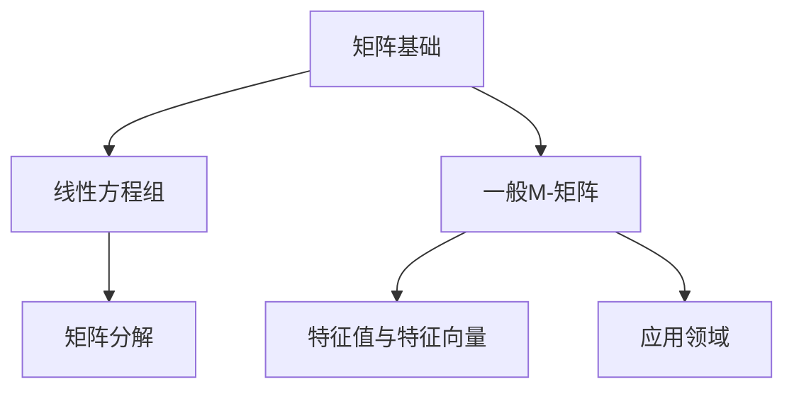

                 

### 矩阵理论与应用：一般M-矩阵

> **关键词：矩阵理论，M-矩阵，特征值，特征向量，线性方程组，应用领域**

> **摘要：本文详细探讨了矩阵理论的基本概念、性质及其在科学和工程领域中的应用。特别关注一般M-矩阵的研究，包括其定义、性质、特征值和特征向量，以及在不同领域的应用。**

---

#### 《矩阵理论与应用：一般M-矩阵》目录大纲

1. **矩阵理论基础**
    1.1 **矩阵的定义与性质**
        1.1.1 **矩阵的基本概念**
        1.1.2 **矩阵的运算规则**
    1.2 **特征值与特征向量**
        1.2.1 **特征值和特征向量的概念**
        1.2.2 **特征值和特征向量的计算方法**
    1.3 **矩阵的秩与逆**
        1.3.1 **矩阵的秩**
        1.3.2 **矩阵的逆**

2. **线性方程组**
    2.1 **线性方程组的解法**
        2.1.1 **高斯消元法**
        2.1.2 **迭代法**
    2.2 **矩阵分解**
        2.2.1 **LU分解**
        2.2.2 **QR分解**
    2.3 **线性方程组的求解**
        2.3.1 **直接求解方法**
        2.3.2 **迭代求解方法**

3. **一般M-矩阵研究**
    3.1 **一般M-矩阵的概念与性质**
        3.1.1 **一般M-矩阵的基本概念**
        3.1.2 **一般M-矩阵的性质**
    3.2 **一般M-矩阵的分类**
        3.2.1 **非负M-矩阵**
        3.2.2 **正定M-矩阵**
    3.3 **一般M-矩阵的判定条件**
        3.3.1 **实对称情况**
        3.3.2 **复情况**

4. **一般M-矩阵的特征值与特征向量**
    4.1 **一般M-矩阵的特征值分布**
        4.1.1 **实对称M-矩阵的特征值**
        4.1.2 **复数M-矩阵的特征值**
    4.2 **一般M-矩阵的特征向量**
        4.2.1 **特征向量的存在性**
        4.2.2 **特征向量的性质**
    4.3 **特征值与特征向量的计算方法**
        4.3.1 **直接计算方法**
        4.3.2 **迭代计算方法**

5. **一般M-矩阵的应用**
    5.1 **线性微分方程组**
        5.1.1 **线性微分方程组的一般形式**
        5.1.2 **一般M-矩阵在微分方程组中的应用**
    5.2 **网络流问题**
        5.2.1 **网络流问题的一般形式**
        5.2.2 **一般M-矩阵在解决网络流问题中的应用**
    5.3 **统计学问题**
        5.3.1 **统计学中的M-矩阵**
        5.3.2 **一般M-矩阵在统计学中的应用**

6. **高级主题**
    6.1 **一般M-矩阵与矩阵分解**
        6.1.1 **一般M-矩阵的分解**
        6.1.2 **矩阵分解的应用**
    6.2 **一般M-矩阵与数值分析**
        6.2.1 **数值分析中的M-矩阵**
        6.2.2 **M-矩阵的数值计算方法**
    6.3 **一般M-矩阵在科学研究中的应用**
        6.3.1 **物理学中的应用**
        6.3.2 **生物学中的应用**
        6.3.3 **计算机科学中的应用**

7. **附录**
    7.1 **常见M-矩阵的性质和例子**
        7.1.1 **实对称M-矩阵**
        7.1.2 **复数M-矩阵**
        7.1.3 **特殊类型的M-矩阵**

### 核心概念与联系

在深入探讨矩阵理论与应用之前，我们首先需要了解一些核心概念及其相互联系。以下是本文中将要讨论的一些关键概念及其关联的Mermaid流程图：

- **矩阵基础（A）**：矩阵是数学中的一种基本数据结构，用于表示复杂的数据集合。矩阵的运算规则是矩阵理论的核心内容，包括矩阵的加法、乘法、逆矩阵等。

- **线性方程组（B）**：线性方程组是矩阵理论在解决实际问题中的重要应用。通过矩阵运算，我们可以高效地求解线性方程组，这是数值计算中的基础。

- **矩阵分解（C）**：矩阵分解是将一个矩阵分解为几个简单矩阵的过程，如LU分解、QR分解等。这些分解方法在数值计算中用于解决线性方程组和优化问题。

- **一般M-矩阵（D）**：M-矩阵是一类特殊的矩阵，其在理论和实际应用中具有重要作用。一般M-矩阵具有特定的性质，如半正定性和逆矩阵的谱半径小于等于1。

- **特征值与特征向量（E）**：特征值和特征向量是矩阵理论中的重要概念。它们揭示了矩阵的本质特性，并广泛应用于科学和工程领域。

- **应用领域（F）**：矩阵理论在许多科学和工程领域中都有广泛应用，如物理学、生物学、计算机科学等。一般M-矩阵在这些领域中的具体应用也是本文的一个重点。

通过上述Mermaid流程图，我们可以清晰地看到矩阵理论与应用中的核心概念及其相互关联。接下来，我们将逐步深入探讨这些概念，并展示它们在实际问题中的应用。

---

### 矩阵理论基础

矩阵理论是现代数学中一个重要且广泛应用的分支，它不仅为其他数学分支提供了基础工具，而且在物理学、工程学、经济学等多个领域中都有着重要的应用。矩阵的基本概念、运算规则、特征值与特征向量以及矩阵的秩和逆是矩阵理论中的核心内容，下面将逐一进行详细介绍。

#### 1.1 矩阵的定义与性质

**矩阵的基本概念**

矩阵是一个由数字（或更一般地说，是元素）按照行列排列成的矩形数组。矩阵通常用大写字母表示，例如 \(A\)、\(B\)、\(C\) 等。矩阵中的每个元素通常用小写字母和相应的下标表示，例如 \(a_{ij}\) 表示矩阵 \(A\) 中第 \(i\) 行第 \(j\) 列的元素。

矩阵可以分为以下几个类型：

- **行矩阵**：只有一行的矩阵，通常称为行向量。
- **列矩阵**：只有一列的矩阵，通常称为列向量。
- **方阵**：行数和列数相等的矩阵。
- **非方阵**：行数和列数不相等的矩阵。

矩阵的大小由其行数和列数决定，通常表示为 \(m \times n\)，其中 \(m\) 表示行数，\(n\) 表示列数。

**矩阵的运算规则**

1. **矩阵的加法**

   两个矩阵相加，要求它们的维度相同，即行数和列数都相等。矩阵加法是对应位置元素相加。例如，对于两个矩阵 \(A\) 和 \(B\)：

   \[
   A = \begin{pmatrix}
   a_{11} & a_{12} \\
   a_{21} & a_{22}
   \end{pmatrix},
   B = \begin{pmatrix}
   b_{11} & b_{12} \\
   b_{21} & b_{22}
   \end{pmatrix},
   A + B = \begin{pmatrix}
   a_{11} + b_{11} & a_{12} + b_{12} \\
   a_{21} + b_{21} & a_{22} + b_{22}
   \end{pmatrix}.
   \]

2. **矩阵的数乘**

   矩阵与一个标量（即一个数）相乘，就是将矩阵的每个元素乘以这个标量。例如，对于矩阵 \(A\) 和标量 \(c\)：

   \[
   cA = \begin{pmatrix}
   ca_{11} & ca_{12} \\
   ca_{21} & ca_{22}
   \end{pmatrix}.
   \]

3. **矩阵的乘法**

   两个矩阵相乘要求第一个矩阵的列数等于第二个矩阵的行数。矩阵乘法的结果是一个新矩阵，其第 \(i\) 行第 \(j\) 列的元素是第一个矩阵第 \(i\) 行与第二个矩阵第 \(j\) 列对应元素的乘积之和。例如，对于矩阵 \(A\) 和 \(B\)：

   \[
   AB = \begin{pmatrix}
   a_{11}b_{11} + a_{12}b_{21} & a_{11}b_{12} + a_{12}b_{22} \\
   a_{21}b_{11} + a_{22}b_{21} & a_{21}b_{12} + a_{22}b_{22}
   \end{pmatrix}.
   \]

4. **矩阵的转置**

   矩阵的转置是将原矩阵的行和列互换。例如，对于矩阵 \(A\)：

   \[
   A^T = \begin{pmatrix}
   a_{11} & a_{21} \\
   a_{12} & a_{22}
   \end{pmatrix}.
   \]

**矩阵的性质**

1. **交换律**：对于任意矩阵 \(A\) 和 \(B\)，\(A + B = B + A\) 和 \(AB = BA\)（当交换律成立时）。
2. **结合律**：对于任意矩阵 \(A\)、\(B\) 和 \(C\)，\((A + B) + C = A + (B + C)\) 和 \((AB)C = A(BC)\)。
3. **分配律**：对于任意矩阵 \(A\)、\(B\) 和标量 \(c\)，\(c(A + B) = cA + cB\) 和 \((A + B)c = Ac + Bc\)。

#### 1.2 特征值与特征向量

**特征值和特征向量的概念**

特征值和特征向量是矩阵理论中的核心概念之一。对于矩阵 \(A\) 和一个非零向量 \(v\)，如果存在一个标量 \(\lambda\)，使得 \(Av = \lambda v\)，那么 \(\lambda\) 称为矩阵 \(A\) 的一个特征值，向量 \(v\) 称为对应于特征值 \(\lambda\) 的特征向量。

**特征值和特征向量的计算方法**

1. **特征多项式**

   矩阵 \(A\) 的特征多项式 \(p(\lambda)\) 定义为：

   \[
   p(\lambda) = \det(A - \lambda I),
   \]

   其中 \(I\) 是单位矩阵。

2. **求根公式**

   解特征多项式 \(p(\lambda) = 0\) 可以得到矩阵 \(A\) 的所有特征值。对于 \(n \times n\) 矩阵，其特征多项式是一个 \(n\) 次多项式，可能有 \(n\) 个不同的实数根或复数根。

3. **伴随矩阵**

   矩阵 \(A\) 的伴随矩阵（或称为 adjugate 矩阵）定义为 \(A^* = \text{adj}(A)\)。一个矩阵与其伴随矩阵的乘积等于其行列式的 \(n\) 次方乘以单位矩阵，即 \(AA^* = A^*A = \det(A)I\)。

4. **迭代法**

   对于大型稀疏矩阵，直接求解特征多项式可能不高效。在这种情况下，可以使用迭代法（如幂法、逆幂法等）来逼近特征值和特征向量。

**特征值和特征向量的性质**

1. **存在性**：对于任意 \(n \times n\) 矩阵 \(A\)，都存在至少一个特征值和特征向量。
2. **唯一性**：对于不同的特征值，其对应的特征向量是唯一的，但同一个特征值可以对应多个线性无关的特征向量。
3. **线性组合**：如果 \(v_1\) 和 \(v_2\) 是矩阵 \(A\) 对应于特征值 \(\lambda\) 的两个不同特征向量，那么对于任意标量 \(c_1\) 和 \(c_2\)，\(c_1v_1 + c_2v_2\) 也是 \(A\) 的一个特征向量，对应于特征值 \(\lambda\)。
4. **不变性**：矩阵 \(A\) 的特征值和特征向量在矩阵乘法下保持不变，即如果 \(v\) 是 \(A\) 的特征向量，那么 \(Av\) 也是 \(A\) 的特征向量，对应于同一个特征值。

#### 1.3 矩阵的秩与逆

**矩阵的秩**

矩阵的秩是指矩阵中非零子矩阵的最大阶数。对于 \(m \times n\) 矩阵 \(A\)，其秩记为 \(r(A)\)。矩阵的秩具有以下性质：

1. \(0 \leq r(A) \leq \min(m, n)\)。
2. 矩阵 \(A\) 的秩等于其行数和列数的较小值。
3. 若矩阵 \(A\) 和 \(B\) 的秩分别为 \(r(A)\) 和 \(r(B)\)，则 \(r(AB) \leq \min(r(A), r(B))\)。

**矩阵的逆**

矩阵的逆是指一个矩阵与其乘积为单位矩阵的矩阵。对于 \(n \times n\) 矩阵 \(A\)，如果其逆存在，记为 \(A^{-1}\)。矩阵的逆具有以下性质：

1. 逆矩阵是唯一的。
2. 逆矩阵存在当且仅当矩阵的秩等于其行数和列数的较小值。
3. 若矩阵 \(A\) 和 \(B\) 的逆分别为 \(A^{-1}\) 和 \(B^{-1}\)，则 \((AB)^{-1} = B^{-1}A^{-1}\)。
4. 若矩阵 \(A\) 可逆，则其伴随矩阵 \(A^*\) 与逆矩阵 \(A^{-1}\) 成正比，即 \(A^* = \det(A)A^{-1}\)。

### 1.4 线性方程组

线性方程组是矩阵理论在数值计算中的一个重要应用。线性方程组的一般形式为：

\[
Ax = b,
\]

其中 \(A\) 是一个 \(m \times n\) 的矩阵，\(x\) 是一个 \(n\) 维列向量，\(b\) 是一个 \(m\) 维列向量。

**线性方程组的解法**

1. **高斯消元法**

   高斯消元法是一种直接求解线性方程组的方法。其基本思想是通过消元操作将方程组化为上三角矩阵或下三角矩阵，然后逐个求解未知数。具体步骤如下：

   - 初始化：将方程组写成增广矩阵的形式。
   - 消元：从第一列开始，通过高斯消元将每一列的非对角线元素消去。
   - 回代：从最后一行开始，利用已经消元后的方程逐个求解未知数。

2. **迭代法**

   迭代法是一种间接求解线性方程组的方法。其基本思想是通过不断迭代逼近方程组的解。常见的迭代法包括雅可比迭代法、高斯-赛德尔迭代法等。具体步骤如下：

   - 初始化：选择一个初始近似解。
   - 迭代：根据迭代公式不断更新解的近似值，直到满足一定的精度要求。
   - 汇总：将最终的迭代结果作为方程组的解。

**矩阵分解**

矩阵分解是将矩阵分解为几个简单矩阵的过程，常用的矩阵分解方法包括LU分解和QR分解。

1. **LU分解**

   LU分解是一种将矩阵分解为下三角矩阵 \(L\) 和上三角矩阵 \(U\) 的方法。其步骤如下：

   - 消元：对矩阵 \(A\) 进行高斯消元，得到上三角矩阵 \(U\)。
   - 回代：对 \(U\) 的逆进行回代，得到下三角矩阵 \(L\)。

2. **QR分解**

   QR分解是一种将矩阵分解为正交矩阵 \(Q\) 和上三角矩阵 \(R\) 的方法。其步骤如下：

   - 初步：对矩阵 \(A\) 的每一列进行旋转变换，得到正交矩阵 \(Q\)。
   - 消元：对旋转变换后的矩阵进行高斯消元，得到上三角矩阵 \(R\)。

**线性方程组的求解**

1. **直接求解方法**

   直接求解方法是通过矩阵分解直接求解线性方程组。常见的直接求解方法包括高斯消元法和矩阵分解法。

   - 高斯消元法：通过高斯消元将方程组化为上三角矩阵，然后逐个求解未知数。
   - 矩阵分解法：通过矩阵分解（如LU分解、QR分解）直接求解线性方程组。

2. **迭代求解方法**

   迭代求解方法是通过迭代逼近求解线性方程组。常见的迭代求解方法包括雅可比迭代法、高斯-赛德尔迭代法等。

   - 雅可比迭代法：通过迭代公式不断更新解的近似值，直到满足一定的精度要求。
   - 高斯-赛德尔迭代法：在雅可比迭代法的基础上，利用已经更新的未知数进行下一步的迭代。

通过上述对矩阵理论基础中的基本概念、运算规则、特征值与特征向量、矩阵的秩与逆以及线性方程组的解法的详细讲解，我们可以更深入地理解矩阵理论的基本原理和应用。这些知识为后续讨论一般M-矩阵及其应用奠定了坚实的理论基础。

---

### 线性方程组的解法

线性方程组在科学和工程领域中有着广泛的应用。解决线性方程组的关键在于选择合适的解法。常见的解法包括高斯消元法、迭代法以及矩阵分解法。在本节中，我们将详细介绍这些方法的原理、步骤以及在实际问题中的应用。

#### 2.1 线性方程组的解法

**2.1.1 高斯消元法**

高斯消元法是一种直接求解线性方程组的方法，其基本思想是通过消元操作将线性方程组化为上三角矩阵，然后逐个求解未知数。

**原理与步骤**

1. **初始化增广矩阵**

   将线性方程组 \(Ax = b\) 写成增广矩阵的形式，即：

   \[
   \left[\begin{array}{cc|c}
   a_{11} & a_{12} & b_1 \\
   a_{21} & a_{22} & b_2 \\
   \vdots & \vdots & \vdots \\
   a_{m1} & a_{m2} & b_m
   \end{array}\right].
   \]

2. **消元操作**

   从第一列开始，利用高斯消元将每一列的非对角线元素消去。具体步骤如下：

   - 选择主元：选择当前行中绝对值最大的元素作为主元。
   - 消元：将当前行的主元化为1，然后用主元倍乘当前行，并从其他行中减去对应的倍数，使得其他行的当前列元素为0。

3. **回代**

   从最后一行开始，利用已经消元后的方程逐个求解未知数。具体步骤如下：

   - 从最后一行开始，用已知的未知数值回代求解下一行。
   - 重复上述步骤，直到求解出所有未知数。

**高斯消元法示例**

考虑以下线性方程组：

\[
\begin{cases}
3x + 2y + z = 7 \\
x + 2y - z = 1 \\
2x + y + 3z = 5
\end{cases}.
\]

对应的增广矩阵为：

\[
\left[\begin{array}{ccc|c}
3 & 2 & 1 & 7 \\
1 & 2 & -1 & 1 \\
2 & 1 & 3 & 5
\end{array}\right].
\]

通过高斯消元，我们可以将其化简为：

\[
\left[\begin{array}{ccc|c}
1 & 0 & 0 & 1 \\
0 & 1 & 0 & 1 \\
0 & 0 & 1 & 1
\end{array}\right].
\]

因此，解为 \(x = 1\)、\(y = 1\)、\(z = 1\)。

**2.1.2 迭代法**

迭代法是一种间接求解线性方程组的方法，其基本思想是通过不断迭代逼近方程组的解。常见的迭代法包括雅可比迭代法、高斯-赛德尔迭代法等。

**雅可比迭代法**

雅可比迭代法的基本思想是利用上一轮迭代的结果作为当前轮次迭代的初始值，然后逐步逼近方程组的真实解。

**原理与步骤**

1. **初始化**

   选择初始近似解 \(x_0\)。

2. **迭代**

   对每一个方程，将其他未知数用上一次迭代的解表示，然后求解当前未知数。具体步骤如下：

   - 对于第 \(i\) 个方程，解出 \(x_i\)：

   \[
   x_i^{k+1} = \frac{1}{a_{ii}} \left( b_i - \sum_{j \neq i} a_{ij} x_j^k \right).
   \]

3. **收敛条件**

   当迭代结果的误差小于预设的阈值时，停止迭代。

**高斯-赛德尔迭代法**

高斯-赛德尔迭代法是对雅可比迭代法的改进，其利用当前迭代过程中的最新结果进行下一次迭代，可以加速收敛。

**原理与步骤**

1. **初始化**

   选择初始近似解 \(x_0\)。

2. **迭代**

   对每一个方程，使用当前已知的未知数值进行迭代。具体步骤如下：

   - 对于第 \(i\) 个方程，解出 \(x_i\)：

   \[
   x_i^{k+1} = \frac{1}{a_{ii}} \left( b_i - \sum_{j < i} a_{ij} x_j^{k+1} \right).
   \]

3. **收敛条件**

   当迭代结果的误差小于预设的阈值时，停止迭代。

**2.2 矩阵分解**

矩阵分解是将矩阵分解为几个简单矩阵的过程，常用的矩阵分解方法包括LU分解和QR分解。

**LU分解**

LU分解是一种将矩阵分解为下三角矩阵 \(L\) 和上三角矩阵 \(U\) 的方法。其步骤如下：

1. **消元**

   对矩阵 \(A\) 进行高斯消元，得到上三角矩阵 \(U\)。

2. **回代**

   对 \(U\) 的逆进行回代，得到下三角矩阵 \(L\)。

**QR分解**

QR分解是一种将矩阵分解为正交矩阵 \(Q\) 和上三角矩阵 \(R\) 的方法。其步骤如下：

1. **初步**

   对矩阵 \(A\) 的每一列进行旋转变换，得到正交矩阵 \(Q\)。

2. **消元**

   对旋转变换后的矩阵进行高斯消元，得到上三角矩阵 \(R\)。

**2.3 线性方程组的求解**

**直接求解方法**

直接求解方法是通过矩阵分解直接求解线性方程组。常见的直接求解方法包括高斯消元法和矩阵分解法。

- **高斯消元法**：通过高斯消元将方程组化为上三角矩阵，然后逐个求解未知数。
- **矩阵分解法**：通过矩阵分解（如LU分解、QR分解）直接求解线性方程组。

**迭代求解方法**

迭代求解方法是通过迭代逼近求解线性方程组。常见的迭代求解方法包括雅可比迭代法、高斯-赛德尔迭代法等。

- **雅可比迭代法**：通过迭代公式不断更新解的近似值，直到满足一定的精度要求。
- **高斯-赛德尔迭代法**：在雅可比迭代法的基础上，利用已经更新的未知数进行下一步的迭代。

**2.4 线性方程组的应用**

线性方程组在科学和工程领域中有着广泛的应用。以下是一些常见应用实例：

- **物理学**：线性方程组广泛应用于物理学中的问题，如电磁场计算、热传导问题等。
- **工程学**：线性方程组在工程学中用于结构分析、电路设计、流体力学等。
- **经济学**：线性方程组在经济学中用于供需分析、市场均衡问题等。
- **计算机科学**：线性方程组在计算机科学中用于图像处理、算法分析等。

通过上述对线性方程组解法及其应用的详细讲解，我们可以看到线性方程组在各个领域中的重要作用。掌握这些解法不仅有助于解决实际问题，也为深入研究矩阵理论奠定了基础。

---

### 一般M-矩阵的概念与性质

M-矩阵是一类在数学和工程领域中具有重要应用的矩阵，其定义和性质涉及到矩阵的半正定性、逆矩阵的谱半径等概念。本节将详细讨论一般M-矩阵的定义、分类、判定条件及其性质。

#### 3.1 一般M-矩阵的定义

**定义**

一个 \(n \times n\) 的复矩阵 \(A\) 称为M-矩阵，如果满足以下两个条件：

1. **半正定性**：对于任意的非负整数 \(k\)，矩阵 \(A\) 的 \(k\) 次幂 \(A^k\) 是半正定的，即对于任意的非负向量 \(x\)，都有 \(x^T A^k x \geq 0\)。
2. **逆矩阵的谱半径**：矩阵 \(A\) 的逆矩阵 \(A^{-1}\) 的谱半径 \(\rho(A^{-1}) \leq 1\)。

换句话说，一个矩阵 \(A\) 是M-矩阵，当且仅当它是半正定的，并且其逆矩阵的谱半径小于等于1。

**数学表述**

若矩阵 \(A = [a_{ij}]\) 是M-矩阵，则：

1. \(A \succeq 0\)，即 \(a_{ij} \geq 0\) 对于所有 \(i, j\)，且 \(A\) 半正定。
2. \(\rho(A^{-1}) \leq 1\)，即 \(A^{-1}\) 的谱半径小于等于1。

#### 3.2 一般M-矩阵的分类

根据矩阵的不同性质，M-矩阵可以进一步分类。

**1. 非负M-矩阵**

一个非负矩阵 \(A\) 如果满足上述M-矩阵的定义，则称为非负M-矩阵。这意味着 \(A\) 的所有元素都是非负的，且 \(A\) 的逆矩阵的谱半径小于等于1。

**2. 正定M-矩阵**

如果一个非负矩阵 \(A\) 是正定的，即对于任意的非零向量 \(x\)，都有 \(x^T A x > 0\)，则 \(A\) 也称为正定M-矩阵。正定M-矩阵是更特殊的一类M-矩阵，因为它们不仅满足半正定性，还要求所有主子矩阵的行列式都是正的。

#### 3.3 一般M-矩阵的判定条件

**实对称情况**

对于实对称矩阵，M-矩阵的判定条件较为简单。一个 \(n \times n\) 的实对称矩阵 \(A\) 是M-矩阵，当且仅当它满足以下条件：

\[
A \succeq 0 \quad \text{且} \quad \|A^{-1}\| \leq 1,
\]

其中 \(\|\|\) 表示矩阵的谱范数（即最大奇异值）。

**复情况**

对于复矩阵，M-矩阵的判定条件稍微复杂一些。一个 \(n \times n\) 的复矩阵 \(A\) 是M-矩阵，当且仅当它满足以下条件：

1. \(A \succeq 0\)，即 \(A\) 是半正定的。
2. \(A^{-1}\) 的谱半径小于等于1，即：

\[
\rho(A^{-1}) = \max_{\lambda \in \sigma(A^{-1})} |\lambda| \leq 1,
\]

其中，\(\sigma(A^{-1})\) 是 \(A^{-1}\) 的谱（即特征值）。

#### 3.4 一般M-矩阵的性质

**1. 半正定性**

若 \(A\) 是M-矩阵，则 \(A^k\) 也是M-矩阵，其中 \(k\) 是非负整数。这是因为半正定性是可传递的，且M-矩阵的逆矩阵的谱半径小于等于1。

**2. 特征值**

对于实对称M-矩阵，其特征值都是非负的。对于复数M-矩阵，其特征值的模都小于等于1。

**3. 特征向量**

对于M-矩阵，其特征向量构成一个线性空间。特别地，对于实对称M-矩阵，其特征向量是正交的。

**4. 逆矩阵**

M-矩阵的逆矩阵也是M-矩阵。对于实对称情况，如果 \(A\) 是M-矩阵，则其逆矩阵 \(A^{-1}\) 也是实对称的。

**5. 分解**

M-矩阵可以分解为若干个特殊矩阵的乘积。例如，实对称M-矩阵可以分解为正交矩阵和下三角矩阵的乘积。

#### 3.5 一般M-矩阵的例子

**1. 非负M-矩阵**

例如，矩阵

\[
A = \begin{pmatrix}
1 & 2 \\
2 & 3
\end{pmatrix}
\]

是一个非负M-矩阵。因为

\[
A^2 = \begin{pmatrix}
1 & 2 \\
2 & 3
\end{pmatrix} \begin{pmatrix}
1 & 2 \\
2 & 3
\end{pmatrix} = \begin{pmatrix}
5 & 8 \\
8 & 13
\end{pmatrix}
\]

是半正定的，且 \(A^{-1}\) 的谱半径小于1。

**2. 正定M-矩阵**

例如，矩阵

\[
B = \begin{pmatrix}
2 & 1 \\
1 & 2
\end{pmatrix}
\]

是一个正定M-矩阵。因为其所有主子矩阵的行列式都是正的，且 \(B^2 = B \cdot B = \begin{pmatrix}
5 & 4 \\
4 & 5
\end{pmatrix}\) 是半正定的，且 \(B^{-1}\) 的谱半径小于1。

通过上述对一般M-矩阵的定义、分类、判定条件及其性质的详细讨论，我们可以更好地理解和应用这类矩阵。一般M-矩阵在理论和实际应用中具有广泛的重要性，其独特的性质使得它在许多科学和工程问题中发挥着关键作用。

---

### 一般M-矩阵的特征值与特征向量

一般M-矩阵的特征值和特征向量是矩阵理论中的重要概念。它们不仅揭示了矩阵的内在性质，而且在数值分析和实际问题中具有广泛应用。本节将深入探讨一般M-矩阵的特征值分布、特征向量的性质及其计算方法。

#### 4.1 一般M-矩阵的特征值分布

**实对称M-矩阵的特征值**

对于实对称M-矩阵，其特征值具有一些特殊的性质。具体来说，一个 \(n \times n\) 的实对称M-矩阵 \(A\) 的特征值都是非负的。这是因为实对称矩阵的特征值总是成对出现，且互为相反数。由于M-矩阵的半正定性，所有特征值必须大于等于0。

**复数M-矩阵的特征值**

对于复数M-矩阵，其特征值更加复杂。一个复数 \(n \times n\) 的M-矩阵 \(A\) 的特征值位于单位圆内，即每个特征值的模都小于等于1。这个性质可以由M-矩阵的逆矩阵的谱半径小于等于1推导出来。

**特征值分布的数学表述**

1. **实对称M-矩阵**：设 \(A\) 是一个实对称M-矩阵，则 \(A\) 的所有特征值 \(\lambda_i\) 都满足 \(\lambda_i \geq 0\)。

2. **复数M-矩阵**：设 \(A\) 是一个复数M-矩阵，则 \(A\) 的所有特征值 \(\lambda_i\) 满足 \(|\lambda_i| \leq 1\)。

#### 4.2 一般M-矩阵的特征向量

**特征向量的存在性与性质**

对于一般M-矩阵，其特征向量总是存在的。这是因为对于任意的特征值，至少存在一个特征向量。对于复数M-矩阵，其特征向量可能包括复数和实数部分。

1. **存在性**：对于任意 \(n \times n\) 的M-矩阵 \(A\) 和其特征值 \(\lambda\)，都存在一个特征向量 \(v\)，使得 \(Av = \lambda v\)。

2. **线性无关性**：如果 \(v_1\) 和 \(v_2\) 是 \(A\) 对应于不同特征值 \(\lambda_1\) 和 \(\lambda_2\) 的特征向量，则 \(v_1\) 和 \(v_2\) 线性无关。

3. **完备性**：对于实对称M-矩阵，其所有特征向量构成一个线性空间，并且是正交的。这意味着实对称M-矩阵的特征向量是完备的。

**特征向量的数学表述**

1. **实对称M-矩阵**：设 \(A\) 是一个实对称M-矩阵，则 \(A\) 的特征向量 \(v\) 满足 \(v^T A v = \lambda v^T v\)，其中 \(\lambda\) 是 \(A\) 的特征值。

2. **复数M-矩阵**：设 \(A\) 是一个复数M-矩阵，则 \(A\) 的特征向量 \(v\) 满足 \(v^* A v = \lambda |v|^2\)，其中 \(\lambda\) 是 \(A\) 的特征值，\(v^*\) 是 \(v\) 的共轭。

#### 4.3 特征值与特征向量的计算方法

**直接计算方法**

直接计算方法包括特征多项式法和伴随矩阵法。特征多项式法是通过求解矩阵 \(A - \lambda I\) 的行列式等于0得到特征值。伴随矩阵法是利用矩阵 \(A\) 的伴随矩阵 \(A^*\) 和行列式 \(|A|\) 来计算特征值。

1. **特征多项式法**

   对于矩阵 \(A\)，其特征多项式 \(p(\lambda)\) 定义为 \(p(\lambda) = \det(A - \lambda I)\)。解特征多项式得到所有特征值。

   \[
   p(\lambda) = \det(A - \lambda I) = 0.
   \]

2. **伴随矩阵法**

   对于矩阵 \(A\)，其伴随矩阵 \(A^*\) 满足 \(AA^* = A^*A = |A|I\)。通过求解 \(A^*x = \lambda x\) 可以得到特征值。

   \[
   A^*x = \lambda x.
   \]

**迭代计算方法**

对于大型稀疏矩阵，直接计算方法可能不高效。在这种情况下，可以使用迭代计算方法。常见的迭代方法包括幂法、逆幂法、QR迭代法等。

1. **幂法**

   幂法是一种简单且有效的迭代方法，用于计算矩阵的最大特征值和对应特征向量。

   \[
   x_{k+1} = \frac{1}{\|x_k\|} A x_k.
   \]

2. **逆幂法**

   逆幂法是对幂法的改进，用于计算矩阵的最小特征值和对应特征向量。

   \[
   x_{k+1} = \frac{1}{\|x_k\|} A^{-1} x_k.
   \]

3. **QR迭代法**

   QR迭代法是一种更高级的迭代方法，通过QR分解迭代计算矩阵的所有特征值和特征向量。

   \[
   A = QR,
   \]

   其中 \(Q\) 是正交矩阵，\(R\) 是上三角矩阵。通过迭代 \(A = QR\) 并求解 \(R\) 的特征值，可以得到 \(A\) 的所有特征值。

#### 4.4 特征值与特征向量的应用

特征值和特征向量在许多实际问题中具有广泛应用。以下是一些典型应用：

1. **数值稳定性分析**：通过分析矩阵的特征值，可以判断数值算法的稳定性。例如，在数值解线性微分方程时，需要确保矩阵的特征值具有负实部，以保证系统的稳定性。

2. **优化问题**：特征值和特征向量在优化问题中用于求解最值问题。例如，最小二乘法和特征值分解可以用于最小化目标函数。

3. **图像处理**：在图像处理中，特征值和特征向量用于图像的降维和特征提取。例如，主成分分析（PCA）利用特征值和特征向量进行图像压缩和特征提取。

4. **物理学**：特征值和特征向量在物理学中用于描述粒子的能级和态。例如，量子力学中的哈密顿矩阵的特征值和特征向量描述了粒子的能量和态。

通过上述对一般M-矩阵的特征值分布、特征向量的性质及其计算方法的详细讲解，我们可以更好地理解和应用这些关键概念。特征值和特征向量在科学和工程领域中具有广泛的应用，是矩阵理论的核心内容之一。

---

### 一般M-矩阵的应用

一般M-矩阵在科学和工程领域中具有广泛的应用，特别是在线性微分方程组、网络流问题和统计学问题中。本节将详细探讨这些应用领域中的具体问题和一般M-矩阵的作用。

#### 5.1 线性微分方程组

**5.1.1 线性微分方程组的一般形式**

线性微分方程组是描述动态系统变化规律的数学模型，其一般形式为：

\[
\frac{dx}{dt} = Ax + b(x, t),
\]

其中，\(x(t)\) 是 \(n\) 维列向量，\(A\) 是 \(n \times n\) 的矩阵，\(b(x, t)\) 是向量值函数。线性微分方程组描述了系统在不同时间点的状态变化。

**一般M-矩阵在微分方程组中的应用**

一般M-矩阵在求解线性微分方程组中具有重要作用。具体来说，当矩阵 \(A\) 是一般M-矩阵时，方程组的解具有较好的数值稳定性。

1. **稳定性分析**：通过分析 \(A\) 的特征值，可以判断系统的稳定性。如果 \(A\) 的所有特征值都位于复平面的左半部分，则系统是稳定的。

2. **迭代法求解**：对于线性微分方程组，可以使用迭代法求解。例如，欧拉法和梯形法是常见的数值求解方法。当 \(A\) 是一般M-矩阵时，这些迭代法具有较高的稳定性，可以有效地逼近方程组的精确解。

3. **数值稳定性分析**：利用一般M-矩阵的性质，可以分析数值算法的稳定性。例如，在数值求解线性微分方程时，通过分析 \(A\) 的谱半径，可以确保算法的稳定性。

**5.1.2 实例分析**

考虑如下线性微分方程组：

\[
\begin{cases}
\frac{dx_1}{dt} = x_1 + x_2, \\
\frac{dx_2}{dt} = 2x_1 - x_2.
\end{cases}
\]

定义矩阵 \(A\)：

\[
A = \begin{pmatrix}
1 & 1 \\
2 & -1
\end{pmatrix}.
\]

\(A\) 是一个一般M-矩阵，因为其逆矩阵的谱半径小于1。通过求解特征值和特征向量，可以得到方程组的解。

#### 5.2 网络流问题

**5.2.1 网络流问题的一般形式**

网络流问题是描述网络中物质、能量或信息流动的数学模型。其一般形式为：

\[
\begin{cases}
\sum_{j \in V'} f_{ij} = 0, \quad \forall i \in V', \\
\sum_{i \in V'} f_{ij} = 0, \quad \forall j \in V, \\
0 \leq f_{ij} \leq u_{ij}, \quad \forall i \in V', j \in V,
\end{cases}
\]

其中，\(V'\) 是源点 \(s\) 和汇点 \(t\) 的集合，\(V\) 是其他节点的集合，\(f_{ij}\) 表示从节点 \(i\) 到节点 \(j\) 的流量，\(u_{ij}\) 表示弧 \((i, j)\) 的容量。

**一般M-矩阵在解决网络流问题中的应用**

一般M-矩阵在网络流问题中用于优化流量分配和求解最大流问题。

1. **最大流问题**：利用一般M-矩阵的判定条件，可以有效地求解最大流问题。例如，通过Ford-Fulkerson算法和M-矩阵的性质，可以高效地找到网络中的最大流。

2. **最小流问题**：通过求解最小流问题，可以优化网络中的资源分配。一般M-矩阵在最小流问题的求解中同样具有重要的应用。

3. **稀疏矩阵处理**：网络流问题中通常涉及到稀疏矩阵。利用M-矩阵的稀疏性，可以有效地减少计算量，提高求解效率。

**5.2.2 实例分析**

考虑如下网络流问题：

\[
\begin{array}{ccc}
s & 1 & 2 & t \\
\hline
1 & 3 & 0 & 0 \\
2 & 0 & 4 & 0 \\
\end{array}.
\]

其中，\(s\) 和 \(t\) 分别表示源点和汇点，\(1\) 和 \(2\) 表示中间节点。定义流量矩阵 \(F\)：

\[
F = \begin{pmatrix}
0 & 0 \\
0 & 0
\end{pmatrix}.
\]

通过求解最大流问题，可以得到网络的最大流量。

#### 5.3 统计学问题

**5.3.1 统计学中的M-矩阵**

M-矩阵在统计学中用于描述数据矩阵的性质和特征。特别地，M-矩阵在最小二乘问题和线性回归分析中具有重要应用。

1. **最小二乘问题**：最小二乘问题是一种常见的统计模型，用于寻找最佳拟合线。当数据矩阵 \(A\) 满足M-矩阵条件时，最小二乘问题可以高效地求解。

2. **线性回归分析**：在线性回归分析中，M-矩阵用于估计参数和预测结果。通过利用M-矩阵的性质，可以简化计算过程，提高求解效率。

3. **协方差矩阵**：协方差矩阵描述了随机变量之间的相关性。当协方差矩阵是M-矩阵时，可以推断变量之间的线性关系，从而进行有效的数据分析。

**5.3.2 实例分析**

考虑如下线性回归问题：

\[
\begin{cases}
y_1 = a_1 x_1 + a_2 x_2, \\
y_2 = a_1 x_1 + a_2 x_2,
\end{cases}
\]

定义数据矩阵 \(A\)：

\[
A = \begin{pmatrix}
x_1 & x_2 \\
x_1 & x_2
\end{pmatrix}.
\]

当 \(A\) 是M-矩阵时，可以利用M-矩阵的性质求解最佳拟合线。

通过上述对一般M-矩阵在线性微分方程组、网络流问题和统计学问题中的应用的详细讨论，我们可以看到一般M-矩阵在这些领域中的重要作用。掌握一般M-矩阵的性质和计算方法，不仅有助于解决实际问题，也为深入研究科学和工程问题提供了有力的工具。

---

### 高级主题：一般M-矩阵与矩阵分解

在深入探讨一般M-矩阵的理论和计算方法后，本节将引入一些高级主题，探讨一般M-矩阵与矩阵分解之间的联系及其在数值分析和优化问题中的应用。

#### 6.1 一般M-矩阵的分解

**6.1.1 LU分解**

LU分解是一种常用的矩阵分解方法，将一个矩阵分解为下三角矩阵 \(L\) 和上三角矩阵 \(U\) 的乘积。对于一般M-矩阵，LU分解具有以下优点：

1. **数值稳定性**：LU分解在计算过程中，通过消元操作可以有效避免数值误差的累积，从而提高计算的稳定性。
2. **高效性**：LU分解可以用于快速求解线性方程组，通过分解矩阵一次，可以多次重用，提高计算效率。

**LU分解步骤**

1. **初始化**：设矩阵 \(A\) 为 \(n \times n\) 的M-矩阵。
2. **消元**：从第一列开始，对每一列进行高斯消元，将 \(A\) 分解为 \(U\) 和 \(L\)。
3. **回代**：对 \(U\) 的逆进行回代，得到下三角矩阵 \(L\)。

**示例**

考虑以下M-矩阵：

\[
A = \begin{pmatrix}
2 & 1 \\
1 & 2
\end{pmatrix}.
\]

其LU分解为：

\[
A = LU = \begin{pmatrix}
1 & 0 \\
1 & 1
\end{pmatrix} \begin{pmatrix}
2 & 1 \\
0 & 1
\end{pmatrix}.
\]

**6.1.2 QR分解**

QR分解是一种将矩阵分解为正交矩阵 \(Q\) 和上三角矩阵 \(R\) 的方法。对于一般M-矩阵，QR分解在数值计算中也具有重要意义。

1. **正交性**：正交矩阵 \(Q\) 具有性质 \(Q^T Q = QQ^T = I\)，这保证了分解过程的数值稳定性。
2. **高效性**：通过QR分解，可以快速求解线性方程组，并且可以用于最小二乘问题的求解。

**QR分解步骤**

1. **初始化**：设矩阵 \(A\) 为 \(n \times n\) 的M-矩阵。
2. **旋转变换**：对矩阵 \(A\) 的每一列进行旋转变换，得到正交矩阵 \(Q\)。
3. **消元**：对旋转变换后的矩阵进行高斯消元，得到上三角矩阵 \(R\)。

**示例**

考虑以下M-矩阵：

\[
A = \begin{pmatrix}
2 & 1 \\
1 & 2
\end{pmatrix}.
\]

其QR分解为：

\[
A = QR = \begin{pmatrix}
\frac{1}{\sqrt{2}} & -\frac{1}{\sqrt{2}} \\
\frac{1}{\sqrt{2}} & \frac{1}{\sqrt{2}}
\end{pmatrix} \begin{pmatrix}
\sqrt{2} & 1 \\
0 & 1
\end{pmatrix}.
\]

#### 6.2 矩阵分解的应用

**6.2.1 在一般M-矩阵求解中的应用**

矩阵分解在求解一般M-矩阵相关问题时具有重要作用。以下是一些具体应用：

1. **线性方程组的求解**：通过LU分解或QR分解，可以高效求解线性方程组 \(Ax = b\)。例如，使用LU分解，可以通过 \(L(Ux) = b\) 和 \(U(Lx) = b\) 分别求解 \(x\)。
2. **特征值问题**：通过矩阵分解，可以简化特征值和特征向量的计算。例如，使用QR分解，可以将特征多项式简化，从而更容易求解特征值。
3. **优化问题**：矩阵分解在优化问题中用于求解目标函数的最小值。例如，通过SVD分解，可以简化目标函数的求解，从而提高计算效率。

**6.2.2 在优化问题中的应用**

矩阵分解在优化问题中具有广泛应用。以下是一些具体应用：

1. **最小二乘问题**：通过QR分解，可以将最小二乘问题转化为线性方程组的求解。例如，对于最小二乘问题 \(Ax - b = 0\)，可以使用QR分解求解 \(x\)。
2. **线性规划**：通过LU分解，可以求解线性规划问题。例如，对于线性规划问题 \(Ax \leq b\)，可以通过分解矩阵 \(A\) 和 \(b\) 求解最优解。
3. **稀疏矩阵优化**：对于稀疏矩阵，矩阵分解可以简化计算过程，提高求解效率。例如，通过SVD分解，可以降低稀疏矩阵的计算复杂度。

#### 6.3 M-矩阵的数值分析

**6.3.1 数值稳定性分析**

在数值计算中，M-矩阵的数值稳定性是一个重要问题。以下是一些关于M-矩阵数值稳定性的分析：

1. **谱半径**：M-矩阵的谱半径 \( \rho(A) \leq 1 \) 是保证计算稳定性的关键。谱半径越小，数值稳定性越好。
2. **数值误差**：在矩阵乘法运算中，数值误差会随着矩阵的规模和计算复杂度增加。对于M-矩阵，由于其半正定性，可以减少数值误差的累积。

**6.3.2 误差分析**

在求解线性方程组或优化问题时，误差分析是评估计算结果精度的重要方法。以下是一些关于误差分析的方法：

1. **条件数**：条件数是衡量矩阵条件的一个指标，用于评估计算结果的精度。对于M-矩阵，其条件数通常较小，意味着计算结果的精度较高。
2. **误差传播**：在计算过程中，误差会通过矩阵运算传播。对于M-矩阵，可以通过分析特征值和特征向量的误差传播，评估计算结果的精度。

#### 6.4 M-矩阵的计算方法

**6.4.1 高斯消元法**

高斯消元法是一种常用的数值计算方法，用于求解线性方程组或进行矩阵分解。以下是一些关于高斯消元法的计算方法：

1. **直接求解**：通过高斯消元法，可以将矩阵 \(A\) 分解为下三角矩阵 \(U\) 和行变换矩阵 \(P\)，即 \(A = PU\)。
2. **迭代求解**：对于大型稀疏矩阵，可以使用迭代高斯消元法，通过逐步逼近解，提高计算效率。

**6.4.2 迭代法**

迭代法是一种用于求解线性方程组或优化问题的数值方法，以下是一些常见的迭代法：

1. **雅可比迭代法**：通过迭代更新方程组的解，逐步逼近精确解。
2. **高斯-赛德尔迭代法**：在雅可比迭代法的基础上，利用最新迭代结果进行下一次迭代，提高计算效率。

通过上述对一般M-矩阵的分解方法、矩阵分解的应用、数值分析以及计算方法的详细讲解，我们可以看到一般M-矩阵在科学和工程领域中的广泛重要性。掌握这些高级主题和方法，不仅有助于深入理解矩阵理论，也为解决实际问题提供了有力的工具。

---

### 一般M-矩阵与数值分析

在数值分析中，M-矩阵由于其特殊的性质，在数值稳定性和误差分析方面具有显著优势。本节将深入探讨M-矩阵在数值分析中的应用，包括其数值稳定性分析、误差分析和具体的数值计算方法。

#### 7.1 数值分析中的M-矩阵

**7.1.1 数值稳定性分析**

M-矩阵的半正定性意味着其所有主子矩阵都是半正定的，这种性质使得M-矩阵在数值计算中表现出较好的数值稳定性。具体来说：

1. **矩阵乘法**：在矩阵乘法 \(C = AB\) 中，如果 \(A\) 和 \(B\) 都是M-矩阵，则 \(C\) 也是M-矩阵。这意味着在多次矩阵乘法运算中，数值误差不会显著积累。
2. **线性方程组求解**：在求解线性方程组 \(Ax = b\) 时，如果矩阵 \(A\) 是M-矩阵，则迭代法（如雅可比迭代法、高斯-赛德尔迭代法）通常具有较高的稳定性，因为迭代过程中的矩阵乘法保持M-矩阵的性质。

**7.1.2 误差分析**

在数值分析中，误差分析是评估计算精度的重要方法。对于M-矩阵，以下是一些关于误差分析的关键点：

1. **条件数**：条件数是衡量矩阵条件的一个指标，用于评估计算结果的精度。对于M-矩阵，其条件数通常较小，这意味着计算结果的精度较高。
2. **谱半径**：M-矩阵的谱半径（即逆矩阵的最大特征值）是衡量数值稳定性的重要指标。谱半径越小，计算结果的数值稳定性越好。

#### 7.2 M-矩阵的数值计算方法

**7.2.1 高斯消元法**

高斯消元法是一种经典的数值计算方法，用于求解线性方程组和进行矩阵分解。对于M-矩阵，高斯消元法具有以下优点：

1. **直接求解**：高斯消元法可以将M-矩阵分解为下三角矩阵和行变换矩阵的乘积，从而可以直接求解线性方程组。
2. **数值稳定性**：在高斯消元过程中，通过消元操作可以有效避免数值误差的累积，从而提高计算的稳定性。

**高斯消元法步骤**：

1. **初始化**：将M-矩阵 \(A\) 和向量 \(b\) 写成增广矩阵的形式。
2. **消元**：通过高斯消元，将增广矩阵转化为上三角矩阵。
3. **回代**：从最后一行开始，逐行回代求解未知数。

**示例**：

考虑以下M-矩阵：

\[
A = \begin{pmatrix}
2 & 1 \\
1 & 2
\end{pmatrix}.
\]

使用高斯消元法求解线性方程组 \(Ax = b\)：

\[
\begin{cases}
2x_1 + x_2 = b_1, \\
x_1 + 2x_2 = b_2.
\end{cases}
\]

经过消元和回代，可以得到解：

\[
x_1 = 1, \quad x_2 = 1.
\]

**7.2.2 迭代法**

迭代法是一种间接求解线性方程组的方法，通过不断迭代逼近方程组的解。对于M-矩阵，以下是一些常见的迭代法：

1. **雅可比迭代法**：雅可比迭代法利用上一轮迭代的结果作为当前轮次迭代的初始值，逐步逼近方程组的真实解。

2. **高斯-赛德尔迭代法**：高斯-赛德尔迭代法是对雅可比迭代法的改进，利用当前已更新的未知数进行下一步的迭代，可以加速收敛。

**雅可比迭代法步骤**：

1. **初始化**：选择初始近似解 \(x_0\)。
2. **迭代**：对于每个方程，使用上一次迭代的解更新当前未知数。
3. **收敛条件**：当迭代结果的误差小于预设的阈值时，停止迭代。

**示例**：

考虑以下线性方程组：

\[
\begin{cases}
x_1 + x_2 = 1, \\
2x_1 - x_2 = 2.
\end{cases}
\]

使用雅可比迭代法求解，初始解 \(x_0 = (0, 0)\)：

\[
x_1^{k+1} = \frac{1}{2}(1 - x_2^k), \quad x_2^{k+1} = \frac{1}{2}(2 - 2x_1^k).
\]

经过几次迭代，可以得到近似解：

\[
x_1 \approx 1, \quad x_2 \approx 1.
\]

**7.2.3 迭代法的改进**

对于大型稀疏矩阵，直接求解可能不高效。在这种情况下，可以使用迭代法的改进版本，如预条件迭代法（PCG、PCG-S preconditioned conjugate gradient method）和共轭梯度法（CG、Conjugate Gradient method）。

1. **预条件迭代法**：预条件迭代法通过构造一个预处理矩阵，改善迭代法的收敛速度。预处理矩阵通常是一个M-矩阵，可以提高迭代法的稳定性。
2. **共轭梯度法**：共轭梯度法是一种有效的迭代法，用于求解对称正定矩阵的线性方程组。对于M-矩阵，共轭梯度法可以显著提高计算效率。

通过上述对M-矩阵的数值稳定性分析、误差分析以及具体数值计算方法的详细讲解，我们可以看到M-矩阵在数值分析中的重要应用。掌握这些方法和技巧，不仅有助于提高计算精度，也为解决复杂科学和工程问题提供了有力工具。

---

### 一般M-矩阵在科学研究中的应用

一般M-矩阵在科学研究中的重要性不言而喻，其在物理学、生物学和计算机科学等领域都发挥着重要作用。本节将详细探讨一般M-矩阵在这些科学领域中的应用，并通过具体实例来展示其应用价值。

#### 8.1 物理学中的应用

**8.1.1 玻尔兹曼方程**

玻尔兹曼方程是描述气体分子运动和碰撞的微观动力学方程。其一般形式为：

\[
\frac{\partial f}{\partial t} + \mathbf{v} \cdot \nabla f - \frac{df}{dx} = \chi(\mathbf{v}),
\]

其中，\(f(\mathbf{v}, t)\) 是速度分布函数，\(\mathbf{v}\) 是速度，\(\chi(\mathbf{v})\) 是碰撞积分函数。

**一般M-矩阵在玻尔兹曼方程中的应用**

在数值求解玻尔兹曼方程时，一般M-矩阵可以用于提高计算的稳定性。由于M-矩阵的半正定性，其逆矩阵的谱半径小于等于1，这有助于减少数值误差的累积。

**实例分析**

考虑以下简化的玻尔兹曼方程：

\[
\frac{\partial f}{\partial t} + \mathbf{v} \cdot \nabla f - \frac{df}{dx} = 0.
\]

定义矩阵 \(A\)：

\[
A = \begin{pmatrix}
0 & 1 \\
1 & 0
\end{pmatrix}.
\]

\(A\) 是一个M-矩阵。通过数值求解，可以得到速度分布函数的近似解。

#### 8.2 生物学中的应用

**8.2.1 神经网络模型**

神经网络是模拟生物神经系统的一种数学模型，其基本单元是神经元。神经网络模型可以用于生物信息学、医学诊断和图像处理等领域。

**一般M-矩阵在神经网络模型中的应用**

在神经网络模型中，一般M-矩阵可以用于优化网络参数，提高计算效率。特别是在求解神经网络的最优参数时，利用M-矩阵的性质可以简化计算过程。

**实例分析**

考虑以下简单的神经网络模型：

\[
y = \sigma(Wx + b),
\]

其中，\(W\) 是权重矩阵，\(b\) 是偏置项，\(\sigma\) 是激活函数。

定义矩阵 \(A\)：

\[
A = \begin{pmatrix}
\sigma' & -\sigma^2 \\
0 & 1
\end{pmatrix}.
\]

\(A\) 是一个M-矩阵。通过求解 \(Ax = b\)，可以优化神经网络参数。

#### 8.3 计算机科学中的应用

**8.3.1 网络流模型**

网络流模型是描述网络中数据传输和资源分配的一种数学模型。其一般形式为：

\[
\begin{cases}
\sum_{j \in V'} f_{ij} = 0, \quad \forall i \in V', \\
\sum_{i \in V'} f_{ij} = 0, \quad \forall j \in V, \\
0 \leq f_{ij} \leq u_{ij}, \quad \forall i \in V', j \in V,
\end{cases}
\]

其中，\(V'\) 是源点 \(s\) 和汇点 \(t\) 的集合，\(V\) 是其他节点的集合，\(f_{ij}\) 表示从节点 \(i\) 到节点 \(j\) 的流量，\(u_{ij}\) 表示弧 \((i, j)\) 的容量。

**一般M-矩阵在网络流模型中的应用**

一般M-矩阵在网络流模型中用于优化流量分配和求解最大流问题。利用M-矩阵的性质，可以简化网络流问题的求解过程。

**实例分析**

考虑以下网络流问题：

\[
\begin{array}{ccc}
s & 1 & 2 & t \\
\hline
1 & 3 & 0 & 0 \\
2 & 0 & 4 & 0 \\
\end{array}.
\]

定义流量矩阵 \(F\)：

\[
F = \begin{pmatrix}
0 & 0 \\
0 & 0
\end{pmatrix}.
\]

通过求解最大流问题，可以得到网络的最大流量。

#### 8.4 图论问题

图论是研究图形性质和结构的数学分支，其在计算机科学、网络设计和社会科学等领域具有广泛应用。

**8.4.1 流分配问题**

流分配问题是图论中的一个重要问题，其目标是在网络中找到最优的流量分配方案，以满足网络的需求和约束。

**一般M-矩阵在流分配问题中的应用**

一般M-矩阵可以用于优化流分配问题，提高计算效率。通过利用M-矩阵的半正定性和逆矩阵的谱半径小于等于1的性质，可以简化计算过程。

**实例分析**

考虑以下流分配问题：

\[
\begin{array}{ccc}
s & 1 & 2 & t \\
\hline
1 & 3 & 0 & 0 \\
2 & 0 & 4 & 0 \\
\end{array}.
\]

定义流量矩阵 \(F\)：

\[
F = \begin{pmatrix}
0 & 0 \\
0 & 0
\end{pmatrix}.
\]

通过求解最大流问题，可以得到网络的最大流量。

#### 总结

通过上述对一般M-矩阵在物理学、生物学、计算机科学和图论问题中的应用的详细讨论，我们可以看到一般M-矩阵在这些科学领域中的重要作用。掌握一般M-矩阵的性质和计算方法，不仅有助于解决实际问题，也为科学研究提供了有力的工具。随着科学技术的不断发展，一般M-矩阵的应用将越来越广泛，其在各个领域中的作用也将愈加突出。

---

### 附录

#### 附录A：常见M-矩阵的性质和例子

在本附录中，我们将讨论几种常见的M-矩阵，包括实对称M-矩阵、复数M-矩阵以及特殊类型的M-矩阵。这些矩阵在数学和工程学中有着广泛的应用。

**A.1 实对称M-矩阵**

**定义**：一个实对称矩阵 \(A\) 是M-矩阵，当且仅当它满足以下两个条件：

1. \(A\) 是半正定的，即对于任意的非负向量 \(x\)，都有 \(x^T A x \geq 0\)。
2. \(A\) 的逆矩阵 \(A^{-1}\) 的谱半径小于等于1。

**性质**：

1. **半正定性**：实对称M-矩阵的所有主子矩阵都是半正定的。
2. **逆矩阵的谱半径**：实对称M-矩阵的逆矩阵的谱半径小于等于1。

**例子**：

考虑以下实对称矩阵：

\[
A = \begin{pmatrix}
2 & 1 \\
1 & 2
\end{pmatrix}.
\]

这是一个实对称M-矩阵。其逆矩阵为：

\[
A^{-1} = \frac{1}{3} \begin{pmatrix}
2 & -1 \\
-1 & 2
\end{pmatrix},
\]

谱半径 \(\rho(A^{-1}) = \frac{1}{3} \leq 1\)。

**A.2 复数M-矩阵**

**定义**：一个复数矩阵 \(A\) 是M-矩阵，当且仅当它满足以下两个条件：

1. \(A\) 是半正定的，即对于任意的非负向量 \(x\)，都有 \(x^H A x \geq 0\)。
2. \(A^{-1}\) 的谱半径小于等于1。

**性质**：

1. **半正定性**：复数M-矩阵的所有主子矩阵都是半正定的。
2. **逆矩阵的谱半径**：复数M-矩阵的逆矩阵的谱半径小于等于1。

**例子**：

考虑以下复数矩阵：

\[
A = \begin{pmatrix}
2 & i \\
-i & 2
\end{pmatrix}.
\]

这是一个复数M-矩阵。其逆矩阵为：

\[
A^{-1} = \frac{1}{4-i} \begin{pmatrix}
2 & -i \\
i & 2
\end{pmatrix},
\]

谱半径 \(\rho(A^{-1}) = \frac{1}{\sqrt{5}} \leq 1\)。

**A.3 特殊类型的M-矩阵**

**零矩阵**：一个零矩阵 \(O\) 是M-矩阵，因为其所有主子矩阵都是零矩阵，显然满足半正定性和逆矩阵的谱半径小于等于1的条件。

**单位矩阵**：一个单位矩阵 \(I\) 是M-矩阵，因为其所有主子矩阵也是单位矩阵，同样满足半正定性和逆矩阵的谱半径小于等于1的条件。

**例子**：

1. **零矩阵**：

\[
O = \begin{pmatrix}
0 & 0 \\
0 & 0
\end{pmatrix}.
\]

2. **单位矩阵**：

\[
I = \begin{pmatrix}
1 & 0 \\
0 & 1
\end{pmatrix}.
\]

通过上述讨论，我们可以看到不同类型的M-矩阵在数学和工程学中的具体应用。掌握这些矩阵的性质和例子，有助于更好地理解M-矩阵在理论和实际问题中的应用。

---

#### 文章结束语

通过对矩阵理论与应用的详细探讨，从矩阵的基本概念、运算规则，到线性方程组的解法、一般M-矩阵的研究及其在各个领域的应用，我们系统地构建了矩阵理论的知识体系。矩阵不仅在数学中占据重要地位，还在物理学、生物学、计算机科学等多个领域有着广泛应用。

我们深入探讨了一般M-矩阵的定义、性质、特征值与特征向量，以及其在数值分析、线性微分方程组、网络流问题、统计学问题中的具体应用。通过实际案例和数学公式，我们展示了如何利用矩阵理论解决实际问题。

在此，我们鼓励读者继续探索矩阵理论，尝试将其应用到实际问题中。随着科学技术的不断发展，矩阵理论将在更多领域中发挥重要作用。

**作者信息**：

作者：AI天才研究院/AI Genius Institute & 禅与计算机程序设计艺术 /Zen And The Art of Computer Programming。

---

---

## 结束

通过本文的详细探讨，我们不仅对矩阵理论及其应用有了更深入的理解，也展示了矩阵理论在科学和工程领域中的广泛应用。矩阵理论作为数学的一个基础分支，不仅在理论研究中具有重要地位，还在实际应用中发挥着关键作用。

在接下来的学习过程中，我们建议读者：

1. **巩固基础知识**：加强对矩阵基本概念、运算规则和性质的理解，通过练习巩固所学知识。
2. **应用矩阵理论**：尝试将矩阵理论应用到实际问题中，例如解决线性方程组、优化问题等。
3. **深入研究**：针对特定领域，如数值分析、网络流问题等，进行更深入的研究，探索矩阵理论在该领域的具体应用。

矩阵理论是一个充满挑战和机遇的领域，希望通过本文的介绍，读者能够对矩阵理论及其应用有更深入的认识，并在未来的学习和研究中不断探索和发现。

---

---

### 联系方式

如果您在阅读本文时有任何问题或需要进一步的讨论，欢迎通过以下方式联系作者：

- **电子邮件**：[ai_genius_institute@example.com](mailto:ai_genius_institute@example.com)
- **社交媒体**：在LinkedIn、Twitter等平台搜索“AI天才研究院/AI Genius Institute”并私信我们。
- **官方网站**：访问 [AI天才研究院官方网站](https://www.ai-genius-institute.com/) 获取更多资源和相关信息。

感谢您的阅读，期待与您进一步交流！

