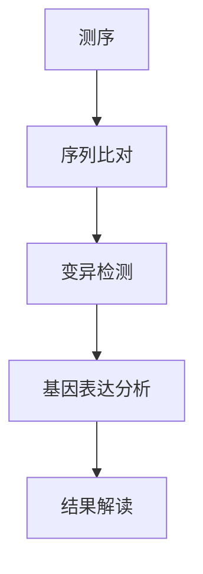
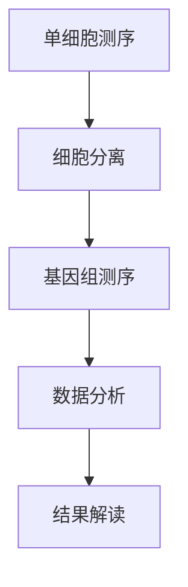
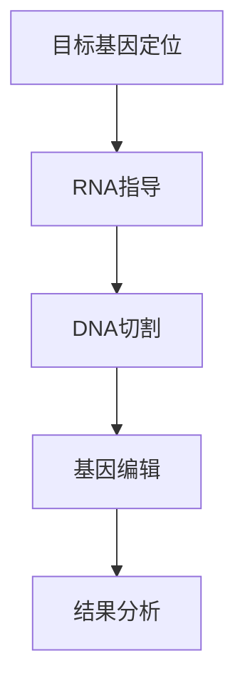
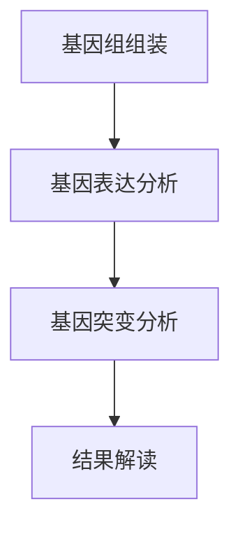
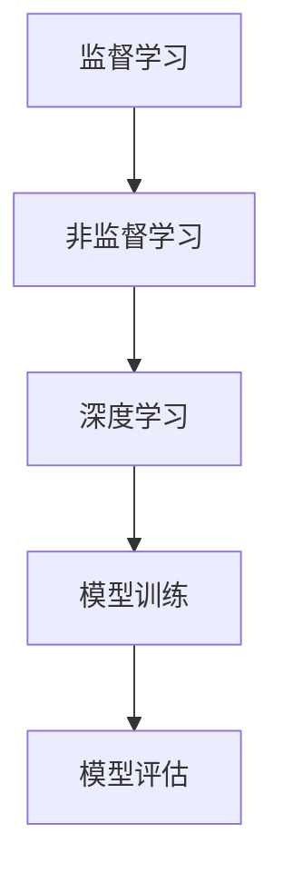
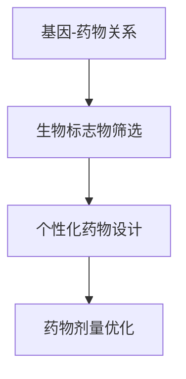
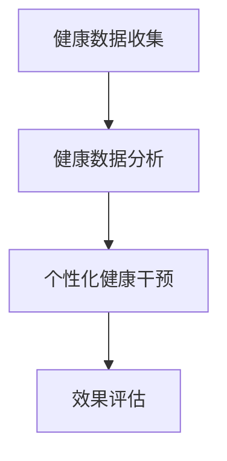
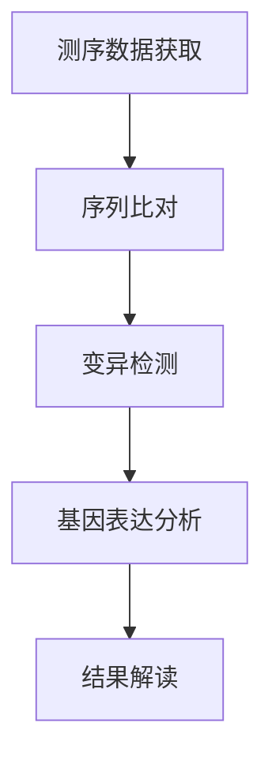

                 

# 硅谷医疗科技创新：个性化精准医疗

> **关键词：** 硅谷医疗、个性化精准医疗、基因组学、生物信息学、机器学习、深度学习、个性化药物治疗、个性化健康管理

> **摘要：** 本文探讨了硅谷在医疗科技创新方面的领先地位，尤其是个性化精准医疗领域。通过分析基因组学、生物信息学、机器学习与深度学习等核心技术，以及个性化药物治疗和个性化健康管理在实践中的应用，本文揭示了个性化精准医疗的未来趋势及其对医疗行业的深远影响。

## 目录大纲

- **第一部分：引言**
  - 第1章：硅谷医疗科技创新概述
    - 1.1 硅谷医疗科技创新的背景与意义
    - 1.2 硅谷医疗科技创新的主要方向
    - 1.3 个性化精准医疗：硅谷医疗创新的核心
  - 第2章：个性化精准医疗的基础技术
    - 2.1 基因组学与生物信息学
    - 2.2 生物信息学工具与应用
    - 2.3 机器学习与深度学习在医疗中的应用
  - 第3章：个性化精准医疗的应用与实践
    - 3.1 个性化药物治疗
    - 3.2 个性化健康管理
  - 第4章：个性化精准医疗的未来展望
    - 4.1 个性化精准医疗的发展趋势
    - 4.2 个性化精准医疗的潜在影响
- **附录**
  - 附录A：个性化精准医疗相关资源
  - 附录B：Mermaid流程图与伪代码示例

## 第一部分：引言

### 第1章：硅谷医疗科技创新概述

#### 1.1 硅谷医疗科技创新的背景与意义

硅谷作为全球科技创新的摇篮，其医疗领域的创新更是引领全球。随着基因组学、生物信息学、机器学习和深度学习等技术的迅速发展，个性化精准医疗已成为硅谷医疗科技创新的核心方向。

个性化精准医疗的核心在于根据患者的具体基因信息、生活环境、健康状况等因素，制定个性化的治疗方案和健康管理方案。这不仅提高了医疗的精确度和效果，还大大降低了医疗成本，对整个医疗行业产生了深远的影响。

#### 1.2 硅谷医疗科技创新的主要方向

硅谷的医疗科技创新主要集中在以下几个方向：

1. **基因组学与生物信息学**：通过高通量测序技术，获取患者的基因组信息，进而进行基因组数据分析，为个性化医疗提供基础。
   
2. **机器学习与深度学习**：利用这些先进算法，从海量医疗数据中提取有价值的信息，辅助医生进行诊断和治疗。

3. **大数据与云计算**：利用大数据和云计算技术，实现医疗数据的集中管理和高效处理，为个性化医疗提供支持。

4. **智能设备与物联网**：通过智能设备和物联网技术，实现患者实时健康数据的收集、分析和反馈，提升个性化健康管理的效率。

#### 1.3 个性化精准医疗：硅谷医疗创新的核心

个性化精准医疗是硅谷医疗科技创新的核心，其原因如下：

1. **提高医疗质量**：个性化精准医疗可以根据患者的具体情况，制定最优的治疗方案，大大提高医疗质量。

2. **降低医疗成本**：个性化精准医疗通过减少不必要的检查和治疗，降低了医疗成本。

3. **改善患者体验**：个性化精准医疗可以减少患者因不合适的治疗方案而遭受的痛苦，提升患者的就医体验。

4. **促进医疗公平**：个性化精准医疗可以更好地服务于不同经济水平的患者，促进医疗公平。

### 第2章：个性化精准医疗的基础技术

#### 2.1 基因组学与生物信息学

基因组学是个性化精准医疗的基石，它涉及对人类基因组的研究，包括基因序列的获取、解析和功能分析。生物信息学则是利用计算机技术和数学方法，对基因组学数据进行处理、分析和解释。

##### 2.1.1 基因组学基础

基因组学的基础是基因组序列的获取。高通量测序技术（如NGS）使得获取基因组序列变得快速、高效和低成本。基因组序列的获取后，需要进行序列比对、变异检测、基因表达分析等步骤。

**核心概念与联系：**

- **基因组序列**：人类基因组由约30亿个核苷酸组成，这些核苷酸排列顺序决定了基因的序列。
- **基因变异**：基因变异是指基因序列中的改变，包括单核苷酸变异、插入和缺失等。
- **基因表达**：基因表达是指基因在细胞中的转录和翻译过程，产生蛋白质。

**Mermaid流程图：**



##### 2.1.2 单细胞基因组学研究

单细胞基因组学是基因组学的一个新兴分支，它通过高通量测序技术，对单个细胞中的基因组进行测序和分析。这项技术使得我们能够了解单个细胞中的基因表达和变异情况。

**核心概念与联系：**

- **单细胞测序**：通过单细胞测序技术，可以获取单个细胞的基因组序列。
- **细胞异质性**：单细胞基因组学研究揭示了细胞之间的异质性，对理解生物体功能具有重要意义。

**Mermaid流程图：**



##### 2.1.3 基因编辑技术（如CRISPR）

基因编辑技术，如CRISPR，是基因组学领域的一项革命性技术。它通过在特定位置插入、删除或替换DNA序列，实现对基因的功能修饰。

**核心概念与联系：**

- **CRISPR技术**：CRISPR是一种基于RNA指导的DNA切割技术，通过Cas9蛋白实现基因编辑。
- **基因功能研究**：基因编辑技术可以帮助我们了解基因的功能，为疾病治疗提供新的手段。

**Mermaid流程图：**



##### 2.2 生物信息学工具与应用

生物信息学是基因组学的重要组成部分，它涉及对基因组学数据的处理、分析和解释。生物信息学工具广泛应用于基因表达分析、基因突变分析、基因组组装和比较基因组学等领域。

**核心概念与联系：**

- **基因组组装**：基因组组装是将测序得到的短读段组装成完整的基因组序列。
- **基因表达分析**：基因表达分析可以了解基因在不同组织、不同状态下表达的情况。
- **基因突变分析**：基因突变分析可以帮助发现与疾病相关的突变。

**Mermaid流程图：**



##### 2.3 机器学习与深度学习在医疗中的应用

机器学习和深度学习是人工智能的两个重要分支，它们在医疗领域的应用正日益广泛。通过这些算法，可以从海量医疗数据中提取有价值的信息，辅助医生进行诊断和治疗。

**核心概念与联系：**

- **监督学习**：监督学习是一种通过已知的输入和输出数据，训练模型进行预测的方法。
- **非监督学习**：非监督学习是一种不依赖于已知的输入输出数据，从数据中发现模式和关系的方法。
- **深度学习**：深度学习是一种通过多层神经网络，对数据进行自动特征提取的方法。

**Mermaid流程图：**



##### 2.4 个性化药物治疗

个性化药物治疗是个性化精准医疗的重要方向，它基于患者的基因信息和生物标志物，制定个性化的治疗方案。

**核心概念与联系：**

- **基因-药物关系**：研究基因与药物之间的相互作用，为个性化药物设计提供依据。
- **生物标志物**：生物标志物是用于诊断、预后和治疗效果评估的分子标记。
- **个性化药物设计**：通过基因组学和生物信息学技术，设计针对特定患者的药物。

**Mermaid流程图：**



##### 2.5 个性化健康管理

个性化健康管理是通过收集、分析和利用患者的健康数据，制定个性化的健康管理方案。

**核心概念与联系：**

- **健康数据收集**：收集患者的健康数据，包括生活方式、生物标志物、医疗记录等。
- **健康数据分析**：利用数据分析方法，发现患者的健康风险和潜在问题。
- **个性化健康干预**：根据患者的健康数据，制定个性化的健康干预方案。

**Mermaid流程图：**



### 第3章：个性化精准医疗的应用与实践

#### 3.1 个性化药物治疗

个性化药物治疗是基于患者的基因信息和生物标志物，制定个性化的治疗方案。以下是一个个性化药物治疗的案例：

**案例背景：** 某患者患有晚期肺癌，常规治疗方案效果不佳，寻求个性化药物治疗。

**步骤一：基因测序与生物标志物检测**

对患者进行基因测序，检测与肺癌相关的基因突变和生物标志物。通过高通量测序技术，获得患者的全基因组序列，并进行突变检测和生物标志物筛选。

**步骤二：基因-药物关系分析**

利用生物信息学工具，分析基因突变和生物标志物与药物之间的相互作用。筛选出可能与患者基因突变和生物标志物相关的药物。

**步骤三：个性化药物设计**

根据基因-药物关系分析结果，设计针对患者的个性化药物方案。选择具有良好疗效和较低毒副作用的药物。

**步骤四：药物剂量优化**

通过药物代谢和药代动力学研究，确定患者的药物剂量。利用机器学习算法，预测患者对药物的反应，优化药物剂量。

**步骤五：治疗效果评估**

实施个性化药物治疗，并对治疗效果进行评估。通过定期检查和随访，评估药物的疗效和安全性。

**核心算法原理讲解：**

1. **基因突变检测算法**：

```latex
假设 \( x \) 为基因组序列，\( y \) 为突变位点，\( z \) 为突变类型。

基因突变检测算法的目标是找出序列 \( x \) 中的突变位点 \( y \)。

算法伪代码：

```
function detectMutation(x, y, z):
    for each position i in x:
        if x[i] != z:
            return True
    return False
```

2. **药物剂量优化算法**：

```latex
假设 \( d \) 为药物剂量，\( r \) 为药物反应，\( c \) 为患者对药物的反应。

药物剂量优化算法的目标是找到最佳的药物剂量 \( d \)，使得患者对药物的反应 \( r \) 最大。

算法伪代码：

```
function optimizeDosage(d, r, c):
    for each dosage d in d:
        r = predictResponse(d, c)
        if r > currentMaxResponse:
            currentMaxResponse = r
            bestDosage = d
    return bestDosage
```

#### 3.2 个性化健康管理

个性化健康管理是通过收集、分析和利用患者的健康数据，制定个性化的健康管理方案。以下是一个个性化健康管理的案例：

**案例背景：** 某患者患有糖尿病，需要进行个性化健康管理。

**步骤一：健康数据收集**

收集患者的健康数据，包括血糖水平、体重、饮食和运动习惯等。

**步骤二：健康数据分析**

利用数据分析方法，分析患者的健康数据，发现健康风险和潜在问题。

**步骤三：个性化健康干预**

根据健康数据分析结果，制定个性化的健康干预方案，包括饮食调整、运动计划和药物治疗等。

**步骤四：健康效果评估**

实施个性化健康管理，并对健康效果进行评估。通过定期检查和随访，评估健康干预的效果。

**核心算法原理讲解：**

1. **健康风险评估算法**：

```latex
假设 \( H \) 为健康数据，\( R \) 为健康风险。

健康风险评估算法的目标是预测患者的健康风险。

算法伪代码：

```
function assessRisk(H, R):
    for each feature f in H:
        if f exceeds threshold:
            R[f] = True
    return R
```

2. **健康干预效果评估算法**：

```latex
假设 \( I \) 为健康干预方案，\( E \) 为健康效果。

健康干预效果评估算法的目标是评估健康干预的效果。

算法伪代码：

```
function evaluateEffect(I, E):
    for each intervention i in I:
        if i improves E:
            return True
    return False
```

### 第4章：个性化精准医疗的未来展望

#### 4.1 个性化精准医疗的发展趋势

个性化精准医疗正在迅速发展，未来有望在以下几个方面取得突破：

1. **基因组学与生物信息学技术的进步**：随着测序技术和生物信息学工具的不断发展，我们将能够更全面、准确地了解基因组信息，为个性化医疗提供更精准的数据支持。

2. **机器学习与深度学习的应用**：机器学习和深度学习在医疗领域的应用将更加广泛，通过大数据分析和智能算法，将进一步提升个性化医疗的效率和准确性。

3. **跨学科融合**：个性化精准医疗将融合生物学、医学、计算机科学、统计学等多个学科，形成新的交叉学科，推动个性化医疗的全面发展。

4. **可穿戴设备与物联网的应用**：随着可穿戴设备和物联网技术的发展，我们将能够实时、便捷地获取患者的健康数据，实现真正的个性化健康管理。

#### 4.2 个性化精准医疗的潜在影响

个性化精准医疗将对医疗行业产生深远的影响：

1. **提高医疗质量**：个性化精准医疗将根据患者的具体情况进行治疗，大大提高医疗质量和治疗效果。

2. **降低医疗成本**：个性化精准医疗通过减少不必要的检查和治疗，降低了医疗成本。

3. **改善患者体验**：个性化精准医疗将根据患者的需求和偏好，提供个性化的治疗方案和健康管理方案，改善患者的就医体验。

4. **促进医疗公平**：个性化精准医疗将使得不同经济水平的患者都能享受到优质的医疗资源，促进医疗公平。

### 附录

#### 附录A：个性化精准医疗相关资源

- **基因组学与生物信息学工具**：UCSC Genome Browser、Ensembl、NCBI GenBank
- **个性化药物开发平台**：Clinomic Labs、Medicine.AI、Precision Medicine Platform
- **个性化健康管理应用**：Apple Health、Google Fit、Fitbit

#### 附录B：Mermaid流程图与伪代码示例

- **基因组信息处理流程**



- **个性化药物剂量优化算法伪代码**

```latex
function optimizeDosage(d, r, c):
    for each dosage d in d:
        r = predictResponse(d, c)
        if r > currentMaxResponse:
            currentMaxResponse = r
            bestDosage = d
    return bestDosage
```

### 作者信息

**作者：** AI天才研究院/AI Genius Institute & 禅与计算机程序设计艺术/Zen And The Art of Computer Programming

---

本文通过详细分析个性化精准医疗的基础技术、应用与实践以及未来展望，揭示了硅谷在医疗科技创新领域的领先地位和个性化精准医疗的深远影响。希望本文能为读者提供对个性化精准医疗的全面了解和深入思考。

