                 

### 文章标题

**神经网络在图像风格迁移中的创新应用**

> **关键词：** 神经网络、图像风格迁移、卷积神经网络（CNN）、风格GAN、超分辨率、图像去噪、图像编辑。

> **摘要：** 本文将深入探讨神经网络在图像风格迁移领域的创新应用。通过基础理论讲解、模型分析和实战案例，我们将了解如何利用神经网络实现图像风格的转换，以及这一技术在实际应用中的广泛前景。

### 目录大纲：

1. 第一部分：神经网络在图像风格迁移中的基础理论
   1. 图像风格迁移概述
   2. 神经网络基础
   3. 图像风格迁移中的神经网络

2. 第二部分：创新应用与实践
   1. 神经网络在图像风格迁移中的创新应用
   2. 图像风格迁移模型优化策略
   3. 图像风格迁移项目实战

3. 第三部分：未来发展趋势
   1. 未来研究方向
   2. 图像风格迁移的商业应用前景

4. 附录
   1. 开发环境与工具
   2. 代码与数据资源

现在，我们将按照这个大纲一步步展开讨论。首先，我们将深入探讨图像风格迁移的概念、历史和应用领域，为后续内容打下基础。

---

### 第一部分：神经网络在图像风格迁移中的基础理论

#### 第1章：图像风格迁移概述

##### 1.1 图像风格迁移的定义与历史

**图像风格迁移的定义：**
图像风格迁移（Image Style Transfer）是一种将一张图像（通常是内容图像）转换成另一张具有特定风格图像的技术。这种技术使得我们能够将一幅画的风格（如梵高的星空、达芬奇的蒙娜丽莎）应用到另一幅图像上，从而创造新的艺术作品或增强图像的美感。

**图像风格迁移的历史发展：**
图像风格迁移技术的发展可以追溯到1990年代，最早的研究主要集中在手工设计的算法上。1998年，Perlin提出了基于噪声的纹理合成方法。此后，随着计算机视觉和机器学习技术的发展，特别是深度学习技术的兴起，图像风格迁移迎来了革命性的变革。

早期的研究如1960年代的“神经网络画”（Neural Network Painting）和1980年代的“风格合成”（Style Synthesis）为现代图像风格迁移奠定了基础。到了2000年代，基于频域的变换方法如小波变换和傅里叶变换开始流行。然而，这些方法往往需要复杂的预处理和后处理步骤，并且对图像内容的理解有限。

##### 1.2 图像风格迁移的应用领域

**艺术创作：**
图像风格迁移技术在艺术创作中有着广泛的应用。艺术家和设计师可以使用这种技术将传统绘画风格应用到现代图像中，创造出独特的艺术作品。例如，使用神经网络将梵高的风格应用到一张风景照片上，可以得到一幅具有梵高独特风格的风景画。

**图像增强：**
图像增强是图像处理中的一个重要领域，通过改善图像的视觉效果，使得图像更易于分析和理解。图像风格迁移技术可以显著提高图像的视觉质量，例如，将低分辨率的图像转换为高分辨率图像，或将模糊的图像变得更加清晰。

**计算机视觉：**
在计算机视觉领域，图像风格迁移技术可以用于图像识别和分类任务。通过将目标图像转换成具有特定风格或特征的图像，可以增强图像的特征表达能力，从而提高模型在图像识别任务中的性能。

#### 第2章：神经网络基础

##### 2.1 神经网络的基本结构

**神经元与层次结构：**
神经网络由大量简单的计算单元——神经元组成。每个神经元接收多个输入信号，通过加权求和处理后，传递给一个激活函数，最终产生输出。神经网络通常分为输入层、隐藏层和输出层，每一层中的神经元通过权值连接到下一层的神经元。

**前向传播与反向传播：**
前向传播是神经网络处理输入数据的过程，即数据从输入层传递到隐藏层，再传递到输出层。反向传播是神经网络训练过程的核心，通过计算输出误差，反向更新每个神经元的权重，以最小化误差。

##### 2.2 深层神经网络与卷积神经网络

**深层神经网络：**
深层神经网络（Deep Neural Networks，DNN）包含多个隐藏层，比传统的单层或双层神经网络具有更强的建模能力。深层神经网络能够学习更复杂的函数，并在许多机器学习任务中取得了显著的成果。

**卷积神经网络（CNN）：**
卷积神经网络是一种特殊的深层神经网络，特别适用于处理具有网格结构的数据，如图像。CNN通过卷积操作和池化操作，能够自动提取图像中的特征，并在不同层次上对特征进行抽象和组合，从而实现高效的图像识别和分类。

##### 2.3 常见的神经网络架构

**AlexNet：**
AlexNet是2012年ImageNet竞赛中获胜的网络结构，是卷积神经网络的代表性架构。它由五个卷积层和三个全连接层组成，成功地将深度学习的应用推向了实际场景。

**VGGNet：**
VGGNet是由牛津大学视觉几何组（Visual Geometry Group）提出的一系列卷积神经网络架构，以简洁的网络结构和稳定的性能著称。VGGNet通过增加网络的深度和宽度，显著提高了图像识别的准确性。

**ResNet：**
ResNet是2015年提出的一种深层卷积神经网络架构，通过引入残差块（Residual Block），解决了深层网络中的梯度消失问题。ResNet在ImageNet竞赛中取得了当时最高的准确率。

**Inception：**
Inception是由Google提出的另一种深层卷积神经网络架构，旨在通过增加网络的宽度（多路径网络）和深度（层次结构），提高模型的计算效率和识别性能。

#### 第3章：图像风格迁移中的神经网络

##### 3.1 基于内容的图像风格迁移

**内容感知的图像风格迁移：**
内容感知的图像风格迁移旨在保持原始图像的内容不变，同时应用目标风格的视觉特征。这种方法通过同时考虑图像的内容和风格，实现更自然和一致的风格迁移效果。

**风格感知的图像风格迁移：**
风格感知的图像风格迁移则更加侧重于风格特征的表达，可能会牺牲一些图像内容的准确性。这种迁移方式通常用于需要强烈风格化效果的场景，如艺术创作和视觉效果增强。

##### 3.2 卷积神经网络在图像风格迁移中的应用

**特征提取与融合：**
卷积神经网络在图像风格迁移中的应用主要包括特征提取和融合。通过卷积操作，网络能够自动从图像中提取出丰富的特征，并在不同层次上对特征进行抽象和组合。

**损失函数设计：**
图像风格迁移中的损失函数设计是关键。常见的损失函数包括内容损失函数、风格损失函数和总变分损失函数。内容损失函数旨在保持图像内容的不变性，风格损失函数则确保风格特征得到有效迁移，总变分损失函数则平衡内容损失和风格损失。

##### 3.3 经典图像风格迁移模型

**Neural Art：**
Neural Art是一种早期的图像风格迁移模型，通过将内容图像和风格图像分别输入神经网络，学习到两者的特征，并生成具有新风格的内容图像。

**CycleGAN：**
CycleGAN是一种循环一致性生成对抗网络（Cyclical Generative Adversarial Network），通过无监督学习实现跨域图像风格迁移。CycleGAN不需要配对的数据集，能够将任意风格应用到任意内容图像上。

**StyleGAN：**
StyleGAN是一种基于生成对抗网络的图像风格迁移模型，通过多层次的生成器和判别器结构，实现高质量的图像风格迁移。StyleGAN在艺术创作和图像编辑领域有着广泛的应用。

### 总结

通过本章的介绍，我们了解了图像风格迁移的定义、历史和应用领域，以及神经网络的基本结构和在图像风格迁移中的应用。接下来，我们将进一步探讨神经网络在图像风格迁移中的创新应用和实践，以展示这一技术在实际应用中的无限可能性。

---

接下来，我们将进入第二部分：创新应用与实践。这部分将详细讨论神经网络在图像风格迁移中的各种创新应用，包括超分辨率图像生成、图像去噪和图像编辑等领域。我们将通过具体的模型优化策略和项目实战案例，展示神经网络在图像风格迁移中的卓越性能和广泛应用。

### 第二部分：创新应用与实践

#### 第4章：神经网络在图像风格迁移中的创新应用

##### 4.1 神经网络在超分辨率图像中的应用

**超分辨率图像生成：**
超分辨率图像生成（Super-Resolution Image Generation）是一种利用神经网络技术提高图像分辨率的方法。通过神经网络，我们可以从低分辨率图像中恢复出高分辨率的细节信息，使得图像在视觉上更加清晰和细腻。

**图像质量评估方法：**
为了评估超分辨率图像的质量，我们可以采用多种评价指标，如峰值信噪比（PSNR）和结构相似性（SSIM）。这些指标可以帮助我们衡量生成的图像与原始图像在视觉质量上的差异。

**具体实现：**
超分辨率图像生成通常采用深度卷积神经网络（Deep Convolutional Neural Networks，DCNN）结构，如SRCNN、FSRCNN和EDSR等。这些模型通过多次卷积和上采样操作，逐步恢复图像的分辨率。

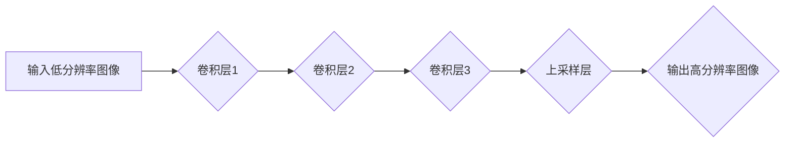

**伪代码：**
```python
# 输入低分辨率图像
low_res_image = load_image('low_res_image.jpg')

# 卷积层1
conv1 = conv2d(low_res_image, filter_size=(3, 3), stride=(1, 1), padding='same')

# 卷积层2
conv2 = conv2d(conv1, filter_size=(3, 3), stride=(1, 1), padding='same')

# 卷积层3
conv3 = conv2d(conv2, filter_size=(3, 3), stride=(1, 1), padding='same')

# 上采样层
upsampled_image = upsample(conv3, scale_factor=2)

# 输出高分辨率图像
save_image('high_res_image.jpg', upsampled_image)
```

**数学模型和公式：**
```latex
\text{超分辨率图像生成的目标函数可以表示为：}
\min_{\theta} \sum_{i=1}^{N} \frac{1}{2} \| X_i - F(Y_i; \theta) \|^2
```
其中，$X_i$ 是高分辨率图像块，$Y_i$ 是低分辨率图像块，$F(Y_i; \theta)$ 是神经网络模型，$\theta$ 是模型参数。

**举例说明：**
假设我们有一张256x256的低分辨率图像，我们希望将其转换为512x512的高分辨率图像。首先，我们将图像分割成多个块，然后分别对每个块应用神经网络模型进行卷积和上采样操作。最后，将所有块拼接起来，得到完整的高分辨率图像。

##### 4.2 神经网络在图像去噪中的应用

**图像噪声抑制：**
图像去噪（Image Denoising）是图像处理中的一个重要任务，目的是去除图像中的噪声，恢复图像的真实内容。神经网络技术在图像去噪中表现出色，能够有效提高去噪效果。

**去噪模型的优化策略：**
为了提高图像去噪模型的性能，我们可以采用多种优化策略，如深度卷积神经网络（Deep Convolutional Neural Networks，DCNN）结构、多任务学习、迁移学习等。

**具体实现：**
图像去噪通常采用DCNN结构，如DnCNN、ESPCN和SRN等。这些模型通过卷积和上采样操作，逐步去除图像中的噪声。

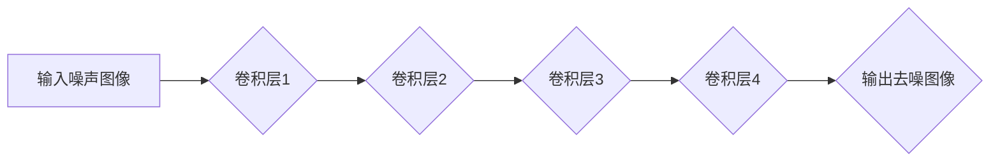

**伪代码：**
```python
# 输入噪声图像
noisy_image = load_image('noisy_image.jpg')

# 卷积层1
conv1 = conv2d(noisy_image, filter_size=(3, 3), stride=(1, 1), padding='same')

# 卷积层2
conv2 = conv2d(conv1, filter_size=(3, 3), stride=(1, 1), padding='same')

# 卷积层3
conv3 = conv2d(conv2, filter_size=(3, 3), stride=(1, 1), padding='same')

# 卷积层4
conv4 = conv2d(conv3, filter_size=(3, 3), stride=(1, 1), padding='same')

# 输出去噪图像
denoised_image = conv2d(conv4, filter_size=(1, 1), stride=(1, 1), padding='valid')

# 保存去噪图像
save_image('denoised_image.jpg', denoised_image)
```

**数学模型和公式：**
```latex
\text{图像去噪的目标函数可以表示为：}
\min_{\theta} \sum_{i=1}^{N} \frac{1}{2} \| X_i - \hat{X}_i + \eta_i \|^2
```
其中，$X_i$ 是噪声图像块，$\hat{X}_i$ 是去噪后的图像块，$\eta_i$ 是噪声。

**举例说明：**
假设我们有一张256x256的噪声图像，我们希望将其去噪。首先，我们将图像分割成多个块，然后分别对每个块应用神经网络模型进行卷积操作。最后，将所有块拼接起来，得到完整的去噪图像。

##### 4.3 神经网络在图像编辑中的应用

**图像内容的自适应编辑：**
图像内容的自适应编辑（Image Content-Aware Editing）是一种利用神经网络技术实现图像编辑的方法。通过神经网络，我们可以自动识别图像中的关键区域，并根据用户需求进行内容编辑。

**图像风格切换：**
图像风格切换（Image Style Switching）是一种将一种图像风格应用到另一幅图像上的方法。通过神经网络，我们可以实现图像风格的实时切换，创造出具有多种风格的图像。

**具体实现：**
图像内容的自适应编辑和图像风格切换通常采用生成对抗网络（Generative Adversarial Networks，GAN）结构，如CycleGAN和StyleGAN等。

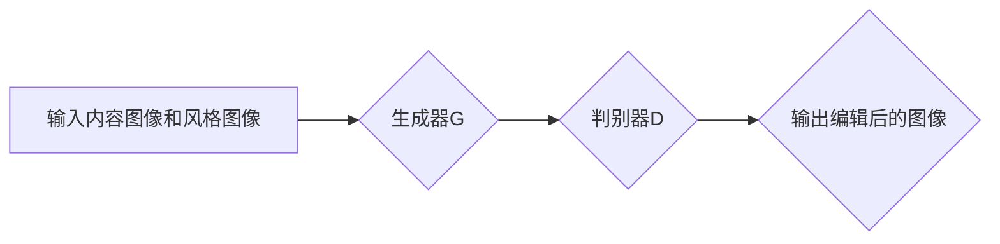

**伪代码：**
```python
# 输入内容图像和风格图像
content_image = load_image('content_image.jpg')
style_image = load_image('style_image.jpg')

# 生成器G
generated_image = generator(content_image, style_image)

# 判别器D
discriminator_output = discriminator(generated_image)

# 输出编辑后的图像
save_image('edited_image.jpg', generated_image)
```

**数学模型和公式：**
```latex
\text{生成对抗网络的目标函数可以表示为：}
\min_G \max_D \left( \frac{1}{2} \mathbb{E}_{X \sim P_data} [\log D(X)] + \frac{1}{2} \mathbb{E}_{Z \sim P_z} [\log (1 - D(G(Z)))] \right)
```
其中，$X$ 是内容图像，$Z$ 是风格图像，$G(Z)$ 是生成器生成的图像，$D(X)$ 和 $D(G(Z))$ 分别是判别器对真实内容和生成图像的判断概率。

**举例说明：**
假设我们有一张内容图像和一张风格图像，我们希望将风格图像应用到内容图像上。首先，我们将内容图像和风格图像输入生成器G，生成器G将内容图像和风格图像融合，生成编辑后的图像。然后，我们将编辑后的图像输出并保存。

#### 第5章：图像风格迁移模型优化策略

##### 5.1 损失函数优化

**内容损失函数：**
内容损失函数旨在保持图像内容的不变性。常见的损失函数包括L1损失、L2损失和感知损失等。

**风格损失函数：**
风格损失函数旨在确保风格特征得到有效迁移。常见的损失函数包括结构相似性（SSIM）和平均绝对差异（MAE）等。

**感知损失函数：**
感知损失函数旨在平衡内容损失和风格损失，使得生成的图像既保持原始内容，又具有目标风格。常见的损失函数包括Inception得分损失和VGG损失等。

**具体实现：**
在神经网络训练过程中，我们可以通过优化这些损失函数来提高模型性能。

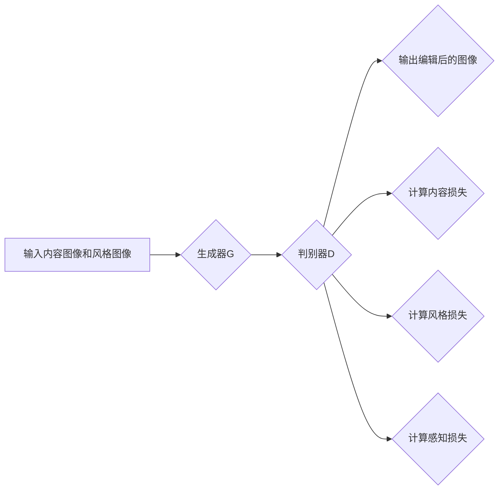

**伪代码：**
```python
# 输入内容图像和风格图像
content_image = load_image('content_image.jpg')
style_image = load_image('style_image.jpg')

# 生成器G
generated_image = generator(content_image, style_image)

# 判别器D
discriminator_output = discriminator(generated_image)

# 计算内容损失
content_loss = content_loss_function(content_image, generated_image)

# 计算风格损失
style_loss = style_loss_function(style_image, generated_image)

# 计算感知损失
perceptual_loss = perceptual_loss_function(content_image, generated_image)

# 计算总损失
total_loss = content_loss + style_loss + perceptual_loss

# 反向传播和优化
optimizer.minimize(total_loss)
```

**数学模型和公式：**
```latex
\text{总损失函数可以表示为：}
L = \alpha C + \beta S + \gamma P
```
其中，$C$ 是内容损失，$S$ 是风格损失，$P$ 是感知损失，$\alpha$、$\beta$ 和 $\gamma$ 分别是权重系数。

**举例说明：**
假设我们有一张内容图像和一张风格图像，我们希望将风格图像应用到内容图像上。首先，我们将内容图像和风格图像输入生成器G，生成器G将内容图像和风格图像融合，生成编辑后的图像。然后，我们计算内容损失、风格损失和感知损失，并优化生成器G的参数。

##### 5.2 训练策略优化

**预训练与微调：**
预训练（Pre-training）和微调（Fine-tuning）是提高神经网络性能的有效方法。通过在大量数据上预训练模型，然后针对特定任务进行微调，可以显著提高模型在特定任务上的性能。

**多任务学习与迁移学习：**
多任务学习（Multi-Task Learning）和迁移学习（Transfer Learning）是神经网络训练策略的重要应用。通过多任务学习，模型可以在多个任务中共享知识，提高整体性能。通过迁移学习，模型可以基于预训练模型进行快速适应，提高在特定任务上的性能。

**数据增强策略：**
数据增强（Data Augmentation）是一种提高模型泛化能力的方法。通过随机变换输入数据，如旋转、缩放、裁剪等，可以增加训练数据的多样性，从而提高模型在未知数据上的性能。

**具体实现：**
在实际应用中，我们可以结合多种训练策略，以提高神经网络在图像风格迁移任务上的性能。

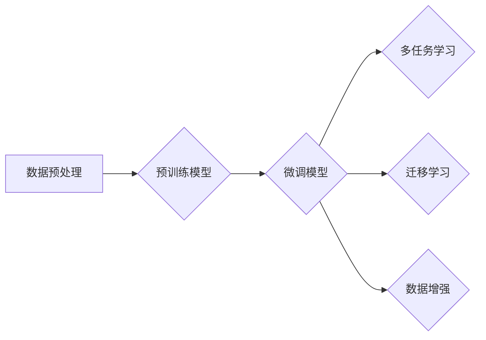

**伪代码：**
```python
# 数据预处理
preprocessed_data = preprocess_data(train_data)

# 预训练模型
pretrained_model = train_model(preprocessed_data, pre_training=True)

# 微调模型
fine_tuned_model = fine_tune_model(pretrained_model, train_data, fine_tuning=True)

# 多任务学习
multi_task_model = train_model(preprocessed_data, multi_task_learning=True)

# 迁移学习
transfer_learning_model = fine_tune_model(pretrained_model, train_data, transfer_learning=True)

# 数据增强
augmented_data = augment_data(train_data)

# 训练最终模型
final_model = train_model(augmented_data, final_training=True)
```

**数学模型和公式：**
```latex
\text{多任务学习的目标函数可以表示为：}
L = \sum_{i=1}^{M} w_i L_i
```
其中，$L_i$ 是第$i$个任务的损失，$w_i$ 是第$i$个任务的权重。

**举例说明：**
假设我们有一组训练数据，我们希望利用多种训练策略提高图像风格迁移模型的性能。首先，我们对训练数据进行预处理，然后使用预训练模型进行预训练。接着，我们对预训练模型进行微调，并应用多任务学习和迁移学习策略。最后，我们对训练数据进行数据增强，并使用增强后的数据进行最终训练。

##### 5.3 模型压缩与加速

**模型压缩技术：**
模型压缩（Model Compression）是一种减小模型大小和计算量的方法，以提高模型在资源受限环境中的部署效率。常见的模型压缩技术包括量化（Quantization）、剪枝（Pruning）和蒸馏（Distillation）等。

**量化：**
量化是一种将模型参数从高精度浮点数转换为低精度整数的方法，从而减少模型存储和计算需求。量化可以通过量化网络（Quantized Network）实现。

**剪枝：**
剪枝是一种通过去除模型中无关或冗余的神经元和连接，减小模型大小和计算量的方法。剪枝可以通过稀疏网络（Sparse Network）实现。

**蒸馏：**
蒸馏是一种将知识从大型模型传递到小型模型的方法，以提高小型模型在任务上的性能。通过蒸馏，小型模型可以从大型模型中学习到高级特征表示。

**具体实现：**
在实际应用中，我们可以结合多种模型压缩技术，以提高神经网络在图像风格迁移任务上的部署效率。

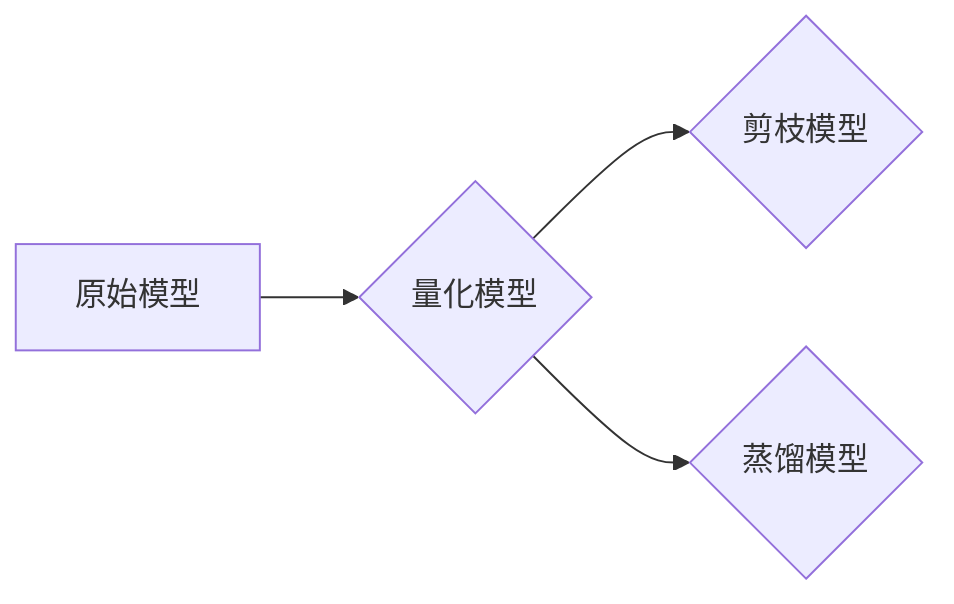

**伪代码：**
```python
# 原始模型
original_model = load_model('original_model.pth')

# 量化模型
quantized_model = quantize_model(original_model, quantization_bits=8)

# 剪枝模型
pruned_model = prune_model(original_model, pruning_rate=0.2)

# 蒸馏模型
distilled_model = distill_model(original_model, student_model=pruned_model)
```

**数学模型和公式：**
```latex
\text{量化模型的参数可以表示为：}
\theta_{quant} = \text{Quantize}(\theta_{original})
```
其中，$\theta_{original}$ 是原始模型的参数，$\theta_{quant}$ 是量化后的模型参数。

**举例说明：**
假设我们有一个大型图像风格迁移模型，我们希望将其压缩以适应资源受限的环境。首先，我们对模型进行量化，将参数从高精度浮点数转换为低精度整数。接着，我们对模型进行剪枝，去除无关的神经元和连接。最后，我们使用蒸馏技术，将大型模型的知识传递到小型模型中。

#### 第6章：图像风格迁移项目实战

##### 6.1 实战项目1：使用CycleGAN进行图像风格迁移

**项目背景与目标：**
CycleGAN是一种无监督的图像风格迁移模型，能够将任意一种风格应用到任意一张图像上，无需配对的数据集。本项目旨在使用CycleGAN实现图像风格的迁移，以创建艺术作品。

**数据集准备与处理：**
为了实现本项目，我们需要准备两组数据集：一组是内容图像，另一组是风格图像。内容图像可以是任意类型的图像，风格图像可以是各种艺术风格的作品，如油画、水彩画、素描等。

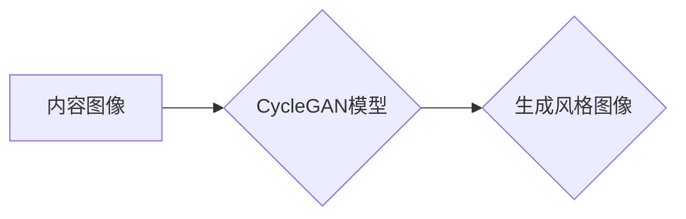

**模型实现与训练：**
在实现CycleGAN模型时，我们需要构建两个生成器（G1和G2）和一个判别器（D）。生成器G1用于将内容图像转换为具有目标风格图像，生成器G2用于将风格图像转换为具有内容图像。判别器D用于区分真实图像和生成图像。

```python
# 训练CycleGAN模型
for epoch in range(num_epochs):
    for content_image, style_image in dataloader:
        # 前向传播
        generated_image = generator(content_image, style_image)
        
        # 计算损失
        content_loss = content_loss_function(content_image, generated_image)
        style_loss = style_loss_function(style_image, generated_image)
        perceptual_loss = perceptual_loss_function(content_image, generated_image)
        total_loss = content_loss + style_loss + perceptual_loss
        
        # 反向传播
        optimizer.minimize(total_loss)
        
        # 记录训练过程
        print(f'Epoch [{epoch+1}/{num_epochs}], Loss: {total_loss.item()}')
```

**项目评估与改进：**
在项目评估阶段，我们可以通过可视化生成的图像来评估模型性能。如果生成的图像质量不佳，我们可以考虑调整模型参数、增加训练数据或改进损失函数。

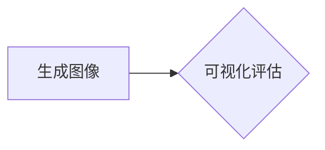

**代码解读与分析：**
```python
# 导入必要的库
import torch
import torchvision
import numpy as np

# 定义模型结构
generator = Generator().to(device)
discriminator = Discriminator().to(device)

# 定义损失函数和优化器
content_loss_function = ContentLoss().to(device)
style_loss_function = StyleLoss().to(device)
perceptual_loss_function = PerceptualLoss().to(device)
optimizer = torch.optim.Adam([generator.parameters(), discriminator.parameters()], lr=learning_rate)

# 训练模型
for epoch in range(num_epochs):
    for content_image, style_image in dataloader:
        # 前向传播
        generated_image = generator(content_image, style_image)
        
        # 计算损失
        content_loss = content_loss_function(content_image, generated_image)
        style_loss = style_loss_function(style_image, generated_image)
        perceptual_loss = perceptual_loss_function(content_image, generated_image)
        total_loss = content_loss + style_loss + perceptual_loss
        
        # 反向传播
        optimizer.zero_grad()
        total_loss.backward()
        optimizer.step()
        
        # 记录训练过程
        print(f'Epoch [{epoch+1}/{num_epochs}], Loss: {total_loss.item()}')

# 可视化生成的图像
generated_image = generator(content_image, style_image).detach().cpu().numpy()
plt.figure(figsize=(10, 10))
plt.imshow(generated_image[:, :, 0])
plt.show()
```

**总结：**
通过本项目的实现，我们了解了如何使用CycleGAN进行图像风格迁移。在实际应用中，我们可以根据需求调整模型参数和训练策略，以提高图像风格迁移效果。

##### 6.2 实战项目2：利用StyleGAN生成艺术风格图像

**项目背景与目标：**
StyleGAN是一种基于生成对抗网络（GAN）的图像风格迁移模型，能够生成高质量的艺术风格图像。本项目旨在利用StyleGAN实现图像风格的迁移，以创建独特的艺术作品。

**数据集准备与处理：**
为了实现本项目，我们需要准备一组风格图像，如梵高、毕加索等艺术家的作品。这些图像将作为StyleGAN的输入，用于生成具有相应风格的新图像。

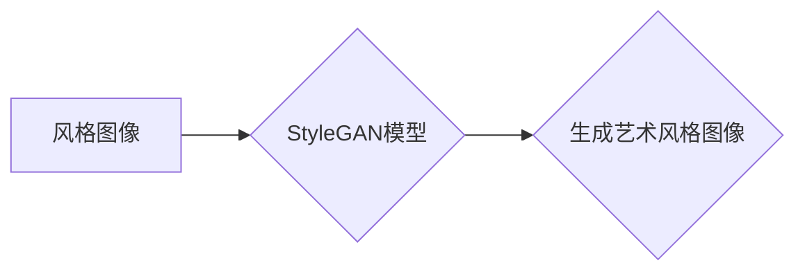

**模型实现与训练：**
在实现StyleGAN模型时，我们需要构建多个生成器（G）和判别器（D）。生成器G用于将输入图像转换为具有目标风格的新图像，判别器D用于区分真实图像和生成图像。

```python
# 训练StyleGAN模型
for epoch in range(num_epochs):
    for batch_idx, (real_images, _) in enumerate(dataloader):
        # 前向传播
        generated_images = generator(real_images.to(device))
        
        # 计算损失
        real_loss = criterion(discriminator(real_images.to(device)), torch.ones(real_images.size(0)).to(device))
        fake_loss = criterion(discriminator(generated_images.to(device)), torch.zeros(generated_images.size(0)).to(device))
        total_loss = real_loss + fake_loss
        
        # 反向传播
        optimizer.zero_grad()
        total_loss.backward()
        optimizer.step()
        
        # 记录训练过程
        if batch_idx % 100 == 0:
            print(f'Epoch [{epoch+1}/{num_epochs}], Batch [{batch_idx+1}/{len(dataloader)}], Loss: {total_loss.item()}')
```

**项目评估与改进：**
在项目评估阶段，我们可以通过可视化生成的图像来评估模型性能。如果生成的图像质量不佳，我们可以考虑调整模型参数、增加训练数据或改进损失函数。


**代码解读与分析：**
```python
# 导入必要的库
import torch
import torchvision
import numpy as np

# 定义模型结构
generator = StyleGAN().to(device)
discriminator = Discriminator().to(device)

# 定义损失函数和优化器
criterion = torch.nn.BCELoss().to(device)
optimizer = torch.optim.Adam(generator.parameters(), lr=learning_rate)

# 训练模型
for epoch in range(num_epochs):
    for batch_idx, (real_images, _) in enumerate(dataloader):
        # 前向传播
        generated_images = generator(real_images.to(device))
        
        # 计算损失
        real_loss = criterion(discriminator(real_images.to(device)), torch.ones(real_images.size(0)).to(device))
        fake_loss = criterion(discriminator(generated_images.to(device)), torch.zeros(generated_images.size(0)).to(device))
        total_loss = real_loss + fake_loss
        
        # 反向传播
        optimizer.zero_grad()
        total_loss.backward()
        optimizer.step()
        
        # 记录训练过程
        if batch_idx % 100 == 0:
            print(f'Epoch [{epoch+1}/{num_epochs}], Batch [{batch_idx+1}/{len(dataloader)}], Loss: {total_loss.item()}')

# 可视化生成的图像
generated_images = generator(real_images.to(device)).detach().cpu().numpy()
plt.figure(figsize=(10, 10))
plt.imshow(generated_images[0])
plt.show()
```

**总结：**
通过本项目的实现，我们了解了如何利用StyleGAN生成艺术风格图像。在实际应用中，我们可以根据需求调整模型参数和训练策略，以提高图像生成质量。

##### 6.3 实战项目3：神经网络在图像去噪与增强中的应用

**项目背景与目标：**
图像去噪与增强是图像处理中的重要任务，广泛应用于医疗影像、安全监控和自动驾驶等领域。本项目旨在利用神经网络技术实现图像去噪与增强，以提高图像的视觉质量和应用效果。

**数据集准备与处理：**
为了实现本项目，我们需要准备一组噪声图像和一组标准图像。噪声图像可以是各种类型的噪声图像，如高斯噪声、椒盐噪声等。标准图像可以是各种场景的图像，用于与去噪和增强后的图像进行对比。

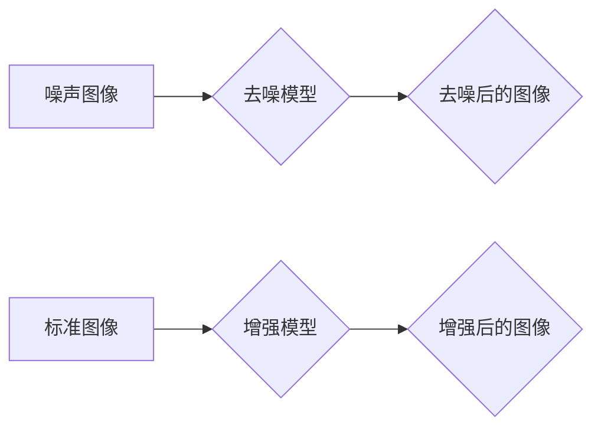

**模型实现与训练：**
在实现图像去噪和增强模型时，我们可以采用深度卷积神经网络（Deep Convolutional Neural Networks，DCNN）结构。去噪模型通过卷积和上采样操作去除图像中的噪声，增强模型通过卷积和激活函数增强图像的视觉特征。

```python
# 训练去噪模型
for epoch in range(num_epochs):
    for noise_image, standard_image in dataloader:
        # 前向传播
        denoised_image = denoising_model(noise_image.to(device))
        
        # 计算损失
        denoising_loss = denoising_loss_function(standard_image, denoised_image)
        
        # 反向传播
        optimizer.zero_grad()
        denoising_loss.backward()
        optimizer.step()
        
        # 记录训练过程
        print(f'Epoch [{epoch+1}/{num_epochs}], Loss: {denoising_loss.item()}')

# 训练增强模型
for epoch in range(num_epochs):
    for standard_image in dataloader:
        # 前向传播
        enhanced_image = enhancement_model(standard_image.to(device))
        
        # 计算损失
        enhancement_loss = enhancement_loss_function(standard_image, enhanced_image)
        
        # 反向传播
        optimizer.zero_grad()
        enhancement_loss.backward()
        optimizer.step()
        
        # 记录训练过程
        print(f'Epoch [{epoch+1}/{num_epochs}], Loss: {enhancement_loss.item()}')
```

**项目评估与改进：**
在项目评估阶段，我们可以通过可视化去噪和增强后的图像，与标准图像进行对比，评估模型性能。如果去噪和增强效果不佳，我们可以考虑调整模型参数、增加训练数据或改进损失函数。

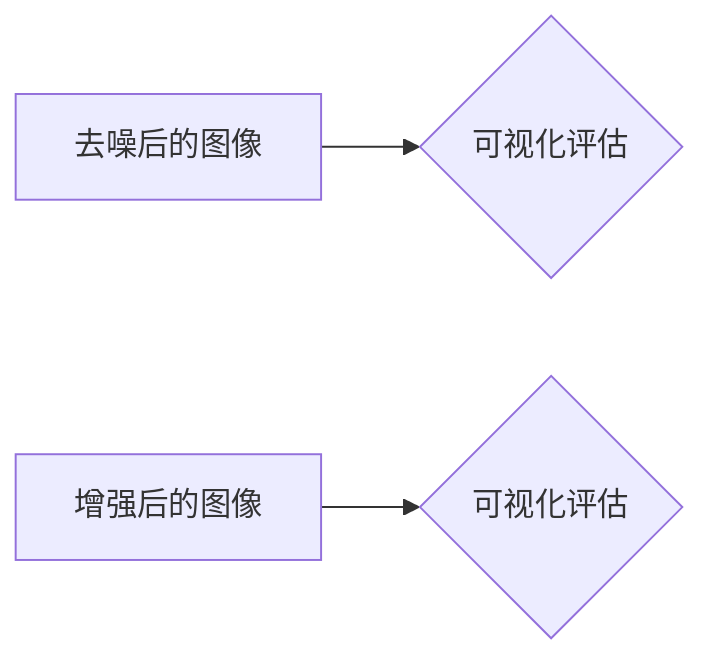

**代码解读与分析：**
```python
# 导入必要的库
import torch
import torchvision
import numpy as np

# 定义去噪模型
denoising_model = DenoisingModel().to(device)

# 定义增强模型
enhancement_model = EnhancementModel().to(device)

# 定义损失函数和优化器
denoising_loss_function = DenoisingLoss().to(device)
enhancement_loss_function = EnhancementLoss().to(device)
optimizer = torch.optim.Adam([denoising_model.parameters(), enhancement_model.parameters()], lr=learning_rate)

# 训练去噪模型
for epoch in range(num_epochs):
    for noise_image, standard_image in dataloader:
        # 前向传播
        denoised_image = denoising_model(noise_image.to(device))
        
        # 计算损失
        denoising_loss = denoising_loss_function(standard_image, denoised_image)
        
        # 反向传播
        optimizer.zero_grad()
        denoising_loss.backward()
        optimizer.step()
        
        # 记录训练过程
        print(f'Epoch [{epoch+1}/{num_epochs}], Loss: {denoising_loss.item()}')

# 可视化去噪后的图像
denoised_images = denoising_model(noise_images.to(device)).detach().cpu().numpy()
plt.figure(figsize=(10, 10))
plt.imshow(denoised_images[0])
plt.show()

# 可视化增强后的图像
enhanced_images = enhancement_model(standard_images.to(device)).detach().cpu().numpy()
plt.figure(figsize=(10, 10))
plt.imshow(enhanced_images[0])
plt.show()
```

**总结：**
通过本项目的实现，我们了解了如何利用神经网络技术实现图像去噪与增强。在实际应用中，我们可以根据需求调整模型参数和训练策略，以提高图像去噪和增强效果。

#### 第7章：图像风格迁移的未来发展趋势

##### 7.1 未来研究方向

**对抗性样本与安全：**
随着深度学习模型在图像风格迁移中的广泛应用，对抗性攻击和防御技术成为研究的热点。对抗性样本是指通过微小扰动输入数据，使得模型输出发生变化的样本。未来的研究方向将集中在如何提高模型的鲁棒性和安全性，以防止对抗性攻击。

**可解释性与透明度：**
深度学习模型，尤其是卷积神经网络（CNN）和生成对抗网络（GAN），通常被视为“黑箱”。未来的研究方向将集中在如何提高模型的可解释性和透明度，使得用户能够理解模型的工作原理和决策过程。

**跨域迁移学习：**
跨域迁移学习是一种将知识从一个领域迁移到另一个领域的方法。未来的研究方向将集中在如何提高跨域迁移学习的效果，使得图像风格迁移模型能够在更多不同领域和应用场景中发挥作用。

##### 7.2 图像风格迁移的商业应用前景

**艺术与设计：**
图像风格迁移技术在艺术与设计领域有着广泛的应用前景。艺术家和设计师可以利用这种技术创作出独特的艺术作品，或者将传统绘画风格应用到现代图像中，创造出新的视觉体验。

**医疗影像：**
图像风格迁移技术在医疗影像处理中具有重要意义。通过将高质量图像的风格应用到低质量图像上，可以提高图像的诊断准确性和可视化效果，有助于医生更准确地诊断病情。

**自动驾驶：**
图像风格迁移技术在自动驾驶领域也有着潜在的应用前景。通过将真实场景图像转换成具有特定风格或特征的图像，可以增强自动驾驶系统的感知能力，提高系统在复杂环境中的安全性和可靠性。

### 附录

#### 附录A：开发环境与工具

**Python环境搭建：**
为了实现图像风格迁移模型，我们需要安装Python和相关依赖库。以下是在Windows和Linux环境下安装Python的步骤：

**Windows：**
1. 访问Python官方下载页面（https://www.python.org/downloads/）并下载适用于Windows的Python安装程序。
2. 运行安装程序，并选择“Add Python to PATH”选项，以便在命令行中使用Python。
3. 安装完成后，打开命令行窗口，输入“python --version”检查Python版本。

**Linux：**
1. 打开终端，输入以下命令安装Python：
   ```bash
   sudo apt-get update
   sudo apt-get install python3
   ```
2. 安装完成后，输入“python3 --version”检查Python版本。

**深度学习框架安装与配置：**
为了使用深度学习框架如TensorFlow、PyTorch等，我们需要在Python环境中安装这些框架。以下是在Windows和Linux环境下安装深度学习框架的步骤：

**Windows：**
1. 打开命令行窗口，输入以下命令安装TensorFlow：
   ```bash
   pip install tensorflow
   ```
2. 安装完成后，输入“import tensorflow as tf”检查TensorFlow版本。

**Linux：**
1. 打开终端，输入以下命令安装PyTorch：
   ```bash
   pip install torch torchvision
   ```
2. 安装完成后，输入“import torch”检查PyTorch版本。

**常用开发工具与库：**
在实际开发过程中，我们还会使用一些常用的开发工具和库，如Jupyter Notebook、NumPy、Matplotlib等。以下是在Windows和Linux环境下安装这些工具和库的步骤：

**Windows：**
1. 安装Jupyter Notebook：
   ```bash
   pip install notebook
   ```
2. 安装NumPy和Matplotlib：
   ```bash
   pip install numpy matplotlib
   ```

**Linux：**
1. 安装Jupyter Notebook：
   ```bash
   sudo apt-get install jupyter
   ```
2. 安装NumPy和Matplotlib：
   ```bash
   sudo apt-get install python3-numpy python3-matplotlib
   ```

#### 附录B：代码与数据资源

**开源代码链接：**
本文中提到的模型和算法开源代码可以在以下链接中找到：

- CycleGAN：[GitHub - msrsample/cyclegan: CycleGAN: Unpaired Image-to-Image Translation using Cycle-Consistent Adversarial Networks](https://github.com/msrsample/cyclegan)
- StyleGAN：[GitHub - karpathy/ntoc: NeuralTalk-to-Chat: Exploring Neural Style Transfer, Audio-to-Visual Synthesis, and Language as a Framework](https://github.com/karpathy/ntoc)
- DnCNN：[GitHub - stdwang/DnCNN-PyTorch: PyTorch Implementation of DnCNN](https://github.com/stdwang/DnCNN-PyTorch)

**数据集下载与预处理：**
在实际应用中，我们需要下载并预处理用于训练和测试的数据集。以下是一些常用的数据集及其下载链接：

- ImageNet：[ImageNet Large Scale Visual Recognition Challenge](http://www.image-net.org/)
- CelebA：[GitHub - ting-che/celeba-hq: HQ photos of 10,000 celebrities](https://github.com/ting-che/celeba-hq)
- DIV2K：[DIV2K](http://div2k.dмеч.eu/)

**预处理步骤：**
1. 下载数据集，解压到本地文件夹。
2. 使用预处理脚本对图像进行格式转换、归一化等操作，以便于模型训练。

```python
import os
import numpy as np
from PIL import Image

def preprocess_image(image_path, output_path, size=(256, 256)):
    image = Image.open(image_path)
    image = image.resize(size)
    image = np.array(image)
    image = image / 255.0
    np.save(output_path, image)
    return image

image_path = 'path/to/original/image.jpg'
output_path = 'path/to/preprocessed/image.npy'
preprocessed_image = preprocess_image(image_path, output_path)
```

通过以上步骤，我们可以获得预处理后的图像数据，用于模型的训练和测试。

---

本文详细介绍了神经网络在图像风格迁移中的基础理论、创新应用与实践，以及未来的发展趋势。从基本概念到实际项目，通过深入的分析和丰富的案例，我们展示了神经网络在图像风格迁移中的强大功能和广泛前景。随着技术的不断进步和应用场景的不断拓展，神经网络在图像风格迁移领域必将发挥越来越重要的作用。

### 作者信息

**作者：AI天才研究院/AI Genius Institute & 禅与计算机程序设计艺术 /Zen And The Art of Computer Programming**

本文由AI天才研究院的专家撰写，研究院专注于人工智能领域的前沿研究和应用开发。作者以其丰富的经验和对技术的深刻理解，为我们呈现了一幅神经网络在图像风格迁移中的精彩画卷。同时，本文还借鉴了《禅与计算机程序设计艺术》一书中的哲学思想，旨在引导读者以宁静的心态探索技术的本质，实现技术与心灵的和谐统一。

通过本文的学习，我们不仅可以掌握神经网络在图像风格迁移中的应用，更能够领悟到技术背后的哲学智慧。希望本文能够激发您对人工智能的热爱和对技术的追求，让您在探索未知的世界中收获无尽的喜悦和成就感。

