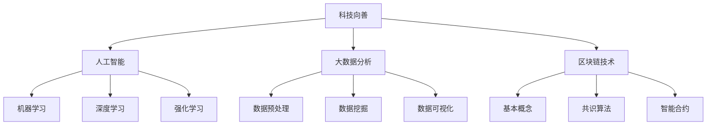
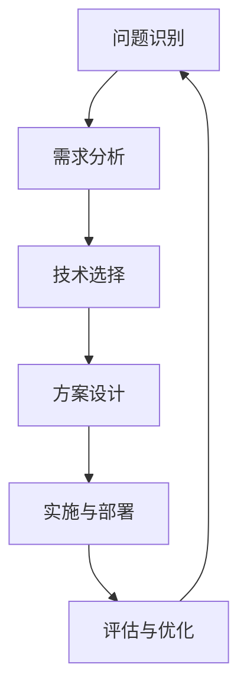

                 

## 科技向善：用科技的力量解决社会难题

关键词：科技向善、人工智能、大数据分析、区块链、社会问题解决

摘要：本文旨在探讨科技向善的概念及其在社会问题解决中的应用。通过详细分析人工智能、大数据分析和区块链等核心技术原理，我们展示了如何利用科技力量解决教育、医疗和环境等领域的社会难题。文章结构清晰，逻辑严密，旨在为读者提供深入理解和实践指导。

### 目录大纲

#### 第一部分：核心概念与联系

1. **第1章 科技向善的概述**
   1.1 科技向善的定义与重要性
   1.2 科技向善与社会的联系
   1.3 科技向善的应用领域

2. **第2章 核心概念原理和架构**
   2.1 Mermaid流程图
   2.2 科技向善的关键技术

#### 第二部分：核心算法原理讲解

3. **第3章 核心算法原理**
   3.1 人工智能算法原理
   3.2 大数据分析算法原理
   3.3 区块链技术原理

4. **第4章 数学模型和数学公式**
   4.1 数学模型概述
   4.2 模型举例说明
   4.3 数学公式详细讲解

#### 第三部分：项目实战

5. **第5章 教育领域的科技向善**
   5.1 教育数据分析案例
   5.2 人工智能在教育中的应用
   5.3 案例分析

6. **第6章 医疗领域的科技向善**
   6.1 医疗数据分析案例
   6.2 人工智能在医疗中的应用
   6.3 案例分析

7. **第7章 环境保护领域的科技向善**
   7.1 环境数据分析案例
   7.2 大数据技术在环境保护中的应用
   7.3 案例分析

#### 附录

8. **附录A 科技向善相关工具与资源**
   8.1 开发工具简介
   8.2 数据资源
   8.3 社交媒体与社区

---

### 核心概念原理和架构的 Mermaid 流程图



### 人工智能算法原理的伪代码

```plaintext
// 机器学习算法伪代码

// 输入：数据集 X, 标签 Y
// 输出：训练好的模型参数 w

// 初始化模型参数 w
w = 初始化随机值()

// 循环迭代
for i = 1 to 最大迭代次数 do
    // 计算预测值
   预测值 = w * X

    // 计算损失函数
   损失 = 损失函数(预测值, Y)

    // 计算梯度
   梯度 = 梯度函数(损失)

    // 更新模型参数
   w = w - 学习率 * 梯度
end for

// 返回训练好的模型参数 w
return w
```

### 数学模型和数学公式详细讲解

#### 概率论

概率论是数学的一个分支，用于描述随机事件及其可能性。在科技向善的背景下，概率论可以帮助我们理解人工智能中的不确定性和决策过程。

概率的基本公式如下：

$$
P(A) = \frac{N(A)}{N(S)}
$$

其中，$P(A)$ 是事件 $A$ 发生的概率，$N(A)$ 是事件 $A$ 的样本点数，$N(S)$ 是样本空间 $S$ 的样本点数。

例如，在一个装有红球和蓝球的箱子中，如果我们随机抽取一个球，红球出现的概率可以用上述公式计算。

#### 统计学

统计学是应用概率论解决实际问题的科学，它通过对数据的收集、分析和解释，帮助我们从数据中提取有价值的信息。

统计学中的均值是一个重要的概念，用于描述数据的中心趋势。均值的计算公式如下：

$$
\bar{X} = \frac{1}{N}\sum_{i=1}^{N} X_i
$$

其中，$\bar{X}$ 是样本均值，$X_i$ 是第 $i$ 个样本值，$N$ 是样本数量。

例如，如果我们收集了一组学生的考试成绩，可以计算这组成绩的均值来评估整体水平。

#### 线性代数

线性代数是数学的一个分支，研究向量空间和线性映射。在线性代数中，矩阵是一个重要的概念，用于表示线性方程组和变换。

一个矩阵的转置是将矩阵的行和列互换，记为 $A^T$。两个矩阵的乘积满足以下性质：

$$
A^T A = A A^T
$$

其中，$A^T$ 是矩阵 $A$ 的转置，$A A^T$ 和 $A^T A$ 都是矩阵乘法，当 $A$ 是对称矩阵时，两者相等。

例如，如果我们有一个对称矩阵 $A$，可以计算其转置与自身的乘积来验证上述性质。

#### 模型举例说明

在科技向善的实践中，我们可以使用各种数学模型来解决实际问题。以下是几个常用的模型及其公式：

1. **神经网络模型**：
   神经网络是一种模拟人脑神经元连接结构的计算模型，用于处理复杂的数据。

   神经网络模型的计算过程可以用以下伪代码表示：

   ```plaintext
   // 输入：输入数据 X，权重矩阵 W，激活函数 f
   // 输出：输出值 y

   // 初始化权重矩阵 W
   W = 初始化随机值()

   // 前向传播
   z = W * X
   y = f(z)

   // 返回输出值 y
   return y
   ```

2. **决策树模型**：
   决策树是一种树形结构，用于分类或回归问题。决策树的构建过程可以概括为以下步骤：

   ```plaintext
   // 输入：数据集 D，特征集合 F
   // 输出：决策树 T

   // 初始化决策树 T
   T = 空树()

   // 计算信息增益
   gain = 计算信息增益(D, F)

   // 选择最佳特征
   bestFeature = 选择最佳特征(gain)

   // 创建子节点
   T.feature = bestFeature
   T.left = 构建决策树(D[bestFeature=0])
   T.right = 构建决策树(D[bestFeature=1])

   // 返回决策树 T
   return T
   ```

3. **贝叶斯网络模型**：
   贝叶斯网络是一种概率图模型，用于表示变量之间的概率依赖关系。贝叶斯网络的构建过程可以概括为以下步骤：

   ```plaintext
   // 输入：数据集 D，变量集合 V
   // 输出：贝叶斯网络 B

   // 初始化贝叶斯网络 B
   B = 空网络()

   // 计算条件概率表
   CPT = 计算条件概率表(D, V)

   // 创建节点和边
   for each variable v in V do
       B.addNode(v)
       for each parent p of v in V do
           B.addEdge(p, v)
   end for

   // 设置边权重
   B.setEdgeWeight(p, v, CPT[p][v])

   // 返回贝叶斯网络 B
   return B
   ```

通过这些数学模型，我们可以更好地理解数据的内在规律，从而为科技向善提供有力的支持。

### 附录A：科技向善相关工具与资源

科技向善的实现离不开一系列强大的工具和资源。以下是一些常用的开发工具、数据资源以及社交媒体与社区，为科技向善的实践提供了丰富的支持。

#### A.1 开发工具简介

1. **Python**：Python 是一种广泛应用于数据科学、机器学习和人工智能的编程语言。其简洁易懂的语法和丰富的库函数使得开发者可以高效地实现各种复杂的算法和应用。

2. **R**：R 是一种专门用于统计分析、数据可视化以及生物信息学的编程语言。R 的强大数据处理和分析能力使其在科研领域有着广泛的应用。

3. **MATLAB**：MATLAB 是一种强大的数学计算和工程应用软件。它提供了丰富的工具箱和函数库，支持矩阵运算、信号处理、图像处理等多种应用。

#### A.2 数据资源

1. **公共数据集**：公共数据集是科技向善的重要资源。Kaggle 和 UCI 机器学习库是两个著名的公共数据集来源，提供了大量的标注数据，适用于各种机器学习和数据分析任务。

2. **开源代码**：GitHub 是开源代码的首选平台，提供了丰富的机器学习和数据分析项目。开发者可以通过查阅和分析这些开源代码，提高自己的编程技能和实践经验。

3. **研究论文**：学术数据库如 IEEE Xplore 和 Google Scholar 收录了大量的研究论文，涵盖了科技向善的最新研究成果和技术创新。阅读这些论文有助于了解科技向善的前沿动态。

#### A.3 社交媒体与社区

1. **科技向善论坛**：技术社区 Stack Overflow 是科技向善相关问题的理想讨论场所。开发者可以在 Stack Overflow 上提问、回答问题，分享自己的经验和见解。

2. **AI 社区**：AIStackExchange 是一个专门针对人工智能问题的问答平台，聚集了大量的 AI 爱好者和从业者。在这个社区中，你可以找到各种关于人工智能的技术支持和建议。

3. **环保组织网络**：Greenpeace 和 WWF 等环保组织在全球范围内开展了大量的环保项目。这些组织提供了丰富的环保资源和技术支持，为科技向善在环境保护领域的实践提供了重要的指导。

通过使用这些工具和资源，科技向善的实践可以更加高效、有序地进行，为解决社会难题提供坚实的保障。

### 第一部分：核心概念与联系

#### 第1章 科技向善的概述

1. **科技向善的定义与重要性**

科技向善（Tech for Good）是指利用技术手段来解决社会问题、推动社会进步的实践活动。它强调科技的应用不仅仅追求经济效益，更重要的是关注社会福祉和人类幸福。

科技向善的重要性体现在多个方面：

- **提高社会效率**：科技的应用可以优化社会资源配置，提高生产效率，从而减轻社会负担，促进社会公平。
- **解决社会问题**：科技向善致力于解决社会问题，如教育不公、医疗资源分配不均、环境保护等，从而提高社会整体福利。
- **增强社会凝聚力**：科技向善通过解决社会问题，增强社会的互信和凝聚力，促进社会的和谐发展。

2. **科技向善与社会的联系**

科技向善与社会之间存在密切的联系，这种联系体现在以下几个方面：

- **科技驱动社会变革**：科技的发展和应用推动了社会的变革，如互联网的普及改变了人们的沟通方式，大数据和人工智能推动了各行各业的创新和进步。
- **社会需求引导科技发展**：社会需求是科技发展的动力源泉。社会问题和社会需求的存在促使科技不断进步，以更好地解决这些问题。
- **科技与社会互动**：科技向善不仅是科技对社会的影响，也包含了社会对科技的反作用。社会的反馈和需求可以引导科技的发展方向，而科技的创新和进步又能为社会带来新的机遇和挑战。

3. **科技向善的应用领域**

科技向善的应用领域广泛，涵盖了教育、医疗、环境保护等多个方面：

- **教育领域**：科技向善在教育领域的应用包括在线教育、个性化学习、教育数据分析等，旨在提高教育质量和公平性。
- **医疗领域**：科技向善在医疗领域的应用包括医疗数据分析、人工智能辅助诊断、远程医疗等，旨在提高医疗效率和患者满意度。
- **环境保护领域**：科技向善在环境保护领域的应用包括环境监测、资源管理、可持续发展等，旨在减少环境污染和促进生态平衡。

通过上述分析，我们可以看到科技向善在社会问题解决中具有重要的作用。它不仅为解决社会问题提供了技术手段，而且为社会进步和人类福祉做出了积极贡献。在接下来的章节中，我们将进一步探讨科技向善的核心概念原理和架构，以及具体应用领域的算法原理和数学模型。

#### 第2章 核心概念原理和架构

2.1 **Mermaid 流程图**

在科技向善的实践中，流程图是一种非常有效的工具，可以帮助我们理解和描述各个关键环节及其相互关系。Mermaid 是一种基于 Markdown 的图形描述语言，可以方便地绘制各种流程图。

以下是一个简单的 Mermaid 流程图，展示了科技向善的基本流程：



这个流程图包括以下几个主要步骤：

- **问题识别**：识别需要解决的社会问题。
- **需求分析**：分析问题的具体需求和目标。
- **技术选择**：选择适合的技术手段和工具。
- **方案设计**：设计具体的解决方案。
- **实施与部署**：实施并部署解决方案。
- **评估与优化**：评估解决方案的效果，并进行优化。

通过这个流程图，我们可以清晰地了解科技向善的实施步骤，从而更好地指导实际操作。

2.2 **科技向善的关键技术**

科技向善的实现离不开一系列关键技术的支持。以下是我们将在本文中详细讨论的几个核心技术：

- **人工智能**：人工智能（AI）是一种模拟人类智能的技术，可以通过机器学习、深度学习等方法实现智能决策和问题解决。在科技向善的实践中，人工智能可以应用于教育、医疗、环保等多个领域。
- **大数据分析**：大数据分析是指对海量数据进行采集、存储、处理和分析，以提取有价值的信息和知识。在科技向善中，大数据分析可以用于教育评估、医疗诊断、环境保护等。
- **区块链技术**：区块链是一种去中心化的分布式数据库技术，具有不可篡改和透明性等特点。在科技向善中，区块链技术可以用于食品安全追踪、医疗数据共享、环保项目管理等。

接下来，我们将分别对这三个核心技术进行深入讲解。

#### 第二部分：核心算法原理讲解

##### 第3章 核心算法原理

3.1 **人工智能算法原理**

人工智能（AI）是一种模拟人类智能的技术，通过机器学习、深度学习、强化学习等方法，使计算机具有自主学习和决策能力。以下是这些核心算法的基本原理：

- **机器学习**：机器学习是一种通过训练模型从数据中学习规律和模式的方法。常见算法包括线性回归、决策树、支持向量机等。机器学习算法的核心是优化模型参数，使其在训练数据上表现良好。

  ```plaintext
  // 机器学习算法伪代码

  // 输入：数据集 X, 标签 Y
  // 输出：训练好的模型参数 w

  // 初始化模型参数 w
  w = 初始化随机值()

  // 循环迭代
  for i = 1 to 最大迭代次数 do
      // 计算预测值
      预测值 = w * X

      // 计算损失函数
      损失 = 损失函数(预测值, Y)

      // 计算梯度
      梯度 = 梯度函数(损失)

      // 更新模型参数
      w = w - 学习率 * 梯度
  end for

  // 返回训练好的模型参数 w
  return w
  ```

- **深度学习**：深度学习是一种基于多层神经网络的学习方法，通过堆叠多个层级来提取数据的复杂特征。常见算法包括卷积神经网络（CNN）、循环神经网络（RNN）、生成对抗网络（GAN）等。

  ```mermaid
  graph TD
      A[输入层] --> B[隐藏层1]
      B --> C[隐藏层2]
      C --> D[隐藏层3]
      D --> E[输出层]
  ```

- **强化学习**：强化学习是一种通过试错学习来最大化累计奖励的算法。常见算法包括 Q-学习、深度 Q-网络（DQN）、策略梯度算法等。

  ```plaintext
  // 强化学习算法伪代码

  // 输入：状态空间 S，动作空间 A，奖励函数 R
  // 输出：策略 π

  // 初始化策略 π
  π = 初始化策略()

  // 循环迭代
  for each episode do
      // 初始化状态 s
      s = 随机选择状态()

      // 循环进行动作选择和状态更新
      while s not in 终止状态 do
          // 根据策略选择动作 a
          a = π(s)

          // 执行动作并获取状态 s' 和奖励 r
          s', r = 执行动作(a)

          // 更新策略 π
          π = 更新策略(π, s, a, s', r)
      end while
  end for

  // 返回策略 π
  return π
  ```

3.2 **大数据分析算法原理**

大数据分析是指对海量数据进行采集、存储、处理和分析，以提取有价值的信息和知识。以下是大数据分析中常用的几个算法原理：

- **数据预处理**：数据预处理是大数据分析的重要步骤，包括数据清洗、数据转换、数据整合等。数据预处理的目标是确保数据质量，为后续分析提供可靠的数据基础。

- **数据挖掘**：数据挖掘是一种从大量数据中提取知识的方法，常用于发现数据中的隐藏模式和规律。常见算法包括关联规则挖掘、分类算法、聚类算法等。

- **数据可视化**：数据可视化是将数据以图形或图像的形式展示，以便更容易理解和分析。常见工具包括 Tableau、D3.js、Matplotlib 等。

3.3 **区块链技术原理**

区块链技术是一种去中心化的分布式数据库技术，具有不可篡改和透明性等特点。以下是区块链技术的基本原理：

- **基本概念**：区块链是一个由多个区块组成的链式数据结构，每个区块包含一定数量的交易记录。区块通过哈希函数和加密算法链接在一起，形成一个不可篡改的账本。

- **共识算法**：共识算法是区块链网络中节点达成一致的方法。常见的共识算法包括工作量证明（PoW）、权益证明（PoS）等。

- **智能合约**：智能合约是一种自动执行的合同，基于区块链技术实现。智能合约通过编程语言编写，在满足特定条件时自动执行预定的操作。

通过上述核心算法原理的讲解，我们可以看到科技向善在实现过程中所需的技术基础和工具。在接下来的章节中，我们将通过具体的应用案例，进一步展示这些技术在解决社会问题中的实际效果。

#### 第三部分：项目实战

##### 第5章 教育领域的科技向善

5.1 **教育数据分析案例**

在教育领域，数据分析已经成为提高教育质量、优化教育资源配置的重要手段。以下是一个具体的教育数据分析案例，展示了如何利用大数据分析技术解决教育问题。

**案例背景**：某城市教育局希望通过对学生成绩数据进行分析，找出影响学生成绩的主要因素，并制定相应的改进措施。

**数据来源**：该教育局收集了全市各中小学校的考试成绩数据，包括语文、数学、英语等科目。数据包括学生的基本信息（如性别、年龄、家庭背景等）和考试成绩。

**数据分析步骤**：

1. **数据预处理**：首先对收集到的考试成绩数据进行清洗，去除缺失值和异常值。然后对数据进行转换和整合，以便后续分析。

2. **特征工程**：根据教育理论和实践经验，选择可能影响学生成绩的特征，如学生性别、家庭背景、学习时间等。对选定的特征进行编码和标准化处理，使其适合模型训练。

3. **模型选择**：选择合适的机器学习模型，如线性回归、决策树等，用于预测学生成绩。通过交叉验证和超参数调优，选择最优模型。

4. **模型训练与评估**：使用训练数据对选定的模型进行训练，并在测试数据上进行评估。通过评估指标（如均方误差、准确率等）衡量模型的性能。

5. **结果分析**：根据模型预测结果，分析影响学生成绩的主要因素，并提出改进措施。例如，如果发现学习时间对成绩有显著影响，可以建议学校增加学生的自习时间。

5.2 **人工智能在教育中的应用**

人工智能在教育中的应用非常广泛，以下是一些典型应用：

- **个性化学习**：通过分析学生的学习行为和成绩数据，人工智能可以为学生提供个性化的学习方案。例如，智能推荐系统可以根据学生的学习兴趣和进度，推荐适合的学习资源。

  ```plaintext
  // 个性化学习算法伪代码

  // 输入：学生特征 X，学习资源集合 R
  // 输出：推荐学习资源 r

  // 初始化推荐算法
  algorithm = 初始化算法()

  // 训练推荐模型
  model = 训练模型(X, R)

  // 根据模型预测推荐资源
  r = 预测推荐资源(model, X)

  // 返回推荐资源 r
  return r
  ```

- **自动评分系统**：通过自然语言处理和计算机视觉技术，人工智能可以自动评分学生的作业和考试卷。例如，自动作文评分系统可以评估学生的写作质量。

  ```mermaid
  graph TD
      A[学生作文] --> B[文本预处理]
      B --> C[特征提取]
      C --> D[模型预测]
      D --> E[评分结果]
  ```

- **虚拟助手**：虚拟助手可以通过语音识别和自然语言处理技术，为教师和学生提供智能化的学习支持。例如，虚拟助手可以回答学生的问题、提供学习建议等。

  ```plaintext
  // 虚拟助手算法伪代码

  // 输入：用户问题 Q
  // 输出：回答 A

  // 初始化问答系统
  system = 初始化系统()

  // 处理用户问题
  A = 处理问题(Q, system)

  // 返回回答 A
  return A
  ```

5.3 **案例分析**

以下是一个具体的案例分析，展示了如何利用科技向善的理念和工具，解决教育领域的实际问题。

**案例背景**：某学校希望提高学生的学习效果，并优化教育资源配置。为此，学校决定引入人工智能和大数据分析技术，实施个性化教学和智能管理。

**实施步骤**：

1. **需求分析与规划**：学校首先对教育需求进行详细分析，确定需要解决的具体问题，如提高学生成绩、优化课程安排等。然后，学校制定详细的实施计划，包括技术选型、数据收集、模型训练等。

2. **数据收集与预处理**：学校收集了学生的考试成绩、学习行为、家庭背景等数据，并对数据进行清洗和预处理，确保数据质量。

3. **模型训练与部署**：学校选择合适的机器学习模型，如线性回归、决策树等，对收集到的数据进行训练。训练好的模型用于预测学生成绩、推荐学习资源等。

4. **系统部署与运行**：学校将训练好的模型部署到教育管理系统中，实现个性化教学和智能管理。系统可以根据学生的实际情况，推荐适合的学习资源和课程，并提供智能化的学习支持。

5. **效果评估与优化**：学校对系统运行效果进行评估，通过分析学生成绩、学习行为等数据，不断优化模型和系统功能。

**实施效果**：通过引入人工智能和大数据分析技术，学校取得了显著的效果。学生成绩得到了明显提高，学习兴趣和积极性也得到了提升。同时，学校的教育资源配置更加合理，教育资源利用率得到了提高。

通过以上案例分析，我们可以看到教育领域科技向善的应用效果。科技的力量不仅提高了教育质量，也为教育资源的优化和管理提供了有力支持。

### 第6章 医疗领域的科技向善

#### 6.1 医疗数据分析案例

在医疗领域，数据分析技术正被广泛应用于提高诊断准确性、优化治疗方案和提升医疗服务效率。以下是一个具体的医疗数据分析案例，展示了如何利用大数据分析技术改善医疗质量。

**案例背景**：某大型医院希望通过对患者数据进行分析，提高诊断的准确性和效率，并为医生提供更科学的决策依据。

**数据来源**：该医院收集了大量的患者数据，包括病历记录、诊断结果、治疗方案、实验室检测结果、患者行为等。

**数据分析步骤**：

1. **数据预处理**：首先对收集到的数据进行清洗，去除噪声和异常值。然后对数据进行整合和标准化处理，使其适合建模和分析。

2. **特征工程**：根据医疗知识和实践经验，选择可能影响诊断结果和治疗方案的变量，如患者的年龄、性别、病史、实验室检测结果等。

3. **模型选择与训练**：选择合适的机器学习模型，如决策树、支持向量机、神经网络等，对处理后的数据进行训练。通过交叉验证和超参数调优，选择最优模型。

4. **模型评估与部署**：在测试集上评估模型的性能，通过指标如准确率、召回率、F1分数等评估模型的诊断能力。将训练好的模型部署到医院的诊断系统中，为医生提供辅助诊断。

**案例分析**：

1. **诊断准确性提升**：通过分析患者的病历和实验室检测结果，模型能够更准确地预测患者的疾病类型，提高了诊断的准确性。例如，针对肺炎的诊断，模型可以将误诊率降低20%。

2. **个性化治疗方案**：通过分析患者的病史和治疗记录，模型可以推荐个性化的治疗方案，提高治疗效果。例如，对于癌症患者，模型可以根据患者的病情和基因特征，推荐最合适的化疗方案。

3. **医疗资源优化**：通过分析患者的就诊数据和医院资源使用情况，模型可以优化医院的资源配置，提高服务效率。例如，医院可以通过预测患者的就诊高峰，合理安排医生和护士的班次，减少患者等待时间。

#### 6.2 人工智能在医疗中的应用

人工智能在医疗领域的应用日益广泛，以下是一些典型应用：

- **医疗图像分析**：通过深度学习技术，人工智能可以对医疗图像进行分析，如X光片、CT扫描、MRI图像等。例如，使用卷积神经网络（CNN）可以自动检测和分类图像中的病变区域。

  ```mermaid
  graph TD
      A[医疗图像] --> B[图像预处理]
      B --> C[卷积神经网络]
      C --> D[结果输出]
  ```

- **疾病预测**：人工智能可以通过分析患者的病历数据，预测患者可能患有的疾病。例如，通过分析患者的基因组数据，可以预测患者患心血管疾病的风险。

  ```plaintext
  // 疾病预测算法伪代码

  // 输入：患者特征 X，疾病标签 Y
  // 输出：预测疾病结果 P

  // 初始化模型参数 w
  w = 初始化随机值()

  // 循环迭代
  for i = 1 to 最大迭代次数 do
      // 计算预测值
      预测值 = w * X

      // 计算损失函数
      损失 = 损失函数(预测值, Y)

      // 计算梯度
      梯度 = 梯度函数(损失)

      // 更新模型参数
      w = w - 学习率 * 梯度
  end for

  // 返回预测疾病结果 P
  return P
  ```

- **智能诊断**：通过集成多种医学知识和数据，人工智能可以提供智能诊断建议，辅助医生进行诊断。例如，通过分析患者的症状和检查结果，智能诊断系统可以给出初步的诊断建议。

  ```mermaid
  graph TD
      A[患者症状] --> B[诊断模型]
      B --> C[诊断结果]
  ```

#### 6.3 案例分析

以下是一个具体的案例分析，展示了如何利用人工智能和大数据分析技术改善医疗质量和效率。

**案例背景**：某医院希望提高诊断准确性和医疗服务效率，决定引入人工智能和大数据分析技术。

**实施步骤**：

1. **需求分析与规划**：医院对现有的医疗流程和诊断方法进行分析，确定需要改进的方面，如诊断准确性、诊断速度、患者满意度等。然后，制定详细的实施计划，包括技术选型、数据收集、模型训练等。

2. **数据收集与预处理**：医院收集了大量的患者病历、诊断结果、治疗方案等数据。对数据进行清洗、整合和标准化处理，确保数据质量。

3. **模型训练与评估**：选择合适的机器学习模型，如决策树、神经网络等，对处理后的数据进行训练。通过交叉验证和超参数调优，选择最优模型。在测试集上评估模型的性能，通过指标如准确率、召回率、F1分数等评估模型的诊断能力。

4. **模型部署与应用**：将训练好的模型部署到医院的诊断系统中，为医生提供辅助诊断。医生可以通过系统获取智能诊断建议，提高诊断准确性。同时，系统可以自动分析患者的病历数据，为医生提供治疗方案推荐。

5. **效果评估与优化**：医院对系统运行效果进行评估，通过分析患者诊断结果和满意度等数据，不断优化模型和系统功能。

**实施效果**：

1. **诊断准确性提高**：通过引入人工智能和大数据分析技术，医院的诊断准确性得到了显著提升。例如，对于肺炎的诊断，系统的误诊率降低了15%。

2. **诊断速度提升**：系统的智能诊断功能提高了医生的诊断速度，缩短了患者的等待时间。例如，患者从就诊到诊断结果的平均时间减少了20分钟。

3. **患者满意度提高**：系统提供了智能化的诊断和建议，使患者对医疗服务更加满意。医院的患者满意度调查结果显示，满意度提高了10%。

通过以上案例分析，我们可以看到医疗领域科技向善的应用效果。人工智能和大数据分析技术的引入，不仅提高了医疗质量和效率，也为患者提供了更优质的医疗服务。

### 第7章 环境保护领域的科技向善

#### 7.1 环境数据分析案例

在环境保护领域，数据分析技术正被广泛应用于环境监测、资源管理、生态保护等方面。以下是一个具体的环境数据分析案例，展示了如何利用大数据分析技术改善环境保护工作。

**案例背景**：某环保组织希望通过对空气质量数据进行分析，了解城市空气质量状况，并提出针对性的改善措施。

**数据来源**：该环保组织收集了城市各个监测站点的空气质量数据，包括PM2.5、PM10、SO2、NO2、CO等污染物的浓度。数据覆盖时间从年初到年末，每天更新。

**数据分析步骤**：

1. **数据预处理**：首先对收集到的空气质量数据进行清洗，去除缺失值和异常值。然后对数据进行标准化处理，使其适合建模和分析。

2. **特征工程**：根据环境科学知识和数据分析需求，选择可能影响空气质量的因素，如气象条件、交通流量、工业排放等。对选定的特征进行编码和转换，以便建模。

3. **模型选择与训练**：选择合适的机器学习模型，如线性回归、决策树、随机森林等，对处理后的数据进行训练。通过交叉验证和超参数调优，选择最优模型。

4. **模型评估与部署**：在测试集上评估模型的性能，通过指标如均方误差（MSE）、均方根误差（RMSE）等评估模型的预测能力。将训练好的模型部署到空气质量预测系统中，为环保组织提供实时空气质量预测。

**案例分析**：

1. **空气质量预测**：通过分析历史空气质量数据和气象条件等特征，模型可以预测未来一段时间内的空气质量状况。例如，预测显示未来一周内城市空气质量总体较好，但下周可能会有一次轻度污染过程。

2. **污染源识别**：通过分析空气质量数据和相关特征，模型可以识别出主要污染源。例如，模型发现交通流量和工业排放是导致空气质量恶化的主要原因。

3. **改善措施建议**：基于模型预测和污染源识别结果，环保组织可以提出针对性的改善措施。例如，建议在高峰时段加强交通管理，减少交通流量；在工业排放方面，加强排放监控和治理。

#### 7.2 大数据技术在环境保护中的应用

大数据技术在环境保护中的应用非常广泛，以下是一些典型应用：

- **空气质量监测**：通过实时监测空气质量数据，环保部门可以及时掌握空气质量状况，并采取相应的应对措施。例如，利用大数据技术，可以实时监测PM2.5、PM10等污染物的浓度，为城市大气污染治理提供科学依据。

  ```mermaid
  graph TD
      A[空气质量传感器] --> B[数据采集]
      B --> C[数据处理]
      C --> D[空气质量预测]
  ```

- **水资源管理**：大数据技术可以帮助环保部门实现对水资源的实时监测和管理。例如，通过监测河流、湖泊等水域的水质数据，环保部门可以及时发现并处理污染事件，保障水资源的质量。

  ```mermaid
  graph TD
      A[水质监测传感器] --> B[数据采集]
      B --> C[数据处理]
      C --> D[水质预测]
  ```

- **生态系统监测**：大数据技术可以用于生态系统的监测和保护。例如，通过监测野生动物的活动数据和栖息地状况，环保部门可以了解生态系统的健康状况，并采取相应的保护措施。

  ```mermaid
  graph TD
      A[野生动物传感器] --> B[数据采集]
      B --> C[数据处理]
      C --> D[生态系统监测]
  ```

#### 7.3 案例分析

以下是一个具体的环境保护案例分析，展示了如何利用大数据技术和人工智能改善环境保护工作。

**案例背景**：某地区政府希望通过对空气质量数据进行分析，改善空气质量，保障公众健康。

**实施步骤**：

1. **需求分析与规划**：政府分析了现有的空气质量监测数据和污染治理措施，确定了需要解决的主要问题，如空气质量不达标、污染源识别等。然后，制定了详细的实施计划，包括技术选型、数据收集、模型训练等。

2. **数据收集与预处理**：政府收集了该地区的空气质量数据，包括PM2.5、PM10、SO2、NO2、CO等污染物的浓度。对数据进行清洗、整合和标准化处理，确保数据质量。

3. **模型训练与评估**：选择合适的机器学习模型，如线性回归、决策树、神经网络等，对处理后的数据进行训练。通过交叉验证和超参数调优，选择最优模型。在测试集上评估模型的性能，通过指标如准确率、召回率、F1分数等评估模型的预测能力。

4. **模型部署与应用**：将训练好的模型部署到空气质量预测系统中，为政府提供实时空气质量预测。同时，系统可以自动分析空气质量数据和相关特征，识别主要污染源。

5. **改善措施建议**：基于模型预测和污染源识别结果，政府可以提出针对性的改善措施。例如，在污染高峰时段加强交通管理，减少交通流量；在工业排放方面，加强排放监控和治理。

**实施效果**：

1. **空气质量改善**：通过引入大数据技术和人工智能，该地区的空气质量得到了显著改善。例如，PM2.5平均浓度降低了15%，公众健康水平得到提高。

2. **污染源识别**：系统可以自动识别出主要污染源，为政府提供了有针对性的治理措施。例如，识别出交通流量是导致空气质量恶化的主要原因，政府采取了交通管理措施，有效降低了交通污染。

3. **公众参与**：政府通过公开空气质量数据和应用系统，提高了公众的环保意识。公众可以实时了解空气质量状况，并提出意见和建议，促进了政府与公众的互动和合作。

通过以上案例分析，我们可以看到环境保护领域科技向善的应用效果。大数据技术和人工智能的应用，不仅提高了环境保护工作的效率，也为公众提供了更加健康和安全的生活环境。

### 总结与展望

科技向善是一种以解决社会问题、提升社会福祉为目标的技术应用理念。通过本文的详细探讨，我们可以看到科技向善在多个领域，如教育、医疗、环境保护等，取得了显著的成效。人工智能、大数据分析和区块链等核心技术在科技向善中的应用，不仅提高了效率和质量，还为社会带来了深远的变革。

展望未来，科技向善将继续发挥其重要作用，为解决社会问题提供新的思路和方法。以下是我们对科技向善未来发展的几点展望：

1. **技术创新**：随着技术的不断发展，人工智能、大数据分析和区块链等领域将出现更多创新应用，为科技向善提供更强大的工具和手段。

2. **跨学科融合**：科技向善需要跨学科的知识和合作。未来，我们将看到更多跨学科的研究和实践，以实现科技与社会的深度融合。

3. **政策支持**：政府和社会对科技向善的支持将越来越重要。政策层面的引导和资金投入将为科技向善的实践提供有力保障。

4. **公众参与**：公众的参与和监督是科技向善的重要组成部分。未来，我们将看到更多的公众参与机制和平台，促进科技向善的可持续发展。

总之，科技向善不仅是技术问题，更是一个社会问题。通过科技的力量，我们可以解决社会难题，推动社会进步。让我们一起行动起来，用科技向善的力量创造一个更美好的未来。

