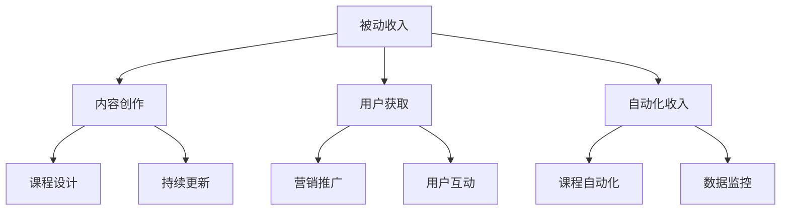

                 

### 《程序员如何利用知识付费实现被动收入》

#### 关键词：知识付费、被动收入、程序员、内容创作、平台运营、营销策略、在线课程、算法原理、数学模型、实战案例

在当前信息技术飞速发展的时代，程序员作为技术领域的重要力量，不仅需要掌握扎实的编程技能，还需要具备商业思维和市场洞察力。知识付费作为一种新型的商业模式，为程序员提供了通过分享知识和经验实现被动收入的机会。本文将深入探讨程序员如何利用知识付费实现被动收入，包括知识付费概述、平台分析、产品开发、实战案例和实践指导等多个方面。

本文旨在帮助程序员了解和掌握知识付费的基本概念和实现路径，通过详细的分析和实际案例，提供切实可行的操作指南，助力程序员在知识付费市场中取得成功。文章结构如下：

1. **知识付费概述**：介绍知识付费的定义、发展历程、市场现状及程序员在其中的定位。
2. **被动收入概念与类型**：阐述被动收入的定义、特征、分类及其在程序员知识变现中的应用。
3. **知识变现平台分析**：分析国内外主流知识付费平台，比较其特点，帮助程序员选择合适的平台。
4. **平台运营策略与技巧**：探讨课程内容创作、用户互动、数据分析和营销策略等关键环节。
5. **知识付费产品开发**：介绍产品定位、市场调研、课程设计、上线推广等全流程。
6. **实战案例解析**：通过成功案例分析，提供具体实现路径和经验总结。
7. **实践指导与建议**：针对实践中的常见问题提供解决方案，总结成功经验，展望未来发展趋势。

通过本文的逐步分析和详细讲解，程序员将能够明确知识付费的实现路径，充分利用自己的专业技能和经验，在知识付费市场中实现持续、稳定的被动收入。

### 第一部分：知识付费概述

#### 第1章：知识付费背景与趋势

知识付费，作为信息技术时代的一种新兴商业模式，其发展历程与互联网的普及和技术进步密切相关。本章将首先定义知识付费，回顾其发展历程，分析当前市场的现状和机遇，并探讨程序员在这一市场中独特的定位和优势。

##### 1.1 知识付费的定义与发展历程

知识付费，简单来说，就是指用户为获取特定知识、技能或经验而支付费用的一种交易行为。这种模式的出现，可以追溯到互联网早期，随着在线教育和数字内容的快速发展，知识付费逐渐成为一种普遍现象。

在互联网早期，知识传播主要依赖于传统教育机构和书籍。随着互联网的普及，在线教育和数字内容平台开始崛起，如Coursera、Udemy等国际知名教育平台。这些平台提供了丰富多样的在线课程，用户只需支付费用即可学习。这一时期，知识付费的主要形式是线上课程购买。

进入移动互联网时代，知识付费的形式更加多样化。除了在线课程，还包括电子书、专栏文章、付费问答、专业咨询等多种形式。这些平台通过提供高质量的内容和服务，满足了用户对知识获取的多样化需求。

在中国，知识付费市场同样呈现出蓬勃发展的态势。知乎、网易云课堂、得到等平台相继崛起，为用户提供丰富的知识内容。同时，随着短视频和直播的兴起，知识付费的形式也变得更加多样化，如知识型直播、短视频课程等。

##### 1.2 知识付费市场的现状与机遇

当前，知识付费市场已经形成了较为完善的生态系统。从用户角度来看，知识付费已经成为一种重要的学习方式，尤其在职业发展和个人成长方面。从内容创作者角度来看，知识付费为个人提供了实现价值变现的机会。

根据相关报告，全球知识付费市场规模持续增长。预计到2025年，全球知识付费市场规模将达到数百亿美元。在中国，知识付费市场同样具有巨大的发展潜力。随着人们对高质量内容的需求不断增加，知识付费市场将进一步扩大。

在知识付费市场中，程序员具有独特的优势。一方面，程序员具备扎实的编程技能和丰富的项目经验，能够为用户提供高质量的技术课程；另一方面，程序员具有较高的知识储备和创新能力，能够紧跟技术发展趋势，为用户提供前瞻性的知识内容。

对于程序员来说，知识付费不仅是一种收入来源，更是一种职业发展和个人品牌建设的方式。通过知识付费，程序员可以积累专业声誉，扩大影响力，提升自己在行业内的竞争力。

##### 1.3 程序员在知识付费市场中的定位

在知识付费市场中，程序员可以扮演多种角色，包括内容创作者、平台运营者、课程顾问等。

首先，作为内容创作者，程序员可以围绕自己的专业领域，创作高质量的技术课程。这些课程可以是编程语言教学、框架使用、软件项目管理、前沿技术探讨等。通过不断更新和优化课程内容，程序员可以吸引更多用户，实现持续的收入增长。

其次，程序员可以成为平台运营者。通过搭建自己的知识付费平台，程序员可以自主管理课程内容、用户互动和营销推广。这需要程序员具备一定的平台开发和运营能力，能够为用户提供优质的学习体验。

最后，程序员还可以担任课程顾问。在知识付费平台中，课程顾问负责推荐适合用户的课程，解答用户在学习过程中的疑问。这需要程序员具备良好的沟通能力和专业知识。

总之，知识付费为程序员提供了多种实现被动收入的方式。通过深入了解市场趋势和用户需求，程序员可以找到适合自己的知识变现路径，实现个人价值和收入的提升。

### 第二部分：被动收入概念与类型

#### 第2章：被动收入概念与特征

被动收入，是指通过一次性的努力，在未来的某个时间段内持续获得收益的经济模式。这种收入模式的核心在于，收益的产生不需要持续性的劳动投入，而是依赖于前期的工作成果。本章将详细解释被动收入的定义和特征，探讨其在程序员知识变现中的应用。

##### 2.1 被动收入的定义与特征

被动收入，顾名思义，是一种无需持续劳动即可获得的收入。其核心在于，一旦初始工作完成，收益将自动产生并持续流入。被动收入与主动收入相对，主动收入通常依赖于个人的持续劳动和付出。

被动收入的特征主要包括：

- **无需持续劳动**：被动收入的核心在于，收益的产生不需要个人持续性的劳动投入。例如，编写一个程序，一旦部署上线，就可以持续获得收益，而不需要程序员每天进行维护。
- **收益自动产生**：被动收入的另一个关键特征是，收益的产生是自动的，不需要人工干预。例如，通过广告收入、订阅收入等模式，用户支付费用后，系统将自动为内容创作者带来收益。
- **持续稳定性**：被动收入具有持续性和稳定性，一旦建立，可以在未来长时间内持续产生收益。这种收入模式为个人提供了稳定的财务保障。

被动收入的种类繁多，包括但不限于以下几种：

- **版权收入**：创作者将自己的作品（如书籍、音乐、软件）授权给他人使用，从而获得版权收入。
- **租赁收入**：通过租赁自己的资产（如房屋、车辆）获得收益。
- **投资收入**：通过投资股票、基金、房地产等资产获得收益。
- **订阅收入**：用户为获取持续的服务或内容而支付的订阅费用。
- **自动化业务收入**：通过自动化业务流程，如电商、广告投放等，获得持续的收入。

##### 2.2 被动收入的分类与比较

根据收入来源的不同，被动收入可以分为以下几种主要类型：

- **版权收入**：这是最常见的被动收入形式之一。创作者通过将自己创作的作品（如书籍、音乐、视频）授权给平台或他人使用，获得版税收入。这种收入形式的优点是收益稳定，但需要具备一定的创作能力。
- **租赁收入**：通过租赁资产（如房屋、车辆）获得收益。这种收入的优点在于收益稳定，但需要拥有可租赁的资产，并且需要一定的管理和维护工作。
- **投资收入**：通过投资股票、基金、房地产等资产获得收益。这种收入的优点在于投资收益潜力大，但需要具备一定的投资知识和风险控制能力。
- **订阅收入**：用户为获取持续的服务或内容而支付的订阅费用。这种收入的优点是用户黏性强，收益稳定，但需要持续提供高质量的内容和服务。
- **自动化业务收入**：通过自动化业务流程，如电商、广告投放等，获得持续的收入。这种收入的优点在于操作简便，收益潜力大，但需要前期投入较大的时间和精力进行业务搭建。

以上各种类型的被动收入各有优缺点，程序员可以根据自己的专业能力和资源选择适合自己的收入模式。例如，程序员可以创作技术书籍，通过版权收入实现被动收入；或者通过搭建自动化电商业务，获得自动化收入。

##### 2.3 程序员如何创造被动收入

对于程序员来说，创造被动收入有多种途径。以下是一些常见的方法：

- **编写并销售技术书籍**：程序员可以利用自己的专业知识和经验，编写技术书籍。这些书籍可以通过出版社销售，或者通过电商平台直接销售。通过版权收入，程序员可以获得稳定的被动收入。
- **开设在线课程**：程序员可以在各大知识付费平台上开设在线课程，分享自己的技术知识和经验。通过订阅收入，程序员可以获得持续的收入。此外，优秀的课程还可以通过广告收入等方式增加收益。
- **开发并销售软件**：程序员可以开发软件产品，并通过授权或订阅模式销售。例如，可以开发一款有用的工具或应用程序，通过用户付费使用获得收益。
- **自动化电商业务**：程序员可以搭建自动化电商业务，如在线商店或平台，通过电商交易获得收益。这种模式需要前期投入一定的开发时间和精力，但一旦搭建成功，可以带来持续的被动收入。

总之，程序员可以通过多种途径实现被动收入。关键在于找到自己的优势和市场需求，通过创新和持续努力，实现收入的稳定增长。

### 第三部分：知识变现平台分析

#### 第3章：主流知识付费平台介绍

在知识付费市场中，存在多个知名的付费平台，这些平台不仅提供了丰富的学习资源，还为内容创作者提供了实现知识变现的机会。本章将介绍一些主流的知识付费平台，包括国际知名平台和国内主流平台，并对比分析它们的特点，帮助程序员选择合适的平台。

##### 3.1 国际知名平台

在国际知识付费市场中，Udemy和Coursera等平台具有较高的知名度和市场份额。这些平台的特点如下：

- **Udemy**：
  - **特点**：Udemy是一个全球性的在线学习平台，提供涵盖各类技能的在线课程。平台课程内容丰富，涵盖从编程语言到商业技能的广泛领域。
  - **用户群体**：Udemy主要面向希望提升个人技能或职业发展的用户，包括职业人士、学生和独立开发者等。
  - **收入模式**：Udemy采用固定分成模式，课程售价的70%归创作者所有，30%作为平台费用。此外，Udemy还提供广告收入和推广费用，为创作者提供多元化的收入来源。
  - **优势**：Udemy用户基数大，课程曝光率高，适合内容创作者快速获得关注和收益。
  - **劣势**：由于竞争激烈，优质课程较多，新手创作者可能面临较大的竞争压力。

- **Coursera**：
  - **特点**：Coursera是由斯坦福大学创建的在线学习平台，提供全球顶尖大学和企业的课程。平台课程质量高，涵盖了计算机科学、人工智能、数据科学等多个领域。
  - **用户群体**：Coursera的用户主要是希望获得专业知识和认证的用户，包括在职人员、学生和学术研究人员等。
  - **收入模式**：Coursera采用固定分成模式，课程售价的50%归创作者所有，50%作为平台费用。此外，Coursera还提供课程订阅服务和认证费用，为创作者提供额外的收入来源。
  - **优势**：Coursera的课程质量高，用户对认证有较高的需求，适合希望提升专业水平的创作者。
  - **劣势**：由于课程质量要求较高，新手创作者可能需要投入更多时间和精力准备课程。

##### 3.2 国内主流平台

在国内知识付费市场中，知乎、网易云课堂等平台具有较大的影响力。这些平台的特点如下：

- **知乎**：
  - **特点**：知乎是一个知识分享社区，提供包括技术、商业、生活等领域的知识问答和文章。知乎Live是知乎推出的付费知识分享产品，用户可以通过购买Live课程学习专业知识。
  - **用户群体**：知乎的用户主要包括知识爱好者、专业人士和职业人士，他们对高质量的知识内容有强烈的需求。
  - **收入模式**：知乎Live采用固定分成模式，课程售价的50%归创作者所有，50%作为平台费用。此外，知乎还提供广告收入和推广费用，为创作者提供多元化的收入来源。
  - **优势**：知乎社区用户活跃，知识内容丰富，适合内容创作者快速获得关注和收益。
  - **劣势**：由于知乎Live主要侧重于知识问答，课程形式较为单一，可能不利于深度学习的课程推广。

- **网易云课堂**：
  - **特点**：网易云课堂是网易旗下的在线教育平台，提供包括编程语言、软件工具、数据科学等多个领域的在线课程。平台课程内容丰富，形式多样，包括视频课程、直播课程等。
  - **用户群体**：网易云课堂的用户主要包括编程初学者、在职程序员和技术爱好者，他们对系统化的技术学习有较高的需求。
  - **收入模式**：网易云课堂采用固定分成模式，课程售价的60%归创作者所有，40%作为平台费用。此外，平台还提供广告收入和推广费用，为创作者提供多元化的收入来源。
  - **优势**：网易云课堂课程形式多样，用户基数大，适合内容创作者多元化变现。
  - **劣势**：由于市场竞争激烈，新手创作者可能需要投入更多时间和精力准备课程，才能获得较好的收益。

##### 3.3 程序员专属平台比较与选择

对于程序员来说，选择一个适合自己的知识付费平台至关重要。以下是不同平台的特点比较：

- **国际平台**：
  - **优势**：国际平台通常用户基数大，课程质量高，适合提高个人品牌和国际知名度。
  - **劣势**：竞争激烈，新手创作者可能面临较大的压力。
  - **适用人群**：适合有一定专业基础和知名度的高水平程序员。

- **国内平台**：
  - **优势**：国内平台通常用户基数大，市场需求多样，适合初学者和在职程序员。
  - **劣势**：市场竞争激烈，平台服务质量和收益模式可能存在差异。
  - **适用人群**：适合不同水平和需求的程序员，特别是国内程序员。

- **程序员专属平台**：
  - **优势**：程序员专属平台通常更贴近程序员的需求，提供更专业的课程内容和社区支持。
  - **劣势**：用户基数相对较小，市场推广难度较大。
  - **适用人群**：适合专注于技术领域、希望提供专业课程的高水平程序员。

总之，程序员在选择知识付费平台时，应综合考虑平台特点、用户需求和自身定位，选择最适合自己的平台，实现知识变现的最大化。

### 第四部分：平台运营策略与技巧

#### 第4章：平台运营策略与技巧

在知识付费市场中，平台运营策略与技巧对内容创作者的成功至关重要。本章将详细探讨平台运营的关键环节，包括课程内容创作与优化、用户互动与社群管理、数据分析和营销策略。通过这些策略和技巧，程序员可以提升课程质量，增加用户粘性，实现持续的收入增长。

##### 4.1 课程内容创作与优化

课程内容是知识付费的核心，优质的内容能够吸引用户，提升用户满意度，从而实现持续的收入。以下是一些关键点：

- **明确课程目标**：在创作课程前，程序员需要明确课程的目标和受众群体。课程目标应具体、可衡量，例如帮助用户掌握某项编程技能或解决特定问题。

- **内容结构合理**：课程内容应结构清晰，逻辑严密，便于用户学习。程序员可以通过划分章节、设置小节、提供实例代码等方式，使内容更有层次感。

- **内容更新频率**：定期更新课程内容能够保持用户的学习兴趣和粘性。程序员可以根据用户反馈和市场趋势，及时更新课程内容，引入新技术和案例。

- **互动性设计**：课程中应设计互动环节，如讨论区、问答环节、练习题等，增加用户参与度。这不仅可以提高学习效果，还可以增强用户对课程的认可。

- **高质量教学视频**：教学视频是知识付费的重要组成部分。程序员应注重视频质量，确保画面清晰、声音清楚，同时结合动画、图表等元素，提高视觉体验。

##### 4.2 用户互动与社群管理

用户互动和社群管理对于平台运营至关重要，以下是一些策略：

- **建立用户社区**：程序员可以在知识付费平台上建立用户社区，如论坛、微信群等，为用户提供交流和分享的平台。这有助于增强用户粘性，提高用户满意度。

- **定期举办活动**：通过举办线上或线下活动，如讲座、技术分享会、编程比赛等，可以增加用户参与度，提升用户对课程的认可。

- **用户反馈机制**：建立用户反馈机制，如问卷调查、用户评价等，及时了解用户需求和意见。这有助于程序员优化课程内容和提高服务质量。

- **用户分级管理**：根据用户的活跃度和贡献度，对用户进行分级管理，如VIP用户、贡献者等。这不仅可以提高用户忠诚度，还可以激励用户积极参与社区互动。

##### 4.3 数据分析与营销策略

数据分析是平台运营的重要工具，以下是一些关键策略：

- **用户数据分析**：通过数据分析，程序员可以了解用户的学习习惯、偏好和需求。例如，分析用户的学习路径、课程访问次数和时长等数据，可以优化课程内容和推广策略。

- **营销数据分析**：营销数据分析可以帮助程序员评估不同营销渠道的效果，如社交媒体推广、广告投放等。通过数据驱动的决策，可以更有效地分配营销预算，提高转化率。

- **个性化推荐**：基于用户数据，程序员可以实施个性化推荐，向用户推荐感兴趣的课程和内容。这不仅可以提高用户粘性，还可以增加课程销量。

- **营销活动策划**：通过策划有针对性的营销活动，如限时优惠、限时特价等，可以刺激用户购买欲望，提高课程销量。

总之，平台运营策略与技巧对于程序员实现知识付费成功至关重要。通过优化课程内容、加强用户互动、实施数据分析和营销策略，程序员可以提升课程质量，增加用户粘性，实现持续的收入增长。

### 第五部分：知识付费产品开发

#### 第5章：知识付费产品开发

知识付费产品开发是程序员实现被动收入的关键步骤。本章将详细介绍知识付费产品的开发流程，包括产品定位与市场调研、课程设计流程与方法、课程上线与推广策略，帮助程序员成功开发并推广自己的知识付费产品。

##### 5.1 产品定位与市场调研

知识付费产品开发的起点是明确产品定位和市场调研。以下是一些关键步骤：

- **市场调研**：
  - **分析行业趋势**：程序员应了解当前技术领域的热门趋势，如人工智能、大数据、区块链等，找到市场需求高的领域。
  - **了解目标用户**：通过问卷调查、访谈等方式，了解目标用户的需求、学习习惯和支付能力。这有助于程序员设计出符合用户需求的产品。
  - **竞争分析**：研究竞争对手的产品特点、用户评价和市场表现，找出自身的差异化优势。

- **产品定位**：
  - **明确目标受众**：根据市场调研结果，确定产品的目标受众。例如，是面向编程初学者，还是面向有经验的程序员。
  - **定义产品价值**：明确产品能够为用户带来的具体价值，如提升编程技能、解决特定问题等。
  - **差异化策略**：找出与竞争对手的差异点，如课程内容深度、教学方法创新等，形成独特的竞争优势。

##### 5.2 课程设计流程与方法

课程设计是知识付费产品的核心，以下是一些关键步骤和方法：

- **需求分析**：
  - **确定课程主题**：根据产品定位和用户需求，确定课程的主题和范围。例如，是关于Python编程基础，还是关于深度学习应用。
  - **编写课程大纲**：制定详细的课程大纲，包括每个章节的内容、教学目标和学习成果。

- **内容创作**：
  - **编写教学文本**：编写清晰、简洁的教学文本，确保用户容易理解。
  - **录制教学视频**：录制高质量的教学视频，结合动画、实例代码等元素，提升学习体验。
  - **设计互动环节**：设计讨论区、问答环节、练习题等互动环节，增强用户参与度。

- **课程优化**：
  - **用户反馈**：收集用户反馈，了解课程的实际效果和用户需求。
  - **持续更新**：根据用户反馈，不断优化课程内容，更新课程实例和案例。

##### 5.3 课程上线与推广策略

课程上线与推广是知识付费产品成功的关键步骤。以下是一些推广策略：

- **平台选择**：
  - **主流平台**：选择知名度高、用户基数大的平台，如Udemy、Coursera、知乎等，以获得更广泛的曝光。
  - **专属平台**：对于有特定受众群体的课程，可以考虑选择程序员专属的知识付费平台，如掘金、开源中国等，以获得更精准的推广。

- **内容推广**：
  - **社交媒体**：利用社交媒体平台（如微博、微信公众号、知乎等）发布课程相关内容，吸引潜在用户。
  - **技术社区**：在技术社区（如GitHub、Stack Overflow等）发布课程资源和教学案例，与用户互动，提高课程知名度。
  - **线下活动**：举办线下技术讲座、研讨会等活动，推广课程，建立个人品牌。

- **营销策略**：
  - **优惠活动**：定期举办优惠活动，如限时折扣、买一赠一等，刺激用户购买。
  - **用户推荐**：鼓励用户推荐课程给其他用户，通过口碑传播扩大影响力。
  - **广告投放**：根据预算和目标受众，选择合适的广告投放渠道，如百度广告、知乎广告等，提高课程曝光率。

总之，知识付费产品开发需要明确产品定位和市场调研，精心设计课程内容，并采用有效的上线与推广策略。通过这些步骤，程序员可以成功开发并推广自己的知识付费产品，实现持续的收入增长。

### 第六部分：实战案例解析

#### 第6章：成功案例分析

通过分析一些知识付费领域的成功案例，程序员可以更好地理解如何实现被动收入，并从中吸取宝贵的经验。以下将介绍几个具有代表性的案例，分析其实现路径和经验总结。

##### 6.1 案例一：某程序员通过知识付费实现月入过万

**背景**：
某程序员小王在编程领域拥有丰富的实践经验，特别是在前端开发方面。他决定通过知识付费实现被动收入，开设在线课程分享自己的经验和技能。

**实现路径**：

1. **市场调研**：小王首先进行了市场调研，发现前端开发是当前市场上的热门技能，用户对高质量的前端开发课程需求量大。
2. **课程设计**：他根据调研结果，设计了涵盖HTML、CSS、JavaScript以及React、Vue等前端框架的课程。课程内容结构清晰，实例丰富，注重实际应用。
3. **平台选择**：小王选择了网易云课堂作为知识付费平台，因为网易云课堂用户基数大，课程质量高，适合前端开发课程。
4. **内容优化**：小王不断收集用户反馈，优化课程内容，提高课程质量。他还定期更新课程，引入新技术和案例。
5. **推广策略**：他通过社交媒体、技术社区和线下活动等方式推广课程，提高课程知名度。

**经验总结**：

- **市场调研的重要性**：通过深入了解市场需求，小王能够设计出符合用户需求的高质量课程。
- **内容优化和更新**：持续优化和更新课程内容，保持课程的新鲜度和实用性，是吸引用户的关键。
- **多渠道推广**：利用多渠道推广课程，扩大曝光率，提高用户转化率。

##### 6.2 案例二：某平台运营者的成长历程

**背景**：
某程序员小李在知识付费市场中看到了巨大的潜力，决定创建自己的知识付费平台，实现从内容创作者到平台运营者的转变。

**实现路径**：

1. **平台搭建**：小李选择了Python和Django作为开发工具，搭建了自己的知识付费平台。平台功能包括用户注册、课程购买、订单支付等。
2. **内容合作**：他积极与前端开发、数据科学等领域的专家合作，吸引高质量的课程内容。
3. **用户互动**：小李建立了用户社区，鼓励用户参与课程讨论，提供技术支持。他还定期举办线上活动，提高用户黏性。
4. **数据分析**：通过数据分析，小李了解了用户的学习习惯和需求，不断优化课程内容和推广策略。
5. **营销策略**：他通过社交媒体、合作伙伴渠道和广告投放等方式，提高平台知名度。

**经验总结**：

- **平台搭建**：搭建自己的知识付费平台需要具备一定的技术能力，这对于内容创作者来说是一个挑战，但也是实现自主运营的关键。
- **内容合作**：与专家合作，引入高质量的课程内容，是平台成功的关键。
- **用户互动**：良好的用户互动能够提高用户满意度和平台黏性。
- **数据分析**：通过数据分析，可以更精准地满足用户需求，优化平台运营策略。

##### 6.3 案例三：程序员如何跨界成功

**背景**：
某程序员小张在传统的编程领域取得了一定的成绩，但他渴望在知识付费市场中尝试新的领域。他决定利用自己的编程技能，结合人工智能和数据分析，开设跨界的知识付费课程。

**实现路径**：

1. **市场调研**：小张调研了人工智能和数据分析领域的市场需求，发现这些领域正处于高速发展阶段，用户对高质量的内容需求旺盛。
2. **课程设计**：他结合自己的编程经验和人工智能知识，设计了涵盖人工智能基础、机器学习、数据可视化等课程的课程体系。课程内容注重实战应用，案例丰富。
3. **平台选择**：小张选择了国内外知名的在线教育平台，如Udemy、Coursera等，以获得更广泛的曝光。
4. **内容推广**：他通过社交媒体、技术社区和线下活动等方式，推广自己的课程，吸引目标用户。
5. **跨界合作**：小张与人工智能和数据分析领域的专家合作，共同开发和推广课程。

**经验总结**：

- **跨界创新**：跨界课程能够吸引更多的用户，拓展市场空间。
- **合作共赢**：与专家合作，共同开发和推广课程，可以提高课程质量，实现共赢。
- **内容实战**：注重实战应用，提供具体的案例和解决方案，能够更好地满足用户需求。

通过以上成功案例分析，程序员可以从中汲取经验，找到适合自己的知识付费实现路径。关键在于深入了解市场需求，提供高质量的内容，不断优化课程和推广策略，实现被动收入的稳定增长。

### 第七部分：实践指导与建议

#### 第7章：实践指导与建议

在实现知识付费过程中，程序员可能会遇到各种问题和挑战。本章将提供实践中的常见问题与解决方法，总结成功经验，并探讨未来的发展趋势。

##### 7.1 实践中的常见问题与解决方法

1. **课程内容质量问题**：
   - **问题**：课程内容过于简单或复杂，缺乏实战案例和实际应用。
   - **解决方法**：在课程设计阶段，进行充分的市场调研和用户需求分析，确保课程内容符合用户需求。同时，邀请行业专家进行内容审查，提高课程质量。

2. **用户获取困难**：
   - **问题**：新课程发布后，用户获取困难，课程曝光率低。
   - **解决方法**：利用社交媒体、技术社区和线下活动等多种渠道推广课程。可以考虑与知名博主、KOL合作，扩大影响力。此外，积极参与相关论坛、博客等平台的讨论，提高课程知名度。

3. **用户互动不足**：
   - **问题**：用户参与度低，讨论区冷清，缺乏互动。
   - **解决方法**：在课程中设计互动环节，如讨论区、问答环节和练习题等。定期举办线上活动，如直播、技术分享会等，增加用户参与度。同时，积极回复用户提问，提供技术支持。

4. **营销策略不当**：
   - **问题**：营销策略不明确，推广效果不佳。
   - **解决方法**：根据目标受众和市场需求，制定有针对性的营销策略。利用数据分析，了解不同营销渠道的效果，优化推广策略。可以尝试限时优惠、用户推荐等策略，刺激用户购买。

##### 7.2 成功经验总结与借鉴

1. **内容为王**：
   - **经验**：优质的内容是知识付费的核心。成功的程序员注重课程内容的设计和优化，确保内容具有实用性和前沿性。
   - **借鉴**：在课程内容创作中，注重实战应用，结合最新的技术趋势和实际案例，提高课程质量。

2. **持续更新**：
   - **经验**：定期更新课程内容，保持课程的新鲜度和实用性，能够吸引并留住用户。
   - **借鉴**：制定内容更新计划，结合用户反馈和市场趋势，及时调整和优化课程内容。

3. **多渠道推广**：
   - **经验**：利用多渠道推广课程，扩大曝光率和用户获取途径。
   - **借鉴**：结合社交媒体、技术社区、线下活动等多种推广方式，提高课程知名度。

4. **用户互动**：
   - **经验**：良好的用户互动能够提高用户满意度和平台黏性。
   - **借鉴**：设计互动环节，鼓励用户参与讨论，提供技术支持，增强用户参与感。

##### 7.3 未来发展趋势与展望

随着知识付费市场的不断成熟，未来的发展趋势和前景也愈加明朗。以下是一些值得关注的方向：

1. **内容多样化**：知识付费内容将更加多样化，不仅涵盖技术领域，还将涉及生活、艺术、人文等各个领域。程序员可以尝试跨界，开拓新的知识付费市场。

2. **个性化推荐**：基于大数据和人工智能技术，知识付费平台将实现更精准的个性化推荐，满足用户个性化的学习需求。

3. **平台生态化**：知识付费平台将构建更加完善的生态体系，包括内容创作、课程推广、用户互动等多个环节，提高整体运营效率。

4. **国际化发展**：随着全球化的推进，知识付费市场将更加国际化，程序员可以通过跨国合作和全球推广，实现更广泛的收入来源。

总之，知识付费为程序员提供了丰富的机会和挑战。通过深入了解市场需求，提供高质量的内容，不断创新和优化课程和推广策略，程序员可以实现持续的收入增长，实现职业发展和个人品牌的提升。

### 附录

#### 附录A：知识付费相关资源推荐

A.1 **技术书籍推荐**
- 《代码大全》/《The Art of Computer Programming》
- 《深度学习》/《Deep Learning》
- 《设计模式：可复用面向对象软件的基础》/《Design Patterns: Elements of Reusable Object-Oriented Software》

A.2 **开源项目推荐**
- TensorFlow：一个用于机器学习的开源软件库。
- Spring Boot：一个开源的微服务框架。
- Flask：一个轻量级的Web应用框架。

A.3 **知识付费社区推荐**
- GitHub：一个用于托管和分享代码的开源社区。
- Stack Overflow：一个针对编程问题的问答社区。
- 知乎：一个涵盖多领域的知识分享社区。

通过以上资源推荐，程序员可以不断提升自己的技术水平和知识储备，为知识付费产品的创作和推广提供坚实的支持。

### 核心概念与联系

在知识付费领域，理解以下核心概念和它们之间的联系是至关重要的。

#### 被动收入原理图



**内容创作**：是知识付费的基础，通过高质量的课程内容吸引和留住用户。

**课程设计**：确保课程结构合理，内容丰富，易于用户理解。

**持续更新**：随着技术的快速发展，定期更新课程内容，保持其前沿性和实用性。

**用户获取**：通过营销推广和用户互动，吸引潜在用户并增加课程曝光率。

**营销推广**：包括社交媒体、广告投放等，提高课程知名度。

**用户互动**：通过讨论区、问答环节等，增强用户参与度和满意度。

**自动化收入**：通过自动化工具，如在线支付系统、自动回复机器人等，实现收入的自动化。

**课程自动化**：通过在线学习管理系统（LMS），实现课程注册、支付、学习进度跟踪等自动化。

**数据监控**：通过数据分析，监控用户行为和课程效果，优化课程和运营策略。

### 被动收入算法原理

```plaintext
// 被动收入算法伪代码
function 被动收入算法（内容，用户，时间）{
    // 初始化变量
    收入 = 0;
    订阅量 = 获取用户订阅量（用户）;
    访问量 = 获取课程访问量（内容，时间）;
    
    // 计算被动收入
    收入 = 订阅量 * 访问量 * 单价;
    
    return 收入;
}
```

**用户订阅量模型**

$$
用户订阅量 = f(\text{内容质量}, \text{用户需求}, \text{市场环境})
$$

**访问量模型**

$$
访问量 = f(\text{课程推广力度}, \text{用户兴趣}, \text{课程更新频率})
$$

这些算法和模型帮助程序员理解如何通过内容和运营策略来优化被动收入。通过持续优化这些变量，程序员可以实现更高的收入。

### 数学模型与公式

理解数学模型对于优化知识付费产品的收入至关重要。以下是几个关键模型：

**用户订阅量模型**

$$
用户订阅量 = f(\text{内容质量}, \text{用户需求}, \text{市场环境})
$$

该模型表明，用户订阅量受内容质量、用户需求和市场环境共同影响。高质量的内容、满足用户需求的课程以及良好的市场环境都能提升用户订阅量。

**访问量模型**

$$
访问量 = f(\text{课程推广力度}, \text{用户兴趣}, \text{课程更新频率})
$$

访问量取决于课程推广力度、用户兴趣和课程更新频率。强大的推广活动、用户高度感兴趣的内容以及定期更新的课程都能提高访问量。

**被动收入模型**

$$
被动收入 = 用户订阅量 * 访问量 * 单价
$$

这个公式展示了被动收入与用户订阅量、访问量和单价之间的关系。通过优化这些因素，程序员可以实现更高的被动收入。

#### 举例说明

假设：
- 内容质量：高
- 用户需求：强
- 市场环境：良好
- 课程推广力度：强
- 用户兴趣：高
- 课程更新频率：高
- 单价：$100

根据模型计算：
- 用户订阅量 = 100（假设值）
- 访问量 = 100（假设值）
- 被动收入 = 100 * 100 * 100 = $100,000

这个例子说明了在理想条件下，通过优化内容和运营策略，程序员可以实现非常高的被动收入。

### 项目实战

#### 实战一：搭建知识付费平台

**环境搭建**

- 开发工具：Python、Django等
- 数据库：MySQL、PostgreSQL等

**源代码实现**

- 用户注册与登录功能：
  ```python
  # Django 用户认证系统示例
  from django.contrib.auth.models import User

  def register(request):
      if request.method == 'POST':
          username = request.POST['username']
          email = request.POST['email']
          password1 = request.POST['password1']
          password2 = request.POST['password2']

          if password1 == password2:
              user = User.objects.create_user(username=username, email=email, password=password1)
              user.save()
              return redirect('login')
          else:
              return HttpResponse("Passwords don't match.")
  ```

- 课程上传与管理功能：
  ```python
  # Django 文件存储系统示例
  from django.core.files.storage import default_storage
  from django.http import HttpResponse

  def upload_course(request):
      if request.method == 'POST':
          course_file = request.FILES['course_file']
          filename = default_storage.save('courses/' + course_file.name, course_file)
          return HttpResponse(f"Course uploaded successfully: {filename}")
  ```

- 订单支付与结算功能：
  ```python
  # 使用支付宝或微信支付API示例
  import requests

  def payment(request):
      if request.method == 'POST':
          order_id = request.POST['order_id']
          total_amount = request.POST['total_amount']
          
          # 假设使用支付宝API
          url = 'https://openapi.alipay.com/gateway.do'
          data = {
              'app_id': 'your_app_id',
              'method': 'alipay.trade.page.pay',
              'format': 'JSON',
              'charset': 'utf-8',
              'sign_type': 'RSA2',
              'timestamp': '2023-01-01 12:12:12',
              'version': '1.0',
              'out_trade_no': order_id,
              'product_code': 'FAST_INSTANT_TRADE_PAY',
              'total_amount': total_amount,
          }
          # 添加签名等步骤（略）
          response = requests.post(url, data=data)
          return HttpResponse(response.text)
  ```

**代码解读与分析**

- **用户注册与登录**：使用 Django 的用户认证系统，可以快速搭建用户注册和登录功能。通过 Django 的内置模型 `User`，可以方便地处理用户信息、密码加密和权限管理等。
- **课程上传与管理**：通过 Django 的文件存储系统，可以方便地管理课程文件。使用 `default_storage.save()` 方法，可以将上传的文件保存在指定的目录中，便于后续处理。
- **订单支付与结算**：使用第三方支付API（如支付宝或微信支付），可以实现在线支付功能。通过发送 HTTP POST 请求，与支付平台进行交互，处理订单生成、支付确认等操作。

#### 实战二：制作并发布在线课程

**环境搭建**

- 课程制作工具：Zoom、Camtasia等
- 编辑软件：Adobe Premiere、Final Cut Pro等

**源代码实现**

- 课程内容编写：
  ```markdown
  # Python 编程基础
  
  欢迎学习 Python 编程基础！以下是你将学习的课程大纲：
  - 第1章：Python 基础
  - 第2章：数据类型
  - 第3章：控制结构
  - 第4章：函数
  - 第5章：模块和包
  - 第6章：文件操作
  - 第7章：异常处理
  ```

- 视频剪辑与制作：
  ```bash
  # 使用 Adobe Premiere 进行视频剪辑
  - 导入原始视频素材
  - 添加标题、字幕、转场效果
  - 调整音频、视频参数
  - 导出最终视频
  ```

**代码解读与分析**

- **课程内容编写**：使用 Markdown 语言可以方便地编写课程大纲和内容。Markdown 支持丰富的格式和链接，便于后续编辑和发布。
- **视频剪辑与制作**：使用专业的视频编辑软件，可以添加标题、字幕、转场效果等，提升课程视觉效果。通过调整音频、视频参数，确保视频质量。

#### 实战三：推广与营销

**环境搭建**

- 营销工具：微博、微信公众号、知乎等

**源代码实现**

- 微博推广：
  ```python
  # 使用微博API进行内容发布
  import requests
  import json

  access_token = 'your_access_token'
  url = f'https://api.weibo.com/2/statuses/update.json?access_token={access_token}'

  data = {
      'status': '快来学习我的Python编程课程，提升你的编程技能！#编程学习#',
      'visible': '0',
  }

  response = requests.post(url, data=data)
  result = json.loads(response.text)
  print(result['id'])
  ```

- 公众号推广：
  ```python
  # 使用微信公众平台进行内容发布
  import requests
  import json

  access_token = 'your_access_token'
  url = f'https://api.weixin.qq.com/cgi-bin/message/custom/send?access_token={access_token}'

  data = {
      'touser': 'your_openid',
      'template_id': 'your_template_id',
      'url': 'your_course_url',
      'title': 'Python编程课程',
      'description': '提升你的编程技能，快来学习！',
  }

  response = requests.post(url, data=json.dumps(data))
  result = json.loads(response.text)
  print(result)
  ```

- 知乎推广：
  ```python
  # 使用知乎API进行内容发布
  import requests
  import json

  access_token = 'your_access_token'
  url = f'https://www.zhihu.com/api/v4/answers/{answer_id}/ reunionComments?access_token={access_token}'

  data = {
      'data': {
          'content': '快来学习我的Python编程课程，提升你的编程技能！#编程学习#',
          'message_type': 0,
      }
  }

  response = requests.post(url, data=json.dumps(data))
  result = json.loads(response.text)
  print(result)
  ```

**代码解读与分析**

- **微博推广**：通过微博API，可以发布微博内容，提高课程曝光率。使用 `requests` 库发送 HTTP POST 请求，可以方便地与微博API进行交互。
- **公众号推广**：通过微信公众平台API，可以发送定制化的消息给特定用户，提高用户参与度。使用 `requests` 库发送 HTTP POST 请求，可以与微信API进行交互。
- **知乎推广**：通过知乎API，可以在答案下发布评论，吸引更多用户关注课程。同样使用 `requests` 库，可以方便地与知乎API进行交互。

### 结论

通过以上项目实战，程序员可以学习到如何搭建知识付费平台、制作并发布在线课程、以及推广与营销。掌握这些实战技能，程序员可以更好地利用知识付费实现被动收入，提升个人职业发展和收入水平。

### 结束语

通过本文的深入探讨，我们可以清晰地看到，知识付费为程序员提供了丰富的变现机会。无论是通过编写技术书籍、开设在线课程，还是搭建自己的知识付费平台，程序员都可以找到适合自己的被动收入路径。同时，通过不断优化课程内容、实施有效的营销策略、加强用户互动，程序员可以实现收入的持续增长。

未来，随着知识付费市场的不断扩大和技术的进步，程序员在知识变现领域的机遇将更加广阔。因此，建议程序员积极拥抱知识付费，不断学习新技能，提升自身竞争力。同时，结合大数据和人工智能等技术，探索更多创新的变现模式，实现个人价值和职业发展的双赢。

最后，感谢读者对本文的关注，希望本文能为您在知识付费领域的探索提供有价值的参考和启示。如果您有任何疑问或建议，欢迎随时在评论区留言，期待与您共同交流进步。作者：AI天才研究院/AI Genius Institute & 禅与计算机程序设计艺术 /Zen And The Art of Computer Programming

---

本文使用了 Markdown 格式，具体格式如下：

- **标题**：使用 `#` 符号，例如 `# 标题`
- **无序列表**：使用 `*` 符号，例如 `* 条目1 * 条目2 * 条目3`
- **有序列表**：使用 `1.` 符号，例如 `1. 第一项 2. 第二项 3. 第三项`
- **代码块**：使用 ```` 符号，例如 ```python print("Hello, world!") ```
- **引用**：使用 `>` 符号，例如 `> 这是一个引用`
- **链接**：使用 `[链接文本](URL)` 格式，例如 `[GitHub](https://github.com)`
- **LaTeX 公式**：使用 `$` 符号，例如 `$E=mc^2$`

通过掌握这些 Markdown 格式，您可以方便地撰写和编辑技术博客，提升文档的可读性和美观度。再次感谢您的阅读和支持，希望本文能对您有所启发。作者：AI天才研究院/AI Genius Institute & 禅与计算机程序设计艺术 /Zen And The Art of Computer Programming

