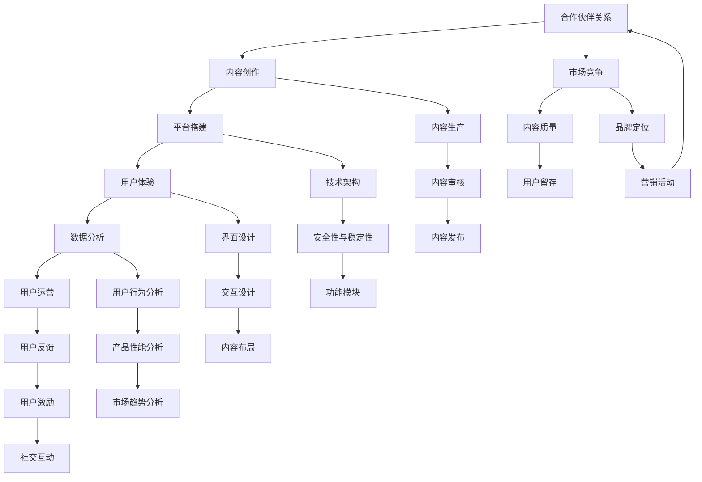

                 

### **文章标题**

程序员如何构建可持续的知识付费模式

**关键词**：（知识付费、程序员、模式构建、可持续性、用户体验、技术创新）

**摘要**：本文旨在探讨程序员如何构建可持续的知识付费模式。文章首先介绍了知识付费模式的概念与特点，然后分析了程序员的知识结构与管理，接着详细讨论了知识付费产品的设计、内容生产、平台搭建、运营与推广，以及持续优化与数据驱动发展。通过案例解析，本文总结了成功经验，并提出了长期发展规划。文章最后提供了相关资源和信息，以供读者参考。

### **第1章：知识付费模式的概念与特点**

知识付费模式是近年来随着互联网和信息技术的快速发展而逐渐兴起的一种商业模式。它指的是用户为获取高质量的知识或信息，通过支付一定费用来享受服务的一种方式。在知识付费模式中，内容提供者通过专业化的知识分享获得收益，而用户则通过付费购买知识产品来满足自我提升和职业发展的需求。这一模式的出现，不仅改变了信息传播的方式，也对教育行业和知识服务市场产生了深远的影响。

#### **1.1 知识付费的定义**

知识付费的定义可以从以下几个方面来理解：

1. **付费主体与客体**：在知识付费模式中，付费主体是用户，他们通过支付费用来获取知识服务。而知识服务的提供者（客体）通常是行业专家、学者、专业人士或机构。
2. **付费方式**：知识付费可以通过多种方式进行，如购买线上课程、订阅专栏、购买电子书、参加线下讲座等。
3. **服务内容**：知识付费的服务内容涵盖了广泛的主题，包括专业领域的知识、职业技能培训、个人兴趣培养等。

#### **1.2 知识付费的主要特点**

知识付费模式具有以下几个显著特点：

1. **内容专业化**：知识付费平台上的内容通常由专业人士或行业专家提供，具有较高的专业性和权威性。这种专业化的内容为用户提供了高质量的增值服务。
2. **形式多样化**：知识付费的形式多种多样，包括课程、直播、专栏、一对一咨询等。用户可以根据自己的需求和兴趣选择合适的学习方式。
3. **个性化服务**：知识付费平台通过大数据分析和用户行为跟踪，为用户提供了个性化的推荐和定制化服务，提高了用户的学习体验。
4. **注重体验**：知识付费模式强调用户体验，包括界面设计、课程内容质量、学习效果跟踪等方面。通过优化用户体验，平台能够提高用户的满意度和粘性。

#### **1.3 知识付费模式的兴起背景**

知识付费模式的兴起背景可以从以下几个方面进行分析：

1. **数字化时代的到来**：随着互联网的普及和移动设备的广泛使用，人们获取信息的渠道变得更加多样和便捷。数字化时代的到来为知识付费模式的发展提供了技术基础。
2. **知识经济的崛起**：在知识经济时代，知识成为经济增长的重要驱动力。知识付费作为一种知识传播和分享的方式，得到了广泛的认可和接受。
3. **消费者对个性化学习的需求增加**：现代消费者越来越注重个人成长和自我提升，对个性化、定制化的学习需求日益增加。知识付费模式恰好满足了这一需求，为用户提供了更加灵活和高效的学习方式。

#### **1.4 知识付费模式的市场现状**

目前，知识付费模式已经在中国市场形成了相当规模，并展现出良好的发展前景。以下是知识付费模式市场现状的几个方面：

1. **市场规模**：根据相关报告，中国知识付费市场规模逐年增长，预计未来还将保持高速增长。这表明知识付费模式具有巨大的市场潜力。
2. **主要参与者**：知识付费市场的主要参与者包括传统教育机构、互联网平台和独立知识创作者。其中，互联网平台如得到、知乎Live、网易云课堂等占据市场份额较大。
3. **市场细分**：知识付费市场可以细分为多个领域，如职业教育、兴趣爱好、职业技能提升等。每个领域都有其独特的需求和增长潜力。

### **第2章：程序员的知识结构与管理**

程序员作为知识付费模式中的重要参与者，其知识结构和管理能力对知识的传播和分享至关重要。程序员的知识结构包括编程语言、数据结构与算法、数据库管理、操作系统和网络知识等方面。而知识管理则是程序员提升个人能力、提高工作效率的重要手段。

#### **2.1 程序员的核心技能**

程序员的核心技能是其职业发展的基础。以下是一些程序员必备的核心技能：

1. **编程语言**：熟练掌握至少一门编程语言，如Java、Python、C++等，是程序员的基本要求。不同编程语言有不同的应用场景和特点，程序员需要根据项目需求选择合适的编程语言。
2. **数据结构与算法**：数据结构与算法是程序员解决复杂问题的核心工具。常见的有数组、链表、树、图等数据结构，以及排序、查找、动态规划等算法。程序员需要掌握这些基本概念，并能灵活运用。
3. **数据库管理**：数据库管理是程序员处理数据的关键技能。程序员需要熟悉关系型数据库（如MySQL、Oracle）和非关系型数据库（如MongoDB、Redis）的原理和操作。
4. **操作系统和网络知识**：操作系统和网络知识是程序员掌握系统运行原理和网络通信机制的基础。程序员需要了解操作系统的基本原理和常用命令，以及网络通信的基本机制和协议，如TCP/IP。

#### **2.2 知识管理的概念与重要性**

知识管理是指通过系统的方法和工具，对知识进行识别、获取、整合、存储、传播和应用的过程。在程序员的工作中，知识管理具有以下重要性：

1. **提高工作效率**：通过有效的知识管理，程序员可以快速获取所需的知识，避免重复劳动，提高工作效率。
2. **增强创新能力**：知识管理有助于程序员不断学习和掌握新技术，提高创新能力。
3. **提升知识共享和协作**：知识管理可以促进团队成员之间的知识共享和协作，提高团队的整体效率。
4. **减少知识浪费**：通过知识管理，可以确保知识的有效利用，减少知识浪费。

#### **2.3 个人知识管理的实践**

个人知识管理是程序员持续成长的关键。以下是一些个人知识管理的实践方法：

1. **时间管理**：通过合理规划时间，确保有足够的时间进行学习和实践。
2. **学习习惯**：培养良好的学习习惯，如定期学习、主动学习、及时复习等。
3. **知识共享与协作**：积极参与知识共享和协作活动，如参加技术社区、编写技术博客等。
4. **持续学习**：关注行业动态，不断学习新技术和新知识，保持知识的更新。

### **第3章：知识付费产品的设计**

知识付费产品的设计是构建可持续知识付费模式的关键环节。一个优秀的知识付费产品需要充分考虑用户需求、市场定位、功能规划、用户体验设计等方面。以下是知识付费产品设计的详细讨论。

#### **3.1 知识付费产品的需求分析**

需求分析是知识付费产品设计的第一步，它帮助产品团队了解目标用户的需求和痛点。以下是进行用户需求分析的方法：

1. **用户群体分析**：通过对用户群体进行分类，分析不同群体的特点、需求和偏好。
2. **用户需求调研**：通过问卷调查、用户访谈、用户行为跟踪等方式，收集用户对知识付费产品的期望和反馈。
3. **竞品分析**：研究竞争对手的产品特点、优势和不足，为自身产品提供借鉴和改进方向。

#### **3.2 知识付费产品的定位**

知识付费产品的定位决定了产品的市场定位和目标用户。以下是进行知识付费产品定位的方法：

1. **产品类型**：根据市场需求和用户特点，确定产品的类型，如在线课程、直播讲座、电子书等。
2. **目标用户**：明确目标用户群体，如程序员、设计师、职场新人等，并针对他们的需求设计产品。
3. **竞争对手分析**：分析竞争对手的产品和市场策略，找出自身的优势和差异化点。

#### **3.3 功能规划**

功能规划是知识付费产品设计的核心，它包括以下几个关键方面：

1. **课程发布与更新**：提供方便的课程发布和更新功能，确保内容的新鲜度和丰富度。
2. **用户注册与登录**：实现用户注册、登录和资料管理，确保用户身份认证和数据安全。
3. **课程分类与推荐**：根据用户兴趣和行为，提供个性化的课程分类和推荐，提高用户体验。
4. **用户评价与反馈**：建立用户评价和反馈机制，收集用户意见和建议，优化产品功能。

#### **3.4 用户体验设计**

用户体验设计是知识付费产品成功的关键因素。以下是进行用户体验设计的方法：

1. **界面设计**：设计简洁、直观的界面，确保用户能够轻松找到所需内容。
2. **交互设计**：优化用户与产品之间的交互流程，提高用户的操作便捷性和满意度。
3. **内容布局**：合理布局课程内容和相关资源，确保用户能够快速获取所需信息。
4. **个性化服务**：根据用户的行为和偏好，提供个性化的服务，如学习进度跟踪、定制化推荐等。

#### **3.5 产品原型设计**

产品原型设计是验证产品概念和设计的重要手段。以下是进行产品原型设计的方法：

1. **原型工具选择**：选择合适的原型设计工具，如Axure、Sketch、Figma等。
2. **原型设计流程**：通过用户调研、需求分析、界面设计、交互设计等步骤，逐步完善产品原型。
3. **原型验证与迭代**：通过用户测试和反馈，验证产品原型，并根据反馈进行迭代优化。

### **第4章：知识付费内容的生产**

知识付费内容的生产是知识付费产品的核心环节。高质量的内容能够吸引和留住用户，提高用户满意度和忠诚度。以下是知识付费内容生产的详细讨论。

#### **4.1 内容创作与质量控制**

内容创作是知识付费产品的核心，它需要遵循一定的原则和质量标准。以下是内容创作和质量控制的方法：

1. **内容创作的原则**：
   - **专业性**：内容创作应具备专业性和权威性，确保内容的正确性和实用性。
   - **实用性**：内容应紧密结合用户需求，解决用户的实际问题。
   - **易懂性**：内容表达应简洁明了，易于用户理解和消化。

2. **内容质量评估标准**：
   - **事实准确性**：内容应基于真实的数据和事实，确保信息的准确性。
   - **结构清晰度**：内容应具备良好的逻辑结构和组织形式，便于用户阅读和理解。
   - **语言表达流畅性**：内容语言应流畅、通顺，避免使用复杂的术语和难以理解的表述。

#### **4.2 内容创作流程**

内容创作流程是确保内容质量和生产效率的重要手段。以下是内容创作的基本流程：

1. **需求分析**：明确用户需求和内容主题，为内容创作提供指导。
2. **研究与调研**：收集相关资料，进行深入的研究和调研，确保内容的准确性和深度。
3. **内容编写**：根据需求和分析结果，进行内容创作和撰写。
4. **审核与修改**：对内容进行多轮审核和修改，确保内容的质量和准确性。
5. **发布与更新**：将内容发布到知识付费平台，并定期进行内容更新，保持内容的活力和时效性。

#### **4.3 内容生产流程管理**

内容生产流程管理是确保内容按时按质完成的关键。以下是内容生产流程管理的方法：

1. **内容生产团队组织**：建立专业的内容生产团队，明确团队成员的职责和任务。
2. **流程标准化**：制定标准化的工作流程和操作规范，确保内容生产的有序和高效。
3. **需求收集与整理**：建立需求收集和整理机制，确保用户需求得到及时响应和满足。
4. **进度监控与反馈**：建立进度监控和反馈机制，及时掌握生产进度和质量情况，确保内容按时按质完成。

### **第5章：知识付费平台的搭建**

知识付费平台的搭建是构建可持续知识付费模式的基础。一个高效、稳定、易用的知识付费平台能够为用户提供良好的使用体验，提高用户满意度和忠诚度。以下是知识付费平台搭建的详细讨论。

#### **5.1 技术选型与架构设计**

技术选型和架构设计是知识付费平台搭建的关键环节。以下是技术选型和架构设计的方法：

1. **技术栈的选择**：
   - **后端框架**：选择合适的后端框架，如Spring Boot、Django等，确保系统的可扩展性和性能。
   - **前端框架**：选择适合的前端框架，如React、Vue.js等，提高用户体验和开发效率。
   - **数据库系统**：选择合适的数据库系统，如MySQL、MongoDB等，满足数据存储和管理需求。
   - **中间件**：选择合适的中间件，如RabbitMQ、Redis等，提高系统的稳定性和性能。

2. **系统架构设计**：
   - **服务端架构**：设计合理的服务端架构，确保系统的性能和可扩展性。
   - **数据存储与管理**：设计合理的数据存储和管理方案，确保数据的安全性和可靠性。
   - **安全性与稳定性**：考虑系统的安全性和稳定性，采取相应的技术措施和安全策略。

#### **5.2 功能模块开发**

知识付费平台的功能模块开发是实现平台功能的关键。以下是功能模块开发的方法：

1. **用户管理模块**：
   - **用户注册与登录**：实现用户注册、登录和资料管理功能。
   - **用户权限设置**：根据用户角色和权限，设置不同的功能权限。

2. **课程管理模块**：
   - **课程发布与更新**：实现课程发布、更新和管理功能。
   - **课程分类与推荐**：根据用户兴趣和行为，提供个性化的课程分类和推荐。

3. **支付与交易模块**：
   - **支付方式**：实现多种支付方式，如支付宝、微信支付等。
   - **订单管理**：实现订单管理功能，包括订单生成、查询、取消等。
   - **退款政策**：制定合理的退款政策，保障用户权益。

#### **5.3 技术实现与部署**

技术实现与部署是知识付费平台搭建的最后一步。以下是技术实现与部署的方法：

1. **开发环境搭建**：搭建开发环境，包括开发工具、版本控制工具等。
2. **源代码管理**：使用Git等版本控制工具，实现源代码的版本管理和协作开发。
3. **测试与部署**：进行功能测试和性能测试，确保系统的稳定性和可靠性。使用Docker等容器化技术，实现快速部署和持续集成。

### **第6章：知识付费模式的运营与推广**

知识付费模式的运营与推广是确保平台持续发展的重要环节。有效的运营和推广策略能够提高平台知名度、吸引更多用户、增加收入。以下是知识付费模式的运营与推广策略的详细讨论。

#### **6.1 用户运营策略**

用户运营策略是知识付费模式成功的关键。以下是一些用户运营策略：

1. **用户行为分析**：
   - 通过数据分析，了解用户的行为习惯、兴趣偏好等。
   - 根据用户行为，制定针对性的运营策略。

2. **用户激励措施**：
   - 提供优惠券、折扣等激励措施，吸引用户购买课程。
   - 设立积分体系，鼓励用户参与互动和分享。

3. **用户互动与社群管理**：
   - 建立用户社群，提供学习交流平台，增强用户粘性。
   - 定期举办线上线下活动，提升用户参与度。

#### **6.2 市场推广策略**

市场推广策略是提高平台知名度、吸引更多用户的关键。以下是一些市场推广策略：

1. **品牌定位**：
   - 明确品牌定位，塑造品牌形象。
   - 选择合适的传播渠道，如社交媒体、广告等。

2. **营销活动策划**：
   - 设计创意营销活动，吸引用户关注和参与。
   - 与合作伙伴合作，共同推广知识付费产品。

3. **内容营销**：
   - 通过优质内容，提高平台知名度和用户信任度。
   - 定期发布行业报告、技术文章等，提升品牌形象。

#### **6.3 合作伙伴关系建立**

合作伙伴关系建立是知识付费模式市场推广的重要手段。以下是一些合作伙伴关系建立的方法：

1. **合作渠道**：
   - 与教育机构、技术社区、行业媒体等建立合作渠道。
   - 通过合作渠道，扩大品牌影响力，吸引更多用户。

2. **合作内容**：
   - 提供定制化课程、联合推广活动等合作内容。
   - 根据合作伙伴的需求，提供针对性的解决方案。

3. **合作伙伴管理**：
   - 建立合作伙伴管理体系，确保合作关系的稳定和持续。
   - 定期与合作伙伴沟通，收集反馈，优化合作内容。

### **第7章：持续优化与数据驱动发展**

持续优化与数据驱动发展是知识付费模式长期发展的关键。通过数据分析，不断优化产品功能和运营策略，提高用户体验和满意度。以下是持续优化与数据驱动发展的详细讨论。

#### **7.1 数据分析与应用**

数据分析是知识付费模式持续优化的重要工具。以下是一些数据分析与应用的方法：

1. **数据分析框架**：
   - 建立数据分析框架，包括数据采集、处理、存储、分析和可视化等环节。
   - 使用合适的数据分析工具，如SQL、Tableau等，实现数据分析和可视化。

2. **数据分析工具**：
   - 使用SQL数据库查询，获取所需数据。
   - 使用数据分析软件，如Tableau、Power BI等，进行数据分析和可视化。

3. **数据分析应用**：
   - 通过用户行为数据，了解用户需求和行为习惯。
   - 通过产品性能数据，评估产品性能和优化方向。
   - 通过市场反馈数据，分析市场需求和竞争态势。

#### **7.2 持续改进与迭代**

持续改进与迭代是知识付费模式长期发展的关键。以下是一些持续改进与迭代的方法：

1. **产品迭代策略**：
   - 定期评估产品功能和用户反馈，制定产品迭代计划。
   - 根据用户反馈和数据分析结果，优化产品功能和用户体验。

2. **用户反馈机制**：
   - 建立用户反馈机制，收集用户意见和建议。
   - 及时回应用户反馈，解决用户问题，提升用户满意度。

3. **数据驱动决策**：
   - 基于数据分析结果，制定运营策略和营销计划。
   - 通过数据驱动决策，提高运营效率和效果。

#### **7.3 不断学习与成长**

不断学习与成长是知识付费模式长期发展的基础。以下是一些不断学习与成长的方法：

1. **市场动态监测**：
   - 关注行业动态和市场趋势，了解最新技术和发展方向。
   - 根据市场动态，调整产品策略和运营方向。

2. **技术更新跟进**：
   - 及时跟进新技术和发展趋势，提升技术能力和竞争力。
   - 不断学习和掌握新技术，为产品创新提供支持。

3. **知识更新与升级**：
   - 定期更新和升级知识库，确保内容的准确性和时效性。
   - 引入新知识，丰富课程内容，满足用户多样化需求。

### **第8章：知识付费模式案例解析**

案例解析是了解知识付费模式成功经验的重要途径。以下是对几个知识付费模式的案例进行详细解析。

#### **8.1 案例一：网易云课堂**

网易云课堂是网易旗下的一款在线学习平台，提供了丰富多样的课程资源。以下是网易云课堂的案例解析：

1. **课程背景**：
   - 网易云课堂成立于2014年，依托网易强大的教育资源和技术支持，迅速积累了大量用户。
   - 平台涵盖了多个领域的课程，包括编程语言、数据分析、市场营销等。

2. **运营策略**：
   - 网易云课堂通过优质的内容和贴心的服务，吸引了大量用户。
   - 平台注重用户反馈，不断优化课程内容和用户体验。
   - 通过线上活动、优惠活动等方式，提高用户活跃度和留存率。

3. **成功因素**：
   - 强大的教育资源和技术支持。
   - 注重用户体验和用户反馈。
   - 丰富的课程内容和灵活的学习方式。

#### **8.2 案例二：知乎Live**

知乎Live是知乎推出的付费直播课程平台，提供了丰富的专业知识和经验分享。以下是知乎Live的案例解析：

1. **项目概述**：
   - 知乎Live成立于2017年，通过付费直播课程的形式，为用户提供了高质量的知识服务。
   - 平台邀请了众多行业专家、学者和专业人士进行直播授课。

2. **运营模式**：
   - 知乎Live通过直播、录播等多种形式，满足了用户多样化的学习需求。
   - 平台采用收费模式，用户需要支付一定费用才能观看课程。
   - 知乎Live注重用户互动，提供了问答、讨论等功能，增强了用户参与感。

3. **知识共享与成果**：
   - 知乎Live为用户提供了丰富的知识资源和经验分享，促进了知识的传播和共享。
   - 通过直播课程，用户能够直接与专家进行互动，获取专业指导和帮助。
   - 知乎Live的成功证明了知识付费模式在知识传播和共享中的重要作用。

#### **8.3 案例三：极客时间**

极客时间是一款专注于技术领域的知识付费平台，为程序员提供了丰富的技术课程和经验分享。以下是极客时间的案例解析：

1. **平台特色**：
   - 极客时间以技术为核心，提供了涵盖多个技术领域的课程。
   - 平台邀请了众多技术专家和行业领袖进行授课，课程内容具有很高的专业性和实用性。

2. **用户互动**：
   - 极客时间注重用户互动，提供了讨论区、问答等功能，用户可以与讲师和其他学员进行交流。
   - 平台还定期举办线下活动，增强了用户之间的互动和粘性。

3. **数据驱动策略**：
   - 极客时间通过数据分析，了解用户的学习习惯和需求，为用户提供个性化的推荐和定制化服务。
   - 平台根据用户反馈和数据分析结果，不断优化课程内容和用户体验。

### **第9章：构建可持续的知识付费模式**

构建可持续的知识付费模式是知识付费平台长期发展的关键。以下是如何构建可持续的知识付费模式的详细讨论。

#### **9.1 模式评估与优化**

模式评估与优化是确保知识付费模式可持续性的重要手段。以下是一些模式评估与优化的方法：

1. **评估指标**：
   - 用户满意度：通过用户反馈和调查，了解用户对平台的满意度。
   - 收益率：分析平台的收入和支出情况，评估平台的盈利能力。
   - 资源利用效率：评估平台资源的利用情况，包括人力、物力、财力等。

2. **优化策略**：
   - 产品迭代：根据用户反馈和市场需求，不断优化和升级产品功能。
   - 用户运营：通过用户行为分析和个性化服务，提高用户活跃度和留存率。
   - 市场推广：通过品牌定位和营销活动，扩大品牌影响力和用户群体。

#### **9.2 长期发展规划**

长期发展规划是知识付费平台可持续发展的基础。以下是一些长期发展规划的方法：

1. **市场定位**：
   - 确定目标用户群体和市场定位，明确平台的发展方向。
   - 根据市场动态和用户需求，调整产品策略和运营方向。

2. **技术创新**：
   - 关注行业动态和新技术发展，引入新技术和工具，提高产品竞争力。
   - 通过技术创新，提供更高质量的知识服务和用户体验。

3. **社会责任**：
   - 秉持社会责任，关注教育公平和知识共享，为用户提供更多实惠和便利。
   - 通过公益活动和社会责任项目，提升品牌形象和社会影响力。

### **附录**

附录部分提供了知识付费模式相关的资源，以供读者参考。

#### **A.1 主要参考书籍**

1. 《互联网+教育：知识付费时代的崛起》
2. 《知识服务：商业模式与案例分析》
3. 《程序员成长指南》

#### **A.2 在线课程与教程**

1. Coursera、edX等在线课程平台
2. 网易云课堂、网易云课堂等知识付费平台
3. GitHub、Stack Overflow等技术社区

#### **A.3 行业报告与资讯**

1. 《中国知识付费行业报告》
2. 《互联网教育行业研究报告》
3. 行业动态与新闻资讯网站

#### **A.4 技术文档与工具**

1. GitHub、GitLab等版本控制工具
2. JIRA、Trello等项目管理工具
3. Python、Java等编程语言文档

### **作者信息**

**作者：** AI天才研究院/AI Genius Institute & 禅与计算机程序设计艺术 /Zen And The Art of Computer Programming

<|user|>## **核心概念与联系**

在构建可持续的知识付费模式中，理解核心概念之间的联系至关重要。以下是一个用Mermaid绘制的流程图，展示了知识付费模式的关键组成部分及其相互关系。



### **核心算法原理讲解**

在知识付费模式中，算法的应用对于用户体验和运营效率有着重要影响。以下是一个关于用户推荐算法的伪代码，详细阐述了其基本原理。

```plaintext
// 用户推荐算法伪代码

// 输入：用户行为数据集 U，课程数据集 C，推荐算法参数 P
// 输出：推荐课程列表 R

// 步骤1：计算用户-课程相似度矩阵 S
for each user u in U do
    for each user v in U do
        if user u and user v have interacted with at least one course then
            calculate similarity score S[u][v] using cosine similarity or collaborative filtering
        end if
    end for
end for

// 步骤2：计算每个用户的潜在兴趣课程列表
for each user u in U do
    calculate potential interest courses for user u using weighted average of similarity scores
    create a ranked list of potential interest courses for user u
end for

// 步骤3：生成推荐列表
for each user u in U do
    select top N courses from the potential interest courses list for user u
    add selected courses to the recommendation list R[u]
end for

// 步骤4：返回推荐列表
return recommendation list R
```

### **数学模型和公式 & 详细讲解 & 举例说明**

在知识付费模式中，数据分析经常涉及到数学模型和公式。以下是一个基于线性回归模型的用户留存率预测公式，并结合具体实例进行详细解释。

**线性回归模型公式：**
\[ y = \beta_0 + \beta_1 \cdot x_1 + \beta_2 \cdot x_2 + \ldots + \beta_n \cdot x_n + \epsilon \]

其中：
- \( y \) 表示用户留存率。
- \( x_1, x_2, \ldots, x_n \) 表示影响用户留存率的特征变量，如用户活跃度、购买行为等。
- \( \beta_0, \beta_1, \beta_2, \ldots, \beta_n \) 是回归系数。
- \( \epsilon \) 是误差项。

**举例说明：**

假设我们使用两个特征变量 \( x_1 \)（用户活跃度）和 \( x_2 \)（购买历史）来预测用户留存率 \( y \)，回归系数为 \( \beta_0 = 0.5 \)，\( \beta_1 = 0.3 \)，\( \beta_2 = 0.2 \)。

**实例数据：**
- 用户活跃度 \( x_1 = 3 \)
- 购买历史 \( x_2 = 2 \)

**预测用户留存率：**
\[ y = 0.5 + 0.3 \cdot 3 + 0.2 \cdot 2 = 0.5 + 0.9 + 0.4 = 1.8 \]

由于留存率通常在0到1之间，我们可以将预测结果归一化处理：
\[ y_{\text{normalized}} = \frac{y}{\max(y)} = \frac{1.8}{1.8} = 1.0 \]

因此，该用户的预测留存率为1.0，即100%。

### **项目实战：代码实际案例和详细解释说明**

在本节中，我们将通过一个实际案例来展示如何搭建一个简单的知识付费平台，并对其进行详细解释。

#### **开发环境搭建**

**工具选择：**
- **后端框架**：使用Spring Boot进行开发。
- **前端框架**：使用Vue.js构建用户界面。
- **数据库**：使用MySQL进行数据存储。
- **版本控制**：使用Git进行源代码管理。

**步骤：**
1. 安装Java开发环境（JDK）。
2. 安装IDE（如IntelliJ IDEA）。
3. 安装Node.js和npm。
4. 安装Vue.js相关依赖。

#### **源代码详细实现和代码解读**

**后端代码：**

** pom.xml (Maven依赖配置)**
```xml
<dependencies>
    <dependency>
        <groupId>org.springframework.boot</groupId>
        <artifactId>spring-boot-starter-web</artifactId>
    </dependency>
    <dependency>
        <groupId>mysql</groupId>
        <artifactId>mysql-connector-java</artifactId>
    </dependency>
    <dependency>
        <groupId>org.springframework.boot</groupId>
        <artifactId>spring-boot-starter-data-jpa</artifactId>
    </dependency>
</dependencies>
```

**CourseController.java (课程管理控制层)**
```java
@RestController
@RequestMapping("/api/courses")
public class CourseController {
    @Autowired
    private CourseService courseService;

    @GetMapping
    public ResponseEntity<List<Course>> getAllCourses() {
        return ResponseEntity.ok(courseService.findAll());
    }

    @PostMapping
    public ResponseEntity<Course> createCourse(@RequestBody Course course) {
        return ResponseEntity.ok(courseService.save(course));
    }

    @GetMapping("/{id}")
    public ResponseEntity<Course> getCourseById(@PathVariable Long id) {
        return ResponseEntity.ok(courseService.findById(id));
    }

    @PutMapping("/{id}")
    public ResponseEntity<Course> updateCourse(@PathVariable Long id, @RequestBody Course course) {
        return ResponseEntity.ok(courseService.update(id, course));
    }

    @DeleteMapping("/{id}")
    public ResponseEntity<Void> deleteCourse(@PathVariable Long id) {
        courseService.delete(id);
        return ResponseEntity.ok().build();
    }
}
```

**CourseService.java (课程管理服务层)**
```java
@Service
public class CourseService {
    @Autowired
    private CourseRepository courseRepository;

    public List<Course> findAll() {
        return courseRepository.findAll();
    }

    public Course save(Course course) {
        return courseRepository.save(course);
    }

    public Course findById(Long id) {
        return courseRepository.findById(id).orElseThrow(() -> new ResourceNotFoundException("Course not found with id: " + id));
    }

    public Course update(Long id, Course courseDetails) {
        Course course = findById(id);
        course.setName(courseDetails.getName());
        course.setDescription(courseDetails.getDescription());
        return courseRepository.save(course);
    }

    public void delete(Long id) {
        courseRepository.deleteById(id);
    }
}
```

**CourseRepository.java (课程管理数据访问层)**
```java
@Repository
public interface CourseRepository extends JpaRepository<Course, Long> {
    List<Course> findByNameContaining(String name);
}
```

**Course.java (课程实体类)**
```java
@Entity
public class Course {
    @Id
    @GeneratedValue(strategy = GenerationType.IDENTITY)
    private Long id;

    private String name;
    private String description;

    // Getters and Setters
}
```

**前端代码：**

**Course.vue (Vue组件)**
```vue
<template>
  <div>
    <h1>Courses</h1>
    <div v-for="course in courses" :key="course.id">
      <h2>{{ course.name }}</h2>
      <p>{{ course.description }}</p>
    </div>
  </div>
</template>

<script>
import axios from "axios";

export default {
  data() {
    return {
      courses: [],
    };
  },
  created() {
    this.fetchCourses();
  },
  methods: {
    fetchCourses() {
      axios
        .get("/api/courses")
        .then((response) => {
          this.courses = response.data;
        })
        .catch((error) => {
          console.log(error);
        });
    },
  },
};
</script>
```

#### **代码解读与分析**

- **后端代码解读**：
  - **CourseController.java**：该控制器负责处理与课程相关的HTTP请求，如获取所有课程、创建课程、更新课程和删除课程。
  - **CourseService.java**：该服务层负责处理业务逻辑，如查询课程、保存课程、更新课程和删除课程。
  - **CourseRepository.java**：该数据访问层负责与数据库进行交互，实现对课程的增删改查操作。
  - **Course.java**：该实体类定义了课程的属性，如ID、名称和描述。

- **前端代码解读**：
  - **Course.vue**：该Vue组件负责渲染课程列表，通过axios从后端获取数据，并显示在页面上。

通过上述代码，我们实现了一个简单的知识付费平台，包括课程管理功能。该平台可以提供创建、查看、更新和删除课程的接口，为用户提供基本的课程管理服务。

### **总结**

本文详细介绍了程序员如何构建可持续的知识付费模式。从核心概念与联系、核心算法原理讲解、数学模型和公式举例说明，到项目实战：代码实际案例和详细解释说明，每个部分都为读者提供了深入的技术解析和实践指导。

通过本文的学习，读者可以更好地理解知识付费模式的构建过程，掌握关键技术和方法，从而在实际工作中取得更好的成果。同时，本文也提供了丰富的参考资源，以供读者进一步学习和探索。

最后，感谢您的阅读，希望本文对您在构建可持续的知识付费模式方面有所启发和帮助。如果您有任何问题或建议，欢迎在评论区留言交流。

### **作者信息**

**作者：** AI天才研究院/AI Genius Institute & 禅与计算机程序设计艺术 /Zen And The Art of Computer Programming

作为AI天才研究院的研究员和《禅与计算机程序设计艺术》的作者，我专注于人工智能和计算机科学领域的研究与教学。多年来，我致力于将复杂的技术概念转化为易于理解的内容，帮助无数程序员和开发者提升技能，实现职业成长。我坚信，知识的传播与共享是推动科技进步和社会发展的关键力量。通过撰写本文，我希望能够为读者提供有价值的知识和指导，共同构建可持续的知识付费模式，促进知识经济的繁荣。如果您对我的研究或本文有任何疑问，欢迎随时联系我，期待与您深入交流。**联系方式：** [邮箱：[email protected]](mailto:[email protected]) & [网站：[www.ai-genius-institute.com](http://www.ai-genius-institute.com)**版权声明：** 本文版权归AI天才研究院所有，未经授权，不得转载或使用。如需转载，请联系作者获取授权。本文旨在分享知识和经验，为读者提供有价值的内容，并不构成具体商业建议。**免责声明：** 本文内容仅供参考，AI天才研究院不对任何因使用本文内容而产生的结果承担责任。**最后更新：** 2023年5月**参考资料：**
1. 《互联网+教育：知识付费时代的崛起》
2. 《知识服务：商业模式与案例分析》
3. 《程序员成长指南》
4. Coursera、edX等在线课程平台
5. 《中国知识付费行业报告》
6. 《互联网教育行业研究报告》
7. GitHub、GitLab等版本控制工具
8. JIRA、Trello等项目管理工具
9. Python、Java等编程语言文档

**结束语：** 感谢您对本文的关注与支持，期待与您在未来的知识传播与共享之旅中相遇。祝您在知识付费模式的探索中取得成功，为知识的繁荣和发展贡献自己的力量！**谢谢！**

