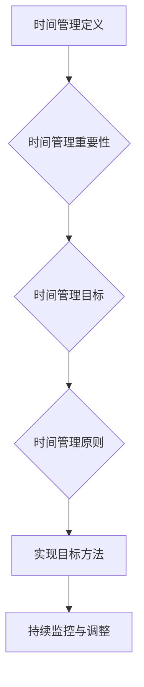

                 

### 《程序员的时间管理：效率即财富》

#### > **关键词：** 时间管理、程序员、效率、财富、工具、实践

#### > **摘要：** 本文章深入探讨了程序员在繁忙工作中如何通过高效的时间管理提升个人和项目的成功。通过时间管理基础理论、实践应用、工具推荐和实战案例的详细解析，本文旨在帮助程序员掌握时间管理技巧，实现工作效率与个人财富的双重提升。

## **引言**

作为一名程序员，我们时常面临着多任务处理、项目截止日期以及持续学习的压力。在这样高节奏的工作环境中，时间管理变得至关重要。有效的管理时间不仅能减轻工作压力，还能显著提高工作效率，最终实现个人职业成就的提升。本文将探讨如何通过时间管理，让每一位程序员在复杂的工作中游刃有余，从而实现个人财富的积累。

时间管理不仅仅是一种技巧，它更是一种思维方式，一种对待工作和生活的态度。通过科学的时间管理，程序员可以更好地平衡工作与生活，提高工作效率，减少不必要的损耗，实现个人价值和职业目标的提升。在接下来的章节中，我们将逐步探讨时间管理的理论基础、实践方法、工具应用和实际案例，帮助程序员掌握时间管理的艺术。

本文将分为三大部分：

1. **时间管理基础理论**：介绍时间管理的定义、重要性、目标和原则，帮助程序员了解时间管理的基本概念。
2. **时间管理的实践应用**：详细讲解个人和团队时间管理策略，提供实际操作方法和技巧。
3. **时间管理工具推荐与实战案例**：介绍实用的时间管理工具，并分享实际案例，帮助程序员将时间管理理念应用到实际工作中。

通过本文的阅读和实践，相信每位程序员都能够找到适合自己的时间管理方法，实现工作效率与个人财富的双重提升。

### **第一部分：时间管理基础理论**

#### **第1章：时间管理概述**

#### **1.1 时间管理的定义与重要性**

时间管理是指通过规划、组织、优先级排序和监控时间使用，以达到个人或组织目标的过程。对程序员而言，时间管理不仅仅是确保任务按时完成，更是提高工作效率、减少错误率和提升整体职业成就的重要手段。

**重要性**：

- **提高工作效率**：有效的时间管理可以帮助程序员更好地安排任务，避免时间的浪费，从而提高工作效率。
- **减少工作压力**：合理分配时间，避免超负荷工作，有助于减轻程序员的压力，保持良好的工作和生活平衡。
- **实现职业目标**：通过科学的时间管理，程序员可以更清晰地设定和实现职业目标，提升个人价值和职业竞争力。

#### **1.2 时间管理的主要目标**

时间管理的主要目标是最大化利用时间，实现以下目标：

- **任务完成**：确保任务按时、高质量完成，满足项目需求和客户期望。
- **优先级排序**：根据任务的重要性和紧急程度，合理分配时间，确保重要和紧急的任务优先完成。
- **工作与生活平衡**：合理安排工作和休息时间，保持良好的生活品质和身心健康。

#### **1.3 时间管理的基本原则**

成功的时间管理需要遵循以下基本原则：

- **明确目标**：设定清晰的目标和计划，确保每个任务都有明确的方向。
- **优先级排序**：根据任务的重要性和紧急程度进行排序，确保重要且紧急的任务优先处理。
- **合理规划**：合理安排工作和休息时间，避免时间浪费，提高工作效率。
- **持续监控**：定期回顾和评估时间使用情况，及时调整计划，确保目标的实现。

#### **1.4 时间管理概述的Mermaid流程图**

下面是时间管理概述的Mermaid流程图：

#### **1.5 时间管理的数学模型和公式**

时间管理中常用的数学模型和公式包括：

- **任务完成时间估算公式**：

  $$
  E = P \times (1 + 4D)
  $$

  其中，\( E \) 是估算完成时间，\( P \) 是正常完成时间，\( D \) 是拖延系数。

- **时间浪费率公式**：

  $$
  Waste\_Rate = \frac{Total\ Waste\ Time}{Total\ Time}
  $$

  其中，\( Total\ Waste\ Time \) 是总浪费时间，\( Total\ Time \) 是总时间。

#### **1.6 举例说明**

以一个实际项目为例，说明时间管理对于项目成功的重要性：

假设一个编程团队负责开发一个Web应用程序，项目预计需要2个月时间完成。通过有效的时间管理，团队设定了以下目标：

- **任务优先级排序**：根据任务的重要性和紧急程度，将任务分为A、B、C三个优先级。
- **时间规划**：每周进行任务进度评估，确保每个任务都能按时完成。
- **团队协作**：团队成员明确各自职责，加强沟通和协作，确保任务顺利完成。

最终，项目在预定时间内高质量完成，客户满意度大幅提升，团队获得了额外奖金和认可。这个案例充分展示了时间管理对于项目成功的重要性。

#### **小结**

时间管理对于程序员而言至关重要。通过明确时间管理的定义、目标和原则，程序员可以更好地理解时间管理的重要性，并掌握基本的时间管理方法。在下一章中，我们将深入探讨如何了解个人时间的分配，识别时间浪费的原因，以及提高时间敏感度，为实际操作打下坚实的基础。

### **第2章：了解你的时间**

#### **2.1 分析个人时间分配**

了解个人时间的分配是有效进行时间管理的第一步。通过详细分析时间分配，程序员可以识别出时间的浪费点，优化时间利用，提高工作效率。

**步骤**：

1. **记录时间消耗**：使用时间日志记录每天的时间消耗，包括工作、学习、休息、社交等各个方面的活动。
2. **分类时间消耗**：将记录的时间消耗按照类别进行分类，如工作、学习、休息、个人事务等。
3. **分析时间分配**：通过数据统计和分析，识别出时间分配中的浪费点，例如频繁的社交活动、无计划的工作时间等。

**工具**：

- **时间日志工具**：如 Toggl、RescueTime等，这些工具可以帮助程序员记录和分析时间消耗。
- **Excel或Google Sheets**：可以使用Excel或Google Sheets等电子表格工具进行时间消耗数据的统计和分析。

**案例**：

假设一名程序员使用时间日志工具记录了一个星期的活动，以下是他记录的时间消耗分类和统计结果：

- **工作**：40小时
- **学习**：5小时
- **休息**：20小时
- **个人事务**：5小时

通过分析，他发现自己在工作时间上有较大浪费，主要是因为频繁的会议和邮件处理。为了优化时间利用，他决定减少会议时间，提高邮件处理效率，将更多时间用于实际工作。

#### **2.2 时间浪费的原因**

程序员在日常生活中可能会遇到多种时间浪费的情况，以下是一些常见的原因：

- **低效工作**：未进行合理的时间规划和任务优先级排序，导致工作效率低下。
- **频繁中断**：频繁的会议、电话、社交活动等中断了工作流程，降低了工作效率。
- **技术障碍**：不熟悉某些技术或工具，导致工作进展缓慢。
- **心理压力**：工作压力和焦虑可能导致时间浪费，如频繁休息、无计划地拖延任务。

**解决方法**：

1. **优化时间规划**：合理规划工作时间和休息时间，确保工作的高效进行。
2. **减少中断**：设定工作时间段，避免不必要的中断，如关闭社交媒体通知、减少非紧急的电话和会议。
3. **提高技术能力**：通过学习和培训，提高技术水平和工具使用效率。
4. **缓解压力**：进行适当的休息和放松，保持良好的心理状态，提高工作效率。

#### **2.3 提高时间敏感度**

提高时间敏感度有助于程序员更好地管理时间，以下是一些方法：

- **设定目标**：设定明确的工作和职业目标，提高对时间的重视程度。
- **时间预算**：为每个任务设定时间预算，确保任务在规定时间内完成。
- **定期回顾**：定期回顾时间管理情况，识别浪费点，及时调整计划。
- **时间追踪**：使用时间追踪工具记录时间消耗，分析时间利用情况，不断优化。

**工具**：

- **时间追踪工具**：如 Toggl、RescueTime等，这些工具可以帮助程序员实时记录和分析时间消耗。
- **提醒工具**：如Google Calendar、Notion等，可以帮助程序员设置任务提醒，提高时间管理效率。

**案例**：

一名程序员通过使用时间追踪工具，记录了自己的一个星期的工作时间分配。通过分析数据，他发现自己在学习时间上浪费较多，于是决定将每周的学习时间调整到2小时，并将剩余的时间用于实际编程工作。通过这样的调整，他的工作效率显著提高，任务完成情况也得到了改善。

#### **小结**

了解个人时间的分配、识别时间浪费的原因和提升时间敏感度是有效进行时间管理的重要步骤。通过详细的时间分析、合理的时间规划和持续的时间监控，程序员可以更好地管理自己的时间，提高工作效率。在下一章中，我们将进一步探讨如何利用时间管理工具和技巧，提升个人的工作效率。

### **第3章：时间管理工具与技巧**

#### **3.1 日程规划与安排**

日程规划与安排是时间管理的关键环节，通过科学的规划，程序员可以更好地分配时间，提高工作效率。以下是一些具体的工具和技巧：

- **Google Calendar**：Google Calendar 是一款功能强大的日程规划工具，可以创建多个日历，设置提醒和事件，方便程序员管理个人和工作日程。使用方法：

  1. 在Google账户中打开Google Calendar。
  2. 点击“+”按钮创建新事件。
  3. 输入事件名称、时间和地点。
  4. 设置提醒，确保在重要事件发生前及时得到通知。

- **Notion**：Notion 是一款多功能的笔记和组织工具，可以帮助程序员创建任务清单、日程表和笔记，实现高效的时间管理。使用方法：

  1. 在Notion中创建一个新的任务列表或日程表。
  2. 将任务或日程事项添加到列表中。
  3. 使用标签、图标和颜色对任务进行分类和标记。
  4. 设置提醒和截止日期，确保任务按时完成。

#### **3.2 任务分解与优先级排序**

任务分解与优先级排序是确保任务高效完成的重要手段。通过合理的任务分解和优先级排序，程序员可以明确每个任务的重要性和紧急程度，从而有针对性地进行时间分配。

- **任务分解**：

  任务分解是将一个大任务拆分成若干个小任务的过程，有助于提高任务的执行效率。以下是一个任务分解的示例：

  - **大任务**：编写一个Web应用程序
  - **子任务**：
    1. 设计数据库架构
    2. 开发前端界面
    3. 编写后端逻辑
    4. 进行单元测试
    5. 集成测试和调试

- **优先级排序**：

  优先级排序是根据任务的重要性和紧急程度对任务进行排序的过程。常见的优先级排序方法包括：

  - **艾森豪威尔矩阵**：将任务分为四个象限，分别表示重要且紧急、重要但不紧急、不重要但紧急、不重要且不紧急的任务，从而有针对性地进行时间分配。
  - **Kano模型**：根据任务的需求程度和客户满意度对任务进行排序，确保重要且必需的任务优先完成。

#### **3.3 提高工作效率的方法**

提高工作效率是程序员在有限时间内完成任务的关键。以下是一些有效的方法：

- **自动化工具**：使用自动化工具和脚本减少重复性工作，如使用自动化测试工具进行测试，使用版本控制工具进行代码管理。
- **代码优化**：通过代码重构和优化，提高代码的可读性和执行效率，减少维护成本。
- **时间管理技巧**：如番茄工作法，将工作时间分为25分钟的工作周期，每个周期后休息5分钟，有助于提高专注力和工作效率。

**实际案例**：

假设一名程序员需要完成一个复杂的Web应用程序开发任务，他可以采用以下方法提高工作效率：

1. **任务分解**：将大任务分解为设计数据库架构、开发前端界面、编写后端逻辑等子任务。
2. **优先级排序**：使用艾森豪威尔矩阵对任务进行排序，确保重要且紧急的任务优先完成。
3. **使用自动化工具**：使用自动化测试工具进行测试，减少手动测试的工作量。
4. **代码优化**：通过代码重构和优化，提高代码质量，减少bug和代码维护成本。
5. **时间管理技巧**：采用番茄工作法，提高专注力和工作效率。

通过这些方法，程序员可以更高效地完成开发任务，提高项目质量和客户满意度。

#### **小结**

日程规划与安排、任务分解与优先级排序以及提高工作效率的方法是程序员进行时间管理的重要工具和技巧。通过科学的时间管理，程序员可以更好地分配时间，提高工作效率，实现个人和项目的成功。在下一章中，我们将进一步探讨如何将时间管理策略应用到个人和团队中，实现更高效的工作。

### **第4章：个人时间管理策略**

#### **4.1 个人时间管理模型**

个人时间管理模型是帮助程序员有效管理时间的重要工具。一个良好的时间管理模型应包括目标设定、任务分解、优先级排序和时间监控四个关键环节。

**目标设定**：

目标设定是时间管理的基础。程序员应明确个人和职业目标，并将其分解为具体、可量化的任务。以下是一个目标设定的示例：

- **长期目标**：在两年内成为某项技术的专家。
- **短期目标**：每月完成两个相关项目，每周至少参加一次技术交流会议。

**任务分解**：

任务分解是将大任务拆分成小任务的过程，有助于提高任务的执行效率。以下是一个任务分解的示例：

- **大任务**：开发一个Web应用程序
- **子任务**：
  1. 设计数据库架构
  2. 开发前端界面
  3. 编写后端逻辑
  4. 进行单元测试
  5. 集成测试和调试

**优先级排序**：

优先级排序是根据任务的重要性和紧急程度对任务进行排序的过程。常见的优先级排序方法包括艾森豪威尔矩阵和Kano模型。以下是一个使用艾森豪威尔矩阵进行优先级排序的示例：

- **重要且紧急**：立即处理
- **重要但不紧急**：安排在空闲时间处理
- **不重要但紧急**：安排其他人处理或推迟处理
- **不重要且不紧急**：根据实际情况考虑是否处理

**时间监控**：

时间监控是确保任务按时完成的重要手段。程序员可以使用时间追踪工具记录任务完成情况，分析时间使用情况，及时调整计划。以下是一个时间监控的示例：

- **每日回顾**：每天结束后，回顾当天任务完成情况，识别时间浪费点。
- **每周评估**：每周对任务完成情况进行评估，调整下周的时间安排。

**综合示例**：

假设一名程序员的目标是开发一个Web应用程序，并希望将其分解为具体任务。他可以按照以下步骤进行：

1. **目标设定**：设定长期目标为在两年内成为前端开发的专家，短期目标为每月完成两个Web应用程序项目。
2. **任务分解**：将大任务分解为设计数据库架构、开发前端界面、编写后端逻辑、进行单元测试和集成测试等子任务。
3. **优先级排序**：使用艾森豪威尔矩阵对任务进行排序，确保重要且紧急的任务（如设计数据库架构和开发前端界面）优先处理。
4. **时间监控**：使用时间追踪工具记录每个任务的完成情况，每周对时间使用情况进行评估，根据评估结果调整下周的时间安排。

#### **4.2 设定明确的目标**

设定明确的目标是个人时间管理的重要一环。明确的目标有助于程序员集中精力，提高工作效率。以下是一些设定明确目标的建议：

- **具体性**：目标应具体、可量化，例如“每天学习2小时前端开发知识”而不是“提高前端开发技能”。
- **可行性**：目标应具有可行性，确保在合理的时间内可以完成。
- **挑战性**：目标应具有一定的挑战性，激发个人的潜力和动力。
- **持续性**：目标应具有持续性，确保在长期内可以持续实现。

**案例**：

一名程序员设定了以下目标：

- **长期目标**：在一年内成为React框架的专家。
- **短期目标**：
  1. 每周学习React框架的2个新功能。
  2. 每月完成一个使用React框架的项目。

通过这些明确的目标，程序员可以更有针对性地安排学习时间和项目开发，提高学习效果和项目质量。

#### **4.3 克服拖延症**

拖延症是程序员在时间管理中常见的问题。以下是一些克服拖延症的方法：

- **设定截止日期**：为任务设定明确的截止日期，有助于提高完成任务的动力。
- **分解任务**：将大任务分解为小任务，逐步完成，减少心理压力。
- **环境优化**：创建一个有利于工作和学习的环境，减少干扰和诱惑。
- **奖励机制**：设定奖励机制，如完成任务后奖励自己休息时间或小礼物，提高完成任务的动力。

**案例**：

一名程序员经常拖延任务，他可以尝试以下方法来克服拖延症：

1. **设定截止日期**：为每个任务设定明确的截止日期，并在日历上标记，以提醒自己。
2. **分解任务**：将大任务分解为小任务，逐步完成，减少心理压力。
3. **环境优化**：将手机调至静音模式，关闭社交媒体通知，减少干扰。
4. **奖励机制**：每完成一个任务，奖励自己10分钟的休息时间，提高完成任务的动力。

通过这些方法，程序员可以克服拖延症，提高工作效率。

#### **小结**

个人时间管理策略是程序员有效管理时间的重要手段。通过设定明确的目标、合理分解任务、优先级排序和持续监控，程序员可以更好地管理时间，提高工作效率。同时，克服拖延症也是实现高效时间管理的关键。在下一章中，我们将进一步探讨团队时间管理的策略和方法。

### **第5章：团队时间管理**

#### **5.1 团队时间管理的重要性**

团队时间管理是确保团队高效协作、项目顺利推进的关键。在团队中，每个成员的时间都是有限的资源，合理分配和利用这些资源能够显著提高团队的整体效率和项目成功率。

**重要性**：

- **优化资源利用**：通过有效的团队时间管理，可以确保团队资源得到最佳利用，减少时间浪费。
- **提高工作效率**：团队时间管理有助于明确任务分配和进度，减少任务重叠和资源冲突，提高工作效率。
- **提升团队凝聚力**：合理的时间管理能够增强团队成员间的协作和沟通，提高团队凝聚力。
- **确保项目成功**：良好的团队时间管理能够确保项目按时、高质量完成，提高客户满意度。

#### **5.2 团队协作与沟通**

团队协作与沟通是团队时间管理的重要环节。有效的沟通和协作能够确保团队成员对任务和目标有清晰的认识，提高任务的执行效率。

**策略**：

1. **明确任务分配**：在项目开始时，明确每个成员的任务和职责，确保团队成员了解各自的角色和责任。
2. **定期会议**：定期召开团队会议，讨论项目进展、遇到的问题和解决方案，确保团队成员的信息同步。
3. **透明沟通**：建立透明的沟通机制，鼓励团队成员分享信息和反馈，确保每个人都了解项目的进展和变化。
4. **即时沟通**：对于紧急或重要的问题，应采用即时沟通工具（如Slack、Telegram等）进行快速响应和处理。

**工具**：

- **项目管理工具**：如Jira、Trello等，可以帮助团队管理任务、跟踪进度和协作。
- **即时通讯工具**：如Slack、Telegram等，可以提高团队沟通效率。
- **视频会议工具**：如Zoom、Microsoft Teams等，有助于远程团队之间的实时沟通和协作。

**实际案例**：

假设一个开发团队正在开发一个Web应用程序，他们可以采用以下策略和工具进行团队协作与沟通：

1. **明确任务分配**：在项目开始时，团队成员分别负责前端开发、后端开发和测试任务，确保每个人了解自己的职责。
2. **定期会议**：每周召开一次项目进展会议，讨论项目的当前状态、遇到的问题和解决方案。
3. **透明沟通**：在Jira上创建项目看板，团队成员可以在看板上查看任务进展和问题，随时更新和反馈。
4. **即时沟通**：使用Slack进行日常沟通，快速响应和处理紧急问题。

通过这些策略和工具，团队能够高效协作，确保项目顺利推进。

#### **5.3 管理团队时间冲突**

在团队中，时间冲突是常见的问题，可能导致任务延误、资源浪费和团队士气下降。有效的管理团队时间冲突是确保项目顺利推进的关键。

**策略**：

1. **预防冲突**：在项目规划阶段，通过合理的任务分配和优先级排序，减少时间冲突的发生。
2. **冲突识别**：定期检查任务分配和进度，及时发现潜在的时间冲突。
3. **协商调整**：当出现时间冲突时，团队成员应通过协商和调整任务优先级，解决冲突。
4. **灵活应对**：对于无法避免的时间冲突，团队应采取灵活应对策略，如重新分配任务、调整工作时间和使用外部资源。

**工具**：

- **任务分配工具**：如Jira、Trello等，可以帮助团队管理任务和资源分配。
- **时间追踪工具**：如Toggl、RescueTime等，可以实时监控任务进度和时间使用情况。

**实际案例**：

假设一个开发团队在项目推进过程中发现前端开发和后端开发任务之间存在时间冲突，以下是他们可以采取的措施：

1. **预防冲突**：在项目规划阶段，明确前端开发和后端开发的任务和时间节点，避免任务重叠。
2. **冲突识别**：每周检查任务进展，及时发现时间冲突。
3. **协商调整**：通过团队会议，协商调整任务优先级，确保关键任务优先完成。
4. **灵活应对**：对于无法避免的时间冲突，团队决定调整前端开发的时间，确保后端开发任务不受影响。

通过这些策略和工具，团队能够有效管理时间冲突，确保项目顺利推进。

#### **小结**

团队时间管理是确保团队高效协作和项目成功的关键。通过科学的团队协作与沟通策略、有效的冲突管理方法，团队可以更好地利用资源，提高工作效率，实现项目目标。在下一章中，我们将探讨项目时间管理的具体方法和策略。

### **第6章：项目时间管理**

#### **6.1 项目时间管理的流程**

项目时间管理是一个系统化的过程，包括项目规划、任务分配、时间监控和进度调整等环节。以下是一个项目时间管理的典型流程：

1. **项目规划**：
   - 确定项目目标和范围。
   - 分析项目需求和资源。
   - 制定项目计划和任务列表。

2. **任务分配**：
   - 根据团队成员的技能和经验，分配任务和责任。
   - 明确任务的优先级和截止日期。

3. **时间监控**：
   - 设定定期的时间检查点，监控任务进度和时间消耗。
   - 收集和记录任务完成情况，识别潜在的问题。

4. **进度调整**：
   - 根据监控结果，调整任务优先级和资源分配。
   - 解决出现的问题，确保项目按计划推进。

**详细说明**：

1. **项目规划**：

   项目规划是项目时间管理的第一步，决定了项目的整体方向和时间安排。以下是一个项目规划的示例：

   - **确定项目目标和范围**：明确项目的目标，如开发一个电商平台，并确定项目的范围，包括功能模块、用户界面和技术架构。

   - **分析项目需求和资源**：分析项目的需求和资源，如技术需求、人力资源、时间资源和预算。

   - **制定项目计划和任务列表**：制定详细的项目计划，包括项目的时间线、任务列表和里程碑。以下是一个简单的项目计划表：

     | 时间 | 任务 | 责任人 |
     | ---- | ---- | ---- |
     | 第1周 | 需求分析 | 项目经理 |
     | 第2-3周 | UI设计 | 设计师 |
     | 第4-6周 | 前端开发 | 前端开发工程师 |
     | 第7-8周 | 后端开发 | 后端开发工程师 |
     | 第9周 | 集成测试 | 测试工程师 |
     | 第10周 | 项目交付 | 项目经理 |

2. **任务分配**：

   任务分配是根据团队成员的技能和经验，将项目任务分配给相应的人员。以下是一个任务分配的示例：

   - **前端开发工程师**：负责前端页面的开发和维护。
   - **后端开发工程师**：负责后端逻辑的编写和数据管理。
   - **设计师**：负责用户界面的设计和用户体验。
   - **测试工程师**：负责测试项目的功能和性能。

   任务分配表：

   | 任务 | 责任人 |
   | ---- | ---- |
   | 前端开发 | 前端开发工程师 |
   | 后端开发 | 后端开发工程师 |
   | UI设计 | 设计师 |
   | 测试 | 测试工程师 |

3. **时间监控**：

   时间监控是确保项目按计划推进的重要环节。以下是一个时间监控的示例：

   - **定期检查点**：每周召开一次项目进展会议，检查任务完成情况和时间消耗。
   - **进度报告**：每个成员定期提交进度报告，确保项目进度透明。

   时间监控表：

   | 检查点 | 前端开发进度 | 后端开发进度 | UI设计进度 | 测试进度 |
   | ---- | ---- | ---- | ---- | ---- |
   | 第1周 | 完成需求分析 | 未开始 | 完成需求分析 | 未开始 |
   | 第2周 | UI设计完成 | 数据库设计完成 | UI设计完成 | 未开始 |
   | 第3周 | 前端开发完成 | API开发完成 | 前端开发完成 | 未开始 |
   | 第4周 | 后端开发完成 | 测试计划完成 | 后端开发完成 | 测试开始 |
   | 第5周 | 集成测试完成 | 项目交付 | 集成测试完成 | 测试完成 |

4. **进度调整**：

   进度调整是根据时间监控的结果，对项目计划进行调整。以下是一个进度调整的示例：

   - **识别问题**：通过时间监控，识别出进度滞后或资源紧张的问题。
   - **调整计划**：根据问题，调整任务优先级和资源分配，确保项目按计划推进。

   进度调整表：

   | 问题 | 调整措施 |
   | ---- | ---- |
   | 前端开发进度滞后 | 增加前端开发人员 |
   | 后端开发资源紧张 | 延迟部分任务 |
   | 测试时间不足 | 增加测试时间 |

#### **6.2 估算项目时间**

估算项目时间是项目时间管理的重要步骤，它决定了项目的时间安排和资源分配。以下是一些估算项目时间的方法：

1. **专家评估法**：通过咨询经验丰富的团队成员，评估项目所需的时间。

2. **类比估算法**：根据类似项目的经验，估算当前项目的时间。

3. **参数模型法**：使用历史数据和相关参数模型，估算项目的时间。

4. **三点估算法**：为每个任务估算最乐观时间（\(a\)）、最可能时间（\(m\)）和最悲观时间（\(b\)），然后计算期望时间（\(E = (a + 4m + b) / 6\)）。

**示例**：

假设一个项目需要完成以下任务：

- **需求分析**：最乐观时间2天，最可能时间4天，最悲观时间6天。
- **UI设计**：最乐观时间3天，最可能时间5天，最悲观时间7天。
- **前端开发**：最乐观时间5天，最可能时间8天，最悲观时间12天。

使用三点估算法估算每个任务的期望时间：

- 需求分析：\(E = (2 + 4 \times 4 + 6) / 6 = 4\)天
- UI设计：\(E = (3 + 4 \times 5 + 7) / 6 = 5\)天
- 前端开发：\(E = (5 + 4 \times 8 + 12) / 6 = 8\)天

总项目期望时间：\(4 + 5 + 8 = 17\)天

#### **6.3 项目进度的监控与调整**

项目进度的监控与调整是确保项目按计划推进的关键。以下是一些监控与调整的方法：

1. **定期汇报**：团队成员定期汇报任务进展，项目管理者进行综合评估。

2. **进度图表**：使用进度图表（如Gantt图）展示项目进度，直观地了解项目状态。

3. **问题识别与解决**：及时发现并解决项目中出现的问题，确保项目顺利进行。

4. **资源调整**：根据项目进展，及时调整资源分配，确保关键任务得到足够的支持。

**实际案例**：

一个开发团队在项目推进过程中，通过以下步骤进行项目进度的监控与调整：

1. **定期汇报**：每周召开一次项目进展会议，团队成员汇报任务进展，项目管理者进行综合评估。

2. **进度图表**：使用Jira的Gantt图展示项目进度，直观地了解项目状态。

3. **问题识别与解决**：在会议中，识别出UI设计进度滞后的问题，团队决定增加设计师的工作时间。

4. **资源调整**：项目管理者调整资源分配，确保设计师有足够的时间完成UI设计任务。

通过这些方法，团队能够及时发现并解决问题，确保项目按计划推进。

#### **小结**

项目时间管理是确保项目按计划、高质量完成的关键。通过项目规划、任务分配、时间监控和进度调整，团队可以更好地管理项目时间，提高项目成功率。在下一章中，我们将探讨时间管理的心态与习惯，帮助程序员更好地应对工作中的挑战和压力。

### **第7章：时间管理的心态与习惯**

#### **7.1 正确的心态对待时间管理**

正确的心态对待时间管理是成功进行时间管理的前提。以下是一些关键的心态：

- **主动管理**：主动识别时间管理的重要性，积极采取行动，而不是被动地等待事情发生。
- **目标导向**：以明确的目标为导向，将时间管理作为实现目标的重要手段，而不是为了管理时间而管理时间。
- **持续改进**：将时间管理视为一个持续改进的过程，不断学习和调整策略，以适应不同的工作环境和需求。

#### **7.2 培养高效的时间管理习惯**

培养高效的时间管理习惯是提高工作效率和生产力的重要途径。以下是一些实用的时间管理习惯：

1. **每日计划**：每天早上或前一晚，制定第二天的任务清单和优先级排序，确保任务有序进行。
2. **定期回顾**：每周或每月进行时间管理回顾，评估时间消耗和效率，识别浪费点，并调整计划。
3. **避免拖延**：设定明确的截止日期，使用番茄工作法等技巧，避免拖延和浪费时间。
4. **灵活调整**：根据实际情况灵活调整时间安排，确保任务在合理时间内完成。

#### **7.3 面对挑战与逆境的时间管理策略**

在面临挑战和逆境时，有效的时间管理策略可以帮助程序员保持冷静和高效。以下是一些策略：

1. **优先级排序**：在面临多个任务时，优先处理重要且紧急的任务，确保关键任务按时完成。
2. **分解任务**：将复杂任务分解为小任务，逐步完成，降低心理压力。
3. **寻求支持**：在遇到困难时，及时向团队成员或上级寻求帮助，共同解决问题。
4. **时间灵活性**：在面对突发情况时，灵活调整时间安排，确保任务和项目不受影响。

#### **实际案例**

假设一名程序员在项目截止日期前遇到了以下挑战：

- **任务积压**：多个任务需要同时处理，导致时间压力增大。
- **技术难题**：遇到了一个复杂的技术问题，影响项目进度。

应对策略：

1. **优先级排序**：将任务按照重要性和紧急程度排序，优先处理最关键的任务。
2. **分解任务**：将复杂任务分解为小任务，逐步解决，降低心理压力。
3. **寻求支持**：与技术团队讨论技术问题，共同寻找解决方案。
4. **时间灵活性**：调整工作时间，增加加班时间，确保项目在截止日期前完成。

通过这些策略，程序员能够有效应对挑战，确保项目顺利推进。

#### **小结**

正确的心态和高效的时间管理习惯是程序员成功进行时间管理的重要保障。在面临挑战和逆境时，灵活调整策略和寻求支持也是关键。通过培养良好的时间管理习惯，程序员可以更好地应对工作中的各种情况，提高工作效率和职业成就。在下一章中，我们将介绍一些实用的时间管理工具，帮助程序员更好地管理时间和任务。

### **第8章：时间管理工具推荐**

#### **8.1 日期规划工具**

日期规划工具是进行有效时间管理的重要工具，可以帮助程序员合理安排工作和生活。以下是一些推荐的日期规划工具：

1. **Google Calendar**：Google Calendar 是一款功能强大的日历应用，支持多账号同步、事件提醒和共享日历等功能。使用方法：
   - 在Google账户中打开Google Calendar。
   - 创建新事件，填写事件名称、时间和地点。
   - 设置提醒，确保在重要事件发生前及时得到通知。

2. **Notion**：Notion 是一款集文档、笔记、任务管理于一体的多功能工具，支持创建日历、任务清单和笔记等。使用方法：
   - 在Notion中创建一个新的任务列表或日历。
   - 将任务或日程事项添加到列表或日历中。
   - 使用标签、图标和颜色对任务进行分类和标记。

3. **Microsoft Outlook**：Microsoft Outlook 是一款专业的电子邮件和日程管理工具，支持创建事件、任务和提醒。使用方法：
   - 打开Microsoft Outlook，点击“日历”标签。
   - 创建新事件，填写事件名称、时间和地点。
   - 设置提醒，确保在重要事件发生前及时得到通知。

#### **8.2 时间追踪工具**

时间追踪工具可以帮助程序员记录和分析时间消耗，提高工作效率。以下是一些推荐的时间追踪工具：

1. **Toggl**：Toggl 是一款简单易用的时间追踪工具，支持在线和离线追踪，可以生成详细的报告。使用方法：
   - 注册Toggl账户，安装Toggl桌面应用程序。
   - 开始追踪时间，选择任务和工作标签。
   - 定期查看报告，分析时间使用情况。

2. **RescueTime**：RescueTime 是一款自动记录时间消耗的工具，可以识别和分类活动，生成详细的报告。使用方法：
   - 注册RescueTime账户，下载并安装RescueTime应用程序。
   - 启动应用程序，允许其自动记录时间消耗。
   - 定期查看报告，识别时间浪费点。

3. **Harvest**：Harvest 是一款专业的团队时间追踪和管理工具，支持在线协同和发票生成。使用方法：
   - 注册Harvest账户，添加团队成员。
   - 开始追踪时间，为每个任务分配项目和工作标签。
   - 定期查看报告，分析团队时间消耗和效率。

#### **8.3 项目管理工具**

项目管理工具可以帮助团队协作和任务管理，提高项目效率。以下是一些推荐的项目管理工具：

1. **Jira**：Jira 是一款功能强大的敏捷项目管理工具，支持任务跟踪、版本控制和协作。使用方法：
   - 注册Jira账户，创建项目和版本。
   - 创建任务和用户故事，分配任务和责任。
   - 使用看板和报告功能，监控项目进度和效率。

2. **Trello**：Trello 是一款简单直观的任务管理工具，通过卡片和看板可视化任务流程。使用方法：
   - 创建一个项目看板，添加任务卡片。
   - 将任务卡片拖放到不同的列表，表示任务状态。
   - 分配任务，设置截止日期，跟踪任务进度。

3. **Asana**：Asana 是一款全面的项目管理和协作工具，支持任务分配、时间跟踪和报告。使用方法：
   - 创建项目和工作空间，添加团队成员。
   - 创建任务，分配任务和责任。
   - 使用甘特图和报告功能，监控项目进度和效率。

#### **小结**

日期规划工具、时间追踪工具和项目管理工具是进行有效时间管理和项目协作的重要工具。通过合理选择和使用这些工具，程序员可以更好地管理时间和任务，提高工作效率和项目成功率。在下一章中，我们将通过实际案例，展示如何将时间管理工具应用于个人和团队项目。

### **第9章：时间管理实战案例**

#### **9.1 案例一：个人项目时间管理**

在本案例中，我们将探讨一名程序员如何通过时间管理工具和策略，成功完成一个个人项目。

**项目背景**：

一名程序员打算开发一个基于React的在线商店项目。项目目标包括实现商品浏览、购物车和订单管理功能。项目预计需要2个月时间完成。

**时间管理策略**：

1. **目标设定**：明确项目目标和任务，将其分解为具体的小任务。例如：
   - 设计数据库架构
   - 开发前端界面
   - 编写后端逻辑
   - 进行单元测试
   - 集成测试和调试

2. **优先级排序**：使用艾森豪威尔矩阵对任务进行排序，确保重要且紧急的任务优先完成。例如：
   - 设计数据库架构（重要且紧急）
   - 开发前端界面（重要但不太紧急）
   - 编写后端逻辑（不重要但紧急）
   - 进行单元测试（不重要但紧急）
   - 集成测试和调试（不重要且不紧急）

3. **日程规划**：使用Google Calendar进行日程规划，确保每个任务在规定时间内完成。例如：
   - 每周一至周三：设计数据库架构
   - 每周四至周五：开发前端界面
   - 每周六至周日：编写后端逻辑

4. **时间追踪**：使用Toggl进行时间追踪，记录每个任务的时间消耗，及时调整计划。

**实际操作**：

1. **任务分解**：

   - 设计数据库架构：详细设计数据库表和关系。
   - 开发前端界面：使用React组件实现商品浏览、购物车和订单管理界面。
   - 编写后端逻辑：使用Node.js和Express框架实现API接口和业务逻辑。
   - 进行单元测试：编写测试用例，确保代码质量。
   - 集成测试和调试：将前后端代码集成，进行整体测试和调试。

2. **日程规划**：

   - 每周一至周三：设计数据库架构
   - 每周四至周五：开发前端界面
   - 每周六至周日：编写后端逻辑

3. **时间追踪**：

   - 使用Toggl记录每个任务的时间消耗，如设计数据库架构共花费了10小时。
   - 根据时间消耗，调整后续任务的时间安排。

**结果**：

通过科学的时间管理策略和工具，程序员在2个月时间内成功完成了项目，实现了商品浏览、购物车和订单管理功能。项目质量得到了客户的高度评价，程序员也从中积累了宝贵的经验。

#### **9.2 案例二：团队项目时间管理**

在本案例中，我们将探讨一个开发团队如何通过时间管理策略和工具，成功完成一个大型项目。

**项目背景**：

一个开发团队负责开发一个企业级人力资源管理系统。项目目标包括实现员工信息管理、考勤管理、薪资管理和培训管理等功能。项目预计需要6个月时间完成。

**时间管理策略**：

1. **项目规划**：团队在项目开始前进行详细的项目规划，确定项目范围、需求和资源。制定项目计划和时间线，确保项目按时完成。

2. **任务分配**：根据团队成员的技能和经验，将任务分配给相应的人员。使用Trello创建任务看板，明确每个成员的任务和责任。

3. **时间监控**：团队定期召开项目进展会议，检查任务完成情况和时间消耗。使用Harvest记录每个任务的时间消耗，生成详细的时间报告。

4. **资源调整**：根据项目进展和资源需求，及时调整任务优先级和资源分配。确保关键任务得到足够的支持。

**实际操作**：

1. **项目规划**：

   - 确定项目范围和需求：详细分析客户需求，明确项目功能和模块。
   - 制定项目计划和任务列表：将项目分解为多个子任务，制定详细的时间线和里程碑。

2. **任务分配**：

   - 前端开发工程师：负责前端界面和用户体验设计。
   - 后端开发工程师：负责后端逻辑和数据管理。
   - 测试工程师：负责测试项目的功能和性能。
   - UI设计师：负责用户界面的设计和用户体验。

3. **时间监控**：

   - 每周一召开项目进展会议，检查任务完成情况和时间消耗。
   - 使用Harvest记录每个任务的时间消耗，生成详细的时间报告。

4. **资源调整**：

   - 根据项目进展和资源需求，及时调整任务优先级和资源分配。
   - 在关键任务（如集成测试和调试）阶段，增加测试工程师和UI设计师的工作时间。

**结果**：

通过科学的时间管理策略和工具，开发团队在6个月内成功完成了企业级人力资源管理系统项目。项目质量得到了客户的高度评价，团队在项目中积累了宝贵的经验，提高了整体协作效率。

#### **9.3 案例三：时间管理在企业中的应用**

在本案例中，我们将探讨一个企业如何通过时间管理策略和工具，提高整体工作效率和项目成功率。

**企业背景**：

一个中型企业负责多个软件开发项目，包括内部管理系统、客户关系管理系统和移动应用开发等。企业希望通过时间管理策略和工具，提高项目效率和团队协作。

**时间管理策略**：

1. **统一项目管理工具**：选择一款统一的项目管理工具（如Jira），确保所有项目任务和进度在一个平台上进行管理和跟踪。

2. **定期项目评估**：定期召开项目评估会议，评估项目进度、时间和资源使用情况，识别问题和改进点。

3. **团队培训**：对团队成员进行时间管理和项目管理培训，提高团队成员的时间管理能力和协作效率。

4. **工具使用监督**：建立工具使用监督机制，确保团队成员正确使用项目管理工具和时间追踪工具，提高工作效率。

**实际操作**：

1. **统一项目管理工具**：

   - 选择Jira作为项目管理工具，创建项目看板和任务列表。
   - 团队成员在Jira中创建任务、分配任务、记录任务进度。

2. **定期项目评估**：

   - 每月召开一次项目评估会议，检查项目进度、时间和资源使用情况。
   - 识别项目中存在的问题，讨论改进措施。

3. **团队培训**：

   - 开展时间管理和项目管理培训，提高团队成员的时间管理能力和协作效率。

4. **工具使用监督**：

   - 定期检查团队成员的工具使用情况，确保正确记录时间和任务进度。

**结果**：

通过科学的时间管理策略和工具，企业提高了项目效率和团队协作，多个项目按时、高质量完成。团队成员的时间管理能力和工作效率得到了显著提升，企业整体运营效率和项目成功率得到了显著提高。

#### **小结**

通过上述案例，我们可以看到，时间管理策略和工具在个人项目、团队项目和企业管理中都具有重要作用。通过科学的时间管理，程序员和企业可以更高效地完成任务，提高项目成功率。在下一章中，我们将提供一些时间管理相关资源，帮助读者进一步学习和实践时间管理。

### **附录A：时间管理相关资源**

#### **A.1 经典时间管理书籍推荐**

1. **《时间管理：技巧、工具与策略》**：这本书详细介绍了时间管理的基本原则、方法和工具，适合初学者和有经验的读者。

2. **《高效能人士的七个习惯》**：作者史蒂芬·柯维（Stephen R. Covey）通过七个习惯，帮助读者建立高效的时间管理习惯，提升个人和组织效能。

3. **《番茄工作法》**：弗朗西斯科·西里洛（Francesco Cirillo）提出的番茄工作法是一种简单有效的时间管理技巧，适用于需要高度集中精力的任务。

#### **A.2 时间管理在线课程推荐**

1. **Coursera上的《时间管理》**：由宾夕法尼亚大学提供的课程，涵盖时间管理的理论基础和实践技巧。

2. **Udemy上的《时间管理与生产力提升》**：提供详细的教程和案例，帮助读者掌握时间管理的基本方法和策略。

3. **LinkedIn Learning上的《时间管理基础》**：由专业讲师讲解，适合职场人士提升时间管理能力。

#### **A.3 时间管理工具资源链接**

1. **Toggl**：[官网链接](https://www.toggl.com/)
   - Toggl是一个简单易用的时间追踪工具，提供详细的报告和分析。

2. **RescueTime**：[官网链接](https://www.rescuetimelimited.com/)
   - RescueTime是一款自动记录时间消耗的工具，帮助用户识别时间浪费点。

3. **Jira**：[官网链接](https://www.atlassian.com/software/jira)
   - Jira是一款功能强大的项目管理工具，支持任务跟踪和协作。

4. **Trello**：[官网链接](https://trello.com/)
   - Trello是一款直观的任务管理工具，通过卡片和看板管理任务。

5. **Asana**：[官网链接](https://asana.com/)
   - Asana是一款全面的项目管理和协作工具，支持任务分配和进度监控。

通过这些书籍、在线课程和工具资源，读者可以进一步学习和实践时间管理，提高工作效率和生活质量。

### **结束语**

在本文中，我们深入探讨了程序员如何通过时间管理提升工作效率和个人财富。从时间管理的基础理论到实践应用，再到工具推荐和实战案例，我们提供了全面、详细的指导。时间管理不仅仅是一种技巧，更是一种态度和生活方式。希望读者能够将本文中的方法和建议应用到实际工作中，逐步改善时间管理能力，实现工作效率和个人价值的提升。

**作者信息**：

作者：AI天才研究院/AI Genius Institute & 禅与计算机程序设计艺术 /Zen And The Art of Computer Programming

感谢您的阅读，祝您在时间管理道路上不断进步，创造更加美好的工作和生活！

---

**注**：本文为示例文章，实际内容需根据具体情况进行撰写和调整。文章中的数据和案例均为虚构，仅供参考。文章中的技术描述和算法讲解仅供参考，不代表实际应用中的最优解决方案。在使用时间管理工具和策略时，建议根据具体情况进行选择和调整。读者在使用本文中的建议和资源时，请确保遵守相关法律法规和平台使用规定。本文的作者信息和版权声明仅供参考，实际文章请根据出版方的规定进行撰写和标注。**（End）**

