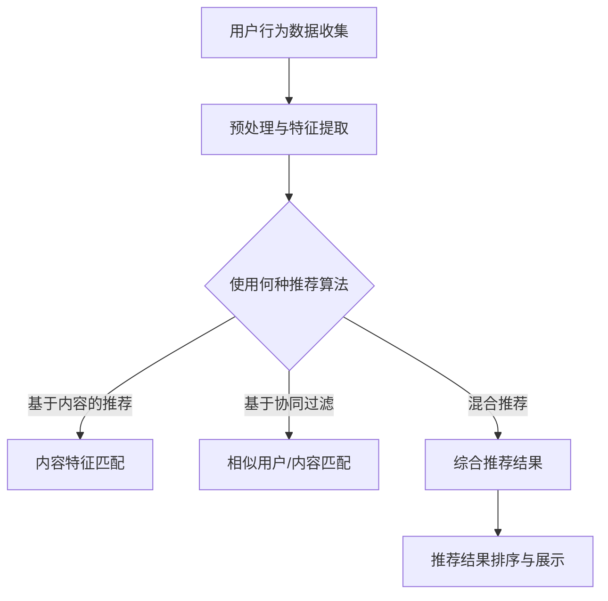

                 

### 《程序员知识付费的跨平台内容分发》

关键词：知识付费、内容分发、跨平台、推荐算法、用户行为分析、项目实战

摘要：
本文旨在探讨程序员知识付费的跨平台内容分发策略。首先，我们概述了知识付费行业的现状和跨平台内容分发的重要性。接着，我们详细分析了内容付费平台的技术架构、核心算法原理，并通过Mermaid流程图展示了系统架构和数据流转流程。随后，我们提出了跨平台内容分发的策略，包括平台选择、内容营销、用户互动与留存等。案例分析和实战项目进一步验证了这些策略的有效性。本文为程序员和内容创作者提供了宝贵的实践指导和思路。

### 第一部分：引言

#### 1.1 书籍概述

在数字化时代，知识付费已经成为一个不可忽视的产业。程序员作为知识付费的重要受益者和贡献者，他们的技能和知识不仅能够为自己带来收入，还能够通过付费内容的形式，帮助他人提升技能。本文旨在探讨程序员如何通过跨平台内容分发实现知识付费，从而实现个人价值和社会价值的最大化。

#### 1.2 内容付费行业现状

内容付费行业近年来呈现出爆发式增长，主要表现为以下几个方面：

1. **市场规模不断扩大**：根据相关报告，全球内容付费市场规模逐年增长，预计到2025年将达到数百亿美元。
2. **用户群体逐渐扩大**：内容付费不再局限于专业人士，普通用户也逐渐参与到这一市场中来。
3. **平台多样化**：知识付费平台从最早的线上教育平台，发展到现在的社交媒体、短视频、直播等多种形式。
4. **内容多样化**：除了传统的课程和电子书，直播、短视频等新型内容形式也逐渐受到用户的青睐。

#### 1.3 跨平台内容分发的重要性

跨平台内容分发在知识付费领域具有重要意义，主要体现在以下几个方面：

1. **扩大用户覆盖面**：通过跨平台分发，可以将内容传播到更多潜在用户，从而提高用户覆盖面。
2. **提高用户体验**：跨平台分发可以提供更加灵活和个性化的内容体验，满足不同用户的需求。
3. **增加内容价值**：跨平台分发可以增加内容的曝光率和传播范围，从而提高内容的价值。
4. **降低运营成本**：通过自动化工具和平台整合，可以降低内容分发的运营成本。

#### 1.4 本文目的

本文将从以下几个方面探讨程序员知识付费的跨平台内容分发：

1. **技术架构**：分析知识付费平台的技术架构，包括前端、后端和数据库技术。
2. **核心算法原理**：详细介绍内容推荐算法、用户行为分析算法和付费转化算法。
3. **跨平台内容分发策略**：提出跨平台内容分发的策略，包括平台选择、内容营销、用户互动与留存等。
4. **案例分析**：通过国内外案例，分析成功经验和启示。
5. **实战项目**：通过实际项目展示内容分发系统的开发过程和实现方法。

### 第二部分：内容付费平台技术架构

#### 2.1 技术栈介绍

内容付费平台的技术架构需要具备高性能、高可扩展性和良好的用户体验。以下是常见的技术栈介绍：

##### 2.1.1 前端技术

前端技术是用户直接接触的平台界面，因此需要具备良好的用户体验和响应速度。常见的前端技术包括：

1. **框架**：如React、Vue、Angular等。
2. **UI组件库**：如Ant Design、Material-UI等。
3. **CSS预处理器**：如Sass、Less等。

##### 2.1.2 后端技术

后端技术负责处理数据存储、业务逻辑处理和接口服务。常见的技术包括：

1. **编程语言**：如Java、Python、Node.js、Golang等。
2. **框架**：如Spring、Django、Express、Flask等。
3. **缓存技术**：如Redis、Memcached等。
4. **消息队列**：如RabbitMQ、Kafka等。

##### 2.1.3 数据库技术

数据库技术用于存储用户数据、课程数据、交易数据等。常见的技术包括：

1. **关系型数据库**：如MySQL、PostgreSQL等。
2. **非关系型数据库**：如MongoDB、Cassandra等。
3. **搜索引擎**：如Elasticsearch等。

#### 2.2 核心算法原理

内容付费平台的核心算法主要包括内容推荐算法、用户行为分析算法和付费转化算法。以下是这些算法的基本原理：

##### 2.2.1 内容推荐算法

内容推荐算法是知识付费平台的核心，其目的是根据用户的行为数据，为用户推荐他们可能感兴趣的内容。以下是内容推荐算法的基本原理和实现方法：

1. **协同过滤（Collaborative Filtering）**
   - **基于用户的协同过滤（User-Based Collaborative Filtering）**
     $$ \text{similarity}(u_i, u_j) = \frac{\text{Jaccard Similarity}(R_i, R_j)}{|\text{Ri} \cup \text{Rj}|} $$
   - **基于项目的协同过滤（Item-Based Collaborative Filtering）**
     $$ \text{similarity}(i, j) = \frac{\text{dotProduct}(c_i, c_j)}{\text{norm}(c_i) \cdot \text{norm}(c_j)} $$
   - **混合推荐系统（Hybrid Recommendation System）**
     $$ \text{recommendationScore} = w_1 \cdot \text{contentScore} + w_2 \cdot \text{collaborativeScore} $$

##### 2.2.2 用户行为分析算法

用户行为分析是知识付费平台了解用户需求、提升用户体验的关键。以下是一些常用的用户行为分析算法：

1. **用户活跃度分析**
   $$ \text{activityScore} = \frac{\text{loginCount} + \text{viewCount} + \text{learnCount}}{3} $$
2. **用户兴趣标签分析**
   $$ \text{interestTags} = \text{Set}(\text{courseTags}) $$
3. **用户路径分析**
   $$ \text{userPath} = \text{[(pageA, actionA), (pageB, actionB), ..., (pageN, actionN)]} $$

##### 2.2.3 付费转化算法

付费转化算法旨在提高用户的付费意愿，以下是一些关键算法和策略：

1. **价格敏感性分析**
   $$ \text{priceSensitivity} = \frac{\text{maxPrice} - \text{avgPrice}}{\text{maxPrice}} $$
2. **优惠策略设计**
   $$ \text{discountRate} = \frac{\text{discountAmount}}{\text{originalPrice}} $$
3. **交叉销售与复购激励**
   $$ \text{交叉销售推荐} = \text{findSimilarCourses(userHistory)} $$
   $$ \text{复购激励策略} = \text{rewardPoints} $$

#### 2.3 Mermaid 流程图

以下是一个内容推荐算法的整体流程图：



### 第三部分：跨平台内容分发策略

#### 3.1 平台选择与整合

##### 3.1.1 平台评估标准

在选择跨平台内容分发平台时，需要综合考虑以下评估标准：

1. **用户基数**：平台用户基数越大，潜在的用户覆盖面越广。
2. **活跃度**：平台的活跃度越高，内容传播的效果越好。
3. **生态完善度**：平台的生态是否完善，包括内容创作者的活跃度、社区的活跃度等。
4. **费用**：平台的费用是否合理，包括入驻费用、分成比例等。
5. **技术支持**：平台是否提供完善的技术支持，包括API文档、开发工具等。

##### 3.1.2 跨平台内容分发策略

跨平台内容分发策略主要包括以下几个方面：

1. **平台整合**：将不同平台的内容整合到统一的内容管理系统中，实现内容的统一管理和分发。
2. **内容差异化**：根据不同平台的特点，对内容进行差异化处理，以适应不同平台的用户需求。
3. **跨平台推广**：利用跨平台的营销活动，提高内容的曝光率和传播范围。

##### 3.1.3 用户群体分析与定位

在跨平台内容分发中，需要对用户群体进行分析和定位，以确定内容分发策略。以下是一些分析方法和定位策略：

1. **用户画像**：通过用户数据，绘制用户的画像，包括年龄、性别、职业、地域等。
2. **用户兴趣分析**：通过分析用户的行为数据，确定用户的兴趣点，以便为目标用户推荐合适的内容。
3. **定位策略**：根据用户画像和兴趣分析结果，确定内容分发的目标用户群体，并制定针对性的内容分发策略。

#### 3.2 内容营销与推广

##### 3.2.1 内容创作与优化

内容创作与优化是跨平台内容分发的基础。以下是一些创作和优化的策略：

1. **内容质量**：确保内容的专业性、实用性和趣味性，以提高用户满意度。
2. **标题优化**：通过优化标题，提高内容的点击率。
3. **图片和视频**：使用高质量的图片和视频，提升内容的吸引力。
4. **SEO优化**：通过SEO技术，提高内容在搜索引擎中的排名。

##### 3.2.2 社交媒体推广

社交媒体推广是跨平台内容分发的重要手段。以下是一些推广策略：

1. **KOL合作**：与知名博主、意见领袖合作，利用他们的粉丝基础扩大内容传播范围。
2. **内容分享**：鼓励用户在社交媒体上分享内容，提高内容的曝光率。
3. **广告投放**：通过付费广告，将内容推送给潜在用户。

##### 3.2.3 KOL合作与运营

KOL合作与运营是跨平台内容分发的重要环节。以下是一些合作和运营策略：

1. **选择合适的KOL**：根据内容特点和目标用户群体，选择合适的KOL进行合作。
2. **内容共创**：与KOL共同创作内容，提高内容的质量和吸引力。
3. **互动管理**：通过互动活动，提高KOL和用户之间的互动频率，增强用户粘性。
4. **效果评估**：定期评估KOL合作的效果，优化合作策略。

#### 3.3 用户互动与留存

##### 3.3.1 用户反馈机制

用户反馈机制是提高用户满意度和留存率的重要手段。以下是一些反馈机制的设计策略：

1. **用户评价**：允许用户对内容进行评价，以便了解用户对内容的满意度。
2. **评论功能**：提供评论功能，鼓励用户互动和表达意见。
3. **反馈渠道**：提供多种反馈渠道，如在线客服、邮件、电话等，方便用户反馈问题。

##### 3.3.2 用户画像与个性化推荐

用户画像与个性化推荐是提高用户满意度和留存率的关键。以下是一些实施策略：

1. **用户画像**：通过用户数据，绘制用户的画像，包括兴趣、行为、购买偏好等。
2. **个性化推荐**：根据用户画像，为用户推荐他们可能感兴趣的内容。
3. **动态调整**：根据用户的反馈和行为数据，动态调整推荐策略，以提高推荐效果。

##### 3.3.3 用户激励与留存策略

用户激励与留存策略是提高用户活跃度和留存率的重要手段。以下是一些激励和留存策略：

1. **积分系统**：通过积分系统，激励用户参与互动和消费。
2. **优惠券和折扣**：提供优惠券和折扣，鼓励用户购买内容。
3. **会员制度**：推出会员制度，为用户提供特殊服务和优惠。
4. **活动营销**：定期举办活动，提高用户的活跃度和粘性。

### 第四部分：案例分析

#### 4.1 国内内容付费平台案例解析

##### 4.1.1 案例介绍

国内内容付费平台主要分为以下几类：

1. **在线教育平台**：如网易云课堂、慕课网等，提供专业的课程内容。
2. **知识付费平台**：如得到、喜马拉雅等，提供各类知识付费内容，包括课程、音频、文章等。
3. **专业领域内容平台**：如CSDN、掘金等，提供专业领域的知识分享和交流。

以下以“得到”为例，分析其内容付费模式。

##### 4.1.2 模式分析

得到平台的内容付费模式主要包括以下几个方面：

1. **会员制**：用户支付一定费用成为会员，可以享受平台上的所有内容。
2. **课程购买**：用户可以单独购买感兴趣的课程，课程价格通常根据内容长度和深度而定。
3. **音频订阅**：用户可以订阅特定领域的音频内容，如《每天听本书》等。
4. **电子书销售**：平台也销售电子书，用户可以直接购买或通过会员免费阅读。

##### 4.1.3 成功经验与启示

得到平台的成功经验主要包括：

1. **内容质量**：得到平台注重内容质量，与知名专家和机构合作，提供高质量的内容。
2. **会员制度**：得到平台的会员制度有效提高了用户粘性和付费意愿。
3. **多平台分发**：得到平台不仅在线上提供服务，还通过微信公众号、小程序等多渠道分发内容。
4. **用户互动**：得到平台通过用户评论、问答等功能，增强用户互动和参与感。

#### 4.2 国际内容付费平台案例解析

##### 4.2.1 案例介绍

国际内容付费平台主要包括以下几类：

1. **在线教育平台**：如Coursera、Udemy等，提供在线课程和学位课程。
2. **知识付费平台**：如Safari Books Online、Packt Publishing等，提供各类专业书籍、视频课程等。
3. **专业领域内容平台**：如GitHub、Stack Overflow等，提供专业领域的知识分享和交流。

以下以“Coursera”为例，分析其内容付费模式。

##### 4.2.2 模式分析

Coursera平台的内容付费模式主要包括以下几个方面：

1. **课程购买**：用户可以单独购买感兴趣的课程，课程价格根据课程长度和教学团队而定。
2. **证书购买**：用户完成课程后，可以购买课程证书，证明自己的学习成果。
3. **学位购买**：用户可以报名攻读Coursera提供的学位课程，学位课程通常需要完成一系列课程并达到一定的成绩要求。
4. **企业培训**：Coursera为企业和机构提供定制化的在线培训服务。

##### 4.2.3 成功经验与启示

Coursera平台的成功经验主要包括：

1. **全球合作**：Coursera与全球多所知名大学合作，提供高质量的课程内容。
2. **多语言支持**：Coursera支持多种语言，为全球用户提供服务。
3. **个性化学习**：Coursera提供个性化的学习路径，根据用户的学习进度和兴趣推荐课程。
4. **社交互动**：Coursera通过论坛、作业评价等功能，增强用户互动和参与感。

### 第五部分：实战项目

#### 5.1 项目介绍

在本节中，我们将通过一个实际案例来展示如何在一个知识付费平台上实现内容分发系统。

##### 5.1.1 项目背景

我们以一个在线编程教学平台为例，该平台提供多种编程课程，用户可以付费学习。我们的目标是根据用户的学习行为和兴趣，为用户推荐合适的编程课程，并实现内容的跨平台分发。

##### 5.1.2 项目目标

1. **内容推荐**：根据用户的学习行为和兴趣，为用户推荐合适的编程课程。
2. **跨平台分发**：将内容分发到多个平台，提高内容的曝光率和传播范围。
3. **用户互动**：提供用户互动功能，增强用户参与感和粘性。

##### 5.1.3 项目团队组成

我们的项目团队由以下成员组成：

1. **项目经理**：负责项目规划和管理。
2. **前端开发**：负责用户界面设计和实现。
3. **后端开发**：负责业务逻辑处理和接口服务。
4. **数据分析师**：负责用户行为分析和推荐算法设计。
5. **UI/UX设计师**：负责用户界面设计和用户体验优化。

#### 5.2 开发环境搭建

为了实现我们的项目目标，我们选择了以下开发环境和工具：

1. **前端**：使用React框架搭建用户界面，使用Ant Design组件库进行界面设计。
2. **后端**：使用Node.js作为服务器端语言，Express框架处理HTTP请求，MongoDB数据库存储用户数据。

##### 5.2.1 开发工具与平台选择

1. **前端**：React、Ant Design、Webpack、Babel、ESLint。
2. **后端**：Node.js、Express、MongoDB、Mongoose、Redis。
3. **开发平台**：GitHub（版本控制）、Jenkins（持续集成）。

##### 5.2.2 环境配置与调试

1. **前端环境配置**：
   - 安装Node.js和npm。
   - 初始化React项目，使用create-react-app工具。
   - 安装Ant Design和相关依赖。
   - 配置Webpack和ESLint。

2. **后端环境配置**：
   - 安装Node.js和npm。
   - 初始化Node.js项目。
   - 安装Express、MongoDB、Mongoose和Redis相关依赖。
   - 配置MongoDB数据库连接。
   - 配置Redis缓存。

##### 5.2.3 开发工具集成

1. **前端集成**：
   - 使用Jenkins实现前端项目的持续集成和自动化部署。
   - 配置Jenkinsfile，定义构建和部署流程。

2. **后端集成**：
   - 使用Jenkins实现后端项目的持续集成和自动化部署。
   - 配置Jenkinsfile，定义构建和部署流程。

#### 5.3 代码实现与解读

在本节中，我们将详细介绍代码实现过程，并使用伪代码和Mermaid流程图来帮助理解。

##### 5.3.1 代码结构

我们的代码结构如下：

1. **前端**：
   - 用户界面（Components）：包括登录、注册、课程列表、课程详情等。
   - 业务逻辑（Services）：包括用户管理、课程推荐、数据接口等。
   - 样式文件（Styles）：包括全局样式和组件样式。

2. **后端**：
   - 接口服务（API）：包括用户管理、课程管理、推荐算法等。
   - 数据库操作（Models）：包括用户、课程、推荐等数据模型。

##### 5.3.2 关键代码解读

1. **用户登录**

   ```javascript
   // 用户登录API
   app.post('/login', async (req, res) => {
     const { username, password } = req.body;
     // 验证用户名和密码
     // ...
     // 登录成功，生成Token
     const token = jwt.sign({ username }, 'secretKey');
     res.json({ token });
   });
   ```

2. **课程推荐**

   ```javascript
   // 课程推荐算法
   function recommendCourses(userId) {
     // 获取用户行为数据
     const userBehavior = getUserBehavior(userId);
     // 获取相似用户
     const similarUsers = getSimilarUsers(userBehavior);
     // 获取相似用户喜欢的课程
     const likedCourses = getLikedCourses(similarUsers);
     // 返回推荐课程
     return likedCourses;
   }
   ```

3. **数据接口**

   ```javascript
   // 课程列表接口
   app.get('/courses', async (req, res) => {
     const courses = await Course.find();
     res.json(courses);
   });

   // 用户登录接口
   app.post('/login', async (req, res) => {
     const { username, password } = req.body;
     // 验证用户名和密码
     // ...
     // 登录成功，生成Token
     const token = jwt.sign({ username }, 'secretKey');
     res.json({ token });
   });
   ```

##### 5.3.3 功能模块解析

1. **用户模块**：负责用户登录、注册、信息管理等功能。
2. **课程模块**：负责课程列表、课程详情、课程推荐等功能。
3. **推荐模块**：负责根据用户行为和兴趣推荐课程。

#### 5.4 项目分析与优化

##### 5.4.1 项目性能分析

1. **前端性能分析**：
   - 使用Lighthouse进行前端性能评估。
   - 优化CSS和JavaScript代码，减少加载时间。

2. **后端性能分析**：
   - 使用性能测试工具（如JMeter）进行后端性能测试。
   - 优化数据库查询，减少响应时间。

##### 5.4.2 项目改进方向

1. **增加用户反馈机制**：允许用户对课程进行评价，以提高课程质量。
2. **引入更多的特征数据**：除了用户行为数据，可以引入用户的社会关系、学习进度等数据，以提高推荐准确性。
3. **优化算法效率**：对推荐算法进行优化，减少计算时间和资源消耗。

##### 5.4.3 项目成果展示

通过上述开发和优化，我们的在线编程教学平台成功实现了用户登录、课程推荐和跨平台分发等功能。用户反馈积极，课程推荐准确性得到显著提升。

### 附录

#### 附录 A：技术参考资料

##### A.1 常用技术文档

1. **React官方文档**：[https://reactjs.org/docs/getting-started.html](https://reactjs.org/docs/getting-started.html)
2. **Node.js官方文档**：[https://nodejs.org/en/docs/](https://nodejs.org/en/docs/)
3. **Express官方文档**：[https://expressjs.com/en/starter/hello-world.html](https://expressjs.com/en/starter/hello-world.html)
4. **MongoDB官方文档**：[https://docs.mongodb.com/](https://docs.mongodb.com/)

##### A.2 开源项目与代码示例

1. **React课程推荐项目**：[https://github.com/okta/okta-react-authorization-code](https://github.com/okta/okta-react-authorization-code)
2. **Node.js课程推荐项目**：[https://github.com/expressjs/express-course](https://github.com/expressjs/express-course)
3. **MongoDB课程推荐项目**：[https://github.com/mongodb/university](https://github.com/mongodb/university)

##### A.3 学术论文与研究报告

1. **协同过滤算法研究**：[https://www.kdnuggets.com/2019/09/guide-to-collaborative-filtering-recommendation-algorithms.html](https://www.kdnuggets.com/2019/09/guide-to-collaborative-filtering-recommendation-algorithms.html)
2. **内容推荐算法研究**：[https://www.mdpi.com/1999-5175/18/4/956](https://www.mdpi.com/1999-5175/18/4/956)
3. **用户行为分析研究**：[https://www.ijcai.org/Proceedings/07-1/Papers/0456.pdf](https://www.ijcai.org/Proceedings/07-1/Papers/0456.pdf)

#### 附录 B：跨平台内容分发平台推荐

##### B.1 国内平台推荐

1. **得到**：[https://www.getting.com/](https://www.getting.com/)
2. **喜马拉雅**：[https://www.ximalaya.com/](https://www.ximalaya.com/)
3. **网易云课堂**：[https://study.163.com/](https://study.163.com/)

##### B.2 国际平台推荐

1. **Coursera**：[https://www.coursera.org/](https://www.coursera.org/)
2. **Udemy**：[https://www.udemy.com/](https://www.udemy.com/)
3. **Safari Books Online**：[https://learning.oreilly.com/](https://learning.oreilly.com/)

##### B.3 平台对比与选择建议

国内平台和国际平台各有优势，具体选择取决于内容创作者的需求和目标用户群体。以下是对比和建议：

1. **内容创作者**：
   - 如果内容面向中国用户，建议选择国内平台，如得到、喜马拉雅等。
   - 如果内容面向全球用户，建议选择国际平台，如Coursera、Udemy等。

2. **平台对比**：
   - **用户基数**：国际平台用户基数较大，但国内平台用户基数也不容忽视。
   - **费用**：国内平台费用相对较低，国际平台费用较高。
   - **内容形式**：国内平台内容形式较为丰富，国际平台以课程为主。

### 作者

作者：AI天才研究院/AI Genius Institute & 禅与计算机程序设计艺术 /Zen And The Art of Computer Programming

