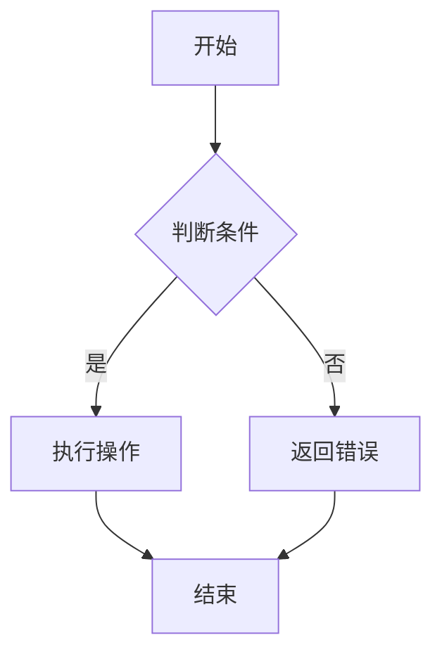
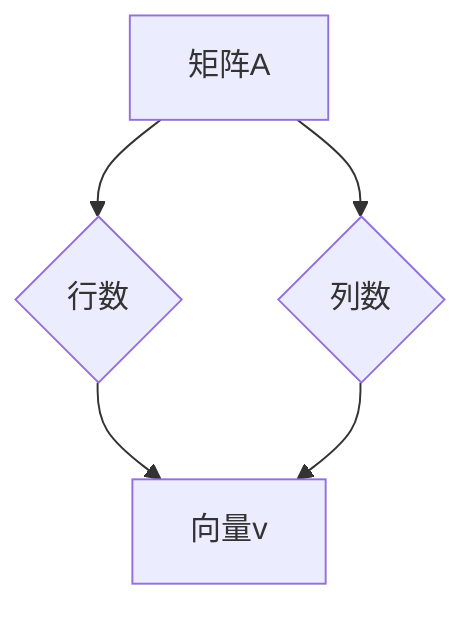
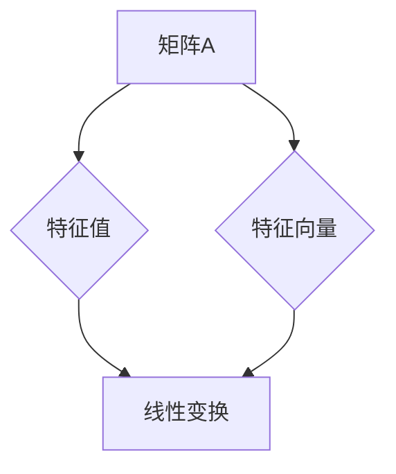
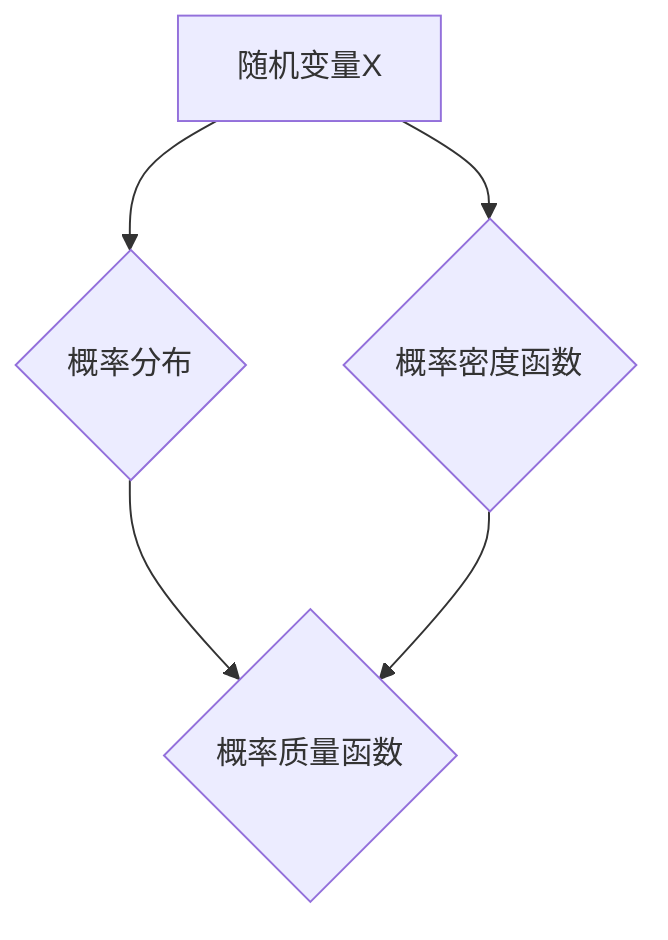
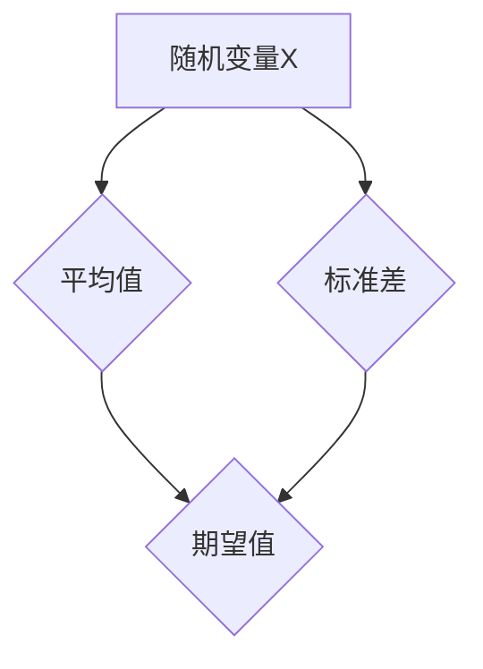
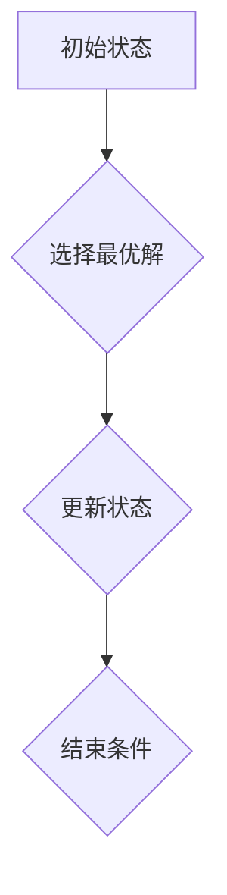
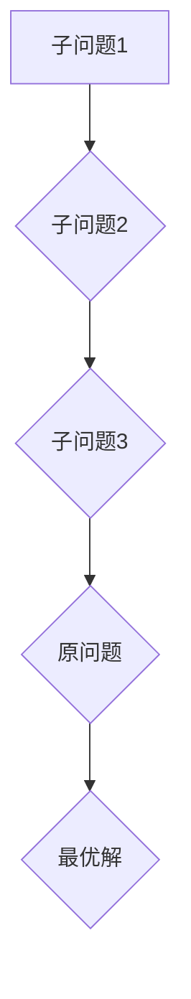
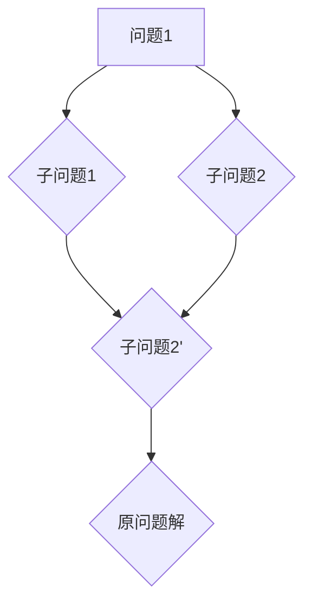

                 

### 《算法创新：提高人类计算的效率和精度》

#### 关键词：算法创新、计算效率、计算精度、算法优化、人工智能

> 摘要：本文旨在探讨算法创新对于提升人类计算效率和精度的关键作用。通过系统地介绍算法的基本概念、数学基础、现代算法原理及其创新与改进方法，本文揭示了算法在数据分析、人工智能等领域的重要应用。同时，文章展望了算法创新的未来趋势，为读者提供了丰富的算法资源与实战平台。通过本文的阅读，读者将深入理解算法创新的核心价值和实践意义。

### 目录大纲

#### 第一部分：算法创新基础

1. 算法概述与基本概念
    - 算法的定义与重要性
    - 算法的基本结构与分类
    - 算法的评估与优化
2. 算法的数学基础
    - 线性代数基础
    - 微积分基础
    - 概率论基础

#### 第二部分：算法创新原理

3. 现代算法原理与设计
    - 贪心算法
    - 动态规划
    - 分治算法
    - 回归算法
    - 决策树算法
4. 算法的创新与改进
    - 算法创新的策略与方法
    - 算法优化的技术手段
    - 算法在复杂场景的应用

#### 第三部分：算法创新实践

5. 算法在数据分析中的应用
    - 数据分析的基本流程
    - 数据分析算法案例
6. 算法在人工智能中的应用
    - 人工智能概述
    - 人工智能算法案例
7. 算法创新的未来趋势
    - 算法创新的发展趋势
    - 算法创新的未来应用场景

#### 附录

- 算法资源与工具
    - 主流算法库
    - 算法学习资源
    - 算法实战平台

### 文章正文部分

#### 第一部分：算法创新基础

##### 第1章：算法概述与基本概念

##### 1.1 算法的定义与重要性

算法（Algorithm）是计算机科学的核心概念之一，它是一系列解决问题的操作步骤。算法的重要性在于它为我们提供了一种系统化和规范化的方法来解决问题，无论是在计算机领域还是在日常生活中。

##### 1.1.1 算法的定义

算法可以被定义为：解决特定问题的一系列明确且有限的步骤。这些步骤通常是用伪代码、流程图或实际编程语言来描述。



##### 1.1.2 算法的重要性

算法的重要性体现在以下几个方面：

- **效率提升**：通过高效的算法，我们可以减少计算时间和资源消耗。
- **精度保证**：合理的算法设计可以确保计算结果的正确性和精确性。
- **问题解决**：算法是解决各种复杂问题的基石。

##### 1.2 算法的基本结构与分类

算法的基本结构通常包括以下几个部分：

- **初始化**：准备算法执行所需的初始数据。
- **输入**：接收用户输入或外部数据。
- **处理**：对输入数据进行处理。
- **输出**：返回处理结果。
- **结束**：算法执行完毕。

根据不同的分类标准，算法可以被分为多种类型，例如：

- **确定性算法**：算法的执行结果只与输入有关，与执行过程中的随机性无关。
- **非确定性算法**：算法的执行结果可能受到随机因素的影响。

##### 1.3 算法的评估与优化

算法的评估与优化是算法设计的重要环节。评估指标通常包括：

- **时间复杂度**：算法执行时间与数据规模之间的关系。
- **空间复杂度**：算法执行过程中所需内存的规模。

优化策略包括：

- **算法改进**：通过改进算法结构来提高效率和精度。
- **数据结构优化**：选择合适的数据结构来减少计算时间和空间。

##### 第2章：算法的数学基础

##### 2.1 线性代数基础

线性代数是算法设计中不可或缺的数学基础，特别是在处理矩阵和向量运算时。

##### 2.1.1 矩阵与向量

矩阵（Matrix）是一个由数字组成的矩形阵列，通常用大写字母表示。向量（Vector）是矩阵的一种特殊情况，即一行的矩阵。



##### 2.1.2 线性方程组

线性方程组是包含多个线性方程的集合，可以通过矩阵形式表示。

```latex
\begin{equation}
\begin{split}
a_{11}x + a_{12}y &= b_1 \\
a_{21}x + a_{22}y &= b_2
\end{split}
\end{equation}
```

##### 2.1.3 特征值与特征向量

特征值（Eigenvalue）和特征向量（Eigenvector）是矩阵理论中的重要概念，它们描述了矩阵的固有性质。



##### 2.2 微积分基础

微积分是数学分析的一个分支，包括导数、积分和最优化等内容。

##### 2.2.1 导数与微分

导数是描述函数变化率的概念，微分是导数的一种表示方法。

```latex
\frac{dy}{dx} = f'(x)
$$

##### 2.2.2 积分与反导数

积分是求函数在区间上的累加和，反导数是导数的反函数。

```latex
\int f(x) dx = F(x) + C
$$

##### 2.2.3 最优化问题

最优化问题是在满足约束条件下求目标函数的最大值或最小值。

```latex
\min_{x} f(x) \text{ s.t. } g(x) \leq 0
$$

##### 2.3 概率论基础

概率论是研究随机事件和概率分布的数学分支。

##### 2.3.1 随机变量与概率分布

随机变量是表示随机事件结果的变量，概率分布描述了随机变量取不同值的概率。



##### 2.3.2 条件概率与贝叶斯公式

条件概率是给定某个事件发生时，另一个事件发生的概率。贝叶斯公式是概率论中的重要工具，用于计算后验概率。

```latex
P(A|B) = \frac{P(B|A)P(A)}{P(B)}
$$

##### 2.3.3 大数定律与中心极限定理

大数定律描述了随机样本的平均值随着样本数量的增加趋近于期望值。中心极限定理描述了大量随机变量的和近似服从正态分布。



#### 第二部分：算法创新原理

##### 第3章：现代算法原理与设计

##### 3.1 贪心算法

贪心算法是一种在每一步选择中都采取当前最优解的策略，以达到全局最优解的算法。

##### 3.1.1 贪心算法概述

贪心算法的基本思想是：每一步都选择一个当前最优的决策，以期望最终得到全局最优解。



##### 3.1.2 贪心算法的应用场景

贪心算法广泛应用于以下场景：

- **最短路径问题**：如Dijkstra算法。
- **背包问题**：如0-1背包问题。
- **图着色问题**：如最优着色问题。

##### 3.1.3 贪心算法案例分析

以0-1背包问题为例，给定一组物品和其价值、重量，求在不超过背包重量的条件下，物品的最大总价值。

```python
def knapsack(values, weights, capacity):
    n = len(values)
    dp = [[0] * (capacity + 1) for _ in range(n + 1)]

    for i in range(1, n + 1):
        for w in range(1, capacity + 1):
            if weights[i - 1] <= w:
                dp[i][w] = max(dp[i - 1][w], dp[i - 1][w - weights[i - 1]] + values[i - 1])
            else:
                dp[i][w] = dp[i - 1][w]

    return dp[n][capacity]
```

##### 3.2 动态规划

动态规划是一种在求解复杂问题时的递归策略，它通过保存中间结果来避免重复计算。

##### 3.2.1 动态规划概述

动态规划的基本思想是将复杂问题分解为多个子问题，并利用子问题的解来求解原问题。



##### 3.2.2 动态规划的基本原理

动态规划的主要原理是：

- **重叠子问题**：子问题之间有重叠，即子问题的解可以被重复使用。
- **最优子结构**：原问题的最优解可以通过子问题的最优解来构造。

##### 3.2.3 动态规划案例分析

以最长公共子序列（LCS）问题为例，给定两个字符串，求它们的最长公共子序列。

```python
def lcs(X, Y):
    m, n = len(X), len(Y)
    dp = [[0] * (n + 1) for _ in range(m + 1)]

    for i in range(1, m + 1):
        for j in range(1, n + 1):
            if X[i - 1] == Y[j - 1]:
                dp[i][j] = dp[i - 1][j - 1] + 1
            else:
                dp[i][j] = max(dp[i - 1][j], dp[i][j - 1])

    return dp[m][n]
```

##### 3.3 分治算法

分治算法是将一个问题分解为多个子问题，递归地解决子问题，然后将子问题的解合并为原问题的解。

##### 3.3.1 分治算法概述

分治算法的基本思想是将复杂问题分解为多个子问题，然后分别解决子问题，最后将子问题的解合并为原问题的解。



##### 3.3.2 分治算法的基本原理

分治算法的主要原理是：

- **分解**：将原问题分解为多个子问题。
- **递归**：递归地解决子问题。
- **合并**：将子问题的解合并为原问题的解。

##### 3.3.3 分治算法案例分析

以归并排序为例，给定一个数组，将其排序。

```python
def merge_sort(arr):
    if len(arr) <= 1:
        return arr

    mid = len(arr) // 2
    left = merge_sort(arr[:mid])
    right = merge_sort(arr[mid:])

    return merge(left, right)

def merge(left, right):
    result = []
    i = j = 0

    while i < len(left) and j < len(right):
        if left[i] < right[j]:
            result.append(left[i])
            i += 1
        else:
            result.append(right[j])
            j += 1

    result.extend(left[i:])
    result.extend(right[j:])

    return result
```

##### 3.4 回归算法

回归算法是一种用于预测连续值的算法，它通过建立因变量和自变量之间的关系来预测新的数据点。

##### 3.4.1 回归算法概述

回归算法可以分为线性回归和多元回归。

- **线性回归**：因变量和自变量之间是线性关系。
- **多元回归**：因变量和多个自变量之间是线性关系。

##### 3.4.2 线性回归

线性回归的基本思想是通过找到一个最佳拟合直线，使得所有数据点到这条直线的距离之和最小。

```latex
y = \beta_0 + \beta_1x
$$

##### 3.4.3 多元回归

多元回归是对线性回归的扩展，考虑多个自变量。

```latex
y = \beta_0 + \beta_1x_1 + \beta_2x_2 + \ldots + \beta_nx_n
$$

##### 3.5 决策树算法

决策树算法是一种基于树形模型的分类算法，它通过一系列的判断节点来对数据进行分类。

##### 3.5.1 决策树算法概述

决策树算法的基本思想是：

- **根节点**：整个数据集。
- **内部节点**：特征分割点。
- **叶节点**：分类结果。

##### 3.5.2 决策树构建过程

决策树构建过程包括以下步骤：

1. 选择一个最优分割特征。
2. 根据分割特征将数据集划分为子集。
3. 递归地构建子决策树。

##### 3.5.3 决策树算法案例分析

以决策树分类算法为例，给定一个数据集，将其划分为正负两类。

```python
from sklearn.datasets import load_iris
from sklearn.model_selection import train_test_split
from sklearn.tree import DecisionTreeClassifier
from sklearn.metrics import accuracy_score

# 加载数据集
iris = load_iris()
X = iris.data
y = iris.target

# 划分训练集和测试集
X_train, X_test, y_train, y_test = train_test_split(X, y, test_size=0.3, random_state=42)

# 构建决策树模型
clf = DecisionTreeClassifier()
clf.fit(X_train, y_train)

# 预测测试集
y_pred = clf.predict(X_test)

# 计算准确率
accuracy = accuracy_score(y_test, y_pred)
print(f"Accuracy: {accuracy}")
```

##### 第4章：算法的创新与改进

##### 4.1 算法创新的策略与方法

算法创新是提升算法性能和适用性的关键。算法创新的策略包括：

- **问题建模**：根据问题的特性选择合适的数学模型。
- **算法改进**：通过改进算法结构或算法逻辑来提高性能。
- **技术手段**：结合最新的技术手段，如并行计算、分布式计算等。

##### 4.1.1 算法创新的策略

算法创新的策略主要包括：

- **基于需求的创新**：根据实际应用需求，设计满足特定需求的算法。
- **基于技术的创新**：利用最新的技术成果，如深度学习、强化学习等，改进现有算法。
- **跨学科融合**：将不同学科的知识和方法融合到算法设计中。

##### 4.1.2 算法创新的方法

算法创新的方法包括：

- **抽象与归纳**：从具体问题中提取通用算法结构。
- **仿真与优化**：通过仿真实验，优化算法性能。
- **启发式方法**：如遗传算法、粒子群优化等，用于解决复杂问题。

##### 4.1.3 算法创新案例分析

以深度学习算法的创新为例，深度学习在图像识别、自然语言处理等领域取得了显著成果。其创新方法包括：

- **神经网络结构优化**：如卷积神经网络（CNN）、循环神经网络（RNN）等。
- **训练策略优化**：如dropout、Batch Normalization等。
- **数据预处理方法**：如数据增强、数据归一化等。

##### 4.2 算法优化的技术手段

算法优化是提升算法性能的重要手段，技术手段包括：

- **算法改进**：通过改进算法结构或算法逻辑来提高性能。
- **并行计算**：通过并行计算提高算法执行速度。
- **分布式计算**：通过分布式计算处理大规模数据。

##### 4.2.1 算法优化的目标

算法优化的目标主要包括：

- **时间效率**：减少算法执行时间。
- **空间效率**：减少算法执行过程中所需的内存空间。
- **稳定性**：提高算法在不同数据集上的稳定性。

##### 4.2.2 算法优化的技术手段

算法优化的技术手段包括：

- **数据结构优化**：如使用哈希表、平衡二叉树等。
- **算法逻辑优化**：如减少冗余计算、优化循环结构等。
- **并行计算与分布式计算**：如MapReduce、GPU加速等。

##### 4.2.3 算法优化案例分析

以优化排序算法为例，优化目标为减少排序时间。

- **插入排序**：通过优化插入操作，如使用二分查找插入位置。
- **快速排序**：通过三数取中法选择基准值，减少最坏情况下的时间复杂度。
- **归并排序**：通过并行计算，将子问题分解为更小的子问题。

```python
def merge_sort(arr):
    if len(arr) <= 1:
        return arr

    mid = len(arr) // 2
    left = merge_sort(arr[:mid])
    right = merge_sort(arr[mid:])

    return merge(left, right)

def merge(left, right):
    result = []
    i = j = 0

    while i < len(left) and j < len(right):
        if left[i] < right[j]:
            result.append(left[i])
            i += 1
        else:
            result.append(right[j])
            j += 1

    result.extend(left[i:])
    result.extend(right[j:])

    return result
```

##### 4.3 算法在复杂场景的应用

算法在复杂场景中的应用面临着更大的挑战。复杂场景的特点包括：

- **数据规模庞大**：如大数据处理。
- **时间约束严格**：如实时计算。
- **资源有限**：如移动设备。

##### 4.3.1 复杂场景的特点

复杂场景的特点主要包括：

- **动态变化**：数据或环境在计算过程中不断变化。
- **不确定性**：无法准确预测计算过程中的各种因素。
- **高复杂性**：涉及多个领域或学科的交叉。

##### 4.3.2 算法在复杂场景中的应用

算法在复杂场景中的应用主要包括：

- **分布式计算**：如MapReduce，用于处理大规模数据。
- **实时计算**：如流计算，用于处理实时数据流。
- **混合智能**：将人工智能与传统算法相结合，提高计算效率和精度。

##### 4.3.3 复杂场景案例分析

以自动驾驶系统为例，复杂场景的特点包括：

- **数据来源多样**：摄像头、激光雷达、GPS等传感器。
- **实时性要求高**：确保车辆在复杂环境中安全行驶。
- **资源受限**：计算资源和能量供给有限。

解决方案包括：

- **分布式计算**：将计算任务分布到多台计算机上，提高计算速度。
- **深度学习算法**：用于图像识别和决策制定。
- **模糊逻辑**：用于处理不确定性因素。

```python
import numpy as np
from sklearn.cluster import KMeans
from sklearn.metrics import accuracy_score

# 加载数据集
data = np.load('data.npy')

# 模型参数
k = 3
n_iterations = 100

# 训练K均值模型
model = KMeans(n_clusters=k, n_init=n_iterations)
model.fit(data)

# 预测
labels = model.predict(data)

# 评估
accuracy = accuracy_score(labels, np.argmax(data, axis=1))
print(f"Accuracy: {accuracy}")
```

##### 第5章：算法在数据分析中的应用

##### 5.1 数据分析的基本流程

数据分析的基本流程包括以下几个步骤：

1. **数据收集与预处理**：收集数据，处理缺失值、异常值等。
2. **数据探索性分析**：通过可视化、统计等方法分析数据的基本特征。
3. **数据建模与预测**：建立模型，预测新的数据点。

##### 5.2 数据分析算法案例

以逻辑回归算法为例，逻辑回归是一种用于分类的算法，其基本原理是：

- **模型假设**：因变量和自变量之间存在线性关系。
- **损失函数**：对预测结果与实际结果之间的差异进行量化。

##### 5.2.1 逻辑回归算法案例分析

以鸢尾花数据集为例，使用逻辑回归进行分类。

```python
from sklearn.datasets import load_iris
from sklearn.linear_model import LogisticRegression
from sklearn.model_selection import train_test_split
from sklearn.metrics import accuracy_score

# 加载数据集
iris = load_iris()
X = iris.data
y = iris.target

# 划分训练集和测试集
X_train, X_test, y_train, y_test = train_test_split(X, y, test_size=0.3, random_state=42)

# 构建逻辑回归模型
clf = LogisticRegression()
clf.fit(X_train, y_train)

# 预测测试集
y_pred = clf.predict(X_test)

# 计算准确率
accuracy = accuracy_score(y_test, y_pred)
print(f"Accuracy: {accuracy}")
```

##### 第6章：算法在人工智能中的应用

##### 6.1 人工智能概述

人工智能（Artificial Intelligence，简称AI）是计算机科学的一个分支，旨在使机器能够模拟、延伸和扩展人类的智能。

##### 6.1.1 人工智能的定义

人工智能是指通过计算机技术实现的人类智能的模拟、延伸和扩展。它包括以下几个方面的内容：

- **知识表示**：将人类知识转化为计算机可以理解和处理的形式。
- **问题求解**：模拟人类解决问题的方法和过程。
- **机器学习**：使计算机从数据中学习并做出决策。
- **自然语言处理**：使计算机能够理解和生成自然语言。

##### 6.1.2 人工智能的发展历程

人工智能的发展历程可以分为以下几个阶段：

- **早期探索阶段**：20世纪50年代至60年代，以符号主义方法为主。
- **人工智能崛起阶段**：20世纪80年代至90年代，以专家系统和机器学习为代表。
- **深度学习时代**：21世纪初至今，以深度神经网络和大数据技术为代表。

##### 6.1.3 人工智能的应用领域

人工智能在多个领域取得了显著成果，包括：

- **计算机视觉**：图像识别、目标检测等。
- **自然语言处理**：机器翻译、语音识别等。
- **智能决策**：推荐系统、自动驾驶等。
- **医疗健康**：疾病诊断、药物研发等。

##### 6.2 人工智能算法案例

以神经网络算法为例，神经网络是一种模仿生物神经系统的计算模型。

##### 6.2.1 神经网络算法案例分析

以手写数字识别为例，使用神经网络进行图像识别。

```python
import numpy as np
from sklearn.datasets import load_digits
from sklearn.model_selection import train_test_split
from sklearn.metrics import accuracy_score
from sklearn.neural_network import MLPClassifier

# 加载数据集
digits = load_digits()
X = digits.data
y = digits.target

# 划分训练集和测试集
X_train, X_test, y_train, y_test = train_test_split(X, y, test_size=0.3, random_state=42)

# 构建神经网络模型
clf = MLPClassifier(hidden_layer_sizes=(100,), max_iter=1000)
clf.fit(X_train, y_train)

# 预测测试集
y_pred = clf.predict(X_test)

# 计算准确率
accuracy = accuracy_score(y_test, y_pred)
print(f"Accuracy: {accuracy}")
```

##### 第7章：算法创新的未来趋势

##### 7.1 算法创新的发展趋势

算法创新的未来趋势包括以下几个方面：

- **计算能力提升**：随着计算能力的提升，算法将更加复杂和高效。
- **数据规模扩大**：大数据技术将推动算法在更多领域中的应用。
- **跨学科融合**：人工智能与其他学科的融合将带来更多创新。
- **可持续性发展**：算法将在环境保护、资源优化等领域发挥重要作用。

##### 7.1.1 算法创新的未来方向

算法创新的未来方向主要包括：

- **深度学习**：继续优化深度神经网络结构和训练方法。
- **强化学习**：在无人驾驶、游戏人工智能等领域取得突破。
- **图神经网络**：在社交网络、知识图谱等领域发挥重要作用。
- **联邦学习**：在隐私保护和分布式计算方面取得进展。

##### 7.1.2 算法创新的关键技术

算法创新的关键技术包括：

- **量子计算**：利用量子计算优势解决复杂问题。
- **边缘计算**：将计算能力分布到网络边缘，提高实时性。
- **联邦学习**：在分布式环境中实现安全有效的机器学习。
- **脑机接口**：实现人脑与计算机的直接交互。

##### 7.1.3 算法创新的挑战与机遇

算法创新的挑战包括：

- **数据隐私**：如何在保护用户隐私的同时实现有效的机器学习。
- **计算资源**：如何高效利用计算资源，提高算法性能。
- **算法可靠性**：如何确保算法的可靠性和鲁棒性。

机遇包括：

- **行业应用**：算法在金融、医疗、教育等领域的广泛应用。
- **跨学科融合**：与其他学科的深度融合，推动算法创新。
- **政策支持**：政府和企业对算法创新的投入和支持。

##### 7.2 算法创新的未来应用场景

算法创新的未来应用场景包括：

- **智能医疗**：利用人工智能技术提高疾病诊断和治疗的精度。
- **智慧城市**：利用算法优化城市交通、能源管理等方面。
- **自动驾驶**：实现安全、高效的自动驾驶技术。
- **智能家居**：通过算法实现家庭设备的智能化管理。

##### 附录

###### 附录A：算法资源与工具

**A.1 主流算法库**

- **Scikit-learn**：提供了丰富的机器学习算法，适用于各种数据分析和建模任务。
- **TensorFlow**：由Google开发的开源机器学习框架，支持深度学习、强化学习等多种算法。
- **PyTorch**：由Facebook开发的开源机器学习框架，以动态计算图和灵活性强而著称。

**A.2 算法学习资源**

- **算法课程**：包括MIT、Stanford等知名大学提供的在线课程，如《MIT 6.006 Introduction to Algorithms》。
- **算法书籍**：如《算法导论》（Introduction to Algorithms）、《深度学习》（Deep Learning）等。
- **算法社区**：如Stack Overflow、GitHub等，提供了大量的算法资源和讨论。

**A.3 算法实战平台**

- **Kaggle**：提供了大量的数据集和算法竞赛，是学习和实践算法的绝佳平台。
- **Jupyter Notebook**：一种交互式的计算环境，适用于编写、运行和分享算法代码。
- **Google Colab**：基于Jupyter Notebook的云端计算环境，提供了免费的GPU和TPU资源。

