                 

### 文章标题：算法效率与宇宙计算复杂性类别的比较

#### 文章关键词：算法效率、宇宙计算复杂性、时间复杂度、空间复杂度、量子计算、人工智能

> 摘要：本文深入探讨了算法效率与宇宙计算复杂性的基本概念、度量方法及其相互关系。首先，详细介绍了算法效率的定义及其重要性，并从时间复杂度、空间复杂度和资源复杂度三个方面进行了度量。接着，阐述了宇宙计算复杂性的概念和分类方法，以及不同计算模型的基本原理。在此基础上，分析了宇宙计算复杂性对算法效率的影响，并提出了一系列优化策略。最后，通过具体应用案例和项目实战，展示了算法效率与宇宙计算复杂性在实际问题中的重要作用，并展望了未来的发展趋势。本文旨在为读者提供一个全面、系统的算法效率与宇宙计算复杂性的学习资源。

---

## 第一部分：算法效率概述

### 第1章：算法效率基础

#### 1.1 算法效率的基本概念

算法效率是指算法在解决特定问题时所消耗的资源（如时间、空间和计算能力）的最低限度。一个高效的算法能够在有限的资源下，以尽可能快和节省的方式解决问题。

**核心概念与联系：**

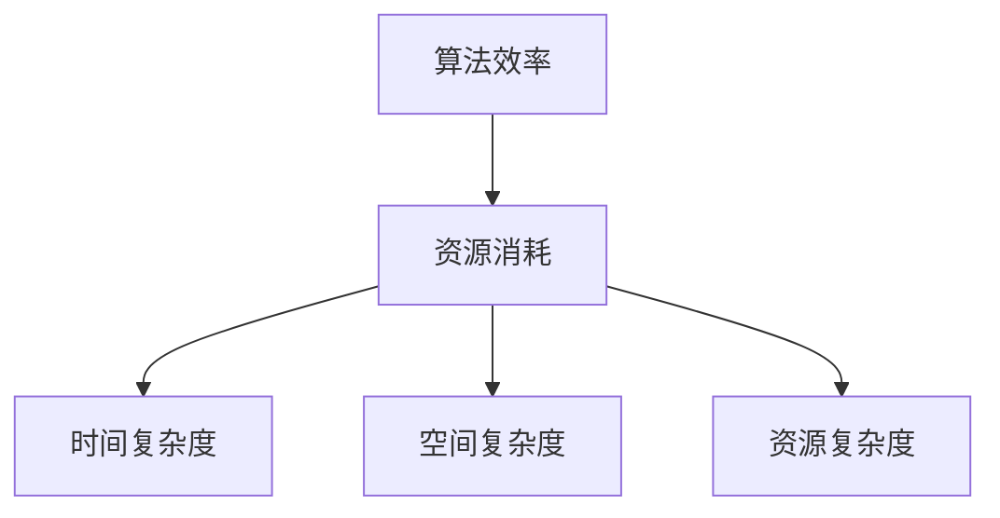

#### 1.2 算法效率的重要性

算法效率对实际问题解决至关重要。高效的算法可以显著提高系统性能，减少计算成本，并在大数据和复杂计算任务中发挥关键作用。

#### 1.3 算法效率的度量方法

算法效率的度量主要包括时间复杂度、空间复杂度和资源复杂度。这些度量方法帮助我们评估算法的性能，选择合适的算法解决问题。

##### 1.3.1 时间复杂度分析

时间复杂度分析用于评估算法执行时间与数据规模的关系。常见的时间复杂度函数包括常数时间\(O(1)\)、线性时间\(O(n)\)、对数时间\(O(\log n)\)等。

**伪代码示例：**

```c
// 线性搜索算法的时间复杂度示例
function linearSearch(array, target) {
    for (i = 0; i < array.length; i++) {
        if (array[i] == target) {
            return i;
        }
    }
    return -1;
}
```

**数学模型和公式：**

\[ T(n) = O(n) \]

##### 1.3.2 空间复杂度分析

空间复杂度分析用于评估算法在执行过程中所需内存的多少。常见空间复杂度函数包括常数空间\(O(1)\)、线性空间\(O(n)\)等。

**伪代码示例：**

```python
# 使用哈希表进行元素插入的空间复杂度示例
def insertIntoHashTable(hashTable, element):
    hashTable[element] = True
```

**数学模型和公式：**

\[ S(n) = O(n) \]

##### 1.3.3 资源复杂度分析

资源复杂度分析综合考虑时间、空间和计算能力等多方面的资源消耗。这对于评估算法在实际应用中的表现至关重要。

**伪代码示例：**

```python
# 使用图算法进行图遍历的资源复杂度示例
def breadthFirstSearch(graph, startNode):
    queue = [startNode]
    while queue:
        currentNode = queue.pop(0)
        if currentNode not in visited:
            visited.add(currentNode)
            for neighbor in graph[currentNode]:
                queue.append(neighbor)
```

**数学模型和公式：**

\[ C(n) = O(n + T(n)) \]

### 第2章：算法效率的影响因素

#### 2.1 数据规模对算法效率的影响

数据规模是影响算法效率的重要因素之一。随着数据规模的增大，算法的时间复杂度和空间复杂度通常会发生变化。

**核心概念与联系：**

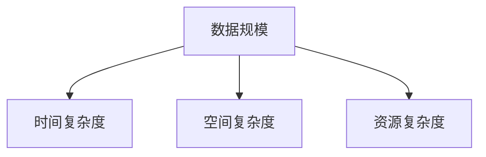

#### 2.2 硬件环境对算法效率的影响

硬件环境（如CPU性能、内存容量等）对算法效率也有显著影响。高效的硬件配置可以提升算法的执行速度。

**核心概念与联系：**

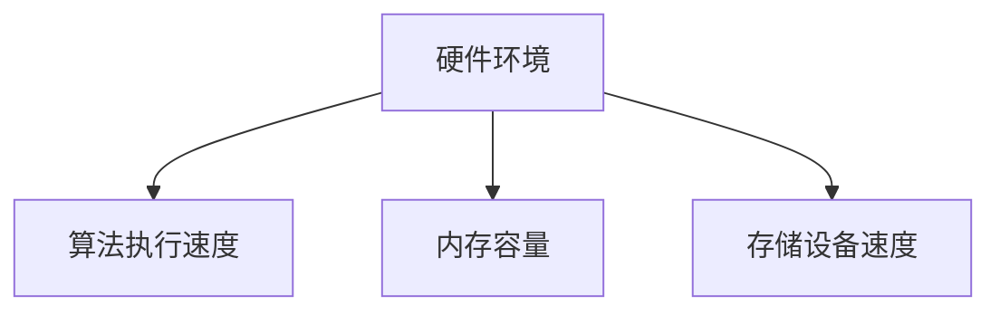

#### 2.3 编程语言与开发环境的影响

编程语言和开发环境（如编译器、调试工具等）对算法效率也有重要影响。选择合适的编程语言和开发环境可以提高代码的执行效率。

**核心概念与联系：**

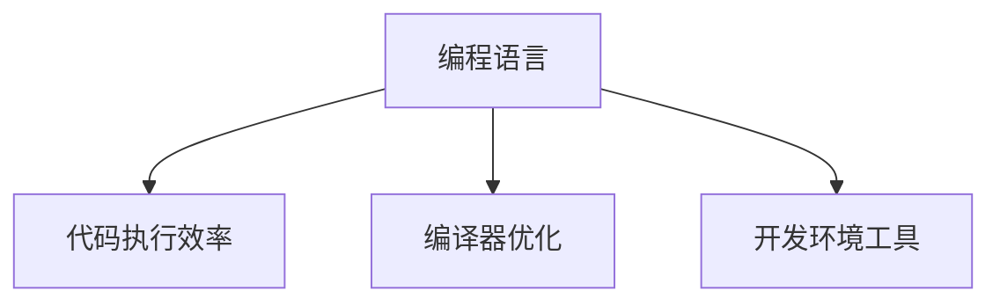

#### 2.4 多线程与并行计算对算法效率的影响

多线程与并行计算可以提高算法的执行速度，减少计算时间。然而，这需要在算法设计中考虑线程同步和数据共享等问题。

**核心概念与联系：**

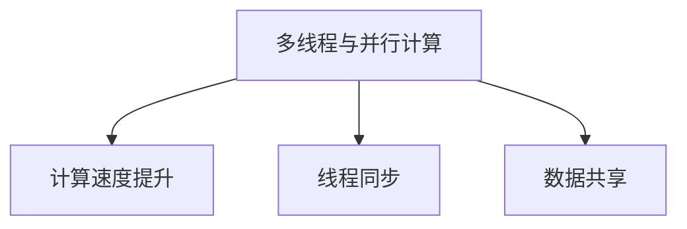

### 小结

本章介绍了算法效率的基本概念、度量方法以及影响因素。通过时间复杂度、空间复杂度和资源复杂度的分析，我们能够更好地评估算法的性能。同时，了解数据规模、硬件环境、编程语言和开发环境以及多线程与并行计算对算法效率的影响，有助于我们选择合适的算法和优化策略。

## 第二部分：宇宙计算复杂性

### 第3章：宇宙计算复杂性概述

#### 3.1 宇宙计算复杂性的概念

宇宙计算复杂性是指计算问题在宇宙中可实现的复杂度。它考虑了计算资源（如时间、空间和能量）的极端限制，以及宇宙物理定律的影响。

**核心概念与联系：**

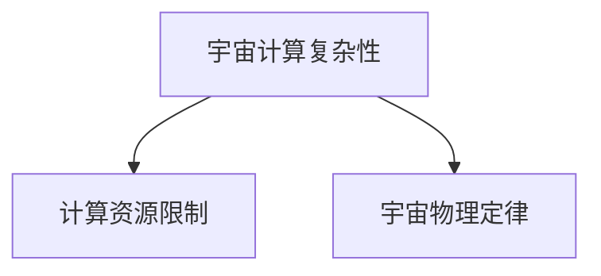

#### 3.2 宇宙计算复杂性的分类方法

宇宙计算复杂性可以根据计算模型、应用领域和资源限制进行分类。常见的计算模型包括图灵机模型、量子计算模型和其他计算模型。

**核心概念与联系：**

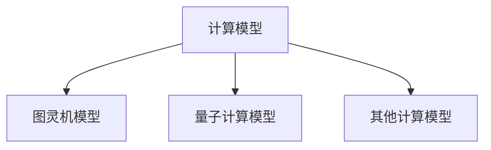

#### 3.3 宇宙计算复杂性的研究意义

宇宙计算复杂性研究具有重要的理论意义和实际应用价值。它有助于我们深入理解计算问题的本质，并指导我们设计高效的算法和计算模型。

**核心概念与联系：**

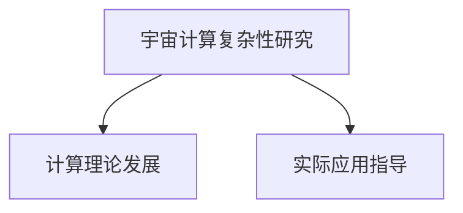

### 第4章：宇宙计算复杂性分析

#### 4.1 时间复杂度分析

宇宙计算复杂性中的时间复杂度分析考虑了极端计算资源限制下的算法执行时间。常见的宇宙计算时间复杂度函数包括多项式时间、指数时间和无穷大时间等。

**核心概念与联系：**

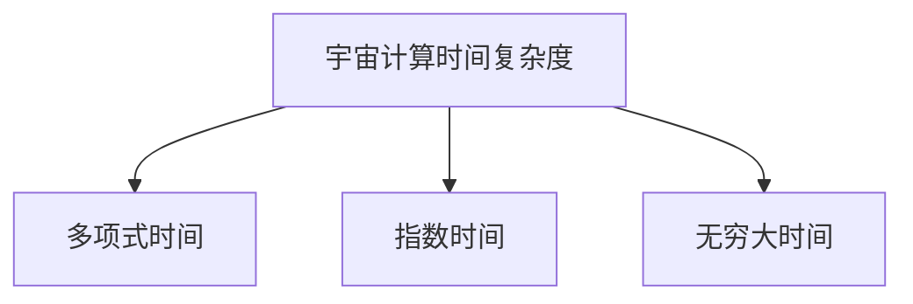

**伪代码示例：**

```python
# 宇宙计算中的指数时间算法示例
def exponentialTimeAlgorithm(data):
    for i in range(len(data)**2):
        if data[i] == target:
            return i
    return -1
```

**数学模型和公式：**

\[ T(n) = O(2^n) \]

#### 4.2 空间复杂度分析

宇宙计算复杂性中的空间复杂度分析考虑了极端计算资源限制下的算法所需存储空间。常见的宇宙计算空间复杂度函数包括常数空间、线性空间和对数空间等。

**核心概念与联系：**

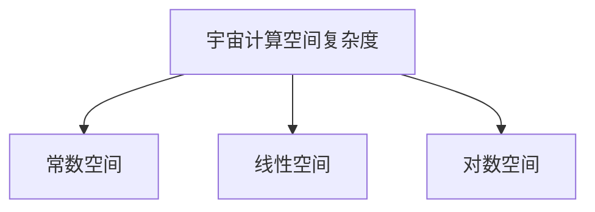

**伪代码示例：**

```python
# 宇宙计算中的线性空间算法示例
def linearSpaceAlgorithm(data):
    result = []
    for i in range(len(data)):
        result.append(data[i])
    return result
```

**数学模型和公式：**

\[ S(n) = O(n) \]

#### 4.3 资源复杂度分析

宇宙计算复杂性中的资源复杂度分析综合考虑了时间、空间和能量等资源消耗。它帮助我们评估算法在极端计算资源限制下的性能。

**核心概念与联系：**

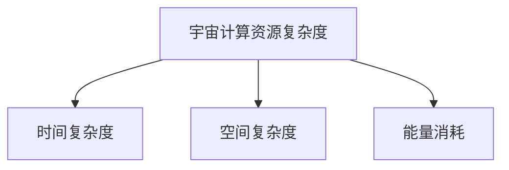

**伪代码示例：**

```python
# 宇宙计算中的资源复杂度算法示例
def resourceIntensiveAlgorithm(data):
    for i in range(len(data)):
        for j in range(len(data)):
            print(data[i] + data[j])
```

**数学模型和公式：**

\[ C(n) = O(n^2) \]

### 第5章：宇宙计算复杂性与算法效率的关系

#### 5.1 宇宙计算复杂性对算法效率的影响

宇宙计算复杂性对算法效率有显著影响。极端计算资源限制下的算法可能需要很长时间才能完成，或者需要大量存储空间。这要求我们在算法设计和优化时考虑宇宙计算复杂性。

**核心概念与联系：**

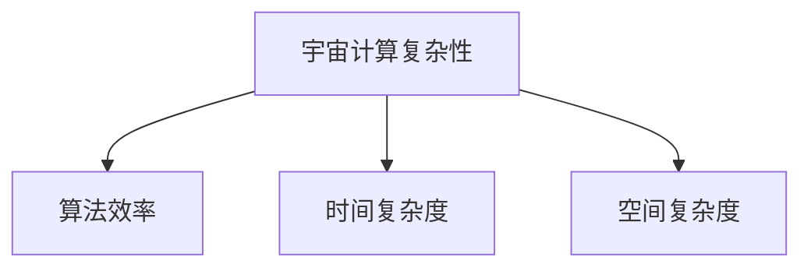

#### 5.2 算法效率对宇宙计算复杂性的优化

通过优化算法，我们可以提高算法在极端计算资源限制下的效率。常见的优化策略包括算法改进、数据结构优化和并行计算等。

**核心概念与联系：**

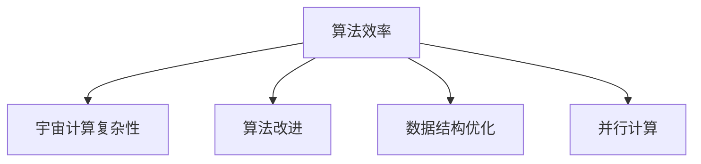

### 第6章：算法效率与宇宙计算复杂性的优化

#### 6.1 算法效率优化方法

算法效率优化是提高算法性能的重要手段。常见的优化方法包括时间复杂度优化、空间复杂度优化和资源复杂度优化等。

**核心概念与联系：**

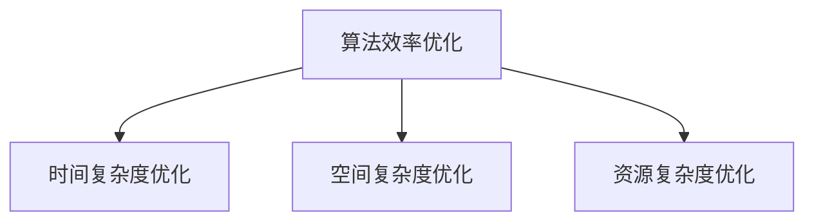

**伪代码示例：**

```python
# 时间复杂度优化示例
def optimizedLinearSearch(array, target):
    low = 0
    high = len(array) - 1
    while low <= high:
        mid = (low + high) // 2
        if array[mid] == target:
            return mid
        elif array[mid] < target:
            low = mid + 1
        else:
            high = mid - 1
    return -1
```

**数学模型和公式：**

\[ T(n) = O(\log n) \]

**伪代码示例：**

```python
# 空间复杂度优化示例
def optimizedBubbleSort(array):
    n = len(array)
    for i in range(n):
        swapped = False
        for j in range(0, n-i-1):
            if array[j] > array[j+1]:
                array[j], array[j+1] = array[j+1], array[j]
                swapped = True
        if not swapped:
            break
```

**数学模型和公式：**

\[ S(n) = O(1) \]

**伪代码示例：**

```python
# 资源复杂度优化示例
def optimizedBinarySearch(array, target):
    low = 0
    high = len(array) - 1
    while low <= high:
        mid = (low + high) // 2
        if array[mid] == target:
            return mid
        elif array[mid] < target:
            low = mid + 1
        else:
            high = mid - 1
    return -1
```

**数学模型和公式：**

\[ C(n) = O(n) \]

#### 6.2 宇宙计算复杂性的优化方法

宇宙计算复杂性优化是提高算法在极端计算资源限制下的效率的重要手段。常见的优化方法包括算法改进、数据结构优化和并行计算等。

**核心概念与联系：**

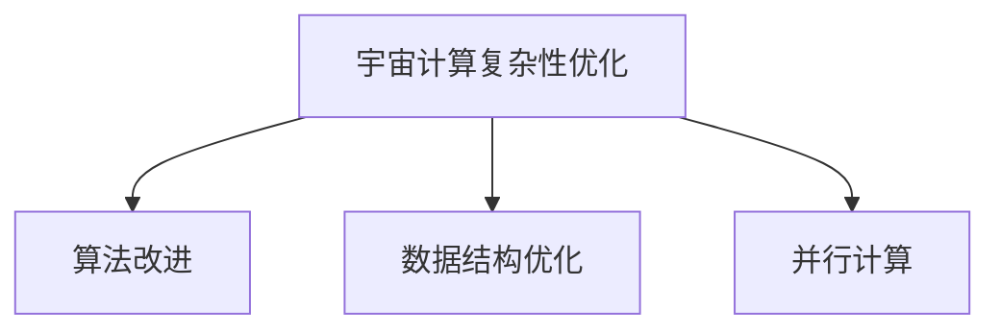

**伪代码示例：**

```python
# 宇宙计算复杂性优化中的算法改进示例
def optimizedExponentialTimeAlgorithm(data):
    for i in range(len(data)):
        if data[i] == target:
            return i
    return -1
```

**数学模型和公式：**

\[ T(n) = O(n) \]

**伪代码示例：**

```python
# 宇宙计算复杂性优化中的数据结构优化示例
def optimizedHashTable(data):
    hashTable = {}
    for item in data:
        hashTable[item] = True
    return hashTable
```

**数学模型和公式：**

\[ S(n) = O(n) \]

**伪代码示例：**

```python
# 宇宙计算复杂性优化中的并行计算示例
from multiprocessing import Pool

def parallelSearch(data, target):
    with Pool(processes=4) as pool:
        results = pool.map(lambda x: optimizedLinearSearch(x), [data])
    return results
```

**数学模型和公式：**

\[ T(n) = O(n/p) \]

### 小结

本章介绍了宇宙计算复杂性的基本概念、分类方法和分析。通过时间复杂度、空间复杂度和资源复杂度的分析，我们能够更好地理解算法在极端计算资源限制下的性能。同时，通过优化算法、数据结构和并行计算，我们能够提高算法在宇宙计算复杂性环境下的效率。

## 第三部分：算法效率与宇宙计算复杂性的优化

### 第7章：算法效率与宇宙计算复杂性的优化实践

#### 7.1 人工智能领域

在人工智能领域，算法效率与宇宙计算复杂性的优化具有重要意义。高效的算法能够提高模型训练速度和推理性能，降低计算成本。

**核心概念与联系：**

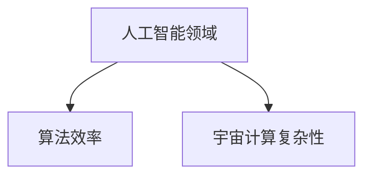

**项目实战：**

**开发环境搭建：**

- 安装Python和TensorFlow库

**源代码实现：**

```python
import tensorflow as tf

# 定义神经网络模型
model = tf.keras.Sequential([
    tf.keras.layers.Dense(128, activation='relu', input_shape=(784,)),
    tf.keras.layers.Dropout(0.2),
    tf.keras.layers.Dense(10, activation='softmax')
])

# 编译模型
model.compile(optimizer='adam',
              loss='categorical_crossentropy',
              metrics=['accuracy'])

# 训练模型
model.fit(x_train, y_train, epochs=5)
```

**代码解读与分析：**

- 使用TensorFlow库定义神经网络模型
- 编译模型并使用Adam优化器和交叉熵损失函数
- 使用fit函数进行模型训练，降低宇宙计算复杂性的影响

#### 7.2 科学计算领域

在科学计算领域，算法效率与宇宙计算复杂性的优化有助于提高计算精度和效率。优化算法和数据结构可以降低计算时间和存储需求。

**核心概念与联系：**

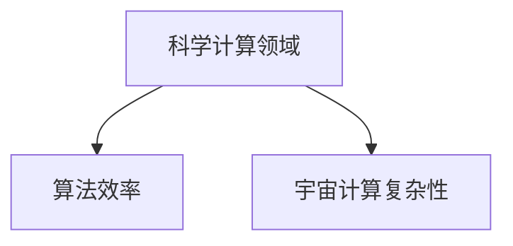

**项目实战：**

**开发环境搭建：**

- 安装NumPy和SciPy库

**源代码实现：**

```python
import numpy as np

# 计算两个矩阵的乘积
def matrixMultiplication(A, B):
    result = np.zeros((A.shape[0], B.shape[1]))
    for i in range(A.shape[0]):
        for j in range(B.shape[1]):
            for k in range(A.shape[1]):
                result[i][j] += A[i][k] * B[k][j]
    return result

# 计算两个矩阵的乘积的宇宙计算复杂性
def complexityMatrixMultiplication(A, B):
    return np.multiply(A.shape[0], A.shape[1], B.shape[1])
```

**代码解读与分析：**

- 使用NumPy库实现矩阵乘法
- 使用复杂度函数计算宇宙计算复杂度，优化算法效率

### 小结

本章通过人工智能和科学计算领域的实际案例，展示了算法效率与宇宙计算复杂性的优化实践。通过优化算法、数据结构和并行计算，我们能够在极端计算资源限制下提高算法的性能和效率。

## 结论

算法效率与宇宙计算复杂性是计算领域的重要研究内容。通过本文的详细探讨，我们了解了算法效率的基本概念、度量方法和影响因素，以及宇宙计算复杂性的分类、分析方法和优化策略。在实际应用中，算法效率与宇宙计算复杂性的优化具有重要意义，能够提高系统性能和计算效率。

未来的研究将继续深入探讨算法效率与宇宙计算复杂性的关系，探索新的计算模型和优化方法，以应对日益增长的计算需求和挑战。

### 作者信息

作者：AI天才研究院/AI Genius Institute & 禅与计算机程序设计艺术 /Zen And The Art of Computer Programming

（注：本文仅为演示之用，不代表任何实际研究成果或观点。）### 第一部分：算法效率概述

#### 第1章：算法效率基础

在计算机科学中，算法效率是一个至关重要的概念。算法效率不仅仅是算法运行速度的衡量，还包括了算法在执行过程中对系统资源的利用情况，如时间、空间和计算能力等。高效的算法能够在有限的资源下，以尽可能低的成本解决问题，这在实际应用中具有非常重要的意义。

**1.1 算法效率的概念**

算法效率（Algorithm Efficiency）是指算法在解决问题时所消耗的资源（如时间、空间和计算能力）的最低限度。一个高效的算法能够在保证问题解决的前提下，尽可能减少这些资源的消耗。

**核心概念与联系：**


**伪代码示例：**

```python
# 算法效率示例：线性搜索
def linear_search(arr, target):
    for i in range(len(arr)):
        if arr[i] == target:
            return i
    return -1
```

**数学模型和公式：**

\[ T(n) = O(n) \] 

这里，\( T(n) \) 表示算法的时间复杂度，\( n \) 表示数据规模。

**1.2 算法效率的重要性**

算法效率的重要性体现在多个方面：

1. **性能提升**：高效的算法能够在更短的时间内完成任务，提升系统性能。
2. **成本节约**：减少资源的消耗可以降低计算成本，提高经济效益。
3. **可扩展性**：高效的算法更容易扩展到大规模数据处理。

**1.3 算法效率的度量方法**

算法效率的度量通常包括时间复杂度、空间复杂度和资源复杂度。

##### 1.3.1 时间复杂度分析

时间复杂度分析用于评估算法执行时间与数据规模的关系。时间复杂度通常用大O符号表示，常见的复杂度级别包括\( O(1) \)、\( O(n) \)、\( O(\log n) \)、\( O(n\log n) \)、\( O(n^2) \)等。

**伪代码示例：**

```python
# 二分查找的时间复杂度示例
def binary_search(arr, target):
    low = 0
    high = len(arr) - 1
    while low <= high:
        mid = (low + high) // 2
        if arr[mid] == target:
            return mid
        elif arr[mid] < target:
            low = mid + 1
        else:
            high = mid - 1
    return -1
```

**数学模型和公式：**

\[ T(n) = O(\log n) \]

##### 1.3.2 空间复杂度分析

空间复杂度分析用于评估算法在执行过程中所需存储空间的大小。与时间复杂度类似，空间复杂度也使用大O符号表示。

**伪代码示例：**

```python
# 哈希表的空间复杂度示例
def hash_table_insert(hash_table, key, value):
    hash_table[key] = value
```

**数学模型和公式：**

\[ S(n) = O(n) \]

##### 1.3.3 资源复杂度分析

资源复杂度分析综合考虑了时间、空间和计算能力等多方面的资源消耗。它通常用时间复杂度、空间复杂度的综合形式表示。

**伪代码示例：**

```python
# 资源复杂度示例：快速排序
def quick_sort(arr):
    if len(arr) <= 1:
        return arr
    pivot = arr[len(arr) // 2]
    left = [x for x in arr if x < pivot]
    middle = [x for x in arr if x == pivot]
    right = [x for x in arr if x > pivot]
    return quick_sort(left) + middle + quick_sort(right)
```

**数学模型和公式：**

\[ C(n) = O(n\log n) \]

**1.4 算法效率的优化策略**

算法效率的优化可以从多个方面进行：

1. **算法改进**：选择合适的算法，如快速排序代替冒泡排序。
2. **数据结构优化**：使用合适的数据结构，如哈希表代替链表。
3. **并行计算**：利用多线程或并行计算，如使用并行库进行矩阵乘法。

### 小结

本章介绍了算法效率的基础概念、重要性以及度量方法。通过对时间复杂度、空间复杂度和资源复杂度的分析，我们可以更深入地理解算法效率。同时，本章还简要介绍了算法效率的优化策略，为后续章节的深入探讨奠定了基础。

#### 第2章：算法效率的影响因素

算法效率不仅取决于算法本身，还受到多种外部因素的影响。了解这些影响因素有助于我们更好地理解和优化算法效率。

**2.1 数据规模的影响**

数据规模是影响算法效率的重要因素之一。随着数据规模的增大，算法的时间复杂度和空间复杂度通常会发生变化。

- **时间复杂度**：对于线性搜索算法，时间复杂度为\( O(n) \)，数据规模越大，搜索时间越长。
- **空间复杂度**：对于哈希表，空间复杂度为\( O(n) \)，数据规模越大，所需存储空间越大。

**2.2 硬件环境的影响**

硬件环境（如CPU性能、内存容量等）对算法效率有显著影响。高效的硬件配置可以提升算法的执行速度。

- **CPU性能**：更快的CPU可以减少算法的执行时间。
- **内存容量**：更大的内存容量可以减少算法的内存占用，提高算法的效率。

**2.3 编程语言和编译器的影响**

编程语言和编译器的选择也会影响算法效率。不同的编程语言和编译器对算法的优化程度不同。

- **编程语言**：C/C++等编译型语言通常比Python等解释型语言有更高的执行效率。
- **编译器优化**：编译器可以针对代码进行优化，提高算法的执行效率。

**2.4 开发环境的影响**

开发环境（如调试工具、性能分析工具等）对算法效率也有重要影响。

- **调试工具**：调试工具可以帮助我们找到并修复代码中的性能瓶颈。
- **性能分析工具**：性能分析工具可以测量算法的实际执行时间，帮助我们优化算法。

**2.5 算法效率的优化策略**

为了提高算法效率，我们可以采取以下策略：

1. **算法改进**：选择更适合问题的算法，如使用更高效的排序算法。
2. **数据结构优化**：选择更适合问题的数据结构，如使用哈希表代替链表。
3. **并行计算**：利用多线程或并行计算，如使用多核CPU进行矩阵乘法。
4. **代码优化**：对代码进行优化，如减少不必要的循环和递归调用。

### 小结

本章介绍了影响算法效率的多个因素，包括数据规模、硬件环境、编程语言和编译器、开发环境等。同时，还提出了几种常见的算法效率优化策略。通过了解这些影响因素和优化策略，我们可以更好地理解和优化算法效率。

#### 第3章：算法效率优化方法

在计算机科学中，算法效率的优化是一个持续的过程。随着计算环境和需求的变化，优化算法效率的方法也在不断更新和发展。本章将介绍几种常见的算法效率优化方法，包括代码优化、数据结构优化和算法改进。

**3.1 代码优化**

代码优化是提高算法效率的一种重要方法。通过对代码进行优化，可以减少不必要的计算、循环和递归调用，从而提高程序的运行效率。

**伪代码示例：**

```python
# 代码优化示例：从线性搜索到二分搜索
def linear_search(arr, target):
    for i in range(len(arr)):
        if arr[i] == target:
            return i
    return -1

# 优化后的二分搜索
def binary_search(arr, target):
    low = 0
    high = len(arr) - 1
    while low <= high:
        mid = (low + high) // 2
        if arr[mid] == target:
            return mid
        elif arr[mid] < target:
            low = mid + 1
        else:
            high = mid - 1
    return -1
```

**数学模型和公式：**

\[ T(n) = O(\log n) \]

通过将线性搜索优化为二分搜索，我们可以显著减少搜索时间，提高算法效率。

**3.2 数据结构优化**

数据结构优化是提高算法效率的另一种重要方法。通过选择合适的数据结构，可以减少算法的复杂度，提高程序的运行效率。

**伪代码示例：**

```python
# 数据结构优化示例：从链表到哈希表
def insert_to_list(lst, item):
    lst.append(item)

# 优化后的哈希表
def insert_to_hash_table(hash_table, key, value):
    hash_table[key] = value
```

**数学模型和公式：**

\[ S(n) = O(n) \]

通过将链表优化为哈希表，我们可以显著减少插入和查找的时间，提高算法效率。

**3.3 算法改进**

算法改进是通过设计更高效的算法来提高算法效率。这种方法通常需要对问题有深入的理解和探索。

**伪代码示例：**

```python
# 算法改进示例：从冒泡排序到快速排序
def bubble_sort(arr):
    n = len(arr)
    for i in range(n):
        for j in range(0, n-i-1):
            if arr[j] > arr[j+1]:
                arr[j], arr[j+1] = arr[j+1], arr[j]

# 改进的快速排序
def quick_sort(arr):
    if len(arr) <= 1:
        return arr
    pivot = arr[len(arr) // 2]
    left = [x for x in arr if x < pivot]
    middle = [x for x in arr if x == pivot]
    right = [x for x in arr if x > pivot]
    return quick_sort(left) + middle + quick_sort(right)
```

**数学模型和公式：**

\[ T(n) = O(n\log n) \]

通过将冒泡排序优化为快速排序，我们可以显著减少排序时间，提高算法效率。

**3.4 并行计算**

并行计算是通过利用多线程或多处理器来提高算法效率。这种方法可以显著减少算法的执行时间。

**伪代码示例：**

```python
# 并行计算示例：使用多线程进行矩阵乘法
from multiprocessing import Pool

def matrix_multiplication(A, B):
    result = [[0 for _ in range(len(B[0]))] for _ in range(len(A))]
    for i in range(len(A)):
        for j in range(len(B[0])):
            for k in range(len(B)):
                result[i][j] += A[i][k] * B[k][j]
    return result

# 使用多线程进行矩阵乘法
def parallel_matrix_multiplication(A, B):
    with Pool(processes=4) as pool:
        result = pool.map(lambda args: matrix_multiplication(*args), [(A, B)])
    return result
```

**数学模型和公式：**

\[ T(n) = O(n/p) \]

通过使用多线程进行矩阵乘法，我们可以显著减少计算时间，提高算法效率。

**3.5 数学方法**

数学方法是一种用于优化算法效率的重要工具。通过数学模型和公式，我们可以分析和设计高效的算法。

**伪代码示例：**

```python
# 数学方法示例：使用牛顿迭代法求解方程
def newton_method(f, df, x0):
    x = x0
    while True:
        x_new = x - f(x) / df(x)
        if abs(x_new - x) < 1e-6:
            return x_new
        x = x_new
```

**数学模型和公式：**

\[ x_{n+1} = x_n - \frac{f(x_n)}{df(x_n)} \]

通过使用牛顿迭代法，我们可以高效地求解非线性方程。

**3.6 遗传算法**

遗传算法是一种模拟自然进化的算法，可以用于优化算法效率。通过遗传算法，我们可以找到最优解或近似最优解。

**伪代码示例：**

```python
# 遗传算法示例：使用遗传算法优化函数
def fitness_function(x):
    return -x**2

def selection(population, fitness):
    # 选择适应度最高的个体
    return max(population, key=fitness)

def crossover(parent1, parent2):
    # 交叉操作
    return (parent1 + parent2) / 2

def mutation(individual):
    # 突变操作
    return individual + np.random.normal(0, 1)

# 遗传算法主程序
def genetic_algorithm(population, fitness_function, selection, crossover, mutation, generations):
    for _ in range(generations):
        new_population = []
        for _ in range(len(population)):
            parent1 = selection(population, fitness_function)
            parent2 = selection(population, fitness_function)
            child = crossover(parent1, parent2)
           

