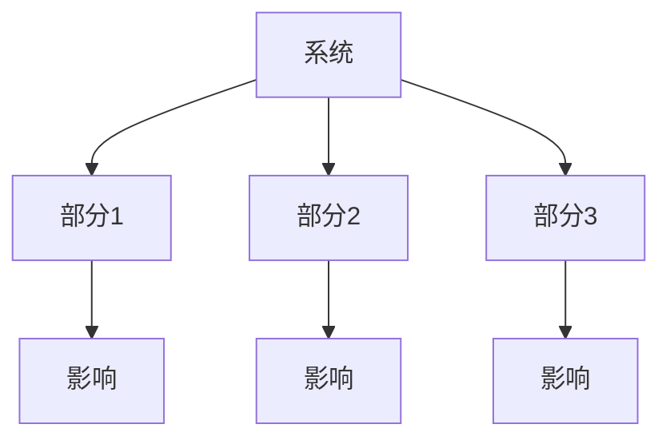

                 

# 《管理者的三大体系:思维、行动和学习》

> **关键词：** 管理者，思维体系，行动体系，学习体系，管理效能，创新能力，问题解决，团队协作

> **摘要：** 本文将深入探讨管理者在企业管理中必须掌握的三大体系：思维、行动和学习。通过逐步分析，本文揭示了如何构建正确的思考框架，制定有效的行动策略，以及持续提升个人能力。文章旨在为管理者提供实用的指导，帮助他们在复杂多变的市场环境中实现卓越的管理效能。

### 第一部分：引言

#### 1.1 管理者面临的挑战与机遇

##### 1.1.1 管理者角色的演变

在过去的几十年中，管理者的角色发生了巨大的变化。传统上，管理者被定义为指挥和控制员工的人。然而，随着全球化、数字化和自动化的发展，管理者的角色逐渐从执行者转变为战略规划者、创新推动者和变革领导者。

这种转变不仅要求管理者具备传统的管理技能，还需要他们具备前瞻性的视野和快速响应市场变化的能力。管理者不再仅仅关注如何提高生产效率和降低成本，而是需要更多地关注如何创新、创造价值以及如何应对复杂多变的环境。

##### 1.1.2 管理者的职责与任务

管理者的职责和任务因组织类型、行业和规模而异，但有一些核心的职责是普遍适用的：

1. **战略规划**：制定组织的发展方向和目标，确保组织资源的合理配置。
2. **团队建设**：招聘、培养和激励员工，建立一个高效、协作的团队。
3. **决策制定**：在复杂的环境中做出明智的决策，解决各种问题和挑战。
4. **沟通协调**：确保信息流畅，促进团队合作，提高组织效能。
5. **绩效管理**：监督和评估员工的绩效，提供反馈和支持，以实现组织目标。

##### 1.1.3 管理者的成功要素

管理者的成功不仅取决于他们的专业技能和知识，还取决于他们的思维模式、行为习惯和个人特质。以下是一些关键的要素：

1. **领导力**：能够激励和引导团队成员，创造积极的工作氛围。
2. **沟通能力**：有效地传达信息，倾听和理解他人的观点，建立信任和合作关系。
3. **创新能力**：能够发现新的机会，提出创新的解决方案，推动组织的进步。
4. **持续学习**：愿意不断学习新知识、新技能，适应快速变化的环境。
5. **情绪智能**：能够识别和管理自己的情绪，以及理解他人的情绪，提高决策和沟通的质量。

#### 1.2 管理者的三大体系概述

为了应对不断变化的环境和复杂的挑战，管理者需要掌握三大体系：思维体系、行动体系和学习体系。

##### 1.2.1 思维体系：构建正确的思考框架

思维体系是管理者的核心能力之一。它包括系统思维、创新思维和决策思维等，帮助管理者从多个角度分析问题，提出创新的解决方案，并做出明智的决策。

##### 1.2.2 行动体系：实施有效的工作策略

行动体系是管理者的实践能力。它包括目标设定、规划与执行、问题解决等，帮助管理者将思考转化为行动，实现组织的战略目标。

##### 1.2.3 学习体系：持续提升个人能力

学习体系是管理者的长期投资。它包括学习策略、实践反思和学习资源的利用等，帮助管理者不断更新知识，提升个人能力，以适应不断变化的市场环境。

### 第二部分：思维体系

#### 2.1 建立正确的思考框架

##### 2.1.1 系统思维：理解整体与部分的关系

系统思维是一种将事物视为相互关联的整体的思维方式。它强调理解系统的组成部分以及这些部分之间的相互作用关系。

**Mermaid 流程图：**

**核心原则：**

1. **整体性**：将系统视为一个整体，而不是简单地将各个部分孤立地考虑。
2. **相互作用**：理解各个部分之间的相互作用关系，以及这些关系对系统整体的影响。
3. **反馈循环**：识别系统中的反馈循环，了解这些循环如何影响系统的稳定性和发展。

**应用实例：** 在企业战略规划中，系统思维可以帮助管理者理解不同业务部门之间的相互作用，以及这些相互作用如何影响企业的整体绩效。通过系统思维，管理者可以更全面地评估企业的优势、劣势、机会和威胁，从而制定更有效的战略规划。

##### 2.1.2 创新思维：激发新观点与解决方案

创新思维是管理者在复杂多变的环境中不可或缺的能力。它包括各种方法和技巧，帮助管理者发现新的机会，提出创新的解决方案。

**核心原则：**

1. **开放性**：保持开放的心态，接受新的想法和观点。
2. **跨界思维**：跨越不同领域和学科，寻找新的灵感。
3. **试错法**：勇于尝试，从失败中学习。

**创新思维的类型与方法：**

1. **头脑风暴**：通过集体讨论，快速产生大量想法。
2. **思维导图**：使用图形化工具，组织思路，发现新的联系。
3. **模拟与建模**：通过模拟和建模，探索不同场景下的可能性。

**创新思维的实践应用：** 在产品开发过程中，创新思维可以帮助管理者发现客户未被满足的需求，提出新的产品设计方案。通过创新思维，企业可以不断推出新产品，保持竞争优势。

##### 2.1.3 决策思维：制定明智的决策策略

决策思维是管理者在面临复杂决策时的重要工具。它包括各种决策模型和策略，帮助管理者在不确定和复杂的环境中做出明智的决策。

**核心原则：**

1. **信息收集**：收集与决策相关的信息，确保决策基于充分的信息。
2. **风险评估**：评估决策的潜在风险，并制定相应的风险应对策略。
3. **决策模型**：使用决策模型，如决策树、成本效益分析等，帮助制定决策。

**决策思维的关键要素：**

1. **明确目标**：明确决策的目标，确保决策与组织的战略目标一致。
2. **收集信息**：收集与决策相关的信息，包括内部和外部信息。
3. **评估选项**：评估不同的决策选项，考虑其潜在的影响和风险。
4. **制定决策**：基于评估结果，制定最终的决策。

**决策思维的案例分析：** 在企业并购决策中，决策思维可以帮助管理者评估潜在收益和风险，制定详细的并购方案，确保并购决策的成功。

#### 2.2 提升思维能力的技巧

##### 2.2.1 逻辑思维：分析问题与解决问题的工具

逻辑思维是一种基于逻辑规则和推理方法的思维方式。它帮助管理者分析问题、制定解决方案，并在解决问题时保持清晰的思路。

**逻辑思维的基本概念：**

1. **逻辑规则**：包括命题逻辑、谓词逻辑等，用于推理和论证。
2. **推理方法**：包括演绎推理、归纳推理等，用于从已知信息推导出新信息。

**逻辑思维的常见误区：**

1. **假设性错误**：基于不合理的假设进行推理。
2. **逻辑跳跃**：在推理过程中，缺少逻辑上的联系。
3. **情感干扰**：在推理过程中，受到情感因素的影响。

**逻辑思维的应用：** 在项目管理中，逻辑思维可以帮助管理者分析项目风险、制定项目计划，并在项目执行过程中进行有效的监控和调整。

##### 2.2.2 情绪管理：掌控自己的情绪

情绪管理是管理者在应对压力和挑战时的重要技能。它包括各种方法，帮助管理者识别和管理自己的情绪，保持冷静和理智。

**情绪管理的重要性：**

1. **决策质量**：情绪稳定有助于做出更明智的决策。
2. **团队合作**：情绪稳定有助于建立良好的团队合作关系。
3. **工作绩效**：情绪稳定有助于提高工作绩效。

**情绪管理的策略与方法：**

1. **认知重构**：通过改变对事物的看法，调整情绪。
2. **放松训练**：通过深呼吸、冥想等方法，减轻压力和焦虑。
3. **积极心理**：培养积极的心态，关注生活中的积极方面。

**情绪管理的实践案例：** 在面对重大挑战时，情绪管理可以帮助管理者保持冷静，制定有效的应对策略，避免情绪化的决策。

##### 2.2.3 学习与成长：持续提升自我

学习与成长是管理者在职业生涯中持续进步的关键。它包括各种学习和成长的方法，帮助管理者不断更新知识，提升个人能力。

**学习的重要性：**

1. **适应变化**：通过学习，管理者可以更好地适应环境的变化。
2. **提高效能**：通过学习，管理者可以提升工作效率，实现更高的绩效。
3. **保持竞争力**：在快速变化的市场环境中，持续学习是保持竞争力的关键。

**学习方法与技巧：**

1. **主动学习**：积极参与学习活动，主动探索新知识。
2. **反思总结**：在学习过程中，反思和总结所学内容，巩固记忆。
3. **实践应用**：将所学知识应用于实际工作，提高实际操作能力。

**成长路径与实践：** 通过制定个人成长计划，管理者可以明确自己的学习目标，规划学习路径，并在实践中不断提升自己。

### 第三部分：行动体系

#### 3.1 制定有效的行动策略

##### 3.1.1 目标设定：明确行动方向

目标设定是管理者实施有效行动的第一步。通过明确目标和制定实现目标的具体计划，管理者可以确保行动的方向和资源得到合理配置。

**目标设定的原则与方法：**

1. **SMART原则**：目标应当是具体（Specific）、可衡量（Measurable）、可实现（Achievable）、相关（Relevant）和有时限（Time-bound）。
2. **目标分解**：将总体目标分解为具体的、可执行的任务，确保每个任务都与总体目标紧密相关。
3. **资源分配**：根据任务的重要性、复杂性和资源情况，合理分配资源，确保目标的实现。

**目标设定的案例分析：** 在企业扩展新市场时，管理者需要设定具体的市场目标，并制定详细的营销策略、销售计划和资源配置方案，以确保市场拓展的成功。

##### 3.1.2 规划与执行：确保目标实现

规划与执行是确保目标实现的关键步骤。通过制定详细的行动计划和时间表，管理者可以确保任务按时、按质完成。

**规划与执行的关系：**

1. **规划先行**：在执行任务之前，制定详细的规划和计划，明确任务的目标、方法和时间表。
2. **执行落地**：在规划的基础上，执行具体的任务，确保规划的落实和目标的实现。

**规划与执行的关键要素：**

1. **任务分解**：将大任务分解为小任务，明确每个任务的具体内容和责任人。
2. **时间管理**：制定合理的时间表，确保每个任务按时完成。
3. **监控与调整**：在执行过程中，持续监控任务的进度和质量，根据实际情况进行调整。

**规划与执行的实践：** 在项目管理中，管理者需要制定详细的进度计划，明确每个阶段的任务和时间安排，并在项目执行过程中进行定期检查和调整，确保项目按时、按质完成。

##### 3.1.3 问题解决：应对挑战与困难

在实现目标的过程中，管理者不可避免地会遇到各种挑战和困难。问题解决能力是管理者应对这些挑战的关键能力。

**问题解决的定义与流程：**

1. **定义问题**：明确问题的性质和原因，确保问题得到准确的识别。
2. **收集信息**：收集与问题相关的信息，包括内部和外部信息，为解决问题提供依据。
3. **分析问题**：对收集到的信息进行分析，找出问题的根本原因。
4. **制定方案**：基于分析结果，制定解决问题的方案。
5. **实施方案**：执行制定的解决方案，解决问题。

**问题解决的策略与方法：**

1. **头脑风暴**：通过集体讨论，快速产生多种可能的解决方案。
2. **鱼骨图**：通过鱼骨图分析，找出问题的根本原因。
3. **实验验证**：通过实验和验证，验证解决方案的有效性。

**问题解决的案例分析：** 在企业运营中，管理者需要面对各种问题，如生产瓶颈、质量事故等。通过问题解决策略，管理者可以迅速识别问题的根本原因，制定有效的解决方案，并确保问题的彻底解决。

#### 3.2 提升行动效率的技巧

##### 3.2.1 时间管理：合理安排时间

时间管理是提升行动效率的关键。通过合理安排时间，管理者可以确保将有限的时间用于最重要的任务，提高工作效率。

**时间管理的重要性：**

1. **提高效能**：合理安排时间，确保任务的优先级，提高工作效率。
2. **减少压力**：合理安排时间，避免过度工作和疲劳，减少压力和焦虑。
3. **实现目标**：合理安排时间，确保目标的实现，提高组织绩效。

**时间管理的原则与方法：**

1. **明确目标**：明确每个阶段的目标，确保时间安排与目标一致。
2. **任务优先级**：根据任务的紧急程度和重要性，确定任务的优先级。
3. **时间块管理**：将时间划分为不同的块，每个块专注于一项任务，避免任务切换造成的效率损失。
4. **定期反思**：定期反思时间管理的效果，调整时间安排，提高效率。

**时间管理的实践案例：** 在项目执行过程中，管理者需要合理安排时间，确保每个阶段的任务按时完成。通过时间管理，管理者可以确保项目的顺利进行，提高项目的成功率。

##### 3.2.2 沟通协作：搭建高效团队

沟通协作是团队高效运作的关键。通过有效的沟通协作，管理者可以确保团队目标的实现，提高团队绩效。

**沟通协作的重要性：**

1. **信息共享**：通过沟通协作，团队成员可以共享信息，提高工作效率。
2. **协同工作**：通过沟通协作，团队成员可以协同工作，实现共同目标。
3. **减少误解**：通过沟通协作，减少误解和冲突，提高团队和谐。

**沟通协作的障碍与解决方案：**

1. **信息不对称**：解决方案：建立透明、开放的信息共享机制，确保信息的及时传达。
2. **沟通不畅**：解决方案：采用多种沟通方式，如会议、邮件、即时通讯等，确保沟通的顺畅。
3. **文化差异**：解决方案：培养团队文化，提高团队成员的沟通能力和跨文化意识。

**沟通协作的实践：** 在团队项目中，管理者需要确保团队成员之间的沟通畅通，通过定期会议、工作报告等方式，了解项目的进展情况，解决沟通中的问题，确保项目的顺利进行。

##### 3.2.3 压力管理：应对工作压力

工作压力是管理者在职业生涯中不可避免的问题。通过有效的压力管理，管理者可以减轻压力，保持良好的工作状态。

**压力管理的策略与方法：**

1. **时间管理**：合理安排时间，确保工作的有序进行，减少工作压力。
2. **情绪管理**：通过情绪管理，保持冷静和理智，避免情绪化的决策。
3. **运动与休息**：定期进行体育锻炼和休息，缓解工作压力。
4. **心理调适**：通过心理咨询、自我反思等方式，调整心态，应对压力。

**压力管理的实践案例：** 在面对重大挑战时，管理者需要通过有效的压力管理，保持冷静和理智，制定有效的应对策略，确保任务的顺利完成。

### 第四部分：学习体系

#### 4.1 构建学习型组织

##### 4.1.1 学习型组织的定义与特点

学习型组织是一种能够持续学习、适应和创新的组织。它具有以下特点：

1. **学习文化**：组织内部形成浓厚的学习氛围，鼓励成员持续学习和成长。
2. **知识共享**：组织内部建立有效的知识共享机制，确保知识的传递和利用。
3. **自我超越**：组织成员不断超越自我，追求更高的目标和更优秀的表现。
4. **系统思考**：组织采用系统思维方式，理解组织的整体性和相互作用关系。

**学习型组织的优势：**

1. **提高创新能力**：通过持续学习和创新，组织可以更好地适应市场变化，提高竞争力。
2. **提高工作效率**：通过学习型组织的构建，组织可以优化工作流程，提高工作效率。
3. **增强团队凝聚力**：通过共同学习和成长，组织成员之间的信任和合作增强，团队凝聚力提高。

##### 4.1.2 学习型组织的构建方法

构建学习型组织需要从组织文化、学习机制和学习资源等方面进行综合规划和实施。

**组织文化塑造：**

1. **倡导学习理念**：将学习理念融入组织文化，鼓励成员持续学习和成长。
2. **建立学习制度**：制定学习制度，确保学习活动常态化、制度化。
3. **激励学习行为**：通过激励机制，鼓励成员积极参与学习活动，提升学习动力。

**学习机制建设：**

1. **建立知识管理系统**：通过知识管理系统，收集、整理和传递知识，确保知识的有效利用。
2. **开展学习活动**：定期组织学习活动，如培训、研讨会、读书会等，提高成员的学习兴趣和能力。
3. **建立反馈机制**：通过反馈机制，收集成员的学习反馈，及时调整学习计划和策略。

**学习资源的整合与利用：**

1. **内部资源整合**：整合组织内部的资源，如知识库、培训课程等，提高学习资源的利用效率。
2. **外部资源利用**：利用外部资源，如在线课程、专业书籍等，丰富学习内容，拓宽学习渠道。
3. **跨部门学习合作**：通过跨部门学习合作，促进知识共享和经验交流，提高整体学习效果。

##### 4.1.3 学习型组织的案例分析

**案例背景与目标：**

某大型企业意识到在快速变化的市场环境中，组织需要具备持续学习和创新能力，以应对竞争压力和业务挑战。因此，企业决定构建学习型组织，提高组织的学习能力和创新能力。

**构建过程与成效：**

1. **组织文化塑造**：企业通过倡导学习理念、建立学习制度和激励机制，营造浓厚的学习氛围，鼓励成员持续学习和成长。
2. **学习机制建设**：企业建立知识管理系统，定期组织学习活动，如培训、研讨会等，促进知识共享和经验交流。
3. **学习资源整合与利用**：企业整合内部资源，如内部知识库、培训课程等，并利用外部资源，如在线课程、专业书籍等，丰富学习内容，拓宽学习渠道。
4. **跨部门学习合作**：企业通过跨部门学习合作，促进知识共享和经验交流，提高整体学习效果。

**成效评估：**

1. **创新能力提高**：企业通过学习型组织的构建，创新能力显著提升，推出了一系列创新产品，提高了市场竞争力。
2. **工作效率提升**：企业通过学习型组织的构建，工作流程优化，工作效率显著提高。
3. **团队凝聚力增强**：企业通过学习型组织的构建，团队凝聚力显著增强，成员之间的信任和合作增强。

##### 4.1.4 启示与借鉴

通过案例的分析，我们可以得出以下启示：

1. **倡导学习理念**：将学习理念融入组织文化，鼓励成员持续学习和成长。
2. **建立学习制度**：制定学习制度，确保学习活动常态化、制度化。
3. **开展学习活动**：定期组织学习活动，提高成员的学习兴趣和能力。
4. **整合学习资源**：整合内部资源，利用外部资源，丰富学习内容，拓宽学习渠道。
5. **促进知识共享**：通过跨部门学习合作，促进知识共享和经验交流，提高整体学习效果。

#### 4.2 个人持续学习的策略与实践

##### 4.2.1 学习策略与方法

个人持续学习是管理者提升个人能力和职业发展的重要途径。以下是一些有效的学习策略和方法：

**系统化学习策略：**

1. **制定学习计划**：根据个人目标和兴趣，制定详细的学习计划，确保学习的系统性和针对性。
2. **分解学习任务**：将大任务分解为小任务，逐步完成，避免学习压力过大。
3. **定期复习**：通过定期复习，巩固所学知识，避免遗忘。

**自主学习策略：**

1. **主动寻找学习资源**：利用网络、图书馆、专业书籍等资源，主动寻找学习资料。
2. **参加在线课程**：参加各类在线课程，拓宽知识领域，提高学习效果。
3. **阅读专业文献**：阅读专业书籍、论文等，深入理解专业知识和前沿动态。

**终身学习策略：**

1. **持续更新知识**：随着行业的快速发展，管理者需要不断更新知识，适应新的技术和趋势。
2. **培养学习兴趣**：通过培养学习兴趣，提高学习的积极性和主动性。
3. **实践与反思**：将所学知识应用于实际工作，通过实践和反思，提升个人能力和职业素养。

##### 4.2.2 学习实践与反思

**学习日记与实践记录：**

1. **记录学习过程**：通过学习日记，记录每天的学习内容和进度，反思学习效果。
2. **记录实践应用**：记录将所学知识应用于实际工作的过程，总结实践经验，不断提升能力。

**学习成果的展示与分享：**

1. **展示学习成果**：通过演讲、报告等形式，展示学习成果，分享学习心得。
2. **分享经验与知识**：通过内部交流、论坛等方式，与同事分享经验和知识，促进团队学习和成长。

**学习反思与自我提升：**

1. **反思学习过程**：定期反思学习过程，分析学习中的不足和改进方向。
2. **制定改进计划**：根据反思结果，制定改进计划，不断提升个人能力和学习效果。

##### 4.2.3 学习资源的利用

**学习资源的类型与来源：**

1. **在线学习平台**：如Coursera、edX、Udemy等，提供丰富多样的在线课程。
2. **专业书籍**：如管理类书籍、技术类书籍等，提供深入的理论和实践知识。
3. **专业培训机构**：如管理培训机构、技术培训机构等，提供专业的培训课程和认证。

**学习资源的选择与评估：**

1. **选择符合需求的资源**：根据学习目标和兴趣，选择合适的资源，确保学习效果。
2. **评估资源质量**：通过阅读评价、试听课程等方式，评估资源的教学质量和实用性。

**学习资源的有效利用：**

1. **制定学习计划**：根据资源的特点，制定学习计划，确保资源的有效利用。
2. **结合实际工作**：将所学知识应用于实际工作，提高学习效果和应用能力。
3. **持续更新**：随着行业和技术的变化，持续更新学习资源，保持知识的时效性和前瞻性。

### 第五部分：综合实践

#### 5.1 管理者的角色转变与整合

##### 5.1.1 角色转变的必要性

在数字化和全球化的大背景下，管理者的角色正发生着深刻的转变。传统上，管理者被定义为决策者、指挥者和监督者。然而，随着市场环境的变化和技术的进步，管理者需要更多地扮演创新推动者、变革领导者和学习促进者等角色。

**管理者的角色定义：**

1. **创新推动者**：管理者需要具备创新意识，推动组织在产品、服务、流程和管理等方面进行创新，以适应市场变化和竞争压力。
2. **变革领导者**：管理者需要具备变革领导能力，引导组织进行战略调整和组织变革，以应对外部环境和内部需求的变化。
3. **学习促进者**：管理者需要具备学习意识，推动组织和个人持续学习和成长，以保持组织的竞争力和创新能力。

**角色转变的驱动因素：**

1. **市场环境的变化**：随着市场的快速变化和竞争的加剧，管理者需要具备更强的应变能力和创新能力，以保持组织的竞争力。
2. **技术的进步**：新技术的不断涌现和广泛应用，要求管理者具备相应的技术知识和技能，以推动组织的数字化转型和创新发展。
3. **组织内部需求**：组织内部的员工和组织文化也在不断变化，管理者需要适应这些变化，推动组织的变革和发展。

**角色转变的挑战：**

1. **知识更新速度快**：随着技术的快速发展和知识的更新，管理者需要不断学习新知识、新技能，以适应角色的转变。
2. **平衡工作与生活**：管理者在角色转变过程中，需要平衡工作与生活，避免工作压力过大，影响身心健康。
3. **团队协作与沟通**：管理者需要具备良好的团队协作和沟通能力，以推动组织的创新和变革。

##### 5.1.2 三大体系的整合实践

思维体系、行动体系和学习体系是管理者实现有效管理的重要基础。通过整合这三大体系，管理者可以更好地应对复杂多变的市场环境，实现组织的战略目标。

**思维、行动、学习的相互关联：**

1. **思维体系**：构建正确的思考框架，帮助管理者分析问题、制定决策和提出解决方案。
2. **行动体系**：将思考转化为行动，通过规划与执行，实现组织的战略目标和任务。
3. **学习体系**：持续学习和成长，为思维体系和行动体系提供知识支持和能力提升。

**三大体系的整合方法：**

1. **建立共同目标**：明确组织的共同目标，确保思维、行动和学习的一致性。
2. **搭建学习平台**：建立学习型组织，提供学习资源和学习机会，促进个人和团队的学习和成长。
3. **建立反馈机制**：通过反馈机制，收集和分析管理过程中存在的问题和不足，及时进行调整和改进。

**三大体系的综合实践案例分析：**

某科技公司通过整合思维、行动和学习体系，实现了企业的快速发展。在思维体系方面，公司鼓励员工进行创新思维训练，提高员工的创新意识和能力。在行动体系方面，公司制定了详细的行动计划和时间表，确保任务的执行和目标的实现。在学习体系方面，公司建立了学习型组织，提供丰富的学习资源和培训机会，鼓励员工持续学习和成长。

**成效评估：**

1. **创新能力提升**：公司通过创新思维训练和项目实践，创新能力显著提升，推出了一系列创新产品。
2. **工作效率提高**：通过明确的行动计划和时间管理，工作效率显著提高，项目进度和质量得到保障。
3. **团队凝聚力增强**：通过学习型组织的建设，团队成员之间的沟通和协作增强，团队凝聚力显著提升。

##### 5.1.3 管理者的角色整合与综合效能评估

管理者的角色整合是提升管理效能的关键。通过整合思维、行动和学习体系，管理者可以更好地应对复杂多变的市场环境，实现组织的战略目标。

**管理效能评估框架：**

1. **目标达成度**：评估管理者在实现组织目标方面的成效，包括战略目标、业务目标和绩效目标等。
2. **创新能力**：评估管理者的创新能力和创新成果，包括产品创新、流程创新和管理创新等。
3. **团队协作**：评估管理者的团队协作能力，包括团队凝聚力、沟通效率和协作效果等。
4. **个人发展**：评估管理者的个人发展情况，包括知识更新、能力提升和职业发展等。

**评估方法与工具：**

1. **关键绩效指标（KPI）**：通过设定关键绩效指标，量化管理者的工作成效。
2. **360度评估**：通过多角度评估，收集上级、同事、下属和客户的反馈，全面了解管理者的表现。
3. **行为观察**：通过现场观察和管理行为分析，了解管理者的实际工作表现。

**评估实践案例分析：**

某公司通过对管理者进行综合效能评估，发现了一些存在的问题，如创新能力不足、团队协作不畅等。针对这些问题，公司制定了相应的改进措施，如加强创新培训、改善沟通机制等，有效提升了管理者的综合效能。

**综合效能提升策略：**

1. **建立共同目标**：明确组织的共同目标，确保管理者的工作与组织目标一致。
2. **加强能力培养**：通过培训、学习等方式，提升管理者的专业能力和领导力。
3. **优化工作流程**：通过优化工作流程，提高管理者的工作效率和工作质量。
4. **建立激励机制**：通过激励机制，鼓励管理者积极履行职责，提升工作成效。

**长期规划：**

1. **人才储备**：通过持续培养和管理，建立人才储备库，确保组织在面临人才短缺时能够快速应对。
2. **持续改进**：通过定期评估和反馈，持续改进管理方法和流程，提升组织的整体效能。
3. **创新发展**：鼓励管理者进行创新实践，推动组织的创新发展，保持竞争优势。

#### 5.2 实际应用与效能评估

##### 5.2.1 管理效能评估框架

为了有效地评估管理者的效能，我们需要建立一套科学的评估框架。这个框架应包括以下关键绩效指标（KPI）：

1. **目标达成度**：评估管理者在实现组织目标方面的成效，包括战略目标、业务目标和绩效目标等。
   - **KPI示例**：销售额增长率、市场占有率、客户满意度等。

2. **创新能力**：评估管理者的创新能力和创新成果，包括产品创新、流程创新和管理创新等。
   - **KPI示例**：新产品数量、创新项目成功率、流程改进效果等。

3. **团队协作**：评估管理者的团队协作能力，包括团队凝聚力、沟通效率和协作效果等。
   - **KPI示例**：团队完成项目数量、团队协作满意度、沟通顺畅度等。

4. **个人发展**：评估管理者的个人发展情况，包括知识更新、能力提升和职业发展等。
   - **KPI示例**：培训参与率、专业技能证书获得数量、职业晋升率等。

**评估方法与工具：**

1. **关键绩效指标（KPI）**：通过设定关键绩效指标，量化管理者的工作成效。
   - **方法**：定期收集数据，对比预设目标，分析绩效差异。

2. **360度评估**：通过多角度评估，收集上级、同事、下属和客户的反馈，全面了解管理者的表现。
   - **工具**：评估问卷、访谈记录、反馈表格等。

3. **行为观察**：通过现场观察和管理行为分析，了解管理者的实际工作表现。
   - **工具**：观察记录、工作日志、行为分析报告等。

**评估实践案例分析：**

某科技公司通过关键绩效指标（KPI）评估管理者的效能。公司设立了销售额增长率、新产品数量和市场占有率等关键指标，并定期进行数据分析。通过360度评估，公司收集了管理层、员工和客户的反馈，全面了解管理者的表现。此外，公司通过现场观察和管理行为分析，评估管理者的工作态度和执行力。

**成效评估结果：**

1. **目标达成度**：公司销售额增长率连续两年超过市场平均水平，新产品数量显著增加，市场占有率稳步提升。
2. **创新能力**：管理者在创新项目中的表现突出，多个创新项目获得成功，推动了公司的发展。
3. **团队协作**：团队协作满意度提高，员工之间的沟通更加顺畅，协作效果显著提升。
4. **个人发展**：管理者通过参加培训和学习，知识更新和能力提升明显，职业发展路径更加清晰。

**效能提升策略：**

1. **目标设定**：为管理者设定明确、可衡量的目标，确保工作方向的一致性。
2. **能力培养**：提供培训和学习机会，帮助管理者提升专业能力和领导力。
3. **激励机制**：建立激励机制，鼓励管理者积极履行职责，提升工作成效。
4. **持续改进**：通过定期评估和反馈，持续改进管理方法和流程，提升组织的整体效能。

##### 5.2.2 管理效能提升策略

为了提升管理者的效能，需要从以下几个方面制定和实施策略：

**1. 持续学习与自我提升：**

- **学习计划**：制定个人学习计划，确保管理者能够持续更新知识和技能。
- **培训资源**：提供丰富的培训资源，如在线课程、工作坊、研讨会等，帮助管理者提升专业能力。
- **导师指导**：建立导师制度，为管理者提供指导和反馈，促进个人发展。

**2. 团队协作与沟通：**

- **沟通平台**：建立有效的沟通平台，如定期会议、即时通讯工具等，确保信息流畅。
- **团队建设活动**：组织团队建设活动，增强团队凝聚力，提高协作效率。
- **反馈机制**：建立反馈机制，鼓励团队成员之间相互反馈，促进个人和团队的发展。

**3. 激励机制与绩效管理：**

- **激励机制**：建立激励机制，如奖金、晋升机会等，鼓励管理者积极工作。
- **绩效评估**：定期进行绩效评估，明确管理者的工作表现，提供反馈和支持。
- **目标设定**：与管理者共同设定可实现的绩效目标，确保目标的实现。

**4. 创新与变革领导：**

- **创新文化**：营造创新文化，鼓励管理者提出创新想法，推动组织的创新发展。
- **变革领导**：培养管理者的变革领导能力，推动组织的变革和适应能力。
- **项目支持**：为创新项目提供必要的资源和支持，确保项目的顺利实施。

##### 5.2.3 管理效能提升的长期规划

提升管理效能是一个长期的过程，需要制定长期的规划来确保持续的提升。以下是一些长期规划的策略：

**1. 建立人才发展体系：**

- **人才储备**：建立人才储备库，为组织培养和储备关键人才。
- **职业发展路径**：明确管理者的职业发展路径，提供晋升机会和发展空间。
- **持续培养**：通过持续的培养计划，提升管理者的领导力和管理能力。

**2. 建立学习型组织：**

- **学习文化**：建立学习文化，鼓励员工持续学习和创新。
- **知识管理**：建立知识管理系统，促进知识的共享和利用。
- **学习资源**：提供丰富的学习资源，如在线课程、专业书籍、内部培训等。

**3. 优化管理流程：**

- **流程优化**：通过流程优化，提高管理效率和工作质量。
- **自动化工具**：引入自动化工具，减少重复性工作，提高工作效率。
- **敏捷管理**：采用敏捷管理方法，提高团队协作效率，快速响应市场变化。

**4. 持续改进与反馈：**

- **定期评估**：定期对管理效能进行评估，分析存在的问题，制定改进计划。
- **员工反馈**：鼓励员工提供反馈，收集员工意见和建议，改进管理方法。
- **持续改进**：通过持续改进，不断提升管理效能，适应组织发展的需求。

### 第五部分：未来管理者的发展趋势与展望

#### 5.3.1 新型管理者的特征

在数字化和全球化的大背景下，新型管理者的特征正逐渐显现。这些管理者具备以下几个关键特征：

1. **数字化素养**：新型管理者需要具备数字化素养，包括数据分析和数字化工具的应用能力，能够利用数据驱动决策。
2. **跨学科知识**：面对复杂的问题，新型管理者需要具备跨学科的知识体系，能够综合运用多种学科的知识解决问题。
3. **创新能力**：新型管理者需要具备强烈的创新能力，能够推动组织在产品、流程和管理等方面进行创新。
4. **领导力**：新型管理者需要具备卓越的领导力，能够激励和引导团队成员，实现共同目标。
5. **适应能力**：面对快速变化的环境，新型管理者需要具备较强的适应能力，能够迅速调整策略，应对不确定性。

#### 5.3.2 未来管理者的发展策略

为了适应未来管理者的需求，企业需要制定相应的发展策略：

1. **培养数字化素养**：通过培训和学习，提升管理者的数字化素养，使他们能够熟练运用数字化工具进行数据分析和决策。
2. **跨学科培养**：鼓励管理者跨学科学习，提供跨学科的知识培训，帮助他们建立更广泛的知识体系。
3. **创新培养**：建立创新培养机制，鼓励管理者进行创新实践，提供创新项目和资源支持，培养创新思维和能力。
4. **领导力培养**：通过领导力培训和实战锻炼，提升管理者的领导力，培养他们的团队协作和变革领导能力。
5. **持续发展**：建立持续发展的机制，鼓励管理者不断学习和成长，提供职业发展路径和机会。

#### 5.3.3 未来管理者的前景展望

未来管理者的前景充满机遇和挑战。随着技术的不断进步和市场的快速变化，管理者需要具备更强的适应能力和创新能力。以下是一些未来管理者的前景展望：

1. **数字化领导**：未来管理者将更多地依赖数字化工具和数据分析进行决策，数字化领导将成为管理者的核心能力。
2. **创新驱动**：创新将成为企业发展的关键驱动力，未来管理者需要具备推动创新的能力，引领企业不断前进。
3. **跨界融合**：未来管理者将面临更多的跨界挑战，需要具备跨学科的知识和技能，能够应对复杂的问题。
4. **持续学习**：未来管理者需要具备持续学习的能力，不断更新知识和技能，以适应快速变化的环境。
5. **社会责任**：未来管理者将承担更多的社会责任，需要关注企业的社会影响，推动可持续发展。

### 附录

#### 附录 A：管理工具与资源推荐

**A.1 思维工具**

1. **思维导图**：思维导图是一种图形化的思维工具，可以帮助管理者整理思路、发现联系。推荐使用工具：MindMaple、XMind。
2. **逻辑树**：逻辑树是一种用于分析问题和解构复杂概念的工具。推荐使用工具：Lucidchart、Draw.io。
3. **SWOT分析**：SWOT分析是一种用于评估企业优势、劣势、机会和威胁的工具。推荐使用工具：Excel、Google Sheets。

**A.2 行动工具**

1. **项目管理工具**：如Trello、Asana、JIRA等，用于任务分配、进度跟踪和团队协作。
2. **时间管理工具**：如Toggl、RescueTime等，用于时间管理和工作效率提升。
3. **沟通协作工具**：如Slack、Microsoft Teams、Zoom等，用于实时沟通和协作。

**A.3 学习资源**

1. **在线学习平台**：如Coursera、edX、Udemy等，提供丰富的在线课程和学习资源。
2. **专业书籍**：如《管理的实践》、《创新与企业家精神》等，提供深入的管理理论和实践经验。
3. **专业培训机构**：如哈佛商学院、沃顿商学院等，提供专业的管理培训和咨询服务。

#### 附录 B：参考文献与推荐阅读

**B.1 基础理论与研究文献**

1. **彼得·德鲁克，《管理的实践》**：介绍管理的基本原理和实践方法。
2. **彼得·圣吉，《第五项修炼》**：阐述学习型组织的概念和构建方法。
3. **马尔科姆·格拉德威尔，《引爆点》**：探讨创新扩散的机制。

**B.2 实践案例与经验分享**

1. **《谷歌如何工作》**：揭示谷歌成功的管理实践和团队文化。
2. **《亚马逊的颠覆性创新》**：分析亚马逊的创新策略和实践。
3. **《腾讯之道》**：介绍腾讯的企业文化和管理实践。

**B.3 管理前沿与趋势报告**

1. **麦肯锡，《2023年管理趋势报告》**：探讨全球管理趋势和新兴挑战。
2. **波士顿咨询公司，《数字化时代的领导力》**：分析数字化时代对领导力的要求。
3. **普华永道，《可持续发展报告》**：探讨企业在可持续发展方面的责任和实践。

